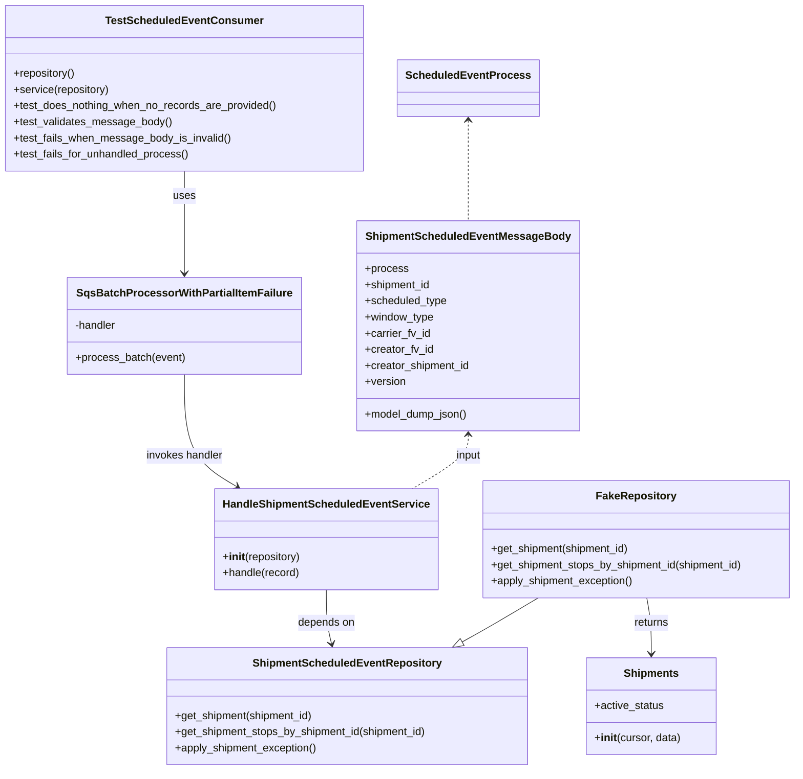
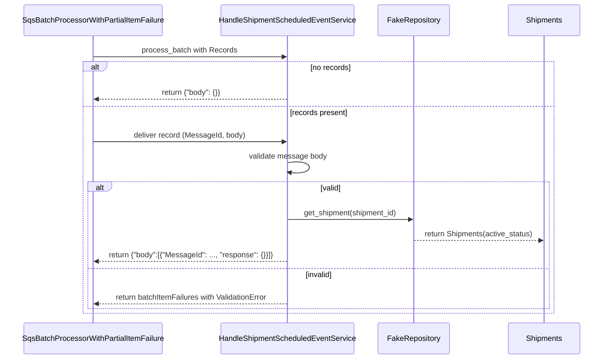

# Diagram: shipment_core/shipment_service/test/unit_tests/scheduled_event/test_scheduled_event_consumer.py

> Auto-generated by Obscura crawlers

## Diagram 1

### SVG

<svg id="container" width="1173.451171875" xmlns="http://www.w3.org/2000/svg" class="classDiagram" height="1144" viewBox="0 0 1173.451171875 1144" role="graphics-document document" aria-roledescription="class"><g><defs><marker id="container_class-aggregationStart" class="marker aggregation class" refX="18" refY="7" markerWidth="190" markerHeight="240" orient="auto"><path d="M 18,7 L9,13 L1,7 L9,1 Z"></path></marker></defs><defs><marker id="container_class-aggregationEnd" class="marker aggregation class" refX="1" refY="7" markerWidth="20" markerHeight="28" orient="auto"><path d="M 18,7 L9,13 L1,7 L9,1 Z"></path></marker></defs><defs><marker id="container_class-extensionStart" class="marker extension class" refX="18" refY="7" markerWidth="190" markerHeight="240" orient="auto"><path d="M 1,7 L18,13 V 1 Z"></path></marker></defs><defs><marker id="container_class-extensionEnd" class="marker extension class" refX="1" refY="7" markerWidth="20" markerHeight="28" orient="auto"><path d="M 1,1 V 13 L18,7 Z"></path></marker></defs><defs><marker id="container_class-compositionStart" class="marker composition class" refX="18" refY="7" markerWidth="190" markerHeight="240" orient="auto"><path d="M 18,7 L9,13 L1,7 L9,1 Z"></path></marker></defs><defs><marker id="container_class-compositionEnd" class="marker composition class" refX="1" refY="7" markerWidth="20" markerHeight="28" orient="auto"><path d="M 18,7 L9,13 L1,7 L9,1 Z"></path></marker></defs><defs><marker id="container_class-dependencyStart" class="marker dependency class" refX="6" refY="7" markerWidth="190" markerHeight="240" orient="auto"><path d="M 5,7 L9,13 L1,7 L9,1 Z"></path></marker></defs><defs><marker id="container_class-dependencyEnd" class="marker dependency class" refX="13" refY="7" markerWidth="20" markerHeight="28" orient="auto"><path d="M 18,7 L9,13 L14,7 L9,1 Z"></path></marker></defs><defs><marker id="container_class-lollipopStart" class="marker lollipop class" refX="13" refY="7" markerWidth="190" markerHeight="240" orient="auto"><circle stroke="black" fill="transparent" cx="7" cy="7" r="6"></circle></marker></defs><defs><marker id="container_class-lollipopEnd" class="marker lollipop class" refX="1" refY="7" markerWidth="190" markerHeight="240" orient="auto"><circle stroke="black" fill="transparent" cx="7" cy="7" r="6"></circle></marker></defs><g class="root"><g class="clusters"></g><g class="edgePaths"><path d="M271.371,254L271.371,260.167C271.371,266.333,271.371,278.667,271.371,304C271.371,329.333,271.371,367.667,271.371,386.833L271.371,406" id="id_TestScheduledEventConsumer_SqsBatchProcessorWithPartialItemFailure_1" class="edge-thickness-normal edge-pattern-solid relation" style=";;;" data-edge="true" data-et="edge" data-id="id_TestScheduledEventConsumer_SqsBatchProcessorWithPartialItemFailure_1" data-points="W3sieCI6MjcxLjM3MTA5Mzc1LCJ5IjoyNTR9LHsieCI6MjcxLjM3MTA5Mzc1LCJ5IjoyOTF9LHsieCI6MjcxLjM3MTA5Mzc1LCJ5Ijo0MTJ9XQ==" marker-end="url(#container_class-dependencyEnd)"></path><path d="M271.371,556L271.371,576.167C271.371,596.333,271.371,636.667,284.081,664.484C296.791,692.302,322.211,707.604,334.921,715.255L347.631,722.906" id="id_SqsBatchProcessorWithPartialItemFailure_HandleShipmentScheduledEventService_2" class="edge-thickness-normal edge-pattern-solid relation" style=";;;" data-edge="true" data-et="edge" data-id="id_SqsBatchProcessorWithPartialItemFailure_HandleShipmentScheduledEventService_2" data-points="W3sieCI6MjcxLjM3MTA5Mzc1LCJ5Ijo1NTZ9LHsieCI6MjcxLjM3MTA5Mzc1LCJ5Ijo2Nzd9LHsieCI6MzUyLjc3MjAwNDE1ODI2NjEsInkiOjcyNn1d" marker-end="url(#container_class-dependencyEnd)"></path><path d="M477.365,876L477.365,884.167C477.365,892.333,477.365,908.667,478.684,922.031C480.004,935.395,482.642,945.79,483.961,950.987L485.28,956.184" id="id_HandleShipmentScheduledEventService_ShipmentScheduledEventRepository_3" class="edge-thickness-normal edge-pattern-solid relation" style=";;;" data-edge="true" data-et="edge" data-id="id_HandleShipmentScheduledEventService_ShipmentScheduledEventRepository_3" data-points="W3sieCI6NDc3LjM2NTIzNDM3NSwieSI6ODc2fSx7IngiOjQ3Ny4zNjUyMzQzNzUsInkiOjkyNX0seyJ4Ijo0ODYuNzU2MjY4OTAxMjA5NywieSI6OTYyfV0=" marker-end="url(#container_class-dependencyEnd)"></path><path d="M789.874,888L779.572,894.167C769.271,900.333,748.668,912.667,729.966,923.585C711.265,934.502,694.465,944.005,686.065,948.756L677.665,953.507" id="id_FakeRepository_ShipmentScheduledEventRepository_4" class="edge-thickness-normal edge-pattern-solid relation" style=";;;" data-edge="true" data-et="edge" data-id="id_FakeRepository_ShipmentScheduledEventRepository_4" data-points="W3sieCI6Nzg5Ljg3MzcwODQxNzMzODgsInkiOjg4OH0seyJ4Ijo3MjguMDY0NDUzMTI1LCJ5Ijo5MjV9LHsieCI6NjYyLjY1MDA3NTYwNDgzODgsInkiOjk2Mn1d" marker-end="url(#container_class-extensionEnd)"></path><path d="M951.439,888L952.59,894.167C953.74,900.333,956.041,912.667,957.191,926.5C958.342,940.333,958.342,955.667,958.342,963.333L958.342,971" id="id_FakeRepository_Shipments_5" class="edge-thickness-normal edge-pattern-solid relation" style=";;;" data-edge="true" data-et="edge" data-id="id_FakeRepository_Shipments_5" data-points="W3sieCI6OTUxLjQzOTI2NDExMjkwMzIsInkiOjg4OH0seyJ4Ijo5NTguMzQxNzk2ODc1LCJ5Ijo5MjV9LHsieCI6OTU4LjM0MTc5Njg3NSwieSI6OTc3fV0=" marker-end="url(#container_class-dependencyEnd)"></path><path d="M683.359,646L683.359,651.167C683.359,656.333,683.359,666.667,669.793,680C656.226,693.333,629.092,709.667,615.525,717.833L601.958,726" id="id_ShipmentScheduledEventMessageBody_HandleShipmentScheduledEventService_6" class="edge-thickness-normal edge-pattern-dashed relation" style=";;;" data-edge="true" data-et="edge" data-id="id_ShipmentScheduledEventMessageBody_HandleShipmentScheduledEventService_6" data-points="W3sieCI6NjgzLjM1OTM3NSwieSI6NjQwfSx7IngiOjY4My4zNTkzNzUsInkiOjY3N30seyJ4Ijo2MDEuOTU4NDY0NTkxNzMzOSwieSI6NzI2fV0=" marker-start="url(#container_class-dependencyStart)"></path><path d="M683.359,179L683.359,197.667C683.359,216.333,683.359,253.667,683.359,278.5C683.359,303.333,683.359,315.667,683.359,321.833L683.359,328" id="id_ScheduledEventProcess_ShipmentScheduledEventMessageBody_7" class="edge-thickness-normal edge-pattern-dashed relation" style=";;;" data-edge="true" data-et="edge" data-id="id_ScheduledEventProcess_ShipmentScheduledEventMessageBody_7" data-points="W3sieCI6NjgzLjM1OTM3NSwieSI6MTczfSx7IngiOjY4My4zNTkzNzUsInkiOjI5MX0seyJ4Ijo2ODMuMzU5Mzc1LCJ5IjozMjh9XQ==" marker-start="url(#container_class-dependencyStart)"></path></g><g class="edgeLabels"><g class="edgeLabel" transform="translate(271.37109375, 291)"><g class="label" data-id="id_TestScheduledEventConsumer_SqsBatchProcessorWithPartialItemFailure_1" transform="translate(-16.4921875, -12)"><foreignObject width="32.984375" height="24">

uses

</foreignObject></g></g><g class="edgeLabel" transform="translate(271.37109375, 677)"><g class="label" data-id="id_SqsBatchProcessorWithPartialItemFailure_HandleShipmentScheduledEventService_2" transform="translate(-57.96875, -12)"><foreignObject width="115.9375" height="24">

invokes handler

</foreignObject></g></g><g class="edgeLabel" transform="translate(477.365234375, 925)"><g class="label" data-id="id_HandleShipmentScheduledEventService_ShipmentScheduledEventRepository_3" transform="translate(-42.9453125, -12)"><foreignObject width="85.890625" height="24">

depends on

</foreignObject></g></g><g class="edgeLabel"><g class="label" data-id="id_FakeRepository_ShipmentScheduledEventRepository_4" transform="translate(0, 0)"><foreignObject width="0" height="0">

</foreignObject></g></g><g class="edgeLabel" transform="translate(958.341796875, 925)"><g class="label" data-id="id_FakeRepository_Shipments_5" transform="translate(-26.265625, -12)"><foreignObject width="52.53125" height="24">

returns

</foreignObject></g></g><g class="edgeLabel" transform="translate(683.359375, 677)"><g class="label" data-id="id_ShipmentScheduledEventMessageBody_HandleShipmentScheduledEventService_6" transform="translate(-19.2421875, -12)"><foreignObject width="38.484375" height="24">

input

</foreignObject></g></g><g class="edgeLabel"><g class="label" data-id="id_ScheduledEventProcess_ShipmentScheduledEventMessageBody_7" transform="translate(0, 0)"><foreignObject width="0" height="0">

</foreignObject></g></g></g><g class="nodes"><g class="node default" id="classId-TestScheduledEventConsumer-0" transform="translate(271.37109375, 131)"><g class="basic label-container"><path d="M-263.37109375 -123 L263.37109375 -123 L263.37109375 123 L-263.37109375 123" stroke="none" stroke-width="0" fill="#ECECFF" style=""></path><path d="M-263.37109375 -123 C-142.47089364621854 -123, -21.570693542437056 -123, 263.37109375 -123 M-263.37109375 -123 C-60.46356510284488 -123, 142.44396354431024 -123, 263.37109375 -123 M263.37109375 -123 C263.37109375 -49.72779097266155, 263.37109375 23.544418054676896, 263.37109375 123 M263.37109375 -123 C263.37109375 -32.59813583192687, 263.37109375 57.803728336146264, 263.37109375 123 M263.37109375 123 C153.7342521962721 123, 44.09741064254425 123, -263.37109375 123 M263.37109375 123 C119.41740263091862 123, -24.536288488162768 123, -263.37109375 123 M-263.37109375 123 C-263.37109375 52.3036196797688, -263.37109375 -18.3927606404624, -263.37109375 -123 M-263.37109375 123 C-263.37109375 50.28373465957459, -263.37109375 -22.432530680850817, -263.37109375 -123" stroke="#9370DB" stroke-width="1.3" fill="none" stroke-dasharray="0 0" style=""></path></g><g class="annotation-group text" transform="translate(0, -99)"></g><g class="label-group text" transform="translate(-110.3828125, -99)"><g class="label" style="font-weight: bolder" transform="translate(0,-12)"><foreignObject width="220.765625" height="24">

TestScheduledEventConsumer

</foreignObject></g></g><g class="members-group text" transform="translate(-251.37109375, -51)"></g><g class="methods-group text" transform="translate(-251.37109375, -21)"><g class="label" style="" transform="translate(0,-12)"><foreignObject width="92.53125" height="24">

+repository()

</foreignObject></g><g class="label" style="" transform="translate(0,12)"><foreignObject width="143.34375" height="24">

+service(repository)

</foreignObject></g><g class="label" style="" transform="translate(0,36)"><foreignObject width="392.359375" height="24">

+test_does_nothing_when_no_records_are_provided()

</foreignObject></g><g class="label" style="" transform="translate(0,60)"><foreignObject width="233.65625" height="24">

+test_validates_message_body()

</foreignObject></g><g class="label" style="" transform="translate(0,84)"><foreignObject width="322.3125" height="24">

+test_fails_when_message_body_is_invalid()

</foreignObject></g><g class="label" style="" transform="translate(0,108)"><foreignObject width="261.59375" height="24">

+test_fails_for_unhandled_process()

</foreignObject></g></g><g class="divider" style=""><path d="M-263.37109375 -75 C-100.28475410339851 -75, 62.801585543202975 -75, 263.37109375 -75 M-263.37109375 -75 C-83.32856178471724 -75, 96.71397018056552 -75, 263.37109375 -75" stroke="#9370DB" stroke-width="1.3" fill="none" stroke-dasharray="0 0" style=""></path></g><g class="divider" style=""><path d="M-263.37109375 -51 C-81.37971478205472 -51, 100.61166418589056 -51, 263.37109375 -51 M-263.37109375 -51 C-130.51273628941914 -51, 2.3456211711617243 -51, 263.37109375 -51" stroke="#9370DB" stroke-width="1.3" fill="none" stroke-dasharray="0 0" style=""></path></g></g><g class="node default" id="classId-SqsBatchProcessorWithPartialItemFailure-1" transform="translate(271.37109375, 484)"><g class="basic label-container"><path d="M-169.078125 -72 L169.078125 -72 L169.078125 72 L-169.078125 72" stroke="none" stroke-width="0" fill="#ECECFF" style=""></path><path d="M-169.078125 -72 C-65.94769291761752 -72, 37.18273916476497 -72, 169.078125 -72 M-169.078125 -72 C-56.90961621740797 -72, 55.258892565184055 -72, 169.078125 -72 M169.078125 -72 C169.078125 -15.981166216022828, 169.078125 40.037667567954344, 169.078125 72 M169.078125 -72 C169.078125 -18.970431469692727, 169.078125 34.059137060614546, 169.078125 72 M169.078125 72 C44.16659169667574 72, -80.74494160664852 72, -169.078125 72 M169.078125 72 C69.52876093938964 72, -30.020603121220717 72, -169.078125 72 M-169.078125 72 C-169.078125 30.046992579113613, -169.078125 -11.906014841772773, -169.078125 -72 M-169.078125 72 C-169.078125 21.651859246747833, -169.078125 -28.696281506504334, -169.078125 -72" stroke="#9370DB" stroke-width="1.3" fill="none" stroke-dasharray="0 0" style=""></path></g><g class="annotation-group text" transform="translate(0, -48)"></g><g class="label-group text" transform="translate(-151.46875, -48)"><g class="label" style="font-weight: bolder" transform="translate(0,-12)"><foreignObject width="302.9375" height="24">

SqsBatchProcessorWithPartialItemFailure

</foreignObject></g></g><g class="members-group text" transform="translate(-157.078125, 0)"><g class="label" style="" transform="translate(0,-12)"><foreignObject width="62.984375" height="24">

-handler

</foreignObject></g></g><g class="methods-group text" transform="translate(-157.078125, 48)"><g class="label" style="" transform="translate(0,-12)"><foreignObject width="162.6875" height="24">

+process_batch(event)

</foreignObject></g></g><g class="divider" style=""><path d="M-169.078125 -24 C-97.67309753743636 -24, -26.268070074872725 -24, 169.078125 -24 M-169.078125 -24 C-56.848359815374764 -24, 55.38140536925047 -24, 169.078125 -24" stroke="#9370DB" stroke-width="1.3" fill="none" stroke-dasharray="0 0" style=""></path></g><g class="divider" style=""><path d="M-169.078125 24 C-76.13607963355058 24, 16.80596573289884 24, 169.078125 24 M-169.078125 24 C-61.38445257656629 24, 46.30921984686742 24, 169.078125 24" stroke="#9370DB" stroke-width="1.3" fill="none" stroke-dasharray="0 0" style=""></path></g></g><g class="node default" id="classId-HandleShipmentScheduledEventService-2" transform="translate(477.365234375, 801)"><g class="basic label-container"><path d="M-158.2109375 -75 L158.2109375 -75 L158.2109375 75 L-158.2109375 75" stroke="none" stroke-width="0" fill="#ECECFF" style=""></path><path d="M-158.2109375 -75 C-72.31501163604436 -75, 13.58091422791128 -75, 158.2109375 -75 M-158.2109375 -75 C-91.83048551232146 -75, -25.45003352464292 -75, 158.2109375 -75 M158.2109375 -75 C158.2109375 -26.605761827384583, 158.2109375 21.788476345230833, 158.2109375 75 M158.2109375 -75 C158.2109375 -28.199278949889795, 158.2109375 18.60144210022041, 158.2109375 75 M158.2109375 75 C75.99245011021739 75, -6.226037279565219 75, -158.2109375 75 M158.2109375 75 C55.98680718978386 75, -46.23732312043228 75, -158.2109375 75 M-158.2109375 75 C-158.2109375 17.004972395018385, -158.2109375 -40.99005520996323, -158.2109375 -75 M-158.2109375 75 C-158.2109375 41.55388474557151, -158.2109375 8.107769491143017, -158.2109375 -75" stroke="#9370DB" stroke-width="1.3" fill="none" stroke-dasharray="0 0" style=""></path></g><g class="annotation-group text" transform="translate(0, -51)"></g><g class="label-group text" transform="translate(-146.2109375, -51)"><g class="label" style="font-weight: bolder" transform="translate(0,-12)"><foreignObject width="292.421875" height="24">

HandleShipmentScheduledEventService

</foreignObject></g></g><g class="members-group text" transform="translate(-146.2109375, -3)"></g><g class="methods-group text" transform="translate(-146.2109375, 27)"><g class="label" style="" transform="translate(0,-12)"><foreignObject width="116.96875" height="24">

+<strong>init</strong>(repository)

</foreignObject></g><g class="label" style="" transform="translate(0,12)"><foreignObject width="115.0625" height="24">

+handle(record)

</foreignObject></g></g><g class="divider" style=""><path d="M-158.2109375 -27 C-41.24776936572363 -27, 75.71539876855275 -27, 158.2109375 -27 M-158.2109375 -27 C-44.1774334033864 -27, 69.8560706932272 -27, 158.2109375 -27" stroke="#9370DB" stroke-width="1.3" fill="none" stroke-dasharray="0 0" style=""></path></g><g class="divider" style=""><path d="M-158.2109375 -3 C-71.32835350810096 -3, 15.55423048379808 -3, 158.2109375 -3 M-158.2109375 -3 C-71.93532858210618 -3, 14.34028033578764 -3, 158.2109375 -3" stroke="#9370DB" stroke-width="1.3" fill="none" stroke-dasharray="0 0" style=""></path></g></g><g class="node default" id="classId-ShipmentScheduledEventRepository-3" transform="translate(508.837890625, 1049)"><g class="basic label-container"><path d="M-268.8203125 -87 L268.8203125 -87 L268.8203125 87 L-268.8203125 87" stroke="none" stroke-width="0" fill="#ECECFF" style=""></path><path d="M-268.8203125 -87 C-57.24275606397961 -87, 154.33480037204077 -87, 268.8203125 -87 M-268.8203125 -87 C-118.84136706074761 -87, 31.13757837850477 -87, 268.8203125 -87 M268.8203125 -87 C268.8203125 -21.42191551128184, 268.8203125 44.15616897743632, 268.8203125 87 M268.8203125 -87 C268.8203125 -24.038978884935275, 268.8203125 38.92204223012945, 268.8203125 87 M268.8203125 87 C94.54554219999795 87, -79.7292281000041 87, -268.8203125 87 M268.8203125 87 C63.27155586209733 87, -142.27720077580534 87, -268.8203125 87 M-268.8203125 87 C-268.8203125 36.08794967504625, -268.8203125 -14.824100649907507, -268.8203125 -87 M-268.8203125 87 C-268.8203125 35.657084837041275, -268.8203125 -15.68583032591745, -268.8203125 -87" stroke="#9370DB" stroke-width="1.3" fill="none" stroke-dasharray="0 0" style=""></path></g><g class="annotation-group text" transform="translate(0, -63)"></g><g class="label-group text" transform="translate(-133.453125, -63)"><g class="label" style="font-weight: bolder" transform="translate(0,-12)"><foreignObject width="266.90625" height="24">

ShipmentScheduledEventRepository

</foreignObject></g></g><g class="members-group text" transform="translate(-256.8203125, -15)"></g><g class="methods-group text" transform="translate(-256.8203125, 15)"><g class="label" style="" transform="translate(0,-12)"><foreignObject width="208.53125" height="24">

+get_shipment(shipment_id)

</foreignObject></g><g class="label" style="" transform="translate(0,12)"><foreignObject width="380.1875" height="24">

+get_shipment_stops_by_shipment_id(shipment_id)

</foreignObject></g><g class="label" style="" transform="translate(0,36)"><foreignObject width="213.265625" height="24">

+apply_shipment_exception()

</foreignObject></g></g><g class="divider" style=""><path d="M-268.8203125 -39 C-72.31830425426435 -39, 124.1837039914713 -39, 268.8203125 -39 M-268.8203125 -39 C-117.73144078910713 -39, 33.35743092178575 -39, 268.8203125 -39" stroke="#9370DB" stroke-width="1.3" fill="none" stroke-dasharray="0 0" style=""></path></g><g class="divider" style=""><path d="M-268.8203125 -15 C-111.5445117600184 -15, 45.73128897996321 -15, 268.8203125 -15 M-268.8203125 -15 C-126.7110161783828 -15, 15.398280143234388 -15, 268.8203125 -15" stroke="#9370DB" stroke-width="1.3" fill="none" stroke-dasharray="0 0" style=""></path></g></g><g class="node default" id="classId-FakeRepository-4" transform="translate(935.208984375, 801)"><g class="basic label-container"><path d="M-230.2421875 -87 L230.2421875 -87 L230.2421875 87 L-230.2421875 87" stroke="none" stroke-width="0" fill="#ECECFF" style=""></path><path d="M-230.2421875 -87 C-74.63392971858633 -87, 80.97432806282734 -87, 230.2421875 -87 M-230.2421875 -87 C-49.850920392656576 -87, 130.54034671468685 -87, 230.2421875 -87 M230.2421875 -87 C230.2421875 -36.332984423965705, 230.2421875 14.33403115206859, 230.2421875 87 M230.2421875 -87 C230.2421875 -31.903162509710725, 230.2421875 23.19367498057855, 230.2421875 87 M230.2421875 87 C60.612847664049696 87, -109.01649217190061 87, -230.2421875 87 M230.2421875 87 C48.39262682394272 87, -133.45693385211456 87, -230.2421875 87 M-230.2421875 87 C-230.2421875 48.905987245399785, -230.2421875 10.811974490799571, -230.2421875 -87 M-230.2421875 87 C-230.2421875 34.54511809743772, -230.2421875 -17.909763805124555, -230.2421875 -87" stroke="#9370DB" stroke-width="1.3" fill="none" stroke-dasharray="0 0" style=""></path></g><g class="annotation-group text" transform="translate(0, -63)"></g><g class="label-group text" transform="translate(-56.296875, -63)"><g class="label" style="font-weight: bolder" transform="translate(0,-12)"><foreignObject width="112.59375" height="24">

FakeRepository

</foreignObject></g></g><g class="members-group text" transform="translate(-218.2421875, -15)"></g><g class="methods-group text" transform="translate(-218.2421875, 15)"><g class="label" style="" transform="translate(0,-12)"><foreignObject width="208.53125" height="24">

+get_shipment(shipment_id)

</foreignObject></g><g class="label" style="" transform="translate(0,12)"><foreignObject width="380.1875" height="24">

+get_shipment_stops_by_shipment_id(shipment_id)

</foreignObject></g><g class="label" style="" transform="translate(0,36)"><foreignObject width="213.265625" height="24">

+apply_shipment_exception()

</foreignObject></g></g><g class="divider" style=""><path d="M-230.2421875 -39 C-117.79122513628512 -39, -5.340262772570242 -39, 230.2421875 -39 M-230.2421875 -39 C-65.05524715402976 -39, 100.13169319194049 -39, 230.2421875 -39" stroke="#9370DB" stroke-width="1.3" fill="none" stroke-dasharray="0 0" style=""></path></g><g class="divider" style=""><path d="M-230.2421875 -15 C-118.81826245276433 -15, -7.39433740552866 -15, 230.2421875 -15 M-230.2421875 -15 C-51.75790309464219 -15, 126.72638131071562 -15, 230.2421875 -15" stroke="#9370DB" stroke-width="1.3" fill="none" stroke-dasharray="0 0" style=""></path></g></g><g class="node default" id="classId-ShipmentScheduledEventMessageBody-5" transform="translate(683.359375, 484)"><g class="basic label-container"><path d="M-162.515625 -156 L162.515625 -156 L162.515625 156 L-162.515625 156" stroke="none" stroke-width="0" fill="#ECECFF" style=""></path><path d="M-162.515625 -156 C-76.09986261667254 -156, 10.315899766654923 -156, 162.515625 -156 M-162.515625 -156 C-50.6503473082787 -156, 61.214930383442606 -156, 162.515625 -156 M162.515625 -156 C162.515625 -68.34319015407092, 162.515625 19.31361969185815, 162.515625 156 M162.515625 -156 C162.515625 -77.88735751034844, 162.515625 0.22528497930312597, 162.515625 156 M162.515625 156 C55.522394210924006 156, -51.47083657815199 156, -162.515625 156 M162.515625 156 C35.345937931655655 156, -91.82374913668869 156, -162.515625 156 M-162.515625 156 C-162.515625 76.22313237421928, -162.515625 -3.5537352515614486, -162.515625 -156 M-162.515625 156 C-162.515625 67.79135826595453, -162.515625 -20.417283468090943, -162.515625 -156" stroke="#9370DB" stroke-width="1.3" fill="none" stroke-dasharray="0 0" style=""></path></g><g class="annotation-group text" transform="translate(0, -132)"></g><g class="label-group text" transform="translate(-143.484375, -132)"><g class="label" style="font-weight: bolder" transform="translate(0,-12)"><foreignObject width="286.96875" height="24">

ShipmentScheduledEventMessageBody

</foreignObject></g></g><g class="members-group text" transform="translate(-150.515625, -84)"><g class="label" style="" transform="translate(0,-12)"><foreignObject width="63.375" height="24">

+process

</foreignObject></g><g class="label" style="" transform="translate(0,12)"><foreignObject width="98.84375" height="24">

+shipment_id

</foreignObject></g><g class="label" style="" transform="translate(0,36)"><foreignObject width="122.78125" height="24">

+scheduled_type

</foreignObject></g><g class="label" style="" transform="translate(0,60)"><foreignObject width="103.203125" height="24">

+window_type

</foreignObject></g><g class="label" style="" transform="translate(0,84)"><foreignObject width="97.8125" height="24">

+carrier_fv_id

</foreignObject></g><g class="label" style="" transform="translate(0,108)"><foreignObject width="101.53125" height="24">

+creator_fv_id

</foreignObject></g><g class="label" style="" transform="translate(0,132)"><foreignObject width="157.546875" height="24">

+creator_shipment_id

</foreignObject></g><g class="label" style="" transform="translate(0,156)"><foreignObject width="61" height="24">

+version

</foreignObject></g></g><g class="methods-group text" transform="translate(-150.515625, 132)"><g class="label" style="" transform="translate(0,-12)"><foreignObject width="153.734375" height="24">

+model_dump_json()

</foreignObject></g></g><g class="divider" style=""><path d="M-162.515625 -108 C-36.49325379104455 -108, 89.5291174179109 -108, 162.515625 -108 M-162.515625 -108 C-40.317762772093644 -108, 81.88009945581271 -108, 162.515625 -108" stroke="#9370DB" stroke-width="1.3" fill="none" stroke-dasharray="0 0" style=""></path></g><g class="divider" style=""><path d="M-162.515625 108 C-83.58744222176084 108, -4.659259443521677 108, 162.515625 108 M-162.515625 108 C-43.663974127198 108, 75.187676745604 108, 162.515625 108" stroke="#9370DB" stroke-width="1.3" fill="none" stroke-dasharray="0 0" style=""></path></g></g><g class="node default" id="classId-Shipments-6" transform="translate(958.341796875, 1049)"><g class="basic label-container"><path d="M-95.46875 -72 L95.46875 -72 L95.46875 72 L-95.46875 72" stroke="none" stroke-width="0" fill="#ECECFF" style=""></path><path d="M-95.46875 -72 C-24.660375377094454 -72, 46.14799924581109 -72, 95.46875 -72 M-95.46875 -72 C-55.77188705347145 -72, -16.075024106942905 -72, 95.46875 -72 M95.46875 -72 C95.46875 -32.850300111886874, 95.46875 6.299399776226252, 95.46875 72 M95.46875 -72 C95.46875 -37.82789577337456, 95.46875 -3.655791546749114, 95.46875 72 M95.46875 72 C45.55631513645681 72, -4.35611972708638 72, -95.46875 72 M95.46875 72 C55.332255189201085 72, 15.19576037840217 72, -95.46875 72 M-95.46875 72 C-95.46875 21.905599545334375, -95.46875 -28.18880090933125, -95.46875 -72 M-95.46875 72 C-95.46875 20.662872976506108, -95.46875 -30.674254046987784, -95.46875 -72" stroke="#9370DB" stroke-width="1.3" fill="none" stroke-dasharray="0 0" style=""></path></g><g class="annotation-group text" transform="translate(0, -48)"></g><g class="label-group text" transform="translate(-38.96875, -48)"><g class="label" style="font-weight: bolder" transform="translate(0,-12)"><foreignObject width="77.9375" height="24">

Shipments

</foreignObject></g></g><g class="members-group text" transform="translate(-83.46875, 0)"><g class="label" style="" transform="translate(0,-12)"><foreignObject width="103.3125" height="24">

+active_status

</foreignObject></g></g><g class="methods-group text" transform="translate(-83.46875, 48)"><g class="label" style="" transform="translate(0,-12)"><foreignObject width="127.96875" height="24">

+<strong>init</strong>(cursor, data)

</foreignObject></g></g><g class="divider" style=""><path d="M-95.46875 -24 C-38.36693455560211 -24, 18.734880888795786 -24, 95.46875 -24 M-95.46875 -24 C-39.23498660669817 -24, 16.998776786603656 -24, 95.46875 -24" stroke="#9370DB" stroke-width="1.3" fill="none" stroke-dasharray="0 0" style=""></path></g><g class="divider" style=""><path d="M-95.46875 24 C-42.91536693648248 24, 9.638016127035044 24, 95.46875 24 M-95.46875 24 C-46.85729591364633 24, 1.754158172707335 24, 95.46875 24" stroke="#9370DB" stroke-width="1.3" fill="none" stroke-dasharray="0 0" style=""></path></g></g><g class="node default" id="classId-ScheduledEventProcess-7" transform="translate(683.359375, 131)"><g class="basic label-container"><path d="M-98.6171875 -42 L98.6171875 -42 L98.6171875 42 L-98.6171875 42" stroke="none" stroke-width="0" fill="#ECECFF" style=""></path><path d="M-98.6171875 -42 C-22.505276753755282 -42, 53.606633992489435 -42, 98.6171875 -42 M-98.6171875 -42 C-33.38951011037487 -42, 31.838167279250257 -42, 98.6171875 -42 M98.6171875 -42 C98.6171875 -15.089108757362279, 98.6171875 11.821782485275442, 98.6171875 42 M98.6171875 -42 C98.6171875 -17.32317920969509, 98.6171875 7.353641580609818, 98.6171875 42 M98.6171875 42 C20.72096606660442 42, -57.17525536679116 42, -98.6171875 42 M98.6171875 42 C33.99950105602325 42, -30.618185387953503 42, -98.6171875 42 M-98.6171875 42 C-98.6171875 15.492768575639246, -98.6171875 -11.014462848721507, -98.6171875 -42 M-98.6171875 42 C-98.6171875 14.332475156091434, -98.6171875 -13.335049687817133, -98.6171875 -42" stroke="#9370DB" stroke-width="1.3" fill="none" stroke-dasharray="0 0" style=""></path></g><g class="annotation-group text" transform="translate(0, -18)"></g><g class="label-group text" transform="translate(-86.6171875, -18)"><g class="label" style="font-weight: bolder" transform="translate(0,-12)"><foreignObject width="173.234375" height="24">

ScheduledEventProcess

</foreignObject></g></g><g class="members-group text" transform="translate(-86.6171875, 30)"></g><g class="methods-group text" transform="translate(-86.6171875, 60)"></g><g class="divider" style=""><path d="M-98.6171875 6 C-42.82345337334039 6, 12.970280753319216 6, 98.6171875 6 M-98.6171875 6 C-25.65348400446277 6, 47.31021949107446 6, 98.6171875 6" stroke="#9370DB" stroke-width="1.3" fill="none" stroke-dasharray="0 0" style=""></path></g><g class="divider" style=""><path d="M-98.6171875 24 C-25.922699371012087 24, 46.77178875797583 24, 98.6171875 24 M-98.6171875 24 C-52.78610637491481 24, -6.9550252498296175 24, 98.6171875 24" stroke="#9370DB" stroke-width="1.3" fill="none" stroke-dasharray="0 0" style=""></path></g></g></g></g></g></svg>

## Diagram 2

### SVG

<svg id="container" width="1333" xmlns="http://www.w3.org/2000/svg" height="785" viewBox="-50 -10 1333 785" role="graphics-document document" aria-roledescription="sequence"><g><rect x="1083" y="699" fill="#eaeaea" stroke="#666" width="150" height="65" name="DB" rx="3" ry="3" class="actor actor-bottom"></rect><text x="1158" y="731.5" dominant-baseline="central" alignment-baseline="central" class="actor actor-box" style="text-anchor: middle; font-size: 16px; font-weight: 400;"><tspan x="1158" dy="0">Shipments</tspan></text></g><g><rect x="781" y="699" fill="#eaeaea" stroke="#666" width="150" height="65" name="Repo" rx="3" ry="3" class="actor actor-bottom"></rect><text x="856" y="731.5" dominant-baseline="central" alignment-baseline="central" class="actor actor-box" style="text-anchor: middle; font-size: 16px; font-weight: 400;"><tspan x="856" dy="0">FakeRepository</tspan></text></g><g><rect x="421" y="699" fill="#eaeaea" stroke="#666" width="310" height="65" name="Handler" rx="3" ry="3" class="actor actor-bottom"></rect><text x="576" y="731.5" dominant-baseline="central" alignment-baseline="central" class="actor actor-box" style="text-anchor: middle; font-size: 16px; font-weight: 400;"><tspan x="576" dy="0">HandleShipmentScheduledEventService</tspan></text></g><g><rect x="0" y="699" fill="#eaeaea" stroke="#666" width="318" height="65" name="SQS" rx="3" ry="3" class="actor actor-bottom"></rect><text x="159" y="731.5" dominant-baseline="central" alignment-baseline="central" class="actor actor-box" style="text-anchor: middle; font-size: 16px; font-weight: 400;"><tspan x="159" dy="0">SqsBatchProcessorWithPartialItemFailure</tspan></text></g><g><line id="actor3" x1="1158" y1="65" x2="1158" y2="699" class="actor-line 200" stroke-width="0.5px" stroke="#999" name="DB"></line><g id="root-3"><rect x="1083" y="0" fill="#eaeaea" stroke="#666" width="150" height="65" name="DB" rx="3" ry="3" class="actor actor-top"></rect><text x="1158" y="32.5" dominant-baseline="central" alignment-baseline="central" class="actor actor-box" style="text-anchor: middle; font-size: 16px; font-weight: 400;"><tspan x="1158" dy="0">Shipments</tspan></text></g></g><g><line id="actor2" x1="856" y1="65" x2="856" y2="699" class="actor-line 200" stroke-width="0.5px" stroke="#999" name="Repo"></line><g id="root-2"><rect x="781" y="0" fill="#eaeaea" stroke="#666" width="150" height="65" name="Repo" rx="3" ry="3" class="actor actor-top"></rect><text x="856" y="32.5" dominant-baseline="central" alignment-baseline="central" class="actor actor-box" style="text-anchor: middle; font-size: 16px; font-weight: 400;"><tspan x="856" dy="0">FakeRepository</tspan></text></g></g><g><line id="actor1" x1="576" y1="65" x2="576" y2="699" class="actor-line 200" stroke-width="0.5px" stroke="#999" name="Handler"></line><g id="root-1"><rect x="421" y="0" fill="#eaeaea" stroke="#666" width="310" height="65" name="Handler" rx="3" ry="3" class="actor actor-top"></rect><text x="576" y="32.5" dominant-baseline="central" alignment-baseline="central" class="actor actor-box" style="text-anchor: middle; font-size: 16px; font-weight: 400;"><tspan x="576" dy="0">HandleShipmentScheduledEventService</tspan></text></g></g><g><line id="actor0" x1="159" y1="65" x2="159" y2="699" class="actor-line 200" stroke-width="0.5px" stroke="#999" name="SQS"></line><g id="root-0"><rect x="0" y="0" fill="#eaeaea" stroke="#666" width="318" height="65" name="SQS" rx="3" ry="3" class="actor actor-top"></rect><text x="159" y="32.5" dominant-baseline="central" alignment-baseline="central" class="actor actor-box" style="text-anchor: middle; font-size: 16px; font-weight: 400;"><tspan x="159" dy="0">SqsBatchProcessorWithPartialItemFailure</tspan></text></g></g><g></g><defs><symbol id="computer" width="24" height="24"><path transform="scale(.5)" d="M2 2v13h20v-13h-20zm18 11h-16v-9h16v9zm-10.228 6l.466-1h3.524l.467 1h-4.457zm14.228 3h-24l2-6h2.104l-1.33 4h18.45l-1.297-4h2.073l2 6zm-5-10h-14v-7h14v7z"></path></symbol></defs><defs><symbol id="database" fill-rule="evenodd" clip-rule="evenodd"><path transform="scale(.5)" d="M12.258.001l.256.004.255.005.253.008.251.01.249.012.247.015.246.016.242.019.241.02.239.023.236.024.233.027.231.028.229.031.225.032.223.034.22.036.217.038.214.04.211.041.208.043.205.045.201.046.198.048.194.05.191.051.187.053.183.054.18.056.175.057.172.059.168.06.163.061.16.063.155.064.15.066.074.033.073.033.071.034.07.034.069.035.068.035.067.035.066.035.064.036.064.036.062.036.06.036.06.037.058.037.058.037.055.038.055.038.053.038.052.038.051.039.05.039.048.039.047.039.045.04.044.04.043.04.041.04.04.041.039.041.037.041.036.041.034.041.033.042.032.042.03.042.029.042.027.042.026.043.024.043.023.043.021.043.02.043.018.044.017.043.015.044.013.044.012.044.011.045.009.044.007.045.006.045.004.045.002.045.001.045v17l-.001.045-.002.045-.004.045-.006.045-.007.045-.009.044-.011.045-.012.044-.013.044-.015.044-.017.043-.018.044-.02.043-.021.043-.023.043-.024.043-.026.043-.027.042-.029.042-.03.042-.032.042-.033.042-.034.041-.036.041-.037.041-.039.041-.04.041-.041.04-.043.04-.044.04-.045.04-.047.039-.048.039-.05.039-.051.039-.052.038-.053.038-.055.038-.055.038-.058.037-.058.037-.06.037-.06.036-.062.036-.064.036-.064.036-.066.035-.067.035-.068.035-.069.035-.07.034-.071.034-.073.033-.074.033-.15.066-.155.064-.16.063-.163.061-.168.06-.172.059-.175.057-.18.056-.183.054-.187.053-.191.051-.194.05-.198.048-.201.046-.205.045-.208.043-.211.041-.214.04-.217.038-.22.036-.223.034-.225.032-.229.031-.231.028-.233.027-.236.024-.239.023-.241.02-.242.019-.246.016-.247.015-.249.012-.251.01-.253.008-.255.005-.256.004-.258.001-.258-.001-.256-.004-.255-.005-.253-.008-.251-.01-.249-.012-.247-.015-.245-.016-.243-.019-.241-.02-.238-.023-.236-.024-.234-.027-.231-.028-.228-.031-.226-.032-.223-.034-.22-.036-.217-.038-.214-.04-.211-.041-.208-.043-.204-.045-.201-.046-.198-.048-.195-.05-.19-.051-.187-.053-.184-.054-.179-.056-.176-.057-.172-.059-.167-.06-.164-.061-.159-.063-.155-.064-.151-.066-.074-.033-.072-.033-.072-.034-.07-.034-.069-.035-.068-.035-.067-.035-.066-.035-.064-.036-.063-.036-.062-.036-.061-.036-.06-.037-.058-.037-.057-.037-.056-.038-.055-.038-.053-.038-.052-.038-.051-.039-.049-.039-.049-.039-.046-.039-.046-.04-.044-.04-.043-.04-.041-.04-.04-.041-.039-.041-.037-.041-.036-.041-.034-.041-.033-.042-.032-.042-.03-.042-.029-.042-.027-.042-.026-.043-.024-.043-.023-.043-.021-.043-.02-.043-.018-.044-.017-.043-.015-.044-.013-.044-.012-.044-.011-.045-.009-.044-.007-.045-.006-.045-.004-.045-.002-.045-.001-.045v-17l.001-.045.002-.045.004-.045.006-.045.007-.045.009-.044.011-.045.012-.044.013-.044.015-.044.017-.043.018-.044.02-.043.021-.043.023-.043.024-.043.026-.043.027-.042.029-.042.03-.042.032-.042.033-.042.034-.041.036-.041.037-.041.039-.041.04-.041.041-.04.043-.04.044-.04.046-.04.046-.039.049-.039.049-.039.051-.039.052-.038.053-.038.055-.038.056-.038.057-.037.058-.037.06-.037.061-.036.062-.036.063-.036.064-.036.066-.035.067-.035.068-.035.069-.035.07-.034.072-.034.072-.033.074-.033.151-.066.155-.064.159-.063.164-.061.167-.06.172-.059.176-.057.179-.056.184-.054.187-.053.19-.051.195-.05.198-.048.201-.046.204-.045.208-.043.211-.041.214-.04.217-.038.22-.036.223-.034.226-.032.228-.031.231-.028.234-.027.236-.024.238-.023.241-.02.243-.019.245-.016.247-.015.249-.012.251-.01.253-.008.255-.005.256-.004.258-.001.258.001zm-9.258 20.499v.01l.001.021.003.021.004.022.005.021.006.022.007.022.009.023.01.022.011.023.012.023.013.023.015.023.016.024.017.023.018.024.019.024.021.024.022.025.023.024.024.025.052.049.056.05.061.051.066.051.07.051.075.051.079.052.084.052.088.052.092.052.097.052.102.051.105.052.11.052.114.051.119.051.123.051.127.05.131.05.135.05.139.048.144.049.147.047.152.047.155.047.16.045.163.045.167.043.171.043.176.041.178.041.183.039.187.039.19.037.194.035.197.035.202.033.204.031.209.03.212.029.216.027.219.025.222.024.226.021.23.02.233.018.236.016.24.015.243.012.246.01.249.008.253.005.256.004.259.001.26-.001.257-.004.254-.005.25-.008.247-.011.244-.012.241-.014.237-.016.233-.018.231-.021.226-.021.224-.024.22-.026.216-.027.212-.028.21-.031.205-.031.202-.034.198-.034.194-.036.191-.037.187-.039.183-.04.179-.04.175-.042.172-.043.168-.044.163-.045.16-.046.155-.046.152-.047.148-.048.143-.049.139-.049.136-.05.131-.05.126-.05.123-.051.118-.052.114-.051.11-.052.106-.052.101-.052.096-.052.092-.052.088-.053.083-.051.079-.052.074-.052.07-.051.065-.051.06-.051.056-.05.051-.05.023-.024.023-.025.021-.024.02-.024.019-.024.018-.024.017-.024.015-.023.014-.024.013-.023.012-.023.01-.023.01-.022.008-.022.006-.022.006-.022.004-.022.004-.021.001-.021.001-.021v-4.127l-.077.055-.08.053-.083.054-.085.053-.087.052-.09.052-.093.051-.095.05-.097.05-.1.049-.102.049-.105.048-.106.047-.109.047-.111.046-.114.045-.115.045-.118.044-.12.043-.122.042-.124.042-.126.041-.128.04-.13.04-.132.038-.134.038-.135.037-.138.037-.139.035-.142.035-.143.034-.144.033-.147.032-.148.031-.15.03-.151.03-.153.029-.154.027-.156.027-.158.026-.159.025-.161.024-.162.023-.163.022-.165.021-.166.02-.167.019-.169.018-.169.017-.171.016-.173.015-.173.014-.175.013-.175.012-.177.011-.178.01-.179.008-.179.008-.181.006-.182.005-.182.004-.184.003-.184.002h-.37l-.184-.002-.184-.003-.182-.004-.182-.005-.181-.006-.179-.008-.179-.008-.178-.01-.176-.011-.176-.012-.175-.013-.173-.014-.172-.015-.171-.016-.17-.017-.169-.018-.167-.019-.166-.02-.165-.021-.163-.022-.162-.023-.161-.024-.159-.025-.157-.026-.156-.027-.155-.027-.153-.029-.151-.03-.15-.03-.148-.031-.146-.032-.145-.033-.143-.034-.141-.035-.14-.035-.137-.037-.136-.037-.134-.038-.132-.038-.13-.04-.128-.04-.126-.041-.124-.042-.122-.042-.12-.044-.117-.043-.116-.045-.113-.045-.112-.046-.109-.047-.106-.047-.105-.048-.102-.049-.1-.049-.097-.05-.095-.05-.093-.052-.09-.051-.087-.052-.085-.053-.083-.054-.08-.054-.077-.054v4.127zm0-5.654v.011l.001.021.003.021.004.021.005.022.006.022.007.022.009.022.01.022.011.023.012.023.013.023.015.024.016.023.017.024.018.024.019.024.021.024.022.024.023.025.024.024.052.05.056.05.061.05.066.051.07.051.075.052.079.051.084.052.088.052.092.052.097.052.102.052.105.052.11.051.114.051.119.052.123.05.127.051.131.05.135.049.139.049.144.048.147.048.152.047.155.046.16.045.163.045.167.044.171.042.176.042.178.04.183.04.187.038.19.037.194.036.197.034.202.033.204.032.209.03.212.028.216.027.219.025.222.024.226.022.23.02.233.018.236.016.24.014.243.012.246.01.249.008.253.006.256.003.259.001.26-.001.257-.003.254-.006.25-.008.247-.01.244-.012.241-.015.237-.016.233-.018.231-.02.226-.022.224-.024.22-.025.216-.027.212-.029.21-.03.205-.032.202-.033.198-.035.194-.036.191-.037.187-.039.183-.039.179-.041.175-.042.172-.043.168-.044.163-.045.16-.045.155-.047.152-.047.148-.048.143-.048.139-.05.136-.049.131-.05.126-.051.123-.051.118-.051.114-.052.11-.052.106-.052.101-.052.096-.052.092-.052.088-.052.083-.052.079-.052.074-.051.07-.052.065-.051.06-.05.056-.051.051-.049.023-.025.023-.024.021-.025.02-.024.019-.024.018-.024.017-.024.015-.023.014-.023.013-.024.012-.022.01-.023.01-.023.008-.022.006-.022.006-.022.004-.021.004-.022.001-.021.001-.021v-4.139l-.077.054-.08.054-.083.054-.085.052-.087.053-.09.051-.093.051-.095.051-.097.05-.1.049-.102.049-.105.048-.106.047-.109.047-.111.046-.114.045-.115.044-.118.044-.12.044-.122.042-.124.042-.126.041-.128.04-.13.039-.132.039-.134.038-.135.037-.138.036-.139.036-.142.035-.143.033-.144.033-.147.033-.148.031-.15.03-.151.03-.153.028-.154.028-.156.027-.158.026-.159.025-.161.024-.162.023-.163.022-.165.021-.166.02-.167.019-.169.018-.169.017-.171.016-.173.015-.173.014-.175.013-.175.012-.177.011-.178.009-.179.009-.179.007-.181.007-.182.005-.182.004-.184.003-.184.002h-.37l-.184-.002-.184-.003-.182-.004-.182-.005-.181-.007-.179-.007-.179-.009-.178-.009-.176-.011-.176-.012-.175-.013-.173-.014-.172-.015-.171-.016-.17-.017-.169-.018-.167-.019-.166-.02-.165-.021-.163-.022-.162-.023-.161-.024-.159-.025-.157-.026-.156-.027-.155-.028-.153-.028-.151-.03-.15-.03-.148-.031-.146-.033-.145-.033-.143-.033-.141-.035-.14-.036-.137-.036-.136-.037-.134-.038-.132-.039-.13-.039-.128-.04-.126-.041-.124-.042-.122-.043-.12-.043-.117-.044-.116-.044-.113-.046-.112-.046-.109-.046-.106-.047-.105-.048-.102-.049-.1-.049-.097-.05-.095-.051-.093-.051-.09-.051-.087-.053-.085-.052-.083-.054-.08-.054-.077-.054v4.139zm0-5.666v.011l.001.02.003.022.004.021.005.022.006.021.007.022.009.023.01.022.011.023.012.023.013.023.015.023.016.024.017.024.018.023.019.024.021.025.022.024.023.024.024.025.052.05.056.05.061.05.066.051.07.051.075.052.079.051.084.052.088.052.092.052.097.052.102.052.105.051.11.052.114.051.119.051.123.051.127.05.131.05.135.05.139.049.144.048.147.048.152.047.155.046.16.045.163.045.167.043.171.043.176.042.178.04.183.04.187.038.19.037.194.036.197.034.202.033.204.032.209.03.212.028.216.027.219.025.222.024.226.021.23.02.233.018.236.017.24.014.243.012.246.01.249.008.253.006.256.003.259.001.26-.001.257-.003.254-.006.25-.008.247-.01.244-.013.241-.014.237-.016.233-.018.231-.02.226-.022.224-.024.22-.025.216-.027.212-.029.21-.03.205-.032.202-.033.198-.035.194-.036.191-.037.187-.039.183-.039.179-.041.175-.042.172-.043.168-.044.163-.045.16-.045.155-.047.152-.047.148-.048.143-.049.139-.049.136-.049.131-.051.126-.05.123-.051.118-.052.114-.051.11-.052.106-.052.101-.052.096-.052.092-.052.088-.052.083-.052.079-.052.074-.052.07-.051.065-.051.06-.051.056-.05.051-.049.023-.025.023-.025.021-.024.02-.024.019-.024.018-.024.017-.024.015-.023.014-.024.013-.023.012-.023.01-.022.01-.023.008-.022.006-.022.006-.022.004-.022.004-.021.001-.021.001-.021v-4.153l-.077.054-.08.054-.083.053-.085.053-.087.053-.09.051-.093.051-.095.051-.097.05-.1.049-.102.048-.105.048-.106.048-.109.046-.111.046-.114.046-.115.044-.118.044-.12.043-.122.043-.124.042-.126.041-.128.04-.13.039-.132.039-.134.038-.135.037-.138.036-.139.036-.142.034-.143.034-.144.033-.147.032-.148.032-.15.03-.151.03-.153.028-.154.028-.156.027-.158.026-.159.024-.161.024-.162.023-.163.023-.165.021-.166.02-.167.019-.169.018-.169.017-.171.016-.173.015-.173.014-.175.013-.175.012-.177.01-.178.01-.179.009-.179.007-.181.006-.182.006-.182.004-.184.003-.184.001-.185.001-.185-.001-.184-.001-.184-.003-.182-.004-.182-.006-.181-.006-.179-.007-.179-.009-.178-.01-.176-.01-.176-.012-.175-.013-.173-.014-.172-.015-.171-.016-.17-.017-.169-.018-.167-.019-.166-.02-.165-.021-.163-.023-.162-.023-.161-.024-.159-.024-.157-.026-.156-.027-.155-.028-.153-.028-.151-.03-.15-.03-.148-.032-.146-.032-.145-.033-.143-.034-.141-.034-.14-.036-.137-.036-.136-.037-.134-.038-.132-.039-.13-.039-.128-.041-.126-.041-.124-.041-.122-.043-.12-.043-.117-.044-.116-.044-.113-.046-.112-.046-.109-.046-.106-.048-.105-.048-.102-.048-.1-.05-.097-.049-.095-.051-.093-.051-.09-.052-.087-.052-.085-.053-.083-.053-.08-.054-.077-.054v4.153zm8.74-8.179l-.257.004-.254.005-.25.008-.247.011-.244.012-.241.014-.237.016-.233.018-.231.021-.226.022-.224.023-.22.026-.216.027-.212.028-.21.031-.205.032-.202.033-.198.034-.194.036-.191.038-.187.038-.183.04-.179.041-.175.042-.172.043-.168.043-.163.045-.16.046-.155.046-.152.048-.148.048-.143.048-.139.049-.136.05-.131.05-.126.051-.123.051-.118.051-.114.052-.11.052-.106.052-.101.052-.096.052-.092.052-.088.052-.083.052-.079.052-.074.051-.07.052-.065.051-.06.05-.056.05-.051.05-.023.025-.023.024-.021.024-.02.025-.019.024-.018.024-.017.023-.015.024-.014.023-.013.023-.012.023-.01.023-.01.022-.008.022-.006.023-.006.021-.004.022-.004.021-.001.021-.001.021.001.021.001.021.004.021.004.022.006.021.006.023.008.022.01.022.01.023.012.023.013.023.014.023.015.024.017.023.018.024.019.024.02.025.021.024.023.024.023.025.051.05.056.05.06.05.065.051.07.052.074.051.079.052.083.052.088.052.092.052.096.052.101.052.106.052.11.052.114.052.118.051.123.051.126.051.131.05.136.05.139.049.143.048.148.048.152.048.155.046.16.046.163.045.168.043.172.043.175.042.179.041.183.04.187.038.191.038.194.036.198.034.202.033.205.032.21.031.212.028.216.027.22.026.224.023.226.022.231.021.233.018.237.016.241.014.244.012.247.011.25.008.254.005.257.004.26.001.26-.001.257-.004.254-.005.25-.008.247-.011.244-.012.241-.014.237-.016.233-.018.231-.021.226-.022.224-.023.22-.026.216-.027.212-.028.21-.031.205-.032.202-.033.198-.034.194-.036.191-.038.187-.038.183-.04.179-.041.175-.042.172-.043.168-.043.163-.045.16-.046.155-.046.152-.048.148-.048.143-.048.139-.049.136-.05.131-.05.126-.051.123-.051.118-.051.114-.052.11-.052.106-.052.101-.052.096-.052.092-.052.088-.052.083-.052.079-.052.074-.051.07-.052.065-.051.06-.05.056-.05.051-.05.023-.025.023-.024.021-.024.02-.025.019-.024.018-.024.017-.023.015-.024.014-.023.013-.023.012-.023.01-.023.01-.022.008-.022.006-.023.006-.021.004-.022.004-.021.001-.021.001-.021-.001-.021-.001-.021-.004-.021-.004-.022-.006-.021-.006-.023-.008-.022-.01-.022-.01-.023-.012-.023-.013-.023-.014-.023-.015-.024-.017-.023-.018-.024-.019-.024-.02-.025-.021-.024-.023-.024-.023-.025-.051-.05-.056-.05-.06-.05-.065-.051-.07-.052-.074-.051-.079-.052-.083-.052-.088-.052-.092-.052-.096-.052-.101-.052-.106-.052-.11-.052-.114-.052-.118-.051-.123-.051-.126-.051-.131-.05-.136-.05-.139-.049-.143-.048-.148-.048-.152-.048-.155-.046-.16-.046-.163-.045-.168-.043-.172-.043-.175-.042-.179-.041-.183-.04-.187-.038-.191-.038-.194-.036-.198-.034-.202-.033-.205-.032-.21-.031-.212-.028-.216-.027-.22-.026-.224-.023-.226-.022-.231-.021-.233-.018-.237-.016-.241-.014-.244-.012-.247-.011-.25-.008-.254-.005-.257-.004-.26-.001-.26.001z"></path></symbol></defs><defs><symbol id="clock" width="24" height="24"><path transform="scale(.5)" d="M12 2c5.514 0 10 4.486 10 10s-4.486 10-10 10-10-4.486-10-10 4.486-10 10-10zm0-2c-6.627 0-12 5.373-12 12s5.373 12 12 12 12-5.373 12-12-5.373-12-12-12zm5.848 12.459c.202.038.202.333.001.372-1.907.361-6.045 1.111-6.547 1.111-.719 0-1.301-.582-1.301-1.301 0-.512.77-5.447 1.125-7.445.034-.192.312-.181.343.014l.985 6.238 5.394 1.011z"></path></symbol></defs><defs><marker id="arrowhead" refX="7.9" refY="5" markerUnits="userSpaceOnUse" markerWidth="12" markerHeight="12" orient="auto-start-reverse"><path d="M -1 0 L 10 5 L 0 10 z"></path></marker></defs><defs><marker id="crosshead" markerWidth="15" markerHeight="8" orient="auto" refX="4" refY="4.5"><path fill="none" stroke="#000000" stroke-width="1pt" d="M 1,2 L 6,7 M 6,2 L 1,7" style="stroke-dasharray: 0, 0;"></path></marker></defs><defs><marker id="filled-head" refX="15.5" refY="7" markerWidth="20" markerHeight="28" orient="auto"><path d="M 18,7 L9,13 L14,7 L9,1 Z"></path></marker></defs><defs><marker id="sequencenumber" refX="15" refY="15" markerWidth="60" markerHeight="40" orient="auto"><circle cx="15" cy="15" r="6"></circle></marker></defs><g><line x1="148" y1="387" x2="1169" y2="387" class="loopLine"></line><line x1="1169" y1="387" x2="1169" y2="669" class="loopLine"></line><line x1="148" y1="669" x2="1169" y2="669" class="loopLine"></line><line x1="148" y1="387" x2="148" y2="669" class="loopLine"></line><line x1="148" y1="581" x2="1169" y2="581" class="loopLine" style="stroke-dasharray: 3, 3;"></line><polygon points="148,387 198,387 198,400 189.6,407 148,407" class="labelBox"></polygon><text x="173" y="400" text-anchor="middle" dominant-baseline="middle" alignment-baseline="middle" class="labelText" style="font-size: 16px; font-weight: 400;">alt</text><text x="683.5" y="405" text-anchor="middle" class="loopText" style="font-size: 16px; font-weight: 400;"><tspan x="683.5">[valid]</tspan></text><text x="658.5" y="599" text-anchor="middle" class="loopText" style="font-size: 16px; font-weight: 400;">[invalid]</text></g><g><line x1="138" y1="123" x2="1179" y2="123" class="loopLine"></line><line x1="1179" y1="123" x2="1179" y2="679" class="loopLine"></line><line x1="138" y1="679" x2="1179" y2="679" class="loopLine"></line><line x1="138" y1="123" x2="138" y2="679" class="loopLine"></line><line x1="138" y1="221" x2="1179" y2="221" class="loopLine" style="stroke-dasharray: 3, 3;"></line><polygon points="138,123 188,123 188,136 179.6,143 138,143" class="labelBox"></polygon><text x="163" y="136" text-anchor="middle" dominant-baseline="middle" alignment-baseline="middle" class="labelText" style="font-size: 16px; font-weight: 400;">alt</text><text x="683.5" y="141" text-anchor="middle" class="loopText" style="font-size: 16px; font-weight: 400;"><tspan x="683.5">[no records]</tspan></text><text x="658.5" y="239" text-anchor="middle" class="loopText" style="font-size: 16px; font-weight: 400;">[records present]</text></g><text x="366" y="80" text-anchor="middle" dominant-baseline="middle" alignment-baseline="middle" class="messageText" dy="1em" style="font-size: 16px; font-weight: 400;">process_batch with Records</text><line x1="160" y1="113" x2="572" y2="113" class="messageLine0" stroke-width="2" stroke="none" marker-end="url(#arrowhead)" style="fill: none;"></line><text x="369" y="173" text-anchor="middle" dominant-baseline="middle" alignment-baseline="middle" class="messageText" dy="1em" style="font-size: 16px; font-weight: 400;">return {"body": {}}</text><line x1="575" y1="206" x2="163" y2="206" class="messageLine1" stroke-width="2" stroke="none" marker-end="url(#arrowhead)" style="stroke-dasharray: 3, 3; fill: none;"></line><text x="366" y="266" text-anchor="middle" dominant-baseline="middle" alignment-baseline="middle" class="messageText" dy="1em" style="font-size: 16px; font-weight: 400;">deliver record (MessageId, body)</text><line x1="160" y1="299" x2="572" y2="299" class="messageLine0" stroke-width="2" stroke="none" marker-end="url(#arrowhead)" style="fill: none;"></line><text x="577" y="314" text-anchor="middle" dominant-baseline="middle" alignment-baseline="middle" class="messageText" dy="1em" style="font-size: 16px; font-weight: 400;">validate message body</text><path d="M 577,347 C 637,337 637,377 577,367" class="messageLine0" stroke-width="2" stroke="none" marker-end="url(#arrowhead)" style="fill: none;"></path><text x="715" y="437" text-anchor="middle" dominant-baseline="middle" alignment-baseline="middle" class="messageText" dy="1em" style="font-size: 16px; font-weight: 400;">get_shipment(shipment_id)</text><line x1="577" y1="470" x2="852" y2="470" class="messageLine0" stroke-width="2" stroke="none" marker-end="url(#arrowhead)" style="fill: none;"></line><text x="1006" y="485" text-anchor="middle" dominant-baseline="middle" alignment-baseline="middle" class="messageText" dy="1em" style="font-size: 16px; font-weight: 400;">return Shipments(active_status)</text><line x1="857" y1="518" x2="1154" y2="518" class="messageLine1" stroke-width="2" stroke="none" marker-end="url(#arrowhead)" style="stroke-dasharray: 3, 3; fill: none;"></line><text x="369" y="533" text-anchor="middle" dominant-baseline="middle" alignment-baseline="middle" class="messageText" dy="1em" style="font-size: 16px; font-weight: 400;">return {"body":[{"MessageId": ..., "response": {}}]}</text><line x1="575" y1="566" x2="163" y2="566" class="messageLine1" stroke-width="2" stroke="none" marker-end="url(#arrowhead)" style="stroke-dasharray: 3, 3; fill: none;"></line><text x="369" y="626" text-anchor="middle" dominant-baseline="middle" alignment-baseline="middle" class="messageText" dy="1em" style="font-size: 16px; font-weight: 400;">return batchItemFailures with ValidationError</text><line x1="575" y1="659" x2="163" y2="659" class="messageLine1" stroke-width="2" stroke="none" marker-end="url(#arrowhead)" style="stroke-dasharray: 3, 3; fill: none;"></line></svg>
