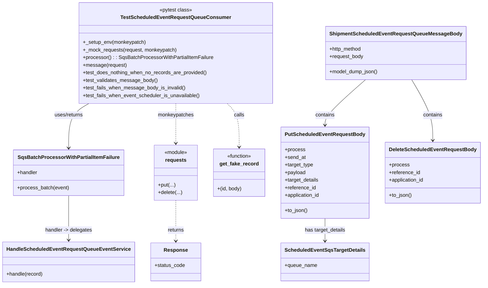
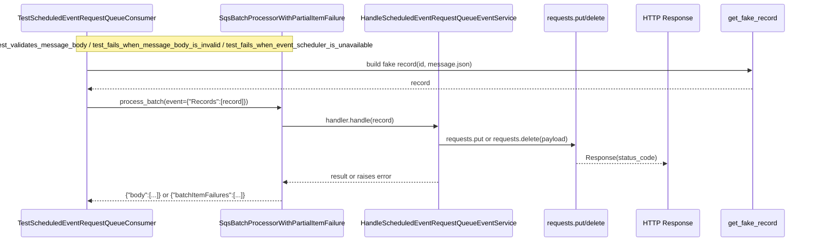

# Diagram: shipment_core/shipment_service/test/unit_tests/scheduled_event/test_scheduled_event_request_queue_consumer.py

> Auto-generated by Obscura crawlers

## Diagram 1

### SVG

<svg id="container" width="1463.25" xmlns="http://www.w3.org/2000/svg" class="classDiagram" height="896" viewBox="0 0 1463.25 896" role="graphics-document document" aria-roledescription="class"><g><defs><marker id="container_class-aggregationStart" class="marker aggregation class" refX="18" refY="7" markerWidth="190" markerHeight="240" orient="auto"><path d="M 18,7 L9,13 L1,7 L9,1 Z"></path></marker></defs><defs><marker id="container_class-aggregationEnd" class="marker aggregation class" refX="1" refY="7" markerWidth="20" markerHeight="28" orient="auto"><path d="M 18,7 L9,13 L1,7 L9,1 Z"></path></marker></defs><defs><marker id="container_class-extensionStart" class="marker extension class" refX="18" refY="7" markerWidth="190" markerHeight="240" orient="auto"><path d="M 1,7 L18,13 V 1 Z"></path></marker></defs><defs><marker id="container_class-extensionEnd" class="marker extension class" refX="1" refY="7" markerWidth="20" markerHeight="28" orient="auto"><path d="M 1,1 V 13 L18,7 Z"></path></marker></defs><defs><marker id="container_class-compositionStart" class="marker composition class" refX="18" refY="7" markerWidth="190" markerHeight="240" orient="auto"><path d="M 18,7 L9,13 L1,7 L9,1 Z"></path></marker></defs><defs><marker id="container_class-compositionEnd" class="marker composition class" refX="1" refY="7" markerWidth="20" markerHeight="28" orient="auto"><path d="M 18,7 L9,13 L1,7 L9,1 Z"></path></marker></defs><defs><marker id="container_class-dependencyStart" class="marker dependency class" refX="6" refY="7" markerWidth="190" markerHeight="240" orient="auto"><path d="M 5,7 L9,13 L1,7 L9,1 Z"></path></marker></defs><defs><marker id="container_class-dependencyEnd" class="marker dependency class" refX="13" refY="7" markerWidth="20" markerHeight="28" orient="auto"><path d="M 18,7 L9,13 L14,7 L9,1 Z"></path></marker></defs><defs><marker id="container_class-lollipopStart" class="marker lollipop class" refX="13" refY="7" markerWidth="190" markerHeight="240" orient="auto"><circle stroke="black" fill="transparent" cx="7" cy="7" r="6"></circle></marker></defs><defs><marker id="container_class-lollipopEnd" class="marker lollipop class" refX="1" refY="7" markerWidth="190" markerHeight="240" orient="auto"><circle stroke="black" fill="transparent" cx="7" cy="7" r="6"></circle></marker></defs><g class="root"><g class="clusters"></g><g class="edgePaths"><path d="M265.967,326L255.772,332.167C245.577,338.333,225.187,350.667,214.992,374C204.797,397.333,204.797,431.667,204.797,448.833L204.797,466" id="id_TestScheduledEventRequestQueueConsumer_SqsBatchProcessorWithPartialItemFailure_1" class="edge-thickness-normal edge-pattern-solid relation" style=";;;" data-edge="true" data-et="edge" data-id="id_TestScheduledEventRequestQueueConsumer_SqsBatchProcessorWithPartialItemFailure_1" data-points="W3sieCI6MjY1Ljk2Njc3Njk0NTE1MzEsInkiOjMyNn0seyJ4IjoyMDQuNzk2ODc1LCJ5IjozNjN9LHsieCI6MjA0Ljc5Njg3NSwieSI6NDcyfV0=" marker-end="url(#container_class-dependencyEnd)"></path><path d="M204.797,616L204.797,634.167C204.797,652.333,204.797,688.667,204.797,712C204.797,735.333,204.797,745.667,204.797,750.833L204.797,756" id="id_SqsBatchProcessorWithPartialItemFailure_HandleScheduledEventRequestQueueEventService_2" class="edge-thickness-normal edge-pattern-solid relation" style=";;;" data-edge="true" data-et="edge" data-id="id_SqsBatchProcessorWithPartialItemFailure_HandleScheduledEventRequestQueueEventService_2" data-points="W3sieCI6MjA0Ljc5Njg3NSwieSI6NjE2fSx7IngiOjIwNC43OTY4NzUsInkiOjcyNX0seyJ4IjoyMDQuNzk2ODc1LCJ5Ijo3NjJ9XQ==" marker-end="url(#container_class-dependencyEnd)"></path><path d="M1108.647,251L1088.572,269.667C1068.497,288.333,1028.346,325.667,1008.271,349.5C988.195,373.333,988.195,383.667,988.195,388.833L988.195,394" id="id_ShipmentScheduledEventRequestQueueMessageBody_PutScheduledEventRequestBody_3" class="edge-thickness-normal edge-pattern-solid relation" style=";;;" data-edge="true" data-et="edge" data-id="id_ShipmentScheduledEventRequestQueueMessageBody_PutScheduledEventRequestBody_3" data-points="W3sieCI6MTEwOC42NDczMjE0Mjg1NzEzLCJ5IjoyNTF9LHsieCI6OTg4LjE5NTMxMjUsInkiOjM2M30seyJ4Ijo5ODguMTk1MzEyNSwieSI6NDAwfV0=" marker-end="url(#container_class-dependencyEnd)"></path><path d="M1247.595,251L1258.397,269.667C1269.199,288.333,1290.802,325.667,1301.604,357.5C1312.406,389.333,1312.406,415.667,1312.406,428.833L1312.406,442" id="id_ShipmentScheduledEventRequestQueueMessageBody_DeleteScheduledEventRequestBody_4" class="edge-thickness-normal edge-pattern-solid relation" style=";;;" data-edge="true" data-et="edge" data-id="id_ShipmentScheduledEventRequestQueueMessageBody_DeleteScheduledEventRequestBody_4" data-points="W3sieCI6MTI0Ny41OTQ4NjYwNzE0Mjg3LCJ5IjoyNTF9LHsieCI6MTMxMi40MDYyNSwieSI6MzYzfSx7IngiOjEzMTIuNDA2MjUsInkiOjQ0OH1d" marker-end="url(#container_class-dependencyEnd)"></path><path d="M988.195,688L988.195,694.167C988.195,700.333,988.195,712.667,988.195,724.5C988.195,736.333,988.195,747.667,988.195,753.333L988.195,759" id="id_PutScheduledEventRequestBody_ScheduledEventSqsTargetDetails_5" class="edge-thickness-normal edge-pattern-solid relation" style=";;;" data-edge="true" data-et="edge" data-id="id_PutScheduledEventRequestBody_ScheduledEventSqsTargetDetails_5" data-points="W3sieCI6OTg4LjE5NTMxMjUsInkiOjY4OH0seyJ4Ijo5ODguMTk1MzEyNSwieSI6NzI1fSx7IngiOjk4OC4xOTUzMTI1LCJ5Ijo3NjV9XQ==" marker-end="url(#container_class-dependencyEnd)"></path><path d="M528.832,326L528.832,332.167C528.832,338.333,528.832,350.667,528.832,371.5C528.832,392.333,528.832,421.667,528.832,436.333L528.832,451" id="id_TestScheduledEventRequestQueueConsumer_requests_6" class="edge-thickness-normal edge-pattern-dashed relation" style=";;;" data-edge="true" data-et="edge" data-id="id_TestScheduledEventRequestQueueConsumer_requests_6" data-points="W3sieCI6NTI4LjgzMjAzMTI1LCJ5IjozMjZ9LHsieCI6NTI4LjgzMjAzMTI1LCJ5IjozNjN9LHsieCI6NTI4LjgzMjAzMTI1LCJ5Ijo0NTd9XQ==" marker-end="url(#container_class-dependencyEnd)"></path><path d="M528.832,631L528.832,646.667C528.832,662.333,528.832,693.667,528.832,715C528.832,736.333,528.832,747.667,528.832,753.333L528.832,759" id="id_requests_Response_7" class="edge-thickness-normal edge-pattern-dashed relation" style=";;;" data-edge="true" data-et="edge" data-id="id_requests_Response_7" data-points="W3sieCI6NTI4LjgzMjAzMTI1LCJ5Ijo2MzF9LHsieCI6NTI4LjgzMjAzMTI1LCJ5Ijo3MjV9LHsieCI6NTI4LjgzMjAzMTI1LCJ5Ijo3NjV9XQ==" marker-end="url(#container_class-dependencyEnd)"></path><path d="M689.524,326L695.756,332.167C701.989,338.333,714.453,350.667,720.686,373.5C726.918,396.333,726.918,429.667,726.918,446.333L726.918,463" id="id_TestScheduledEventRequestQueueConsumer_get_fake_record_8" class="edge-thickness-normal edge-pattern-dashed relation" style=";;;" data-edge="true" data-et="edge" data-id="id_TestScheduledEventRequestQueueConsumer_get_fake_record_8" data-points="W3sieCI6Njg5LjUyNDE5NDgzNDE4MzYsInkiOjMyNn0seyJ4Ijo3MjYuOTE3OTY4NzUsInkiOjM2M30seyJ4Ijo3MjYuOTE3OTY4NzUsInkiOjQ2OX1d" marker-end="url(#container_class-dependencyEnd)"></path></g><g class="edgeLabels"><g class="edgeLabel" transform="translate(204.796875, 363)"><g class="label" data-id="id_TestScheduledEventRequestQueueConsumer_SqsBatchProcessorWithPartialItemFailure_1" transform="translate(-46.6796875, -12)"><foreignObject width="93.359375" height="24">

uses/returns

</foreignObject></g></g><g class="edgeLabel" transform="translate(204.796875, 725)"><g class="label" data-id="id_SqsBatchProcessorWithPartialItemFailure_HandleScheduledEventRequestQueueEventService_2" transform="translate(-74.765625, -12)"><foreignObject width="149.53125" height="24">

handler -&gt; delegates

</foreignObject></g></g><g class="edgeLabel" transform="translate(988.1953125, 363)"><g class="label" data-id="id_ShipmentScheduledEventRequestQueueMessageBody_PutScheduledEventRequestBody_3" transform="translate(-30.890625, -12)"><foreignObject width="61.78125" height="24">

contains

</foreignObject></g></g><g class="edgeLabel" transform="translate(1312.40625, 363)"><g class="label" data-id="id_ShipmentScheduledEventRequestQueueMessageBody_DeleteScheduledEventRequestBody_4" transform="translate(-30.890625, -12)"><foreignObject width="61.78125" height="24">

contains

</foreignObject></g></g><g class="edgeLabel" transform="translate(988.1953125, 725)"><g class="label" data-id="id_PutScheduledEventRequestBody_ScheduledEventSqsTargetDetails_5" transform="translate(-64.9140625, -12)"><foreignObject width="129.828125" height="24">

has target_details

</foreignObject></g></g><g class="edgeLabel" transform="translate(528.83203125, 363)"><g class="label" data-id="id_TestScheduledEventRequestQueueConsumer_requests_6" transform="translate(-56.90625, -12)"><foreignObject width="113.8125" height="24">

monkeypatches

</foreignObject></g></g><g class="edgeLabel" transform="translate(528.83203125, 725)"><g class="label" data-id="id_requests_Response_7" transform="translate(-26.265625, -12)"><foreignObject width="52.53125" height="24">

returns

</foreignObject></g></g><g class="edgeLabel" transform="translate(726.91796875, 363)"><g class="label" data-id="id_TestScheduledEventRequestQueueConsumer_get_fake_record_8" transform="translate(-16.4453125, -12)"><foreignObject width="32.890625" height="24">

calls

</foreignObject></g></g></g><g class="nodes"><g class="node default" id="classId-TestScheduledEventRequestQueueConsumer-0" transform="translate(528.83203125, 167)"><g class="basic label-container"><path d="M-297.7734375 -159 L297.7734375 -159 L297.7734375 159 L-297.7734375 159" stroke="none" stroke-width="0" fill="#ECECFF" style=""></path><path d="M-297.7734375 -159 C-66.4964922695215 -159, 164.780452960957 -159, 297.7734375 -159 M-297.7734375 -159 C-79.55867002788901 -159, 138.65609744422198 -159, 297.7734375 -159 M297.7734375 -159 C297.7734375 -87.27731989908216, 297.7734375 -15.554639798164317, 297.7734375 159 M297.7734375 -159 C297.7734375 -88.93905213372653, 297.7734375 -18.878104267453068, 297.7734375 159 M297.7734375 159 C103.85308241042722 159, -90.06727267914556 159, -297.7734375 159 M297.7734375 159 C89.6921374154108 159, -118.3891626691784 159, -297.7734375 159 M-297.7734375 159 C-297.7734375 32.5864142458465, -297.7734375 -93.827171508307, -297.7734375 -159 M-297.7734375 159 C-297.7734375 43.68973785912165, -297.7734375 -71.6205242817567, -297.7734375 -159" stroke="#9370DB" stroke-width="1.3" fill="none" stroke-dasharray="0 0" style=""></path></g><g class="annotation-group text" transform="translate(-51.453125, -135)"><g class="label" style="" transform="translate(0,-12)"><foreignObject width="102.90625" height="24">

«pytest class»

</foreignObject></g></g><g class="label-group text" transform="translate(-163.859375, -111)"><g class="label" style="font-weight: bolder" transform="translate(0,-12)"><foreignObject width="327.71875" height="24">

TestScheduledEventRequestQueueConsumer

</foreignObject></g></g><g class="members-group text" transform="translate(-285.7734375, -63)"></g><g class="methods-group text" transform="translate(-285.7734375, -33)"><g class="label" style="" transform="translate(0,-12)"><foreignObject width="197.34375" height="24">

+_setup_env(monkeypatch)

</foreignObject></g><g class="label" style="" transform="translate(0,12)"><foreignObject width="296.375" height="24">

+_mock_requests(request, monkeypatch)

</foreignObject></g><g class="label" style="" transform="translate(0,36)"><foreignObject width="407.6875" height="24">

+processor() : : SqsBatchProcessorWithPartialItemFailure

</foreignObject></g><g class="label" style="" transform="translate(0,60)"><foreignObject width="136.015625" height="24">

+message(request)

</foreignObject></g><g class="label" style="" transform="translate(0,84)"><foreignObject width="392.359375" height="24">

+test_does_nothing_when_no_records_are_provided()

</foreignObject></g><g class="label" style="" transform="translate(0,108)"><foreignObject width="233.65625" height="24">

+test_validates_message_body()

</foreignObject></g><g class="label" style="" transform="translate(0,132)"><foreignObject width="322.3125" height="24">

+test_fails_when_message_body_is_invalid()

</foreignObject></g><g class="label" style="" transform="translate(0,156)"><foreignObject width="369.875" height="24">

+test_fails_when_event_scheduler_is_unavailable()

</foreignObject></g></g><g class="divider" style=""><path d="M-297.7734375 -87 C-102.57957229468533 -87, 92.61429291062933 -87, 297.7734375 -87 M-297.7734375 -87 C-76.13933007192136 -87, 145.49477735615727 -87, 297.7734375 -87" stroke="#9370DB" stroke-width="1.3" fill="none" stroke-dasharray="0 0" style=""></path></g><g class="divider" style=""><path d="M-297.7734375 -63 C-67.40100272345956 -63, 162.9714320530809 -63, 297.7734375 -63 M-297.7734375 -63 C-60.385578525753886 -63, 177.00228044849223 -63, 297.7734375 -63" stroke="#9370DB" stroke-width="1.3" fill="none" stroke-dasharray="0 0" style=""></path></g></g><g class="node default" id="classId-SqsBatchProcessorWithPartialItemFailure-1" transform="translate(204.796875, 544)"><g class="basic label-container"><path d="M-169.078125 -72 L169.078125 -72 L169.078125 72 L-169.078125 72" stroke="none" stroke-width="0" fill="#ECECFF" style=""></path><path d="M-169.078125 -72 C-69.52384369283236 -72, 30.030437614335284 -72, 169.078125 -72 M-169.078125 -72 C-79.26474880626648 -72, 10.548627387467036 -72, 169.078125 -72 M169.078125 -72 C169.078125 -37.67459135473061, 169.078125 -3.3491827094612177, 169.078125 72 M169.078125 -72 C169.078125 -33.21416013678403, 169.078125 5.571679726431938, 169.078125 72 M169.078125 72 C56.789478106220216 72, -55.49916878755957 72, -169.078125 72 M169.078125 72 C42.21526759186871 72, -84.64758981626258 72, -169.078125 72 M-169.078125 72 C-169.078125 16.251345123236284, -169.078125 -39.49730975352743, -169.078125 -72 M-169.078125 72 C-169.078125 35.65050839971959, -169.078125 -0.6989832005608179, -169.078125 -72" stroke="#9370DB" stroke-width="1.3" fill="none" stroke-dasharray="0 0" style=""></path></g><g class="annotation-group text" transform="translate(0, -48)"></g><g class="label-group text" transform="translate(-151.46875, -48)"><g class="label" style="font-weight: bolder" transform="translate(0,-12)"><foreignObject width="302.9375" height="24">

SqsBatchProcessorWithPartialItemFailure

</foreignObject></g></g><g class="members-group text" transform="translate(-157.078125, 0)"><g class="label" style="" transform="translate(0,-12)"><foreignObject width="64.515625" height="24">

+handler

</foreignObject></g></g><g class="methods-group text" transform="translate(-157.078125, 48)"><g class="label" style="" transform="translate(0,-12)"><foreignObject width="162.6875" height="24">

+process_batch(event)

</foreignObject></g></g><g class="divider" style=""><path d="M-169.078125 -24 C-56.2141285852243 -24, 56.6498678295514 -24, 169.078125 -24 M-169.078125 -24 C-82.08745994549889 -24, 4.903205109002215 -24, 169.078125 -24" stroke="#9370DB" stroke-width="1.3" fill="none" stroke-dasharray="0 0" style=""></path></g><g class="divider" style=""><path d="M-169.078125 24 C-94.72347233493382 24, -20.368819669867634 24, 169.078125 24 M-169.078125 24 C-81.5530146855226 24, 5.972095628954804 24, 169.078125 24" stroke="#9370DB" stroke-width="1.3" fill="none" stroke-dasharray="0 0" style=""></path></g></g><g class="node default" id="classId-HandleScheduledEventRequestQueueEventService-2" transform="translate(204.796875, 825)"><g class="basic label-container"><path d="M-196.796875 -63 L196.796875 -63 L196.796875 63 L-196.796875 63" stroke="none" stroke-width="0" fill="#ECECFF" style=""></path><path d="M-196.796875 -63 C-64.67638543343907 -63, 67.44410413312187 -63, 196.796875 -63 M-196.796875 -63 C-75.07352670800105 -63, 46.64982158399789 -63, 196.796875 -63 M196.796875 -63 C196.796875 -34.769352875198365, 196.796875 -6.538705750396737, 196.796875 63 M196.796875 -63 C196.796875 -32.12228649052615, 196.796875 -1.2445729810522934, 196.796875 63 M196.796875 63 C115.96407575746595 63, 35.1312765149319 63, -196.796875 63 M196.796875 63 C104.39873732251667 63, 12.000599645033333 63, -196.796875 63 M-196.796875 63 C-196.796875 21.061962905047203, -196.796875 -20.876074189905594, -196.796875 -63 M-196.796875 63 C-196.796875 23.426682919695622, -196.796875 -16.146634160608755, -196.796875 -63" stroke="#9370DB" stroke-width="1.3" fill="none" stroke-dasharray="0 0" style=""></path></g><g class="annotation-group text" transform="translate(0, -39)"></g><g class="label-group text" transform="translate(-184.796875, -39)"><g class="label" style="font-weight: bolder" transform="translate(0,-12)"><foreignObject width="369.59375" height="24">

HandleScheduledEventRequestQueueEventService

</foreignObject></g></g><g class="members-group text" transform="translate(-184.796875, 9)"></g><g class="methods-group text" transform="translate(-184.796875, 39)"><g class="label" style="" transform="translate(0,-12)"><foreignObject width="115.0625" height="24">

+handle(record)

</foreignObject></g></g><g class="divider" style=""><path d="M-196.796875 -15 C-92.3126822035828 -15, 12.171510592834409 -15, 196.796875 -15 M-196.796875 -15 C-88.41294733009335 -15, 19.97098033981331 -15, 196.796875 -15" stroke="#9370DB" stroke-width="1.3" fill="none" stroke-dasharray="0 0" style=""></path></g><g class="divider" style=""><path d="M-196.796875 9 C-45.14084523765018 9, 106.51518452469963 9, 196.796875 9 M-196.796875 9 C-75.22282922252319 9, 46.35121655495362 9, 196.796875 9" stroke="#9370DB" stroke-width="1.3" fill="none" stroke-dasharray="0 0" style=""></path></g></g><g class="node default" id="classId-ShipmentScheduledEventRequestQueueMessageBody-3" transform="translate(1198.986328125, 167)"><g class="basic label-container"><path d="M-208.9609375 -84 L208.9609375 -84 L208.9609375 84 L-208.9609375 84" stroke="none" stroke-width="0" fill="#ECECFF" style=""></path><path d="M-208.9609375 -84 C-51.53419577955634 -84, 105.89254594088732 -84, 208.9609375 -84 M-208.9609375 -84 C-81.49810661208744 -84, 45.96472427582512 -84, 208.9609375 -84 M208.9609375 -84 C208.9609375 -25.810751750374116, 208.9609375 32.37849649925177, 208.9609375 84 M208.9609375 -84 C208.9609375 -23.279824074087593, 208.9609375 37.440351851824815, 208.9609375 84 M208.9609375 84 C124.41101448457479 84, 39.861091469149585 84, -208.9609375 84 M208.9609375 84 C89.94582555520282 84, -29.069286389594367 84, -208.9609375 84 M-208.9609375 84 C-208.9609375 40.566927810768284, -208.9609375 -2.8661443784634315, -208.9609375 -84 M-208.9609375 84 C-208.9609375 18.832152710431416, -208.9609375 -46.33569457913717, -208.9609375 -84" stroke="#9370DB" stroke-width="1.3" fill="none" stroke-dasharray="0 0" style=""></path></g><g class="annotation-group text" transform="translate(0, -60)"></g><g class="label-group text" transform="translate(-196.9609375, -60)"><g class="label" style="font-weight: bolder" transform="translate(0,-12)"><foreignObject width="393.921875" height="24">

ShipmentScheduledEventRequestQueueMessageBody

</foreignObject></g></g><g class="members-group text" transform="translate(-196.9609375, -12)"><g class="label" style="" transform="translate(0,-12)"><foreignObject width="102.921875" height="24">

+http_method

</foreignObject></g><g class="label" style="" transform="translate(0,12)"><foreignObject width="107.859375" height="24">

+request_body

</foreignObject></g></g><g class="methods-group text" transform="translate(-196.9609375, 60)"><g class="label" style="" transform="translate(0,-12)"><foreignObject width="153.734375" height="24">

+model_dump_json()

</foreignObject></g></g><g class="divider" style=""><path d="M-208.9609375 -36 C-72.56941996976505 -36, 63.8220975604699 -36, 208.9609375 -36 M-208.9609375 -36 C-83.04663916868033 -36, 42.86765916263934 -36, 208.9609375 -36" stroke="#9370DB" stroke-width="1.3" fill="none" stroke-dasharray="0 0" style=""></path></g><g class="divider" style=""><path d="M-208.9609375 36 C-62.794847071734296 36, 83.37124335653141 36, 208.9609375 36 M-208.9609375 36 C-70.36181030544302 36, 68.23731688911397 36, 208.9609375 36" stroke="#9370DB" stroke-width="1.3" fill="none" stroke-dasharray="0 0" style=""></path></g></g><g class="node default" id="classId-PutScheduledEventRequestBody-4" transform="translate(988.1953125, 544)"><g class="basic label-container"><path d="M-131.3671875 -144 L131.3671875 -144 L131.3671875 144 L-131.3671875 144" stroke="none" stroke-width="0" fill="#ECECFF" style=""></path><path d="M-131.3671875 -144 C-70.59541493566924 -144, -9.82364237133848 -144, 131.3671875 -144 M-131.3671875 -144 C-30.835951723671457 -144, 69.69528405265709 -144, 131.3671875 -144 M131.3671875 -144 C131.3671875 -57.663679944212504, 131.3671875 28.672640111574992, 131.3671875 144 M131.3671875 -144 C131.3671875 -67.15198370611992, 131.3671875 9.696032587760158, 131.3671875 144 M131.3671875 144 C51.41374458477924 144, -28.539698330441524 144, -131.3671875 144 M131.3671875 144 C35.458539648883374 144, -60.45010820223325 144, -131.3671875 144 M-131.3671875 144 C-131.3671875 73.016438574803, -131.3671875 2.0328771496060085, -131.3671875 -144 M-131.3671875 144 C-131.3671875 70.37180197385142, -131.3671875 -3.2563960522971627, -131.3671875 -144" stroke="#9370DB" stroke-width="1.3" fill="none" stroke-dasharray="0 0" style=""></path></g><g class="annotation-group text" transform="translate(0, -120)"></g><g class="label-group text" transform="translate(-119.3671875, -120)"><g class="label" style="font-weight: bolder" transform="translate(0,-12)"><foreignObject width="238.734375" height="24">

PutScheduledEventRequestBody

</foreignObject></g></g><g class="members-group text" transform="translate(-119.3671875, -72)"><g class="label" style="" transform="translate(0,-12)"><foreignObject width="63.375" height="24">

+process

</foreignObject></g><g class="label" style="" transform="translate(0,12)"><foreignObject width="65.609375" height="24">

+send_at

</foreignObject></g><g class="label" style="" transform="translate(0,36)"><foreignObject width="90.5625" height="24">

+target_type

</foreignObject></g><g class="label" style="" transform="translate(0,60)"><foreignObject width="65.734375" height="24">

+payload

</foreignObject></g><g class="label" style="" transform="translate(0,84)"><foreignObject width="108.109375" height="24">

+target_details

</foreignObject></g><g class="label" style="" transform="translate(0,108)"><foreignObject width="98.25" height="24">

+reference_id

</foreignObject></g><g class="label" style="" transform="translate(0,132)"><foreignObject width="112.265625" height="24">

+application_id

</foreignObject></g></g><g class="methods-group text" transform="translate(-119.3671875, 120)"><g class="label" style="" transform="translate(0,-12)"><foreignObject width="72.40625" height="24">

+to_json()

</foreignObject></g></g><g class="divider" style=""><path d="M-131.3671875 -96 C-68.97093736828505 -96, -6.5746872365700995 -96, 131.3671875 -96 M-131.3671875 -96 C-44.92873282691701 -96, 41.509721846165974 -96, 131.3671875 -96" stroke="#9370DB" stroke-width="1.3" fill="none" stroke-dasharray="0 0" style=""></path></g><g class="divider" style=""><path d="M-131.3671875 96 C-54.94241182501068 96, 21.48236384997864 96, 131.3671875 96 M-131.3671875 96 C-59.400192831229674 96, 12.566801837540652 96, 131.3671875 96" stroke="#9370DB" stroke-width="1.3" fill="none" stroke-dasharray="0 0" style=""></path></g></g><g class="node default" id="classId-DeleteScheduledEventRequestBody-5" transform="translate(1312.40625, 544)"><g class="basic label-container"><path d="M-142.84375 -96 L142.84375 -96 L142.84375 96 L-142.84375 96" stroke="none" stroke-width="0" fill="#ECECFF" style=""></path><path d="M-142.84375 -96 C-71.57890901087782 -96, -0.3140680217556451 -96, 142.84375 -96 M-142.84375 -96 C-53.965314404293025 -96, 34.91312119141395 -96, 142.84375 -96 M142.84375 -96 C142.84375 -29.39118179140206, 142.84375 37.21763641719588, 142.84375 96 M142.84375 -96 C142.84375 -21.026408140892897, 142.84375 53.947183718214205, 142.84375 96 M142.84375 96 C83.89598690858472 96, 24.94822381716945 96, -142.84375 96 M142.84375 96 C49.871733066698965 96, -43.10028386660207 96, -142.84375 96 M-142.84375 96 C-142.84375 34.9759575297532, -142.84375 -26.048084940493595, -142.84375 -96 M-142.84375 96 C-142.84375 34.27525285954916, -142.84375 -27.449494280901675, -142.84375 -96" stroke="#9370DB" stroke-width="1.3" fill="none" stroke-dasharray="0 0" style=""></path></g><g class="annotation-group text" transform="translate(0, -72)"></g><g class="label-group text" transform="translate(-130.84375, -72)"><g class="label" style="font-weight: bolder" transform="translate(0,-12)"><foreignObject width="261.6875" height="24">

DeleteScheduledEventRequestBody

</foreignObject></g></g><g class="members-group text" transform="translate(-130.84375, -24)"><g class="label" style="" transform="translate(0,-12)"><foreignObject width="63.375" height="24">

+process

</foreignObject></g><g class="label" style="" transform="translate(0,12)"><foreignObject width="98.25" height="24">

+reference_id

</foreignObject></g><g class="label" style="" transform="translate(0,36)"><foreignObject width="112.265625" height="24">

+application_id

</foreignObject></g></g><g class="methods-group text" transform="translate(-130.84375, 72)"><g class="label" style="" transform="translate(0,-12)"><foreignObject width="72.40625" height="24">

+to_json()

</foreignObject></g></g><g class="divider" style=""><path d="M-142.84375 -48 C-69.81351806124994 -48, 3.2167138775001263 -48, 142.84375 -48 M-142.84375 -48 C-58.06776918869504 -48, 26.708211622609923 -48, 142.84375 -48" stroke="#9370DB" stroke-width="1.3" fill="none" stroke-dasharray="0 0" style=""></path></g><g class="divider" style=""><path d="M-142.84375 48 C-54.61496659196226 48, 33.613816816075484 48, 142.84375 48 M-142.84375 48 C-31.955095680606277 48, 78.93355863878745 48, 142.84375 48" stroke="#9370DB" stroke-width="1.3" fill="none" stroke-dasharray="0 0" style=""></path></g></g><g class="node default" id="classId-ScheduledEventSqsTargetDetails-6" transform="translate(988.1953125, 825)"><g class="basic label-container"><path d="M-132.46875 -60 L132.46875 -60 L132.46875 60 L-132.46875 60" stroke="none" stroke-width="0" fill="#ECECFF" style=""></path><path d="M-132.46875 -60 C-31.427342782271964 -60, 69.61406443545607 -60, 132.46875 -60 M-132.46875 -60 C-26.624617069016736 -60, 79.21951586196653 -60, 132.46875 -60 M132.46875 -60 C132.46875 -22.290906400974038, 132.46875 15.418187198051925, 132.46875 60 M132.46875 -60 C132.46875 -13.826243375794057, 132.46875 32.347513248411886, 132.46875 60 M132.46875 60 C73.79567947787126 60, 15.122608955742535 60, -132.46875 60 M132.46875 60 C31.760423600719903 60, -68.9479027985602 60, -132.46875 60 M-132.46875 60 C-132.46875 26.40559308986449, -132.46875 -7.188813820271022, -132.46875 -60 M-132.46875 60 C-132.46875 20.60214980303759, -132.46875 -18.795700393924818, -132.46875 -60" stroke="#9370DB" stroke-width="1.3" fill="none" stroke-dasharray="0 0" style=""></path></g><g class="annotation-group text" transform="translate(0, -36)"></g><g class="label-group text" transform="translate(-120.46875, -36)"><g class="label" style="font-weight: bolder" transform="translate(0,-12)"><foreignObject width="240.9375" height="24">

ScheduledEventSqsTargetDetails

</foreignObject></g></g><g class="members-group text" transform="translate(-120.46875, 12)"><g class="label" style="" transform="translate(0,-12)"><foreignObject width="102.140625" height="24">

+queue_name

</foreignObject></g></g><g class="methods-group text" transform="translate(-120.46875, 60)"></g><g class="divider" style=""><path d="M-132.46875 -12 C-36.087726278096554 -12, 60.29329744380689 -12, 132.46875 -12 M-132.46875 -12 C-39.739396164015304 -12, 52.98995767196939 -12, 132.46875 -12" stroke="#9370DB" stroke-width="1.3" fill="none" stroke-dasharray="0 0" style=""></path></g><g class="divider" style=""><path d="M-132.46875 36 C-34.45896879012291 36, 63.55081241975418 36, 132.46875 36 M-132.46875 36 C-27.649177464883053 36, 77.1703950702339 36, 132.46875 36" stroke="#9370DB" stroke-width="1.3" fill="none" stroke-dasharray="0 0" style=""></path></g></g><g class="node default" id="classId-requests-7" transform="translate(528.83203125, 544)"><g class="basic label-container"><path d="M-68.17578125 -87 L68.17578125 -87 L68.17578125 87 L-68.17578125 87" stroke="none" stroke-width="0" fill="#ECECFF" style=""></path><path d="M-68.17578125 -87 C-37.963827489064755 -87, -7.751873728129503 -87, 68.17578125 -87 M-68.17578125 -87 C-29.863168073286353 -87, 8.449445103427294 -87, 68.17578125 -87 M68.17578125 -87 C68.17578125 -20.104973061435146, 68.17578125 46.79005387712971, 68.17578125 87 M68.17578125 -87 C68.17578125 -25.818080545964364, 68.17578125 35.36383890807127, 68.17578125 87 M68.17578125 87 C39.53690164178393 87, 10.898022033567848 87, -68.17578125 87 M68.17578125 87 C14.421858239604468 87, -39.332064770791064 87, -68.17578125 87 M-68.17578125 87 C-68.17578125 22.05790933026273, -68.17578125 -42.88418133947454, -68.17578125 -87 M-68.17578125 87 C-68.17578125 45.19913404850517, -68.17578125 3.3982680970103445, -68.17578125 -87" stroke="#9370DB" stroke-width="1.3" fill="none" stroke-dasharray="0 0" style=""></path></g><g class="annotation-group text" transform="translate(-36.6015625, -63)"><g class="label" style="" transform="translate(0,-12)"><foreignObject width="73.203125" height="24">

«module»

</foreignObject></g></g><g class="label-group text" transform="translate(-31.9921875, -39)"><g class="label" style="font-weight: bolder" transform="translate(0,-12)"><foreignObject width="63.984375" height="24">

requests

</foreignObject></g></g><g class="members-group text" transform="translate(-56.17578125, 9)"></g><g class="methods-group text" transform="translate(-56.17578125, 39)"><g class="label" style="" transform="translate(0,-12)"><foreignObject width="54.46875" height="24">

+put(...)

</foreignObject></g><g class="label" style="" transform="translate(0,12)"><foreignObject width="75.75" height="24">

+delete(...)

</foreignObject></g></g><g class="divider" style=""><path d="M-68.17578125 -15 C-14.417825332128047 -15, 39.34013058574391 -15, 68.17578125 -15 M-68.17578125 -15 C-18.801319198047963 -15, 30.573142853904073 -15, 68.17578125 -15" stroke="#9370DB" stroke-width="1.3" fill="none" stroke-dasharray="0 0" style=""></path></g><g class="divider" style=""><path d="M-68.17578125 9 C-32.84159270893307 9, 2.4925958321338584 9, 68.17578125 9 M-68.17578125 9 C-20.046196251580824 9, 28.083388746838352 9, 68.17578125 9" stroke="#9370DB" stroke-width="1.3" fill="none" stroke-dasharray="0 0" style=""></path></g></g><g class="node default" id="classId-Response-8" transform="translate(528.83203125, 825)"><g class="basic label-container"><path d="M-77.23828125 -60 L77.23828125 -60 L77.23828125 60 L-77.23828125 60" stroke="none" stroke-width="0" fill="#ECECFF" style=""></path><path d="M-77.23828125 -60 C-37.02833815902616 -60, 3.1816049319476747 -60, 77.23828125 -60 M-77.23828125 -60 C-43.394417091885984 -60, -9.550552933771968 -60, 77.23828125 -60 M77.23828125 -60 C77.23828125 -21.109708204576002, 77.23828125 17.780583590847996, 77.23828125 60 M77.23828125 -60 C77.23828125 -35.60618673413572, 77.23828125 -11.212373468271444, 77.23828125 60 M77.23828125 60 C44.17821222348292 60, 11.118143196965846 60, -77.23828125 60 M77.23828125 60 C20.825279802406897 60, -35.58772164518621 60, -77.23828125 60 M-77.23828125 60 C-77.23828125 14.598670747839812, -77.23828125 -30.802658504320377, -77.23828125 -60 M-77.23828125 60 C-77.23828125 21.1729973342945, -77.23828125 -17.654005331411, -77.23828125 -60" stroke="#9370DB" stroke-width="1.3" fill="none" stroke-dasharray="0 0" style=""></path></g><g class="annotation-group text" transform="translate(0, -36)"></g><g class="label-group text" transform="translate(-35.4453125, -36)"><g class="label" style="font-weight: bolder" transform="translate(0,-12)"><foreignObject width="70.890625" height="24">

Response

</foreignObject></g></g><g class="members-group text" transform="translate(-65.23828125, 12)"><g class="label" style="" transform="translate(0,-12)"><foreignObject width="95.03125" height="24">

+status_code

</foreignObject></g></g><g class="methods-group text" transform="translate(-65.23828125, 60)"></g><g class="divider" style=""><path d="M-77.23828125 -12 C-45.39924261557553 -12, -13.560203981151062 -12, 77.23828125 -12 M-77.23828125 -12 C-39.20102448091406 -12, -1.1637677118281147 -12, 77.23828125 -12" stroke="#9370DB" stroke-width="1.3" fill="none" stroke-dasharray="0 0" style=""></path></g><g class="divider" style=""><path d="M-77.23828125 36 C-34.050567993850755 36, 9.137145262298489 36, 77.23828125 36 M-77.23828125 36 C-18.553004534100495 36, 40.13227218179901 36, 77.23828125 36" stroke="#9370DB" stroke-width="1.3" fill="none" stroke-dasharray="0 0" style=""></path></g></g><g class="node default" id="classId-get_fake_record-9" transform="translate(726.91796875, 544)"><g class="basic label-container"><path d="M-79.91015625 -75 L79.91015625 -75 L79.91015625 75 L-79.91015625 75" stroke="none" stroke-width="0" fill="#ECECFF" style=""></path><path d="M-79.91015625 -75 C-27.973646206042226 -75, 23.96286383791555 -75, 79.91015625 -75 M-79.91015625 -75 C-19.855277894769188 -75, 40.199600460461625 -75, 79.91015625 -75 M79.91015625 -75 C79.91015625 -33.397460012049685, 79.91015625 8.205079975900631, 79.91015625 75 M79.91015625 -75 C79.91015625 -43.152111920660104, 79.91015625 -11.304223841320216, 79.91015625 75 M79.91015625 75 C29.358891260125397 75, -21.192373729749207 75, -79.91015625 75 M79.91015625 75 C40.70056218375342 75, 1.4909681175068386 75, -79.91015625 75 M-79.91015625 75 C-79.91015625 28.195479512333684, -79.91015625 -18.609040975332633, -79.91015625 -75 M-79.91015625 75 C-79.91015625 39.341161395030255, -79.91015625 3.6823227900605104, -79.91015625 -75" stroke="#9370DB" stroke-width="1.3" fill="none" stroke-dasharray="0 0" style=""></path></g><g class="annotation-group text" transform="translate(-39.484375, -51)"><g class="label" style="" transform="translate(0,-12)"><foreignObject width="78.96875" height="24">

«function»

</foreignObject></g></g><g class="label-group text" transform="translate(-59.0078125, -27)"><g class="label" style="font-weight: bolder" transform="translate(0,-12)"><foreignObject width="118.015625" height="24">

get_fake_record

</foreignObject></g></g><g class="members-group text" transform="translate(-67.91015625, 21)"></g><g class="methods-group text" transform="translate(-67.91015625, 51)"><g class="label" style="" transform="translate(0,-12)"><foreignObject width="76.8125" height="24">

+(id, body)

</foreignObject></g></g><g class="divider" style=""><path d="M-79.91015625 -3 C-42.09923671249874 -3, -4.288317174997474 -3, 79.91015625 -3 M-79.91015625 -3 C-16.50121097961086 -3, 46.90773429077828 -3, 79.91015625 -3" stroke="#9370DB" stroke-width="1.3" fill="none" stroke-dasharray="0 0" style=""></path></g><g class="divider" style=""><path d="M-79.91015625 21 C-35.675637646309035 21, 8.55888095738193 21, 79.91015625 21 M-79.91015625 21 C-37.030974817822674 21, 5.848206614354652 21, 79.91015625 21" stroke="#9370DB" stroke-width="1.3" fill="none" stroke-dasharray="0 0" style=""></path></g></g></g></g></g></svg>

## Diagram 2

### SVG

<svg id="container" width="2065" xmlns="http://www.w3.org/2000/svg" height="604" viewBox="-50 -10 2065 604" role="graphics-document document" aria-roledescription="sequence"><g><rect x="1815" y="518" fill="#eaeaea" stroke="#666" width="150" height="65" name="Record" rx="3" ry="3" class="actor actor-bottom"></rect><text x="1890" y="550.5" dominant-baseline="central" alignment-baseline="central" class="actor actor-box" style="text-anchor: middle; font-size: 16px; font-weight: 400;"><tspan x="1890" dy="0">get_fake_record</tspan></text></g><g><rect x="1615" y="518" fill="#eaeaea" stroke="#666" width="150" height="65" name="Response" rx="3" ry="3" class="actor actor-bottom"></rect><text x="1690" y="550.5" dominant-baseline="central" alignment-baseline="central" class="actor actor-box" style="text-anchor: middle; font-size: 16px; font-weight: 400;"><tspan x="1690" dy="0">HTTP Response</tspan></text></g><g><rect x="1370.5" y="518" fill="#eaeaea" stroke="#666" width="165" height="65" name="Requests" rx="3" ry="3" class="actor actor-bottom"></rect><text x="1453" y="550.5" dominant-baseline="central" alignment-baseline="central" class="actor actor-box" style="text-anchor: middle; font-size: 16px; font-weight: 400;"><tspan x="1453" dy="0">requests.put/delete</tspan></text></g><g><rect x="894" y="518" fill="#eaeaea" stroke="#666" width="386" height="65" name="Service" rx="3" ry="3" class="actor actor-bottom"></rect><text x="1087" y="550.5" dominant-baseline="central" alignment-baseline="central" class="actor actor-box" style="text-anchor: middle; font-size: 16px; font-weight: 400;"><tspan x="1087" dy="0">HandleScheduledEventRequestQueueEventService</tspan></text></g><g><rect x="526" y="518" fill="#eaeaea" stroke="#666" width="318" height="65" name="Processor" rx="3" ry="3" class="actor actor-bottom"></rect><text x="685" y="550.5" dominant-baseline="central" alignment-baseline="central" class="actor actor-box" style="text-anchor: middle; font-size: 16px; font-weight: 400;"><tspan x="685" dy="0">SqsBatchProcessorWithPartialItemFailure</tspan></text></g><g><rect x="0" y="518" fill="#eaeaea" stroke="#666" width="345" height="65" name="Test" rx="3" ry="3" class="actor actor-bottom"></rect><text x="172.5" y="550.5" dominant-baseline="central" alignment-baseline="central" class="actor actor-box" style="text-anchor: middle; font-size: 16px; font-weight: 400;"><tspan x="172.5" dy="0">TestScheduledEventRequestQueueConsumer</tspan></text></g><g><line id="actor5" x1="1890" y1="65" x2="1890" y2="518" class="actor-line 200" stroke-width="0.5px" stroke="#999" name="Record"></line><g id="root-5"><rect x="1815" y="0" fill="#eaeaea" stroke="#666" width="150" height="65" name="Record" rx="3" ry="3" class="actor actor-top"></rect><text x="1890" y="32.5" dominant-baseline="central" alignment-baseline="central" class="actor actor-box" style="text-anchor: middle; font-size: 16px; font-weight: 400;"><tspan x="1890" dy="0">get_fake_record</tspan></text></g></g><g><line id="actor4" x1="1690" y1="65" x2="1690" y2="518" class="actor-line 200" stroke-width="0.5px" stroke="#999" name="Response"></line><g id="root-4"><rect x="1615" y="0" fill="#eaeaea" stroke="#666" width="150" height="65" name="Response" rx="3" ry="3" class="actor actor-top"></rect><text x="1690" y="32.5" dominant-baseline="central" alignment-baseline="central" class="actor actor-box" style="text-anchor: middle; font-size: 16px; font-weight: 400;"><tspan x="1690" dy="0">HTTP Response</tspan></text></g></g><g><line id="actor3" x1="1453" y1="65" x2="1453" y2="518" class="actor-line 200" stroke-width="0.5px" stroke="#999" name="Requests"></line><g id="root-3"><rect x="1370.5" y="0" fill="#eaeaea" stroke="#666" width="165" height="65" name="Requests" rx="3" ry="3" class="actor actor-top"></rect><text x="1453" y="32.5" dominant-baseline="central" alignment-baseline="central" class="actor actor-box" style="text-anchor: middle; font-size: 16px; font-weight: 400;"><tspan x="1453" dy="0">requests.put/delete</tspan></text></g></g><g><line id="actor2" x1="1087" y1="65" x2="1087" y2="518" class="actor-line 200" stroke-width="0.5px" stroke="#999" name="Service"></line><g id="root-2"><rect x="894" y="0" fill="#eaeaea" stroke="#666" width="386" height="65" name="Service" rx="3" ry="3" class="actor actor-top"></rect><text x="1087" y="32.5" dominant-baseline="central" alignment-baseline="central" class="actor actor-box" style="text-anchor: middle; font-size: 16px; font-weight: 400;"><tspan x="1087" dy="0">HandleScheduledEventRequestQueueEventService</tspan></text></g></g><g><line id="actor1" x1="685" y1="65" x2="685" y2="518" class="actor-line 200" stroke-width="0.5px" stroke="#999" name="Processor"></line><g id="root-1"><rect x="526" y="0" fill="#eaeaea" stroke="#666" width="318" height="65" name="Processor" rx="3" ry="3" class="actor actor-top"></rect><text x="685" y="32.5" dominant-baseline="central" alignment-baseline="central" class="actor actor-box" style="text-anchor: middle; font-size: 16px; font-weight: 400;"><tspan x="685" dy="0">SqsBatchProcessorWithPartialItemFailure</tspan></text></g></g><g><line id="actor0" x1="172.5" y1="65" x2="172.5" y2="518" class="actor-line 200" stroke-width="0.5px" stroke="#999" name="Test"></line><g id="root-0"><rect x="0" y="0" fill="#eaeaea" stroke="#666" width="345" height="65" name="Test" rx="3" ry="3" class="actor actor-top"></rect><text x="172.5" y="32.5" dominant-baseline="central" alignment-baseline="central" class="actor actor-box" style="text-anchor: middle; font-size: 16px; font-weight: 400;"><tspan x="172.5" dy="0">TestScheduledEventRequestQueueConsumer</tspan></text></g></g><g></g><defs><symbol id="computer" width="24" height="24"><path transform="scale(.5)" d="M2 2v13h20v-13h-20zm18 11h-16v-9h16v9zm-10.228 6l.466-1h3.524l.467 1h-4.457zm14.228 3h-24l2-6h2.104l-1.33 4h18.45l-1.297-4h2.073l2 6zm-5-10h-14v-7h14v7z"></path></symbol></defs><defs><symbol id="database" fill-rule="evenodd" clip-rule="evenodd"><path transform="scale(.5)" d="M12.258.001l.256.004.255.005.253.008.251.01.249.012.247.015.246.016.242.019.241.02.239.023.236.024.233.027.231.028.229.031.225.032.223.034.22.036.217.038.214.04.211.041.208.043.205.045.201.046.198.048.194.05.191.051.187.053.183.054.18.056.175.057.172.059.168.06.163.061.16.063.155.064.15.066.074.033.073.033.071.034.07.034.069.035.068.035.067.035.066.035.064.036.064.036.062.036.06.036.06.037.058.037.058.037.055.038.055.038.053.038.052.038.051.039.05.039.048.039.047.039.045.04.044.04.043.04.041.04.04.041.039.041.037.041.036.041.034.041.033.042.032.042.03.042.029.042.027.042.026.043.024.043.023.043.021.043.02.043.018.044.017.043.015.044.013.044.012.044.011.045.009.044.007.045.006.045.004.045.002.045.001.045v17l-.001.045-.002.045-.004.045-.006.045-.007.045-.009.044-.011.045-.012.044-.013.044-.015.044-.017.043-.018.044-.02.043-.021.043-.023.043-.024.043-.026.043-.027.042-.029.042-.03.042-.032.042-.033.042-.034.041-.036.041-.037.041-.039.041-.04.041-.041.04-.043.04-.044.04-.045.04-.047.039-.048.039-.05.039-.051.039-.052.038-.053.038-.055.038-.055.038-.058.037-.058.037-.06.037-.06.036-.062.036-.064.036-.064.036-.066.035-.067.035-.068.035-.069.035-.07.034-.071.034-.073.033-.074.033-.15.066-.155.064-.16.063-.163.061-.168.06-.172.059-.175.057-.18.056-.183.054-.187.053-.191.051-.194.05-.198.048-.201.046-.205.045-.208.043-.211.041-.214.04-.217.038-.22.036-.223.034-.225.032-.229.031-.231.028-.233.027-.236.024-.239.023-.241.02-.242.019-.246.016-.247.015-.249.012-.251.01-.253.008-.255.005-.256.004-.258.001-.258-.001-.256-.004-.255-.005-.253-.008-.251-.01-.249-.012-.247-.015-.245-.016-.243-.019-.241-.02-.238-.023-.236-.024-.234-.027-.231-.028-.228-.031-.226-.032-.223-.034-.22-.036-.217-.038-.214-.04-.211-.041-.208-.043-.204-.045-.201-.046-.198-.048-.195-.05-.19-.051-.187-.053-.184-.054-.179-.056-.176-.057-.172-.059-.167-.06-.164-.061-.159-.063-.155-.064-.151-.066-.074-.033-.072-.033-.072-.034-.07-.034-.069-.035-.068-.035-.067-.035-.066-.035-.064-.036-.063-.036-.062-.036-.061-.036-.06-.037-.058-.037-.057-.037-.056-.038-.055-.038-.053-.038-.052-.038-.051-.039-.049-.039-.049-.039-.046-.039-.046-.04-.044-.04-.043-.04-.041-.04-.04-.041-.039-.041-.037-.041-.036-.041-.034-.041-.033-.042-.032-.042-.03-.042-.029-.042-.027-.042-.026-.043-.024-.043-.023-.043-.021-.043-.02-.043-.018-.044-.017-.043-.015-.044-.013-.044-.012-.044-.011-.045-.009-.044-.007-.045-.006-.045-.004-.045-.002-.045-.001-.045v-17l.001-.045.002-.045.004-.045.006-.045.007-.045.009-.044.011-.045.012-.044.013-.044.015-.044.017-.043.018-.044.02-.043.021-.043.023-.043.024-.043.026-.043.027-.042.029-.042.03-.042.032-.042.033-.042.034-.041.036-.041.037-.041.039-.041.04-.041.041-.04.043-.04.044-.04.046-.04.046-.039.049-.039.049-.039.051-.039.052-.038.053-.038.055-.038.056-.038.057-.037.058-.037.06-.037.061-.036.062-.036.063-.036.064-.036.066-.035.067-.035.068-.035.069-.035.07-.034.072-.034.072-.033.074-.033.151-.066.155-.064.159-.063.164-.061.167-.06.172-.059.176-.057.179-.056.184-.054.187-.053.19-.051.195-.05.198-.048.201-.046.204-.045.208-.043.211-.041.214-.04.217-.038.22-.036.223-.034.226-.032.228-.031.231-.028.234-.027.236-.024.238-.023.241-.02.243-.019.245-.016.247-.015.249-.012.251-.01.253-.008.255-.005.256-.004.258-.001.258.001zm-9.258 20.499v.01l.001.021.003.021.004.022.005.021.006.022.007.022.009.023.01.022.011.023.012.023.013.023.015.023.016.024.017.023.018.024.019.024.021.024.022.025.023.024.024.025.052.049.056.05.061.051.066.051.07.051.075.051.079.052.084.052.088.052.092.052.097.052.102.051.105.052.11.052.114.051.119.051.123.051.127.05.131.05.135.05.139.048.144.049.147.047.152.047.155.047.16.045.163.045.167.043.171.043.176.041.178.041.183.039.187.039.19.037.194.035.197.035.202.033.204.031.209.03.212.029.216.027.219.025.222.024.226.021.23.02.233.018.236.016.24.015.243.012.246.01.249.008.253.005.256.004.259.001.26-.001.257-.004.254-.005.25-.008.247-.011.244-.012.241-.014.237-.016.233-.018.231-.021.226-.021.224-.024.22-.026.216-.027.212-.028.21-.031.205-.031.202-.034.198-.034.194-.036.191-.037.187-.039.183-.04.179-.04.175-.042.172-.043.168-.044.163-.045.16-.046.155-.046.152-.047.148-.048.143-.049.139-.049.136-.05.131-.05.126-.05.123-.051.118-.052.114-.051.11-.052.106-.052.101-.052.096-.052.092-.052.088-.053.083-.051.079-.052.074-.052.07-.051.065-.051.06-.051.056-.05.051-.05.023-.024.023-.025.021-.024.02-.024.019-.024.018-.024.017-.024.015-.023.014-.024.013-.023.012-.023.01-.023.01-.022.008-.022.006-.022.006-.022.004-.022.004-.021.001-.021.001-.021v-4.127l-.077.055-.08.053-.083.054-.085.053-.087.052-.09.052-.093.051-.095.05-.097.05-.1.049-.102.049-.105.048-.106.047-.109.047-.111.046-.114.045-.115.045-.118.044-.12.043-.122.042-.124.042-.126.041-.128.04-.13.04-.132.038-.134.038-.135.037-.138.037-.139.035-.142.035-.143.034-.144.033-.147.032-.148.031-.15.03-.151.03-.153.029-.154.027-.156.027-.158.026-.159.025-.161.024-.162.023-.163.022-.165.021-.166.02-.167.019-.169.018-.169.017-.171.016-.173.015-.173.014-.175.013-.175.012-.177.011-.178.01-.179.008-.179.008-.181.006-.182.005-.182.004-.184.003-.184.002h-.37l-.184-.002-.184-.003-.182-.004-.182-.005-.181-.006-.179-.008-.179-.008-.178-.01-.176-.011-.176-.012-.175-.013-.173-.014-.172-.015-.171-.016-.17-.017-.169-.018-.167-.019-.166-.02-.165-.021-.163-.022-.162-.023-.161-.024-.159-.025-.157-.026-.156-.027-.155-.027-.153-.029-.151-.03-.15-.03-.148-.031-.146-.032-.145-.033-.143-.034-.141-.035-.14-.035-.137-.037-.136-.037-.134-.038-.132-.038-.13-.04-.128-.04-.126-.041-.124-.042-.122-.042-.12-.044-.117-.043-.116-.045-.113-.045-.112-.046-.109-.047-.106-.047-.105-.048-.102-.049-.1-.049-.097-.05-.095-.05-.093-.052-.09-.051-.087-.052-.085-.053-.083-.054-.08-.054-.077-.054v4.127zm0-5.654v.011l.001.021.003.021.004.021.005.022.006.022.007.022.009.022.01.022.011.023.012.023.013.023.015.024.016.023.017.024.018.024.019.024.021.024.022.024.023.025.024.024.052.05.056.05.061.05.066.051.07.051.075.052.079.051.084.052.088.052.092.052.097.052.102.052.105.052.11.051.114.051.119.052.123.05.127.051.131.05.135.049.139.049.144.048.147.048.152.047.155.046.16.045.163.045.167.044.171.042.176.042.178.04.183.04.187.038.19.037.194.036.197.034.202.033.204.032.209.03.212.028.216.027.219.025.222.024.226.022.23.02.233.018.236.016.24.014.243.012.246.01.249.008.253.006.256.003.259.001.26-.001.257-.003.254-.006.25-.008.247-.01.244-.012.241-.015.237-.016.233-.018.231-.02.226-.022.224-.024.22-.025.216-.027.212-.029.21-.03.205-.032.202-.033.198-.035.194-.036.191-.037.187-.039.183-.039.179-.041.175-.042.172-.043.168-.044.163-.045.16-.045.155-.047.152-.047.148-.048.143-.048.139-.05.136-.049.131-.05.126-.051.123-.051.118-.051.114-.052.11-.052.106-.052.101-.052.096-.052.092-.052.088-.052.083-.052.079-.052.074-.051.07-.052.065-.051.06-.05.056-.051.051-.049.023-.025.023-.024.021-.025.02-.024.019-.024.018-.024.017-.024.015-.023.014-.023.013-.024.012-.022.01-.023.01-.023.008-.022.006-.022.006-.022.004-.021.004-.022.001-.021.001-.021v-4.139l-.077.054-.08.054-.083.054-.085.052-.087.053-.09.051-.093.051-.095.051-.097.05-.1.049-.102.049-.105.048-.106.047-.109.047-.111.046-.114.045-.115.044-.118.044-.12.044-.122.042-.124.042-.126.041-.128.04-.13.039-.132.039-.134.038-.135.037-.138.036-.139.036-.142.035-.143.033-.144.033-.147.033-.148.031-.15.03-.151.03-.153.028-.154.028-.156.027-.158.026-.159.025-.161.024-.162.023-.163.022-.165.021-.166.02-.167.019-.169.018-.169.017-.171.016-.173.015-.173.014-.175.013-.175.012-.177.011-.178.009-.179.009-.179.007-.181.007-.182.005-.182.004-.184.003-.184.002h-.37l-.184-.002-.184-.003-.182-.004-.182-.005-.181-.007-.179-.007-.179-.009-.178-.009-.176-.011-.176-.012-.175-.013-.173-.014-.172-.015-.171-.016-.17-.017-.169-.018-.167-.019-.166-.02-.165-.021-.163-.022-.162-.023-.161-.024-.159-.025-.157-.026-.156-.027-.155-.028-.153-.028-.151-.03-.15-.03-.148-.031-.146-.033-.145-.033-.143-.033-.141-.035-.14-.036-.137-.036-.136-.037-.134-.038-.132-.039-.13-.039-.128-.04-.126-.041-.124-.042-.122-.043-.12-.043-.117-.044-.116-.044-.113-.046-.112-.046-.109-.046-.106-.047-.105-.048-.102-.049-.1-.049-.097-.05-.095-.051-.093-.051-.09-.051-.087-.053-.085-.052-.083-.054-.08-.054-.077-.054v4.139zm0-5.666v.011l.001.02.003.022.004.021.005.022.006.021.007.022.009.023.01.022.011.023.012.023.013.023.015.023.016.024.017.024.018.023.019.024.021.025.022.024.023.024.024.025.052.05.056.05.061.05.066.051.07.051.075.052.079.051.084.052.088.052.092.052.097.052.102.052.105.051.11.052.114.051.119.051.123.051.127.05.131.05.135.05.139.049.144.048.147.048.152.047.155.046.16.045.163.045.167.043.171.043.176.042.178.04.183.04.187.038.19.037.194.036.197.034.202.033.204.032.209.03.212.028.216.027.219.025.222.024.226.021.23.02.233.018.236.017.24.014.243.012.246.01.249.008.253.006.256.003.259.001.26-.001.257-.003.254-.006.25-.008.247-.01.244-.013.241-.014.237-.016.233-.018.231-.02.226-.022.224-.024.22-.025.216-.027.212-.029.21-.03.205-.032.202-.033.198-.035.194-.036.191-.037.187-.039.183-.039.179-.041.175-.042.172-.043.168-.044.163-.045.16-.045.155-.047.152-.047.148-.048.143-.049.139-.049.136-.049.131-.051.126-.05.123-.051.118-.052.114-.051.11-.052.106-.052.101-.052.096-.052.092-.052.088-.052.083-.052.079-.052.074-.052.07-.051.065-.051.06-.051.056-.05.051-.049.023-.025.023-.025.021-.024.02-.024.019-.024.018-.024.017-.024.015-.023.014-.024.013-.023.012-.023.01-.022.01-.023.008-.022.006-.022.006-.022.004-.022.004-.021.001-.021.001-.021v-4.153l-.077.054-.08.054-.083.053-.085.053-.087.053-.09.051-.093.051-.095.051-.097.05-.1.049-.102.048-.105.048-.106.048-.109.046-.111.046-.114.046-.115.044-.118.044-.12.043-.122.043-.124.042-.126.041-.128.04-.13.039-.132.039-.134.038-.135.037-.138.036-.139.036-.142.034-.143.034-.144.033-.147.032-.148.032-.15.03-.151.03-.153.028-.154.028-.156.027-.158.026-.159.024-.161.024-.162.023-.163.023-.165.021-.166.02-.167.019-.169.018-.169.017-.171.016-.173.015-.173.014-.175.013-.175.012-.177.01-.178.01-.179.009-.179.007-.181.006-.182.006-.182.004-.184.003-.184.001-.185.001-.185-.001-.184-.001-.184-.003-.182-.004-.182-.006-.181-.006-.179-.007-.179-.009-.178-.01-.176-.01-.176-.012-.175-.013-.173-.014-.172-.015-.171-.016-.17-.017-.169-.018-.167-.019-.166-.02-.165-.021-.163-.023-.162-.023-.161-.024-.159-.024-.157-.026-.156-.027-.155-.028-.153-.028-.151-.03-.15-.03-.148-.032-.146-.032-.145-.033-.143-.034-.141-.034-.14-.036-.137-.036-.136-.037-.134-.038-.132-.039-.13-.039-.128-.041-.126-.041-.124-.041-.122-.043-.12-.043-.117-.044-.116-.044-.113-.046-.112-.046-.109-.046-.106-.048-.105-.048-.102-.048-.1-.05-.097-.049-.095-.051-.093-.051-.09-.052-.087-.052-.085-.053-.083-.053-.08-.054-.077-.054v4.153zm8.74-8.179l-.257.004-.254.005-.25.008-.247.011-.244.012-.241.014-.237.016-.233.018-.231.021-.226.022-.224.023-.22.026-.216.027-.212.028-.21.031-.205.032-.202.033-.198.034-.194.036-.191.038-.187.038-.183.04-.179.041-.175.042-.172.043-.168.043-.163.045-.16.046-.155.046-.152.048-.148.048-.143.048-.139.049-.136.05-.131.05-.126.051-.123.051-.118.051-.114.052-.11.052-.106.052-.101.052-.096.052-.092.052-.088.052-.083.052-.079.052-.074.051-.07.052-.065.051-.06.05-.056.05-.051.05-.023.025-.023.024-.021.024-.02.025-.019.024-.018.024-.017.023-.015.024-.014.023-.013.023-.012.023-.01.023-.01.022-.008.022-.006.023-.006.021-.004.022-.004.021-.001.021-.001.021.001.021.001.021.004.021.004.022.006.021.006.023.008.022.01.022.01.023.012.023.013.023.014.023.015.024.017.023.018.024.019.024.02.025.021.024.023.024.023.025.051.05.056.05.06.05.065.051.07.052.074.051.079.052.083.052.088.052.092.052.096.052.101.052.106.052.11.052.114.052.118.051.123.051.126.051.131.05.136.05.139.049.143.048.148.048.152.048.155.046.16.046.163.045.168.043.172.043.175.042.179.041.183.04.187.038.191.038.194.036.198.034.202.033.205.032.21.031.212.028.216.027.22.026.224.023.226.022.231.021.233.018.237.016.241.014.244.012.247.011.25.008.254.005.257.004.26.001.26-.001.257-.004.254-.005.25-.008.247-.011.244-.012.241-.014.237-.016.233-.018.231-.021.226-.022.224-.023.22-.026.216-.027.212-.028.21-.031.205-.032.202-.033.198-.034.194-.036.191-.038.187-.038.183-.04.179-.041.175-.042.172-.043.168-.043.163-.045.16-.046.155-.046.152-.048.148-.048.143-.048.139-.049.136-.05.131-.05.126-.051.123-.051.118-.051.114-.052.11-.052.106-.052.101-.052.096-.052.092-.052.088-.052.083-.052.079-.052.074-.051.07-.052.065-.051.06-.05.056-.05.051-.05.023-.025.023-.024.021-.024.02-.025.019-.024.018-.024.017-.023.015-.024.014-.023.013-.023.012-.023.01-.023.01-.022.008-.022.006-.023.006-.021.004-.022.004-.021.001-.021.001-.021-.001-.021-.001-.021-.004-.021-.004-.022-.006-.021-.006-.023-.008-.022-.01-.022-.01-.023-.012-.023-.013-.023-.014-.023-.015-.024-.017-.023-.018-.024-.019-.024-.02-.025-.021-.024-.023-.024-.023-.025-.051-.05-.056-.05-.06-.05-.065-.051-.07-.052-.074-.051-.079-.052-.083-.052-.088-.052-.092-.052-.096-.052-.101-.052-.106-.052-.11-.052-.114-.052-.118-.051-.123-.051-.126-.051-.131-.05-.136-.05-.139-.049-.143-.048-.148-.048-.152-.048-.155-.046-.16-.046-.163-.045-.168-.043-.172-.043-.175-.042-.179-.041-.183-.04-.187-.038-.191-.038-.194-.036-.198-.034-.202-.033-.205-.032-.21-.031-.212-.028-.216-.027-.22-.026-.224-.023-.226-.022-.231-.021-.233-.018-.237-.016-.241-.014-.244-.012-.247-.011-.25-.008-.254-.005-.257-.004-.26-.001-.26.001z"></path></symbol></defs><defs><symbol id="clock" width="24" height="24"><path transform="scale(.5)" d="M12 2c5.514 0 10 4.486 10 10s-4.486 10-10 10-10-4.486-10-10 4.486-10 10-10zm0-2c-6.627 0-12 5.373-12 12s5.373 12 12 12 12-5.373 12-12-5.373-12-12-12zm5.848 12.459c.202.038.202.333.001.372-1.907.361-6.045 1.111-6.547 1.111-.719 0-1.301-.582-1.301-1.301 0-.512.77-5.447 1.125-7.445.034-.192.312-.181.343.014l.985 6.238 5.394 1.011z"></path></symbol></defs><defs><marker id="arrowhead" refX="7.9" refY="5" markerUnits="userSpaceOnUse" markerWidth="12" markerHeight="12" orient="auto-start-reverse"><path d="M -1 0 L 10 5 L 0 10 z"></path></marker></defs><defs><marker id="crosshead" markerWidth="15" markerHeight="8" orient="auto" refX="4" refY="4.5"><path fill="none" stroke="#000000" stroke-width="1pt" d="M 1,2 L 6,7 M 6,2 L 1,7" style="stroke-dasharray: 0, 0;"></path></marker></defs><defs><marker id="filled-head" refX="15.5" refY="7" markerWidth="20" markerHeight="28" orient="auto"><path d="M 18,7 L9,13 L14,7 L9,1 Z"></path></marker></defs><defs><marker id="sequencenumber" refX="15" refY="15" markerWidth="60" markerHeight="40" orient="auto"><circle cx="15" cy="15" r="6"></circle></marker></defs><g><rect x="147.5" y="75" fill="#EDF2AE" stroke="#666" width="562.5" height="39" class="note"></rect><text x="429" y="80" text-anchor="middle" dominant-baseline="middle" alignment-baseline="middle" class="noteText" dy="1em" style="font-size: 16px; font-weight: 400;"><tspan x="429">test_validates_message_body / test_fails_when_message_body_is_invalid / test_fails_when_event_scheduler_is_unavailable</tspan></text></g><text x="1030" y="129" text-anchor="middle" dominant-baseline="middle" alignment-baseline="middle" class="messageText" dy="1em" style="font-size: 16px; font-weight: 400;">build fake record(id, message.json)</text><line x1="173.5" y1="162" x2="1886" y2="162" class="messageLine0" stroke-width="2" stroke="none" marker-end="url(#arrowhead)" style="fill: none;"></line><text x="1033" y="177" text-anchor="middle" dominant-baseline="middle" alignment-baseline="middle" class="messageText" dy="1em" style="font-size: 16px; font-weight: 400;">record</text><line x1="1889" y1="210" x2="176.5" y2="210" class="messageLine1" stroke-width="2" stroke="none" marker-end="url(#arrowhead)" style="stroke-dasharray: 3, 3; fill: none;"></line><text x="427" y="225" text-anchor="middle" dominant-baseline="middle" alignment-baseline="middle" class="messageText" dy="1em" style="font-size: 16px; font-weight: 400;">process_batch(event={"Records":[record]})</text><line x1="173.5" y1="258" x2="681" y2="258" class="messageLine0" stroke-width="2" stroke="none" marker-end="url(#arrowhead)" style="fill: none;"></line><text x="885" y="273" text-anchor="middle" dominant-baseline="middle" alignment-baseline="middle" class="messageText" dy="1em" style="font-size: 16px; font-weight: 400;">handler.handle(record)</text><line x1="686" y1="306" x2="1083" y2="306" class="messageLine0" stroke-width="2" stroke="none" marker-end="url(#arrowhead)" style="fill: none;"></line><text x="1269" y="321" text-anchor="middle" dominant-baseline="middle" alignment-baseline="middle" class="messageText" dy="1em" style="font-size: 16px; font-weight: 400;">requests.put or requests.delete(payload)</text><line x1="1088" y1="354" x2="1449" y2="354" class="messageLine0" stroke-width="2" stroke="none" marker-end="url(#arrowhead)" style="fill: none;"></line><text x="1570" y="369" text-anchor="middle" dominant-baseline="middle" alignment-baseline="middle" class="messageText" dy="1em" style="font-size: 16px; font-weight: 400;">Response(status_code)</text><line x1="1454" y1="402" x2="1686" y2="402" class="messageLine1" stroke-width="2" stroke="none" marker-end="url(#arrowhead)" style="stroke-dasharray: 3, 3; fill: none;"></line><text x="888" y="417" text-anchor="middle" dominant-baseline="middle" alignment-baseline="middle" class="messageText" dy="1em" style="font-size: 16px; font-weight: 400;">result or raises error</text><line x1="1086" y1="450" x2="689" y2="450" class="messageLine1" stroke-width="2" stroke="none" marker-end="url(#arrowhead)" style="stroke-dasharray: 3, 3; fill: none;"></line><text x="430" y="465" text-anchor="middle" dominant-baseline="middle" alignment-baseline="middle" class="messageText" dy="1em" style="font-size: 16px; font-weight: 400;">{"body":[...]} or {"batchItemFailures":[...]}</text><line x1="684" y1="498" x2="176.5" y2="498" class="messageLine1" stroke-width="2" stroke="none" marker-end="url(#arrowhead)" style="stroke-dasharray: 3, 3; fill: none;"></line></svg>
