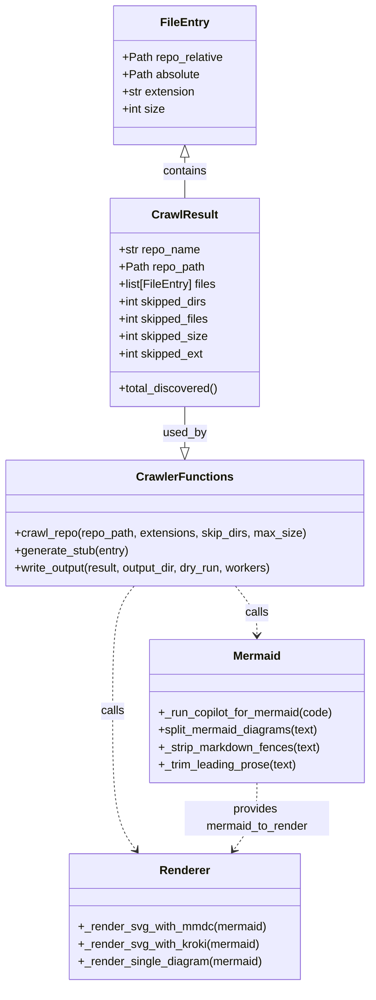
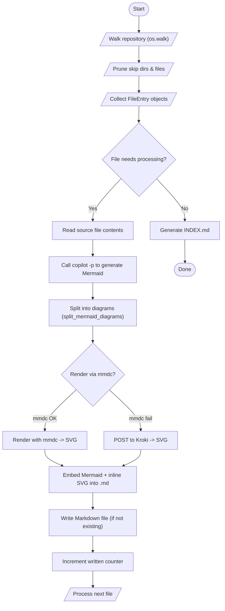

# Diagram: shipment_core/shipment_trip_plan_service/config/config.alpha.yml

> Auto-generated by Obscura crawlers

## Diagram 1

### SVG

<svg id="container" width="513.498046875" xmlns="http://www.w3.org/2000/svg" class="classDiagram" height="1362" viewBox="0 0 513.498046875 1362" role="graphics-document document" aria-roledescription="class"><g><defs><marker id="container_class-aggregationStart" class="marker aggregation class" refX="18" refY="7" markerWidth="190" markerHeight="240" orient="auto"><path d="M 18,7 L9,13 L1,7 L9,1 Z"></path></marker></defs><defs><marker id="container_class-aggregationEnd" class="marker aggregation class" refX="1" refY="7" markerWidth="20" markerHeight="28" orient="auto"><path d="M 18,7 L9,13 L1,7 L9,1 Z"></path></marker></defs><defs><marker id="container_class-extensionStart" class="marker extension class" refX="18" refY="7" markerWidth="190" markerHeight="240" orient="auto"><path d="M 1,7 L18,13 V 1 Z"></path></marker></defs><defs><marker id="container_class-extensionEnd" class="marker extension class" refX="1" refY="7" markerWidth="20" markerHeight="28" orient="auto"><path d="M 1,1 V 13 L18,7 Z"></path></marker></defs><defs><marker id="container_class-compositionStart" class="marker composition class" refX="18" refY="7" markerWidth="190" markerHeight="240" orient="auto"><path d="M 18,7 L9,13 L1,7 L9,1 Z"></path></marker></defs><defs><marker id="container_class-compositionEnd" class="marker composition class" refX="1" refY="7" markerWidth="20" markerHeight="28" orient="auto"><path d="M 18,7 L9,13 L1,7 L9,1 Z"></path></marker></defs><defs><marker id="container_class-dependencyStart" class="marker dependency class" refX="6" refY="7" markerWidth="190" markerHeight="240" orient="auto"><path d="M 5,7 L9,13 L1,7 L9,1 Z"></path></marker></defs><defs><marker id="container_class-dependencyEnd" class="marker dependency class" refX="13" refY="7" markerWidth="20" markerHeight="28" orient="auto"><path d="M 18,7 L9,13 L14,7 L9,1 Z"></path></marker></defs><defs><marker id="container_class-lollipopStart" class="marker lollipop class" refX="13" refY="7" markerWidth="190" markerHeight="240" orient="auto"><circle stroke="black" fill="transparent" cx="7" cy="7" r="6"></circle></marker></defs><defs><marker id="container_class-lollipopEnd" class="marker lollipop class" refX="1" refY="7" markerWidth="190" markerHeight="240" orient="auto"><circle stroke="black" fill="transparent" cx="7" cy="7" r="6"></circle></marker></defs><g class="root"><g class="clusters"></g><g class="edgePaths"><path d="M254.313,217.25L254.313,220.542C254.313,223.833,254.313,230.417,254.313,239.875C254.313,249.333,254.313,261.667,254.313,267.833L254.313,274" id="id_FileEntry_CrawlResult_1" class="edge-thickness-normal edge-pattern-solid relation" style=";;;" data-edge="true" data-et="edge" data-id="id_FileEntry_CrawlResult_1" data-points="W3sieCI6MjU0LjMxMjUsInkiOjIwMH0seyJ4IjoyNTQuMzEyNSwieSI6MjM3fSx7IngiOjI1NC4zMTI1LCJ5IjoyNzR9XQ==" marker-start="url(#container_class-extensionStart)"></path><path d="M254.313,562L254.313,568.167C254.313,574.333,254.313,586.667,254.313,596.125C254.313,605.583,254.313,612.167,254.313,615.458L254.313,618.75" id="id_CrawlResult_CrawlerFunctions_2" class="edge-thickness-normal edge-pattern-solid relation" style=";;;" data-edge="true" data-et="edge" data-id="id_CrawlResult_CrawlerFunctions_2" data-points="W3sieCI6MjU0LjMxMjUsInkiOjU2Mn0seyJ4IjoyNTQuMzEyNSwieSI6NTk5fSx7IngiOjI1NC4zMTI1LCJ5Ijo2MzZ9XQ==" marker-end="url(#container_class-extensionEnd)"></path><path d="M325.089,810L330.106,816.167C335.123,822.333,345.156,834.667,350.173,846C355.189,857.333,355.189,867.667,355.189,872.833L355.189,878" id="id_CrawlerFunctions_Mermaid_3" class="edge-thickness-normal edge-pattern-dashed relation" style=";;;" data-edge="true" data-et="edge" data-id="id_CrawlerFunctions_Mermaid_3" data-points="W3sieCI6MzI1LjA4OTA3MTk1MDYwNDgsInkiOjgxMH0seyJ4IjozNTUuMTg5NDUzMTI1LCJ5Ijo4NDd9LHsieCI6MzU1LjE4OTQ1MzEyNSwieSI6ODg0fV0=" marker-end="url(#container_class-dependencyEnd)"></path><path d="M183.536,810L178.519,816.167C173.502,822.333,163.469,834.667,158.452,863.5C153.436,892.333,153.436,937.667,153.436,985C153.436,1032.333,153.436,1081.667,158.897,1113.697C164.359,1145.727,175.283,1160.454,180.745,1167.817L186.206,1175.181" id="id_CrawlerFunctions_Renderer_4" class="edge-thickness-normal edge-pattern-dashed relation" style=";;;" data-edge="true" data-et="edge" data-id="id_CrawlerFunctions_Renderer_4" data-points="W3sieCI6MTgzLjUzNTkyODA0OTM5NTE4LCJ5Ijo4MTB9LHsieCI6MTUzLjQzNTU0Njg3NSwieSI6ODQ3fSx7IngiOjE1My40MzU1NDY4NzUsInkiOjk4M30seyJ4IjoxNTMuNDM1NTQ2ODc1LCJ5IjoxMTMxfSx7IngiOjE4OS43ODA5MTk2OTIwOTU2LCJ5IjoxMTgwfV0=" marker-end="url(#container_class-dependencyEnd)"></path><path d="M355.189,1082L355.189,1090.167C355.189,1098.333,355.189,1114.667,349.728,1130.197C344.266,1145.727,333.342,1160.454,327.88,1167.817L322.419,1175.181" id="id_Mermaid_Renderer_5" class="edge-thickness-normal edge-pattern-dashed relation" style=";;;" data-edge="true" data-et="edge" data-id="id_Mermaid_Renderer_5" data-points="W3sieCI6MzU1LjE4OTQ1MzEyNSwieSI6MTA4Mn0seyJ4IjozNTUuMTg5NDUzMTI1LCJ5IjoxMTMxfSx7IngiOjMxOC44NDQwODAzMDc5MDQ0LCJ5IjoxMTgwfV0=" marker-end="url(#container_class-dependencyEnd)"></path></g><g class="edgeLabels"><g class="edgeLabel" transform="translate(254.3125, 237)"><g class="label" data-id="id_FileEntry_CrawlResult_1" transform="translate(-30.890625, -12)"><foreignObject width="61.78125" height="24">

contains

</foreignObject></g></g><g class="edgeLabel" transform="translate(254.3125, 599)"><g class="label" data-id="id_CrawlResult_CrawlerFunctions_2" transform="translate(-30.359375, -12)"><foreignObject width="60.71875" height="24">

used_by

</foreignObject></g></g><g class="edgeLabel" transform="translate(355.189453125, 847)"><g class="label" data-id="id_CrawlerFunctions_Mermaid_3" transform="translate(-16.4453125, -12)"><foreignObject width="32.890625" height="24">

calls

</foreignObject></g></g><g class="edgeLabel" transform="translate(153.435546875, 983)"><g class="label" data-id="id_CrawlerFunctions_Renderer_4" transform="translate(-16.4453125, -12)"><foreignObject width="32.890625" height="24">

calls

</foreignObject></g></g><g class="edgeLabel" transform="translate(355.189453125, 1131)"><g class="label" data-id="id_Mermaid_Renderer_5" transform="translate(-100, -24)"><foreignObject width="200" height="48">

provides mermaid_to_render

</foreignObject></g></g></g><g class="nodes"><g class="node default" id="classId-FileEntry-0" transform="translate(254.3125, 104)"><g class="basic label-container"><path d="M-98.0859375 -96 L98.0859375 -96 L98.0859375 96 L-98.0859375 96" stroke="none" stroke-width="0" fill="#ECECFF" style=""></path><path d="M-98.0859375 -96 C-28.097125793881702 -96, 41.891685912236596 -96, 98.0859375 -96 M-98.0859375 -96 C-24.049482614587404 -96, 49.98697227082519 -96, 98.0859375 -96 M98.0859375 -96 C98.0859375 -50.42309800368036, 98.0859375 -4.846196007360717, 98.0859375 96 M98.0859375 -96 C98.0859375 -54.041476714529544, 98.0859375 -12.082953429059089, 98.0859375 96 M98.0859375 96 C50.966702747768224 96, 3.847467995536448 96, -98.0859375 96 M98.0859375 96 C48.10460674354352 96, -1.876724012912959 96, -98.0859375 96 M-98.0859375 96 C-98.0859375 39.29555921152296, -98.0859375 -17.408881576954073, -98.0859375 -96 M-98.0859375 96 C-98.0859375 53.08988981397749, -98.0859375 10.179779627954986, -98.0859375 -96" stroke="#9370DB" stroke-width="1.3" fill="none" stroke-dasharray="0 0" style=""></path></g><g class="annotation-group text" transform="translate(0, -72)"></g><g class="label-group text" transform="translate(-31.859375, -72)"><g class="label" style="font-weight: bolder" transform="translate(0,-12)"><foreignObject width="63.71875" height="24">

FileEntry

</foreignObject></g></g><g class="members-group text" transform="translate(-86.0859375, -24)"><g class="label" style="" transform="translate(0,-12)"><foreignObject width="140.3125" height="24">

+Path repo_relative

</foreignObject></g><g class="label" style="" transform="translate(0,12)"><foreignObject width="107.78125" height="24">

+Path absolute

</foreignObject></g><g class="label" style="" transform="translate(0,36)"><foreignObject width="102.328125" height="24">

+str extension

</foreignObject></g><g class="label" style="" transform="translate(0,60)"><foreignObject width="59.484375" height="24">

+int size

</foreignObject></g></g><g class="methods-group text" transform="translate(-86.0859375, 96)"></g><g class="divider" style=""><path d="M-98.0859375 -48 C-46.764091887713505 -48, 4.55775372457299 -48, 98.0859375 -48 M-98.0859375 -48 C-37.28049063850948 -48, 23.524956222981046 -48, 98.0859375 -48" stroke="#9370DB" stroke-width="1.3" fill="none" stroke-dasharray="0 0" style=""></path></g><g class="divider" style=""><path d="M-98.0859375 72 C-54.08350773350242 72, -10.081077967004845 72, 98.0859375 72 M-98.0859375 72 C-40.959414481796934 72, 16.167108536406133 72, 98.0859375 72" stroke="#9370DB" stroke-width="1.3" fill="none" stroke-dasharray="0 0" style=""></path></g></g><g class="node default" id="classId-CrawlResult-1" transform="translate(254.3125, 418)"><g class="basic label-container"><path d="M-103.0078125 -144 L103.0078125 -144 L103.0078125 144 L-103.0078125 144" stroke="none" stroke-width="0" fill="#ECECFF" style=""></path><path d="M-103.0078125 -144 C-37.340576458065044 -144, 28.326659583869912 -144, 103.0078125 -144 M-103.0078125 -144 C-50.338157323402115 -144, 2.3314978531957706 -144, 103.0078125 -144 M103.0078125 -144 C103.0078125 -59.712445619589914, 103.0078125 24.57510876082017, 103.0078125 144 M103.0078125 -144 C103.0078125 -73.83648626508827, 103.0078125 -3.672972530176537, 103.0078125 144 M103.0078125 144 C24.317383025380053 144, -54.373046449239894 144, -103.0078125 144 M103.0078125 144 C35.70690799156327 144, -31.59399651687346 144, -103.0078125 144 M-103.0078125 144 C-103.0078125 37.94654362414815, -103.0078125 -68.1069127517037, -103.0078125 -144 M-103.0078125 144 C-103.0078125 39.85504669717051, -103.0078125 -64.28990660565898, -103.0078125 -144" stroke="#9370DB" stroke-width="1.3" fill="none" stroke-dasharray="0 0" style=""></path></g><g class="annotation-group text" transform="translate(0, -120)"></g><g class="label-group text" transform="translate(-43.28125, -120)"><g class="label" style="font-weight: bolder" transform="translate(0,-12)"><foreignObject width="86.5625" height="24">

CrawlResult

</foreignObject></g></g><g class="members-group text" transform="translate(-91.0078125, -72)"><g class="label" style="" transform="translate(0,-12)"><foreignObject width="113.4375" height="24">

+str repo_name

</foreignObject></g><g class="label" style="" transform="translate(0,12)"><foreignObject width="118.96875" height="24">

+Path repo_path

</foreignObject></g><g class="label" style="" transform="translate(0,36)"><foreignObject width="137.71875" height="24">

+list[FileEntry] files

</foreignObject></g><g class="label" style="" transform="translate(0,60)"><foreignObject width="124.859375" height="24">

+int skipped_dirs

</foreignObject></g><g class="label" style="" transform="translate(0,84)"><foreignObject width="127.375" height="24">

+int skipped_files

</foreignObject></g><g class="label" style="" transform="translate(0,108)"><foreignObject width="125.265625" height="24">

+int skipped_size

</foreignObject></g><g class="label" style="" transform="translate(0,132)"><foreignObject width="119.484375" height="24">

+int skipped_ext

</foreignObject></g></g><g class="methods-group text" transform="translate(-91.0078125, 120)"><g class="label" style="" transform="translate(0,-12)"><foreignObject width="138.734375" height="24">

+total_discovered()

</foreignObject></g></g><g class="divider" style=""><path d="M-103.0078125 -96 C-32.98799649011855 -96, 37.031819519762905 -96, 103.0078125 -96 M-103.0078125 -96 C-46.848728836085904 -96, 9.310354827828192 -96, 103.0078125 -96" stroke="#9370DB" stroke-width="1.3" fill="none" stroke-dasharray="0 0" style=""></path></g><g class="divider" style=""><path d="M-103.0078125 96 C-24.71758144193427 96, 53.57264961613146 96, 103.0078125 96 M-103.0078125 96 C-53.226344865833006 96, -3.4448772316660126 96, 103.0078125 96" stroke="#9370DB" stroke-width="1.3" fill="none" stroke-dasharray="0 0" style=""></path></g></g><g class="node default" id="classId-CrawlerFunctions-2" transform="translate(254.3125, 723)"><g class="basic label-container"><path d="M-246.3125 -87 L246.3125 -87 L246.3125 87 L-246.3125 87" stroke="none" stroke-width="0" fill="#ECECFF" style=""></path><path d="M-246.3125 -87 C-136.52535306317378 -87, -26.738206126347535 -87, 246.3125 -87 M-246.3125 -87 C-75.67191640082882 -87, 94.96866719834236 -87, 246.3125 -87 M246.3125 -87 C246.3125 -25.219520040175247, 246.3125 36.560959919649505, 246.3125 87 M246.3125 -87 C246.3125 -18.126108585951968, 246.3125 50.747782828096064, 246.3125 87 M246.3125 87 C128.50062428823628 87, 10.688748576472562 87, -246.3125 87 M246.3125 87 C145.41464580416877 87, 44.51679160833754 87, -246.3125 87 M-246.3125 87 C-246.3125 28.592360484774304, -246.3125 -29.815279030451393, -246.3125 -87 M-246.3125 87 C-246.3125 43.285392732584285, -246.3125 -0.4292145348314307, -246.3125 -87" stroke="#9370DB" stroke-width="1.3" fill="none" stroke-dasharray="0 0" style=""></path></g><g class="annotation-group text" transform="translate(0, -63)"></g><g class="label-group text" transform="translate(-62.859375, -63)"><g class="label" style="font-weight: bolder" transform="translate(0,-12)"><foreignObject width="125.71875" height="24">

CrawlerFunctions

</foreignObject></g></g><g class="members-group text" transform="translate(-234.3125, -15)"></g><g class="methods-group text" transform="translate(-234.3125, 15)"><g class="label" style="" transform="translate(0,-12)"><foreignObject width="405.765625" height="24">

+crawl_repo(repo_path, extensions, skip_dirs, max_size)

</foreignObject></g><g class="label" style="" transform="translate(0,12)"><foreignObject width="159.796875" height="24">

+generate_stub(entry)

</foreignObject></g><g class="label" style="" transform="translate(0,36)"><foreignObject width="366.9375" height="24">

+write_output(result, output_dir, dry_run, workers)

</foreignObject></g></g><g class="divider" style=""><path d="M-246.3125 -39 C-70.68945354440805 -39, 104.9335929111839 -39, 246.3125 -39 M-246.3125 -39 C-117.85599323129907 -39, 10.600513537401866 -39, 246.3125 -39" stroke="#9370DB" stroke-width="1.3" fill="none" stroke-dasharray="0 0" style=""></path></g><g class="divider" style=""><path d="M-246.3125 -15 C-90.5562146336151 -15, 65.2000707327698 -15, 246.3125 -15 M-246.3125 -15 C-74.1462370252936 -15, 98.0200259494128 -15, 246.3125 -15" stroke="#9370DB" stroke-width="1.3" fill="none" stroke-dasharray="0 0" style=""></path></g></g><g class="node default" id="classId-Mermaid-3" transform="translate(355.189453125, 983)"><g class="basic label-container"><path d="M-150.30859375 -99 L150.30859375 -99 L150.30859375 99 L-150.30859375 99" stroke="none" stroke-width="0" fill="#ECECFF" style=""></path><path d="M-150.30859375 -99 C-57.87102627434335 -99, 34.5665412013133 -99, 150.30859375 -99 M-150.30859375 -99 C-52.389716014408975 -99, 45.52916172118205 -99, 150.30859375 -99 M150.30859375 -99 C150.30859375 -28.28944433580311, 150.30859375 42.42111132839378, 150.30859375 99 M150.30859375 -99 C150.30859375 -34.71829295636995, 150.30859375 29.5634140872601, 150.30859375 99 M150.30859375 99 C43.755267673694576 99, -62.79805840261085 99, -150.30859375 99 M150.30859375 99 C76.66544049486347 99, 3.02228723972695 99, -150.30859375 99 M-150.30859375 99 C-150.30859375 53.02807240948288, -150.30859375 7.0561448189657625, -150.30859375 -99 M-150.30859375 99 C-150.30859375 37.0549249416469, -150.30859375 -24.890150116706195, -150.30859375 -99" stroke="#9370DB" stroke-width="1.3" fill="none" stroke-dasharray="0 0" style=""></path></g><g class="annotation-group text" transform="translate(0, -75)"></g><g class="label-group text" transform="translate(-32.1171875, -75)"><g class="label" style="font-weight: bolder" transform="translate(0,-12)"><foreignObject width="64.234375" height="24">

Mermaid

</foreignObject></g></g><g class="members-group text" transform="translate(-138.30859375, -27)"></g><g class="methods-group text" transform="translate(-138.30859375, 3)"><g class="label" style="" transform="translate(0,-12)"><foreignObject width="244.5" height="24">

+_run_copilot_for_mermaid(code)

</foreignObject></g><g class="label" style="" transform="translate(0,12)"><foreignObject width="225.828125" height="24">

+split_mermaid_diagrams(text)

</foreignObject></g><g class="label" style="" transform="translate(0,36)"><foreignObject width="225.703125" height="24">

+_strip_markdown_fences(text)

</foreignObject></g><g class="label" style="" transform="translate(0,60)"><foreignObject width="193.828125" height="24">

+_trim_leading_prose(text)

</foreignObject></g></g><g class="divider" style=""><path d="M-150.30859375 -51 C-44.14327307574489 -51, 62.02204759851023 -51, 150.30859375 -51 M-150.30859375 -51 C-34.906670101096424 -51, 80.49525354780715 -51, 150.30859375 -51" stroke="#9370DB" stroke-width="1.3" fill="none" stroke-dasharray="0 0" style=""></path></g><g class="divider" style=""><path d="M-150.30859375 -27 C-60.59547995347614 -27, 29.117633843047713 -27, 150.30859375 -27 M-150.30859375 -27 C-74.83014022560026 -27, 0.6483132987994793 -27, 150.30859375 -27" stroke="#9370DB" stroke-width="1.3" fill="none" stroke-dasharray="0 0" style=""></path></g></g><g class="node default" id="classId-Renderer-4" transform="translate(254.3125, 1267)"><g class="basic label-container"><path d="M-159.4921875 -87 L159.4921875 -87 L159.4921875 87 L-159.4921875 87" stroke="none" stroke-width="0" fill="#ECECFF" style=""></path><path d="M-159.4921875 -87 C-86.98664064298895 -87, -14.48109378597789 -87, 159.4921875 -87 M-159.4921875 -87 C-87.55594260074842 -87, -15.619697701496847 -87, 159.4921875 -87 M159.4921875 -87 C159.4921875 -32.957177491095415, 159.4921875 21.08564501780917, 159.4921875 87 M159.4921875 -87 C159.4921875 -34.629848077647665, 159.4921875 17.74030384470467, 159.4921875 87 M159.4921875 87 C49.207211505080934 87, -61.07776448983813 87, -159.4921875 87 M159.4921875 87 C95.49868783645121 87, 31.505188172902436 87, -159.4921875 87 M-159.4921875 87 C-159.4921875 36.815911879678055, -159.4921875 -13.36817624064389, -159.4921875 -87 M-159.4921875 87 C-159.4921875 32.72167719611374, -159.4921875 -21.556645607772523, -159.4921875 -87" stroke="#9370DB" stroke-width="1.3" fill="none" stroke-dasharray="0 0" style=""></path></g><g class="annotation-group text" transform="translate(0, -63)"></g><g class="label-group text" transform="translate(-33.65625, -63)"><g class="label" style="font-weight: bolder" transform="translate(0,-12)"><foreignObject width="67.3125" height="24">

Renderer

</foreignObject></g></g><g class="members-group text" transform="translate(-147.4921875, -15)"></g><g class="methods-group text" transform="translate(-147.4921875, 15)"><g class="label" style="" transform="translate(0,-12)"><foreignObject width="261.328125" height="24">

+_render_svg_with_mmdc(mermaid)

</foreignObject></g><g class="label" style="" transform="translate(0,12)"><foreignObject width="252.609375" height="24">

+_render_svg_with_kroki(mermaid)

</foreignObject></g><g class="label" style="" transform="translate(0,36)"><foreignObject width="255.46875" height="24">

+_render_single_diagram(mermaid)

</foreignObject></g></g><g class="divider" style=""><path d="M-159.4921875 -39 C-81.0444924133787 -39, -2.596797326757411 -39, 159.4921875 -39 M-159.4921875 -39 C-71.52623600709491 -39, 16.439715485810183 -39, 159.4921875 -39" stroke="#9370DB" stroke-width="1.3" fill="none" stroke-dasharray="0 0" style=""></path></g><g class="divider" style=""><path d="M-159.4921875 -15 C-87.56227956431773 -15, -15.632371628635468 -15, 159.4921875 -15 M-159.4921875 -15 C-82.58600334699383 -15, -5.679819193987669 -15, 159.4921875 -15" stroke="#9370DB" stroke-width="1.3" fill="none" stroke-dasharray="0 0" style=""></path></g></g></g></g></g></svg>

## Diagram 2

### SVG

<svg id="container" width="649" xmlns="http://www.w3.org/2000/svg" class="flowchart" height="1786.09375" viewBox="0 0 649 1786.09375" role="graphics-document document" aria-roledescription="flowchart-v2"><g><marker id="container_flowchart-v2-pointEnd" class="marker flowchart-v2" viewBox="0 0 10 10" refX="5" refY="5" markerUnits="userSpaceOnUse" markerWidth="8" markerHeight="8" orient="auto"><path d="M 0 0 L 10 5 L 0 10 z" class="arrowMarkerPath" style="stroke-width: 1; stroke-dasharray: 1, 0;"></path></marker><marker id="container_flowchart-v2-pointStart" class="marker flowchart-v2" viewBox="0 0 10 10" refX="4.5" refY="5" markerUnits="userSpaceOnUse" markerWidth="8" markerHeight="8" orient="auto"><path d="M 0 5 L 10 10 L 10 0 z" class="arrowMarkerPath" style="stroke-width: 1; stroke-dasharray: 1, 0;"></path></marker><marker id="container_flowchart-v2-circleEnd" class="marker flowchart-v2" viewBox="0 0 10 10" refX="11" refY="5" markerUnits="userSpaceOnUse" markerWidth="11" markerHeight="11" orient="auto"><circle cx="5" cy="5" r="5" class="arrowMarkerPath" style="stroke-width: 1; stroke-dasharray: 1, 0;"></circle></marker><marker id="container_flowchart-v2-circleStart" class="marker flowchart-v2" viewBox="0 0 10 10" refX="-1" refY="5" markerUnits="userSpaceOnUse" markerWidth="11" markerHeight="11" orient="auto"><circle cx="5" cy="5" r="5" class="arrowMarkerPath" style="stroke-width: 1; stroke-dasharray: 1, 0;"></circle></marker><marker id="container_flowchart-v2-crossEnd" class="marker cross flowchart-v2" viewBox="0 0 11 11" refX="12" refY="5.2" markerUnits="userSpaceOnUse" markerWidth="11" markerHeight="11" orient="auto"><path d="M 1,1 l 9,9 M 10,1 l -9,9" class="arrowMarkerPath" style="stroke-width: 2; stroke-dasharray: 1, 0;"></path></marker><marker id="container_flowchart-v2-crossStart" class="marker cross flowchart-v2" viewBox="0 0 11 11" refX="-1" refY="5.2" markerUnits="userSpaceOnUse" markerWidth="11" markerHeight="11" orient="auto"><path d="M 1,1 l 9,9 M 10,1 l -9,9" class="arrowMarkerPath" style="stroke-width: 2; stroke-dasharray: 1, 0;"></path></marker><g class="root"><g class="clusters"></g><g class="edgePaths"><path d="M405.906,47.5L405.823,51.583C405.74,55.667,405.573,63.833,405.56,71.5C405.547,79.167,405.687,86.334,405.758,89.917L405.828,93.501" id="L_Start_Walk_0" class="edge-thickness-normal edge-pattern-solid edge-thickness-normal edge-pattern-solid flowchart-link" style=";" data-edge="true" data-et="edge" data-id="L_Start_Walk_0" data-points="W3sieCI6NDA1LjkwNjI1LCJ5Ijo0Ny41fSx7IngiOjQwNS40MDYyNSwieSI6NzJ9LHsieCI6NDA1LjkwNjI1LCJ5Ijo5Ny41fV0=" marker-end="url(#container_flowchart-v2-pointEnd)"></path><path d="M405.906,136.5L405.823,140.583C405.74,144.667,405.573,152.833,405.56,160.5C405.547,168.167,405.687,175.334,405.758,178.917L405.828,182.501" id="L_Walk_Prune_0" class="edge-thickness-normal edge-pattern-solid edge-thickness-normal edge-pattern-solid flowchart-link" style=";" data-edge="true" data-et="edge" data-id="L_Walk_Prune_0" data-points="W3sieCI6NDA1LjkwNjI1LCJ5IjoxMzYuNX0seyJ4Ijo0MDUuNDA2MjUsInkiOjE2MX0seyJ4Ijo0MDUuOTA2MjUsInkiOjE4Ni41fV0=" marker-end="url(#container_flowchart-v2-pointEnd)"></path><path d="M405.906,225.5L405.823,229.583C405.74,233.667,405.573,241.833,405.56,249.5C405.547,257.167,405.687,264.334,405.758,267.917L405.828,271.501" id="L_Prune_Discover_0" class="edge-thickness-normal edge-pattern-solid edge-thickness-normal edge-pattern-solid flowchart-link" style=";" data-edge="true" data-et="edge" data-id="L_Prune_Discover_0" data-points="W3sieCI6NDA1LjkwNjI1LCJ5IjoyMjUuNX0seyJ4Ijo0MDUuNDA2MjUsInkiOjI1MH0seyJ4Ijo0MDUuOTA2MjUsInkiOjI3NS41fV0=" marker-end="url(#container_flowchart-v2-pointEnd)"></path><path d="M405.906,314.5L405.823,318.583C405.74,322.667,405.573,330.833,405.49,338.417C405.406,346,405.406,353,405.406,356.5L405.406,360" id="L_Discover_ForEach_0" class="edge-thickness-normal edge-pattern-solid edge-thickness-normal edge-pattern-solid flowchart-link" style=";" data-edge="true" data-et="edge" data-id="L_Discover_ForEach_0" data-points="W3sieCI6NDA1LjkwNjI1LCJ5IjozMTQuNX0seyJ4Ijo0MDUuNDA2MjUsInkiOjMzOX0seyJ4Ijo0MDUuNDA2MjUsInkiOjM2NH1d" marker-end="url(#container_flowchart-v2-pointEnd)"></path><path d="M353.204,527.892L339.307,542.759C325.41,557.626,297.615,587.36,283.718,607.727C269.82,628.094,269.82,639.094,269.82,644.594L269.82,650.094" id="L_ForEach_Read_0" class="edge-thickness-normal edge-pattern-solid edge-thickness-normal edge-pattern-solid flowchart-link" style=";" data-edge="true" data-et="edge" data-id="L_ForEach_Read_0" data-points="W3sieCI6MzUzLjIwNDA5NzYyMDQ3MjcsInkiOjUyNy44OTE1OTc2MjA0NzI3fSx7IngiOjI2OS44MjAzMTI1LCJ5Ijo2MTcuMDkzNzV9LHsieCI6MjY5LjgyMDMxMjUsInkiOjY1NC4wOTM3NX1d" marker-end="url(#container_flowchart-v2-pointEnd)"></path><path d="M269.82,708.094L269.82,712.26C269.82,716.427,269.82,724.76,269.82,732.427C269.82,740.094,269.82,747.094,269.82,750.594L269.82,754.094" id="L_Read_Copilot_0" class="edge-thickness-normal edge-pattern-solid edge-thickness-normal edge-pattern-solid flowchart-link" style=";" data-edge="true" data-et="edge" data-id="L_Read_Copilot_0" data-points="W3sieCI6MjY5LjgyMDMxMjUsInkiOjcwOC4wOTM3NX0seyJ4IjoyNjkuODIwMzEyNSwieSI6NzMzLjA5Mzc1fSx7IngiOjI2OS44MjAzMTI1LCJ5Ijo3NTguMDkzNzV9XQ==" marker-end="url(#container_flowchart-v2-pointEnd)"></path><path d="M269.82,836.094L269.82,840.26C269.82,844.427,269.82,852.76,269.82,860.427C269.82,868.094,269.82,875.094,269.82,878.594L269.82,882.094" id="L_Copilot_Split_0" class="edge-thickness-normal edge-pattern-solid edge-thickness-normal edge-pattern-solid flowchart-link" style=";" data-edge="true" data-et="edge" data-id="L_Copilot_Split_0" data-points="W3sieCI6MjY5LjgyMDMxMjUsInkiOjgzNi4wOTM3NX0seyJ4IjoyNjkuODIwMzEyNSwieSI6ODYxLjA5Mzc1fSx7IngiOjI2OS44MjAzMTI1LCJ5Ijo4ODYuMDkzNzV9XQ==" marker-end="url(#container_flowchart-v2-pointEnd)"></path><path d="M269.82,964.094L269.82,968.26C269.82,972.427,269.82,980.76,269.82,988.427C269.82,996.094,269.82,1003.094,269.82,1006.594L269.82,1010.094" id="L_Split_RenderChoice_0" class="edge-thickness-normal edge-pattern-solid edge-thickness-normal edge-pattern-solid flowchart-link" style=";" data-edge="true" data-et="edge" data-id="L_Split_RenderChoice_0" data-points="W3sieCI6MjY5LjgyMDMxMjUsInkiOjk2NC4wOTM3NX0seyJ4IjoyNjkuODIwMzEyNSwieSI6OTg5LjA5Mzc1fSx7IngiOjI2OS44MjAzMTI1LCJ5IjoxMDE0LjA5Mzc1fV0=" marker-end="url(#container_flowchart-v2-pointEnd)"></path><path d="M221.668,1152.942L206.598,1167.134C191.529,1181.326,161.389,1209.71,146.32,1229.402C131.25,1249.094,131.25,1260.094,131.25,1265.594L131.25,1271.094" id="L_RenderChoice_MMDC_0" class="edge-thickness-normal edge-pattern-solid edge-thickness-normal edge-pattern-solid flowchart-link" style=";" data-edge="true" data-et="edge" data-id="L_RenderChoice_MMDC_0" data-points="W3sieCI6MjIxLjY2ODEyNDcwMDU3NDksInkiOjExNTIuOTQxNTYyMjAwNTc1fSx7IngiOjEzMS4yNSwieSI6MTIzOC4wOTM3NX0seyJ4IjoxMzEuMjUsInkiOjEyNzUuMDkzNzV9XQ==" marker-end="url(#container_flowchart-v2-pointEnd)"></path><path d="M317.973,1152.942L333.042,1167.134C348.112,1181.326,378.251,1209.71,393.321,1229.402C408.391,1249.094,408.391,1260.094,408.391,1265.594L408.391,1271.094" id="L_RenderChoice_Kroki_0" class="edge-thickness-normal edge-pattern-solid edge-thickness-normal edge-pattern-solid flowchart-link" style=";" data-edge="true" data-et="edge" data-id="L_RenderChoice_Kroki_0" data-points="W3sieCI6MzE3Ljk3MjUwMDI5OTQyNTEsInkiOjExNTIuOTQxNTYyMjAwNTc1fSx7IngiOjQwOC4zOTA2MjUsInkiOjEyMzguMDkzNzV9LHsieCI6NDA4LjM5MDYyNSwieSI6MTI3NS4wOTM3NX1d" marker-end="url(#container_flowchart-v2-pointEnd)"></path><path d="M131.25,1329.094L131.25,1333.26C131.25,1337.427,131.25,1345.76,139.666,1353.814C148.083,1361.868,164.915,1369.642,173.331,1373.529L181.748,1377.417" id="L_MMDC_Embed_0" class="edge-thickness-normal edge-pattern-solid edge-thickness-normal edge-pattern-solid flowchart-link" style=";" data-edge="true" data-et="edge" data-id="L_MMDC_Embed_0" data-points="W3sieCI6MTMxLjI1LCJ5IjoxMzI5LjA5Mzc1fSx7IngiOjEzMS4yNSwieSI6MTM1NC4wOTM3NX0seyJ4IjoxODUuMzc5MDI4MzIwMzEyNSwieSI6MTM3OS4wOTM3NX1d" marker-end="url(#container_flowchart-v2-pointEnd)"></path><path d="M408.391,1329.094L408.391,1333.26C408.391,1337.427,408.391,1345.76,399.974,1353.814C391.558,1361.868,374.726,1369.642,366.309,1373.529L357.893,1377.417" id="L_Kroki_Embed_0" class="edge-thickness-normal edge-pattern-solid edge-thickness-normal edge-pattern-solid flowchart-link" style=";" data-edge="true" data-et="edge" data-id="L_Kroki_Embed_0" data-points="W3sieCI6NDA4LjM5MDYyNSwieSI6MTMyOS4wOTM3NX0seyJ4Ijo0MDguMzkwNjI1LCJ5IjoxMzU0LjA5Mzc1fSx7IngiOjM1NC4yNjE1OTY2Nzk2ODc1LCJ5IjoxMzc5LjA5Mzc1fV0=" marker-end="url(#container_flowchart-v2-pointEnd)"></path><path d="M269.82,1457.094L269.82,1461.26C269.82,1465.427,269.82,1473.76,269.82,1481.427C269.82,1489.094,269.82,1496.094,269.82,1499.594L269.82,1503.094" id="L_Embed_Write_0" class="edge-thickness-normal edge-pattern-solid edge-thickness-normal edge-pattern-solid flowchart-link" style=";" data-edge="true" data-et="edge" data-id="L_Embed_Write_0" data-points="W3sieCI6MjY5LjgyMDMxMjUsInkiOjE0NTcuMDkzNzV9LHsieCI6MjY5LjgyMDMxMjUsInkiOjE0ODIuMDkzNzV9LHsieCI6MjY5LjgyMDMxMjUsInkiOjE1MDcuMDkzNzV9XQ==" marker-end="url(#container_flowchart-v2-pointEnd)"></path><path d="M269.82,1585.094L269.82,1589.26C269.82,1593.427,269.82,1601.76,269.82,1609.427C269.82,1617.094,269.82,1624.094,269.82,1627.594L269.82,1631.094" id="L_Write_Counter_0" class="edge-thickness-normal edge-pattern-solid edge-thickness-normal edge-pattern-solid flowchart-link" style=";" data-edge="true" data-et="edge" data-id="L_Write_Counter_0" data-points="W3sieCI6MjY5LjgyMDMxMjUsInkiOjE1ODUuMDkzNzV9LHsieCI6MjY5LjgyMDMxMjUsInkiOjE2MTAuMDkzNzV9LHsieCI6MjY5LjgyMDMxMjUsInkiOjE2MzUuMDkzNzV9XQ==" marker-end="url(#container_flowchart-v2-pointEnd)"></path><path d="M269.82,1689.094L269.82,1693.26C269.82,1697.427,269.82,1705.76,269.891,1713.511C269.961,1721.261,270.101,1728.428,270.172,1732.011L270.242,1735.595" id="L_Counter_LoopBack_0" class="edge-thickness-normal edge-pattern-solid edge-thickness-normal edge-pattern-solid flowchart-link" style=";" data-edge="true" data-et="edge" data-id="L_Counter_LoopBack_0" data-points="W3sieCI6MjY5LjgyMDMxMjUsInkiOjE2ODkuMDkzNzV9LHsieCI6MjY5LjgyMDMxMjUsInkiOjE3MTQuMDkzNzV9LHsieCI6MjcwLjMyMDMxMjUsInkiOjE3MzkuNTkzNzV9XQ==" marker-end="url(#container_flowchart-v2-pointEnd)"></path><path d="M457.608,527.892L471.506,542.759C485.403,557.626,513.198,587.36,527.095,607.727C540.992,628.094,540.992,639.094,540.992,644.594L540.992,650.094" id="L_ForEach_IndexGen_0" class="edge-thickness-normal edge-pattern-solid edge-thickness-normal edge-pattern-solid flowchart-link" style=";" data-edge="true" data-et="edge" data-id="L_ForEach_IndexGen_0" data-points="W3sieCI6NDU3LjYwODQwMjM3OTUyNzMsInkiOjUyNy44OTE1OTc2MjA0NzI3fSx7IngiOjU0MC45OTIxODc1LCJ5Ijo2MTcuMDkzNzV9LHsieCI6NTQwLjk5MjE4NzUsInkiOjY1NC4wOTM3NX1d" marker-end="url(#container_flowchart-v2-pointEnd)"></path><path d="M540.992,708.094L540.992,712.26C540.992,716.427,540.992,724.76,541.068,735.76C541.144,746.76,541.296,760.427,541.372,767.261L541.448,774.094" id="L_IndexGen_End_0" class="edge-thickness-normal edge-pattern-solid edge-thickness-normal edge-pattern-solid flowchart-link" style=";" data-edge="true" data-et="edge" data-id="L_IndexGen_End_0" data-points="W3sieCI6NTQwLjk5MjE4NzUsInkiOjcwOC4wOTM3NX0seyJ4Ijo1NDAuOTkyMTg3NSwieSI6NzMzLjA5Mzc1fSx7IngiOjU0MS40OTIxODc1LCJ5Ijo3NzguMDkzNzV9XQ==" marker-end="url(#container_flowchart-v2-pointEnd)"></path></g><g class="edgeLabels"><g class="edgeLabel"><g class="label" data-id="L_Start_Walk_0" transform="translate(0, 0)"><foreignObject width="0" height="0">

</foreignObject></g></g><g class="edgeLabel"><g class="label" data-id="L_Walk_Prune_0" transform="translate(0, 0)"><foreignObject width="0" height="0">

</foreignObject></g></g><g class="edgeLabel"><g class="label" data-id="L_Prune_Discover_0" transform="translate(0, 0)"><foreignObject width="0" height="0">

</foreignObject></g></g><g class="edgeLabel"><g class="label" data-id="L_Discover_ForEach_0" transform="translate(0, 0)"><foreignObject width="0" height="0">

</foreignObject></g></g><g class="edgeLabel" transform="translate(269.8203125, 617.09375)"><g class="label" data-id="L_ForEach_Read_0" transform="translate(-12.03125, -12)"><foreignObject width="24.0625" height="24">

Yes

</foreignObject></g></g><g class="edgeLabel"><g class="label" data-id="L_Read_Copilot_0" transform="translate(0, 0)"><foreignObject width="0" height="0">

</foreignObject></g></g><g class="edgeLabel"><g class="label" data-id="L_Copilot_Split_0" transform="translate(0, 0)"><foreignObject width="0" height="0">

</foreignObject></g></g><g class="edgeLabel"><g class="label" data-id="L_Split_RenderChoice_0" transform="translate(0, 0)"><foreignObject width="0" height="0">

</foreignObject></g></g><g class="edgeLabel" transform="translate(131.25, 1238.09375)"><g class="label" data-id="L_RenderChoice_MMDC_0" transform="translate(-34.6953125, -12)"><foreignObject width="69.390625" height="24">

mmdc OK

</foreignObject></g></g><g class="edgeLabel" transform="translate(408.390625, 1238.09375)"><g class="label" data-id="L_RenderChoice_Kroki_0" transform="translate(-35.8984375, -12)"><foreignObject width="71.796875" height="24">

mmdc fail

</foreignObject></g></g><g class="edgeLabel"><g class="label" data-id="L_MMDC_Embed_0" transform="translate(0, 0)"><foreignObject width="0" height="0">

</foreignObject></g></g><g class="edgeLabel"><g class="label" data-id="L_Kroki_Embed_0" transform="translate(0, 0)"><foreignObject width="0" height="0">

</foreignObject></g></g><g class="edgeLabel"><g class="label" data-id="L_Embed_Write_0" transform="translate(0, 0)"><foreignObject width="0" height="0">

</foreignObject></g></g><g class="edgeLabel"><g class="label" data-id="L_Write_Counter_0" transform="translate(0, 0)"><foreignObject width="0" height="0">

</foreignObject></g></g><g class="edgeLabel"><g class="label" data-id="L_Counter_LoopBack_0" transform="translate(0, 0)"><foreignObject width="0" height="0">

</foreignObject></g></g><g class="edgeLabel" transform="translate(540.9921875, 617.09375)"><g class="label" data-id="L_ForEach_IndexGen_0" transform="translate(-10.140625, -12)"><foreignObject width="20.28125" height="24">

No

</foreignObject></g></g><g class="edgeLabel"><g class="label" data-id="L_IndexGen_End_0" transform="translate(0, 0)"><foreignObject width="0" height="0">

</foreignObject></g></g></g><g class="nodes"><g class="node default" id="flowchart-Start-0" transform="translate(405.40625, 27.5)"><g class="basic label-container outer-path"><path d="M-10.3984375 -19.5 C-2.7916413415692602 -19.5, 4.8151548168614795 -19.5, 10.3984375 -19.5 C10.3984375 -19.5, 10.398437499999998 -19.5, 10.398437499999998 -19.5 C10.676765511959614 -19.491074562389066, 10.955093523919228 -19.482149124778132, 11.6478067896239 -19.45993515863156 C12.045079711919428 -19.421610717608303, 12.442352634214958 -19.383286276585043, 12.892042152847864 -19.3399052695533 C13.384661656749385 -19.26026236848381, 13.877281160650908 -19.180619467414324, 14.126030759676757 -19.140403561325776 C14.44648928033147 -19.067260995173616, 14.766947800986184 -18.994118429021455, 15.34470188623539 -18.862249829261074 C15.73925935223916 -18.745147244425556, 16.13381681824293 -18.628044659590042, 16.543047751460602 -18.50658706670804 C17.011358771456777 -18.334244282329834, 17.479669791452952 -18.16190149795163, 17.716144095147794 -18.074876768247425 C18.032725001952805 -17.93473579184378, 18.349305908757817 -17.794594815440142, 18.85917041279238 -17.568892924097174 C19.166673559553544 -17.408468729397043, 19.474176706314704 -17.24804453469691, 19.967429764076783 -16.990714730406097 C20.259535104661733 -16.81363875634198, 20.551640445246683 -16.63656278227786, 21.036368073605697 -16.342718045390892 C21.397109743140227 -16.09108027297879, 21.757851412674757 -15.839442500566685, 22.061592844578712 -15.627565626425154 C22.371932630090896 -15.380077905967713, 22.68227241560308 -15.132590185510272, 23.03889120850187 -14.848196188198123 C23.267729065401387 -14.640371701279888, 23.496566922300904 -14.432547214361653, 23.964247236767985 -14.007812326905688 C24.28085604377409 -13.680887739605405, 24.597464850780195 -13.353963152305122, 24.833858442968648 -13.10986736009568 C25.103723739040635 -12.79286822755917, 25.373589035112623 -12.47586909502266, 25.644151408126582 -12.158051136245305 C25.87912458671306 -11.843208483436365, 26.11409776529954 -11.528365830627424, 26.391796464640635 -11.156274872382312 C26.6018591421556 -10.833562189992307, 26.811921819670566 -10.510849507602302, 27.073721378604247 -10.108655082055241 C27.22891195829247 -9.83309849306856, 27.384102537980695 -9.557541904081877, 27.6871239742735 -9.019496659696287 C27.811966037746327 -8.760259443702724, 27.93680810121915 -8.50102222770916, 28.22948364880834 -7.893275190886684 C28.345152226834823 -7.607571566861451, 28.460820804861306 -7.321867942836218, 28.698571729970325 -6.734618561215508 C28.815179057945468 -6.383415868209031, 28.931786385920613 -6.032213175202553, 29.09246063421488 -5.548287939305138 C29.165837070093385 -5.268471787751919, 29.239213505971893 -4.9886556361987, 29.40953178754556 -4.339158212148133 C29.477934877687733 -3.987922801266301, 29.546337967829906 -3.636687390384469, 29.648482276581777 -3.1121979531509023 C29.704494306113403 -2.677779712929921, 29.760506335645026 -2.2433614727089397, 29.808330202509367 -1.872449005199798 C29.82599775144457 -1.5972626695451724, 29.843665300379776 -1.3220763338905468, 29.888418715913414 -0.6250057626472757 C29.888418715913414 -0.3274087174598801, 29.888418715913414 -0.02981167227248449, 29.888418715913414 0.625005762647271 C29.870146685421464 0.9096073864769595, 29.851874654929514 1.1942090103066478, 29.808330202509367 1.8724490051997846 C29.76612371998825 2.1997941490208683, 29.723917237467138 2.5271392928419516, 29.648482276581777 3.1121979531508885 C29.575214035196574 3.4884148874156136, 29.50194579381137 3.864631821680339, 29.40953178754556 4.339158212148129 C29.320419234919743 4.678982996934984, 29.231306682293926 5.018807781721839, 29.092460634214884 5.548287939305125 C28.99268849168255 5.848785736080391, 28.89291634915022 6.149283532855656, 28.69857172997033 6.734618561215495 C28.53811752418225 7.130943551683078, 28.377663318394173 7.527268542150662, 28.229483648808344 7.893275190886679 C28.050796702555463 8.264322458068957, 27.87210975630258 8.635369725251234, 27.687123974273504 9.019496659696284 C27.559136185586542 9.24675193867894, 27.43114839689958 9.474007217661596, 27.07372137860425 10.108655082055236 C26.92678286083273 10.334392103869025, 26.77984434306121 10.560129125682815, 26.39179646464064 11.156274872382301 C26.101025620473827 11.545881313796983, 25.810254776307016 11.935487755211666, 25.644151408126582 12.158051136245302 C25.334582846912213 12.521687983197841, 25.025014285697846 12.885324830150381, 24.83385844296866 13.10986736009567 C24.581901966883933 13.370033107664545, 24.329945490799204 13.630198855233418, 23.96424723676799 14.007812326905684 C23.613150400103915 14.326669184450747, 23.262053563439842 14.64552604199581, 23.038891208501887 14.848196188198111 C22.73609790660577 15.089665788792102, 22.43330460470965 15.331135389386091, 22.061592844578715 15.627565626425152 C21.727416868253087 15.860672321265051, 21.39324089192746 16.09377901610495, 21.036368073605708 16.34271804539089 C20.681440872033452 16.557877000767743, 20.3265136704612 16.7730359561446, 19.967429764076787 16.990714730406093 C19.525618058689975 17.22120761411249, 19.083806353303164 17.451700497818884, 18.859170412792388 17.56889292409717 C18.46340641527122 17.744085905877924, 18.06764241775005 17.91927888765868, 17.716144095147804 18.07487676824742 C17.42581685321127 18.181719877035672, 17.135489611274732 18.28856298582392, 16.543047751460616 18.506587066708033 C16.242349091396196 18.59583285061568, 15.941650431331775 18.68507863452332, 15.344701886235413 18.86224982926107 C14.986272846218654 18.94405891867682, 14.627843806201893 19.025868008092573, 14.126030759676766 19.140403561325773 C13.76162525595147 19.19931781716119, 13.397219752226174 19.25823207299661, 12.892042152847878 19.3399052695533 C12.50288016350165 19.37744725862976, 12.113718174155421 19.414989247706224, 11.6478067896239 19.45993515863156 C11.299161615224067 19.471115530777897, 10.950516440824234 19.482295902924236, 10.398437500000004 19.5 C10.398437500000002 19.5, 10.398437500000002 19.5, 10.3984375 19.5 C5.3198349588754414 19.5, 0.2412324177508829 19.5, -10.398437499999996 19.5 C-10.811874091481252 19.486741893216703, -11.22531068296251 19.473483786433405, -11.647806789623893 19.45993515863156 C-12.044152056141352 19.421700207445543, -12.44049732265881 19.383465256259527, -12.892042152847871 19.3399052695533 C-13.348507912872284 19.26610742541739, -13.804973672896699 19.192309581281478, -14.126030759676759 19.140403561325773 C-14.508772730139773 19.05304520419236, -14.891514700602787 18.96568684705895, -15.344701886235388 18.862249829261074 C-15.697229253426032 18.757621557132804, -16.049756620616677 18.65299328500453, -16.54304775146059 18.506587066708043 C-16.82777422213051 18.40180509351887, -17.112500692800428 18.297023120329698, -17.716144095147797 18.074876768247425 C-18.158178146372396 17.879201406244537, -18.600212197596996 17.68352604424165, -18.85917041279238 17.568892924097174 C-19.288970841316132 17.344666315836648, -19.718771269839884 17.120439707576118, -19.96742976407678 16.990714730406097 C-20.33616310141152 16.767186414396164, -20.704896438746253 16.54365809838623, -21.036368073605686 16.3427180453909 C-21.397071743653775 16.09110677977557, -21.75777541370186 15.839495514160236, -22.061592844578712 15.627565626425156 C-22.283113008148856 15.450909190877088, -22.504633171719004 15.27425275532902, -23.03889120850187 14.848196188198125 C-23.228374802800314 14.676112201317455, -23.417858397098758 14.504028214436783, -23.964247236767974 14.007812326905697 C-24.17425843531974 13.790958522160938, -24.384269633871504 13.574104717416178, -24.833858442968655 13.109867360095677 C-25.004084417846553 12.90991024387173, -25.174310392724454 12.709953127647783, -25.64415140812658 12.158051136245307 C-25.83179679065277 11.906623418506234, -26.019442173178962 11.65519570076716, -26.391796464640635 11.156274872382316 C-26.643903579966345 10.768970643002632, -26.896010695292055 10.381666413622948, -27.073721378604244 10.108655082055249 C-27.27071676997274 9.758869816734029, -27.467712161341233 9.409084551412809, -27.6871239742735 9.019496659696289 C-27.824358390900183 8.734526457224856, -27.96159280752687 8.449556254753423, -28.22948364880834 7.893275190886686 C-28.33262731574001 7.638508339418331, -28.435770982671674 7.383741487949974, -28.698571729970325 6.73461856121551 C-28.801830115175292 6.4236207569676, -28.905088500380263 6.112622952719692, -29.09246063421488 5.5482879393051325 C-29.177434991565573 5.224243886607501, -29.262409348916268 4.90019983390987, -29.409531787545557 4.339158212148136 C-29.469364094187245 4.031931963105561, -29.529196400828933 3.7247057140629862, -29.648482276581777 3.112197953150904 C-29.701034294745096 2.7046148778459713, -29.753586312908414 2.297031802541038, -29.808330202509364 1.872449005199809 C-29.826762914441495 1.585344638239565, -29.84519562637363 1.298240271279321, -29.888418715913414 0.6250057626472781 C-29.888418715913414 0.29955111739462204, -29.888418715913414 -0.02590352785803407, -29.888418715913414 -0.6250057626472687 C-29.862426108436157 -1.029861604960662, -29.8364335009589 -1.434717447274055, -29.808330202509367 -1.8724490051997822 C-29.771485006595075 -2.158213068804151, -29.73463981068078 -2.44397713240852, -29.648482276581777 -3.112197953150895 C-29.58903074267243 -3.4174690146892557, -29.52957920876308 -3.7227400762276157, -29.40953178754556 -4.339158212148126 C-29.298813056970342 -4.761376717632814, -29.18809432639512 -5.183595223117501, -29.092460634214884 -5.548287939305123 C-28.95051138092259 -5.975816473679395, -28.808562127630292 -6.403345008053668, -28.698571729970332 -6.734618561215485 C-28.595826222476823 -6.9884019511737065, -28.49308071498331 -7.242185341131929, -28.229483648808344 -7.893275190886676 C-28.072035851565232 -8.220218910705182, -27.91458805432212 -8.547162630523689, -27.687123974273504 -9.019496659696282 C-27.544140114020756 -9.2733789822609, -27.40115625376801 -9.527261304825515, -27.073721378604247 -10.108655082055243 C-26.848438193470145 -10.454750551426814, -26.62315500833604 -10.800846020798385, -26.39179646464064 -11.156274872382308 C-26.229766851292098 -11.373379793067917, -26.06773723794355 -11.590484713753526, -25.644151408126586 -12.158051136245302 C-25.38624102129978 -12.461007352128815, -25.128330634472977 -12.76396356801233, -24.833858442968662 -13.10986736009567 C-24.649977588521736 -13.299739439211036, -24.466096734074807 -13.489611518326402, -23.964247236767996 -14.007812326905677 C-23.68239383984433 -14.263784124559523, -23.400540442920665 -14.519755922213367, -23.038891208501887 -14.848196188198107 C-22.695235685094776 -15.122252323057735, -22.351580161687664 -15.396308457917362, -22.06159284457872 -15.627565626425149 C-21.704274732415584 -15.876815273418378, -21.34695662025245 -16.126064920411608, -21.03636807360571 -16.342718045390885 C-20.624300935250147 -16.592515566237324, -20.21223379689458 -16.842313087083763, -19.96742976407679 -16.99071473040609 C-19.54659966968338 -17.21026152109659, -19.125769575289976 -17.42980831178709, -18.859170412792388 -17.56889292409717 C-18.46304712317977 -17.744244953828787, -18.066923833567152 -17.919596983560407, -17.716144095147804 -18.07487676824742 C-17.40888711382683 -18.18795017762594, -17.10163013250585 -18.30102358700446, -16.54304775146062 -18.506587066708033 C-16.27584321133741 -18.585891971631348, -16.008638671214197 -18.665196876554667, -15.344701886235413 -18.862249829261067 C-15.000763263517172 -18.94075157548724, -14.656824640798929 -19.019253321713418, -14.126030759676768 -19.140403561325773 C-13.760460274470177 -19.199506162332522, -13.394889789263585 -19.258608763339268, -12.89204215284788 -19.3399052695533 C-12.551230565743905 -19.37278295347532, -12.21041897863993 -19.405660637397336, -11.647806789623903 -19.45993515863156 C-11.39012226267977 -19.46819859985815, -11.132437735735637 -19.476462041084748, -10.398437500000005 -19.5 C-10.398437500000004 -19.5, -10.398437500000002 -19.5, -10.3984375 -19.5" stroke="none" stroke-width="0" fill="#ECECFF" style=""></path><path d="M-10.3984375 -19.5 C-3.2672850739160877 -19.5, 3.8638673521678246 -19.5, 10.3984375 -19.5 M-10.3984375 -19.5 C-2.2599657411890934 -19.5, 5.878506017621813 -19.5, 10.3984375 -19.5 M10.3984375 -19.5 C10.3984375 -19.5, 10.398437499999998 -19.5, 10.398437499999998 -19.5 M10.3984375 -19.5 C10.3984375 -19.5, 10.3984375 -19.5, 10.398437499999998 -19.5 M10.398437499999998 -19.5 C10.846057368937423 -19.485645702042397, 11.293677237874848 -19.471291404084795, 11.6478067896239 -19.45993515863156 M10.398437499999998 -19.5 C10.713669244475193 -19.48989113151605, 11.028900988950388 -19.4797822630321, 11.6478067896239 -19.45993515863156 M11.6478067896239 -19.45993515863156 C12.132230195883677 -19.41320341523406, 12.616653602143453 -19.366471671836564, 12.892042152847864 -19.3399052695533 M11.6478067896239 -19.45993515863156 C12.045581268304812 -19.421562333067012, 12.443355746985723 -19.38318950750247, 12.892042152847864 -19.3399052695533 M12.892042152847864 -19.3399052695533 C13.30884073551073 -19.27252050702965, 13.725639318173595 -19.205135744506002, 14.126030759676757 -19.140403561325776 M12.892042152847864 -19.3399052695533 C13.317398064656173 -19.271137024416493, 13.742753976464481 -19.20236877927969, 14.126030759676757 -19.140403561325776 M14.126030759676757 -19.140403561325776 C14.424418776467173 -19.072298443657147, 14.72280679325759 -19.004193325988513, 15.34470188623539 -18.862249829261074 M14.126030759676757 -19.140403561325776 C14.602373414793625 -19.03168145872167, 15.078716069910495 -18.92295935611757, 15.34470188623539 -18.862249829261074 M15.34470188623539 -18.862249829261074 C15.685238236170964 -18.761180428111974, 16.025774586106536 -18.660111026962873, 16.543047751460602 -18.50658706670804 M15.34470188623539 -18.862249829261074 C15.726825835593086 -18.748837446901252, 16.10894978495078 -18.63542506454143, 16.543047751460602 -18.50658706670804 M16.543047751460602 -18.50658706670804 C16.95344966261002 -18.355555369691373, 17.363851573759437 -18.204523672674707, 17.716144095147794 -18.074876768247425 M16.543047751460602 -18.50658706670804 C16.83678287819064 -18.398489824813637, 17.13051800492068 -18.29039258291924, 17.716144095147794 -18.074876768247425 M17.716144095147794 -18.074876768247425 C17.96957624175234 -17.962689874743113, 18.223008388356885 -17.8505029812388, 18.85917041279238 -17.568892924097174 M17.716144095147794 -18.074876768247425 C18.12084585916776 -17.895727302367074, 18.525547623187723 -17.716577836486728, 18.85917041279238 -17.568892924097174 M18.85917041279238 -17.568892924097174 C19.21102720104872 -17.38532946303887, 19.562883989305057 -17.20176600198057, 19.967429764076783 -16.990714730406097 M18.85917041279238 -17.568892924097174 C19.17390576202661 -17.40469569399929, 19.488641111260836 -17.240498463901407, 19.967429764076783 -16.990714730406097 M19.967429764076783 -16.990714730406097 C20.382904744186025 -16.738851355861875, 20.798379724295266 -16.486987981317657, 21.036368073605697 -16.342718045390892 M19.967429764076783 -16.990714730406097 C20.390266743188633 -16.73438846880259, 20.813103722300482 -16.478062207199077, 21.036368073605697 -16.342718045390892 M21.036368073605697 -16.342718045390892 C21.275284042944577 -16.17606060768571, 21.514200012283457 -16.00940316998053, 22.061592844578712 -15.627565626425154 M21.036368073605697 -16.342718045390892 C21.385599063902784 -16.099109624525557, 21.73483005419987 -15.855501203660221, 22.061592844578712 -15.627565626425154 M22.061592844578712 -15.627565626425154 C22.44440019906607 -15.322286948153012, 22.82720755355343 -15.017008269880872, 23.03889120850187 -14.848196188198123 M22.061592844578712 -15.627565626425154 C22.447588002530953 -15.319744759720782, 22.833583160483194 -15.011923893016409, 23.03889120850187 -14.848196188198123 M23.03889120850187 -14.848196188198123 C23.234000808742 -14.671002811577175, 23.42911040898213 -14.493809434956225, 23.964247236767985 -14.007812326905688 M23.03889120850187 -14.848196188198123 C23.24764776661114 -14.658609005519136, 23.456404324720417 -14.46902182284015, 23.964247236767985 -14.007812326905688 M23.964247236767985 -14.007812326905688 C24.281818501428507 -13.679893923057977, 24.59938976608903 -13.351975519210265, 24.833858442968648 -13.10986736009568 M23.964247236767985 -14.007812326905688 C24.160911979476044 -13.804739833583959, 24.3575767221841 -13.601667340262228, 24.833858442968648 -13.10986736009568 M24.833858442968648 -13.10986736009568 C25.03126229217614 -12.877985566219335, 25.228666141383634 -12.646103772342988, 25.644151408126582 -12.158051136245305 M24.833858442968648 -13.10986736009568 C25.152834945375737 -12.735179410091154, 25.471811447782823 -12.36049146008663, 25.644151408126582 -12.158051136245305 M25.644151408126582 -12.158051136245305 C25.83316944257142 -11.904784189986403, 26.02218747701626 -11.651517243727502, 26.391796464640635 -11.156274872382312 M25.644151408126582 -12.158051136245305 C25.800357993641764 -11.948748542367651, 25.95656457915695 -11.739445948489998, 26.391796464640635 -11.156274872382312 M26.391796464640635 -11.156274872382312 C26.605483178859014 -10.827994696425748, 26.819169893077394 -10.499714520469185, 27.073721378604247 -10.108655082055241 M26.391796464640635 -11.156274872382312 C26.652659176949566 -10.755519694829411, 26.913521889258497 -10.354764517276513, 27.073721378604247 -10.108655082055241 M27.073721378604247 -10.108655082055241 C27.294657780402254 -9.716360128426235, 27.51559418220026 -9.32406517479723, 27.6871239742735 -9.019496659696287 M27.073721378604247 -10.108655082055241 C27.24240757086077 -9.809135666374587, 27.41109376311729 -9.50961625069393, 27.6871239742735 -9.019496659696287 M27.6871239742735 -9.019496659696287 C27.897152376808034 -8.58336818794542, 28.10718077934257 -8.147239716194553, 28.22948364880834 -7.893275190886684 M27.6871239742735 -9.019496659696287 C27.87293978900867 -8.633646144577188, 28.058755603743837 -8.24779562945809, 28.22948364880834 -7.893275190886684 M28.22948364880834 -7.893275190886684 C28.408810792207966 -7.450333679635152, 28.588137935607595 -7.00739216838362, 28.698571729970325 -6.734618561215508 M28.22948364880834 -7.893275190886684 C28.359431608341147 -7.572301218467775, 28.48937956787395 -7.251327246048866, 28.698571729970325 -6.734618561215508 M28.698571729970325 -6.734618561215508 C28.84458064988458 -6.294862957795928, 28.99058956979884 -5.855107354376347, 29.09246063421488 -5.548287939305138 M28.698571729970325 -6.734618561215508 C28.84840234477375 -6.283352621694149, 28.99823295957717 -5.832086682172791, 29.09246063421488 -5.548287939305138 M29.09246063421488 -5.548287939305138 C29.18578374414411 -5.192406474653291, 29.27910685407334 -4.836525010001444, 29.40953178754556 -4.339158212148133 M29.09246063421488 -5.548287939305138 C29.18678749489434 -5.188578738014341, 29.2811143555738 -4.828869536723545, 29.40953178754556 -4.339158212148133 M29.40953178754556 -4.339158212148133 C29.457876849278705 -4.0909165378808545, 29.50622191101185 -3.842674863613576, 29.648482276581777 -3.1121979531509023 M29.40953178754556 -4.339158212148133 C29.46286261416123 -4.065315688950863, 29.516193440776902 -3.791473165753593, 29.648482276581777 -3.1121979531509023 M29.648482276581777 -3.1121979531509023 C29.681767820845373 -2.8540418448166203, 29.715053365108968 -2.595885736482338, 29.808330202509367 -1.872449005199798 M29.648482276581777 -3.1121979531509023 C29.682842506997194 -2.845706791243882, 29.717202737412613 -2.5792156293368613, 29.808330202509367 -1.872449005199798 M29.808330202509367 -1.872449005199798 C29.834073814732037 -1.471471464961963, 29.859817426954702 -1.0704939247241279, 29.888418715913414 -0.6250057626472757 M29.808330202509367 -1.872449005199798 C29.827916506401337 -1.5673765123024124, 29.847502810293307 -1.2623040194050268, 29.888418715913414 -0.6250057626472757 M29.888418715913414 -0.6250057626472757 C29.888418715913414 -0.24323627352700228, 29.888418715913414 0.13853321559327114, 29.888418715913414 0.625005762647271 M29.888418715913414 -0.6250057626472757 C29.888418715913414 -0.21328114314175306, 29.888418715913414 0.19844347636376958, 29.888418715913414 0.625005762647271 M29.888418715913414 0.625005762647271 C29.857561268017594 1.1056354213083073, 29.826703820121775 1.5862650799693436, 29.808330202509367 1.8724490051997846 M29.888418715913414 0.625005762647271 C29.868343229254737 0.93769767199732, 29.84826774259606 1.250389581347369, 29.808330202509367 1.8724490051997846 M29.808330202509367 1.8724490051997846 C29.75325454658714 2.299604916614176, 29.69817889066491 2.7267608280285676, 29.648482276581777 3.1121979531508885 M29.808330202509367 1.8724490051997846 C29.75417424038593 2.292471953124844, 29.70001827826249 2.7124949010499035, 29.648482276581777 3.1121979531508885 M29.648482276581777 3.1121979531508885 C29.59773857332019 3.3727561447136685, 29.5469948700586 3.633314336276448, 29.40953178754556 4.339158212148129 M29.648482276581777 3.1121979531508885 C29.5964048106601 3.3796047340823723, 29.544327344738427 3.647011515013856, 29.40953178754556 4.339158212148129 M29.40953178754556 4.339158212148129 C29.287135180587 4.805909521506131, 29.16473857362844 5.272660830864135, 29.092460634214884 5.548287939305125 M29.40953178754556 4.339158212148129 C29.29846233315164 4.7627141795581895, 29.18739287875772 5.186270146968251, 29.092460634214884 5.548287939305125 M29.092460634214884 5.548287939305125 C29.008774048472773 5.8003386019136745, 28.92508746273066 6.0523892645222235, 28.69857172997033 6.734618561215495 M29.092460634214884 5.548287939305125 C29.00219036799144 5.820167598556421, 28.91192010176799 6.092047257807717, 28.69857172997033 6.734618561215495 M28.69857172997033 6.734618561215495 C28.55772665911545 7.082508609281246, 28.41688158826057 7.430398657346998, 28.229483648808344 7.893275190886679 M28.69857172997033 6.734618561215495 C28.58536334980043 7.0142454489702795, 28.47215496963053 7.293872336725064, 28.229483648808344 7.893275190886679 M28.229483648808344 7.893275190886679 C28.097346963720724 8.167659844743259, 27.96521027863311 8.44204449859984, 27.687123974273504 9.019496659696284 M28.229483648808344 7.893275190886679 C28.03215555265738 8.303031204689042, 27.834827456506414 8.712787218491403, 27.687123974273504 9.019496659696284 M27.687123974273504 9.019496659696284 C27.532175502824046 9.294623360988918, 27.37722703137459 9.569750062281555, 27.07372137860425 10.108655082055236 M27.687123974273504 9.019496659696284 C27.510214446508325 9.333617440275576, 27.333304918743146 9.647738220854869, 27.07372137860425 10.108655082055236 M27.07372137860425 10.108655082055236 C26.925681646772034 10.336083864383637, 26.777641914939814 10.563512646712038, 26.39179646464064 11.156274872382301 M27.07372137860425 10.108655082055236 C26.931161968414074 10.327664618669047, 26.7886025582239 10.546674155282856, 26.39179646464064 11.156274872382301 M26.39179646464064 11.156274872382301 C26.140896770500397 11.492457605097869, 25.889997076360157 11.828640337813438, 25.644151408126582 12.158051136245302 M26.39179646464064 11.156274872382301 C26.200437262405927 11.412678770194862, 26.009078060171213 11.669082668007423, 25.644151408126582 12.158051136245302 M25.644151408126582 12.158051136245302 C25.45090081073067 12.385054284217045, 25.257650213334756 12.612057432188786, 24.83385844296866 13.10986736009567 M25.644151408126582 12.158051136245302 C25.38191299705012 12.466091295684024, 25.11967458597365 12.774131455122744, 24.83385844296866 13.10986736009567 M24.83385844296866 13.10986736009567 C24.497559181854246 13.457123957879128, 24.161259920739834 13.804380555662586, 23.96424723676799 14.007812326905684 M24.83385844296866 13.10986736009567 C24.57989257608558 13.372107968637895, 24.325926709202502 13.63434857718012, 23.96424723676799 14.007812326905684 M23.96424723676799 14.007812326905684 C23.682883704797703 14.263339242169986, 23.40152017282742 14.518866157434287, 23.038891208501887 14.848196188198111 M23.96424723676799 14.007812326905684 C23.761662993606016 14.191793976460039, 23.55907875044404 14.375775626014393, 23.038891208501887 14.848196188198111 M23.038891208501887 14.848196188198111 C22.840595793810458 15.006331504551929, 22.642300379119025 15.164466820905744, 22.061592844578715 15.627565626425152 M23.038891208501887 14.848196188198111 C22.766684879401982 15.065273491940651, 22.494478550302077 15.282350795683191, 22.061592844578715 15.627565626425152 M22.061592844578715 15.627565626425152 C21.67401517681159 15.897923029492674, 21.286437509044468 16.168280432560195, 21.036368073605708 16.34271804539089 M22.061592844578715 15.627565626425152 C21.679883014754278 15.893829879758467, 21.29817318492984 16.160094133091782, 21.036368073605708 16.34271804539089 M21.036368073605708 16.34271804539089 C20.614718513472276 16.598324486631633, 20.193068953338845 16.853930927872376, 19.967429764076787 16.990714730406093 M21.036368073605708 16.34271804539089 C20.683636060691228 16.55654626450304, 20.330904047776748 16.770374483615193, 19.967429764076787 16.990714730406093 M19.967429764076787 16.990714730406093 C19.670172718317808 17.145793540776328, 19.37291567255883 17.300872351146563, 18.859170412792388 17.56889292409717 M19.967429764076787 16.990714730406093 C19.561100045812324 17.20269668415806, 19.15477032754786 17.414678637910022, 18.859170412792388 17.56889292409717 M18.859170412792388 17.56889292409717 C18.5709345095793 17.696486408235327, 18.28269860636621 17.82407989237348, 17.716144095147804 18.07487676824742 M18.859170412792388 17.56889292409717 C18.424244417982663 17.761421760378195, 17.989318423172943 17.95395059665922, 17.716144095147804 18.07487676824742 M17.716144095147804 18.07487676824742 C17.353036491336013 18.208503722980055, 16.989928887524222 18.34213067771269, 16.543047751460616 18.506587066708033 M17.716144095147804 18.07487676824742 C17.437300914372127 18.177493636370976, 17.158457733596453 18.28011050449453, 16.543047751460616 18.506587066708033 M16.543047751460616 18.506587066708033 C16.11014802929026 18.635069431911184, 15.67724830711991 18.763551797114335, 15.344701886235413 18.86224982926107 M16.543047751460616 18.506587066708033 C16.10884717399647 18.63545551893405, 15.674646596532321 18.764323971160074, 15.344701886235413 18.86224982926107 M15.344701886235413 18.86224982926107 C14.982967952432789 18.944813239116996, 14.621234018630163 19.027376648972925, 14.126030759676766 19.140403561325773 M15.344701886235413 18.86224982926107 C15.026120531104919 18.934963944631978, 14.707539175974427 19.00767806000288, 14.126030759676766 19.140403561325773 M14.126030759676766 19.140403561325773 C13.83408439333097 19.187603185758675, 13.542138026985175 19.23480281019158, 12.892042152847878 19.3399052695533 M14.126030759676766 19.140403561325773 C13.866888930366128 19.182299602613817, 13.607747101055491 19.224195643901858, 12.892042152847878 19.3399052695533 M12.892042152847878 19.3399052695533 C12.568970329164195 19.371071619833348, 12.24589850548051 19.4022379701134, 11.6478067896239 19.45993515863156 M12.892042152847878 19.3399052695533 C12.418507751017698 19.385586563789417, 11.944973349187519 19.431267858025535, 11.6478067896239 19.45993515863156 M11.6478067896239 19.45993515863156 C11.335972231941373 19.46993508594729, 11.024137674258846 19.479935013263027, 10.398437500000004 19.5 M11.6478067896239 19.45993515863156 C11.150397430321293 19.47588610863581, 10.652988071018687 19.49183705864006, 10.398437500000004 19.5 M10.398437500000004 19.5 C10.398437500000002 19.5, 10.3984375 19.5, 10.3984375 19.5 M10.398437500000004 19.5 C10.398437500000002 19.5, 10.398437500000002 19.5, 10.3984375 19.5 M10.3984375 19.5 C2.8874878409397784 19.5, -4.623461818120443 19.5, -10.398437499999996 19.5 M10.3984375 19.5 C3.4046198913179095 19.5, -3.589197717364181 19.5, -10.398437499999996 19.5 M-10.398437499999996 19.5 C-10.792385155289862 19.487366865467447, -11.18633281057973 19.474733730934897, -11.647806789623893 19.45993515863156 M-10.398437499999996 19.5 C-10.84398775176676 19.485712070636794, -11.289538003533522 19.47142414127359, -11.647806789623893 19.45993515863156 M-11.647806789623893 19.45993515863156 C-12.143136699394928 19.41215127795732, -12.638466609165961 19.364367397283083, -12.892042152847871 19.3399052695533 M-11.647806789623893 19.45993515863156 C-12.122485644364332 19.414143460399597, -12.597164499104771 19.36835176216763, -12.892042152847871 19.3399052695533 M-12.892042152847871 19.3399052695533 C-13.24414491948834 19.282980024840604, -13.59624768612881 19.22605478012791, -14.126030759676759 19.140403561325773 M-12.892042152847871 19.3399052695533 C-13.287901351466502 19.275905824254572, -13.683760550085132 19.211906378955845, -14.126030759676759 19.140403561325773 M-14.126030759676759 19.140403561325773 C-14.463263977299123 19.063432280055874, -14.800497194921487 18.98646099878598, -15.344701886235388 18.862249829261074 M-14.126030759676759 19.140403561325773 C-14.443627517410716 19.067914173885526, -14.761224275144674 18.995424786445284, -15.344701886235388 18.862249829261074 M-15.344701886235388 18.862249829261074 C-15.819328968907998 18.721383002492242, -16.293956051580608 18.580516175723407, -16.54304775146059 18.506587066708043 M-15.344701886235388 18.862249829261074 C-15.737627546911499 18.745631555681285, -16.13055320758761 18.6290132821015, -16.54304775146059 18.506587066708043 M-16.54304775146059 18.506587066708043 C-16.906480942612777 18.37284029282445, -17.269914133764964 18.23909351894085, -17.716144095147797 18.074876768247425 M-16.54304775146059 18.506587066708043 C-16.902768846606605 18.37420637846896, -17.26248994175262 18.241825690229874, -17.716144095147797 18.074876768247425 M-17.716144095147797 18.074876768247425 C-18.154189310598635 17.880967145516973, -18.592234526049477 17.687057522786517, -18.85917041279238 17.568892924097174 M-17.716144095147797 18.074876768247425 C-18.04356235328707 17.92993841788671, -18.37098061142634 17.785000067525996, -18.85917041279238 17.568892924097174 M-18.85917041279238 17.568892924097174 C-19.288404660998545 17.344961691745677, -19.717638909204705 17.12103045939418, -19.96742976407678 16.990714730406097 M-18.85917041279238 17.568892924097174 C-19.19931305080481 17.391440727717846, -19.53945568881724 17.21398853133852, -19.96742976407678 16.990714730406097 M-19.96742976407678 16.990714730406097 C-20.349017365580558 16.759394083916852, -20.730604967084332 16.528073437427608, -21.036368073605686 16.3427180453909 M-19.96742976407678 16.990714730406097 C-20.33609644637961 16.767226821068213, -20.704763128682444 16.543738911730333, -21.036368073605686 16.3427180453909 M-21.036368073605686 16.3427180453909 C-21.29913472323672 16.159423405593223, -21.56190137286775 15.976128765795544, -22.061592844578712 15.627565626425156 M-21.036368073605686 16.3427180453909 C-21.250615657687124 16.193268205364124, -21.464863241768565 16.043818365337348, -22.061592844578712 15.627565626425156 M-22.061592844578712 15.627565626425156 C-22.355972982743996 15.392805300022815, -22.650353120909283 15.158044973620475, -23.03889120850187 14.848196188198125 M-22.061592844578712 15.627565626425156 C-22.3799205332819 15.37370776573992, -22.69824822198509 15.119849905054686, -23.03889120850187 14.848196188198125 M-23.03889120850187 14.848196188198125 C-23.252834707004745 14.653898363492592, -23.466778205507616 14.45960053878706, -23.964247236767974 14.007812326905697 M-23.03889120850187 14.848196188198125 C-23.376037224591393 14.542009096780385, -23.713183240680912 14.235822005362643, -23.964247236767974 14.007812326905697 M-23.964247236767974 14.007812326905697 C-24.254131217746817 13.708483316627586, -24.544015198725663 13.409154306349473, -24.833858442968655 13.109867360095677 M-23.964247236767974 14.007812326905697 C-24.272676512539242 13.689333777157389, -24.581105788310513 13.370855227409079, -24.833858442968655 13.109867360095677 M-24.833858442968655 13.109867360095677 C-25.059007372018552 12.845394616696677, -25.284156301068446 12.580921873297676, -25.64415140812658 12.158051136245307 M-24.833858442968655 13.109867360095677 C-25.078437472849803 12.82257091465623, -25.32301650273095 12.535274469216784, -25.64415140812658 12.158051136245307 M-25.64415140812658 12.158051136245307 C-25.890885110561626 11.82745045288505, -26.137618812996674 11.49684976952479, -26.391796464640635 11.156274872382316 M-25.64415140812658 12.158051136245307 C-25.91188166386652 11.799316984281846, -26.179611919606465 11.440582832318386, -26.391796464640635 11.156274872382316 M-26.391796464640635 11.156274872382316 C-26.5649922518741 10.890199633610889, -26.738188039107563 10.624124394839463, -27.073721378604244 10.108655082055249 M-26.391796464640635 11.156274872382316 C-26.653252443154965 10.75460827862364, -26.914708421669292 10.352941684864966, -27.073721378604244 10.108655082055249 M-27.073721378604244 10.108655082055249 C-27.308817921647417 9.691217363775666, -27.54391446469059 9.273779645496083, -27.6871239742735 9.019496659696289 M-27.073721378604244 10.108655082055249 C-27.236848287310806 9.819006737256046, -27.39997519601737 9.529358392456844, -27.6871239742735 9.019496659696289 M-27.6871239742735 9.019496659696289 C-27.85422842451421 8.672500693308997, -28.021332874754922 8.325504726921707, -28.22948364880834 7.893275190886686 M-27.6871239742735 9.019496659696289 C-27.85055954182084 8.680119206723296, -28.013995109368178 8.340741753750304, -28.22948364880834 7.893275190886686 M-28.22948364880834 7.893275190886686 C-28.343525535228213 7.611589526579717, -28.45756742164809 7.329903862272749, -28.698571729970325 6.73461856121551 M-28.22948364880834 7.893275190886686 C-28.32384636837792 7.660197449170746, -28.418209087947506 7.427119707454807, -28.698571729970325 6.73461856121551 M-28.698571729970325 6.73461856121551 C-28.79323395429592 6.449511023924037, -28.887896178621514 6.164403486632565, -29.09246063421488 5.5482879393051325 M-28.698571729970325 6.73461856121551 C-28.79514004035514 6.443770196407242, -28.89170835073995 6.152921831598974, -29.09246063421488 5.5482879393051325 M-29.09246063421488 5.5482879393051325 C-29.20405806882923 5.122718554486497, -29.315655503443583 4.697149169667862, -29.409531787545557 4.339158212148136 M-29.09246063421488 5.5482879393051325 C-29.181411355351944 5.209080288123107, -29.270362076489008 4.869872636941081, -29.409531787545557 4.339158212148136 M-29.409531787545557 4.339158212148136 C-29.470514998806486 4.026022311129542, -29.53149821006741 3.7128864101109476, -29.648482276581777 3.112197953150904 M-29.409531787545557 4.339158212148136 C-29.467018128615443 4.0439780004967565, -29.524504469685333 3.7487977888453776, -29.648482276581777 3.112197953150904 M-29.648482276581777 3.112197953150904 C-29.6915938092234 2.7778334193175356, -29.73470534186502 2.443468885484167, -29.808330202509364 1.872449005199809 M-29.648482276581777 3.112197953150904 C-29.707402840391786 2.655221695421815, -29.766323404201795 2.1982454376927256, -29.808330202509364 1.872449005199809 M-29.808330202509364 1.872449005199809 C-29.82754959791224 1.573091408183291, -29.846768993315113 1.273733811166773, -29.888418715913414 0.6250057626472781 M-29.808330202509364 1.872449005199809 C-29.825867350433715 1.5992937705470167, -29.843404498358066 1.3261385358942246, -29.888418715913414 0.6250057626472781 M-29.888418715913414 0.6250057626472781 C-29.888418715913414 0.18109883585920905, -29.888418715913414 -0.26280809092886004, -29.888418715913414 -0.6250057626472687 M-29.888418715913414 0.6250057626472781 C-29.888418715913414 0.31729197943035925, -29.888418715913414 0.00957819621344036, -29.888418715913414 -0.6250057626472687 M-29.888418715913414 -0.6250057626472687 C-29.870056119257484 -0.9110180275846249, -29.851693522601554 -1.1970302925219811, -29.808330202509367 -1.8724490051997822 M-29.888418715913414 -0.6250057626472687 C-29.870661441123083 -0.9015896509208723, -29.852904166332756 -1.1781735391944759, -29.808330202509367 -1.8724490051997822 M-29.808330202509367 -1.8724490051997822 C-29.773373568579384 -2.143565754992597, -29.738416934649397 -2.414682504785412, -29.648482276581777 -3.112197953150895 M-29.808330202509367 -1.8724490051997822 C-29.747035042586973 -2.347842161459484, -29.685739882664578 -2.8232353177191856, -29.648482276581777 -3.112197953150895 M-29.648482276581777 -3.112197953150895 C-29.568297988031333 -3.523927327902049, -29.488113699480884 -3.935656702653203, -29.40953178754556 -4.339158212148126 M-29.648482276581777 -3.112197953150895 C-29.567426956926877 -3.5283998885309424, -29.486371637271972 -3.9446018239109897, -29.40953178754556 -4.339158212148126 M-29.40953178754556 -4.339158212148126 C-29.283304519302227 -4.820517493204072, -29.157077251058894 -5.301876774260017, -29.092460634214884 -5.548287939305123 M-29.40953178754556 -4.339158212148126 C-29.341184785726693 -4.5997949518614325, -29.27283778390783 -4.860431691574739, -29.092460634214884 -5.548287939305123 M-29.092460634214884 -5.548287939305123 C-28.97234055387434 -5.910070482755102, -28.852220473533798 -6.271853026205082, -28.698571729970332 -6.734618561215485 M-29.092460634214884 -5.548287939305123 C-28.979425968019264 -5.888730344258033, -28.86639130182364 -6.229172749210944, -28.698571729970332 -6.734618561215485 M-28.698571729970332 -6.734618561215485 C-28.595917757391316 -6.9881758581651985, -28.4932637848123 -7.241733155114913, -28.229483648808344 -7.893275190886676 M-28.698571729970332 -6.734618561215485 C-28.57241177366625 -7.046236092423393, -28.446251817362167 -7.3578536236313, -28.229483648808344 -7.893275190886676 M-28.229483648808344 -7.893275190886676 C-28.077593657059854 -8.208678008677612, -27.925703665311364 -8.524080826468547, -27.687123974273504 -9.019496659696282 M-28.229483648808344 -7.893275190886676 C-28.060918535089897 -8.243304256238684, -27.892353421371446 -8.593333321590691, -27.687123974273504 -9.019496659696282 M-27.687123974273504 -9.019496659696282 C-27.498029045863714 -9.355253853025696, -27.308934117453926 -9.69101104635511, -27.073721378604247 -10.108655082055243 M-27.687123974273504 -9.019496659696282 C-27.536181565738275 -9.287510190626847, -27.385239157203046 -9.555523721557414, -27.073721378604247 -10.108655082055243 M-27.073721378604247 -10.108655082055243 C-26.90995669963799 -10.36024160592107, -26.74619202067174 -10.611828129786897, -26.39179646464064 -11.156274872382308 M-27.073721378604247 -10.108655082055243 C-26.92712124460376 -10.333872255527963, -26.78052111060327 -10.559089429000682, -26.39179646464064 -11.156274872382308 M-26.39179646464064 -11.156274872382308 C-26.182873936684835 -11.43621202660924, -25.97395140872903 -11.716149180836172, -25.644151408126586 -12.158051136245302 M-26.39179646464064 -11.156274872382308 C-26.229667461211648 -11.373512966721096, -26.06753845778265 -11.590751061059885, -25.644151408126586 -12.158051136245302 M-25.644151408126586 -12.158051136245302 C-25.476758652656113 -12.354680191738534, -25.30936589718564 -12.551309247231769, -24.833858442968662 -13.10986736009567 M-25.644151408126586 -12.158051136245302 C-25.43485631924566 -12.403901056872767, -25.225561230364736 -12.649750977500233, -24.833858442968662 -13.10986736009567 M-24.833858442968662 -13.10986736009567 C-24.528089086972553 -13.425599324292653, -24.22231973097644 -13.741331288489636, -23.964247236767996 -14.007812326905677 M-24.833858442968662 -13.10986736009567 C-24.60381925148493 -13.347401711871488, -24.373780060001195 -13.584936063647305, -23.964247236767996 -14.007812326905677 M-23.964247236767996 -14.007812326905677 C-23.607961286130642 -14.331381800464841, -23.251675335493285 -14.654951274024008, -23.038891208501887 -14.848196188198107 M-23.964247236767996 -14.007812326905677 C-23.715216196608434 -14.233975728578333, -23.466185156448876 -14.460139130250989, -23.038891208501887 -14.848196188198107 M-23.038891208501887 -14.848196188198107 C-22.83615578713711 -15.009872291720379, -22.633420365772334 -15.17154839524265, -22.06159284457872 -15.627565626425149 M-23.038891208501887 -14.848196188198107 C-22.708682694974776 -15.111528690518394, -22.378474181447668 -15.374861192838681, -22.06159284457872 -15.627565626425149 M-22.06159284457872 -15.627565626425149 C-21.81089053938569 -15.80244470179993, -21.56018823419266 -15.977323777174712, -21.03636807360571 -16.342718045390885 M-22.06159284457872 -15.627565626425149 C-21.660330228697788 -15.907469056885008, -21.259067612816853 -16.187372487344867, -21.03636807360571 -16.342718045390885 M-21.03636807360571 -16.342718045390885 C-20.687798691162183 -16.554022853449215, -20.339229308718654 -16.765327661507545, -19.96742976407679 -16.99071473040609 M-21.03636807360571 -16.342718045390885 C-20.62756857482934 -16.590534703921637, -20.218769076052965 -16.838351362452386, -19.96742976407679 -16.99071473040609 M-19.96742976407679 -16.99071473040609 C-19.669469694313378 -17.14616030794913, -19.371509624549965 -17.30160588549217, -18.859170412792388 -17.56889292409717 M-19.96742976407679 -16.99071473040609 C-19.54925176906783 -17.208877922546474, -19.131073774058873 -17.42704111468686, -18.859170412792388 -17.56889292409717 M-18.859170412792388 -17.56889292409717 C-18.470099331300425 -17.741123150490097, -18.08102824980846 -17.913353376883023, -17.716144095147804 -18.07487676824742 M-18.859170412792388 -17.56889292409717 C-18.60691773125969 -17.680557703401764, -18.354665049726986 -17.792222482706357, -17.716144095147804 -18.07487676824742 M-17.716144095147804 -18.07487676824742 C-17.30527125433542 -18.226081771733284, -16.894398413523035 -18.377286775219147, -16.54304775146062 -18.506587066708033 M-17.716144095147804 -18.07487676824742 C-17.334247647880503 -18.215418191053846, -16.9523512006132 -18.355959613860275, -16.54304775146062 -18.506587066708033 M-16.54304775146062 -18.506587066708033 C-16.19515703917483 -18.609839203998842, -15.847266326889038 -18.71309134128965, -15.344701886235413 -18.862249829261067 M-16.54304775146062 -18.506587066708033 C-16.298991541513054 -18.579021668743284, -16.05493533156549 -18.65145627077853, -15.344701886235413 -18.862249829261067 M-15.344701886235413 -18.862249829261067 C-14.90474536813384 -18.962667033533165, -14.464788850032265 -19.06308423780526, -14.126030759676768 -19.140403561325773 M-15.344701886235413 -18.862249829261067 C-15.013494915915503 -18.93784565890912, -14.682287945595592 -19.01344148855717, -14.126030759676768 -19.140403561325773 M-14.126030759676768 -19.140403561325773 C-13.66768913907207 -19.214504680052787, -13.209347518467371 -19.288605798779802, -12.89204215284788 -19.3399052695533 M-14.126030759676768 -19.140403561325773 C-13.710645577149915 -19.207559816276515, -13.295260394623062 -19.274716071227253, -12.89204215284788 -19.3399052695533 M-12.89204215284788 -19.3399052695533 C-12.469451403348097 -19.38067209091781, -12.046860653848317 -19.42143891228232, -11.647806789623903 -19.45993515863156 M-12.89204215284788 -19.3399052695533 C-12.419321594080714 -19.385508053327918, -11.946601035313549 -19.431110837102533, -11.647806789623903 -19.45993515863156 M-11.647806789623903 -19.45993515863156 C-11.167466794004847 -19.47533872736598, -10.687126798385789 -19.4907422961004, -10.398437500000005 -19.5 M-11.647806789623903 -19.45993515863156 C-11.341474375169991 -19.469758642923225, -11.035141960716079 -19.479582127214886, -10.398437500000005 -19.5 M-10.398437500000005 -19.5 C-10.398437500000004 -19.5, -10.398437500000004 -19.5, -10.3984375 -19.5 M-10.398437500000005 -19.5 C-10.398437500000004 -19.5, -10.398437500000002 -19.5, -10.3984375 -19.5" stroke="#9370DB" stroke-width="1.3" fill="none" stroke-dasharray="0 0" style=""></path></g><g class="label" style="" transform="translate(-17.5234375, -12)"><rect></rect><foreignObject width="35.046875" height="24">

Start

</foreignObject></g></g><g class="node default" id="flowchart-Walk-1" transform="translate(405.40625, 116.5)"><polygon points="-19.5,0 195.234375,0 214.734375,-39 0,-39" class="label-container" transform="translate(-97.6171875,19.5)"></polygon><g class="label" style="" transform="translate(-90.1171875, -12)"><rect></rect><foreignObject width="180.234375" height="24">

Walk repository (os.walk)

</foreignObject></g></g><g class="node default" id="flowchart-Prune-3" transform="translate(405.40625, 205.5)"><polygon points="-19.5,0 173.359375,0 192.859375,-39 0,-39" class="label-container" transform="translate(-86.6796875,19.5)"></polygon><g class="label" style="" transform="translate(-79.1796875, -12)"><rect></rect><foreignObject width="158.359375" height="24">

Prune skip dirs &amp; files

</foreignObject></g></g><g class="node default" id="flowchart-Discover-5" transform="translate(405.40625, 294.5)"><polygon points="-19.5,0 188.59375,0 208.09375,-39 0,-39" class="label-container" transform="translate(-94.296875,19.5)"></polygon><g class="label" style="" transform="translate(-86.796875, -12)"><rect></rect><foreignObject width="173.59375" height="24">

Collect FileEntry objects

</foreignObject></g></g><g class="node default" id="flowchart-ForEach-7" transform="translate(405.40625, 472.046875)"><polygon points="108.046875,0 216.09375,-108.046875 108.046875,-216.09375 0,-108.046875" class="label-container" transform="translate(-107.546875, 108.046875)"></polygon><g class="label" style="" transform="translate(-81.046875, -12)"><rect></rect><foreignObject width="162.09375" height="24">

File needs processing?

</foreignObject></g></g><g class="node default" id="flowchart-Read-9" transform="translate(269.8203125, 681.09375)"><rect class="basic label-container" style="" x="-121.1640625" y="-27" width="242.328125" height="54"></rect><g class="label" style="" transform="translate(-91.1640625, -12)"><rect></rect><foreignObject width="182.328125" height="24">

Read source file contents

</foreignObject></g></g><g class="node default" id="flowchart-Copilot-11" transform="translate(269.8203125, 797.09375)"><rect class="basic label-container" style="" x="-130" y="-39" width="260" height="78"></rect><g class="label" style="" transform="translate(-100, -24)"><rect></rect><foreignObject width="200" height="48">

Call copilot -p to generate Mermaid

</foreignObject></g></g><g class="node default" id="flowchart-Split-13" transform="translate(269.8203125, 925.09375)"><rect class="basic label-container" style="" x="-130" y="-39" width="260" height="78"></rect><g class="label" style="" transform="translate(-100, -24)"><rect></rect><foreignObject width="200" height="48">

Split into diagrams (split_mermaid_diagrams)

</foreignObject></g></g><g class="node default" id="flowchart-RenderChoice-15" transform="translate(269.8203125, 1107.59375)"><polygon points="93.5,0 187,-93.5 93.5,-187 0,-93.5" class="label-container" transform="translate(-93, 93.5)"></polygon><g class="label" style="" transform="translate(-66.5, -12)"><rect></rect><foreignObject width="133" height="24">

Render via mmdc?

</foreignObject></g></g><g class="node default" id="flowchart-MMDC-17" transform="translate(131.25, 1302.09375)"><rect class="basic label-container" style="" x="-123.25" y="-27" width="246.5" height="54"></rect><g class="label" style="" transform="translate(-93.25, -12)"><rect></rect><foreignObject width="186.5" height="24">

Render with mmdc -&gt; SVG

</foreignObject></g></g><g class="node default" id="flowchart-Kroki-19" transform="translate(408.390625, 1302.09375)"><rect class="basic label-container" style="" x="-103.890625" y="-27" width="207.78125" height="54"></rect><g class="label" style="" transform="translate(-73.890625, -12)"><rect></rect><foreignObject width="147.78125" height="24">

POST to Kroki -&gt; SVG

</foreignObject></g></g><g class="node default" id="flowchart-Embed-21" transform="translate(269.8203125, 1418.09375)"><rect class="basic label-container" style="" x="-130" y="-39" width="260" height="78"></rect><g class="label" style="" transform="translate(-100, -24)"><rect></rect><foreignObject width="200" height="48">

Embed Mermaid + inline SVG into .md

</foreignObject></g></g><g class="node default" id="flowchart-Write-25" transform="translate(269.8203125, 1546.09375)"><rect class="basic label-container" style="" x="-130" y="-39" width="260" height="78"></rect><g class="label" style="" transform="translate(-100, -24)"><rect></rect><foreignObject width="200" height="48">

Write Markdown file (if not existing)

</foreignObject></g></g><g class="node default" id="flowchart-Counter-27" transform="translate(269.8203125, 1662.09375)"><rect class="basic label-container" style="" x="-124.796875" y="-27" width="249.59375" height="54"></rect><g class="label" style="" transform="translate(-94.796875, -12)"><rect></rect><foreignObject width="189.59375" height="24">

Increment written counter

</foreignObject></g></g><g class="node default" id="flowchart-LoopBack-29" transform="translate(269.8203125, 1758.59375)"><polygon points="-19.5,0 132.359375,0 151.859375,-39 0,-39" class="label-container" transform="translate(-66.1796875,19.5)"></polygon><g class="label" style="" transform="translate(-58.6796875, -12)"><rect></rect><foreignObject width="117.359375" height="24">

Process next file

</foreignObject></g></g><g class="node default" id="flowchart-IndexGen-31" transform="translate(540.9921875, 681.09375)"><rect class="basic label-container" style="" x="-100.0078125" y="-27" width="200.015625" height="54"></rect><g class="label" style="" transform="translate(-70.0078125, -12)"><rect></rect><foreignObject width="140.015625" height="24">

Generate INDEX.md

</foreignObject></g></g><g class="node default" id="flowchart-End-33" transform="translate(540.9921875, 797.09375)"><g class="basic label-container outer-path"><path d="M-11.75 -19.5 C-4.977290794083314 -19.5, 1.7954184118333725 -19.5, 11.75 -19.5 C11.75 -19.5, 11.749999999999998 -19.5, 11.749999999999998 -19.5 C12.139743796869247 -19.48750167502468, 12.529487593738498 -19.475003350049366, 12.9993692896239 -19.45993515863156 C13.454969713598306 -19.415983933670425, 13.910570137572714 -19.372032708709288, 14.243604652847864 -19.3399052695533 C14.565681819250754 -19.28783433103501, 14.887758985653644 -19.23576339251672, 15.477593259676757 -19.140403561325776 C15.841703175135773 -19.057297849161507, 16.20581309059479 -18.974192136997235, 16.69626438623539 -18.862249829261074 C17.017196219839203 -18.766998945653032, 17.338128053443018 -18.671748062044994, 17.894610251460602 -18.50658706670804 C18.197988329247124 -18.39494112968639, 18.501366407033647 -18.283295192664742, 19.067706595147794 -18.074876768247425 C19.50494774365317 -17.88132308210193, 19.942188892158548 -17.687769395956433, 20.21073291279238 -17.568892924097174 C20.58098155685967 -17.375734443642845, 20.95123020092696 -17.182575963188516, 21.318992264076783 -16.990714730406097 C21.67192183588793 -16.7767667499298, 22.024851407699074 -16.562818769453504, 22.387930573605697 -16.342718045390892 C22.790026684222344 -16.06223320508481, 23.192122794838987 -15.781748364778721, 23.413155344578712 -15.627565626425154 C23.612625744265515 -15.468493290805192, 23.812096143952317 -15.30942095518523, 24.39045370850187 -14.848196188198123 C24.73209712046222 -14.53792468084507, 25.073740532422576 -14.227653173492016, 25.315809736767985 -14.007812326905688 C25.571167915132268 -13.744134042448222, 25.826526093496547 -13.480455757990756, 26.185420942968648 -13.10986736009568 C26.37180343395273 -12.890931880721602, 26.55818592493681 -12.671996401347522, 26.995713908126582 -12.158051136245305 C27.163519596482534 -11.933206801261028, 27.33132528483849 -11.708362466276752, 27.743358964640635 -11.156274872382312 C27.994417651403385 -10.770581310817825, 28.245476338166135 -10.384887749253338, 28.425283878604247 -10.108655082055241 C28.661316597136572 -9.689555089396624, 28.897349315668897 -9.270455096738004, 29.0386864742735 -9.019496659696287 C29.233519755674404 -8.614921182102913, 29.428353037075308 -8.210345704509539, 29.58104614880834 -7.893275190886684 C29.7563856601333 -7.460183207955195, 29.931725171458265 -7.027091225023706, 30.050134229970325 -6.734618561215508 C30.198083220278622 -6.28901977487732, 30.34603221058692 -5.843420988539132, 30.44402313421488 -5.548287939305138 C30.561438887313326 -5.100530784431476, 30.678854640411767 -4.652773629557815, 30.76109428754556 -4.339158212148133 C30.814399675756135 -4.065446309784622, 30.86770506396671 -3.7917344074211097, 31.000044776581777 -3.1121979531509023 C31.06144994662914 -2.6359515800859143, 31.1228551166765 -2.1597052070209264, 31.159892702509367 -1.872449005199798 C31.190522019373535 -1.3953726715007715, 31.221151336237707 -0.9182963378017451, 31.239981215913414 -0.6250057626472757 C31.239981215913414 -0.1589083471887318, 31.239981215913414 0.30718906826981207, 31.239981215913414 0.625005762647271 C31.21682394344721 0.9856989735223011, 31.193666670981006 1.346392184397331, 31.159892702509367 1.8724490051997846 C31.105859482194507 2.291519991895614, 31.05182626187965 2.7105909785914437, 31.000044776581777 3.1121979531508885 C30.943601335230756 3.402023095162825, 30.88715789387974 3.691848237174762, 30.76109428754556 4.339158212148129 C30.665347137079493 4.704283593952755, 30.569599986613426 5.069408975757382, 30.444023134214884 5.548287939305125 C30.305467809252274 5.965594502299422, 30.166912484289668 6.382901065293719, 30.05013422997033 6.734618561215495 C29.92906388560866 7.033664652524692, 29.807993541246987 7.332710743833888, 29.581046148808344 7.893275190886679 C29.40788507841114 8.252847858619837, 29.23472400801394 8.612420526352997, 29.038686474273504 9.019496659696284 C28.813797810495597 9.418809254680525, 28.58890914671769 9.818121849664767, 28.42528387860425 10.108655082055236 C28.25861305103553 10.364706230584623, 28.091942223466802 10.620757379114009, 27.74335896464064 11.156274872382301 C27.548819406793452 11.416940156979223, 27.35427984894626 11.677605441576144, 26.995713908126582 12.158051136245302 C26.70557884249788 12.498860293485695, 26.415443776869175 12.839669450726086, 26.18542094296866 13.10986736009567 C25.994496377908327 13.307012648718773, 25.803571812848 13.504157937341875, 25.31580973676799 14.007812326905684 C24.959235902350663 14.331643248896833, 24.602662067933334 14.655474170887983, 24.390453708501887 14.848196188198111 C24.179138986503727 15.016714055670727, 23.967824264505566 15.185231923143345, 23.413155344578715 15.627565626425152 C23.17570543721916 15.793200402758357, 22.93825552985961 15.95883517909156, 22.387930573605708 16.34271804539089 C22.05607001369433 16.54389386703829, 21.72420945378295 16.745069688685685, 21.318992264076787 16.990714730406093 C21.089289709626144 17.110550405931484, 20.859587155175504 17.230386081456878, 20.210732912792388 17.56889292409717 C19.944344787818746 17.686815044900037, 19.6779566628451 17.804737165702903, 19.067706595147804 18.07487676824742 C18.813111457283803 18.16857013243303, 18.558516319419805 18.262263496618637, 17.894610251460616 18.506587066708033 C17.420013693168187 18.647444834001057, 16.94541713487576 18.78830260129408, 16.696264386235413 18.86224982926107 C16.26259020692405 18.961233130700393, 15.828916027612683 19.060216432139715, 15.477593259676766 19.140403561325773 C15.134641798094474 19.19584929400609, 14.791690336512184 19.25129502668641, 14.243604652847878 19.3399052695533 C13.802360400519504 19.382471571901565, 13.361116148191131 19.425037874249828, 12.9993692896239 19.45993515863156 C12.688559434691031 19.469902225724574, 12.377749579758161 19.47986929281759, 11.750000000000004 19.5 C11.750000000000002 19.5, 11.75 19.5, 11.75 19.5 C6.680551043097241 19.5, 1.6111020861944816 19.5, -11.749999999999996 19.5 C-12.236970690408105 19.484383797789558, -12.723941380816214 19.46876759557912, -12.999369289623893 19.45993515863156 C-13.28571450799965 19.43231177979536, -13.572059726375407 19.40468840095916, -14.243604652847871 19.3399052695533 C-14.597929506662263 19.282620775018867, -14.952254360476653 19.225336280484438, -15.477593259676759 19.140403561325773 C-15.856265900505216 19.053974002126594, -16.234938541333673 18.967544442927412, -16.696264386235388 18.862249829261074 C-17.002011170395303 18.771505788620033, -17.307757954555214 18.68076174797899, -17.89461025146059 18.506587066708043 C-18.233833013347795 18.381749954592717, -18.573055775234998 18.256912842477387, -19.067706595147797 18.074876768247425 C-19.346487984637264 17.95146851687653, -19.625269374126734 17.828060265505638, -20.21073291279238 17.568892924097174 C-20.5962548737425 17.367766364008098, -20.98177683469262 17.166639803919022, -21.31899226407678 16.990714730406097 C-21.635377853551077 16.798919926778677, -21.951763443025374 16.607125123151256, -22.387930573605686 16.3427180453909 C-22.66699677234873 16.148053545728793, -22.946062971091774 15.953389046066684, -23.413155344578712 15.627565626425156 C-23.709256788943776 15.391432604134373, -24.00535823330884 15.155299581843591, -24.39045370850187 14.848196188198125 C-24.688019377821785 14.57795492047795, -24.985585047141704 14.307713652757776, -25.315809736767974 14.007812326905697 C-25.525193377084445 13.791606527562369, -25.734577017400916 13.57540072821904, -26.185420942968655 13.109867360095677 C-26.39476240929783 12.863962961878547, -26.604103875627 12.618058563661416, -26.99571390812658 12.158051136245307 C-27.215595674812675 11.863429600526974, -27.43547744149877 11.568808064808643, -27.743358964640635 11.156274872382316 C-27.90450722267967 10.908707873668092, -28.065655480718704 10.661140874953869, -28.425283878604244 10.108655082055249 C-28.65281559387489 9.704649481507662, -28.880347309145538 9.300643880960074, -29.0386864742735 9.019496659696289 C-29.179375841456622 8.727352178470316, -29.320065208639743 8.43520769724434, -29.58104614880834 7.893275190886686 C-29.74710138220661 7.483115553933433, -29.913156615604876 7.07295591698018, -30.050134229970325 6.73461856121551 C-30.137502969710347 6.471477837436827, -30.224871709450365 6.2083371136581444, -30.44402313421488 5.5482879393051325 C-30.517470472729062 5.268201405272688, -30.59091781124324 4.988114871240242, -30.761094287545557 4.339158212148136 C-30.813358649585957 4.0707917591475145, -30.865623011626358 3.802425306146894, -31.000044776581777 3.112197953150904 C-31.05746684843118 2.6668437031575816, -31.11488892028058 2.2214894531642595, -31.159892702509364 1.872449005199809 C-31.176512238005735 1.613586324796258, -31.193131773502103 1.354723644392707, -31.239981215913414 0.6250057626472781 C-31.239981215913414 0.17783635726619584, -31.239981215913414 -0.26933304811488645, -31.239981215913414 -0.6250057626472687 C-31.21135475500069 -1.0708859982262835, -31.18272829408797 -1.5167662338052983, -31.159892702509367 -1.8724490051997822 C-31.109602726864455 -2.2624881254227813, -31.05931275121954 -2.6525272456457807, -31.000044776581777 -3.112197953150895 C-30.94357903382164 -3.4021376081852415, -30.887113291061503 -3.6920772632195873, -30.76109428754556 -4.339158212148126 C-30.680896984418833 -4.64498528670138, -30.600699681292106 -4.950812361254634, -30.444023134214884 -5.548287939305123 C-30.298687399799167 -5.986016015260646, -30.15335166538345 -6.42374409121617, -30.050134229970332 -6.734618561215485 C-29.881212146065728 -7.151859374346172, -29.712290062161127 -7.569100187476858, -29.581046148808344 -7.893275190886676 C-29.436241857423564 -8.193964400262669, -29.291437566038784 -8.494653609638661, -29.038686474273504 -9.019496659696282 C-28.90535395650696 -9.256242046372241, -28.77202143874042 -9.492987433048203, -28.425283878604247 -10.108655082055243 C-28.16681008919441 -10.50574023251952, -27.90833629978457 -10.902825382983796, -27.74335896464064 -11.156274872382308 C-27.447152729977773 -11.553164241887442, -27.150946495314905 -11.950053611392576, -26.995713908126586 -12.158051136245302 C-26.76026664951402 -12.434620883540168, -26.52481939090145 -12.711190630835036, -26.185420942968662 -13.10986736009567 C-25.981163025771842 -13.320780429488266, -25.776905108575022 -13.531693498880863, -25.315809736767996 -14.007812326905677 C-24.99795799927743 -14.296476864998485, -24.68010626178686 -14.585141403091294, -24.390453708501887 -14.848196188198107 C-24.14491389133122 -15.044007658302768, -23.89937407416055 -15.239819128407426, -23.41315534457872 -15.627565626425149 C-23.156247812815252 -15.806773199235538, -22.899340281051785 -15.985980772045927, -22.38793057360571 -16.342718045390885 C-22.109917130037406 -16.511251428670334, -21.8319036864691 -16.679784811949784, -21.31899226407679 -16.99071473040609 C-20.991931191295837 -17.1613422825833, -20.664870118514887 -17.331969834760503, -20.210732912792388 -17.56889292409717 C-19.771232166201063 -17.763446867286717, -19.331731419609742 -17.958000810476268, -19.067706595147804 -18.07487676824742 C-18.691174095327774 -18.213444208809463, -18.314641595507744 -18.35201164937151, -17.89461025146062 -18.506587066708033 C-17.459386860849467 -18.635759084507228, -17.024163470238314 -18.76493110230642, -16.696264386235413 -18.862249829261067 C-16.34249589505165 -18.942995178818613, -15.988727403867882 -19.023740528376155, -15.477593259676768 -19.140403561325773 C-15.01862152242227 -19.214606552426098, -14.559649785167773 -19.288809543526423, -14.24360465284788 -19.3399052695533 C-13.755031899250834 -19.3870372954981, -13.266459145653787 -19.434169321442905, -12.999369289623903 -19.45993515863156 C-12.685974643528777 -19.469985114946155, -12.37257999743365 -19.480035071260755, -11.750000000000005 -19.5 C-11.750000000000004 -19.5, -11.750000000000004 -19.5, -11.75 -19.5" stroke="none" stroke-width="0" fill="#ECECFF" style=""></path><path d="M-11.75 -19.5 C-6.9930089295323015 -19.5, -2.236017859064603 -19.5, 11.75 -19.5 M-11.75 -19.5 C-5.109447868422244 -19.5, 1.5311042631555125 -19.5, 11.75 -19.5 M11.75 -19.5 C11.75 -19.5, 11.749999999999998 -19.5, 11.749999999999998 -19.5 M11.75 -19.5 C11.75 -19.5, 11.749999999999998 -19.5, 11.749999999999998 -19.5 M11.749999999999998 -19.5 C12.201126339259533 -19.485533256364096, 12.65225267851907 -19.471066512728196, 12.9993692896239 -19.45993515863156 M11.749999999999998 -19.5 C12.058821761433405 -19.490096687195923, 12.367643522866812 -19.48019337439185, 12.9993692896239 -19.45993515863156 M12.9993692896239 -19.45993515863156 C13.420299616869054 -19.419328516205002, 13.84122994411421 -19.378721873778446, 14.243604652847864 -19.3399052695533 M12.9993692896239 -19.45993515863156 C13.435550326036338 -19.417857298633297, 13.871731362448777 -19.375779438635032, 14.243604652847864 -19.3399052695533 M14.243604652847864 -19.3399052695533 C14.56355074721097 -19.28817886623569, 14.883496841574077 -19.236452462918084, 15.477593259676757 -19.140403561325776 M14.243604652847864 -19.3399052695533 C14.567180903264518 -19.287591970757234, 14.890757153681173 -19.23527867196117, 15.477593259676757 -19.140403561325776 M15.477593259676757 -19.140403561325776 C15.893614254043193 -19.045449484152336, 16.309635248409627 -18.950495406978895, 16.69626438623539 -18.862249829261074 M15.477593259676757 -19.140403561325776 C15.962953068848933 -19.029623352150978, 16.44831287802111 -18.91884314297618, 16.69626438623539 -18.862249829261074 M16.69626438623539 -18.862249829261074 C17.028266037922563 -18.763713481752553, 17.36026768960973 -18.665177134244033, 17.894610251460602 -18.50658706670804 M16.69626438623539 -18.862249829261074 C17.15638035046186 -18.72568982627664, 17.616496314688323 -18.589129823292208, 17.894610251460602 -18.50658706670804 M17.894610251460602 -18.50658706670804 C18.261560854027913 -18.371545852909083, 18.628511456595223 -18.236504639110127, 19.067706595147794 -18.074876768247425 M17.894610251460602 -18.50658706670804 C18.234150505726436 -18.38163311446251, 18.573690759992267 -18.25667916221698, 19.067706595147794 -18.074876768247425 M19.067706595147794 -18.074876768247425 C19.333507286360767 -17.957214686944802, 19.599307977573744 -17.83955260564218, 20.21073291279238 -17.568892924097174 M19.067706595147794 -18.074876768247425 C19.43120994975131 -17.913964616108345, 19.794713304354826 -17.753052463969265, 20.21073291279238 -17.568892924097174 M20.21073291279238 -17.568892924097174 C20.452377387577343 -17.442827156382535, 20.694021862362302 -17.316761388667892, 21.318992264076783 -16.990714730406097 M20.21073291279238 -17.568892924097174 C20.48862513286298 -17.423916730884805, 20.766517352933576 -17.278940537672437, 21.318992264076783 -16.990714730406097 M21.318992264076783 -16.990714730406097 C21.650217616152553 -16.78992397548154, 21.981442968228322 -16.589133220556977, 22.387930573605697 -16.342718045390892 M21.318992264076783 -16.990714730406097 C21.64774230763313 -16.791424522052537, 21.97649235118948 -16.59213431369898, 22.387930573605697 -16.342718045390892 M22.387930573605697 -16.342718045390892 C22.703304083966426 -16.122727136862476, 23.018677594327155 -15.90273622833406, 23.413155344578712 -15.627565626425154 M22.387930573605697 -16.342718045390892 C22.674301629951387 -16.142957993287368, 22.960672686297077 -15.943197941183842, 23.413155344578712 -15.627565626425154 M23.413155344578712 -15.627565626425154 C23.75778822130301 -15.352730078303535, 24.102421098027307 -15.077894530181918, 24.39045370850187 -14.848196188198123 M23.413155344578712 -15.627565626425154 C23.700473491920185 -15.398437049777336, 23.98779163926166 -15.169308473129515, 24.39045370850187 -14.848196188198123 M24.39045370850187 -14.848196188198123 C24.580778261928092 -14.675348464488163, 24.77110281535432 -14.502500740778201, 25.315809736767985 -14.007812326905688 M24.39045370850187 -14.848196188198123 C24.75849831655468 -14.51394781309127, 25.126542924607485 -14.179699437984418, 25.315809736767985 -14.007812326905688 M25.315809736767985 -14.007812326905688 C25.623800014382144 -13.689787078797012, 25.9317902919963 -13.371761830688337, 26.185420942968648 -13.10986736009568 M25.315809736767985 -14.007812326905688 C25.50801019711338 -13.809349571647806, 25.700210657458776 -13.610886816389923, 26.185420942968648 -13.10986736009568 M26.185420942968648 -13.10986736009568 C26.37763723817547 -12.884079162328709, 26.569853533382293 -12.658290964561735, 26.995713908126582 -12.158051136245305 M26.185420942968648 -13.10986736009568 C26.487652130381836 -12.754849409918405, 26.789883317795027 -12.399831459741128, 26.995713908126582 -12.158051136245305 M26.995713908126582 -12.158051136245305 C27.155621629481704 -11.943789357522544, 27.31552935083683 -11.729527578799782, 27.743358964640635 -11.156274872382312 M26.995713908126582 -12.158051136245305 C27.1696262318837 -11.925024466149399, 27.343538555640816 -11.69199779605349, 27.743358964640635 -11.156274872382312 M27.743358964640635 -11.156274872382312 C27.882331976773326 -10.942775006267523, 28.021304988906014 -10.729275140152733, 28.425283878604247 -10.108655082055241 M27.743358964640635 -11.156274872382312 C27.999732196855028 -10.762416741848828, 28.25610542906942 -10.368558611315343, 28.425283878604247 -10.108655082055241 M28.425283878604247 -10.108655082055241 C28.64954167516704 -9.710462655693672, 28.87379947172983 -9.312270229332102, 29.0386864742735 -9.019496659696287 M28.425283878604247 -10.108655082055241 C28.666636337290363 -9.680109352071465, 28.907988795976475 -9.251563622087689, 29.0386864742735 -9.019496659696287 M29.0386864742735 -9.019496659696287 C29.21075679585802 -8.662188955210947, 29.38282711744254 -8.304881250725607, 29.58104614880834 -7.893275190886684 M29.0386864742735 -9.019496659696287 C29.207431658980568 -8.66909367308351, 29.376176843687634 -8.318690686470735, 29.58104614880834 -7.893275190886684 M29.58104614880834 -7.893275190886684 C29.68947615134019 -7.62545098828153, 29.79790615387204 -7.357626785676377, 30.050134229970325 -6.734618561215508 M29.58104614880834 -7.893275190886684 C29.746810580346374 -7.4838338401504805, 29.91257501188441 -7.074392489414276, 30.050134229970325 -6.734618561215508 M30.050134229970325 -6.734618561215508 C30.134601760147852 -6.4802158183940834, 30.219069290325383 -6.225813075572658, 30.44402313421488 -5.548287939305138 M30.050134229970325 -6.734618561215508 C30.20357157887626 -6.2724897132324235, 30.357008927782196 -5.810360865249338, 30.44402313421488 -5.548287939305138 M30.44402313421488 -5.548287939305138 C30.50835810236761 -5.302950822787203, 30.57269307052034 -5.057613706269268, 30.76109428754556 -4.339158212148133 M30.44402313421488 -5.548287939305138 C30.517928452245528 -5.26645493088683, 30.591833770276175 -4.984621922468522, 30.76109428754556 -4.339158212148133 M30.76109428754556 -4.339158212148133 C30.850292495177968 -3.8811442680035753, 30.939490702810378 -3.4231303238590174, 31.000044776581777 -3.1121979531509023 M30.76109428754556 -4.339158212148133 C30.851184574520875 -3.8765636291187797, 30.941274861496193 -3.413969046089426, 31.000044776581777 -3.1121979531509023 M31.000044776581777 -3.1121979531509023 C31.049383152067488 -2.729539255847975, 31.0987215275532 -2.346880558545048, 31.159892702509367 -1.872449005199798 M31.000044776581777 -3.1121979531509023 C31.03980409531184 -2.8038325284460766, 31.0795634140419 -2.495467103741251, 31.159892702509367 -1.872449005199798 M31.159892702509367 -1.872449005199798 C31.191105106819506 -1.3862906138700737, 31.222317511129646 -0.9001322225403494, 31.239981215913414 -0.6250057626472757 M31.159892702509367 -1.872449005199798 C31.181902575562265 -1.529627466351118, 31.203912448615167 -1.186805927502438, 31.239981215913414 -0.6250057626472757 M31.239981215913414 -0.6250057626472757 C31.239981215913414 -0.15559492655558554, 31.239981215913414 0.3138159095361046, 31.239981215913414 0.625005762647271 M31.239981215913414 -0.6250057626472757 C31.239981215913414 -0.3746766677457485, 31.239981215913414 -0.12434757284422127, 31.239981215913414 0.625005762647271 M31.239981215913414 0.625005762647271 C31.208989848573584 1.1077213247465783, 31.177998481233757 1.5904368868458856, 31.159892702509367 1.8724490051997846 M31.239981215913414 0.625005762647271 C31.211870969130178 1.0628455464790039, 31.18376072234694 1.5006853303107368, 31.159892702509367 1.8724490051997846 M31.159892702509367 1.8724490051997846 C31.100009805715775 2.336888927515403, 31.04012690892218 2.8013288498310214, 31.000044776581777 3.1121979531508885 M31.159892702509367 1.8724490051997846 C31.10555218407853 2.2939033354002594, 31.051211665647696 2.7153576656007337, 31.000044776581777 3.1121979531508885 M31.000044776581777 3.1121979531508885 C30.93354332125582 3.4536688711621233, 30.867041865929863 3.7951397891733576, 30.76109428754556 4.339158212148129 M31.000044776581777 3.1121979531508885 C30.91152192533591 3.5667440849871728, 30.82299907409005 4.0212902168234566, 30.76109428754556 4.339158212148129 M30.76109428754556 4.339158212148129 C30.671516702432395 4.680756367355603, 30.581939117319227 5.022354522563078, 30.444023134214884 5.548287939305125 M30.76109428754556 4.339158212148129 C30.688377356104965 4.616459387448559, 30.615660424664373 4.893760562748991, 30.444023134214884 5.548287939305125 M30.444023134214884 5.548287939305125 C30.325820113778295 5.9042966037664035, 30.20761709334171 6.260305268227682, 30.05013422997033 6.734618561215495 M30.444023134214884 5.548287939305125 C30.287547635230002 6.019567211262527, 30.131072136245116 6.490846483219929, 30.05013422997033 6.734618561215495 M30.05013422997033 6.734618561215495 C29.94256859348274 7.000307762979945, 29.83500295699515 7.265996964744396, 29.581046148808344 7.893275190886679 M30.05013422997033 6.734618561215495 C29.889989765623742 7.130178484334153, 29.729845301277155 7.5257384074528115, 29.581046148808344 7.893275190886679 M29.581046148808344 7.893275190886679 C29.428554465975036 8.209927433089362, 29.276062783141732 8.526579675292046, 29.038686474273504 9.019496659696284 M29.581046148808344 7.893275190886679 C29.437449933215053 8.191455805032962, 29.29385371762176 8.489636419179245, 29.038686474273504 9.019496659696284 M29.038686474273504 9.019496659696284 C28.812812999636833 9.420557886083172, 28.58693952500016 9.821619112470058, 28.42528387860425 10.108655082055236 M29.038686474273504 9.019496659696284 C28.86319561384032 9.331098452771975, 28.687704753407132 9.642700245847667, 28.42528387860425 10.108655082055236 M28.42528387860425 10.108655082055236 C28.260349484748993 10.362038602103002, 28.09541509089373 10.615422122150768, 27.74335896464064 11.156274872382301 M28.42528387860425 10.108655082055236 C28.213112733604323 10.43460693670494, 28.000941588604395 10.760558791354644, 27.74335896464064 11.156274872382301 M27.74335896464064 11.156274872382301 C27.58158590154749 11.373036039097888, 27.419812838454344 11.589797205813474, 26.995713908126582 12.158051136245302 M27.74335896464064 11.156274872382301 C27.51439049278484 11.463071765212172, 27.285422020929037 11.769868658042041, 26.995713908126582 12.158051136245302 M26.995713908126582 12.158051136245302 C26.776582705212213 12.415455116107195, 26.557451502297845 12.672859095969088, 26.18542094296866 13.10986736009567 M26.995713908126582 12.158051136245302 C26.831773838670163 12.35062447028303, 26.66783376921374 12.543197804320757, 26.18542094296866 13.10986736009567 M26.18542094296866 13.10986736009567 C25.84768950534734 13.458602797706387, 25.50995806772602 13.807338235317104, 25.31580973676799 14.007812326905684 M26.18542094296866 13.10986736009567 C25.892836751201386 13.411984559704262, 25.600252559434118 13.714101759312856, 25.31580973676799 14.007812326905684 M25.31580973676799 14.007812326905684 C24.96080158748494 14.33022133508364, 24.605793438201893 14.652630343261597, 24.390453708501887 14.848196188198111 M25.31580973676799 14.007812326905684 C25.066486133963576 14.234241426231614, 24.81716253115916 14.460670525557545, 24.390453708501887 14.848196188198111 M24.390453708501887 14.848196188198111 C24.103282402936653 15.077207662437003, 23.81611109737142 15.306219136675894, 23.413155344578715 15.627565626425152 M24.390453708501887 14.848196188198111 C24.09068886141207 15.087250676674643, 23.790924014322254 15.326305165151176, 23.413155344578715 15.627565626425152 M23.413155344578715 15.627565626425152 C23.140356275833124 15.817858447500724, 22.86755720708753 16.008151268576295, 22.387930573605708 16.34271804539089 M23.413155344578715 15.627565626425152 C23.207283175894784 15.771173139236518, 23.00141100721085 15.914780652047885, 22.387930573605708 16.34271804539089 M22.387930573605708 16.34271804539089 C22.10609743181953 16.513566952177047, 21.824264290033355 16.68441585896321, 21.318992264076787 16.990714730406093 M22.387930573605708 16.34271804539089 C22.15304895878444 16.48510466061312, 21.918167343963173 16.627491275835357, 21.318992264076787 16.990714730406093 M21.318992264076787 16.990714730406093 C20.88159259974722 17.218905855118972, 20.44419293541765 17.44709697983185, 20.210732912792388 17.56889292409717 M21.318992264076787 16.990714730406093 C21.00888146465728 17.1524993358278, 20.69877066523777 17.314283941249514, 20.210732912792388 17.56889292409717 M20.210732912792388 17.56889292409717 C19.77816379490883 17.76037844087725, 19.345594677025275 17.95186395765733, 19.067706595147804 18.07487676824742 M20.210732912792388 17.56889292409717 C19.772751446678285 17.762774326887307, 19.334769980564182 17.956655729677443, 19.067706595147804 18.07487676824742 M19.067706595147804 18.07487676824742 C18.705812938877703 18.208056979063105, 18.343919282607605 18.341237189878786, 17.894610251460616 18.506587066708033 M19.067706595147804 18.07487676824742 C18.688875107779495 18.21429025747884, 18.31004362041119 18.353703746710256, 17.894610251460616 18.506587066708033 M17.894610251460616 18.506587066708033 C17.646154914469626 18.58032730655828, 17.397699577478637 18.65406754640853, 16.696264386235413 18.86224982926107 M17.894610251460616 18.506587066708033 C17.598660198393194 18.594423488984916, 17.302710145325772 18.6822599112618, 16.696264386235413 18.86224982926107 M16.696264386235413 18.86224982926107 C16.413821591892738 18.926715553958307, 16.131378797550063 18.99118127865554, 15.477593259676766 19.140403561325773 M16.696264386235413 18.86224982926107 C16.28842441148765 18.95533664209269, 15.88058443673989 19.04842345492431, 15.477593259676766 19.140403561325773 M15.477593259676766 19.140403561325773 C14.991861972488735 19.218932828935944, 14.506130685300704 19.297462096546113, 14.243604652847878 19.3399052695533 M15.477593259676766 19.140403561325773 C15.044246845542435 19.21046364891138, 14.610900431408105 19.280523736496985, 14.243604652847878 19.3399052695533 M14.243604652847878 19.3399052695533 C13.977608519533344 19.365565596626997, 13.711612386218809 19.391225923700695, 12.9993692896239 19.45993515863156 M14.243604652847878 19.3399052695533 C13.81938463954365 19.380829264037548, 13.395164626239422 19.421753258521797, 12.9993692896239 19.45993515863156 M12.9993692896239 19.45993515863156 C12.68890329531251 19.469891198783728, 12.378437301001119 19.479847238935896, 11.750000000000004 19.5 M12.9993692896239 19.45993515863156 C12.732072320454884 19.468506852170822, 12.464775351285867 19.477078545710082, 11.750000000000004 19.5 M11.750000000000004 19.5 C11.750000000000004 19.5, 11.750000000000002 19.5, 11.75 19.5 M11.750000000000004 19.5 C11.750000000000002 19.5, 11.750000000000002 19.5, 11.75 19.5 M11.75 19.5 C6.228830493200353 19.5, 0.7076609864007057 19.5, -11.749999999999996 19.5 M11.75 19.5 C2.6861290118311842 19.5, -6.3777419763376315 19.5, -11.749999999999996 19.5 M-11.749999999999996 19.5 C-12.205649262692779 19.48538821501293, -12.661298525385561 19.470776430025857, -12.999369289623893 19.45993515863156 M-11.749999999999996 19.5 C-12.230818151618177 19.48458109773336, -12.711636303236356 19.469162195466726, -12.999369289623893 19.45993515863156 M-12.999369289623893 19.45993515863156 C-13.475132850843616 19.41403882007009, -13.95089641206334 19.36814248150862, -14.243604652847871 19.3399052695533 M-12.999369289623893 19.45993515863156 C-13.48769261811679 19.412827194426576, -13.976015946609689 19.365719230221593, -14.243604652847871 19.3399052695533 M-14.243604652847871 19.3399052695533 C-14.735356403042791 19.26040266017356, -15.227108153237712 19.180900050793827, -15.477593259676759 19.140403561325773 M-14.243604652847871 19.3399052695533 C-14.733988500020933 19.26062381212589, -15.224372347193997 19.18134235469848, -15.477593259676759 19.140403561325773 M-15.477593259676759 19.140403561325773 C-15.84843318026285 19.055761769408637, -16.21927310084894 18.9711199774915, -16.696264386235388 18.862249829261074 M-15.477593259676759 19.140403561325773 C-15.846682191393134 19.056161421191877, -16.21577112310951 18.971919281057986, -16.696264386235388 18.862249829261074 M-16.696264386235388 18.862249829261074 C-17.030583196739467 18.76302576117871, -17.364902007243543 18.66380169309635, -17.89461025146059 18.506587066708043 M-16.696264386235388 18.862249829261074 C-17.069639766665865 18.751433976236676, -17.443015147096347 18.640618123212274, -17.89461025146059 18.506587066708043 M-17.89461025146059 18.506587066708043 C-18.275891217538582 18.36627214666873, -18.65717218361657 18.225957226629415, -19.067706595147797 18.074876768247425 M-17.89461025146059 18.506587066708043 C-18.3253278546098 18.348079007239257, -18.756045457759004 18.189570947770473, -19.067706595147797 18.074876768247425 M-19.067706595147797 18.074876768247425 C-19.370519946639742 17.940830280180858, -19.673333298131688 17.80678379211429, -20.21073291279238 17.568892924097174 M-19.067706595147797 18.074876768247425 C-19.512751382785336 17.87786864254485, -19.957796170422874 17.680860516842277, -20.21073291279238 17.568892924097174 M-20.21073291279238 17.568892924097174 C-20.597995527037856 17.366858266298852, -20.98525814128333 17.16482360850053, -21.31899226407678 16.990714730406097 M-20.21073291279238 17.568892924097174 C-20.628185487933855 17.351108183037002, -21.04563806307533 17.13332344197683, -21.31899226407678 16.990714730406097 M-21.31899226407678 16.990714730406097 C-21.586156496844314 16.828758202471114, -21.853320729611852 16.66680167453613, -22.387930573605686 16.3427180453909 M-21.31899226407678 16.990714730406097 C-21.554708866534593 16.847821940771656, -21.790425468992407 16.704929151137218, -22.387930573605686 16.3427180453909 M-22.387930573605686 16.3427180453909 C-22.719173432068928 16.11165736659918, -23.050416290532173 15.880596687807454, -23.413155344578712 15.627565626425156 M-22.387930573605686 16.3427180453909 C-22.691178094765622 16.131185702003343, -22.994425615925557 15.91965335861579, -23.413155344578712 15.627565626425156 M-23.413155344578712 15.627565626425156 C-23.79539494929922 15.322739713483623, -24.177634554019722 15.01791380054209, -24.39045370850187 14.848196188198125 M-23.413155344578712 15.627565626425156 C-23.67574865124558 15.418154452259692, -23.938341957912446 15.208743278094229, -24.39045370850187 14.848196188198125 M-24.39045370850187 14.848196188198125 C-24.696131058321658 14.570588106871273, -25.001808408141446 14.29298002554442, -25.315809736767974 14.007812326905697 M-24.39045370850187 14.848196188198125 C-24.713689596984004 14.554641906631606, -25.03692548546614 14.261087625065086, -25.315809736767974 14.007812326905697 M-25.315809736767974 14.007812326905697 C-25.561416446558198 13.754203234361407, -25.80702315634842 13.500594141817116, -26.185420942968655 13.109867360095677 M-25.315809736767974 14.007812326905697 C-25.56209611368877 13.753501422247382, -25.808382490609567 13.499190517589065, -26.185420942968655 13.109867360095677 M-26.185420942968655 13.109867360095677 C-26.386700977357556 12.873432378544061, -26.58798101174646 12.636997396992445, -26.99571390812658 12.158051136245307 M-26.185420942968655 13.109867360095677 C-26.3912595298897 12.868077643350817, -26.59709811681075 12.626287926605958, -26.99571390812658 12.158051136245307 M-26.99571390812658 12.158051136245307 C-27.28232680868442 11.774015960470193, -27.568939709242265 11.389980784695078, -27.743358964640635 11.156274872382316 M-26.99571390812658 12.158051136245307 C-27.244484865054183 11.824720717462723, -27.49325582198179 11.491390298680141, -27.743358964640635 11.156274872382316 M-27.743358964640635 11.156274872382316 C-27.988493225255795 10.779682820311699, -28.233627485870954 10.403090768241084, -28.425283878604244 10.108655082055249 M-27.743358964640635 11.156274872382316 C-27.959438123443743 10.824319259082285, -28.17551728224685 10.492363645782254, -28.425283878604244 10.108655082055249 M-28.425283878604244 10.108655082055249 C-28.605700537586838 9.788307034863891, -28.786117196569432 9.467958987672535, -29.0386864742735 9.019496659696289 M-28.425283878604244 10.108655082055249 C-28.572082402445993 9.847999438011783, -28.718880926287742 9.587343793968316, -29.0386864742735 9.019496659696289 M-29.0386864742735 9.019496659696289 C-29.15993153574051 8.76772869533132, -29.281176597207516 8.515960730966349, -29.58104614880834 7.893275190886686 M-29.0386864742735 9.019496659696289 C-29.16894666930477 8.749008577592173, -29.29920686433604 8.478520495488057, -29.58104614880834 7.893275190886686 M-29.58104614880834 7.893275190886686 C-29.751083696080826 7.473279161671314, -29.921121243353312 7.0532831324559435, -30.050134229970325 6.73461856121551 M-29.58104614880834 7.893275190886686 C-29.67508498766472 7.660997440794163, -29.769123826521103 7.428719690701641, -30.050134229970325 6.73461856121551 M-30.050134229970325 6.73461856121551 C-30.179883690959095 6.343833857486527, -30.309633151947864 5.9530491537575445, -30.44402313421488 5.5482879393051325 M-30.050134229970325 6.73461856121551 C-30.194019666582363 6.301258551171087, -30.337905103194405 5.8678985411266655, -30.44402313421488 5.5482879393051325 M-30.44402313421488 5.5482879393051325 C-30.521267927294666 5.253720065186814, -30.598512720374455 4.959152191068495, -30.761094287545557 4.339158212148136 M-30.44402313421488 5.5482879393051325 C-30.567871407810664 5.076000795903094, -30.691719681406447 4.603713652501055, -30.761094287545557 4.339158212148136 M-30.761094287545557 4.339158212148136 C-30.83917680435631 3.9382209910706956, -30.917259321167062 3.5372837699932553, -31.000044776581777 3.112197953150904 M-30.761094287545557 4.339158212148136 C-30.84254881572443 3.920906425370246, -30.92400334390331 3.5026546385923565, -31.000044776581777 3.112197953150904 M-31.000044776581777 3.112197953150904 C-31.040059821427874 2.8018491671889354, -31.08007486627397 2.4915003812269667, -31.159892702509364 1.872449005199809 M-31.000044776581777 3.112197953150904 C-31.034505415056035 2.8449280461673263, -31.068966053530293 2.5776581391837485, -31.159892702509364 1.872449005199809 M-31.159892702509364 1.872449005199809 C-31.177285960527644 1.601534971979917, -31.194679218545925 1.3306209387600247, -31.239981215913414 0.6250057626472781 M-31.159892702509364 1.872449005199809 C-31.183219570589973 1.5091142057353375, -31.20654643867058 1.145779406270866, -31.239981215913414 0.6250057626472781 M-31.239981215913414 0.6250057626472781 C-31.239981215913414 0.1968193583162292, -31.239981215913414 -0.23136704601481972, -31.239981215913414 -0.6250057626472687 M-31.239981215913414 0.6250057626472781 C-31.239981215913414 0.284635640860235, -31.239981215913414 -0.055734480926808105, -31.239981215913414 -0.6250057626472687 M-31.239981215913414 -0.6250057626472687 C-31.220136022701922 -0.934110665667869, -31.200290829490434 -1.2432155686884694, -31.159892702509367 -1.8724490051997822 M-31.239981215913414 -0.6250057626472687 C-31.219245754930732 -0.9479773048153814, -31.19851029394805 -1.2709488469834942, -31.159892702509367 -1.8724490051997822 M-31.159892702509367 -1.8724490051997822 C-31.11066434189173 -2.2542544489108165, -31.061435981274094 -2.6360598926218506, -31.000044776581777 -3.112197953150895 M-31.159892702509367 -1.8724490051997822 C-31.119046251608708 -2.1892460123412323, -31.07819980070805 -2.5060430194826826, -31.000044776581777 -3.112197953150895 M-31.000044776581777 -3.112197953150895 C-30.945767736593925 -3.3908990820320524, -30.891490696606073 -3.6696002109132095, -30.76109428754556 -4.339158212148126 M-31.000044776581777 -3.112197953150895 C-30.93933605999845 -3.42392438201449, -30.878627343415122 -3.735650810878084, -30.76109428754556 -4.339158212148126 M-30.76109428754556 -4.339158212148126 C-30.639373079905678 -4.803333931184105, -30.51765187226579 -5.2675096502200836, -30.444023134214884 -5.548287939305123 M-30.76109428754556 -4.339158212148126 C-30.679111490413007 -4.651794149183586, -30.597128693280457 -4.964430086219046, -30.444023134214884 -5.548287939305123 M-30.444023134214884 -5.548287939305123 C-30.316137675808132 -5.93345856424555, -30.18825221740138 -6.318629189185977, -30.050134229970332 -6.734618561215485 M-30.444023134214884 -5.548287939305123 C-30.30880777253068 -5.955535065055739, -30.17359241084648 -6.362782190806354, -30.050134229970332 -6.734618561215485 M-30.050134229970332 -6.734618561215485 C-29.93731479376326 -7.013284749862364, -29.82449535755619 -7.291950938509243, -29.581046148808344 -7.893275190886676 M-30.050134229970332 -6.734618561215485 C-29.909257700585783 -7.082586312457725, -29.768381171201238 -7.430554063699965, -29.581046148808344 -7.893275190886676 M-29.581046148808344 -7.893275190886676 C-29.4109646184902 -8.24645312775407, -29.240883088172055 -8.599631064621462, -29.038686474273504 -9.019496659696282 M-29.581046148808344 -7.893275190886676 C-29.397459323207727 -8.27449716237515, -29.213872497607113 -8.655719133863624, -29.038686474273504 -9.019496659696282 M-29.038686474273504 -9.019496659696282 C-28.81788717916895 -9.411548166507506, -28.597087884064393 -9.80359967331873, -28.425283878604247 -10.108655082055243 M-29.038686474273504 -9.019496659696282 C-28.879474440135603 -9.30219374827479, -28.720262405997698 -9.584890836853301, -28.425283878604247 -10.108655082055243 M-28.425283878604247 -10.108655082055243 C-28.233530107698044 -10.403240367264376, -28.041776336791838 -10.697825652473508, -27.74335896464064 -11.156274872382308 M-28.425283878604247 -10.108655082055243 C-28.19749178903013 -10.458604902381849, -27.969699699456015 -10.808554722708454, -27.74335896464064 -11.156274872382308 M-27.74335896464064 -11.156274872382308 C-27.537485131493664 -11.43212705330722, -27.33161129834669 -11.707979234232132, -26.995713908126586 -12.158051136245302 M-27.74335896464064 -11.156274872382308 C-27.447758882050817 -11.552352053331155, -27.152158799460988 -11.948429234280002, -26.995713908126586 -12.158051136245302 M-26.995713908126586 -12.158051136245302 C-26.82769980354028 -12.355410063765756, -26.65968569895398 -12.55276899128621, -26.185420942968662 -13.10986736009567 M-26.995713908126586 -12.158051136245302 C-26.773044779460495 -12.419610965008845, -26.550375650794404 -12.681170793772388, -26.185420942968662 -13.10986736009567 M-26.185420942968662 -13.10986736009567 C-25.971728556157476 -13.33052229394946, -25.75803616934629 -13.55117722780325, -25.315809736767996 -14.007812326905677 M-26.185420942968662 -13.10986736009567 C-25.987606811051872 -13.314126692142024, -25.789792679135083 -13.518386024188377, -25.315809736767996 -14.007812326905677 M-25.315809736767996 -14.007812326905677 C-25.0707794516283 -14.230342348723468, -24.825749166488606 -14.45287237054126, -24.390453708501887 -14.848196188198107 M-25.315809736767996 -14.007812326905677 C-24.966889279223782 -14.324692654517921, -24.617968821679565 -14.641572982130164, -24.390453708501887 -14.848196188198107 M-24.390453708501887 -14.848196188198107 C-24.139858746351834 -15.048039001900769, -23.889263784201784 -15.247881815603428, -23.41315534457872 -15.627565626425149 M-24.390453708501887 -14.848196188198107 C-24.194816404622554 -15.004211731914575, -23.999179100743223 -15.160227275631044, -23.41315534457872 -15.627565626425149 M-23.41315534457872 -15.627565626425149 C-23.034954503577623 -15.891382161056978, -22.656753662576527 -16.155198695688807, -22.38793057360571 -16.342718045390885 M-23.41315534457872 -15.627565626425149 C-23.053849568866298 -15.878201781465792, -22.694543793153873 -16.128837936506436, -22.38793057360571 -16.342718045390885 M-22.38793057360571 -16.342718045390885 C-21.964394528559996 -16.59946808487167, -21.540858483514278 -16.856218124352456, -21.31899226407679 -16.99071473040609 M-22.38793057360571 -16.342718045390885 C-22.13247760847923 -16.497575134058813, -21.877024643352748 -16.65243222272674, -21.31899226407679 -16.99071473040609 M-21.31899226407679 -16.99071473040609 C-20.946134947172823 -17.18523415380838, -20.57327763026886 -17.37975357721067, -20.210732912792388 -17.56889292409717 M-21.31899226407679 -16.99071473040609 C-21.093391836043622 -17.10841032920702, -20.867791408010454 -17.226105928007957, -20.210732912792388 -17.56889292409717 M-20.210732912792388 -17.56889292409717 C-19.762730149199257 -17.767210458010045, -19.314727385606126 -17.96552799192292, -19.067706595147804 -18.07487676824742 M-20.210732912792388 -17.56889292409717 C-19.791175141036668 -17.75461870391433, -19.371617369280948 -17.940344483731483, -19.067706595147804 -18.07487676824742 M-19.067706595147804 -18.07487676824742 C-18.673998112245766 -18.21976512935669, -18.280289629343727 -18.36465349046596, -17.89461025146062 -18.506587066708033 M-19.067706595147804 -18.07487676824742 C-18.787366095649702 -18.178044663501893, -18.5070255961516 -18.281212558756362, -17.89461025146062 -18.506587066708033 M-17.89461025146062 -18.506587066708033 C-17.654512186237877 -18.57784691216568, -17.414414121015135 -18.64910675762333, -16.696264386235413 -18.862249829261067 M-17.89461025146062 -18.506587066708033 C-17.588419242783043 -18.597462950854133, -17.282228234105467 -18.688338835000238, -16.696264386235413 -18.862249829261067 M-16.696264386235413 -18.862249829261067 C-16.33595837239315 -18.94448732570409, -15.97565235855089 -19.026724822147116, -15.477593259676768 -19.140403561325773 M-16.696264386235413 -18.862249829261067 C-16.25916429693904 -18.962015072298318, -15.822064207642672 -19.061780315335564, -15.477593259676768 -19.140403561325773 M-15.477593259676768 -19.140403561325773 C-15.070724172570385 -19.20618300001224, -14.663855085464002 -19.271962438698704, -14.24360465284788 -19.3399052695533 M-15.477593259676768 -19.140403561325773 C-15.181314065211719 -19.188303683807412, -14.88503487074667 -19.236203806289055, -14.24360465284788 -19.3399052695533 M-14.24360465284788 -19.3399052695533 C-13.81880643276367 -19.380885042950215, -13.394008212679461 -19.421864816347135, -12.999369289623903 -19.45993515863156 M-14.24360465284788 -19.3399052695533 C-13.794033584579019 -19.383274849820882, -13.344462516310157 -19.426644430088462, -12.999369289623903 -19.45993515863156 M-12.999369289623903 -19.45993515863156 C-12.547472319230312 -19.474426614907987, -12.095575348836721 -19.48891807118442, -11.750000000000005 -19.5 M-12.999369289623903 -19.45993515863156 C-12.632291391470904 -19.47170663235154, -12.265213493317905 -19.483478106071523, -11.750000000000005 -19.5 M-11.750000000000005 -19.5 C-11.750000000000004 -19.5, -11.750000000000002 -19.5, -11.75 -19.5 M-11.750000000000005 -19.5 C-11.750000000000004 -19.5, -11.750000000000002 -19.5, -11.75 -19.5" stroke="#9370DB" stroke-width="1.3" fill="none" stroke-dasharray="0 0" style=""></path></g><g class="label" style="" transform="translate(-18.875, -12)"><rect></rect><foreignObject width="37.75" height="24">

Done

</foreignObject></g></g></g></g></g></svg>
