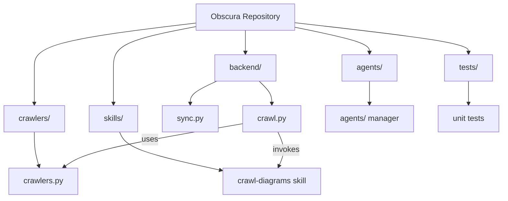
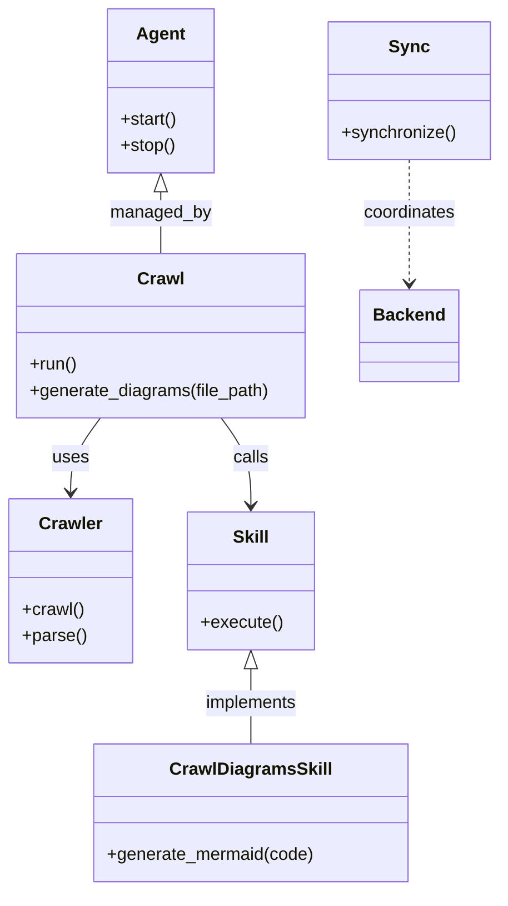

# Diagram: shipment_core/shipment_trip_plan_service/config/config.dev.yml

> Auto-generated by Obscura crawlers

## Diagram 1

### SVG

<svg id="container" width="1044.484375" xmlns="http://www.w3.org/2000/svg" class="flowchart" height="406" viewBox="0 0 1044.484375 406" role="graphics-document document" aria-roledescription="flowchart-v2"><g><marker id="container_flowchart-v2-pointEnd" class="marker flowchart-v2" viewBox="0 0 10 10" refX="5" refY="5" markerUnits="userSpaceOnUse" markerWidth="8" markerHeight="8" orient="auto"><path d="M 0 0 L 10 5 L 0 10 z" class="arrowMarkerPath" style="stroke-width: 1; stroke-dasharray: 1, 0;"></path></marker><marker id="container_flowchart-v2-pointStart" class="marker flowchart-v2" viewBox="0 0 10 10" refX="4.5" refY="5" markerUnits="userSpaceOnUse" markerWidth="8" markerHeight="8" orient="auto"><path d="M 0 5 L 10 10 L 10 0 z" class="arrowMarkerPath" style="stroke-width: 1; stroke-dasharray: 1, 0;"></path></marker><marker id="container_flowchart-v2-circleEnd" class="marker flowchart-v2" viewBox="0 0 10 10" refX="11" refY="5" markerUnits="userSpaceOnUse" markerWidth="11" markerHeight="11" orient="auto"><circle cx="5" cy="5" r="5" class="arrowMarkerPath" style="stroke-width: 1; stroke-dasharray: 1, 0;"></circle></marker><marker id="container_flowchart-v2-circleStart" class="marker flowchart-v2" viewBox="0 0 10 10" refX="-1" refY="5" markerUnits="userSpaceOnUse" markerWidth="11" markerHeight="11" orient="auto"><circle cx="5" cy="5" r="5" class="arrowMarkerPath" style="stroke-width: 1; stroke-dasharray: 1, 0;"></circle></marker><marker id="container_flowchart-v2-crossEnd" class="marker cross flowchart-v2" viewBox="0 0 11 11" refX="12" refY="5.2" markerUnits="userSpaceOnUse" markerWidth="11" markerHeight="11" orient="auto"><path d="M 1,1 l 9,9 M 10,1 l -9,9" class="arrowMarkerPath" style="stroke-width: 2; stroke-dasharray: 1, 0;"></path></marker><marker id="container_flowchart-v2-crossStart" class="marker cross flowchart-v2" viewBox="0 0 11 11" refX="-1" refY="5.2" markerUnits="userSpaceOnUse" markerWidth="11" markerHeight="11" orient="auto"><path d="M 1,1 l 9,9 M 10,1 l -9,9" class="arrowMarkerPath" style="stroke-width: 2; stroke-dasharray: 1, 0;"></path></marker><g class="root"><g class="clusters"></g><g class="edgePaths"><path d="M509.676,62L509.676,66.167C509.676,70.333,509.676,78.667,509.676,86.333C509.676,94,509.676,101,509.676,104.5L509.676,108" id="L_Repo_Backend_0" class="edge-thickness-normal edge-pattern-solid edge-thickness-normal edge-pattern-solid flowchart-link" style=";" data-edge="true" data-et="edge" data-id="L_Repo_Backend_0" data-points="W3sieCI6NTA5LjY3NTc4MTI1LCJ5Ijo2Mn0seyJ4Ijo1MDkuNjc1NzgxMjUsInkiOjg3fSx7IngiOjUwOS42NzU3ODEyNSwieSI6MTEyfV0=" marker-end="url(#container_flowchart-v2-pointEnd)"></path><path d="M610.348,55.393L636.352,60.661C662.357,65.929,714.366,76.464,740.37,85.232C766.375,94,766.375,101,766.375,104.5L766.375,108" id="L_Repo_Agents_0" class="edge-thickness-normal edge-pattern-solid edge-thickness-normal edge-pattern-solid flowchart-link" style=";" data-edge="true" data-et="edge" data-id="L_Repo_Agents_0" data-points="W3sieCI6NjEwLjM0NzY1NjI1LCJ5Ijo1NS4zOTMyNzM5ODYxNTIzMn0seyJ4Ijo3NjYuMzc1LCJ5Ijo4N30seyJ4Ijo3NjYuMzc1LCJ5IjoxMTJ9XQ==" marker-end="url(#container_flowchart-v2-pointEnd)"></path><path d="M409.004,46.967L352.872,53.639C296.74,60.311,184.475,73.656,128.343,88.994C72.211,104.333,72.211,121.667,72.211,139C72.211,156.333,72.211,173.667,72.211,185.833C72.211,198,72.211,205,72.211,208.5L72.211,212" id="L_Repo_CrawlersDir_0" class="edge-thickness-normal edge-pattern-solid edge-thickness-normal edge-pattern-solid flowchart-link" style=";" data-edge="true" data-et="edge" data-id="L_Repo_CrawlersDir_0" data-points="W3sieCI6NDA5LjAwMzkwNjI1LCJ5Ijo0Ni45NjY1MzMwMjQ5NzUyMn0seyJ4Ijo3Mi4yMTA5Mzc1LCJ5Ijo4N30seyJ4Ijo3Mi4yMTA5Mzc1LCJ5IjoxMzl9LHsieCI6NzIuMjEwOTM3NSwieSI6MTkxfSx7IngiOjcyLjIxMDkzNzUsInkiOjIxNn1d" marker-end="url(#container_flowchart-v2-pointEnd)"></path><path d="M409.004,54.348L380.687,59.79C352.37,65.232,295.736,76.116,267.419,90.225C239.102,104.333,239.102,121.667,239.102,139C239.102,156.333,239.102,173.667,239.102,185.833C239.102,198,239.102,205,239.102,208.5L239.102,212" id="L_Repo_Skills_0" class="edge-thickness-normal edge-pattern-solid edge-thickness-normal edge-pattern-solid flowchart-link" style=";" data-edge="true" data-et="edge" data-id="L_Repo_Skills_0" data-points="W3sieCI6NDA5LjAwMzkwNjI1LCJ5Ijo1NC4zNDc1MTAzNTg0Njc5Nn0seyJ4IjoyMzkuMTAxNTYyNSwieSI6ODd9LHsieCI6MjM5LjEwMTU2MjUsInkiOjEzOX0seyJ4IjoyMzkuMTAxNTYyNSwieSI6MTkxfSx7IngiOjIzOS4xMDE1NjI1LCJ5IjoyMTZ9XQ==" marker-end="url(#container_flowchart-v2-pointEnd)"></path><path d="M610.348,46.314L670.687,53.095C731.026,59.876,851.704,73.438,912.044,83.719C972.383,94,972.383,101,972.383,104.5L972.383,108" id="L_Repo_Tests_0" class="edge-thickness-normal edge-pattern-solid edge-thickness-normal edge-pattern-solid flowchart-link" style=";" data-edge="true" data-et="edge" data-id="L_Repo_Tests_0" data-points="W3sieCI6NjEwLjM0NzY1NjI1LCJ5Ijo0Ni4zMTM3MTkzNjU0ODY3M30seyJ4Ijo5NzIuMzgyODEyNSwieSI6ODd9LHsieCI6OTcyLjM4MjgxMjUsInkiOjExMn1d" marker-end="url(#container_flowchart-v2-pointEnd)"></path><path d="M451.946,166L443.037,170.167C434.128,174.333,416.31,182.667,407.401,190.333C398.492,198,398.492,205,398.492,208.5L398.492,212" id="L_Backend_Sync_0" class="edge-thickness-normal edge-pattern-solid edge-thickness-normal edge-pattern-solid flowchart-link" style=";" data-edge="true" data-et="edge" data-id="L_Backend_Sync_0" data-points="W3sieCI6NDUxLjk0NTgzODM0MTM0NjEzLCJ5IjoxNjZ9LHsieCI6Mzk4LjQ5MjE4NzUsInkiOjE5MX0seyJ4IjozOTguNDkyMTg3NSwieSI6MjE2fV0=" marker-end="url(#container_flowchart-v2-pointEnd)"></path><path d="M538.317,166L542.737,170.167C547.156,174.333,555.996,182.667,560.416,190.333C564.836,198,564.836,205,564.836,208.5L564.836,212" id="L_Backend_CrawlScript_0" class="edge-thickness-normal edge-pattern-solid edge-thickness-normal edge-pattern-solid flowchart-link" style=";" data-edge="true" data-et="edge" data-id="L_Backend_CrawlScript_0" data-points="W3sieCI6NTM4LjMxNjYzMTYxMDU3NjksInkiOjE2Nn0seyJ4Ijo1NjQuODM1OTM3NSwieSI6MTkxfSx7IngiOjU2NC44MzU5Mzc1LCJ5IjoyMTZ9XQ==" marker-end="url(#container_flowchart-v2-pointEnd)"></path><path d="M72.211,270L72.211,276.167C72.211,282.333,72.211,294.667,73.786,306.359C75.362,318.051,78.512,329.102,80.087,334.628L81.663,340.153" id="L_CrawlersDir_CrawlersModule_0" class="edge-thickness-normal edge-pattern-solid edge-thickness-normal edge-pattern-solid flowchart-link" style=";" data-edge="true" data-et="edge" data-id="L_CrawlersDir_CrawlersModule_0" data-points="W3sieCI6NzIuMjEwOTM3NSwieSI6MjcwfSx7IngiOjcyLjIxMDkzNzUsInkiOjMwN30seyJ4Ijo4Mi43NTk0NjA0NDkyMTg3NSwieSI6MzQ0fV0=" marker-end="url(#container_flowchart-v2-pointEnd)"></path><path d="M766.375,166L766.375,170.167C766.375,174.333,766.375,182.667,766.375,190.333C766.375,198,766.375,205,766.375,208.5L766.375,212" id="L_Agents_AgentManager_0" class="edge-thickness-normal edge-pattern-solid edge-thickness-normal edge-pattern-solid flowchart-link" style=";" data-edge="true" data-et="edge" data-id="L_Agents_AgentManager_0" data-points="W3sieCI6NzY2LjM3NSwieSI6MTY2fSx7IngiOjc2Ni4zNzUsInkiOjE5MX0seyJ4Ijo3NjYuMzc1LCJ5IjoyMTZ9XQ==" marker-end="url(#container_flowchart-v2-pointEnd)"></path><path d="M250.919,270L253.618,276.167C256.317,282.333,261.715,294.667,296.335,307.695C330.954,320.724,394.795,334.447,426.716,341.309L458.636,348.171" id="L_Skills_CrawlDiagramsSkill_0" class="edge-thickness-normal edge-pattern-solid edge-thickness-normal edge-pattern-solid flowchart-link" style=";" data-edge="true" data-et="edge" data-id="L_Skills_CrawlDiagramsSkill_0" data-points="W3sieCI6MjUwLjkxOTAwNjM0NzY1NjI1LCJ5IjoyNzB9LHsieCI6MjY3LjExMzI4MTI1LCJ5IjozMDd9LHsieCI6NDYyLjU0Njg3NSwieSI6MzQ5LjAxMTQxNDc3NjIzMTA1fV0=" marker-end="url(#container_flowchart-v2-pointEnd)"></path><path d="M972.383,166L972.383,170.167C972.383,174.333,972.383,182.667,972.383,190.333C972.383,198,972.383,205,972.383,208.5L972.383,212" id="L_Tests_UnitTests_0" class="edge-thickness-normal edge-pattern-solid edge-thickness-normal edge-pattern-solid flowchart-link" style=";" data-edge="true" data-et="edge" data-id="L_Tests_UnitTests_0" data-points="W3sieCI6OTcyLjM4MjgxMjUsInkiOjE2Nn0seyJ4Ijo5NzIuMzgyODEyNSwieSI6MTkxfSx7IngiOjk3Mi4zODI4MTI1LCJ5IjoyMTZ9XQ==" marker-end="url(#container_flowchart-v2-pointEnd)"></path><path d="M505.203,253.013L451.614,262.011C398.025,271.008,290.846,289.004,228.825,303.791C166.805,318.579,149.941,330.157,141.51,335.947L133.078,341.736" id="L_CrawlScript_CrawlersModule_0" class="edge-thickness-normal edge-pattern-solid edge-thickness-normal edge-pattern-solid flowchart-link" style=";" data-edge="true" data-et="edge" data-id="L_CrawlScript_CrawlersModule_0" data-points="W3sieCI6NTA1LjIwMzEyNSwieSI6MjUzLjAxMjY0NjE2MzYyMTI3fSx7IngiOjE4My42Njc5Njg3NSwieSI6MzA3fSx7IngiOjEyOS43ODAzOTU1MDc4MTI1LCJ5IjozNDR9XQ==" marker-end="url(#container_flowchart-v2-pointEnd)"></path><path d="M576.653,270L579.352,276.167C582.051,282.333,587.45,294.667,587.717,306.389C587.984,318.112,583.121,329.224,580.689,334.78L578.257,340.336" id="L_CrawlScript_CrawlDiagramsSkill_0" class="edge-thickness-normal edge-pattern-solid edge-thickness-normal edge-pattern-solid flowchart-link" style=";" data-edge="true" data-et="edge" data-id="L_CrawlScript_CrawlDiagramsSkill_0" data-points="W3sieCI6NTc2LjY1MzM4MTM0NzY1NjIsInkiOjI3MH0seyJ4Ijo1OTIuODQ3NjU2MjUsInkiOjMwN30seyJ4Ijo1NzYuNjUzMzgxMzQ3NjU2MiwieSI6MzQ0fV0=" marker-end="url(#container_flowchart-v2-pointEnd)"></path></g><g class="edgeLabels"><g class="edgeLabel"><g class="label" data-id="L_Repo_Backend_0" transform="translate(0, 0)"><foreignObject width="0" height="0">

</foreignObject></g></g><g class="edgeLabel"><g class="label" data-id="L_Repo_Agents_0" transform="translate(0, 0)"><foreignObject width="0" height="0">

</foreignObject></g></g><g class="edgeLabel"><g class="label" data-id="L_Repo_CrawlersDir_0" transform="translate(0, 0)"><foreignObject width="0" height="0">

</foreignObject></g></g><g class="edgeLabel"><g class="label" data-id="L_Repo_Skills_0" transform="translate(0, 0)"><foreignObject width="0" height="0">

</foreignObject></g></g><g class="edgeLabel"><g class="label" data-id="L_Repo_Tests_0" transform="translate(0, 0)"><foreignObject width="0" height="0">

</foreignObject></g></g><g class="edgeLabel"><g class="label" data-id="L_Backend_Sync_0" transform="translate(0, 0)"><foreignObject width="0" height="0">

</foreignObject></g></g><g class="edgeLabel"><g class="label" data-id="L_Backend_CrawlScript_0" transform="translate(0, 0)"><foreignObject width="0" height="0">

</foreignObject></g></g><g class="edgeLabel"><g class="label" data-id="L_CrawlersDir_CrawlersModule_0" transform="translate(0, 0)"><foreignObject width="0" height="0">

</foreignObject></g></g><g class="edgeLabel"><g class="label" data-id="L_Agents_AgentManager_0" transform="translate(0, 0)"><foreignObject width="0" height="0">

</foreignObject></g></g><g class="edgeLabel"><g class="label" data-id="L_Skills_CrawlDiagramsSkill_0" transform="translate(0, 0)"><foreignObject width="0" height="0">

</foreignObject></g></g><g class="edgeLabel"><g class="label" data-id="L_Tests_UnitTests_0" transform="translate(0, 0)"><foreignObject width="0" height="0">

</foreignObject></g></g><g class="edgeLabel" transform="translate(312.20314, 285.4183)"><g class="label" data-id="L_CrawlScript_CrawlersModule_0" transform="translate(-16.4921875, -12)"><foreignObject width="32.984375" height="24">

uses

</foreignObject></g></g><g class="edgeLabel" transform="translate(592.84765625, 307)"><g class="label" data-id="L_CrawlScript_CrawlDiagramsSkill_0" transform="translate(-27.5859375, -12)"><foreignObject width="55.171875" height="24">

invokes

</foreignObject></g></g></g><g class="nodes"><g class="node default" id="flowchart-Repo-0" transform="translate(509.67578125, 35)"><rect class="basic label-container" style="" x="-100.671875" y="-27" width="201.34375" height="54"></rect><g class="label" style="" transform="translate(-70.671875, -12)"><rect></rect><foreignObject width="141.34375" height="24">

Obscura Repository

</foreignObject></g></g><g class="node default" id="flowchart-Backend-1" transform="translate(509.67578125, 139)"><rect class="basic label-container" style="" x="-64.8671875" y="-27" width="129.734375" height="54"></rect><g class="label" style="" transform="translate(-34.8671875, -12)"><rect></rect><foreignObject width="69.734375" height="24">

backend/

</foreignObject></g></g><g class="node default" id="flowchart-Agents-3" transform="translate(766.375, 139)"><rect class="basic label-container" style="" x="-58.140625" y="-27" width="116.28125" height="54"></rect><g class="label" style="" transform="translate(-28.140625, -12)"><rect></rect><foreignObject width="56.28125" height="24">

agents/

</foreignObject></g></g><g class="node default" id="flowchart-CrawlersDir-5" transform="translate(72.2109375, 243)"><rect class="basic label-container" style="" x="-64.2109375" y="-27" width="128.421875" height="54"></rect><g class="label" style="" transform="translate(-34.2109375, -12)"><rect></rect><foreignObject width="68.421875" height="24">

crawlers/

</foreignObject></g></g><g class="node default" id="flowchart-Skills-7" transform="translate(239.1015625, 243)"><rect class="basic label-container" style="" x="-52.6796875" y="-27" width="105.359375" height="54"></rect><g class="label" style="" transform="translate(-22.6796875, -12)"><rect></rect><foreignObject width="45.359375" height="24">

skills/

</foreignObject></g></g><g class="node default" id="flowchart-Tests-9" transform="translate(972.3828125, 139)"><rect class="basic label-container" style="" x="-51.6484375" y="-27" width="103.296875" height="54"></rect><g class="label" style="" transform="translate(-21.6484375, -12)"><rect></rect><foreignObject width="43.296875" height="24">

tests/

</foreignObject></g></g><g class="node default" id="flowchart-Sync-11" transform="translate(398.4921875, 243)"><rect class="basic label-container" style="" x="-56.7109375" y="-27" width="113.421875" height="54"></rect><g class="label" style="" transform="translate(-26.7109375, -12)"><rect></rect><foreignObject width="53.421875" height="24">

sync.py

</foreignObject></g></g><g class="node default" id="flowchart-CrawlScript-13" transform="translate(564.8359375, 243)"><rect class="basic label-container" style="" x="-59.6328125" y="-27" width="119.265625" height="54"></rect><g class="label" style="" transform="translate(-29.6328125, -12)"><rect></rect><foreignObject width="59.265625" height="24">

crawl.py

</foreignObject></g></g><g class="node default" id="flowchart-CrawlersModule-15" transform="translate(90.45703125, 371)"><rect class="basic label-container" style="" x="-70.625" y="-27" width="141.25" height="54"></rect><g class="label" style="" transform="translate(-40.625, -12)"><rect></rect><foreignObject width="81.25" height="24">

crawlers.py

</foreignObject></g></g><g class="node default" id="flowchart-AgentManager-17" transform="translate(766.375, 243)"><rect class="basic label-container" style="" x="-91.90625" y="-27" width="183.8125" height="54"></rect><g class="label" style="" transform="translate(-61.90625, -12)"><rect></rect><foreignObject width="123.8125" height="24">

agents/ manager

</foreignObject></g></g><g class="node default" id="flowchart-CrawlDiagramsSkill-19" transform="translate(564.8359375, 371)"><rect class="basic label-container" style="" x="-102.2890625" y="-27" width="204.578125" height="54"></rect><g class="label" style="" transform="translate(-72.2890625, -12)"><rect></rect><foreignObject width="144.578125" height="24">

crawl-diagrams skill

</foreignObject></g></g><g class="node default" id="flowchart-UnitTests-21" transform="translate(972.3828125, 243)"><rect class="basic label-container" style="" x="-64.1015625" y="-27" width="128.203125" height="54"></rect><g class="label" style="" transform="translate(-34.1015625, -12)"><rect></rect><foreignObject width="68.203125" height="24">

unit tests

</foreignObject></g></g></g></g></g></svg>

## Diagram 2

### SVG

<svg id="container" width="450.216796875" xmlns="http://www.w3.org/2000/svg" class="classDiagram" height="814" viewBox="0 0 450.216796875 814" role="graphics-document document" aria-roledescription="class"><g><defs><marker id="container_class-aggregationStart" class="marker aggregation class" refX="18" refY="7" markerWidth="190" markerHeight="240" orient="auto"><path d="M 18,7 L9,13 L1,7 L9,1 Z"></path></marker></defs><defs><marker id="container_class-aggregationEnd" class="marker aggregation class" refX="1" refY="7" markerWidth="20" markerHeight="28" orient="auto"><path d="M 18,7 L9,13 L1,7 L9,1 Z"></path></marker></defs><defs><marker id="container_class-extensionStart" class="marker extension class" refX="18" refY="7" markerWidth="190" markerHeight="240" orient="auto"><path d="M 1,7 L18,13 V 1 Z"></path></marker></defs><defs><marker id="container_class-extensionEnd" class="marker extension class" refX="1" refY="7" markerWidth="20" markerHeight="28" orient="auto"><path d="M 1,1 V 13 L18,7 Z"></path></marker></defs><defs><marker id="container_class-compositionStart" class="marker composition class" refX="18" refY="7" markerWidth="190" markerHeight="240" orient="auto"><path d="M 18,7 L9,13 L1,7 L9,1 Z"></path></marker></defs><defs><marker id="container_class-compositionEnd" class="marker composition class" refX="1" refY="7" markerWidth="20" markerHeight="28" orient="auto"><path d="M 18,7 L9,13 L1,7 L9,1 Z"></path></marker></defs><defs><marker id="container_class-dependencyStart" class="marker dependency class" refX="6" refY="7" markerWidth="190" markerHeight="240" orient="auto"><path d="M 5,7 L9,13 L1,7 L9,1 Z"></path></marker></defs><defs><marker id="container_class-dependencyEnd" class="marker dependency class" refX="13" refY="7" markerWidth="20" markerHeight="28" orient="auto"><path d="M 18,7 L9,13 L14,7 L9,1 Z"></path></marker></defs><defs><marker id="container_class-lollipopStart" class="marker lollipop class" refX="13" refY="7" markerWidth="190" markerHeight="240" orient="auto"><circle stroke="black" fill="transparent" cx="7" cy="7" r="6"></circle></marker></defs><defs><marker id="container_class-lollipopEnd" class="marker lollipop class" refX="1" refY="7" markerWidth="190" markerHeight="240" orient="auto"><circle stroke="black" fill="transparent" cx="7" cy="7" r="6"></circle></marker></defs><g class="root"><g class="clusters"></g><g class="edgePaths"><path d="M89.941,382L85.473,388.167C81.005,394.333,72.069,406.667,67.601,418C63.133,429.333,63.133,439.667,63.133,444.833L63.133,450" id="id_Crawl_Crawler_1" class="edge-thickness-normal edge-pattern-solid relation" style=";;;" data-edge="true" data-et="edge" data-id="id_Crawl_Crawler_1" data-points="W3sieCI6ODkuOTQxNDIzNjg4NjE2MDcsInkiOjM4Mn0seyJ4Ijo2My4xMzI4MTI1LCJ5Ijo0MTl9LHsieCI6NjMuMTMyODEyNSwieSI6NDU2fV0=" marker-end="url(#container_class-dependencyEnd)"></path><path d="M198.625,382L203.093,388.167C207.561,394.333,216.497,406.667,220.965,420C225.434,433.333,225.434,447.667,225.434,454.833L225.434,462" id="id_Crawl_Skill_2" class="edge-thickness-normal edge-pattern-solid relation" style=";;;" data-edge="true" data-et="edge" data-id="id_Crawl_Skill_2" data-points="W3sieCI6MTk4LjYyNDk4MjU2MTM4Mzk0LCJ5IjozODJ9LHsieCI6MjI1LjQzMzU5Mzc1LCJ5Ijo0MTl9LHsieCI6MjI1LjQzMzU5Mzc1LCJ5Ijo0Njh9XQ==" marker-end="url(#container_class-dependencyEnd)"></path><path d="M144.283,175.25L144.283,178.542C144.283,181.833,144.283,188.417,144.283,197.875C144.283,207.333,144.283,219.667,144.283,225.833L144.283,232" id="id_Agent_Crawl_3" class="edge-thickness-normal edge-pattern-solid relation" style=";;;" data-edge="true" data-et="edge" data-id="id_Agent_Crawl_3" data-points="W3sieCI6MTQ0LjI4MzIwMzEyNSwieSI6MTU4fSx7IngiOjE0NC4yODMyMDMxMjUsInkiOjE5NX0seyJ4IjoxNDQuMjgzMjAzMTI1LCJ5IjoyMzJ9XQ==" marker-start="url(#container_class-extensionStart)"></path><path d="M369.49,146L369.49,154.167C369.49,162.333,369.49,178.667,369.49,197.5C369.49,216.333,369.49,237.667,369.49,248.333L369.49,259" id="id_Sync_Backend_4" class="edge-thickness-normal edge-pattern-dashed relation" style=";;;" data-edge="true" data-et="edge" data-id="id_Sync_Backend_4" data-points="W3sieCI6MzY5LjQ5MDIzNDM3NSwieSI6MTQ2fSx7IngiOjM2OS40OTAyMzQzNzUsInkiOjE5NX0seyJ4IjozNjkuNDkwMjM0Mzc1LCJ5IjoyNjV9XQ==" marker-end="url(#container_class-dependencyEnd)"></path><path d="M225.434,611.25L225.434,616.542C225.434,621.833,225.434,632.417,225.434,643.875C225.434,655.333,225.434,667.667,225.434,673.833L225.434,680" id="id_Skill_CrawlDiagramsSkill_5" class="edge-thickness-normal edge-pattern-solid relation" style=";;;" data-edge="true" data-et="edge" data-id="id_Skill_CrawlDiagramsSkill_5" data-points="W3sieCI6MjI1LjQzMzU5Mzc1LCJ5Ijo1OTR9LHsieCI6MjI1LjQzMzU5Mzc1LCJ5Ijo2NDN9LHsieCI6MjI1LjQzMzU5Mzc1LCJ5Ijo2ODB9XQ==" marker-start="url(#container_class-extensionStart)"></path></g><g class="edgeLabels"><g class="edgeLabel" transform="translate(63.1328125, 419)"><g class="label" data-id="id_Crawl_Crawler_1" transform="translate(-16.4921875, -12)"><foreignObject width="32.984375" height="24">

uses

</foreignObject></g></g><g class="edgeLabel" transform="translate(225.43359375, 419)"><g class="label" data-id="id_Crawl_Skill_2" transform="translate(-16.4453125, -12)"><foreignObject width="32.890625" height="24">

calls

</foreignObject></g></g><g class="edgeLabel" transform="translate(144.283203125, 195)"><g class="label" data-id="id_Agent_Crawl_3" transform="translate(-46.1640625, -12)"><foreignObject width="92.328125" height="24">

managed_by

</foreignObject></g></g><g class="edgeLabel" transform="translate(369.490234375, 195)"><g class="label" data-id="id_Sync_Backend_4" transform="translate(-42.8046875, -12)"><foreignObject width="85.609375" height="24">

coordinates

</foreignObject></g></g><g class="edgeLabel" transform="translate(225.43359375, 643)"><g class="label" data-id="id_Skill_CrawlDiagramsSkill_5" transform="translate(-43.0625, -12)"><foreignObject width="86.125" height="24">

implements

</foreignObject></g></g></g><g class="nodes"><g class="node default" id="classId-Crawl-0" transform="translate(144.283203125, 307)"><g class="basic label-container"><path d="M-131.91015625 -75 L131.91015625 -75 L131.91015625 75 L-131.91015625 75" stroke="none" stroke-width="0" fill="#ECECFF" style=""></path><path d="M-131.91015625 -75 C-28.675376557729308 -75, 74.55940313454138 -75, 131.91015625 -75 M-131.91015625 -75 C-29.002233243072325 -75, 73.90568976385535 -75, 131.91015625 -75 M131.91015625 -75 C131.91015625 -20.448411096175036, 131.91015625 34.10317780764993, 131.91015625 75 M131.91015625 -75 C131.91015625 -35.28535248110551, 131.91015625 4.429295037788975, 131.91015625 75 M131.91015625 75 C53.94861337036028 75, -24.012929509279445 75, -131.91015625 75 M131.91015625 75 C38.26990638268519 75, -55.370343484629615 75, -131.91015625 75 M-131.91015625 75 C-131.91015625 15.402717965463161, -131.91015625 -44.19456406907368, -131.91015625 -75 M-131.91015625 75 C-131.91015625 18.475516562736324, -131.91015625 -38.04896687452735, -131.91015625 -75" stroke="#9370DB" stroke-width="1.3" fill="none" stroke-dasharray="0 0" style=""></path></g><g class="annotation-group text" transform="translate(0, -51)"></g><g class="label-group text" transform="translate(-20.1484375, -51)"><g class="label" style="font-weight: bolder" transform="translate(0,-12)"><foreignObject width="40.296875" height="24">

Crawl

</foreignObject></g></g><g class="members-group text" transform="translate(-119.91015625, -3)"></g><g class="methods-group text" transform="translate(-119.91015625, 27)"><g class="label" style="" transform="translate(0,-12)"><foreignObject width="43.21875" height="24">

+run()

</foreignObject></g><g class="label" style="" transform="translate(0,12)"><foreignObject width="219.671875" height="24">

+generate_diagrams(file_path)

</foreignObject></g></g><g class="divider" style=""><path d="M-131.91015625 -27 C-27.47787431810727 -27, 76.95440761378546 -27, 131.91015625 -27 M-131.91015625 -27 C-36.720730386575994 -27, 58.46869547684801 -27, 131.91015625 -27" stroke="#9370DB" stroke-width="1.3" fill="none" stroke-dasharray="0 0" style=""></path></g><g class="divider" style=""><path d="M-131.91015625 -3 C-47.91713978219056 -3, 36.07587668561888 -3, 131.91015625 -3 M-131.91015625 -3 C-61.79560525657277 -3, 8.31894573685446 -3, 131.91015625 -3" stroke="#9370DB" stroke-width="1.3" fill="none" stroke-dasharray="0 0" style=""></path></g></g><g class="node default" id="classId-Crawler-1" transform="translate(63.1328125, 531)"><g class="basic label-container"><path d="M-55.1328125 -75 L55.1328125 -75 L55.1328125 75 L-55.1328125 75" stroke="none" stroke-width="0" fill="#ECECFF" style=""></path><path d="M-55.1328125 -75 C-23.401601580604172 -75, 8.329609338791656 -75, 55.1328125 -75 M-55.1328125 -75 C-24.999460223381234 -75, 5.133892053237531 -75, 55.1328125 -75 M55.1328125 -75 C55.1328125 -23.7943302223092, 55.1328125 27.411339555381602, 55.1328125 75 M55.1328125 -75 C55.1328125 -21.293443975365335, 55.1328125 32.41311204926933, 55.1328125 75 M55.1328125 75 C12.914001344024555 75, -29.30480981195089 75, -55.1328125 75 M55.1328125 75 C25.80403925023619 75, -3.5247339995276192 75, -55.1328125 75 M-55.1328125 75 C-55.1328125 15.861777346586251, -55.1328125 -43.2764453068275, -55.1328125 -75 M-55.1328125 75 C-55.1328125 30.40111560504029, -55.1328125 -14.197768789919422, -55.1328125 -75" stroke="#9370DB" stroke-width="1.3" fill="none" stroke-dasharray="0 0" style=""></path></g><g class="annotation-group text" transform="translate(0, -51)"></g><g class="label-group text" transform="translate(-27.734375, -51)"><g class="label" style="font-weight: bolder" transform="translate(0,-12)"><foreignObject width="55.46875" height="24">

Crawler

</foreignObject></g></g><g class="members-group text" transform="translate(-43.1328125, -3)"></g><g class="methods-group text" transform="translate(-43.1328125, 27)"><g class="label" style="" transform="translate(0,-12)"><foreignObject width="56.40625" height="24">

+crawl()

</foreignObject></g><g class="label" style="" transform="translate(0,12)"><foreignObject width="58.53125" height="24">

+parse()

</foreignObject></g></g><g class="divider" style=""><path d="M-55.1328125 -27 C-27.249157697938102 -27, 0.6344971041237955 -27, 55.1328125 -27 M-55.1328125 -27 C-15.82372109308917 -27, 23.48537031382166 -27, 55.1328125 -27" stroke="#9370DB" stroke-width="1.3" fill="none" stroke-dasharray="0 0" style=""></path></g><g class="divider" style=""><path d="M-55.1328125 -3 C-27.51544489758128 -3, 0.10192270483744181 -3, 55.1328125 -3 M-55.1328125 -3 C-21.325382729218667 -3, 12.482047041562666 -3, 55.1328125 -3" stroke="#9370DB" stroke-width="1.3" fill="none" stroke-dasharray="0 0" style=""></path></g></g><g class="node default" id="classId-Agent-2" transform="translate(144.283203125, 83)"><g class="basic label-container"><path d="M-48.6171875 -75 L48.6171875 -75 L48.6171875 75 L-48.6171875 75" stroke="none" stroke-width="0" fill="#ECECFF" style=""></path><path d="M-48.6171875 -75 C-26.798737590261506 -75, -4.980287680523013 -75, 48.6171875 -75 M-48.6171875 -75 C-24.15719525040601 -75, 0.30279699918798286 -75, 48.6171875 -75 M48.6171875 -75 C48.6171875 -27.023745960102836, 48.6171875 20.952508079794328, 48.6171875 75 M48.6171875 -75 C48.6171875 -19.5926534520599, 48.6171875 35.8146930958802, 48.6171875 75 M48.6171875 75 C25.118703580396502 75, 1.6202196607930048 75, -48.6171875 75 M48.6171875 75 C25.878520621601258 75, 3.139853743202515 75, -48.6171875 75 M-48.6171875 75 C-48.6171875 15.812025528795978, -48.6171875 -43.375948942408044, -48.6171875 -75 M-48.6171875 75 C-48.6171875 38.42126026895591, -48.6171875 1.842520537911824, -48.6171875 -75" stroke="#9370DB" stroke-width="1.3" fill="none" stroke-dasharray="0 0" style=""></path></g><g class="annotation-group text" transform="translate(0, -51)"></g><g class="label-group text" transform="translate(-21.078125, -51)"><g class="label" style="font-weight: bolder" transform="translate(0,-12)"><foreignObject width="42.15625" height="24">

Agent

</foreignObject></g></g><g class="members-group text" transform="translate(-36.6171875, -3)"></g><g class="methods-group text" transform="translate(-36.6171875, 27)"><g class="label" style="" transform="translate(0,-12)"><foreignObject width="52.15625" height="24">

+start()

</foreignObject></g><g class="label" style="" transform="translate(0,12)"><foreignObject width="50.21875" height="24">

+stop()

</foreignObject></g></g><g class="divider" style=""><path d="M-48.6171875 -27 C-19.122431638012486 -27, 10.372324223975028 -27, 48.6171875 -27 M-48.6171875 -27 C-27.616255271674305 -27, -6.61532304334861 -27, 48.6171875 -27" stroke="#9370DB" stroke-width="1.3" fill="none" stroke-dasharray="0 0" style=""></path></g><g class="divider" style=""><path d="M-48.6171875 -3 C-26.441096365362935 -3, -4.265005230725869 -3, 48.6171875 -3 M-48.6171875 -3 C-21.90318553520635 -3, 4.810816429587298 -3, 48.6171875 -3" stroke="#9370DB" stroke-width="1.3" fill="none" stroke-dasharray="0 0" style=""></path></g></g><g class="node default" id="classId-Skill-3" transform="translate(225.43359375, 531)"><g class="basic label-container"><path d="M-57.16796875 -63 L57.16796875 -63 L57.16796875 63 L-57.16796875 63" stroke="none" stroke-width="0" fill="#ECECFF" style=""></path><path d="M-57.16796875 -63 C-20.763131420333018 -63, 15.641705909333965 -63, 57.16796875 -63 M-57.16796875 -63 C-12.352918342515807 -63, 32.46213206496839 -63, 57.16796875 -63 M57.16796875 -63 C57.16796875 -23.898210077802382, 57.16796875 15.203579844395236, 57.16796875 63 M57.16796875 -63 C57.16796875 -29.12128516233016, 57.16796875 4.757429675339679, 57.16796875 63 M57.16796875 63 C29.76011745892735 63, 2.352266167854701 63, -57.16796875 63 M57.16796875 63 C31.228018441327922 63, 5.2880681326558445 63, -57.16796875 63 M-57.16796875 63 C-57.16796875 24.975091165861983, -57.16796875 -13.049817668276035, -57.16796875 -63 M-57.16796875 63 C-57.16796875 34.957359777269616, -57.16796875 6.914719554539232, -57.16796875 -63" stroke="#9370DB" stroke-width="1.3" fill="none" stroke-dasharray="0 0" style=""></path></g><g class="annotation-group text" transform="translate(0, -39)"></g><g class="label-group text" transform="translate(-16.0078125, -39)"><g class="label" style="font-weight: bolder" transform="translate(0,-12)"><foreignObject width="32.015625" height="24">

Skill

</foreignObject></g></g><g class="members-group text" transform="translate(-45.16796875, 9)"></g><g class="methods-group text" transform="translate(-45.16796875, 39)"><g class="label" style="" transform="translate(0,-12)"><foreignObject width="74.328125" height="24">

+execute()

</foreignObject></g></g><g class="divider" style=""><path d="M-57.16796875 -15 C-26.082298117042445 -15, 5.00337251591511 -15, 57.16796875 -15 M-57.16796875 -15 C-34.26393222899641 -15, -11.359895707992827 -15, 57.16796875 -15" stroke="#9370DB" stroke-width="1.3" fill="none" stroke-dasharray="0 0" style=""></path></g><g class="divider" style=""><path d="M-57.16796875 9 C-24.519270110905616 9, 8.129428528188768 9, 57.16796875 9 M-57.16796875 9 C-28.64453979112912 9, -0.12111083225823904 9, 57.16796875 9" stroke="#9370DB" stroke-width="1.3" fill="none" stroke-dasharray="0 0" style=""></path></g></g><g class="node default" id="classId-Sync-4" transform="translate(369.490234375, 83)"><g class="basic label-container"><path d="M-72.7265625 -63 L72.7265625 -63 L72.7265625 63 L-72.7265625 63" stroke="none" stroke-width="0" fill="#ECECFF" style=""></path><path d="M-72.7265625 -63 C-17.688585363029944 -63, 37.34939177394011 -63, 72.7265625 -63 M-72.7265625 -63 C-23.33543340586739 -63, 26.055695688265217 -63, 72.7265625 -63 M72.7265625 -63 C72.7265625 -25.2774509567708, 72.7265625 12.445098086458401, 72.7265625 63 M72.7265625 -63 C72.7265625 -21.91915738571047, 72.7265625 19.16168522857906, 72.7265625 63 M72.7265625 63 C39.240111038051324 63, 5.753659576102649 63, -72.7265625 63 M72.7265625 63 C23.16060359379469 63, -26.40535531241062 63, -72.7265625 63 M-72.7265625 63 C-72.7265625 34.66133861717752, -72.7265625 6.322677234355048, -72.7265625 -63 M-72.7265625 63 C-72.7265625 14.859290348593966, -72.7265625 -33.28141930281207, -72.7265625 -63" stroke="#9370DB" stroke-width="1.3" fill="none" stroke-dasharray="0 0" style=""></path></g><g class="annotation-group text" transform="translate(0, -39)"></g><g class="label-group text" transform="translate(-17.09375, -39)"><g class="label" style="font-weight: bolder" transform="translate(0,-12)"><foreignObject width="34.1875" height="24">

Sync

</foreignObject></g></g><g class="members-group text" transform="translate(-60.7265625, 9)"></g><g class="methods-group text" transform="translate(-60.7265625, 39)"><g class="label" style="" transform="translate(0,-12)"><foreignObject width="104.359375" height="24">

+synchronize()

</foreignObject></g></g><g class="divider" style=""><path d="M-72.7265625 -15 C-42.27678326789979 -15, -11.827004035799575 -15, 72.7265625 -15 M-72.7265625 -15 C-19.483448610213316 -15, 33.75966527957337 -15, 72.7265625 -15" stroke="#9370DB" stroke-width="1.3" fill="none" stroke-dasharray="0 0" style=""></path></g><g class="divider" style=""><path d="M-72.7265625 9 C-32.62196672885441 9, 7.48262904229118 9, 72.7265625 9 M-72.7265625 9 C-35.84364018605508 9, 1.0392821278898339 9, 72.7265625 9" stroke="#9370DB" stroke-width="1.3" fill="none" stroke-dasharray="0 0" style=""></path></g></g><g class="node default" id="classId-Backend-5" transform="translate(369.490234375, 307)"><g class="basic label-container"><path d="M-43.296875 -42 L43.296875 -42 L43.296875 42 L-43.296875 42" stroke="none" stroke-width="0" fill="#ECECFF" style=""></path><path d="M-43.296875 -42 C-16.3671991740271 -42, 10.5624766519458 -42, 43.296875 -42 M-43.296875 -42 C-22.337164091387386 -42, -1.3774531827747722 -42, 43.296875 -42 M43.296875 -42 C43.296875 -10.175833436243721, 43.296875 21.648333127512558, 43.296875 42 M43.296875 -42 C43.296875 -16.20289683729647, 43.296875 9.594206325407058, 43.296875 42 M43.296875 42 C11.114086409200326 42, -21.06870218159935 42, -43.296875 42 M43.296875 42 C17.73073574557988 42, -7.835403508840237 42, -43.296875 42 M-43.296875 42 C-43.296875 18.40065512561131, -43.296875 -5.198689748777383, -43.296875 -42 M-43.296875 42 C-43.296875 9.454913729329668, -43.296875 -23.090172541340664, -43.296875 -42" stroke="#9370DB" stroke-width="1.3" fill="none" stroke-dasharray="0 0" style=""></path></g><g class="annotation-group text" transform="translate(0, -18)"></g><g class="label-group text" transform="translate(-31.296875, -18)"><g class="label" style="font-weight: bolder" transform="translate(0,-12)"><foreignObject width="62.59375" height="24">

Backend

</foreignObject></g></g><g class="members-group text" transform="translate(-31.296875, 30)"></g><g class="methods-group text" transform="translate(-31.296875, 60)"></g><g class="divider" style=""><path d="M-43.296875 6 C-15.344126398853888 6, 12.608622202292224 6, 43.296875 6 M-43.296875 6 C-14.024866618906067 6, 15.247141762187866 6, 43.296875 6" stroke="#9370DB" stroke-width="1.3" fill="none" stroke-dasharray="0 0" style=""></path></g><g class="divider" style=""><path d="M-43.296875 24 C-11.100601168044172 24, 21.095672663911657 24, 43.296875 24 M-43.296875 24 C-15.953940831834405 24, 11.38899333633119 24, 43.296875 24" stroke="#9370DB" stroke-width="1.3" fill="none" stroke-dasharray="0 0" style=""></path></g></g><g class="node default" id="classId-CrawlDiagramsSkill-6" transform="translate(225.43359375, 743)"><g class="basic label-container"><path d="M-142.06640625 -63 L142.06640625 -63 L142.06640625 63 L-142.06640625 63" stroke="none" stroke-width="0" fill="#ECECFF" style=""></path><path d="M-142.06640625 -63 C-57.83025113680564 -63, 26.405903976388714 -63, 142.06640625 -63 M-142.06640625 -63 C-69.62638799518948 -63, 2.81363025962105 -63, 142.06640625 -63 M142.06640625 -63 C142.06640625 -16.966087948660416, 142.06640625 29.067824102679168, 142.06640625 63 M142.06640625 -63 C142.06640625 -17.869618959146493, 142.06640625 27.260762081707014, 142.06640625 63 M142.06640625 63 C39.55945933375213 63, -62.94748758249574 63, -142.06640625 63 M142.06640625 63 C41.01301656571579 63, -60.040373118568425 63, -142.06640625 63 M-142.06640625 63 C-142.06640625 34.2366417658324, -142.06640625 5.473283531664798, -142.06640625 -63 M-142.06640625 63 C-142.06640625 19.328611408221896, -142.06640625 -24.34277718355621, -142.06640625 -63" stroke="#9370DB" stroke-width="1.3" fill="none" stroke-dasharray="0 0" style=""></path></g><g class="annotation-group text" transform="translate(0, -39)"></g><g class="label-group text" transform="translate(-70.2578125, -39)"><g class="label" style="font-weight: bolder" transform="translate(0,-12)"><foreignObject width="140.515625" height="24">

CrawlDiagramsSkill

</foreignObject></g></g><g class="members-group text" transform="translate(-130.06640625, 9)"></g><g class="methods-group text" transform="translate(-130.06640625, 39)"><g class="label" style="" transform="translate(0,-12)"><foreignObject width="189.875" height="24">

+generate_mermaid(code)

</foreignObject></g></g><g class="divider" style=""><path d="M-142.06640625 -15 C-60.28268219961805 -15, 21.501041850763897 -15, 142.06640625 -15 M-142.06640625 -15 C-74.4238161936336 -15, -6.781226137267197 -15, 142.06640625 -15" stroke="#9370DB" stroke-width="1.3" fill="none" stroke-dasharray="0 0" style=""></path></g><g class="divider" style=""><path d="M-142.06640625 9 C-54.021246284040586 9, 34.02391368191883 9, 142.06640625 9 M-142.06640625 9 C-57.34135565999503 9, 27.383694930009938 9, 142.06640625 9" stroke="#9370DB" stroke-width="1.3" fill="none" stroke-dasharray="0 0" style=""></path></g></g></g></g></g></svg>
