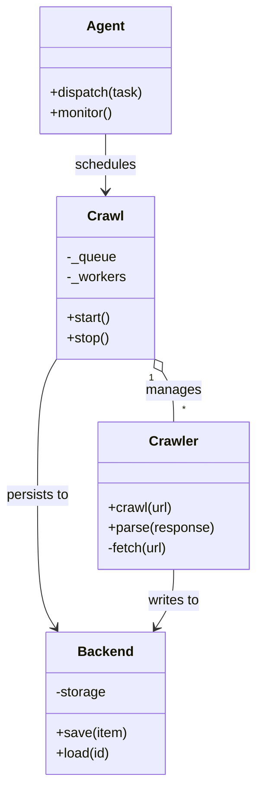

# Diagram: shipment_core/shipment_trip_plan_service/config/config.dev2.yml


> Auto-generated by Obscura crawlers

## Diagram 1



### SVG

<svg id="container" width="303.5625" xmlns="http://www.w3.org/2000/svg" class="classDiagram" height="922" viewBox="0 0 303.5625 922" role="graphics-document document" aria-roledescription="class"><style>#container{font-family:"trebuchet ms",verdana,arial,sans-serif;font-size:16px;fill:#333;}@keyframes edge-animation-frame{from{stroke-dashoffset:0;}}@keyframes dash{to{stroke-dashoffset:0;}}#container .edge-animation-slow{stroke-dasharray:9,5!important;stroke-dashoffset:900;animation:dash 50s linear infinite;stroke-linecap:round;}#container .edge-animation-fast{stroke-dasharray:9,5!important;stroke-dashoffset:900;animation:dash 20s linear infinite;stroke-linecap:round;}#container .error-icon{fill:#552222;}#container .error-text{fill:#552222;stroke:#552222;}#container .edge-thickness-normal{stroke-width:1px;}#container .edge-thickness-thick{stroke-width:3.5px;}#container .edge-pattern-solid{stroke-dasharray:0;}#container .edge-thickness-invisible{stroke-width:0;fill:none;}#container .edge-pattern-dashed{stroke-dasharray:3;}#container .edge-pattern-dotted{stroke-dasharray:2;}#container .marker{fill:#333333;stroke:#333333;}#container .marker.cross{stroke:#333333;}#container svg{font-family:"trebuchet ms",verdana,arial,sans-serif;font-size:16px;}#container p{margin:0;}#container g.classGroup text{fill:#9370DB;stroke:none;font-family:"trebuchet ms",verdana,arial,sans-serif;font-size:10px;}#container g.classGroup text .title{font-weight:bolder;}#container .nodeLabel,#container .edgeLabel{color:#131300;}#container .edgeLabel .label rect{fill:#ECECFF;}#container .label text{fill:#131300;}#container .labelBkg{background:#ECECFF;}#container .edgeLabel .label span{background:#ECECFF;}#container .classTitle{font-weight:bolder;}#container .node rect,#container .node circle,#container .node ellipse,#container .node polygon,#container .node path{fill:#ECECFF;stroke:#9370DB;stroke-width:1px;}#container .divider{stroke:#9370DB;stroke-width:1;}#container g.clickable{cursor:pointer;}#container g.classGroup rect{fill:#ECECFF;stroke:#9370DB;}#container g.classGroup line{stroke:#9370DB;stroke-width:1;}#container .classLabel .box{stroke:none;stroke-width:0;fill:#ECECFF;opacity:0.5;}#container .classLabel .label{fill:#9370DB;font-size:10px;}#container .relation{stroke:#333333;stroke-width:1;fill:none;}#container .dashed-line{stroke-dasharray:3;}#container .dotted-line{stroke-dasharray:1 2;}#container #compositionStart,#container .composition{fill:#333333!important;stroke:#333333!important;stroke-width:1;}#container #compositionEnd,#container .composition{fill:#333333!important;stroke:#333333!important;stroke-width:1;}#container #dependencyStart,#container .dependency{fill:#333333!important;stroke:#333333!important;stroke-width:1;}#container #dependencyStart,#container .dependency{fill:#333333!important;stroke:#333333!important;stroke-width:1;}#container #extensionStart,#container .extension{fill:transparent!important;stroke:#333333!important;stroke-width:1;}#container #extensionEnd,#container .extension{fill:transparent!important;stroke:#333333!important;stroke-width:1;}#container #aggregationStart,#container .aggregation{fill:transparent!important;stroke:#333333!important;stroke-width:1;}#container #aggregationEnd,#container .aggregation{fill:transparent!important;stroke:#333333!important;stroke-width:1;}#container #lollipopStart,#container .lollipop{fill:#ECECFF!important;stroke:#333333!important;stroke-width:1;}#container #lollipopEnd,#container .lollipop{fill:#ECECFF!important;stroke:#333333!important;stroke-width:1;}#container .edgeTerminals{font-size:11px;line-height:initial;}#container .classTitleText{text-anchor:middle;font-size:18px;fill:#333;}#container .label-icon{display:inline-block;height:1em;overflow:visible;vertical-align:-0.125em;}#container .node .label-icon path{fill:currentColor;stroke:revert;stroke-width:revert;}#container :root{--mermaid-font-family:"trebuchet ms",verdana,arial,sans-serif;}</style><g><defs><marker id="container_class-aggregationStart" class="marker aggregation class" refX="18" refY="7" markerWidth="190" markerHeight="240" orient="auto"><path d="M 18,7 L9,13 L1,7 L9,1 Z"></path></marker></defs><defs><marker id="container_class-aggregationEnd" class="marker aggregation class" refX="1" refY="7" markerWidth="20" markerHeight="28" orient="auto"><path d="M 18,7 L9,13 L1,7 L9,1 Z"></path></marker></defs><defs><marker id="container_class-extensionStart" class="marker extension class" refX="18" refY="7" markerWidth="190" markerHeight="240" orient="auto"><path d="M 1,7 L18,13 V 1 Z"></path></marker></defs><defs><marker id="container_class-extensionEnd" class="marker extension class" refX="1" refY="7" markerWidth="20" markerHeight="28" orient="auto"><path d="M 1,1 V 13 L18,7 Z"></path></marker></defs><defs><marker id="container_class-compositionStart" class="marker composition class" refX="18" refY="7" markerWidth="190" markerHeight="240" orient="auto"><path d="M 18,7 L9,13 L1,7 L9,1 Z"></path></marker></defs><defs><marker id="container_class-compositionEnd" class="marker composition class" refX="1" refY="7" markerWidth="20" markerHeight="28" orient="auto"><path d="M 18,7 L9,13 L1,7 L9,1 Z"></path></marker></defs><defs><marker id="container_class-dependencyStart" class="marker dependency class" refX="6" refY="7" markerWidth="190" markerHeight="240" orient="auto"><path d="M 5,7 L9,13 L1,7 L9,1 Z"></path></marker></defs><defs><marker id="container_class-dependencyEnd" class="marker dependency class" refX="13" refY="7" markerWidth="20" markerHeight="28" orient="auto"><path d="M 18,7 L9,13 L14,7 L9,1 Z"></path></marker></defs><defs><marker id="container_class-lollipopStart" class="marker lollipop class" refX="13" refY="7" markerWidth="190" markerHeight="240" orient="auto"><circle stroke="black" fill="transparent" cx="7" cy="7" r="6"></circle></marker></defs><defs><marker id="container_class-lollipopEnd" class="marker lollipop class" refX="1" refY="7" markerWidth="190" markerHeight="240" orient="auto"><circle stroke="black" fill="transparent" cx="7" cy="7" r="6"></circle></marker></defs><g class="root"><g class="clusters"></g><g class="edgePaths"><path d="M192.822,437.166L195.231,441.138C197.639,445.111,202.456,453.055,204.865,463.194C207.273,473.333,207.273,485.667,207.273,491.833L207.273,498" id="id_Crawl_Crawler_1" class="edge-thickness-normal edge-pattern-solid relation" style=";;;" data-edge="true" data-et="edge" data-id="id_Crawl_Crawler_1" data-points="W3sieCI6MTgzLjg3ODkwNjI1LCJ5Ijo0MjIuNDE1NTY4Njg4MjM4N30seyJ4IjoyMDcuMjczNDM3NSwieSI6NDYxfSx7IngiOjIwNy4yNzM0Mzc1LCJ5Ijo0OTh9XQ==" marker-start="url(#container_class-aggregationStart)"></path><path d="M69.387,422.416L65.488,428.846C61.589,435.277,53.79,448.139,49.891,475.236C45.992,502.333,45.992,543.667,45.992,585C45.992,626.333,45.992,667.667,49.547,693.668C53.103,719.669,60.213,730.338,63.768,735.673L67.323,741.007" id="id_Crawl_Backend_2" class="edge-thickness-normal edge-pattern-solid relation" style=";;;" data-edge="true" data-et="edge" data-id="id_Crawl_Backend_2" data-points="W3sieCI6NjkuMzg2NzE4NzUsInkiOjQyMi40MTU1Njg2ODgyMzg3fSx7IngiOjQ1Ljk5MjE4NzUsInkiOjQ2MX0seyJ4Ijo0NS45OTIxODc1LCJ5Ijo1ODV9LHsieCI6NDUuOTkyMTg3NSwieSI6NzA5fSx7IngiOjcwLjY1MDg5MTAxMjM5NjcsInkiOjc0Nn1d" marker-end="url(#container_class-dependencyEnd)"></path><path d="M126.633,158L126.633,164.167C126.633,170.333,126.633,182.667,126.633,194C126.633,205.333,126.633,215.667,126.633,220.833L126.633,226" id="id_Agent_Crawl_3" class="edge-thickness-normal edge-pattern-solid relation" style=";;;" data-edge="true" data-et="edge" data-id="id_Agent_Crawl_3" data-points="W3sieCI6MTI2LjYzMjgxMjUsInkiOjE1OH0seyJ4IjoxMjYuNjMyODEyNSwieSI6MTk1fSx7IngiOjEyNi42MzI4MTI1LCJ5IjoyMzJ9XQ==" marker-end="url(#container_class-dependencyEnd)"></path><path d="M207.273,672L207.273,678.167C207.273,684.333,207.273,696.667,203.718,708.168C200.163,719.669,193.053,730.338,189.497,735.673L185.942,741.007" id="id_Crawler_Backend_4" class="edge-thickness-normal edge-pattern-solid relation" style=";;;" data-edge="true" data-et="edge" data-id="id_Crawler_Backend_4" data-points="W3sieCI6MjA3LjI3MzQzNzUsInkiOjY3Mn0seyJ4IjoyMDcuMjczNDM3NSwieSI6NzA5fSx7IngiOjE4Mi42MTQ3MzM5ODc2MDMzLCJ5Ijo3NDZ9XQ==" marker-end="url(#container_class-dependencyEnd)"></path></g><g class="edgeLabels"><g class="edgeLabel" transform="translate(207.2734375, 461)"><g class="label" data-id="id_Crawl_Crawler_1" transform="translate(-32.296875, -12)"><foreignObject width="64.59375" height="24"><div xmlns="http://www.w3.org/1999/xhtml" class="labelBkg" style="display: table-cell; white-space: nowrap; line-height: 1.5; max-width: 200px; text-align: center;"><span class="edgeLabel"><p>manages</p></span></div></foreignObject></g></g><g class="edgeLabel" transform="translate(45.9921875, 585)"><g class="label" data-id="id_Crawl_Backend_2" transform="translate(-37.9921875, -12)"><foreignObject width="75.984375" height="24"><div xmlns="http://www.w3.org/1999/xhtml" class="labelBkg" style="display: table-cell; white-space: nowrap; line-height: 1.5; max-width: 200px; text-align: center;"><span class="edgeLabel"><p>persists to</p></span></div></foreignObject></g></g><g class="edgeLabel" transform="translate(126.6328125, 195)"><g class="label" data-id="id_Agent_Crawl_3" transform="translate(-36.453125, -12)"><foreignObject width="72.90625" height="24"><div xmlns="http://www.w3.org/1999/xhtml" class="labelBkg" style="display: table-cell; white-space: nowrap; line-height: 1.5; max-width: 200px; text-align: center;"><span class="edgeLabel"><p>schedules</p></span></div></foreignObject></g></g><g class="edgeLabel" transform="translate(207.2734375, 709)"><g class="label" data-id="id_Crawler_Backend_4" transform="translate(-31.5078125, -12)"><foreignObject width="63.015625" height="24"><div xmlns="http://www.w3.org/1999/xhtml" class="labelBkg" style="display: table-cell; white-space: nowrap; line-height: 1.5; max-width: 200px; text-align: center;"><span class="edgeLabel"><p>writes to</p></span></div></foreignObject></g></g><g class="edgeTerminals" transform="translate(180.12553810225612, 445.1567673565331)"><g class="inner" transform="translate(0, 0)"><foreignObject style="width: 9px; height: 12px;"><div xmlns="http://www.w3.org/1999/xhtml" style="display: inline-block; padding-right: 1px; white-space: nowrap;"><span class="edgeLabel">1</span></div></foreignObject></g></g><g class="edgeTerminals" transform="translate(217.27343874999997, 475.5000010714286)"><g class="inner" transform="translate(0, 0)"></g><foreignObject style="width: 9px; height: 12px;"><div xmlns="http://www.w3.org/1999/xhtml" style="display: inline-block; padding-right: 1px; white-space: nowrap;"><span class="edgeLabel">*</span></div></foreignObject></g></g><g class="nodes"><g class="node default" id="classId-Crawl-0" transform="translate(126.6328125, 328)"><g class="basic label-container"><path d="M-57.24609375 -96 L57.24609375 -96 L57.24609375 96 L-57.24609375 96" stroke="none" stroke-width="0" fill="#ECECFF" style=""></path><path d="M-57.24609375 -96 C-23.32220641667344 -96, 10.601680916653123 -96, 57.24609375 -96 M-57.24609375 -96 C-14.464471037791235 -96, 28.31715167441753 -96, 57.24609375 -96 M57.24609375 -96 C57.24609375 -43.98696545800887, 57.24609375 8.026069083982264, 57.24609375 96 M57.24609375 -96 C57.24609375 -44.91451756890987, 57.24609375 6.170964862180256, 57.24609375 96 M57.24609375 96 C23.234917294574245 96, -10.77625916085151 96, -57.24609375 96 M57.24609375 96 C34.28941756459264 96, 11.332741379185286 96, -57.24609375 96 M-57.24609375 96 C-57.24609375 50.19933172121426, -57.24609375 4.398663442428514, -57.24609375 -96 M-57.24609375 96 C-57.24609375 37.63409328784405, -57.24609375 -20.731813424311895, -57.24609375 -96" stroke="#9370DB" stroke-width="1.3" fill="none" stroke-dasharray="0 0" style=""></path></g><g class="annotation-group text" transform="translate(0, -72)"></g><g class="label-group text" transform="translate(-20.1484375, -72)"><g class="label" style="font-weight: bolder" transform="translate(0,-12)"><foreignObject width="40.296875" height="24"><div xmlns="http://www.w3.org/1999/xhtml" style="display: table-cell; white-space: nowrap; line-height: 1.5; max-width: 89px; text-align: center;"><span class="nodeLabel markdown-node-label" style=""><p>Crawl</p></span></div></foreignObject></g></g><g class="members-group text" transform="translate(-45.24609375, -24)"><g class="label" style="" transform="translate(0,-12)"><foreignObject width="58.8125" height="24"><div xmlns="http://www.w3.org/1999/xhtml" style="display: table-cell; white-space: nowrap; line-height: 1.5; max-width: 116px; text-align: center;"><span class="nodeLabel markdown-node-label" style=""><p>-_queue</p></span></div></foreignObject></g><g class="label" style="" transform="translate(0,12)"><foreignObject width="70.34375" height="24"><div xmlns="http://www.w3.org/1999/xhtml" style="display: table-cell; white-space: nowrap; line-height: 1.5; max-width: 128px; text-align: center;"><span class="nodeLabel markdown-node-label" style=""><p>-_workers</p></span></div></foreignObject></g></g><g class="methods-group text" transform="translate(-45.24609375, 48)"><g class="label" style="" transform="translate(0,-12)"><foreignObject width="52.15625" height="24"><div xmlns="http://www.w3.org/1999/xhtml" style="display: table-cell; white-space: nowrap; line-height: 1.5; max-width: 110px; text-align: center;"><span class="nodeLabel markdown-node-label" style=""><p>+start()</p></span></div></foreignObject></g><g class="label" style="" transform="translate(0,12)"><foreignObject width="50.21875" height="24"><div xmlns="http://www.w3.org/1999/xhtml" style="display: table-cell; white-space: nowrap; line-height: 1.5; max-width: 108px; text-align: center;"><span class="nodeLabel markdown-node-label" style=""><p>+stop()</p></span></div></foreignObject></g></g><g class="divider" style=""><path d="M-57.24609375 -48 C-28.447913444357155 -48, 0.3502668612856894 -48, 57.24609375 -48 M-57.24609375 -48 C-12.322632611205137 -48, 32.60082852758973 -48, 57.24609375 -48" stroke="#9370DB" stroke-width="1.3" fill="none" stroke-dasharray="0 0" style=""></path></g><g class="divider" style=""><path d="M-57.24609375 24 C-31.12226564600249 24, -4.998437542004979 24, 57.24609375 24 M-57.24609375 24 C-26.404644899195613 24, 4.436803951608773 24, 57.24609375 24" stroke="#9370DB" stroke-width="1.3" fill="none" stroke-dasharray="0 0" style=""></path></g></g><g class="node default" id="classId-Crawler-1" transform="translate(207.2734375, 585)"><g class="basic label-container"><path d="M-88.2890625 -87 L88.2890625 -87 L88.2890625 87 L-88.2890625 87" stroke="none" stroke-width="0" fill="#ECECFF" style=""></path><path d="M-88.2890625 -87 C-22.957745523372296 -87, 42.37357145325541 -87, 88.2890625 -87 M-88.2890625 -87 C-37.09178972627607 -87, 14.105483047447862 -87, 88.2890625 -87 M88.2890625 -87 C88.2890625 -34.7018958915408, 88.2890625 17.5962082169184, 88.2890625 87 M88.2890625 -87 C88.2890625 -27.05557314178612, 88.2890625 32.88885371642776, 88.2890625 87 M88.2890625 87 C20.323546295275293 87, -47.641969909449415 87, -88.2890625 87 M88.2890625 87 C42.14922566275484 87, -3.9906111744903257 87, -88.2890625 87 M-88.2890625 87 C-88.2890625 41.95282319045615, -88.2890625 -3.0943536190876983, -88.2890625 -87 M-88.2890625 87 C-88.2890625 17.40148799671921, -88.2890625 -52.19702400656158, -88.2890625 -87" stroke="#9370DB" stroke-width="1.3" fill="none" stroke-dasharray="0 0" style=""></path></g><g class="annotation-group text" transform="translate(0, -63)"></g><g class="label-group text" transform="translate(-27.734375, -63)"><g class="label" style="font-weight: bolder" transform="translate(0,-12)"><foreignObject width="55.46875" height="24"><div xmlns="http://www.w3.org/1999/xhtml" style="display: table-cell; white-space: nowrap; line-height: 1.5; max-width: 105px; text-align: center;"><span class="nodeLabel markdown-node-label" style=""><p>Crawler</p></span></div></foreignObject></g></g><g class="members-group text" transform="translate(-76.2890625, -15)"></g><g class="methods-group text" transform="translate(-76.2890625, 15)"><g class="label" style="" transform="translate(0,-12)"><foreignObject width="76.578125" height="24"><div xmlns="http://www.w3.org/1999/xhtml" style="display: table-cell; white-space: nowrap; line-height: 1.5; max-width: 134px; text-align: center;"><span class="nodeLabel markdown-node-label" style=""><p>+crawl(url)</p></span></div></foreignObject></g><g class="label" style="" transform="translate(0,12)"><foreignObject width="124.84375" height="24"><div xmlns="http://www.w3.org/1999/xhtml" style="display: table-cell; white-space: nowrap; line-height: 1.5; max-width: 182px; text-align: center;"><span class="nodeLabel markdown-node-label" style=""><p>+parse(response)</p></span></div></foreignObject></g><g class="label" style="" transform="translate(0,36)"><foreignObject width="73.234375" height="24"><div xmlns="http://www.w3.org/1999/xhtml" style="display: table-cell; white-space: nowrap; line-height: 1.5; max-width: 131px; text-align: center;"><span class="nodeLabel markdown-node-label" style=""><p>-fetch(url)</p></span></div></foreignObject></g></g><g class="divider" style=""><path d="M-88.2890625 -39 C-28.585599978667254 -39, 31.117862542665492 -39, 88.2890625 -39 M-88.2890625 -39 C-45.37266437901752 -39, -2.4562662580350434 -39, 88.2890625 -39" stroke="#9370DB" stroke-width="1.3" fill="none" stroke-dasharray="0 0" style=""></path></g><g class="divider" style=""><path d="M-88.2890625 -15 C-43.571310986231644 -15, 1.1464405275367113 -15, 88.2890625 -15 M-88.2890625 -15 C-38.37718110031164 -15, 11.534700299376723 -15, 88.2890625 -15" stroke="#9370DB" stroke-width="1.3" fill="none" stroke-dasharray="0 0" style=""></path></g></g><g class="node default" id="classId-Backend-2" transform="translate(126.6328125, 830)"><g class="basic label-container"><path d="M-69.21875 -84 L69.21875 -84 L69.21875 84 L-69.21875 84" stroke="none" stroke-width="0" fill="#ECECFF" style=""></path><path d="M-69.21875 -84 C-40.06817058867094 -84, -10.917591177341869 -84, 69.21875 -84 M-69.21875 -84 C-21.22406384483758 -84, 26.77062231032484 -84, 69.21875 -84 M69.21875 -84 C69.21875 -25.478851239927344, 69.21875 33.04229752014531, 69.21875 84 M69.21875 -84 C69.21875 -28.0624037252675, 69.21875 27.875192549464998, 69.21875 84 M69.21875 84 C40.83781181093839 84, 12.456873621876788 84, -69.21875 84 M69.21875 84 C17.501186332497014 84, -34.21637733500597 84, -69.21875 84 M-69.21875 84 C-69.21875 31.55313646535903, -69.21875 -20.893727069281937, -69.21875 -84 M-69.21875 84 C-69.21875 46.289708476673084, -69.21875 8.579416953346168, -69.21875 -84" stroke="#9370DB" stroke-width="1.3" fill="none" stroke-dasharray="0 0" style=""></path></g><g class="annotation-group text" transform="translate(0, -60)"></g><g class="label-group text" transform="translate(-31.296875, -60)"><g class="label" style="font-weight: bolder" transform="translate(0,-12)"><foreignObject width="62.59375" height="24"><div xmlns="http://www.w3.org/1999/xhtml" style="display: table-cell; white-space: nowrap; line-height: 1.5; max-width: 112px; text-align: center;"><span class="nodeLabel markdown-node-label" style=""><p>Backend</p></span></div></foreignObject></g></g><g class="members-group text" transform="translate(-57.21875, -12)"><g class="label" style="" transform="translate(0,-12)"><foreignObject width="59.75" height="24"><div xmlns="http://www.w3.org/1999/xhtml" style="display: table-cell; white-space: nowrap; line-height: 1.5; max-width: 117px; text-align: center;"><span class="nodeLabel markdown-node-label" style=""><p>-storage</p></span></div></foreignObject></g></g><g class="methods-group text" transform="translate(-57.21875, 36)"><g class="label" style="" transform="translate(0,-12)"><foreignObject width="83.140625" height="24"><div xmlns="http://www.w3.org/1999/xhtml" style="display: table-cell; white-space: nowrap; line-height: 1.5; max-width: 141px; text-align: center;"><span class="nodeLabel markdown-node-label" style=""><p>+save(item)</p></span></div></foreignObject></g><g class="label" style="" transform="translate(0,12)"><foreignObject width="64.5" height="24"><div xmlns="http://www.w3.org/1999/xhtml" style="display: table-cell; white-space: nowrap; line-height: 1.5; max-width: 122px; text-align: center;"><span class="nodeLabel markdown-node-label" style=""><p>+load(id)</p></span></div></foreignObject></g></g><g class="divider" style=""><path d="M-69.21875 -36 C-34.559499690531545 -36, 0.09975061893690906 -36, 69.21875 -36 M-69.21875 -36 C-39.19209600015061 -36, -9.16544200030122 -36, 69.21875 -36" stroke="#9370DB" stroke-width="1.3" fill="none" stroke-dasharray="0 0" style=""></path></g><g class="divider" style=""><path d="M-69.21875 12 C-18.864603034959785 12, 31.48954393008043 12, 69.21875 12 M-69.21875 12 C-38.46678413634956 12, -7.7148182726991195 12, 69.21875 12" stroke="#9370DB" stroke-width="1.3" fill="none" stroke-dasharray="0 0" style=""></path></g></g><g class="node default" id="classId-Agent-3" transform="translate(126.6328125, 83)"><g class="basic label-container"><path d="M-77.734375 -75 L77.734375 -75 L77.734375 75 L-77.734375 75" stroke="none" stroke-width="0" fill="#ECECFF" style=""></path><path d="M-77.734375 -75 C-25.957443708032983 -75, 25.819487583934034 -75, 77.734375 -75 M-77.734375 -75 C-27.148411370552957 -75, 23.437552258894087 -75, 77.734375 -75 M77.734375 -75 C77.734375 -29.83643498716343, 77.734375 15.327130025673142, 77.734375 75 M77.734375 -75 C77.734375 -44.92676008157708, 77.734375 -14.853520163154158, 77.734375 75 M77.734375 75 C29.373432316893187 75, -18.987510366213627 75, -77.734375 75 M77.734375 75 C42.911478091571134 75, 8.088581183142267 75, -77.734375 75 M-77.734375 75 C-77.734375 33.14993470162699, -77.734375 -8.700130596746021, -77.734375 -75 M-77.734375 75 C-77.734375 26.16134469399708, -77.734375 -22.67731061200584, -77.734375 -75" stroke="#9370DB" stroke-width="1.3" fill="none" stroke-dasharray="0 0" style=""></path></g><g class="annotation-group text" transform="translate(0, -51)"></g><g class="label-group text" transform="translate(-21.078125, -51)"><g class="label" style="font-weight: bolder" transform="translate(0,-12)"><foreignObject width="42.15625" height="24"><div xmlns="http://www.w3.org/1999/xhtml" style="display: table-cell; white-space: nowrap; line-height: 1.5; max-width: 91px; text-align: center;"><span class="nodeLabel markdown-node-label" style=""><p>Agent</p></span></div></foreignObject></g></g><g class="members-group text" transform="translate(-65.734375, -3)"></g><g class="methods-group text" transform="translate(-65.734375, 27)"><g class="label" style="" transform="translate(0,-12)"><foreignObject width="110.390625" height="24"><div xmlns="http://www.w3.org/1999/xhtml" style="display: table-cell; white-space: nowrap; line-height: 1.5; max-width: 168px; text-align: center;"><span class="nodeLabel markdown-node-label" style=""><p>+dispatch(task)</p></span></div></foreignObject></g><g class="label" style="" transform="translate(0,12)"><foreignObject width="76.359375" height="24"><div xmlns="http://www.w3.org/1999/xhtml" style="display: table-cell; white-space: nowrap; line-height: 1.5; max-width: 134px; text-align: center;"><span class="nodeLabel markdown-node-label" style=""><p>+monitor()</p></span></div></foreignObject></g></g><g class="divider" style=""><path d="M-77.734375 -27 C-44.901891599085765 -27, -12.06940819817153 -27, 77.734375 -27 M-77.734375 -27 C-24.33696399615023 -27, 29.060447007699537 -27, 77.734375 -27" stroke="#9370DB" stroke-width="1.3" fill="none" stroke-dasharray="0 0" style=""></path></g><g class="divider" style=""><path d="M-77.734375 -3 C-41.51695187472513 -3, -5.2995287494502605 -3, 77.734375 -3 M-77.734375 -3 C-20.683933408704533 -3, 36.366508182590934 -3, 77.734375 -3" stroke="#9370DB" stroke-width="1.3" fill="none" stroke-dasharray="0 0" style=""></path></g></g></g></g></g></svg>

## Diagram 2

```mermaid
flowchart TD
    Req[Incoming URL Request] --> Lookup{Crawler available?}
    Lookup -->|yes| Use[Crawler.start(url)]
    Lookup -->|no| Spawn[Create new Crawler]
    Spawn --> Use
    Use --> Fetch[Fetch page]
    Fetch --> Parse[Parse content]
    Parse --> Save[Backend.save(item)]
    Save --> Done[Complete]
```

> SVG rendering failed for this diagram.
