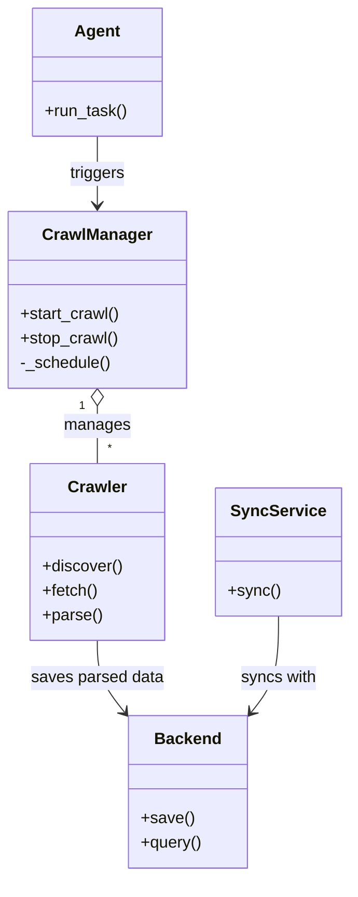
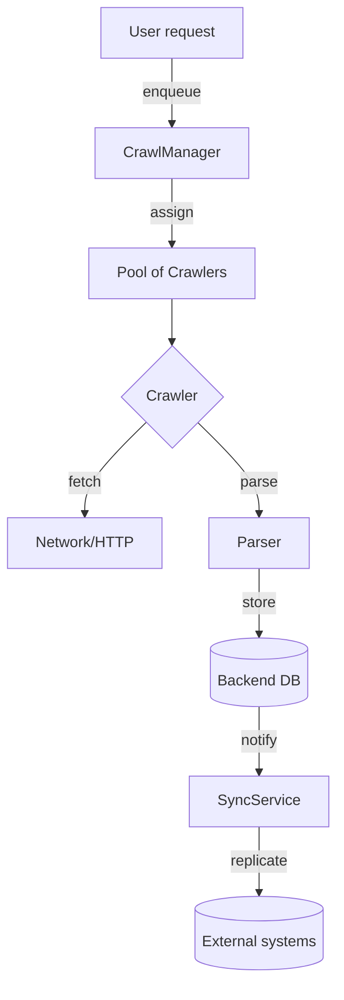

# Diagram: shipment_core/shipment_trip_plan_service/config/config.prod-b.yml

> Auto-generated by Obscura crawlers

## Diagram 1

### SVG

<svg id="container" width="336.5703125" xmlns="http://www.w3.org/2000/svg" class="classDiagram" height="862" viewBox="0 0 336.5703125 862" role="graphics-document document" aria-roledescription="class"><g><defs><marker id="container_class-aggregationStart" class="marker aggregation class" refX="18" refY="7" markerWidth="190" markerHeight="240" orient="auto"><path d="M 18,7 L9,13 L1,7 L9,1 Z"></path></marker></defs><defs><marker id="container_class-aggregationEnd" class="marker aggregation class" refX="1" refY="7" markerWidth="20" markerHeight="28" orient="auto"><path d="M 18,7 L9,13 L1,7 L9,1 Z"></path></marker></defs><defs><marker id="container_class-extensionStart" class="marker extension class" refX="18" refY="7" markerWidth="190" markerHeight="240" orient="auto"><path d="M 1,7 L18,13 V 1 Z"></path></marker></defs><defs><marker id="container_class-extensionEnd" class="marker extension class" refX="1" refY="7" markerWidth="20" markerHeight="28" orient="auto"><path d="M 1,1 V 13 L18,7 Z"></path></marker></defs><defs><marker id="container_class-compositionStart" class="marker composition class" refX="18" refY="7" markerWidth="190" markerHeight="240" orient="auto"><path d="M 18,7 L9,13 L1,7 L9,1 Z"></path></marker></defs><defs><marker id="container_class-compositionEnd" class="marker composition class" refX="1" refY="7" markerWidth="20" markerHeight="28" orient="auto"><path d="M 18,7 L9,13 L1,7 L9,1 Z"></path></marker></defs><defs><marker id="container_class-dependencyStart" class="marker dependency class" refX="6" refY="7" markerWidth="190" markerHeight="240" orient="auto"><path d="M 5,7 L9,13 L1,7 L9,1 Z"></path></marker></defs><defs><marker id="container_class-dependencyEnd" class="marker dependency class" refX="13" refY="7" markerWidth="20" markerHeight="28" orient="auto"><path d="M 18,7 L9,13 L14,7 L9,1 Z"></path></marker></defs><defs><marker id="container_class-lollipopStart" class="marker lollipop class" refX="13" refY="7" markerWidth="190" markerHeight="240" orient="auto"><circle stroke="black" fill="transparent" cx="7" cy="7" r="6"></circle></marker></defs><defs><marker id="container_class-lollipopEnd" class="marker lollipop class" refX="1" refY="7" markerWidth="190" markerHeight="240" orient="auto"><circle stroke="black" fill="transparent" cx="7" cy="7" r="6"></circle></marker></defs><g class="root"><g class="clusters"></g><g class="edgePaths"><path d="M94.898,399.25L94.898,402.542C94.898,405.833,94.898,412.417,94.898,421.875C94.898,431.333,94.898,443.667,94.898,449.833L94.898,456" id="id_CrawlManager_Crawler_1" class="edge-thickness-normal edge-pattern-solid relation" style=";;;" data-edge="true" data-et="edge" data-id="id_CrawlManager_Crawler_1" data-points="W3sieCI6OTQuODk4NDM3NSwieSI6MzgyfSx7IngiOjk0Ljg5ODQzNzUsInkiOjQxOX0seyJ4Ijo5NC44OTg0Mzc1LCJ5Ijo0NTZ9XQ==" marker-start="url(#container_class-aggregationStart)"></path><path d="M94.898,630L94.898,636.167C94.898,642.333,94.898,654.667,99.222,666.381C103.546,678.096,112.193,689.192,116.517,694.74L120.841,700.287" id="id_Crawler_Backend_2" class="edge-thickness-normal edge-pattern-solid relation" style=";;;" data-edge="true" data-et="edge" data-id="id_Crawler_Backend_2" data-points="W3sieCI6OTQuODk4NDM3NSwieSI6NjMwfSx7IngiOjk0Ljg5ODQzNzUsInkiOjY2N30seyJ4IjoxMjQuNTI5Mjk2ODc1LCJ5Ijo3MDUuMDIwMDA0MDI3NjU2Nn1d" marker-end="url(#container_class-dependencyEnd)"></path><path d="M269.473,606L269.473,616.167C269.473,626.333,269.473,646.667,265.149,662.381C260.825,678.096,252.178,689.192,247.854,694.74L243.53,700.287" id="id_SyncService_Backend_3" class="edge-thickness-normal edge-pattern-solid relation" style=";;;" data-edge="true" data-et="edge" data-id="id_SyncService_Backend_3" data-points="W3sieCI6MjY5LjQ3MjY1NjI1LCJ5Ijo2MDZ9LHsieCI6MjY5LjQ3MjY1NjI1LCJ5Ijo2Njd9LHsieCI6MjM5Ljg0MTc5Njg3NSwieSI6NzA1LjAyMDAwNDAyNzY1NjZ9XQ==" marker-end="url(#container_class-dependencyEnd)"></path><path d="M94.898,134L94.898,140.167C94.898,146.333,94.898,158.667,94.898,170C94.898,181.333,94.898,191.667,94.898,196.833L94.898,202" id="id_Agent_CrawlManager_4" class="edge-thickness-normal edge-pattern-solid relation" style=";;;" data-edge="true" data-et="edge" data-id="id_Agent_CrawlManager_4" data-points="W3sieCI6OTQuODk4NDM3NSwieSI6MTM0fSx7IngiOjk0Ljg5ODQzNzUsInkiOjE3MX0seyJ4Ijo5NC44OTg0Mzc1LCJ5IjoyMDh9XQ==" marker-end="url(#container_class-dependencyEnd)"></path></g><g class="edgeLabels"><g class="edgeLabel" transform="translate(94.8984375, 419)"><g class="label" data-id="id_CrawlManager_Crawler_1" transform="translate(-32.296875, -12)"><foreignObject width="64.59375" height="24">

manages

</foreignObject></g></g><g class="edgeLabel" transform="translate(94.8984375, 667)"><g class="label" data-id="id_Crawler_Backend_2" transform="translate(-65.3203125, -12)"><foreignObject width="130.640625" height="24">

saves parsed data

</foreignObject></g></g><g class="edgeLabel" transform="translate(269.47265625, 667)"><g class="label" data-id="id_SyncService_Backend_3" transform="translate(-37.4765625, -12)"><foreignObject width="74.953125" height="24">

syncs with

</foreignObject></g></g><g class="edgeLabel" transform="translate(94.8984375, 171)"><g class="label" data-id="id_Agent_CrawlManager_4" transform="translate(-27.4921875, -12)"><foreignObject width="54.984375" height="24">

triggers

</foreignObject></g></g><g class="edgeTerminals" transform="translate(79.89843875000004, 399.5000010714286)"><g class="inner" transform="translate(0, 0)"><foreignObject style="width: 9px; height: 12px;">
1
</foreignObject></g></g><g class="edgeTerminals" transform="translate(104.89843874999995, 433.5000010714286)"><g class="inner" transform="translate(0, 0)"></g><foreignObject style="width: 9px; height: 12px;">
*
</foreignObject></g></g><g class="nodes"><g class="node default" id="classId-CrawlManager-0" transform="translate(94.8984375, 295)"><g class="basic label-container"><path d="M-86.8984375 -87 L86.8984375 -87 L86.8984375 87 L-86.8984375 87" stroke="none" stroke-width="0" fill="#ECECFF" style=""></path><path d="M-86.8984375 -87 C-37.26208818892369 -87, 12.374261122152618 -87, 86.8984375 -87 M-86.8984375 -87 C-19.303654284612634 -87, 48.29112893077473 -87, 86.8984375 -87 M86.8984375 -87 C86.8984375 -49.35522338238416, 86.8984375 -11.71044676476832, 86.8984375 87 M86.8984375 -87 C86.8984375 -32.34600184922675, 86.8984375 22.307996301546495, 86.8984375 87 M86.8984375 87 C29.578606793644852 87, -27.741223912710296 87, -86.8984375 87 M86.8984375 87 C43.648381152236574 87, 0.3983248044731482 87, -86.8984375 87 M-86.8984375 87 C-86.8984375 34.95982806514306, -86.8984375 -17.080343869713886, -86.8984375 -87 M-86.8984375 87 C-86.8984375 31.876648227533252, -86.8984375 -23.246703544933496, -86.8984375 -87" stroke="#9370DB" stroke-width="1.3" fill="none" stroke-dasharray="0 0" style=""></path></g><g class="annotation-group text" transform="translate(0, -63)"></g><g class="label-group text" transform="translate(-51.59375, -63)"><g class="label" style="font-weight: bolder" transform="translate(0,-12)"><foreignObject width="103.1875" height="24">

CrawlManager

</foreignObject></g></g><g class="members-group text" transform="translate(-74.8984375, -15)"></g><g class="methods-group text" transform="translate(-74.8984375, 15)"><g class="label" style="" transform="translate(0,-12)"><foreignObject width="98.203125" height="24">

+start_crawl()

</foreignObject></g><g class="label" style="" transform="translate(0,12)"><foreignObject width="95.9375" height="24">

+stop_crawl()

</foreignObject></g><g class="label" style="" transform="translate(0,36)"><foreignObject width="89.28125" height="24">

-_schedule()

</foreignObject></g></g><g class="divider" style=""><path d="M-86.8984375 -39 C-30.202317724917307 -39, 26.493802050165385 -39, 86.8984375 -39 M-86.8984375 -39 C-36.55692997811949 -39, 13.784577543761017 -39, 86.8984375 -39" stroke="#9370DB" stroke-width="1.3" fill="none" stroke-dasharray="0 0" style=""></path></g><g class="divider" style=""><path d="M-86.8984375 -15 C-30.30036753230918 -15, 26.297702435381638 -15, 86.8984375 -15 M-86.8984375 -15 C-45.707322738343116 -15, -4.516207976686232 -15, 86.8984375 -15" stroke="#9370DB" stroke-width="1.3" fill="none" stroke-dasharray="0 0" style=""></path></g></g><g class="node default" id="classId-Crawler-1" transform="translate(94.8984375, 543)"><g class="basic label-container"><path d="M-65.4765625 -87 L65.4765625 -87 L65.4765625 87 L-65.4765625 87" stroke="none" stroke-width="0" fill="#ECECFF" style=""></path><path d="M-65.4765625 -87 C-15.686076877755141 -87, 34.10440874448972 -87, 65.4765625 -87 M-65.4765625 -87 C-35.72474513189208 -87, -5.972927763784149 -87, 65.4765625 -87 M65.4765625 -87 C65.4765625 -51.99589680624727, 65.4765625 -16.991793612494547, 65.4765625 87 M65.4765625 -87 C65.4765625 -33.48966480328929, 65.4765625 20.020670393421426, 65.4765625 87 M65.4765625 87 C33.070131413860395 87, 0.6637003277207896 87, -65.4765625 87 M65.4765625 87 C33.93547419637912 87, 2.394385892758244 87, -65.4765625 87 M-65.4765625 87 C-65.4765625 24.3147410109898, -65.4765625 -38.3705179780204, -65.4765625 -87 M-65.4765625 87 C-65.4765625 39.602746554372835, -65.4765625 -7.794506891254329, -65.4765625 -87" stroke="#9370DB" stroke-width="1.3" fill="none" stroke-dasharray="0 0" style=""></path></g><g class="annotation-group text" transform="translate(0, -63)"></g><g class="label-group text" transform="translate(-27.734375, -63)"><g class="label" style="font-weight: bolder" transform="translate(0,-12)"><foreignObject width="55.46875" height="24">

Crawler

</foreignObject></g></g><g class="members-group text" transform="translate(-53.4765625, -15)"></g><g class="methods-group text" transform="translate(-53.4765625, 15)"><g class="label" style="" transform="translate(0,-12)"><foreignObject width="79.21875" height="24">

+discover()

</foreignObject></g><g class="label" style="" transform="translate(0,12)"><foreignObject width="54.59375" height="24">

+fetch()

</foreignObject></g><g class="label" style="" transform="translate(0,36)"><foreignObject width="58.53125" height="24">

+parse()

</foreignObject></g></g><g class="divider" style=""><path d="M-65.4765625 -39 C-39.12861754163902 -39, -12.780672583278026 -39, 65.4765625 -39 M-65.4765625 -39 C-32.94737245785122 -39, -0.4181824157024465 -39, 65.4765625 -39" stroke="#9370DB" stroke-width="1.3" fill="none" stroke-dasharray="0 0" style=""></path></g><g class="divider" style=""><path d="M-65.4765625 -15 C-37.20896257756401 -15, -8.941362655128017 -15, 65.4765625 -15 M-65.4765625 -15 C-30.079982896090243 -15, 5.316596707819514 -15, 65.4765625 -15" stroke="#9370DB" stroke-width="1.3" fill="none" stroke-dasharray="0 0" style=""></path></g></g><g class="node default" id="classId-Backend-2" transform="translate(182.185546875, 779)"><g class="basic label-container"><path d="M-57.65625 -75 L57.65625 -75 L57.65625 75 L-57.65625 75" stroke="none" stroke-width="0" fill="#ECECFF" style=""></path><path d="M-57.65625 -75 C-16.615297587042654 -75, 24.42565482591469 -75, 57.65625 -75 M-57.65625 -75 C-23.17116779703271 -75, 11.313914405934582 -75, 57.65625 -75 M57.65625 -75 C57.65625 -29.557834498952545, 57.65625 15.88433100209491, 57.65625 75 M57.65625 -75 C57.65625 -41.618964215823354, 57.65625 -8.237928431646708, 57.65625 75 M57.65625 75 C28.597065252014186 75, -0.4621194959716277 75, -57.65625 75 M57.65625 75 C30.95666507567085 75, 4.257080151341697 75, -57.65625 75 M-57.65625 75 C-57.65625 20.65561700168476, -57.65625 -33.68876599663048, -57.65625 -75 M-57.65625 75 C-57.65625 26.123711376750414, -57.65625 -22.752577246499172, -57.65625 -75" stroke="#9370DB" stroke-width="1.3" fill="none" stroke-dasharray="0 0" style=""></path></g><g class="annotation-group text" transform="translate(0, -51)"></g><g class="label-group text" transform="translate(-31.296875, -51)"><g class="label" style="font-weight: bolder" transform="translate(0,-12)"><foreignObject width="62.59375" height="24">

Backend

</foreignObject></g></g><g class="members-group text" transform="translate(-45.65625, -3)"></g><g class="methods-group text" transform="translate(-45.65625, 27)"><g class="label" style="" transform="translate(0,-12)"><foreignObject width="50.65625" height="24">

+save()

</foreignObject></g><g class="label" style="" transform="translate(0,12)"><foreignObject width="60.015625" height="24">

+query()

</foreignObject></g></g><g class="divider" style=""><path d="M-57.65625 -27 C-13.180362607980818 -27, 31.295524784038363 -27, 57.65625 -27 M-57.65625 -27 C-16.333914168822744 -27, 24.98842166235451 -27, 57.65625 -27" stroke="#9370DB" stroke-width="1.3" fill="none" stroke-dasharray="0 0" style=""></path></g><g class="divider" style=""><path d="M-57.65625 -3 C-29.756013070668725 -3, -1.8557761413374507 -3, 57.65625 -3 M-57.65625 -3 C-33.02563045400199 -3, -8.395010908003982 -3, 57.65625 -3" stroke="#9370DB" stroke-width="1.3" fill="none" stroke-dasharray="0 0" style=""></path></g></g><g class="node default" id="classId-SyncService-3" transform="translate(269.47265625, 543)"><g class="basic label-container"><path d="M-59.09765625 -63 L59.09765625 -63 L59.09765625 63 L-59.09765625 63" stroke="none" stroke-width="0" fill="#ECECFF" style=""></path><path d="M-59.09765625 -63 C-24.76442098066382 -63, 9.568814288672357 -63, 59.09765625 -63 M-59.09765625 -63 C-27.2713398507907 -63, 4.554976548418601 -63, 59.09765625 -63 M59.09765625 -63 C59.09765625 -32.81653192411801, 59.09765625 -2.633063848236013, 59.09765625 63 M59.09765625 -63 C59.09765625 -18.828844370053012, 59.09765625 25.342311259893975, 59.09765625 63 M59.09765625 63 C29.084947359561788 63, -0.927761530876424 63, -59.09765625 63 M59.09765625 63 C13.99713953719094 63, -31.10337717561812 63, -59.09765625 63 M-59.09765625 63 C-59.09765625 17.103575654306788, -59.09765625 -28.792848691386425, -59.09765625 -63 M-59.09765625 63 C-59.09765625 13.467656147383593, -59.09765625 -36.064687705232814, -59.09765625 -63" stroke="#9370DB" stroke-width="1.3" fill="none" stroke-dasharray="0 0" style=""></path></g><g class="annotation-group text" transform="translate(0, -39)"></g><g class="label-group text" transform="translate(-43.7421875, -39)"><g class="label" style="font-weight: bolder" transform="translate(0,-12)"><foreignObject width="87.484375" height="24">

SyncService

</foreignObject></g></g><g class="members-group text" transform="translate(-47.09765625, 9)"></g><g class="methods-group text" transform="translate(-47.09765625, 39)"><g class="label" style="" transform="translate(0,-12)"><foreignObject width="50.453125" height="24">

+sync()

</foreignObject></g></g><g class="divider" style=""><path d="M-59.09765625 -15 C-34.239782451629246 -15, -9.381908653258492 -15, 59.09765625 -15 M-59.09765625 -15 C-23.107267894701046 -15, 12.883120460597908 -15, 59.09765625 -15" stroke="#9370DB" stroke-width="1.3" fill="none" stroke-dasharray="0 0" style=""></path></g><g class="divider" style=""><path d="M-59.09765625 9 C-33.42218126654578 9, -7.746706283091548 9, 59.09765625 9 M-59.09765625 9 C-30.319249511859887 9, -1.540842773719774 9, 59.09765625 9" stroke="#9370DB" stroke-width="1.3" fill="none" stroke-dasharray="0 0" style=""></path></g></g><g class="node default" id="classId-Agent-4" transform="translate(94.8984375, 71)"><g class="basic label-container"><path d="M-63.0859375 -63 L63.0859375 -63 L63.0859375 63 L-63.0859375 63" stroke="none" stroke-width="0" fill="#ECECFF" style=""></path><path d="M-63.0859375 -63 C-36.29972075078747 -63, -9.513504001574937 -63, 63.0859375 -63 M-63.0859375 -63 C-31.47335767455968 -63, 0.1392221508806415 -63, 63.0859375 -63 M63.0859375 -63 C63.0859375 -36.258449676552814, 63.0859375 -9.516899353105622, 63.0859375 63 M63.0859375 -63 C63.0859375 -16.849546508829214, 63.0859375 29.300906982341573, 63.0859375 63 M63.0859375 63 C20.205029713239725 63, -22.67587807352055 63, -63.0859375 63 M63.0859375 63 C14.530934460260816 63, -34.02406857947837 63, -63.0859375 63 M-63.0859375 63 C-63.0859375 15.767871428399097, -63.0859375 -31.464257143201806, -63.0859375 -63 M-63.0859375 63 C-63.0859375 21.376554583580692, -63.0859375 -20.246890832838616, -63.0859375 -63" stroke="#9370DB" stroke-width="1.3" fill="none" stroke-dasharray="0 0" style=""></path></g><g class="annotation-group text" transform="translate(0, -39)"></g><g class="label-group text" transform="translate(-21.078125, -39)"><g class="label" style="font-weight: bolder" transform="translate(0,-12)"><foreignObject width="42.15625" height="24">

Agent

</foreignObject></g></g><g class="members-group text" transform="translate(-51.0859375, 9)"></g><g class="methods-group text" transform="translate(-51.0859375, 39)"><g class="label" style="" transform="translate(0,-12)"><foreignObject width="81.09375" height="24">

+run_task()

</foreignObject></g></g><g class="divider" style=""><path d="M-63.0859375 -15 C-31.116328126662548 -15, 0.8532812466749036 -15, 63.0859375 -15 M-63.0859375 -15 C-26.211073350851848 -15, 10.663790798296304 -15, 63.0859375 -15" stroke="#9370DB" stroke-width="1.3" fill="none" stroke-dasharray="0 0" style=""></path></g><g class="divider" style=""><path d="M-63.0859375 9 C-31.786324358432346 9, -0.4867112168646912 9, 63.0859375 9 M-63.0859375 9 C-36.4595485865153 9, -9.833159673030586 9, 63.0859375 9" stroke="#9370DB" stroke-width="1.3" fill="none" stroke-dasharray="0 0" style=""></path></g></g></g></g></g></svg>

## Diagram 2

### SVG

<svg id="container" width="357.1328125" xmlns="http://www.w3.org/2000/svg" class="flowchart" height="1038.6165771484375" viewBox="0 0 357.1328125 1038.6165771484375" role="graphics-document document" aria-roledescription="flowchart-v2"><g><marker id="container_flowchart-v2-pointEnd" class="marker flowchart-v2" viewBox="0 0 10 10" refX="5" refY="5" markerUnits="userSpaceOnUse" markerWidth="8" markerHeight="8" orient="auto"><path d="M 0 0 L 10 5 L 0 10 z" class="arrowMarkerPath" style="stroke-width: 1; stroke-dasharray: 1, 0;"></path></marker><marker id="container_flowchart-v2-pointStart" class="marker flowchart-v2" viewBox="0 0 10 10" refX="4.5" refY="5" markerUnits="userSpaceOnUse" markerWidth="8" markerHeight="8" orient="auto"><path d="M 0 5 L 10 10 L 10 0 z" class="arrowMarkerPath" style="stroke-width: 1; stroke-dasharray: 1, 0;"></path></marker><marker id="container_flowchart-v2-circleEnd" class="marker flowchart-v2" viewBox="0 0 10 10" refX="11" refY="5" markerUnits="userSpaceOnUse" markerWidth="11" markerHeight="11" orient="auto"><circle cx="5" cy="5" r="5" class="arrowMarkerPath" style="stroke-width: 1; stroke-dasharray: 1, 0;"></circle></marker><marker id="container_flowchart-v2-circleStart" class="marker flowchart-v2" viewBox="0 0 10 10" refX="-1" refY="5" markerUnits="userSpaceOnUse" markerWidth="11" markerHeight="11" orient="auto"><circle cx="5" cy="5" r="5" class="arrowMarkerPath" style="stroke-width: 1; stroke-dasharray: 1, 0;"></circle></marker><marker id="container_flowchart-v2-crossEnd" class="marker cross flowchart-v2" viewBox="0 0 11 11" refX="12" refY="5.2" markerUnits="userSpaceOnUse" markerWidth="11" markerHeight="11" orient="auto"><path d="M 1,1 l 9,9 M 10,1 l -9,9" class="arrowMarkerPath" style="stroke-width: 2; stroke-dasharray: 1, 0;"></path></marker><marker id="container_flowchart-v2-crossStart" class="marker cross flowchart-v2" viewBox="0 0 11 11" refX="-1" refY="5.2" markerUnits="userSpaceOnUse" markerWidth="11" markerHeight="11" orient="auto"><path d="M 1,1 l 9,9 M 10,1 l -9,9" class="arrowMarkerPath" style="stroke-width: 2; stroke-dasharray: 1, 0;"></path></marker><g class="root"><g class="clusters"></g><g class="edgePaths"><path d="M183.602,62L183.602,68.167C183.602,74.333,183.602,86.667,183.602,98.333C183.602,110,183.602,121,183.602,126.5L183.602,132" id="L_U_M_0" class="edge-thickness-normal edge-pattern-solid edge-thickness-normal edge-pattern-solid flowchart-link" style=";" data-edge="true" data-et="edge" data-id="L_U_M_0" data-points="W3sieCI6MTgzLjYwMTU2MjUsInkiOjYyfSx7IngiOjE4My42MDE1NjI1LCJ5Ijo5OX0seyJ4IjoxODMuNjAxNTYyNSwieSI6MTM2fV0=" marker-end="url(#container_flowchart-v2-pointEnd)"></path><path d="M183.602,190L183.602,196.167C183.602,202.333,183.602,214.667,183.602,226.333C183.602,238,183.602,249,183.602,254.5L183.602,260" id="L_M_CrawlerPool_0" class="edge-thickness-normal edge-pattern-solid edge-thickness-normal edge-pattern-solid flowchart-link" style=";" data-edge="true" data-et="edge" data-id="L_M_CrawlerPool_0" data-points="W3sieCI6MTgzLjYwMTU2MjUsInkiOjE5MH0seyJ4IjoxODMuNjAxNTYyNSwieSI6MjI3fSx7IngiOjE4My42MDE1NjI1LCJ5IjoyNjR9XQ==" marker-end="url(#container_flowchart-v2-pointEnd)"></path><path d="M183.602,318L183.602,322.167C183.602,326.333,183.602,334.667,183.602,342.333C183.602,350,183.602,357,183.602,360.5L183.602,364" id="L_CrawlerPool_CrawlerInstance_0" class="edge-thickness-normal edge-pattern-solid edge-thickness-normal edge-pattern-solid flowchart-link" style=";" data-edge="true" data-et="edge" data-id="L_CrawlerPool_CrawlerInstance_0" data-points="W3sieCI6MTgzLjYwMTU2MjUsInkiOjMxOH0seyJ4IjoxODMuNjAxNTYyNSwieSI6MzQzfSx7IngiOjE4My42MDE1NjI1LCJ5IjozNjh9XQ==" marker-end="url(#container_flowchart-v2-pointEnd)"></path><path d="M156.352,448.688L145.431,459.396C134.511,470.105,112.669,491.521,101.749,507.729C90.828,523.938,90.828,534.938,90.828,540.438L90.828,545.938" id="L_CrawlerInstance_Network_0" class="edge-thickness-normal edge-pattern-solid edge-thickness-normal edge-pattern-solid flowchart-link" style=";" data-edge="true" data-et="edge" data-id="L_CrawlerInstance_Network_0" data-points="W3sieCI6MTU2LjM1MjE1MTExOTgzOTI4LCJ5Ijo0NDguNjg4MDg4NjE5ODM5M30seyJ4Ijo5MC44MjgxMjUsInkiOjUxMi45Mzc1fSx7IngiOjkwLjgyODEyNSwieSI6NTQ5LjkzNzV9XQ==" marker-end="url(#container_flowchart-v2-pointEnd)"></path><path d="M210.851,448.688L221.772,459.396C232.692,470.105,254.534,491.521,265.454,507.729C276.375,523.938,276.375,534.938,276.375,540.438L276.375,545.938" id="L_CrawlerInstance_Parser_0" class="edge-thickness-normal edge-pattern-solid edge-thickness-normal edge-pattern-solid flowchart-link" style=";" data-edge="true" data-et="edge" data-id="L_CrawlerInstance_Parser_0" data-points="W3sieCI6MjEwLjg1MDk3Mzg4MDE2MDcyLCJ5Ijo0NDguNjg4MDg4NjE5ODM5M30seyJ4IjoyNzYuMzc1LCJ5Ijo1MTIuOTM3NX0seyJ4IjoyNzYuMzc1LCJ5Ijo1NDkuOTM3NX1d" marker-end="url(#container_flowchart-v2-pointEnd)"></path><path d="M276.375,603.938L276.375,610.104C276.375,616.271,276.375,628.604,276.375,640.271C276.375,651.938,276.375,662.938,276.375,668.438L276.375,673.938" id="L_Parser_BackendDB_0" class="edge-thickness-normal edge-pattern-solid edge-thickness-normal edge-pattern-solid flowchart-link" style=";" data-edge="true" data-et="edge" data-id="L_Parser_BackendDB_0" data-points="W3sieCI6Mjc2LjM3NSwieSI6NjAzLjkzNzV9LHsieCI6Mjc2LjM3NSwieSI6NjQwLjkzNzV9LHsieCI6Mjc2LjM3NSwieSI6Njc3LjkzNzV9XQ==" marker-end="url(#container_flowchart-v2-pointEnd)"></path><path d="M276.375,750.47L276.375,756.636C276.375,762.803,276.375,775.136,276.375,786.803C276.375,798.47,276.375,809.47,276.375,814.97L276.375,820.47" id="L_BackendDB_SyncService_0" class="edge-thickness-normal edge-pattern-solid edge-thickness-normal edge-pattern-solid flowchart-link" style=";" data-edge="true" data-et="edge" data-id="L_BackendDB_SyncService_0" data-points="W3sieCI6Mjc2LjM3NSwieSI6NzUwLjQ2OTUzNTgyNzYzNjd9LHsieCI6Mjc2LjM3NSwieSI6Nzg3LjQ2OTUzNTgyNzYzNjd9LHsieCI6Mjc2LjM3NSwieSI6ODI0LjQ2OTUzNTgyNzYzNjd9XQ==" marker-end="url(#container_flowchart-v2-pointEnd)"></path><path d="M276.375,878.47L276.375,884.636C276.375,890.803,276.375,903.136,276.375,914.803C276.375,926.47,276.375,937.47,276.375,942.97L276.375,948.47" id="L_SyncService_External_0" class="edge-thickness-normal edge-pattern-solid edge-thickness-normal edge-pattern-solid flowchart-link" style=";" data-edge="true" data-et="edge" data-id="L_SyncService_External_0" data-points="W3sieCI6Mjc2LjM3NSwieSI6ODc4LjQ2OTUzNTgyNzYzNjd9LHsieCI6Mjc2LjM3NSwieSI6OTE1LjQ2OTUzNTgyNzYzNjd9LHsieCI6Mjc2LjM3NSwieSI6OTUyLjQ2OTUzNTgyNzYzNjd9XQ==" marker-end="url(#container_flowchart-v2-pointEnd)"></path></g><g class="edgeLabels"><g class="edgeLabel" transform="translate(183.6015625, 99)"><g class="label" data-id="L_U_M_0" transform="translate(-31.8671875, -12)"><foreignObject width="63.734375" height="24">

enqueue

</foreignObject></g></g><g class="edgeLabel" transform="translate(183.6015625, 227)"><g class="label" data-id="L_M_CrawlerPool_0" transform="translate(-22.7734375, -12)"><foreignObject width="45.546875" height="24">

assign

</foreignObject></g></g><g class="edgeLabel"><g class="label" data-id="L_CrawlerPool_CrawlerInstance_0" transform="translate(0, 0)"><foreignObject width="0" height="0">

</foreignObject></g></g><g class="edgeLabel" transform="translate(90.828125, 512.9375)"><g class="label" data-id="L_CrawlerInstance_Network_0" transform="translate(-18.2421875, -12)"><foreignObject width="36.484375" height="24">

fetch

</foreignObject></g></g><g class="edgeLabel" transform="translate(276.375, 512.9375)"><g class="label" data-id="L_CrawlerInstance_Parser_0" transform="translate(-20.09375, -12)"><foreignObject width="40.1875" height="24">

parse

</foreignObject></g></g><g class="edgeLabel" transform="translate(276.375, 640.9375)"><g class="label" data-id="L_Parser_BackendDB_0" transform="translate(-18.390625, -12)"><foreignObject width="36.78125" height="24">

store

</foreignObject></g></g><g class="edgeLabel" transform="translate(276.375, 787.4695358276367)"><g class="label" data-id="L_BackendDB_SyncService_0" transform="translate(-21.125, -12)"><foreignObject width="42.25" height="24">

notify

</foreignObject></g></g><g class="edgeLabel" transform="translate(276.375, 915.4695358276367)"><g class="label" data-id="L_SyncService_External_0" transform="translate(-31.7890625, -12)"><foreignObject width="63.578125" height="24">

replicate

</foreignObject></g></g></g><g class="nodes"><g class="node default" id="flowchart-U-0" transform="translate(183.6015625, 35)"><rect class="basic label-container" style="" x="-76.1953125" y="-27" width="152.390625" height="54"></rect><g class="label" style="" transform="translate(-46.1953125, -12)"><rect></rect><foreignObject width="92.390625" height="24">

User request

</foreignObject></g></g><g class="node default" id="flowchart-M-1" transform="translate(183.6015625, 163)"><rect class="basic label-container" style="" x="-80.578125" y="-27" width="161.15625" height="54"></rect><g class="label" style="" transform="translate(-50.578125, -12)"><rect></rect><foreignObject width="101.15625" height="24">

CrawlManager

</foreignObject></g></g><g class="node default" id="flowchart-CrawlerPool-3" transform="translate(183.6015625, 291)"><rect class="basic label-container" style="" x="-88.2734375" y="-27" width="176.546875" height="54"></rect><g class="label" style="" transform="translate(-58.2734375, -12)"><rect></rect><foreignObject width="116.546875" height="24">

Pool of Crawlers

</foreignObject></g></g><g class="node default" id="flowchart-CrawlerInstance-5" transform="translate(183.6015625, 421.96875)"><polygon points="53.96875,0 107.9375,-53.96875 53.96875,-107.9375 0,-53.96875" class="label-container" transform="translate(-53.46875, 53.96875)"></polygon><g class="label" style="" transform="translate(-26.96875, -12)"><rect></rect><foreignObject width="53.9375" height="24">

Crawler

</foreignObject></g></g><g class="node default" id="flowchart-Network-7" transform="translate(90.828125, 576.9375)"><rect class="basic label-container" style="" x="-82.828125" y="-27" width="165.65625" height="54"></rect><g class="label" style="" transform="translate(-52.828125, -12)"><rect></rect><foreignObject width="105.65625" height="24">

Network/HTTP

</foreignObject></g></g><g class="node default" id="flowchart-Parser-9" transform="translate(276.375, 576.9375)"><rect class="basic label-container" style="" x="-52.71875" y="-27" width="105.4375" height="54"></rect><g class="label" style="" transform="translate(-22.71875, -12)"><rect></rect><foreignObject width="45.4375" height="24">

Parser

</foreignObject></g></g><g class="node default" id="flowchart-BackendDB-11" transform="translate(276.375, 714.2035179138184)"><path d="M0,11.177344667910706 a50.5390625,11.177344667910706 0,0,0 101.078125,0 a50.5390625,11.177344667910706 0,0,0 -101.078125,0 l0,50.1773446679107 a50.5390625,11.177344667910706 0,0,0 101.078125,0 l0,-50.1773446679107" class="basic label-container" style="" transform="translate(-50.5390625, -36.26601700186606)"></path><g class="label" style="" transform="translate(-43.0390625, -2)"><rect></rect><foreignObject width="86.078125" height="24">

Backend DB

</foreignObject></g></g><g class="node default" id="flowchart-SyncService-13" transform="translate(276.375, 851.4695358276367)"><rect class="basic label-container" style="" x="-72.7578125" y="-27" width="145.515625" height="54"></rect><g class="label" style="" transform="translate(-42.7578125, -12)"><rect></rect><foreignObject width="85.515625" height="24">

SyncService

</foreignObject></g></g><g class="node default" id="flowchart-External-15" transform="translate(276.375, 991.5430335998535)"><path d="M0,13.048999103674934 a68.2421875,13.048999103674934 0,0,0 136.484375,0 a68.2421875,13.048999103674934 0,0,0 -136.484375,0 l0,52.04899910367493 a68.2421875,13.048999103674934 0,0,0 136.484375,0 l0,-52.04899910367493" class="basic label-container" style="" transform="translate(-68.2421875, -39.073498655512395)"></path><g class="label" style="" transform="translate(-60.7421875, -2)"><rect></rect><foreignObject width="121.484375" height="24">

External systems

</foreignObject></g></g></g></g></g></svg>
