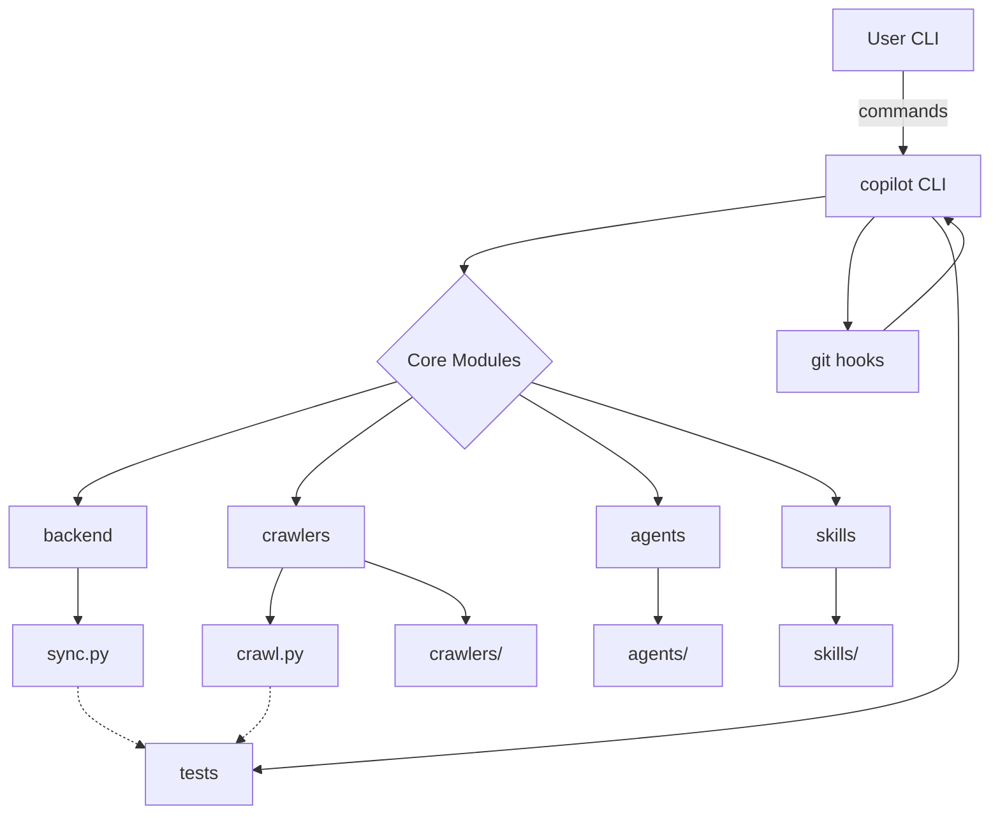

# Diagram: shipment_core/shipment_trip_plan_service/config/config.qa2.yml

> Auto-generated by Obscura crawlers

## Mermaid

### SVG

<svg id="container" width="878.5234375" xmlns="http://www.w3.org/2000/svg" class="flowchart" height="712.125" viewBox="0 0 878.5234375 712.125" role="graphics-document document" aria-roledescription="flowchart-v2"><g><marker id="container_flowchart-v2-pointEnd" class="marker flowchart-v2" viewBox="0 0 10 10" refX="5" refY="5" markerUnits="userSpaceOnUse" markerWidth="8" markerHeight="8" orient="auto"><path d="M 0 0 L 10 5 L 0 10 z" class="arrowMarkerPath" style="stroke-width: 1; stroke-dasharray: 1, 0;"></path></marker><marker id="container_flowchart-v2-pointStart" class="marker flowchart-v2" viewBox="0 0 10 10" refX="4.5" refY="5" markerUnits="userSpaceOnUse" markerWidth="8" markerHeight="8" orient="auto"><path d="M 0 5 L 10 10 L 10 0 z" class="arrowMarkerPath" style="stroke-width: 1; stroke-dasharray: 1, 0;"></path></marker><marker id="container_flowchart-v2-circleEnd" class="marker flowchart-v2" viewBox="0 0 10 10" refX="11" refY="5" markerUnits="userSpaceOnUse" markerWidth="11" markerHeight="11" orient="auto"><circle cx="5" cy="5" r="5" class="arrowMarkerPath" style="stroke-width: 1; stroke-dasharray: 1, 0;"></circle></marker><marker id="container_flowchart-v2-circleStart" class="marker flowchart-v2" viewBox="0 0 10 10" refX="-1" refY="5" markerUnits="userSpaceOnUse" markerWidth="11" markerHeight="11" orient="auto"><circle cx="5" cy="5" r="5" class="arrowMarkerPath" style="stroke-width: 1; stroke-dasharray: 1, 0;"></circle></marker><marker id="container_flowchart-v2-crossEnd" class="marker cross flowchart-v2" viewBox="0 0 11 11" refX="12" refY="5.2" markerUnits="userSpaceOnUse" markerWidth="11" markerHeight="11" orient="auto"><path d="M 1,1 l 9,9 M 10,1 l -9,9" class="arrowMarkerPath" style="stroke-width: 2; stroke-dasharray: 1, 0;"></path></marker><marker id="container_flowchart-v2-crossStart" class="marker cross flowchart-v2" viewBox="0 0 11 11" refX="-1" refY="5.2" markerUnits="userSpaceOnUse" markerWidth="11" markerHeight="11" orient="auto"><path d="M 1,1 l 9,9 M 10,1 l -9,9" class="arrowMarkerPath" style="stroke-width: 2; stroke-dasharray: 1, 0;"></path></marker><g class="root"><g class="clusters"></g><g class="edgePaths"><path d="M802.367,62L802.367,68.167C802.367,74.333,802.367,86.667,802.367,98.333C802.367,110,802.367,121,802.367,126.5L802.367,132" id="L_A_B_0" class="edge-thickness-normal edge-pattern-solid edge-thickness-normal edge-pattern-solid flowchart-link" style=";" data-edge="true" data-et="edge" data-id="L_A_B_0" data-points="W3sieCI6ODAyLjM2NzE4NzUsInkiOjYyfSx7IngiOjgwMi4zNjcxODc1LCJ5Ijo5OX0seyJ4Ijo4MDIuMzY3MTg3NSwieSI6MTM2fV0=" marker-end="url(#container_flowchart-v2-pointEnd)"></path><path d="M734.211,172.041L680.236,179.201C626.262,186.361,518.313,200.68,464.338,211.34C410.363,222,410.363,229,410.363,232.5L410.363,236" id="L_B_C_0" class="edge-thickness-normal edge-pattern-solid edge-thickness-normal edge-pattern-solid flowchart-link" style=";" data-edge="true" data-et="edge" data-id="L_B_C_0" data-points="W3sieCI6NzM0LjIxMDkzNzUsInkiOjE3Mi4wNDEwNDUxMTA3NTkwM30seyJ4Ijo0MTAuMzYzMjgxMjUsInkiOjIxNX0seyJ4Ijo0MTAuMzYzMjgxMjUsInkiOjI0MH1d" marker-end="url(#container_flowchart-v2-pointEnd)"></path><path d="M351.664,333.426L304.505,347.376C257.346,361.326,163.029,389.225,115.87,406.675C68.711,424.125,68.711,431.125,68.711,434.625L68.711,438.125" id="L_C_D_0" class="edge-thickness-normal edge-pattern-solid edge-thickness-normal edge-pattern-solid flowchart-link" style=";" data-edge="true" data-et="edge" data-id="L_C_D_0" data-points="W3sieCI6MzUxLjY2NDI1MjM3NTQyNDYsInkiOjMzMy40MjU5NzExMjU0MjQ2fSx7IngiOjY4LjcxMDkzNzUsInkiOjQxNy4xMjV9LHsieCI6NjguNzEwOTM3NSwieSI6NDQyLjEyNX1d" marker-end="url(#container_flowchart-v2-pointEnd)"></path><path d="M364.49,346.252L346.541,358.064C328.592,369.876,292.695,393.501,274.746,408.813C256.797,424.125,256.797,431.125,256.797,434.625L256.797,438.125" id="L_C_E_0" class="edge-thickness-normal edge-pattern-solid edge-thickness-normal edge-pattern-solid flowchart-link" style=";" data-edge="true" data-et="edge" data-id="L_C_E_0" data-points="W3sieCI6MzY0LjQ5MDA3MzI2NTAzNDE0LCJ5IjozNDYuMjUxNzkyMDE1MDM0MTR9LHsieCI6MjU2Ljc5Njg3NSwieSI6NDE3LjEyNX0seyJ4IjoyNTYuNzk2ODc1LCJ5Ijo0NDIuMTI1fV0=" marker-end="url(#container_flowchart-v2-pointEnd)"></path><path d="M458.387,344.101L479.233,356.272C500.078,368.442,541.77,392.784,562.615,408.454C583.461,424.125,583.461,431.125,583.461,434.625L583.461,438.125" id="L_C_F_0" class="edge-thickness-normal edge-pattern-solid edge-thickness-normal edge-pattern-solid flowchart-link" style=";" data-edge="true" data-et="edge" data-id="L_C_F_0" data-points="W3sieCI6NDU4LjM4NzE4MzI1ODk3NjMsInkiOjM0NC4xMDEwOTc5OTEwMjM3fSx7IngiOjU4My40NjA5Mzc1LCJ5Ijo0MTcuMTI1fSx7IngiOjU4My40NjA5Mzc1LCJ5Ijo0NDIuMTI1fV0=" marker-end="url(#container_flowchart-v2-pointEnd)"></path><path d="M468.754,333.735L514.675,347.633C560.596,361.531,652.439,389.328,698.36,406.727C744.281,424.125,744.281,431.125,744.281,434.625L744.281,438.125" id="L_C_G_0" class="edge-thickness-normal edge-pattern-solid edge-thickness-normal edge-pattern-solid flowchart-link" style=";" data-edge="true" data-et="edge" data-id="L_C_G_0" data-points="W3sieCI6NDY4Ljc1MzU3MDc1MjA0MywieSI6MzMzLjczNDcxMDQ5Nzk1N30seyJ4Ijo3NDQuMjgxMjUsInkiOjQxNy4xMjV9LHsieCI6NzQ0LjI4MTI1LCJ5Ijo0NDIuMTI1fV0=" marker-end="url(#container_flowchart-v2-pointEnd)"></path><path d="M776.86,190L772.924,194.167C768.987,198.333,761.115,206.667,757.178,222.51C753.242,238.354,753.242,261.708,753.242,273.385L753.242,285.063" id="L_B_H_0" class="edge-thickness-normal edge-pattern-solid edge-thickness-normal edge-pattern-solid flowchart-link" style=";" data-edge="true" data-et="edge" data-id="L_B_H_0" data-points="W3sieCI6Nzc2Ljg1OTk3NTk2MTUzODUsInkiOjE5MH0seyJ4Ijo3NTMuMjQyMTg3NSwieSI6MjE1fSx7IngiOjc1My4yNDIxODc1LCJ5IjoyODkuMDYyNX1d" marker-end="url(#container_flowchart-v2-pointEnd)"></path><path d="M827.874,190L831.811,194.167C835.747,198.333,843.62,206.667,847.556,227.677C851.492,248.688,851.492,282.375,851.492,316.063C851.492,349.75,851.492,383.438,851.492,408.948C851.492,434.458,851.492,451.792,851.492,469.125C851.492,486.458,851.492,503.792,851.492,521.125C851.492,538.458,851.492,555.792,851.492,573.125C851.492,590.458,851.492,607.792,746.726,624.469C641.96,641.146,432.427,657.167,327.661,665.178L222.895,673.189" id="L_B_I_0" class="edge-thickness-normal edge-pattern-solid edge-thickness-normal edge-pattern-solid flowchart-link" style=";" data-edge="true" data-et="edge" data-id="L_B_I_0" data-points="W3sieCI6ODI3Ljg3NDM5OTAzODQ2MTUsInkiOjE5MH0seyJ4Ijo4NTEuNDkyMTg3NSwieSI6MjE1fSx7IngiOjg1MS40OTIxODc1LCJ5IjozMTYuMDYyNX0seyJ4Ijo4NTEuNDkyMTg3NSwieSI6NDE3LjEyNX0seyJ4Ijo4NTEuNDkyMTg3NSwieSI6NDY5LjEyNX0seyJ4Ijo4NTEuNDkyMTg3NSwieSI6NTIxLjEyNX0seyJ4Ijo4NTEuNDkyMTg3NSwieSI6NTczLjEyNX0seyJ4Ijo4NTEuNDkyMTg3NSwieSI6NjI1LjEyNX0seyJ4IjoyMTguOTA2MjUsInkiOjY3My40OTM2NjE2ODg2ODQ3fV0=" marker-end="url(#container_flowchart-v2-pointEnd)"></path><path d="M68.711,496.125L68.711,500.292C68.711,504.458,68.711,512.792,68.711,520.458C68.711,528.125,68.711,535.125,68.711,538.625L68.711,542.125" id="L_D_J_0" class="edge-thickness-normal edge-pattern-solid edge-thickness-normal edge-pattern-solid flowchart-link" style=";" data-edge="true" data-et="edge" data-id="L_D_J_0" data-points="W3sieCI6NjguNzEwOTM3NSwieSI6NDk2LjEyNX0seyJ4Ijo2OC43MTA5Mzc1LCJ5Ijo1MjEuMTI1fSx7IngiOjY4LjcxMDkzNzUsInkiOjU0Ni4xMjV9XQ==" marker-end="url(#container_flowchart-v2-pointEnd)"></path><path d="M246.656,496.125L245.091,500.292C243.526,504.458,240.396,512.792,238.831,520.458C237.266,528.125,237.266,535.125,237.266,538.625L237.266,542.125" id="L_E_K_0" class="edge-thickness-normal edge-pattern-solid edge-thickness-normal edge-pattern-solid flowchart-link" style=";" data-edge="true" data-et="edge" data-id="L_E_K_0" data-points="W3sieCI6MjQ2LjY1NTY0OTAzODQ2MTU1LCJ5Ijo0OTYuMTI1fSx7IngiOjIzNy4yNjU2MjUsInkiOjUyMS4xMjV9LHsieCI6MjM3LjI2NTYyNSwieSI6NTQ2LjEyNX1d" marker-end="url(#container_flowchart-v2-pointEnd)"></path><path d="M316.852,489.362L332.561,494.656C348.271,499.95,379.69,510.537,395.4,519.331C411.109,528.125,411.109,535.125,411.109,538.625L411.109,542.125" id="L_E_L_0" class="edge-thickness-normal edge-pattern-solid edge-thickness-normal edge-pattern-solid flowchart-link" style=";" data-edge="true" data-et="edge" data-id="L_E_L_0" data-points="W3sieCI6MzE2Ljg1MTU2MjUsInkiOjQ4OS4zNjIxNDA1NDI3Mjk4M30seyJ4Ijo0MTEuMTA5Mzc1LCJ5Ijo1MjEuMTI1fSx7IngiOjQxMS4xMDkzNzUsInkiOjU0Ni4xMjV9XQ==" marker-end="url(#container_flowchart-v2-pointEnd)"></path><path d="M583.461,496.125L583.461,500.292C583.461,504.458,583.461,512.792,583.461,520.458C583.461,528.125,583.461,535.125,583.461,538.625L583.461,542.125" id="L_F_M_0" class="edge-thickness-normal edge-pattern-solid edge-thickness-normal edge-pattern-solid flowchart-link" style=";" data-edge="true" data-et="edge" data-id="L_F_M_0" data-points="W3sieCI6NTgzLjQ2MDkzNzUsInkiOjQ5Ni4xMjV9LHsieCI6NTgzLjQ2MDkzNzUsInkiOjUyMS4xMjV9LHsieCI6NTgzLjQ2MDkzNzUsInkiOjU0Ni4xMjV9XQ==" marker-end="url(#container_flowchart-v2-pointEnd)"></path><path d="M744.281,496.125L744.281,500.292C744.281,504.458,744.281,512.792,744.281,520.458C744.281,528.125,744.281,535.125,744.281,538.625L744.281,542.125" id="L_G_N_0" class="edge-thickness-normal edge-pattern-solid edge-thickness-normal edge-pattern-solid flowchart-link" style=";" data-edge="true" data-et="edge" data-id="L_G_N_0" data-points="W3sieCI6NzQ0LjI4MTI1LCJ5Ijo0OTYuMTI1fSx7IngiOjc0NC4yODEyNSwieSI6NTIxLjEyNX0seyJ4Ijo3NDQuMjgxMjUsInkiOjU0Ni4xMjV9XQ==" marker-end="url(#container_flowchart-v2-pointEnd)"></path><path d="M68.711,600.125L68.711,604.292C68.711,608.458,68.711,616.792,77.318,625.316C85.925,633.841,103.139,642.556,111.746,646.914L120.353,651.272" id="L_J_I_0" class="edge-thickness-normal edge-pattern-dotted edge-thickness-normal edge-pattern-solid flowchart-link" style=";" data-edge="true" data-et="edge" data-id="L_J_I_0" data-points="W3sieCI6NjguNzEwOTM3NSwieSI6NjAwLjEyNX0seyJ4Ijo2OC43MTA5Mzc1LCJ5Ijo2MjUuMTI1fSx7IngiOjEyMy45MjE4NzUsInkiOjY1My4wNzkwNTQ0NjUyMzY2fV0=" marker-end="url(#container_flowchart-v2-pointEnd)"></path><path d="M237.266,600.125L237.266,604.292C237.266,608.458,237.266,616.792,232.512,624.712C227.759,632.632,218.252,640.139,213.499,643.893L208.745,647.646" id="L_K_I_0" class="edge-thickness-normal edge-pattern-dotted edge-thickness-normal edge-pattern-solid flowchart-link" style=";" data-edge="true" data-et="edge" data-id="L_K_I_0" data-points="W3sieCI6MjM3LjI2NTYyNSwieSI6NjAwLjEyNX0seyJ4IjoyMzcuMjY1NjI1LCJ5Ijo2MjUuMTI1fSx7IngiOjIwNS42MDYyMTk5NTE5MjMxLCJ5Ijo2NTAuMTI1fV0=" marker-end="url(#container_flowchart-v2-pointEnd)"></path><path d="M784.834,289.063L799.277,276.719C813.72,264.375,842.606,239.688,852.043,223.578C861.48,207.468,851.468,199.936,846.462,196.171L841.456,192.405" id="L_H_B_0" class="edge-thickness-normal edge-pattern-solid edge-thickness-normal edge-pattern-solid flowchart-link" style=";" data-edge="true" data-et="edge" data-id="L_H_B_0" data-points="W3sieCI6Nzg0LjgzNDAyNDIzNDY5MzksInkiOjI4OS4wNjI1fSx7IngiOjg3MS40OTIxODc1LCJ5IjoyMTV9LHsieCI6ODM4LjI1OTAxNDQyMzA3NjksInkiOjE5MH1d" marker-end="url(#container_flowchart-v2-pointEnd)"></path></g><g class="edgeLabels"><g class="edgeLabel" transform="translate(802.3671875, 99)"><g class="label" data-id="L_A_B_0" transform="translate(-39.609375, -12)"><foreignObject width="79.21875" height="24">

commands

</foreignObject></g></g><g class="edgeLabel"><g class="label" data-id="L_B_C_0" transform="translate(0, 0)"><foreignObject width="0" height="0">

</foreignObject></g></g><g class="edgeLabel"><g class="label" data-id="L_C_D_0" transform="translate(0, 0)"><foreignObject width="0" height="0">

</foreignObject></g></g><g class="edgeLabel"><g class="label" data-id="L_C_E_0" transform="translate(0, 0)"><foreignObject width="0" height="0">

</foreignObject></g></g><g class="edgeLabel"><g class="label" data-id="L_C_F_0" transform="translate(0, 0)"><foreignObject width="0" height="0">

</foreignObject></g></g><g class="edgeLabel"><g class="label" data-id="L_C_G_0" transform="translate(0, 0)"><foreignObject width="0" height="0">

</foreignObject></g></g><g class="edgeLabel"><g class="label" data-id="L_B_H_0" transform="translate(0, 0)"><foreignObject width="0" height="0">

</foreignObject></g></g><g class="edgeLabel"><g class="label" data-id="L_B_I_0" transform="translate(0, 0)"><foreignObject width="0" height="0">

</foreignObject></g></g><g class="edgeLabel"><g class="label" data-id="L_D_J_0" transform="translate(0, 0)"><foreignObject width="0" height="0">

</foreignObject></g></g><g class="edgeLabel"><g class="label" data-id="L_E_K_0" transform="translate(0, 0)"><foreignObject width="0" height="0">

</foreignObject></g></g><g class="edgeLabel"><g class="label" data-id="L_E_L_0" transform="translate(0, 0)"><foreignObject width="0" height="0">

</foreignObject></g></g><g class="edgeLabel"><g class="label" data-id="L_F_M_0" transform="translate(0, 0)"><foreignObject width="0" height="0">

</foreignObject></g></g><g class="edgeLabel"><g class="label" data-id="L_G_N_0" transform="translate(0, 0)"><foreignObject width="0" height="0">

</foreignObject></g></g><g class="edgeLabel"><g class="label" data-id="L_J_I_0" transform="translate(0, 0)"><foreignObject width="0" height="0">

</foreignObject></g></g><g class="edgeLabel"><g class="label" data-id="L_K_I_0" transform="translate(0, 0)"><foreignObject width="0" height="0">

</foreignObject></g></g><g class="edgeLabel"><g class="label" data-id="L_H_B_0" transform="translate(0, 0)"><foreignObject width="0" height="0">

</foreignObject></g></g></g><g class="nodes"><g class="node default" id="flowchart-A-0" transform="translate(802.3671875, 35)"><rect class="basic label-container" style="" x="-59.390625" y="-27" width="118.78125" height="54"></rect><g class="label" style="" transform="translate(-29.390625, -12)"><rect></rect><foreignObject width="58.78125" height="24">

User CLI

</foreignObject></g></g><g class="node default" id="flowchart-B-1" transform="translate(802.3671875, 163)"><rect class="basic label-container" style="" x="-68.15625" y="-27" width="136.3125" height="54"></rect><g class="label" style="" transform="translate(-38.15625, -12)"><rect></rect><foreignObject width="76.3125" height="24">

copilot CLI

</foreignObject></g></g><g class="node default" id="flowchart-C-3" transform="translate(410.36328125, 316.0625)"><polygon points="76.0625,0 152.125,-76.0625 76.0625,-152.125 0,-76.0625" class="label-container" transform="translate(-75.5625, 76.0625)"></polygon><g class="label" style="" transform="translate(-49.0625, -12)"><rect></rect><foreignObject width="98.125" height="24">

Core Modules

</foreignObject></g></g><g class="node default" id="flowchart-D-5" transform="translate(68.7109375, 469.125)"><rect class="basic label-container" style="" x="-60.7109375" y="-27" width="121.421875" height="54"></rect><g class="label" style="" transform="translate(-30.7109375, -12)"><rect></rect><foreignObject width="61.421875" height="24">

backend

</foreignObject></g></g><g class="node default" id="flowchart-E-7" transform="translate(256.796875, 469.125)"><rect class="basic label-container" style="" x="-60.0546875" y="-27" width="120.109375" height="54"></rect><g class="label" style="" transform="translate(-30.0546875, -12)"><rect></rect><foreignObject width="60.109375" height="24">

crawlers

</foreignObject></g></g><g class="node default" id="flowchart-F-9" transform="translate(583.4609375, 469.125)"><rect class="basic label-container" style="" x="-53.9765625" y="-27" width="107.953125" height="54"></rect><g class="label" style="" transform="translate(-23.9765625, -12)"><rect></rect><foreignObject width="47.953125" height="24">

agents

</foreignObject></g></g><g class="node default" id="flowchart-G-11" transform="translate(744.28125, 469.125)"><rect class="basic label-container" style="" x="-48.515625" y="-27" width="97.03125" height="54"></rect><g class="label" style="" transform="translate(-18.515625, -12)"><rect></rect><foreignObject width="37.03125" height="24">

skills

</foreignObject></g></g><g class="node default" id="flowchart-H-13" transform="translate(753.2421875, 316.0625)"><rect class="basic label-container" style="" x="-63.25" y="-27" width="126.5" height="54"></rect><g class="label" style="" transform="translate(-33.25, -12)"><rect></rect><foreignObject width="66.5" height="24">

git hooks

</foreignObject></g></g><g class="node default" id="flowchart-I-15" transform="translate(171.4140625, 677.125)"><rect class="basic label-container" style="" x="-47.4921875" y="-27" width="94.984375" height="54"></rect><g class="label" style="" transform="translate(-17.4921875, -12)"><rect></rect><foreignObject width="34.984375" height="24">

tests

</foreignObject></g></g><g class="node default" id="flowchart-J-17" transform="translate(68.7109375, 573.125)"><rect class="basic label-container" style="" x="-56.7109375" y="-27" width="113.421875" height="54"></rect><g class="label" style="" transform="translate(-26.7109375, -12)"><rect></rect><foreignObject width="53.421875" height="24">

sync.py

</foreignObject></g></g><g class="node default" id="flowchart-K-19" transform="translate(237.265625, 573.125)"><rect class="basic label-container" style="" x="-59.6328125" y="-27" width="119.265625" height="54"></rect><g class="label" style="" transform="translate(-29.6328125, -12)"><rect></rect><foreignObject width="59.265625" height="24">

crawl.py

</foreignObject></g></g><g class="node default" id="flowchart-L-21" transform="translate(411.109375, 573.125)"><rect class="basic label-container" style="" x="-64.2109375" y="-27" width="128.421875" height="54"></rect><g class="label" style="" transform="translate(-34.2109375, -12)"><rect></rect><foreignObject width="68.421875" height="24">

crawlers/

</foreignObject></g></g><g class="node default" id="flowchart-M-23" transform="translate(583.4609375, 573.125)"><rect class="basic label-container" style="" x="-58.140625" y="-27" width="116.28125" height="54"></rect><g class="label" style="" transform="translate(-28.140625, -12)"><rect></rect><foreignObject width="56.28125" height="24">

agents/

</foreignObject></g></g><g class="node default" id="flowchart-N-25" transform="translate(744.28125, 573.125)"><rect class="basic label-container" style="" x="-52.6796875" y="-27" width="105.359375" height="54"></rect><g class="label" style="" transform="translate(-22.6796875, -12)"><rect></rect><foreignObject width="45.359375" height="24">

skills/

</foreignObject></g></g></g></g></g></svg>
