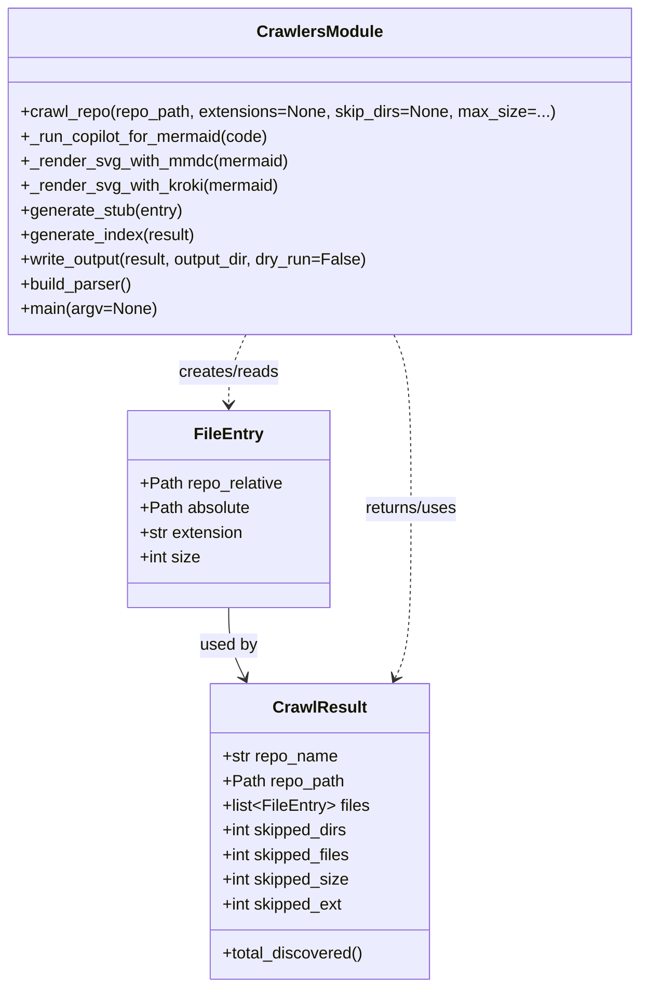

# Diagram: shipment_core/shipment_trip_plan_service/config/config.staging.yml


> Auto-generated by Obscura crawlers

## Diagram 1



### SVG

<svg id="container" width="616.2890625" xmlns="http://www.w3.org/2000/svg" class="classDiagram" height="962" viewBox="0 0 616.2890625 962" role="graphics-document document" aria-roledescription="class"><style>#container{font-family:"trebuchet ms",verdana,arial,sans-serif;font-size:16px;fill:#333;}@keyframes edge-animation-frame{from{stroke-dashoffset:0;}}@keyframes dash{to{stroke-dashoffset:0;}}#container .edge-animation-slow{stroke-dasharray:9,5!important;stroke-dashoffset:900;animation:dash 50s linear infinite;stroke-linecap:round;}#container .edge-animation-fast{stroke-dasharray:9,5!important;stroke-dashoffset:900;animation:dash 20s linear infinite;stroke-linecap:round;}#container .error-icon{fill:#552222;}#container .error-text{fill:#552222;stroke:#552222;}#container .edge-thickness-normal{stroke-width:1px;}#container .edge-thickness-thick{stroke-width:3.5px;}#container .edge-pattern-solid{stroke-dasharray:0;}#container .edge-thickness-invisible{stroke-width:0;fill:none;}#container .edge-pattern-dashed{stroke-dasharray:3;}#container .edge-pattern-dotted{stroke-dasharray:2;}#container .marker{fill:#333333;stroke:#333333;}#container .marker.cross{stroke:#333333;}#container svg{font-family:"trebuchet ms",verdana,arial,sans-serif;font-size:16px;}#container p{margin:0;}#container g.classGroup text{fill:#9370DB;stroke:none;font-family:"trebuchet ms",verdana,arial,sans-serif;font-size:10px;}#container g.classGroup text .title{font-weight:bolder;}#container .nodeLabel,#container .edgeLabel{color:#131300;}#container .edgeLabel .label rect{fill:#ECECFF;}#container .label text{fill:#131300;}#container .labelBkg{background:#ECECFF;}#container .edgeLabel .label span{background:#ECECFF;}#container .classTitle{font-weight:bolder;}#container .node rect,#container .node circle,#container .node ellipse,#container .node polygon,#container .node path{fill:#ECECFF;stroke:#9370DB;stroke-width:1px;}#container .divider{stroke:#9370DB;stroke-width:1;}#container g.clickable{cursor:pointer;}#container g.classGroup rect{fill:#ECECFF;stroke:#9370DB;}#container g.classGroup line{stroke:#9370DB;stroke-width:1;}#container .classLabel .box{stroke:none;stroke-width:0;fill:#ECECFF;opacity:0.5;}#container .classLabel .label{fill:#9370DB;font-size:10px;}#container .relation{stroke:#333333;stroke-width:1;fill:none;}#container .dashed-line{stroke-dasharray:3;}#container .dotted-line{stroke-dasharray:1 2;}#container #compositionStart,#container .composition{fill:#333333!important;stroke:#333333!important;stroke-width:1;}#container #compositionEnd,#container .composition{fill:#333333!important;stroke:#333333!important;stroke-width:1;}#container #dependencyStart,#container .dependency{fill:#333333!important;stroke:#333333!important;stroke-width:1;}#container #dependencyStart,#container .dependency{fill:#333333!important;stroke:#333333!important;stroke-width:1;}#container #extensionStart,#container .extension{fill:transparent!important;stroke:#333333!important;stroke-width:1;}#container #extensionEnd,#container .extension{fill:transparent!important;stroke:#333333!important;stroke-width:1;}#container #aggregationStart,#container .aggregation{fill:transparent!important;stroke:#333333!important;stroke-width:1;}#container #aggregationEnd,#container .aggregation{fill:transparent!important;stroke:#333333!important;stroke-width:1;}#container #lollipopStart,#container .lollipop{fill:#ECECFF!important;stroke:#333333!important;stroke-width:1;}#container #lollipopEnd,#container .lollipop{fill:#ECECFF!important;stroke:#333333!important;stroke-width:1;}#container .edgeTerminals{font-size:11px;line-height:initial;}#container .classTitleText{text-anchor:middle;font-size:18px;fill:#333;}#container .label-icon{display:inline-block;height:1em;overflow:visible;vertical-align:-0.125em;}#container .node .label-icon path{fill:currentColor;stroke:revert;stroke-width:revert;}#container :root{--mermaid-font-family:"trebuchet ms",verdana,arial,sans-serif;}</style><g><defs><marker id="container_class-aggregationStart" class="marker aggregation class" refX="18" refY="7" markerWidth="190" markerHeight="240" orient="auto"><path d="M 18,7 L9,13 L1,7 L9,1 Z"></path></marker></defs><defs><marker id="container_class-aggregationEnd" class="marker aggregation class" refX="1" refY="7" markerWidth="20" markerHeight="28" orient="auto"><path d="M 18,7 L9,13 L1,7 L9,1 Z"></path></marker></defs><defs><marker id="container_class-extensionStart" class="marker extension class" refX="18" refY="7" markerWidth="190" markerHeight="240" orient="auto"><path d="M 1,7 L18,13 V 1 Z"></path></marker></defs><defs><marker id="container_class-extensionEnd" class="marker extension class" refX="1" refY="7" markerWidth="20" markerHeight="28" orient="auto"><path d="M 1,1 V 13 L18,7 Z"></path></marker></defs><defs><marker id="container_class-compositionStart" class="marker composition class" refX="18" refY="7" markerWidth="190" markerHeight="240" orient="auto"><path d="M 18,7 L9,13 L1,7 L9,1 Z"></path></marker></defs><defs><marker id="container_class-compositionEnd" class="marker composition class" refX="1" refY="7" markerWidth="20" markerHeight="28" orient="auto"><path d="M 18,7 L9,13 L1,7 L9,1 Z"></path></marker></defs><defs><marker id="container_class-dependencyStart" class="marker dependency class" refX="6" refY="7" markerWidth="190" markerHeight="240" orient="auto"><path d="M 5,7 L9,13 L1,7 L9,1 Z"></path></marker></defs><defs><marker id="container_class-dependencyEnd" class="marker dependency class" refX="13" refY="7" markerWidth="20" markerHeight="28" orient="auto"><path d="M 18,7 L9,13 L14,7 L9,1 Z"></path></marker></defs><defs><marker id="container_class-lollipopStart" class="marker lollipop class" refX="13" refY="7" markerWidth="190" markerHeight="240" orient="auto"><circle stroke="black" fill="transparent" cx="7" cy="7" r="6"></circle></marker></defs><defs><marker id="container_class-lollipopEnd" class="marker lollipop class" refX="1" refY="7" markerWidth="190" markerHeight="240" orient="auto"><circle stroke="black" fill="transparent" cx="7" cy="7" r="6"></circle></marker></defs><g class="root"><g class="clusters"></g><g class="edgePaths"><path d="M218.262,592L218.262,598.167C218.262,604.333,218.262,616.667,220.879,628.104C223.497,639.542,228.732,650.084,231.349,655.355L233.967,660.626" id="id_FileEntry_CrawlResult_1" class="edge-thickness-normal edge-pattern-solid relation" style=";;;" data-edge="true" data-et="edge" data-id="id_FileEntry_CrawlResult_1" data-points="W3sieCI6MjE4LjI2MTcxODc1LCJ5Ijo1OTJ9LHsieCI6MjE4LjI2MTcxODc1LCJ5Ijo2Mjl9LHsieCI6MjM2LjYzNTU1MzM0OTQ0NzUyLCJ5Ijo2NjZ9XQ==" marker-end="url(#container_class-dependencyEnd)"></path><path d="M235.229,326L232.401,332.167C229.574,338.333,223.918,350.667,221.09,362C218.262,373.333,218.262,383.667,218.262,388.833L218.262,394" id="id_CrawlersModule_FileEntry_2" class="edge-thickness-normal edge-pattern-dashed relation" style=";;;" data-edge="true" data-et="edge" data-id="id_CrawlersModule_FileEntry_2" data-points="W3sieCI6MjM1LjIyOTM5MjUzODI2NTMsInkiOjMyNn0seyJ4IjoyMTguMjYxNzE4NzUsInkiOjM2M30seyJ4IjoyMTguMjYxNzE4NzUsInkiOjQwMH1d" marker-end="url(#container_class-dependencyEnd)"></path><path d="M381.06,326L383.888,332.167C386.716,338.333,392.371,350.667,395.199,379C398.027,407.333,398.027,451.667,398.027,496C398.027,540.333,398.027,584.667,395.41,612.104C392.792,639.542,387.557,650.084,384.94,655.355L382.322,660.626" id="id_CrawlersModule_CrawlResult_3" class="edge-thickness-normal edge-pattern-dashed relation" style=";;;" data-edge="true" data-et="edge" data-id="id_CrawlersModule_CrawlResult_3" data-points="W3sieCI6MzgxLjA1OTY2OTk2MTczNDcsInkiOjMyNn0seyJ4IjozOTguMDI3MzQzNzUsInkiOjM2M30seyJ4IjozOTguMDI3MzQzNzUsInkiOjQ5Nn0seyJ4IjozOTguMDI3MzQzNzUsInkiOjYyOX0seyJ4IjozNzkuNjUzNTA5MTUwNTUyNSwieSI6NjY2fV0=" marker-end="url(#container_class-dependencyEnd)"></path></g><g class="edgeLabels"><g class="edgeLabel" transform="translate(218.26171875, 629)"><g class="label" data-id="id_FileEntry_CrawlResult_1" transform="translate(-28.3125, -12)"><foreignObject width="56.625" height="24"><div xmlns="http://www.w3.org/1999/xhtml" class="labelBkg" style="display: table-cell; white-space: nowrap; line-height: 1.5; max-width: 200px; text-align: center;"><span class="edgeLabel"><p>used by</p></span></div></foreignObject></g></g><g class="edgeLabel" transform="translate(218.26171875, 363)"><g class="label" data-id="id_CrawlersModule_FileEntry_2" transform="translate(-50.09375, -12)"><foreignObject width="100.1875" height="24"><div xmlns="http://www.w3.org/1999/xhtml" class="labelBkg" style="display: table-cell; white-space: nowrap; line-height: 1.5; max-width: 200px; text-align: center;"><span class="edgeLabel"><p>creates/reads</p></span></div></foreignObject></g></g><g class="edgeLabel" transform="translate(398.02734375, 496)"><g class="label" data-id="id_CrawlersModule_CrawlResult_3" transform="translate(-46.6796875, -12)"><foreignObject width="93.359375" height="24"><div xmlns="http://www.w3.org/1999/xhtml" class="labelBkg" style="display: table-cell; white-space: nowrap; line-height: 1.5; max-width: 200px; text-align: center;"><span class="edgeLabel"><p>returns/uses</p></span></div></foreignObject></g></g></g><g class="nodes"><g class="node default" id="classId-FileEntry-0" transform="translate(218.26171875, 496)"><g class="basic label-container"><path d="M-98.0859375 -96 L98.0859375 -96 L98.0859375 96 L-98.0859375 96" stroke="none" stroke-width="0" fill="#ECECFF" style=""></path><path d="M-98.0859375 -96 C-25.72076931673419 -96, 46.64439886653162 -96, 98.0859375 -96 M-98.0859375 -96 C-22.319253347678767 -96, 53.447430804642465 -96, 98.0859375 -96 M98.0859375 -96 C98.0859375 -24.060412025502785, 98.0859375 47.87917594899443, 98.0859375 96 M98.0859375 -96 C98.0859375 -33.31623024010352, 98.0859375 29.367539519792956, 98.0859375 96 M98.0859375 96 C36.757803269798046 96, -24.570330960403908 96, -98.0859375 96 M98.0859375 96 C28.249496803077875 96, -41.58694389384425 96, -98.0859375 96 M-98.0859375 96 C-98.0859375 54.969851037530205, -98.0859375 13.93970207506041, -98.0859375 -96 M-98.0859375 96 C-98.0859375 52.800999875732586, -98.0859375 9.601999751465172, -98.0859375 -96" stroke="#9370DB" stroke-width="1.3" fill="none" stroke-dasharray="0 0" style=""></path></g><g class="annotation-group text" transform="translate(0, -72)"></g><g class="label-group text" transform="translate(-31.859375, -72)"><g class="label" style="font-weight: bolder" transform="translate(0,-12)"><foreignObject width="63.71875" height="24"><div xmlns="http://www.w3.org/1999/xhtml" style="display: table-cell; white-space: nowrap; line-height: 1.5; max-width: 113px; text-align: center;"><span class="nodeLabel markdown-node-label" style=""><p>FileEntry</p></span></div></foreignObject></g></g><g class="members-group text" transform="translate(-86.0859375, -24)"><g class="label" style="" transform="translate(0,-12)"><foreignObject width="140.3125" height="24"><div xmlns="http://www.w3.org/1999/xhtml" style="display: table-cell; white-space: nowrap; line-height: 1.5; max-width: 198px; text-align: center;"><span class="nodeLabel markdown-node-label" style=""><p>+Path repo_relative</p></span></div></foreignObject></g><g class="label" style="" transform="translate(0,12)"><foreignObject width="107.78125" height="24"><div xmlns="http://www.w3.org/1999/xhtml" style="display: table-cell; white-space: nowrap; line-height: 1.5; max-width: 165px; text-align: center;"><span class="nodeLabel markdown-node-label" style=""><p>+Path absolute</p></span></div></foreignObject></g><g class="label" style="" transform="translate(0,36)"><foreignObject width="102.328125" height="24"><div xmlns="http://www.w3.org/1999/xhtml" style="display: table-cell; white-space: nowrap; line-height: 1.5; max-width: 160px; text-align: center;"><span class="nodeLabel markdown-node-label" style=""><p>+str extension</p></span></div></foreignObject></g><g class="label" style="" transform="translate(0,60)"><foreignObject width="59.484375" height="24"><div xmlns="http://www.w3.org/1999/xhtml" style="display: table-cell; white-space: nowrap; line-height: 1.5; max-width: 117px; text-align: center;"><span class="nodeLabel markdown-node-label" style=""><p>+int size</p></span></div></foreignObject></g></g><g class="methods-group text" transform="translate(-86.0859375, 96)"></g><g class="divider" style=""><path d="M-98.0859375 -48 C-22.920954163374773 -48, 52.24402917325045 -48, 98.0859375 -48 M-98.0859375 -48 C-25.393060255130408 -48, 47.299816989739185 -48, 98.0859375 -48" stroke="#9370DB" stroke-width="1.3" fill="none" stroke-dasharray="0 0" style=""></path></g><g class="divider" style=""><path d="M-98.0859375 72 C-25.84753311924098 72, 46.39087126151804 72, 98.0859375 72 M-98.0859375 72 C-56.58532884487263 72, -15.084720189745255 72, 98.0859375 72" stroke="#9370DB" stroke-width="1.3" fill="none" stroke-dasharray="0 0" style=""></path></g></g><g class="node default" id="classId-CrawlResult-1" transform="translate(308.14453125, 810)"><g class="basic label-container"><path d="M-105.3515625 -144 L105.3515625 -144 L105.3515625 144 L-105.3515625 144" stroke="none" stroke-width="0" fill="#ECECFF" style=""></path><path d="M-105.3515625 -144 C-29.98494794970601 -144, 45.38166660058798 -144, 105.3515625 -144 M-105.3515625 -144 C-30.080803266045322 -144, 45.189955967909356 -144, 105.3515625 -144 M105.3515625 -144 C105.3515625 -43.381530586397986, 105.3515625 57.23693882720403, 105.3515625 144 M105.3515625 -144 C105.3515625 -74.65577139560713, 105.3515625 -5.311542791214265, 105.3515625 144 M105.3515625 144 C30.276551348522347 144, -44.79845980295531 144, -105.3515625 144 M105.3515625 144 C50.44375065375672 144, -4.464061192486554 144, -105.3515625 144 M-105.3515625 144 C-105.3515625 86.15735433191243, -105.3515625 28.31470866382486, -105.3515625 -144 M-105.3515625 144 C-105.3515625 51.70159493308233, -105.3515625 -40.59681013383533, -105.3515625 -144" stroke="#9370DB" stroke-width="1.3" fill="none" stroke-dasharray="0 0" style=""></path></g><g class="annotation-group text" transform="translate(0, -120)"></g><g class="label-group text" transform="translate(-43.28125, -120)"><g class="label" style="font-weight: bolder" transform="translate(0,-12)"><foreignObject width="86.5625" height="24"><div xmlns="http://www.w3.org/1999/xhtml" style="display: table-cell; white-space: nowrap; line-height: 1.5; max-width: 135px; text-align: center;"><span class="nodeLabel markdown-node-label" style=""><p>CrawlResult</p></span></div></foreignObject></g></g><g class="members-group text" transform="translate(-93.3515625, -72)"><g class="label" style="" transform="translate(0,-12)"><foreignObject width="113.4375" height="24"><div xmlns="http://www.w3.org/1999/xhtml" style="display: table-cell; white-space: nowrap; line-height: 1.5; max-width: 171px; text-align: center;"><span class="nodeLabel markdown-node-label" style=""><p>+str repo_name</p></span></div></foreignObject></g><g class="label" style="" transform="translate(0,12)"><foreignObject width="118.96875" height="24"><div xmlns="http://www.w3.org/1999/xhtml" style="display: table-cell; white-space: nowrap; line-height: 1.5; max-width: 176px; text-align: center;"><span class="nodeLabel markdown-node-label" style=""><p>+Path repo_path</p></span></div></foreignObject></g><g class="label" style="" transform="translate(0,36)"><foreignObject width="143.421875" height="24"><div xmlns="http://www.w3.org/1999/xhtml" style="display: table-cell; white-space: nowrap; line-height: 1.5; max-width: 240px; text-align: center;"><span class="nodeLabel markdown-node-label" style=""><p>+list&lt;FileEntry&gt; files</p></span></div></foreignObject></g><g class="label" style="" transform="translate(0,60)"><foreignObject width="124.859375" height="24"><div xmlns="http://www.w3.org/1999/xhtml" style="display: table-cell; white-space: nowrap; line-height: 1.5; max-width: 182px; text-align: center;"><span class="nodeLabel markdown-node-label" style=""><p>+int skipped_dirs</p></span></div></foreignObject></g><g class="label" style="" transform="translate(0,84)"><foreignObject width="127.375" height="24"><div xmlns="http://www.w3.org/1999/xhtml" style="display: table-cell; white-space: nowrap; line-height: 1.5; max-width: 185px; text-align: center;"><span class="nodeLabel markdown-node-label" style=""><p>+int skipped_files</p></span></div></foreignObject></g><g class="label" style="" transform="translate(0,108)"><foreignObject width="125.265625" height="24"><div xmlns="http://www.w3.org/1999/xhtml" style="display: table-cell; white-space: nowrap; line-height: 1.5; max-width: 183px; text-align: center;"><span class="nodeLabel markdown-node-label" style=""><p>+int skipped_size</p></span></div></foreignObject></g><g class="label" style="" transform="translate(0,132)"><foreignObject width="119.484375" height="24"><div xmlns="http://www.w3.org/1999/xhtml" style="display: table-cell; white-space: nowrap; line-height: 1.5; max-width: 177px; text-align: center;"><span class="nodeLabel markdown-node-label" style=""><p>+int skipped_ext</p></span></div></foreignObject></g></g><g class="methods-group text" transform="translate(-93.3515625, 120)"><g class="label" style="" transform="translate(0,-12)"><foreignObject width="138.734375" height="24"><div xmlns="http://www.w3.org/1999/xhtml" style="display: table-cell; white-space: nowrap; line-height: 1.5; max-width: 196px; text-align: center;"><span class="nodeLabel markdown-node-label" style=""><p>+total_discovered()</p></span></div></foreignObject></g></g><g class="divider" style=""><path d="M-105.3515625 -96 C-60.65216019702041 -96, -15.952757894040815 -96, 105.3515625 -96 M-105.3515625 -96 C-55.776693442896956 -96, -6.201824385793913 -96, 105.3515625 -96" stroke="#9370DB" stroke-width="1.3" fill="none" stroke-dasharray="0 0" style=""></path></g><g class="divider" style=""><path d="M-105.3515625 96 C-55.445190886772934 96, -5.538819273545869 96, 105.3515625 96 M-105.3515625 96 C-45.10599559058463 96, 15.139571318830747 96, 105.3515625 96" stroke="#9370DB" stroke-width="1.3" fill="none" stroke-dasharray="0 0" style=""></path></g></g><g class="node default" id="classId-CrawlersModule-2" transform="translate(308.14453125, 167)"><g class="basic label-container"><path d="M-300.14453125 -159 L300.14453125 -159 L300.14453125 159 L-300.14453125 159" stroke="none" stroke-width="0" fill="#ECECFF" style=""></path><path d="M-300.14453125 -159 C-87.4599547794306 -159, 125.2246216911388 -159, 300.14453125 -159 M-300.14453125 -159 C-165.58713374065456 -159, -31.02973623130913 -159, 300.14453125 -159 M300.14453125 -159 C300.14453125 -69.58194976374712, 300.14453125 19.836100472505763, 300.14453125 159 M300.14453125 -159 C300.14453125 -49.37525840360118, 300.14453125 60.24948319279764, 300.14453125 159 M300.14453125 159 C142.78127989091138 159, -14.581971468177244 159, -300.14453125 159 M300.14453125 159 C68.75552692223923 159, -162.63347740552155 159, -300.14453125 159 M-300.14453125 159 C-300.14453125 58.53392924995893, -300.14453125 -41.93214150008214, -300.14453125 -159 M-300.14453125 159 C-300.14453125 62.029180022420334, -300.14453125 -34.94163995515933, -300.14453125 -159" stroke="#9370DB" stroke-width="1.3" fill="none" stroke-dasharray="0 0" style=""></path></g><g class="annotation-group text" transform="translate(0, -135)"></g><g class="label-group text" transform="translate(-58.5859375, -135)"><g class="label" style="font-weight: bolder" transform="translate(0,-12)"><foreignObject width="117.171875" height="24"><div xmlns="http://www.w3.org/1999/xhtml" style="display: table-cell; white-space: nowrap; line-height: 1.5; max-width: 165px; text-align: center;"><span class="nodeLabel markdown-node-label" style=""><p>CrawlersModule</p></span></div></foreignObject></g></g><g class="members-group text" transform="translate(-288.14453125, -87)"></g><g class="methods-group text" transform="translate(-288.14453125, -57)"><g class="label" style="" transform="translate(0,-12)"><foreignObject width="517.703125" height="24"><div xmlns="http://www.w3.org/1999/xhtml" style="display: table-cell; white-space: nowrap; line-height: 1.5; max-width: 575px; text-align: center;"><span class="nodeLabel markdown-node-label" style=""><p>+crawl_repo(repo_path, extensions=None, skip_dirs=None, max_size=...)</p></span></div></foreignObject></g><g class="label" style="" transform="translate(0,12)"><foreignObject width="244.5" height="24"><div xmlns="http://www.w3.org/1999/xhtml" style="display: table-cell; white-space: nowrap; line-height: 1.5; max-width: 302px; text-align: center;"><span class="nodeLabel markdown-node-label" style=""><p>+_run_copilot_for_mermaid(code)</p></span></div></foreignObject></g><g class="label" style="" transform="translate(0,36)"><foreignObject width="261.328125" height="24"><div xmlns="http://www.w3.org/1999/xhtml" style="display: table-cell; white-space: nowrap; line-height: 1.5; max-width: 319px; text-align: center;"><span class="nodeLabel markdown-node-label" style=""><p>+_render_svg_with_mmdc(mermaid)</p></span></div></foreignObject></g><g class="label" style="" transform="translate(0,60)"><foreignObject width="252.609375" height="24"><div xmlns="http://www.w3.org/1999/xhtml" style="display: table-cell; white-space: nowrap; line-height: 1.5; max-width: 310px; text-align: center;"><span class="nodeLabel markdown-node-label" style=""><p>+_render_svg_with_kroki(mermaid)</p></span></div></foreignObject></g><g class="label" style="" transform="translate(0,84)"><foreignObject width="159.796875" height="24"><div xmlns="http://www.w3.org/1999/xhtml" style="display: table-cell; white-space: nowrap; line-height: 1.5; max-width: 217px; text-align: center;"><span class="nodeLabel markdown-node-label" style=""><p>+generate_stub(entry)</p></span></div></foreignObject></g><g class="label" style="" transform="translate(0,108)"><foreignObject width="171.265625" height="24"><div xmlns="http://www.w3.org/1999/xhtml" style="display: table-cell; white-space: nowrap; line-height: 1.5; max-width: 229px; text-align: center;"><span class="nodeLabel markdown-node-label" style=""><p>+generate_index(result)</p></span></div></foreignObject></g><g class="label" style="" transform="translate(0,132)"><foreignObject width="346.015625" height="24"><div xmlns="http://www.w3.org/1999/xhtml" style="display: table-cell; white-space: nowrap; line-height: 1.5; max-width: 403px; text-align: center;"><span class="nodeLabel markdown-node-label" style=""><p>+write_output(result, output_dir, dry_run=False)</p></span></div></foreignObject></g><g class="label" style="" transform="translate(0,156)"><foreignObject width="110.53125" height="24"><div xmlns="http://www.w3.org/1999/xhtml" style="display: table-cell; white-space: nowrap; line-height: 1.5; max-width: 168px; text-align: center;"><span class="nodeLabel markdown-node-label" style=""><p>+build_parser()</p></span></div></foreignObject></g><g class="label" style="" transform="translate(0,180)"><foreignObject width="131.859375" height="24"><div xmlns="http://www.w3.org/1999/xhtml" style="display: table-cell; white-space: nowrap; line-height: 1.5; max-width: 189px; text-align: center;"><span class="nodeLabel markdown-node-label" style=""><p>+main(argv=None)</p></span></div></foreignObject></g></g><g class="divider" style=""><path d="M-300.14453125 -111 C-150.5535664282004 -111, -0.962601606400824 -111, 300.14453125 -111 M-300.14453125 -111 C-159.77445138583138 -111, -19.404371521662767 -111, 300.14453125 -111" stroke="#9370DB" stroke-width="1.3" fill="none" stroke-dasharray="0 0" style=""></path></g><g class="divider" style=""><path d="M-300.14453125 -87 C-116.99762094496973 -87, 66.14928936006055 -87, 300.14453125 -87 M-300.14453125 -87 C-78.40192898882526 -87, 143.34067327234948 -87, 300.14453125 -87" stroke="#9370DB" stroke-width="1.3" fill="none" stroke-dasharray="0 0" style=""></path></g></g></g></g></g></svg>

## Diagram 2

```mermaid
flowchart TD
    A[Start: main()] --> B{repo path valid?}
    B -- No --> Z[Exit with error]
    B -- Yes --> C[call crawl_repo(repo_path)]
    C --> D{for each directory}
    D --> E[prune SKIP_DIRS and hidden dirs]
    E --> F[for each file in dir]
    F --> G{skip?}
    G -- in SKIP_FILES --> H[skipped_files++]
    G -- ext not in DEFAULT_EXTENSIONS --> I[skipped_ext++]
    G -- size > MAX_FILE_SIZE --> J[skipped_size++]
    G -- size == 0 or stat fail --> H
    G -- else --> K[append FileEntry to result.files]
    K --> F
    H --> F
    I --> F
    J --> F
    F --> L[return CrawlResult]
    L --> M{dry_run?}
    M -- Yes --> N[print dry-run summary]
    M -- No --> O[write_output: for each FileEntry]
    O --> P[generate_stub(entry)]
    P --> Q[_run_copilot_for_mermaid(code)]
    Q --> R[mermaid produced]
    R --> S[_render_svg_with_mmdc or _render_svg_with_kroki]
    S --> T[write .md with mermaid fenced + inline SVG]
    O --> U[generate_index(result)]
    U --> V[write INDEX.md]
    V --> W[finish: report written files]
```

> SVG rendering failed for this diagram.
