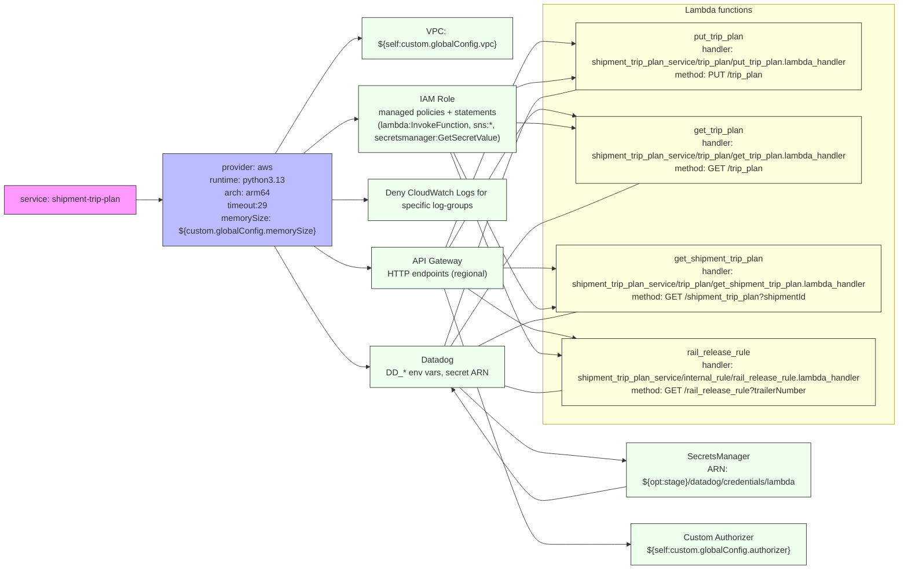

# Diagram: shipment_core/shipment_trip_plan_service/serverless.shipment_trip_plan.yml

> Auto-generated by Obscura crawlers

## Mermaid

### SVG

<svg id="container" width="1853.59375" xmlns="http://www.w3.org/2000/svg" class="flowchart" height="975" viewBox="0 0 1853.59375 975" role="graphics-document document" aria-roledescription="flowchart-v2"><g><marker id="container_flowchart-v2-pointEnd" class="marker flowchart-v2" viewBox="0 0 10 10" refX="5" refY="5" markerUnits="userSpaceOnUse" markerWidth="8" markerHeight="8" orient="auto"><path d="M 0 0 L 10 5 L 0 10 z" class="arrowMarkerPath" style="stroke-width: 1; stroke-dasharray: 1, 0;"></path></marker><marker id="container_flowchart-v2-pointStart" class="marker flowchart-v2" viewBox="0 0 10 10" refX="4.5" refY="5" markerUnits="userSpaceOnUse" markerWidth="8" markerHeight="8" orient="auto"><path d="M 0 5 L 10 10 L 10 0 z" class="arrowMarkerPath" style="stroke-width: 1; stroke-dasharray: 1, 0;"></path></marker><marker id="container_flowchart-v2-circleEnd" class="marker flowchart-v2" viewBox="0 0 10 10" refX="11" refY="5" markerUnits="userSpaceOnUse" markerWidth="11" markerHeight="11" orient="auto"><circle cx="5" cy="5" r="5" class="arrowMarkerPath" style="stroke-width: 1; stroke-dasharray: 1, 0;"></circle></marker><marker id="container_flowchart-v2-circleStart" class="marker flowchart-v2" viewBox="0 0 10 10" refX="-1" refY="5" markerUnits="userSpaceOnUse" markerWidth="11" markerHeight="11" orient="auto"><circle cx="5" cy="5" r="5" class="arrowMarkerPath" style="stroke-width: 1; stroke-dasharray: 1, 0;"></circle></marker><marker id="container_flowchart-v2-crossEnd" class="marker cross flowchart-v2" viewBox="0 0 11 11" refX="12" refY="5.2" markerUnits="userSpaceOnUse" markerWidth="11" markerHeight="11" orient="auto"><path d="M 1,1 l 9,9 M 10,1 l -9,9" class="arrowMarkerPath" style="stroke-width: 2; stroke-dasharray: 1, 0;"></path></marker><marker id="container_flowchart-v2-crossStart" class="marker cross flowchart-v2" viewBox="0 0 11 11" refX="-1" refY="5.2" markerUnits="userSpaceOnUse" markerWidth="11" markerHeight="11" orient="auto"><path d="M 1,1 l 9,9 M 10,1 l -9,9" class="arrowMarkerPath" style="stroke-width: 2; stroke-dasharray: 1, 0;"></path></marker><g class="root"><g class="clusters"><g class="cluster" id="Functions" data-look="classic"><rect style="" x="1073.578125" y="8" width="772.015625" height="718"></rect><g class="cluster-label" transform="translate(1394.375, 8)"><foreignObject width="130.421875" height="24">

Lambda functions

</foreignObject></g></g></g><g class="edgePaths"><path d="M265.672,340L269.839,340C274.005,340,282.339,340,290.005,340C297.672,340,304.672,340,308.172,340L311.672,340" id="L_Service_Provider_0" class="edge-thickness-normal edge-pattern-solid edge-thickness-normal edge-pattern-solid flowchart-link" style=";" data-edge="true" data-et="edge" data-id="L_Service_Provider_0" data-points="W3sieCI6MjY1LjY3MTg3NSwieSI6MzQwfSx7IngiOjI5MC42NzE4NzUsInkiOjM0MH0seyJ4IjozMTUuNjcxODc1LCJ5IjozNDB9XQ==" marker-end="url(#container_flowchart-v2-pointEnd)"></path><path d="M515.632,277L539.352,240.833C563.072,204.667,610.513,132.333,642.495,96.167C674.477,60,691,60,699.262,60L707.523,60" id="L_Provider_VPC_0" class="edge-thickness-normal edge-pattern-solid edge-thickness-normal edge-pattern-solid flowchart-link" style=";" data-edge="true" data-et="edge" data-id="L_Provider_VPC_0" data-points="W3sieCI6NTE1LjYzMTY0MDYyNSwieSI6Mjc3fSx7IngiOjY1Ny45NTMxMjUsInkiOjYwfSx7IngiOjcxMS41MjM0Mzc1LCJ5Ijo2MH1d" marker-end="url(#container_flowchart-v2-pointEnd)"></path><path d="M556.951,277L573.785,264.167C590.618,251.333,624.286,225.667,644.619,212.833C664.953,200,671.953,200,675.453,200L678.953,200" id="L_Provider_IAM_0" class="edge-thickness-normal edge-pattern-solid edge-thickness-normal edge-pattern-solid flowchart-link" style=";" data-edge="true" data-et="edge" data-id="L_Provider_IAM_0" data-points="W3sieCI6NTU2Ljk1MDc4MTI1LCJ5IjoyNzd9LHsieCI6NjU3Ljk1MzEyNSwieSI6MjAwfSx7IngiOjY4Mi45NTMxMjUsInkiOjIwMH1d" marker-end="url(#container_flowchart-v2-pointEnd)"></path><path d="M632.953,340L637.12,340C641.286,340,649.62,340,664.005,340C678.391,340,698.828,340,709.047,340L719.266,340" id="L_Provider_DenyLogs_0" class="edge-thickness-normal edge-pattern-solid edge-thickness-normal edge-pattern-solid flowchart-link" style=";" data-edge="true" data-et="edge" data-id="L_Provider_DenyLogs_0" data-points="W3sieCI6NjMyLjk1MzEyNSwieSI6MzQwfSx7IngiOjY1Ny45NTMxMjUsInkiOjM0MH0seyJ4Ijo3MjMuMjY1NjI1LCJ5IjozNDB9XQ==" marker-end="url(#container_flowchart-v2-pointEnd)"></path><path d="M514.207,403L538.165,440.833C562.122,478.667,610.038,554.333,644.214,592.167C678.391,630,698.828,630,709.047,630L719.266,630" id="L_Provider_Datadog_0" class="edge-thickness-normal edge-pattern-solid edge-thickness-normal edge-pattern-solid flowchart-link" style=";" data-edge="true" data-et="edge" data-id="L_Provider_Datadog_0" data-points="W3sieCI6NTE0LjIwNjg0MjY3MjQxMzgsInkiOjQwM30seyJ4Ijo2NTcuOTUzMTI1LCJ5Ijo2MzB9LHsieCI6NzIzLjI2NTYyNSwieSI6NjMwfV0=" marker-end="url(#container_flowchart-v2-pointEnd)"></path><path d="M906.533,669L930.207,686.333C953.881,703.667,1001.23,738.333,1029.071,755.667C1056.911,773,1065.245,773,1102.689,775.328C1140.133,777.655,1206.689,782.311,1239.966,784.638L1273.244,786.966" id="L_Datadog_Secrets_0" class="edge-thickness-normal edge-pattern-solid edge-thickness-normal edge-pattern-solid flowchart-link" style=";" data-edge="true" data-et="edge" data-id="L_Datadog_Secrets_0" data-points="W3sieCI6OTA2LjUzMjY3MDQ1NDU0NTUsInkiOjY2OX0seyJ4IjoxMDQ4LjU3ODEyNSwieSI6NzczfSx7IngiOjEwNzMuNTc4MTI1LCJ5Ijo3NzN9LHsieCI6MTI3Ny4yMzQzNzUsInkiOjc4Ny4yNDUwOTcwNDcwOTY3fV0=" marker-end="url(#container_flowchart-v2-pointEnd)"></path><path d="M564.698,403L580.241,413.833C595.783,424.667,626.868,446.333,652.629,457.167C678.391,468,698.828,468,709.047,468L719.266,468" id="L_Provider_APIGW_0" class="edge-thickness-normal edge-pattern-solid edge-thickness-normal edge-pattern-solid flowchart-link" style=";" data-edge="true" data-et="edge" data-id="L_Provider_APIGW_0" data-points="W3sieCI6NTY0LjY5ODEyMDExNzE4NzUsInkiOjQwM30seyJ4Ijo2NTcuOTUzMTI1LCJ5Ijo0Njh9LHsieCI6NzIzLjI2NTYyNSwieSI6NDY4fV0=" marker-end="url(#container_flowchart-v2-pointEnd)"></path><path d="M869.825,507L899.617,577.167C929.409,647.333,988.994,787.667,1022.953,857.833C1056.911,928,1065.245,928,1097.546,928C1129.846,928,1186.115,928,1214.249,928L1242.383,928" id="L_APIGW_Authorizer_0" class="edge-thickness-normal edge-pattern-solid edge-thickness-normal edge-pattern-solid flowchart-link" style=";" data-edge="true" data-et="edge" data-id="L_APIGW_Authorizer_0" data-points="W3sieCI6ODY5LjgyNDcyODI2MDg2OTYsInkiOjUwN30seyJ4IjoxMDQ4LjU3ODEyNSwieSI6OTI4fSx7IngiOjEwNzMuNTc4MTI1LCJ5Ijo5Mjh9LHsieCI6MTI0Ni4zODI4MTI1LCJ5Ijo5Mjh9XQ==" marker-end="url(#container_flowchart-v2-pointEnd)"></path><path d="M872.452,429L901.807,369.333C931.161,309.667,989.87,190.333,1023.391,130.667C1056.911,71,1065.245,71,1079.141,71.58C1093.036,72.159,1112.494,73.319,1122.223,73.898L1131.952,74.478" id="L_APIGW_put_0" class="edge-thickness-normal edge-pattern-solid edge-thickness-normal edge-pattern-solid flowchart-link" style=";" data-edge="true" data-et="edge" data-id="L_APIGW_put_0" data-points="W3sieCI6ODcyLjQ1MjQ5NTI3NzA3ODEsInkiOjQyOX0seyJ4IjoxMDQ4LjU3ODEyNSwieSI6NzF9LHsieCI6MTA3My41NzgxMjUsInkiOjcxfSx7IngiOjExMzUuOTQ1MzEyNSwieSI6NzQuNzE2MTA0MzUzNDU3ODd9XQ==" marker-end="url(#container_flowchart-v2-pointEnd)"></path><path d="M879.714,429L907.858,387.5C936.002,346,992.29,263,1024.601,221.5C1056.911,180,1065.245,180,1083.376,182.388C1101.507,184.775,1129.436,189.551,1143.4,191.938L1157.364,194.326" id="L_APIGW_get_0" class="edge-thickness-normal edge-pattern-solid edge-thickness-normal edge-pattern-solid flowchart-link" style=";" data-edge="true" data-et="edge" data-id="L_APIGW_get_0" data-points="W3sieCI6ODc5LjcxNDE5MjcwODMzMzQsInkiOjQyOX0seyJ4IjoxMDQ4LjU3ODEyNSwieSI6MTgwfSx7IngiOjEwNzMuNTc4MTI1LCJ5IjoxODB9LHsieCI6MTE2MS4zMDcxNzMyOTU0NTQ1LCJ5IjoxOTV9XQ==" marker-end="url(#container_flowchart-v2-pointEnd)"></path><path d="M983.266,468L994.151,468C1005.036,468,1026.807,468,1041.859,468C1056.911,468,1065.245,468,1072.912,468.181C1080.58,468.363,1087.582,468.726,1091.083,468.907L1094.583,469.088" id="L_APIGW_get_shipment_0" class="edge-thickness-normal edge-pattern-solid edge-thickness-normal edge-pattern-solid flowchart-link" style=";" data-edge="true" data-et="edge" data-id="L_APIGW_get_shipment_0" data-points="W3sieCI6OTgzLjI2NTYyNSwieSI6NDY4fSx7IngiOjEwNDguNTc4MTI1LCJ5Ijo0Njh9LHsieCI6MTA3My41NzgxMjUsInkiOjQ2OH0seyJ4IjoxMDk4LjU3ODEyNSwieSI6NDY5LjI5NTMxMDU3MDk0ODYzfV0=" marker-end="url(#container_flowchart-v2-pointEnd)"></path><path d="M925.126,507L945.701,518.167C966.277,529.333,1007.427,551.667,1032.169,562.833C1056.911,574,1065.245,574,1083.376,576.388C1101.507,578.775,1129.436,583.551,1143.4,585.938L1157.364,588.326" id="L_APIGW_rail_0" class="edge-thickness-normal edge-pattern-solid edge-thickness-normal edge-pattern-solid flowchart-link" style=";" data-edge="true" data-et="edge" data-id="L_APIGW_rail_0" data-points="W3sieCI6OTI1LjEyNTg4NDQzMzk2MjMsInkiOjUwN30seyJ4IjoxMDQ4LjU3ODEyNSwieSI6NTc0fSx7IngiOjEwNzMuNTc4MTI1LCJ5Ijo1NzR9LHsieCI6MTE2MS4zMDcxNzMyOTU0NTQ1LCJ5Ijo1ODl9XQ==" marker-end="url(#container_flowchart-v2-pointEnd)"></path><path d="M1011.376,149L1017.576,147C1023.777,145,1036.177,141,1046.544,139C1056.911,137,1065.245,137,1079.143,135.916C1093.042,134.832,1112.506,132.664,1122.238,131.579L1131.97,130.495" id="L_IAM_put_0" class="edge-thickness-normal edge-pattern-solid edge-thickness-normal edge-pattern-solid flowchart-link" style=";" data-edge="true" data-et="edge" data-id="L_IAM_put_0" data-points="W3sieCI6MTAxMS4zNzU3NDQwNDc2MTksInkiOjE0OX0seyJ4IjoxMDQ4LjU3ODEyNSwieSI6MTM3fSx7IngiOjEwNzMuNTc4MTI1LCJ5IjoxMzd9LHsieCI6MTEzNS45NDUzMTI1LCJ5IjoxMzAuMDUyNTAwNTU2NTc4NzZ9XQ==" marker-end="url(#container_flowchart-v2-pointEnd)"></path><path d="M1023.578,212.208L1027.745,212.507C1031.911,212.805,1040.245,213.403,1048.578,213.701C1056.911,214,1065.245,214,1079.311,214.821C1093.377,215.641,1113.176,217.283,1123.075,218.103L1132.975,218.924" id="L_IAM_get_0" class="edge-thickness-normal edge-pattern-solid edge-thickness-normal edge-pattern-solid flowchart-link" style=";" data-edge="true" data-et="edge" data-id="L_IAM_get_0" data-points="W3sieCI6MTAyMy41NzgxMjUsInkiOjIxMi4yMDh9LHsieCI6MTA0OC41NzgxMjUsInkiOjIxNH0seyJ4IjoxMDczLjU3ODEyNSwieSI6MjE0fSx7IngiOjExMzYuOTYwOTM3NSwieSI6MjE5LjI1NDQyNzMzMTA1MzA1fV0=" marker-end="url(#container_flowchart-v2-pointEnd)"></path><path d="M883.089,251L910.67,298.167C938.252,345.333,993.415,439.667,1025.163,486.833C1056.911,534,1065.245,534,1072.916,533.582C1080.587,533.165,1087.597,532.329,1091.102,531.912L1094.606,531.494" id="L_IAM_get_shipment_0" class="edge-thickness-normal edge-pattern-solid edge-thickness-normal edge-pattern-solid flowchart-link" style=";" data-edge="true" data-et="edge" data-id="L_IAM_get_shipment_0" data-points="W3sieCI6ODgzLjA4ODc5MTE2NzY2NDcsInkiOjI1MX0seyJ4IjoxMDQ4LjU3ODEyNSwieSI6NTM0fSx7IngiOjEwNzMuNTc4MTI1LCJ5Ijo1MzR9LHsieCI6MTA5OC41NzgxMjUsInkiOjUzMS4wMjA3ODU2ODY4MTgyfV0=" marker-end="url(#container_flowchart-v2-pointEnd)"></path><path d="M877.74,251L906.213,310.333C934.686,369.667,991.632,488.333,1024.272,547.667C1056.911,607,1065.245,607,1074.937,607.472C1084.63,607.945,1095.682,608.89,1101.207,609.362L1106.733,609.834" id="L_IAM_rail_0" class="edge-thickness-normal edge-pattern-solid edge-thickness-normal edge-pattern-solid flowchart-link" style=";" data-edge="true" data-et="edge" data-id="L_IAM_rail_0" data-points="W3sieCI6ODc3LjczOTY3MjkxMTU0NzksInkiOjI1MX0seyJ4IjoxMDQ4LjU3ODEyNSwieSI6NjA3fSx7IngiOjEwNzMuNTc4MTI1LCJ5Ijo2MDd9LHsieCI6MTExMC43MTg3NSwieSI6NjEwLjE3NTE3MDUxNTQ5MzJ9XQ==" marker-end="url(#container_flowchart-v2-pointEnd)"></path><path d="M1277.234,825.51L1243.292,830.258C1209.349,835.007,1141.464,844.503,1103.354,849.252C1065.245,854,1056.911,854,1026.298,823.669C995.685,793.338,942.793,732.677,916.346,702.346L889.9,672.015" id="L_Secrets_Datadog_0" class="edge-thickness-normal edge-pattern-solid edge-thickness-normal edge-pattern-solid flowchart-link" style=";" data-edge="true" data-et="edge" data-id="L_Secrets_Datadog_0" data-points="W3sieCI6MTI3Ny4yMzQzNzUsInkiOjgyNS41MDk4MDU5MDU4MDY2fSx7IngiOjEwNzMuNTc4MTI1LCJ5Ijo4NTR9LHsieCI6MTA0OC41NzgxMjUsInkiOjg1NH0seyJ4Ijo4ODcuMjcwOTI2MzM5Mjg1NywieSI6NjY5fV0=" marker-end="url(#container_flowchart-v2-pointEnd)"></path><path d="M869.472,591L899.323,519.167C929.174,447.333,988.876,303.667,1022.894,231.833C1056.911,160,1065.245,160,1084.033,157.5C1102.821,155,1132.064,150,1146.686,147.5L1161.307,145" id="L_Datadog_put_0" class="edge-thickness-normal edge-pattern-solid edge-thickness-normal edge-pattern-solid flowchart-link" style=";" data-edge="true" data-et="edge" data-id="L_Datadog_put_0" data-points="W3sieCI6ODY5LjQ3MjQwNjkxNDg5MzcsInkiOjU5MX0seyJ4IjoxMDQ4LjU3ODEyNSwieSI6MTYwfSx7IngiOjEwNzMuNTc4MTI1LCJ5IjoxNjB9LHsieCI6MTE2MS4zMDcxNzMyOTU0NTQ1LCJ5IjoxNDV9XQ=="></path><path d="M883.734,591L911.208,555.833C938.682,520.667,993.63,450.333,1025.271,415.167C1056.911,380,1065.245,380,1109.261,366.167C1153.276,352.333,1232.974,324.667,1272.823,310.833L1312.673,297" id="L_Datadog_get_0" class="edge-thickness-normal edge-pattern-solid edge-thickness-normal edge-pattern-solid flowchart-link" style=";" data-edge="true" data-et="edge" data-id="L_Datadog_get_0" data-points="W3sieCI6ODgzLjczNDM3NSwieSI6NTkxfSx7IngiOjEwNDguNTc4MTI1LCJ5IjozODB9LHsieCI6MTA3My41NzgxMjUsInkiOjM4MH0seyJ4IjoxMzEyLjY3MjUxNjMyNDYyNywieSI6Mjk3fV0="></path><path d="M953.492,591L969.34,584.833C985.187,578.667,1016.883,566.333,1036.897,560.167C1056.911,554,1065.245,554,1084.033,551.5C1102.821,549,1132.064,544,1146.686,541.5L1161.307,539" id="L_Datadog_get_shipment_0" class="edge-thickness-normal edge-pattern-solid edge-thickness-normal edge-pattern-solid flowchart-link" style=";" data-edge="true" data-et="edge" data-id="L_Datadog_get_shipment_0" data-points="W3sieCI6OTUzLjQ5MTc3NjMxNTc4OTUsInkiOjU5MX0seyJ4IjoxMDQ4LjU3ODEyNSwieSI6NTU0fSx7IngiOjEwNzMuNTc4MTI1LCJ5Ijo1NTR9LHsieCI6MTE2MS4zMDcxNzMyOTU0NTQ1LCJ5Ijo1Mzl9XQ=="></path><path d="M983.266,658.621L994.151,661.017C1005.036,663.414,1026.807,668.207,1041.859,670.603C1056.911,673,1065.245,673,1075.602,672.471C1085.958,671.942,1098.339,670.883,1104.529,670.354L1110.719,669.825" id="L_Datadog_rail_0" class="edge-thickness-normal edge-pattern-solid edge-thickness-normal edge-pattern-solid flowchart-link" style=";" data-edge="true" data-et="edge" data-id="L_Datadog_rail_0" data-points="W3sieCI6OTgzLjI2NTYyNSwieSI6NjU4LjYyMDh9LHsieCI6MTA0OC41NzgxMjUsInkiOjY3M30seyJ4IjoxMDczLjU3ODEyNSwieSI6NjczfSx7IngiOjExMTAuNzE4NzUsInkiOjY2OS44MjQ4Mjk0ODQ1MDY4fV0="></path></g><g class="edgeLabels"><g class="edgeLabel"><g class="label" data-id="L_Service_Provider_0" transform="translate(0, 0)"><foreignObject width="0" height="0">

</foreignObject></g></g><g class="edgeLabel"><g class="label" data-id="L_Provider_VPC_0" transform="translate(0, 0)"><foreignObject width="0" height="0">

</foreignObject></g></g><g class="edgeLabel"><g class="label" data-id="L_Provider_IAM_0" transform="translate(0, 0)"><foreignObject width="0" height="0">

</foreignObject></g></g><g class="edgeLabel"><g class="label" data-id="L_Provider_DenyLogs_0" transform="translate(0, 0)"><foreignObject width="0" height="0">

</foreignObject></g></g><g class="edgeLabel"><g class="label" data-id="L_Provider_Datadog_0" transform="translate(0, 0)"><foreignObject width="0" height="0">

</foreignObject></g></g><g class="edgeLabel"><g class="label" data-id="L_Datadog_Secrets_0" transform="translate(0, 0)"><foreignObject width="0" height="0">

</foreignObject></g></g><g class="edgeLabel"><g class="label" data-id="L_Provider_APIGW_0" transform="translate(0, 0)"><foreignObject width="0" height="0">

</foreignObject></g></g><g class="edgeLabel"><g class="label" data-id="L_APIGW_Authorizer_0" transform="translate(0, 0)"><foreignObject width="0" height="0">

</foreignObject></g></g><g class="edgeLabel"><g class="label" data-id="L_APIGW_put_0" transform="translate(0, 0)"><foreignObject width="0" height="0">

</foreignObject></g></g><g class="edgeLabel"><g class="label" data-id="L_APIGW_get_0" transform="translate(0, 0)"><foreignObject width="0" height="0">

</foreignObject></g></g><g class="edgeLabel"><g class="label" data-id="L_APIGW_get_shipment_0" transform="translate(0, 0)"><foreignObject width="0" height="0">

</foreignObject></g></g><g class="edgeLabel"><g class="label" data-id="L_APIGW_rail_0" transform="translate(0, 0)"><foreignObject width="0" height="0">

</foreignObject></g></g><g class="edgeLabel"><g class="label" data-id="L_IAM_put_0" transform="translate(0, 0)"><foreignObject width="0" height="0">

</foreignObject></g></g><g class="edgeLabel"><g class="label" data-id="L_IAM_get_0" transform="translate(0, 0)"><foreignObject width="0" height="0">

</foreignObject></g></g><g class="edgeLabel"><g class="label" data-id="L_IAM_get_shipment_0" transform="translate(0, 0)"><foreignObject width="0" height="0">

</foreignObject></g></g><g class="edgeLabel"><g class="label" data-id="L_IAM_rail_0" transform="translate(0, 0)"><foreignObject width="0" height="0">

</foreignObject></g></g><g class="edgeLabel"><g class="label" data-id="L_Secrets_Datadog_0" transform="translate(0, 0)"><foreignObject width="0" height="0">

</foreignObject></g></g><g class="edgeLabel"><g class="label" data-id="L_Datadog_put_0" transform="translate(0, 0)"><foreignObject width="0" height="0">

</foreignObject></g></g><g class="edgeLabel"><g class="label" data-id="L_Datadog_get_0" transform="translate(0, 0)"><foreignObject width="0" height="0">

</foreignObject></g></g><g class="edgeLabel"><g class="label" data-id="L_Datadog_get_shipment_0" transform="translate(0, 0)"><foreignObject width="0" height="0">

</foreignObject></g></g><g class="edgeLabel"><g class="label" data-id="L_Datadog_rail_0" transform="translate(0, 0)"><foreignObject width="0" height="0">

</foreignObject></g></g></g><g class="nodes"><g class="node default service" id="flowchart-Service-0" transform="translate(136.8359375, 340)"><rect class="basic label-container" style="fill:#f9f !important;stroke:#333 !important;stroke-width:1px !important" x="-128.8359375" y="-27" width="257.671875" height="54"></rect><g class="label" style="" transform="translate(-98.8359375, -12)"><rect></rect><foreignObject width="197.671875" height="24">

service: shipment-trip-plan

</foreignObject></g></g><g class="node default provider" id="flowchart-Provider-1" transform="translate(474.3125, 340)"><rect class="basic label-container" style="fill:#bbf !important;stroke:#333 !important;stroke-width:1px !important" x="-158.640625" y="-63" width="317.28125" height="126"></rect><g class="label" style="" transform="translate(-128.640625, -48)"><rect></rect><foreignObject width="257.28125" height="96">

provider: aws\nruntime: python3.13\narch: arm64\ntimeout:29\nmemorySize: ${custom.globalConfig.memorySize}

</foreignObject></g></g><g class="node default infra" id="flowchart-VPC-2" transform="translate(853.265625, 60)"><rect class="basic label-container" style="fill:#efe !important;stroke:#333 !important;stroke-width:1px !important" x="-141.7421875" y="-39" width="283.484375" height="78"></rect><g class="label" style="" transform="translate(-111.7421875, -24)"><rect></rect><foreignObject width="223.484375" height="48">

VPC: ${self:custom.globalConfig.vpc}

</foreignObject></g></g><g class="node default infra" id="flowchart-IAM-3" transform="translate(853.265625, 200)"><rect class="basic label-container" style="fill:#efe !important;stroke:#333 !important;stroke-width:1px !important" x="-170.3125" y="-51" width="340.625" height="102"></rect><g class="label" style="" transform="translate(-140.3125, -36)"><rect></rect><foreignObject width="280.625" height="72">

IAM Role\nmanaged policies + statements\n(lambda:InvokeFunction, sns:*, secretsmanager:GetSecretValue)

</foreignObject></g></g><g class="node default infra" id="flowchart-DenyLogs-4" transform="translate(853.265625, 340)"><rect class="basic label-container" style="fill:#efe !important;stroke:#333 !important;stroke-width:1px !important" x="-130" y="-39" width="260" height="78"></rect><g class="label" style="" transform="translate(-100, -24)"><rect></rect><foreignObject width="200" height="48">

Deny CloudWatch Logs for specific log-groups

</foreignObject></g></g><g class="node default infra" id="flowchart-Datadog-5" transform="translate(853.265625, 630)"><rect class="basic label-container" style="fill:#efe !important;stroke:#333 !important;stroke-width:1px !important" x="-130" y="-39" width="260" height="78"></rect><g class="label" style="" transform="translate(-100, -24)"><rect></rect><foreignObject width="200" height="48">

Datadog\nDD_* env vars, secret ARN

</foreignObject></g></g><g class="node default infra" id="flowchart-Secrets-6" transform="translate(1459.5859375, 800)"><rect class="basic label-container" style="fill:#efe !important;stroke:#333 !important;stroke-width:1px !important" x="-182.3515625" y="-39" width="364.703125" height="78"></rect><g class="label" style="" transform="translate(-152.3515625, -24)"><rect></rect><foreignObject width="304.703125" height="48">

SecretsManager\nARN: ${opt:stage}/datadog/credentials/lambda

</foreignObject></g></g><g class="node default infra" id="flowchart-APIGW-7" transform="translate(853.265625, 468)"><rect class="basic label-container" style="fill:#efe !important;stroke:#333 !important;stroke-width:1px !important" x="-130" y="-39" width="260" height="78"></rect><g class="label" style="" transform="translate(-100, -24)"><rect></rect><foreignObject width="200" height="48">

API Gateway\nHTTP endpoints (regional)

</foreignObject></g></g><g class="node default infra" id="flowchart-Authorizer-8" transform="translate(1459.5859375, 928)"><rect class="basic label-container" style="fill:#efe !important;stroke:#333 !important;stroke-width:1px !important" x="-213.203125" y="-39" width="426.40625" height="78"></rect><g class="label" style="" transform="translate(-183.203125, -24)"><rect></rect><foreignObject width="366.40625" height="48">

Custom Authorizer\n${self:custom.globalConfig.authorizer}

</foreignObject></g></g><g class="node default lambda" id="flowchart-put-9" transform="translate(1459.5859375, 94)"><rect class="basic label-container" style="fill:#ffd !important;stroke:#333 !important;stroke-width:1px !important" x="-323.640625" y="-51" width="647.28125" height="102"></rect><g class="label" style="" transform="translate(-293.640625, -36)"><rect></rect><foreignObject width="587.28125" height="72">

put_trip_plan\nhandler: shipment_trip_plan_service/trip_plan/put_trip_plan.lambda_handler\nmethod: PUT /trip_plan

</foreignObject></g></g><g class="node default lambda" id="flowchart-get-10" transform="translate(1459.5859375, 246)"><rect class="basic label-container" style="fill:#ffd !important;stroke:#333 !important;stroke-width:1px !important" x="-322.625" y="-51" width="645.25" height="102"></rect><g class="label" style="" transform="translate(-292.625, -36)"><rect></rect><foreignObject width="585.25" height="72">

get_trip_plan\nhandler: shipment_trip_plan_service/trip_plan/get_trip_plan.lambda_handler\nmethod: GET /trip_plan

</foreignObject></g></g><g class="node default lambda" id="flowchart-get_shipment-11" transform="translate(1459.5859375, 488)"><rect class="basic label-container" style="fill:#ffd !important;stroke:#333 !important;stroke-width:1px !important" x="-361.0078125" y="-51" width="722.015625" height="102"></rect><g class="label" style="" transform="translate(-331.0078125, -36)"><rect></rect><foreignObject width="662.015625" height="72">

get_shipment_trip_plan\nhandler: shipment_trip_plan_service/trip_plan/get_shipment_trip_plan.lambda_handler\nmethod: GET /shipment_trip_plan?shipmentId

</foreignObject></g></g><g class="node default lambda" id="flowchart-rail-12" transform="translate(1459.5859375, 640)"><rect class="basic label-container" style="fill:#ffd !important;stroke:#333 !important;stroke-width:1px !important" x="-348.8671875" y="-51" width="697.734375" height="102"></rect><g class="label" style="" transform="translate(-318.8671875, -36)"><rect></rect><foreignObject width="637.734375" height="72">

rail_release_rule\nhandler: shipment_trip_plan_service/internal_rule/rail_release_rule.lambda_handler\nmethod: GET /rail_release_rule?trailerNumber

</foreignObject></g></g></g></g></g></svg>
