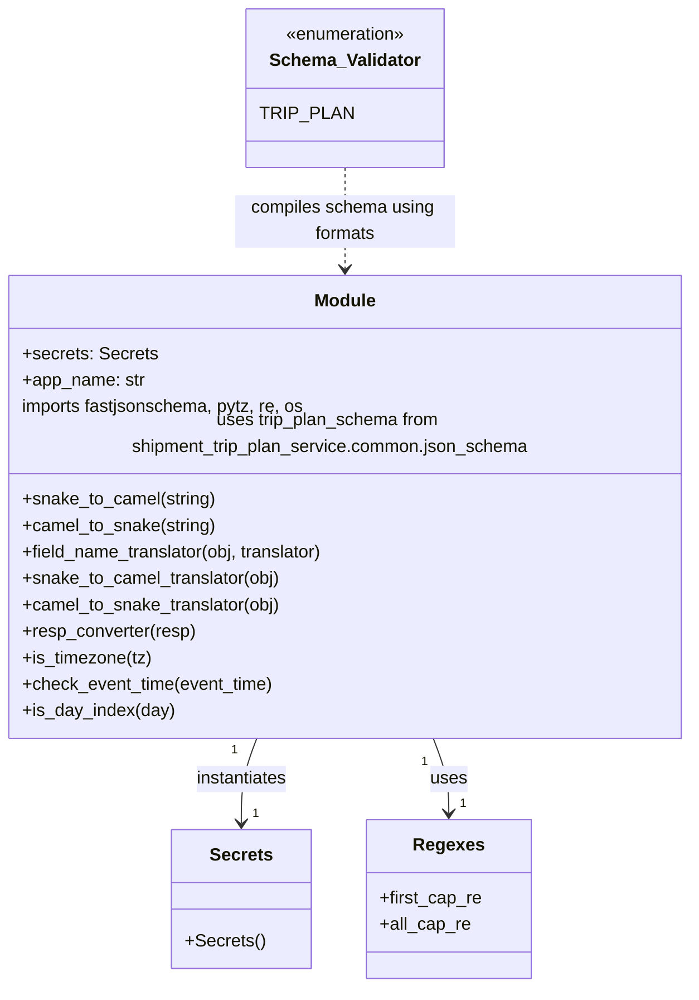

# Diagram: shipment_core/shipment_trip_plan_service/shipment_trip_plan_service/common/__init__.py


> Auto-generated by Obscura crawlers

## Diagram 1



### SVG

<svg id="container" width="643.546875" xmlns="http://www.w3.org/2000/svg" class="classDiagram" height="884" viewBox="0 0 643.546875 884" role="graphics-document document" aria-roledescription="class"><style>#container{font-family:"trebuchet ms",verdana,arial,sans-serif;font-size:16px;fill:#333;}@keyframes edge-animation-frame{from{stroke-dashoffset:0;}}@keyframes dash{to{stroke-dashoffset:0;}}#container .edge-animation-slow{stroke-dasharray:9,5!important;stroke-dashoffset:900;animation:dash 50s linear infinite;stroke-linecap:round;}#container .edge-animation-fast{stroke-dasharray:9,5!important;stroke-dashoffset:900;animation:dash 20s linear infinite;stroke-linecap:round;}#container .error-icon{fill:#552222;}#container .error-text{fill:#552222;stroke:#552222;}#container .edge-thickness-normal{stroke-width:1px;}#container .edge-thickness-thick{stroke-width:3.5px;}#container .edge-pattern-solid{stroke-dasharray:0;}#container .edge-thickness-invisible{stroke-width:0;fill:none;}#container .edge-pattern-dashed{stroke-dasharray:3;}#container .edge-pattern-dotted{stroke-dasharray:2;}#container .marker{fill:#333333;stroke:#333333;}#container .marker.cross{stroke:#333333;}#container svg{font-family:"trebuchet ms",verdana,arial,sans-serif;font-size:16px;}#container p{margin:0;}#container g.classGroup text{fill:#9370DB;stroke:none;font-family:"trebuchet ms",verdana,arial,sans-serif;font-size:10px;}#container g.classGroup text .title{font-weight:bolder;}#container .nodeLabel,#container .edgeLabel{color:#131300;}#container .edgeLabel .label rect{fill:#ECECFF;}#container .label text{fill:#131300;}#container .labelBkg{background:#ECECFF;}#container .edgeLabel .label span{background:#ECECFF;}#container .classTitle{font-weight:bolder;}#container .node rect,#container .node circle,#container .node ellipse,#container .node polygon,#container .node path{fill:#ECECFF;stroke:#9370DB;stroke-width:1px;}#container .divider{stroke:#9370DB;stroke-width:1;}#container g.clickable{cursor:pointer;}#container g.classGroup rect{fill:#ECECFF;stroke:#9370DB;}#container g.classGroup line{stroke:#9370DB;stroke-width:1;}#container .classLabel .box{stroke:none;stroke-width:0;fill:#ECECFF;opacity:0.5;}#container .classLabel .label{fill:#9370DB;font-size:10px;}#container .relation{stroke:#333333;stroke-width:1;fill:none;}#container .dashed-line{stroke-dasharray:3;}#container .dotted-line{stroke-dasharray:1 2;}#container #compositionStart,#container .composition{fill:#333333!important;stroke:#333333!important;stroke-width:1;}#container #compositionEnd,#container .composition{fill:#333333!important;stroke:#333333!important;stroke-width:1;}#container #dependencyStart,#container .dependency{fill:#333333!important;stroke:#333333!important;stroke-width:1;}#container #dependencyStart,#container .dependency{fill:#333333!important;stroke:#333333!important;stroke-width:1;}#container #extensionStart,#container .extension{fill:transparent!important;stroke:#333333!important;stroke-width:1;}#container #extensionEnd,#container .extension{fill:transparent!important;stroke:#333333!important;stroke-width:1;}#container #aggregationStart,#container .aggregation{fill:transparent!important;stroke:#333333!important;stroke-width:1;}#container #aggregationEnd,#container .aggregation{fill:transparent!important;stroke:#333333!important;stroke-width:1;}#container #lollipopStart,#container .lollipop{fill:#ECECFF!important;stroke:#333333!important;stroke-width:1;}#container #lollipopEnd,#container .lollipop{fill:#ECECFF!important;stroke:#333333!important;stroke-width:1;}#container .edgeTerminals{font-size:11px;line-height:initial;}#container .classTitleText{text-anchor:middle;font-size:18px;fill:#333;}#container .label-icon{display:inline-block;height:1em;overflow:visible;vertical-align:-0.125em;}#container .node .label-icon path{fill:currentColor;stroke:revert;stroke-width:revert;}#container :root{--mermaid-font-family:"trebuchet ms",verdana,arial,sans-serif;}</style><g><defs><marker id="container_class-aggregationStart" class="marker aggregation class" refX="18" refY="7" markerWidth="190" markerHeight="240" orient="auto"><path d="M 18,7 L9,13 L1,7 L9,1 Z"></path></marker></defs><defs><marker id="container_class-aggregationEnd" class="marker aggregation class" refX="1" refY="7" markerWidth="20" markerHeight="28" orient="auto"><path d="M 18,7 L9,13 L1,7 L9,1 Z"></path></marker></defs><defs><marker id="container_class-extensionStart" class="marker extension class" refX="18" refY="7" markerWidth="190" markerHeight="240" orient="auto"><path d="M 1,7 L18,13 V 1 Z"></path></marker></defs><defs><marker id="container_class-extensionEnd" class="marker extension class" refX="1" refY="7" markerWidth="20" markerHeight="28" orient="auto"><path d="M 1,1 V 13 L18,7 Z"></path></marker></defs><defs><marker id="container_class-compositionStart" class="marker composition class" refX="18" refY="7" markerWidth="190" markerHeight="240" orient="auto"><path d="M 18,7 L9,13 L1,7 L9,1 Z"></path></marker></defs><defs><marker id="container_class-compositionEnd" class="marker composition class" refX="1" refY="7" markerWidth="20" markerHeight="28" orient="auto"><path d="M 18,7 L9,13 L1,7 L9,1 Z"></path></marker></defs><defs><marker id="container_class-dependencyStart" class="marker dependency class" refX="6" refY="7" markerWidth="190" markerHeight="240" orient="auto"><path d="M 5,7 L9,13 L1,7 L9,1 Z"></path></marker></defs><defs><marker id="container_class-dependencyEnd" class="marker dependency class" refX="13" refY="7" markerWidth="20" markerHeight="28" orient="auto"><path d="M 18,7 L9,13 L14,7 L9,1 Z"></path></marker></defs><defs><marker id="container_class-lollipopStart" class="marker lollipop class" refX="13" refY="7" markerWidth="190" markerHeight="240" orient="auto"><circle stroke="black" fill="transparent" cx="7" cy="7" r="6"></circle></marker></defs><defs><marker id="container_class-lollipopEnd" class="marker lollipop class" refX="1" refY="7" markerWidth="190" markerHeight="240" orient="auto"><circle stroke="black" fill="transparent" cx="7" cy="7" r="6"></circle></marker></defs><g class="root"><g class="clusters"></g><g class="edgePaths"><path d="M243.911,658L241.557,664.167C239.204,670.333,234.496,682.667,232.143,695.5C229.789,708.333,229.789,721.667,229.789,728.333L229.789,735" id="id_Module_Secrets_1" class="edge-thickness-normal edge-pattern-solid relation" style=";;;" data-edge="true" data-et="edge" data-id="id_Module_Secrets_1" data-points="W3sieCI6MjQzLjkxMTE0NDk2ODg3OTY4LCJ5Ijo2NTh9LHsieCI6MjI5Ljc4OTA2MjUsInkiOjY5NX0seyJ4IjoyMjkuNzg5MDYyNSwieSI6NzQxfV0=" marker-end="url(#container_class-dependencyEnd)"></path><path d="M399.636,658L401.989,664.167C404.343,670.333,409.05,682.667,411.404,694C413.758,705.333,413.758,715.667,413.758,720.833L413.758,726" id="id_Module_Regexes_2" class="edge-thickness-normal edge-pattern-solid relation" style=";;;" data-edge="true" data-et="edge" data-id="id_Module_Regexes_2" data-points="W3sieCI6Mzk5LjYzNTczMDAzMTEyMDMsInkiOjY1OH0seyJ4Ijo0MTMuNzU3ODEyNSwieSI6Njk1fSx7IngiOjQxMy43NTc4MTI1LCJ5Ijo3MzJ9XQ==" marker-end="url(#container_class-dependencyEnd)"></path><path d="M321.773,152L321.773,160.167C321.773,168.333,321.773,184.667,321.773,200C321.773,215.333,321.773,229.667,321.773,236.833L321.773,244" id="id_Schema_Validator_Module_3" class="edge-thickness-normal edge-pattern-dashed relation" style=";;;" data-edge="true" data-et="edge" data-id="id_Schema_Validator_Module_3" data-points="W3sieCI6MzIxLjc3MzQzNzUsInkiOjE1Mn0seyJ4IjozMjEuNzczNDM3NSwieSI6MjAxfSx7IngiOjMyMS43NzM0Mzc1LCJ5IjoyNTB9XQ==" marker-end="url(#container_class-dependencyEnd)"></path></g><g class="edgeLabels"><g class="edgeLabel" transform="translate(229.7890625, 695)"><g class="label" data-id="id_Module_Secrets_1" transform="translate(-42.9140625, -12)"><foreignObject width="85.828125" height="24"><div xmlns="http://www.w3.org/1999/xhtml" class="labelBkg" style="display: table-cell; white-space: nowrap; line-height: 1.5; max-width: 200px; text-align: center;"><span class="edgeLabel"><p>instantiates</p></span></div></foreignObject></g></g><g class="edgeLabel" transform="translate(413.7578125, 695)"><g class="label" data-id="id_Module_Regexes_2" transform="translate(-16.4921875, -12)"><foreignObject width="32.984375" height="24"><div xmlns="http://www.w3.org/1999/xhtml" class="labelBkg" style="display: table-cell; white-space: nowrap; line-height: 1.5; max-width: 200px; text-align: center;"><span class="edgeLabel"><p>uses</p></span></div></foreignObject></g></g><g class="edgeLabel" transform="translate(321.7734375, 201)"><g class="label" data-id="id_Schema_Validator_Module_3" transform="translate(-100, -24)"><foreignObject width="200" height="48"><div xmlns="http://www.w3.org/1999/xhtml" class="labelBkg" style="display: table; white-space: break-spaces; line-height: 1.5; max-width: 200px; text-align: center; width: 200px;"><span class="edgeLabel"><p>compiles schema using formats</p></span></div></foreignObject></g></g><g class="edgeTerminals" transform="translate(223.6569373186758, 669.0007756643545)"><g class="inner" transform="translate(0, 0)"><foreignObject style="width: 9px; height: 12px;"><div xmlns="http://www.w3.org/1999/xhtml" style="display: inline-block; padding-right: 1px; white-space: nowrap;"><span class="edgeLabel">1</span></div></foreignObject></g></g><g class="edgeTerminals" transform="translate(391.862074135912, 679.698392465262)"><g class="inner" transform="translate(0, 0)"><foreignObject style="width: 9px; height: 12px;"><div xmlns="http://www.w3.org/1999/xhtml" style="display: inline-block; padding-right: 1px; white-space: nowrap;"><span class="edgeLabel">1</span></div></foreignObject></g></g><g class="edgeTerminals" transform="translate(239.78906124999997, 718.4999989285715)"><g class="inner" transform="translate(0, 0)"></g><foreignObject style="width: 9px; height: 12px;"><div xmlns="http://www.w3.org/1999/xhtml" style="display: inline-block; padding-right: 1px; white-space: nowrap;"><span class="edgeLabel">1</span></div></foreignObject></g><g class="edgeTerminals" transform="translate(423.75781125, 709.4999989285715)"><g class="inner" transform="translate(0, 0)"></g><foreignObject style="width: 9px; height: 12px;"><div xmlns="http://www.w3.org/1999/xhtml" style="display: inline-block; padding-right: 1px; white-space: nowrap;"><span class="edgeLabel">1</span></div></foreignObject></g></g><g class="nodes"><g class="node default" id="classId-Module-0" transform="translate(321.7734375, 454)"><g class="basic label-container"><path d="M-313.7734375 -204 L313.7734375 -204 L313.7734375 204 L-313.7734375 204" stroke="none" stroke-width="0" fill="#ECECFF" style=""></path><path d="M-313.7734375 -204 C-112.06766914482458 -204, 89.63809921035084 -204, 313.7734375 -204 M-313.7734375 -204 C-124.48011428710177 -204, 64.81320892579646 -204, 313.7734375 -204 M313.7734375 -204 C313.7734375 -106.34519090351212, 313.7734375 -8.690381807024238, 313.7734375 204 M313.7734375 -204 C313.7734375 -78.7553905668904, 313.7734375 46.489218866219204, 313.7734375 204 M313.7734375 204 C111.6887433600937 204, -90.39595077981261 204, -313.7734375 204 M313.7734375 204 C82.62788838034868 204, -148.51766073930264 204, -313.7734375 204 M-313.7734375 204 C-313.7734375 48.06568421066194, -313.7734375 -107.86863157867612, -313.7734375 -204 M-313.7734375 204 C-313.7734375 90.99567566119006, -313.7734375 -22.008648677619874, -313.7734375 -204" stroke="#9370DB" stroke-width="1.3" fill="none" stroke-dasharray="0 0" style=""></path></g><g class="annotation-group text" transform="translate(0, -180)"></g><g class="label-group text" transform="translate(-27.09375, -180)"><g class="label" style="font-weight: bolder" transform="translate(0,-12)"><foreignObject width="54.1875" height="24"><div xmlns="http://www.w3.org/1999/xhtml" style="display: table-cell; white-space: nowrap; line-height: 1.5; max-width: 104px; text-align: center;"><span class="nodeLabel markdown-node-label" style=""><p>Module</p></span></div></foreignObject></g></g><g class="members-group text" transform="translate(-301.7734375, -132)"><g class="label" style="" transform="translate(0,-12)"><foreignObject width="120.328125" height="24"><div xmlns="http://www.w3.org/1999/xhtml" style="display: table-cell; white-space: nowrap; line-height: 1.5; max-width: 178px; text-align: center;"><span class="nodeLabel markdown-node-label" style=""><p>+secrets: Secrets</p></span></div></foreignObject></g><g class="label" style="" transform="translate(0,12)"><foreignObject width="111.484375" height="24"><div xmlns="http://www.w3.org/1999/xhtml" style="display: table-cell; white-space: nowrap; line-height: 1.5; max-width: 170px; text-align: center;"><span class="nodeLabel markdown-node-label" style=""><p>+app_name: str</p></span></div></foreignObject></g><g class="label" style="" transform="translate(0,36)"><foreignObject width="259.234375" height="24"><div xmlns="http://www.w3.org/1999/xhtml" style="display: table-cell; white-space: nowrap; line-height: 1.5; max-width: 309px; text-align: center;"><span class="nodeLabel markdown-node-label" style=""><p>imports fastjsonschema, pytz, re, os</p></span></div></foreignObject></g><g class="label" style="" transform="translate(0,60)"><foreignObject width="576.453125" height="24"><div xmlns="http://www.w3.org/1999/xhtml" style="display: table-cell; white-space: nowrap; line-height: 1.5; max-width: 626px; text-align: center;"><span class="nodeLabel markdown-node-label" style=""><p>uses trip_plan_schema from shipment_trip_plan_service.common.json_schema</p></span></div></foreignObject></g></g><g class="methods-group text" transform="translate(-301.7734375, -12)"><g class="label" style="" transform="translate(0,-12)"><foreignObject width="175.859375" height="24"><div xmlns="http://www.w3.org/1999/xhtml" style="display: table-cell; white-space: nowrap; line-height: 1.5; max-width: 233px; text-align: center;"><span class="nodeLabel markdown-node-label" style=""><p>+snake_to_camel(string)</p></span></div></foreignObject></g><g class="label" style="" transform="translate(0,12)"><foreignObject width="176.5" height="24"><div xmlns="http://www.w3.org/1999/xhtml" style="display: table-cell; white-space: nowrap; line-height: 1.5; max-width: 234px; text-align: center;"><span class="nodeLabel markdown-node-label" style=""><p>+camel_to_snake(string)</p></span></div></foreignObject></g><g class="label" style="" transform="translate(0,36)"><foreignObject width="280.765625" height="24"><div xmlns="http://www.w3.org/1999/xhtml" style="display: table-cell; white-space: nowrap; line-height: 1.5; max-width: 338px; text-align: center;"><span class="nodeLabel markdown-node-label" style=""><p>+field_name_translator(obj, translator)</p></span></div></foreignObject></g><g class="label" style="" transform="translate(0,60)"><foreignObject width="236.875" height="24"><div xmlns="http://www.w3.org/1999/xhtml" style="display: table-cell; white-space: nowrap; line-height: 1.5; max-width: 294px; text-align: center;"><span class="nodeLabel markdown-node-label" style=""><p>+snake_to_camel_translator(obj)</p></span></div></foreignObject></g><g class="label" style="" transform="translate(0,84)"><foreignObject width="237.1875" height="24"><div xmlns="http://www.w3.org/1999/xhtml" style="display: table-cell; white-space: nowrap; line-height: 1.5; max-width: 295px; text-align: center;"><span class="nodeLabel markdown-node-label" style=""><p>+camel_to_snake_translator(obj)</p></span></div></foreignObject></g><g class="label" style="" transform="translate(0,108)"><foreignObject width="157.890625" height="24"><div xmlns="http://www.w3.org/1999/xhtml" style="display: table-cell; white-space: nowrap; line-height: 1.5; max-width: 215px; text-align: center;"><span class="nodeLabel markdown-node-label" style=""><p>+resp_converter(resp)</p></span></div></foreignObject></g><g class="label" style="" transform="translate(0,132)"><foreignObject width="117.71875" height="24"><div xmlns="http://www.w3.org/1999/xhtml" style="display: table-cell; white-space: nowrap; line-height: 1.5; max-width: 175px; text-align: center;"><span class="nodeLabel markdown-node-label" style=""><p>+is_timezone(tz)</p></span></div></foreignObject></g><g class="label" style="" transform="translate(0,156)"><foreignObject width="230.0625" height="24"><div xmlns="http://www.w3.org/1999/xhtml" style="display: table-cell; white-space: nowrap; line-height: 1.5; max-width: 287px; text-align: center;"><span class="nodeLabel markdown-node-label" style=""><p>+check_event_time(event_time)</p></span></div></foreignObject></g><g class="label" style="" transform="translate(0,180)"><foreignObject width="137.46875" height="24"><div xmlns="http://www.w3.org/1999/xhtml" style="display: table-cell; white-space: nowrap; line-height: 1.5; max-width: 195px; text-align: center;"><span class="nodeLabel markdown-node-label" style=""><p>+is_day_index(day)</p></span></div></foreignObject></g></g><g class="divider" style=""><path d="M-313.7734375 -156 C-104.62218488229516 -156, 104.52906773540968 -156, 313.7734375 -156 M-313.7734375 -156 C-97.95402639130921 -156, 117.86538471738157 -156, 313.7734375 -156" stroke="#9370DB" stroke-width="1.3" fill="none" stroke-dasharray="0 0" style=""></path></g><g class="divider" style=""><path d="M-313.7734375 -36 C-150.35731150691817 -36, 13.05881448616367 -36, 313.7734375 -36 M-313.7734375 -36 C-101.89527174564387 -36, 109.98289400871226 -36, 313.7734375 -36" stroke="#9370DB" stroke-width="1.3" fill="none" stroke-dasharray="0 0" style=""></path></g></g><g class="node default" id="classId-Secrets-1" transform="translate(229.7890625, 804)"><g class="basic label-container"><path d="M-60.81640625 -63 L60.81640625 -63 L60.81640625 63 L-60.81640625 63" stroke="none" stroke-width="0" fill="#ECECFF" style=""></path><path d="M-60.81640625 -63 C-34.84242386869042 -63, -8.868441487380842 -63, 60.81640625 -63 M-60.81640625 -63 C-28.34482244382629 -63, 4.126761362347423 -63, 60.81640625 -63 M60.81640625 -63 C60.81640625 -30.195751888642036, 60.81640625 2.608496222715928, 60.81640625 63 M60.81640625 -63 C60.81640625 -35.80753661876166, 60.81640625 -8.615073237523312, 60.81640625 63 M60.81640625 63 C28.137530491505444 63, -4.5413452669891115 63, -60.81640625 63 M60.81640625 63 C15.39695086428462 63, -30.02250452143076 63, -60.81640625 63 M-60.81640625 63 C-60.81640625 25.197553587023926, -60.81640625 -12.604892825952149, -60.81640625 -63 M-60.81640625 63 C-60.81640625 30.300124387706063, -60.81640625 -2.399751224587874, -60.81640625 -63" stroke="#9370DB" stroke-width="1.3" fill="none" stroke-dasharray="0 0" style=""></path></g><g class="annotation-group text" transform="translate(0, -39)"></g><g class="label-group text" transform="translate(-27.1640625, -39)"><g class="label" style="font-weight: bolder" transform="translate(0,-12)"><foreignObject width="54.328125" height="24"><div xmlns="http://www.w3.org/1999/xhtml" style="display: table-cell; white-space: nowrap; line-height: 1.5; max-width: 103px; text-align: center;"><span class="nodeLabel markdown-node-label" style=""><p>Secrets</p></span></div></foreignObject></g></g><g class="members-group text" transform="translate(-48.81640625, 9)"></g><g class="methods-group text" transform="translate(-48.81640625, 39)"><g class="label" style="" transform="translate(0,-12)"><foreignObject width="70.46875" height="24"><div xmlns="http://www.w3.org/1999/xhtml" style="display: table-cell; white-space: nowrap; line-height: 1.5; max-width: 128px; text-align: center;"><span class="nodeLabel markdown-node-label" style=""><p>+Secrets()</p></span></div></foreignObject></g></g><g class="divider" style=""><path d="M-60.81640625 -15 C-16.75076003569496 -15, 27.31488617861008 -15, 60.81640625 -15 M-60.81640625 -15 C-35.57477271354432 -15, -10.333139177088647 -15, 60.81640625 -15" stroke="#9370DB" stroke-width="1.3" fill="none" stroke-dasharray="0 0" style=""></path></g><g class="divider" style=""><path d="M-60.81640625 9 C-31.214219770502567 9, -1.6120332910051332 9, 60.81640625 9 M-60.81640625 9 C-23.716456834945497 9, 13.383492580109007 9, 60.81640625 9" stroke="#9370DB" stroke-width="1.3" fill="none" stroke-dasharray="0 0" style=""></path></g></g><g class="node default" id="classId-Regexes-2" transform="translate(413.7578125, 804)"><g class="basic label-container"><path d="M-73.15234375 -72 L73.15234375 -72 L73.15234375 72 L-73.15234375 72" stroke="none" stroke-width="0" fill="#ECECFF" style=""></path><path d="M-73.15234375 -72 C-32.5847923907042 -72, 7.982758968591597 -72, 73.15234375 -72 M-73.15234375 -72 C-17.982968712985503 -72, 37.186406324028994 -72, 73.15234375 -72 M73.15234375 -72 C73.15234375 -15.192400719613012, 73.15234375 41.615198560773976, 73.15234375 72 M73.15234375 -72 C73.15234375 -35.26528873054408, 73.15234375 1.469422538911843, 73.15234375 72 M73.15234375 72 C23.117844422058766 72, -26.916654905882467 72, -73.15234375 72 M73.15234375 72 C25.243613095743164 72, -22.66511755851367 72, -73.15234375 72 M-73.15234375 72 C-73.15234375 31.74040329318271, -73.15234375 -8.519193413634582, -73.15234375 -72 M-73.15234375 72 C-73.15234375 24.13628273630094, -73.15234375 -23.727434527398117, -73.15234375 -72" stroke="#9370DB" stroke-width="1.3" fill="none" stroke-dasharray="0 0" style=""></path></g><g class="annotation-group text" transform="translate(0, -48)"></g><g class="label-group text" transform="translate(-30.0546875, -48)"><g class="label" style="font-weight: bolder" transform="translate(0,-12)"><foreignObject width="60.109375" height="24"><div xmlns="http://www.w3.org/1999/xhtml" style="display: table-cell; white-space: nowrap; line-height: 1.5; max-width: 109px; text-align: center;"><span class="nodeLabel markdown-node-label" style=""><p>Regexes</p></span></div></foreignObject></g></g><g class="members-group text" transform="translate(-61.15234375, 0)"><g class="label" style="" transform="translate(0,-12)"><foreignObject width="92.25" height="24"><div xmlns="http://www.w3.org/1999/xhtml" style="display: table-cell; white-space: nowrap; line-height: 1.5; max-width: 150px; text-align: center;"><span class="nodeLabel markdown-node-label" style=""><p>+first_cap_re</p></span></div></foreignObject></g><g class="label" style="" transform="translate(0,12)"><foreignObject width="81.78125" height="24"><div xmlns="http://www.w3.org/1999/xhtml" style="display: table-cell; white-space: nowrap; line-height: 1.5; max-width: 139px; text-align: center;"><span class="nodeLabel markdown-node-label" style=""><p>+all_cap_re</p></span></div></foreignObject></g></g><g class="methods-group text" transform="translate(-61.15234375, 72)"></g><g class="divider" style=""><path d="M-73.15234375 -24 C-24.98057937920558 -24, 23.19118499158884 -24, 73.15234375 -24 M-73.15234375 -24 C-43.733828203204816 -24, -14.315312656409631 -24, 73.15234375 -24" stroke="#9370DB" stroke-width="1.3" fill="none" stroke-dasharray="0 0" style=""></path></g><g class="divider" style=""><path d="M-73.15234375 48 C-29.018185272210268 48, 15.115973205579465 48, 73.15234375 48 M-73.15234375 48 C-36.32770589210127 48, 0.496931965797458 48, 73.15234375 48" stroke="#9370DB" stroke-width="1.3" fill="none" stroke-dasharray="0 0" style=""></path></g></g><g class="node default" id="classId-Schema_Validator-3" transform="translate(321.7734375, 80)"><g class="basic label-container"><path d="M-82.796875 -72 L82.796875 -72 L82.796875 72 L-82.796875 72" stroke="none" stroke-width="0" fill="#ECECFF" style=""></path><path d="M-82.796875 -72 C-31.432028984191653 -72, 19.932817031616693 -72, 82.796875 -72 M-82.796875 -72 C-30.309726456773753 -72, 22.177422086452495 -72, 82.796875 -72 M82.796875 -72 C82.796875 -29.647863425642115, 82.796875 12.704273148715771, 82.796875 72 M82.796875 -72 C82.796875 -38.18347030211812, 82.796875 -4.366940604236234, 82.796875 72 M82.796875 72 C47.27131636026974 72, 11.745757720539487 72, -82.796875 72 M82.796875 72 C31.317252723903195 72, -20.16236955219361 72, -82.796875 72 M-82.796875 72 C-82.796875 31.728788996421642, -82.796875 -8.542422007156716, -82.796875 -72 M-82.796875 72 C-82.796875 25.418617042028984, -82.796875 -21.162765915942032, -82.796875 -72" stroke="#9370DB" stroke-width="1.3" fill="none" stroke-dasharray="0 0" style=""></path></g><g class="annotation-group text" transform="translate(-55.5546875, -48)"><g class="label" style="" transform="translate(0,-12)"><foreignObject width="111.109375" height="24"><div xmlns="http://www.w3.org/1999/xhtml" style="display: table-cell; white-space: nowrap; line-height: 1.5; max-width: 161px; text-align: center;"><span class="nodeLabel markdown-node-label" style=""><p>«enumeration»</p></span></div></foreignObject></g></g><g class="label-group text" transform="translate(-65.53125, -24)"><g class="label" style="font-weight: bolder" transform="translate(0,-12)"><foreignObject width="131.0625" height="24"><div xmlns="http://www.w3.org/1999/xhtml" style="display: table-cell; white-space: nowrap; line-height: 1.5; max-width: 181px; text-align: center;"><span class="nodeLabel markdown-node-label" style=""><p>Schema_Validator</p></span></div></foreignObject></g></g><g class="members-group text" transform="translate(-70.796875, 24)"><g class="label" style="" transform="translate(0,-12)"><foreignObject width="76.0625" height="24"><div xmlns="http://www.w3.org/1999/xhtml" style="display: table-cell; white-space: nowrap; line-height: 1.5; max-width: 126px; text-align: center;"><span class="nodeLabel markdown-node-label" style=""><p>TRIP_PLAN</p></span></div></foreignObject></g></g><g class="methods-group text" transform="translate(-70.796875, 72)"></g><g class="divider" style=""><path d="M-82.796875 0 C-34.426886239044045 0, 13.94310252191191 0, 82.796875 0 M-82.796875 0 C-22.736378979720598 0, 37.324117040558804 0, 82.796875 0" stroke="#9370DB" stroke-width="1.3" fill="none" stroke-dasharray="0 0" style=""></path></g><g class="divider" style=""><path d="M-82.796875 48 C-32.14024073428317 48, 18.516393531433664 48, 82.796875 48 M-82.796875 48 C-29.030486972712033 48, 24.735901054575933 48, 82.796875 48" stroke="#9370DB" stroke-width="1.3" fill="none" stroke-dasharray="0 0" style=""></path></g></g></g></g></g></svg>

## Diagram 2

```mermaid
flowchart TD
    A[Input string] --> B{snake_to_camel?}
    B -->|contains _| C[split on _ and uppercase captures]
    C --> D[assemble camelCase string]
    B -->|no _| D
    E[Input string] --> F{camel_to_snake?}
    F --> G[first_cap_re -> insert _]
    G --> H[all_cap_re -> insert _ then lower()]
    H --> I[return snake_case string]
    J[JSON-like obj] --> K{dict/list/other}
    K -->|dict| L[translate keys with translator]
    K -->|list| M[translate each element]
    K -->|other| N[return as-is]
    O[resp object] --> P{has _asdict?}
    P -->|yes| Q[resp._asdict() -> snake_to_camel_translator]
    P -->|no| R[use resp directly -> snake_to_camel_translator]
    S[timezone string] --> T[is_timezone checks in pytz.all_timezones]
    T -->|valid| U[returns True]
    T -->|invalid| V[raise JsonSchemaException]
    W[eventTime string] --> X[check_event_time regex match]
    X -->|match| U
    X -->|no match| Y[raise JsonSchemaException]
    Z[day value] --> AA[is_day_index: try int if str]
    AA -->|>=0| U
    AA -->|<0 or invalid| AB[raise JsonSchemaException]
```

> SVG rendering failed for this diagram.
