# Diagram: shipment_core/shipment_trip_plan_service/shipment_trip_plan_service/common/constants.py

> Auto-generated by Obscura crawlers

## Mermaid

```mermaid
classDiagram
class RAIL_ALL_STATUS_CODES {
  <<constant>>
  + "3000","4040","4041","4042","4043","4044","4045","4046","4048","4049","404X","4050","4051","4053","4055","4059","405X","6001","6002","6003","6004","6005","6006","6007","6008","6009","6010","6011","6012","6013","6014","6015","6016","6017","6018","6019","6020","6021","6022","6023","6024","6025","6026","6027","6028","6029","6030","6031","6032","6033","6034","6035","6036","6037","6038","6039","6042","6043","6044","6045","6046","6047","6048","6049","6050","6051","6052","6053","6054","6055","6056","6057","6058","6059","6060","6061","6062","6063","6064","6065","6066","6067","6068","6074","6075","6076","6077","6078","6079","6080","6081","6082","6083","6084","6085","6086","6089","6091","6092","6093","6094"
}
class SHIPMENT_MODES {
  <<constant map>>
  + 2: "rail"
}
class DAYS {
  <<constant map>>
  + 0: "sunday"
  + 1: "monday"
  + 2: "tuesday"
  + 3: "wednesday"
  + 4: "thursday"
  + 5: "friday"
  + 6: "saturday"
}
RAIL_ALL_STATUS_CODES <-- SHIPMENT_MODES : referenced_by
RAIL_ALL_STATUS_CODES <-- DAYS : contextual
```

### SVG

<svg id="container" width="4834.0703125" xmlns="http://www.w3.org/2000/svg" class="classDiagram" height="522" viewBox="0 0 4834.0703125 522" role="graphics-document document" aria-roledescription="class"><g><defs><marker id="container_class-aggregationStart" class="marker aggregation class" refX="18" refY="7" markerWidth="190" markerHeight="240" orient="auto"><path d="M 18,7 L9,13 L1,7 L9,1 Z"></path></marker></defs><defs><marker id="container_class-aggregationEnd" class="marker aggregation class" refX="1" refY="7" markerWidth="20" markerHeight="28" orient="auto"><path d="M 18,7 L9,13 L1,7 L9,1 Z"></path></marker></defs><defs><marker id="container_class-extensionStart" class="marker extension class" refX="18" refY="7" markerWidth="190" markerHeight="240" orient="auto"><path d="M 1,7 L18,13 V 1 Z"></path></marker></defs><defs><marker id="container_class-extensionEnd" class="marker extension class" refX="1" refY="7" markerWidth="20" markerHeight="28" orient="auto"><path d="M 1,1 V 13 L18,7 Z"></path></marker></defs><defs><marker id="container_class-compositionStart" class="marker composition class" refX="18" refY="7" markerWidth="190" markerHeight="240" orient="auto"><path d="M 18,7 L9,13 L1,7 L9,1 Z"></path></marker></defs><defs><marker id="container_class-compositionEnd" class="marker composition class" refX="1" refY="7" markerWidth="20" markerHeight="28" orient="auto"><path d="M 18,7 L9,13 L1,7 L9,1 Z"></path></marker></defs><defs><marker id="container_class-dependencyStart" class="marker dependency class" refX="6" refY="7" markerWidth="190" markerHeight="240" orient="auto"><path d="M 5,7 L9,13 L1,7 L9,1 Z"></path></marker></defs><defs><marker id="container_class-dependencyEnd" class="marker dependency class" refX="13" refY="7" markerWidth="20" markerHeight="28" orient="auto"><path d="M 18,7 L9,13 L14,7 L9,1 Z"></path></marker></defs><defs><marker id="container_class-lollipopStart" class="marker lollipop class" refX="13" refY="7" markerWidth="190" markerHeight="240" orient="auto"><circle stroke="black" fill="transparent" cx="7" cy="7" r="6"></circle></marker></defs><defs><marker id="container_class-lollipopEnd" class="marker lollipop class" refX="1" refY="7" markerWidth="190" markerHeight="240" orient="auto"><circle stroke="black" fill="transparent" cx="7" cy="7" r="6"></circle></marker></defs><g class="root"><g class="clusters"></g><g class="edgePaths"><path d="M2336.48,156.121L2330.681,161.601C2324.882,167.081,2313.284,178.04,2307.485,201.687C2301.686,225.333,2301.686,261.667,2301.686,279.833L2301.686,298" id="id_RAIL_ALL_STATUS_CODES_SHIPMENT_MODES_1" class="edge-thickness-normal edge-pattern-solid relation" style=";;;" data-edge="true" data-et="edge" data-id="id_RAIL_ALL_STATUS_CODES_SHIPMENT_MODES_1" data-points="W3sieCI6MjM0MC44NDA5MTg4NjQ2Nzg4LCJ5IjoxNTJ9LHsieCI6MjMwMS42ODU1NDY4NzUsInkiOjE4OX0seyJ4IjoyMzAxLjY4NTU0Njg3NSwieSI6Mjk4fV0=" marker-start="url(#container_class-dependencyStart)"></path><path d="M2497.59,156.121L2503.389,161.601C2509.188,167.081,2520.787,178.04,2526.586,189.687C2532.385,201.333,2532.385,213.667,2532.385,219.833L2532.385,226" id="id_RAIL_ALL_STATUS_CODES_DAYS_2" class="edge-thickness-normal edge-pattern-solid relation" style=";;;" data-edge="true" data-et="edge" data-id="id_RAIL_ALL_STATUS_CODES_DAYS_2" data-points="W3sieCI6MjQ5My4yMjkzOTM2MzUzMjEyLCJ5IjoxNTJ9LHsieCI6MjUzMi4zODQ3NjU2MjUsInkiOjE4OX0seyJ4IjoyNTMyLjM4NDc2NTYyNSwieSI6MjI2fV0=" marker-start="url(#container_class-dependencyStart)"></path></g><g class="edgeLabels"><g class="edgeLabel" transform="translate(2301.685546875, 189)"><g class="label" data-id="id_RAIL_ALL_STATUS_CODES_SHIPMENT_MODES_1" transform="translate(-51.6953125, -12)"><foreignObject width="103.390625" height="24">

referenced_by

</foreignObject></g></g><g class="edgeLabel" transform="translate(2532.384765625, 189)"><g class="label" data-id="id_RAIL_ALL_STATUS_CODES_DAYS_2" transform="translate(-38.125, -12)"><foreignObject width="76.25" height="24">

contextual

</foreignObject></g></g></g><g class="nodes"><g class="node default" id="classId-RAIL_ALL_STATUS_CODES-0" transform="translate(2417.03515625, 80)"><g class="basic label-container"><path d="M-2409.03515625 -72 L2409.03515625 -72 L2409.03515625 72 L-2409.03515625 72" stroke="none" stroke-width="0" fill="#ECECFF" style=""></path><path d="M-2409.03515625 -72 C-945.0278067544273 -72, 518.9795427411455 -72, 2409.03515625 -72 M-2409.03515625 -72 C-610.3549511182271 -72, 1188.3252540135459 -72, 2409.03515625 -72 M2409.03515625 -72 C2409.03515625 -24.701162009751116, 2409.03515625 22.59767598049777, 2409.03515625 72 M2409.03515625 -72 C2409.03515625 -18.923375330762163, 2409.03515625 34.153249338475675, 2409.03515625 72 M2409.03515625 72 C926.2539009810939 72, -556.5273542878122 72, -2409.03515625 72 M2409.03515625 72 C821.7088623353384 72, -765.6174315793232 72, -2409.03515625 72 M-2409.03515625 72 C-2409.03515625 28.693430645245407, -2409.03515625 -14.613138709509187, -2409.03515625 -72 M-2409.03515625 72 C-2409.03515625 41.91428469084563, -2409.03515625 11.828569381691267, -2409.03515625 -72" stroke="#9370DB" stroke-width="1.3" fill="none" stroke-dasharray="0 0" style=""></path></g><g class="annotation-group text" transform="translate(-40.4921875, -48)"><g class="label" style="" transform="translate(0,-12)"><foreignObject width="80.984375" height="24">

«constant»

</foreignObject></g></g><g class="label-group text" transform="translate(-91.3828125, -24)"><g class="label" style="font-weight: bolder" transform="translate(0,-12)"><foreignObject width="182.765625" height="24">

RAIL_ALL_STATUS_CODES

</foreignObject></g></g><g class="members-group text" transform="translate(-2397.03515625, 24)"><g class="label" style="" transform="translate(0,-12)"><foreignObject width="4702.6875" height="24">

+ "3000","4040","4041","4042","4043","4044","4045","4046","4048","4049","404X","4050","4051","4053","4055","4059","405X","6001","6002","6003","6004","6005","6006","6007","6008","6009","6010","6011","6012","6013","6014","6015","6016","6017","6018","6019","6020","6021","6022","6023","6024","6025","6026","6027","6028","6029","6030","6031","6032","6033","6034","6035","6036","6037","6038","6039","6042","6043","6044","6045","6046","6047","6048","6049","6050","6051","6052","6053","6054","6055","6056","6057","6058","6059","6060","6061","6062","6063","6064","6065","6066","6067","6068","6074","6075","6076","6077","6078","6079","6080","6081","6082","6083","6084","6085","6086","6089","6091","6092","6093","6094"

</foreignObject></g></g><g class="methods-group text" transform="translate(-2397.03515625, 72)"></g><g class="divider" style=""><path d="M-2409.03515625 0 C-1238.5152148266616 0, -67.99527340332315 0, 2409.03515625 0 M-2409.03515625 0 C-1090.6977802249933 0, 227.63959580001347 0, 2409.03515625 0" stroke="#9370DB" stroke-width="1.3" fill="none" stroke-dasharray="0 0" style=""></path></g><g class="divider" style=""><path d="M-2409.03515625 48 C-1173.873032431364 48, 61.28909138727204 48, 2409.03515625 48 M-2409.03515625 48 C-1444.650939599081 48, -480.26672294816194 48, 2409.03515625 48" stroke="#9370DB" stroke-width="1.3" fill="none" stroke-dasharray="0 0" style=""></path></g></g><g class="node default" id="classId-SHIPMENT_MODES-1" transform="translate(2301.685546875, 370)"><g class="basic label-container"><path d="M-78.34375 -72 L78.34375 -72 L78.34375 72 L-78.34375 72" stroke="none" stroke-width="0" fill="#ECECFF" style=""></path><path d="M-78.34375 -72 C-36.297992273928465 -72, 5.747765452143071 -72, 78.34375 -72 M-78.34375 -72 C-42.60793740226054 -72, -6.8721248045210785 -72, 78.34375 -72 M78.34375 -72 C78.34375 -21.361845272492182, 78.34375 29.276309455015635, 78.34375 72 M78.34375 -72 C78.34375 -27.684182811311302, 78.34375 16.631634377377395, 78.34375 72 M78.34375 72 C31.73909296064062 72, -14.865564078718762 72, -78.34375 72 M78.34375 72 C17.896825997042654 72, -42.55009800591469 72, -78.34375 72 M-78.34375 72 C-78.34375 16.66596072304209, -78.34375 -38.66807855391582, -78.34375 -72 M-78.34375 72 C-78.34375 38.01414999041678, -78.34375 4.028299980833566, -78.34375 -72" stroke="#9370DB" stroke-width="1.3" fill="none" stroke-dasharray="0 0" style=""></path></g><g class="annotation-group text" transform="translate(-58.4140625, -48)"><g class="label" style="" transform="translate(0,-12)"><foreignObject width="116.828125" height="24">

«constant map»

</foreignObject></g></g><g class="label-group text" transform="translate(-66.34375, -24)"><g class="label" style="font-weight: bolder" transform="translate(0,-12)"><foreignObject width="132.6875" height="24">

SHIPMENT_MODES

</foreignObject></g></g><g class="members-group text" transform="translate(-66.34375, 24)"><g class="label" style="" transform="translate(0,-12)"><foreignObject width="64.28125" height="24">

+ 2: "rail"

</foreignObject></g></g><g class="methods-group text" transform="translate(-66.34375, 72)"></g><g class="divider" style=""><path d="M-78.34375 0 C-37.61593506811239 0, 3.111879863775215 0, 78.34375 0 M-78.34375 0 C-45.571521775114775 0, -12.79929355022955 0, 78.34375 0" stroke="#9370DB" stroke-width="1.3" fill="none" stroke-dasharray="0 0" style=""></path></g><g class="divider" style=""><path d="M-78.34375 48 C-42.574493563851924 48, -6.8052371277038475 48, 78.34375 48 M-78.34375 48 C-30.91307741036848 48, 16.51759517926304 48, 78.34375 48" stroke="#9370DB" stroke-width="1.3" fill="none" stroke-dasharray="0 0" style=""></path></g></g><g class="node default" id="classId-DAYS-2" transform="translate(2532.384765625, 370)"><g class="basic label-container"><path d="M-102.35546875 -144 L102.35546875 -144 L102.35546875 144 L-102.35546875 144" stroke="none" stroke-width="0" fill="#ECECFF" style=""></path><path d="M-102.35546875 -144 C-51.093844850181156 -144, 0.1677790496376872 -144, 102.35546875 -144 M-102.35546875 -144 C-44.5153323661527 -144, 13.324804017694603 -144, 102.35546875 -144 M102.35546875 -144 C102.35546875 -71.48196998486668, 102.35546875 1.0360600302666398, 102.35546875 144 M102.35546875 -144 C102.35546875 -68.15892501641729, 102.35546875 7.682149967165429, 102.35546875 144 M102.35546875 144 C32.621772772653756 144, -37.11192320469249 144, -102.35546875 144 M102.35546875 144 C32.50540264137004 144, -37.34466346725992 144, -102.35546875 144 M-102.35546875 144 C-102.35546875 65.48166555554596, -102.35546875 -13.036668888908082, -102.35546875 -144 M-102.35546875 144 C-102.35546875 56.30142876938871, -102.35546875 -31.397142461222586, -102.35546875 -144" stroke="#9370DB" stroke-width="1.3" fill="none" stroke-dasharray="0 0" style=""></path></g><g class="annotation-group text" transform="translate(-58.4140625, -120)"><g class="label" style="" transform="translate(0,-12)"><foreignObject width="116.828125" height="24">

«constant map»

</foreignObject></g></g><g class="label-group text" transform="translate(-18.5703125, -96)"><g class="label" style="font-weight: bolder" transform="translate(0,-12)"><foreignObject width="37.140625" height="24">

DAYS

</foreignObject></g></g><g class="members-group text" transform="translate(-90.35546875, -48)"><g class="label" style="" transform="translate(0,-12)"><foreignObject width="93.90625" height="24">

+ 0: "sunday"

</foreignObject></g><g class="label" style="" transform="translate(0,12)"><foreignObject width="98.34375" height="24">

+ 1: "monday"

</foreignObject></g><g class="label" style="" transform="translate(0,36)"><foreignObject width="98.34375" height="24">

+ 2: "tuesday"

</foreignObject></g><g class="label" style="" transform="translate(0,60)"><foreignObject width="122.296875" height="24">

+ 3: "wednesday"

</foreignObject></g><g class="label" style="" transform="translate(0,84)"><foreignObject width="105.53125" height="24">

+ 4: "thursday"

</foreignObject></g><g class="label" style="" transform="translate(0,108)"><foreignObject width="83.046875" height="24">

+ 5: "friday"

</foreignObject></g><g class="label" style="" transform="translate(0,132)"><foreignObject width="104.15625" height="24">

+ 6: "saturday"

</foreignObject></g></g><g class="methods-group text" transform="translate(-90.35546875, 144)"></g><g class="divider" style=""><path d="M-102.35546875 -72 C-47.736958397982235 -72, 6.88155195403553 -72, 102.35546875 -72 M-102.35546875 -72 C-35.55314146593405 -72, 31.249185818131906 -72, 102.35546875 -72" stroke="#9370DB" stroke-width="1.3" fill="none" stroke-dasharray="0 0" style=""></path></g><g class="divider" style=""><path d="M-102.35546875 120 C-49.914201463749215 120, 2.5270658225015694 120, 102.35546875 120 M-102.35546875 120 C-23.212007536237067 120, 55.931453677525866 120, 102.35546875 120" stroke="#9370DB" stroke-width="1.3" fill="none" stroke-dasharray="0 0" style=""></path></g></g></g></g></g></svg>
