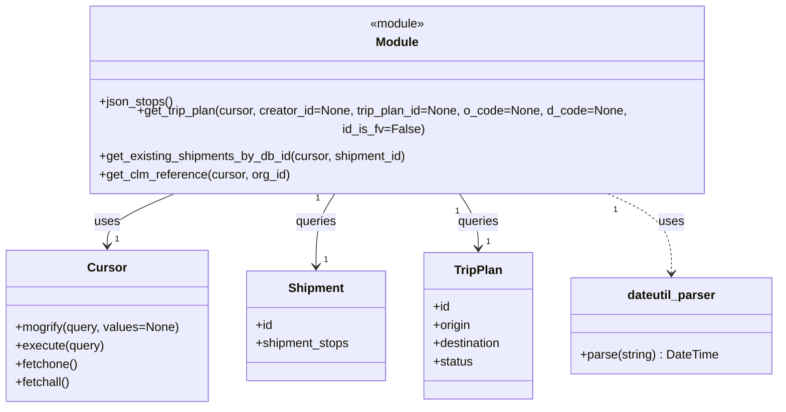

# Diagram: shipment_core/shipment_trip_plan_service/shipment_trip_plan_service/common/db.py


> Auto-generated by Obscura crawlers

## Diagram 1

```mermaid
flowchart TD
  subgraph Imports
    P[dateutil.parser as parser]
    FV[fv]
    AWS[fv.aws.lambdas]
    DB[fv.db]
    ERR[fv.error]
  end

  JS[json_stops()] -->|returns SQL fragment| SQL[(shipment_stops SQL)]
  GTP[get_trip_plan(cursor, creator_id, trip_plan_id, o_code, d_code, id_is_fv)] -->|builds query| SQLQ[(trip_plan SQL)]
  GTP -->|uses| CURSOR1[(cursor.mogrify / cursor.execute)]
  GTP -->|returns| FETCH1[(cursor.fetchone())]

  GES[get_existing_shipments_by_db_id(cursor, shipment_id)] -->|calls| JS
  GES -->|executes| CURSOR2[(cursor.mogrify / cursor.execute)]
  GES -->|fetches| RES[(res = cursor.fetchone())]
  RES -->|if empty| RAISE1[BadRequestError via fv.error.BadRequestError]
  RES -->|iterates stops| STOPS_LOOP[for stop in res.shipment_stops]
  STOPS_LOOP -->|parses datetimes| P

  GCL[get_clm_reference(cursor, org_id)] -->|executes| CURSOR3[(cursor.mogrify / cursor.execute)]
  CURSOR3 -->|fetches all| FETCHALL[(cursor.fetchall())]
  FETCHALL -->|populates| CLM_DICT[clm_dict]

  style Imports fill:#f9f,stroke:#333,stroke-width:1px
  classDef dbnode fill:#eef,stroke:#333
  class CURSOR1,CURSOR2,CURSOR3,SQL,SQLQ,RES,FETCH1,FETCHALL dbnode
```

> SVG rendering failed for this diagram.

## Diagram 2



### SVG

<svg id="container" width="1019.5859375" xmlns="http://www.w3.org/2000/svg" class="classDiagram" height="510" viewBox="0 0 1019.5859375 510" role="graphics-document document" aria-roledescription="class"><style>#container{font-family:"trebuchet ms",verdana,arial,sans-serif;font-size:16px;fill:#333;}@keyframes edge-animation-frame{from{stroke-dashoffset:0;}}@keyframes dash{to{stroke-dashoffset:0;}}#container .edge-animation-slow{stroke-dasharray:9,5!important;stroke-dashoffset:900;animation:dash 50s linear infinite;stroke-linecap:round;}#container .edge-animation-fast{stroke-dasharray:9,5!important;stroke-dashoffset:900;animation:dash 20s linear infinite;stroke-linecap:round;}#container .error-icon{fill:#552222;}#container .error-text{fill:#552222;stroke:#552222;}#container .edge-thickness-normal{stroke-width:1px;}#container .edge-thickness-thick{stroke-width:3.5px;}#container .edge-pattern-solid{stroke-dasharray:0;}#container .edge-thickness-invisible{stroke-width:0;fill:none;}#container .edge-pattern-dashed{stroke-dasharray:3;}#container .edge-pattern-dotted{stroke-dasharray:2;}#container .marker{fill:#333333;stroke:#333333;}#container .marker.cross{stroke:#333333;}#container svg{font-family:"trebuchet ms",verdana,arial,sans-serif;font-size:16px;}#container p{margin:0;}#container g.classGroup text{fill:#9370DB;stroke:none;font-family:"trebuchet ms",verdana,arial,sans-serif;font-size:10px;}#container g.classGroup text .title{font-weight:bolder;}#container .nodeLabel,#container .edgeLabel{color:#131300;}#container .edgeLabel .label rect{fill:#ECECFF;}#container .label text{fill:#131300;}#container .labelBkg{background:#ECECFF;}#container .edgeLabel .label span{background:#ECECFF;}#container .classTitle{font-weight:bolder;}#container .node rect,#container .node circle,#container .node ellipse,#container .node polygon,#container .node path{fill:#ECECFF;stroke:#9370DB;stroke-width:1px;}#container .divider{stroke:#9370DB;stroke-width:1;}#container g.clickable{cursor:pointer;}#container g.classGroup rect{fill:#ECECFF;stroke:#9370DB;}#container g.classGroup line{stroke:#9370DB;stroke-width:1;}#container .classLabel .box{stroke:none;stroke-width:0;fill:#ECECFF;opacity:0.5;}#container .classLabel .label{fill:#9370DB;font-size:10px;}#container .relation{stroke:#333333;stroke-width:1;fill:none;}#container .dashed-line{stroke-dasharray:3;}#container .dotted-line{stroke-dasharray:1 2;}#container #compositionStart,#container .composition{fill:#333333!important;stroke:#333333!important;stroke-width:1;}#container #compositionEnd,#container .composition{fill:#333333!important;stroke:#333333!important;stroke-width:1;}#container #dependencyStart,#container .dependency{fill:#333333!important;stroke:#333333!important;stroke-width:1;}#container #dependencyStart,#container .dependency{fill:#333333!important;stroke:#333333!important;stroke-width:1;}#container #extensionStart,#container .extension{fill:transparent!important;stroke:#333333!important;stroke-width:1;}#container #extensionEnd,#container .extension{fill:transparent!important;stroke:#333333!important;stroke-width:1;}#container #aggregationStart,#container .aggregation{fill:transparent!important;stroke:#333333!important;stroke-width:1;}#container #aggregationEnd,#container .aggregation{fill:transparent!important;stroke:#333333!important;stroke-width:1;}#container #lollipopStart,#container .lollipop{fill:#ECECFF!important;stroke:#333333!important;stroke-width:1;}#container #lollipopEnd,#container .lollipop{fill:#ECECFF!important;stroke:#333333!important;stroke-width:1;}#container .edgeTerminals{font-size:11px;line-height:initial;}#container .classTitleText{text-anchor:middle;font-size:18px;fill:#333;}#container .label-icon{display:inline-block;height:1em;overflow:visible;vertical-align:-0.125em;}#container .node .label-icon path{fill:currentColor;stroke:revert;stroke-width:revert;}#container :root{--mermaid-font-family:"trebuchet ms",verdana,arial,sans-serif;}</style><g><defs><marker id="container_class-aggregationStart" class="marker aggregation class" refX="18" refY="7" markerWidth="190" markerHeight="240" orient="auto"><path d="M 18,7 L9,13 L1,7 L9,1 Z"></path></marker></defs><defs><marker id="container_class-aggregationEnd" class="marker aggregation class" refX="1" refY="7" markerWidth="20" markerHeight="28" orient="auto"><path d="M 18,7 L9,13 L1,7 L9,1 Z"></path></marker></defs><defs><marker id="container_class-extensionStart" class="marker extension class" refX="18" refY="7" markerWidth="190" markerHeight="240" orient="auto"><path d="M 1,7 L18,13 V 1 Z"></path></marker></defs><defs><marker id="container_class-extensionEnd" class="marker extension class" refX="1" refY="7" markerWidth="20" markerHeight="28" orient="auto"><path d="M 1,1 V 13 L18,7 Z"></path></marker></defs><defs><marker id="container_class-compositionStart" class="marker composition class" refX="18" refY="7" markerWidth="190" markerHeight="240" orient="auto"><path d="M 18,7 L9,13 L1,7 L9,1 Z"></path></marker></defs><defs><marker id="container_class-compositionEnd" class="marker composition class" refX="1" refY="7" markerWidth="20" markerHeight="28" orient="auto"><path d="M 18,7 L9,13 L1,7 L9,1 Z"></path></marker></defs><defs><marker id="container_class-dependencyStart" class="marker dependency class" refX="6" refY="7" markerWidth="190" markerHeight="240" orient="auto"><path d="M 5,7 L9,13 L1,7 L9,1 Z"></path></marker></defs><defs><marker id="container_class-dependencyEnd" class="marker dependency class" refX="13" refY="7" markerWidth="20" markerHeight="28" orient="auto"><path d="M 18,7 L9,13 L14,7 L9,1 Z"></path></marker></defs><defs><marker id="container_class-lollipopStart" class="marker lollipop class" refX="13" refY="7" markerWidth="190" markerHeight="240" orient="auto"><circle stroke="black" fill="transparent" cx="7" cy="7" r="6"></circle></marker></defs><defs><marker id="container_class-lollipopEnd" class="marker lollipop class" refX="1" refY="7" markerWidth="190" markerHeight="240" orient="auto"><circle stroke="black" fill="transparent" cx="7" cy="7" r="6"></circle></marker></defs><g class="root"><g class="clusters"></g><g class="edgePaths"><path d="M234.804,230L218.951,236.167C203.099,242.333,171.393,254.667,155.54,266C139.688,277.333,139.688,287.667,139.688,292.833L139.688,298" id="id_Module_Cursor_1" class="edge-thickness-normal edge-pattern-solid relation" style=";;;" data-edge="true" data-et="edge" data-id="id_Module_Cursor_1" data-points="W3sieCI6MjM0LjgwNDE5OTIxODc1LCJ5IjoyMzB9LHsieCI6MTM5LjY4NzUsInkiOjI2N30seyJ4IjoxMzkuNjg3NSwieSI6MzA0fV0=" marker-end="url(#container_class-dependencyEnd)"></path><path d="M439.771,230L435.305,236.167C430.84,242.333,421.908,254.667,417.442,270.5C412.977,286.333,412.977,305.667,412.977,315.333L412.977,325" id="id_Module_Shipment_2" class="edge-thickness-normal edge-pattern-solid relation" style=";;;" data-edge="true" data-et="edge" data-id="id_Module_Shipment_2" data-points="W3sieCI6NDM5Ljc3MDk5NjA5Mzc1LCJ5IjoyMzB9LHsieCI6NDEyLjk3NjU2MjUsInkiOjI2N30seyJ4Ijo0MTIuOTc2NTYyNSwieSI6MzMxfV0=" marker-end="url(#container_class-dependencyEnd)"></path><path d="M600.538,230L605.003,236.167C609.469,242.333,618.401,254.667,622.866,266.5C627.332,278.333,627.332,289.667,627.332,295.333L627.332,301" id="id_Module_TripPlan_3" class="edge-thickness-normal edge-pattern-solid relation" style=";;;" data-edge="true" data-et="edge" data-id="id_Module_TripPlan_3" data-points="W3sieCI6NjAwLjUzNzU5NzY1NjI1LCJ5IjoyMzB9LHsieCI6NjI3LjMzMjAzMTI1LCJ5IjoyNjd9LHsieCI6NjI3LjMzMjAzMTI1LCJ5IjozMDd9XQ==" marker-end="url(#container_class-dependencyEnd)"></path><path d="M790.666,230L805.694,236.167C820.722,242.333,850.779,254.667,865.808,272C880.836,289.333,880.836,311.667,880.836,322.833L880.836,334" id="id_Module_dateutil_parser_4" class="edge-thickness-normal edge-pattern-dashed relation" style=";;;" data-edge="true" data-et="edge" data-id="id_Module_dateutil_parser_4" data-points="W3sieCI6NzkwLjY2NTUyNzM0Mzc1LCJ5IjoyMzB9LHsieCI6ODgwLjgzNTkzNzUsInkiOjI2N30seyJ4Ijo4ODAuODM1OTM3NSwieSI6MzQwfV0=" marker-end="url(#container_class-dependencyEnd)"></path></g><g class="edgeLabels"><g class="edgeLabel" transform="translate(139.6875, 267)"><g class="label" data-id="id_Module_Cursor_1" transform="translate(-16.4921875, -12)"><foreignObject width="32.984375" height="24"><div xmlns="http://www.w3.org/1999/xhtml" class="labelBkg" style="display: table-cell; white-space: nowrap; line-height: 1.5; max-width: 200px; text-align: center;"><span class="edgeLabel"><p>uses</p></span></div></foreignObject></g></g><g class="edgeLabel" transform="translate(412.9765625, 267)"><g class="label" data-id="id_Module_Shipment_2" transform="translate(-27.2421875, -12)"><foreignObject width="54.484375" height="24"><div xmlns="http://www.w3.org/1999/xhtml" class="labelBkg" style="display: table-cell; white-space: nowrap; line-height: 1.5; max-width: 200px; text-align: center;"><span class="edgeLabel"><p>queries</p></span></div></foreignObject></g></g><g class="edgeLabel" transform="translate(627.33203125, 267)"><g class="label" data-id="id_Module_TripPlan_3" transform="translate(-27.2421875, -12)"><foreignObject width="54.484375" height="24"><div xmlns="http://www.w3.org/1999/xhtml" class="labelBkg" style="display: table-cell; white-space: nowrap; line-height: 1.5; max-width: 200px; text-align: center;"><span class="edgeLabel"><p>queries</p></span></div></foreignObject></g></g><g class="edgeLabel" transform="translate(880.8359375, 267)"><g class="label" data-id="id_Module_dateutil_parser_4" transform="translate(-16.4921875, -12)"><foreignObject width="32.984375" height="24"><div xmlns="http://www.w3.org/1999/xhtml" class="labelBkg" style="display: table-cell; white-space: nowrap; line-height: 1.5; max-width: 200px; text-align: center;"><span class="edgeLabel"><p>uses</p></span></div></foreignObject></g></g><g class="edgeTerminals" transform="translate(213.0567124102856, 222.36475988363665)"><g class="inner" transform="translate(0, 0)"><foreignObject style="width: 9px; height: 12px;"><div xmlns="http://www.w3.org/1999/xhtml" style="display: inline-block; padding-right: 1px; white-space: nowrap;"><span class="edgeLabel">1</span></div></foreignObject></g></g><g class="edgeTerminals" transform="translate(417.35781456602166, 235.3758101141094)"><g class="inner" transform="translate(0, 0)"><foreignObject style="width: 9px; height: 12px;"><div xmlns="http://www.w3.org/1999/xhtml" style="display: inline-block; padding-right: 1px; white-space: nowrap;"><span class="edgeLabel">1</span></div></foreignObject></g></g><g class="edgeTerminals" transform="translate(598.6529295838043, 252.97167883163098)"><g class="inner" transform="translate(0, 0)"><foreignObject style="width: 9px; height: 12px;"><div xmlns="http://www.w3.org/1999/xhtml" style="display: inline-block; padding-right: 1px; white-space: nowrap;"><span class="edgeLabel">1</span></div></foreignObject></g></g><g class="edgeTerminals" transform="translate(801.1612631056456, 250.52046466117224)"><g class="inner" transform="translate(0, 0)"><foreignObject style="width: 9px; height: 12px;"><div xmlns="http://www.w3.org/1999/xhtml" style="display: inline-block; padding-right: 1px; white-space: nowrap;"><span class="edgeLabel">1</span></div></foreignObject></g></g><g class="edgeTerminals" transform="translate(149.6875, 281.5)"><g class="inner" transform="translate(0, 0)"></g><foreignObject style="width: 9px; height: 12px;"><div xmlns="http://www.w3.org/1999/xhtml" style="display: inline-block; padding-right: 1px; white-space: nowrap;"><span class="edgeLabel">1</span></div></foreignObject></g><g class="edgeTerminals" transform="translate(422.97656125, 308.4999989285714)"><g class="inner" transform="translate(0, 0)"></g><foreignObject style="width: 9px; height: 12px;"><div xmlns="http://www.w3.org/1999/xhtml" style="display: inline-block; padding-right: 1px; white-space: nowrap;"><span class="edgeLabel">1</span></div></foreignObject></g><g class="edgeTerminals" transform="translate(637.332030625, 284.49999946428574)"><g class="inner" transform="translate(0, 0)"></g><foreignObject style="width: 9px; height: 12px;"><div xmlns="http://www.w3.org/1999/xhtml" style="display: inline-block; padding-right: 1px; white-space: nowrap;"><span class="edgeLabel">1</span></div></foreignObject></g></g><g class="nodes"><g class="node default" id="classId-Module-0" transform="translate(520.154296875, 119)"><g class="basic label-container"><path d="M-405.41796875 -111 L405.41796875 -111 L405.41796875 111 L-405.41796875 111" stroke="none" stroke-width="0" fill="#ECECFF" style=""></path><path d="M-405.41796875 -111 C-199.13793836472144 -111, 7.142092020557129 -111, 405.41796875 -111 M-405.41796875 -111 C-97.93022503884282 -111, 209.55751867231436 -111, 405.41796875 -111 M405.41796875 -111 C405.41796875 -59.59417680386521, 405.41796875 -8.18835360773042, 405.41796875 111 M405.41796875 -111 C405.41796875 -24.11884898636451, 405.41796875 62.76230202727098, 405.41796875 111 M405.41796875 111 C145.30045300325088 111, -114.81706274349824 111, -405.41796875 111 M405.41796875 111 C87.83537416433705 111, -229.7472204213259 111, -405.41796875 111 M-405.41796875 111 C-405.41796875 57.51475994038971, -405.41796875 4.029519880779418, -405.41796875 -111 M-405.41796875 111 C-405.41796875 51.160634473489026, -405.41796875 -8.678731053021949, -405.41796875 -111" stroke="#9370DB" stroke-width="1.3" fill="none" stroke-dasharray="0 0" style=""></path></g><g class="annotation-group text" transform="translate(-36.6015625, -87)"><g class="label" style="" transform="translate(0,-12)"><foreignObject width="73.203125" height="24"><div xmlns="http://www.w3.org/1999/xhtml" style="display: table-cell; white-space: nowrap; line-height: 1.5; max-width: 123px; text-align: center;"><span class="nodeLabel markdown-node-label" style=""><p>«module»</p></span></div></foreignObject></g></g><g class="label-group text" transform="translate(-27.09375, -63)"><g class="label" style="font-weight: bolder" transform="translate(0,-12)"><foreignObject width="54.1875" height="24"><div xmlns="http://www.w3.org/1999/xhtml" style="display: table-cell; white-space: nowrap; line-height: 1.5; max-width: 104px; text-align: center;"><span class="nodeLabel markdown-node-label" style=""><p>Module</p></span></div></foreignObject></g></g><g class="members-group text" transform="translate(-393.41796875, -15)"></g><g class="methods-group text" transform="translate(-393.41796875, 15)"><g class="label" style="" transform="translate(0,-12)"><foreignObject width="96.515625" height="24"><div xmlns="http://www.w3.org/1999/xhtml" style="display: table-cell; white-space: nowrap; line-height: 1.5; max-width: 154px; text-align: center;"><span class="nodeLabel markdown-node-label" style=""><p>+json_stops()</p></span></div></foreignObject></g><g class="label" style="" transform="translate(0,12)"><foreignObject width="750.234375" height="24"><div xmlns="http://www.w3.org/1999/xhtml" style="display: table-cell; white-space: nowrap; line-height: 1.5; max-width: 808px; text-align: center;"><span class="nodeLabel markdown-node-label" style=""><p>+get_trip_plan(cursor, creator_id=None, trip_plan_id=None, o_code=None, d_code=None, id_is_fv=False)</p></span></div></foreignObject></g><g class="label" style="" transform="translate(0,36)"><foreignObject width="406.890625" height="24"><div xmlns="http://www.w3.org/1999/xhtml" style="display: table-cell; white-space: nowrap; line-height: 1.5; max-width: 464px; text-align: center;"><span class="nodeLabel markdown-node-label" style=""><p>+get_existing_shipments_by_db_id(cursor, shipment_id)</p></span></div></foreignObject></g><g class="label" style="" transform="translate(0,60)"><foreignObject width="250.0625" height="24"><div xmlns="http://www.w3.org/1999/xhtml" style="display: table-cell; white-space: nowrap; line-height: 1.5; max-width: 307px; text-align: center;"><span class="nodeLabel markdown-node-label" style=""><p>+get_clm_reference(cursor, org_id)</p></span></div></foreignObject></g></g><g class="divider" style=""><path d="M-405.41796875 -39 C-127.46317413157345 -39, 150.4916204868531 -39, 405.41796875 -39 M-405.41796875 -39 C-183.53435323336495 -39, 38.34926228327009 -39, 405.41796875 -39" stroke="#9370DB" stroke-width="1.3" fill="none" stroke-dasharray="0 0" style=""></path></g><g class="divider" style=""><path d="M-405.41796875 -15 C-87.28783230993878 -15, 230.84230413012244 -15, 405.41796875 -15 M-405.41796875 -15 C-103.1651204338437 -15, 199.0877278823126 -15, 405.41796875 -15" stroke="#9370DB" stroke-width="1.3" fill="none" stroke-dasharray="0 0" style=""></path></g></g><g class="node default" id="classId-Cursor-1" transform="translate(139.6875, 403)"><g class="basic label-container"><path d="M-131.6875 -99 L131.6875 -99 L131.6875 99 L-131.6875 99" stroke="none" stroke-width="0" fill="#ECECFF" style=""></path><path d="M-131.6875 -99 C-58.847247016314185 -99, 13.99300596737163 -99, 131.6875 -99 M-131.6875 -99 C-36.97927204833093 -99, 57.72895590333815 -99, 131.6875 -99 M131.6875 -99 C131.6875 -29.244561687562026, 131.6875 40.51087662487595, 131.6875 99 M131.6875 -99 C131.6875 -48.26439182340265, 131.6875 2.4712163531947056, 131.6875 99 M131.6875 99 C33.52540982147816 99, -64.63668035704367 99, -131.6875 99 M131.6875 99 C57.76805875833941 99, -16.151382483321186 99, -131.6875 99 M-131.6875 99 C-131.6875 33.77057094885724, -131.6875 -31.458858102285518, -131.6875 -99 M-131.6875 99 C-131.6875 45.49187198741742, -131.6875 -8.016256025165163, -131.6875 -99" stroke="#9370DB" stroke-width="1.3" fill="none" stroke-dasharray="0 0" style=""></path></g><g class="annotation-group text" transform="translate(0, -75)"></g><g class="label-group text" transform="translate(-23.90625, -75)"><g class="label" style="font-weight: bolder" transform="translate(0,-12)"><foreignObject width="47.8125" height="24"><div xmlns="http://www.w3.org/1999/xhtml" style="display: table-cell; white-space: nowrap; line-height: 1.5; max-width: 98px; text-align: center;"><span class="nodeLabel markdown-node-label" style=""><p>Cursor</p></span></div></foreignObject></g></g><g class="members-group text" transform="translate(-119.6875, -27)"></g><g class="methods-group text" transform="translate(-119.6875, 3)"><g class="label" style="" transform="translate(0,-12)"><foreignObject width="215.46875" height="24"><div xmlns="http://www.w3.org/1999/xhtml" style="display: table-cell; white-space: nowrap; line-height: 1.5; max-width: 273px; text-align: center;"><span class="nodeLabel markdown-node-label" style=""><p>+mogrify(query, values=None)</p></span></div></foreignObject></g><g class="label" style="" transform="translate(0,12)"><foreignObject width="115.96875" height="24"><div xmlns="http://www.w3.org/1999/xhtml" style="display: table-cell; white-space: nowrap; line-height: 1.5; max-width: 173px; text-align: center;"><span class="nodeLabel markdown-node-label" style=""><p>+execute(query)</p></span></div></foreignObject></g><g class="label" style="" transform="translate(0,36)"><foreignObject width="82.046875" height="24"><div xmlns="http://www.w3.org/1999/xhtml" style="display: table-cell; white-space: nowrap; line-height: 1.5; max-width: 139px; text-align: center;"><span class="nodeLabel markdown-node-label" style=""><p>+fetchone()</p></span></div></foreignObject></g><g class="label" style="" transform="translate(0,60)"><foreignObject width="72.515625" height="24"><div xmlns="http://www.w3.org/1999/xhtml" style="display: table-cell; white-space: nowrap; line-height: 1.5; max-width: 130px; text-align: center;"><span class="nodeLabel markdown-node-label" style=""><p>+fetchall()</p></span></div></foreignObject></g></g><g class="divider" style=""><path d="M-131.6875 -51 C-38.455976723076645 -51, 54.77554655384671 -51, 131.6875 -51 M-131.6875 -51 C-26.795783866558992 -51, 78.09593226688202 -51, 131.6875 -51" stroke="#9370DB" stroke-width="1.3" fill="none" stroke-dasharray="0 0" style=""></path></g><g class="divider" style=""><path d="M-131.6875 -27 C-42.908563035590305 -27, 45.87037392881939 -27, 131.6875 -27 M-131.6875 -27 C-46.00182371787791 -27, 39.68385256424418 -27, 131.6875 -27" stroke="#9370DB" stroke-width="1.3" fill="none" stroke-dasharray="0 0" style=""></path></g></g><g class="node default" id="classId-Shipment-2" transform="translate(412.9765625, 403)"><g class="basic label-container"><path d="M-91.6015625 -72 L91.6015625 -72 L91.6015625 72 L-91.6015625 72" stroke="none" stroke-width="0" fill="#ECECFF" style=""></path><path d="M-91.6015625 -72 C-30.971912390059558 -72, 29.657737719880885 -72, 91.6015625 -72 M-91.6015625 -72 C-51.65499172233514 -72, -11.70842094467028 -72, 91.6015625 -72 M91.6015625 -72 C91.6015625 -18.920015183226297, 91.6015625 34.159969633547405, 91.6015625 72 M91.6015625 -72 C91.6015625 -28.810478579971225, 91.6015625 14.37904284005755, 91.6015625 72 M91.6015625 72 C44.76107289388526 72, -2.0794167122294738 72, -91.6015625 72 M91.6015625 72 C46.04176959738865 72, 0.4819766947773019 72, -91.6015625 72 M-91.6015625 72 C-91.6015625 34.98347974811747, -91.6015625 -2.033040503765065, -91.6015625 -72 M-91.6015625 72 C-91.6015625 23.166579375721334, -91.6015625 -25.666841248557333, -91.6015625 -72" stroke="#9370DB" stroke-width="1.3" fill="none" stroke-dasharray="0 0" style=""></path></g><g class="annotation-group text" transform="translate(0, -48)"></g><g class="label-group text" transform="translate(-35.109375, -48)"><g class="label" style="font-weight: bolder" transform="translate(0,-12)"><foreignObject width="70.21875" height="24"><div xmlns="http://www.w3.org/1999/xhtml" style="display: table-cell; white-space: nowrap; line-height: 1.5; max-width: 120px; text-align: center;"><span class="nodeLabel markdown-node-label" style=""><p>Shipment</p></span></div></foreignObject></g></g><g class="members-group text" transform="translate(-79.6015625, 0)"><g class="label" style="" transform="translate(0,-12)"><foreignObject width="22.078125" height="24"><div xmlns="http://www.w3.org/1999/xhtml" style="display: table-cell; white-space: nowrap; line-height: 1.5; max-width: 79px; text-align: center;"><span class="nodeLabel markdown-node-label" style=""><p>+id</p></span></div></foreignObject></g><g class="label" style="" transform="translate(0,12)"><foreignObject width="124.09375" height="24"><div xmlns="http://www.w3.org/1999/xhtml" style="display: table-cell; white-space: nowrap; line-height: 1.5; max-width: 181px; text-align: center;"><span class="nodeLabel markdown-node-label" style=""><p>+shipment_stops</p></span></div></foreignObject></g></g><g class="methods-group text" transform="translate(-79.6015625, 72)"></g><g class="divider" style=""><path d="M-91.6015625 -24 C-26.177444351423972 -24, 39.246673797152056 -24, 91.6015625 -24 M-91.6015625 -24 C-32.854925697130064 -24, 25.891711105739873 -24, 91.6015625 -24" stroke="#9370DB" stroke-width="1.3" fill="none" stroke-dasharray="0 0" style=""></path></g><g class="divider" style=""><path d="M-91.6015625 48 C-24.137869012751835 48, 43.32582447449633 48, 91.6015625 48 M-91.6015625 48 C-48.45942055063064 48, -5.317278601261279 48, 91.6015625 48" stroke="#9370DB" stroke-width="1.3" fill="none" stroke-dasharray="0 0" style=""></path></g></g><g class="node default" id="classId-TripPlan-3" transform="translate(627.33203125, 403)"><g class="basic label-container"><path d="M-72.75390625 -96 L72.75390625 -96 L72.75390625 96 L-72.75390625 96" stroke="none" stroke-width="0" fill="#ECECFF" style=""></path><path d="M-72.75390625 -96 C-20.855450714560675 -96, 31.04300482087865 -96, 72.75390625 -96 M-72.75390625 -96 C-32.28705709940857 -96, 8.179792051182858 -96, 72.75390625 -96 M72.75390625 -96 C72.75390625 -32.77539675582573, 72.75390625 30.449206488348537, 72.75390625 96 M72.75390625 -96 C72.75390625 -28.111301275973062, 72.75390625 39.777397448053875, 72.75390625 96 M72.75390625 96 C19.724571112226066 96, -33.30476402554787 96, -72.75390625 96 M72.75390625 96 C38.86891366396039 96, 4.983921077920783 96, -72.75390625 96 M-72.75390625 96 C-72.75390625 33.37974636268132, -72.75390625 -29.240507274637366, -72.75390625 -96 M-72.75390625 96 C-72.75390625 50.010559390199596, -72.75390625 4.021118780399192, -72.75390625 -96" stroke="#9370DB" stroke-width="1.3" fill="none" stroke-dasharray="0 0" style=""></path></g><g class="annotation-group text" transform="translate(0, -72)"></g><g class="label-group text" transform="translate(-30.3828125, -72)"><g class="label" style="font-weight: bolder" transform="translate(0,-12)"><foreignObject width="60.765625" height="24"><div xmlns="http://www.w3.org/1999/xhtml" style="display: table-cell; white-space: nowrap; line-height: 1.5; max-width: 110px; text-align: center;"><span class="nodeLabel markdown-node-label" style=""><p>TripPlan</p></span></div></foreignObject></g></g><g class="members-group text" transform="translate(-60.75390625, -24)"><g class="label" style="" transform="translate(0,-12)"><foreignObject width="22.078125" height="24"><div xmlns="http://www.w3.org/1999/xhtml" style="display: table-cell; white-space: nowrap; line-height: 1.5; max-width: 79px; text-align: center;"><span class="nodeLabel markdown-node-label" style=""><p>+id</p></span></div></foreignObject></g><g class="label" style="" transform="translate(0,12)"><foreignObject width="50.234375" height="24"><div xmlns="http://www.w3.org/1999/xhtml" style="display: table-cell; white-space: nowrap; line-height: 1.5; max-width: 108px; text-align: center;"><span class="nodeLabel markdown-node-label" style=""><p>+origin</p></span></div></foreignObject></g><g class="label" style="" transform="translate(0,36)"><foreignObject width="91.125" height="24"><div xmlns="http://www.w3.org/1999/xhtml" style="display: table-cell; white-space: nowrap; line-height: 1.5; max-width: 148px; text-align: center;"><span class="nodeLabel markdown-node-label" style=""><p>+destination</p></span></div></foreignObject></g><g class="label" style="" transform="translate(0,60)"><foreignObject width="52.390625" height="24"><div xmlns="http://www.w3.org/1999/xhtml" style="display: table-cell; white-space: nowrap; line-height: 1.5; max-width: 110px; text-align: center;"><span class="nodeLabel markdown-node-label" style=""><p>+status</p></span></div></foreignObject></g></g><g class="methods-group text" transform="translate(-60.75390625, 96)"></g><g class="divider" style=""><path d="M-72.75390625 -48 C-25.640349945358928 -48, 21.473206359282145 -48, 72.75390625 -48 M-72.75390625 -48 C-36.94914338755327 -48, -1.1443805251065413 -48, 72.75390625 -48" stroke="#9370DB" stroke-width="1.3" fill="none" stroke-dasharray="0 0" style=""></path></g><g class="divider" style=""><path d="M-72.75390625 72 C-42.803897457209644 72, -12.853888664419294 72, 72.75390625 72 M-72.75390625 72 C-22.10441423288669 72, 28.54507778422662 72, 72.75390625 72" stroke="#9370DB" stroke-width="1.3" fill="none" stroke-dasharray="0 0" style=""></path></g></g><g class="node default" id="classId-dateutil_parser-4" transform="translate(880.8359375, 403)"><g class="basic label-container"><path d="M-130.75 -63 L130.75 -63 L130.75 63 L-130.75 63" stroke="none" stroke-width="0" fill="#ECECFF" style=""></path><path d="M-130.75 -63 C-78.12684475203582 -63, -25.50368950407163 -63, 130.75 -63 M-130.75 -63 C-70.94306790988047 -63, -11.136135819760938 -63, 130.75 -63 M130.75 -63 C130.75 -20.08049933704912, 130.75 22.839001325901762, 130.75 63 M130.75 -63 C130.75 -34.11264105583494, 130.75 -5.225282111669877, 130.75 63 M130.75 63 C72.6302580808079 63, 14.510516161615811 63, -130.75 63 M130.75 63 C50.55102122972497 63, -29.647957540550067 63, -130.75 63 M-130.75 63 C-130.75 22.250480913138148, -130.75 -18.499038173723704, -130.75 -63 M-130.75 63 C-130.75 25.578043006581602, -130.75 -11.843913986836796, -130.75 -63" stroke="#9370DB" stroke-width="1.3" fill="none" stroke-dasharray="0 0" style=""></path></g><g class="annotation-group text" transform="translate(0, -39)"></g><g class="label-group text" transform="translate(-56.6875, -39)"><g class="label" style="font-weight: bolder" transform="translate(0,-12)"><foreignObject width="113.375" height="24"><div xmlns="http://www.w3.org/1999/xhtml" style="display: table-cell; white-space: nowrap; line-height: 1.5; max-width: 162px; text-align: center;"><span class="nodeLabel markdown-node-label" style=""><p>dateutil_parser</p></span></div></foreignObject></g></g><g class="members-group text" transform="translate(-118.75, 9)"></g><g class="methods-group text" transform="translate(-118.75, 39)"><g class="label" style="" transform="translate(0,-12)"><foreignObject width="180.8125" height="24"><div xmlns="http://www.w3.org/1999/xhtml" style="display: table-cell; white-space: nowrap; line-height: 1.5; max-width: 238px; text-align: center;"><span class="nodeLabel markdown-node-label" style=""><p>+parse(string) : DateTime</p></span></div></foreignObject></g></g><g class="divider" style=""><path d="M-130.75 -15 C-51.648513406753636 -15, 27.452973186492727 -15, 130.75 -15 M-130.75 -15 C-39.69019701350554 -15, 51.36960597298892 -15, 130.75 -15" stroke="#9370DB" stroke-width="1.3" fill="none" stroke-dasharray="0 0" style=""></path></g><g class="divider" style=""><path d="M-130.75 9 C-35.49243475896259 9, 59.765130482074824 9, 130.75 9 M-130.75 9 C-58.79124119402559 9, 13.167517611948824 9, 130.75 9" stroke="#9370DB" stroke-width="1.3" fill="none" stroke-dasharray="0 0" style=""></path></g></g></g></g></g></svg>
