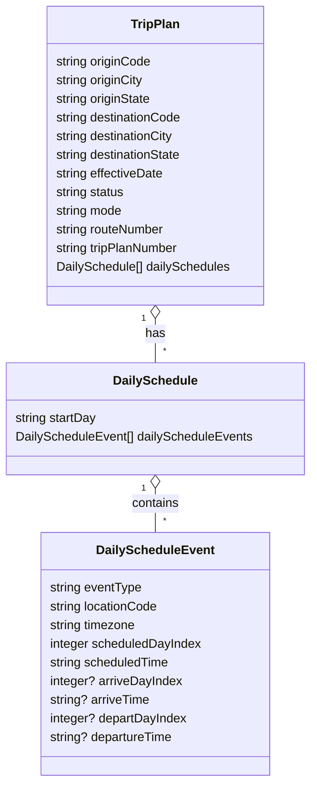

# Diagram: shipment_core/shipment_trip_plan_service/shipment_trip_plan_service/common/json_schema/trip_plan_schema.py

> Auto-generated by Obscura crawlers

## Mermaid

### SVG

<svg id="container" width="397.9375" xmlns="http://www.w3.org/2000/svg" class="classDiagram" height="1004" viewBox="0 0 397.9375 1004" role="graphics-document document" aria-roledescription="class"><g><defs><marker id="container_class-aggregationStart" class="marker aggregation class" refX="18" refY="7" markerWidth="190" markerHeight="240" orient="auto"><path d="M 18,7 L9,13 L1,7 L9,1 Z"></path></marker></defs><defs><marker id="container_class-aggregationEnd" class="marker aggregation class" refX="1" refY="7" markerWidth="20" markerHeight="28" orient="auto"><path d="M 18,7 L9,13 L1,7 L9,1 Z"></path></marker></defs><defs><marker id="container_class-extensionStart" class="marker extension class" refX="18" refY="7" markerWidth="190" markerHeight="240" orient="auto"><path d="M 1,7 L18,13 V 1 Z"></path></marker></defs><defs><marker id="container_class-extensionEnd" class="marker extension class" refX="1" refY="7" markerWidth="20" markerHeight="28" orient="auto"><path d="M 1,1 V 13 L18,7 Z"></path></marker></defs><defs><marker id="container_class-compositionStart" class="marker composition class" refX="18" refY="7" markerWidth="190" markerHeight="240" orient="auto"><path d="M 18,7 L9,13 L1,7 L9,1 Z"></path></marker></defs><defs><marker id="container_class-compositionEnd" class="marker composition class" refX="1" refY="7" markerWidth="20" markerHeight="28" orient="auto"><path d="M 18,7 L9,13 L1,7 L9,1 Z"></path></marker></defs><defs><marker id="container_class-dependencyStart" class="marker dependency class" refX="6" refY="7" markerWidth="190" markerHeight="240" orient="auto"><path d="M 5,7 L9,13 L1,7 L9,1 Z"></path></marker></defs><defs><marker id="container_class-dependencyEnd" class="marker dependency class" refX="13" refY="7" markerWidth="20" markerHeight="28" orient="auto"><path d="M 18,7 L9,13 L14,7 L9,1 Z"></path></marker></defs><defs><marker id="container_class-lollipopStart" class="marker lollipop class" refX="13" refY="7" markerWidth="190" markerHeight="240" orient="auto"><circle stroke="black" fill="transparent" cx="7" cy="7" r="6"></circle></marker></defs><defs><marker id="container_class-lollipopEnd" class="marker lollipop class" refX="1" refY="7" markerWidth="190" markerHeight="240" orient="auto"><circle stroke="black" fill="transparent" cx="7" cy="7" r="6"></circle></marker></defs><g class="root"><g class="clusters"></g><g class="edgePaths"><path d="M198.969,409.25L198.969,412.542C198.969,415.833,198.969,422.417,198.969,431.875C198.969,441.333,198.969,453.667,198.969,459.833L198.969,466" id="id_TripPlan_DailySchedule_1" class="edge-thickness-normal edge-pattern-solid relation" style=";;;" data-edge="true" data-et="edge" data-id="id_TripPlan_DailySchedule_1" data-points="W3sieCI6MTk4Ljk2ODc1LCJ5IjozOTJ9LHsieCI6MTk4Ljk2ODc1LCJ5Ijo0Mjl9LHsieCI6MTk4Ljk2ODc1LCJ5Ijo0NjZ9XQ==" marker-start="url(#container_class-aggregationStart)"></path><path d="M198.969,627.25L198.969,630.542C198.969,633.833,198.969,640.417,198.969,649.875C198.969,659.333,198.969,671.667,198.969,677.833L198.969,684" id="id_DailySchedule_DailyScheduleEvent_2" class="edge-thickness-normal edge-pattern-solid relation" style=";;;" data-edge="true" data-et="edge" data-id="id_DailySchedule_DailyScheduleEvent_2" data-points="W3sieCI6MTk4Ljk2ODc1LCJ5Ijo2MTB9LHsieCI6MTk4Ljk2ODc1LCJ5Ijo2NDd9LHsieCI6MTk4Ljk2ODc1LCJ5Ijo2ODR9XQ==" marker-start="url(#container_class-aggregationStart)"></path></g><g class="edgeLabels"><g class="edgeLabel" transform="translate(198.96875, 429)"><g class="label" data-id="id_TripPlan_DailySchedule_1" transform="translate(-12.703125, -12)"><foreignObject width="25.40625" height="24">

has

</foreignObject></g></g><g class="edgeLabel" transform="translate(198.96875, 647)"><g class="label" data-id="id_DailySchedule_DailyScheduleEvent_2" transform="translate(-30.890625, -12)"><foreignObject width="61.78125" height="24">

contains

</foreignObject></g></g><g class="edgeTerminals" transform="translate(183.96875, 409.5)"><g class="inner" transform="translate(0, 0)"><foreignObject style="width: 9px; height: 12px;">
1
</foreignObject></g></g><g class="edgeTerminals" transform="translate(183.96875, 627.5)"><g class="inner" transform="translate(0, 0)"><foreignObject style="width: 9px; height: 12px;">
1
</foreignObject></g></g><g class="edgeTerminals" transform="translate(208.96875, 443.5)"><g class="inner" transform="translate(0, 0)"></g><foreignObject style="width: 9px; height: 12px;">
*
</foreignObject></g><g class="edgeTerminals" transform="translate(208.96875, 661.5)"><g class="inner" transform="translate(0, 0)"></g><foreignObject style="width: 9px; height: 12px;">
*
</foreignObject></g></g><g class="nodes"><g class="node default" id="classId-TripPlan-0" transform="translate(198.96875, 200)"><g class="basic label-container"><path d="M-140.34765625 -192 L140.34765625 -192 L140.34765625 192 L-140.34765625 192" stroke="none" stroke-width="0" fill="#ECECFF" style=""></path><path d="M-140.34765625 -192 C-55.615790473249874 -192, 29.116075303500253 -192, 140.34765625 -192 M-140.34765625 -192 C-39.19413175242464 -192, 61.95939274515072 -192, 140.34765625 -192 M140.34765625 -192 C140.34765625 -98.03744829919171, 140.34765625 -4.074896598383418, 140.34765625 192 M140.34765625 -192 C140.34765625 -87.58597791283074, 140.34765625 16.828044174338515, 140.34765625 192 M140.34765625 192 C48.967511515874705 192, -42.41263321825059 192, -140.34765625 192 M140.34765625 192 C34.90330989747876 192, -70.54103645504247 192, -140.34765625 192 M-140.34765625 192 C-140.34765625 44.74882514770428, -140.34765625 -102.50234970459144, -140.34765625 -192 M-140.34765625 192 C-140.34765625 39.77323936928707, -140.34765625 -112.45352126142586, -140.34765625 -192" stroke="#9370DB" stroke-width="1.3" fill="none" stroke-dasharray="0 0" style=""></path></g><g class="annotation-group text" transform="translate(0, -168)"></g><g class="label-group text" transform="translate(-30.3828125, -168)"><g class="label" style="font-weight: bolder" transform="translate(0,-12)"><foreignObject width="60.765625" height="24">

TripPlan

</foreignObject></g></g><g class="members-group text" transform="translate(-128.34765625, -120)"><g class="label" style="" transform="translate(0,-12)"><foreignObject width="124.390625" height="24">

string originCode

</foreignObject></g><g class="label" style="" transform="translate(0,12)"><foreignObject width="115.15625" height="24">

string originCity

</foreignObject></g><g class="label" style="" transform="translate(0,36)"><foreignObject width="125.46875" height="24">

string originState

</foreignObject></g><g class="label" style="" transform="translate(0,60)"><foreignObject width="165.28125" height="24">

string destinationCode

</foreignObject></g><g class="label" style="" transform="translate(0,84)"><foreignObject width="156.0625" height="24">

string destinationCity

</foreignObject></g><g class="label" style="" transform="translate(0,108)"><foreignObject width="166.359375" height="24">

string destinationState

</foreignObject></g><g class="label" style="" transform="translate(0,132)"><foreignObject width="141.453125" height="24">

string effectiveDate

</foreignObject></g><g class="label" style="" transform="translate(0,156)"><foreignObject width="90.28125" height="24">

string status

</foreignObject></g><g class="label" style="" transform="translate(0,180)"><foreignObject width="87.21875" height="24">

string mode

</foreignObject></g><g class="label" style="" transform="translate(0,204)"><foreignObject width="142.84375" height="24">

string routeNumber

</foreignObject></g><g class="label" style="" transform="translate(0,228)"><foreignObject width="162.03125" height="24">

string tripPlanNumber

</foreignObject></g><g class="label" style="" transform="translate(0,252)"><foreignObject width="226.3125" height="24">

DailySchedule[] dailySchedules

</foreignObject></g></g><g class="methods-group text" transform="translate(-128.34765625, 192)"></g><g class="divider" style=""><path d="M-140.34765625 -144 C-36.60841706156296 -144, 67.13082212687408 -144, 140.34765625 -144 M-140.34765625 -144 C-48.020552048791686 -144, 44.30655215241663 -144, 140.34765625 -144" stroke="#9370DB" stroke-width="1.3" fill="none" stroke-dasharray="0 0" style=""></path></g><g class="divider" style=""><path d="M-140.34765625 168 C-48.57355225032525 168, 43.2005517493495 168, 140.34765625 168 M-140.34765625 168 C-28.70620786831188 168, 82.93524051337624 168, 140.34765625 168" stroke="#9370DB" stroke-width="1.3" fill="none" stroke-dasharray="0 0" style=""></path></g></g><g class="node default" id="classId-DailySchedule-1" transform="translate(198.96875, 538)"><g class="basic label-container"><path d="M-190.96875 -72 L190.96875 -72 L190.96875 72 L-190.96875 72" stroke="none" stroke-width="0" fill="#ECECFF" style=""></path><path d="M-190.96875 -72 C-80.57960958840889 -72, 29.80953082318223 -72, 190.96875 -72 M-190.96875 -72 C-65.23881741811222 -72, 60.49111516377556 -72, 190.96875 -72 M190.96875 -72 C190.96875 -42.13907753142189, 190.96875 -12.278155062843787, 190.96875 72 M190.96875 -72 C190.96875 -28.774154112637902, 190.96875 14.451691774724196, 190.96875 72 M190.96875 72 C67.02675142713836 72, -56.91524714572327 72, -190.96875 72 M190.96875 72 C82.49472235979573 72, -25.97930528040854 72, -190.96875 72 M-190.96875 72 C-190.96875 40.76650144449361, -190.96875 9.533002888987227, -190.96875 -72 M-190.96875 72 C-190.96875 22.97036442702992, -190.96875 -26.05927114594016, -190.96875 -72" stroke="#9370DB" stroke-width="1.3" fill="none" stroke-dasharray="0 0" style=""></path></g><g class="annotation-group text" transform="translate(0, -48)"></g><g class="label-group text" transform="translate(-51.78125, -48)"><g class="label" style="font-weight: bolder" transform="translate(0,-12)"><foreignObject width="103.5625" height="24">

DailySchedule

</foreignObject></g></g><g class="members-group text" transform="translate(-178.96875, 0)"><g class="label" style="" transform="translate(0,-12)"><foreignObject width="106.15625" height="24">

string startDay

</foreignObject></g><g class="label" style="" transform="translate(0,12)"><foreignObject width="306.15625" height="24">

DailyScheduleEvent[] dailyScheduleEvents

</foreignObject></g></g><g class="methods-group text" transform="translate(-178.96875, 72)"></g><g class="divider" style=""><path d="M-190.96875 -24 C-74.305769564083 -24, 42.35721087183401 -24, 190.96875 -24 M-190.96875 -24 C-42.141532556532354 -24, 106.68568488693529 -24, 190.96875 -24" stroke="#9370DB" stroke-width="1.3" fill="none" stroke-dasharray="0 0" style=""></path></g><g class="divider" style=""><path d="M-190.96875 48 C-75.61983648596255 48, 39.7290770280749 48, 190.96875 48 M-190.96875 48 C-87.33887420839737 48, 16.291001583205258 48, 190.96875 48" stroke="#9370DB" stroke-width="1.3" fill="none" stroke-dasharray="0 0" style=""></path></g></g><g class="node default" id="classId-DailyScheduleEvent-2" transform="translate(198.96875, 840)"><g class="basic label-container"><path d="M-146.40625 -156 L146.40625 -156 L146.40625 156 L-146.40625 156" stroke="none" stroke-width="0" fill="#ECECFF" style=""></path><path d="M-146.40625 -156 C-84.13658111656082 -156, -21.866912233121653 -156, 146.40625 -156 M-146.40625 -156 C-51.029617239969724 -156, 44.34701552006055 -156, 146.40625 -156 M146.40625 -156 C146.40625 -31.711777898328705, 146.40625 92.57644420334259, 146.40625 156 M146.40625 -156 C146.40625 -86.22420052387452, 146.40625 -16.44840104774903, 146.40625 156 M146.40625 156 C50.81365642945511 156, -44.778937141089784 156, -146.40625 156 M146.40625 156 C87.5723582885357 156, 28.738466577071378 156, -146.40625 156 M-146.40625 156 C-146.40625 33.236943565135064, -146.40625 -89.52611286972987, -146.40625 -156 M-146.40625 156 C-146.40625 36.755463806435245, -146.40625 -82.48907238712951, -146.40625 -156" stroke="#9370DB" stroke-width="1.3" fill="none" stroke-dasharray="0 0" style=""></path></g><g class="annotation-group text" transform="translate(0, -132)"></g><g class="label-group text" transform="translate(-71.984375, -132)"><g class="label" style="font-weight: bolder" transform="translate(0,-12)"><foreignObject width="143.96875" height="24">

DailyScheduleEvent

</foreignObject></g></g><g class="members-group text" transform="translate(-134.40625, -84)"><g class="label" style="" transform="translate(0,-12)"><foreignObject width="119.9375" height="24">

string eventType

</foreignObject></g><g class="label" style="" transform="translate(0,12)"><foreignObject width="141.296875" height="24">

string locationCode

</foreignObject></g><g class="label" style="" transform="translate(0,36)"><foreignObject width="112.8125" height="24">

string timezone

</foreignObject></g><g class="label" style="" transform="translate(0,60)"><foreignObject width="196.828125" height="24">

integer scheduledDayIndex

</foreignObject></g><g class="label" style="" transform="translate(0,84)"><foreignObject width="156.09375" height="24">

string scheduledTime

</foreignObject></g><g class="label" style="" transform="translate(0,108)"><foreignObject width="170.796875" height="24">

integer? arriveDayIndex

</foreignObject></g><g class="label" style="" transform="translate(0,132)"><foreignObject width="130.21875" height="24">

string? arriveTime

</foreignObject></g><g class="label" style="" transform="translate(0,156)"><foreignObject width="176.984375" height="24">

integer? departDayIndex

</foreignObject></g><g class="label" style="" transform="translate(0,180)"><foreignObject width="160.140625" height="24">

string? departureTime

</foreignObject></g></g><g class="methods-group text" transform="translate(-134.40625, 156)"></g><g class="divider" style=""><path d="M-146.40625 -108 C-66.41918495140094 -108, 13.567880097198127 -108, 146.40625 -108 M-146.40625 -108 C-47.86015744129257 -108, 50.68593511741486 -108, 146.40625 -108" stroke="#9370DB" stroke-width="1.3" fill="none" stroke-dasharray="0 0" style=""></path></g><g class="divider" style=""><path d="M-146.40625 132 C-41.4847043344777 132, 63.436841331044604 132, 146.40625 132 M-146.40625 132 C-43.7238036461178 132, 58.9586427077644 132, 146.40625 132" stroke="#9370DB" stroke-width="1.3" fill="none" stroke-dasharray="0 0" style=""></path></g></g></g></g></g></svg>
