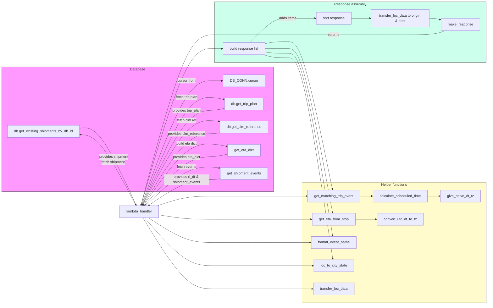

# Diagram: shipment_core/shipment_trip_plan_service/shipment_trip_plan_service/trip_plan/get_shipment_trip_plan.py

> Auto-generated by Obscura crawlers

## Mermaid

### SVG

<svg id="container" width="2209.34375" xmlns="http://www.w3.org/2000/svg" class="flowchart" height="1365" viewBox="0 0 2209.34375 1365" role="graphics-document document" aria-roledescription="flowchart-v2"><g><marker id="container_flowchart-v2-pointEnd" class="marker flowchart-v2" viewBox="0 0 10 10" refX="5" refY="5" markerUnits="userSpaceOnUse" markerWidth="8" markerHeight="8" orient="auto"><path d="M 0 0 L 10 5 L 0 10 z" class="arrowMarkerPath" style="stroke-width: 1; stroke-dasharray: 1, 0;"></path></marker><marker id="container_flowchart-v2-pointStart" class="marker flowchart-v2" viewBox="0 0 10 10" refX="4.5" refY="5" markerUnits="userSpaceOnUse" markerWidth="8" markerHeight="8" orient="auto"><path d="M 0 5 L 10 10 L 10 0 z" class="arrowMarkerPath" style="stroke-width: 1; stroke-dasharray: 1, 0;"></path></marker><marker id="container_flowchart-v2-circleEnd" class="marker flowchart-v2" viewBox="0 0 10 10" refX="11" refY="5" markerUnits="userSpaceOnUse" markerWidth="11" markerHeight="11" orient="auto"><circle cx="5" cy="5" r="5" class="arrowMarkerPath" style="stroke-width: 1; stroke-dasharray: 1, 0;"></circle></marker><marker id="container_flowchart-v2-circleStart" class="marker flowchart-v2" viewBox="0 0 10 10" refX="-1" refY="5" markerUnits="userSpaceOnUse" markerWidth="11" markerHeight="11" orient="auto"><circle cx="5" cy="5" r="5" class="arrowMarkerPath" style="stroke-width: 1; stroke-dasharray: 1, 0;"></circle></marker><marker id="container_flowchart-v2-crossEnd" class="marker cross flowchart-v2" viewBox="0 0 11 11" refX="12" refY="5.2" markerUnits="userSpaceOnUse" markerWidth="11" markerHeight="11" orient="auto"><path d="M 1,1 l 9,9 M 10,1 l -9,9" class="arrowMarkerPath" style="stroke-width: 2; stroke-dasharray: 1, 0;"></path></marker><marker id="container_flowchart-v2-crossStart" class="marker cross flowchart-v2" viewBox="0 0 11 11" refX="-1" refY="5.2" markerUnits="userSpaceOnUse" markerWidth="11" markerHeight="11" orient="auto"><path d="M 1,1 l 9,9 M 10,1 l -9,9" class="arrowMarkerPath" style="stroke-width: 2; stroke-dasharray: 1, 0;"></path></marker><g class="root"><g class="clusters"><g class="cluster" id="Response" data-look="classic"><rect style="fill:#ccffec !important;stroke:#333 !important;stroke-width:1px !important" x="975.71875" y="8" width="1225.625" height="272"></rect><g class="cluster-label" transform="translate(1517.5546875, 8)"><foreignObject width="141.953125" height="24">

Response assembly

</foreignObject></g></g><g class="cluster" id="Utils" data-look="classic"><rect style="fill:#fffbcc !important;stroke:#333 !important;stroke-width:1px !important" x="1370.9375" y="817" width="830.40625" height="540"></rect><g class="cluster-label" transform="translate(1725.5859375, 817)"><foreignObject width="121.109375" height="24">

Helper functions

</foreignObject></g></g><g class="cluster" id="DB" data-look="classic"><rect style="fill:#f9f !important;stroke:#333 !important;stroke-width:1px !important" x="8" y="300" width="1233.421875" height="559"></rect><g class="cluster-label" transform="translate(591.0625, 300)"><foreignObject width="67.296875" height="24">

Database

</foreignObject></g></g></g><g class="edgePaths"><path d="M645.772,922L679.93,828.667C714.088,735.333,782.403,548.667,837.394,455.333C892.385,362,934.052,362,961.496,362C988.94,362,1002.161,362,1008.772,362L1015.383,362" id="L_Lambda_DB_CONN_0" class="edge-thickness-normal edge-pattern-solid edge-thickness-normal edge-pattern-solid flowchart-link" style=";" data-edge="true" data-et="edge" data-id="L_Lambda_DB_CONN_0" data-points="W3sieCI6NjQ1Ljc3MTk4Njc5NzI3NDMsInkiOjkyMn0seyJ4Ijo4NTAuNzE4NzUsInkiOjM2Mn0seyJ4Ijo5NzUuNzE4NzUsInkiOjM2Mn0seyJ4IjoxMDE5LjM4MjgxMjUsInkiOjM2Mn1d" marker-end="url(#container_flowchart-v2-pointEnd)"></path><path d="M621.313,922L593.329,870.167C565.344,818.333,509.375,714.667,466.612,661.566C423.849,608.465,394.292,605.93,379.514,604.663L364.735,603.396" id="L_Lambda_DB_GET_SHIPMENTS_0" class="edge-thickness-normal edge-pattern-solid edge-thickness-normal edge-pattern-solid flowchart-link" style=";" data-edge="true" data-et="edge" data-id="L_Lambda_DB_GET_SHIPMENTS_0" data-points="W3sieCI6NjIxLjMxMzQ3MDc4NDAyMzcsInkiOjkyMn0seyJ4Ijo0NTMuNDA2MjUsInkiOjYxMX0seyJ4IjozNjAuNzUsInkiOjYwMy4wNTM4NDMzNDI2NzI2fV0=" marker-end="url(#container_flowchart-v2-pointEnd)"></path><path d="M647.197,922L681.118,841C715.038,760,782.878,598,837.632,517C892.385,436,934.052,436,961.434,437.479C988.817,438.958,1001.914,441.915,1008.463,443.394L1015.012,444.873" id="L_Lambda_DB_GET_TRIP_0" class="edge-thickness-normal edge-pattern-solid edge-thickness-normal edge-pattern-solid flowchart-link" style=";" data-edge="true" data-et="edge" data-id="L_Lambda_DB_GET_TRIP_0" data-points="W3sieCI6NjQ3LjE5NzM2ODQyMTA1MjYsInkiOjkyMn0seyJ4Ijo4NTAuNzE4NzUsInkiOjQzNn0seyJ4Ijo5NzUuNzE4NzUsInkiOjQzNn0seyJ4IjoxMDE4LjkxNDA2MjUsInkiOjQ0NS43NTQxODk5NDQxMzQwNX1d" marker-end="url(#container_flowchart-v2-pointEnd)"></path><path d="M650.072,922L683.513,858.333C716.955,794.667,783.837,667.333,838.111,603.667C892.385,540,934.052,540,958.402,540.794C982.751,541.588,989.784,543.176,993.301,543.97L996.817,544.764" id="L_Lambda_DB_GET_CLM_0" class="edge-thickness-normal edge-pattern-solid edge-thickness-normal edge-pattern-solid flowchart-link" style=";" data-edge="true" data-et="edge" data-id="L_Lambda_DB_GET_CLM_0" data-points="W3sieCI6NjUwLjA3MjQzMjc2MjgzNjIsInkiOjkyMn0seyJ4Ijo4NTAuNzE4NzUsInkiOjU0MH0seyJ4Ijo5NzUuNzE4NzUsInkiOjU0MH0seyJ4IjoxMDAwLjcxODc1LCJ5Ijo1NDUuNjQ1Mzk4NDEyMjMxN31d" marker-end="url(#container_flowchart-v2-pointEnd)"></path><path d="M654.908,922L687.543,875.667C720.178,829.333,785.449,736.667,838.917,690.333C892.385,644,934.052,644,963.947,646.046C993.843,648.093,1011.967,652.185,1021.028,654.232L1030.09,656.278" id="L_Lambda_DB_GET_ETA_0" class="edge-thickness-normal edge-pattern-solid edge-thickness-normal edge-pattern-solid flowchart-link" style=";" data-edge="true" data-et="edge" data-id="L_Lambda_DB_GET_ETA_0" data-points="W3sieCI6NjU0LjkwODE5NjcyMTMxMTUsInkiOjkyMn0seyJ4Ijo4NTAuNzE4NzUsInkiOjY0NH0seyJ4Ijo5NzUuNzE4NzUsInkiOjY0NH0seyJ4IjoxMDMzLjk5MjE4NzUsInkiOjY1Ny4xNTkwNzA4NjE1MTEzfV0=" marker-end="url(#container_flowchart-v2-pointEnd)"></path><path d="M664.748,922L695.743,893C726.738,864,788.729,806,840.557,777C892.385,748,934.052,748,958.449,748.805C982.845,749.609,989.972,751.219,993.535,752.023L997.098,752.828" id="L_Lambda_DB_GET_SHIP_EVENTS_0" class="edge-thickness-normal edge-pattern-solid edge-thickness-normal edge-pattern-solid flowchart-link" style=";" data-edge="true" data-et="edge" data-id="L_Lambda_DB_GET_SHIP_EVENTS_0" data-points="W3sieCI6NjY0Ljc0ODEzNDMyODM1ODIsInkiOjkyMn0seyJ4Ijo4NTAuNzE4NzUsInkiOjc0OH0seyJ4Ijo5NzUuNzE4NzUsInkiOjc0OH0seyJ4IjoxMDAxLCJ5Ijo3NTMuNzA4OTA5MTQ0MzY5M31d" marker-end="url(#container_flowchart-v2-pointEnd)"></path><path d="M1001,800.672L996.786,801.56C992.573,802.448,984.146,804.224,959.099,805.112C934.052,806,892.385,806,843.063,824.964C793.74,843.928,736.761,881.856,708.272,900.82L679.782,919.784" id="L_DB_GET_SHIP_EVENTS_Lambda_0" class="edge-thickness-normal edge-pattern-solid edge-thickness-normal edge-pattern-solid flowchart-link" style=";" data-edge="true" data-et="edge" data-id="L_DB_GET_SHIP_EVENTS_Lambda_0" data-points="W3sieCI6MTAwMSwieSI6ODAwLjY3MTY4NDc5ODU4ODd9LHsieCI6OTc1LjcxODc1LCJ5Ijo4MDZ9LHsieCI6ODUwLjcxODc1LCJ5Ijo4MDZ9LHsieCI6Njc2LjQ1MjU3ODY3MTMyODYsInkiOjkyMn1d" marker-end="url(#container_flowchart-v2-pointEnd)"></path><path d="M1033.992,690.841L1024.28,693.034C1014.568,695.227,995.143,699.614,964.598,701.807C934.052,704,892.385,704,840.133,739.832C787.88,775.664,725.041,847.328,693.622,883.16L662.203,918.992" id="L_DB_GET_ETA_Lambda_0" class="edge-thickness-normal edge-pattern-solid edge-thickness-normal edge-pattern-solid flowchart-link" style=";" data-edge="true" data-et="edge" data-id="L_DB_GET_ETA_Lambda_0" data-points="W3sieCI6MTAzMy45OTIxODc1LCJ5Ijo2OTAuODQwOTI5MTM4NDg4N30seyJ4Ijo5NzUuNzE4NzUsInkiOjcwNH0seyJ4Ijo4NTAuNzE4NzUsInkiOjcwNH0seyJ4Ijo2NTkuNTY1NTYxMjI0NDg5OCwieSI6OTIyfV0=" marker-end="url(#container_flowchart-v2-pointEnd)"></path><path d="M1000.719,594.355L996.552,595.296C992.385,596.236,984.052,598.118,959.052,599.059C934.052,600,892.385,600,838.867,653.099C785.348,706.198,719.978,812.396,687.293,865.495L654.607,918.594" id="L_DB_GET_CLM_Lambda_0" class="edge-thickness-normal edge-pattern-solid edge-thickness-normal edge-pattern-solid flowchart-link" style=";" data-edge="true" data-et="edge" data-id="L_DB_GET_CLM_Lambda_0" data-points="W3sieCI6MTAwMC43MTg3NSwieSI6NTk0LjM1NDYwMTU4Nzc2ODN9LHsieCI6OTc1LjcxODc1LCJ5Ijo2MDB9LHsieCI6ODUwLjcxODc1LCJ5Ijo2MDB9LHsieCI6NjUyLjUxMDU2NTkwMjU3ODgsInkiOjkyMn1d" marker-end="url(#container_flowchart-v2-pointEnd)"></path><path d="M1018.914,486.246L1011.715,487.872C1004.516,489.497,990.117,492.749,962.085,494.374C934.052,496,892.385,496,838.167,566.398C783.949,636.795,717.179,777.591,683.794,847.988L650.409,918.386" id="L_DB_GET_TRIP_Lambda_0" class="edge-thickness-normal edge-pattern-solid edge-thickness-normal edge-pattern-solid flowchart-link" style=";" data-edge="true" data-et="edge" data-id="L_DB_GET_TRIP_Lambda_0" data-points="W3sieCI6MTAxOC45MTQwNjI1LCJ5Ijo0ODYuMjQ1ODEwMDU1ODY1OTV9LHsieCI6OTc1LjcxODc1LCJ5Ijo0OTZ9LHsieCI6ODUwLjcxODc1LCJ5Ijo0OTZ9LHsieCI6NjQ4LjY5NDk1MDMzMTEyNTgsInkiOjkyMn1d" marker-end="url(#container_flowchart-v2-pointEnd)"></path><path d="M360.75,574.946L376.193,573.622C391.635,572.297,422.521,569.649,465.941,626.889C509.36,684.13,565.314,801.26,593.291,859.826L621.268,918.391" id="L_DB_GET_SHIPMENTS_Lambda_0" class="edge-thickness-normal edge-pattern-solid edge-thickness-normal edge-pattern-solid flowchart-link" style=";" data-edge="true" data-et="edge" data-id="L_DB_GET_SHIPMENTS_Lambda_0" data-points="W3sieCI6MzYwLjc1LCJ5Ijo1NzQuOTQ2MTU2NjU3MzI3NH0seyJ4Ijo0NTMuNDA2MjUsInkiOjU2N30seyJ4Ijo2MjIuOTkyNTE0NzI1MTMxLCJ5Ijo5MjJ9XQ==" marker-end="url(#container_flowchart-v2-pointEnd)"></path><path d="M718.753,922L740.747,914.833C762.742,907.667,806.73,893.333,849.558,886.167C892.385,879,934.052,879,977.027,879C1020.003,879,1064.286,879,1108.57,879C1152.854,879,1197.138,879,1230.073,879C1263.008,879,1284.594,879,1306.18,879C1327.766,879,1349.352,879,1363.645,879C1377.938,879,1384.938,879,1388.438,879L1391.938,879" id="L_Lambda_MATCH_0" class="edge-thickness-normal edge-pattern-solid edge-thickness-normal edge-pattern-solid flowchart-link" style=";" data-edge="true" data-et="edge" data-id="L_Lambda_MATCH_0" data-points="W3sieCI6NzE4Ljc1MjkwMTc4NTcxNDIsInkiOjkyMn0seyJ4Ijo4NTAuNzE4NzUsInkiOjg3OX0seyJ4Ijo5NzUuNzE4NzUsInkiOjg3OX0seyJ4IjoxMTA4LjU3MDMxMjUsInkiOjg3OX0seyJ4IjoxMjQxLjQyMTg3NSwieSI6ODc5fSx7IngiOjEzMDYuMTc5Njg3NSwieSI6ODc5fSx7IngiOjEzNzAuOTM3NSwieSI6ODc5fSx7IngiOjEzOTUuOTM3NSwieSI6ODc5fV0=" marker-end="url(#container_flowchart-v2-pointEnd)"></path><path d="M1636.063,879L1640.229,879C1644.396,879,1652.729,879,1661.335,879C1669.94,879,1678.818,879,1683.257,879L1687.695,879" id="L_MATCH_CALC_0" class="edge-thickness-normal edge-pattern-solid edge-thickness-normal edge-pattern-solid flowchart-link" style=";" data-edge="true" data-et="edge" data-id="L_MATCH_CALC_0" data-points="W3sieCI6MTYzNi4wNjI1LCJ5Ijo4Nzl9LHsieCI6MTY2MS4wNjI1LCJ5Ijo4Nzl9LHsieCI6MTY5MS42OTUzMTI1LCJ5Ijo4Nzl9XQ==" marker-end="url(#container_flowchart-v2-pointEnd)"></path><path d="M1940.43,879L1945.535,879C1950.641,879,1960.852,879,1969.457,879C1978.063,879,1985.063,879,1988.563,879L1992.063,879" id="L_CALC_GIVE_0" class="edge-thickness-normal edge-pattern-solid edge-thickness-normal edge-pattern-solid flowchart-link" style=";" data-edge="true" data-et="edge" data-id="L_CALC_GIVE_0" data-points="W3sieCI6MTk0MC40Mjk2ODc1LCJ5Ijo4Nzl9LHsieCI6MTk3MS4wNjI1LCJ5Ijo4Nzl9LHsieCI6MTk5Ni4wNjI1LCJ5Ijo4Nzl9XQ==" marker-end="url(#container_flowchart-v2-pointEnd)"></path><path d="M725.719,963.217L746.552,966.514C767.385,969.811,809.052,976.406,850.719,979.703C892.385,983,934.052,983,977.027,983C1020.003,983,1064.286,983,1108.57,983C1152.854,983,1197.138,983,1230.073,983C1263.008,983,1284.594,983,1306.18,983C1327.766,983,1349.352,983,1367.327,983C1385.302,983,1399.667,983,1406.849,983L1414.031,983" id="L_Lambda_ETA_0" class="edge-thickness-normal edge-pattern-solid edge-thickness-normal edge-pattern-solid flowchart-link" style=";" data-edge="true" data-et="edge" data-id="L_Lambda_ETA_0" data-points="W3sieCI6NzI1LjcxODc1LCJ5Ijo5NjMuMjE2NzQzMDM1ODU3MX0seyJ4Ijo4NTAuNzE4NzUsInkiOjk4M30seyJ4Ijo5NzUuNzE4NzUsInkiOjk4M30seyJ4IjoxMTA4LjU3MDMxMjUsInkiOjk4M30seyJ4IjoxMjQxLjQyMTg3NSwieSI6OTgzfSx7IngiOjEzMDYuMTc5Njg3NSwieSI6OTgzfSx7IngiOjEzNzAuOTM3NSwieSI6OTgzfSx7IngiOjE0MTguMDMxMjUsInkiOjk4M31d" marker-end="url(#container_flowchart-v2-pointEnd)"></path><path d="M1613.969,983L1621.818,983C1629.667,983,1645.365,983,1660.747,983C1676.13,983,1691.198,983,1698.732,983L1706.266,983" id="L_ETA_CONVERT_0" class="edge-thickness-normal edge-pattern-solid edge-thickness-normal edge-pattern-solid flowchart-link" style=";" data-edge="true" data-et="edge" data-id="L_ETA_CONVERT_0" data-points="W3sieCI6MTYxMy45Njg3NSwieSI6OTgzfSx7IngiOjE2NjEuMDYyNSwieSI6OTgzfSx7IngiOjE3MTAuMjY1NjI1LCJ5Ijo5ODN9XQ==" marker-end="url(#container_flowchart-v2-pointEnd)"></path><path d="M677.922,976L706.722,994.5C735.521,1013,793.12,1050,842.753,1068.5C892.385,1087,934.052,1087,977.027,1087C1020.003,1087,1064.286,1087,1108.57,1087C1152.854,1087,1197.138,1087,1230.073,1087C1263.008,1087,1284.594,1087,1306.18,1087C1327.766,1087,1349.352,1087,1366.48,1087C1383.609,1087,1396.281,1087,1402.617,1087L1408.953,1087" id="L_Lambda_FORMAT_0" class="edge-thickness-normal edge-pattern-solid edge-thickness-normal edge-pattern-solid flowchart-link" style=";" data-edge="true" data-et="edge" data-id="L_Lambda_FORMAT_0" data-points="W3sieCI6Njc3LjkyMjIxNDY3MzkxMywieSI6OTc2fSx7IngiOjg1MC43MTg3NSwieSI6MTA4N30seyJ4Ijo5NzUuNzE4NzUsInkiOjEwODd9LHsieCI6MTEwOC41NzAzMTI1LCJ5IjoxMDg3fSx7IngiOjEyNDEuNDIxODc1LCJ5IjoxMDg3fSx7IngiOjEzMDYuMTc5Njg3NSwieSI6MTA4N30seyJ4IjoxMzcwLjkzNzUsInkiOjEwODd9LHsieCI6MTQxMi45NTMxMjUsInkiOjEwODd9XQ==" marker-end="url(#container_flowchart-v2-pointEnd)"></path><path d="M659.859,976L691.669,1011.833C723.479,1047.667,787.099,1119.333,839.742,1155.167C892.385,1191,934.052,1191,977.027,1191C1020.003,1191,1064.286,1191,1108.57,1191C1152.854,1191,1197.138,1191,1230.073,1191C1263.008,1191,1284.594,1191,1306.18,1191C1327.766,1191,1349.352,1191,1368.503,1191C1387.654,1191,1404.37,1191,1412.728,1191L1421.086,1191" id="L_Lambda_LOC_0" class="edge-thickness-normal edge-pattern-solid edge-thickness-normal edge-pattern-solid flowchart-link" style=";" data-edge="true" data-et="edge" data-id="L_Lambda_LOC_0" data-points="W3sieCI6NjU5Ljg1OTA1MjE2OTQyMTUsInkiOjk3Nn0seyJ4Ijo4NTAuNzE4NzUsInkiOjExOTF9LHsieCI6OTc1LjcxODc1LCJ5IjoxMTkxfSx7IngiOjExMDguNTcwMzEyNSwieSI6MTE5MX0seyJ4IjoxMjQxLjQyMTg3NSwieSI6MTE5MX0seyJ4IjoxMzA2LjE3OTY4NzUsInkiOjExOTF9LHsieCI6MTM3MC45Mzc1LCJ5IjoxMTkxfSx7IngiOjE0MjUuMDg1OTM3NSwieSI6MTE5MX1d" marker-end="url(#container_flowchart-v2-pointEnd)"></path><path d="M652.655,976L685.665,1029.167C718.676,1082.333,784.697,1188.667,838.541,1241.833C892.385,1295,934.052,1295,977.027,1295C1020.003,1295,1064.286,1295,1108.57,1295C1152.854,1295,1197.138,1295,1230.073,1295C1263.008,1295,1284.594,1295,1306.18,1295C1327.766,1295,1349.352,1295,1368.141,1295C1386.93,1295,1402.922,1295,1410.918,1295L1418.914,1295" id="L_Lambda_TRANSFER_0" class="edge-thickness-normal edge-pattern-solid edge-thickness-normal edge-pattern-solid flowchart-link" style=";" data-edge="true" data-et="edge" data-id="L_Lambda_TRANSFER_0" data-points="W3sieCI6NjUyLjY1NDY2OTQzNjQxNjIsInkiOjk3Nn0seyJ4Ijo4NTAuNzE4NzUsInkiOjEyOTV9LHsieCI6OTc1LjcxODc1LCJ5IjoxMjk1fSx7IngiOjExMDguNTcwMzEyNSwieSI6MTI5NX0seyJ4IjoxMjQxLjQyMTg3NSwieSI6MTI5NX0seyJ4IjoxMzA2LjE3OTY4NzUsInkiOjEyOTV9LHsieCI6MTM3MC45Mzc1LCJ5IjoxMjk1fSx7IngiOjE0MjIuOTE0MDYyNSwieSI6MTI5NX1d" marker-end="url(#container_flowchart-v2-pointEnd)"></path><path d="M643.825,922L678.308,804.667C712.79,687.333,781.754,452.667,837.07,335.333C892.385,218,934.052,218,960.132,218C986.211,218,996.703,218,1001.949,218L1007.195,218" id="L_Lambda_BUILD_0" class="edge-thickness-normal edge-pattern-solid edge-thickness-normal edge-pattern-solid flowchart-link" style=";" data-edge="true" data-et="edge" data-id="L_Lambda_BUILD_0" data-points="W3sieCI6NjQzLjgyNTQ1MzE0NjM3NDgsInkiOjkyMn0seyJ4Ijo4NTAuNzE4NzUsInkiOjIxOH0seyJ4Ijo5NzUuNzE4NzUsInkiOjIxOH0seyJ4IjoxMDExLjE5NTMxMjUsInkiOjIxOH1d" marker-end="url(#container_flowchart-v2-pointEnd)"></path><path d="M1205.945,195.278L1211.858,193.899C1217.771,192.519,1229.596,189.759,1246.302,188.38C1263.008,187,1284.594,187,1306.18,187C1327.766,187,1349.352,187,1383.242,297.181C1417.131,407.362,1463.325,627.723,1486.422,737.904L1509.519,848.085" id="L_BUILD_MATCH_0" class="edge-thickness-normal edge-pattern-solid edge-thickness-normal edge-pattern-solid flowchart-link" style=";" data-edge="true" data-et="edge" data-id="L_BUILD_MATCH_0" data-points="W3sieCI6MTIwNS45NDUzMTI1LCJ5IjoxOTUuMjc4MjEyMjkwNTAyNzh9LHsieCI6MTI0MS40MjE4NzUsInkiOjE4N30seyJ4IjoxMzA2LjE3OTY4NzUsInkiOjE4N30seyJ4IjoxMzcwLjkzNzUsInkiOjE4N30seyJ4IjoxNTEwLjM0MDA0Njk2NTMxOCwieSI6ODUyfV0=" marker-end="url(#container_flowchart-v2-pointEnd)"></path><path d="M1205.945,218L1211.858,218C1217.771,218,1229.596,218,1246.302,218C1263.008,218,1284.594,218,1306.18,218C1327.766,218,1349.352,218,1383.344,340.345C1417.337,462.69,1463.736,707.38,1486.935,829.725L1510.135,952.07" id="L_BUILD_ETA_0" class="edge-thickness-normal edge-pattern-solid edge-thickness-normal edge-pattern-solid flowchart-link" style=";" data-edge="true" data-et="edge" data-id="L_BUILD_ETA_0" data-points="W3sieCI6MTIwNS45NDUzMTI1LCJ5IjoyMTh9LHsieCI6MTI0MS40MjE4NzUsInkiOjIxOH0seyJ4IjoxMzA2LjE3OTY4NzUsInkiOjIxOH0seyJ4IjoxMzcwLjkzNzUsInkiOjIxOH0seyJ4IjoxNTEwLjg4MDE0NzA1ODgyMzUsInkiOjk1Nn1d" marker-end="url(#container_flowchart-v2-pointEnd)"></path><path d="M1205.945,233.392L1211.858,234.327C1217.771,235.261,1229.596,237.131,1246.302,238.065C1263.008,239,1284.594,239,1306.18,239C1327.766,239,1349.352,239,1383.439,375.176C1417.527,511.352,1464.117,783.705,1487.412,919.881L1510.707,1056.057" id="L_BUILD_FORMAT_0" class="edge-thickness-normal edge-pattern-solid edge-thickness-normal edge-pattern-solid flowchart-link" style=";" data-edge="true" data-et="edge" data-id="L_BUILD_FORMAT_0" data-points="W3sieCI6MTIwNS45NDUzMTI1LCJ5IjoyMzMuMzkyMTc4NzcwOTQ5NzN9LHsieCI6MTI0MS40MjE4NzUsInkiOjIzOX0seyJ4IjoxMzA2LjE3OTY4NzUsInkiOjIzOX0seyJ4IjoxMzcwLjkzNzUsInkiOjIzOX0seyJ4IjoxNTExLjM4MTI2NDc0MDU2NiwieSI6MTA2MH1d" marker-end="url(#container_flowchart-v2-pointEnd)"></path><path d="M1196.058,245L1203.619,247.333C1211.179,249.667,1226.301,254.333,1244.654,256.667C1263.008,259,1284.594,259,1306.18,259C1327.766,259,1349.352,259,1383.519,409.175C1417.686,559.349,1464.434,859.698,1487.808,1009.873L1511.182,1160.048" id="L_BUILD_LOC_0" class="edge-thickness-normal edge-pattern-solid edge-thickness-normal edge-pattern-solid flowchart-link" style=";" data-edge="true" data-et="edge" data-id="L_BUILD_LOC_0" data-points="W3sieCI6MTE5Ni4wNTc5MjY4MjkyNjg0LCJ5IjoyNDV9LHsieCI6MTI0MS40MjE4NzUsInkiOjI1OX0seyJ4IjoxMzA2LjE3OTY4NzUsInkiOjI1OX0seyJ4IjoxMzcwLjkzNzUsInkiOjI1OX0seyJ4IjoxNTExLjc5NzU0NTYwMDg1ODMsInkiOjExNjR9XQ==" marker-end="url(#container_flowchart-v2-pointEnd)"></path><path d="M1134.945,191L1152.691,172.833C1170.437,154.667,1205.93,118.333,1234.469,100.167C1263.008,82,1284.594,82,1306.18,82C1327.766,82,1349.352,82,1370.379,82C1391.406,82,1411.875,82,1422.109,82L1432.344,82" id="L_BUILD_SORT_0" class="edge-thickness-normal edge-pattern-solid edge-thickness-normal edge-pattern-solid flowchart-link" style=";" data-edge="true" data-et="edge" data-id="L_BUILD_SORT_0" data-points="W3sieCI6MTEzNC45NDUyNTUwNTUxNDcsInkiOjE5MX0seyJ4IjoxMjQxLjQyMTg3NSwieSI6ODJ9LHsieCI6MTMwNi4xNzk2ODc1LCJ5Ijo4Mn0seyJ4IjoxMzcwLjkzNzUsInkiOjgyfSx7IngiOjE0MzYuMzQzNzUsInkiOjgyfV0=" marker-end="url(#container_flowchart-v2-pointEnd)"></path><path d="M1595.656,82L1606.557,82C1617.458,82,1639.26,82,1653.661,82C1668.063,82,1675.063,82,1678.563,82L1682.063,82" id="L_SORT_FINAL_0" class="edge-thickness-normal edge-pattern-solid edge-thickness-normal edge-pattern-solid flowchart-link" style=";" data-edge="true" data-et="edge" data-id="L_SORT_FINAL_0" data-points="W3sieCI6MTU5NS42NTYyNSwieSI6ODJ9LHsieCI6MTY2MS4wNjI1LCJ5Ijo4Mn0seyJ4IjoxNjg2LjA2MjUsInkiOjgyfV0=" marker-end="url(#container_flowchart-v2-pointEnd)"></path><path d="M1946.063,82L1950.229,82C1954.396,82,1962.729,82,1970.98,82.993C1979.23,83.986,1987.398,85.973,1991.482,86.966L1995.566,87.959" id="L_FINAL_MAKE_0" class="edge-thickness-normal edge-pattern-solid edge-thickness-normal edge-pattern-solid flowchart-link" style=";" data-edge="true" data-et="edge" data-id="L_FINAL_MAKE_0" data-points="W3sieCI6MTk0Ni4wNjI1LCJ5Ijo4Mn0seyJ4IjoxOTcxLjA2MjUsInkiOjgyfSx7IngiOjE5OTkuNDUzMTI1LCJ5Ijo4OC45MDQwNTc1MzgzMzYyOH1d" marker-end="url(#container_flowchart-v2-pointEnd)"></path><path d="M2018.621,137L2010.694,140.167C2002.768,143.333,1986.915,149.667,1953.156,152.833C1919.396,156,1867.729,156,1816.063,156C1764.396,156,1712.729,156,1662.719,156C1612.708,156,1564.354,156,1516,156C1467.646,156,1419.292,156,1384.322,156C1349.352,156,1327.766,156,1306.18,156C1284.594,156,1263.008,156,1230.073,156C1197.138,156,1152.854,156,1108.57,156C1064.286,156,1020.003,156,977.027,156C934.052,156,892.385,156,837.141,283.023C781.896,410.046,713.074,664.093,678.662,791.116L644.251,918.139" id="L_MAKE_Lambda_0" class="edge-thickness-normal edge-pattern-solid edge-thickness-normal edge-pattern-solid flowchart-link" style=";" data-edge="true" data-et="edge" data-id="L_MAKE_Lambda_0" data-points="W3sieCI6MjAxOC42MjA1ODQyMzkxMzA1LCJ5IjoxMzd9LHsieCI6MTk3MS4wNjI1LCJ5IjoxNTZ9LHsieCI6MTgxNi4wNjI1LCJ5IjoxNTZ9LHsieCI6MTY2MS4wNjI1LCJ5IjoxNTZ9LHsieCI6MTUxNiwieSI6MTU2fSx7IngiOjEzNzAuOTM3NSwieSI6MTU2fSx7IngiOjEzMDYuMTc5Njg3NSwieSI6MTU2fSx7IngiOjEyNDEuNDIxODc1LCJ5IjoxNTZ9LHsieCI6MTEwOC41NzAzMTI1LCJ5IjoxNTZ9LHsieCI6OTc1LjcxODc1LCJ5IjoxNTZ9LHsieCI6ODUwLjcxODc1LCJ5IjoxNTZ9LHsieCI6NjQzLjIwNTA3NTY2MjA0MjksInkiOjkyMn1d" marker-end="url(#container_flowchart-v2-pointEnd)"></path></g><g class="edgeLabels"><g class="edgeLabel" transform="translate(850.71875, 362)"><g class="label" data-id="L_Lambda_DB_CONN_0" transform="translate(-42.046875, -12)"><foreignObject width="84.09375" height="24">

cursor from

</foreignObject></g></g><g class="edgeLabel" transform="translate(515.26964, 725.5842)"><g class="label" data-id="L_Lambda_DB_GET_SHIPMENTS_0" transform="translate(-54.5859375, -12)"><foreignObject width="109.171875" height="24">

fetch shipment

</foreignObject></g></g><g class="edgeLabel" transform="translate(850.71875, 436)"><g class="label" data-id="L_Lambda_DB_GET_TRIP_0" transform="translate(-51.5625, -12)"><foreignObject width="103.125" height="24">

fetch trip plan

</foreignObject></g></g><g class="edgeLabel" transform="translate(850.71875, 540)"><g class="label" data-id="L_Lambda_DB_GET_CLM_0" transform="translate(-45.3984375, -12)"><foreignObject width="90.796875" height="24">

fetch clm ref

</foreignObject></g></g><g class="edgeLabel" transform="translate(850.71875, 644)"><g class="label" data-id="L_Lambda_DB_GET_ETA_0" transform="translate(-48.2890625, -12)"><foreignObject width="96.578125" height="24">

build eta dict

</foreignObject></g></g><g class="edgeLabel" transform="translate(850.71875, 748)"><g class="label" data-id="L_Lambda_DB_GET_SHIP_EVENTS_0" transform="translate(-44.265625, -12)"><foreignObject width="88.53125" height="24">

fetch events

</foreignObject></g></g><g class="edgeLabel" transform="translate(850.71875, 806)"><g class="label" data-id="L_DB_GET_SHIP_EVENTS_Lambda_0" transform="translate(-100, -24)"><foreignObject width="200" height="48">

provides rl_dt &amp; shipment_events

</foreignObject></g></g><g class="edgeLabel" transform="translate(850.71875, 704)"><g class="label" data-id="L_DB_GET_ETA_Lambda_0" transform="translate(-62.734375, -12)"><foreignObject width="125.46875" height="24">

provides eta_dict

</foreignObject></g></g><g class="edgeLabel" transform="translate(850.71875, 600)"><g class="label" data-id="L_DB_GET_CLM_Lambda_0" transform="translate(-84.7109375, -12)"><foreignObject width="169.421875" height="24">

provides clm_reference

</foreignObject></g></g><g class="edgeLabel" transform="translate(850.71875, 496)"><g class="label" data-id="L_DB_GET_TRIP_Lambda_0" transform="translate(-66.515625, -12)"><foreignObject width="133.03125" height="24">

provides trip_plan

</foreignObject></g></g><g class="edgeLabel" transform="translate(518.15638, 702.54337)"><g class="label" data-id="L_DB_GET_SHIPMENTS_Lambda_0" transform="translate(-67.65625, -12)"><foreignObject width="135.3125" height="24">

provides shipment

</foreignObject></g></g><g class="edgeLabel"><g class="label" data-id="L_Lambda_MATCH_0" transform="translate(0, 0)"><foreignObject width="0" height="0">

</foreignObject></g></g><g class="edgeLabel"><g class="label" data-id="L_MATCH_CALC_0" transform="translate(0, 0)"><foreignObject width="0" height="0">

</foreignObject></g></g><g class="edgeLabel"><g class="label" data-id="L_CALC_GIVE_0" transform="translate(0, 0)"><foreignObject width="0" height="0">

</foreignObject></g></g><g class="edgeLabel"><g class="label" data-id="L_Lambda_ETA_0" transform="translate(0, 0)"><foreignObject width="0" height="0">

</foreignObject></g></g><g class="edgeLabel"><g class="label" data-id="L_ETA_CONVERT_0" transform="translate(0, 0)"><foreignObject width="0" height="0">

</foreignObject></g></g><g class="edgeLabel"><g class="label" data-id="L_Lambda_FORMAT_0" transform="translate(0, 0)"><foreignObject width="0" height="0">

</foreignObject></g></g><g class="edgeLabel"><g class="label" data-id="L_Lambda_LOC_0" transform="translate(0, 0)"><foreignObject width="0" height="0">

</foreignObject></g></g><g class="edgeLabel"><g class="label" data-id="L_Lambda_TRANSFER_0" transform="translate(0, 0)"><foreignObject width="0" height="0">

</foreignObject></g></g><g class="edgeLabel"><g class="label" data-id="L_Lambda_BUILD_0" transform="translate(0, 0)"><foreignObject width="0" height="0">

</foreignObject></g></g><g class="edgeLabel"><g class="label" data-id="L_BUILD_MATCH_0" transform="translate(0, 0)"><foreignObject width="0" height="0">

</foreignObject></g></g><g class="edgeLabel"><g class="label" data-id="L_BUILD_ETA_0" transform="translate(0, 0)"><foreignObject width="0" height="0">

</foreignObject></g></g><g class="edgeLabel"><g class="label" data-id="L_BUILD_FORMAT_0" transform="translate(0, 0)"><foreignObject width="0" height="0">

</foreignObject></g></g><g class="edgeLabel"><g class="label" data-id="L_BUILD_LOC_0" transform="translate(0, 0)"><foreignObject width="0" height="0">

</foreignObject></g></g><g class="edgeLabel" transform="translate(1306.1796875, 82)"><g class="label" data-id="L_BUILD_SORT_0" transform="translate(-39.7578125, -12)"><foreignObject width="79.515625" height="24">

adds items

</foreignObject></g></g><g class="edgeLabel"><g class="label" data-id="L_SORT_FINAL_0" transform="translate(0, 0)"><foreignObject width="0" height="0">

</foreignObject></g></g><g class="edgeLabel"><g class="label" data-id="L_FINAL_MAKE_0" transform="translate(0, 0)"><foreignObject width="0" height="0">

</foreignObject></g></g><g class="edgeLabel" transform="translate(1516, 156)"><g class="label" data-id="L_MAKE_Lambda_0" transform="translate(-26.265625, -12)"><foreignObject width="52.53125" height="24">

returns

</foreignObject></g></g></g><g class="nodes"><g class="node default" id="flowchart-DB_CONN-0" transform="translate(1108.5703125, 362)"><rect class="basic label-container" style="" x="-89.1875" y="-27" width="178.375" height="54"></rect><g class="label" style="" transform="translate(-59.1875, -12)"><rect></rect><foreignObject width="118.375" height="24">

DB_CONN.cursor

</foreignObject></g></g><g class="node default" id="flowchart-DB_GET_SHIPMENTS-1" transform="translate(196.875, 589)"><rect class="basic label-container" style="" x="-163.875" y="-27" width="327.75" height="54"></rect><g class="label" style="" transform="translate(-133.875, -12)"><rect></rect><foreignObject width="267.75" height="24">

db.get_existing_shipments_by_db_id

</foreignObject></g></g><g class="node default" id="flowchart-DB_GET_TRIP-2" transform="translate(1108.5703125, 466)"><rect class="basic label-container" style="" x="-89.65625" y="-27" width="179.3125" height="54"></rect><g class="label" style="" transform="translate(-59.65625, -12)"><rect></rect><foreignObject width="119.3125" height="24">

db.get_trip_plan

</foreignObject></g></g><g class="node default" id="flowchart-DB_GET_CLM-3" transform="translate(1108.5703125, 570)"><rect class="basic label-container" style="" x="-107.8515625" y="-27" width="215.703125" height="54"></rect><g class="label" style="" transform="translate(-77.8515625, -12)"><rect></rect><foreignObject width="155.703125" height="24">

db.get_clm_reference

</foreignObject></g></g><g class="node default" id="flowchart-DB_GET_ETA-4" transform="translate(1108.5703125, 674)"><rect class="basic label-container" style="" x="-74.578125" y="-27" width="149.15625" height="54"></rect><g class="label" style="" transform="translate(-44.578125, -12)"><rect></rect><foreignObject width="89.15625" height="24">

get_eta_dict

</foreignObject></g></g><g class="node default" id="flowchart-DB_GET_SHIP_EVENTS-5" transform="translate(1108.5703125, 778)"><rect class="basic label-container" style="" x="-107.5703125" y="-27" width="215.140625" height="54"></rect><g class="label" style="" transform="translate(-77.5703125, -12)"><rect></rect><foreignObject width="155.140625" height="24">

get_shipment_events

</foreignObject></g></g><g class="node default" id="flowchart-CALC-6" transform="translate(1816.0625, 879)"><rect class="basic label-container" style="" x="-124.3671875" y="-27" width="248.734375" height="54"></rect><g class="label" style="" transform="translate(-94.3671875, -12)"><rect></rect><foreignObject width="188.734375" height="24">

calculate_scheduled_time

</foreignObject></g></g><g class="node default" id="flowchart-GIVE-7" transform="translate(2086.203125, 879)"><rect class="basic label-container" style="" x="-90.140625" y="-27" width="180.28125" height="54"></rect><g class="label" style="" transform="translate(-60.140625, -12)"><rect></rect><foreignObject width="120.28125" height="24">

give_naive_dt_tz

</foreignObject></g></g><g class="node default" id="flowchart-CONVERT-8" transform="translate(1816.0625, 983)"><rect class="basic label-container" style="" x="-105.796875" y="-27" width="211.59375" height="54"></rect><g class="label" style="" transform="translate(-75.796875, -12)"><rect></rect><foreignObject width="151.59375" height="24">

convert_utc_dt_to_tz

</foreignObject></g></g><g class="node default" id="flowchart-MATCH-9" transform="translate(1516, 879)"><rect class="basic label-container" style="" x="-120.0625" y="-27" width="240.125" height="54"></rect><g class="label" style="" transform="translate(-90.0625, -12)"><rect></rect><foreignObject width="180.125" height="24">

get_matching_trip_event

</foreignObject></g></g><g class="node default" id="flowchart-ETA-10" transform="translate(1516, 983)"><rect class="basic label-container" style="" x="-97.96875" y="-27" width="195.9375" height="54"></rect><g class="label" style="" transform="translate(-67.96875, -12)"><rect></rect><foreignObject width="135.9375" height="24">

get_eta_from_stop

</foreignObject></g></g><g class="node default" id="flowchart-FORMAT-11" transform="translate(1516, 1087)"><rect class="basic label-container" style="" x="-103.046875" y="-27" width="206.09375" height="54"></rect><g class="label" style="" transform="translate(-73.046875, -12)"><rect></rect><foreignObject width="146.09375" height="24">

format_event_name

</foreignObject></g></g><g class="node default" id="flowchart-LOC-12" transform="translate(1516, 1191)"><rect class="basic label-container" style="" x="-90.9140625" y="-27" width="181.828125" height="54"></rect><g class="label" style="" transform="translate(-60.9140625, -12)"><rect></rect><foreignObject width="121.828125" height="24">

loc_to_city_state

</foreignObject></g></g><g class="node default" id="flowchart-TRANSFER-13" transform="translate(1516, 1295)"><rect class="basic label-container" style="" x="-93.0859375" y="-27" width="186.171875" height="54"></rect><g class="label" style="" transform="translate(-63.0859375, -12)"><rect></rect><foreignObject width="126.171875" height="24">

transfer_loc_data

</foreignObject></g></g><g class="node default" id="flowchart-Lambda-14" transform="translate(635.890625, 949)"><rect class="basic label-container" style="" x="-89.828125" y="-27" width="179.65625" height="54"></rect><g class="label" style="" transform="translate(-59.828125, -12)"><rect></rect><foreignObject width="119.65625" height="24">

lambda_handler

</foreignObject></g></g><g class="node default" id="flowchart-BUILD-52" transform="translate(1108.5703125, 218)"><rect class="basic label-container" style="" x="-97.375" y="-27" width="194.75" height="54"></rect><g class="label" style="" transform="translate(-67.375, -12)"><rect></rect><foreignObject width="134.75" height="24">

build response list

</foreignObject></g></g><g class="node default" id="flowchart-SORT-53" transform="translate(1516, 82)"><rect class="basic label-container" style="" x="-79.65625" y="-27" width="159.3125" height="54"></rect><g class="label" style="" transform="translate(-49.65625, -12)"><rect></rect><foreignObject width="99.3125" height="24">

sort response

</foreignObject></g></g><g class="node default" id="flowchart-FINAL-54" transform="translate(1816.0625, 82)"><rect class="basic label-container" style="" x="-130" y="-39" width="260" height="78"></rect><g class="label" style="" transform="translate(-100, -24)"><rect></rect><foreignObject width="200" height="48">

transfer_loc_data to origin &amp; dest

</foreignObject></g></g><g class="node default" id="flowchart-MAKE-55" transform="translate(2086.203125, 110)"><rect class="basic label-container" style="" x="-86.75" y="-27" width="173.5" height="54"></rect><g class="label" style="" transform="translate(-56.75, -12)"><rect></rect><foreignObject width="113.5" height="24">

make_response

</foreignObject></g></g></g></g></g></svg>
