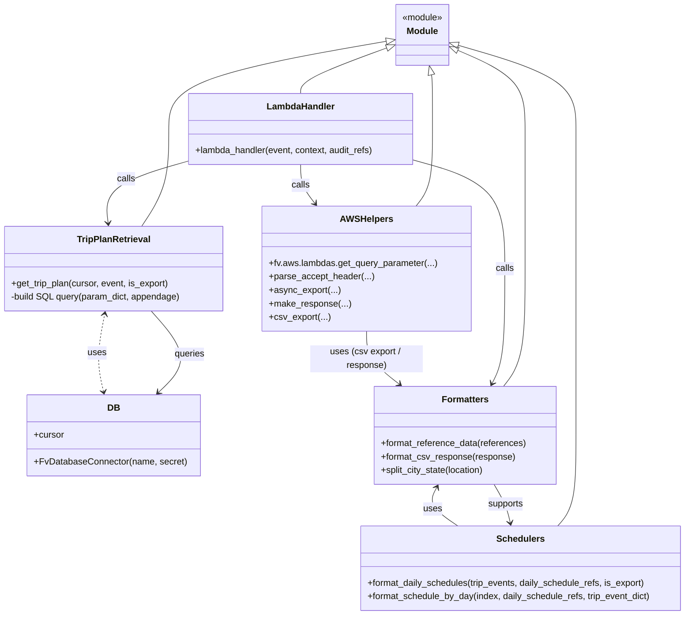

# Diagram: shipment_core/shipment_trip_plan_service/shipment_trip_plan_service/trip_plan/get_trip_plan.py


> Auto-generated by Obscura crawlers

## Diagram 1

```mermaid
flowchart TD
    A[lambda_handler(event, context, audit_refs)] --> B{parse Accept header\nrequested_format}
    B -->|text/csv| C[is_export = True]
    B -->|other| D[is_export = False]
    C --> E{get_query_parameter(QSP.ASYNC_EXPORT)}
    E -->|True| F[async_export(event, CSV_LAMBDAS.TRIP_PLAN) -> RETURN]
    E -->|False| G[continue -> DB_CONN.cursor]
    D --> G
    G --> H[get_trip_plan(cursor, event, is_export)]
    H --> I[DB: SELECT trip_plan + aggregates -> cursor.fetchall()]
    I --> J[post-process each trip_plan]
    J --> K[split_city_state(origin_location) / split_city_state(destination_location)]
    J --> L[format_daily_schedules(tripEvents, dailyScheduleReferences, is_export)]
    L --> M[format_schedule_by_day(index, daily_schedule_refs, trip_event_dict)]
    M --> N[format_reference_data(references)]
    J --> O{is_export?}
    O -->|True| P[format_csv_response(response) -> csv_export -> make_response(data)]
    O -->|False| Q[make_response(statusCode:200, response)]
    style A fill:#f9f,stroke:#333,stroke-width:1px
    style H fill:#fffae6
    style I fill:#fff2f2
    style L fill:#e6f7ff
```

> SVG rendering failed for this diagram.

## Diagram 2



### SVG

<svg id="container" width="1222.6875" xmlns="http://www.w3.org/2000/svg" class="classDiagram" height="1092" viewBox="0 0 1222.6875 1092" role="graphics-document document" aria-roledescription="class"><style>#container{font-family:"trebuchet ms",verdana,arial,sans-serif;font-size:16px;fill:#333;}@keyframes edge-animation-frame{from{stroke-dashoffset:0;}}@keyframes dash{to{stroke-dashoffset:0;}}#container .edge-animation-slow{stroke-dasharray:9,5!important;stroke-dashoffset:900;animation:dash 50s linear infinite;stroke-linecap:round;}#container .edge-animation-fast{stroke-dasharray:9,5!important;stroke-dashoffset:900;animation:dash 20s linear infinite;stroke-linecap:round;}#container .error-icon{fill:#552222;}#container .error-text{fill:#552222;stroke:#552222;}#container .edge-thickness-normal{stroke-width:1px;}#container .edge-thickness-thick{stroke-width:3.5px;}#container .edge-pattern-solid{stroke-dasharray:0;}#container .edge-thickness-invisible{stroke-width:0;fill:none;}#container .edge-pattern-dashed{stroke-dasharray:3;}#container .edge-pattern-dotted{stroke-dasharray:2;}#container .marker{fill:#333333;stroke:#333333;}#container .marker.cross{stroke:#333333;}#container svg{font-family:"trebuchet ms",verdana,arial,sans-serif;font-size:16px;}#container p{margin:0;}#container g.classGroup text{fill:#9370DB;stroke:none;font-family:"trebuchet ms",verdana,arial,sans-serif;font-size:10px;}#container g.classGroup text .title{font-weight:bolder;}#container .nodeLabel,#container .edgeLabel{color:#131300;}#container .edgeLabel .label rect{fill:#ECECFF;}#container .label text{fill:#131300;}#container .labelBkg{background:#ECECFF;}#container .edgeLabel .label span{background:#ECECFF;}#container .classTitle{font-weight:bolder;}#container .node rect,#container .node circle,#container .node ellipse,#container .node polygon,#container .node path{fill:#ECECFF;stroke:#9370DB;stroke-width:1px;}#container .divider{stroke:#9370DB;stroke-width:1;}#container g.clickable{cursor:pointer;}#container g.classGroup rect{fill:#ECECFF;stroke:#9370DB;}#container g.classGroup line{stroke:#9370DB;stroke-width:1;}#container .classLabel .box{stroke:none;stroke-width:0;fill:#ECECFF;opacity:0.5;}#container .classLabel .label{fill:#9370DB;font-size:10px;}#container .relation{stroke:#333333;stroke-width:1;fill:none;}#container .dashed-line{stroke-dasharray:3;}#container .dotted-line{stroke-dasharray:1 2;}#container #compositionStart,#container .composition{fill:#333333!important;stroke:#333333!important;stroke-width:1;}#container #compositionEnd,#container .composition{fill:#333333!important;stroke:#333333!important;stroke-width:1;}#container #dependencyStart,#container .dependency{fill:#333333!important;stroke:#333333!important;stroke-width:1;}#container #dependencyStart,#container .dependency{fill:#333333!important;stroke:#333333!important;stroke-width:1;}#container #extensionStart,#container .extension{fill:transparent!important;stroke:#333333!important;stroke-width:1;}#container #extensionEnd,#container .extension{fill:transparent!important;stroke:#333333!important;stroke-width:1;}#container #aggregationStart,#container .aggregation{fill:transparent!important;stroke:#333333!important;stroke-width:1;}#container #aggregationEnd,#container .aggregation{fill:transparent!important;stroke:#333333!important;stroke-width:1;}#container #lollipopStart,#container .lollipop{fill:#ECECFF!important;stroke:#333333!important;stroke-width:1;}#container #lollipopEnd,#container .lollipop{fill:#ECECFF!important;stroke:#333333!important;stroke-width:1;}#container .edgeTerminals{font-size:11px;line-height:initial;}#container .classTitleText{text-anchor:middle;font-size:18px;fill:#333;}#container .label-icon{display:inline-block;height:1em;overflow:visible;vertical-align:-0.125em;}#container .node .label-icon path{fill:currentColor;stroke:revert;stroke-width:revert;}#container :root{--mermaid-font-family:"trebuchet ms",verdana,arial,sans-serif;}</style><g><defs><marker id="container_class-aggregationStart" class="marker aggregation class" refX="18" refY="7" markerWidth="190" markerHeight="240" orient="auto"><path d="M 18,7 L9,13 L1,7 L9,1 Z"></path></marker></defs><defs><marker id="container_class-aggregationEnd" class="marker aggregation class" refX="1" refY="7" markerWidth="20" markerHeight="28" orient="auto"><path d="M 18,7 L9,13 L1,7 L9,1 Z"></path></marker></defs><defs><marker id="container_class-extensionStart" class="marker extension class" refX="18" refY="7" markerWidth="190" markerHeight="240" orient="auto"><path d="M 1,7 L18,13 V 1 Z"></path></marker></defs><defs><marker id="container_class-extensionEnd" class="marker extension class" refX="1" refY="7" markerWidth="20" markerHeight="28" orient="auto"><path d="M 1,1 V 13 L18,7 Z"></path></marker></defs><defs><marker id="container_class-compositionStart" class="marker composition class" refX="18" refY="7" markerWidth="190" markerHeight="240" orient="auto"><path d="M 18,7 L9,13 L1,7 L9,1 Z"></path></marker></defs><defs><marker id="container_class-compositionEnd" class="marker composition class" refX="1" refY="7" markerWidth="20" markerHeight="28" orient="auto"><path d="M 18,7 L9,13 L1,7 L9,1 Z"></path></marker></defs><defs><marker id="container_class-dependencyStart" class="marker dependency class" refX="6" refY="7" markerWidth="190" markerHeight="240" orient="auto"><path d="M 5,7 L9,13 L1,7 L9,1 Z"></path></marker></defs><defs><marker id="container_class-dependencyEnd" class="marker dependency class" refX="13" refY="7" markerWidth="20" markerHeight="28" orient="auto"><path d="M 18,7 L9,13 L14,7 L9,1 Z"></path></marker></defs><defs><marker id="container_class-lollipopStart" class="marker lollipop class" refX="13" refY="7" markerWidth="190" markerHeight="240" orient="auto"><circle stroke="black" fill="transparent" cx="7" cy="7" r="6"></circle></marker></defs><defs><marker id="container_class-lollipopEnd" class="marker lollipop class" refX="1" refY="7" markerWidth="190" markerHeight="240" orient="auto"><circle stroke="black" fill="transparent" cx="7" cy="7" r="6"></circle></marker></defs><g class="root"><g class="clusters"></g><g class="edgePaths"><path d="M689.401,85.413L663.75,94.678C638.099,103.942,586.798,122.471,561.147,135.902C535.496,149.333,535.496,157.667,535.496,161.833L535.496,166" id="id_Module_LambdaHandler_1" class="edge-thickness-normal edge-pattern-solid relation" style=";;;" data-edge="true" data-et="edge" data-id="id_Module_LambdaHandler_1" data-points="W3sieCI6NzA1LjYyNSwieSI6NzkuNTUzNjc0NDM1MjE3NDN9LHsieCI6NTM1LjQ5NjA5Mzc1LCJ5IjoxNDF9LHsieCI6NTM1LjQ5NjA5Mzc1LCJ5IjoxNjZ9XQ==" marker-start="url(#container_class-extensionStart)"></path><path d="M688.629,73.372L623.614,84.644C558.6,95.915,428.571,118.457,363.557,144.395C298.543,170.333,298.543,199.667,298.543,231C298.543,262.333,298.543,295.667,290.678,324.5C282.814,353.333,267.085,377.667,259.22,389.833L251.355,402" id="id_Module_TripPlanRetrieval_2" class="edge-thickness-normal edge-pattern-solid relation" style=";;;" data-edge="true" data-et="edge" data-id="id_Module_TripPlanRetrieval_2" data-points="W3sieCI6NzA1LjYyNSwieSI6NzAuNDI1ODU0MDEzOTcyODJ9LHsieCI6Mjk4LjU0Mjk2ODc1LCJ5IjoxNDF9LHsieCI6Mjk4LjU0Mjk2ODc1LCJ5IjoyMjl9LHsieCI6Mjk4LjU0Mjk2ODc1LCJ5IjozMjl9LHsieCI6MjUxLjM1NTM4OTU2OTI1Njc3LCJ5Ijo0MDJ9XQ==" marker-start="url(#container_class-extensionStart)"></path><path d="M819.395,80.909L853.911,90.924C888.428,100.939,957.461,120.97,991.978,145.651C1026.494,170.333,1026.494,199.667,1026.494,231C1026.494,262.333,1026.494,295.667,1026.494,337C1026.494,378.333,1026.494,427.667,1026.494,479C1026.494,530.333,1026.494,583.667,1026.494,633C1026.494,682.333,1026.494,727.667,1026.494,771C1026.494,814.333,1026.494,855.667,1021.077,882.5C1015.659,909.333,1004.824,921.667,999.407,927.833L993.989,934" id="id_Module_Schedulers_3" class="edge-thickness-normal edge-pattern-solid relation" style=";;;" data-edge="true" data-et="edge" data-id="id_Module_Schedulers_3" data-points="W3sieCI6ODAyLjgyODEyNSwieSI6NzYuMTAyMDIyMjIzNjU2OTN9LHsieCI6MTAyNi40OTQxNDA2MjUsInkiOjE0MX0seyJ4IjoxMDI2LjQ5NDE0MDYyNSwieSI6MjI5fSx7IngiOjEwMjYuNDk0MTQwNjI1LCJ5IjozMjl9LHsieCI6MTAyNi40OTQxNDA2MjUsInkiOjQ3N30seyJ4IjoxMDI2LjQ5NDE0MDYyNSwieSI6NjM3fSx7IngiOjEwMjYuNDk0MTQwNjI1LCJ5Ijo3NzN9LHsieCI6MTAyNi40OTQxNDA2MjUsInkiOjg5N30seyJ4Ijo5OTMuOTg5NDQ5NjM3Mjc2OCwieSI6OTM0fV0=" marker-start="url(#container_class-extensionStart)"></path><path d="M818.653,89.95L838.265,98.459C857.877,106.967,897.101,123.983,916.712,147.158C936.324,170.333,936.324,199.667,936.324,231C936.324,262.333,936.324,295.667,936.324,337C936.324,378.333,936.324,427.667,936.324,479C936.324,530.333,936.324,583.667,929.922,618.5C923.52,653.333,910.716,669.667,904.314,677.833L897.911,686" id="id_Module_Formatters_4" class="edge-thickness-normal edge-pattern-solid relation" style=";;;" data-edge="true" data-et="edge" data-id="id_Module_Formatters_4" data-points="W3sieCI6ODAyLjgyODEyNSwieSI6ODMuMDg0OTY5MDAyNzI0MzR9LHsieCI6OTM2LjMyNDIxODc1LCJ5IjoxNDF9LHsieCI6OTM2LjMyNDIxODc1LCJ5IjoyMjl9LHsieCI6OTM2LjMyNDIxODc1LCJ5IjozMjl9LHsieCI6OTM2LjMyNDIxODc1LCJ5Ijo0Nzd9LHsieCI6OTM2LjMyNDIxODc1LCJ5Ijo2Mzd9LHsieCI6ODk3LjkxMTM3Njk1MzEyNSwieSI6Njg2fV0=" marker-start="url(#container_class-extensionStart)"></path><path d="M770.56,132.809L770.875,134.174C771.19,135.539,771.819,138.27,772.134,154.301C772.449,170.333,772.449,199.667,772.449,231C772.449,262.333,772.449,295.667,767.513,318.5C762.576,341.333,752.703,353.667,747.767,359.833L742.83,366" id="id_Module_AWSHelpers_5" class="edge-thickness-normal edge-pattern-solid relation" style=";;;" data-edge="true" data-et="edge" data-id="id_Module_AWSHelpers_5" data-points="W3sieCI6NzY2LjY4MjU1NTM3OTc0NjksInkiOjExNn0seyJ4Ijo3NzIuNDQ5MjE4NzUsInkiOjE0MX0seyJ4Ijo3NzIuNDQ5MjE4NzUsInkiOjIyOX0seyJ4Ijo3NzIuNDQ5MjE4NzUsInkiOjMyOX0seyJ4Ijo3NDIuODMwMDc4MTI1LCJ5IjozNjZ9XQ==" marker-start="url(#container_class-extensionStart)"></path><path d="M184.635,695.158L182.364,685.465C180.093,675.772,175.55,656.386,175.905,633.507C176.26,610.628,181.513,584.256,184.139,571.07L186.765,557.884" id="id_DB_TripPlanRetrieval_6" class="edge-thickness-normal edge-pattern-dashed relation" style=";;;" data-edge="true" data-et="edge" data-id="id_DB_TripPlanRetrieval_6" data-points="W3sieCI6MTg2LjAwNDEzNjAyOTQxMTc3LCJ5Ijo3MDF9LHsieCI6MTcxLjAwNzgxMjUsInkiOjYzN30seyJ4IjoxODcuOTM3MjU1ODU5Mzc1LCJ5Ijo1NTJ9XQ==" marker-start="url(#container_class-dependencyStart)" marker-end="url(#container_class-dependencyEnd)"></path><path d="M535.496,292L535.496,298.167C535.496,304.333,535.496,316.667,539.808,328.219C544.119,339.772,552.742,350.544,557.054,355.93L561.366,361.316" id="id_LambdaHandler_AWSHelpers_7" class="edge-thickness-normal edge-pattern-solid relation" style=";;;" data-edge="true" data-et="edge" data-id="id_LambdaHandler_AWSHelpers_7" data-points="W3sieCI6NTM1LjQ5NjA5Mzc1LCJ5IjoyOTJ9LHsieCI6NTM1LjQ5NjA5Mzc1LCJ5IjozMjl9LHsieCI6NTY1LjExNTIzNDM3NSwieSI6MzY2fV0=" marker-end="url(#container_class-dependencyEnd)"></path><path d="M333.543,286.562L308.728,293.635C283.913,300.708,234.283,314.854,210.843,333.101C187.404,351.348,190.156,373.697,191.531,384.871L192.907,396.045" id="id_LambdaHandler_TripPlanRetrieval_8" class="edge-thickness-normal edge-pattern-solid relation" style=";;;" data-edge="true" data-et="edge" data-id="id_LambdaHandler_TripPlanRetrieval_8" data-points="W3sieCI6MzMzLjU0Mjk2ODc1LCJ5IjoyODYuNTYyMTI3MDE1MjMxMX0seyJ4IjoxODQuNjUyMzQzNzUsInkiOjMyOX0seyJ4IjoxOTMuNjQwNTQ1ODE5MjU2NzQsInkiOjQwMn1d" marker-end="url(#container_class-dependencyEnd)"></path><path d="M737.449,284.423L764.521,291.853C791.592,299.282,845.736,314.141,872.807,346.237C899.879,378.333,899.879,427.667,899.879,479C899.879,530.333,899.879,583.667,896.124,617.611C892.369,651.556,884.858,666.112,881.103,673.39L877.348,680.668" id="id_LambdaHandler_Formatters_9" class="edge-thickness-normal edge-pattern-solid relation" style=";;;" data-edge="true" data-et="edge" data-id="id_LambdaHandler_Formatters_9" data-points="W3sieCI6NzM3LjQ0OTIxODc1LCJ5IjoyODQuNDIzMzM5OTc5ODQ2MDV9LHsieCI6ODk5Ljg3ODkwNjI1LCJ5IjozMjl9LHsieCI6ODk5Ljg3ODkwNjI1LCJ5Ijo0Nzd9LHsieCI6ODk5Ljg3ODkwNjI1LCJ5Ijo2Mzd9LHsieCI6ODc0LjU5NzA5NjE2MjY4MzgsInkiOjY4Nn1d" marker-end="url(#container_class-dependencyEnd)"></path><path d="M268.745,552L281.188,566.167C293.63,580.333,318.514,608.667,320.653,632.805C322.793,656.942,302.187,676.885,291.884,686.856L281.581,696.827" id="id_TripPlanRetrieval_DB_10" class="edge-thickness-normal edge-pattern-solid relation" style=";;;" data-edge="true" data-et="edge" data-id="id_TripPlanRetrieval_DB_10" data-points="W3sieCI6MjY4Ljc0NTM2MTMyODEyNSwieSI6NTUyfSx7IngiOjM0My4zOTg0Mzc1LCJ5Ijo2Mzd9LHsieCI6Mjc3LjI2OTc2MTAyOTQxMTc3LCJ5Ijo3MDF9XQ==" marker-end="url(#container_class-dependencyEnd)"></path><path d="M816.16,934L806.956,927.833C797.752,921.667,779.344,909.333,773.075,897.875C766.806,886.416,772.676,875.831,775.611,870.539L778.547,865.247" id="id_Schedulers_Formatters_11" class="edge-thickness-normal edge-pattern-solid relation" style=";;;" data-edge="true" data-et="edge" data-id="id_Schedulers_Formatters_11" data-points="W3sieCI6ODE2LjE2MDAzNDE3OTY4NzUsInkiOjkzNH0seyJ4Ijo3NjAuOTM1NTQ2ODc1LCJ5Ijo4OTd9LHsieCI6NzgxLjQ1NjY1MzIyNTgwNjUsInkiOjg2MH1d" marker-end="url(#container_class-dependencyEnd)"></path><path d="M880.402,860L883.995,866.167C887.588,872.333,894.775,884.667,899.58,896.026C904.385,907.386,906.809,917.771,908.021,922.964L909.233,928.157" id="id_Formatters_Schedulers_12" class="edge-thickness-normal edge-pattern-solid relation" style=";;;" data-edge="true" data-et="edge" data-id="id_Formatters_Schedulers_12" data-points="W3sieCI6ODgwLjQwMTg4Njk3MDc2NjEsInkiOjg2MH0seyJ4Ijo5MDEuOTYwOTM3NSwieSI6ODk3fSx7IngiOjkxMC41OTY2Nzk2ODc1LCJ5Ijo5MzR9XQ==" marker-end="url(#container_class-dependencyEnd)"></path><path d="M653.973,588L653.973,596.167C653.973,604.333,653.973,620.667,663.735,636.388C673.497,652.109,693.02,667.219,702.782,674.773L712.544,682.328" id="id_AWSHelpers_Formatters_13" class="edge-thickness-normal edge-pattern-solid relation" style=";;;" data-edge="true" data-et="edge" data-id="id_AWSHelpers_Formatters_13" data-points="W3sieCI6NjUzLjk3MjY1NjI1LCJ5Ijo1ODh9LHsieCI6NjUzLjk3MjY1NjI1LCJ5Ijo2Mzd9LHsieCI6NzE3LjI4OTQyMTUzMDMzMDksInkiOjY4Nn1d" marker-end="url(#container_class-dependencyEnd)"></path></g><g class="edgeLabels"><g class="edgeLabel"><g class="label" data-id="id_Module_LambdaHandler_1" transform="translate(0, 0)"><foreignObject width="0" height="0"><div xmlns="http://www.w3.org/1999/xhtml" class="labelBkg" style="display: table-cell; white-space: nowrap; line-height: 1.5; max-width: 200px; text-align: center;"><span class="edgeLabel"></span></div></foreignObject></g></g><g class="edgeLabel"><g class="label" data-id="id_Module_TripPlanRetrieval_2" transform="translate(0, 0)"><foreignObject width="0" height="0"><div xmlns="http://www.w3.org/1999/xhtml" class="labelBkg" style="display: table-cell; white-space: nowrap; line-height: 1.5; max-width: 200px; text-align: center;"><span class="edgeLabel"></span></div></foreignObject></g></g><g class="edgeLabel"><g class="label" data-id="id_Module_Schedulers_3" transform="translate(0, 0)"><foreignObject width="0" height="0"><div xmlns="http://www.w3.org/1999/xhtml" class="labelBkg" style="display: table-cell; white-space: nowrap; line-height: 1.5; max-width: 200px; text-align: center;"><span class="edgeLabel"></span></div></foreignObject></g></g><g class="edgeLabel"><g class="label" data-id="id_Module_Formatters_4" transform="translate(0, 0)"><foreignObject width="0" height="0"><div xmlns="http://www.w3.org/1999/xhtml" class="labelBkg" style="display: table-cell; white-space: nowrap; line-height: 1.5; max-width: 200px; text-align: center;"><span class="edgeLabel"></span></div></foreignObject></g></g><g class="edgeLabel"><g class="label" data-id="id_Module_AWSHelpers_5" transform="translate(0, 0)"><foreignObject width="0" height="0"><div xmlns="http://www.w3.org/1999/xhtml" class="labelBkg" style="display: table-cell; white-space: nowrap; line-height: 1.5; max-width: 200px; text-align: center;"><span class="edgeLabel"></span></div></foreignObject></g></g><g class="edgeLabel" transform="translate(173.05257, 626.73362)"><g class="label" data-id="id_DB_TripPlanRetrieval_6" transform="translate(-16.4921875, -12)"><foreignObject width="32.984375" height="24"><div xmlns="http://www.w3.org/1999/xhtml" class="labelBkg" style="display: table-cell; white-space: nowrap; line-height: 1.5; max-width: 200px; text-align: center;"><span class="edgeLabel"><p>uses</p></span></div></foreignObject></g></g><g class="edgeLabel" transform="translate(535.49609375, 329)"><g class="label" data-id="id_LambdaHandler_AWSHelpers_7" transform="translate(-16.4453125, -12)"><foreignObject width="32.890625" height="24"><div xmlns="http://www.w3.org/1999/xhtml" class="labelBkg" style="display: table-cell; white-space: nowrap; line-height: 1.5; max-width: 200px; text-align: center;"><span class="edgeLabel"><p>calls</p></span></div></foreignObject></g></g><g class="edgeLabel" transform="translate(223.7306, 317.86164)"><g class="label" data-id="id_LambdaHandler_TripPlanRetrieval_8" transform="translate(-16.4453125, -12)"><foreignObject width="32.890625" height="24"><div xmlns="http://www.w3.org/1999/xhtml" class="labelBkg" style="display: table-cell; white-space: nowrap; line-height: 1.5; max-width: 200px; text-align: center;"><span class="edgeLabel"><p>calls</p></span></div></foreignObject></g></g><g class="edgeLabel" transform="translate(899.87890625, 477)"><g class="label" data-id="id_LambdaHandler_Formatters_9" transform="translate(-16.4453125, -12)"><foreignObject width="32.890625" height="24"><div xmlns="http://www.w3.org/1999/xhtml" class="labelBkg" style="display: table-cell; white-space: nowrap; line-height: 1.5; max-width: 200px; text-align: center;"><span class="edgeLabel"><p>calls</p></span></div></foreignObject></g></g><g class="edgeLabel" transform="translate(336.43607, 629.07264)"><g class="label" data-id="id_TripPlanRetrieval_DB_10" transform="translate(-27.2421875, -12)"><foreignObject width="54.484375" height="24"><div xmlns="http://www.w3.org/1999/xhtml" class="labelBkg" style="display: table-cell; white-space: nowrap; line-height: 1.5; max-width: 200px; text-align: center;"><span class="edgeLabel"><p>queries</p></span></div></foreignObject></g></g><g class="edgeLabel" transform="translate(770.97289, 903.72495)"><g class="label" data-id="id_Schedulers_Formatters_11" transform="translate(-16.4921875, -12)"><foreignObject width="32.984375" height="24"><div xmlns="http://www.w3.org/1999/xhtml" class="labelBkg" style="display: table-cell; white-space: nowrap; line-height: 1.5; max-width: 200px; text-align: center;"><span class="edgeLabel"><p>uses</p></span></div></foreignObject></g></g><g class="edgeLabel" transform="translate(900.74552, 894.91408)"><g class="label" data-id="id_Formatters_Schedulers_12" transform="translate(-32.28125, -12)"><foreignObject width="64.5625" height="24"><div xmlns="http://www.w3.org/1999/xhtml" class="labelBkg" style="display: table-cell; white-space: nowrap; line-height: 1.5; max-width: 200px; text-align: center;"><span class="edgeLabel"><p>supports</p></span></div></foreignObject></g></g><g class="edgeLabel" transform="translate(653.97265625, 637)"><g class="label" data-id="id_AWSHelpers_Formatters_13" transform="translate(-100, -24)"><foreignObject width="200" height="48"><div xmlns="http://www.w3.org/1999/xhtml" class="labelBkg" style="display: table; white-space: break-spaces; line-height: 1.5; max-width: 200px; text-align: center; width: 200px;"><span class="edgeLabel"><p>uses (csv export / response)</p></span></div></foreignObject></g></g></g><g class="nodes"><g class="node default" id="classId-Module-0" transform="translate(754.2265625, 62)"><g class="basic label-container"><path d="M-48.6015625 -54 L48.6015625 -54 L48.6015625 54 L-48.6015625 54" stroke="none" stroke-width="0" fill="#ECECFF" style=""></path><path d="M-48.6015625 -54 C-9.849960879809025 -54, 28.90164074038195 -54, 48.6015625 -54 M-48.6015625 -54 C-10.416185911312539 -54, 27.769190677374922 -54, 48.6015625 -54 M48.6015625 -54 C48.6015625 -12.192193543394218, 48.6015625 29.615612913211564, 48.6015625 54 M48.6015625 -54 C48.6015625 -11.115319291894835, 48.6015625 31.76936141621033, 48.6015625 54 M48.6015625 54 C24.33956491007881 54, 0.07756732015761969 54, -48.6015625 54 M48.6015625 54 C28.615896623355134 54, 8.630230746710268 54, -48.6015625 54 M-48.6015625 54 C-48.6015625 29.64824068337966, -48.6015625 5.296481366759323, -48.6015625 -54 M-48.6015625 54 C-48.6015625 26.574416211965392, -48.6015625 -0.8511675760692157, -48.6015625 -54" stroke="#9370DB" stroke-width="1.3" fill="none" stroke-dasharray="0 0" style=""></path></g><g class="annotation-group text" transform="translate(-36.6015625, -30)"><g class="label" style="" transform="translate(0,-12)"><foreignObject width="73.203125" height="24"><div xmlns="http://www.w3.org/1999/xhtml" style="display: table-cell; white-space: nowrap; line-height: 1.5; max-width: 123px; text-align: center;"><span class="nodeLabel markdown-node-label" style=""><p>«module»</p></span></div></foreignObject></g></g><g class="label-group text" transform="translate(-27.09375, -6)"><g class="label" style="font-weight: bolder" transform="translate(0,-12)"><foreignObject width="54.1875" height="24"><div xmlns="http://www.w3.org/1999/xhtml" style="display: table-cell; white-space: nowrap; line-height: 1.5; max-width: 104px; text-align: center;"><span class="nodeLabel markdown-node-label" style=""><p>Module</p></span></div></foreignObject></g></g><g class="members-group text" transform="translate(-36.6015625, 42)"></g><g class="methods-group text" transform="translate(-36.6015625, 72)"></g><g class="divider" style=""><path d="M-48.6015625 18 C-18.91822606801857 18, 10.765110363962862 18, 48.6015625 18 M-48.6015625 18 C-23.227152911319095 18, 2.14725667736181 18, 48.6015625 18" stroke="#9370DB" stroke-width="1.3" fill="none" stroke-dasharray="0 0" style=""></path></g><g class="divider" style=""><path d="M-48.6015625 36 C-25.28607436418655 36, -1.9705862283731008 36, 48.6015625 36 M-48.6015625 36 C-16.552260695483923 36, 15.497041109032153 36, 48.6015625 36" stroke="#9370DB" stroke-width="1.3" fill="none" stroke-dasharray="0 0" style=""></path></g></g><g class="node default" id="classId-DB-1" transform="translate(202.875, 773)"><g class="basic label-container"><path d="M-150.80078125 -72 L150.80078125 -72 L150.80078125 72 L-150.80078125 72" stroke="none" stroke-width="0" fill="#ECECFF" style=""></path><path d="M-150.80078125 -72 C-72.82538866040493 -72, 5.150003929190149 -72, 150.80078125 -72 M-150.80078125 -72 C-67.59893766541622 -72, 15.602905919167569 -72, 150.80078125 -72 M150.80078125 -72 C150.80078125 -25.953160422196838, 150.80078125 20.093679155606324, 150.80078125 72 M150.80078125 -72 C150.80078125 -37.35856582799128, 150.80078125 -2.7171316559825556, 150.80078125 72 M150.80078125 72 C44.35865709105657 72, -62.08346706788686 72, -150.80078125 72 M150.80078125 72 C61.306950819308 72, -28.186879611384 72, -150.80078125 72 M-150.80078125 72 C-150.80078125 15.321533378168674, -150.80078125 -41.35693324366265, -150.80078125 -72 M-150.80078125 72 C-150.80078125 14.983395029508884, -150.80078125 -42.03320994098223, -150.80078125 -72" stroke="#9370DB" stroke-width="1.3" fill="none" stroke-dasharray="0 0" style=""></path></g><g class="annotation-group text" transform="translate(0, -48)"></g><g class="label-group text" transform="translate(-10.1484375, -48)"><g class="label" style="font-weight: bolder" transform="translate(0,-12)"><foreignObject width="20.296875" height="24"><div xmlns="http://www.w3.org/1999/xhtml" style="display: table-cell; white-space: nowrap; line-height: 1.5; max-width: 70px; text-align: center;"><span class="nodeLabel markdown-node-label" style=""><p>DB</p></span></div></foreignObject></g></g><g class="members-group text" transform="translate(-138.80078125, 0)"><g class="label" style="" transform="translate(0,-12)"><foreignObject width="53.71875" height="24"><div xmlns="http://www.w3.org/1999/xhtml" style="display: table-cell; white-space: nowrap; line-height: 1.5; max-width: 112px; text-align: center;"><span class="nodeLabel markdown-node-label" style=""><p>+cursor</p></span></div></foreignObject></g></g><g class="methods-group text" transform="translate(-138.80078125, 48)"><g class="label" style="" transform="translate(0,-12)"><foreignObject width="267.453125" height="24"><div xmlns="http://www.w3.org/1999/xhtml" style="display: table-cell; white-space: nowrap; line-height: 1.5; max-width: 325px; text-align: center;"><span class="nodeLabel markdown-node-label" style=""><p>+FvDatabaseConnector(name, secret)</p></span></div></foreignObject></g></g><g class="divider" style=""><path d="M-150.80078125 -24 C-59.551875656674454 -24, 31.69702993665109 -24, 150.80078125 -24 M-150.80078125 -24 C-31.742856178886655 -24, 87.31506889222669 -24, 150.80078125 -24" stroke="#9370DB" stroke-width="1.3" fill="none" stroke-dasharray="0 0" style=""></path></g><g class="divider" style=""><path d="M-150.80078125 24 C-52.9924352588918 24, 44.815910732216395 24, 150.80078125 24 M-150.80078125 24 C-67.14772452951577 24, 16.50533219096846 24, 150.80078125 24" stroke="#9370DB" stroke-width="1.3" fill="none" stroke-dasharray="0 0" style=""></path></g></g><g class="node default" id="classId-LambdaHandler-2" transform="translate(535.49609375, 229)"><g class="basic label-container"><path d="M-201.953125 -63 L201.953125 -63 L201.953125 63 L-201.953125 63" stroke="none" stroke-width="0" fill="#ECECFF" style=""></path><path d="M-201.953125 -63 C-109.21324399475358 -63, -16.473362989507166 -63, 201.953125 -63 M-201.953125 -63 C-56.2122817218677 -63, 89.5285615562646 -63, 201.953125 -63 M201.953125 -63 C201.953125 -15.153689074527698, 201.953125 32.692621850944604, 201.953125 63 M201.953125 -63 C201.953125 -25.004166736437398, 201.953125 12.991666527125204, 201.953125 63 M201.953125 63 C59.46621580897849 63, -83.02069338204302 63, -201.953125 63 M201.953125 63 C70.42637472415171 63, -61.10037555169657 63, -201.953125 63 M-201.953125 63 C-201.953125 26.952259082574045, -201.953125 -9.09548183485191, -201.953125 -63 M-201.953125 63 C-201.953125 15.509577629634066, -201.953125 -31.980844740731868, -201.953125 -63" stroke="#9370DB" stroke-width="1.3" fill="none" stroke-dasharray="0 0" style=""></path></g><g class="annotation-group text" transform="translate(0, -39)"></g><g class="label-group text" transform="translate(-58.21875, -39)"><g class="label" style="font-weight: bolder" transform="translate(0,-12)"><foreignObject width="116.4375" height="24"><div xmlns="http://www.w3.org/1999/xhtml" style="display: table-cell; white-space: nowrap; line-height: 1.5; max-width: 167px; text-align: center;"><span class="nodeLabel markdown-node-label" style=""><p>LambdaHandler</p></span></div></foreignObject></g></g><g class="members-group text" transform="translate(-189.953125, 9)"></g><g class="methods-group text" transform="translate(-189.953125, 39)"><g class="label" style="" transform="translate(0,-12)"><foreignObject width="321.6875" height="24"><div xmlns="http://www.w3.org/1999/xhtml" style="display: table-cell; white-space: nowrap; line-height: 1.5; max-width: 379px; text-align: center;"><span class="nodeLabel markdown-node-label" style=""><p>+lambda_handler(event, context, audit_refs)</p></span></div></foreignObject></g></g><g class="divider" style=""><path d="M-201.953125 -15 C-99.78470271131253 -15, 2.383719577374933 -15, 201.953125 -15 M-201.953125 -15 C-96.10294348215004 -15, 9.747238035699922 -15, 201.953125 -15" stroke="#9370DB" stroke-width="1.3" fill="none" stroke-dasharray="0 0" style=""></path></g><g class="divider" style=""><path d="M-201.953125 9 C-46.81760465341219 9, 108.31791569317562 9, 201.953125 9 M-201.953125 9 C-85.47008866372029 9, 31.01294767255942 9, 201.953125 9" stroke="#9370DB" stroke-width="1.3" fill="none" stroke-dasharray="0 0" style=""></path></g></g><g class="node default" id="classId-TripPlanRetrieval-3" transform="translate(202.875, 477)"><g class="basic label-container"><path d="M-194.875 -75 L194.875 -75 L194.875 75 L-194.875 75" stroke="none" stroke-width="0" fill="#ECECFF" style=""></path><path d="M-194.875 -75 C-46.5059084020389 -75, 101.8631831959222 -75, 194.875 -75 M-194.875 -75 C-89.30490092871396 -75, 16.265198142572075 -75, 194.875 -75 M194.875 -75 C194.875 -38.233850601506205, 194.875 -1.4677012030124104, 194.875 75 M194.875 -75 C194.875 -18.03387705716544, 194.875 38.93224588566912, 194.875 75 M194.875 75 C85.23246080606324 75, -24.41007838787351 75, -194.875 75 M194.875 75 C74.85977406703341 75, -45.15545186593317 75, -194.875 75 M-194.875 75 C-194.875 20.515620757593986, -194.875 -33.96875848481203, -194.875 -75 M-194.875 75 C-194.875 40.1644003474663, -194.875 5.328800694932596, -194.875 -75" stroke="#9370DB" stroke-width="1.3" fill="none" stroke-dasharray="0 0" style=""></path></g><g class="annotation-group text" transform="translate(0, -51)"></g><g class="label-group text" transform="translate(-63.125, -51)"><g class="label" style="font-weight: bolder" transform="translate(0,-12)"><foreignObject width="126.25" height="24"><div xmlns="http://www.w3.org/1999/xhtml" style="display: table-cell; white-space: nowrap; line-height: 1.5; max-width: 174px; text-align: center;"><span class="nodeLabel markdown-node-label" style=""><p>TripPlanRetrieval</p></span></div></foreignObject></g></g><g class="members-group text" transform="translate(-182.875, -3)"></g><g class="methods-group text" transform="translate(-182.875, 27)"><g class="label" style="" transform="translate(0,-12)"><foreignObject width="282.890625" height="24"><div xmlns="http://www.w3.org/1999/xhtml" style="display: table-cell; white-space: nowrap; line-height: 1.5; max-width: 340px; text-align: center;"><span class="nodeLabel markdown-node-label" style=""><p>+get_trip_plan(cursor, event, is_export)</p></span></div></foreignObject></g><g class="label" style="" transform="translate(0,12)"><foreignObject width="302.625" height="24"><div xmlns="http://www.w3.org/1999/xhtml" style="display: table-cell; white-space: nowrap; line-height: 1.5; max-width: 360px; text-align: center;"><span class="nodeLabel markdown-node-label" style=""><p>-build SQL query(param_dict, appendage)</p></span></div></foreignObject></g></g><g class="divider" style=""><path d="M-194.875 -27 C-101.73145496407578 -27, -8.58790992815156 -27, 194.875 -27 M-194.875 -27 C-110.8488019350515 -27, -26.822603870102995 -27, 194.875 -27" stroke="#9370DB" stroke-width="1.3" fill="none" stroke-dasharray="0 0" style=""></path></g><g class="divider" style=""><path d="M-194.875 -3 C-60.83197401566184 -3, 73.21105196867632 -3, 194.875 -3 M-194.875 -3 C-49.2724542050571 -3, 96.3300915898858 -3, 194.875 -3" stroke="#9370DB" stroke-width="1.3" fill="none" stroke-dasharray="0 0" style=""></path></g></g><g class="node default" id="classId-Schedulers-4" transform="translate(928.1015625, 1009)"><g class="basic label-container"><path d="M-286.5859375 -75 L286.5859375 -75 L286.5859375 75 L-286.5859375 75" stroke="none" stroke-width="0" fill="#ECECFF" style=""></path><path d="M-286.5859375 -75 C-159.22879607292202 -75, -31.871654645844075 -75, 286.5859375 -75 M-286.5859375 -75 C-156.43372619324572 -75, -26.281514886491436 -75, 286.5859375 -75 M286.5859375 -75 C286.5859375 -24.068159585441663, 286.5859375 26.863680829116674, 286.5859375 75 M286.5859375 -75 C286.5859375 -43.560784324857664, 286.5859375 -12.121568649715321, 286.5859375 75 M286.5859375 75 C147.92489785548696 75, 9.263858210973922 75, -286.5859375 75 M286.5859375 75 C92.67638233158303 75, -101.23317283683394 75, -286.5859375 75 M-286.5859375 75 C-286.5859375 26.363726810857436, -286.5859375 -22.272546378285128, -286.5859375 -75 M-286.5859375 75 C-286.5859375 37.00690578833473, -286.5859375 -0.986188423330546, -286.5859375 -75" stroke="#9370DB" stroke-width="1.3" fill="none" stroke-dasharray="0 0" style=""></path></g><g class="annotation-group text" transform="translate(0, -51)"></g><g class="label-group text" transform="translate(-40.546875, -51)"><g class="label" style="font-weight: bolder" transform="translate(0,-12)"><foreignObject width="81.09375" height="24"><div xmlns="http://www.w3.org/1999/xhtml" style="display: table-cell; white-space: nowrap; line-height: 1.5; max-width: 130px; text-align: center;"><span class="nodeLabel markdown-node-label" style=""><p>Schedulers</p></span></div></foreignObject></g></g><g class="members-group text" transform="translate(-274.5859375, -3)"></g><g class="methods-group text" transform="translate(-274.5859375, 27)"><g class="label" style="" transform="translate(0,-12)"><foreignObject width="498.984375" height="24"><div xmlns="http://www.w3.org/1999/xhtml" style="display: table-cell; white-space: nowrap; line-height: 1.5; max-width: 556px; text-align: center;"><span class="nodeLabel markdown-node-label" style=""><p>+format_daily_schedules(trip_events, daily_schedule_refs, is_export)</p></span></div></foreignObject></g><g class="label" style="" transform="translate(0,12)"><foreignObject width="508.625" height="24"><div xmlns="http://www.w3.org/1999/xhtml" style="display: table-cell; white-space: nowrap; line-height: 1.5; max-width: 566px; text-align: center;"><span class="nodeLabel markdown-node-label" style=""><p>+format_schedule_by_day(index, daily_schedule_refs, trip_event_dict)</p></span></div></foreignObject></g></g><g class="divider" style=""><path d="M-286.5859375 -27 C-135.87540642196845 -27, 14.835124656063101 -27, 286.5859375 -27 M-286.5859375 -27 C-117.21165826052658 -27, 52.16262097894685 -27, 286.5859375 -27" stroke="#9370DB" stroke-width="1.3" fill="none" stroke-dasharray="0 0" style=""></path></g><g class="divider" style=""><path d="M-286.5859375 -3 C-152.67655175093273 -3, -18.767166001865462 -3, 286.5859375 -3 M-286.5859375 -3 C-81.97841468754547 -3, 122.62910812490907 -3, 286.5859375 -3" stroke="#9370DB" stroke-width="1.3" fill="none" stroke-dasharray="0 0" style=""></path></g></g><g class="node default" id="classId-Formatters-5" transform="translate(829.708984375, 773)"><g class="basic label-container"><path d="M-161.78515625 -87 L161.78515625 -87 L161.78515625 87 L-161.78515625 87" stroke="none" stroke-width="0" fill="#ECECFF" style=""></path><path d="M-161.78515625 -87 C-72.06125172747807 -87, 17.66265279504387 -87, 161.78515625 -87 M-161.78515625 -87 C-79.19440635453918 -87, 3.3963435409216345 -87, 161.78515625 -87 M161.78515625 -87 C161.78515625 -42.74661219486729, 161.78515625 1.5067756102654215, 161.78515625 87 M161.78515625 -87 C161.78515625 -28.36221234691763, 161.78515625 30.27557530616474, 161.78515625 87 M161.78515625 87 C54.116407450385566 87, -53.55234134922887 87, -161.78515625 87 M161.78515625 87 C80.56590353772717 87, -0.6533491745456672 87, -161.78515625 87 M-161.78515625 87 C-161.78515625 34.66084209136246, -161.78515625 -17.678315817275077, -161.78515625 -87 M-161.78515625 87 C-161.78515625 43.68230156963044, -161.78515625 0.36460313926087906, -161.78515625 -87" stroke="#9370DB" stroke-width="1.3" fill="none" stroke-dasharray="0 0" style=""></path></g><g class="annotation-group text" transform="translate(0, -63)"></g><g class="label-group text" transform="translate(-40.0703125, -63)"><g class="label" style="font-weight: bolder" transform="translate(0,-12)"><foreignObject width="80.140625" height="24"><div xmlns="http://www.w3.org/1999/xhtml" style="display: table-cell; white-space: nowrap; line-height: 1.5; max-width: 129px; text-align: center;"><span class="nodeLabel markdown-node-label" style=""><p>Formatters</p></span></div></foreignObject></g></g><g class="members-group text" transform="translate(-149.78515625, -15)"></g><g class="methods-group text" transform="translate(-149.78515625, 15)"><g class="label" style="" transform="translate(0,-12)"><foreignObject width="259.5" height="24"><div xmlns="http://www.w3.org/1999/xhtml" style="display: table-cell; white-space: nowrap; line-height: 1.5; max-width: 317px; text-align: center;"><span class="nodeLabel markdown-node-label" style=""><p>+format_reference_data(references)</p></span></div></foreignObject></g><g class="label" style="" transform="translate(0,12)"><foreignObject width="238.203125" height="24"><div xmlns="http://www.w3.org/1999/xhtml" style="display: table-cell; white-space: nowrap; line-height: 1.5; max-width: 296px; text-align: center;"><span class="nodeLabel markdown-node-label" style=""><p>+format_csv_response(response)</p></span></div></foreignObject></g><g class="label" style="" transform="translate(0,36)"><foreignObject width="187.125" height="24"><div xmlns="http://www.w3.org/1999/xhtml" style="display: table-cell; white-space: nowrap; line-height: 1.5; max-width: 244px; text-align: center;"><span class="nodeLabel markdown-node-label" style=""><p>+split_city_state(location)</p></span></div></foreignObject></g></g><g class="divider" style=""><path d="M-161.78515625 -39 C-95.80588281562083 -39, -29.826609381241667 -39, 161.78515625 -39 M-161.78515625 -39 C-60.2853645077486 -39, 41.21442723450281 -39, 161.78515625 -39" stroke="#9370DB" stroke-width="1.3" fill="none" stroke-dasharray="0 0" style=""></path></g><g class="divider" style=""><path d="M-161.78515625 -15 C-77.44759308866546 -15, 6.889970072669087 -15, 161.78515625 -15 M-161.78515625 -15 C-88.9598839301359 -15, -16.134611610271804 -15, 161.78515625 -15" stroke="#9370DB" stroke-width="1.3" fill="none" stroke-dasharray="0 0" style=""></path></g></g><g class="node default" id="classId-AWSHelpers-6" transform="translate(653.97265625, 477)"><g class="basic label-container"><path d="M-183.4140625 -111 L183.4140625 -111 L183.4140625 111 L-183.4140625 111" stroke="none" stroke-width="0" fill="#ECECFF" style=""></path><path d="M-183.4140625 -111 C-47.64845034750388 -111, 88.11716180499224 -111, 183.4140625 -111 M-183.4140625 -111 C-99.11240500103662 -111, -14.81074750207324 -111, 183.4140625 -111 M183.4140625 -111 C183.4140625 -25.539342943301065, 183.4140625 59.92131411339787, 183.4140625 111 M183.4140625 -111 C183.4140625 -34.72936532067749, 183.4140625 41.541269358645025, 183.4140625 111 M183.4140625 111 C69.6244716967982 111, -44.16511910640361 111, -183.4140625 111 M183.4140625 111 C65.8913538932633 111, -51.6313547134734 111, -183.4140625 111 M-183.4140625 111 C-183.4140625 23.654660295724597, -183.4140625 -63.69067940855081, -183.4140625 -111 M-183.4140625 111 C-183.4140625 33.9085416302303, -183.4140625 -43.182916739539394, -183.4140625 -111" stroke="#9370DB" stroke-width="1.3" fill="none" stroke-dasharray="0 0" style=""></path></g><g class="annotation-group text" transform="translate(0, -87)"></g><g class="label-group text" transform="translate(-44.28125, -87)"><g class="label" style="font-weight: bolder" transform="translate(0,-12)"><foreignObject width="88.5625" height="24"><div xmlns="http://www.w3.org/1999/xhtml" style="display: table-cell; white-space: nowrap; line-height: 1.5; max-width: 137px; text-align: center;"><span class="nodeLabel markdown-node-label" style=""><p>AWSHelpers</p></span></div></foreignObject></g></g><g class="members-group text" transform="translate(-171.4140625, -39)"></g><g class="methods-group text" transform="translate(-171.4140625, -9)"><g class="label" style="" transform="translate(0,-12)"><foreignObject width="298.546875" height="24"><div xmlns="http://www.w3.org/1999/xhtml" style="display: table-cell; white-space: nowrap; line-height: 1.5; max-width: 356px; text-align: center;"><span class="nodeLabel markdown-node-label" style=""><p>+fv.aws.lambdas.get_query_parameter(...)</p></span></div></foreignObject></g><g class="label" style="" transform="translate(0,12)"><foreignObject width="184.515625" height="24"><div xmlns="http://www.w3.org/1999/xhtml" style="display: table-cell; white-space: nowrap; line-height: 1.5; max-width: 242px; text-align: center;"><span class="nodeLabel markdown-node-label" style=""><p>+parse_accept_header(...)</p></span></div></foreignObject></g><g class="label" style="" transform="translate(0,36)"><foreignObject width="125.421875" height="24"><div xmlns="http://www.w3.org/1999/xhtml" style="display: table-cell; white-space: nowrap; line-height: 1.5; max-width: 183px; text-align: center;"><span class="nodeLabel markdown-node-label" style=""><p>+async_export(...)</p></span></div></foreignObject></g><g class="label" style="" transform="translate(0,60)"><foreignObject width="143.375" height="24"><div xmlns="http://www.w3.org/1999/xhtml" style="display: table-cell; white-space: nowrap; line-height: 1.5; max-width: 201px; text-align: center;"><span class="nodeLabel markdown-node-label" style=""><p>+make_response(...)</p></span></div></foreignObject></g><g class="label" style="" transform="translate(0,84)"><foreignObject width="107.25" height="24"><div xmlns="http://www.w3.org/1999/xhtml" style="display: table-cell; white-space: nowrap; line-height: 1.5; max-width: 165px; text-align: center;"><span class="nodeLabel markdown-node-label" style=""><p>+csv_export(...)</p></span></div></foreignObject></g></g><g class="divider" style=""><path d="M-183.4140625 -63 C-56.17530696736907 -63, 71.06344856526187 -63, 183.4140625 -63 M-183.4140625 -63 C-100.74370133654992 -63, -18.073340173099837 -63, 183.4140625 -63" stroke="#9370DB" stroke-width="1.3" fill="none" stroke-dasharray="0 0" style=""></path></g><g class="divider" style=""><path d="M-183.4140625 -39 C-38.8772704249445 -39, 105.659521650111 -39, 183.4140625 -39 M-183.4140625 -39 C-86.8455943578121 -39, 9.722873784375793 -39, 183.4140625 -39" stroke="#9370DB" stroke-width="1.3" fill="none" stroke-dasharray="0 0" style=""></path></g></g></g></g></g></svg>
