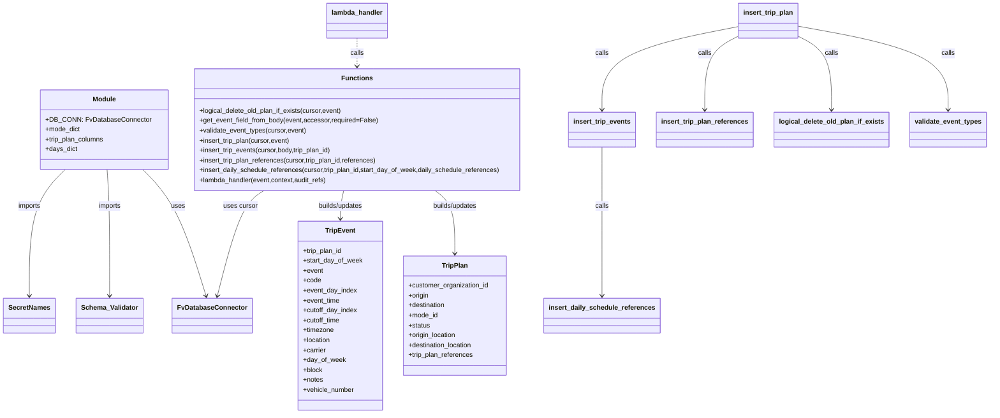

# Diagram: shipment_core/shipment_trip_plan_service/shipment_trip_plan_service/trip_plan/put_trip_plan.py


> Auto-generated by Obscura crawlers

## Diagram 1



### SVG

<svg id="container" width="2343.74609375" xmlns="http://www.w3.org/2000/svg" class="classDiagram" height="998" viewBox="0 0 2343.74609375 998" role="graphics-document document" aria-roledescription="class"><style>#container{font-family:"trebuchet ms",verdana,arial,sans-serif;font-size:16px;fill:#333;}@keyframes edge-animation-frame{from{stroke-dashoffset:0;}}@keyframes dash{to{stroke-dashoffset:0;}}#container .edge-animation-slow{stroke-dasharray:9,5!important;stroke-dashoffset:900;animation:dash 50s linear infinite;stroke-linecap:round;}#container .edge-animation-fast{stroke-dasharray:9,5!important;stroke-dashoffset:900;animation:dash 20s linear infinite;stroke-linecap:round;}#container .error-icon{fill:#552222;}#container .error-text{fill:#552222;stroke:#552222;}#container .edge-thickness-normal{stroke-width:1px;}#container .edge-thickness-thick{stroke-width:3.5px;}#container .edge-pattern-solid{stroke-dasharray:0;}#container .edge-thickness-invisible{stroke-width:0;fill:none;}#container .edge-pattern-dashed{stroke-dasharray:3;}#container .edge-pattern-dotted{stroke-dasharray:2;}#container .marker{fill:#333333;stroke:#333333;}#container .marker.cross{stroke:#333333;}#container svg{font-family:"trebuchet ms",verdana,arial,sans-serif;font-size:16px;}#container p{margin:0;}#container g.classGroup text{fill:#9370DB;stroke:none;font-family:"trebuchet ms",verdana,arial,sans-serif;font-size:10px;}#container g.classGroup text .title{font-weight:bolder;}#container .nodeLabel,#container .edgeLabel{color:#131300;}#container .edgeLabel .label rect{fill:#ECECFF;}#container .label text{fill:#131300;}#container .labelBkg{background:#ECECFF;}#container .edgeLabel .label span{background:#ECECFF;}#container .classTitle{font-weight:bolder;}#container .node rect,#container .node circle,#container .node ellipse,#container .node polygon,#container .node path{fill:#ECECFF;stroke:#9370DB;stroke-width:1px;}#container .divider{stroke:#9370DB;stroke-width:1;}#container g.clickable{cursor:pointer;}#container g.classGroup rect{fill:#ECECFF;stroke:#9370DB;}#container g.classGroup line{stroke:#9370DB;stroke-width:1;}#container .classLabel .box{stroke:none;stroke-width:0;fill:#ECECFF;opacity:0.5;}#container .classLabel .label{fill:#9370DB;font-size:10px;}#container .relation{stroke:#333333;stroke-width:1;fill:none;}#container .dashed-line{stroke-dasharray:3;}#container .dotted-line{stroke-dasharray:1 2;}#container #compositionStart,#container .composition{fill:#333333!important;stroke:#333333!important;stroke-width:1;}#container #compositionEnd,#container .composition{fill:#333333!important;stroke:#333333!important;stroke-width:1;}#container #dependencyStart,#container .dependency{fill:#333333!important;stroke:#333333!important;stroke-width:1;}#container #dependencyStart,#container .dependency{fill:#333333!important;stroke:#333333!important;stroke-width:1;}#container #extensionStart,#container .extension{fill:transparent!important;stroke:#333333!important;stroke-width:1;}#container #extensionEnd,#container .extension{fill:transparent!important;stroke:#333333!important;stroke-width:1;}#container #aggregationStart,#container .aggregation{fill:transparent!important;stroke:#333333!important;stroke-width:1;}#container #aggregationEnd,#container .aggregation{fill:transparent!important;stroke:#333333!important;stroke-width:1;}#container #lollipopStart,#container .lollipop{fill:#ECECFF!important;stroke:#333333!important;stroke-width:1;}#container #lollipopEnd,#container .lollipop{fill:#ECECFF!important;stroke:#333333!important;stroke-width:1;}#container .edgeTerminals{font-size:11px;line-height:initial;}#container .classTitleText{text-anchor:middle;font-size:18px;fill:#333;}#container .label-icon{display:inline-block;height:1em;overflow:visible;vertical-align:-0.125em;}#container .node .label-icon path{fill:currentColor;stroke:revert;stroke-width:revert;}#container :root{--mermaid-font-family:"trebuchet ms",verdana,arial,sans-serif;}</style><g><defs><marker id="container_class-aggregationStart" class="marker aggregation class" refX="18" refY="7" markerWidth="190" markerHeight="240" orient="auto"><path d="M 18,7 L9,13 L1,7 L9,1 Z"></path></marker></defs><defs><marker id="container_class-aggregationEnd" class="marker aggregation class" refX="1" refY="7" markerWidth="20" markerHeight="28" orient="auto"><path d="M 18,7 L9,13 L1,7 L9,1 Z"></path></marker></defs><defs><marker id="container_class-extensionStart" class="marker extension class" refX="18" refY="7" markerWidth="190" markerHeight="240" orient="auto"><path d="M 1,7 L18,13 V 1 Z"></path></marker></defs><defs><marker id="container_class-extensionEnd" class="marker extension class" refX="1" refY="7" markerWidth="20" markerHeight="28" orient="auto"><path d="M 1,1 V 13 L18,7 Z"></path></marker></defs><defs><marker id="container_class-compositionStart" class="marker composition class" refX="18" refY="7" markerWidth="190" markerHeight="240" orient="auto"><path d="M 18,7 L9,13 L1,7 L9,1 Z"></path></marker></defs><defs><marker id="container_class-compositionEnd" class="marker composition class" refX="1" refY="7" markerWidth="20" markerHeight="28" orient="auto"><path d="M 18,7 L9,13 L1,7 L9,1 Z"></path></marker></defs><defs><marker id="container_class-dependencyStart" class="marker dependency class" refX="6" refY="7" markerWidth="190" markerHeight="240" orient="auto"><path d="M 5,7 L9,13 L1,7 L9,1 Z"></path></marker></defs><defs><marker id="container_class-dependencyEnd" class="marker dependency class" refX="13" refY="7" markerWidth="20" markerHeight="28" orient="auto"><path d="M 18,7 L9,13 L14,7 L9,1 Z"></path></marker></defs><defs><marker id="container_class-lollipopStart" class="marker lollipop class" refX="13" refY="7" markerWidth="190" markerHeight="240" orient="auto"><circle stroke="black" fill="transparent" cx="7" cy="7" r="6"></circle></marker></defs><defs><marker id="container_class-lollipopEnd" class="marker lollipop class" refX="1" refY="7" markerWidth="190" markerHeight="240" orient="auto"><circle stroke="black" fill="transparent" cx="7" cy="7" r="6"></circle></marker></defs><g class="root"><g class="clusters"></g><g class="edgePaths"><path d="M340.8,409L355.278,423.667C369.757,438.333,398.713,467.667,423.718,518.54C448.723,569.413,469.777,641.826,480.304,678.032L490.83,714.239" id="id_Module_FvDatabaseConnector_1" class="edge-thickness-normal edge-pattern-solid relation" style=";;;" data-edge="true" data-et="edge" data-id="id_Module_FvDatabaseConnector_1" data-points="W3sieCI6MzQwLjgwMDE4NjgyMDY1MjIsInkiOjQwOX0seyJ4Ijo0MjcuNjY5OTIxODc1LCJ5Ijo0OTd9LHsieCI6NDkyLjUwNTU5NDA0NDgxMTM1LCJ5Ijo3MjB9XQ==" marker-end="url(#container_class-dependencyEnd)"></path><path d="M251.021,409L251.783,423.667C252.545,438.333,254.07,467.667,254.832,518.5C255.594,569.333,255.594,641.667,255.594,677.833L255.594,714" id="id_Module_Schema_Validator_2" class="edge-thickness-normal edge-pattern-solid relation" style=";;;" data-edge="true" data-et="edge" data-id="id_Module_Schema_Validator_2" data-points="W3sieCI6MjUxLjAyMTMxNDUzODA0MzQ3LCJ5Ijo0MDl9LHsieCI6MjU1LjU5Mzc1LCJ5Ijo0OTd9LHsieCI6MjU1LjU5Mzc1LCJ5Ijo3MjB9XQ==" marker-end="url(#container_class-dependencyEnd)"></path><path d="M153.163,409L138.974,423.667C124.785,438.333,96.408,467.667,82.22,518.5C68.031,569.333,68.031,641.667,68.031,677.833L68.031,714" id="id_Module_SecretNames_3" class="edge-thickness-normal edge-pattern-solid relation" style=";;;" data-edge="true" data-et="edge" data-id="id_Module_SecretNames_3" data-points="W3sieCI6MTUzLjE2MjYxODg4NTg2OTU2LCJ5Ijo0MDl9LHsieCI6NjguMDMxMjUsInkiOjQ5N30seyJ4Ijo2OC4wMzEyNSwieSI6NzIwfV0=" marker-end="url(#container_class-dependencyEnd)"></path><path d="M1039.004,460L1047.054,466.167C1055.104,472.333,1071.204,484.667,1079.255,510C1087.305,535.333,1087.305,573.667,1087.305,592.833L1087.305,612" id="id_Functions_TripPlan_4" class="edge-thickness-normal edge-pattern-solid relation" style=";;;" data-edge="true" data-et="edge" data-id="id_Functions_TripPlan_4" data-points="W3sieCI6MTAzOS4wMDM3NTc2NDI2NjMsInkiOjQ2MH0seyJ4IjoxMDg3LjMwNDY4NzUsInkiOjQ5N30seyJ4IjoxMDg3LjMwNDY4NzUsInkiOjYxOH1d" marker-end="url(#container_class-dependencyEnd)"></path><path d="M819.037,460L817.86,466.167C816.682,472.333,814.328,484.667,813.15,496C811.973,507.333,811.973,517.667,811.973,522.833L811.973,528" id="id_Functions_TripEvent_5" class="edge-thickness-normal edge-pattern-solid relation" style=";;;" data-edge="true" data-et="edge" data-id="id_Functions_TripEvent_5" data-points="W3sieCI6ODE5LjAzNzQwNjU4OTY3MzksInkiOjQ2MH0seyJ4Ijo4MTEuOTcyNjU2MjUsInkiOjQ5N30seyJ4Ijo4MTEuOTcyNjU2MjUsInkiOjUzNH1d" marker-end="url(#container_class-dependencyEnd)"></path><path d="M623.315,460L613.927,466.167C604.539,472.333,585.762,484.667,567.87,527.027C549.977,569.386,532.968,641.773,524.463,677.966L515.958,714.159" id="id_Functions_FvDatabaseConnector_6" class="edge-thickness-normal edge-pattern-solid relation" style=";;;" data-edge="true" data-et="edge" data-id="id_Functions_FvDatabaseConnector_6" data-points="W3sieCI6NjIzLjMxNDYzMzU3Njc2NjMsInkiOjQ2MH0seyJ4Ijo1NjYuOTg2MzI4MTI1LCJ5Ijo0OTd9LHsieCI6NTE0LjU4NTkzMDEyOTcxNywieSI6NzIwfV0=" marker-end="url(#container_class-dependencyEnd)"></path><path d="M847.105,92L847.105,98.167C847.105,104.333,847.105,116.667,847.105,128C847.105,139.333,847.105,149.667,847.105,154.833L847.105,160" id="id_lambda_handler_Functions_7" class="edge-thickness-normal edge-pattern-dashed relation" style=";;;" data-edge="true" data-et="edge" data-id="id_lambda_handler_Functions_7" data-points="W3sieCI6ODQ3LjEwNTQ2ODc1LCJ5Ijo5Mn0seyJ4Ijo4NDcuMTA1NDY4NzUsInkiOjEyOX0seyJ4Ijo4NDcuMTA1NDY4NzUsInkiOjE2Nn1d" marker-end="url(#container_class-dependencyEnd)"></path><path d="M1894.031,63.252L1952.648,74.21C2011.264,85.168,2128.497,107.084,2187.114,140.709C2245.73,174.333,2245.73,219.667,2245.73,242.333L2245.73,265" id="id_insert_trip_plan_validate_event_types_8" class="edge-thickness-normal edge-pattern-solid relation" style=";;;" data-edge="true" data-et="edge" data-id="id_insert_trip_plan_validate_event_types_8" data-points="W3sieCI6MTg5NC4wMzEyNSwieSI6NjMuMjUyNDcwMzUxMTY0MjM0fSx7IngiOjIyNDUuNzMwNDY4NzUsInkiOjEyOX0seyJ4IjoyMjQ1LjczMDQ2ODc1LCJ5IjoyNzF9XQ==" marker-end="url(#container_class-dependencyEnd)"></path><path d="M1894.031,87.658L1907.002,94.549C1919.973,101.439,1945.914,115.219,1958.885,144.776C1971.855,174.333,1971.855,219.667,1971.855,242.333L1971.855,265" id="id_insert_trip_plan_logical_delete_old_plan_if_exists_9" class="edge-thickness-normal edge-pattern-solid relation" style=";;;" data-edge="true" data-et="edge" data-id="id_insert_trip_plan_logical_delete_old_plan_if_exists_9" data-points="W3sieCI6MTg5NC4wMzEyNSwieSI6ODcuNjU4Mzc1MTQxMTgzNTd9LHsieCI6MTk3MS44NTU0Njg3NSwieSI6MTI5fSx7IngiOjE5NzEuODU1NDY4NzUsInkiOjI3MX1d" marker-end="url(#container_class-dependencyEnd)"></path><path d="M1752.25,87.658L1739.279,94.549C1726.309,101.439,1700.367,115.219,1687.396,144.776C1674.426,174.333,1674.426,219.667,1674.426,242.333L1674.426,265" id="id_insert_trip_plan_insert_trip_plan_references_10" class="edge-thickness-normal edge-pattern-solid relation" style=";;;" data-edge="true" data-et="edge" data-id="id_insert_trip_plan_insert_trip_plan_references_10" data-points="W3sieCI6MTc1Mi4yNSwieSI6ODcuNjU4Mzc1MTQxMTgzNTd9LHsieCI6MTY3NC40MjU3ODEyNSwieSI6MTI5fSx7IngiOjE2NzQuNDI1NzgxMjUsInkiOjI3MX1d" marker-end="url(#container_class-dependencyEnd)"></path><path d="M1752.25,64.313L1698.852,75.094C1645.454,85.875,1538.659,107.438,1485.261,140.886C1431.863,174.333,1431.863,219.667,1431.863,242.333L1431.863,265" id="id_insert_trip_plan_insert_trip_events_11" class="edge-thickness-normal edge-pattern-solid relation" style=";;;" data-edge="true" data-et="edge" data-id="id_insert_trip_plan_insert_trip_events_11" data-points="W3sieCI6MTc1Mi4yNSwieSI6NjQuMzEzMDE3MjYxMTczODR9LHsieCI6MTQzMS44NjMyODEyNSwieSI6MTI5fSx7IngiOjE0MzEuODYzMjgxMjUsInkiOjI3MX1d" marker-end="url(#container_class-dependencyEnd)"></path><path d="M1431.863,355L1431.863,378.667C1431.863,402.333,1431.863,449.667,1431.863,509.5C1431.863,569.333,1431.863,641.667,1431.863,677.833L1431.863,714" id="id_insert_trip_events_insert_daily_schedule_references_12" class="edge-thickness-normal edge-pattern-solid relation" style=";;;" data-edge="true" data-et="edge" data-id="id_insert_trip_events_insert_daily_schedule_references_12" data-points="W3sieCI6MTQzMS44NjMyODEyNSwieSI6MzU1fSx7IngiOjE0MzEuODYzMjgxMjUsInkiOjQ5N30seyJ4IjoxNDMxLjg2MzI4MTI1LCJ5Ijo3MjB9XQ==" marker-end="url(#container_class-dependencyEnd)"></path></g><g class="edgeLabels"><g class="edgeLabel" transform="translate(442.82672, 549.13128)"><g class="label" data-id="id_Module_FvDatabaseConnector_1" transform="translate(-16.4921875, -12)"><foreignObject width="32.984375" height="24"><div xmlns="http://www.w3.org/1999/xhtml" class="labelBkg" style="display: table-cell; white-space: nowrap; line-height: 1.5; max-width: 200px; text-align: center;"><span class="edgeLabel"><p>uses</p></span></div></foreignObject></g></g><g class="edgeLabel" transform="translate(255.59375, 497)"><g class="label" data-id="id_Module_Schema_Validator_2" transform="translate(-28.25, -12)"><foreignObject width="56.5" height="24"><div xmlns="http://www.w3.org/1999/xhtml" class="labelBkg" style="display: table-cell; white-space: nowrap; line-height: 1.5; max-width: 200px; text-align: center;"><span class="edgeLabel"><p>imports</p></span></div></foreignObject></g></g><g class="edgeLabel" transform="translate(68.03125, 497)"><g class="label" data-id="id_Module_SecretNames_3" transform="translate(-28.25, -12)"><foreignObject width="56.5" height="24"><div xmlns="http://www.w3.org/1999/xhtml" class="labelBkg" style="display: table-cell; white-space: nowrap; line-height: 1.5; max-width: 200px; text-align: center;"><span class="edgeLabel"><p>imports</p></span></div></foreignObject></g></g><g class="edgeLabel" transform="translate(1087.3046875, 497)"><g class="label" data-id="id_Functions_TripPlan_4" transform="translate(-55.8203125, -12)"><foreignObject width="111.640625" height="24"><div xmlns="http://www.w3.org/1999/xhtml" class="labelBkg" style="display: table-cell; white-space: nowrap; line-height: 1.5; max-width: 200px; text-align: center;"><span class="edgeLabel"><p>builds/updates</p></span></div></foreignObject></g></g><g class="edgeLabel" transform="translate(811.97265625, 497)"><g class="label" data-id="id_Functions_TripEvent_5" transform="translate(-55.8203125, -12)"><foreignObject width="111.640625" height="24"><div xmlns="http://www.w3.org/1999/xhtml" class="labelBkg" style="display: table-cell; white-space: nowrap; line-height: 1.5; max-width: 200px; text-align: center;"><span class="edgeLabel"><p>builds/updates</p></span></div></foreignObject></g></g><g class="edgeLabel" transform="translate(548.49422, 575.69673)"><g class="label" data-id="id_Functions_FvDatabaseConnector_6" transform="translate(-41.4765625, -12)"><foreignObject width="82.953125" height="24"><div xmlns="http://www.w3.org/1999/xhtml" class="labelBkg" style="display: table-cell; white-space: nowrap; line-height: 1.5; max-width: 200px; text-align: center;"><span class="edgeLabel"><p>uses cursor</p></span></div></foreignObject></g></g><g class="edgeLabel" transform="translate(847.10546875, 129)"><g class="label" data-id="id_lambda_handler_Functions_7" transform="translate(-16.4453125, -12)"><foreignObject width="32.890625" height="24"><div xmlns="http://www.w3.org/1999/xhtml" class="labelBkg" style="display: table-cell; white-space: nowrap; line-height: 1.5; max-width: 200px; text-align: center;"><span class="edgeLabel"><p>calls</p></span></div></foreignObject></g></g><g class="edgeLabel" transform="translate(2245.73046875, 129)"><g class="label" data-id="id_insert_trip_plan_validate_event_types_8" transform="translate(-16.4453125, -12)"><foreignObject width="32.890625" height="24"><div xmlns="http://www.w3.org/1999/xhtml" class="labelBkg" style="display: table-cell; white-space: nowrap; line-height: 1.5; max-width: 200px; text-align: center;"><span class="edgeLabel"><p>calls</p></span></div></foreignObject></g></g><g class="edgeLabel" transform="translate(1971.85546875, 129)"><g class="label" data-id="id_insert_trip_plan_logical_delete_old_plan_if_exists_9" transform="translate(-16.4453125, -12)"><foreignObject width="32.890625" height="24"><div xmlns="http://www.w3.org/1999/xhtml" class="labelBkg" style="display: table-cell; white-space: nowrap; line-height: 1.5; max-width: 200px; text-align: center;"><span class="edgeLabel"><p>calls</p></span></div></foreignObject></g></g><g class="edgeLabel" transform="translate(1674.42578125, 129)"><g class="label" data-id="id_insert_trip_plan_insert_trip_plan_references_10" transform="translate(-16.4453125, -12)"><foreignObject width="32.890625" height="24"><div xmlns="http://www.w3.org/1999/xhtml" class="labelBkg" style="display: table-cell; white-space: nowrap; line-height: 1.5; max-width: 200px; text-align: center;"><span class="edgeLabel"><p>calls</p></span></div></foreignObject></g></g><g class="edgeLabel" transform="translate(1431.86328125, 129)"><g class="label" data-id="id_insert_trip_plan_insert_trip_events_11" transform="translate(-16.4453125, -12)"><foreignObject width="32.890625" height="24"><div xmlns="http://www.w3.org/1999/xhtml" class="labelBkg" style="display: table-cell; white-space: nowrap; line-height: 1.5; max-width: 200px; text-align: center;"><span class="edgeLabel"><p>calls</p></span></div></foreignObject></g></g><g class="edgeLabel" transform="translate(1431.86328125, 497)"><g class="label" data-id="id_insert_trip_events_insert_daily_schedule_references_12" transform="translate(-16.4453125, -12)"><foreignObject width="32.890625" height="24"><div xmlns="http://www.w3.org/1999/xhtml" class="labelBkg" style="display: table-cell; white-space: nowrap; line-height: 1.5; max-width: 200px; text-align: center;"><span class="edgeLabel"><p>calls</p></span></div></foreignObject></g></g></g><g class="nodes"><g class="node default" id="classId-Module-0" transform="translate(246.033203125, 313)"><g class="basic label-container"><path d="M-146.375 -96 L146.375 -96 L146.375 96 L-146.375 96" stroke="none" stroke-width="0" fill="#ECECFF" style=""></path><path d="M-146.375 -96 C-58.229983120021274 -96, 29.915033759957453 -96, 146.375 -96 M-146.375 -96 C-71.16378411366313 -96, 4.047431772673747 -96, 146.375 -96 M146.375 -96 C146.375 -42.29529851473145, 146.375 11.409402970537101, 146.375 96 M146.375 -96 C146.375 -23.289377321031424, 146.375 49.42124535793715, 146.375 96 M146.375 96 C31.948119604931193 96, -82.47876079013761 96, -146.375 96 M146.375 96 C37.58645303674918 96, -71.20209392650165 96, -146.375 96 M-146.375 96 C-146.375 42.18730299211552, -146.375 -11.625394015768961, -146.375 -96 M-146.375 96 C-146.375 54.270661507112514, -146.375 12.541323014225028, -146.375 -96" stroke="#9370DB" stroke-width="1.3" fill="none" stroke-dasharray="0 0" style=""></path></g><g class="annotation-group text" transform="translate(0, -72)"></g><g class="label-group text" transform="translate(-27.09375, -72)"><g class="label" style="font-weight: bolder" transform="translate(0,-12)"><foreignObject width="54.1875" height="24"><div xmlns="http://www.w3.org/1999/xhtml" style="display: table-cell; white-space: nowrap; line-height: 1.5; max-width: 104px; text-align: center;"><span class="nodeLabel markdown-node-label" style=""><p>Module</p></span></div></foreignObject></g></g><g class="members-group text" transform="translate(-134.375, -24)"><g class="label" style="" transform="translate(0,-12)"><foreignObject width="241.65625" height="24"><div xmlns="http://www.w3.org/1999/xhtml" style="display: table-cell; white-space: nowrap; line-height: 1.5; max-width: 300px; text-align: center;"><span class="nodeLabel markdown-node-label" style=""><p>+DB_CONN: FvDatabaseConnector</p></span></div></foreignObject></g><g class="label" style="" transform="translate(0,12)"><foreignObject width="84.515625" height="24"><div xmlns="http://www.w3.org/1999/xhtml" style="display: table-cell; white-space: nowrap; line-height: 1.5; max-width: 142px; text-align: center;"><span class="nodeLabel markdown-node-label" style=""><p>+mode_dict</p></span></div></foreignObject></g><g class="label" style="" transform="translate(0,36)"><foreignObject width="143.296875" height="24"><div xmlns="http://www.w3.org/1999/xhtml" style="display: table-cell; white-space: nowrap; line-height: 1.5; max-width: 201px; text-align: center;"><span class="nodeLabel markdown-node-label" style=""><p>+trip_plan_columns</p></span></div></foreignObject></g><g class="label" style="" transform="translate(0,60)"><foreignObject width="76.4375" height="24"><div xmlns="http://www.w3.org/1999/xhtml" style="display: table-cell; white-space: nowrap; line-height: 1.5; max-width: 134px; text-align: center;"><span class="nodeLabel markdown-node-label" style=""><p>+days_dict</p></span></div></foreignObject></g></g><g class="methods-group text" transform="translate(-134.375, 96)"></g><g class="divider" style=""><path d="M-146.375 -48 C-62.032440879052004 -48, 22.310118241895992 -48, 146.375 -48 M-146.375 -48 C-70.55471654763973 -48, 5.265566904720544 -48, 146.375 -48" stroke="#9370DB" stroke-width="1.3" fill="none" stroke-dasharray="0 0" style=""></path></g><g class="divider" style=""><path d="M-146.375 72 C-83.56180033906121 72, -20.748600678122415 72, 146.375 72 M-146.375 72 C-37.76053231120797 72, 70.85393537758407 72, 146.375 72" stroke="#9370DB" stroke-width="1.3" fill="none" stroke-dasharray="0 0" style=""></path></g></g><g class="node default" id="classId-FvDatabaseConnector-1" transform="translate(504.716796875, 762)"><g class="basic label-container"><path d="M-91.3046875 -42 L91.3046875 -42 L91.3046875 42 L-91.3046875 42" stroke="none" stroke-width="0" fill="#ECECFF" style=""></path><path d="M-91.3046875 -42 C-25.842142691504108 -42, 39.620402116991784 -42, 91.3046875 -42 M-91.3046875 -42 C-37.777040465209 -42, 15.750606569582004 -42, 91.3046875 -42 M91.3046875 -42 C91.3046875 -16.685244373567873, 91.3046875 8.629511252864255, 91.3046875 42 M91.3046875 -42 C91.3046875 -24.682229870008616, 91.3046875 -7.364459740017232, 91.3046875 42 M91.3046875 42 C18.73189536214727 42, -53.84089677570546 42, -91.3046875 42 M91.3046875 42 C40.72633362074251 42, -9.852020258514983 42, -91.3046875 42 M-91.3046875 42 C-91.3046875 8.86818500729808, -91.3046875 -24.26362998540384, -91.3046875 -42 M-91.3046875 42 C-91.3046875 25.12457840612255, -91.3046875 8.249156812245097, -91.3046875 -42" stroke="#9370DB" stroke-width="1.3" fill="none" stroke-dasharray="0 0" style=""></path></g><g class="annotation-group text" transform="translate(0, -18)"></g><g class="label-group text" transform="translate(-79.3046875, -18)"><g class="label" style="font-weight: bolder" transform="translate(0,-12)"><foreignObject width="158.609375" height="24"><div xmlns="http://www.w3.org/1999/xhtml" style="display: table-cell; white-space: nowrap; line-height: 1.5; max-width: 207px; text-align: center;"><span class="nodeLabel markdown-node-label" style=""><p>FvDatabaseConnector</p></span></div></foreignObject></g></g><g class="members-group text" transform="translate(-79.3046875, 30)"></g><g class="methods-group text" transform="translate(-79.3046875, 60)"></g><g class="divider" style=""><path d="M-91.3046875 6 C-23.034643753064017 6, 45.235399993871965 6, 91.3046875 6 M-91.3046875 6 C-29.5444487088824 6, 32.2157900822352 6, 91.3046875 6" stroke="#9370DB" stroke-width="1.3" fill="none" stroke-dasharray="0 0" style=""></path></g><g class="divider" style=""><path d="M-91.3046875 24 C-54.30249682307024 24, -17.300306146140485 24, 91.3046875 24 M-91.3046875 24 C-47.29007391272689 24, -3.2754603254537784 24, 91.3046875 24" stroke="#9370DB" stroke-width="1.3" fill="none" stroke-dasharray="0 0" style=""></path></g></g><g class="node default" id="classId-Schema_Validator-2" transform="translate(255.59375, 762)"><g class="basic label-container"><path d="M-77.53125 -42 L77.53125 -42 L77.53125 42 L-77.53125 42" stroke="none" stroke-width="0" fill="#ECECFF" style=""></path><path d="M-77.53125 -42 C-38.13079732520167 -42, 1.2696553495966612 -42, 77.53125 -42 M-77.53125 -42 C-41.59074928496638 -42, -5.6502485699327565 -42, 77.53125 -42 M77.53125 -42 C77.53125 -22.112250726725513, 77.53125 -2.224501453451026, 77.53125 42 M77.53125 -42 C77.53125 -11.603283748887982, 77.53125 18.793432502224036, 77.53125 42 M77.53125 42 C45.643043104583015 42, 13.754836209166037 42, -77.53125 42 M77.53125 42 C27.121879740474974 42, -23.287490519050053 42, -77.53125 42 M-77.53125 42 C-77.53125 22.09386986612975, -77.53125 2.1877397322595016, -77.53125 -42 M-77.53125 42 C-77.53125 16.25370968173699, -77.53125 -9.492580636526021, -77.53125 -42" stroke="#9370DB" stroke-width="1.3" fill="none" stroke-dasharray="0 0" style=""></path></g><g class="annotation-group text" transform="translate(0, -18)"></g><g class="label-group text" transform="translate(-65.53125, -18)"><g class="label" style="font-weight: bolder" transform="translate(0,-12)"><foreignObject width="131.0625" height="24"><div xmlns="http://www.w3.org/1999/xhtml" style="display: table-cell; white-space: nowrap; line-height: 1.5; max-width: 181px; text-align: center;"><span class="nodeLabel markdown-node-label" style=""><p>Schema_Validator</p></span></div></foreignObject></g></g><g class="members-group text" transform="translate(-65.53125, 30)"></g><g class="methods-group text" transform="translate(-65.53125, 60)"></g><g class="divider" style=""><path d="M-77.53125 6 C-18.32556442687789 6, 40.88012114624422 6, 77.53125 6 M-77.53125 6 C-21.724471623545142 6, 34.082306752909716 6, 77.53125 6" stroke="#9370DB" stroke-width="1.3" fill="none" stroke-dasharray="0 0" style=""></path></g><g class="divider" style=""><path d="M-77.53125 24 C-34.574478037478606 24, 8.382293925042788 24, 77.53125 24 M-77.53125 24 C-33.25306531335233 24, 11.02511937329534 24, 77.53125 24" stroke="#9370DB" stroke-width="1.3" fill="none" stroke-dasharray="0 0" style=""></path></g></g><g class="node default" id="classId-SecretNames-3" transform="translate(68.03125, 762)"><g class="basic label-container"><path d="M-60.03125 -42 L60.03125 -42 L60.03125 42 L-60.03125 42" stroke="none" stroke-width="0" fill="#ECECFF" style=""></path><path d="M-60.03125 -42 C-35.42649078521394 -42, -10.821731570427879 -42, 60.03125 -42 M-60.03125 -42 C-26.46268280754859 -42, 7.105884384902822 -42, 60.03125 -42 M60.03125 -42 C60.03125 -22.966840515267926, 60.03125 -3.933681030535851, 60.03125 42 M60.03125 -42 C60.03125 -12.365677921884764, 60.03125 17.268644156230472, 60.03125 42 M60.03125 42 C18.385889645524465 42, -23.25947070895107 42, -60.03125 42 M60.03125 42 C27.292472901133706 42, -5.446304197732587 42, -60.03125 42 M-60.03125 42 C-60.03125 12.043445626784365, -60.03125 -17.91310874643127, -60.03125 -42 M-60.03125 42 C-60.03125 15.073632512613461, -60.03125 -11.852734974773078, -60.03125 -42" stroke="#9370DB" stroke-width="1.3" fill="none" stroke-dasharray="0 0" style=""></path></g><g class="annotation-group text" transform="translate(0, -18)"></g><g class="label-group text" transform="translate(-48.03125, -18)"><g class="label" style="font-weight: bolder" transform="translate(0,-12)"><foreignObject width="96.0625" height="24"><div xmlns="http://www.w3.org/1999/xhtml" style="display: table-cell; white-space: nowrap; line-height: 1.5; max-width: 145px; text-align: center;"><span class="nodeLabel markdown-node-label" style=""><p>SecretNames</p></span></div></foreignObject></g></g><g class="members-group text" transform="translate(-48.03125, 30)"></g><g class="methods-group text" transform="translate(-48.03125, 60)"></g><g class="divider" style=""><path d="M-60.03125 6 C-25.585696440665195 6, 8.85985711866961 6, 60.03125 6 M-60.03125 6 C-15.80553825877211 6, 28.42017348245578 6, 60.03125 6" stroke="#9370DB" stroke-width="1.3" fill="none" stroke-dasharray="0 0" style=""></path></g><g class="divider" style=""><path d="M-60.03125 24 C-12.506753242405615 24, 35.01774351518877 24, 60.03125 24 M-60.03125 24 C-32.9362318221761 24, -5.841213644352187 24, 60.03125 24" stroke="#9370DB" stroke-width="1.3" fill="none" stroke-dasharray="0 0" style=""></path></g></g><g class="node default" id="classId-TripPlan-4" transform="translate(1087.3046875, 762)"><g class="basic label-container"><path d="M-124.80078125 -144 L124.80078125 -144 L124.80078125 144 L-124.80078125 144" stroke="none" stroke-width="0" fill="#ECECFF" style=""></path><path d="M-124.80078125 -144 C-44.29846594383237 -144, 36.20384936233526 -144, 124.80078125 -144 M-124.80078125 -144 C-58.26347408715998 -144, 8.273833075680045 -144, 124.80078125 -144 M124.80078125 -144 C124.80078125 -41.952330036177216, 124.80078125 60.09533992764557, 124.80078125 144 M124.80078125 -144 C124.80078125 -36.99065504769695, 124.80078125 70.0186899046061, 124.80078125 144 M124.80078125 144 C64.71210554030483 144, 4.623429830609666 144, -124.80078125 144 M124.80078125 144 C62.01323980632609 144, -0.7743016373478184 144, -124.80078125 144 M-124.80078125 144 C-124.80078125 28.878144690097557, -124.80078125 -86.24371061980489, -124.80078125 -144 M-124.80078125 144 C-124.80078125 72.7508697564475, -124.80078125 1.501739512895, -124.80078125 -144" stroke="#9370DB" stroke-width="1.3" fill="none" stroke-dasharray="0 0" style=""></path></g><g class="annotation-group text" transform="translate(0, -120)"></g><g class="label-group text" transform="translate(-30.3828125, -120)"><g class="label" style="font-weight: bolder" transform="translate(0,-12)"><foreignObject width="60.765625" height="24"><div xmlns="http://www.w3.org/1999/xhtml" style="display: table-cell; white-space: nowrap; line-height: 1.5; max-width: 110px; text-align: center;"><span class="nodeLabel markdown-node-label" style=""><p>TripPlan</p></span></div></foreignObject></g></g><g class="members-group text" transform="translate(-112.80078125, -72)"><g class="label" style="" transform="translate(0,-12)"><foreignObject width="195.21875" height="24"><div xmlns="http://www.w3.org/1999/xhtml" style="display: table-cell; white-space: nowrap; line-height: 1.5; max-width: 253px; text-align: center;"><span class="nodeLabel markdown-node-label" style=""><p>+customer_organization_id</p></span></div></foreignObject></g><g class="label" style="" transform="translate(0,12)"><foreignObject width="50.234375" height="24"><div xmlns="http://www.w3.org/1999/xhtml" style="display: table-cell; white-space: nowrap; line-height: 1.5; max-width: 108px; text-align: center;"><span class="nodeLabel markdown-node-label" style=""><p>+origin</p></span></div></foreignObject></g><g class="label" style="" transform="translate(0,36)"><foreignObject width="91.125" height="24"><div xmlns="http://www.w3.org/1999/xhtml" style="display: table-cell; white-space: nowrap; line-height: 1.5; max-width: 148px; text-align: center;"><span class="nodeLabel markdown-node-label" style=""><p>+destination</p></span></div></foreignObject></g><g class="label" style="" transform="translate(0,60)"><foreignObject width="71.421875" height="24"><div xmlns="http://www.w3.org/1999/xhtml" style="display: table-cell; white-space: nowrap; line-height: 1.5; max-width: 129px; text-align: center;"><span class="nodeLabel markdown-node-label" style=""><p>+mode_id</p></span></div></foreignObject></g><g class="label" style="" transform="translate(0,84)"><foreignObject width="52.390625" height="24"><div xmlns="http://www.w3.org/1999/xhtml" style="display: table-cell; white-space: nowrap; line-height: 1.5; max-width: 110px; text-align: center;"><span class="nodeLabel markdown-node-label" style=""><p>+status</p></span></div></foreignObject></g><g class="label" style="" transform="translate(0,108)"><foreignObject width="117.546875" height="24"><div xmlns="http://www.w3.org/1999/xhtml" style="display: table-cell; white-space: nowrap; line-height: 1.5; max-width: 175px; text-align: center;"><span class="nodeLabel markdown-node-label" style=""><p>+origin_location</p></span></div></foreignObject></g><g class="label" style="" transform="translate(0,132)"><foreignObject width="158.4375" height="24"><div xmlns="http://www.w3.org/1999/xhtml" style="display: table-cell; white-space: nowrap; line-height: 1.5; max-width: 216px; text-align: center;"><span class="nodeLabel markdown-node-label" style=""><p>+destination_location</p></span></div></foreignObject></g><g class="label" style="" transform="translate(0,156)"><foreignObject width="158.046875" height="24"><div xmlns="http://www.w3.org/1999/xhtml" style="display: table-cell; white-space: nowrap; line-height: 1.5; max-width: 215px; text-align: center;"><span class="nodeLabel markdown-node-label" style=""><p>+trip_plan_references</p></span></div></foreignObject></g></g><g class="methods-group text" transform="translate(-112.80078125, 144)"></g><g class="divider" style=""><path d="M-124.80078125 -96 C-40.09714868781961 -96, 44.60648387436078 -96, 124.80078125 -96 M-124.80078125 -96 C-64.69692200724921 -96, -4.593062764498441 -96, 124.80078125 -96" stroke="#9370DB" stroke-width="1.3" fill="none" stroke-dasharray="0 0" style=""></path></g><g class="divider" style=""><path d="M-124.80078125 120 C-54.85794504282438 120, 15.084891164351234 120, 124.80078125 120 M-124.80078125 120 C-47.95984729090037 120, 28.88108666819926 120, 124.80078125 120" stroke="#9370DB" stroke-width="1.3" fill="none" stroke-dasharray="0 0" style=""></path></g></g><g class="node default" id="classId-TripEvent-5" transform="translate(811.97265625, 762)"><g class="basic label-container"><path d="M-100.53125 -228 L100.53125 -228 L100.53125 228 L-100.53125 228" stroke="none" stroke-width="0" fill="#ECECFF" style=""></path><path d="M-100.53125 -228 C-44.28917114600295 -228, 11.9529077079941 -228, 100.53125 -228 M-100.53125 -228 C-60.171278247365485 -228, -19.81130649473097 -228, 100.53125 -228 M100.53125 -228 C100.53125 -57.21850459022011, 100.53125 113.56299081955979, 100.53125 228 M100.53125 -228 C100.53125 -109.38473159404616, 100.53125 9.230536811907683, 100.53125 228 M100.53125 228 C50.49361368143153 228, 0.45597736286306656 228, -100.53125 228 M100.53125 228 C38.80154596621704 228, -22.928158067565917 228, -100.53125 228 M-100.53125 228 C-100.53125 91.94383553813148, -100.53125 -44.11232892373704, -100.53125 -228 M-100.53125 228 C-100.53125 101.40291444580396, -100.53125 -25.194171108392084, -100.53125 -228" stroke="#9370DB" stroke-width="1.3" fill="none" stroke-dasharray="0 0" style=""></path></g><g class="annotation-group text" transform="translate(0, -204)"></g><g class="label-group text" transform="translate(-34.53125, -204)"><g class="label" style="font-weight: bolder" transform="translate(0,-12)"><foreignObject width="69.0625" height="24"><div xmlns="http://www.w3.org/1999/xhtml" style="display: table-cell; white-space: nowrap; line-height: 1.5; max-width: 118px; text-align: center;"><span class="nodeLabel markdown-node-label" style=""><p>TripEvent</p></span></div></foreignObject></g></g><g class="members-group text" transform="translate(-88.53125, -156)"><g class="label" style="" transform="translate(0,-12)"><foreignObject width="96.46875" height="24"><div xmlns="http://www.w3.org/1999/xhtml" style="display: table-cell; white-space: nowrap; line-height: 1.5; max-width: 154px; text-align: center;"><span class="nodeLabel markdown-node-label" style=""><p>+trip_plan_id</p></span></div></foreignObject></g><g class="label" style="" transform="translate(0,12)"><foreignObject width="142.53125" height="24"><div xmlns="http://www.w3.org/1999/xhtml" style="display: table-cell; white-space: nowrap; line-height: 1.5; max-width: 201px; text-align: center;"><span class="nodeLabel markdown-node-label" style=""><p>+start_day_of_week</p></span></div></foreignObject></g><g class="label" style="" transform="translate(0,36)"><foreignObject width="48.328125" height="24"><div xmlns="http://www.w3.org/1999/xhtml" style="display: table-cell; white-space: nowrap; line-height: 1.5; max-width: 106px; text-align: center;"><span class="nodeLabel markdown-node-label" style=""><p>+event</p></span></div></foreignObject></g><g class="label" style="" transform="translate(0,60)"><foreignObject width="42.953125" height="24"><div xmlns="http://www.w3.org/1999/xhtml" style="display: table-cell; white-space: nowrap; line-height: 1.5; max-width: 100px; text-align: center;"><span class="nodeLabel markdown-node-label" style=""><p>+code</p></span></div></foreignObject></g><g class="label" style="" transform="translate(0,84)"><foreignObject width="129.859375" height="24"><div xmlns="http://www.w3.org/1999/xhtml" style="display: table-cell; white-space: nowrap; line-height: 1.5; max-width: 187px; text-align: center;"><span class="nodeLabel markdown-node-label" style=""><p>+event_day_index</p></span></div></foreignObject></g><g class="label" style="" transform="translate(0,108)"><foreignObject width="89.046875" height="24"><div xmlns="http://www.w3.org/1999/xhtml" style="display: table-cell; white-space: nowrap; line-height: 1.5; max-width: 146px; text-align: center;"><span class="nodeLabel markdown-node-label" style=""><p>+event_time</p></span></div></foreignObject></g><g class="label" style="" transform="translate(0,132)"><foreignObject width="131.453125" height="24"><div xmlns="http://www.w3.org/1999/xhtml" style="display: table-cell; white-space: nowrap; line-height: 1.5; max-width: 189px; text-align: center;"><span class="nodeLabel markdown-node-label" style=""><p>+cutoff_day_index</p></span></div></foreignObject></g><g class="label" style="" transform="translate(0,156)"><foreignObject width="90.625" height="24"><div xmlns="http://www.w3.org/1999/xhtml" style="display: table-cell; white-space: nowrap; line-height: 1.5; max-width: 148px; text-align: center;"><span class="nodeLabel markdown-node-label" style=""><p>+cutoff_time</p></span></div></foreignObject></g><g class="label" style="" transform="translate(0,180)"><foreignObject width="74.84375" height="24"><div xmlns="http://www.w3.org/1999/xhtml" style="display: table-cell; white-space: nowrap; line-height: 1.5; max-width: 132px; text-align: center;"><span class="nodeLabel markdown-node-label" style=""><p>+timezone</p></span></div></foreignObject></g><g class="label" style="" transform="translate(0,204)"><foreignObject width="67.140625" height="24"><div xmlns="http://www.w3.org/1999/xhtml" style="display: table-cell; white-space: nowrap; line-height: 1.5; max-width: 125px; text-align: center;"><span class="nodeLabel markdown-node-label" style=""><p>+location</p></span></div></foreignObject></g><g class="label" style="" transform="translate(0,228)"><foreignObject width="55.9375" height="24"><div xmlns="http://www.w3.org/1999/xhtml" style="display: table-cell; white-space: nowrap; line-height: 1.5; max-width: 114px; text-align: center;"><span class="nodeLabel markdown-node-label" style=""><p>+carrier</p></span></div></foreignObject></g><g class="label" style="" transform="translate(0,252)"><foreignObject width="100.75" height="24"><div xmlns="http://www.w3.org/1999/xhtml" style="display: table-cell; white-space: nowrap; line-height: 1.5; max-width: 159px; text-align: center;"><span class="nodeLabel markdown-node-label" style=""><p>+day_of_week</p></span></div></foreignObject></g><g class="label" style="" transform="translate(0,276)"><foreignObject width="47.28125" height="24"><div xmlns="http://www.w3.org/1999/xhtml" style="display: table-cell; white-space: nowrap; line-height: 1.5; max-width: 105px; text-align: center;"><span class="nodeLabel markdown-node-label" style=""><p>+block</p></span></div></foreignObject></g><g class="label" style="" transform="translate(0,300)"><foreignObject width="48.4375" height="24"><div xmlns="http://www.w3.org/1999/xhtml" style="display: table-cell; white-space: nowrap; line-height: 1.5; max-width: 106px; text-align: center;"><span class="nodeLabel markdown-node-label" style=""><p>+notes</p></span></div></foreignObject></g><g class="label" style="" transform="translate(0,324)"><foreignObject width="124.03125" height="24"><div xmlns="http://www.w3.org/1999/xhtml" style="display: table-cell; white-space: nowrap; line-height: 1.5; max-width: 182px; text-align: center;"><span class="nodeLabel markdown-node-label" style=""><p>+vehicle_number</p></span></div></foreignObject></g></g><g class="methods-group text" transform="translate(-88.53125, 228)"></g><g class="divider" style=""><path d="M-100.53125 -180 C-45.57301378475883 -180, 9.385222430482344 -180, 100.53125 -180 M-100.53125 -180 C-50.441051028444086 -180, -0.3508520568881721 -180, 100.53125 -180" stroke="#9370DB" stroke-width="1.3" fill="none" stroke-dasharray="0 0" style=""></path></g><g class="divider" style=""><path d="M-100.53125 204 C-54.47293363709998 204, -8.414617274199955 204, 100.53125 204 M-100.53125 204 C-24.695369768692117 204, 51.140510462615765 204, 100.53125 204" stroke="#9370DB" stroke-width="1.3" fill="none" stroke-dasharray="0 0" style=""></path></g></g><g class="node default" id="classId-Functions-6" transform="translate(847.10546875, 313)"><g class="basic label-container"><path d="M-395.13671875 -147 L395.13671875 -147 L395.13671875 147 L-395.13671875 147" stroke="none" stroke-width="0" fill="#ECECFF" style=""></path><path d="M-395.13671875 -147 C-174.8044278727196 -147, 45.5278630045608 -147, 395.13671875 -147 M-395.13671875 -147 C-109.00850375569456 -147, 177.11971123861088 -147, 395.13671875 -147 M395.13671875 -147 C395.13671875 -69.18796662962825, 395.13671875 8.624066740743501, 395.13671875 147 M395.13671875 -147 C395.13671875 -58.8832490099788, 395.13671875 29.233501980042405, 395.13671875 147 M395.13671875 147 C234.5405375090609 147, 73.9443562681218 147, -395.13671875 147 M395.13671875 147 C85.90739563997403 147, -223.32192747005195 147, -395.13671875 147 M-395.13671875 147 C-395.13671875 63.22116454586077, -395.13671875 -20.557670908278453, -395.13671875 -147 M-395.13671875 147 C-395.13671875 81.47927311966363, -395.13671875 15.958546239327262, -395.13671875 -147" stroke="#9370DB" stroke-width="1.3" fill="none" stroke-dasharray="0 0" style=""></path></g><g class="annotation-group text" transform="translate(0, -123)"></g><g class="label-group text" transform="translate(-35.1328125, -123)"><g class="label" style="font-weight: bolder" transform="translate(0,-12)"><foreignObject width="70.265625" height="24"><div xmlns="http://www.w3.org/1999/xhtml" style="display: table-cell; white-space: nowrap; line-height: 1.5; max-width: 120px; text-align: center;"><span class="nodeLabel markdown-node-label" style=""><p>Functions</p></span></div></foreignObject></g></g><g class="members-group text" transform="translate(-383.13671875, -75)"></g><g class="methods-group text" transform="translate(-383.13671875, -45)"><g class="label" style="" transform="translate(0,-12)"><foreignObject width="347.1875" height="24"><div xmlns="http://www.w3.org/1999/xhtml" style="display: table-cell; white-space: nowrap; line-height: 1.5; max-width: 405px; text-align: center;"><span class="nodeLabel markdown-node-label" style=""><p>+logical_delete_old_plan_if_exists(cursor,event)</p></span></div></foreignObject></g><g class="label" style="" transform="translate(0,12)"><foreignObject width="431.375" height="24"><div xmlns="http://www.w3.org/1999/xhtml" style="display: table-cell; white-space: nowrap; line-height: 1.5; max-width: 489px; text-align: center;"><span class="nodeLabel markdown-node-label" style=""><p>+get_event_field_from_body(event,accessor,required=False)</p></span></div></foreignObject></g><g class="label" style="" transform="translate(0,36)"><foreignObject width="259.828125" height="24"><div xmlns="http://www.w3.org/1999/xhtml" style="display: table-cell; white-space: nowrap; line-height: 1.5; max-width: 317px; text-align: center;"><span class="nodeLabel markdown-node-label" style=""><p>+validate_event_types(cursor,event)</p></span></div></foreignObject></g><g class="label" style="" transform="translate(0,60)"><foreignObject width="223.015625" height="24"><div xmlns="http://www.w3.org/1999/xhtml" style="display: table-cell; white-space: nowrap; line-height: 1.5; max-width: 280px; text-align: center;"><span class="nodeLabel markdown-node-label" style=""><p>+insert_trip_plan(cursor,event)</p></span></div></foreignObject></g><g class="label" style="" transform="translate(0,84)"><foreignObject width="325.703125" height="24"><div xmlns="http://www.w3.org/1999/xhtml" style="display: table-cell; white-space: nowrap; line-height: 1.5; max-width: 383px; text-align: center;"><span class="nodeLabel markdown-node-label" style=""><p>+insert_trip_events(cursor,body,trip_plan_id)</p></span></div></foreignObject></g><g class="label" style="" transform="translate(0,108)"><foreignObject width="434.375" height="24"><div xmlns="http://www.w3.org/1999/xhtml" style="display: table-cell; white-space: nowrap; line-height: 1.5; max-width: 492px; text-align: center;"><span class="nodeLabel markdown-node-label" style=""><p>+insert_trip_plan_references(cursor,trip_plan_id,references)</p></span></div></foreignObject></g><g class="label" style="" transform="translate(0,132)"><foreignObject width="731.140625" height="24"><div xmlns="http://www.w3.org/1999/xhtml" style="display: table-cell; white-space: nowrap; line-height: 1.5; max-width: 789px; text-align: center;"><span class="nodeLabel markdown-node-label" style=""><p>+insert_daily_schedule_references(cursor,trip_plan_id,start_day_of_week,daily_schedule_references)</p></span></div></foreignObject></g><g class="label" style="" transform="translate(0,156)"><foreignObject width="313.046875" height="24"><div xmlns="http://www.w3.org/1999/xhtml" style="display: table-cell; white-space: nowrap; line-height: 1.5; max-width: 370px; text-align: center;"><span class="nodeLabel markdown-node-label" style=""><p>+lambda_handler(event,context,audit_refs)</p></span></div></foreignObject></g></g><g class="divider" style=""><path d="M-395.13671875 -99 C-176.4322267449974 -99, 42.27226526000521 -99, 395.13671875 -99 M-395.13671875 -99 C-146.29526312501278 -99, 102.54619249997444 -99, 395.13671875 -99" stroke="#9370DB" stroke-width="1.3" fill="none" stroke-dasharray="0 0" style=""></path></g><g class="divider" style=""><path d="M-395.13671875 -75 C-140.6868615001073 -75, 113.76299574978538 -75, 395.13671875 -75 M-395.13671875 -75 C-146.31385174059687 -75, 102.50901526880625 -75, 395.13671875 -75" stroke="#9370DB" stroke-width="1.3" fill="none" stroke-dasharray="0 0" style=""></path></g></g><g class="node default" id="classId-lambda_handler-7" transform="translate(847.10546875, 50)"><g class="basic label-container"><path d="M-71.9765625 -42 L71.9765625 -42 L71.9765625 42 L-71.9765625 42" stroke="none" stroke-width="0" fill="#ECECFF" style=""></path><path d="M-71.9765625 -42 C-32.05542941894639 -42, 7.865703662107222 -42, 71.9765625 -42 M-71.9765625 -42 C-14.424990605349286 -42, 43.12658128930143 -42, 71.9765625 -42 M71.9765625 -42 C71.9765625 -16.426331859835194, 71.9765625 9.147336280329611, 71.9765625 42 M71.9765625 -42 C71.9765625 -24.03042495482123, 71.9765625 -6.060849909642457, 71.9765625 42 M71.9765625 42 C38.30711636309641 42, 4.637670226192824 42, -71.9765625 42 M71.9765625 42 C24.66198463053015 42, -22.6525932389397 42, -71.9765625 42 M-71.9765625 42 C-71.9765625 19.694137878048775, -71.9765625 -2.611724243902451, -71.9765625 -42 M-71.9765625 42 C-71.9765625 23.079276875327494, -71.9765625 4.158553750654988, -71.9765625 -42" stroke="#9370DB" stroke-width="1.3" fill="none" stroke-dasharray="0 0" style=""></path></g><g class="annotation-group text" transform="translate(0, -18)"></g><g class="label-group text" transform="translate(-59.9765625, -18)"><g class="label" style="font-weight: bolder" transform="translate(0,-12)"><foreignObject width="119.953125" height="24"><div xmlns="http://www.w3.org/1999/xhtml" style="display: table-cell; white-space: nowrap; line-height: 1.5; max-width: 170px; text-align: center;"><span class="nodeLabel markdown-node-label" style=""><p>lambda_handler</p></span></div></foreignObject></g></g><g class="members-group text" transform="translate(-59.9765625, 30)"></g><g class="methods-group text" transform="translate(-59.9765625, 60)"></g><g class="divider" style=""><path d="M-71.9765625 6 C-31.161935738046147 6, 9.652691023907707 6, 71.9765625 6 M-71.9765625 6 C-37.00182764799179 6, -2.0270927959835774 6, 71.9765625 6" stroke="#9370DB" stroke-width="1.3" fill="none" stroke-dasharray="0 0" style=""></path></g><g class="divider" style=""><path d="M-71.9765625 24 C-16.635353062073342 24, 38.705856375853315 24, 71.9765625 24 M-71.9765625 24 C-40.25856914017419 24, -8.540575780348384 24, 71.9765625 24" stroke="#9370DB" stroke-width="1.3" fill="none" stroke-dasharray="0 0" style=""></path></g></g><g class="node default" id="classId-insert_trip_plan-8" transform="translate(1823.140625, 50)"><g class="basic label-container"><path d="M-70.890625 -42 L70.890625 -42 L70.890625 42 L-70.890625 42" stroke="none" stroke-width="0" fill="#ECECFF" style=""></path><path d="M-70.890625 -42 C-36.558366339486106 -42, -2.2261076789722125 -42, 70.890625 -42 M-70.890625 -42 C-41.63930868131339 -42, -12.387992362626775 -42, 70.890625 -42 M70.890625 -42 C70.890625 -8.594336392757356, 70.890625 24.81132721448529, 70.890625 42 M70.890625 -42 C70.890625 -8.621696563009841, 70.890625 24.756606873980317, 70.890625 42 M70.890625 42 C37.81363773913436 42, 4.736650478268714 42, -70.890625 42 M70.890625 42 C27.609465495832325 42, -15.67169400833535 42, -70.890625 42 M-70.890625 42 C-70.890625 23.659249854026772, -70.890625 5.318499708053544, -70.890625 -42 M-70.890625 42 C-70.890625 10.825188209664912, -70.890625 -20.349623580670176, -70.890625 -42" stroke="#9370DB" stroke-width="1.3" fill="none" stroke-dasharray="0 0" style=""></path></g><g class="annotation-group text" transform="translate(0, -18)"></g><g class="label-group text" transform="translate(-58.890625, -18)"><g class="label" style="font-weight: bolder" transform="translate(0,-12)"><foreignObject width="117.78125" height="24"><div xmlns="http://www.w3.org/1999/xhtml" style="display: table-cell; white-space: nowrap; line-height: 1.5; max-width: 166px; text-align: center;"><span class="nodeLabel markdown-node-label" style=""><p>insert_trip_plan</p></span></div></foreignObject></g></g><g class="members-group text" transform="translate(-58.890625, 30)"></g><g class="methods-group text" transform="translate(-58.890625, 60)"></g><g class="divider" style=""><path d="M-70.890625 6 C-42.20721702584888 6, -13.523809051697754 6, 70.890625 6 M-70.890625 6 C-38.74499026293839 6, -6.599355525876774 6, 70.890625 6" stroke="#9370DB" stroke-width="1.3" fill="none" stroke-dasharray="0 0" style=""></path></g><g class="divider" style=""><path d="M-70.890625 24 C-17.959695923033102 24, 34.971233153933795 24, 70.890625 24 M-70.890625 24 C-18.54976973939224 24, 33.79108552121552 24, 70.890625 24" stroke="#9370DB" stroke-width="1.3" fill="none" stroke-dasharray="0 0" style=""></path></g></g><g class="node default" id="classId-validate_event_types-9" transform="translate(2245.73046875, 313)"><g class="basic label-container"><path d="M-90.015625 -42 L90.015625 -42 L90.015625 42 L-90.015625 42" stroke="none" stroke-width="0" fill="#ECECFF" style=""></path><path d="M-90.015625 -42 C-20.297113430172985 -42, 49.42139813965403 -42, 90.015625 -42 M-90.015625 -42 C-40.24897710616601 -42, 9.517670787667981 -42, 90.015625 -42 M90.015625 -42 C90.015625 -15.970230539677456, 90.015625 10.059538920645089, 90.015625 42 M90.015625 -42 C90.015625 -9.490891172473447, 90.015625 23.018217655053107, 90.015625 42 M90.015625 42 C33.37766360219919 42, -23.260297795601616 42, -90.015625 42 M90.015625 42 C26.631141241581133 42, -36.75334251683773 42, -90.015625 42 M-90.015625 42 C-90.015625 19.99403727376582, -90.015625 -2.011925452468361, -90.015625 -42 M-90.015625 42 C-90.015625 21.439295800170928, -90.015625 0.8785916003418563, -90.015625 -42" stroke="#9370DB" stroke-width="1.3" fill="none" stroke-dasharray="0 0" style=""></path></g><g class="annotation-group text" transform="translate(0, -18)"></g><g class="label-group text" transform="translate(-78.015625, -18)"><g class="label" style="font-weight: bolder" transform="translate(0,-12)"><foreignObject width="156.03125" height="24"><div xmlns="http://www.w3.org/1999/xhtml" style="display: table-cell; white-space: nowrap; line-height: 1.5; max-width: 203px; text-align: center;"><span class="nodeLabel markdown-node-label" style=""><p>validate_event_types</p></span></div></foreignObject></g></g><g class="members-group text" transform="translate(-78.015625, 30)"></g><g class="methods-group text" transform="translate(-78.015625, 60)"></g><g class="divider" style=""><path d="M-90.015625 6 C-30.694485057589723 6, 28.626654884820553 6, 90.015625 6 M-90.015625 6 C-37.83890922819442 6, 14.337806543611165 6, 90.015625 6" stroke="#9370DB" stroke-width="1.3" fill="none" stroke-dasharray="0 0" style=""></path></g><g class="divider" style=""><path d="M-90.015625 24 C-42.89709017958832 24, 4.221444640823364 24, 90.015625 24 M-90.015625 24 C-46.51300098092585 24, -3.010376961851705 24, 90.015625 24" stroke="#9370DB" stroke-width="1.3" fill="none" stroke-dasharray="0 0" style=""></path></g></g><g class="node default" id="classId-logical_delete_old_plan_if_exists-10" transform="translate(1971.85546875, 313)"><g class="basic label-container"><path d="M-133.859375 -42 L133.859375 -42 L133.859375 42 L-133.859375 42" stroke="none" stroke-width="0" fill="#ECECFF" style=""></path><path d="M-133.859375 -42 C-63.963431546177915 -42, 5.9325119076441695 -42, 133.859375 -42 M-133.859375 -42 C-74.53860204406608 -42, -15.217829088132163 -42, 133.859375 -42 M133.859375 -42 C133.859375 -18.10045739920367, 133.859375 5.799085201592661, 133.859375 42 M133.859375 -42 C133.859375 -11.532583657662467, 133.859375 18.934832684675065, 133.859375 42 M133.859375 42 C38.82700544806981 42, -56.205364103860376 42, -133.859375 42 M133.859375 42 C58.53665456403418 42, -16.78606587193164 42, -133.859375 42 M-133.859375 42 C-133.859375 17.019299355747478, -133.859375 -7.961401288505044, -133.859375 -42 M-133.859375 42 C-133.859375 20.774032990267706, -133.859375 -0.4519340194645878, -133.859375 -42" stroke="#9370DB" stroke-width="1.3" fill="none" stroke-dasharray="0 0" style=""></path></g><g class="annotation-group text" transform="translate(0, -18)"></g><g class="label-group text" transform="translate(-121.859375, -18)"><g class="label" style="font-weight: bolder" transform="translate(0,-12)"><foreignObject width="243.71875" height="24"><div xmlns="http://www.w3.org/1999/xhtml" style="display: table-cell; white-space: nowrap; line-height: 1.5; max-width: 290px; text-align: center;"><span class="nodeLabel markdown-node-label" style=""><p>logical_delete_old_plan_if_exists</p></span></div></foreignObject></g></g><g class="members-group text" transform="translate(-121.859375, 30)"></g><g class="methods-group text" transform="translate(-121.859375, 60)"></g><g class="divider" style=""><path d="M-133.859375 6 C-69.54533703165994 6, -5.231299063319881 6, 133.859375 6 M-133.859375 6 C-44.554459904452614 6, 44.75045519109477 6, 133.859375 6" stroke="#9370DB" stroke-width="1.3" fill="none" stroke-dasharray="0 0" style=""></path></g><g class="divider" style=""><path d="M-133.859375 24 C-71.99691292621918 24, -10.134450852438349 24, 133.859375 24 M-133.859375 24 C-38.47321564734705 24, 56.912943705305906 24, 133.859375 24" stroke="#9370DB" stroke-width="1.3" fill="none" stroke-dasharray="0 0" style=""></path></g></g><g class="node default" id="classId-insert_trip_plan_references-11" transform="translate(1674.42578125, 313)"><g class="basic label-container"><path d="M-113.5703125 -42 L113.5703125 -42 L113.5703125 42 L-113.5703125 42" stroke="none" stroke-width="0" fill="#ECECFF" style=""></path><path d="M-113.5703125 -42 C-49.98258409387101 -42, 13.605144312257977 -42, 113.5703125 -42 M-113.5703125 -42 C-34.16852342738399 -42, 45.233265645232024 -42, 113.5703125 -42 M113.5703125 -42 C113.5703125 -15.718527641612582, 113.5703125 10.562944716774837, 113.5703125 42 M113.5703125 -42 C113.5703125 -11.482979500432148, 113.5703125 19.034040999135705, 113.5703125 42 M113.5703125 42 C61.87904764737917 42, 10.187782794758334 42, -113.5703125 42 M113.5703125 42 C61.12140265526861 42, 8.672492810537221 42, -113.5703125 42 M-113.5703125 42 C-113.5703125 12.025693428457501, -113.5703125 -17.948613143084998, -113.5703125 -42 M-113.5703125 42 C-113.5703125 19.58362651945278, -113.5703125 -2.8327469610944433, -113.5703125 -42" stroke="#9370DB" stroke-width="1.3" fill="none" stroke-dasharray="0 0" style=""></path></g><g class="annotation-group text" transform="translate(0, -18)"></g><g class="label-group text" transform="translate(-101.5703125, -18)"><g class="label" style="font-weight: bolder" transform="translate(0,-12)"><foreignObject width="203.140625" height="24"><div xmlns="http://www.w3.org/1999/xhtml" style="display: table-cell; white-space: nowrap; line-height: 1.5; max-width: 250px; text-align: center;"><span class="nodeLabel markdown-node-label" style=""><p>insert_trip_plan_references</p></span></div></foreignObject></g></g><g class="members-group text" transform="translate(-101.5703125, 30)"></g><g class="methods-group text" transform="translate(-101.5703125, 60)"></g><g class="divider" style=""><path d="M-113.5703125 6 C-26.989085347779024 6, 59.59214180444195 6, 113.5703125 6 M-113.5703125 6 C-34.03216108567351 6, 45.505990328652985 6, 113.5703125 6" stroke="#9370DB" stroke-width="1.3" fill="none" stroke-dasharray="0 0" style=""></path></g><g class="divider" style=""><path d="M-113.5703125 24 C-28.967036934610363 24, 55.636238630779275 24, 113.5703125 24 M-113.5703125 24 C-42.654215481768176 24, 28.261881536463648 24, 113.5703125 24" stroke="#9370DB" stroke-width="1.3" fill="none" stroke-dasharray="0 0" style=""></path></g></g><g class="node default" id="classId-insert_trip_events-12" transform="translate(1431.86328125, 313)"><g class="basic label-container"><path d="M-78.9921875 -42 L78.9921875 -42 L78.9921875 42 L-78.9921875 42" stroke="none" stroke-width="0" fill="#ECECFF" style=""></path><path d="M-78.9921875 -42 C-35.511387830349776 -42, 7.969411839300449 -42, 78.9921875 -42 M-78.9921875 -42 C-27.094212663602192 -42, 24.803762172795615 -42, 78.9921875 -42 M78.9921875 -42 C78.9921875 -15.26674603446249, 78.9921875 11.466507931075022, 78.9921875 42 M78.9921875 -42 C78.9921875 -16.588167391369446, 78.9921875 8.823665217261109, 78.9921875 42 M78.9921875 42 C41.926765233995376 42, 4.861342967990751 42, -78.9921875 42 M78.9921875 42 C43.58140728512954 42, 8.170627070259087 42, -78.9921875 42 M-78.9921875 42 C-78.9921875 9.89064507865195, -78.9921875 -22.2187098426961, -78.9921875 -42 M-78.9921875 42 C-78.9921875 13.158163965697977, -78.9921875 -15.683672068604047, -78.9921875 -42" stroke="#9370DB" stroke-width="1.3" fill="none" stroke-dasharray="0 0" style=""></path></g><g class="annotation-group text" transform="translate(0, -18)"></g><g class="label-group text" transform="translate(-66.9921875, -18)"><g class="label" style="font-weight: bolder" transform="translate(0,-12)"><foreignObject width="133.984375" height="24"><div xmlns="http://www.w3.org/1999/xhtml" style="display: table-cell; white-space: nowrap; line-height: 1.5; max-width: 182px; text-align: center;"><span class="nodeLabel markdown-node-label" style=""><p>insert_trip_events</p></span></div></foreignObject></g></g><g class="members-group text" transform="translate(-66.9921875, 30)"></g><g class="methods-group text" transform="translate(-66.9921875, 60)"></g><g class="divider" style=""><path d="M-78.9921875 6 C-18.667212957812147 6, 41.657761584375706 6, 78.9921875 6 M-78.9921875 6 C-44.37479989892067 6, -9.757412297841341 6, 78.9921875 6" stroke="#9370DB" stroke-width="1.3" fill="none" stroke-dasharray="0 0" style=""></path></g><g class="divider" style=""><path d="M-78.9921875 24 C-15.867941728653456 24, 47.25630404269309 24, 78.9921875 24 M-78.9921875 24 C-27.17311512561978 24, 24.64595724876044 24, 78.9921875 24" stroke="#9370DB" stroke-width="1.3" fill="none" stroke-dasharray="0 0" style=""></path></g></g><g class="node default" id="classId-insert_daily_schedule_references-13" transform="translate(1431.86328125, 762)"><g class="basic label-container"><path d="M-134.625 -42 L134.625 -42 L134.625 42 L-134.625 42" stroke="none" stroke-width="0" fill="#ECECFF" style=""></path><path d="M-134.625 -42 C-74.24985798128837 -42, -13.874715962576744 -42, 134.625 -42 M-134.625 -42 C-50.67945320935473 -42, 33.266093581290534 -42, 134.625 -42 M134.625 -42 C134.625 -20.767439364682215, 134.625 0.46512127063557074, 134.625 42 M134.625 -42 C134.625 -16.384202155956142, 134.625 9.231595688087715, 134.625 42 M134.625 42 C48.67918118227752 42, -37.266637635444965 42, -134.625 42 M134.625 42 C58.42005718771587 42, -17.78488562456826 42, -134.625 42 M-134.625 42 C-134.625 16.443629953291065, -134.625 -9.11274009341787, -134.625 -42 M-134.625 42 C-134.625 12.896161820650917, -134.625 -16.207676358698166, -134.625 -42" stroke="#9370DB" stroke-width="1.3" fill="none" stroke-dasharray="0 0" style=""></path></g><g class="annotation-group text" transform="translate(0, -18)"></g><g class="label-group text" transform="translate(-122.625, -18)"><g class="label" style="font-weight: bolder" transform="translate(0,-12)"><foreignObject width="245.25" height="24"><div xmlns="http://www.w3.org/1999/xhtml" style="display: table-cell; white-space: nowrap; line-height: 1.5; max-width: 292px; text-align: center;"><span class="nodeLabel markdown-node-label" style=""><p>insert_daily_schedule_references</p></span></div></foreignObject></g></g><g class="members-group text" transform="translate(-122.625, 30)"></g><g class="methods-group text" transform="translate(-122.625, 60)"></g><g class="divider" style=""><path d="M-134.625 6 C-42.542021604241356 6, 49.54095679151729 6, 134.625 6 M-134.625 6 C-37.23722151528982 6, 60.150556969420364 6, 134.625 6" stroke="#9370DB" stroke-width="1.3" fill="none" stroke-dasharray="0 0" style=""></path></g><g class="divider" style=""><path d="M-134.625 24 C-55.52327925120585 24, 23.5784414975883 24, 134.625 24 M-134.625 24 C-57.26251870006669 24, 20.099962599866615 24, 134.625 24" stroke="#9370DB" stroke-width="1.3" fill="none" stroke-dasharray="0 0" style=""></path></g></g></g></g></g></svg>

## Diagram 2

```mermaid
flowchart TD
    A[Lambda Handler start] --> B[Obtain DB cursor from DB_CONN]
    B --> C[validate_event_types(cursor, event)]
    C -->|valid| D[logical_delete_old_plan_if_exists(cursor, event)]
    D --> E[insert_trip_plan(cursor, event)]
    E --> E1{Build trip_plan dict}
    E1 --> E2[Insert into trip_plan table]
    E2 --> F[insert_trip_plan_references(cursor, trip_plan_id, refs)?]
    E1 --> G[insert_trip_events(cursor, body, trip_plan_id)]
    G --> G1{For each dailySchedule}
    G1 --> G2[Format trip_event rows]
    G2 --> G3[Bulk INSERT into trip_event table]
    G3 --> H[Return inserted_events and daily schedule refs]
    F --> H
    H --> I[lambda_handler makes response via make_response]
    I --> J[Return HTTP 200 with tripPlan, tripEvents, dailyScheduleReferences]
    C -->|invalid| K[Raise BadRequestError -> Lambda returns error]
```

> SVG rendering failed for this diagram.
