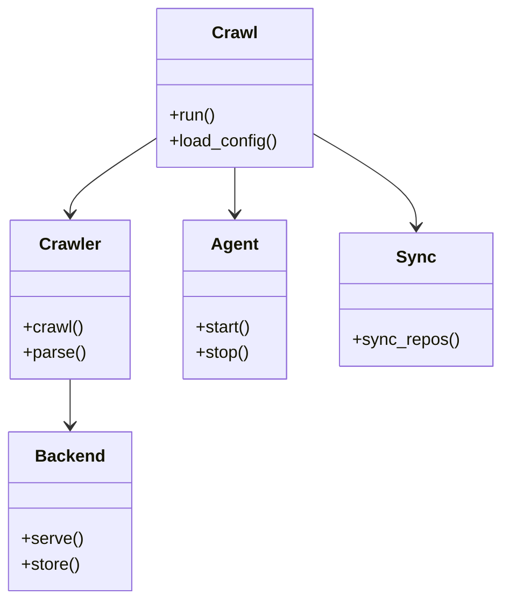
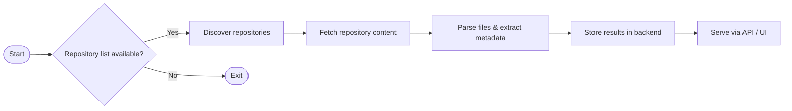

# Diagram: shipment_core/shipment_watchers/config/config.dev.yml

> Auto-generated by Obscura crawlers

## Diagram 1

### SVG

<svg id="container" width="465.25" xmlns="http://www.w3.org/2000/svg" class="classDiagram" height="566" viewBox="0 0 465.25 566" role="graphics-document document" aria-roledescription="class"><g><defs><marker id="container_class-aggregationStart" class="marker aggregation class" refX="18" refY="7" markerWidth="190" markerHeight="240" orient="auto"><path d="M 18,7 L9,13 L1,7 L9,1 Z"></path></marker></defs><defs><marker id="container_class-aggregationEnd" class="marker aggregation class" refX="1" refY="7" markerWidth="20" markerHeight="28" orient="auto"><path d="M 18,7 L9,13 L1,7 L9,1 Z"></path></marker></defs><defs><marker id="container_class-extensionStart" class="marker extension class" refX="18" refY="7" markerWidth="190" markerHeight="240" orient="auto"><path d="M 1,7 L18,13 V 1 Z"></path></marker></defs><defs><marker id="container_class-extensionEnd" class="marker extension class" refX="1" refY="7" markerWidth="20" markerHeight="28" orient="auto"><path d="M 1,1 V 13 L18,7 Z"></path></marker></defs><defs><marker id="container_class-compositionStart" class="marker composition class" refX="18" refY="7" markerWidth="190" markerHeight="240" orient="auto"><path d="M 18,7 L9,13 L1,7 L9,1 Z"></path></marker></defs><defs><marker id="container_class-compositionEnd" class="marker composition class" refX="1" refY="7" markerWidth="20" markerHeight="28" orient="auto"><path d="M 18,7 L9,13 L1,7 L9,1 Z"></path></marker></defs><defs><marker id="container_class-dependencyStart" class="marker dependency class" refX="6" refY="7" markerWidth="190" markerHeight="240" orient="auto"><path d="M 5,7 L9,13 L1,7 L9,1 Z"></path></marker></defs><defs><marker id="container_class-dependencyEnd" class="marker dependency class" refX="13" refY="7" markerWidth="20" markerHeight="28" orient="auto"><path d="M 18,7 L9,13 L14,7 L9,1 Z"></path></marker></defs><defs><marker id="container_class-lollipopStart" class="marker lollipop class" refX="13" refY="7" markerWidth="190" markerHeight="240" orient="auto"><circle stroke="black" fill="transparent" cx="7" cy="7" r="6"></circle></marker></defs><defs><marker id="container_class-lollipopEnd" class="marker lollipop class" refX="1" refY="7" markerWidth="190" markerHeight="240" orient="auto"><circle stroke="black" fill="transparent" cx="7" cy="7" r="6"></circle></marker></defs><g class="root"><g class="clusters"></g><g class="edgePaths"><path d="M144.957,130.523L131.51,139.269C118.063,148.015,91.168,165.508,77.721,177.42C64.273,189.333,64.273,195.667,64.273,198.833L64.273,202" id="id_Crawl_Crawler_1" class="edge-thickness-normal edge-pattern-solid relation" style=";;;" data-edge="true" data-et="edge" data-id="id_Crawl_Crawler_1" data-points="W3sieCI6MTQ0Ljk1NzAzMTI1LCJ5IjoxMzAuNTIyODY1ODUzNjU4NTR9LHsieCI6NjQuMjczNDM3NSwieSI6MTgzfSx7IngiOjY0LjI3MzQzNzUsInkiOjIwOH1d" marker-end="url(#container_class-dependencyEnd)"></path><path d="M64.273,358L64.273,362.167C64.273,366.333,64.273,374.667,64.273,382C64.273,389.333,64.273,395.667,64.273,398.833L64.273,402" id="id_Crawler_Backend_2" class="edge-thickness-normal edge-pattern-solid relation" style=";;;" data-edge="true" data-et="edge" data-id="id_Crawler_Backend_2" data-points="W3sieCI6NjQuMjczNDM3NSwieSI6MzU4fSx7IngiOjY0LjI3MzQzNzUsInkiOjM4M30seyJ4Ijo2NC4yNzM0Mzc1LCJ5Ijo0MDh9XQ==" marker-end="url(#container_class-dependencyEnd)"></path><path d="M218.023,158L218.023,162.167C218.023,166.333,218.023,174.667,218.023,182C218.023,189.333,218.023,195.667,218.023,198.833L218.023,202" id="id_Crawl_Agent_3" class="edge-thickness-normal edge-pattern-solid relation" style=";;;" data-edge="true" data-et="edge" data-id="id_Crawl_Agent_3" data-points="W3sieCI6MjE4LjAyMzQzNzUsInkiOjE1OH0seyJ4IjoyMTguMDIzNDM3NSwieSI6MTgzfSx7IngiOjIxOC4wMjM0Mzc1LCJ5IjoyMDh9XQ==" marker-end="url(#container_class-dependencyEnd)"></path><path d="M291.09,126.255L307.066,135.712C323.042,145.17,354.993,164.085,370.969,178.709C386.945,193.333,386.945,203.667,386.945,208.833L386.945,214" id="id_Crawl_Sync_4" class="edge-thickness-normal edge-pattern-solid relation" style=";;;" data-edge="true" data-et="edge" data-id="id_Crawl_Sync_4" data-points="W3sieCI6MjkxLjA4OTg0Mzc1LCJ5IjoxMjYuMjU0NTU1NTQ1Mjc3OTV9LHsieCI6Mzg2Ljk0NTMxMjUsInkiOjE4M30seyJ4IjozODYuOTQ1MzEyNSwieSI6MjIwfV0=" marker-end="url(#container_class-dependencyEnd)"></path></g><g class="edgeLabels"><g class="edgeLabel"><g class="label" data-id="id_Crawl_Crawler_1" transform="translate(0, 0)"><foreignObject width="0" height="0">

</foreignObject></g></g><g class="edgeLabel"><g class="label" data-id="id_Crawler_Backend_2" transform="translate(0, 0)"><foreignObject width="0" height="0">

</foreignObject></g></g><g class="edgeLabel"><g class="label" data-id="id_Crawl_Agent_3" transform="translate(0, 0)"><foreignObject width="0" height="0">

</foreignObject></g></g><g class="edgeLabel"><g class="label" data-id="id_Crawl_Sync_4" transform="translate(0, 0)"><foreignObject width="0" height="0">

</foreignObject></g></g></g><g class="nodes"><g class="node default" id="classId-Crawl-0" transform="translate(218.0234375, 83)"><g class="basic label-container"><path d="M-73.06640625 -75 L73.06640625 -75 L73.06640625 75 L-73.06640625 75" stroke="none" stroke-width="0" fill="#ECECFF" style=""></path><path d="M-73.06640625 -75 C-31.007489221765816 -75, 11.051427806468368 -75, 73.06640625 -75 M-73.06640625 -75 C-25.36848891422973 -75, 22.32942842154054 -75, 73.06640625 -75 M73.06640625 -75 C73.06640625 -31.755491911536573, 73.06640625 11.489016176926853, 73.06640625 75 M73.06640625 -75 C73.06640625 -33.4388573612988, 73.06640625 8.122285277402398, 73.06640625 75 M73.06640625 75 C38.800612174728826 75, 4.534818099457652 75, -73.06640625 75 M73.06640625 75 C21.06793101140385 75, -30.9305442271923 75, -73.06640625 75 M-73.06640625 75 C-73.06640625 43.57181781526343, -73.06640625 12.143635630526859, -73.06640625 -75 M-73.06640625 75 C-73.06640625 33.428032601635195, -73.06640625 -8.14393479672961, -73.06640625 -75" stroke="#9370DB" stroke-width="1.3" fill="none" stroke-dasharray="0 0" style=""></path></g><g class="annotation-group text" transform="translate(0, -51)"></g><g class="label-group text" transform="translate(-20.1484375, -51)"><g class="label" style="font-weight: bolder" transform="translate(0,-12)"><foreignObject width="40.296875" height="24">

Crawl

</foreignObject></g></g><g class="members-group text" transform="translate(-61.06640625, -3)"></g><g class="methods-group text" transform="translate(-61.06640625, 27)"><g class="label" style="" transform="translate(0,-12)"><foreignObject width="43.21875" height="24">

+run()

</foreignObject></g><g class="label" style="" transform="translate(0,12)"><foreignObject width="101.984375" height="24">

+load_config()

</foreignObject></g></g><g class="divider" style=""><path d="M-73.06640625 -27 C-29.318249447623828 -27, 14.429907354752345 -27, 73.06640625 -27 M-73.06640625 -27 C-18.36190111634626 -27, 36.34260401730748 -27, 73.06640625 -27" stroke="#9370DB" stroke-width="1.3" fill="none" stroke-dasharray="0 0" style=""></path></g><g class="divider" style=""><path d="M-73.06640625 -3 C-35.946213614724286 -3, 1.1739790205514282 -3, 73.06640625 -3 M-73.06640625 -3 C-41.79566259200571 -3, -10.524918934011424 -3, 73.06640625 -3" stroke="#9370DB" stroke-width="1.3" fill="none" stroke-dasharray="0 0" style=""></path></g></g><g class="node default" id="classId-Crawler-1" transform="translate(64.2734375, 283)"><g class="basic label-container"><path d="M-55.1328125 -75 L55.1328125 -75 L55.1328125 75 L-55.1328125 75" stroke="none" stroke-width="0" fill="#ECECFF" style=""></path><path d="M-55.1328125 -75 C-25.59167330479843 -75, 3.9494658904031397 -75, 55.1328125 -75 M-55.1328125 -75 C-24.568113183848645 -75, 5.99658613230271 -75, 55.1328125 -75 M55.1328125 -75 C55.1328125 -31.18059434993708, 55.1328125 12.638811300125838, 55.1328125 75 M55.1328125 -75 C55.1328125 -19.149336616706144, 55.1328125 36.70132676658771, 55.1328125 75 M55.1328125 75 C18.036132548706348 75, -19.060547402587304 75, -55.1328125 75 M55.1328125 75 C19.692952601057243 75, -15.746907297885514 75, -55.1328125 75 M-55.1328125 75 C-55.1328125 33.336217132387766, -55.1328125 -8.327565735224468, -55.1328125 -75 M-55.1328125 75 C-55.1328125 23.7640630357201, -55.1328125 -27.471873928559802, -55.1328125 -75" stroke="#9370DB" stroke-width="1.3" fill="none" stroke-dasharray="0 0" style=""></path></g><g class="annotation-group text" transform="translate(0, -51)"></g><g class="label-group text" transform="translate(-27.734375, -51)"><g class="label" style="font-weight: bolder" transform="translate(0,-12)"><foreignObject width="55.46875" height="24">

Crawler

</foreignObject></g></g><g class="members-group text" transform="translate(-43.1328125, -3)"></g><g class="methods-group text" transform="translate(-43.1328125, 27)"><g class="label" style="" transform="translate(0,-12)"><foreignObject width="56.40625" height="24">

+crawl()

</foreignObject></g><g class="label" style="" transform="translate(0,12)"><foreignObject width="58.53125" height="24">

+parse()

</foreignObject></g></g><g class="divider" style=""><path d="M-55.1328125 -27 C-18.93066953230266 -27, 17.271473435394682 -27, 55.1328125 -27 M-55.1328125 -27 C-27.083429501751574 -27, 0.9659534964968515 -27, 55.1328125 -27" stroke="#9370DB" stroke-width="1.3" fill="none" stroke-dasharray="0 0" style=""></path></g><g class="divider" style=""><path d="M-55.1328125 -3 C-11.627980217754086 -3, 31.87685206449183 -3, 55.1328125 -3 M-55.1328125 -3 C-32.40549618257805 -3, -9.678179865156103 -3, 55.1328125 -3" stroke="#9370DB" stroke-width="1.3" fill="none" stroke-dasharray="0 0" style=""></path></g></g><g class="node default" id="classId-Backend-2" transform="translate(64.2734375, 483)"><g class="basic label-container"><path d="M-56.2734375 -75 L56.2734375 -75 L56.2734375 75 L-56.2734375 75" stroke="none" stroke-width="0" fill="#ECECFF" style=""></path><path d="M-56.2734375 -75 C-16.227157933046534 -75, 23.81912163390693 -75, 56.2734375 -75 M-56.2734375 -75 C-19.649091707177682 -75, 16.975254085644636 -75, 56.2734375 -75 M56.2734375 -75 C56.2734375 -26.059462133429406, 56.2734375 22.881075733141188, 56.2734375 75 M56.2734375 -75 C56.2734375 -43.666120829195606, 56.2734375 -12.332241658391212, 56.2734375 75 M56.2734375 75 C11.254933813810169 75, -33.76356987237966 75, -56.2734375 75 M56.2734375 75 C23.004604655571725 75, -10.26422818885655 75, -56.2734375 75 M-56.2734375 75 C-56.2734375 15.108200080864933, -56.2734375 -44.783599838270135, -56.2734375 -75 M-56.2734375 75 C-56.2734375 22.610935171782117, -56.2734375 -29.778129656435766, -56.2734375 -75" stroke="#9370DB" stroke-width="1.3" fill="none" stroke-dasharray="0 0" style=""></path></g><g class="annotation-group text" transform="translate(0, -51)"></g><g class="label-group text" transform="translate(-31.296875, -51)"><g class="label" style="font-weight: bolder" transform="translate(0,-12)"><foreignObject width="62.59375" height="24">

Backend

</foreignObject></g></g><g class="members-group text" transform="translate(-44.2734375, -3)"></g><g class="methods-group text" transform="translate(-44.2734375, 27)"><g class="label" style="" transform="translate(0,-12)"><foreignObject width="57.25" height="24">

+serve()

</foreignObject></g><g class="label" style="" transform="translate(0,12)"><foreignObject width="55.125" height="24">

+store()

</foreignObject></g></g><g class="divider" style=""><path d="M-56.2734375 -27 C-21.297812713833217 -27, 13.677812072333566 -27, 56.2734375 -27 M-56.2734375 -27 C-20.226725273391487 -27, 15.819986953217025 -27, 56.2734375 -27" stroke="#9370DB" stroke-width="1.3" fill="none" stroke-dasharray="0 0" style=""></path></g><g class="divider" style=""><path d="M-56.2734375 -3 C-29.361813466277084 -3, -2.4501894325541684 -3, 56.2734375 -3 M-56.2734375 -3 C-25.29116668952843 -3, 5.6911041209431374 -3, 56.2734375 -3" stroke="#9370DB" stroke-width="1.3" fill="none" stroke-dasharray="0 0" style=""></path></g></g><g class="node default" id="classId-Agent-3" transform="translate(218.0234375, 283)"><g class="basic label-container"><path d="M-48.6171875 -75 L48.6171875 -75 L48.6171875 75 L-48.6171875 75" stroke="none" stroke-width="0" fill="#ECECFF" style=""></path><path d="M-48.6171875 -75 C-23.50335662009468 -75, 1.610474259810637 -75, 48.6171875 -75 M-48.6171875 -75 C-18.22010734772946 -75, 12.17697280454108 -75, 48.6171875 -75 M48.6171875 -75 C48.6171875 -27.50996764708217, 48.6171875 19.98006470583566, 48.6171875 75 M48.6171875 -75 C48.6171875 -44.91747531970603, 48.6171875 -14.83495063941205, 48.6171875 75 M48.6171875 75 C10.35120252830005 75, -27.9147824433999 75, -48.6171875 75 M48.6171875 75 C27.022824374802482 75, 5.428461249604965 75, -48.6171875 75 M-48.6171875 75 C-48.6171875 36.048355675662854, -48.6171875 -2.903288648674291, -48.6171875 -75 M-48.6171875 75 C-48.6171875 33.8430342536111, -48.6171875 -7.313931492777797, -48.6171875 -75" stroke="#9370DB" stroke-width="1.3" fill="none" stroke-dasharray="0 0" style=""></path></g><g class="annotation-group text" transform="translate(0, -51)"></g><g class="label-group text" transform="translate(-21.078125, -51)"><g class="label" style="font-weight: bolder" transform="translate(0,-12)"><foreignObject width="42.15625" height="24">

Agent

</foreignObject></g></g><g class="members-group text" transform="translate(-36.6171875, -3)"></g><g class="methods-group text" transform="translate(-36.6171875, 27)"><g class="label" style="" transform="translate(0,-12)"><foreignObject width="52.15625" height="24">

+start()

</foreignObject></g><g class="label" style="" transform="translate(0,12)"><foreignObject width="50.21875" height="24">

+stop()

</foreignObject></g></g><g class="divider" style=""><path d="M-48.6171875 -27 C-15.854304180193203 -27, 16.908579139613593 -27, 48.6171875 -27 M-48.6171875 -27 C-28.870911647947537 -27, -9.124635795895074 -27, 48.6171875 -27" stroke="#9370DB" stroke-width="1.3" fill="none" stroke-dasharray="0 0" style=""></path></g><g class="divider" style=""><path d="M-48.6171875 -3 C-10.874711761476455 -3, 26.86776397704709 -3, 48.6171875 -3 M-48.6171875 -3 C-19.753124912418215 -3, 9.11093767516357 -3, 48.6171875 -3" stroke="#9370DB" stroke-width="1.3" fill="none" stroke-dasharray="0 0" style=""></path></g></g><g class="node default" id="classId-Sync-4" transform="translate(386.9453125, 283)"><g class="basic label-container"><path d="M-70.3046875 -63 L70.3046875 -63 L70.3046875 63 L-70.3046875 63" stroke="none" stroke-width="0" fill="#ECECFF" style=""></path><path d="M-70.3046875 -63 C-39.59191587303356 -63, -8.879144246067113 -63, 70.3046875 -63 M-70.3046875 -63 C-39.081397192180695 -63, -7.858106884361391 -63, 70.3046875 -63 M70.3046875 -63 C70.3046875 -15.538069374361207, 70.3046875 31.923861251277586, 70.3046875 63 M70.3046875 -63 C70.3046875 -25.796540729018922, 70.3046875 11.406918541962156, 70.3046875 63 M70.3046875 63 C19.439162563461117 63, -31.426362373077765 63, -70.3046875 63 M70.3046875 63 C31.288567794860462 63, -7.727551910279075 63, -70.3046875 63 M-70.3046875 63 C-70.3046875 24.864252189684585, -70.3046875 -13.27149562063083, -70.3046875 -63 M-70.3046875 63 C-70.3046875 28.317238760185965, -70.3046875 -6.365522479628069, -70.3046875 -63" stroke="#9370DB" stroke-width="1.3" fill="none" stroke-dasharray="0 0" style=""></path></g><g class="annotation-group text" transform="translate(0, -39)"></g><g class="label-group text" transform="translate(-17.09375, -39)"><g class="label" style="font-weight: bolder" transform="translate(0,-12)"><foreignObject width="34.1875" height="24">

Sync

</foreignObject></g></g><g class="members-group text" transform="translate(-58.3046875, 9)"></g><g class="methods-group text" transform="translate(-58.3046875, 39)"><g class="label" style="" transform="translate(0,-12)"><foreignObject width="99.515625" height="24">

+sync_repos()

</foreignObject></g></g><g class="divider" style=""><path d="M-70.3046875 -15 C-26.244332605519823 -15, 17.816022288960355 -15, 70.3046875 -15 M-70.3046875 -15 C-16.225160809389216 -15, 37.85436588122157 -15, 70.3046875 -15" stroke="#9370DB" stroke-width="1.3" fill="none" stroke-dasharray="0 0" style=""></path></g><g class="divider" style=""><path d="M-70.3046875 9 C-25.44544772351665 9, 19.4137920529667 9, 70.3046875 9 M-70.3046875 9 C-31.61945738582599 9, 7.065772728348023 9, 70.3046875 9" stroke="#9370DB" stroke-width="1.3" fill="none" stroke-dasharray="0 0" style=""></path></g></g></g></g></g></svg>

## Diagram 2

### SVG

<svg id="container" width="1764.58935546875" xmlns="http://www.w3.org/2000/svg" class="flowchart" height="251" viewBox="0.0000019073486328125 0 1764.58935546875 251" role="graphics-document document" aria-roledescription="flowchart-v2"><g><marker id="container_flowchart-v2-pointEnd" class="marker flowchart-v2" viewBox="0 0 10 10" refX="5" refY="5" markerUnits="userSpaceOnUse" markerWidth="8" markerHeight="8" orient="auto"><path d="M 0 0 L 10 5 L 0 10 z" class="arrowMarkerPath" style="stroke-width: 1; stroke-dasharray: 1, 0;"></path></marker><marker id="container_flowchart-v2-pointStart" class="marker flowchart-v2" viewBox="0 0 10 10" refX="4.5" refY="5" markerUnits="userSpaceOnUse" markerWidth="8" markerHeight="8" orient="auto"><path d="M 0 5 L 10 10 L 10 0 z" class="arrowMarkerPath" style="stroke-width: 1; stroke-dasharray: 1, 0;"></path></marker><marker id="container_flowchart-v2-circleEnd" class="marker flowchart-v2" viewBox="0 0 10 10" refX="11" refY="5" markerUnits="userSpaceOnUse" markerWidth="11" markerHeight="11" orient="auto"><circle cx="5" cy="5" r="5" class="arrowMarkerPath" style="stroke-width: 1; stroke-dasharray: 1, 0;"></circle></marker><marker id="container_flowchart-v2-circleStart" class="marker flowchart-v2" viewBox="0 0 10 10" refX="-1" refY="5" markerUnits="userSpaceOnUse" markerWidth="11" markerHeight="11" orient="auto"><circle cx="5" cy="5" r="5" class="arrowMarkerPath" style="stroke-width: 1; stroke-dasharray: 1, 0;"></circle></marker><marker id="container_flowchart-v2-crossEnd" class="marker cross flowchart-v2" viewBox="0 0 11 11" refX="12" refY="5.2" markerUnits="userSpaceOnUse" markerWidth="11" markerHeight="11" orient="auto"><path d="M 1,1 l 9,9 M 10,1 l -9,9" class="arrowMarkerPath" style="stroke-width: 2; stroke-dasharray: 1, 0;"></path></marker><marker id="container_flowchart-v2-crossStart" class="marker cross flowchart-v2" viewBox="0 0 11 11" refX="-1" refY="5.2" markerUnits="userSpaceOnUse" markerWidth="11" markerHeight="11" orient="auto"><path d="M 1,1 l 9,9 M 10,1 l -9,9" class="arrowMarkerPath" style="stroke-width: 2; stroke-dasharray: 1, 0;"></path></marker><g class="root"><g class="clusters"></g><g class="edgePaths"><path d="M68.277,126L72.36,125.917C76.444,125.833,84.61,125.667,92.194,125.583C99.777,125.5,106.777,125.5,110.277,125.5L113.777,125.5" id="L_Start_Check_0" class="edge-thickness-normal edge-pattern-solid edge-thickness-normal edge-pattern-solid flowchart-link" style=";" data-edge="true" data-et="edge" data-id="L_Start_Check_0" data-points="W3sieCI6NjguMjc2ODM3NDMxODI1ODMsInkiOjEyNn0seyJ4Ijo5Mi43NzY4MzYzOTUyNjM2NywieSI6MTI1LjV9LHsieCI6MTE3Ljc3NjgzNjM5NTI2MzY3LCJ5IjoxMjUuNX1d" marker-end="url(#container_flowchart-v2-pointEnd)"></path><path d="M324.819,97.542L335.65,94.16C346.482,90.778,368.145,84.014,384.482,80.632C400.819,77.25,411.829,77.25,417.334,77.25L422.839,77.25" id="L_Check_Discover_0" class="edge-thickness-normal edge-pattern-solid edge-thickness-normal edge-pattern-solid flowchart-link" style=";" data-edge="true" data-et="edge" data-id="L_Check_Discover_0" data-points="W3sieCI6MzI0LjgxODc1MzQ4NTcyNDQ3LCJ5Ijo5Ny41NDE5MTcwOTA0NjA3OX0seyJ4IjozODkuODA4MDg2Mzk1MjYzNywieSI6NzcuMjV9LHsieCI6NDI2LjgzOTMzNjM5NTI2MzcsInkiOjc3LjI1fV0=" marker-end="url(#container_flowchart-v2-pointEnd)"></path><path d="M639.699,77.25L643.865,77.25C648.032,77.25,656.365,77.25,664.032,77.25C671.699,77.25,678.699,77.25,682.199,77.25L685.699,77.25" id="L_Discover_Fetch_0" class="edge-thickness-normal edge-pattern-solid edge-thickness-normal edge-pattern-solid flowchart-link" style=";" data-edge="true" data-et="edge" data-id="L_Discover_Fetch_0" data-points="W3sieCI6NjM5LjY5ODcxMTM5NTI2MzcsInkiOjc3LjI1fSx7IngiOjY2NC42OTg3MTEzOTUyNjM3LCJ5Ijo3Ny4yNX0seyJ4Ijo2ODkuNjk4NzExMzk1MjYzNywieSI6NzcuMjV9XQ==" marker-end="url(#container_flowchart-v2-pointEnd)"></path><path d="M926.402,77.25L930.569,77.25C934.735,77.25,943.069,77.25,950.735,77.25C958.402,77.25,965.402,77.25,968.902,77.25L972.402,77.25" id="L_Fetch_Parse_0" class="edge-thickness-normal edge-pattern-solid edge-thickness-normal edge-pattern-solid flowchart-link" style=";" data-edge="true" data-et="edge" data-id="L_Fetch_Parse_0" data-points="W3sieCI6OTI2LjQwMTgzNjM5NTI2MzcsInkiOjc3LjI1fSx7IngiOjk1MS40MDE4MzYzOTUyNjM3LCJ5Ijo3Ny4yNX0seyJ4Ijo5NzYuNDAxODM2Mzk1MjYzNywieSI6NzcuMjV9XQ==" marker-end="url(#container_flowchart-v2-pointEnd)"></path><path d="M1236.402,77.25L1240.569,77.25C1244.735,77.25,1253.069,77.25,1260.735,77.25C1268.402,77.25,1275.402,77.25,1278.902,77.25L1282.402,77.25" id="L_Parse_Store_0" class="edge-thickness-normal edge-pattern-solid edge-thickness-normal edge-pattern-solid flowchart-link" style=";" data-edge="true" data-et="edge" data-id="L_Parse_Store_0" data-points="W3sieCI6MTIzNi40MDE4MzYzOTUyNjM3LCJ5Ijo3Ny4yNX0seyJ4IjoxMjYxLjQwMTgzNjM5NTI2MzcsInkiOjc3LjI1fSx7IngiOjEyODYuNDAxODM2Mzk1MjYzNywieSI6NzcuMjV9XQ==" marker-end="url(#container_flowchart-v2-pointEnd)"></path><path d="M1521.574,77.25L1525.74,77.25C1529.907,77.25,1538.24,77.25,1545.907,77.25C1553.574,77.25,1560.574,77.25,1564.074,77.25L1567.574,77.25" id="L_Store_Serve_0" class="edge-thickness-normal edge-pattern-solid edge-thickness-normal edge-pattern-solid flowchart-link" style=";" data-edge="true" data-et="edge" data-id="L_Store_Serve_0" data-points="W3sieCI6MTUyMS41NzM3MTEzOTUyNjM3LCJ5Ijo3Ny4yNX0seyJ4IjoxNTQ2LjU3MzcxMTM5NTI2MzcsInkiOjc3LjI1fSx7IngiOjE1NzEuNTczNzExMzk1MjYzNywieSI6NzcuMjV9XQ==" marker-end="url(#container_flowchart-v2-pointEnd)"></path><path d="M324.819,153.458L335.65,156.84C346.482,160.222,368.145,166.986,398.025,170.449C427.905,173.911,466.002,174.072,485.051,174.153L504.099,174.233" id="L_Check_End_0" class="edge-thickness-normal edge-pattern-solid edge-thickness-normal edge-pattern-solid flowchart-link" style=";" data-edge="true" data-et="edge" data-id="L_Check_End_0" data-points="W3sieCI6MzI0LjgxODc1MzQ4NTcyNDQ3LCJ5IjoxNTMuNDU4MDgyOTA5NTM5MjN9LHsieCI6Mzg5LjgwODA4NjM5NTI2MzcsInkiOjE3My43NX0seyJ4Ijo1MDguMDk5MzU1Njk3NjMyMSwieSI6MTc0LjI1fV0=" marker-end="url(#container_flowchart-v2-pointEnd)"></path></g><g class="edgeLabels"><g class="edgeLabel"><g class="label" data-id="L_Start_Check_0" transform="translate(0, 0)"><foreignObject width="0" height="0">

</foreignObject></g></g><g class="edgeLabel" transform="translate(389.8080863952637, 77.25)"><g class="label" data-id="L_Check_Discover_0" transform="translate(-12.03125, -12)"><foreignObject width="24.0625" height="24">

Yes

</foreignObject></g></g><g class="edgeLabel"><g class="label" data-id="L_Discover_Fetch_0" transform="translate(0, 0)"><foreignObject width="0" height="0">

</foreignObject></g></g><g class="edgeLabel"><g class="label" data-id="L_Fetch_Parse_0" transform="translate(0, 0)"><foreignObject width="0" height="0">

</foreignObject></g></g><g class="edgeLabel"><g class="label" data-id="L_Parse_Store_0" transform="translate(0, 0)"><foreignObject width="0" height="0">

</foreignObject></g></g><g class="edgeLabel"><g class="label" data-id="L_Store_Serve_0" transform="translate(0, 0)"><foreignObject width="0" height="0">

</foreignObject></g></g><g class="edgeLabel" transform="translate(389.8080863952637, 173.75)"><g class="label" data-id="L_Check_End_0" transform="translate(-10.140625, -12)"><foreignObject width="20.28125" height="24">

No

</foreignObject></g></g></g><g class="nodes"><g class="node default" id="flowchart-Start-0" transform="translate(37.888418197631836, 125.5)"><g class="basic label-container outer-path"><path d="M-10.3984375 -19.5 C-2.886914344150137 -19.5, 4.624608811699726 -19.5, 10.3984375 -19.5 C10.3984375 -19.5, 10.398437499999998 -19.5, 10.398437499999998 -19.5 C10.852053474589141 -19.48545341860486, 11.305669449178286 -19.470906837209718, 11.6478067896239 -19.45993515863156 C11.981979544178406 -19.427697914901223, 12.316152298732913 -19.395460671170888, 12.892042152847864 -19.3399052695533 C13.284332256896768 -19.276482847785864, 13.676622360945672 -19.213060426018433, 14.126030759676757 -19.140403561325776 C14.52833413191803 -19.048580441886553, 14.930637504159304 -18.95675732244733, 15.34470188623539 -18.862249829261074 C15.766269530354108 -18.73713076534036, 16.18783717447283 -18.612011701419643, 16.543047751460602 -18.50658706670804 C16.880275266372458 -18.382484223923502, 17.217502781284313 -18.258381381138964, 17.716144095147794 -18.074876768247425 C18.12632608221304 -17.89330137018997, 18.536508069278288 -17.711725972132516, 18.85917041279238 -17.568892924097174 C19.113819061970407 -17.436042886931244, 19.368467711148433 -17.303192849765313, 19.967429764076783 -16.990714730406097 C20.308751851817096 -16.783803274986685, 20.650073939557412 -16.576891819567276, 21.036368073605697 -16.342718045390892 C21.241774443109538 -16.199435453923435, 21.44718081261338 -16.05615286245598, 22.061592844578712 -15.627565626425154 C22.42597979340624 -15.336976731479147, 22.790366742233765 -15.046387836533139, 23.03889120850187 -14.848196188198123 C23.28136733394253 -14.627985786639634, 23.52384345938319 -14.407775385081145, 23.964247236767985 -14.007812326905688 C24.290212909670174 -13.671226007354722, 24.61617858257236 -13.334639687803758, 24.833858442968648 -13.10986736009568 C25.15553696619772 -12.732005462684313, 25.47721548942679 -12.354143565272947, 25.644151408126582 -12.158051136245305 C25.86242331947665 -11.86558666001641, 26.080695230826716 -11.573122183787515, 26.391796464640635 -11.156274872382312 C26.60539694003448 -10.828127182418598, 26.818997415428328 -10.499979492454884, 27.073721378604247 -10.108655082055241 C27.2710785759915 -9.758227393510886, 27.46843577337875 -9.40779970496653, 27.6871239742735 -9.019496659696287 C27.879781839550926 -8.61943848022976, 28.072439704828355 -8.219380300763234, 28.22948364880834 -7.893275190886684 C28.347104807559074 -7.6027486547219745, 28.464725966309803 -7.312222118557264, 28.698571729970325 -6.734618561215508 C28.848369192152653 -6.283452472106738, 28.99816665433498 -5.832286382997968, 29.09246063421488 -5.548287939305138 C29.188482314705944 -5.182115655533142, 29.284503995197007 -4.815943371761147, 29.40953178754556 -4.339158212148133 C29.47866671745416 -3.9841649587400774, 29.547801647362764 -3.629171705332022, 29.648482276581777 -3.1121979531509023 C29.68128011529028 -2.8578243927935736, 29.714077953998782 -2.6034508324362444, 29.808330202509367 -1.872449005199798 C29.828726271909556 -1.5547637608809457, 29.849122341309744 -1.2370785165620932, 29.888418715913414 -0.6250057626472757 C29.888418715913414 -0.3394931315457926, 29.888418715913414 -0.053980500444309465, 29.888418715913414 0.625005762647271 C29.86196100776427 1.0371059233478404, 29.835503299615123 1.4492060840484096, 29.808330202509367 1.8724490051997846 C29.765950669575368 2.201136293850545, 29.723571136641365 2.5298235825013062, 29.648482276581777 3.1121979531508885 C29.56567840529395 3.5373783316094927, 29.482874534006122 3.962558710068097, 29.40953178754556 4.339158212148129 C29.33379415151314 4.62797864323885, 29.258056515480718 4.916799074329573, 29.092460634214884 5.548287939305125 C28.979373649519253 5.888887919244246, 28.86628666482362 6.229487899183367, 28.69857172997033 6.734618561215495 C28.540697330229737 7.12457138086863, 28.382822930489144 7.514524200521766, 28.229483648808344 7.893275190886679 C28.12026176919777 8.120076760871884, 28.011039889587195 8.34687833085709, 27.687123974273504 9.019496659696284 C27.52290747889643 9.311079675961597, 27.358690983519352 9.60266269222691, 27.07372137860425 10.108655082055236 C26.814794728952347 10.506435947461323, 26.555868079300446 10.90421681286741, 26.39179646464064 11.156274872382301 C26.22974204151543 11.373413035908424, 26.06768761839022 11.590551199434548, 25.644151408126582 12.158051136245302 C25.46634446119729 12.366913293610345, 25.288537514268 12.575775450975387, 24.83385844296866 13.10986736009567 C24.534533113352037 13.41894533799143, 24.23520778373541 13.728023315887189, 23.96424723676799 14.007812326905684 C23.62336756325395 14.317390227209211, 23.282487889739908 14.626968127512738, 23.038891208501887 14.848196188198111 C22.77370660929262 15.059673849208947, 22.508522010083354 15.271151510219784, 22.061592844578715 15.627565626425152 C21.69279544177029 15.884822729642053, 21.323998038961868 16.142079832858954, 21.036368073605708 16.34271804539089 C20.71796112340791 16.53573820976773, 20.399554173210113 16.72875837414457, 19.967429764076787 16.990714730406093 C19.699829968571596 17.1303213723153, 19.432230173066408 17.269928014224508, 18.859170412792388 17.56889292409717 C18.455593510370438 17.74754444711591, 18.05201660794849 17.926195970134653, 17.716144095147804 18.07487676824742 C17.31011836514031 18.224297990150884, 16.90409263513281 18.373719212054347, 16.543047751460616 18.506587066708033 C16.226140424538464 18.600643497858023, 15.909233097616312 18.694699929008017, 15.344701886235413 18.86224982926107 C15.019647285921431 18.936441420603234, 14.69459268560745 19.010633011945398, 14.126030759676766 19.140403561325773 C13.813503398282812 19.19093056143006, 13.50097603688886 19.24145756153435, 12.892042152847878 19.3399052695533 C12.553885038575523 19.37252687967372, 12.215727924303165 19.405148489794144, 11.6478067896239 19.45993515863156 C11.203849097392828 19.474172017710185, 10.759891405161758 19.48840887678881, 10.398437500000004 19.5 C10.398437500000004 19.5, 10.398437500000002 19.5, 10.3984375 19.5 C2.0828182963307125 19.5, -6.232800907338575 19.5, -10.398437499999996 19.5 C-10.69147912840542 19.490602725347966, -10.984520756810845 19.48120545069593, -11.647806789623893 19.45993515863156 C-11.935031534707852 19.432226932911604, -12.22225627979181 19.404518707191652, -12.892042152847871 19.3399052695533 C-13.153207624037867 19.297682061539778, -13.41437309522786 19.255458853526257, -14.126030759676759 19.140403561325773 C-14.490987679819845 19.057104525869587, -14.855944599962934 18.9738054904134, -15.344701886235388 18.862249829261074 C-15.806861202773197 18.725083370036412, -16.269020519311006 18.587916910811746, -16.54304775146059 18.506587066708043 C-16.821417166802597 18.40414454864352, -17.099786582144603 18.30170203057899, -17.716144095147797 18.074876768247425 C-18.012960049617917 17.94348514993596, -18.309776004088036 17.812093531624495, -18.85917041279238 17.568892924097174 C-19.09132148604484 17.447779857881226, -19.3234725592973 17.326666791665275, -19.96742976407678 16.990714730406097 C-20.372139054995216 16.745377579915555, -20.77684834591365 16.500040429425017, -21.036368073605686 16.3427180453909 C-21.33758423883072 16.13260268796755, -21.63880040405575 15.922487330544204, -22.061592844578712 15.627565626425156 C-22.446572436972268 15.3205546462285, -22.831552029365824 15.013543666031843, -23.03889120850187 14.848196188198125 C-23.370492730206514 14.547044459881448, -23.702094251911156 14.245892731564771, -23.964247236767974 14.007812326905697 C-24.303607447506963 13.65739504732623, -24.64296765824595 13.306977767746762, -24.833858442968655 13.109867360095677 C-25.142853333209317 12.746904379711655, -25.451848223449982 12.38394139932763, -25.64415140812658 12.158051136245307 C-25.903836520853634 11.810096742991508, -26.163521633580693 11.462142349737709, -26.391796464640635 11.156274872382316 C-26.550890567396934 10.911863607800305, -26.70998467015323 10.667452343218292, -27.073721378604244 10.108655082055249 C-27.306724989854352 9.694933576106576, -27.539728601104464 9.281212070157903, -27.6871239742735 9.019496659696289 C-27.816509178172534 8.750825515400074, -27.945894382071565 8.482154371103857, -28.22948364880834 7.893275190886686 C-28.381588434310405 7.517573429950613, -28.533693219812474 7.141871669014542, -28.698571729970325 6.73461856121551 C-28.842683836068787 6.300575858792861, -28.986795942167248 5.866533156370211, -29.09246063421488 5.5482879393051325 C-29.156766219192253 5.303062873569577, -29.22107180416963 5.057837807834022, -29.409531787545557 4.339158212148136 C-29.472985623487094 4.013336175561323, -29.53643945942863 3.6875141389745094, -29.648482276581777 3.112197953150904 C-29.69096575208792 2.7827045064364047, -29.733449227594058 2.4532110597219052, -29.808330202509364 1.872449005199809 C-29.83344172103239 1.4813168345507766, -29.858553239555413 1.090184663901744, -29.888418715913414 0.6250057626472781 C-29.888418715913414 0.27016654834732473, -29.888418715913414 -0.08467266595262868, -29.888418715913414 -0.6250057626472687 C-29.869503440343948 -0.9196264477773319, -29.850588164774482 -1.2142471329073952, -29.808330202509367 -1.8724490051997822 C-29.75821544097373 -2.261129199391178, -29.708100679438093 -2.6498093935825744, -29.648482276581777 -3.112197953150895 C-29.575185219925128 -3.4885628477443706, -29.501888163268482 -3.864927742337846, -29.40953178754556 -4.339158212148126 C-29.324039801222693 -4.665176208458479, -29.238547814899825 -4.9911942047688305, -29.092460634214884 -5.548287939305123 C-28.991616708149124 -5.852013777317563, -28.89077278208336 -6.155739615330003, -28.698571729970332 -6.734618561215485 C-28.548689217334694 -7.104831265206758, -28.39880670469906 -7.47504396919803, -28.229483648808344 -7.893275190886676 C-28.10300015454958 -8.155920873028231, -27.97651666029082 -8.418566555169786, -27.687123974273504 -9.019496659696282 C-27.45899953778899 -9.424554696778621, -27.230875101304473 -9.829612733860962, -27.073721378604247 -10.108655082055243 C-26.8868696489107 -10.395709515579357, -26.700017919217153 -10.682763949103471, -26.39179646464064 -11.156274872382308 C-26.23520449027935 -11.366093852204097, -26.07861251591806 -11.575912832025887, -25.644151408126586 -12.158051136245302 C-25.446287235695717 -12.390473651972957, -25.24842306326485 -12.622896167700615, -24.833858442968662 -13.10986736009567 C-24.59289217004707 -13.358684820586149, -24.351925897125476 -13.607502281076627, -23.964247236767996 -14.007812326905677 C-23.77683423485582 -14.178015856566013, -23.589421232943643 -14.348219386226349, -23.038891208501887 -14.848196188198107 C-22.805731523041082 -15.03413483271329, -22.57257183758028 -15.220073477228475, -22.06159284457872 -15.627565626425149 C-21.69030586404118 -15.886559351293798, -21.319018883503634 -16.145553076162447, -21.03636807360571 -16.342718045390885 C-20.623259237251183 -16.593147049685992, -20.210150400896655 -16.8435760539811, -19.96742976407679 -16.99071473040609 C-19.58881379068626 -17.188238441208824, -19.21019781729573 -17.38576215201156, -18.859170412792388 -17.56889292409717 C-18.57422778668037 -17.695028572154275, -18.289285160568355 -17.82116422021138, -17.716144095147804 -18.07487676824742 C-17.38540327037826 -18.196592449097285, -17.054662445608713 -18.318308129947145, -16.54304775146062 -18.506587066708033 C-16.23031101371357 -18.599405688882722, -15.917574275966524 -18.69222431105741, -15.344701886235413 -18.862249829261067 C-14.869761222478127 -18.970651936486195, -14.394820558720841 -19.079054043711324, -14.126030759676768 -19.140403561325773 C-13.769892491483297 -19.197981234633776, -13.413754223289827 -19.255558907941776, -12.89204215284788 -19.3399052695533 C-12.531228758167336 -19.374712503796538, -12.170415363486791 -19.409519738039773, -11.647806789623903 -19.45993515863156 C-11.392203939324588 -19.46813184453989, -11.136601089025273 -19.476328530448225, -10.398437500000005 -19.5 C-10.398437500000004 -19.5, -10.398437500000002 -19.5, -10.3984375 -19.5" stroke="none" stroke-width="0" fill="#ECECFF" style=""></path><path d="M-10.3984375 -19.5 C-2.732258186595325 -19.5, 4.93392112680935 -19.5, 10.3984375 -19.5 M-10.3984375 -19.5 C-4.997573068250635 -19.5, 0.4032913634987292 -19.5, 10.3984375 -19.5 M10.3984375 -19.5 C10.3984375 -19.5, 10.398437499999998 -19.5, 10.398437499999998 -19.5 M10.3984375 -19.5 C10.3984375 -19.5, 10.398437499999998 -19.5, 10.398437499999998 -19.5 M10.398437499999998 -19.5 C10.661109317650794 -19.491576626067616, 10.923781135301589 -19.48315325213523, 11.6478067896239 -19.45993515863156 M10.398437499999998 -19.5 C10.74090648637794 -19.489017686182304, 11.083375472755879 -19.478035372364605, 11.6478067896239 -19.45993515863156 M11.6478067896239 -19.45993515863156 C11.918268659735018 -19.433844027299926, 12.188730529846138 -19.407752895968297, 12.892042152847864 -19.3399052695533 M11.6478067896239 -19.45993515863156 C11.927238234999159 -19.432978743161687, 12.206669680374418 -19.40602232769182, 12.892042152847864 -19.3399052695533 M12.892042152847864 -19.3399052695533 C13.215966167194516 -19.28753574698198, 13.539890181541168 -19.235166224410666, 14.126030759676757 -19.140403561325776 M12.892042152847864 -19.3399052695533 C13.200377923080415 -19.29005593340171, 13.508713693312966 -19.240206597250122, 14.126030759676757 -19.140403561325776 M14.126030759676757 -19.140403561325776 C14.532971216914877 -19.04752205749583, 14.939911674152999 -18.954640553665886, 15.34470188623539 -18.862249829261074 M14.126030759676757 -19.140403561325776 C14.491615693374484 -19.056961185873913, 14.857200627072213 -18.97351881042205, 15.34470188623539 -18.862249829261074 M15.34470188623539 -18.862249829261074 C15.812819485089038 -18.72331498312073, 16.28093708394269 -18.584380136980386, 16.543047751460602 -18.50658706670804 M15.34470188623539 -18.862249829261074 C15.586943069651053 -18.790353917573224, 15.829184253066718 -18.718458005885374, 16.543047751460602 -18.50658706670804 M16.543047751460602 -18.50658706670804 C17.008765666901176 -18.33519856877669, 17.47448358234175 -18.16381007084534, 17.716144095147794 -18.074876768247425 M16.543047751460602 -18.50658706670804 C16.797640877099912 -18.41289444303972, 17.052234002739223 -18.319201819371397, 17.716144095147794 -18.074876768247425 M17.716144095147794 -18.074876768247425 C18.08894671236343 -17.90984810840278, 18.46174932957907 -17.74481944855814, 18.85917041279238 -17.568892924097174 M17.716144095147794 -18.074876768247425 C18.076113898502832 -17.91552881442697, 18.43608370185787 -17.75618086060652, 18.85917041279238 -17.568892924097174 M18.85917041279238 -17.568892924097174 C19.154515190305837 -17.414811742845764, 19.449859967819293 -17.26073056159435, 19.967429764076783 -16.990714730406097 M18.85917041279238 -17.568892924097174 C19.289644594605697 -17.34431481917704, 19.72011877641901 -17.11973671425691, 19.967429764076783 -16.990714730406097 M19.967429764076783 -16.990714730406097 C20.324924665422945 -16.77399922033682, 20.682419566769102 -16.557283710267544, 21.036368073605697 -16.342718045390892 M19.967429764076783 -16.990714730406097 C20.214771870614314 -16.840774491879486, 20.462113977151844 -16.690834253352875, 21.036368073605697 -16.342718045390892 M21.036368073605697 -16.342718045390892 C21.4025004185621 -16.08731997116307, 21.7686327635185 -15.831921896935246, 22.061592844578712 -15.627565626425154 M21.036368073605697 -16.342718045390892 C21.372655591265033 -16.108138430723752, 21.70894310892437 -15.87355881605661, 22.061592844578712 -15.627565626425154 M22.061592844578712 -15.627565626425154 C22.325020768915497 -15.41748886687804, 22.588448693252282 -15.207412107330926, 23.03889120850187 -14.848196188198123 M22.061592844578712 -15.627565626425154 C22.380221741115932 -15.373467560507756, 22.698850637653152 -15.119369494590357, 23.03889120850187 -14.848196188198123 M23.03889120850187 -14.848196188198123 C23.31718434163277 -14.59545772792145, 23.59547747476367 -14.342719267644778, 23.964247236767985 -14.007812326905688 M23.03889120850187 -14.848196188198123 C23.22554297026296 -14.678683996701693, 23.41219473202405 -14.509171805205265, 23.964247236767985 -14.007812326905688 M23.964247236767985 -14.007812326905688 C24.270893312088674 -13.69117507802608, 24.577539387409367 -13.37453782914647, 24.833858442968648 -13.10986736009568 M23.964247236767985 -14.007812326905688 C24.159423251265405 -13.8062770676883, 24.354599265762822 -13.604741808470916, 24.833858442968648 -13.10986736009568 M24.833858442968648 -13.10986736009568 C25.113816847275874 -12.78101228831193, 25.3937752515831 -12.452157216528178, 25.644151408126582 -12.158051136245305 M24.833858442968648 -13.10986736009568 C24.996196896075553 -12.919175375756648, 25.158535349182458 -12.728483391417617, 25.644151408126582 -12.158051136245305 M25.644151408126582 -12.158051136245305 C25.85797587477839 -11.87154583074153, 26.0718003414302 -11.585040525237753, 26.391796464640635 -11.156274872382312 M25.644151408126582 -12.158051136245305 C25.83940185070227 -11.896433330875126, 26.034652293277958 -11.63481552550495, 26.391796464640635 -11.156274872382312 M26.391796464640635 -11.156274872382312 C26.602131967317337 -10.833143057280063, 26.812467469994044 -10.510011242177812, 27.073721378604247 -10.108655082055241 M26.391796464640635 -11.156274872382312 C26.647615459810165 -10.763268198783225, 26.903434454979692 -10.370261525184135, 27.073721378604247 -10.108655082055241 M27.073721378604247 -10.108655082055241 C27.204963367274402 -9.875621641478947, 27.336205355944553 -9.642588200902653, 27.6871239742735 -9.019496659696287 M27.073721378604247 -10.108655082055241 C27.254816226547053 -9.787102841690947, 27.435911074489862 -9.465550601326653, 27.6871239742735 -9.019496659696287 M27.6871239742735 -9.019496659696287 C27.827770801123453 -8.727440514382357, 27.968417627973405 -8.435384369068428, 28.22948364880834 -7.893275190886684 M27.6871239742735 -9.019496659696287 C27.88422501574567 -8.610212129792636, 28.08132605721784 -8.200927599888983, 28.22948364880834 -7.893275190886684 M28.22948364880834 -7.893275190886684 C28.392361422913616 -7.490963939819121, 28.55523919701889 -7.088652688751558, 28.698571729970325 -6.734618561215508 M28.22948364880834 -7.893275190886684 C28.365368693026475 -7.557636504509283, 28.501253737244614 -7.221997818131882, 28.698571729970325 -6.734618561215508 M28.698571729970325 -6.734618561215508 C28.830297998215727 -6.33788002899101, 28.962024266461132 -5.9411414967665115, 29.09246063421488 -5.548287939305138 M28.698571729970325 -6.734618561215508 C28.78052261422443 -6.487795554942354, 28.86247349847854 -6.240972548669199, 29.09246063421488 -5.548287939305138 M29.09246063421488 -5.548287939305138 C29.185459222332124 -5.193644016971039, 29.278457810449368 -4.83900009463694, 29.40953178754556 -4.339158212148133 M29.09246063421488 -5.548287939305138 C29.21569706095805 -5.078334033128224, 29.33893348770122 -4.6083801269513085, 29.40953178754556 -4.339158212148133 M29.40953178754556 -4.339158212148133 C29.457753273843654 -4.091551071622156, 29.50597476014175 -3.843943931096179, 29.648482276581777 -3.1121979531509023 M29.40953178754556 -4.339158212148133 C29.48608333040134 -3.946082218758023, 29.562634873257117 -3.553006225367912, 29.648482276581777 -3.1121979531509023 M29.648482276581777 -3.1121979531509023 C29.689791135708152 -2.7918145991236454, 29.731099994834523 -2.471431245096388, 29.808330202509367 -1.872449005199798 M29.648482276581777 -3.1121979531509023 C29.698898032148932 -2.7211833086890644, 29.749313787716083 -2.330168664227226, 29.808330202509367 -1.872449005199798 M29.808330202509367 -1.872449005199798 C29.835733970219394 -1.445613203192943, 29.86313773792942 -1.018777401186088, 29.888418715913414 -0.6250057626472757 M29.808330202509367 -1.872449005199798 C29.824430086870592 -1.6216803106809512, 29.840529971231817 -1.3709116161621042, 29.888418715913414 -0.6250057626472757 M29.888418715913414 -0.6250057626472757 C29.888418715913414 -0.18504666309489476, 29.888418715913414 0.2549124364574862, 29.888418715913414 0.625005762647271 M29.888418715913414 -0.6250057626472757 C29.888418715913414 -0.23065318407347996, 29.888418715913414 0.1636993945003158, 29.888418715913414 0.625005762647271 M29.888418715913414 0.625005762647271 C29.862182088262053 1.0336624161418815, 29.83594546061069 1.4423190696364918, 29.808330202509367 1.8724490051997846 M29.888418715913414 0.625005762647271 C29.858042323118546 1.0981425998102918, 29.82766593032368 1.5712794369733127, 29.808330202509367 1.8724490051997846 M29.808330202509367 1.8724490051997846 C29.753718301558045 2.296008124638606, 29.699106400606723 2.7195672440774277, 29.648482276581777 3.1121979531508885 M29.808330202509367 1.8724490051997846 C29.770105324028393 2.1689136143421925, 29.731880445547418 2.4653782234846005, 29.648482276581777 3.1121979531508885 M29.648482276581777 3.1121979531508885 C29.579991833464558 3.4638819030975387, 29.511501390347338 3.8155658530441885, 29.40953178754556 4.339158212148129 M29.648482276581777 3.1121979531508885 C29.57363501499631 3.49652282241794, 29.498787753410838 3.8808476916849917, 29.40953178754556 4.339158212148129 M29.40953178754556 4.339158212148129 C29.29242211097495 4.785748164566758, 29.17531243440434 5.232338116985389, 29.092460634214884 5.548287939305125 M29.40953178754556 4.339158212148129 C29.31572237678935 4.696894152617366, 29.22191296603314 5.054630093086603, 29.092460634214884 5.548287939305125 M29.092460634214884 5.548287939305125 C28.990957981144742 5.853997758100858, 28.889455328074604 6.159707576896591, 28.69857172997033 6.734618561215495 M29.092460634214884 5.548287939305125 C28.99764427799006 5.833859697319493, 28.902827921765237 6.119431455333862, 28.69857172997033 6.734618561215495 M28.69857172997033 6.734618561215495 C28.537755519740426 7.131837709653271, 28.37693930951052 7.529056858091047, 28.229483648808344 7.893275190886679 M28.69857172997033 6.734618561215495 C28.519868712974606 7.176018468182728, 28.34116569597888 7.617418375149962, 28.229483648808344 7.893275190886679 M28.229483648808344 7.893275190886679 C28.079528604411244 8.204660049101214, 27.92957356001414 8.516044907315749, 27.687123974273504 9.019496659696284 M28.229483648808344 7.893275190886679 C28.013755936146545 8.341238402062512, 27.79802822348475 8.789201613238344, 27.687123974273504 9.019496659696284 M27.687123974273504 9.019496659696284 C27.50678810026877 9.339701264979084, 27.32645222626404 9.659905870261884, 27.07372137860425 10.108655082055236 M27.687123974273504 9.019496659696284 C27.45962405419265 9.42344580466478, 27.232124134111796 9.827394949633279, 27.07372137860425 10.108655082055236 M27.07372137860425 10.108655082055236 C26.876935292252025 10.410971355155365, 26.680149205899795 10.713287628255493, 26.39179646464064 11.156274872382301 M27.07372137860425 10.108655082055236 C26.885867613456885 10.397248911120613, 26.698013848309515 10.685842740185988, 26.39179646464064 11.156274872382301 M26.39179646464064 11.156274872382301 C26.150218653428976 11.47996713121458, 25.908640842217313 11.80365939004686, 25.644151408126582 12.158051136245302 M26.39179646464064 11.156274872382301 C26.125312775913574 11.513338738113099, 25.85882908718651 11.870402603843896, 25.644151408126582 12.158051136245302 M25.644151408126582 12.158051136245302 C25.373252724199073 12.476264144958346, 25.102354040271564 12.79447715367139, 24.83385844296866 13.10986736009567 M25.644151408126582 12.158051136245302 C25.399112169903276 12.445888168590042, 25.154072931679973 12.733725200934783, 24.83385844296866 13.10986736009567 M24.83385844296866 13.10986736009567 C24.594940269314986 13.356569989939944, 24.356022095661313 13.603272619784219, 23.96424723676799 14.007812326905684 M24.83385844296866 13.10986736009567 C24.659772219132407 13.289625678951388, 24.48568599529615 13.469383997807105, 23.96424723676799 14.007812326905684 M23.96424723676799 14.007812326905684 C23.61379593175951 14.32608292968097, 23.263344626751028 14.644353532456256, 23.038891208501887 14.848196188198111 M23.96424723676799 14.007812326905684 C23.661789400068535 14.282496531600298, 23.359331563369082 14.557180736294912, 23.038891208501887 14.848196188198111 M23.038891208501887 14.848196188198111 C22.832946613670774 15.012431522160092, 22.62700201883966 15.176666856122074, 22.061592844578715 15.627565626425152 M23.038891208501887 14.848196188198111 C22.66507387974259 15.146305560186757, 22.29125655098329 15.444414932175402, 22.061592844578715 15.627565626425152 M22.061592844578715 15.627565626425152 C21.739406914865416 15.852308583789043, 21.417220985152117 16.077051541152933, 21.036368073605708 16.34271804539089 M22.061592844578715 15.627565626425152 C21.705818395962286 15.875738480552318, 21.350043947345853 16.123911334679484, 21.036368073605708 16.34271804539089 M21.036368073605708 16.34271804539089 C20.663333455050154 16.568853823354015, 20.2902988364946 16.79498960131714, 19.967429764076787 16.990714730406093 M21.036368073605708 16.34271804539089 C20.727514842206023 16.52994668928843, 20.418661610806343 16.717175333185967, 19.967429764076787 16.990714730406093 M19.967429764076787 16.990714730406093 C19.526812590694885 17.220584427530664, 19.08619541731298 17.450454124655234, 18.859170412792388 17.56889292409717 M19.967429764076787 16.990714730406093 C19.529007454984963 17.219439368236404, 19.09058514589314 17.44816400606672, 18.859170412792388 17.56889292409717 M18.859170412792388 17.56889292409717 C18.482866852405053 17.735471347632135, 18.106563292017714 17.9020497711671, 17.716144095147804 18.07487676824742 M18.859170412792388 17.56889292409717 C18.452687156752994 17.748831003648437, 18.0462039007136 17.928769083199704, 17.716144095147804 18.07487676824742 M17.716144095147804 18.07487676824742 C17.32679720377865 18.21816002335448, 16.937450312409496 18.36144327846154, 16.543047751460616 18.506587066708033 M17.716144095147804 18.07487676824742 C17.27350492025653 18.23777207631909, 16.83086574536526 18.400667384390754, 16.543047751460616 18.506587066708033 M16.543047751460616 18.506587066708033 C16.278155494653227 18.585205698080635, 16.01326323784584 18.66382432945324, 15.344701886235413 18.86224982926107 M16.543047751460616 18.506587066708033 C16.197958371741016 18.609007783197693, 15.852868992021415 18.711428499687354, 15.344701886235413 18.86224982926107 M15.344701886235413 18.86224982926107 C14.96307481491111 18.949353717941467, 14.581447743586807 19.036457606621862, 14.126030759676766 19.140403561325773 M15.344701886235413 18.86224982926107 C14.942793595290244 18.9539827739726, 14.540885304345077 19.045715718684136, 14.126030759676766 19.140403561325773 M14.126030759676766 19.140403561325773 C13.676500981989888 19.213080049626697, 13.226971204303009 19.285756537927618, 12.892042152847878 19.3399052695533 M14.126030759676766 19.140403561325773 C13.864571101012753 19.182674331288634, 13.603111442348741 19.224945101251496, 12.892042152847878 19.3399052695533 M12.892042152847878 19.3399052695533 C12.594013068190746 19.36865577691776, 12.295983983533613 19.397406284282216, 11.6478067896239 19.45993515863156 M12.892042152847878 19.3399052695533 C12.400104596114982 19.38736189400985, 11.908167039382086 19.4348185184664, 11.6478067896239 19.45993515863156 M11.6478067896239 19.45993515863156 C11.386599050979061 19.468311582399878, 11.125391312334221 19.4766880061682, 10.398437500000004 19.5 M11.6478067896239 19.45993515863156 C11.261509120022083 19.47232297301289, 10.875211450420265 19.48471078739422, 10.398437500000004 19.5 M10.398437500000004 19.5 C10.398437500000004 19.5, 10.398437500000002 19.5, 10.3984375 19.5 M10.398437500000004 19.5 C10.398437500000002 19.5, 10.398437500000002 19.5, 10.3984375 19.5 M10.3984375 19.5 C2.4144816906069444 19.5, -5.569474118786111 19.5, -10.398437499999996 19.5 M10.3984375 19.5 C4.358562027230632 19.5, -1.681313445538736 19.5, -10.398437499999996 19.5 M-10.398437499999996 19.5 C-10.866920680710216 19.484976656241816, -11.335403861420435 19.469953312483632, -11.647806789623893 19.45993515863156 M-10.398437499999996 19.5 C-10.74328953810116 19.48894126635187, -11.088141576202327 19.477882532703735, -11.647806789623893 19.45993515863156 M-11.647806789623893 19.45993515863156 C-12.075701185833097 19.41865670084756, -12.503595582042301 19.37737824306356, -12.892042152847871 19.3399052695533 M-11.647806789623893 19.45993515863156 C-12.075982655404301 19.418629547816543, -12.504158521184712 19.377323937001524, -12.892042152847871 19.3399052695533 M-12.892042152847871 19.3399052695533 C-13.19384919263777 19.291111447908616, -13.495656232427672 19.242317626263937, -14.126030759676759 19.140403561325773 M-12.892042152847871 19.3399052695533 C-13.230576667212127 19.285173634645254, -13.569111181576384 19.23044199973721, -14.126030759676759 19.140403561325773 M-14.126030759676759 19.140403561325773 C-14.497712670320201 19.055569590672544, -14.869394580963645 18.970735620019315, -15.344701886235388 18.862249829261074 M-14.126030759676759 19.140403561325773 C-14.44107105400745 19.06849766997484, -14.756111348338141 18.99659177862391, -15.344701886235388 18.862249829261074 M-15.344701886235388 18.862249829261074 C-15.725025525862131 18.74937176937938, -16.105349165488875 18.636493709497685, -16.54304775146059 18.506587066708043 M-15.344701886235388 18.862249829261074 C-15.70483346249156 18.755364667797462, -16.064965038747733 18.64847950633385, -16.54304775146059 18.506587066708043 M-16.54304775146059 18.506587066708043 C-16.96891578189026 18.349863694829008, -17.39478381231993 18.19314032294997, -17.716144095147797 18.074876768247425 M-16.54304775146059 18.506587066708043 C-16.993605090699035 18.34077780096191, -17.444162429937478 18.174968535215775, -17.716144095147797 18.074876768247425 M-17.716144095147797 18.074876768247425 C-18.161886905690864 17.877559648510687, -18.60762971623393 17.68024252877395, -18.85917041279238 17.568892924097174 M-17.716144095147797 18.074876768247425 C-17.977329228543905 17.95925785747467, -18.23851436194001 17.84363894670192, -18.85917041279238 17.568892924097174 M-18.85917041279238 17.568892924097174 C-19.173768850687413 17.404767120557253, -19.488367288582445 17.24064131701733, -19.96742976407678 16.990714730406097 M-18.85917041279238 17.568892924097174 C-19.288391203173138 17.344968712684572, -19.717611993553895 17.121044501271967, -19.96742976407678 16.990714730406097 M-19.96742976407678 16.990714730406097 C-20.297403989070542 16.79068241607109, -20.627378214064308 16.59065010173608, -21.036368073605686 16.3427180453909 M-19.96742976407678 16.990714730406097 C-20.30165568424175 16.78810501347257, -20.635881604406723 16.58549529653904, -21.036368073605686 16.3427180453909 M-21.036368073605686 16.3427180453909 C-21.303835343416363 16.15614445644247, -21.57130261322704 15.969570867494042, -22.061592844578712 15.627565626425156 M-21.036368073605686 16.3427180453909 C-21.40930597230602 16.082572711478985, -21.782243871006354 15.822427377567069, -22.061592844578712 15.627565626425156 M-22.061592844578712 15.627565626425156 C-22.375869726445377 15.376938176395553, -22.690146608312038 15.12631072636595, -23.03889120850187 14.848196188198125 M-22.061592844578712 15.627565626425156 C-22.40321386166563 15.355131956215397, -22.74483487875255 15.082698286005638, -23.03889120850187 14.848196188198125 M-23.03889120850187 14.848196188198125 C-23.362864966897217 14.553971792699395, -23.68683872529256 14.259747397200664, -23.964247236767974 14.007812326905697 M-23.03889120850187 14.848196188198125 C-23.34923241381409 14.5663525167119, -23.65957361912631 14.284508845225677, -23.964247236767974 14.007812326905697 M-23.964247236767974 14.007812326905697 C-24.31143837004252 13.649308976877569, -24.658629503317066 13.290805626849442, -24.833858442968655 13.109867360095677 M-23.964247236767974 14.007812326905697 C-24.157559966697782 13.808201061982878, -24.350872696627594 13.608589797060057, -24.833858442968655 13.109867360095677 M-24.833858442968655 13.109867360095677 C-25.149618760443385 12.738957323918802, -25.46537907791812 12.368047287741927, -25.64415140812658 12.158051136245307 M-24.833858442968655 13.109867360095677 C-25.11043163878572 12.784988746828288, -25.387004834602784 12.4601101335609, -25.64415140812658 12.158051136245307 M-25.64415140812658 12.158051136245307 C-25.91640147732028 11.793260846017285, -26.188651546513984 11.428470555789264, -26.391796464640635 11.156274872382316 M-25.64415140812658 12.158051136245307 C-25.908932989063814 11.803267939887673, -26.173714570001053 11.448484743530038, -26.391796464640635 11.156274872382316 M-26.391796464640635 11.156274872382316 C-26.653688040197963 10.753939084591408, -26.915579615755295 10.351603296800503, -27.073721378604244 10.108655082055249 M-26.391796464640635 11.156274872382316 C-26.586680249425275 10.856881045329494, -26.781564034209918 10.557487218276671, -27.073721378604244 10.108655082055249 M-27.073721378604244 10.108655082055249 C-27.22240722457933 9.844648306451953, -27.37109307055442 9.580641530848656, -27.6871239742735 9.019496659696289 M-27.073721378604244 10.108655082055249 C-27.26400303052666 9.770790740960381, -27.454284682449074 9.432926399865513, -27.6871239742735 9.019496659696289 M-27.6871239742735 9.019496659696289 C-27.88588555664773 8.606763981079627, -28.08464713902196 8.194031302462966, -28.22948364880834 7.893275190886686 M-27.6871239742735 9.019496659696289 C-27.814071059995584 8.755888319961883, -27.941018145717667 8.492279980227476, -28.22948364880834 7.893275190886686 M-28.22948364880834 7.893275190886686 C-28.341177026220347 7.617390389234482, -28.452870403632353 7.3415055875822794, -28.698571729970325 6.73461856121551 M-28.22948364880834 7.893275190886686 C-28.34099908431864 7.617829909171972, -28.45251451982894 7.342384627457258, -28.698571729970325 6.73461856121551 M-28.698571729970325 6.73461856121551 C-28.83587562262082 6.321081112956643, -28.973179515271312 5.9075436646977755, -29.09246063421488 5.5482879393051325 M-28.698571729970325 6.73461856121551 C-28.84223097075558 6.301939816961956, -28.985890211540834 5.869261072708402, -29.09246063421488 5.5482879393051325 M-29.09246063421488 5.5482879393051325 C-29.198409485732725 5.144259049944879, -29.30435833725057 4.740230160584626, -29.409531787545557 4.339158212148136 M-29.09246063421488 5.5482879393051325 C-29.16457729784059 5.2732758453405655, -29.236693961466305 4.998263751375999, -29.409531787545557 4.339158212148136 M-29.409531787545557 4.339158212148136 C-29.470127253946718 4.0280132990345425, -29.530722720347878 3.716868385920949, -29.648482276581777 3.112197953150904 M-29.409531787545557 4.339158212148136 C-29.496537175202995 3.8924039351223834, -29.583542562860437 3.4456496580966314, -29.648482276581777 3.112197953150904 M-29.648482276581777 3.112197953150904 C-29.701018528596123 2.7047371569840175, -29.75355478061047 2.297276360817131, -29.808330202509364 1.872449005199809 M-29.648482276581777 3.112197953150904 C-29.687082349168623 2.812823412613824, -29.725682421755465 2.5134488720767436, -29.808330202509364 1.872449005199809 M-29.808330202509364 1.872449005199809 C-29.834417826598838 1.4661132024551273, -29.860505450688308 1.0597773997104454, -29.888418715913414 0.6250057626472781 M-29.808330202509364 1.872449005199809 C-29.82568643818587 1.6021116248369405, -29.843042673862378 1.3317742444740719, -29.888418715913414 0.6250057626472781 M-29.888418715913414 0.6250057626472781 C-29.888418715913414 0.3121516469163728, -29.888418715913414 -0.0007024688145325086, -29.888418715913414 -0.6250057626472687 M-29.888418715913414 0.6250057626472781 C-29.888418715913414 0.30001404011661764, -29.888418715913414 -0.024977682414042857, -29.888418715913414 -0.6250057626472687 M-29.888418715913414 -0.6250057626472687 C-29.86335134554875 -1.015450290094086, -29.838283975184087 -1.4058948175409034, -29.808330202509367 -1.8724490051997822 M-29.888418715913414 -0.6250057626472687 C-29.870703308107522 -0.9009375388438425, -29.85298790030163 -1.1768693150404164, -29.808330202509367 -1.8724490051997822 M-29.808330202509367 -1.8724490051997822 C-29.76558242950914 -2.2039922910869696, -29.722834656508912 -2.5355355769741568, -29.648482276581777 -3.112197953150895 M-29.808330202509367 -1.8724490051997822 C-29.776025192110563 -2.1230002865070583, -29.74372018171176 -2.373551567814334, -29.648482276581777 -3.112197953150895 M-29.648482276581777 -3.112197953150895 C-29.57290252861707 -3.5002839851642795, -29.49732278065236 -3.8883700171776634, -29.40953178754556 -4.339158212148126 M-29.648482276581777 -3.112197953150895 C-29.559827269663085 -3.5674226764360295, -29.471172262744393 -4.022647399721164, -29.40953178754556 -4.339158212148126 M-29.40953178754556 -4.339158212148126 C-29.341588856043792 -4.59825405661715, -29.273645924542024 -4.857349901086174, -29.092460634214884 -5.548287939305123 M-29.40953178754556 -4.339158212148126 C-29.316089918391707 -4.695492557194044, -29.22264804923785 -5.051826902239961, -29.092460634214884 -5.548287939305123 M-29.092460634214884 -5.548287939305123 C-28.94435979838563 -5.994344060159139, -28.796258962556376 -6.440400181013155, -28.698571729970332 -6.734618561215485 M-29.092460634214884 -5.548287939305123 C-28.97967857473029 -5.8879695330918365, -28.866896515245692 -6.22765112687855, -28.698571729970332 -6.734618561215485 M-28.698571729970332 -6.734618561215485 C-28.556358427729922 -7.085888167256455, -28.414145125489508 -7.4371577732974234, -28.229483648808344 -7.893275190886676 M-28.698571729970332 -6.734618561215485 C-28.59490929457115 -6.990666780828311, -28.49124685917197 -7.246715000441138, -28.229483648808344 -7.893275190886676 M-28.229483648808344 -7.893275190886676 C-28.01762791836654 -8.333198148135542, -27.805772187924738 -8.773121105384408, -27.687123974273504 -9.019496659696282 M-28.229483648808344 -7.893275190886676 C-28.094093470479947 -8.174415793071336, -27.95870329215155 -8.455556395255998, -27.687123974273504 -9.019496659696282 M-27.687123974273504 -9.019496659696282 C-27.501905413974924 -9.348370968919408, -27.316686853676345 -9.677245278142532, -27.073721378604247 -10.108655082055243 M-27.687123974273504 -9.019496659696282 C-27.54493964982874 -9.271959325472045, -27.40275532538398 -9.524421991247808, -27.073721378604247 -10.108655082055243 M-27.073721378604247 -10.108655082055243 C-26.81501501950481 -10.506097522016448, -26.556308660405374 -10.903539961977655, -26.39179646464064 -11.156274872382308 M-27.073721378604247 -10.108655082055243 C-26.8882604343158 -10.393572895718952, -26.702799490027353 -10.67849070938266, -26.39179646464064 -11.156274872382308 M-26.39179646464064 -11.156274872382308 C-26.19615106197919 -11.418421888285806, -26.000505659317735 -11.680568904189304, -25.644151408126586 -12.158051136245302 M-26.39179646464064 -11.156274872382308 C-26.160965515357187 -11.465567315290048, -25.930134566073733 -11.774859758197788, -25.644151408126586 -12.158051136245302 M-25.644151408126586 -12.158051136245302 C-25.400145384170276 -12.444674496320474, -25.156139360213963 -12.731297856395646, -24.833858442968662 -13.10986736009567 M-25.644151408126586 -12.158051136245302 C-25.475417932453702 -12.356255077977426, -25.30668445678082 -12.554459019709551, -24.833858442968662 -13.10986736009567 M-24.833858442968662 -13.10986736009567 C-24.621692111412532 -13.328946516607145, -24.409525779856406 -13.548025673118621, -23.964247236767996 -14.007812326905677 M-24.833858442968662 -13.10986736009567 C-24.545554933197923 -13.407564404092312, -24.25725142342719 -13.705261448088955, -23.964247236767996 -14.007812326905677 M-23.964247236767996 -14.007812326905677 C-23.62730045029514 -14.313818483256886, -23.290353663822287 -14.619824639608098, -23.038891208501887 -14.848196188198107 M-23.964247236767996 -14.007812326905677 C-23.735501564501163 -14.215553094179581, -23.50675589223433 -14.423293861453484, -23.038891208501887 -14.848196188198107 M-23.038891208501887 -14.848196188198107 C-22.82682202794846 -15.017315716291565, -22.61475284739503 -15.18643524438502, -22.06159284457872 -15.627565626425149 M-23.038891208501887 -14.848196188198107 C-22.837007095907737 -15.009193395630083, -22.635122983313586 -15.170190603062059, -22.06159284457872 -15.627565626425149 M-22.06159284457872 -15.627565626425149 C-21.725861306523218 -15.861757413788625, -21.390129768467716 -16.095949201152102, -21.03636807360571 -16.342718045390885 M-22.06159284457872 -15.627565626425149 C-21.7831249170453 -15.821812797990166, -21.504656989511883 -16.016059969555183, -21.03636807360571 -16.342718045390885 M-21.03636807360571 -16.342718045390885 C-20.76732891061909 -16.50581116704299, -20.49828974763247 -16.668904288695096, -19.96742976407679 -16.99071473040609 M-21.03636807360571 -16.342718045390885 C-20.625686696278546 -16.59167550975827, -20.215005318951384 -16.840632974125658, -19.96742976407679 -16.99071473040609 M-19.96742976407679 -16.99071473040609 C-19.560032626686322 -17.203253556032376, -19.152635489295854 -17.415792381658665, -18.859170412792388 -17.56889292409717 M-19.96742976407679 -16.99071473040609 C-19.5252423733368 -17.221403608920603, -19.083054982596806 -17.452092487435117, -18.859170412792388 -17.56889292409717 M-18.859170412792388 -17.56889292409717 C-18.508436568920505 -17.724152392629435, -18.157702725048622 -17.8794118611617, -17.716144095147804 -18.07487676824742 M-18.859170412792388 -17.56889292409717 C-18.496212016317962 -17.72956383943811, -18.133253619843536 -17.89023475477905, -17.716144095147804 -18.07487676824742 M-17.716144095147804 -18.07487676824742 C-17.445075576939498 -18.174632488677993, -17.174007058731192 -18.27438820910856, -16.54304775146062 -18.506587066708033 M-17.716144095147804 -18.07487676824742 C-17.362456989702718 -18.205036892498974, -17.008769884257635 -18.335197016750527, -16.54304775146062 -18.506587066708033 M-16.54304775146062 -18.506587066708033 C-16.132357144842253 -18.62847788299338, -15.721666538223884 -18.750368699278724, -15.344701886235413 -18.862249829261067 M-16.54304775146062 -18.506587066708033 C-16.288978449005352 -18.581993502039772, -16.03490914655008 -18.657399937371515, -15.344701886235413 -18.862249829261067 M-15.344701886235413 -18.862249829261067 C-14.912772374438674 -18.960834921725198, -14.480842862641934 -19.059420014189328, -14.126030759676768 -19.140403561325773 M-15.344701886235413 -18.862249829261067 C-14.960639676434749 -18.94990952240793, -14.576577466634086 -19.037569215554793, -14.126030759676768 -19.140403561325773 M-14.126030759676768 -19.140403561325773 C-13.80645779128546 -19.192069640529894, -13.486884822894153 -19.24373571973402, -12.89204215284788 -19.3399052695533 M-14.126030759676768 -19.140403561325773 C-13.81900513754452 -19.190041082892854, -13.511979515412273 -19.239678604459936, -12.89204215284788 -19.3399052695533 M-12.89204215284788 -19.3399052695533 C-12.635827050442957 -19.36462203233856, -12.379611948038034 -19.389338795123816, -11.647806789623903 -19.45993515863156 M-12.89204215284788 -19.3399052695533 C-12.455510572153964 -19.382016946136805, -12.018978991460049 -19.42412862272031, -11.647806789623903 -19.45993515863156 M-11.647806789623903 -19.45993515863156 C-11.165688678357046 -19.47539574807391, -10.683570567090191 -19.490856337516263, -10.398437500000005 -19.5 M-11.647806789623903 -19.45993515863156 C-11.30318417994331 -19.4709865349568, -10.958561570262717 -19.48203791128204, -10.398437500000005 -19.5 M-10.398437500000005 -19.5 C-10.398437500000004 -19.5, -10.398437500000002 -19.5, -10.3984375 -19.5 M-10.398437500000005 -19.5 C-10.398437500000004 -19.5, -10.398437500000002 -19.5, -10.3984375 -19.5" stroke="#9370DB" stroke-width="1.3" fill="none" stroke-dasharray="0 0" style=""></path></g><g class="label" style="" transform="translate(-17.5234375, -12)"><rect></rect><foreignObject width="35.046875" height="24">

Start

</foreignObject></g></g><g class="node default" id="flowchart-Check-1" transform="translate(235.27683639526367, 125.5)"><polygon points="117.5,0 235,-117.5 117.5,-235 0,-117.5" class="label-container" transform="translate(-117, 117.5)"></polygon><g class="label" style="" transform="translate(-90.5, -12)"><rect></rect><foreignObject width="181" height="24">

Repository list available?

</foreignObject></g></g><g class="node default" id="flowchart-Discover-3" transform="translate(533.2690238952637, 77.25)"><rect class="basic label-container" style="" x="-106.4296875" y="-27" width="212.859375" height="54"></rect><g class="label" style="" transform="translate(-76.4296875, -12)"><rect></rect><foreignObject width="152.859375" height="24">

Discover repositories

</foreignObject></g></g><g class="node default" id="flowchart-Fetch-5" transform="translate(808.0502738952637, 77.25)"><rect class="basic label-container" style="" x="-118.3515625" y="-27" width="236.703125" height="54"></rect><g class="label" style="" transform="translate(-88.3515625, -12)"><rect></rect><foreignObject width="176.703125" height="24">

Fetch repository content

</foreignObject></g></g><g class="node default" id="flowchart-Parse-7" transform="translate(1106.4018363952637, 77.25)"><rect class="basic label-container" style="" x="-130" y="-39" width="260" height="78"></rect><g class="label" style="" transform="translate(-100, -24)"><rect></rect><foreignObject width="200" height="48">

Parse files &amp; extract metadata

</foreignObject></g></g><g class="node default" id="flowchart-Store-9" transform="translate(1403.9877738952637, 77.25)"><rect class="basic label-container" style="" x="-117.5859375" y="-27" width="235.171875" height="54"></rect><g class="label" style="" transform="translate(-87.5859375, -12)"><rect></rect><foreignObject width="175.171875" height="24">

Store results in backend

</foreignObject></g></g><g class="node default" id="flowchart-Serve-11" transform="translate(1664.0815238952637, 77.25)"><rect class="basic label-container" style="" x="-92.5078125" y="-27" width="185.015625" height="54"></rect><g class="label" style="" transform="translate(-62.5078125, -12)"><rect></rect><foreignObject width="125.015625" height="24">

Serve via API / UI

</foreignObject></g></g><g class="node default" id="flowchart-End-13" transform="translate(533.2690238952637, 173.75)"><g class="basic label-container outer-path"><path d="M-6.1796875 -19.5 C-1.7674215128993875 -19.5, 2.644844474201225 -19.5, 6.1796875 -19.5 C6.1796875 -19.5, 6.179687499999999 -19.5, 6.179687499999999 -19.5 C6.564882451854972 -19.487647547630502, 6.950077403709945 -19.475295095261004, 7.4290567896239 -19.45993515863156 C7.7745397054435195 -19.426606837246435, 8.12002262126314 -19.393278515861315, 8.673292152847864 -19.3399052695533 C9.127062533782068 -19.26654319340572, 9.580832914716273 -19.19318111725814, 9.907280759676757 -19.140403561325776 C10.182301457797996 -19.07763188165738, 10.457322155919236 -19.014860201988984, 11.12595188623539 -18.862249829261074 C11.508890411381557 -18.74859568508303, 11.891828936527723 -18.634941540904983, 12.324297751460602 -18.50658706670804 C12.65850313190178 -18.383596397345016, 12.992708512342958 -18.26060572798199, 13.497394095147794 -18.074876768247425 C13.942949165689003 -17.8776427554404, 14.388504236230213 -17.68040874263338, 14.640420412792382 -17.568892924097174 C14.917640578489678 -17.424267341220887, 15.194860744186972 -17.2796417583446, 15.748679764076783 -16.990714730406097 C16.0844035751879 -16.787196983178433, 16.420127386299015 -16.583679235950765, 16.817618073605697 -16.342718045390892 C17.079471209049256 -16.160060633545005, 17.341324344492815 -15.977403221699117, 17.842842844578712 -15.627565626425154 C18.06145810153499 -15.453225776598835, 18.28007335849126 -15.278885926772517, 18.82014120850187 -14.848196188198123 C19.062763634110325 -14.62785292069813, 19.305386059718785 -14.407509653198137, 19.745497236767985 -14.007812326905688 C20.07661867677942 -13.66590225451807, 20.40774011679086 -13.323992182130453, 20.615108442968648 -13.10986736009568 C20.907631769787162 -12.766252815365824, 21.20015509660568 -12.422638270635968, 21.425401408126582 -12.158051136245305 C21.592341087185723 -11.934367174823688, 21.75928076624486 -11.710683213402072, 22.173046464640635 -11.156274872382312 C22.321533609090224 -10.92815874412652, 22.47002075353981 -10.700042615870728, 22.854971378604247 -10.108655082055241 C23.030662343900545 -9.796697982532276, 23.206353309196846 -9.484740883009309, 23.4683739742735 -9.019496659696287 C23.586587617961065 -8.774023499212282, 23.70480126164863 -8.528550338728278, 24.01073364880834 -7.893275190886684 C24.119471228233838 -7.624691267407626, 24.228208807659335 -7.356107343928568, 24.479821729970325 -6.734618561215508 C24.616293200807362 -6.3235882348303685, 24.7527646716444 -5.912557908445228, 24.87371063421488 -5.548287939305138 C24.948425649570837 -5.263367204060385, 25.023140664926792 -4.9784464688156325, 25.19078178754556 -4.339158212148133 C25.266137203056605 -3.952224079871638, 25.341492618567646 -3.5652899475951423, 25.429732276581777 -3.1121979531509023 C25.470929042333907 -2.7926839731989377, 25.512125808086036 -2.4731699932469735, 25.589580202509367 -1.872449005199798 C25.62110948279945 -1.3813550147047282, 25.652638763089538 -0.8902610242096586, 25.669668715913414 -0.6250057626472757 C25.669668715913414 -0.28555173680185497, 25.669668715913414 0.053902289043565754, 25.669668715913414 0.625005762647271 C25.648971875580067 0.9473757570279745, 25.62827503524672 1.2697457514086778, 25.589580202509367 1.8724490051997846 C25.530409708633172 2.3313636711679115, 25.47123921475698 2.790278337136039, 25.429732276581777 3.1121979531508885 C25.351253887260672 3.515167895901308, 25.272775497939566 3.9181378386517283, 25.19078178754556 4.339158212148129 C25.127352123453754 4.581043011920495, 25.06392245936195 4.822927811692862, 24.873710634214884 5.548287939305125 C24.728952071624484 5.984277665682637, 24.584193509034083 6.420267392060148, 24.47982172997033 6.734618561215495 C24.309251755843604 7.155929695054613, 24.13868178171688 7.577240828893732, 24.010733648808344 7.893275190886679 C23.898399747581 8.126538940345702, 23.786065846353655 8.359802689804726, 23.468373974273504 9.019496659696284 C23.292125381551433 9.332443883179607, 23.11587678882936 9.645391106662931, 22.85497137860425 10.108655082055236 C22.683754594146137 10.37169004112707, 22.512537809688027 10.634725000198904, 22.17304646464064 11.156274872382301 C21.88124127222836 11.547267246214851, 21.589436079816075 11.938259620047399, 21.425401408126582 12.158051136245302 C21.253304708357746 12.360205712373405, 21.08120800858891 12.562360288501507, 20.61510844296866 13.10986736009567 C20.300011949383777 13.435230359625299, 19.984915455798895 13.760593359154928, 19.74549723676799 14.007812326905684 C19.43514598257362 14.289665124520798, 19.12479472837925 14.571517922135913, 18.820141208501887 14.848196188198111 C18.53437782741024 15.076084880135763, 18.248614446318587 15.303973572073415, 17.842842844578715 15.627565626425152 C17.54275423045167 15.836894453013446, 17.242665616324622 16.04622327960174, 16.817618073605708 16.34271804539089 C16.479557815309644 16.547652160632556, 16.141497557013583 16.752586275874222, 15.748679764076787 16.990714730406093 C15.344605330702962 17.20152010347519, 14.940530897329136 17.412325476544286, 14.640420412792386 17.56889292409717 C14.194377245698188 17.766343002769332, 13.748334078603992 17.963793081441494, 13.497394095147804 18.07487676824742 C13.184606930482262 18.189985336217195, 12.871819765816722 18.30509390418697, 12.324297751460616 18.506587066708033 C11.917100283611529 18.62744113774252, 11.509902815762443 18.748295208777, 11.125951886235413 18.86224982926107 C10.829674500990688 18.929873209052555, 10.533397115745961 18.99749658884404, 9.907280759676766 19.140403561325773 C9.578918394636467 19.193490642017316, 9.250556029596169 19.24657772270886, 8.673292152847878 19.3399052695533 C8.379540191699752 19.368243167956837, 8.085788230551625 19.396581066360376, 7.429056789623901 19.45993515863156 C7.037808647126664 19.472481725043135, 6.646560504629428 19.48502829145471, 6.1796875000000036 19.5 C6.179687500000002 19.5, 6.179687500000001 19.5, 6.1796875 19.5 C3.6351258298715234 19.5, 1.0905641597430469 19.5, -6.1796874999999964 19.5 C-6.538927758563921 19.4884798641266, -6.898168017127846 19.4769597282532, -7.4290567896238935 19.45993515863156 C-7.720325484387922 19.43183681794953, -8.011594179151949 19.4037384772675, -8.673292152847871 19.3399052695533 C-9.026798132108947 19.282753164306182, -9.380304111370021 19.225601059059063, -9.907280759676759 19.140403561325773 C-10.3577515817251 19.037586535790073, -10.80822240377344 18.934769510254373, -11.125951886235388 18.862249829261074 C-11.54339120171771 18.7383560316096, -11.960830517200034 18.614462233958132, -12.324297751460593 18.506587066708043 C-12.69117088706241 18.371574361468486, -13.05804402266423 18.236561656228925, -13.497394095147797 18.074876768247425 C-13.871917990187157 17.90908614977011, -14.246441885226517 17.7432955312928, -14.64042041279238 17.568892924097174 C-15.021934663940113 17.369857183644942, -15.403448915087845 17.17082144319271, -15.74867976407678 16.990714730406097 C-16.128307701741218 16.760582043652523, -16.507935639405655 16.53044935689895, -16.817618073605686 16.3427180453909 C-17.21577080132902 16.064983938284897, -17.61392352905235 15.787249831178892, -17.842842844578712 15.627565626425156 C-18.18475787586562 15.354897487714952, -18.526672907152527 15.082229349004749, -18.82014120850187 14.848196188198125 C-19.11226464080491 14.582897416142977, -19.404388073107953 14.317598644087829, -19.745497236767974 14.007812326905697 C-19.971800469312928 13.774135659462106, -20.198103701857878 13.540458992018513, -20.615108442968655 13.109867360095677 C-20.824767182793618 12.863590274377017, -21.034425922618585 12.61731318865836, -21.42540140812658 12.158051136245307 C-21.603391869253187 11.919560133600239, -21.7813823303798 11.681069130955171, -22.173046464640635 11.156274872382316 C-22.421061232300588 10.775257587966449, -22.669075999960544 10.394240303550582, -22.854971378604244 10.108655082055249 C-23.09147252688964 9.688723344936399, -23.32797367517503 9.268791607817551, -23.4683739742735 9.019496659696289 C-23.614648777098573 8.715753901850624, -23.76092357992365 8.412011144004959, -24.01073364880834 7.893275190886686 C-24.18198396815452 7.470283591201938, -24.3532342875007 7.04729199151719, -24.479821729970325 6.73461856121551 C-24.615286506809937 6.3266202367557005, -24.750751283649553 5.918621912295891, -24.87371063421488 5.5482879393051325 C-24.955830313367244 5.235130011803086, -25.037949992519607 4.92197208430104, -25.190781787545557 4.339158212148136 C-25.245881543122387 4.056232612598593, -25.300981298699213 3.773307013049049, -25.429732276581777 3.112197953150904 C-25.466846415697514 2.824348019184989, -25.50396055481325 2.536498085219073, -25.589580202509364 1.872449005199809 C-25.612180037826683 1.5204383278738607, -25.634779873143998 1.1684276505479123, -25.669668715913414 0.6250057626472781 C-25.669668715913414 0.12905076166905555, -25.669668715913414 -0.36690423930916705, -25.669668715913414 -0.6250057626472687 C-25.646174142473715 -0.9909527084489069, -25.62267956903402 -1.3568996542505452, -25.589580202509367 -1.8724490051997822 C-25.540668291783227 -2.251800126042489, -25.491756381057083 -2.631151246885196, -25.429732276581777 -3.112197953150895 C-25.367560883852608 -3.431434914886668, -25.305389491123442 -3.750671876622441, -25.19078178754556 -4.339158212148126 C-25.101204713894948 -4.680754416927215, -25.011627640244335 -5.0223506217063045, -24.873710634214884 -5.548287939305123 C-24.77260605083834 -5.852798835607533, -24.6715014674618 -6.157309731909944, -24.479821729970332 -6.734618561215485 C-24.379086485139258 -6.983436563531707, -24.278351240308183 -7.232254565847928, -24.010733648808344 -7.893275190886676 C-23.851831162368455 -8.223239603947649, -23.69292867592857 -8.553204017008623, -23.468373974273504 -9.019496659696282 C-23.32051665527088 -9.282032301762516, -23.172659336268257 -9.544567943828753, -22.854971378604247 -10.108655082055243 C-22.63534535429969 -10.446059633232245, -22.415719329995135 -10.783464184409246, -22.17304646464064 -11.156274872382308 C-21.993395423679225 -11.396990900724083, -21.813744382717807 -11.637706929065859, -21.425401408126586 -12.158051136245302 C-21.24628021239612 -12.368457085035079, -21.067159016665652 -12.578863033824858, -20.615108442968662 -13.10986736009567 C-20.413481663285978 -13.318063563984513, -20.211854883603294 -13.526259767873357, -19.745497236767996 -14.007812326905677 C-19.487177354364455 -14.242411609335017, -19.228857471960918 -14.477010891764357, -18.820141208501887 -14.848196188198107 C-18.606479355511873 -15.01858583017695, -18.392817502521858 -15.18897547215579, -17.84284284457872 -15.627565626425149 C-17.576762094323303 -15.813172039353292, -17.31068134406789 -15.998778452281435, -16.81761807360571 -16.342718045390885 C-16.598379287499196 -16.47562188591877, -16.379140501392683 -16.608525726446654, -15.748679764076789 -16.99071473040609 C-15.447395351721147 -17.147894615350154, -15.146110939365506 -17.305074500294214, -14.64042041279239 -17.56889292409717 C-14.189327032007208 -17.768578582561066, -13.738233651222025 -17.968264241024958, -13.497394095147806 -18.07487676824742 C-13.221071236264928 -18.176566134616827, -12.94474837738205 -18.278255500986234, -12.324297751460618 -18.506587066708033 C-11.87179603441913 -18.640887201095964, -11.419294317377643 -18.775187335483896, -11.125951886235413 -18.862249829261067 C-10.673538882604898 -18.96551014506898, -10.221125878974382 -19.068770460876895, -9.907280759676768 -19.140403561325773 C-9.478926425118988 -19.2096565681996, -9.050572090561209 -19.27890957507342, -8.67329215284788 -19.3399052695533 C-8.205299555559685 -19.385051952570247, -7.737306958271492 -19.430198635587193, -7.429056789623903 -19.45993515863156 C-7.072283029872956 -19.471376198688777, -6.71550927012201 -19.482817238745994, -6.179687500000006 -19.5 C-6.179687500000004 -19.5, -6.179687500000003 -19.5, -6.1796875 -19.5" stroke="none" stroke-width="0" fill="#ECECFF" style=""></path><path d="M-6.1796875 -19.5 C-2.81511930379095 -19.5, 0.5494488924181002 -19.5, 6.1796875 -19.5 M-6.1796875 -19.5 C-2.959800067434399 -19.5, 0.2600873651312021 -19.5, 6.1796875 -19.5 M6.1796875 -19.5 C6.1796875 -19.5, 6.1796875 -19.5, 6.179687499999999 -19.5 M6.1796875 -19.5 C6.1796875 -19.5, 6.179687499999999 -19.5, 6.179687499999999 -19.5 M6.179687499999999 -19.5 C6.555751334549404 -19.48794036478985, 6.931815169098809 -19.4758807295797, 7.4290567896239 -19.45993515863156 M6.179687499999999 -19.5 C6.673374317753229 -19.48416842465775, 7.16706113550646 -19.468336849315502, 7.4290567896239 -19.45993515863156 M7.4290567896239 -19.45993515863156 C7.804977830566708 -19.423670507923003, 8.180898871509516 -19.38740585721445, 8.673292152847864 -19.3399052695533 M7.4290567896239 -19.45993515863156 C7.754578437207481 -19.42853247678623, 8.080100084791063 -19.397129794940902, 8.673292152847864 -19.3399052695533 M8.673292152847864 -19.3399052695533 C9.010117373234907 -19.28544998003972, 9.346942593621948 -19.23099469052614, 9.907280759676757 -19.140403561325776 M8.673292152847864 -19.3399052695533 C9.11318349789136 -19.268787048294996, 9.553074842934855 -19.197668827036697, 9.907280759676757 -19.140403561325776 M9.907280759676757 -19.140403561325776 C10.18716982037342 -19.076520709668575, 10.467058881070084 -19.01263785801137, 11.12595188623539 -18.862249829261074 M9.907280759676757 -19.140403561325776 C10.293958068541288 -19.0521469888827, 10.680635377405817 -18.96389041643963, 11.12595188623539 -18.862249829261074 M11.12595188623539 -18.862249829261074 C11.37027014292122 -18.78973745312942, 11.614588399607047 -18.717225076997764, 12.324297751460602 -18.50658706670804 M11.12595188623539 -18.862249829261074 C11.486388045884887 -18.755274269045113, 11.846824205534382 -18.648298708829152, 12.324297751460602 -18.50658706670804 M12.324297751460602 -18.50658706670804 C12.6412995505288 -18.389927474318434, 12.958301349596997 -18.27326788192883, 13.497394095147794 -18.074876768247425 M12.324297751460602 -18.50658706670804 C12.775109037152077 -18.340684346319733, 13.225920322843555 -18.174781625931427, 13.497394095147794 -18.074876768247425 M13.497394095147794 -18.074876768247425 C13.831664284633378 -17.92690527113502, 14.165934474118965 -17.778933774022615, 14.640420412792382 -17.568892924097174 M13.497394095147794 -18.074876768247425 C13.933768264083781 -17.881706868239263, 14.370142433019769 -17.6885369682311, 14.640420412792382 -17.568892924097174 M14.640420412792382 -17.568892924097174 C14.874195529639406 -17.44693259537819, 15.107970646486432 -17.324972266659206, 15.748679764076783 -16.990714730406097 M14.640420412792382 -17.568892924097174 C15.067161710410588 -17.346262262470603, 15.493903008028791 -17.123631600844032, 15.748679764076783 -16.990714730406097 M15.748679764076783 -16.990714730406097 C15.991547199307396 -16.843487063921827, 16.23441463453801 -16.696259397437558, 16.817618073605697 -16.342718045390892 M15.748679764076783 -16.990714730406097 C15.97551095140535 -16.8532083316395, 16.20234213873392 -16.715701932872904, 16.817618073605697 -16.342718045390892 M16.817618073605697 -16.342718045390892 C17.07806508013637 -16.161041488204294, 17.338512086667038 -15.979364931017699, 17.842842844578712 -15.627565626425154 M16.817618073605697 -16.342718045390892 C17.072973661736544 -16.164593041276063, 17.328329249867387 -15.986468037161234, 17.842842844578712 -15.627565626425154 M17.842842844578712 -15.627565626425154 C18.117981482859896 -15.408149884142569, 18.39312012114108 -15.188734141859982, 18.82014120850187 -14.848196188198123 M17.842842844578712 -15.627565626425154 C18.046956417728776 -15.464790483528276, 18.25106999087884 -15.3020153406314, 18.82014120850187 -14.848196188198123 M18.82014120850187 -14.848196188198123 C19.048303679377423 -14.640985068997118, 19.276466150252972 -14.433773949796112, 19.745497236767985 -14.007812326905688 M18.82014120850187 -14.848196188198123 C19.10890480499101 -14.585948730132776, 19.397668401480153 -14.323701272067426, 19.745497236767985 -14.007812326905688 M19.745497236767985 -14.007812326905688 C19.935910403946046 -13.811195098582575, 20.126323571124107 -13.614577870259463, 20.615108442968648 -13.10986736009568 M19.745497236767985 -14.007812326905688 C19.936340742255908 -13.81075073894621, 20.127184247743834 -13.613689150986733, 20.615108442968648 -13.10986736009568 M20.615108442968648 -13.10986736009568 C20.82318791204604 -12.86544537566017, 21.031267381123435 -12.62102339122466, 21.425401408126582 -12.158051136245305 M20.615108442968648 -13.10986736009568 C20.839201942540182 -12.846634384217603, 21.063295442111716 -12.583401408339526, 21.425401408126582 -12.158051136245305 M21.425401408126582 -12.158051136245305 C21.59066596173566 -11.936611690319705, 21.755930515344733 -11.715172244394106, 22.173046464640635 -11.156274872382312 M21.425401408126582 -12.158051136245305 C21.60013599139265 -11.923922713316783, 21.77487057465872 -11.689794290388262, 22.173046464640635 -11.156274872382312 M22.173046464640635 -11.156274872382312 C22.322546429386563 -10.926602780171011, 22.472046394132494 -10.696930687959709, 22.854971378604247 -10.108655082055241 M22.173046464640635 -11.156274872382312 C22.40651599505002 -10.797602978326404, 22.63998552545941 -10.438931084270497, 22.854971378604247 -10.108655082055241 M22.854971378604247 -10.108655082055241 C23.095044571466936 -9.682380818080672, 23.33511776432962 -9.256106554106102, 23.4683739742735 -9.019496659696287 M22.854971378604247 -10.108655082055241 C23.030203094278274 -9.797513426740684, 23.205434809952305 -9.486371771426128, 23.4683739742735 -9.019496659696287 M23.4683739742735 -9.019496659696287 C23.597305550553962 -8.751767482856115, 23.72623712683442 -8.484038306015941, 24.01073364880834 -7.893275190886684 M23.4683739742735 -9.019496659696287 C23.659491602886654 -8.622636814618913, 23.850609231499803 -8.225776969541537, 24.01073364880834 -7.893275190886684 M24.01073364880834 -7.893275190886684 C24.196899869095052 -7.433441027499496, 24.383066089381764 -6.973606864112308, 24.479821729970325 -6.734618561215508 M24.01073364880834 -7.893275190886684 C24.149653929878973 -7.550139410801303, 24.28857421094961 -7.2070036307159215, 24.479821729970325 -6.734618561215508 M24.479821729970325 -6.734618561215508 C24.58464930163559 -6.4188946173651, 24.689476873300855 -6.1031706735146924, 24.87371063421488 -5.548287939305138 M24.479821729970325 -6.734618561215508 C24.636770393411116 -6.2619141933054365, 24.793719056851906 -5.789209825395364, 24.87371063421488 -5.548287939305138 M24.87371063421488 -5.548287939305138 C24.977158882996108 -5.153794931947684, 25.080607131777338 -4.759301924590229, 25.19078178754556 -4.339158212148133 M24.87371063421488 -5.548287939305138 C24.99692861107859 -5.078404390514825, 25.120146587942305 -4.608520841724511, 25.19078178754556 -4.339158212148133 M25.19078178754556 -4.339158212148133 C25.25773820645701 -3.9953511522819904, 25.32469462536846 -3.6515440924158478, 25.429732276581777 -3.1121979531509023 M25.19078178754556 -4.339158212148133 C25.262363434536883 -3.971601583634145, 25.333945081528203 -3.6040449551201568, 25.429732276581777 -3.1121979531509023 M25.429732276581777 -3.1121979531509023 C25.491535625108266 -2.632863386431053, 25.55333897363475 -2.153528819711204, 25.589580202509367 -1.872449005199798 M25.429732276581777 -3.1121979531509023 C25.46398779219385 -2.8465189385803265, 25.49824330780593 -2.5808399240097506, 25.589580202509367 -1.872449005199798 M25.589580202509367 -1.872449005199798 C25.61285688525703 -1.5098958828047948, 25.636133568004695 -1.1473427604097917, 25.669668715913414 -0.6250057626472757 M25.589580202509367 -1.872449005199798 C25.619531480737766 -1.405933670555826, 25.649482758966165 -0.9394183359118542, 25.669668715913414 -0.6250057626472757 M25.669668715913414 -0.6250057626472757 C25.669668715913414 -0.3566895995291626, 25.669668715913414 -0.08837343641104956, 25.669668715913414 0.625005762647271 M25.669668715913414 -0.6250057626472757 C25.669668715913414 -0.33830876090893175, 25.669668715913414 -0.0516117591705878, 25.669668715913414 0.625005762647271 M25.669668715913414 0.625005762647271 C25.646566813378257 0.9848365421524368, 25.6234649108431 1.3446673216576024, 25.589580202509367 1.8724490051997846 M25.669668715913414 0.625005762647271 C25.63803991392526 1.1176498839221787, 25.606411111937113 1.610294005197086, 25.589580202509367 1.8724490051997846 M25.589580202509367 1.8724490051997846 C25.547965866167175 2.1952015801896443, 25.50635152982498 2.5179541551795035, 25.429732276581777 3.1121979531508885 M25.589580202509367 1.8724490051997846 C25.532889733542458 2.312129087707828, 25.476199264575545 2.7518091702158722, 25.429732276581777 3.1121979531508885 M25.429732276581777 3.1121979531508885 C25.354628594355415 3.4978394882144066, 25.27952491212905 3.8834810232779247, 25.19078178754556 4.339158212148129 M25.429732276581777 3.1121979531508885 C25.37222983251258 3.4074608503003576, 25.314727388443384 3.702723747449827, 25.19078178754556 4.339158212148129 M25.19078178754556 4.339158212148129 C25.06411065641107 4.822210134779454, 24.937439525276577 5.30526205741078, 24.873710634214884 5.548287939305125 M25.19078178754556 4.339158212148129 C25.072082809138006 4.791808861278799, 24.953383830730452 5.2444595104094685, 24.873710634214884 5.548287939305125 M24.873710634214884 5.548287939305125 C24.782412583297557 5.823263122299134, 24.691114532380233 6.098238305293142, 24.47982172997033 6.734618561215495 M24.873710634214884 5.548287939305125 C24.74567701850021 5.933904790451356, 24.617643402785532 6.319521641597587, 24.47982172997033 6.734618561215495 M24.47982172997033 6.734618561215495 C24.358213566161346 7.03499307695758, 24.236605402352367 7.335367592699666, 24.010733648808344 7.893275190886679 M24.47982172997033 6.734618561215495 C24.312331694766126 7.1483221863694135, 24.144841659561926 7.562025811523332, 24.010733648808344 7.893275190886679 M24.010733648808344 7.893275190886679 C23.80293833361113 8.324766609001184, 23.595143018413918 8.756258027115688, 23.468373974273504 9.019496659696284 M24.010733648808344 7.893275190886679 C23.847522866878034 8.232185871716268, 23.684312084947724 8.571096552545859, 23.468373974273504 9.019496659696284 M23.468373974273504 9.019496659696284 C23.288689008100153 9.338545512212901, 23.1090040419268 9.657594364729519, 22.85497137860425 10.108655082055236 M23.468373974273504 9.019496659696284 C23.24564033323753 9.414982793582507, 23.022906692201556 9.81046892746873, 22.85497137860425 10.108655082055236 M22.85497137860425 10.108655082055236 C22.712467344834455 10.327579545616693, 22.569963311064658 10.546504009178149, 22.17304646464064 11.156274872382301 M22.85497137860425 10.108655082055236 C22.61620144418708 10.475469820024866, 22.37743150976991 10.842284557994494, 22.17304646464064 11.156274872382301 M22.17304646464064 11.156274872382301 C21.87492534030354 11.55573001960087, 21.576804215966437 11.955185166819438, 21.425401408126582 12.158051136245302 M22.17304646464064 11.156274872382301 C21.913746135718124 11.503713690392546, 21.654445806795604 11.85115250840279, 21.425401408126582 12.158051136245302 M21.425401408126582 12.158051136245302 C21.148420587623793 12.483408568663044, 20.871439767121004 12.808766001080789, 20.61510844296866 13.10986736009567 M21.425401408126582 12.158051136245302 C21.114367428076815 12.523409347546597, 20.803333448027043 12.888767558847892, 20.61510844296866 13.10986736009567 M20.61510844296866 13.10986736009567 C20.28077726022572 13.45509175537834, 19.946446077482783 13.800316150661013, 19.74549723676799 14.007812326905684 M20.61510844296866 13.10986736009567 C20.412776686553322 13.318791510340644, 20.210444930137985 13.527715660585619, 19.74549723676799 14.007812326905684 M19.74549723676799 14.007812326905684 C19.549807858852464 14.18553224227135, 19.354118480936943 14.363252157637017, 18.820141208501887 14.848196188198111 M19.74549723676799 14.007812326905684 C19.449097686202066 14.276994556427294, 19.15269813563614 14.546176785948903, 18.820141208501887 14.848196188198111 M18.820141208501887 14.848196188198111 C18.616869584397943 15.010299899135912, 18.413597960294002 15.172403610073715, 17.842842844578715 15.627565626425152 M18.820141208501887 14.848196188198111 C18.522653744721758 15.085434524088882, 18.22516628094163 15.322672859979654, 17.842842844578715 15.627565626425152 M17.842842844578715 15.627565626425152 C17.593150352708072 15.80174029974035, 17.34345786083743 15.97591497305555, 16.817618073605708 16.34271804539089 M17.842842844578715 15.627565626425152 C17.434289573741022 15.91255470217548, 17.02573630290333 16.19754377792581, 16.817618073605708 16.34271804539089 M16.817618073605708 16.34271804539089 C16.506202276154752 16.53150013188802, 16.1947864787038 16.720282218385147, 15.748679764076787 16.990714730406093 M16.817618073605708 16.34271804539089 C16.601202933152585 16.473910175330104, 16.384787792699463 16.60510230526932, 15.748679764076787 16.990714730406093 M15.748679764076787 16.990714730406093 C15.509239995349338 17.115630304382712, 15.26980022662189 17.24054587835933, 14.640420412792386 17.56889292409717 M15.748679764076787 16.990714730406093 C15.41822415462276 17.16311321019134, 15.08776854516873 17.335511689976585, 14.640420412792386 17.56889292409717 M14.640420412792386 17.56889292409717 C14.351854757706219 17.696632379607795, 14.06328910262005 17.82437183511842, 13.497394095147804 18.07487676824742 M14.640420412792386 17.56889292409717 C14.281989900796475 17.727559479294396, 13.923559388800564 17.886226034491617, 13.497394095147804 18.07487676824742 M13.497394095147804 18.07487676824742 C13.037830150367597 18.244000548089073, 12.578266205587392 18.413124327930724, 12.324297751460616 18.506587066708033 M13.497394095147804 18.07487676824742 C13.234507512151204 18.171621460887103, 12.971620929154604 18.268366153526788, 12.324297751460616 18.506587066708033 M12.324297751460616 18.506587066708033 C11.935741896348599 18.621908404933976, 11.547186041236582 18.737229743159922, 11.125951886235413 18.86224982926107 M12.324297751460616 18.506587066708033 C11.974405320568962 18.610433303573828, 11.624512889677307 18.714279540439623, 11.125951886235413 18.86224982926107 M11.125951886235413 18.86224982926107 C10.795424102145812 18.937690639084156, 10.464896318056212 19.013131448907245, 9.907280759676766 19.140403561325773 M11.125951886235413 18.86224982926107 C10.851593803584622 18.924870271272308, 10.577235720933832 18.98749071328354, 9.907280759676766 19.140403561325773 M9.907280759676766 19.140403561325773 C9.590114311215888 19.191680573050384, 9.27294786275501 19.242957584774995, 8.673292152847878 19.3399052695533 M9.907280759676766 19.140403561325773 C9.589716049377438 19.191744960935857, 9.27215133907811 19.243086360545945, 8.673292152847878 19.3399052695533 M8.673292152847878 19.3399052695533 C8.423832742292914 19.363970318870702, 8.174373331737948 19.388035368188103, 7.429056789623901 19.45993515863156 M8.673292152847878 19.3399052695533 C8.195411028429822 19.38600588688977, 7.7175299040117675 19.43210650422624, 7.429056789623901 19.45993515863156 M7.429056789623901 19.45993515863156 C7.16745402233521 19.46832425019961, 6.905851255046521 19.476713341767663, 6.1796875000000036 19.5 M7.429056789623901 19.45993515863156 C7.114341599666058 19.47002746221755, 6.799626409708214 19.480119765803543, 6.1796875000000036 19.5 M6.1796875000000036 19.5 C6.179687500000003 19.5, 6.179687500000002 19.5, 6.1796875 19.5 M6.1796875000000036 19.5 C6.179687500000003 19.5, 6.179687500000001 19.5, 6.1796875 19.5 M6.1796875 19.5 C1.7967722787843332 19.5, -2.5861429424313336 19.5, -6.1796874999999964 19.5 M6.1796875 19.5 C1.5634567895384581 19.5, -3.0527739209230838 19.5, -6.1796874999999964 19.5 M-6.1796874999999964 19.5 C-6.48528826134195 19.49019997839956, -6.790889022683904 19.480399956799122, -7.4290567896238935 19.45993515863156 M-6.1796874999999964 19.5 C-6.520860203604427 19.48905925544779, -6.862032907208858 19.478118510895577, -7.4290567896238935 19.45993515863156 M-7.4290567896238935 19.45993515863156 C-7.898157919984724 19.414681536762302, -8.367259050345556 19.36942791489304, -8.673292152847871 19.3399052695533 M-7.4290567896238935 19.45993515863156 C-7.735626320202536 19.43036076472044, -8.042195850781178 19.400786370809325, -8.673292152847871 19.3399052695533 M-8.673292152847871 19.3399052695533 C-9.139758605850304 19.264490590933235, -9.606225058852736 19.18907591231317, -9.907280759676759 19.140403561325773 M-8.673292152847871 19.3399052695533 C-9.016825512893845 19.28436546004206, -9.360358872939818 19.228825650530823, -9.907280759676759 19.140403561325773 M-9.907280759676759 19.140403561325773 C-10.278259105346908 19.055730174786508, -10.649237451017058 18.971056788247243, -11.125951886235388 18.862249829261074 M-9.907280759676759 19.140403561325773 C-10.294547641136294 19.05201242278521, -10.681814522595827 18.96362128424465, -11.125951886235388 18.862249829261074 M-11.125951886235388 18.862249829261074 C-11.447397080489207 18.766846582906798, -11.768842274743026 18.67144333655252, -12.324297751460593 18.506587066708043 M-11.125951886235388 18.862249829261074 C-11.457896500442473 18.76373041017725, -11.789841114649557 18.665210991093424, -12.324297751460593 18.506587066708043 M-12.324297751460593 18.506587066708043 C-12.607065709808403 18.402525844157697, -12.889833668156214 18.298464621607348, -13.497394095147797 18.074876768247425 M-12.324297751460593 18.506587066708043 C-12.617946201228614 18.3985217227369, -12.911594650996635 18.290456378765754, -13.497394095147797 18.074876768247425 M-13.497394095147797 18.074876768247425 C-13.916010749253584 17.88956759329663, -14.334627403359372 17.704258418345837, -14.64042041279238 17.568892924097174 M-13.497394095147797 18.074876768247425 C-13.928548270218622 17.884017604677755, -14.359702445289447 17.693158441108082, -14.64042041279238 17.568892924097174 M-14.64042041279238 17.568892924097174 C-15.04377742082806 17.358461831367453, -15.447134428863741 17.148030738637733, -15.74867976407678 16.990714730406097 M-14.64042041279238 17.568892924097174 C-14.886416150012758 17.440557105557094, -15.132411887233136 17.31222128701701, -15.74867976407678 16.990714730406097 M-15.74867976407678 16.990714730406097 C-16.09009867673253 16.783744579153943, -16.431517589388278 16.57677442790179, -16.817618073605686 16.3427180453909 M-15.74867976407678 16.990714730406097 C-16.05690301629337 16.803867983591516, -16.36512626850996 16.617021236776935, -16.817618073605686 16.3427180453909 M-16.817618073605686 16.3427180453909 C-17.204543013524642 16.07281595701413, -17.591467953443598 15.80291386863736, -17.842842844578712 15.627565626425156 M-16.817618073605686 16.3427180453909 C-17.02709450673365 16.19659635372947, -17.23657093986162 16.05047466206804, -17.842842844578712 15.627565626425156 M-17.842842844578712 15.627565626425156 C-18.051090961836024 15.461493294627587, -18.259339079093333 15.295420962830018, -18.82014120850187 14.848196188198125 M-17.842842844578712 15.627565626425156 C-18.091512712315165 15.429258024288428, -18.340182580051614 15.2309504221517, -18.82014120850187 14.848196188198125 M-18.82014120850187 14.848196188198125 C-19.134702545544762 14.562519904732671, -19.449263882587655 14.276843621267217, -19.745497236767974 14.007812326905697 M-18.82014120850187 14.848196188198125 C-19.18735718240953 14.514700356697436, -19.55457315631719 14.181204525196748, -19.745497236767974 14.007812326905697 M-19.745497236767974 14.007812326905697 C-20.087209831616864 13.654966017598428, -20.428922426465753 13.302119708291158, -20.615108442968655 13.109867360095677 M-19.745497236767974 14.007812326905697 C-20.068997722562894 13.673771515438613, -20.392498208357814 13.33973070397153, -20.615108442968655 13.109867360095677 M-20.615108442968655 13.109867360095677 C-20.824178963839127 12.86428122983157, -21.0332494847096 12.618695099567464, -21.42540140812658 12.158051136245307 M-20.615108442968655 13.109867360095677 C-20.908681777771463 12.765019416240323, -21.202255112574267 12.420171472384968, -21.42540140812658 12.158051136245307 M-21.42540140812658 12.158051136245307 C-21.62863583213142 11.885735523115738, -21.83187025613626 11.613419909986169, -22.173046464640635 11.156274872382316 M-21.42540140812658 12.158051136245307 C-21.58899347078525 11.938852675826189, -21.752585533443927 11.719654215407068, -22.173046464640635 11.156274872382316 M-22.173046464640635 11.156274872382316 C-22.39196966932373 10.819950040877377, -22.61089287400682 10.483625209372436, -22.854971378604244 10.108655082055249 M-22.173046464640635 11.156274872382316 C-22.38844339805742 10.825367340478847, -22.6038403314742 10.494459808575376, -22.854971378604244 10.108655082055249 M-22.854971378604244 10.108655082055249 C-23.013482367898217 9.827202769585625, -23.17199335719219 9.545750457116004, -23.4683739742735 9.019496659696289 M-22.854971378604244 10.108655082055249 C-23.015051700311563 9.824416260973592, -23.175132022018882 9.540177439891936, -23.4683739742735 9.019496659696289 M-23.4683739742735 9.019496659696289 C-23.6729780997573 8.594631815302208, -23.877582225241103 8.169766970908125, -24.01073364880834 7.893275190886686 M-23.4683739742735 9.019496659696289 C-23.635908420365507 8.671607797723347, -23.80344286645751 8.323718935750405, -24.01073364880834 7.893275190886686 M-24.01073364880834 7.893275190886686 C-24.159123525337346 7.526749326936951, -24.307513401866352 7.160223462987215, -24.479821729970325 6.73461856121551 M-24.01073364880834 7.893275190886686 C-24.191037834292878 7.4479203667955955, -24.37134201977742 7.002565542704506, -24.479821729970325 6.73461856121551 M-24.479821729970325 6.73461856121551 C-24.56848138082091 6.467589818850569, -24.65714103167149 6.200561076485629, -24.87371063421488 5.5482879393051325 M-24.479821729970325 6.73461856121551 C-24.56963193773703 6.464124524735565, -24.65944214550373 6.1936304882556215, -24.87371063421488 5.5482879393051325 M-24.87371063421488 5.5482879393051325 C-24.995270298355898 5.0847282556437365, -25.11682996249691 4.621168571982341, -25.190781787545557 4.339158212148136 M-24.87371063421488 5.5482879393051325 C-24.969292869456837 5.183791450724756, -25.064875104698793 4.819294962144379, -25.190781787545557 4.339158212148136 M-25.190781787545557 4.339158212148136 C-25.24754896213084 4.0476707683993185, -25.30431613671612 3.756183324650501, -25.429732276581777 3.112197953150904 M-25.190781787545557 4.339158212148136 C-25.252969949860812 4.01983514213206, -25.315158112176068 3.700512072115985, -25.429732276581777 3.112197953150904 M-25.429732276581777 3.112197953150904 C-25.472758758603426 2.7784930551308977, -25.515785240625075 2.4447881571108914, -25.589580202509364 1.872449005199809 M-25.429732276581777 3.112197953150904 C-25.466066895694695 2.8303938223932046, -25.502401514807616 2.548589691635505, -25.589580202509364 1.872449005199809 M-25.589580202509364 1.872449005199809 C-25.61263928318631 1.5132852107014672, -25.635698363863256 1.1541214162031252, -25.669668715913414 0.6250057626472781 M-25.589580202509364 1.872449005199809 C-25.61040806739837 1.5480381976036042, -25.631235932287375 1.2236273900073993, -25.669668715913414 0.6250057626472781 M-25.669668715913414 0.6250057626472781 C-25.669668715913414 0.17002662049929468, -25.669668715913414 -0.2849525216486888, -25.669668715913414 -0.6250057626472687 M-25.669668715913414 0.6250057626472781 C-25.669668715913414 0.22236935425364407, -25.669668715913414 -0.18026705413999, -25.669668715913414 -0.6250057626472687 M-25.669668715913414 -0.6250057626472687 C-25.64538593203592 -1.0032297222495994, -25.621103148158426 -1.38145368185193, -25.589580202509367 -1.8724490051997822 M-25.669668715913414 -0.6250057626472687 C-25.640026752484268 -1.0867032696184618, -25.61038478905512 -1.5484007765896548, -25.589580202509367 -1.8724490051997822 M-25.589580202509367 -1.8724490051997822 C-25.5386726457735 -2.267277962409057, -25.48776508903763 -2.662106919618332, -25.429732276581777 -3.112197953150895 M-25.589580202509367 -1.8724490051997822 C-25.545320336681804 -2.215719784459287, -25.50106047085424 -2.5589905637187913, -25.429732276581777 -3.112197953150895 M-25.429732276581777 -3.112197953150895 C-25.349771980451212 -3.5227771741667766, -25.269811684320647 -3.9333563951826584, -25.19078178754556 -4.339158212148126 M-25.429732276581777 -3.112197953150895 C-25.335132804593933 -3.5979462482029914, -25.240533332606088 -4.0836945432550875, -25.19078178754556 -4.339158212148126 M-25.19078178754556 -4.339158212148126 C-25.118680600021005 -4.614111289031607, -25.046579412496445 -4.889064365915087, -24.873710634214884 -5.548287939305123 M-25.19078178754556 -4.339158212148126 C-25.104866095282556 -4.666791982843533, -25.018950403019552 -4.994425753538939, -24.873710634214884 -5.548287939305123 M-24.873710634214884 -5.548287939305123 C-24.75936364654801 -5.892682847439411, -24.64501665888114 -6.237077755573699, -24.479821729970332 -6.734618561215485 M-24.873710634214884 -5.548287939305123 C-24.753836629480507 -5.90932934223615, -24.633962624746133 -6.2703707451671775, -24.479821729970332 -6.734618561215485 M-24.479821729970332 -6.734618561215485 C-24.30735821301511 -7.160606782450155, -24.134894696059884 -7.586595003684824, -24.010733648808344 -7.893275190886676 M-24.479821729970332 -6.734618561215485 C-24.305388518027062 -7.165471967152091, -24.13095530608379 -7.596325373088697, -24.010733648808344 -7.893275190886676 M-24.010733648808344 -7.893275190886676 C-23.825521461232736 -8.277872261293396, -23.640309273657127 -8.662469331700118, -23.468373974273504 -9.019496659696282 M-24.010733648808344 -7.893275190886676 C-23.87196690968614 -8.181427293806502, -23.73320017056394 -8.469579396726328, -23.468373974273504 -9.019496659696282 M-23.468373974273504 -9.019496659696282 C-23.277787782134922 -9.357901742782998, -23.087201589996337 -9.696306825869712, -22.854971378604247 -10.108655082055243 M-23.468373974273504 -9.019496659696282 C-23.296476779661763 -9.32471753520788, -23.124579585050018 -9.629938410719477, -22.854971378604247 -10.108655082055243 M-22.854971378604247 -10.108655082055243 C-22.659804897010982 -10.408483207320835, -22.464638415417717 -10.708311332586426, -22.17304646464064 -11.156274872382308 M-22.854971378604247 -10.108655082055243 C-22.585190064060665 -10.5231116276206, -22.315408749517083 -10.937568173185955, -22.17304646464064 -11.156274872382308 M-22.17304646464064 -11.156274872382308 C-21.966260210079874 -11.4333496148784, -21.759473955519105 -11.71042435737449, -21.425401408126586 -12.158051136245302 M-22.17304646464064 -11.156274872382308 C-21.960596795062756 -11.440938075053614, -21.748147125484873 -11.72560127772492, -21.425401408126586 -12.158051136245302 M-21.425401408126586 -12.158051136245302 C-21.11835185752098 -12.518729010001024, -20.811302306915373 -12.879406883756749, -20.615108442968662 -13.10986736009567 M-21.425401408126586 -12.158051136245302 C-21.11373383891982 -12.524153597422647, -20.80206626971306 -12.890256058599993, -20.615108442968662 -13.10986736009567 M-20.615108442968662 -13.10986736009567 C-20.37014067594688 -13.362816691773366, -20.1251729089251 -13.615766023451064, -19.745497236767996 -14.007812326905677 M-20.615108442968662 -13.10986736009567 C-20.32235936565346 -13.412154817569858, -20.029610288338255 -13.714442275044046, -19.745497236767996 -14.007812326905677 M-19.745497236767996 -14.007812326905677 C-19.398235032834208 -14.323186672463917, -19.05097282890042 -14.638561018022159, -18.820141208501887 -14.848196188198107 M-19.745497236767996 -14.007812326905677 C-19.54922709429332 -14.186059677277775, -19.352956951818648 -14.364307027649872, -18.820141208501887 -14.848196188198107 M-18.820141208501887 -14.848196188198107 C-18.53427553053323 -15.076166459172942, -18.248409852564567 -15.304136730147777, -17.84284284457872 -15.627565626425149 M-18.820141208501887 -14.848196188198107 C-18.46426952244488 -15.131994387685285, -18.108397836387873 -15.415792587172461, -17.84284284457872 -15.627565626425149 M-17.84284284457872 -15.627565626425149 C-17.596614741431594 -15.799323692137792, -17.35038663828447 -15.971081757850436, -16.81761807360571 -16.342718045390885 M-17.84284284457872 -15.627565626425149 C-17.622382064177458 -15.781349523239701, -17.401921283776197 -15.935133420054253, -16.81761807360571 -16.342718045390885 M-16.81761807360571 -16.342718045390885 C-16.538855808271524 -16.511705368825375, -16.260093542937337 -16.680692692259868, -15.748679764076789 -16.99071473040609 M-16.81761807360571 -16.342718045390885 C-16.583737991170352 -16.484497525795124, -16.349857908734993 -16.626277006199363, -15.748679764076789 -16.99071473040609 M-15.748679764076789 -16.99071473040609 C-15.463979530188064 -17.139242660066635, -15.179279296299338 -17.28777058972718, -14.64042041279239 -17.56889292409717 M-15.748679764076789 -16.99071473040609 C-15.439356618179959 -17.152088417489537, -15.130033472283131 -17.31346210457298, -14.64042041279239 -17.56889292409717 M-14.64042041279239 -17.56889292409717 C-14.202882258421981 -17.762578085928748, -13.765344104051573 -17.95626324776033, -13.497394095147806 -18.07487676824742 M-14.64042041279239 -17.56889292409717 C-14.321853607779616 -17.709912998727813, -14.003286802766842 -17.850933073358455, -13.497394095147806 -18.07487676824742 M-13.497394095147806 -18.07487676824742 C-13.106161786101454 -18.2188538744883, -12.714929477055103 -18.362830980729175, -12.324297751460618 -18.506587066708033 M-13.497394095147806 -18.07487676824742 C-13.259115718180384 -18.162565413592603, -13.020837341212962 -18.250254058937784, -12.324297751460618 -18.506587066708033 M-12.324297751460618 -18.506587066708033 C-12.070408765666729 -18.581939985001178, -11.81651977987284 -18.657292903294323, -11.125951886235413 -18.862249829261067 M-12.324297751460618 -18.506587066708033 C-11.86114432638664 -18.64404857212805, -11.397990901312664 -18.78151007754807, -11.125951886235413 -18.862249829261067 M-11.125951886235413 -18.862249829261067 C-10.764129661135902 -18.944833391029356, -10.402307436036391 -19.027416952797644, -9.907280759676768 -19.140403561325773 M-11.125951886235413 -18.862249829261067 C-10.761801591809695 -18.94536475766099, -10.397651297383977 -19.028479686060912, -9.907280759676768 -19.140403561325773 M-9.907280759676768 -19.140403561325773 C-9.544052064364433 -19.199127559903268, -9.180823369052096 -19.257851558480766, -8.67329215284788 -19.3399052695533 M-9.907280759676768 -19.140403561325773 C-9.49063609898996 -19.207763438938017, -9.073991438303153 -19.275123316550257, -8.67329215284788 -19.3399052695533 M-8.67329215284788 -19.3399052695533 C-8.367011753596069 -19.36945177131305, -8.060731354344258 -19.3989982730728, -7.429056789623903 -19.45993515863156 M-8.67329215284788 -19.3399052695533 C-8.20809593111607 -19.384782189583454, -7.742899709384258 -19.429659109613613, -7.429056789623903 -19.45993515863156 M-7.429056789623903 -19.45993515863156 C-7.033587163269851 -19.472617099813803, -6.638117536915798 -19.485299040996047, -6.179687500000006 -19.5 M-7.429056789623903 -19.45993515863156 C-7.167542034621192 -19.468321427816907, -6.906027279618481 -19.47670769700225, -6.179687500000006 -19.5 M-6.179687500000006 -19.5 C-6.179687500000004 -19.5, -6.179687500000003 -19.5, -6.1796875 -19.5 M-6.179687500000006 -19.5 C-6.179687500000004 -19.5, -6.179687500000003 -19.5, -6.1796875 -19.5" stroke="#9370DB" stroke-width="1.3" fill="none" stroke-dasharray="0 0" style=""></path></g><g class="label" style="" transform="translate(-13.3046875, -12)"><rect></rect><foreignObject width="26.609375" height="24">

Exit

</foreignObject></g></g></g></g></g></svg>
