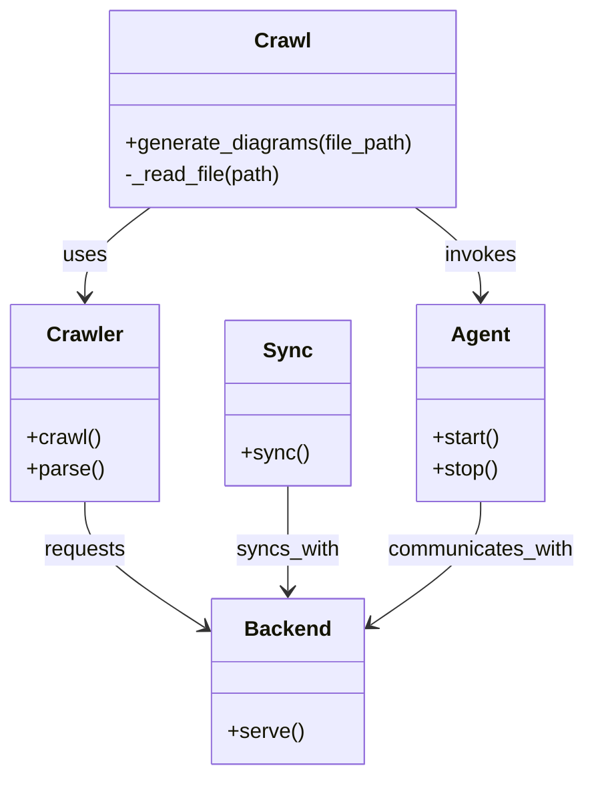

# Diagram: shipment_core/shipment_watchers/config/config.prod-b.yml

> Auto-generated by Obscura crawlers

## Mermaid

### SVG

<svg id="container" width="438.453125" xmlns="http://www.w3.org/2000/svg" class="classDiagram" height="590" viewBox="0 0 438.453125 590" role="graphics-document document" aria-roledescription="class"><g><defs><marker id="container_class-aggregationStart" class="marker aggregation class" refX="18" refY="7" markerWidth="190" markerHeight="240" orient="auto"><path d="M 18,7 L9,13 L1,7 L9,1 Z"></path></marker></defs><defs><marker id="container_class-aggregationEnd" class="marker aggregation class" refX="1" refY="7" markerWidth="20" markerHeight="28" orient="auto"><path d="M 18,7 L9,13 L1,7 L9,1 Z"></path></marker></defs><defs><marker id="container_class-extensionStart" class="marker extension class" refX="18" refY="7" markerWidth="190" markerHeight="240" orient="auto"><path d="M 1,7 L18,13 V 1 Z"></path></marker></defs><defs><marker id="container_class-extensionEnd" class="marker extension class" refX="1" refY="7" markerWidth="20" markerHeight="28" orient="auto"><path d="M 1,1 V 13 L18,7 Z"></path></marker></defs><defs><marker id="container_class-compositionStart" class="marker composition class" refX="18" refY="7" markerWidth="190" markerHeight="240" orient="auto"><path d="M 18,7 L9,13 L1,7 L9,1 Z"></path></marker></defs><defs><marker id="container_class-compositionEnd" class="marker composition class" refX="1" refY="7" markerWidth="20" markerHeight="28" orient="auto"><path d="M 18,7 L9,13 L1,7 L9,1 Z"></path></marker></defs><defs><marker id="container_class-dependencyStart" class="marker dependency class" refX="6" refY="7" markerWidth="190" markerHeight="240" orient="auto"><path d="M 5,7 L9,13 L1,7 L9,1 Z"></path></marker></defs><defs><marker id="container_class-dependencyEnd" class="marker dependency class" refX="13" refY="7" markerWidth="20" markerHeight="28" orient="auto"><path d="M 18,7 L9,13 L14,7 L9,1 Z"></path></marker></defs><defs><marker id="container_class-lollipopStart" class="marker lollipop class" refX="13" refY="7" markerWidth="190" markerHeight="240" orient="auto"><circle stroke="black" fill="transparent" cx="7" cy="7" r="6"></circle></marker></defs><defs><marker id="container_class-lollipopEnd" class="marker lollipop class" refX="1" refY="7" markerWidth="190" markerHeight="240" orient="auto"><circle stroke="black" fill="transparent" cx="7" cy="7" r="6"></circle></marker></defs><g class="root"><g class="clusters"></g><g class="edgePaths"><path d="M111.91,158L103.78,164.167C95.651,170.333,79.392,182.667,71.262,194C63.133,205.333,63.133,215.667,63.133,220.833L63.133,226" id="id_Crawl_Crawler_1" class="edge-thickness-normal edge-pattern-solid relation" style=";;;" data-edge="true" data-et="edge" data-id="id_Crawl_Crawler_1" data-points="W3sieCI6MTExLjkwOTUyODQ1OTgyMTQzLCJ5IjoxNTh9LHsieCI6NjMuMTMyODEyNSwieSI6MTk1fSx7IngiOjYzLjEzMjgxMjUsInkiOjIzMn1d" marker-end="url(#container_class-dependencyEnd)"></path><path d="M309.653,158L317.782,164.167C325.912,170.333,342.171,182.667,350.3,194C358.43,205.333,358.43,215.667,358.43,220.833L358.43,226" id="id_Crawl_Agent_2" class="edge-thickness-normal edge-pattern-solid relation" style=";;;" data-edge="true" data-et="edge" data-id="id_Crawl_Agent_2" data-points="W3sieCI6MzA5LjY1Mjk3MTU0MDE3ODU2LCJ5IjoxNTh9LHsieCI6MzU4LjQyOTY4NzUsInkiOjE5NX0seyJ4IjozNTguNDI5Njg3NSwieSI6MjMyfV0=" marker-end="url(#container_class-dependencyEnd)"></path><path d="M63.133,382L63.133,388.167C63.133,394.333,63.133,406.667,78.071,422.733C93.01,438.798,122.887,458.597,137.826,468.496L152.764,478.395" id="id_Crawler_Backend_3" class="edge-thickness-normal edge-pattern-solid relation" style=";;;" data-edge="true" data-et="edge" data-id="id_Crawler_Backend_3" data-points="W3sieCI6NjMuMTMyODEyNSwieSI6MzgyfSx7IngiOjYzLjEzMjgxMjUsInkiOjQxOX0seyJ4IjoxNTcuNzY1NjI1LCJ5Ijo0ODEuNzA5NjcwNzM5MjgzNX1d" marker-end="url(#container_class-dependencyEnd)"></path><path d="M214.039,370L214.039,378.167C214.039,386.333,214.039,402.667,214.039,416C214.039,429.333,214.039,439.667,214.039,444.833L214.039,450" id="id_Sync_Backend_4" class="edge-thickness-normal edge-pattern-solid relation" style=";;;" data-edge="true" data-et="edge" data-id="id_Sync_Backend_4" data-points="W3sieCI6MjE0LjAzOTA2MjUsInkiOjM3MH0seyJ4IjoyMTQuMDM5MDYyNSwieSI6NDE5fSx7IngiOjIxNC4wMzkwNjI1LCJ5Ijo0NTZ9XQ==" marker-end="url(#container_class-dependencyEnd)"></path><path d="M358.43,382L358.43,388.167C358.43,394.333,358.43,406.667,344.566,422.435C330.701,438.204,302.973,457.407,289.109,467.009L275.245,476.611" id="id_Agent_Backend_5" class="edge-thickness-normal edge-pattern-solid relation" style=";;;" data-edge="true" data-et="edge" data-id="id_Agent_Backend_5" data-points="W3sieCI6MzU4LjQyOTY4NzUsInkiOjM4Mn0seyJ4IjozNTguNDI5Njg3NSwieSI6NDE5fSx7IngiOjI3MC4zMTI1LCJ5Ijo0ODAuMDI2OTQ1MTM1ODA3OH1d" marker-end="url(#container_class-dependencyEnd)"></path></g><g class="edgeLabels"><g class="edgeLabel" transform="translate(63.1328125, 195)"><g class="label" data-id="id_Crawl_Crawler_1" transform="translate(-16.4921875, -12)"><foreignObject width="32.984375" height="24">

uses

</foreignObject></g></g><g class="edgeLabel" transform="translate(358.4296875, 195)"><g class="label" data-id="id_Crawl_Agent_2" transform="translate(-27.5859375, -12)"><foreignObject width="55.171875" height="24">

invokes

</foreignObject></g></g><g class="edgeLabel" transform="translate(63.1328125, 419)"><g class="label" data-id="id_Crawler_Backend_3" transform="translate(-31.375, -12)"><foreignObject width="62.75" height="24">

requests

</foreignObject></g></g><g class="edgeLabel" transform="translate(214.0390625, 419)"><g class="label" data-id="id_Sync_Backend_4" transform="translate(-39.1953125, -12)"><foreignObject width="78.390625" height="24">

syncs_with

</foreignObject></g></g><g class="edgeLabel" transform="translate(358.4296875, 419)"><g class="label" data-id="id_Agent_Backend_5" transform="translate(-72.0234375, -12)"><foreignObject width="144.046875" height="24">

communicates_with

</foreignObject></g></g></g><g class="nodes"><g class="node default" id="classId-Crawl-0" transform="translate(210.78125, 83)"><g class="basic label-container"><path d="M-131.91015625 -75 L131.91015625 -75 L131.91015625 75 L-131.91015625 75" stroke="none" stroke-width="0" fill="#ECECFF" style=""></path><path d="M-131.91015625 -75 C-62.505900238949835 -75, 6.898355772100331 -75, 131.91015625 -75 M-131.91015625 -75 C-45.540298839804095 -75, 40.82955857039181 -75, 131.91015625 -75 M131.91015625 -75 C131.91015625 -40.02877517230831, 131.91015625 -5.057550344616615, 131.91015625 75 M131.91015625 -75 C131.91015625 -19.524741761678662, 131.91015625 35.950516476642676, 131.91015625 75 M131.91015625 75 C61.349593815000475 75, -9.21096861999905 75, -131.91015625 75 M131.91015625 75 C72.7993381895293 75, 13.688520129058574 75, -131.91015625 75 M-131.91015625 75 C-131.91015625 22.775085898905765, -131.91015625 -29.44982820218847, -131.91015625 -75 M-131.91015625 75 C-131.91015625 18.371503011249438, -131.91015625 -38.256993977501125, -131.91015625 -75" stroke="#9370DB" stroke-width="1.3" fill="none" stroke-dasharray="0 0" style=""></path></g><g class="annotation-group text" transform="translate(0, -51)"></g><g class="label-group text" transform="translate(-20.1484375, -51)"><g class="label" style="font-weight: bolder" transform="translate(0,-12)"><foreignObject width="40.296875" height="24">

Crawl

</foreignObject></g></g><g class="members-group text" transform="translate(-119.91015625, -3)"></g><g class="methods-group text" transform="translate(-119.91015625, 27)"><g class="label" style="" transform="translate(0,-12)"><foreignObject width="219.671875" height="24">

+generate_diagrams(file_path)

</foreignObject></g><g class="label" style="" transform="translate(0,12)"><foreignObject width="120.125" height="24">

-_read_file(path)

</foreignObject></g></g><g class="divider" style=""><path d="M-131.91015625 -27 C-72.50616089903279 -27, -13.102165548065585 -27, 131.91015625 -27 M-131.91015625 -27 C-74.67463994267847 -27, -17.439123635356935 -27, 131.91015625 -27" stroke="#9370DB" stroke-width="1.3" fill="none" stroke-dasharray="0 0" style=""></path></g><g class="divider" style=""><path d="M-131.91015625 -3 C-75.46256659184108 -3, -19.014976933682163 -3, 131.91015625 -3 M-131.91015625 -3 C-67.6023776351009 -3, -3.2945990202017867 -3, 131.91015625 -3" stroke="#9370DB" stroke-width="1.3" fill="none" stroke-dasharray="0 0" style=""></path></g></g><g class="node default" id="classId-Crawler-1" transform="translate(63.1328125, 307)"><g class="basic label-container"><path d="M-55.1328125 -75 L55.1328125 -75 L55.1328125 75 L-55.1328125 75" stroke="none" stroke-width="0" fill="#ECECFF" style=""></path><path d="M-55.1328125 -75 C-22.46137590949582 -75, 10.210060681008358 -75, 55.1328125 -75 M-55.1328125 -75 C-19.455252884952813 -75, 16.222306730094374 -75, 55.1328125 -75 M55.1328125 -75 C55.1328125 -41.0588471979141, 55.1328125 -7.117694395828195, 55.1328125 75 M55.1328125 -75 C55.1328125 -19.346573036957295, 55.1328125 36.30685392608541, 55.1328125 75 M55.1328125 75 C32.636296360425085 75, 10.13978022085017 75, -55.1328125 75 M55.1328125 75 C20.0214506410503 75, -15.089911217899399 75, -55.1328125 75 M-55.1328125 75 C-55.1328125 35.15886198361731, -55.1328125 -4.682276032765387, -55.1328125 -75 M-55.1328125 75 C-55.1328125 43.05068964758572, -55.1328125 11.10137929517144, -55.1328125 -75" stroke="#9370DB" stroke-width="1.3" fill="none" stroke-dasharray="0 0" style=""></path></g><g class="annotation-group text" transform="translate(0, -51)"></g><g class="label-group text" transform="translate(-27.734375, -51)"><g class="label" style="font-weight: bolder" transform="translate(0,-12)"><foreignObject width="55.46875" height="24">

Crawler

</foreignObject></g></g><g class="members-group text" transform="translate(-43.1328125, -3)"></g><g class="methods-group text" transform="translate(-43.1328125, 27)"><g class="label" style="" transform="translate(0,-12)"><foreignObject width="56.40625" height="24">

+crawl()

</foreignObject></g><g class="label" style="" transform="translate(0,12)"><foreignObject width="58.53125" height="24">

+parse()

</foreignObject></g></g><g class="divider" style=""><path d="M-55.1328125 -27 C-32.602202795392074 -27, -10.071593090784155 -27, 55.1328125 -27 M-55.1328125 -27 C-14.217803366711664 -27, 26.697205766576673 -27, 55.1328125 -27" stroke="#9370DB" stroke-width="1.3" fill="none" stroke-dasharray="0 0" style=""></path></g><g class="divider" style=""><path d="M-55.1328125 -3 C-31.921701392040422 -3, -8.710590284080844 -3, 55.1328125 -3 M-55.1328125 -3 C-28.513444819315737 -3, -1.8940771386314736 -3, 55.1328125 -3" stroke="#9370DB" stroke-width="1.3" fill="none" stroke-dasharray="0 0" style=""></path></g></g><g class="node default" id="classId-Sync-2" transform="translate(214.0390625, 307)"><g class="basic label-container"><path d="M-45.7734375 -63 L45.7734375 -63 L45.7734375 63 L-45.7734375 63" stroke="none" stroke-width="0" fill="#ECECFF" style=""></path><path d="M-45.7734375 -63 C-23.544469699470273 -63, -1.3155018989405463 -63, 45.7734375 -63 M-45.7734375 -63 C-9.450478646426788 -63, 26.872480207146424 -63, 45.7734375 -63 M45.7734375 -63 C45.7734375 -23.29653551828285, 45.7734375 16.406928963434297, 45.7734375 63 M45.7734375 -63 C45.7734375 -23.840269601591856, 45.7734375 15.319460796816287, 45.7734375 63 M45.7734375 63 C24.103680366537784 63, 2.433923233075568 63, -45.7734375 63 M45.7734375 63 C15.712158952946481 63, -14.349119594107037 63, -45.7734375 63 M-45.7734375 63 C-45.7734375 34.11727409331241, -45.7734375 5.234548186624821, -45.7734375 -63 M-45.7734375 63 C-45.7734375 21.39081523162568, -45.7734375 -20.21836953674864, -45.7734375 -63" stroke="#9370DB" stroke-width="1.3" fill="none" stroke-dasharray="0 0" style=""></path></g><g class="annotation-group text" transform="translate(0, -39)"></g><g class="label-group text" transform="translate(-17.09375, -39)"><g class="label" style="font-weight: bolder" transform="translate(0,-12)"><foreignObject width="34.1875" height="24">

Sync

</foreignObject></g></g><g class="members-group text" transform="translate(-33.7734375, 9)"></g><g class="methods-group text" transform="translate(-33.7734375, 39)"><g class="label" style="" transform="translate(0,-12)"><foreignObject width="50.453125" height="24">

+sync()

</foreignObject></g></g><g class="divider" style=""><path d="M-45.7734375 -15 C-11.023178401685406 -15, 23.727080696629187 -15, 45.7734375 -15 M-45.7734375 -15 C-26.726070614748846 -15, -7.678703729497691 -15, 45.7734375 -15" stroke="#9370DB" stroke-width="1.3" fill="none" stroke-dasharray="0 0" style=""></path></g><g class="divider" style=""><path d="M-45.7734375 9 C-13.177699062339528 9, 19.418039375320944 9, 45.7734375 9 M-45.7734375 9 C-17.938513830853786 9, 9.896409838292428 9, 45.7734375 9" stroke="#9370DB" stroke-width="1.3" fill="none" stroke-dasharray="0 0" style=""></path></g></g><g class="node default" id="classId-Agent-3" transform="translate(358.4296875, 307)"><g class="basic label-container"><path d="M-48.6171875 -75 L48.6171875 -75 L48.6171875 75 L-48.6171875 75" stroke="none" stroke-width="0" fill="#ECECFF" style=""></path><path d="M-48.6171875 -75 C-19.435832831494096 -75, 9.745521837011808 -75, 48.6171875 -75 M-48.6171875 -75 C-26.095980523153443 -75, -3.5747735463068864 -75, 48.6171875 -75 M48.6171875 -75 C48.6171875 -28.045115492536233, 48.6171875 18.909769014927534, 48.6171875 75 M48.6171875 -75 C48.6171875 -32.42532901534206, 48.6171875 10.149341969315884, 48.6171875 75 M48.6171875 75 C17.024198322838693 75, -14.568790854322614 75, -48.6171875 75 M48.6171875 75 C18.988398083819593 75, -10.640391332360814 75, -48.6171875 75 M-48.6171875 75 C-48.6171875 24.89154662246802, -48.6171875 -25.21690675506396, -48.6171875 -75 M-48.6171875 75 C-48.6171875 41.24887328944788, -48.6171875 7.497746578895757, -48.6171875 -75" stroke="#9370DB" stroke-width="1.3" fill="none" stroke-dasharray="0 0" style=""></path></g><g class="annotation-group text" transform="translate(0, -51)"></g><g class="label-group text" transform="translate(-21.078125, -51)"><g class="label" style="font-weight: bolder" transform="translate(0,-12)"><foreignObject width="42.15625" height="24">

Agent

</foreignObject></g></g><g class="members-group text" transform="translate(-36.6171875, -3)"></g><g class="methods-group text" transform="translate(-36.6171875, 27)"><g class="label" style="" transform="translate(0,-12)"><foreignObject width="52.15625" height="24">

+start()

</foreignObject></g><g class="label" style="" transform="translate(0,12)"><foreignObject width="50.21875" height="24">

+stop()

</foreignObject></g></g><g class="divider" style=""><path d="M-48.6171875 -27 C-21.985426154087243 -27, 4.646335191825514 -27, 48.6171875 -27 M-48.6171875 -27 C-22.401935665285517 -27, 3.8133161694289655 -27, 48.6171875 -27" stroke="#9370DB" stroke-width="1.3" fill="none" stroke-dasharray="0 0" style=""></path></g><g class="divider" style=""><path d="M-48.6171875 -3 C-16.199491949636858 -3, 16.218203600726284 -3, 48.6171875 -3 M-48.6171875 -3 C-25.41547536516247 -3, -2.2137632303249433 -3, 48.6171875 -3" stroke="#9370DB" stroke-width="1.3" fill="none" stroke-dasharray="0 0" style=""></path></g></g><g class="node default" id="classId-Backend-4" transform="translate(214.0390625, 519)"><g class="basic label-container"><path d="M-56.2734375 -63 L56.2734375 -63 L56.2734375 63 L-56.2734375 63" stroke="none" stroke-width="0" fill="#ECECFF" style=""></path><path d="M-56.2734375 -63 C-33.00549070933823 -63, -9.737543918676458 -63, 56.2734375 -63 M-56.2734375 -63 C-31.13321804956465 -63, -5.992998599129301 -63, 56.2734375 -63 M56.2734375 -63 C56.2734375 -25.958768127807154, 56.2734375 11.082463744385691, 56.2734375 63 M56.2734375 -63 C56.2734375 -14.766684532628915, 56.2734375 33.46663093474217, 56.2734375 63 M56.2734375 63 C11.679684406815639 63, -32.91406868636872 63, -56.2734375 63 M56.2734375 63 C25.79362792080085 63, -4.686181658398297 63, -56.2734375 63 M-56.2734375 63 C-56.2734375 26.026924770035706, -56.2734375 -10.946150459928589, -56.2734375 -63 M-56.2734375 63 C-56.2734375 22.24095425611982, -56.2734375 -18.51809148776036, -56.2734375 -63" stroke="#9370DB" stroke-width="1.3" fill="none" stroke-dasharray="0 0" style=""></path></g><g class="annotation-group text" transform="translate(0, -39)"></g><g class="label-group text" transform="translate(-31.296875, -39)"><g class="label" style="font-weight: bolder" transform="translate(0,-12)"><foreignObject width="62.59375" height="24">

Backend

</foreignObject></g></g><g class="members-group text" transform="translate(-44.2734375, 9)"></g><g class="methods-group text" transform="translate(-44.2734375, 39)"><g class="label" style="" transform="translate(0,-12)"><foreignObject width="57.25" height="24">

+serve()

</foreignObject></g></g><g class="divider" style=""><path d="M-56.2734375 -15 C-32.83460821024471 -15, -9.395778920489413 -15, 56.2734375 -15 M-56.2734375 -15 C-13.011219617510982 -15, 30.250998264978037 -15, 56.2734375 -15" stroke="#9370DB" stroke-width="1.3" fill="none" stroke-dasharray="0 0" style=""></path></g><g class="divider" style=""><path d="M-56.2734375 9 C-25.738617435191735 9, 4.7962026296165305 9, 56.2734375 9 M-56.2734375 9 C-33.68477033656503 9, -11.09610317313006 9, 56.2734375 9" stroke="#9370DB" stroke-width="1.3" fill="none" stroke-dasharray="0 0" style=""></path></g></g></g></g></g></svg>
