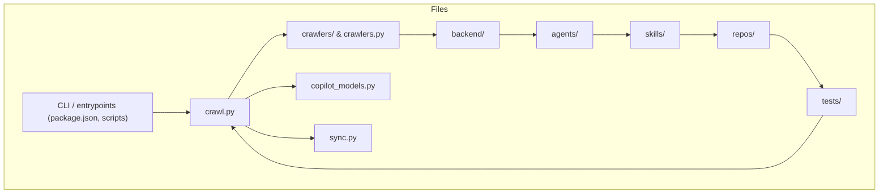

# Diagram: shipment_core/shipment_watchers/config/config.qa.yml

> Auto-generated by Obscura crawlers

## Mermaid

### SVG

<svg id="container" width="1788.8125" xmlns="http://www.w3.org/2000/svg" class="flowchart" height="389" viewBox="0 0 1788.8125 389" role="graphics-document document" aria-roledescription="flowchart-v2"><g><marker id="container_flowchart-v2-pointEnd" class="marker flowchart-v2" viewBox="0 0 10 10" refX="5" refY="5" markerUnits="userSpaceOnUse" markerWidth="8" markerHeight="8" orient="auto"><path d="M 0 0 L 10 5 L 0 10 z" class="arrowMarkerPath" style="stroke-width: 1; stroke-dasharray: 1, 0;"></path></marker><marker id="container_flowchart-v2-pointStart" class="marker flowchart-v2" viewBox="0 0 10 10" refX="4.5" refY="5" markerUnits="userSpaceOnUse" markerWidth="8" markerHeight="8" orient="auto"><path d="M 0 5 L 10 10 L 10 0 z" class="arrowMarkerPath" style="stroke-width: 1; stroke-dasharray: 1, 0;"></path></marker><marker id="container_flowchart-v2-circleEnd" class="marker flowchart-v2" viewBox="0 0 10 10" refX="11" refY="5" markerUnits="userSpaceOnUse" markerWidth="11" markerHeight="11" orient="auto"><circle cx="5" cy="5" r="5" class="arrowMarkerPath" style="stroke-width: 1; stroke-dasharray: 1, 0;"></circle></marker><marker id="container_flowchart-v2-circleStart" class="marker flowchart-v2" viewBox="0 0 10 10" refX="-1" refY="5" markerUnits="userSpaceOnUse" markerWidth="11" markerHeight="11" orient="auto"><circle cx="5" cy="5" r="5" class="arrowMarkerPath" style="stroke-width: 1; stroke-dasharray: 1, 0;"></circle></marker><marker id="container_flowchart-v2-crossEnd" class="marker cross flowchart-v2" viewBox="0 0 11 11" refX="12" refY="5.2" markerUnits="userSpaceOnUse" markerWidth="11" markerHeight="11" orient="auto"><path d="M 1,1 l 9,9 M 10,1 l -9,9" class="arrowMarkerPath" style="stroke-width: 2; stroke-dasharray: 1, 0;"></path></marker><marker id="container_flowchart-v2-crossStart" class="marker cross flowchart-v2" viewBox="0 0 11 11" refX="-1" refY="5.2" markerUnits="userSpaceOnUse" markerWidth="11" markerHeight="11" orient="auto"><path d="M 1,1 l 9,9 M 10,1 l -9,9" class="arrowMarkerPath" style="stroke-width: 2; stroke-dasharray: 1, 0;"></path></marker><g class="root"><g class="clusters"></g><g class="edgePaths"></g><g class="edgeLabels"></g><g class="nodes"><g class="root" transform="translate(0, 0)"><g class="clusters"><g class="cluster" id="Files" data-look="classic"><rect style="" x="8" y="8" width="1772.8125" height="373"></rect><g class="cluster-label" transform="translate(878.1015625, 8)"><foreignObject width="32.609375" height="24">

Files

</foreignObject></g></g></g><g class="edgePaths"><path d="M305.5,226L311.75,226C318,226,330.5,226,342.333,226C354.167,226,365.333,226,370.917,226L376.5,226" id="L_CLI_Crawl_0" class="edge-thickness-normal edge-pattern-solid edge-thickness-normal edge-pattern-solid flowchart-link" style=";" data-edge="true" data-et="edge" data-id="L_CLI_Crawl_0" data-points="W3sieCI6MzA1LjUsInkiOjIyNn0seyJ4IjozNDMsInkiOjIyNn0seyJ4IjozODAuNSwieSI6MjI2fV0=" marker-end="url(#container_flowchart-v2-pointEnd)"></path><path d="M456.944,199L470.331,177.5C483.718,156,510.492,113,529.462,91.5C548.432,70,559.599,70,565.182,70L570.766,70" id="L_Crawl_Crawlers_0" class="edge-thickness-normal edge-pattern-solid edge-thickness-normal edge-pattern-solid flowchart-link" style=";" data-edge="true" data-et="edge" data-id="L_Crawl_Crawlers_0" data-points="W3sieCI6NDU2Ljk0NDI2MDgxNzMwNzcsInkiOjE5OX0seyJ4Ijo1MzcuMjY1NjI1LCJ5Ijo3MH0seyJ4Ijo1NzQuNzY1NjI1LCJ5Ijo3MH1d" marker-end="url(#container_flowchart-v2-pointEnd)"></path><path d="M490.567,199L498.35,194.833C506.133,190.667,521.699,182.333,538.1,178.167C554.5,174,571.734,174,580.352,174L588.969,174" id="L_Crawl_Copilot_0" class="edge-thickness-normal edge-pattern-solid edge-thickness-normal edge-pattern-solid flowchart-link" style=";" data-edge="true" data-et="edge" data-id="L_Crawl_Copilot_0" data-points="W3sieCI6NDkwLjU2NzE1NzQ1MTkyMzEsInkiOjE5OX0seyJ4Ijo1MzcuMjY1NjI1LCJ5IjoxNzR9LHsieCI6NTkyLjk2ODc1LCJ5IjoxNzR9XQ==" marker-end="url(#container_flowchart-v2-pointEnd)"></path><path d="M490.567,253L498.35,257.167C506.133,261.333,521.699,269.667,544.765,273.833C567.831,278,598.396,278,613.678,278L628.961,278" id="L_Crawl_Sync_0" class="edge-thickness-normal edge-pattern-solid edge-thickness-normal edge-pattern-solid flowchart-link" style=";" data-edge="true" data-et="edge" data-id="L_Crawl_Sync_0" data-points="W3sieCI6NDkwLjU2NzE1NzQ1MTkyMzEsInkiOjI1M30seyJ4Ijo1MzcuMjY1NjI1LCJ5IjoyNzh9LHsieCI6NjMyLjk2MDkzNzUsInkiOjI3OH1d" marker-end="url(#container_flowchart-v2-pointEnd)"></path><path d="M804.578,70L810.828,70C817.078,70,829.578,70,841.411,70C853.245,70,864.411,70,869.995,70L875.578,70" id="L_Crawlers_Backend_0" class="edge-thickness-normal edge-pattern-solid edge-thickness-normal edge-pattern-solid flowchart-link" style=";" data-edge="true" data-et="edge" data-id="L_Crawlers_Backend_0" data-points="W3sieCI6ODA0LjU3ODEyNSwieSI6NzB9LHsieCI6ODQyLjA3ODEyNSwieSI6NzB9LHsieCI6ODc5LjU3ODEyNSwieSI6NzB9XQ==" marker-end="url(#container_flowchart-v2-pointEnd)"></path><path d="M1009.313,70L1015.563,70C1021.813,70,1034.313,70,1046.146,70C1057.979,70,1069.146,70,1074.729,70L1080.313,70" id="L_Backend_Agents_0" class="edge-thickness-normal edge-pattern-solid edge-thickness-normal edge-pattern-solid flowchart-link" style=";" data-edge="true" data-et="edge" data-id="L_Backend_Agents_0" data-points="W3sieCI6MTAwOS4zMTI1LCJ5Ijo3MH0seyJ4IjoxMDQ2LjgxMjUsInkiOjcwfSx7IngiOjEwODQuMzEyNSwieSI6NzB9XQ==" marker-end="url(#container_flowchart-v2-pointEnd)"></path><path d="M1200.594,70L1206.844,70C1213.094,70,1225.594,70,1237.427,70C1249.26,70,1260.427,70,1266.01,70L1271.594,70" id="L_Agents_Skills_0" class="edge-thickness-normal edge-pattern-solid edge-thickness-normal edge-pattern-solid flowchart-link" style=";" data-edge="true" data-et="edge" data-id="L_Agents_Skills_0" data-points="W3sieCI6MTIwMC41OTM3NSwieSI6NzB9LHsieCI6MTIzOC4wOTM3NSwieSI6NzB9LHsieCI6MTI3NS41OTM3NSwieSI6NzB9XQ==" marker-end="url(#container_flowchart-v2-pointEnd)"></path><path d="M1380.953,70L1387.203,70C1393.453,70,1405.953,70,1417.786,70C1429.62,70,1440.786,70,1446.37,70L1451.953,70" id="L_Skills_Repos_0" class="edge-thickness-normal edge-pattern-solid edge-thickness-normal edge-pattern-solid flowchart-link" style=";" data-edge="true" data-et="edge" data-id="L_Skills_Repos_0" data-points="W3sieCI6MTM4MC45NTMxMjUsInkiOjcwfSx7IngiOjE0MTguNDUzMTI1LCJ5Ijo3MH0seyJ4IjoxNDU1Ljk1MzEyNSwieSI6NzB9XQ==" marker-end="url(#container_flowchart-v2-pointEnd)"></path><path d="M1565.016,70L1571.266,70C1577.516,70,1590.016,70,1607.785,87.444C1625.554,104.887,1648.592,139.775,1660.111,157.218L1671.63,174.662" id="L_Repos_Tests_0" class="edge-thickness-normal edge-pattern-solid edge-thickness-normal edge-pattern-solid flowchart-link" style=";" data-edge="true" data-et="edge" data-id="L_Repos_Tests_0" data-points="W3sieCI6MTU2NS4wMTU2MjUsInkiOjcwfSx7IngiOjE2MDIuNTE1NjI1LCJ5Ijo3MH0seyJ4IjoxNjczLjgzNDM3NSwieSI6MTc4fV0=" marker-end="url(#container_flowchart-v2-pointEnd)"></path><path d="M1673.834,232L1661.948,250C1650.061,268,1626.289,304,1599.064,322C1571.839,340,1541.161,340,1510.484,340C1479.807,340,1449.13,340,1418.762,340C1388.393,340,1358.333,340,1328.273,340C1298.214,340,1268.154,340,1237.184,340C1206.214,340,1174.333,340,1142.453,340C1110.573,340,1078.693,340,1045.691,340C1012.69,340,978.568,340,944.445,340C910.323,340,876.201,340,833.738,340C791.276,340,740.474,340,689.672,340C638.87,340,588.068,340,550.744,326.007C513.421,312.015,489.577,284.03,477.654,270.037L465.732,256.045" id="L_Tests_Crawl_0" class="edge-thickness-normal edge-pattern-solid edge-thickness-normal edge-pattern-solid flowchart-link" style=";" data-edge="true" data-et="edge" data-id="L_Tests_Crawl_0" data-points="W3sieCI6MTY3My44MzQzNzUsInkiOjIzMn0seyJ4IjoxNjAyLjUxNTYyNSwieSI6MzQwfSx7IngiOjE1MTAuNDg0Mzc1LCJ5IjozNDB9LHsieCI6MTQxOC40NTMxMjUsInkiOjM0MH0seyJ4IjoxMzI4LjI3MzQzNzUsInkiOjM0MH0seyJ4IjoxMjM4LjA5Mzc1LCJ5IjozNDB9LHsieCI6MTE0Mi40NTMxMjUsInkiOjM0MH0seyJ4IjoxMDQ2LjgxMjUsInkiOjM0MH0seyJ4Ijo5NDQuNDQ1MzEyNSwieSI6MzQwfSx7IngiOjg0Mi4wNzgxMjUsInkiOjM0MH0seyJ4Ijo2ODkuNjcxODc1LCJ5IjozNDB9LHsieCI6NTM3LjI2NTYyNSwieSI6MzQwfSx7IngiOjQ2My4xMzc5NTIzMDI2MzE1NiwieSI6MjUzfV0=" marker-end="url(#container_flowchart-v2-pointEnd)"></path></g><g class="edgeLabels"><g class="edgeLabel"><g class="label" data-id="L_CLI_Crawl_0" transform="translate(0, 0)"><foreignObject width="0" height="0">

</foreignObject></g></g><g class="edgeLabel"><g class="label" data-id="L_Crawl_Crawlers_0" transform="translate(0, 0)"><foreignObject width="0" height="0">

</foreignObject></g></g><g class="edgeLabel"><g class="label" data-id="L_Crawl_Copilot_0" transform="translate(0, 0)"><foreignObject width="0" height="0">

</foreignObject></g></g><g class="edgeLabel"><g class="label" data-id="L_Crawl_Sync_0" transform="translate(0, 0)"><foreignObject width="0" height="0">

</foreignObject></g></g><g class="edgeLabel"><g class="label" data-id="L_Crawlers_Backend_0" transform="translate(0, 0)"><foreignObject width="0" height="0">

</foreignObject></g></g><g class="edgeLabel"><g class="label" data-id="L_Backend_Agents_0" transform="translate(0, 0)"><foreignObject width="0" height="0">

</foreignObject></g></g><g class="edgeLabel"><g class="label" data-id="L_Agents_Skills_0" transform="translate(0, 0)"><foreignObject width="0" height="0">

</foreignObject></g></g><g class="edgeLabel"><g class="label" data-id="L_Skills_Repos_0" transform="translate(0, 0)"><foreignObject width="0" height="0">

</foreignObject></g></g><g class="edgeLabel"><g class="label" data-id="L_Repos_Tests_0" transform="translate(0, 0)"><foreignObject width="0" height="0">

</foreignObject></g></g><g class="edgeLabel"><g class="label" data-id="L_Tests_Crawl_0" transform="translate(0, 0)"><foreignObject width="0" height="0">

</foreignObject></g></g></g><g class="nodes"><g class="node default" id="flowchart-CLI-0" transform="translate(175.5, 226)"><rect class="basic label-container" style="" x="-130" y="-39" width="260" height="78"></rect><g class="label" style="" transform="translate(-100, -24)"><rect></rect><foreignObject width="200" height="48">

CLI / entrypoints (package.json, scripts)

</foreignObject></g></g><g class="node default" id="flowchart-Crawl-1" transform="translate(440.1328125, 226)"><rect class="basic label-container" style="" x="-59.6328125" y="-27" width="119.265625" height="54"></rect><g class="label" style="" transform="translate(-29.6328125, -12)"><rect></rect><foreignObject width="59.265625" height="24">

crawl.py

</foreignObject></g></g><g class="node default" id="flowchart-Crawlers-3" transform="translate(689.671875, 70)"><rect class="basic label-container" style="" x="-114.90625" y="-27" width="229.8125" height="54"></rect><g class="label" style="" transform="translate(-84.90625, -12)"><rect></rect><foreignObject width="169.8125" height="24">

crawlers/ &amp; crawlers.py

</foreignObject></g></g><g class="node default" id="flowchart-Copilot-5" transform="translate(689.671875, 174)"><rect class="basic label-container" style="" x="-96.703125" y="-27" width="193.40625" height="54"></rect><g class="label" style="" transform="translate(-66.703125, -12)"><rect></rect><foreignObject width="133.40625" height="24">

copilot_models.py

</foreignObject></g></g><g class="node default" id="flowchart-Sync-7" transform="translate(689.671875, 278)"><rect class="basic label-container" style="" x="-56.7109375" y="-27" width="113.421875" height="54"></rect><g class="label" style="" transform="translate(-26.7109375, -12)"><rect></rect><foreignObject width="53.421875" height="24">

sync.py

</foreignObject></g></g><g class="node default" id="flowchart-Backend-9" transform="translate(944.4453125, 70)"><rect class="basic label-container" style="" x="-64.8671875" y="-27" width="129.734375" height="54"></rect><g class="label" style="" transform="translate(-34.8671875, -12)"><rect></rect><foreignObject width="69.734375" height="24">

backend/

</foreignObject></g></g><g class="node default" id="flowchart-Agents-11" transform="translate(1142.453125, 70)"><rect class="basic label-container" style="" x="-58.140625" y="-27" width="116.28125" height="54"></rect><g class="label" style="" transform="translate(-28.140625, -12)"><rect></rect><foreignObject width="56.28125" height="24">

agents/

</foreignObject></g></g><g class="node default" id="flowchart-Skills-13" transform="translate(1328.2734375, 70)"><rect class="basic label-container" style="" x="-52.6796875" y="-27" width="105.359375" height="54"></rect><g class="label" style="" transform="translate(-22.6796875, -12)"><rect></rect><foreignObject width="45.359375" height="24">

skills/

</foreignObject></g></g><g class="node default" id="flowchart-Repos-15" transform="translate(1510.484375, 70)"><rect class="basic label-container" style="" x="-54.53125" y="-27" width="109.0625" height="54"></rect><g class="label" style="" transform="translate(-24.53125, -12)"><rect></rect><foreignObject width="49.0625" height="24">

repos/

</foreignObject></g></g><g class="node default" id="flowchart-Tests-17" transform="translate(1691.6640625, 205)"><rect class="basic label-container" style="" x="-51.6484375" y="-27" width="103.296875" height="54"></rect><g class="label" style="" transform="translate(-21.6484375, -12)"><rect></rect><foreignObject width="43.296875" height="24">

tests/

</foreignObject></g></g></g></g></g></g></g></svg>
