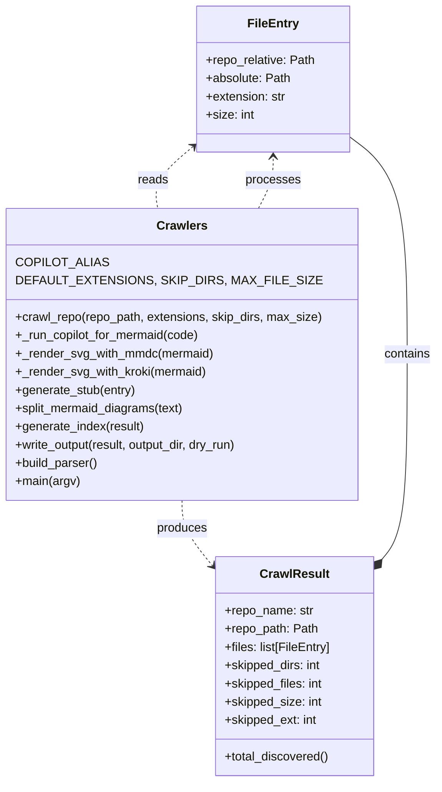

# Diagram: shipment_core/shipment_watchers/config/config.qa2.yml


> Auto-generated by Obscura crawlers

## Diagram 1



### SVG

<svg id="container" width="574.046875" xmlns="http://www.w3.org/2000/svg" class="classDiagram" height="1028" viewBox="0 0 574.046875 1028" role="graphics-document document" aria-roledescription="class"><style>#container{font-family:"trebuchet ms",verdana,arial,sans-serif;font-size:16px;fill:#333;}@keyframes edge-animation-frame{from{stroke-dashoffset:0;}}@keyframes dash{to{stroke-dashoffset:0;}}#container .edge-animation-slow{stroke-dasharray:9,5!important;stroke-dashoffset:900;animation:dash 50s linear infinite;stroke-linecap:round;}#container .edge-animation-fast{stroke-dasharray:9,5!important;stroke-dashoffset:900;animation:dash 20s linear infinite;stroke-linecap:round;}#container .error-icon{fill:#552222;}#container .error-text{fill:#552222;stroke:#552222;}#container .edge-thickness-normal{stroke-width:1px;}#container .edge-thickness-thick{stroke-width:3.5px;}#container .edge-pattern-solid{stroke-dasharray:0;}#container .edge-thickness-invisible{stroke-width:0;fill:none;}#container .edge-pattern-dashed{stroke-dasharray:3;}#container .edge-pattern-dotted{stroke-dasharray:2;}#container .marker{fill:#333333;stroke:#333333;}#container .marker.cross{stroke:#333333;}#container svg{font-family:"trebuchet ms",verdana,arial,sans-serif;font-size:16px;}#container p{margin:0;}#container g.classGroup text{fill:#9370DB;stroke:none;font-family:"trebuchet ms",verdana,arial,sans-serif;font-size:10px;}#container g.classGroup text .title{font-weight:bolder;}#container .nodeLabel,#container .edgeLabel{color:#131300;}#container .edgeLabel .label rect{fill:#ECECFF;}#container .label text{fill:#131300;}#container .labelBkg{background:#ECECFF;}#container .edgeLabel .label span{background:#ECECFF;}#container .classTitle{font-weight:bolder;}#container .node rect,#container .node circle,#container .node ellipse,#container .node polygon,#container .node path{fill:#ECECFF;stroke:#9370DB;stroke-width:1px;}#container .divider{stroke:#9370DB;stroke-width:1;}#container g.clickable{cursor:pointer;}#container g.classGroup rect{fill:#ECECFF;stroke:#9370DB;}#container g.classGroup line{stroke:#9370DB;stroke-width:1;}#container .classLabel .box{stroke:none;stroke-width:0;fill:#ECECFF;opacity:0.5;}#container .classLabel .label{fill:#9370DB;font-size:10px;}#container .relation{stroke:#333333;stroke-width:1;fill:none;}#container .dashed-line{stroke-dasharray:3;}#container .dotted-line{stroke-dasharray:1 2;}#container #compositionStart,#container .composition{fill:#333333!important;stroke:#333333!important;stroke-width:1;}#container #compositionEnd,#container .composition{fill:#333333!important;stroke:#333333!important;stroke-width:1;}#container #dependencyStart,#container .dependency{fill:#333333!important;stroke:#333333!important;stroke-width:1;}#container #dependencyStart,#container .dependency{fill:#333333!important;stroke:#333333!important;stroke-width:1;}#container #extensionStart,#container .extension{fill:transparent!important;stroke:#333333!important;stroke-width:1;}#container #extensionEnd,#container .extension{fill:transparent!important;stroke:#333333!important;stroke-width:1;}#container #aggregationStart,#container .aggregation{fill:transparent!important;stroke:#333333!important;stroke-width:1;}#container #aggregationEnd,#container .aggregation{fill:transparent!important;stroke:#333333!important;stroke-width:1;}#container #lollipopStart,#container .lollipop{fill:#ECECFF!important;stroke:#333333!important;stroke-width:1;}#container #lollipopEnd,#container .lollipop{fill:#ECECFF!important;stroke:#333333!important;stroke-width:1;}#container .edgeTerminals{font-size:11px;line-height:initial;}#container .classTitleText{text-anchor:middle;font-size:18px;fill:#333;}#container .label-icon{display:inline-block;height:1em;overflow:visible;vertical-align:-0.125em;}#container .node .label-icon path{fill:currentColor;stroke:revert;stroke-width:revert;}#container :root{--mermaid-font-family:"trebuchet ms",verdana,arial,sans-serif;}</style><g><defs><marker id="container_class-aggregationStart" class="marker aggregation class" refX="18" refY="7" markerWidth="190" markerHeight="240" orient="auto"><path d="M 18,7 L9,13 L1,7 L9,1 Z"></path></marker></defs><defs><marker id="container_class-aggregationEnd" class="marker aggregation class" refX="1" refY="7" markerWidth="20" markerHeight="28" orient="auto"><path d="M 18,7 L9,13 L1,7 L9,1 Z"></path></marker></defs><defs><marker id="container_class-extensionStart" class="marker extension class" refX="18" refY="7" markerWidth="190" markerHeight="240" orient="auto"><path d="M 1,7 L18,13 V 1 Z"></path></marker></defs><defs><marker id="container_class-extensionEnd" class="marker extension class" refX="1" refY="7" markerWidth="20" markerHeight="28" orient="auto"><path d="M 1,1 V 13 L18,7 Z"></path></marker></defs><defs><marker id="container_class-compositionStart" class="marker composition class" refX="18" refY="7" markerWidth="190" markerHeight="240" orient="auto"><path d="M 18,7 L9,13 L1,7 L9,1 Z"></path></marker></defs><defs><marker id="container_class-compositionEnd" class="marker composition class" refX="1" refY="7" markerWidth="20" markerHeight="28" orient="auto"><path d="M 18,7 L9,13 L1,7 L9,1 Z"></path></marker></defs><defs><marker id="container_class-dependencyStart" class="marker dependency class" refX="6" refY="7" markerWidth="190" markerHeight="240" orient="auto"><path d="M 5,7 L9,13 L1,7 L9,1 Z"></path></marker></defs><defs><marker id="container_class-dependencyEnd" class="marker dependency class" refX="13" refY="7" markerWidth="20" markerHeight="28" orient="auto"><path d="M 18,7 L9,13 L14,7 L9,1 Z"></path></marker></defs><defs><marker id="container_class-lollipopStart" class="marker lollipop class" refX="13" refY="7" markerWidth="190" markerHeight="240" orient="auto"><circle stroke="black" fill="transparent" cx="7" cy="7" r="6"></circle></marker></defs><defs><marker id="container_class-lollipopEnd" class="marker lollipop class" refX="1" refY="7" markerWidth="190" markerHeight="240" orient="auto"><circle stroke="black" fill="transparent" cx="7" cy="7" r="6"></circle></marker></defs><g class="root"><g class="clusters"></g><g class="edgePaths"><path d="M502.122,735.328L507.628,728.607C513.134,721.886,524.145,708.443,529.651,663.555C535.156,618.667,535.156,542.333,535.156,466C535.156,389.667,535.156,313.333,522.465,265.585C509.773,217.836,484.391,198.671,471.699,189.089L459.008,179.507" id="id_CrawlResult_FileEntry_1" class="edge-thickness-normal edge-pattern-solid relation" style=";;;" data-edge="true" data-et="edge" data-id="id_CrawlResult_FileEntry_1" data-points="W3sieCI6NDkxLjE5MTQwNjI1LCJ5Ijo3NDguNjcyOTAyMTIwOTMyN30seyJ4Ijo1MzUuMTU2MjUsInkiOjY5NX0seyJ4Ijo1MzUuMTU2MjUsInkiOjQ2Nn0seyJ4Ijo1MzUuMTU2MjUsInkiOjIzN30seyJ4Ijo0NTkuMDA3ODEyNSwieSI6MTc5LjUwNzA1MTYyMzIwMzg0fV0=" marker-start="url(#container_class-compositionStart)"></path><path d="M238.633,658L238.633,664.167C238.633,670.333,238.633,682.667,245.327,697.005C252.02,711.344,265.408,727.688,272.102,735.859L278.796,744.031" id="id_Crawlers_CrawlResult_2" class="edge-thickness-normal edge-pattern-dashed relation" style=";;;" data-edge="true" data-et="edge" data-id="id_Crawlers_CrawlResult_2" data-points="W3sieCI6MjM4LjYzMjgxMjUsInkiOjY1OH0seyJ4IjoyMzguNjMyODEyNSwieSI6Njk1fSx7IngiOjI4Mi41OTc2NTYyNSwieSI6NzQ4LjY3MjkwMjEyMDkzMjd9XQ==" marker-end="url(#container_class-dependencyEnd)"></path><path d="M339.552,274L342.793,267.833C346.035,261.667,352.517,249.333,355.759,238C359,226.667,359,216.333,359,211.167L359,206" id="id_Crawlers_FileEntry_3" class="edge-thickness-normal edge-pattern-dashed relation" style=";;;" data-edge="true" data-et="edge" data-id="id_Crawlers_FileEntry_3" data-points="W3sieCI6MzM5LjU1MjAyNjQ3Mzc5OTEsInkiOjI3NH0seyJ4IjozNTksInkiOjIzN30seyJ4IjozNTksInkiOjIwMH1d" marker-end="url(#container_class-dependencyEnd)"></path><path d="M254.399,191.903L245.455,199.419C236.511,206.935,218.623,221.968,210.699,235.65C202.775,249.333,204.817,261.667,205.837,267.833L206.858,274" id="id_FileEntry_Crawlers_4" class="edge-thickness-normal edge-pattern-dashed relation" style=";;;" data-edge="true" data-et="edge" data-id="id_FileEntry_Crawlers_4" data-points="W3sieCI6MjU4Ljk5MjE4NzUsInkiOjE4OC4wNDI1MDE3Mjc3MTI1fSx7IngiOjIwMC43MzQzNzUsInkiOjIzN30seyJ4IjoyMDYuODU3NzAzMzI5Njk0MzIsInkiOjI3NH1d" marker-start="url(#container_class-dependencyStart)"></path></g><g class="edgeLabels"><g class="edgeLabel" transform="translate(535.15625, 466)"><g class="label" data-id="id_CrawlResult_FileEntry_1" transform="translate(-30.890625, -12)"><foreignObject width="61.78125" height="24"><div xmlns="http://www.w3.org/1999/xhtml" class="labelBkg" style="display: table-cell; white-space: nowrap; line-height: 1.5; max-width: 200px; text-align: center;"><span class="edgeLabel"><p>contains</p></span></div></foreignObject></g></g><g class="edgeLabel" transform="translate(238.6328125, 695)"><g class="label" data-id="id_Crawlers_CrawlResult_2" transform="translate(-33.4765625, -12)"><foreignObject width="66.953125" height="24"><div xmlns="http://www.w3.org/1999/xhtml" class="labelBkg" style="display: table-cell; white-space: nowrap; line-height: 1.5; max-width: 200px; text-align: center;"><span class="edgeLabel"><p>produces</p></span></div></foreignObject></g></g><g class="edgeLabel" transform="translate(359, 237)"><g class="label" data-id="id_Crawlers_FileEntry_3" transform="translate(-35.7890625, -12)"><foreignObject width="71.578125" height="24"><div xmlns="http://www.w3.org/1999/xhtml" class="labelBkg" style="display: table-cell; white-space: nowrap; line-height: 1.5; max-width: 200px; text-align: center;"><span class="edgeLabel"><p>processes</p></span></div></foreignObject></g></g><g class="edgeLabel" transform="translate(200.734375, 237)"><g class="label" data-id="id_FileEntry_Crawlers_4" transform="translate(-20.0078125, -12)"><foreignObject width="40.015625" height="24"><div xmlns="http://www.w3.org/1999/xhtml" class="labelBkg" style="display: table-cell; white-space: nowrap; line-height: 1.5; max-width: 200px; text-align: center;"><span class="edgeLabel"><p>reads</p></span></div></foreignObject></g></g></g><g class="nodes"><g class="node default" id="classId-FileEntry-0" transform="translate(359, 104)"><g class="basic label-container"><path d="M-100.0078125 -96 L100.0078125 -96 L100.0078125 96 L-100.0078125 96" stroke="none" stroke-width="0" fill="#ECECFF" style=""></path><path d="M-100.0078125 -96 C-53.09492966781913 -96, -6.1820468356382605 -96, 100.0078125 -96 M-100.0078125 -96 C-31.15453201984664 -96, 37.69874846030672 -96, 100.0078125 -96 M100.0078125 -96 C100.0078125 -46.77048161942386, 100.0078125 2.4590367611522765, 100.0078125 96 M100.0078125 -96 C100.0078125 -43.73597568348745, 100.0078125 8.528048633025094, 100.0078125 96 M100.0078125 96 C47.12892316667486 96, -5.749966166650282 96, -100.0078125 96 M100.0078125 96 C24.156712218691624 96, -51.69438806261675 96, -100.0078125 96 M-100.0078125 96 C-100.0078125 48.97822594367672, -100.0078125 1.9564518873534382, -100.0078125 -96 M-100.0078125 96 C-100.0078125 48.500939110940294, -100.0078125 1.0018782218805882, -100.0078125 -96" stroke="#9370DB" stroke-width="1.3" fill="none" stroke-dasharray="0 0" style=""></path></g><g class="annotation-group text" transform="translate(0, -72)"></g><g class="label-group text" transform="translate(-31.859375, -72)"><g class="label" style="font-weight: bolder" transform="translate(0,-12)"><foreignObject width="63.71875" height="24"><div xmlns="http://www.w3.org/1999/xhtml" style="display: table-cell; white-space: nowrap; line-height: 1.5; max-width: 113px; text-align: center;"><span class="nodeLabel markdown-node-label" style=""><p>FileEntry</p></span></div></foreignObject></g></g><g class="members-group text" transform="translate(-88.0078125, -24)"><g class="label" style="" transform="translate(0,-12)"><foreignObject width="144.15625" height="24"><div xmlns="http://www.w3.org/1999/xhtml" style="display: table-cell; white-space: nowrap; line-height: 1.5; max-width: 202px; text-align: center;"><span class="nodeLabel markdown-node-label" style=""><p>+repo_relative: Path</p></span></div></foreignObject></g><g class="label" style="" transform="translate(0,12)"><foreignObject width="111.390625" height="24"><div xmlns="http://www.w3.org/1999/xhtml" style="display: table-cell; white-space: nowrap; line-height: 1.5; max-width: 169px; text-align: center;"><span class="nodeLabel markdown-node-label" style=""><p>+absolute: Path</p></span></div></foreignObject></g><g class="label" style="" transform="translate(0,36)"><foreignObject width="106.171875" height="24"><div xmlns="http://www.w3.org/1999/xhtml" style="display: table-cell; white-space: nowrap; line-height: 1.5; max-width: 164px; text-align: center;"><span class="nodeLabel markdown-node-label" style=""><p>+extension: str</p></span></div></foreignObject></g><g class="label" style="" transform="translate(0,60)"><foreignObject width="63.3125" height="24"><div xmlns="http://www.w3.org/1999/xhtml" style="display: table-cell; white-space: nowrap; line-height: 1.5; max-width: 121px; text-align: center;"><span class="nodeLabel markdown-node-label" style=""><p>+size: int</p></span></div></foreignObject></g></g><g class="methods-group text" transform="translate(-88.0078125, 96)"></g><g class="divider" style=""><path d="M-100.0078125 -48 C-36.65256054461937 -48, 26.70269141076126 -48, 100.0078125 -48 M-100.0078125 -48 C-55.66539098116485 -48, -11.322969462329695 -48, 100.0078125 -48" stroke="#9370DB" stroke-width="1.3" fill="none" stroke-dasharray="0 0" style=""></path></g><g class="divider" style=""><path d="M-100.0078125 72 C-45.69599710647169 72, 8.615818287056626 72, 100.0078125 72 M-100.0078125 72 C-32.64845160333053 72, 34.71090929333894 72, 100.0078125 72" stroke="#9370DB" stroke-width="1.3" fill="none" stroke-dasharray="0 0" style=""></path></g></g><g class="node default" id="classId-CrawlResult-1" transform="translate(386.89453125, 876)"><g class="basic label-container"><path d="M-104.296875 -144 L104.296875 -144 L104.296875 144 L-104.296875 144" stroke="none" stroke-width="0" fill="#ECECFF" style=""></path><path d="M-104.296875 -144 C-40.22786550887214 -144, 23.841143982255716 -144, 104.296875 -144 M-104.296875 -144 C-22.358025473753244 -144, 59.58082405249351 -144, 104.296875 -144 M104.296875 -144 C104.296875 -40.95868297281402, 104.296875 62.082634054371965, 104.296875 144 M104.296875 -144 C104.296875 -43.90876032952795, 104.296875 56.1824793409441, 104.296875 144 M104.296875 144 C53.26719174980542 144, 2.23750849961084 144, -104.296875 144 M104.296875 144 C50.820380287447804 144, -2.6561144251043913 144, -104.296875 144 M-104.296875 144 C-104.296875 32.405424895560046, -104.296875 -79.18915020887991, -104.296875 -144 M-104.296875 144 C-104.296875 63.868069003390076, -104.296875 -16.263861993219848, -104.296875 -144" stroke="#9370DB" stroke-width="1.3" fill="none" stroke-dasharray="0 0" style=""></path></g><g class="annotation-group text" transform="translate(0, -120)"></g><g class="label-group text" transform="translate(-43.28125, -120)"><g class="label" style="font-weight: bolder" transform="translate(0,-12)"><foreignObject width="86.5625" height="24"><div xmlns="http://www.w3.org/1999/xhtml" style="display: table-cell; white-space: nowrap; line-height: 1.5; max-width: 135px; text-align: center;"><span class="nodeLabel markdown-node-label" style=""><p>CrawlResult</p></span></div></foreignObject></g></g><g class="members-group text" transform="translate(-92.296875, -72)"><g class="label" style="" transform="translate(0,-12)"><foreignObject width="117.265625" height="24"><div xmlns="http://www.w3.org/1999/xhtml" style="display: table-cell; white-space: nowrap; line-height: 1.5; max-width: 175px; text-align: center;"><span class="nodeLabel markdown-node-label" style=""><p>+repo_name: str</p></span></div></foreignObject></g><g class="label" style="" transform="translate(0,12)"><foreignObject width="122.8125" height="24"><div xmlns="http://www.w3.org/1999/xhtml" style="display: table-cell; white-space: nowrap; line-height: 1.5; max-width: 180px; text-align: center;"><span class="nodeLabel markdown-node-label" style=""><p>+repo_path: Path</p></span></div></foreignObject></g><g class="label" style="" transform="translate(0,36)"><foreignObject width="141.3125" height="24"><div xmlns="http://www.w3.org/1999/xhtml" style="display: table-cell; white-space: nowrap; line-height: 1.5; max-width: 199px; text-align: center;"><span class="nodeLabel markdown-node-label" style=""><p>+files: list[FileEntry]</p></span></div></foreignObject></g><g class="label" style="" transform="translate(0,60)"><foreignObject width="128.703125" height="24"><div xmlns="http://www.w3.org/1999/xhtml" style="display: table-cell; white-space: nowrap; line-height: 1.5; max-width: 186px; text-align: center;"><span class="nodeLabel markdown-node-label" style=""><p>+skipped_dirs: int</p></span></div></foreignObject></g><g class="label" style="" transform="translate(0,84)"><foreignObject width="131.203125" height="24"><div xmlns="http://www.w3.org/1999/xhtml" style="display: table-cell; white-space: nowrap; line-height: 1.5; max-width: 189px; text-align: center;"><span class="nodeLabel markdown-node-label" style=""><p>+skipped_files: int</p></span></div></foreignObject></g><g class="label" style="" transform="translate(0,108)"><foreignObject width="129.109375" height="24"><div xmlns="http://www.w3.org/1999/xhtml" style="display: table-cell; white-space: nowrap; line-height: 1.5; max-width: 187px; text-align: center;"><span class="nodeLabel markdown-node-label" style=""><p>+skipped_size: int</p></span></div></foreignObject></g><g class="label" style="" transform="translate(0,132)"><foreignObject width="123.390625" height="24"><div xmlns="http://www.w3.org/1999/xhtml" style="display: table-cell; white-space: nowrap; line-height: 1.5; max-width: 181px; text-align: center;"><span class="nodeLabel markdown-node-label" style=""><p>+skipped_ext: int</p></span></div></foreignObject></g></g><g class="methods-group text" transform="translate(-92.296875, 120)"><g class="label" style="" transform="translate(0,-12)"><foreignObject width="138.734375" height="24"><div xmlns="http://www.w3.org/1999/xhtml" style="display: table-cell; white-space: nowrap; line-height: 1.5; max-width: 196px; text-align: center;"><span class="nodeLabel markdown-node-label" style=""><p>+total_discovered()</p></span></div></foreignObject></g></g><g class="divider" style=""><path d="M-104.296875 -96 C-51.67321664759619 -96, 0.9504417048076164 -96, 104.296875 -96 M-104.296875 -96 C-21.53911303247098 -96, 61.21864893505804 -96, 104.296875 -96" stroke="#9370DB" stroke-width="1.3" fill="none" stroke-dasharray="0 0" style=""></path></g><g class="divider" style=""><path d="M-104.296875 96 C-32.58705938604163 96, 39.12275622791674 96, 104.296875 96 M-104.296875 96 C-44.52653156087858 96, 15.243811878242838 96, 104.296875 96" stroke="#9370DB" stroke-width="1.3" fill="none" stroke-dasharray="0 0" style=""></path></g></g><g class="node default" id="classId-Crawlers-2" transform="translate(238.6328125, 466)"><g class="basic label-container"><path d="M-230.6328125 -192 L230.6328125 -192 L230.6328125 192 L-230.6328125 192" stroke="none" stroke-width="0" fill="#ECECFF" style=""></path><path d="M-230.6328125 -192 C-123.9893055008901 -192, -17.345798501780195 -192, 230.6328125 -192 M-230.6328125 -192 C-125.27689988186313 -192, -19.92098726372626 -192, 230.6328125 -192 M230.6328125 -192 C230.6328125 -111.70873804018345, 230.6328125 -31.417476080366896, 230.6328125 192 M230.6328125 -192 C230.6328125 -101.52611370548027, 230.6328125 -11.05222741096054, 230.6328125 192 M230.6328125 192 C61.35769931677433 192, -107.91741386645134 192, -230.6328125 192 M230.6328125 192 C121.52090632273948 192, 12.409000145478956 192, -230.6328125 192 M-230.6328125 192 C-230.6328125 62.222949826391414, -230.6328125 -67.55410034721717, -230.6328125 -192 M-230.6328125 192 C-230.6328125 80.64089875220856, -230.6328125 -30.718202495582887, -230.6328125 -192" stroke="#9370DB" stroke-width="1.3" fill="none" stroke-dasharray="0 0" style=""></path></g><g class="annotation-group text" transform="translate(0, -168)"></g><g class="label-group text" transform="translate(-31.5, -168)"><g class="label" style="font-weight: bolder" transform="translate(0,-12)"><foreignObject width="63" height="24"><div xmlns="http://www.w3.org/1999/xhtml" style="display: table-cell; white-space: nowrap; line-height: 1.5; max-width: 111px; text-align: center;"><span class="nodeLabel markdown-node-label" style=""><p>Crawlers</p></span></div></foreignObject></g></g><g class="members-group text" transform="translate(-218.6328125, -120)"><g class="label" style="" transform="translate(0,-12)"><foreignObject width="107.03125" height="24"><div xmlns="http://www.w3.org/1999/xhtml" style="display: table-cell; white-space: nowrap; line-height: 1.5; max-width: 157px; text-align: center;"><span class="nodeLabel markdown-node-label" style=""><p>COPILOT_ALIAS</p></span></div></foreignObject></g><g class="label" style="" transform="translate(0,12)"><foreignObject width="351.46875" height="24"><div xmlns="http://www.w3.org/1999/xhtml" style="display: table-cell; white-space: nowrap; line-height: 1.5; max-width: 401px; text-align: center;"><span class="nodeLabel markdown-node-label" style=""><p>DEFAULT_EXTENSIONS, SKIP_DIRS, MAX_FILE_SIZE</p></span></div></foreignObject></g></g><g class="methods-group text" transform="translate(-218.6328125, -48)"><g class="label" style="" transform="translate(0,-12)"><foreignObject width="405.765625" height="24"><div xmlns="http://www.w3.org/1999/xhtml" style="display: table-cell; white-space: nowrap; line-height: 1.5; max-width: 463px; text-align: center;"><span class="nodeLabel markdown-node-label" style=""><p>+crawl_repo(repo_path, extensions, skip_dirs, max_size)</p></span></div></foreignObject></g><g class="label" style="" transform="translate(0,12)"><foreignObject width="244.5" height="24"><div xmlns="http://www.w3.org/1999/xhtml" style="display: table-cell; white-space: nowrap; line-height: 1.5; max-width: 302px; text-align: center;"><span class="nodeLabel markdown-node-label" style=""><p>+_run_copilot_for_mermaid(code)</p></span></div></foreignObject></g><g class="label" style="" transform="translate(0,36)"><foreignObject width="261.328125" height="24"><div xmlns="http://www.w3.org/1999/xhtml" style="display: table-cell; white-space: nowrap; line-height: 1.5; max-width: 319px; text-align: center;"><span class="nodeLabel markdown-node-label" style=""><p>+_render_svg_with_mmdc(mermaid)</p></span></div></foreignObject></g><g class="label" style="" transform="translate(0,60)"><foreignObject width="252.609375" height="24"><div xmlns="http://www.w3.org/1999/xhtml" style="display: table-cell; white-space: nowrap; line-height: 1.5; max-width: 310px; text-align: center;"><span class="nodeLabel markdown-node-label" style=""><p>+_render_svg_with_kroki(mermaid)</p></span></div></foreignObject></g><g class="label" style="" transform="translate(0,84)"><foreignObject width="159.796875" height="24"><div xmlns="http://www.w3.org/1999/xhtml" style="display: table-cell; white-space: nowrap; line-height: 1.5; max-width: 217px; text-align: center;"><span class="nodeLabel markdown-node-label" style=""><p>+generate_stub(entry)</p></span></div></foreignObject></g><g class="label" style="" transform="translate(0,108)"><foreignObject width="225.828125" height="24"><div xmlns="http://www.w3.org/1999/xhtml" style="display: table-cell; white-space: nowrap; line-height: 1.5; max-width: 283px; text-align: center;"><span class="nodeLabel markdown-node-label" style=""><p>+split_mermaid_diagrams(text)</p></span></div></foreignObject></g><g class="label" style="" transform="translate(0,132)"><foreignObject width="171.265625" height="24"><div xmlns="http://www.w3.org/1999/xhtml" style="display: table-cell; white-space: nowrap; line-height: 1.5; max-width: 229px; text-align: center;"><span class="nodeLabel markdown-node-label" style=""><p>+generate_index(result)</p></span></div></foreignObject></g><g class="label" style="" transform="translate(0,156)"><foreignObject width="301.6875" height="24"><div xmlns="http://www.w3.org/1999/xhtml" style="display: table-cell; white-space: nowrap; line-height: 1.5; max-width: 359px; text-align: center;"><span class="nodeLabel markdown-node-label" style=""><p>+write_output(result, output_dir, dry_run)</p></span></div></foreignObject></g><g class="label" style="" transform="translate(0,180)"><foreignObject width="110.53125" height="24"><div xmlns="http://www.w3.org/1999/xhtml" style="display: table-cell; white-space: nowrap; line-height: 1.5; max-width: 168px; text-align: center;"><span class="nodeLabel markdown-node-label" style=""><p>+build_parser()</p></span></div></foreignObject></g><g class="label" style="" transform="translate(0,204)"><foreignObject width="85.5" height="24"><div xmlns="http://www.w3.org/1999/xhtml" style="display: table-cell; white-space: nowrap; line-height: 1.5; max-width: 143px; text-align: center;"><span class="nodeLabel markdown-node-label" style=""><p>+main(argv)</p></span></div></foreignObject></g></g><g class="divider" style=""><path d="M-230.6328125 -144 C-62.441368331453305 -144, 105.75007583709339 -144, 230.6328125 -144 M-230.6328125 -144 C-129.14304909844708 -144, -27.65328569689416 -144, 230.6328125 -144" stroke="#9370DB" stroke-width="1.3" fill="none" stroke-dasharray="0 0" style=""></path></g><g class="divider" style=""><path d="M-230.6328125 -72 C-52.30420944858702 -72, 126.02439360282597 -72, 230.6328125 -72 M-230.6328125 -72 C-63.33155469514864 -72, 103.96970310970272 -72, 230.6328125 -72" stroke="#9370DB" stroke-width="1.3" fill="none" stroke-dasharray="0 0" style=""></path></g></g></g></g></g></svg>

## Diagram 2

```mermaid
flowchart TD
    A[Crawl Repository] --> B[Walk filesystem]
    B --> C{Filter files}
    C -->|include| D[Collect FileEntry]
    C -->|skip| E[Record skipped counts]
    D --> F[Run Copilot -> Mermaid]
    F --> G{Multiple diagrams?}
    G --> H[Split diagrams]
    H --> I[Render SVG via mmdc]
    H --> J[Render SVG via Kroki (fallback)]
    I --> K[Embed SVG + Mermaid in Markdown]
    J --> K
    K --> L[Write per-file .md]
    L --> M[Generate INDEX.md]
    M --> N[Output to crawlers/<repo_name>/]
```

> SVG rendering failed for this diagram.
