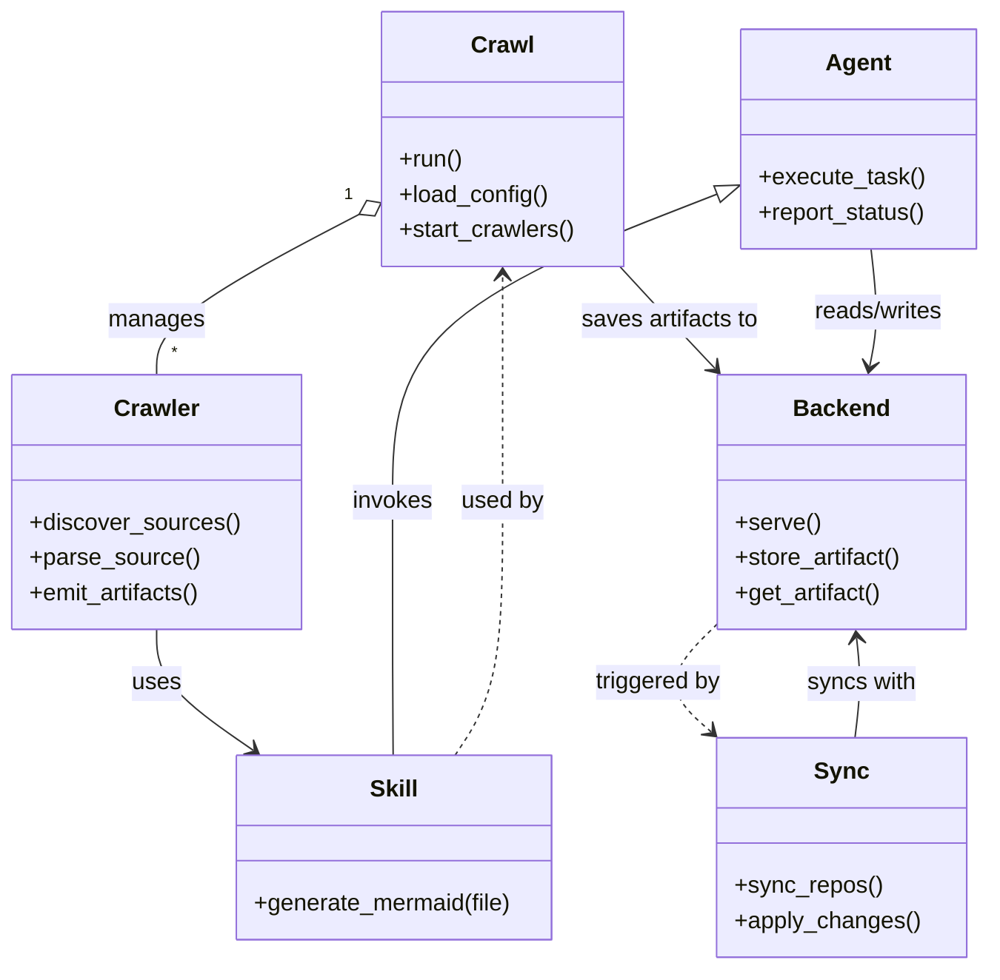

# Diagram: shipment_core/shipment_watchers/config/config.staging.yml

> Auto-generated by Obscura crawlers

## Mermaid

### SVG

<svg id="container" width="670.34765625" xmlns="http://www.w3.org/2000/svg" class="classDiagram" height="662" viewBox="0 0 670.34765625 662" role="graphics-document document" aria-roledescription="class"><g><defs><marker id="container_class-aggregationStart" class="marker aggregation class" refX="18" refY="7" markerWidth="190" markerHeight="240" orient="auto"><path d="M 18,7 L9,13 L1,7 L9,1 Z"></path></marker></defs><defs><marker id="container_class-aggregationEnd" class="marker aggregation class" refX="1" refY="7" markerWidth="20" markerHeight="28" orient="auto"><path d="M 18,7 L9,13 L1,7 L9,1 Z"></path></marker></defs><defs><marker id="container_class-extensionStart" class="marker extension class" refX="18" refY="7" markerWidth="190" markerHeight="240" orient="auto"><path d="M 1,7 L18,13 V 1 Z"></path></marker></defs><defs><marker id="container_class-extensionEnd" class="marker extension class" refX="1" refY="7" markerWidth="20" markerHeight="28" orient="auto"><path d="M 1,1 V 13 L18,7 Z"></path></marker></defs><defs><marker id="container_class-compositionStart" class="marker composition class" refX="18" refY="7" markerWidth="190" markerHeight="240" orient="auto"><path d="M 18,7 L9,13 L1,7 L9,1 Z"></path></marker></defs><defs><marker id="container_class-compositionEnd" class="marker composition class" refX="1" refY="7" markerWidth="20" markerHeight="28" orient="auto"><path d="M 18,7 L9,13 L1,7 L9,1 Z"></path></marker></defs><defs><marker id="container_class-dependencyStart" class="marker dependency class" refX="6" refY="7" markerWidth="190" markerHeight="240" orient="auto"><path d="M 5,7 L9,13 L1,7 L9,1 Z"></path></marker></defs><defs><marker id="container_class-dependencyEnd" class="marker dependency class" refX="13" refY="7" markerWidth="20" markerHeight="28" orient="auto"><path d="M 18,7 L9,13 L14,7 L9,1 Z"></path></marker></defs><defs><marker id="container_class-lollipopStart" class="marker lollipop class" refX="13" refY="7" markerWidth="190" markerHeight="240" orient="auto"><circle stroke="black" fill="transparent" cx="7" cy="7" r="6"></circle></marker></defs><defs><marker id="container_class-lollipopEnd" class="marker lollipop class" refX="1" refY="7" markerWidth="190" markerHeight="240" orient="auto"><circle stroke="black" fill="transparent" cx="7" cy="7" r="6"></circle></marker></defs><g class="root"><g class="clusters"></g><g class="edgePaths"><path d="M242.37,146.39L219.421,158.492C196.471,170.594,150.571,194.797,127.622,213.065C104.672,231.333,104.672,243.667,104.672,249.833L104.672,256" id="id_Crawl_Crawler_1" class="edge-thickness-normal edge-pattern-solid relation" style=";;;" data-edge="true" data-et="edge" data-id="id_Crawl_Crawler_1" data-points="W3sieCI6MjU3LjYyODkwNjI1LCJ5IjoxMzguMzQ0Mzg1MzgyMDU5Nzh9LHsieCI6MTA0LjY3MTg3NSwieSI6MjE5fSx7IngiOjEwNC42NzE4NzUsInkiOjI1Nn1d" marker-start="url(#container_class-aggregationStart)"></path><path d="M420.505,182L426.224,188.167C431.942,194.333,443.379,206.667,454.17,218.269C464.961,229.871,475.105,240.742,480.177,246.178L485.249,251.613" id="id_Crawl_Backend_2" class="edge-thickness-normal edge-pattern-solid relation" style=";;;" data-edge="true" data-et="edge" data-id="id_Crawl_Backend_2" data-points="W3sieCI6NDIwLjUwNTM4Njg0NDc1ODA1LCJ5IjoxODJ9LHsieCI6NDU0LjgxNjQwNjI1LCJ5IjoyMTl9LHsieCI6NDg5LjM0MjQ3NDE2ODM0Njc3LCJ5IjoyNTZ9XQ==" marker-end="url(#container_class-dependencyEnd)"></path><path d="M104.672,430L104.672,436.167C104.672,442.333,104.672,454.667,115.506,468.426C126.34,482.186,148.009,497.371,158.843,504.964L169.677,512.557" id="id_Crawler_Skill_3" class="edge-thickness-normal edge-pattern-solid relation" style=";;;" data-edge="true" data-et="edge" data-id="id_Crawler_Skill_3" data-points="W3sieCI6MTA0LjY3MTg3NSwieSI6NDMwfSx7IngiOjEwNC42NzE4NzUsInkiOjQ2N30seyJ4IjoxNzQuNTkwNjk4MjQyMTg3NSwieSI6NTE2fV0=" marker-end="url(#container_class-dependencyEnd)"></path><path d="M591.97,170L593.092,178.167C594.215,186.333,596.46,202.667,596.403,216.025C596.345,229.383,593.986,239.766,592.806,244.958L591.626,250.149" id="id_Agent_Backend_4" class="edge-thickness-normal edge-pattern-solid relation" style=";;;" data-edge="true" data-et="edge" data-id="id_Agent_Backend_4" data-points="W3sieCI6NTkxLjk2OTU4NDgwMzQyNzQsInkiOjE3MH0seyJ4Ijo1OTguNzA1MDc4MTI1LCJ5IjoyMTl9LHsieCI6NTkwLjI5NjYyMjk4Mzg3MSwieSI6MjU2fV0=" marker-end="url(#container_class-dependencyEnd)"></path><path d="M580.565,504L581.39,497.833C582.216,491.667,583.867,479.333,584.067,467.993C584.266,456.652,583.015,446.304,582.39,441.131L581.764,435.957" id="id_Sync_Backend_5" class="edge-thickness-normal edge-pattern-solid relation" style=";;;" data-edge="true" data-et="edge" data-id="id_Sync_Backend_5" data-points="W3sieCI6NTgwLjU2NDgwMTg5NzMyMTQsInkiOjUwNH0seyJ4Ijo1ODUuNTE3NTc4MTI1LCJ5Ijo0Njd9LHsieCI6NTgxLjA0NDEwMjgyMjU4MDYsInkiOjQzMH1d" marker-end="url(#container_class-dependencyEnd)"></path><path d="M484.903,132.761L448.074,147.134C411.245,161.507,337.587,190.254,300.759,225.294C263.93,260.333,263.93,301.667,263.93,343C263.93,384.333,263.93,425.667,263.97,454.5C264.011,483.333,264.092,499.667,264.133,507.833L264.173,516" id="id_Agent_Skill_6" class="edge-thickness-normal edge-pattern-solid relation" style=";;;" data-edge="true" data-et="edge" data-id="id_Agent_Skill_6" data-points="W3sieCI6NTAwLjk3MjY1NjI1LCJ5IjoxMjYuNDg5NzQwNDY4OTAxNzZ9LHsieCI6MjYzLjkyOTY4NzUsInkiOjIxOX0seyJ4IjoyNjMuOTI5Njg3NSwieSI6MzQzfSx7IngiOjI2My45Mjk2ODc1LCJ5Ijo0Njd9LHsieCI6MjY0LjE3MzIxNzc3MzQzNzUsInkiOjUxNn1d" marker-start="url(#container_class-extensionStart)"></path><path d="M306.866,516L312.36,507.833C317.853,499.667,328.841,483.333,334.334,454.5C339.828,425.667,339.828,384.333,339.828,343C339.828,301.667,339.828,260.333,339.828,234.5C339.828,208.667,339.828,198.333,339.828,193.167L339.828,188" id="id_Skill_Crawl_7" class="edge-thickness-normal edge-pattern-dashed relation" style=";;;" data-edge="true" data-et="edge" data-id="id_Skill_Crawl_7" data-points="W3sieCI6MzA2Ljg2NjA4ODg2NzE4NzUsInkiOjUxNn0seyJ4IjozMzkuODI4MTI1LCJ5Ijo0Njd9LHsieCI6MzM5LjgyODEyNSwieSI6MzQzfSx7IngiOjMzOS44MjgxMjUsInkiOjIxOX0seyJ4IjozMzkuODI4MTI1LCJ5IjoxODJ9XQ==" marker-end="url(#container_class-dependencyEnd)"></path><path d="M485.322,427.751L478.746,434.292C472.169,440.834,459.016,453.917,458.623,466.013C458.229,478.11,470.595,489.22,476.778,494.774L482.961,500.329" id="id_Backend_Sync_8" class="edge-thickness-normal edge-pattern-dashed relation" style=";;;" data-edge="true" data-et="edge" data-id="id_Backend_Sync_8" data-points="W3sieCI6NDg1LjMyMjI2NTYyNSwieSI6NDI3Ljc1MDU5MTQ0MjQ5M30seyJ4Ijo0NDUuODYzMjgxMjUsInkiOjQ2N30seyJ4Ijo0ODcuNDIzODI4MTI1LCJ5Ijo1MDQuMzM5MTgyNDc3NjM0ODR9XQ==" marker-end="url(#container_class-dependencyEnd)"></path></g><g class="edgeLabels"><g class="edgeLabel" transform="translate(104.671875, 219)"><g class="label" data-id="id_Crawl_Crawler_1" transform="translate(-32.296875, -12)"><foreignObject width="64.59375" height="24">

manages

</foreignObject></g></g><g class="edgeLabel" transform="translate(454.86637, 219.05354)"><g class="label" data-id="id_Crawl_Backend_2" transform="translate(-61.4609375, -12)"><foreignObject width="122.921875" height="24">

saves artifacts to

</foreignObject></g></g><g class="edgeLabel" transform="translate(104.671875, 467)"><g class="label" data-id="id_Crawler_Skill_3" transform="translate(-16.4921875, -12)"><foreignObject width="32.984375" height="24">

uses

</foreignObject></g></g><g class="edgeLabel" transform="translate(597.92087, 213.29497)"><g class="label" data-id="id_Agent_Backend_4" transform="translate(-45.9453125, -12)"><foreignObject width="91.890625" height="24">

reads/writes

</foreignObject></g></g><g class="edgeLabel" transform="translate(585.51356, 467.03001)"><g class="label" data-id="id_Sync_Backend_5" transform="translate(-37.4765625, -12)"><foreignObject width="74.953125" height="24">

syncs with

</foreignObject></g></g><g class="edgeLabel" transform="translate(263.9296875, 343)"><g class="label" data-id="id_Agent_Skill_6" transform="translate(-27.5859375, -12)"><foreignObject width="55.171875" height="24">

invokes

</foreignObject></g></g><g class="edgeLabel" transform="translate(339.828125, 343)"><g class="label" data-id="id_Skill_Crawl_7" transform="translate(-28.3125, -12)"><foreignObject width="56.625" height="24">

used by

</foreignObject></g></g><g class="edgeLabel" transform="translate(445.94321, 467.07181)"><g class="label" data-id="id_Backend_Sync_8" transform="translate(-43.5546875, -12)"><foreignObject width="87.109375" height="24">

triggered by

</foreignObject></g></g><g class="edgeTerminals" transform="translate(235.15266589060798, 133.23864381406406)"><g class="inner" transform="translate(0, 0)"><foreignObject style="width: 9px; height: 12px;">
1
</foreignObject></g></g><g class="edgeTerminals" transform="translate(114.67187749999984, 233.50000214285714)"><g class="inner" transform="translate(0, 0)"></g><foreignObject style="width: 9px; height: 12px;">
*
</foreignObject></g></g><g class="nodes"><g class="node default" id="classId-Crawl-0" transform="translate(339.828125, 95)"><g class="basic label-container"><path d="M-82.19921875 -87 L82.19921875 -87 L82.19921875 87 L-82.19921875 87" stroke="none" stroke-width="0" fill="#ECECFF" style=""></path><path d="M-82.19921875 -87 C-32.5172863435036 -87, 17.1646460629928 -87, 82.19921875 -87 M-82.19921875 -87 C-37.02615392782738 -87, 8.14691089434524 -87, 82.19921875 -87 M82.19921875 -87 C82.19921875 -17.56935737261429, 82.19921875 51.86128525477142, 82.19921875 87 M82.19921875 -87 C82.19921875 -51.17382843305256, 82.19921875 -15.347656866105126, 82.19921875 87 M82.19921875 87 C42.83566240161133 87, 3.47210605322266 87, -82.19921875 87 M82.19921875 87 C26.304534647208648 87, -29.590149455582704 87, -82.19921875 87 M-82.19921875 87 C-82.19921875 51.59693961246831, -82.19921875 16.193879224936623, -82.19921875 -87 M-82.19921875 87 C-82.19921875 22.06696107049804, -82.19921875 -42.86607785900392, -82.19921875 -87" stroke="#9370DB" stroke-width="1.3" fill="none" stroke-dasharray="0 0" style=""></path></g><g class="annotation-group text" transform="translate(0, -63)"></g><g class="label-group text" transform="translate(-20.1484375, -63)"><g class="label" style="font-weight: bolder" transform="translate(0,-12)"><foreignObject width="40.296875" height="24">

Crawl

</foreignObject></g></g><g class="members-group text" transform="translate(-70.19921875, -15)"></g><g class="methods-group text" transform="translate(-70.19921875, 15)"><g class="label" style="" transform="translate(0,-12)"><foreignObject width="43.21875" height="24">

+run()

</foreignObject></g><g class="label" style="" transform="translate(0,12)"><foreignObject width="101.984375" height="24">

+load_config()

</foreignObject></g><g class="label" style="" transform="translate(0,36)"><foreignObject width="120.25" height="24">

+start_crawlers()

</foreignObject></g></g><g class="divider" style=""><path d="M-82.19921875 -39 C-31.301507063006305 -39, 19.59620462398739 -39, 82.19921875 -39 M-82.19921875 -39 C-25.287353665158562 -39, 31.624511419682875 -39, 82.19921875 -39" stroke="#9370DB" stroke-width="1.3" fill="none" stroke-dasharray="0 0" style=""></path></g><g class="divider" style=""><path d="M-82.19921875 -15 C-32.711944487089866 -15, 16.775329775820268 -15, 82.19921875 -15 M-82.19921875 -15 C-48.574688785681104 -15, -14.950158821362209 -15, 82.19921875 -15" stroke="#9370DB" stroke-width="1.3" fill="none" stroke-dasharray="0 0" style=""></path></g></g><g class="node default" id="classId-Crawler-1" transform="translate(104.671875, 343)"><g class="basic label-container"><path d="M-96.671875 -87 L96.671875 -87 L96.671875 87 L-96.671875 87" stroke="none" stroke-width="0" fill="#ECECFF" style=""></path><path d="M-96.671875 -87 C-40.094652734604495 -87, 16.48256953079101 -87, 96.671875 -87 M-96.671875 -87 C-51.8388350802964 -87, -7.005795160592797 -87, 96.671875 -87 M96.671875 -87 C96.671875 -30.73977130976906, 96.671875 25.520457380461878, 96.671875 87 M96.671875 -87 C96.671875 -45.478783486100696, 96.671875 -3.9575669722013913, 96.671875 87 M96.671875 87 C19.84812138393937 87, -56.97563223212126 87, -96.671875 87 M96.671875 87 C48.05459967293395 87, -0.562675654132093 87, -96.671875 87 M-96.671875 87 C-96.671875 20.392893684132687, -96.671875 -46.214212631734625, -96.671875 -87 M-96.671875 87 C-96.671875 28.886538789745487, -96.671875 -29.226922420509027, -96.671875 -87" stroke="#9370DB" stroke-width="1.3" fill="none" stroke-dasharray="0 0" style=""></path></g><g class="annotation-group text" transform="translate(0, -63)"></g><g class="label-group text" transform="translate(-27.734375, -63)"><g class="label" style="font-weight: bolder" transform="translate(0,-12)"><foreignObject width="55.46875" height="24">

Crawler

</foreignObject></g></g><g class="members-group text" transform="translate(-84.671875, -15)"></g><g class="methods-group text" transform="translate(-84.671875, 15)"><g class="label" style="" transform="translate(0,-12)"><foreignObject width="141.609375" height="24">

+discover_sources()

</foreignObject></g><g class="label" style="" transform="translate(0,12)"><foreignObject width="114.40625" height="24">

+parse_source()

</foreignObject></g><g class="label" style="" transform="translate(0,36)"><foreignObject width="118.859375" height="24">

+emit_artifacts()

</foreignObject></g></g><g class="divider" style=""><path d="M-96.671875 -39 C-36.70433613835026 -39, 23.263202723299486 -39, 96.671875 -39 M-96.671875 -39 C-42.8851115551396 -39, 10.901651889720796 -39, 96.671875 -39" stroke="#9370DB" stroke-width="1.3" fill="none" stroke-dasharray="0 0" style=""></path></g><g class="divider" style=""><path d="M-96.671875 -15 C-41.60468264500065 -15, 13.462509709998699 -15, 96.671875 -15 M-96.671875 -15 C-35.53326979246745 -15, 25.6053354150651 -15, 96.671875 -15" stroke="#9370DB" stroke-width="1.3" fill="none" stroke-dasharray="0 0" style=""></path></g></g><g class="node default" id="classId-Backend-2" transform="translate(570.525390625, 343)"><g class="basic label-container"><path d="M-85.203125 -87 L85.203125 -87 L85.203125 87 L-85.203125 87" stroke="none" stroke-width="0" fill="#ECECFF" style=""></path><path d="M-85.203125 -87 C-22.21708773839056 -87, 40.76894952321888 -87, 85.203125 -87 M-85.203125 -87 C-40.258590744640756 -87, 4.685943510718488 -87, 85.203125 -87 M85.203125 -87 C85.203125 -30.667286396567775, 85.203125 25.66542720686445, 85.203125 87 M85.203125 -87 C85.203125 -48.03369876969392, 85.203125 -9.06739753938784, 85.203125 87 M85.203125 87 C19.704584280637434 87, -45.79395643872513 87, -85.203125 87 M85.203125 87 C26.506111644370208 87, -32.190901711259585 87, -85.203125 87 M-85.203125 87 C-85.203125 18.542726320749097, -85.203125 -49.91454735850181, -85.203125 -87 M-85.203125 87 C-85.203125 45.61659487524692, -85.203125 4.233189750493835, -85.203125 -87" stroke="#9370DB" stroke-width="1.3" fill="none" stroke-dasharray="0 0" style=""></path></g><g class="annotation-group text" transform="translate(0, -63)"></g><g class="label-group text" transform="translate(-31.296875, -63)"><g class="label" style="font-weight: bolder" transform="translate(0,-12)"><foreignObject width="62.59375" height="24">

Backend

</foreignObject></g></g><g class="members-group text" transform="translate(-73.203125, -15)"></g><g class="methods-group text" transform="translate(-73.203125, 15)"><g class="label" style="" transform="translate(0,-12)"><foreignObject width="57.25" height="24">

+serve()

</foreignObject></g><g class="label" style="" transform="translate(0,12)"><foreignObject width="115.109375" height="24">

+store_artifact()

</foreignObject></g><g class="label" style="" transform="translate(0,36)"><foreignObject width="101.21875" height="24">

+get_artifact()

</foreignObject></g></g><g class="divider" style=""><path d="M-85.203125 -39 C-40.23852421142922 -39, 4.726076577141555 -39, 85.203125 -39 M-85.203125 -39 C-48.61135507982104 -39, -12.019585159642077 -39, 85.203125 -39" stroke="#9370DB" stroke-width="1.3" fill="none" stroke-dasharray="0 0" style=""></path></g><g class="divider" style=""><path d="M-85.203125 -15 C-25.28295694317633 -15, 34.63721111364734 -15, 85.203125 -15 M-85.203125 -15 C-39.19943680359595 -15, 6.804251392808098 -15, 85.203125 -15" stroke="#9370DB" stroke-width="1.3" fill="none" stroke-dasharray="0 0" style=""></path></g></g><g class="node default" id="classId-Agent-3" transform="translate(581.66015625, 95)"><g class="basic label-container"><path d="M-80.6875 -75 L80.6875 -75 L80.6875 75 L-80.6875 75" stroke="none" stroke-width="0" fill="#ECECFF" style=""></path><path d="M-80.6875 -75 C-36.30620163291104 -75, 8.075096734177919 -75, 80.6875 -75 M-80.6875 -75 C-19.76042614060936 -75, 41.16664771878128 -75, 80.6875 -75 M80.6875 -75 C80.6875 -24.004009452556502, 80.6875 26.991981094886995, 80.6875 75 M80.6875 -75 C80.6875 -44.16570625980097, 80.6875 -13.331412519601933, 80.6875 75 M80.6875 75 C46.04472996950879 75, 11.401959939017587 75, -80.6875 75 M80.6875 75 C16.20322738685782 75, -48.28104522628436 75, -80.6875 75 M-80.6875 75 C-80.6875 32.56376464335915, -80.6875 -9.8724707132817, -80.6875 -75 M-80.6875 75 C-80.6875 37.03558664147615, -80.6875 -0.9288267170476985, -80.6875 -75" stroke="#9370DB" stroke-width="1.3" fill="none" stroke-dasharray="0 0" style=""></path></g><g class="annotation-group text" transform="translate(0, -51)"></g><g class="label-group text" transform="translate(-21.078125, -51)"><g class="label" style="font-weight: bolder" transform="translate(0,-12)"><foreignObject width="42.15625" height="24">

Agent

</foreignObject></g></g><g class="members-group text" transform="translate(-68.6875, -3)"></g><g class="methods-group text" transform="translate(-68.6875, 27)"><g class="label" style="" transform="translate(0,-12)"><foreignObject width="111.875" height="24">

+execute_task()

</foreignObject></g><g class="label" style="" transform="translate(0,12)"><foreignObject width="116.296875" height="24">

+report_status()

</foreignObject></g></g><g class="divider" style=""><path d="M-80.6875 -27 C-19.45043068889119 -27, 41.78663862221762 -27, 80.6875 -27 M-80.6875 -27 C-26.73542666853927 -27, 27.216646662921463 -27, 80.6875 -27" stroke="#9370DB" stroke-width="1.3" fill="none" stroke-dasharray="0 0" style=""></path></g><g class="divider" style=""><path d="M-80.6875 -3 C-46.26783413269534 -3, -11.848168265390683 -3, 80.6875 -3 M-80.6875 -3 C-34.321906886455906 -3, 12.043686227088187 -3, 80.6875 -3" stroke="#9370DB" stroke-width="1.3" fill="none" stroke-dasharray="0 0" style=""></path></g></g><g class="node default" id="classId-Sync-4" transform="translate(570.525390625, 579)"><g class="basic label-container"><path d="M-83.1015625 -75 L83.1015625 -75 L83.1015625 75 L-83.1015625 75" stroke="none" stroke-width="0" fill="#ECECFF" style=""></path><path d="M-83.1015625 -75 C-28.103023023337435 -75, 26.89551645332513 -75, 83.1015625 -75 M-83.1015625 -75 C-35.650379296284754 -75, 11.800803907430492 -75, 83.1015625 -75 M83.1015625 -75 C83.1015625 -39.37217710079564, 83.1015625 -3.7443542015912783, 83.1015625 75 M83.1015625 -75 C83.1015625 -19.67782536460075, 83.1015625 35.6443492707985, 83.1015625 75 M83.1015625 75 C42.543985264334935 75, 1.9864080286698709 75, -83.1015625 75 M83.1015625 75 C34.27026274381149 75, -14.561037012377014 75, -83.1015625 75 M-83.1015625 75 C-83.1015625 24.870720335257538, -83.1015625 -25.258559329484925, -83.1015625 -75 M-83.1015625 75 C-83.1015625 26.00838981776625, -83.1015625 -22.9832203644675, -83.1015625 -75" stroke="#9370DB" stroke-width="1.3" fill="none" stroke-dasharray="0 0" style=""></path></g><g class="annotation-group text" transform="translate(0, -51)"></g><g class="label-group text" transform="translate(-17.09375, -51)"><g class="label" style="font-weight: bolder" transform="translate(0,-12)"><foreignObject width="34.1875" height="24">

Sync

</foreignObject></g></g><g class="members-group text" transform="translate(-71.1015625, -3)"></g><g class="methods-group text" transform="translate(-71.1015625, 27)"><g class="label" style="" transform="translate(0,-12)"><foreignObject width="99.515625" height="24">

+sync_repos()

</foreignObject></g><g class="label" style="" transform="translate(0,12)"><foreignObject width="125.109375" height="24">

+apply_changes()

</foreignObject></g></g><g class="divider" style=""><path d="M-83.1015625 -27 C-22.517181638632017 -27, 38.067199222735965 -27, 83.1015625 -27 M-83.1015625 -27 C-18.841649486537676 -27, 45.41826352692465 -27, 83.1015625 -27" stroke="#9370DB" stroke-width="1.3" fill="none" stroke-dasharray="0 0" style=""></path></g><g class="divider" style=""><path d="M-83.1015625 -3 C-32.84249949871653 -3, 17.416563502566945 -3, 83.1015625 -3 M-83.1015625 -3 C-33.71855855139294 -3, 15.664445397214124 -3, 83.1015625 -3" stroke="#9370DB" stroke-width="1.3" fill="none" stroke-dasharray="0 0" style=""></path></g></g><g class="node default" id="classId-Skill-5" transform="translate(264.486328125, 579)"><g class="basic label-container"><path d="M-108.73046875 -63 L108.73046875 -63 L108.73046875 63 L-108.73046875 63" stroke="none" stroke-width="0" fill="#ECECFF" style=""></path><path d="M-108.73046875 -63 C-49.03166426094845 -63, 10.667140228103094 -63, 108.73046875 -63 M-108.73046875 -63 C-42.99228072287325 -63, 22.745907304253507 -63, 108.73046875 -63 M108.73046875 -63 C108.73046875 -17.578696369243403, 108.73046875 27.842607261513194, 108.73046875 63 M108.73046875 -63 C108.73046875 -21.381996013000638, 108.73046875 20.236007973998724, 108.73046875 63 M108.73046875 63 C32.3448664841502 63, -44.040735781699595 63, -108.73046875 63 M108.73046875 63 C45.577239533613294 63, -17.57598968277341 63, -108.73046875 63 M-108.73046875 63 C-108.73046875 18.579332301595585, -108.73046875 -25.84133539680883, -108.73046875 -63 M-108.73046875 63 C-108.73046875 36.74837814951791, -108.73046875 10.496756299035823, -108.73046875 -63" stroke="#9370DB" stroke-width="1.3" fill="none" stroke-dasharray="0 0" style=""></path></g><g class="annotation-group text" transform="translate(0, -39)"></g><g class="label-group text" transform="translate(-16.0078125, -39)"><g class="label" style="font-weight: bolder" transform="translate(0,-12)"><foreignObject width="32.015625" height="24">

Skill

</foreignObject></g></g><g class="members-group text" transform="translate(-96.73046875, 9)"></g><g class="methods-group text" transform="translate(-96.73046875, 39)"><g class="label" style="" transform="translate(0,-12)"><foreignObject width="177.453125" height="24">

+generate_mermaid(file)

</foreignObject></g></g><g class="divider" style=""><path d="M-108.73046875 -15 C-61.844980482119134 -15, -14.959492214238267 -15, 108.73046875 -15 M-108.73046875 -15 C-33.80178891272712 -15, 41.12689092454576 -15, 108.73046875 -15" stroke="#9370DB" stroke-width="1.3" fill="none" stroke-dasharray="0 0" style=""></path></g><g class="divider" style=""><path d="M-108.73046875 9 C-38.49205044231029 9, 31.746367865379426 9, 108.73046875 9 M-108.73046875 9 C-37.76158724176251 9, 33.207294266474975 9, 108.73046875 9" stroke="#9370DB" stroke-width="1.3" fill="none" stroke-dasharray="0 0" style=""></path></g></g></g></g></g></svg>
