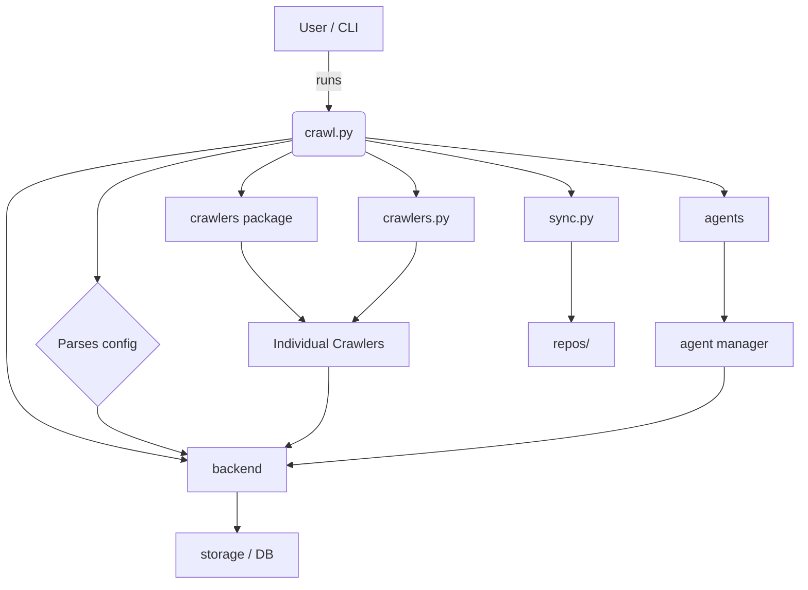

# Diagram: shipment_core/shipment_watchers/config/config.staging1.yml

> Auto-generated by Obscura crawlers

## Mermaid

### SVG

<svg id="container" width="975.55078125" xmlns="http://www.w3.org/2000/svg" class="flowchart" height="708.53125" viewBox="-35 0 975.55078125 708.53125" role="graphics-document document" aria-roledescription="flowchart-v2"><g><marker id="container_flowchart-v2-pointEnd" class="marker flowchart-v2" viewBox="0 0 10 10" refX="5" refY="5" markerUnits="userSpaceOnUse" markerWidth="8" markerHeight="8" orient="auto"><path d="M 0 0 L 10 5 L 0 10 z" class="arrowMarkerPath" style="stroke-width: 1; stroke-dasharray: 1, 0;"></path></marker><marker id="container_flowchart-v2-pointStart" class="marker flowchart-v2" viewBox="0 0 10 10" refX="4.5" refY="5" markerUnits="userSpaceOnUse" markerWidth="8" markerHeight="8" orient="auto"><path d="M 0 5 L 10 10 L 10 0 z" class="arrowMarkerPath" style="stroke-width: 1; stroke-dasharray: 1, 0;"></path></marker><marker id="container_flowchart-v2-circleEnd" class="marker flowchart-v2" viewBox="0 0 10 10" refX="11" refY="5" markerUnits="userSpaceOnUse" markerWidth="11" markerHeight="11" orient="auto"><circle cx="5" cy="5" r="5" class="arrowMarkerPath" style="stroke-width: 1; stroke-dasharray: 1, 0;"></circle></marker><marker id="container_flowchart-v2-circleStart" class="marker flowchart-v2" viewBox="0 0 10 10" refX="-1" refY="5" markerUnits="userSpaceOnUse" markerWidth="11" markerHeight="11" orient="auto"><circle cx="5" cy="5" r="5" class="arrowMarkerPath" style="stroke-width: 1; stroke-dasharray: 1, 0;"></circle></marker><marker id="container_flowchart-v2-crossEnd" class="marker cross flowchart-v2" viewBox="0 0 11 11" refX="12" refY="5.2" markerUnits="userSpaceOnUse" markerWidth="11" markerHeight="11" orient="auto"><path d="M 1,1 l 9,9 M 10,1 l -9,9" class="arrowMarkerPath" style="stroke-width: 2; stroke-dasharray: 1, 0;"></path></marker><marker id="container_flowchart-v2-crossStart" class="marker cross flowchart-v2" viewBox="0 0 11 11" refX="-1" refY="5.2" markerUnits="userSpaceOnUse" markerWidth="11" markerHeight="11" orient="auto"><path d="M 1,1 l 9,9 M 10,1 l -9,9" class="arrowMarkerPath" style="stroke-width: 2; stroke-dasharray: 1, 0;"></path></marker><g class="root"><g class="clusters"></g><g class="edgePaths"><path d="M363.391,62L363.391,68.167C363.391,74.333,363.391,86.667,363.465,98.417C363.54,110.167,363.688,121.334,363.763,126.917L363.837,132.5" id="L_A_B_0" class="edge-thickness-normal edge-pattern-solid edge-thickness-normal edge-pattern-solid flowchart-link" style=";" data-edge="true" data-et="edge" data-id="L_A_B_0" data-points="W3sieCI6MzYzLjM5MDYyNSwieSI6NjJ9LHsieCI6MzYzLjM5MDYyNSwieSI6OTl9LHsieCI6MzYzLjg5MDYyNSwieSI6MTM2LjV9XQ==" marker-end="url(#container_flowchart-v2-pointEnd)"></path><path d="M319.258,171.756L279.759,178.963C240.26,186.171,161.263,200.585,121.764,216.459C82.266,232.333,82.266,249.667,82.266,267C82.266,284.333,82.266,301.667,82.266,313.833C82.266,326,82.266,333,82.266,336.5L82.266,340" id="L_B_C_0" class="edge-thickness-normal edge-pattern-solid edge-thickness-normal edge-pattern-solid flowchart-link" style=";" data-edge="true" data-et="edge" data-id="L_B_C_0" data-points="W3sieCI6MzE5LjI1NzgxMjUsInkiOjE3MS43NTU3ODAzNDY4MjA4fSx7IngiOjgyLjI2NTYyNSwieSI6MjE1fSx7IngiOjgyLjI2NTYyNSwieSI6MjY3fSx7IngiOjgyLjI2NTYyNSwieSI6MzE5fSx7IngiOjgyLjI2NTYyNSwieSI6MzQ0fV0=" marker-end="url(#container_flowchart-v2-pointEnd)"></path><path d="M319.258,185.366L308.923,190.305C298.589,195.244,277.919,205.122,267.585,213.561C257.25,222,257.25,229,257.25,232.5L257.25,236" id="L_B_D_0" class="edge-thickness-normal edge-pattern-solid edge-thickness-normal edge-pattern-solid flowchart-link" style=";" data-edge="true" data-et="edge" data-id="L_B_D_0" data-points="W3sieCI6MzE5LjI1NzgxMjUsInkiOjE4NS4zNjYzMzI5ODk4NDI0OH0seyJ4IjoyNTcuMjUsInkiOjIxNX0seyJ4IjoyNTcuMjUsInkiOjI0MH1d" marker-end="url(#container_flowchart-v2-pointEnd)"></path><path d="M408.523,185.366L418.691,190.305C428.859,195.244,449.195,205.122,459.363,213.561C469.531,222,469.531,229,469.531,232.5L469.531,236" id="L_B_E_0" class="edge-thickness-normal edge-pattern-solid edge-thickness-normal edge-pattern-solid flowchart-link" style=";" data-edge="true" data-et="edge" data-id="L_B_E_0" data-points="W3sieCI6NDA4LjUyMzQzNzUsInkiOjE4NS4zNjYzMzI5ODk4NDI0OH0seyJ4Ijo0NjkuNTMxMjUsInkiOjIxNX0seyJ4Ijo0NjkuNTMxMjUsInkiOjI0MH1d" marker-end="url(#container_flowchart-v2-pointEnd)"></path><path d="M257.25,294L257.25,298.167C257.25,302.333,257.25,310.667,269.642,326.422C282.033,342.178,306.816,365.356,319.208,376.944L331.599,388.533" id="L_D_F_0" class="edge-thickness-normal edge-pattern-solid edge-thickness-normal edge-pattern-solid flowchart-link" style=";" data-edge="true" data-et="edge" data-id="L_D_F_0" data-points="W3sieCI6MjU3LjI1LCJ5IjoyOTR9LHsieCI6MjU3LjI1LCJ5IjozMTl9LHsieCI6MzM0LjUyMDY0MjMxNDY1NDUsInkiOjM5MS4yNjU2MjV9XQ==" marker-end="url(#container_flowchart-v2-pointEnd)"></path><path d="M469.531,294L469.531,298.167C469.531,302.333,469.531,310.667,457.14,326.422C444.748,342.178,419.965,365.356,407.574,376.944L395.182,388.533" id="L_E_F_0" class="edge-thickness-normal edge-pattern-solid edge-thickness-normal edge-pattern-solid flowchart-link" style=";" data-edge="true" data-et="edge" data-id="L_E_F_0" data-points="W3sieCI6NDY5LjUzMTI1LCJ5IjoyOTR9LHsieCI6NDY5LjUzMTI1LCJ5IjozMTl9LHsieCI6MzkyLjI2MDYwNzY4NTM0NTUsInkiOjM5MS4yNjU2MjV9XQ==" marker-end="url(#container_flowchart-v2-pointEnd)"></path><path d="M408.523,168.284L481.859,176.07C555.194,183.856,701.865,199.428,775.2,210.714C848.535,222,848.535,229,848.535,232.5L848.535,236" id="L_B_G_0" class="edge-thickness-normal edge-pattern-solid edge-thickness-normal edge-pattern-solid flowchart-link" style=";" data-edge="true" data-et="edge" data-id="L_B_G_0" data-points="W3sieCI6NDA4LjUyMzQzNzUsInkiOjE2OC4yODM5NDgwODI0ODE4Nn0seyJ4Ijo4NDguNTM1MTU2MjUsInkiOjIxNX0seyJ4Ijo4NDguNTM1MTU2MjUsInkiOjI0MH1d" marker-end="url(#container_flowchart-v2-pointEnd)"></path><path d="M848.535,294L848.535,298.167C848.535,302.333,848.535,310.667,848.535,326.211C848.535,341.755,848.535,364.51,848.535,375.888L848.535,387.266" id="L_G_H_0" class="edge-thickness-normal edge-pattern-solid edge-thickness-normal edge-pattern-solid flowchart-link" style=";" data-edge="true" data-et="edge" data-id="L_G_H_0" data-points="W3sieCI6ODQ4LjUzNTE1NjI1LCJ5IjoyOTR9LHsieCI6ODQ4LjUzNTE1NjI1LCJ5IjozMTl9LHsieCI6ODQ4LjUzNTE1NjI1LCJ5IjozOTEuMjY1NjI1fV0=" marker-end="url(#container_flowchart-v2-pointEnd)"></path><path d="M408.523,171.325L450.434,178.604C492.345,185.883,576.167,200.442,618.077,211.221C659.988,222,659.988,229,659.988,232.5L659.988,236" id="L_B_I_0" class="edge-thickness-normal edge-pattern-solid edge-thickness-normal edge-pattern-solid flowchart-link" style=";" data-edge="true" data-et="edge" data-id="L_B_I_0" data-points="W3sieCI6NDA4LjUyMzQzNzUsInkiOjE3MS4zMjUwOTk3NjQyNTM0NX0seyJ4Ijo2NTkuOTg4MjgxMjUsInkiOjIxNX0seyJ4Ijo2NTkuOTg4MjgxMjUsInkiOjI0MH1d" marker-end="url(#container_flowchart-v2-pointEnd)"></path><path d="M659.988,294L659.988,298.167C659.988,302.333,659.988,310.667,659.988,326.211C659.988,341.755,659.988,364.51,659.988,375.888L659.988,387.266" id="L_I_J_0" class="edge-thickness-normal edge-pattern-solid edge-thickness-normal edge-pattern-solid flowchart-link" style=";" data-edge="true" data-et="edge" data-id="L_I_J_0" data-points="W3sieCI6NjU5Ljk4ODI4MTI1LCJ5IjoyOTR9LHsieCI6NjU5Ljk4ODI4MTI1LCJ5IjozMTl9LHsieCI6NjU5Ljk4ODI4MTI1LCJ5IjozOTEuMjY1NjI1fV0=" marker-end="url(#container_flowchart-v2-pointEnd)"></path><path d="M319.258,169.445L261.548,177.038C203.839,184.63,88.419,199.815,30.71,216.074C-27,232.333,-27,249.667,-27,267C-27,284.333,-27,301.667,-27,326.878C-27,352.089,-27,385.177,-27,418.266C-27,451.354,-27,484.443,8.682,507.644C44.364,530.845,115.728,544.158,151.409,550.815L187.091,557.472" id="L_B_K_0" class="edge-thickness-normal edge-pattern-solid edge-thickness-normal edge-pattern-solid flowchart-link" style=";" data-edge="true" data-et="edge" data-id="L_B_K_0" data-points="W3sieCI6MzE5LjI1NzgxMjUsInkiOjE2OS40NDUwODcwNTIyMzEzNH0seyJ4IjotMjcsInkiOjIxNX0seyJ4IjotMjcsInkiOjI2N30seyJ4IjotMjcsInkiOjMxOX0seyJ4IjotMjcsInkiOjQxOC4yNjU2MjV9LHsieCI6LTI3LCJ5Ijo1MTcuNTMxMjV9LHsieCI6MTkxLjAyMzQzNzUsInkiOjU1OC4yMDUxNjY2OTkzNjY2fV0=" marker-end="url(#container_flowchart-v2-pointEnd)"></path><path d="M251.734,596.531L251.734,600.698C251.734,604.865,251.734,613.198,251.734,620.865C251.734,628.531,251.734,635.531,251.734,639.031L251.734,642.531" id="L_K_L_0" class="edge-thickness-normal edge-pattern-solid edge-thickness-normal edge-pattern-solid flowchart-link" style=";" data-edge="true" data-et="edge" data-id="L_K_L_0" data-points="W3sieCI6MjUxLjczNDM3NSwieSI6NTk2LjUzMTI1fSx7IngiOjI1MS43MzQzNzUsInkiOjYyMS41MzEyNX0seyJ4IjoyNTEuNzM0Mzc1LCJ5Ijo2NDYuNTMxMjV9XQ==" marker-end="url(#container_flowchart-v2-pointEnd)"></path><path d="M82.266,492.531L82.266,496.698C82.266,500.865,82.266,509.198,99.755,518.731C117.244,528.264,152.221,538.997,169.71,544.363L187.199,549.729" id="L_C_K_0" class="edge-thickness-normal edge-pattern-solid edge-thickness-normal edge-pattern-solid flowchart-link" style=";" data-edge="true" data-et="edge" data-id="L_C_K_0" data-points="W3sieCI6ODIuMjY1NjI1LCJ5Ijo0OTIuNTMxMjV9LHsieCI6ODIuMjY1NjI1LCJ5Ijo1MTcuNTMxMjV9LHsieCI6MTkxLjAyMzQzNzUsInkiOjU1MC45MDI2MzExNTQzNDI3fV0=" marker-end="url(#container_flowchart-v2-pointEnd)"></path><path d="M363.391,445.266L363.391,457.31C363.391,469.354,363.391,493.443,355.048,509.372C346.706,525.302,330.021,533.072,321.678,536.957L313.336,540.843" id="L_F_K_0" class="edge-thickness-normal edge-pattern-solid edge-thickness-normal edge-pattern-solid flowchart-link" style=";" data-edge="true" data-et="edge" data-id="L_F_K_0" data-points="W3sieCI6MzYzLjM5MDYyNSwieSI6NDQ1LjI2NTYyNX0seyJ4IjozNjMuMzkwNjI1LCJ5Ijo1MTcuNTMxMjV9LHsieCI6MzA5LjcwOTczNTU3NjkyMzEsInkiOjU0Mi41MzEyNX1d" marker-end="url(#container_flowchart-v2-pointEnd)"></path><path d="M848.535,445.266L848.535,457.31C848.535,469.354,848.535,493.443,759.851,513.214C671.167,532.986,493.799,548.44,405.114,556.167L316.43,563.894" id="L_H_K_0" class="edge-thickness-normal edge-pattern-solid edge-thickness-normal edge-pattern-solid flowchart-link" style=";" data-edge="true" data-et="edge" data-id="L_H_K_0" data-points="W3sieCI6ODQ4LjUzNTE1NjI1LCJ5Ijo0NDUuMjY1NjI1fSx7IngiOjg0OC41MzUxNTYyNSwieSI6NTE3LjUzMTI1fSx7IngiOjMxMi40NDUzMTI1LCJ5Ijo1NjQuMjQxNDI5OTMwNzUwNX1d" marker-end="url(#container_flowchart-v2-pointEnd)"></path></g><g class="edgeLabels"><g class="edgeLabel" transform="translate(363.390625, 99)"><g class="label" data-id="L_A_B_0" transform="translate(-16.171875, -12)"><foreignObject width="32.34375" height="24">

runs

</foreignObject></g></g><g class="edgeLabel"><g class="label" data-id="L_B_C_0" transform="translate(0, 0)"><foreignObject width="0" height="0">

</foreignObject></g></g><g class="edgeLabel"><g class="label" data-id="L_B_D_0" transform="translate(0, 0)"><foreignObject width="0" height="0">

</foreignObject></g></g><g class="edgeLabel"><g class="label" data-id="L_B_E_0" transform="translate(0, 0)"><foreignObject width="0" height="0">

</foreignObject></g></g><g class="edgeLabel"><g class="label" data-id="L_D_F_0" transform="translate(0, 0)"><foreignObject width="0" height="0">

</foreignObject></g></g><g class="edgeLabel"><g class="label" data-id="L_E_F_0" transform="translate(0, 0)"><foreignObject width="0" height="0">

</foreignObject></g></g><g class="edgeLabel"><g class="label" data-id="L_B_G_0" transform="translate(0, 0)"><foreignObject width="0" height="0">

</foreignObject></g></g><g class="edgeLabel"><g class="label" data-id="L_G_H_0" transform="translate(0, 0)"><foreignObject width="0" height="0">

</foreignObject></g></g><g class="edgeLabel"><g class="label" data-id="L_B_I_0" transform="translate(0, 0)"><foreignObject width="0" height="0">

</foreignObject></g></g><g class="edgeLabel"><g class="label" data-id="L_I_J_0" transform="translate(0, 0)"><foreignObject width="0" height="0">

</foreignObject></g></g><g class="edgeLabel"><g class="label" data-id="L_B_K_0" transform="translate(0, 0)"><foreignObject width="0" height="0">

</foreignObject></g></g><g class="edgeLabel"><g class="label" data-id="L_K_L_0" transform="translate(0, 0)"><foreignObject width="0" height="0">

</foreignObject></g></g><g class="edgeLabel"><g class="label" data-id="L_C_K_0" transform="translate(0, 0)"><foreignObject width="0" height="0">

</foreignObject></g></g><g class="edgeLabel"><g class="label" data-id="L_F_K_0" transform="translate(0, 0)"><foreignObject width="0" height="0">

</foreignObject></g></g><g class="edgeLabel"><g class="label" data-id="L_H_K_0" transform="translate(0, 0)"><foreignObject width="0" height="0">

</foreignObject></g></g></g><g class="nodes"><g class="node default" id="flowchart-A-0" transform="translate(363.390625, 35)"><rect class="basic label-container" style="" x="-65.671875" y="-27" width="131.34375" height="54"></rect><g class="label" style="" transform="translate(-35.671875, -12)"><rect></rect><foreignObject width="71.34375" height="24">

User / CLI

</foreignObject></g></g><g class="node default" id="flowchart-B-1" transform="translate(363.390625, 163)"><g class="basic label-container outer-path"><path d="M-39.6328125 -27 C-18.385634474705643 -27, 2.8615435505887135 -27, 39.6328125 -27 C39.6328125 -27, 39.6328125 -27, 39.6328125 -27 C39.71730636173667 -26.996505308028244, 39.80180022347334 -26.993010616056488, 40.04570922736166 -26.982922465033347 C40.161080730199814 -26.968541422202076, 40.276452233037965 -26.95416037937081, 40.45578545140367 -26.931806517013612 C40.56265778649481 -26.90939774483228, 40.66953012158594 -26.886988972650943, 40.860239935703994 -26.847001329696653 C40.97058854209073 -26.814149126192657, 41.08093714847747 -26.781296922688657, 41.25630984602342 -26.729086208503173 C41.4013288340031 -26.672499623798945, 41.54634782198279 -26.615913039094718, 41.641289623264846 -26.578866633275286 C41.773847944111246 -26.514062818997825, 41.906406264957646 -26.449259004720364, 42.012549465185366 -26.397368756032446 C42.13412846547166 -26.32492339656086, 42.25570746575796 -26.252478037089272, 42.367553290612136 -26.185832391312644 C42.5002719743084 -26.091073072498165, 42.632990658004665 -25.996313753683687, 42.70387606344834 -25.94570254698197 C42.815735699698934 -25.85096226780577, 42.927595335949526 -25.75622198862957, 43.019220358128706 -25.678619553365657 C43.119050830190226 -25.578789081304137, 43.218881302251745 -25.478958609242618, 43.31143205336566 -25.386407858128706 C43.40169772232798 -25.279831384174443, 43.49196339129031 -25.173254910220177, 43.57851504698197 -25.07106356344834 C43.63716389471815 -24.988920741304515, 43.69581274245432 -24.906777919160685, 43.818644891312644 -24.734740790612136 C43.8912749835122 -24.612851768806866, 43.96390507571175 -24.490962747001593, 44.03018125603245 -24.37973696518537 C44.08649240855135 -24.264550661631205, 44.14280356107025 -24.149364358077044, 44.21167913327529 -24.008477123264846 C44.261012681635705 -23.88204607438517, 44.310346229996114 -23.75561502550549, 44.361898708503176 -23.623497346023417 C44.40229639960097 -23.4878038935784, 44.442694090698765 -23.35211044113338, 44.47981382969665 -23.227427435703994 C44.50684385548202 -23.09851533155659, 44.53387388126738 -22.96960322740919, 44.56461901701361 -22.82297295140367 C44.58371212856606 -22.6697990126631, 44.60280524011851 -22.516625073922526, 44.61573496503335 -22.412896727361662 C44.62045899161906 -22.298680295012396, 44.62518301820477 -22.184463862663126, 44.6328125 -22 C44.6328125 -22, 44.6328125 -22, 44.6328125 -22 C44.6328125 -6.594061753121062, 44.6328125 8.811876493757875, 44.6328125 22 C44.6328125 22, 44.6328125 22, 44.6328125 22 C44.628831092572895 22.09626155649247, 44.62484968514579 22.192523112984937, 44.61573496503335 22.412896727361662 C44.60084899649505 22.532318982174097, 44.58596302795676 22.651741236986535, 44.56461901701361 22.82297295140367 C44.54241121308334 22.928886824955896, 44.52020340915307 23.03480069850812, 44.47981382969665 23.227427435703994 C44.44265923782204 23.352227509882656, 44.40550464594743 23.47702758406132, 44.361898708503176 23.623497346023417 C44.31627348446518 23.740424774157145, 44.27064826042719 23.857352202290873, 44.21167913327529 24.008477123264846 C44.16614771109253 24.101613135976283, 44.12061628890977 24.19474914868772, 44.03018125603245 24.379736965185366 C43.969568376899545 24.48145850129484, 43.908955497766634 24.58318003740431, 43.818644891312644 24.734740790612133 C43.72569995318401 24.86491827604566, 43.63275501505538 24.99509576147919, 43.57851504698197 25.07106356344834 C43.519259038767736 25.141027000142238, 43.4600030305535 25.210990436836134, 43.31143205336566 25.386407858128706 C43.20153923557853 25.49630067591583, 43.09164641779141 25.606193493702957, 43.019220358128706 25.678619553365657 C42.935761668228366 25.749305458003544, 42.85230297832803 25.819991362641435, 42.70387606344834 25.94570254698197 C42.60494217839693 26.016339983204563, 42.50600829334552 26.086977419427157, 42.367553290612136 26.185832391312644 C42.24611610114263 26.25819324987885, 42.12467891167313 26.330554108445057, 42.012549465185366 26.397368756032446 C41.87857220979733 26.46286624513862, 41.74459495440931 26.528363734244795, 41.641289623264846 26.578866633275286 C41.53477929951582 26.620427090568942, 41.428268975766784 26.6619875478626, 41.25630984602342 26.729086208503173 C41.1508841119473 26.76047280942035, 41.04545837787117 26.791859410337526, 40.860239935703994 26.847001329696653 C40.745050827153165 26.871153945891344, 40.62986171860233 26.89530656208603, 40.45578545140367 26.931806517013612 C40.35323745964224 26.94458911085614, 40.25068946788081 26.957371704698662, 40.04570922736166 26.982922465033347 C39.91428502460418 26.988358210267748, 39.782860821846704 26.993793955502145, 39.6328125 27 C39.6328125 27, 39.6328125 27, 39.6328125 27 C10.425567171210755 27, -18.78167815757849 27, -39.6328125 27 C-39.6328125 27, -39.6328125 27, -39.6328125 27 C-39.746938677126174 26.995279706397927, -39.86106485425235 26.99055941279585, -40.04570922736166 26.982922465033347 C-40.149536850899985 26.969980365256177, -40.253364474438314 26.957038265479003, -40.45578545140367 26.931806517013612 C-40.5976648778556 26.902057529664656, -40.73954430430753 26.872308542315704, -40.860239935703994 26.847001329696653 C-40.98102159065353 26.811043073059995, -41.10180324560307 26.775084816423337, -41.25630984602342 26.729086208503173 C-41.404435690188166 26.671287324753635, -41.55256153435291 26.613488441004097, -41.641289623264846 26.578866633275286 C-41.715857821929006 26.54241246226299, -41.79042602059317 26.505958291250696, -42.012549465185366 26.397368756032446 C-42.154473775467906 26.31280022321046, -42.296398085750454 26.228231690388473, -42.367553290612136 26.185832391312644 C-42.47316490044416 26.110427151237428, -42.578776510276185 26.035021911162215, -42.70387606344834 25.94570254698197 C-42.79349658706568 25.86979783539858, -42.883117110683024 25.793893123815188, -43.019220358128706 25.67861955336566 C-43.098392255203024 25.599447656291343, -43.17756415227734 25.520275759217025, -43.31143205336566 25.386407858128706 C-43.40982523514647 25.270235247922756, -43.50821841692728 25.1540626377168, -43.57851504698197 25.07106356344834 C-43.67157691051113 24.94072231380204, -43.764638774040286 24.81038106415574, -43.818644891312644 24.734740790612133 C-43.88154565700222 24.629179685448722, -43.9444464226918 24.52361858028531, -44.03018125603244 24.37973696518537 C-44.07577708393567 24.286469208466986, -44.121372911838904 24.193201451748603, -44.21167913327528 24.00847712326485 C-44.25477043920095 23.898043570705937, -44.297861745126625 23.787610018147024, -44.361898708503176 23.623497346023417 C-44.396539172422116 23.507142078786007, -44.431179636341064 23.390786811548598, -44.47981382969665 23.227427435703994 C-44.5063821082353 23.100717505155362, -44.53295038677395 22.97400757460673, -44.56461901701361 22.82297295140367 C-44.58461364661833 22.66256660999619, -44.60460827622305 22.50216026858871, -44.61573496503335 22.412896727361662 C-44.622081635720804 22.259448377725192, -44.62842830640825 22.10600002808872, -44.6328125 22 C-44.6328125 22, -44.6328125 22, -44.6328125 22 C-44.6328125 8.805013132281102, -44.6328125 -4.3899737354377955, -44.6328125 -22 C-44.6328125 -22, -44.6328125 -22, -44.6328125 -22 C-44.628666316507164 -22.100245474453754, -44.62452013301433 -22.200490948907504, -44.61573496503335 -22.41289672736166 C-44.60266533446313 -22.51774746302222, -44.589595703892925 -22.622598198682784, -44.56461901701361 -22.82297295140367 C-44.5316630731437 -22.98014705483107, -44.49870712927379 -23.13732115825847, -44.47981382969665 -23.227427435703994 C-44.43788654756472 -23.368258693865393, -44.39595926543279 -23.509089952026788, -44.361898708503176 -23.623497346023417 C-44.32159878418677 -23.72677720061388, -44.28129885987036 -23.830057055204346, -44.21167913327529 -24.008477123264846 C-44.17509239282643 -24.08331649704583, -44.13850565237757 -24.158155870826807, -44.03018125603245 -24.379736965185366 C-43.95129038922145 -24.51213292247732, -43.87239952241045 -24.644528879769275, -43.818644891312644 -24.734740790612133 C-43.76344401598991 -24.812054426921165, -43.708243140667186 -24.889368063230197, -43.57851504698197 -25.07106356344834 C-43.48955656934964 -25.176096639515727, -43.4005980917173 -25.281129715583113, -43.31143205336566 -25.386407858128706 C-43.24212122215716 -25.4557186893372, -43.17281039094867 -25.525029520545697, -43.019220358128706 -25.678619553365657 C-42.91005456631885 -25.771078262684068, -42.800888774509 -25.86353697200248, -42.70387606344834 -25.945702546981966 C-42.608093426209756 -26.014090035511874, -42.51231078897117 -26.082477524041785, -42.367553290612136 -26.185832391312644 C-42.28895883015523 -26.232664524550028, -42.210364369698326 -26.279496657787412, -42.012549465185366 -26.397368756032446 C-41.87617717108795 -26.464037108217745, -41.73980487699055 -26.53070546040305, -41.641289623264846 -26.578866633275286 C-41.50986021921015 -26.630150545877193, -41.37843081515545 -26.6814344584791, -41.25630984602342 -26.729086208503173 C-41.121252401226556 -26.769294551920275, -40.98619495642969 -26.809502895337378, -40.860239935703994 -26.847001329696653 C-40.72164051055163 -26.876062573095655, -40.583041085399266 -26.905123816494655, -40.45578545140367 -26.931806517013612 C-40.33812848985231 -26.94647244197639, -40.22047152830095 -26.961138366939167, -40.04570922736166 -26.982922465033347 C-39.95587585217028 -26.98663800091518, -39.866042476978905 -26.99035353679701, -39.6328125 -27 C-39.6328125 -27, -39.6328125 -27, -39.6328125 -27" stroke="none" stroke-width="0" fill="#ECECFF" style=""></path><path d="M-39.6328125 -27 C-17.37888603304982 -27, 4.8750404339003595 -27, 39.6328125 -27 M-39.6328125 -27 C-8.968977808271568 -27, 21.694856883456865 -27, 39.6328125 -27 M39.6328125 -27 C39.6328125 -27, 39.6328125 -27, 39.6328125 -27 M39.6328125 -27 C39.6328125 -27, 39.6328125 -27, 39.6328125 -27 M39.6328125 -27 C39.77712330953516 -26.994031260766704, 39.92143411907033 -26.98806252153341, 40.04570922736166 -26.982922465033347 M39.6328125 -27 C39.76347728778084 -26.994595664401373, 39.89414207556167 -26.989191328802743, 40.04570922736166 -26.982922465033347 M40.04570922736166 -26.982922465033347 C40.14297413877611 -26.97079840646931, 40.24023905019056 -26.95867434790527, 40.45578545140367 -26.931806517013612 M40.04570922736166 -26.982922465033347 C40.18244867308619 -26.965877910898975, 40.31918811881072 -26.948833356764606, 40.45578545140367 -26.931806517013612 M40.45578545140367 -26.931806517013612 C40.54858387278584 -26.912348734213534, 40.641382294168004 -26.89289095141346, 40.860239935703994 -26.847001329696653 M40.45578545140367 -26.931806517013612 C40.5385864142122 -26.91444498083693, 40.62138737702072 -26.897083444660247, 40.860239935703994 -26.847001329696653 M40.860239935703994 -26.847001329696653 C41.00809119905463 -26.802984101469093, 41.15594246240527 -26.75896687324153, 41.25630984602342 -26.729086208503173 M40.860239935703994 -26.847001329696653 C40.9847513388488 -26.80993267891238, 41.109262741993604 -26.7728640281281, 41.25630984602342 -26.729086208503173 M41.25630984602342 -26.729086208503173 C41.38490633883753 -26.67890770129754, 41.51350283165165 -26.628729194091907, 41.641289623264846 -26.578866633275286 M41.25630984602342 -26.729086208503173 C41.40991416987563 -26.669149615346033, 41.563518493727834 -26.609213022188897, 41.641289623264846 -26.578866633275286 M41.641289623264846 -26.578866633275286 C41.782771383240416 -26.509700415428206, 41.92425314321598 -26.44053419758113, 42.012549465185366 -26.397368756032446 M41.641289623264846 -26.578866633275286 C41.741713460216815 -26.529772410918575, 41.84213729716878 -26.480678188561864, 42.012549465185366 -26.397368756032446 M42.012549465185366 -26.397368756032446 C42.1513433713043 -26.314665539213962, 42.29013727742324 -26.23196232239548, 42.367553290612136 -26.185832391312644 M42.012549465185366 -26.397368756032446 C42.13376586897026 -26.325139457178445, 42.25498227275515 -26.252910158324443, 42.367553290612136 -26.185832391312644 M42.367553290612136 -26.185832391312644 C42.46479820626202 -26.116400856064427, 42.56204312191189 -26.046969320816213, 42.70387606344834 -25.94570254698197 M42.367553290612136 -26.185832391312644 C42.448307295811546 -26.128175139815564, 42.52906130101095 -26.070517888318484, 42.70387606344834 -25.94570254698197 M42.70387606344834 -25.94570254698197 C42.820077959318844 -25.847284561508527, 42.93627985518935 -25.748866576035088, 43.019220358128706 -25.678619553365657 M42.70387606344834 -25.94570254698197 C42.81593751274039 -25.850791340878683, 42.92799896203244 -25.7558801347754, 43.019220358128706 -25.678619553365657 M43.019220358128706 -25.678619553365657 C43.087919426529524 -25.60992048496484, 43.15661849493034 -25.54122141656402, 43.31143205336566 -25.386407858128706 M43.019220358128706 -25.678619553365657 C43.08901221025066 -25.608827701243708, 43.1588040623726 -25.53903584912176, 43.31143205336566 -25.386407858128706 M43.31143205336566 -25.386407858128706 C43.39953895992332 -25.282380230129263, 43.48764586648099 -25.178352602129817, 43.57851504698197 -25.07106356344834 M43.31143205336566 -25.386407858128706 C43.3851092850374 -25.29941731507337, 43.45878651670915 -25.212426772018034, 43.57851504698197 -25.07106356344834 M43.57851504698197 -25.07106356344834 C43.62746750993731 -25.002501373170855, 43.67641997289265 -24.933939182893372, 43.818644891312644 -24.734740790612136 M43.57851504698197 -25.07106356344834 C43.66995237681331 -24.942997614814036, 43.76138970664465 -24.814931666179735, 43.818644891312644 -24.734740790612136 M43.818644891312644 -24.734740790612136 C43.89529390204953 -24.606107153257096, 43.97194291278641 -24.47747351590205, 44.03018125603245 -24.37973696518537 M43.818644891312644 -24.734740790612136 C43.900521633942155 -24.597333887144448, 43.982398376571666 -24.45992698367676, 44.03018125603245 -24.37973696518537 M44.03018125603245 -24.37973696518537 C44.07556631190614 -24.28690034954455, 44.12095136777982 -24.19406373390373, 44.21167913327529 -24.008477123264846 M44.03018125603245 -24.37973696518537 C44.068814673995966 -24.30071104563263, 44.10744809195948 -24.221685126079898, 44.21167913327529 -24.008477123264846 M44.21167913327529 -24.008477123264846 C44.26510179693946 -23.87156656999057, 44.31852446060363 -23.734656016716293, 44.361898708503176 -23.623497346023417 M44.21167913327529 -24.008477123264846 C44.25514644241353 -23.897079957057052, 44.29861375155178 -23.785682790849258, 44.361898708503176 -23.623497346023417 M44.361898708503176 -23.623497346023417 C44.392030239923294 -23.522287316075086, 44.42216177134341 -23.421077286126756, 44.47981382969665 -23.227427435703994 M44.361898708503176 -23.623497346023417 C44.38717151344133 -23.53860749064219, 44.41244431837948 -23.45371763526096, 44.47981382969665 -23.227427435703994 M44.47981382969665 -23.227427435703994 C44.507495162944096 -23.095409103835973, 44.53517649619154 -22.96339077196795, 44.56461901701361 -22.82297295140367 M44.47981382969665 -23.227427435703994 C44.50320062693231 -23.115890685245173, 44.52658742416797 -23.004353934786355, 44.56461901701361 -22.82297295140367 M44.56461901701361 -22.82297295140367 C44.58125142824616 -22.689539910265033, 44.59788383947871 -22.556106869126396, 44.61573496503335 -22.412896727361662 M44.56461901701361 -22.82297295140367 C44.57913547351717 -22.70651509627104, 44.59365193002073 -22.59005724113841, 44.61573496503335 -22.412896727361662 M44.61573496503335 -22.412896727361662 C44.62038973643624 -22.30035473095389, 44.62504450783913 -22.187812734546117, 44.6328125 -22 M44.61573496503335 -22.412896727361662 C44.62050573951562 -22.297550035080963, 44.625276513997896 -22.18220334280026, 44.6328125 -22 M44.6328125 -22 C44.6328125 -22, 44.6328125 -22, 44.6328125 -22 M44.6328125 -22 C44.6328125 -22, 44.6328125 -22, 44.6328125 -22 M44.6328125 -22 C44.6328125 -7.55970000718828, 44.6328125 6.880599985623441, 44.6328125 22 M44.6328125 -22 C44.6328125 -9.457371330863138, 44.6328125 3.085257338273724, 44.6328125 22 M44.6328125 22 C44.6328125 22, 44.6328125 22, 44.6328125 22 M44.6328125 22 C44.6328125 22, 44.6328125 22, 44.6328125 22 M44.6328125 22 C44.62649029199557 22.15285689649147, 44.620168083991146 22.305713792982942, 44.61573496503335 22.412896727361662 M44.6328125 22 C44.626996202273816 22.140625113705923, 44.62117990454763 22.281250227411846, 44.61573496503335 22.412896727361662 M44.61573496503335 22.412896727361662 C44.600930674620294 22.53166372176158, 44.58612638420724 22.650430716161498, 44.56461901701361 22.82297295140367 M44.61573496503335 22.412896727361662 C44.59884112938728 22.54842703834502, 44.58194729374122 22.68395734932838, 44.56461901701361 22.82297295140367 M44.56461901701361 22.82297295140367 C44.545808512387495 22.912684361621434, 44.52699800776137 23.002395771839197, 44.47981382969665 23.227427435703994 M44.56461901701361 22.82297295140367 C44.5422596573539 22.929609627373193, 44.51990029769419 23.036246303342715, 44.47981382969665 23.227427435703994 M44.47981382969665 23.227427435703994 C44.4485574665198 23.332415708921765, 44.41730110334294 23.43740398213954, 44.361898708503176 23.623497346023417 M44.47981382969665 23.227427435703994 C44.45621638533752 23.306689854098607, 44.43261894097839 23.385952272493217, 44.361898708503176 23.623497346023417 M44.361898708503176 23.623497346023417 C44.31678696774766 23.739108829285065, 44.27167522699215 23.85472031254671, 44.21167913327529 24.008477123264846 M44.361898708503176 23.623497346023417 C44.32342927522309 23.722086054134888, 44.28495984194301 23.82067476224636, 44.21167913327529 24.008477123264846 M44.21167913327529 24.008477123264846 C44.1646538186388 24.10466894183277, 44.117628504002305 24.200860760400698, 44.03018125603245 24.379736965185366 M44.21167913327529 24.008477123264846 C44.16753418944099 24.09877704918399, 44.1233892456067 24.18907697510313, 44.03018125603245 24.379736965185366 M44.03018125603245 24.379736965185366 C43.952898546971525 24.50943408554721, 43.8756158379106 24.639131205909056, 43.818644891312644 24.734740790612133 M44.03018125603245 24.379736965185366 C43.986339681339054 24.453312620839206, 43.94249810664565 24.526888276493047, 43.818644891312644 24.734740790612133 M43.818644891312644 24.734740790612133 C43.72346712457805 24.868045547085696, 43.628289357843464 25.00135030355926, 43.57851504698197 25.07106356344834 M43.818644891312644 24.734740790612133 C43.74669325762986 24.83551532373083, 43.67474162394707 24.936289856849534, 43.57851504698197 25.07106356344834 M43.57851504698197 25.07106356344834 C43.50160225984268 25.16187431962544, 43.424689472703385 25.25268507580254, 43.31143205336566 25.386407858128706 M43.57851504698197 25.07106356344834 C43.509243626224404 25.152852175387004, 43.439972205466844 25.234640787325667, 43.31143205336566 25.386407858128706 M43.31143205336566 25.386407858128706 C43.20632909466111 25.49151081683326, 43.10122613595655 25.59661377553781, 43.019220358128706 25.678619553365657 M43.31143205336566 25.386407858128706 C43.25214839346594 25.445691518028426, 43.19286473356622 25.50497517792814, 43.019220358128706 25.678619553365657 M43.019220358128706 25.678619553365657 C42.92505794094661 25.758371052572684, 42.83089552376452 25.838122551779712, 42.70387606344834 25.94570254698197 M43.019220358128706 25.678619553365657 C42.91532538279255 25.76661410884857, 42.811430407456406 25.85460866433149, 42.70387606344834 25.94570254698197 M42.70387606344834 25.94570254698197 C42.6071794328405 26.014742614234475, 42.510482802232666 26.08378268148698, 42.367553290612136 26.185832391312644 M42.70387606344834 25.94570254698197 C42.59292349411162 26.02492115884769, 42.481970924774906 26.10413977071341, 42.367553290612136 26.185832391312644 M42.367553290612136 26.185832391312644 C42.29263238781162 26.230475559314833, 42.2177114850111 26.27511872731702, 42.012549465185366 26.397368756032446 M42.367553290612136 26.185832391312644 C42.2441305571802 26.259376377275572, 42.12070782374827 26.3329203632385, 42.012549465185366 26.397368756032446 M42.012549465185366 26.397368756032446 C41.936409832285435 26.4345911544311, 41.8602701993855 26.471813552829754, 41.641289623264846 26.578866633275286 M42.012549465185366 26.397368756032446 C41.88530306509491 26.459575730489313, 41.75805666500445 26.521782704946183, 41.641289623264846 26.578866633275286 M41.641289623264846 26.578866633275286 C41.527671551981676 26.6232005422631, 41.4140534806985 26.667534451250912, 41.25630984602342 26.729086208503173 M41.641289623264846 26.578866633275286 C41.553604953837066 26.613081297457967, 41.46592028440929 26.647295961640648, 41.25630984602342 26.729086208503173 M41.25630984602342 26.729086208503173 C41.14399069657221 26.762525068095428, 41.03167154712099 26.795963927687684, 40.860239935703994 26.847001329696653 M41.25630984602342 26.729086208503173 C41.11835113109127 26.770158297462924, 40.980392416159134 26.81123038642268, 40.860239935703994 26.847001329696653 M40.860239935703994 26.847001329696653 C40.77173282824989 26.86555931858757, 40.68322572079578 26.88411730747849, 40.45578545140367 26.931806517013612 M40.860239935703994 26.847001329696653 C40.72572196338125 26.875206782431494, 40.59120399105851 26.90341223516634, 40.45578545140367 26.931806517013612 M40.45578545140367 26.931806517013612 C40.323258325710285 26.948326006003672, 40.190731200016906 26.964845494993735, 40.04570922736166 26.982922465033347 M40.45578545140367 26.931806517013612 C40.37049686560319 26.94243772814671, 40.2852082798027 26.95306893927981, 40.04570922736166 26.982922465033347 M40.04570922736166 26.982922465033347 C39.88077136014702 26.989744345682976, 39.715833492932376 26.996566226332604, 39.6328125 27 M40.04570922736166 26.982922465033347 C39.89978595375472 26.988957896273973, 39.75386268014778 26.9949933275146, 39.6328125 27 M39.6328125 27 C39.6328125 27, 39.6328125 27, 39.6328125 27 M39.6328125 27 C39.6328125 27, 39.6328125 27, 39.6328125 27 M39.6328125 27 C17.314068039838197 27, -5.004676420323605 27, -39.6328125 27 M39.6328125 27 C8.864196897967478 27, -21.904418704065044 27, -39.6328125 27 M-39.6328125 27 C-39.6328125 27, -39.6328125 27, -39.6328125 27 M-39.6328125 27 C-39.6328125 27, -39.6328125 27, -39.6328125 27 M-39.6328125 27 C-39.72436810093544 26.99621323233449, -39.81592370187089 26.99242646466898, -40.04570922736166 26.982922465033347 M-39.6328125 27 C-39.723375666213855 26.996254279738203, -39.81393883242771 26.99250855947641, -40.04570922736166 26.982922465033347 M-40.04570922736166 26.982922465033347 C-40.2078059094298 26.96271713468501, -40.36990259149794 26.94251180433668, -40.45578545140367 26.931806517013612 M-40.04570922736166 26.982922465033347 C-40.162595977267365 26.968352546852078, -40.27948272717307 26.953782628670808, -40.45578545140367 26.931806517013612 M-40.45578545140367 26.931806517013612 C-40.566350115153526 26.908623544926744, -40.67691477890338 26.885440572839876, -40.860239935703994 26.847001329696653 M-40.45578545140367 26.931806517013612 C-40.59237177951212 26.90316737567683, -40.72895810762057 26.874528234340044, -40.860239935703994 26.847001329696653 M-40.860239935703994 26.847001329696653 C-40.9696057855497 26.81444170549146, -41.078971635395405 26.78188208128627, -41.25630984602342 26.729086208503173 M-40.860239935703994 26.847001329696653 C-40.993574733674585 26.807305840460092, -41.12690953164518 26.767610351223528, -41.25630984602342 26.729086208503173 M-41.25630984602342 26.729086208503173 C-41.386442635610045 26.678308236436695, -41.51657542519668 26.627530264370222, -41.641289623264846 26.578866633275286 M-41.25630984602342 26.729086208503173 C-41.37418671256181 26.683090512450065, -41.49206357910019 26.637094816396953, -41.641289623264846 26.578866633275286 M-41.641289623264846 26.578866633275286 C-41.7361381719227 26.532498003283116, -41.83098672058055 26.486129373290943, -42.012549465185366 26.397368756032446 M-41.641289623264846 26.578866633275286 C-41.742118503046406 26.529574397545023, -41.842947382827965 26.48028216181476, -42.012549465185366 26.397368756032446 M-42.012549465185366 26.397368756032446 C-42.12931966700516 26.327788818489903, -42.24608986882496 26.258208880947365, -42.367553290612136 26.185832391312644 M-42.012549465185366 26.397368756032446 C-42.09092254377287 26.35066853775629, -42.169295622360366 26.30396831948014, -42.367553290612136 26.185832391312644 M-42.367553290612136 26.185832391312644 C-42.48960251584614 26.098690919419532, -42.61165174108014 26.01154944752642, -42.70387606344834 25.94570254698197 M-42.367553290612136 26.185832391312644 C-42.43886581051488 26.13491623074859, -42.51017833041764 26.08400007018454, -42.70387606344834 25.94570254698197 M-42.70387606344834 25.94570254698197 C-42.78006036791407 25.88117773252827, -42.8562446723798 25.81665291807457, -43.019220358128706 25.67861955336566 M-42.70387606344834 25.94570254698197 C-42.81983530914335 25.847490075723837, -42.93579455483835 25.749277604465703, -43.019220358128706 25.67861955336566 M-43.019220358128706 25.67861955336566 C-43.109451912209444 25.588387999284922, -43.19968346629018 25.49815644520418, -43.31143205336566 25.386407858128706 M-43.019220358128706 25.67861955336566 C-43.122408795118865 25.575431116375498, -43.22559723210903 25.472242679385335, -43.31143205336566 25.386407858128706 M-43.31143205336566 25.386407858128706 C-43.38093190540827 25.30434953788144, -43.45043175745088 25.22229121763417, -43.57851504698197 25.07106356344834 M-43.31143205336566 25.386407858128706 C-43.40040480051873 25.28135793407002, -43.4893775476718 25.176308010011333, -43.57851504698197 25.07106356344834 M-43.57851504698197 25.07106356344834 C-43.672815571104124 24.93898746169984, -43.76711609522628 24.806911359951336, -43.818644891312644 24.734740790612133 M-43.57851504698197 25.07106356344834 C-43.66230337635092 24.953710706525342, -43.74609170571988 24.83635784960234, -43.818644891312644 24.734740790612133 M-43.818644891312644 24.734740790612133 C-43.88994513862788 24.615083536483223, -43.961245385943116 24.495426282354313, -44.03018125603244 24.37973696518537 M-43.818644891312644 24.734740790612133 C-43.87274343625826 24.643951717862603, -43.926841981203886 24.553162645113073, -44.03018125603244 24.37973696518537 M-44.03018125603244 24.37973696518537 C-44.076014233254966 24.285984111780845, -44.12184721047749 24.192231258376317, -44.21167913327528 24.00847712326485 M-44.03018125603244 24.37973696518537 C-44.100665923670526 24.23555827305597, -44.1711505913086 24.091379580926578, -44.21167913327528 24.00847712326485 M-44.21167913327528 24.00847712326485 C-44.267885520626635 23.86443249759445, -44.32409190797798 23.72038787192405, -44.361898708503176 23.623497346023417 M-44.21167913327528 24.00847712326485 C-44.249323090170705 23.912003929820518, -44.28696704706613 23.81553073637619, -44.361898708503176 23.623497346023417 M-44.361898708503176 23.623497346023417 C-44.404135672024154 23.481625886412477, -44.44637263554514 23.339754426801537, -44.47981382969665 23.227427435703994 M-44.361898708503176 23.623497346023417 C-44.3990760792042 23.49862075911558, -44.43625344990522 23.373744172207736, -44.47981382969665 23.227427435703994 M-44.47981382969665 23.227427435703994 C-44.50065512624612 23.128030734691343, -44.52149642279559 23.028634033678692, -44.56461901701361 22.82297295140367 M-44.47981382969665 23.227427435703994 C-44.50347649377793 23.1145750159293, -44.52713915785921 23.001722596154607, -44.56461901701361 22.82297295140367 M-44.56461901701361 22.82297295140367 C-44.57982087288197 22.701016499563668, -44.595022728750315 22.57906004772366, -44.61573496503335 22.412896727361662 M-44.56461901701361 22.82297295140367 C-44.58339969393584 22.672305510505485, -44.60218037085806 22.521638069607302, -44.61573496503335 22.412896727361662 M-44.61573496503335 22.412896727361662 C-44.619212212239624 22.32882464116753, -44.6226894594459 22.2447525549734, -44.6328125 22 M-44.61573496503335 22.412896727361662 C-44.61950723634241 22.321691616010767, -44.623279507651475 22.230486504659872, -44.6328125 22 M-44.6328125 22 C-44.6328125 22, -44.6328125 22, -44.6328125 22 M-44.6328125 22 C-44.6328125 22, -44.6328125 22, -44.6328125 22 M-44.6328125 22 C-44.6328125 11.703531315399516, -44.6328125 1.4070626307990324, -44.6328125 -22 M-44.6328125 22 C-44.6328125 12.468858841609375, -44.6328125 2.93771768321875, -44.6328125 -22 M-44.6328125 -22 C-44.6328125 -22, -44.6328125 -22, -44.6328125 -22 M-44.6328125 -22 C-44.6328125 -22, -44.6328125 -22, -44.6328125 -22 M-44.6328125 -22 C-44.62724526172016 -22.134603411480406, -44.621678023440325 -22.26920682296081, -44.61573496503335 -22.41289672736166 M-44.6328125 -22 C-44.62863639102779 -22.10096900583709, -44.62446028205558 -22.20193801167418, -44.61573496503335 -22.41289672736166 M-44.61573496503335 -22.41289672736166 C-44.6026390426407 -22.517958388412097, -44.58954312024807 -22.623020049462536, -44.56461901701361 -22.82297295140367 M-44.61573496503335 -22.41289672736166 C-44.59866805473518 -22.54981552476781, -44.58160114443701 -22.68673432217396, -44.56461901701361 -22.82297295140367 M-44.56461901701361 -22.82297295140367 C-44.54684152197208 -22.90775771300444, -44.529064026930534 -22.99254247460521, -44.47981382969665 -23.227427435703994 M-44.56461901701361 -22.82297295140367 C-44.53229919429725 -22.977113253936885, -44.4999793715809 -23.1312535564701, -44.47981382969665 -23.227427435703994 M-44.47981382969665 -23.227427435703994 C-44.43738593013316 -23.369940238176387, -44.39495803056967 -23.51245304064878, -44.361898708503176 -23.623497346023417 M-44.47981382969665 -23.227427435703994 C-44.453380377769086 -23.31621583560061, -44.42694692584152 -23.405004235497227, -44.361898708503176 -23.623497346023417 M-44.361898708503176 -23.623497346023417 C-44.308735774851606 -23.75974226832221, -44.25557284120004 -23.895987190621007, -44.21167913327529 -24.008477123264846 M-44.361898708503176 -23.623497346023417 C-44.3051846346732 -23.768843060630815, -44.24847056084323 -23.91418877523821, -44.21167913327529 -24.008477123264846 M-44.21167913327529 -24.008477123264846 C-44.139874240562655 -24.155356378948614, -44.06806934785002 -24.302235634632382, -44.03018125603245 -24.379736965185366 M-44.21167913327529 -24.008477123264846 C-44.1441871907373 -24.146534098355733, -44.07669524819931 -24.28459107344662, -44.03018125603245 -24.379736965185366 M-44.03018125603245 -24.379736965185366 C-43.95439130320448 -24.506928917351512, -43.87860135037651 -24.634120869517663, -43.818644891312644 -24.734740790612133 M-44.03018125603245 -24.379736965185366 C-43.981010543871264 -24.462256067465013, -43.93183983171008 -24.544775169744664, -43.818644891312644 -24.734740790612133 M-43.818644891312644 -24.734740790612133 C-43.7390723552354 -24.846189061649422, -43.65949981915816 -24.957637332686716, -43.57851504698197 -25.07106356344834 M-43.818644891312644 -24.734740790612133 C-43.750262363549055 -24.830516479865185, -43.68187983578547 -24.926292169118234, -43.57851504698197 -25.07106356344834 M-43.57851504698197 -25.07106356344834 C-43.4798538789227 -25.18755258445537, -43.38119271086343 -25.304041605462405, -43.31143205336566 -25.386407858128706 M-43.57851504698197 -25.07106356344834 C-43.47932564146599 -25.188176273241968, -43.38013623595002 -25.30528898303559, -43.31143205336566 -25.386407858128706 M-43.31143205336566 -25.386407858128706 C-43.199313958114644 -25.498525953379716, -43.08719586286364 -25.61064404863073, -43.019220358128706 -25.678619553365657 M-43.31143205336566 -25.386407858128706 C-43.196249920651816 -25.501589990842547, -43.081067787937975 -25.61677212355639, -43.019220358128706 -25.678619553365657 M-43.019220358128706 -25.678619553365657 C-42.93177012213311 -25.752686125097455, -42.84431988613752 -25.82675269682925, -42.70387606344834 -25.945702546981966 M-43.019220358128706 -25.678619553365657 C-42.94687481395285 -25.739893103701718, -42.87452926977701 -25.80116665403778, -42.70387606344834 -25.945702546981966 M-42.70387606344834 -25.945702546981966 C-42.58538213121213 -26.030305588465183, -42.46688819897591 -26.114908629948403, -42.367553290612136 -26.185832391312644 M-42.70387606344834 -25.945702546981966 C-42.60479080267942 -26.016448063389486, -42.50570554191049 -26.08719357979701, -42.367553290612136 -26.185832391312644 M-42.367553290612136 -26.185832391312644 C-42.27624941152048 -26.24023769425451, -42.18494553242883 -26.294642997196377, -42.012549465185366 -26.397368756032446 M-42.367553290612136 -26.185832391312644 C-42.23584324802168 -26.264314541675905, -42.10413320543122 -26.342796692039162, -42.012549465185366 -26.397368756032446 M-42.012549465185366 -26.397368756032446 C-41.88578411621509 -26.459340558926705, -41.759018767244825 -26.521312361820964, -41.641289623264846 -26.578866633275286 M-42.012549465185366 -26.397368756032446 C-41.893074709925735 -26.45577640484132, -41.773599954666096 -26.514184053650194, -41.641289623264846 -26.578866633275286 M-41.641289623264846 -26.578866633275286 C-41.506353488369676 -26.63151887649723, -41.371417353474506 -26.68417111971917, -41.25630984602342 -26.729086208503173 M-41.641289623264846 -26.578866633275286 C-41.556304946270274 -26.612027757141277, -41.471320269275694 -26.645188881007265, -41.25630984602342 -26.729086208503173 M-41.25630984602342 -26.729086208503173 C-41.137020668894465 -26.764600135241228, -41.0177314917655 -26.80011406197928, -40.860239935703994 -26.847001329696653 M-41.25630984602342 -26.729086208503173 C-41.165281964042464 -26.756186383134246, -41.074254082061515 -26.78328655776532, -40.860239935703994 -26.847001329696653 M-40.860239935703994 -26.847001329696653 C-40.75122365262268 -26.869859640498433, -40.64220736954135 -26.89271795130021, -40.45578545140367 -26.931806517013612 M-40.860239935703994 -26.847001329696653 C-40.765365249545475 -26.86689445943962, -40.670490563386956 -26.886787589182585, -40.45578545140367 -26.931806517013612 M-40.45578545140367 -26.931806517013612 C-40.323137870749676 -26.948341020698855, -40.190490290095674 -26.964875524384098, -40.04570922736166 -26.982922465033347 M-40.45578545140367 -26.931806517013612 C-40.34742944749489 -26.945313078815303, -40.2390734435861 -26.958819640616994, -40.04570922736166 -26.982922465033347 M-40.04570922736166 -26.982922465033347 C-39.931413622569615 -26.98764976621552, -39.81711801777757 -26.992377067397687, -39.6328125 -27 M-40.04570922736166 -26.982922465033347 C-39.91205756801408 -26.98845033855379, -39.7784059086665 -26.99397821207423, -39.6328125 -27 M-39.6328125 -27 C-39.6328125 -27, -39.6328125 -27, -39.6328125 -27 M-39.6328125 -27 C-39.6328125 -27, -39.6328125 -27, -39.6328125 -27" stroke="#9370DB" stroke-width="1.3" fill="none" stroke-dasharray="0 0" style=""></path></g><g class="label" style="" transform="translate(-29.6328125, -12)"><rect></rect><foreignObject width="59.265625" height="24">

crawl.py

</foreignObject></g></g><g class="node default" id="flowchart-C-3" transform="translate(82.265625, 418.265625)"><polygon points="74.265625,0 148.53125,-74.265625 74.265625,-148.53125 0,-74.265625" class="label-container" transform="translate(-73.765625, 74.265625)"></polygon><g class="label" style="" transform="translate(-47.265625, -12)"><rect></rect><foreignObject width="94.53125" height="24">

Parses config

</foreignObject></g></g><g class="node default" id="flowchart-D-5" transform="translate(257.25, 267)"><rect class="basic label-container" style="" x="-91.65625" y="-27" width="183.3125" height="54"></rect><g class="label" style="" transform="translate(-61.65625, -12)"><rect></rect><foreignObject width="123.3125" height="24">

crawlers package

</foreignObject></g></g><g class="node default" id="flowchart-E-7" transform="translate(469.53125, 267)"><rect class="basic label-container" style="" x="-70.625" y="-27" width="141.25" height="54"></rect><g class="label" style="" transform="translate(-40.625, -12)"><rect></rect><foreignObject width="81.25" height="24">

crawlers.py

</foreignObject></g></g><g class="node default" id="flowchart-F-9" transform="translate(363.390625, 418.265625)"><rect class="basic label-container" style="" x="-99.046875" y="-27" width="198.09375" height="54"></rect><g class="label" style="" transform="translate(-69.046875, -12)"><rect></rect><foreignObject width="138.09375" height="24">

Individual Crawlers

</foreignObject></g></g><g class="node default" id="flowchart-G-13" transform="translate(848.53515625, 267)"><rect class="basic label-container" style="" x="-53.9765625" y="-27" width="107.953125" height="54"></rect><g class="label" style="" transform="translate(-23.9765625, -12)"><rect></rect><foreignObject width="47.953125" height="24">

agents

</foreignObject></g></g><g class="node default" id="flowchart-H-15" transform="translate(848.53515625, 418.265625)"><rect class="basic label-container" style="" x="-84.015625" y="-27" width="168.03125" height="54"></rect><g class="label" style="" transform="translate(-54.015625, -12)"><rect></rect><foreignObject width="108.03125" height="24">

agent manager

</foreignObject></g></g><g class="node default" id="flowchart-I-17" transform="translate(659.98828125, 267)"><rect class="basic label-container" style="" x="-56.7109375" y="-27" width="113.421875" height="54"></rect><g class="label" style="" transform="translate(-26.7109375, -12)"><rect></rect><foreignObject width="53.421875" height="24">

sync.py

</foreignObject></g></g><g class="node default" id="flowchart-J-19" transform="translate(659.98828125, 418.265625)"><rect class="basic label-container" style="" x="-54.53125" y="-27" width="109.0625" height="54"></rect><g class="label" style="" transform="translate(-24.53125, -12)"><rect></rect><foreignObject width="49.0625" height="24">

repos/

</foreignObject></g></g><g class="node default" id="flowchart-K-21" transform="translate(251.734375, 569.53125)"><rect class="basic label-container" style="" x="-60.7109375" y="-27" width="121.421875" height="54"></rect><g class="label" style="" transform="translate(-30.7109375, -12)"><rect></rect><foreignObject width="61.421875" height="24">

backend

</foreignObject></g></g><g class="node default" id="flowchart-L-23" transform="translate(251.734375, 673.53125)"><rect class="basic label-container" style="" x="-75.0703125" y="-27" width="150.140625" height="54"></rect><g class="label" style="" transform="translate(-45.0703125, -12)"><rect></rect><foreignObject width="90.140625" height="24">

storage / DB

</foreignObject></g></g></g></g></g></svg>
