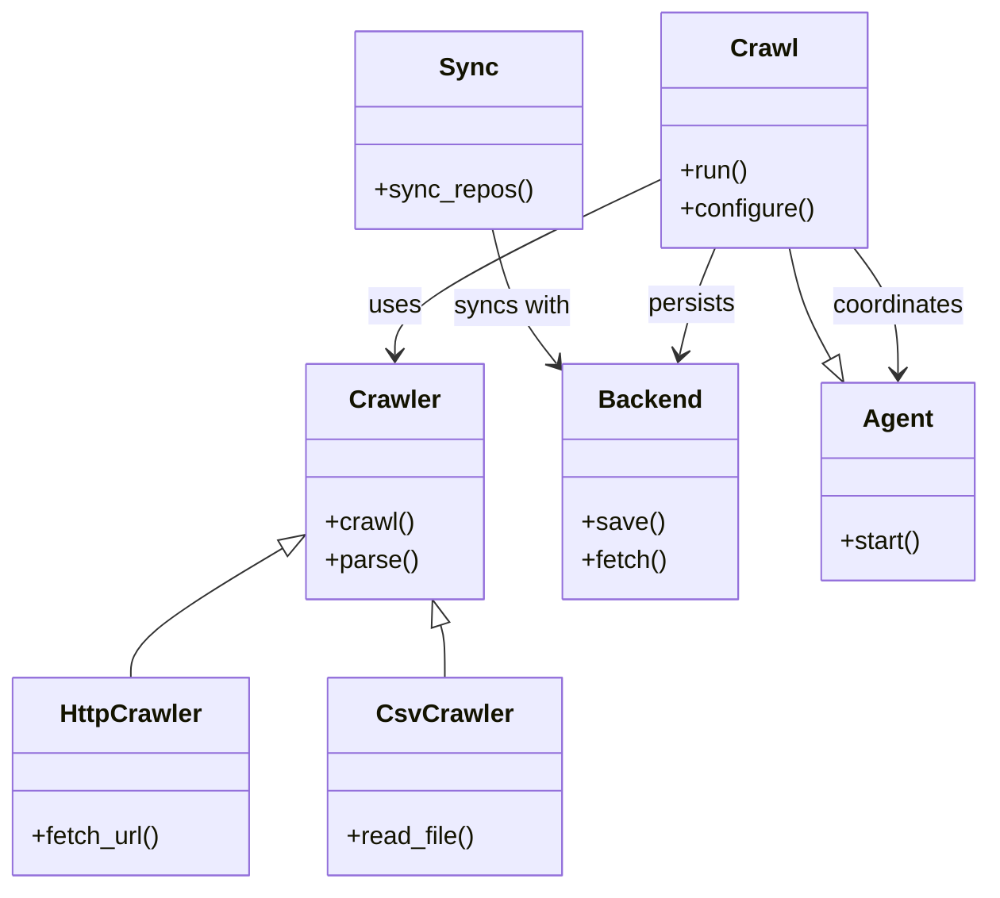

# Diagram: shipment_core/shipment_watchers/config/config.test.yml

> Auto-generated by Obscura crawlers

## Mermaid

### SVG

<svg id="container" width="624.13671875" xmlns="http://www.w3.org/2000/svg" class="classDiagram" height="566" viewBox="0 0 624.13671875 566" role="graphics-document document" aria-roledescription="class"><g><defs><marker id="container_class-aggregationStart" class="marker aggregation class" refX="18" refY="7" markerWidth="190" markerHeight="240" orient="auto"><path d="M 18,7 L9,13 L1,7 L9,1 Z"></path></marker></defs><defs><marker id="container_class-aggregationEnd" class="marker aggregation class" refX="1" refY="7" markerWidth="20" markerHeight="28" orient="auto"><path d="M 18,7 L9,13 L1,7 L9,1 Z"></path></marker></defs><defs><marker id="container_class-extensionStart" class="marker extension class" refX="18" refY="7" markerWidth="190" markerHeight="240" orient="auto"><path d="M 1,7 L18,13 V 1 Z"></path></marker></defs><defs><marker id="container_class-extensionEnd" class="marker extension class" refX="1" refY="7" markerWidth="20" markerHeight="28" orient="auto"><path d="M 1,1 V 13 L18,7 Z"></path></marker></defs><defs><marker id="container_class-compositionStart" class="marker composition class" refX="18" refY="7" markerWidth="190" markerHeight="240" orient="auto"><path d="M 18,7 L9,13 L1,7 L9,1 Z"></path></marker></defs><defs><marker id="container_class-compositionEnd" class="marker composition class" refX="1" refY="7" markerWidth="20" markerHeight="28" orient="auto"><path d="M 18,7 L9,13 L1,7 L9,1 Z"></path></marker></defs><defs><marker id="container_class-dependencyStart" class="marker dependency class" refX="6" refY="7" markerWidth="190" markerHeight="240" orient="auto"><path d="M 5,7 L9,13 L1,7 L9,1 Z"></path></marker></defs><defs><marker id="container_class-dependencyEnd" class="marker dependency class" refX="13" refY="7" markerWidth="20" markerHeight="28" orient="auto"><path d="M 18,7 L9,13 L14,7 L9,1 Z"></path></marker></defs><defs><marker id="container_class-lollipopStart" class="marker lollipop class" refX="13" refY="7" markerWidth="190" markerHeight="240" orient="auto"><circle stroke="black" fill="transparent" cx="7" cy="7" r="6"></circle></marker></defs><defs><marker id="container_class-lollipopEnd" class="marker lollipop class" refX="1" refY="7" markerWidth="190" markerHeight="240" orient="auto"><circle stroke="black" fill="transparent" cx="7" cy="7" r="6"></circle></marker></defs><g class="root"><g class="clusters"></g><g class="edgePaths"><path d="M415.672,114.464L388.018,127.887C360.364,141.309,305.056,168.155,277.402,186.744C249.748,205.333,249.748,215.667,249.748,220.833L249.748,226" id="id_Crawl_Crawler_1" class="edge-thickness-normal edge-pattern-solid relation" style=";;;" data-edge="true" data-et="edge" data-id="id_Crawl_Crawler_1" data-points="W3sieCI6NDE1LjY3MTg3NSwieSI6MTE0LjQ2NDI0MjQ4NTgwMTExfSx7IngiOjI0OS43NDgwNDY4NzUsInkiOjE5NX0seyJ4IjoyNDkuNzQ4MDQ2ODc1LCJ5IjoyMzJ9XQ==" marker-end="url(#container_class-dependencyEnd)"></path><path d="M450.108,158L447.61,164.167C445.111,170.333,440.114,182.667,436.443,194.025C432.773,205.382,430.428,215.765,429.256,220.956L428.084,226.147" id="id_Crawl_Backend_2" class="edge-thickness-normal edge-pattern-solid relation" style=";;;" data-edge="true" data-et="edge" data-id="id_Crawl_Backend_2" data-points="W3sieCI6NDUwLjEwODQzMzMxNDczMjE3LCJ5IjoxNTh9LHsieCI6NDM1LjExNzE4NzUsInkiOjE5NX0seyJ4Ijo0MjYuNzYyMTE5ODM4MTY5NjcsInkiOjIzMn1d" marker-end="url(#container_class-dependencyEnd)"></path><path d="M538.771,158L543.562,164.167C548.354,170.333,557.937,182.667,562.728,196C567.52,209.333,567.52,223.667,567.52,230.833L567.52,238" id="id_Crawl_Agent_3" class="edge-thickness-normal edge-pattern-solid relation" style=";;;" data-edge="true" data-et="edge" data-id="id_Crawl_Agent_3" data-points="W3sieCI6NTM4Ljc3MDcxNzA3NTg5MjksInkiOjE1OH0seyJ4Ijo1NjcuNTE5NTMxMjUsInkiOjE5NX0seyJ4Ijo1NjcuNTE5NTMxMjUsInkiOjI0NH1d" marker-end="url(#container_class-dependencyEnd)"></path><path d="M311.314,146L313.381,154.167C315.448,162.333,319.582,178.667,326.234,192.796C332.886,206.926,342.055,218.852,346.639,224.815L351.224,230.778" id="id_Sync_Backend_4" class="edge-thickness-normal edge-pattern-solid relation" style=";;;" data-edge="true" data-et="edge" data-id="id_Sync_Backend_4" data-points="W3sieCI6MzExLjMxMzg0Mjc3MzQzNzUsInkiOjE0Nn0seyJ4IjozMjMuNzE2Nzk2ODc1LCJ5IjoxOTV9LHsieCI6MzU0Ljg4MDg1OTM3NSwieSI6MjM1LjUzNDIwNDMxODYzNTQ2fV0=" marker-end="url(#container_class-dependencyEnd)"></path><path d="M523.755,228.954L520.581,223.295C517.408,217.636,511.062,206.318,506.555,194.492C502.048,182.667,499.381,170.333,498.047,164.167L496.714,158" id="id_Agent_Crawl_5" class="edge-thickness-normal edge-pattern-solid relation" style=";;;" data-edge="true" data-et="edge" data-id="id_Agent_Crawl_5" data-points="W3sieCI6NTMyLjE5MTg5NDUzMTI1LCJ5IjoyNDR9LHsieCI6NTA0LjcxNDg0Mzc1LCJ5IjoxOTV9LHsieCI6NDk2LjcxNDAwNjY5NjQyODU2LCJ5IjoxNTh9XQ==" marker-start="url(#container_class-extensionStart)"></path><path d="M179.831,349.03L163.759,358.692C147.687,368.353,115.543,387.677,99.471,401.505C83.398,415.333,83.398,423.667,83.398,427.833L83.398,432" id="id_Crawler_HttpCrawler_6" class="edge-thickness-normal edge-pattern-solid relation" style=";;;" data-edge="true" data-et="edge" data-id="id_Crawler_HttpCrawler_6" data-points="W3sieCI6MTk0LjYxNTIzNDM3NSwieSI6MzQwLjE0MjczNjM3NzQwNTQ3fSx7IngiOjgzLjM5ODQzNzUsInkiOjQwN30seyJ4Ijo4My4zOTg0Mzc1LCJ5Ijo0MzJ9XQ==" marker-start="url(#container_class-extensionStart)"></path><path d="M278.828,398.439L279.282,399.866C279.736,401.292,280.643,404.146,281.097,409.74C281.551,415.333,281.551,423.667,281.551,427.833L281.551,432" id="id_Crawler_CsvCrawler_7" class="edge-thickness-normal edge-pattern-solid relation" style=";;;" data-edge="true" data-et="edge" data-id="id_Crawler_CsvCrawler_7" data-points="W3sieCI6MjczLjYwMDA5NzY1NjI1LCJ5IjozODJ9LHsieCI6MjgxLjU1MDc4MTI1LCJ5Ijo0MDd9LHsieCI6MjgxLjU1MDc4MTI1LCJ5Ijo0MzJ9XQ==" marker-start="url(#container_class-extensionStart)"></path></g><g class="edgeLabels"><g class="edgeLabel" transform="translate(249.748046875, 195)"><g class="label" data-id="id_Crawl_Crawler_1" transform="translate(-16.4921875, -12)"><foreignObject width="32.984375" height="24">

uses

</foreignObject></g></g><g class="edgeLabel" transform="translate(435.49083, 194.0778)"><g class="label" data-id="id_Crawl_Backend_2" transform="translate(-28.4375, -12)"><foreignObject width="56.875" height="24">

persists

</foreignObject></g></g><g class="edgeLabel" transform="translate(567.51953125, 195)"><g class="label" data-id="id_Crawl_Agent_3" transform="translate(-42.8046875, -12)"><foreignObject width="85.609375" height="24">

coordinates

</foreignObject></g></g><g class="edgeLabel" transform="translate(323.8948, 195.23153)"><g class="label" data-id="id_Sync_Backend_4" transform="translate(-37.4765625, -12)"><foreignObject width="74.953125" height="24">

syncs with

</foreignObject></g></g><g class="edgeLabel"><g class="label" data-id="id_Agent_Crawl_5" transform="translate(0, 0)"><foreignObject width="0" height="0">

</foreignObject></g></g><g class="edgeLabel"><g class="label" data-id="id_Crawler_HttpCrawler_6" transform="translate(0, 0)"><foreignObject width="0" height="0">

</foreignObject></g></g><g class="edgeLabel"><g class="label" data-id="id_Crawler_CsvCrawler_7" transform="translate(0, 0)"><foreignObject width="0" height="0">

</foreignObject></g></g></g><g class="nodes"><g class="node default" id="classId-Crawl-0" transform="translate(480.49609375, 83)"><g class="basic label-container"><path d="M-64.82421875 -75 L64.82421875 -75 L64.82421875 75 L-64.82421875 75" stroke="none" stroke-width="0" fill="#ECECFF" style=""></path><path d="M-64.82421875 -75 C-37.13034060345146 -75, -9.436462456902916 -75, 64.82421875 -75 M-64.82421875 -75 C-28.05920567148108 -75, 8.705807407037838 -75, 64.82421875 -75 M64.82421875 -75 C64.82421875 -35.460410403184625, 64.82421875 4.07917919363075, 64.82421875 75 M64.82421875 -75 C64.82421875 -28.19198846502472, 64.82421875 18.616023069950558, 64.82421875 75 M64.82421875 75 C16.217845634658154 75, -32.38852748068369 75, -64.82421875 75 M64.82421875 75 C34.975414202848896 75, 5.1266096556977985 75, -64.82421875 75 M-64.82421875 75 C-64.82421875 38.60882186889626, -64.82421875 2.217643737792514, -64.82421875 -75 M-64.82421875 75 C-64.82421875 18.680392805068962, -64.82421875 -37.639214389862076, -64.82421875 -75" stroke="#9370DB" stroke-width="1.3" fill="none" stroke-dasharray="0 0" style=""></path></g><g class="annotation-group text" transform="translate(0, -51)"></g><g class="label-group text" transform="translate(-20.1484375, -51)"><g class="label" style="font-weight: bolder" transform="translate(0,-12)"><foreignObject width="40.296875" height="24">

Crawl

</foreignObject></g></g><g class="members-group text" transform="translate(-52.82421875, -3)"></g><g class="methods-group text" transform="translate(-52.82421875, 27)"><g class="label" style="" transform="translate(0,-12)"><foreignObject width="43.21875" height="24">

+run()

</foreignObject></g><g class="label" style="" transform="translate(0,12)"><foreignObject width="85.5" height="24">

+configure()

</foreignObject></g></g><g class="divider" style=""><path d="M-64.82421875 -27 C-35.460678062590816 -27, -6.097137375181632 -27, 64.82421875 -27 M-64.82421875 -27 C-22.11654169431646 -27, 20.59113536136708 -27, 64.82421875 -27" stroke="#9370DB" stroke-width="1.3" fill="none" stroke-dasharray="0 0" style=""></path></g><g class="divider" style=""><path d="M-64.82421875 -3 C-38.07514648262081 -3, -11.326074215241619 -3, 64.82421875 -3 M-64.82421875 -3 C-21.497816749632683 -3, 21.828585250734633 -3, 64.82421875 -3" stroke="#9370DB" stroke-width="1.3" fill="none" stroke-dasharray="0 0" style=""></path></g></g><g class="node default" id="classId-Crawler-1" transform="translate(249.748046875, 307)"><g class="basic label-container"><path d="M-55.1328125 -75 L55.1328125 -75 L55.1328125 75 L-55.1328125 75" stroke="none" stroke-width="0" fill="#ECECFF" style=""></path><path d="M-55.1328125 -75 C-18.51254798098332 -75, 18.10771653803336 -75, 55.1328125 -75 M-55.1328125 -75 C-27.936645746030017 -75, -0.7404789920600336 -75, 55.1328125 -75 M55.1328125 -75 C55.1328125 -19.355755940341382, 55.1328125 36.288488119317236, 55.1328125 75 M55.1328125 -75 C55.1328125 -41.72180849342331, 55.1328125 -8.44361698684662, 55.1328125 75 M55.1328125 75 C13.312475965533771 75, -28.507860568932458 75, -55.1328125 75 M55.1328125 75 C19.45943547590589 75, -16.213941548188217 75, -55.1328125 75 M-55.1328125 75 C-55.1328125 18.47235424634627, -55.1328125 -38.05529150730746, -55.1328125 -75 M-55.1328125 75 C-55.1328125 37.98725770703904, -55.1328125 0.9745154140780841, -55.1328125 -75" stroke="#9370DB" stroke-width="1.3" fill="none" stroke-dasharray="0 0" style=""></path></g><g class="annotation-group text" transform="translate(0, -51)"></g><g class="label-group text" transform="translate(-27.734375, -51)"><g class="label" style="font-weight: bolder" transform="translate(0,-12)"><foreignObject width="55.46875" height="24">

Crawler

</foreignObject></g></g><g class="members-group text" transform="translate(-43.1328125, -3)"></g><g class="methods-group text" transform="translate(-43.1328125, 27)"><g class="label" style="" transform="translate(0,-12)"><foreignObject width="56.40625" height="24">

+crawl()

</foreignObject></g><g class="label" style="" transform="translate(0,12)"><foreignObject width="58.53125" height="24">

+parse()

</foreignObject></g></g><g class="divider" style=""><path d="M-55.1328125 -27 C-20.66871695053453 -27, 13.795378598930938 -27, 55.1328125 -27 M-55.1328125 -27 C-29.70599017695355 -27, -4.279167853907097 -27, 55.1328125 -27" stroke="#9370DB" stroke-width="1.3" fill="none" stroke-dasharray="0 0" style=""></path></g><g class="divider" style=""><path d="M-55.1328125 -3 C-17.697979817572445 -3, 19.73685286485511 -3, 55.1328125 -3 M-55.1328125 -3 C-25.705699557733467 -3, 3.721413384533065 -3, 55.1328125 -3" stroke="#9370DB" stroke-width="1.3" fill="none" stroke-dasharray="0 0" style=""></path></g></g><g class="node default" id="classId-Backend-2" transform="translate(409.826171875, 307)"><g class="basic label-container"><path d="M-54.9453125 -75 L54.9453125 -75 L54.9453125 75 L-54.9453125 75" stroke="none" stroke-width="0" fill="#ECECFF" style=""></path><path d="M-54.9453125 -75 C-32.50109882256246 -75, -10.056885145124923 -75, 54.9453125 -75 M-54.9453125 -75 C-25.944808405675204 -75, 3.0556956886495925 -75, 54.9453125 -75 M54.9453125 -75 C54.9453125 -35.82378968416104, 54.9453125 3.3524206316779157, 54.9453125 75 M54.9453125 -75 C54.9453125 -28.041008436555565, 54.9453125 18.91798312688887, 54.9453125 75 M54.9453125 75 C15.13387790463755 75, -24.6775566907249 75, -54.9453125 75 M54.9453125 75 C15.855579720900757 75, -23.234153058198487 75, -54.9453125 75 M-54.9453125 75 C-54.9453125 35.268513637984405, -54.9453125 -4.462972724031189, -54.9453125 -75 M-54.9453125 75 C-54.9453125 17.988982071095343, -54.9453125 -39.022035857809314, -54.9453125 -75" stroke="#9370DB" stroke-width="1.3" fill="none" stroke-dasharray="0 0" style=""></path></g><g class="annotation-group text" transform="translate(0, -51)"></g><g class="label-group text" transform="translate(-31.296875, -51)"><g class="label" style="font-weight: bolder" transform="translate(0,-12)"><foreignObject width="62.59375" height="24">

Backend

</foreignObject></g></g><g class="members-group text" transform="translate(-42.9453125, -3)"></g><g class="methods-group text" transform="translate(-42.9453125, 27)"><g class="label" style="" transform="translate(0,-12)"><foreignObject width="50.65625" height="24">

+save()

</foreignObject></g><g class="label" style="" transform="translate(0,12)"><foreignObject width="54.59375" height="24">

+fetch()

</foreignObject></g></g><g class="divider" style=""><path d="M-54.9453125 -27 C-22.670359166162996 -27, 9.604594167674009 -27, 54.9453125 -27 M-54.9453125 -27 C-14.216617409101083 -27, 26.512077681797834 -27, 54.9453125 -27" stroke="#9370DB" stroke-width="1.3" fill="none" stroke-dasharray="0 0" style=""></path></g><g class="divider" style=""><path d="M-54.9453125 -3 C-11.096560596392827 -3, 32.752191307214346 -3, 54.9453125 -3 M-54.9453125 -3 C-15.53472708297447 -3, 23.87585833405106 -3, 54.9453125 -3" stroke="#9370DB" stroke-width="1.3" fill="none" stroke-dasharray="0 0" style=""></path></g></g><g class="node default" id="classId-Sync-3" transform="translate(295.3671875, 83)"><g class="basic label-container"><path d="M-70.3046875 -63 L70.3046875 -63 L70.3046875 63 L-70.3046875 63" stroke="none" stroke-width="0" fill="#ECECFF" style=""></path><path d="M-70.3046875 -63 C-32.87602383823485 -63, 4.552639823530299 -63, 70.3046875 -63 M-70.3046875 -63 C-14.48681229318941 -63, 41.33106291362118 -63, 70.3046875 -63 M70.3046875 -63 C70.3046875 -27.48627525325803, 70.3046875 8.027449493483942, 70.3046875 63 M70.3046875 -63 C70.3046875 -27.035949989832055, 70.3046875 8.92810002033589, 70.3046875 63 M70.3046875 63 C37.08420971922804 63, 3.863731938456084 63, -70.3046875 63 M70.3046875 63 C14.797816771183868 63, -40.709053957632264 63, -70.3046875 63 M-70.3046875 63 C-70.3046875 18.302111107527843, -70.3046875 -26.395777784944315, -70.3046875 -63 M-70.3046875 63 C-70.3046875 29.289106989573334, -70.3046875 -4.421786020853332, -70.3046875 -63" stroke="#9370DB" stroke-width="1.3" fill="none" stroke-dasharray="0 0" style=""></path></g><g class="annotation-group text" transform="translate(0, -39)"></g><g class="label-group text" transform="translate(-17.09375, -39)"><g class="label" style="font-weight: bolder" transform="translate(0,-12)"><foreignObject width="34.1875" height="24">

Sync

</foreignObject></g></g><g class="members-group text" transform="translate(-58.3046875, 9)"></g><g class="methods-group text" transform="translate(-58.3046875, 39)"><g class="label" style="" transform="translate(0,-12)"><foreignObject width="99.515625" height="24">

+sync_repos()

</foreignObject></g></g><g class="divider" style=""><path d="M-70.3046875 -15 C-39.63935375731846 -15, -8.97402001463692 -15, 70.3046875 -15 M-70.3046875 -15 C-19.39693563595366 -15, 31.51081622809268 -15, 70.3046875 -15" stroke="#9370DB" stroke-width="1.3" fill="none" stroke-dasharray="0 0" style=""></path></g><g class="divider" style=""><path d="M-70.3046875 9 C-40.85849254498852 9, -11.412297589977037 9, 70.3046875 9 M-70.3046875 9 C-29.846881735141103 9, 10.610924029717793 9, 70.3046875 9" stroke="#9370DB" stroke-width="1.3" fill="none" stroke-dasharray="0 0" style=""></path></g></g><g class="node default" id="classId-Agent-4" transform="translate(567.51953125, 307)"><g class="basic label-container"><path d="M-48.6171875 -63 L48.6171875 -63 L48.6171875 63 L-48.6171875 63" stroke="none" stroke-width="0" fill="#ECECFF" style=""></path><path d="M-48.6171875 -63 C-15.517873391526003 -63, 17.581440716947995 -63, 48.6171875 -63 M-48.6171875 -63 C-11.817440635072472 -63, 24.982306229855055 -63, 48.6171875 -63 M48.6171875 -63 C48.6171875 -33.77792437001558, 48.6171875 -4.555848740031173, 48.6171875 63 M48.6171875 -63 C48.6171875 -36.631916647501626, 48.6171875 -10.263833295003252, 48.6171875 63 M48.6171875 63 C11.587187395986085 63, -25.44281270802783 63, -48.6171875 63 M48.6171875 63 C19.86382597540626 63, -8.889535549187478 63, -48.6171875 63 M-48.6171875 63 C-48.6171875 35.17938663458365, -48.6171875 7.358773269167301, -48.6171875 -63 M-48.6171875 63 C-48.6171875 33.00779060611364, -48.6171875 3.015581212227275, -48.6171875 -63" stroke="#9370DB" stroke-width="1.3" fill="none" stroke-dasharray="0 0" style=""></path></g><g class="annotation-group text" transform="translate(0, -39)"></g><g class="label-group text" transform="translate(-21.078125, -39)"><g class="label" style="font-weight: bolder" transform="translate(0,-12)"><foreignObject width="42.15625" height="24">

Agent

</foreignObject></g></g><g class="members-group text" transform="translate(-36.6171875, 9)"></g><g class="methods-group text" transform="translate(-36.6171875, 39)"><g class="label" style="" transform="translate(0,-12)"><foreignObject width="52.15625" height="24">

+start()

</foreignObject></g></g><g class="divider" style=""><path d="M-48.6171875 -15 C-19.993359879707796 -15, 8.630467740584407 -15, 48.6171875 -15 M-48.6171875 -15 C-25.290649482500346 -15, -1.9641114650006912 -15, 48.6171875 -15" stroke="#9370DB" stroke-width="1.3" fill="none" stroke-dasharray="0 0" style=""></path></g><g class="divider" style=""><path d="M-48.6171875 9 C-24.161551394399062 9, 0.29408471120187585 9, 48.6171875 9 M-48.6171875 9 C-28.746074515239616 9, -8.874961530479233 9, 48.6171875 9" stroke="#9370DB" stroke-width="1.3" fill="none" stroke-dasharray="0 0" style=""></path></g></g><g class="node default" id="classId-HttpCrawler-5" transform="translate(83.3984375, 495)"><g class="basic label-container"><path d="M-75.3984375 -63 L75.3984375 -63 L75.3984375 63 L-75.3984375 63" stroke="none" stroke-width="0" fill="#ECECFF" style=""></path><path d="M-75.3984375 -63 C-23.721020184536002 -63, 27.956397130927996 -63, 75.3984375 -63 M-75.3984375 -63 C-32.38521594173984 -63, 10.628005616520326 -63, 75.3984375 -63 M75.3984375 -63 C75.3984375 -29.84233274868025, 75.3984375 3.3153345026395016, 75.3984375 63 M75.3984375 -63 C75.3984375 -37.265917296158975, 75.3984375 -11.53183459231795, 75.3984375 63 M75.3984375 63 C39.871740176742954 63, 4.345042853485907 63, -75.3984375 63 M75.3984375 63 C15.39813736905063 63, -44.60216276189874 63, -75.3984375 63 M-75.3984375 63 C-75.3984375 33.37133227798901, -75.3984375 3.742664555978017, -75.3984375 -63 M-75.3984375 63 C-75.3984375 31.003714907190492, -75.3984375 -0.9925701856190159, -75.3984375 -63" stroke="#9370DB" stroke-width="1.3" fill="none" stroke-dasharray="0 0" style=""></path></g><g class="annotation-group text" transform="translate(0, -39)"></g><g class="label-group text" transform="translate(-44.015625, -39)"><g class="label" style="font-weight: bolder" transform="translate(0,-12)"><foreignObject width="88.03125" height="24">

HttpCrawler

</foreignObject></g></g><g class="members-group text" transform="translate(-63.3984375, 9)"></g><g class="methods-group text" transform="translate(-63.3984375, 39)"><g class="label" style="" transform="translate(0,-12)"><foreignObject width="82.78125" height="24">

+fetch_url()

</foreignObject></g></g><g class="divider" style=""><path d="M-75.3984375 -15 C-25.911784197203872 -15, 23.574869105592256 -15, 75.3984375 -15 M-75.3984375 -15 C-16.06988185510226 -15, 43.25867378979548 -15, 75.3984375 -15" stroke="#9370DB" stroke-width="1.3" fill="none" stroke-dasharray="0 0" style=""></path></g><g class="divider" style=""><path d="M-75.3984375 9 C-32.8583656210677 9, 9.681706257864604 9, 75.3984375 9 M-75.3984375 9 C-29.73911126699634 9, 15.920214966007322 9, 75.3984375 9" stroke="#9370DB" stroke-width="1.3" fill="none" stroke-dasharray="0 0" style=""></path></g></g><g class="node default" id="classId-CsvCrawler-6" transform="translate(281.55078125, 495)"><g class="basic label-container"><path d="M-72.75390625 -63 L72.75390625 -63 L72.75390625 63 L-72.75390625 63" stroke="none" stroke-width="0" fill="#ECECFF" style=""></path><path d="M-72.75390625 -63 C-30.171700569293122 -63, 12.410505111413755 -63, 72.75390625 -63 M-72.75390625 -63 C-33.03481941246682 -63, 6.684267425066366 -63, 72.75390625 -63 M72.75390625 -63 C72.75390625 -24.644744543923544, 72.75390625 13.710510912152913, 72.75390625 63 M72.75390625 -63 C72.75390625 -30.759739008197016, 72.75390625 1.4805219836059678, 72.75390625 63 M72.75390625 63 C36.37916364647714 63, 0.0044210429542772545 63, -72.75390625 63 M72.75390625 63 C20.413640511857352 63, -31.926625226285296 63, -72.75390625 63 M-72.75390625 63 C-72.75390625 20.533892528308478, -72.75390625 -21.932214943383045, -72.75390625 -63 M-72.75390625 63 C-72.75390625 37.69396972117843, -72.75390625 12.387939442356874, -72.75390625 -63" stroke="#9370DB" stroke-width="1.3" fill="none" stroke-dasharray="0 0" style=""></path></g><g class="annotation-group text" transform="translate(0, -39)"></g><g class="label-group text" transform="translate(-40.0859375, -39)"><g class="label" style="font-weight: bolder" transform="translate(0,-12)"><foreignObject width="80.171875" height="24">

CsvCrawler

</foreignObject></g></g><g class="members-group text" transform="translate(-60.75390625, 9)"></g><g class="methods-group text" transform="translate(-60.75390625, 39)"><g class="label" style="" transform="translate(0,-12)"><foreignObject width="81.421875" height="24">

+read_file()

</foreignObject></g></g><g class="divider" style=""><path d="M-72.75390625 -15 C-43.12594155238396 -15, -13.497976854767934 -15, 72.75390625 -15 M-72.75390625 -15 C-16.75851562379284 -15, 39.23687500241432 -15, 72.75390625 -15" stroke="#9370DB" stroke-width="1.3" fill="none" stroke-dasharray="0 0" style=""></path></g><g class="divider" style=""><path d="M-72.75390625 9 C-41.06558246578538 9, -9.377258681570758 9, 72.75390625 9 M-72.75390625 9 C-19.36313416973823 9, 34.02763791052354 9, 72.75390625 9" stroke="#9370DB" stroke-width="1.3" fill="none" stroke-dasharray="0 0" style=""></path></g></g></g></g></g></svg>
