# Diagram: shipment_core/shipment_watchers/serverless.shipment_watchers.yml

> Auto-generated by Obscura crawlers

## Mermaid

```mermaid
flowchart TD
  subgraph Service["service: shipments-watcher"]
    direction TB
    Framework[/"Framework v3"/]
    Provider["provider: aws\nruntime: python3.13\narch: arm64\ntimeout: 900"]
    Env["Environment\nAWS_STAGE, ACCOUNT_ID,\nDD_* (Datadog) flags"]
    VPC["VPC: custom.globalConfig.vpc"]
    IAM["IAM Role\nManagedPolicies + Statements\nAllow: lambda:InvokeFunction, sns:CreateTopic, sns:Publish, secretsmanager:GetSecretValue\nDeny: logs:CreateLogGroup/CreateLogStream/PutLogEvents\n(resource ARNs)"]
    Layers["Layers: ${self:custom.globalConfig.fv_layers}"]
  end

  Service --> Framework
  Service --> Provider
  Service --> Env
  Service --> VPC
  Service --> IAM
  Service --> Layers

  subgraph Functions["Lambda functions"]
    direction LR
    multimodal["multimodal_status\nhandler: shipment_watchers/multimodal/multimodal_status.lambda_handler\nreservedConcurrency:1\ntrigger: schedule(5m)"]
    h1["h1_intermodal_processing\nhandler: shipment_watchers/intermodal/h1_intermodal_processing.lambda_handler\nreservedConcurrency:1\nenv: AWS_STAGE\ntrigger: schedule(2m)"]
    reassign["reassign_aftermarket\nhandler: shipment_watchers/reprocess/reassign_aftermarket.lambda_handler\ntrigger: schedule(30m)"]
    email_schedule["email_schedule_processing\nhandler: shipment_watchers/email/email_watcher.lambda_handler\nreservedConcurrency:1\nenv: AWS_STAGE\ntrigger: schedule(var)"]
    send_report["send_report_email\nhandler: shipment_watchers/email/send_report_email.lambda_handler"]
    dwell["send_dwell_alert_notifications\nhandler: shipment_watchers/dwell/dwell_alert_watcher.lambda_handler\nreservedConcurrency:1\ntrigger: schedule(1m)"]
  end

  Provider --> Functions
  Layers --> Functions
  IAM --> Functions
  VPC --> Functions
  Env --> Functions

  %% Event triggers
  Schedule5m(["Schedule: rate(5 minutes)"])
  Schedule2m(["Schedule: rate(2 minutes)"])
  Schedule30m(["Schedule: rate(30 minutes)"])
  ScheduleVar(["Schedule: emailScheduleTriggers (stage-dependent)"])
  Schedule1m(["Schedule: rate(1 minute)"])

  Schedule5m --> multimodal
  Schedule2m --> h1
  Schedule30m --> reassign
  ScheduleVar --> email_schedule
  Schedule1m --> dwell

  %% Relationships and responsibilities
  h1 -->|"Attempts rematch & merge\nStandalone Intermodal Shipments"| multimodal
  reassign -->|Reprocess / reassign shipments| h1
  email_schedule -->|Generates reports / resets ts| send_report
  dwell -->|Sends dwell alert notifications| send_report

  %% Packaging & deployment
  package["package patterns (exclusions)"] --> Service

  classDef infra fill:#f9f,stroke:#333,stroke-width:1px;
  class Service,Provider,IAM,VPC,Layers,package infra
```

### SVG

<svg id="container" width="5708.3525390625" xmlns="http://www.w3.org/2000/svg" class="flowchart" height="793" viewBox="0 0 5708.3525390625 793" role="graphics-document document" aria-roledescription="flowchart-v2"><g><marker id="container_flowchart-v2-pointEnd" class="marker flowchart-v2" viewBox="0 0 10 10" refX="5" refY="5" markerUnits="userSpaceOnUse" markerWidth="8" markerHeight="8" orient="auto"><path d="M 0 0 L 10 5 L 0 10 z" class="arrowMarkerPath" style="stroke-width: 1; stroke-dasharray: 1, 0;"></path></marker><marker id="container_flowchart-v2-pointStart" class="marker flowchart-v2" viewBox="0 0 10 10" refX="4.5" refY="5" markerUnits="userSpaceOnUse" markerWidth="8" markerHeight="8" orient="auto"><path d="M 0 5 L 10 10 L 10 0 z" class="arrowMarkerPath" style="stroke-width: 1; stroke-dasharray: 1, 0;"></path></marker><marker id="container_flowchart-v2-circleEnd" class="marker flowchart-v2" viewBox="0 0 10 10" refX="11" refY="5" markerUnits="userSpaceOnUse" markerWidth="11" markerHeight="11" orient="auto"><circle cx="5" cy="5" r="5" class="arrowMarkerPath" style="stroke-width: 1; stroke-dasharray: 1, 0;"></circle></marker><marker id="container_flowchart-v2-circleStart" class="marker flowchart-v2" viewBox="0 0 10 10" refX="-1" refY="5" markerUnits="userSpaceOnUse" markerWidth="11" markerHeight="11" orient="auto"><circle cx="5" cy="5" r="5" class="arrowMarkerPath" style="stroke-width: 1; stroke-dasharray: 1, 0;"></circle></marker><marker id="container_flowchart-v2-crossEnd" class="marker cross flowchart-v2" viewBox="0 0 11 11" refX="12" refY="5.2" markerUnits="userSpaceOnUse" markerWidth="11" markerHeight="11" orient="auto"><path d="M 1,1 l 9,9 M 10,1 l -9,9" class="arrowMarkerPath" style="stroke-width: 2; stroke-dasharray: 1, 0;"></path></marker><marker id="container_flowchart-v2-crossStart" class="marker cross flowchart-v2" viewBox="0 0 11 11" refX="-1" refY="5.2" markerUnits="userSpaceOnUse" markerWidth="11" markerHeight="11" orient="auto"><path d="M 1,1 l 9,9 M 10,1 l -9,9" class="arrowMarkerPath" style="stroke-width: 2; stroke-dasharray: 1, 0;"></path></marker><g class="root"><g class="clusters"><g class="cluster" id="Functions" data-look="classic"><rect style="" x="8" y="136" width="2970.59375" height="649"></rect><g class="cluster-label" transform="translate(1428.0859375, 136)"><foreignObject width="130.421875" height="24">

Lambda functions

</foreignObject></g></g><g class="cluster infra" id="Service" data-look="classic"><rect style="fill:#f9f !important;stroke:#333 !important;stroke-width:1px !important" x="3794.977737426758" y="136" width="1905.375" height="400"></rect><g class="cluster-label" transform="translate(4648.399612426758, 136)"><foreignObject width="198.53125" height="24">

service: shipments-watcher

</foreignObject></g></g></g><g class="edgePaths"><path d="M3284.711,445.282L3107.049,460.401C2929.387,475.521,2574.062,505.761,2396.4,531.047C2218.738,556.333,2218.738,576.667,2246.962,596.778C2275.185,616.89,2331.632,636.78,2359.856,646.726L2388.079,656.671" id="L_Schedule5m_multimodal_0" class="edge-thickness-normal edge-pattern-solid edge-thickness-normal edge-pattern-solid flowchart-link" style=";" data-edge="true" data-et="edge" data-id="L_Schedule5m_multimodal_0" data-points="W3sieCI6MzI4NC43MTA2ODk5NzczNjEsInkiOjQ0NS4yODE3NTM5MTI2MDk3Nn0seyJ4IjoyMjE4LjczODI4MTI1LCJ5Ijo1MzZ9LHsieCI6MjIxOC43MzgyODEyNSwieSI6NTk3fSx7IngiOjIzOTEuODUxNzM2ODg2MTYxLCJ5Ijo2NTh9XQ==" marker-end="url(#container_flowchart-v2-pointEnd)"></path><path d="M3014.653,217.144L2658.468,232.953C2302.284,248.763,1589.915,280.381,1194.661,308.162C799.406,335.943,721.266,359.885,682.196,371.857L643.126,383.828" id="L_Schedule2m_h1_0" class="edge-thickness-normal edge-pattern-solid edge-thickness-normal edge-pattern-solid flowchart-link" style=";" data-edge="true" data-et="edge" data-id="L_Schedule2m_h1_0" data-points="W3sieCI6MzAxNC42NTI1NzM3Nzc2NTgsInkiOjIxNy4xNDM5OTIwNjMwNjZ9LHsieCI6ODc3LjU0Njg3NSwieSI6MzEyfSx7IngiOjYzOS4zMDExMjc3NzIxNzc0LCJ5IjozODV9XQ==" marker-end="url(#container_flowchart-v2-pointEnd)"></path><path d="M413.355,67L413.272,74.333C413.189,81.667,413.022,96.333,412.939,107.833C412.855,119.333,412.855,127.667,412.855,135.333C412.855,143,412.855,150,412.855,153.5L412.855,157" id="L_Schedule30m_reassign_0" class="edge-thickness-normal edge-pattern-solid edge-thickness-normal edge-pattern-solid flowchart-link" style=";" data-edge="true" data-et="edge" data-id="L_Schedule30m_reassign_0" data-points="W3sieCI6NDEzLjM1NTQ2ODc1LCJ5Ijo2N30seyJ4Ijo0MTIuODU1NDY4NzUsInkiOjExMX0seyJ4Ijo0MTIuODU1NDY4NzUsInkiOjEzNn0seyJ4Ijo0MTIuODU1NDY4NzUsInkiOjE2MX1d" marker-end="url(#container_flowchart-v2-pointEnd)"></path><path d="M3273.692,218.148L2945.116,233.79C2616.541,249.432,1959.39,280.716,1630.814,307.858C1302.238,335,1302.238,358,1302.238,369.5L1302.238,381" id="L_ScheduleVar_email_schedule_0" class="edge-thickness-normal edge-pattern-solid edge-thickness-normal edge-pattern-solid flowchart-link" style=";" data-edge="true" data-et="edge" data-id="L_ScheduleVar_email_schedule_0" data-points="W3sieCI6MzI3My42OTIwNDUyMzAzNjcsInkiOjIxOC4xNDgwNTI2NzI4NDMwNX0seyJ4IjoxMzAyLjIzODI4MTI1LCJ5IjozMTJ9LHsieCI6MTMwMi4yMzgyODEyNSwieSI6Mzg1fV0=" marker-end="url(#container_flowchart-v2-pointEnd)"></path><path d="M3561.092,218.852L3317.366,234.377C3073.641,249.902,2586.19,280.951,2342.464,307.975C2098.738,335,2098.738,358,2098.738,369.5L2098.738,381" id="L_Schedule1m_dwell_0" class="edge-thickness-normal edge-pattern-solid edge-thickness-normal edge-pattern-solid flowchart-link" style=";" data-edge="true" data-et="edge" data-id="L_Schedule1m_dwell_0" data-points="W3sieCI6MzU2MS4wOTE5NTMzMzM3NDY1LCJ5IjoyMTguODUyMzY4MTg1MjEyMX0seyJ4IjoyMDk4LjczODI4MTI1LCJ5IjozMTJ9LHsieCI6MjA5OC43MzgyODEyNSwieSI6Mzg1fV0=" marker-end="url(#container_flowchart-v2-pointEnd)"></path><path d="M472.855,487L472.855,495.167C472.855,503.333,472.855,519.667,472.855,538C472.855,556.333,472.855,576.667,748.31,601.782C1023.765,626.898,1574.674,656.796,1850.129,671.746L2125.584,686.695" id="L_h1_multimodal_0" class="edge-thickness-normal edge-pattern-solid edge-thickness-normal edge-pattern-solid flowchart-link" style=";" data-edge="true" data-et="edge" data-id="L_h1_multimodal_0" data-points="W3sieCI6NDcyLjg1NTQ2ODc1LCJ5Ijo0ODd9LHsieCI6NDcyLjg1NTQ2ODc1LCJ5Ijo1MzZ9LHsieCI6NDcyLjg1NTQ2ODc1LCJ5Ijo1OTd9LHsieCI6MjEyOS41NzgxMjUsInkiOjY4Ni45MTE0MjAyNzAxMDR9XQ==" marker-end="url(#container_flowchart-v2-pointEnd)"></path><path d="M412.855,263L412.855,271.167C412.855,279.333,412.855,295.667,418.452,315.4C424.049,335.133,435.242,358.266,440.839,369.833L446.436,381.399" id="L_reassign_h1_0" class="edge-thickness-normal edge-pattern-solid edge-thickness-normal edge-pattern-solid flowchart-link" style=";" data-edge="true" data-et="edge" data-id="L_reassign_h1_0" data-points="W3sieCI6NDEyLjg1NTQ2ODc1LCJ5IjoyNjN9LHsieCI6NDEyLjg1NTQ2ODc1LCJ5IjozMTJ9LHsieCI6NDQ4LjE3ODA0OTM5NTE2MTMsInkiOjM4NX1d" marker-end="url(#container_flowchart-v2-pointEnd)"></path><path d="M1302.238,487L1302.238,495.167C1302.238,503.333,1302.238,519.667,1302.238,538C1302.238,556.333,1302.238,576.667,1344.859,598.82C1387.479,620.972,1472.72,644.945,1515.341,656.931L1557.961,668.917" id="L_email_schedule_send_report_0" class="edge-thickness-normal edge-pattern-solid edge-thickness-normal edge-pattern-solid flowchart-link" style=";" data-edge="true" data-et="edge" data-id="L_email_schedule_send_report_0" data-points="W3sieCI6MTMwMi4yMzgyODEyNSwieSI6NDg3fSx7IngiOjEzMDIuMjM4MjgxMjUsInkiOjUzNn0seyJ4IjoxMzAyLjIzODI4MTI1LCJ5Ijo1OTd9LHsieCI6MTU2MS44MTE5NDE5NjQyODU4LCJ5Ijo2NzB9XQ==" marker-end="url(#container_flowchart-v2-pointEnd)"></path><path d="M2098.738,487L2098.738,495.167C2098.738,503.333,2098.738,519.667,2098.738,538C2098.738,556.333,2098.738,576.667,2056.118,598.82C2013.497,620.972,1928.256,644.945,1885.636,656.931L1843.015,668.917" id="L_dwell_send_report_0" class="edge-thickness-normal edge-pattern-solid edge-thickness-normal edge-pattern-solid flowchart-link" style=";" data-edge="true" data-et="edge" data-id="L_dwell_send_report_0" data-points="W3sieCI6MjA5OC43MzgyODEyNSwieSI6NDg3fSx7IngiOjIwOTguNzM4MjgxMjUsInkiOjUzNn0seyJ4IjoyMDk4LjczODI4MTI1LCJ5Ijo1OTd9LHsieCI6MTgzOS4xNjQ2MjA1MzU3MTQyLCJ5Ijo2NzB9XQ==" marker-end="url(#container_flowchart-v2-pointEnd)"></path><path d="M4837.482,214.593Z" id="L_Service_Framework_0" class="edge-thickness-normal edge-pattern-solid edge-thickness-normal edge-pattern-solid flowchart-link" style=";" data-edge="true" data-et="edge" data-id="L_Service_Framework_0" data-points="W3sieCI6NDgzNS42MDg4NTcyNjk2MDQsInkiOjIxMC4zMzkzMjI4MTQzMDc1fSx7IngiOjUzNzkuODgyNjg1MzQzNDI1LCJ5IjoxOTIuNX0seyJ4Ijo1NTEzLjkwODcyNzAxMDA5MSwieSI6MTkyLjV9LHsieCI6NTY0Ny45MzQ3Njg2NzY3NTgsInkiOjIxMn0seyJ4Ijo1NTEzLjkwODcyNzAxMDA5MSwieSI6MjMxLjV9LHsieCI6NTM3OS44ODI2ODUzNDM0MjUsInkiOjIzMS41fSx7IngiOjQ4MzMuNDgyMDI2OTcxNTY0LCJ5IjoyMTQuNTkyOTgzNDEwMzg5MDJ9XQ==" marker-end="url(#container_flowchart-v2-pointEnd)"></path><path d="M3963.978,385Z" id="L_Service_Provider_0" class="edge-thickness-normal edge-pattern-solid edge-thickness-normal edge-pattern-solid flowchart-link" style=";" data-edge="true" data-et="edge" data-id="L_Service_Provider_0" data-points="W3sieCI6NDY5Ni41MDgxMTQ4MTQ5NzksInkiOjIyMS4zMjIwNTc3MjM1NTYyN30seyJ4IjozOTU5Ljk3NzczNzQyNjc1OCwieSI6MzEyfSx7IngiOjM5NTkuOTc3NzM3NDI2NzU4LCJ5IjozODV9XQ==" marker-end="url(#container_flowchart-v2-pointEnd)"></path><path d="M4273.978,385Z" id="L_Service_Env_0" class="edge-thickness-normal edge-pattern-solid edge-thickness-normal edge-pattern-solid flowchart-link" style=";" data-edge="true" data-et="edge" data-id="L_Service_Env_0" data-points="W3sieCI6NDY5My40NTA2OTUyNzI4OTcsInkiOjIyNy40MzY4OTY4MDc3MjA4N30seyJ4Ijo0MjY5Ljk3NzczNzQyNjc1OCwieSI6MzEyfSx7IngiOjQyNjkuOTc3NzM3NDI2NzU4LCJ5IjozODV9XQ==" marker-end="url(#container_flowchart-v2-pointEnd)"></path><path d="M4583.978,397Z" id="L_Service_VPC_0" class="edge-thickness-normal edge-pattern-solid edge-thickness-normal edge-pattern-solid flowchart-link" style=";" data-edge="true" data-et="edge" data-id="L_Service_VPC_0" data-points="W3sieCI6NDczMS4yMTA4NDI4OTU1MDgsInkiOjIzMn0seyJ4Ijo0NTc5Ljk3NzczNzQyNjc1OCwieSI6MzEyfSx7IngiOjQ1NzkuOTc3NzM3NDI2NzU4LCJ5IjozOTd9XQ==" marker-end="url(#container_flowchart-v2-pointEnd)"></path><path d="M5030.275,361Z" id="L_Service_IAM_0" class="edge-thickness-normal edge-pattern-solid edge-thickness-normal edge-pattern-solid flowchart-link" style=";" data-edge="true" data-et="edge" data-id="L_Service_IAM_0" data-points="W3sieCI6NDgxOC4yMzg3MzM1MjA1MDgsInkiOjIzMn0seyJ4Ijo1MDI2LjI3NDYxMjQyNjc1OCwieSI6MzEyfSx7IngiOjUwMjYuMjc0NjEyNDI2NzU4LCJ5IjozNjF9XQ==" marker-end="url(#container_flowchart-v2-pointEnd)"></path><path d="M5507.962,397Z" id="L_Service_Layers_0" class="edge-thickness-normal edge-pattern-solid edge-thickness-normal edge-pattern-solid flowchart-link" style=";" data-edge="true" data-et="edge" data-id="L_Service_Layers_0" data-points="W3sieCI6NDgzMC4yODI4NDQ1Mzc1ODUsInkiOjIyMC45OTEzNDgyNzgzNDQ2Mn0seyJ4Ijo1NTAzLjk2MjExMjQyNjc1OCwieSI6MzEyfSx7IngiOjU1MDMuOTYyMTEyNDI2NzU4LCJ5IjozOTd9XQ==" marker-end="url(#container_flowchart-v2-pointEnd)"></path><path d="M3959.978,487L3959.978,495.167C3959.978,503.333,3959.978,519.667,3797.08,532.186C3634.183,544.704,3308.387,553.409,3145.49,557.761L2982.592,562.113" id="L_Provider_Functions_0" class="edge-thickness-normal edge-pattern-solid edge-thickness-normal edge-pattern-solid flowchart-link" style=";" data-edge="true" data-et="edge" data-id="L_Provider_Functions_0" data-points="W3sieCI6Mzk1OS45Nzc3Mzc0MjY3NTgsInkiOjQ4N30seyJ4IjozOTU5Ljk3NzczNzQyNjc1OCwieSI6NTM2fSx7IngiOjIyMzguNzM4MjgxMjUsInkiOjU5N30seyJ4IjoyNDAwLjk1ODg3OTc0MzMwMzQsInkiOjY1OH1d" marker-end="url(#container_flowchart-v2-pointEnd)"></path><path d="M5503.962,475L5503.962,485.167C5503.962,495.333,5503.962,515.667,5083.734,526.582C4663.506,537.497,3823.05,538.993,3402.822,539.742L2982.594,540.49" id="L_Layers_Functions_0" class="edge-thickness-normal edge-pattern-solid edge-thickness-normal edge-pattern-solid flowchart-link" style=";" data-edge="true" data-et="edge" data-id="L_Layers_Functions_0" data-points="W3sieCI6NTUwMy45NjIxMTI0MjY3NTgsInkiOjQ3NX0seyJ4Ijo1NTAzLjk2MjExMjQyNjc1OCwieSI6NTM2fSx7IngiOjI3NzcuNTg5ODQzNzUsInkiOjU5N30seyJ4IjoyNjQ2LjMyODc4NzY2NzQxMSwieSI6NjU4fV0=" marker-end="url(#container_flowchart-v2-pointEnd)"></path><path d="M5026.275,511L5026.275,515.167C5026.275,519.333,5026.275,527.667,4685.661,532.822C4345.048,537.977,3663.821,539.954,3323.207,540.942L2982.594,541.931" id="L_IAM_Functions_0" class="edge-thickness-normal edge-pattern-solid edge-thickness-normal edge-pattern-solid flowchart-link" style=";" data-edge="true" data-et="edge" data-id="L_IAM_Functions_0" data-points="W3sieCI6NTAyNi4yNzQ2MTI0MjY3NTgsInkiOjUxMX0seyJ4Ijo1MDI2LjI3NDYxMjQyNjc1OCwieSI6NTM2fSx7IngiOjI3NTcuNTg5ODQzNzUsInkiOjU5N30seyJ4IjoyNjM3LjIyMTY0NDgxMDI2NzcsInkiOjY1OH1d" marker-end="url(#container_flowchart-v2-pointEnd)"></path><path d="M4579.978,475L4579.978,485.167C4579.978,495.333,4579.978,515.667,4313.747,527.16C4047.516,538.653,3515.055,541.306,3248.824,542.633L2982.594,543.96" id="L_VPC_Functions_0" class="edge-thickness-normal edge-pattern-solid edge-thickness-normal edge-pattern-solid flowchart-link" style=";" data-edge="true" data-et="edge" data-id="L_VPC_Functions_0" data-points="W3sieCI6NDU3OS45Nzc3Mzc0MjY3NTgsInkiOjQ3NX0seyJ4Ijo0NTc5Ljk3NzczNzQyNjc1OCwieSI6NTM2fSx7IngiOjI3MzcuNTg5ODQzNzUsInkiOjU5N30seyJ4IjoyNjI4LjExNDUwMTk1MzEyNSwieSI6NjU4fV0=" marker-end="url(#container_flowchart-v2-pointEnd)"></path><path d="M4269.978,487L4269.978,495.167C4269.978,503.333,4269.978,519.667,4055.414,530.418C3840.85,541.169,3411.722,546.338,3197.158,548.922L2982.593,551.507" id="L_Env_Functions_0" class="edge-thickness-normal edge-pattern-solid edge-thickness-normal edge-pattern-solid flowchart-link" style=";" data-edge="true" data-et="edge" data-id="L_Env_Functions_0" data-points="W3sieCI6NDI2OS45Nzc3Mzc0MjY3NTgsInkiOjQ4N30seyJ4Ijo0MjY5Ljk3NzczNzQyNjc1OCwieSI6NTM2fSx7IngiOjI1MzYuNTg1OTM3NSwieSI6NTk3fSx7IngiOjI1MzYuNTg1OTM3NSwieSI6NjU4fV0=" marker-end="url(#container_flowchart-v2-pointEnd)"></path><path d="M4767.224,86L4767.224,90.167C4767.224,94.333,4767.224,102.667,4767.224,110.333C4767.224,118,4767.224,125,4767.224,128.5L4767.224,132" id="L_package_Service_0" class="edge-thickness-normal edge-pattern-solid edge-thickness-normal edge-pattern-solid flowchart-link" style=";" data-edge="true" data-et="edge" data-id="L_package_Service_0" data-points="W3sieCI6NDc2Ny4yMjM4MzExNzY3NTgsInkiOjg2fSx7IngiOjQ3NjcuMjIzODMxMTc2NzU4LCJ5IjoxMTF9LHsieCI6NDc2Ny4yMjM4MzExNzY3NTgsInkiOjEzNn0seyJ4Ijo0NzY3LjcyMzgzMTE3Njc1OCwieSI6MTkzfV0=" marker-end="url(#container_flowchart-v2-pointEnd)"></path></g><g class="edgeLabels"><g class="edgeLabel"><g class="label" data-id="L_Schedule5m_multimodal_0" transform="translate(0, 0)"><foreignObject width="0" height="0">

</foreignObject></g></g><g class="edgeLabel"><g class="label" data-id="L_Schedule2m_h1_0" transform="translate(0, 0)"><foreignObject width="0" height="0">

</foreignObject></g></g><g class="edgeLabel"><g class="label" data-id="L_Schedule30m_reassign_0" transform="translate(0, 0)"><foreignObject width="0" height="0">

</foreignObject></g></g><g class="edgeLabel"><g class="label" data-id="L_ScheduleVar_email_schedule_0" transform="translate(0, 0)"><foreignObject width="0" height="0">

</foreignObject></g></g><g class="edgeLabel"><g class="label" data-id="L_Schedule1m_dwell_0" transform="translate(0, 0)"><foreignObject width="0" height="0">

</foreignObject></g></g><g class="edgeLabel" transform="translate(472.85546875, 597)"><g class="label" data-id="L_h1_multimodal_0" transform="translate(-100, -36)"><foreignObject width="200" height="72">

Attempts rematch &amp; merge\nStandalone Intermodal Shipments

</foreignObject></g></g><g class="edgeLabel" transform="translate(412.85546875, 312)"><g class="label" data-id="L_reassign_h1_0" transform="translate(-100, -24)"><foreignObject width="200" height="48">

Reprocess / reassign shipments

</foreignObject></g></g><g class="edgeLabel" transform="translate(1302.23828125, 597)"><g class="label" data-id="L_email_schedule_send_report_0" transform="translate(-100, -24)"><foreignObject width="200" height="48">

Generates reports / resets ts

</foreignObject></g></g><g class="edgeLabel" transform="translate(2098.73828125, 597)"><g class="label" data-id="L_dwell_send_report_0" transform="translate(-100, -24)"><foreignObject width="200" height="48">

Sends dwell alert notifications

</foreignObject></g></g><g class="edgeLabel"><g class="label" data-id="L_Service_Framework_0" transform="translate(0, 0)"><foreignObject width="0" height="0">

</foreignObject></g></g><g class="edgeLabel"><g class="label" data-id="L_Service_Provider_0" transform="translate(0, 0)"><foreignObject width="0" height="0">

</foreignObject></g></g><g class="edgeLabel"><g class="label" data-id="L_Service_Env_0" transform="translate(0, 0)"><foreignObject width="0" height="0">

</foreignObject></g></g><g class="edgeLabel"><g class="label" data-id="L_Service_VPC_0" transform="translate(0, 0)"><foreignObject width="0" height="0">

</foreignObject></g></g><g class="edgeLabel"><g class="label" data-id="L_Service_IAM_0" transform="translate(0, 0)"><foreignObject width="0" height="0">

</foreignObject></g></g><g class="edgeLabel"><g class="label" data-id="L_Service_Layers_0" transform="translate(0, 0)"><foreignObject width="0" height="0">

</foreignObject></g></g><g class="edgeLabel"><g class="label" data-id="L_Provider_Functions_0" transform="translate(0, 0)"><foreignObject width="0" height="0">

</foreignObject></g></g><g class="edgeLabel"><g class="label" data-id="L_Layers_Functions_0" transform="translate(0, 0)"><foreignObject width="0" height="0">

</foreignObject></g></g><g class="edgeLabel"><g class="label" data-id="L_IAM_Functions_0" transform="translate(0, 0)"><foreignObject width="0" height="0">

</foreignObject></g></g><g class="edgeLabel"><g class="label" data-id="L_VPC_Functions_0" transform="translate(0, 0)"><foreignObject width="0" height="0">

</foreignObject></g></g><g class="edgeLabel"><g class="label" data-id="L_Env_Functions_0" transform="translate(0, 0)"><foreignObject width="0" height="0">

</foreignObject></g></g><g class="edgeLabel"><g class="label" data-id="L_package_Service_0" transform="translate(0, 0)"><foreignObject width="0" height="0">

</foreignObject></g></g></g><g class="nodes"><g class="node default" id="flowchart-Framework-0" transform="translate(4767.223831176758, 212)"><polygon points="-19.5,0 114.109375,0 133.609375,-39 0,-39" class="label-container" transform="translate(-57.0546875,19.5)"></polygon><g class="label" style="" transform="translate(-49.5546875, -12)"><rect></rect><foreignObject width="99.109375" height="24">

Framework v3

</foreignObject></g></g><g class="node default infra" id="flowchart-Provider-1" transform="translate(3959.977737426758, 436)"><rect class="basic label-container" style="fill:#f9f !important;stroke:#333 !important;stroke-width:1px !important" x="-130" y="-51" width="260" height="102"></rect><g class="label" style="" transform="translate(-100, -36)"><rect></rect><foreignObject width="200" height="72">

provider: aws\nruntime: python3.13\narch: arm64\ntimeout: 900

</foreignObject></g></g><g class="node default" id="flowchart-Env-2" transform="translate(4269.977737426758, 436)"><rect class="basic label-container" style="" x="-130" y="-51" width="260" height="102"></rect><g class="label" style="" transform="translate(-100, -36)"><rect></rect><foreignObject width="200" height="72">

Environment\nAWS_STAGE, ACCOUNT_ID,\nDD_* (Datadog) flags

</foreignObject></g></g><g class="node default infra" id="flowchart-VPC-3" transform="translate(4579.977737426758, 436)"><rect class="basic label-container" style="fill:#f9f !important;stroke:#333 !important;stroke-width:1px !important" x="-130" y="-39" width="260" height="78"></rect><g class="label" style="" transform="translate(-100, -24)"><rect></rect><foreignObject width="200" height="48">

VPC: custom.globalConfig.vpc

</foreignObject></g></g><g class="node default infra" id="flowchart-IAM-4" transform="translate(5026.274612426758, 436)"><rect class="basic label-container" style="fill:#f9f !important;stroke:#333 !important;stroke-width:1px !important" x="-266.296875" y="-75" width="532.59375" height="150"></rect><g class="label" style="" transform="translate(-236.296875, -60)"><rect></rect><foreignObject width="472.59375" height="120">

IAM Role\nManagedPolicies + Statements\nAllow: lambda:InvokeFunction, sns:CreateTopic, sns:Publish, secretsmanager:GetSecretValue\nDeny: logs:CreateLogGroup/CreateLogStream/PutLogEvents\n(resource ARNs)

</foreignObject></g></g><g class="node default infra" id="flowchart-Layers-5" transform="translate(5503.962112426758, 436)"><rect class="basic label-container" style="fill:#f9f !important;stroke:#333 !important;stroke-width:1px !important" x="-161.390625" y="-39" width="322.78125" height="78"></rect><g class="label" style="" transform="translate(-131.390625, -24)"><rect></rect><foreignObject width="262.78125" height="48">

Layers: ${self:custom.globalConfig.fv_layers}

</foreignObject></g></g><g class="node default" id="flowchart-multimodal-18" transform="translate(2536.5859375, 709)"><rect class="basic label-container" style="" x="-407.0078125" y="-51" width="814.015625" height="102"></rect><g class="label" style="" transform="translate(-377.0078125, -36)"><rect></rect><foreignObject width="754.015625" height="72">

multimodal_status\nhandler: shipment_watchers/multimodal/multimodal_status.lambda_handler\nreservedConcurrency:1\ntrigger: schedule(5m)

</foreignObject></g></g><g class="node default" id="flowchart-h1-19" transform="translate(472.85546875, 436)"><rect class="basic label-container" style="" x="-421.484375" y="-51" width="842.96875" height="102"></rect><g class="label" style="" transform="translate(-391.484375, -36)"><rect></rect><foreignObject width="782.96875" height="72">

h1_intermodal_processing\nhandler: shipment_watchers/intermodal/h1_intermodal_processing.lambda_handler\nreservedConcurrency:1\nenv: AWS_STAGE\ntrigger: schedule(2m)

</foreignObject></g></g><g class="node default" id="flowchart-reassign-20" transform="translate(412.85546875, 212)"><rect class="basic label-container" style="" x="-318.2265625" y="-51" width="636.453125" height="102"></rect><g class="label" style="" transform="translate(-288.2265625, -36)"><rect></rect><foreignObject width="576.453125" height="72">

reassign_aftermarket\nhandler: shipment_watchers/reprocess/reassign_aftermarket.lambda_handler\ntrigger: schedule(30m)

</foreignObject></g></g><g class="node default" id="flowchart-email_schedule-21" transform="translate(1302.23828125, 436)"><rect class="basic label-container" style="" x="-357.8984375" y="-51" width="715.796875" height="102"></rect><g class="label" style="" transform="translate(-327.8984375, -36)"><rect></rect><foreignObject width="655.796875" height="72">

email_schedule_processing\nhandler: shipment_watchers/email/email_watcher.lambda_handler\nreservedConcurrency:1\nenv: AWS_STAGE\ntrigger: schedule(var)

</foreignObject></g></g><g class="node default" id="flowchart-send_report-22" transform="translate(1700.48828125, 709)"><rect class="basic label-container" style="" x="-258.6875" y="-39" width="517.375" height="78"></rect><g class="label" style="" transform="translate(-228.6875, -24)"><rect></rect><foreignObject width="457.375" height="48">

send_report_email\nhandler: shipment_watchers/email/send_report_email.lambda_handler

</foreignObject></g></g><g class="node default" id="flowchart-dwell-23" transform="translate(2098.73828125, 436)"><rect class="basic label-container" style="" x="-388.6015625" y="-51" width="777.203125" height="102"></rect><g class="label" style="" transform="translate(-358.6015625, -36)"><rect></rect><foreignObject width="717.203125" height="72">

send_dwell_alert_notifications\nhandler: shipment_watchers/dwell/dwell_alert_watcher.lambda_handler\nreservedConcurrency:1\ntrigger: schedule(1m)

</foreignObject></g></g><g class="node default" id="flowchart-Schedule5m-34" transform="translate(3386.785743713379, 436)"><g class="basic label-container outer-path"><path d="M-85.171875 -19.5 C-36.21975968955503 -19.5, 12.732355620889933 -19.5, 85.171875 -19.5 C85.171875 -19.5, 85.171875 -19.5, 85.171875 -19.5 C85.47421601599956 -19.49030451208798, 85.77655703199913 -19.480609024175962, 86.4212442896239 -19.45993515863156 C86.71343538388734 -19.43174783517917, 87.00562647815079 -19.403560511726777, 87.66547965284786 -19.3399052695533 C88.0174717615391 -19.282997915159672, 88.36946387023035 -19.226090560766043, 88.89946825967675 -19.140403561325776 C89.37741741155358 -19.03131478631958, 89.85536656343042 -18.922226011313388, 90.11813938623538 -18.862249829261074 C90.47034711747135 -18.757716423406347, 90.82255484870733 -18.65318301755162, 91.3164852514606 -18.50658706670804 C91.6955047821294 -18.367104375803788, 92.07452431279819 -18.22762168489954, 92.4895815951478 -18.074876768247425 C92.84259054572719 -17.91861017746439, 93.19559949630657 -17.762343586681354, 93.63260791279238 -17.568892924097174 C94.03837369164756 -17.357205177173814, 94.44413947050273 -17.145517430250454, 94.74086726407678 -16.990714730406097 C95.12383615896904 -16.75855673574737, 95.50680505386131 -16.52639874108864, 95.8098055736057 -16.342718045390892 C96.19975335188443 -16.070707355830912, 96.58970113016314 -15.798696666270931, 96.83503034457871 -15.627565626425154 C97.16030608926683 -15.368166875987479, 97.48558183395492 -15.108768125549803, 97.81232870850187 -14.848196188198123 C98.02010721231548 -14.65949724855256, 98.2278857161291 -14.470798308906996, 98.73768473676799 -14.007812326905688 C98.91866989622164 -13.820930290611848, 99.09965505567531 -13.634048254318007, 99.60729594296865 -13.10986736009568 C99.82266761716612 -12.856879536587902, 100.03803929136359 -12.603891713080124, 100.41758890812658 -12.158051136245305 C100.6813477279247 -11.80463834663863, 100.94510654772282 -11.451225557031952, 101.16523396464063 -11.156274872382312 C101.3566858989828 -10.862153289190005, 101.54813783332497 -10.568031705997695, 101.84715887860425 -10.108655082055241 C102.0070369532976 -9.824775371026611, 102.16691502799095 -9.540895659997982, 102.4605614742735 -9.019496659696287 C102.63994982354802 -8.646992914131966, 102.81933817282253 -8.274489168567644, 103.00292114880834 -7.893275190886684 C103.144082954044 -7.544602802776765, 103.28524475927966 -7.195930414666846, 103.47200922997033 -6.734618561215508 C103.59755336931194 -6.356499616260761, 103.72309750865355 -5.978380671306015, 103.86589813421489 -5.548287939305138 C103.97910223919752 -5.116591624036887, 104.09230634418016 -4.684895308768636, 104.18296928754556 -4.339158212148133 C104.27542436958271 -3.8644209062759067, 104.36787945161984 -3.38968360040368, 104.42191977658177 -3.1121979531509023 C104.48413871835355 -2.6296401272887957, 104.54635766012532 -2.147082301426689, 104.58176770250937 -1.872449005199798 C104.60520315673199 -1.5074228889242802, 104.62863861095461 -1.1423967726487625, 104.66185621591342 -0.6250057626472757 C104.66185621591342 -0.2000089791622593, 104.66185621591342 0.2249878043227571, 104.66185621591342 0.625005762647271 C104.6323259438668 1.0849635861797897, 104.60279567182019 1.5449214097123085, 104.58176770250937 1.8724490051997846 C104.53584337143631 2.2286290482174707, 104.48991904036326 2.5848090912351562, 104.42191977658177 3.1121979531508885 C104.3685653347703 3.38616173538754, 104.31521089295883 3.6601255176241914, 104.18296928754556 4.339158212148129 C104.09195498751659 4.686235184005773, 104.00094068748761 5.033312155863418, 103.86589813421489 5.548287939305125 C103.73181709988044 5.952118651808784, 103.597736065546 6.355949364312442, 103.47200922997033 6.734618561215495 C103.32838946997265 7.089362145108923, 103.18476970997497 7.4441057290023505, 103.00292114880834 7.893275190886679 C102.87474971624806 8.15942591302744, 102.74657828368777 8.425576635168198, 102.4605614742735 9.019496659696284 C102.21879134029115 9.448784014462747, 101.97702120630879 9.878071369229211, 101.84715887860425 10.108655082055236 C101.65534901982545 10.403326533298385, 101.46353916104664 10.697997984541534, 101.16523396464065 11.156274872382301 C100.90567780998741 11.504056473565502, 100.64612165533418 11.851838074748702, 100.41758890812659 12.158051136245302 C100.14574411321804 12.477375500751913, 99.87389931830948 12.796699865258525, 99.60729594296866 13.10986736009567 C99.34917356552191 13.376399907050754, 99.09105118807516 13.642932454005837, 98.73768473676799 14.007812326905684 C98.53374886440686 14.193021490336557, 98.32981299204575 14.378230653767432, 97.8123287085019 14.848196188198111 C97.57355083376626 15.038615189153672, 97.33477295903063 15.229034190109234, 96.83503034457871 15.627565626425152 C96.45544412505367 15.892348541143216, 96.07585790552862 16.15713145586128, 95.8098055736057 16.34271804539089 C95.54335314515801 16.504243073364158, 95.27690071671032 16.665768101337427, 94.74086726407678 16.990714730406093 C94.37812963451478 17.17995471940405, 94.01539200495277 17.36919470840201, 93.63260791279238 17.56889292409717 C93.20619565772034 17.757652980347437, 92.7797834026483 17.946413036597708, 92.4895815951478 18.07487676824742 C92.14175482544374 18.20288023477393, 91.79392805573968 18.330883701300436, 91.31648525146062 18.506587066708033 C90.88247762540563 18.63539825196864, 90.44846999935064 18.764209437229244, 90.11813938623541 18.86224982926107 C89.81309392957833 18.931874464135415, 89.50804847292123 19.00149909900976, 88.89946825967677 19.140403561325773 C88.48240391880846 19.207831289575093, 88.06533957794015 19.27525901782441, 87.66547965284788 19.3399052695533 C87.19150473498307 19.385629059841477, 86.71752981711826 19.43135285012966, 86.4212442896239 19.45993515863156 C86.08641259535807 19.47067255935631, 85.75158090109224 19.481409960081056, 85.171875 19.5 C85.171875 19.5, 85.171875 19.5, 85.171875 19.5 C40.11134051785792 19.5, -4.949193964284163 19.5, -85.171875 19.5 C-85.63851889183184 19.48503563865619, -86.10516278366367 19.470071277312375, -86.4212442896239 19.45993515863156 C-86.67161951136777 19.43578176211019, -86.92199473311163 19.411628365588815, -87.66547965284786 19.3399052695533 C-88.06933188409714 19.274613572725745, -88.47318411534641 19.20932187589819, -88.89946825967675 19.140403561325773 C-89.22715760263294 19.06561060716883, -89.55484694558913 18.99081765301188, -90.11813938623538 18.862249829261074 C-90.45009199383661 18.763728037779824, -90.78204460143783 18.665206246298577, -91.31648525146059 18.506587066708043 C-91.73237175871976 18.353536987623936, -92.14825826597895 18.20048690853983, -92.4895815951478 18.074876768247425 C-92.74225342415333 17.963026444790174, -92.99492525315887 17.851176121332927, -93.63260791279238 17.568892924097174 C-93.99828162931834 17.378121180410776, -94.3639553458443 17.187349436724375, -94.74086726407678 16.990714730406097 C-95.16213994174406 16.735336757531144, -95.58341261941133 16.479958784656194, -95.80980557360569 16.3427180453909 C-96.07963157896351 16.15449910463279, -96.34945758432134 15.966280163874684, -96.83503034457871 15.627565626425156 C-97.03350697113011 15.469285798435271, -97.23198359768149 15.311005970445386, -97.81232870850187 14.848196188198125 C-98.15669246345799 14.535454137312641, -98.50105621841412 14.222712086427155, -98.73768473676797 14.007812326905697 C-98.92572258166057 13.813647813859914, -99.11376042655317 13.61948330081413, -99.60729594296865 13.109867360095677 C-99.89713811114741 12.769402256866316, -100.18698027932618 12.428937153636957, -100.41758890812658 12.158051136245307 C-100.64746240757533 11.850041588890585, -100.87733590702409 11.542032041535863, -101.16523396464063 11.156274872382316 C-101.4140502209783 10.774026286127642, -101.66286647731597 10.391777699872968, -101.84715887860425 10.108655082055249 C-102.05742078106498 9.73531378290986, -102.26768268352569 9.361972483764472, -102.4605614742735 9.019496659696289 C-102.57290368650712 8.786215652254903, -102.68524589874075 8.552934644813519, -103.00292114880834 7.893275190886686 C-103.1699004257183 7.480833148594402, -103.33687970262825 7.068391106302119, -103.47200922997033 6.73461856121551 C-103.59123967386819 6.375515460986552, -103.71047011776606 6.016412360757594, -103.86589813421489 5.5482879393051325 C-103.99225787131856 5.066423497072342, -104.11861760842223 4.584559054839552, -104.18296928754556 4.339158212148136 C-104.27713938860096 3.8556146460865794, -104.37130948965635 3.372071080025023, -104.42191977658177 3.112197953150904 C-104.45498331131158 2.855763706920002, -104.48804684604137 2.5993294606891006, -104.58176770250937 1.872449005199809 C-104.59798405695906 1.6198661950401836, -104.61420041140875 1.3672833848805583, -104.66185621591342 0.6250057626472781 C-104.66185621591342 0.19102114577020463, -104.66185621591342 -0.2429634711068689, -104.66185621591342 -0.6250057626472687 C-104.63071096696554 -1.1101181550028911, -104.59956571801766 -1.5952305473585136, -104.58176770250937 -1.8724490051997822 C-104.54340641943594 -2.169971541425129, -104.50504513636251 -2.4674940776504757, -104.42191977658177 -3.112197953150895 C-104.35620309655307 -3.449639215873063, -104.29048641652436 -3.7870804785952306, -104.18296928754556 -4.339158212148126 C-104.07511540124543 -4.750451824780561, -103.96726151494529 -5.161745437412996, -103.86589813421489 -5.548287939305123 C-103.75784686625506 -5.87372114276849, -103.64979559829524 -6.199154346231858, -103.47200922997033 -6.734618561215485 C-103.33369826791045 -7.076249311563928, -103.19538730585056 -7.4178800619123715, -103.00292114880834 -7.893275190886676 C-102.89431377615792 -8.118800724020792, -102.78570640350749 -8.344326257154908, -102.4605614742735 -9.019496659696282 C-102.26867095044123 -9.36021771578305, -102.07678042660896 -9.700938771869819, -101.84715887860425 -10.108655082055243 C-101.59128608246547 -10.501744408390682, -101.33541328632668 -10.894833734726122, -101.16523396464063 -11.156274872382308 C-101.00020865616048 -11.377393751630825, -100.83518334768034 -11.59851263087934, -100.41758890812659 -12.158051136245302 C-100.14515193515406 -12.478071106801751, -99.87271496218153 -12.798091077358201, -99.60729594296866 -13.10986736009567 C-99.29589930381546 -13.431409956160895, -98.98450266466224 -13.75295255222612, -98.73768473676799 -14.007812326905677 C-98.52148242236956 -14.204161548442562, -98.30528010797113 -14.400510769979446, -97.8123287085019 -14.848196188198107 C-97.56285174465985 -15.047147428001313, -97.31337478081781 -15.246098667804521, -96.83503034457871 -15.627565626425149 C-96.62001655174357 -15.777549940509866, -96.40500275890844 -15.927534254594581, -95.80980557360571 -16.342718045390885 C-95.39389891239033 -16.594843107558486, -94.97799225117495 -16.846968169726082, -94.74086726407678 -16.99071473040609 C-94.34485612446079 -17.197313488286515, -93.9488449848448 -17.40391224616694, -93.6326079127924 -17.56889292409717 C-93.25649713869275 -17.735386006861376, -92.88038636459311 -17.90187908962558, -92.48958159514781 -18.07487676824742 C-92.12827248321742 -18.207841861342622, -91.76696337128702 -18.340806954437827, -91.31648525146062 -18.506587066708033 C-90.95831281387932 -18.612890766096672, -90.60014037629801 -18.719194465485312, -90.11813938623541 -18.862249829261067 C-89.64017330661444 -18.971342467914397, -89.16220722699347 -19.080435106567727, -88.89946825967677 -19.140403561325773 C-88.61912254209871 -19.185727682830283, -88.33877682452065 -19.231051804334793, -87.66547965284788 -19.3399052695533 C-87.32951906456938 -19.372314983452803, -86.99355847629089 -19.404724697352307, -86.4212442896239 -19.45993515863156 C-85.9872368935544 -19.47385293107936, -85.55322949748489 -19.487770703527158, -85.171875 -19.5 C-85.171875 -19.5, -85.171875 -19.5, -85.171875 -19.5" stroke="none" stroke-width="0" fill="#ECECFF" style=""></path><path d="M-85.171875 -19.5 C-19.206174071492654 -19.5, 46.75952685701469 -19.5, 85.171875 -19.5 M-85.171875 -19.5 C-21.817239546165816 -19.5, 41.53739590766837 -19.5, 85.171875 -19.5 M85.171875 -19.5 C85.171875 -19.5, 85.171875 -19.5, 85.171875 -19.5 M85.171875 -19.5 C85.171875 -19.5, 85.171875 -19.5, 85.171875 -19.5 M85.171875 -19.5 C85.53574335125614 -19.488331450201997, 85.8996117025123 -19.47666290040399, 86.4212442896239 -19.45993515863156 M85.171875 -19.5 C85.42381270192125 -19.491920848266375, 85.67575040384249 -19.483841696532746, 86.4212442896239 -19.45993515863156 M86.4212442896239 -19.45993515863156 C86.80001671775712 -19.42339543803004, 87.17878914589033 -19.38685571742852, 87.66547965284786 -19.3399052695533 M86.4212442896239 -19.45993515863156 C86.75465472347783 -19.427771455062384, 87.08806515733177 -19.395607751493205, 87.66547965284786 -19.3399052695533 M87.66547965284786 -19.3399052695533 C88.05531481710668 -19.276879743412785, 88.44514998136547 -19.213854217272274, 88.89946825967675 -19.140403561325776 M87.66547965284786 -19.3399052695533 C88.09159671772966 -19.271013967090404, 88.51771378261144 -19.20212266462751, 88.89946825967675 -19.140403561325776 M88.89946825967675 -19.140403561325776 C89.27523152626252 -19.05463804781205, 89.65099479284828 -18.96887253429832, 90.11813938623538 -18.862249829261074 M88.89946825967675 -19.140403561325776 C89.21420906377169 -19.068566026666797, 89.52894986786661 -18.996728492007822, 90.11813938623538 -18.862249829261074 M90.11813938623538 -18.862249829261074 C90.38953618842095 -18.781700682963283, 90.66093299060653 -18.701151536665492, 91.3164852514606 -18.50658706670804 M90.11813938623538 -18.862249829261074 C90.46853325639162 -18.75825476785366, 90.81892712654786 -18.654259706446243, 91.3164852514606 -18.50658706670804 M91.3164852514606 -18.50658706670804 C91.624235281101 -18.39333221099029, 91.93198531074137 -18.28007735527254, 92.4895815951478 -18.074876768247425 M91.3164852514606 -18.50658706670804 C91.71544315887141 -18.359766868854393, 92.11440106628223 -18.212946671000747, 92.4895815951478 -18.074876768247425 M92.4895815951478 -18.074876768247425 C92.87740998891994 -17.903196642845042, 93.26523838269208 -17.731516517442664, 93.63260791279238 -17.568892924097174 M92.4895815951478 -18.074876768247425 C92.80823035254622 -17.93382041572669, 93.12687910994462 -17.792764063205958, 93.63260791279238 -17.568892924097174 M93.63260791279238 -17.568892924097174 C93.96683270438368 -17.39452806440519, 94.30105749597497 -17.22016320471321, 94.74086726407678 -16.990714730406097 M93.63260791279238 -17.568892924097174 C93.98113071248345 -17.387068802737854, 94.32965351217452 -17.205244681378534, 94.74086726407678 -16.990714730406097 M94.74086726407678 -16.990714730406097 C95.1344286390925 -16.752135512048206, 95.52799001410823 -16.513556293690314, 95.8098055736057 -16.342718045390892 M94.74086726407678 -16.990714730406097 C95.15406093214041 -16.740234300630405, 95.56725460020404 -16.489753870854717, 95.8098055736057 -16.342718045390892 M95.8098055736057 -16.342718045390892 C96.10936271815993 -16.133759948969647, 96.40891986271416 -15.924801852548404, 96.83503034457871 -15.627565626425154 M95.8098055736057 -16.342718045390892 C96.12393090203086 -16.1235978145478, 96.43805623045603 -15.904477583704711, 96.83503034457871 -15.627565626425154 M96.83503034457871 -15.627565626425154 C97.06099772217276 -15.44736265603836, 97.2869650997668 -15.267159685651563, 97.81232870850187 -14.848196188198123 M96.83503034457871 -15.627565626425154 C97.16811918772417 -15.361936137883024, 97.50120803086963 -15.096306649340896, 97.81232870850187 -14.848196188198123 M97.81232870850187 -14.848196188198123 C98.05415790566953 -14.628573309780387, 98.29598710283719 -14.408950431362651, 98.73768473676799 -14.007812326905688 M97.81232870850187 -14.848196188198123 C98.10110320893155 -14.585938827462474, 98.38987770936124 -14.323681466726827, 98.73768473676799 -14.007812326905688 M98.73768473676799 -14.007812326905688 C98.92079078065142 -13.818740303310262, 99.10389682453484 -13.629668279714835, 99.60729594296865 -13.10986736009568 M98.73768473676799 -14.007812326905688 C98.94240140482187 -13.796425559589029, 99.14711807287576 -13.58503879227237, 99.60729594296865 -13.10986736009568 M99.60729594296865 -13.10986736009568 C99.81729247772702 -12.863193481227157, 100.02728901248541 -12.616519602358633, 100.41758890812658 -12.158051136245305 M99.60729594296865 -13.10986736009568 C99.83733599791645 -12.839649221904043, 100.06737605286426 -12.569431083712406, 100.41758890812658 -12.158051136245305 M100.41758890812658 -12.158051136245305 C100.59941643116608 -11.914418820200499, 100.78124395420556 -11.670786504155693, 101.16523396464063 -11.156274872382312 M100.41758890812658 -12.158051136245305 C100.68131088268892 -11.804687715897892, 100.94503285725128 -11.451324295550478, 101.16523396464063 -11.156274872382312 M101.16523396464063 -11.156274872382312 C101.38907212803711 -10.8123993444424, 101.6129102914336 -10.468523816502486, 101.84715887860425 -10.108655082055241 M101.16523396464063 -11.156274872382312 C101.43178795143574 -10.746776368897478, 101.69834193823083 -10.337277865412645, 101.84715887860425 -10.108655082055241 M101.84715887860425 -10.108655082055241 C102.02941218999294 -9.78504587253563, 102.21166550138163 -9.461436663016018, 102.4605614742735 -9.019496659696287 M101.84715887860425 -10.108655082055241 C101.9816975679721 -9.869768015563018, 102.11623625733998 -9.630880949070797, 102.4605614742735 -9.019496659696287 M102.4605614742735 -9.019496659696287 C102.60645700249837 -8.716541473673134, 102.75235253072323 -8.413586287649979, 103.00292114880834 -7.893275190886684 M102.4605614742735 -9.019496659696287 C102.63164367558561 -8.66424080809902, 102.8027258768977 -8.308984956501753, 103.00292114880834 -7.893275190886684 M103.00292114880834 -7.893275190886684 C103.12854051961843 -7.582992916300469, 103.25415989042851 -7.272710641714253, 103.47200922997033 -6.734618561215508 M103.00292114880834 -7.893275190886684 C103.14876861525958 -7.533029128983172, 103.29461608171083 -7.172783067079659, 103.47200922997033 -6.734618561215508 M103.47200922997033 -6.734618561215508 C103.56402036724636 -6.457495675723974, 103.65603150452239 -6.180372790232441, 103.86589813421489 -5.548287939305138 M103.47200922997033 -6.734618561215508 C103.56844764640194 -6.4441614162985115, 103.66488606283355 -6.153704271381514, 103.86589813421489 -5.548287939305138 M103.86589813421489 -5.548287939305138 C103.98875701178167 -5.07977379176861, 104.11161588934846 -4.6112596442320815, 104.18296928754556 -4.339158212148133 M103.86589813421489 -5.548287939305138 C103.97308454797111 -5.139539688767047, 104.08027096172735 -4.730791438228956, 104.18296928754556 -4.339158212148133 M104.18296928754556 -4.339158212148133 C104.26777623924595 -3.9036924391222407, 104.35258319094633 -3.4682266660963483, 104.42191977658177 -3.1121979531509023 M104.18296928754556 -4.339158212148133 C104.26218819256007 -3.9323858778200824, 104.3414070975746 -3.5256135434920317, 104.42191977658177 -3.1121979531509023 M104.42191977658177 -3.1121979531509023 C104.46606516380369 -2.7698150473503893, 104.51021055102562 -2.4274321415498763, 104.58176770250937 -1.872449005199798 M104.42191977658177 -3.1121979531509023 C104.46587783378793 -2.7712679419601676, 104.5098358909941 -2.4303379307694324, 104.58176770250937 -1.872449005199798 M104.58176770250937 -1.872449005199798 C104.6005693293151 -1.5795984913003276, 104.61937095612086 -1.2867479774008572, 104.66185621591342 -0.6250057626472757 M104.58176770250937 -1.872449005199798 C104.59810676744245 -1.6179548802113652, 104.61444583237551 -1.3634607552229323, 104.66185621591342 -0.6250057626472757 M104.66185621591342 -0.6250057626472757 C104.66185621591342 -0.17350858342170256, 104.66185621591342 0.2779885958038706, 104.66185621591342 0.625005762647271 M104.66185621591342 -0.6250057626472757 C104.66185621591342 -0.3597467801034479, 104.66185621591342 -0.09448779755962011, 104.66185621591342 0.625005762647271 M104.66185621591342 0.625005762647271 C104.6309059785121 1.1070806927548018, 104.59995574111078 1.5891556228623327, 104.58176770250937 1.8724490051997846 M104.66185621591342 0.625005762647271 C104.63949395468163 0.9733160318248164, 104.61713169344983 1.321626301002362, 104.58176770250937 1.8724490051997846 M104.58176770250937 1.8724490051997846 C104.5329855963491 2.250793387462347, 104.48420349018883 2.629137769724909, 104.42191977658177 3.1121979531508885 M104.58176770250937 1.8724490051997846 C104.52361839151324 2.323443578405541, 104.4654690805171 2.7744381516112973, 104.42191977658177 3.1121979531508885 M104.42191977658177 3.1121979531508885 C104.34444635538418 3.5100075969872018, 104.26697293418657 3.907817240823515, 104.18296928754556 4.339158212148129 M104.42191977658177 3.1121979531508885 C104.35072339817901 3.4777763088891898, 104.27952701977624 3.8433546646274914, 104.18296928754556 4.339158212148129 M104.18296928754556 4.339158212148129 C104.0589733178494 4.812008584792848, 103.93497734815321 5.284858957437569, 103.86589813421489 5.548287939305125 M104.18296928754556 4.339158212148129 C104.11686257211082 4.591251768932519, 104.05075585667608 4.84334532571691, 103.86589813421489 5.548287939305125 M103.86589813421489 5.548287939305125 C103.77233381903919 5.83008874916516, 103.67876950386349 6.111889559025194, 103.47200922997033 6.734618561215495 M103.86589813421489 5.548287939305125 C103.74863886539842 5.90145417425298, 103.63137959658197 6.254620409200836, 103.47200922997033 6.734618561215495 M103.47200922997033 6.734618561215495 C103.31108687955148 7.132099877972035, 103.15016452913264 7.529581194728574, 103.00292114880834 7.893275190886679 M103.47200922997033 6.734618561215495 C103.35983765831033 7.011684511905481, 103.24766608665034 7.288750462595468, 103.00292114880834 7.893275190886679 M103.00292114880834 7.893275190886679 C102.89031040854529 8.12711380252676, 102.77769966828224 8.36095241416684, 102.4605614742735 9.019496659696284 M103.00292114880834 7.893275190886679 C102.87468230900123 8.159565885617754, 102.74644346919412 8.42585658034883, 102.4605614742735 9.019496659696284 M102.4605614742735 9.019496659696284 C102.25686214924748 9.381185438073341, 102.05316282422146 9.742874216450398, 101.84715887860425 10.108655082055236 M102.4605614742735 9.019496659696284 C102.30338472195939 9.298579899302021, 102.14620796964527 9.57766313890776, 101.84715887860425 10.108655082055236 M101.84715887860425 10.108655082055236 C101.68058884398017 10.36455138555495, 101.5140188093561 10.620447689054664, 101.16523396464065 11.156274872382301 M101.84715887860425 10.108655082055236 C101.58933524728812 10.504741415095689, 101.33151161597199 10.90082774813614, 101.16523396464065 11.156274872382301 M101.16523396464065 11.156274872382301 C100.95498346649478 11.437991385683354, 100.7447329683489 11.719707898984407, 100.41758890812659 12.158051136245302 M101.16523396464065 11.156274872382301 C100.9538942277468 11.43945086637395, 100.74255449085295 11.722626860365597, 100.41758890812659 12.158051136245302 M100.41758890812659 12.158051136245302 C100.12119355993084 12.506213977609116, 99.82479821173509 12.85437681897293, 99.60729594296866 13.10986736009567 M100.41758890812659 12.158051136245302 C100.25388377937097 12.35034849556736, 100.09017865061536 12.542645854889418, 99.60729594296866 13.10986736009567 M99.60729594296866 13.10986736009567 C99.36570884956964 13.359325868699395, 99.12412175617064 13.608784377303119, 98.73768473676799 14.007812326905684 M99.60729594296866 13.10986736009567 C99.384029231047 13.340408570692748, 99.16076251912531 13.570949781289826, 98.73768473676799 14.007812326905684 M98.73768473676799 14.007812326905684 C98.49660928255253 14.226750675917177, 98.25553382833708 14.445689024928669, 97.8123287085019 14.848196188198111 M98.73768473676799 14.007812326905684 C98.5148333804914 14.210200032352303, 98.29198202421482 14.412587737798923, 97.8123287085019 14.848196188198111 M97.8123287085019 14.848196188198111 C97.5353842805085 15.069051999722106, 97.2584398525151 15.289907811246103, 96.83503034457871 15.627565626425152 M97.8123287085019 14.848196188198111 C97.52601374230835 15.076524754576225, 97.2396987761148 15.304853320954338, 96.83503034457871 15.627565626425152 M96.83503034457871 15.627565626425152 C96.61805341491919 15.77891933977574, 96.40107648525965 15.930273053126328, 95.8098055736057 16.34271804539089 M96.83503034457871 15.627565626425152 C96.54421470587376 15.830426026779634, 96.2533990671688 16.033286427134115, 95.8098055736057 16.34271804539089 M95.8098055736057 16.34271804539089 C95.58042703702274 16.48176866224538, 95.35104850043979 16.620819279099873, 94.74086726407678 16.990714730406093 M95.8098055736057 16.34271804539089 C95.42481880324935 16.5760992880143, 95.03983203289299 16.809480530637714, 94.74086726407678 16.990714730406093 M94.74086726407678 16.990714730406093 C94.30503048520062 17.21809049877901, 93.86919370632445 17.445466267151925, 93.63260791279238 17.56889292409717 M94.74086726407678 16.990714730406093 C94.32545637298516 17.207434326205217, 93.91004548189355 17.42415392200434, 93.63260791279238 17.56889292409717 M93.63260791279238 17.56889292409717 C93.20326536411619 17.75895013440193, 92.77392281543999 17.949007344706683, 92.4895815951478 18.07487676824742 M93.63260791279238 17.56889292409717 C93.36942724696436 17.685395197882166, 93.10624658113633 17.801897471667164, 92.4895815951478 18.07487676824742 M92.4895815951478 18.07487676824742 C92.21827415305847 18.174720414874795, 91.94696671096915 18.27456406150217, 91.31648525146062 18.506587066708033 M92.4895815951478 18.07487676824742 C92.17089257389715 18.19215727399668, 91.85220355264649 18.30943777974594, 91.31648525146062 18.506587066708033 M91.31648525146062 18.506587066708033 C90.86945467055175 18.639263396610385, 90.42242408964287 18.771939726512738, 90.11813938623541 18.86224982926107 M91.31648525146062 18.506587066708033 C90.93961337756974 18.618440660638015, 90.56274150367885 18.730294254567994, 90.11813938623541 18.86224982926107 M90.11813938623541 18.86224982926107 C89.81076629721693 18.93240573103268, 89.50339320819845 19.00256163280429, 88.89946825967677 19.140403561325773 M90.11813938623541 18.86224982926107 C89.77781535212817 18.939926569224177, 89.43749131802093 19.017603309187287, 88.89946825967677 19.140403561325773 M88.89946825967677 19.140403561325773 C88.46824985216347 19.210119609303828, 88.03703144465015 19.279835657281886, 87.66547965284788 19.3399052695533 M88.89946825967677 19.140403561325773 C88.43098778794096 19.2161438508757, 87.96250731620516 19.291884140425626, 87.66547965284788 19.3399052695533 M87.66547965284788 19.3399052695533 C87.20472251191549 19.38435395679751, 86.7439653709831 19.42880264404172, 86.4212442896239 19.45993515863156 M87.66547965284788 19.3399052695533 C87.2489324660348 19.38008907569387, 86.83238527922174 19.42027288183444, 86.4212442896239 19.45993515863156 M86.4212442896239 19.45993515863156 C85.99581905848113 19.473577717754328, 85.57039382733838 19.4872202768771, 85.171875 19.5 M86.4212442896239 19.45993515863156 C86.12335347465027 19.469487937258467, 85.82546265967665 19.479040715885375, 85.171875 19.5 M85.171875 19.5 C85.171875 19.5, 85.171875 19.5, 85.171875 19.5 M85.171875 19.5 C85.171875 19.5, 85.171875 19.5, 85.171875 19.5 M85.171875 19.5 C45.84672421336322 19.5, 6.521573426726434 19.5, -85.171875 19.5 M85.171875 19.5 C49.98920004071794 19.5, 14.806525081435879 19.5, -85.171875 19.5 M-85.171875 19.5 C-85.45917012357486 19.49078700457299, -85.74646524714971 19.481574009145977, -86.4212442896239 19.45993515863156 M-85.171875 19.5 C-85.58030109092535 19.486902570217183, -85.98872718185069 19.47380514043437, -86.4212442896239 19.45993515863156 M-86.4212442896239 19.45993515863156 C-86.91419609053685 19.412380691258765, -87.40714789144978 19.364826223885974, -87.66547965284786 19.3399052695533 M-86.4212442896239 19.45993515863156 C-86.68959147531493 19.434048028362653, -86.95793866100595 19.408160898093747, -87.66547965284786 19.3399052695533 M-87.66547965284786 19.3399052695533 C-88.06711629424721 19.274971772110526, -88.46875293564656 19.21003827466775, -88.89946825967675 19.140403561325773 M-87.66547965284786 19.3399052695533 C-88.09151589649287 19.27102703364119, -88.51755214013785 19.20214879772908, -88.89946825967675 19.140403561325773 M-88.89946825967675 19.140403561325773 C-89.27739344344575 19.0541446043228, -89.65531862721475 18.96788564731983, -90.11813938623538 18.862249829261074 M-88.89946825967675 19.140403561325773 C-89.20248976137918 19.07124088096229, -89.5055112630816 19.00207820059881, -90.11813938623538 18.862249829261074 M-90.11813938623538 18.862249829261074 C-90.36368218708738 18.78937401484867, -90.60922498793937 18.71649820043626, -91.31648525146059 18.506587066708043 M-90.11813938623538 18.862249829261074 C-90.57250585158917 18.72739624736232, -91.02687231694294 18.592542665463565, -91.31648525146059 18.506587066708043 M-91.31648525146059 18.506587066708043 C-91.58436948130911 18.408003193829114, -91.85225371115762 18.309419320950187, -92.4895815951478 18.074876768247425 M-91.31648525146059 18.506587066708043 C-91.75773718639924 18.34420227576245, -92.19898912133787 18.181817484816857, -92.4895815951478 18.074876768247425 M-92.4895815951478 18.074876768247425 C-92.83207196467555 17.923266441273327, -93.17456233420332 17.77165611429923, -93.63260791279238 17.568892924097174 M-92.4895815951478 18.074876768247425 C-92.9025072075799 17.89208684862682, -93.31543282001199 17.709296929006214, -93.63260791279238 17.568892924097174 M-93.63260791279238 17.568892924097174 C-93.87226223617253 17.44386541709567, -94.1119165595527 17.31883791009416, -94.74086726407678 16.990714730406097 M-93.63260791279238 17.568892924097174 C-93.93559483175274 17.41082484254794, -94.2385817507131 17.252756760998704, -94.74086726407678 16.990714730406097 M-94.74086726407678 16.990714730406097 C-95.06507506169677 16.79417805823236, -95.38928285931676 16.597641386058623, -95.80980557360569 16.3427180453909 M-94.74086726407678 16.990714730406097 C-95.08998648762379 16.779076605439613, -95.4391057111708 16.56743848047313, -95.80980557360569 16.3427180453909 M-95.80980557360569 16.3427180453909 C-96.06340975443139 16.165814747194936, -96.3170139352571 15.988911448998971, -96.83503034457871 15.627565626425156 M-95.80980557360569 16.3427180453909 C-96.05499467205799 16.171684744375575, -96.3001837705103 16.00065144336025, -96.83503034457871 15.627565626425156 M-96.83503034457871 15.627565626425156 C-97.03267137659961 15.46995216283723, -97.23031240862052 15.312338699249304, -97.81232870850187 14.848196188198125 M-96.83503034457871 15.627565626425156 C-97.07692369689606 15.434662115004517, -97.31881704921341 15.241758603583879, -97.81232870850187 14.848196188198125 M-97.81232870850187 14.848196188198125 C-98.14547636822131 14.545640298244972, -98.47862402794077 14.24308440829182, -98.73768473676797 14.007812326905697 M-97.81232870850187 14.848196188198125 C-98.13290681659042 14.557055632464037, -98.45348492467899 14.265915076729947, -98.73768473676797 14.007812326905697 M-98.73768473676797 14.007812326905697 C-98.93128490396171 13.807904259408833, -99.12488507115545 13.60799619191197, -99.60729594296865 13.109867360095677 M-98.73768473676797 14.007812326905697 C-98.94201713052055 13.796822354354642, -99.14634952427313 13.585832381803586, -99.60729594296865 13.109867360095677 M-99.60729594296865 13.109867360095677 C-99.7995918181327 12.88398568318271, -99.99188769329676 12.658104006269742, -100.41758890812658 12.158051136245307 M-99.60729594296865 13.109867360095677 C-99.7944165398252 12.89006485956438, -99.98153713668175 12.670262359033083, -100.41758890812658 12.158051136245307 M-100.41758890812658 12.158051136245307 C-100.69652345595091 11.78430425362078, -100.97545800377523 11.410557370996251, -101.16523396464063 11.156274872382316 M-100.41758890812658 12.158051136245307 C-100.62211186351817 11.884009008445119, -100.82663481890975 11.609966880644931, -101.16523396464063 11.156274872382316 M-101.16523396464063 11.156274872382316 C-101.43052447631993 10.74871740596593, -101.69581498799921 10.341159939549547, -101.84715887860425 10.108655082055249 M-101.16523396464063 11.156274872382316 C-101.35410946644731 10.866111381433525, -101.542984968254 10.575947890484734, -101.84715887860425 10.108655082055249 M-101.84715887860425 10.108655082055249 C-102.01336327024923 9.81354235466995, -102.17956766189421 9.518429627284654, -102.4605614742735 9.019496659696289 M-101.84715887860425 10.108655082055249 C-101.98738499558904 9.85966941191468, -102.12761111257382 9.610683741774112, -102.4605614742735 9.019496659696289 M-102.4605614742735 9.019496659696289 C-102.57803344609262 8.775563596716346, -102.69550541791175 8.531630533736402, -103.00292114880834 7.893275190886686 M-102.4605614742735 9.019496659696289 C-102.62356337734066 8.68101972029533, -102.78656528040781 8.342542780894373, -103.00292114880834 7.893275190886686 M-103.00292114880834 7.893275190886686 C-103.1415307249461 7.550906857992584, -103.28014030108385 7.208538525098482, -103.47200922997033 6.73461856121551 M-103.00292114880834 7.893275190886686 C-103.12184293093863 7.599536089828638, -103.24076471306891 7.305796988770592, -103.47200922997033 6.73461856121551 M-103.47200922997033 6.73461856121551 C-103.58588392134291 6.391646134269413, -103.6997586127155 6.048673707323315, -103.86589813421489 5.5482879393051325 M-103.47200922997033 6.73461856121551 C-103.56630478803723 6.450615364274868, -103.66060034610415 6.166612167334226, -103.86589813421489 5.5482879393051325 M-103.86589813421489 5.5482879393051325 C-103.96694887803693 5.1629376574422565, -104.06799962185897 4.77758737557938, -104.18296928754556 4.339158212148136 M-103.86589813421489 5.5482879393051325 C-103.93471000126209 5.285878467002325, -104.00352186830929 5.023468994699518, -104.18296928754556 4.339158212148136 M-104.18296928754556 4.339158212148136 C-104.25175463958573 3.985959967211197, -104.32053999162589 3.6327617222742585, -104.42191977658177 3.112197953150904 M-104.18296928754556 4.339158212148136 C-104.27238732589036 3.8800154837566665, -104.36180536423517 3.420872755365197, -104.42191977658177 3.112197953150904 M-104.42191977658177 3.112197953150904 C-104.47693954332003 2.685475507210807, -104.5319593100583 2.2587530612707103, -104.58176770250937 1.872449005199809 M-104.42191977658177 3.112197953150904 C-104.4769049379017 2.685743900001832, -104.53189009922161 2.2592898468527607, -104.58176770250937 1.872449005199809 M-104.58176770250937 1.872449005199809 C-104.61313600552926 1.3838623656265088, -104.64450430854916 0.8952757260532083, -104.66185621591342 0.6250057626472781 M-104.58176770250937 1.872449005199809 C-104.60449040228879 1.5185246147021172, -104.62721310206823 1.1646002242044253, -104.66185621591342 0.6250057626472781 M-104.66185621591342 0.6250057626472781 C-104.66185621591342 0.2887075348166906, -104.66185621591342 -0.047590693013896956, -104.66185621591342 -0.6250057626472687 M-104.66185621591342 0.6250057626472781 C-104.66185621591342 0.1473151200047299, -104.66185621591342 -0.33037552263781833, -104.66185621591342 -0.6250057626472687 M-104.66185621591342 -0.6250057626472687 C-104.63366014678886 -1.064182298719689, -104.6054640776643 -1.5033588347921092, -104.58176770250937 -1.8724490051997822 M-104.66185621591342 -0.6250057626472687 C-104.6358072060966 -1.03074011692645, -104.60975819627978 -1.4364744712056317, -104.58176770250937 -1.8724490051997822 M-104.58176770250937 -1.8724490051997822 C-104.52762177269854 -2.2923941444893097, -104.47347584288772 -2.712339283778837, -104.42191977658177 -3.112197953150895 M-104.58176770250937 -1.8724490051997822 C-104.5472996459298 -2.1397764455433332, -104.51283158935021 -2.407103885886885, -104.42191977658177 -3.112197953150895 M-104.42191977658177 -3.112197953150895 C-104.3269747856836 -3.5997204147820416, -104.23202979478545 -4.087242876413188, -104.18296928754556 -4.339158212148126 M-104.42191977658177 -3.112197953150895 C-104.36103546786399 -3.424826010513553, -104.3001511591462 -3.7374540678762105, -104.18296928754556 -4.339158212148126 M-104.18296928754556 -4.339158212148126 C-104.09420740332854 -4.677645746311574, -104.00544551911153 -5.016133280475022, -103.86589813421489 -5.548287939305123 M-104.18296928754556 -4.339158212148126 C-104.0569707150304 -4.819645377275206, -103.93097214251523 -5.300132542402286, -103.86589813421489 -5.548287939305123 M-103.86589813421489 -5.548287939305123 C-103.78333308674723 -5.796960707323858, -103.70076803927958 -6.0456334753425915, -103.47200922997033 -6.734618561215485 M-103.86589813421489 -5.548287939305123 C-103.7266578739955 -5.967657418163194, -103.58741761377613 -6.387026897021264, -103.47200922997033 -6.734618561215485 M-103.47200922997033 -6.734618561215485 C-103.33481787632029 -7.073483857145454, -103.19762652267026 -7.4123491530754215, -103.00292114880834 -7.893275190886676 M-103.47200922997033 -6.734618561215485 C-103.34825312972866 -7.04029852147383, -103.224497029487 -7.345978481732175, -103.00292114880834 -7.893275190886676 M-103.00292114880834 -7.893275190886676 C-102.8112522109767 -8.29127984135235, -102.61958327314508 -8.689284491818025, -102.4605614742735 -9.019496659696282 M-103.00292114880834 -7.893275190886676 C-102.8334504915038 -8.245184636870754, -102.66397983419924 -8.597094082854833, -102.4605614742735 -9.019496659696282 M-102.4605614742735 -9.019496659696282 C-102.23157843497873 -9.4260792330112, -102.00259539568395 -9.832661806326117, -101.84715887860425 -10.108655082055243 M-102.4605614742735 -9.019496659696282 C-102.23547048019884 -9.41916851261057, -102.01037948612418 -9.818840365524858, -101.84715887860425 -10.108655082055243 M-101.84715887860425 -10.108655082055243 C-101.69264532265345 -10.346029396694979, -101.53813176670263 -10.583403711334714, -101.16523396464063 -11.156274872382308 M-101.84715887860425 -10.108655082055243 C-101.63453101032101 -10.43530858631548, -101.42190314203778 -10.761962090575716, -101.16523396464063 -11.156274872382308 M-101.16523396464063 -11.156274872382308 C-100.96886032574815 -11.419397658491695, -100.77248668685569 -11.682520444601082, -100.41758890812659 -12.158051136245302 M-101.16523396464063 -11.156274872382308 C-100.93708390241737 -11.461975170863226, -100.70893384019412 -11.767675469344146, -100.41758890812659 -12.158051136245302 M-100.41758890812659 -12.158051136245302 C-100.16404811354478 -12.455874580440994, -99.91050731896298 -12.753698024636686, -99.60729594296866 -13.10986736009567 M-100.41758890812659 -12.158051136245302 C-100.19296015404333 -12.421912852529694, -99.96833139996008 -12.685774568814086, -99.60729594296866 -13.10986736009567 M-99.60729594296866 -13.10986736009567 C-99.28524419398701 -13.44241223185954, -98.96319244500538 -13.774957103623413, -98.73768473676799 -14.007812326905677 M-99.60729594296866 -13.10986736009567 C-99.26021584813843 -13.468256053813622, -98.91313575330818 -13.826644747531576, -98.73768473676799 -14.007812326905677 M-98.73768473676799 -14.007812326905677 C-98.5044640388919 -14.21961719403522, -98.27124334101582 -14.431422061164762, -97.8123287085019 -14.848196188198107 M-98.73768473676799 -14.007812326905677 C-98.48860928921226 -14.234016058200577, -98.23953384165654 -14.460219789495477, -97.8123287085019 -14.848196188198107 M-97.8123287085019 -14.848196188198107 C-97.6040616753435 -15.014283604923415, -97.39579464218511 -15.180371021648721, -96.83503034457871 -15.627565626425149 M-97.8123287085019 -14.848196188198107 C-97.57323172607289 -15.038869669047315, -97.3341347436439 -15.229543149896523, -96.83503034457871 -15.627565626425149 M-96.83503034457871 -15.627565626425149 C-96.45905253689577 -15.889831469247795, -96.08307472921284 -16.152097312070442, -95.80980557360571 -16.342718045390885 M-96.83503034457871 -15.627565626425149 C-96.62340127754558 -15.775188902312799, -96.41177221051247 -15.922812178200449, -95.80980557360571 -16.342718045390885 M-95.80980557360571 -16.342718045390885 C-95.40011998121209 -16.59107185907968, -94.99043438881846 -16.839425672768474, -94.74086726407678 -16.99071473040609 M-95.80980557360571 -16.342718045390885 C-95.57191533122425 -16.486928508320773, -95.33402508884276 -16.63113897125066, -94.74086726407678 -16.99071473040609 M-94.74086726407678 -16.99071473040609 C-94.42668318711951 -17.154624362110194, -94.11249911016225 -17.318533993814295, -93.6326079127924 -17.56889292409717 M-94.74086726407678 -16.99071473040609 C-94.46453760660712 -17.13487573571042, -94.18820794913746 -17.279036741014746, -93.6326079127924 -17.56889292409717 M-93.6326079127924 -17.56889292409717 C-93.29530671422197 -17.71820615901975, -92.95800551565152 -17.867519393942327, -92.48958159514781 -18.07487676824742 M-93.6326079127924 -17.56889292409717 C-93.28531837297837 -17.72262770139467, -92.93802883316435 -17.87636247869217, -92.48958159514781 -18.07487676824742 M-92.48958159514781 -18.07487676824742 C-92.06521479665246 -18.231047672897397, -91.6408479981571 -18.38721857754737, -91.31648525146062 -18.506587066708033 M-92.48958159514781 -18.07487676824742 C-92.0987655978803 -18.21870066790534, -91.7079496006128 -18.362524567563256, -91.31648525146062 -18.506587066708033 M-91.31648525146062 -18.506587066708033 C-90.97361505588711 -18.608349140991866, -90.6307448603136 -18.710111215275703, -90.11813938623541 -18.862249829261067 M-91.31648525146062 -18.506587066708033 C-90.9248856293544 -18.622811779000795, -90.53328600724818 -18.739036491293557, -90.11813938623541 -18.862249829261067 M-90.11813938623541 -18.862249829261067 C-89.7545278536496 -18.94524178878678, -89.3909163210638 -19.02823374831249, -88.89946825967677 -19.140403561325773 M-90.11813938623541 -18.862249829261067 C-89.7331913874389 -18.95011169796592, -89.34824338864237 -19.037973566670775, -88.89946825967677 -19.140403561325773 M-88.89946825967677 -19.140403561325773 C-88.55730786901637 -19.195721399794287, -88.21514747835596 -19.251039238262802, -87.66547965284788 -19.3399052695533 M-88.89946825967677 -19.140403561325773 C-88.43993952943985 -19.214696602731948, -87.98041079920296 -19.288989644138127, -87.66547965284788 -19.3399052695533 M-87.66547965284788 -19.3399052695533 C-87.37797785169091 -19.367640222539407, -87.09047605053394 -19.395375175525515, -86.4212442896239 -19.45993515863156 M-87.66547965284788 -19.3399052695533 C-87.18632149269611 -19.38612908099114, -86.70716333254435 -19.43235289242898, -86.4212442896239 -19.45993515863156 M-86.4212442896239 -19.45993515863156 C-86.06290782616888 -19.471426311554946, -85.70457136271386 -19.482917464478337, -85.171875 -19.5 M-86.4212442896239 -19.45993515863156 C-85.99320487924282 -19.47366154939431, -85.56516546886174 -19.487387940157063, -85.171875 -19.5 M-85.171875 -19.5 C-85.171875 -19.5, -85.171875 -19.5, -85.171875 -19.5 M-85.171875 -19.5 C-85.171875 -19.5, -85.171875 -19.5, -85.171875 -19.5" stroke="#9370DB" stroke-width="1.3" fill="none" stroke-dasharray="0 0" style=""></path></g><g class="label" style="" transform="translate(-92.296875, -12)"><rect></rect><foreignObject width="184.59375" height="24">

Schedule: rate(5 minutes)

</foreignObject></g></g><g class="node default" id="flowchart-Schedule2m-35" transform="translate(3118.2087326049805, 212)"><g class="basic label-container outer-path"><path d="M-85.125 -19.5 C-49.59731263954414 -19.5, -14.069625279088285 -19.5, 85.125 -19.5 C85.125 -19.5, 85.125 -19.5, 85.125 -19.5 C85.62385213129197 -19.484002783106234, 86.12270426258394 -19.468005566212472, 86.3743692896239 -19.45993515863156 C86.68257089097271 -19.430203320816094, 86.99077249232154 -19.40047148300063, 87.61860465284786 -19.3399052695533 C87.86742696081296 -19.29967760844732, 88.11624926877808 -19.259449947341338, 88.85259325967675 -19.140403561325776 C89.33649679136184 -19.029955737984306, 89.82040032304693 -18.91950791464284, 90.07126438623538 -18.862249829261074 C90.32726748699775 -18.786269452742502, 90.58327058776013 -18.710289076223926, 91.2696102514606 -18.50658706670804 C91.71017389241017 -18.34445557431295, 92.15073753335972 -18.18232408191786, 92.4427065951478 -18.074876768247425 C92.81311376366223 -17.910908502484347, 93.18352093217665 -17.74694023672127, 93.58573291279238 -17.568892924097174 C93.8908246321433 -17.409726769532373, 94.19591635149422 -17.250560614967572, 94.69399226407678 -16.990714730406097 C95.02367808045075 -16.790857251071287, 95.35336389682472 -16.590999771736477, 95.7629305736057 -16.342718045390892 C95.97278722085447 -16.196331132817996, 96.18264386810323 -16.0499442202451, 96.78815534457871 -15.627565626425154 C96.9975615171028 -15.460569776369482, 97.20696768962686 -15.293573926313812, 97.76545370850187 -14.848196188198123 C98.13310822082678 -14.514302087709972, 98.50076273315172 -14.18040798722182, 98.69080973676799 -14.007812326905688 C98.93463346871678 -13.756044305367867, 99.17845720066559 -13.504276283830047, 99.56042094296865 -13.10986736009568 C99.82044525734759 -12.804428004623535, 100.08046957172654 -12.498988649151391, 100.37071390812658 -12.158051136245305 C100.57872725320419 -11.879332204246882, 100.78674059828181 -11.60061327224846, 101.11835896464063 -11.156274872382312 C101.37351197060667 -10.76429133704292, 101.62866497657272 -10.372307801703528, 101.80028387860425 -10.108655082055241 C101.95615419112744 -9.831891558589657, 102.11202450365063 -9.55512803512407, 102.4136864742735 -9.019496659696287 C102.57926110857414 -8.675677388841363, 102.74483574287478 -8.331858117986439, 102.95604614880834 -7.893275190886684 C103.11143123238534 -7.509471030285285, 103.26681631596233 -7.125666869683885, 103.42513422997033 -6.734618561215508 C103.53846569862151 -6.393282234555523, 103.65179716727268 -6.051945907895537, 103.81902313421489 -5.548287939305138 C103.89713794540918 -5.250402309047968, 103.97525275660347 -4.952516678790798, 104.13609428754556 -4.339158212148133 C104.2015424126398 -4.003095922255346, 104.26699053773405 -3.667033632362559, 104.37504477658177 -3.1121979531509023 C104.41182777884943 -2.8269162511883534, 104.44861078111708 -2.541634549225804, 104.53489270250937 -1.872449005199798 C104.56435392234444 -1.413566725600027, 104.5938151421795 -0.9546844460002559, 104.61498121591342 -0.6250057626472757 C104.61498121591342 -0.14690631118179392, 104.61498121591342 0.33119314028368785, 104.61498121591342 0.625005762647271 C104.58779189034222 1.04850145524739, 104.560602564771 1.471997147847509, 104.53489270250937 1.8724490051997846 C104.50083950523037 2.136558878731292, 104.46678630795137 2.400668752262799, 104.37504477658177 3.1121979531508885 C104.28394661513967 3.57996775855284, 104.19284845369758 4.047737563954792, 104.13609428754556 4.339158212148129 C104.01990087829317 4.782254040169618, 103.90370746904078 5.225349868191107, 103.81902313421489 5.548287939305125 C103.66495634825272 6.012312551414423, 103.51088956229054 6.47633716352372, 103.42513422997033 6.734618561215495 C103.33041268124512 6.968582617883313, 103.23569113251992 7.202546674551131, 102.95604614880834 7.893275190886679 C102.76669553735105 8.286465787031798, 102.57734492589377 8.679656383176916, 102.4136864742735 9.019496659696284 C102.23622810519169 9.334591963609485, 102.05876973610985 9.649687267522687, 101.80028387860425 10.108655082055236 C101.52956264172394 10.524555600734297, 101.25884140484362 10.940456119413358, 101.11835896464065 11.156274872382301 C100.95178818130063 11.37946454714739, 100.78521739796061 11.602654221912477, 100.37071390812659 12.158051136245302 C100.12693131367249 12.444412043313687, 99.88314871921837 12.730772950382073, 99.56042094296866 13.10986736009567 C99.24984769659135 13.43055973551798, 98.93927445021404 13.751252110940289, 98.69080973676799 14.007812326905684 C98.38956260122518 14.281397004843233, 98.08831546568237 14.554981682780783, 97.7654537085019 14.848196188198111 C97.38092731196464 15.154845756759414, 96.99640091542739 15.461495325320715, 96.78815534457871 15.627565626425152 C96.41467505504164 15.888089308705055, 96.04119476550457 16.148612990984958, 95.7629305736057 16.34271804539089 C95.48438539795548 16.511573767783197, 95.20584022230526 16.68042949017551, 94.69399226407678 16.990714730406093 C94.27158269748463 17.21108553073098, 93.84917313089247 17.431456331055866, 93.58573291279238 17.56889292409717 C93.26479103489613 17.710964373039292, 92.94384915699989 17.853035821981415, 92.4427065951478 18.07487676824742 C92.16242749319277 18.178022068638487, 91.88214839123773 18.281167369029557, 91.26961025146062 18.506587066708033 C90.8090933939813 18.643266052705584, 90.34857653650198 18.779945038703133, 90.07126438623541 18.86224982926107 C89.63944400732287 18.96081001285654, 89.20762362841032 19.05937019645201, 88.85259325967677 19.140403561325773 C88.4926216913946 19.198600972864426, 88.13265012311244 19.256798384403083, 87.61860465284788 19.3399052695533 C87.14740107813046 19.385361711701076, 86.67619750341304 19.430818153848858, 86.3743692896239 19.45993515863156 C85.91193342922601 19.47476457659772, 85.44949756882812 19.489593994563883, 85.125 19.5 C85.125 19.5, 85.125 19.5, 85.125 19.5 C44.800085969358534 19.5, 4.475171938717068 19.5, -85.125 19.5 C-85.50877637466225 19.48769303863998, -85.89255274932451 19.475386077279957, -86.3743692896239 19.45993515863156 C-86.7013991624832 19.42838698010779, -87.0284290353425 19.396838801584018, -87.61860465284786 19.3399052695533 C-88.01101786349597 19.27646294486561, -88.40343107414408 19.21302062017792, -88.85259325967675 19.140403561325773 C-89.15624099195726 19.071097947919377, -89.45988872423779 19.001792334512984, -90.07126438623538 18.862249829261074 C-90.5087269141683 18.732413247258254, -90.94618944210121 18.602576665255434, -91.26961025146059 18.506587066708043 C-91.64839512250703 18.36719073271399, -92.02717999355347 18.227794398719936, -92.4427065951478 18.074876768247425 C-92.7889531563308 17.921603686651014, -93.13519971751381 17.768330605054604, -93.58573291279238 17.568892924097174 C-93.96989443988653 17.36847610147936, -94.35405596698068 17.168059278861545, -94.69399226407678 16.990714730406097 C-94.97765187530622 16.8187586071099, -95.26131148653567 16.646802483813705, -95.76293057360569 16.3427180453909 C-96.0813395412582 16.12060973325856, -96.39974850891072 15.898501421126225, -96.78815534457871 15.627565626425156 C-97.03198565931652 15.433117439018934, -97.27581597405432 15.238669251612713, -97.76545370850187 14.848196188198125 C-97.96156127788485 14.67009648240645, -98.15766884726784 14.491996776614775, -98.69080973676797 14.007812326905697 C-98.9960948389669 13.692580394512287, -99.3013799411658 13.377348462118878, -99.56042094296865 13.109867360095677 C-99.77021709532151 12.863428861802745, -99.98001324767439 12.616990363509812, -100.37071390812658 12.158051136245307 C-100.65392185781221 11.778578284441554, -100.93712980749784 11.3991054326378, -101.11835896464063 11.156274872382316 C-101.26951818194907 10.924053722663306, -101.4206773992575 10.691832572944296, -101.80028387860425 10.108655082055249 C-101.98777895034365 9.775738596247146, -102.17527402208307 9.442822110439042, -102.4136864742735 9.019496659696289 C-102.5557252793717 8.724550041766305, -102.69776408446991 8.42960342383632, -102.95604614880834 7.893275190886686 C-103.05246905875165 7.655108739116563, -103.14889196869497 7.41694228734644, -103.42513422997033 6.73461856121551 C-103.52943472500007 6.420482088213033, -103.63373522002982 6.106345615210557, -103.81902313421489 5.5482879393051325 C-103.93861576175692 5.0922294187146795, -104.05820838929897 4.636170898124226, -104.13609428754556 4.339158212148136 C-104.207640364745 3.97178422699777, -104.27918644194445 3.604410241847404, -104.37504477658177 3.112197953150904 C-104.41136648930132 2.8304939218316454, -104.44768820202084 2.5487898905123867, -104.53489270250937 1.872449005199809 C-104.55413791679558 1.5726892582346221, -104.5733831310818 1.2729295112694352, -104.61498121591342 0.6250057626472781 C-104.61498121591342 0.20415213160015616, -104.61498121591342 -0.21670149944696582, -104.61498121591342 -0.6250057626472687 C-104.58331241483845 -1.1182729019861073, -104.55164361376347 -1.6115400413249457, -104.53489270250937 -1.8724490051997822 C-104.48409950390166 -2.266391023349567, -104.43330630529395 -2.660333041499352, -104.37504477658177 -3.112197953150895 C-104.2904290327901 -3.5466819139773627, -104.20581328899843 -3.9811658748038297, -104.13609428754556 -4.339158212148126 C-104.04281298997134 -4.694880228168733, -103.94953169239712 -5.0506022441893395, -103.81902313421489 -5.548287939305123 C-103.71980259952748 -5.847124381138237, -103.62058206484008 -6.145960822971352, -103.42513422997033 -6.734618561215485 C-103.2527254180021 -7.160471660074613, -103.08031660603389 -7.586324758933741, -102.95604614880834 -7.893275190886676 C-102.74584104896537 -8.329770578379218, -102.53563594912241 -8.766265965871762, -102.4136864742735 -9.019496659696282 C-102.17557430790055 -9.442288922562879, -101.93746214152758 -9.865081185429474, -101.80028387860425 -10.108655082055243 C-101.60848979526081 -10.403302297993367, -101.41669571191737 -10.69794951393149, -101.11835896464063 -11.156274872382308 C-100.82252704699016 -11.552662691191822, -100.52669512933969 -11.949050510001333, -100.37071390812659 -12.158051136245302 C-100.20423661478699 -12.353604837828343, -100.03775932144738 -12.549158539411383, -99.56042094296866 -13.10986736009567 C-99.27967107822622 -13.39976464543481, -98.99892121348377 -13.689661930773953, -98.69080973676799 -14.007812326905677 C-98.50429626599029 -14.177198926189975, -98.31778279521258 -14.346585525474273, -97.7654537085019 -14.848196188198107 C-97.51276657925533 -15.04970744948533, -97.26007945000876 -15.251218710772553, -96.78815534457871 -15.627565626425149 C-96.38737278686582 -15.907134189088367, -95.98659022915294 -16.186702751751586, -95.76293057360571 -16.342718045390885 C-95.52600527382222 -16.48634355444724, -95.28907997403874 -16.629969063503598, -94.69399226407678 -16.99071473040609 C-94.44799472952451 -17.119051486613074, -94.20199719497222 -17.247388242820062, -93.5857329127924 -17.56889292409717 C-93.2924977370901 -17.698699437868147, -92.99926256138781 -17.828505951639123, -92.44270659514781 -18.07487676824742 C-92.14144993852844 -18.185742002669357, -91.84019328190905 -18.296607237091294, -91.26961025146062 -18.506587066708033 C-90.9039824033747 -18.615103492800195, -90.53835455528878 -18.723619918892357, -90.07126438623541 -18.862249829261067 C-89.64689793700751 -18.959108702047455, -89.22253148777959 -19.055967574833847, -88.85259325967677 -19.140403561325773 C-88.49105814167326 -19.198853755457865, -88.12952302366978 -19.257303949589957, -87.61860465284788 -19.3399052695533 C-87.35849446695866 -19.364997786357765, -87.09838428106946 -19.39009030316223, -86.3743692896239 -19.45993515863156 C-86.09631500010052 -19.46885181849673, -85.81826071057715 -19.477768478361906, -85.125 -19.5 C-85.125 -19.5, -85.125 -19.5, -85.125 -19.5" stroke="none" stroke-width="0" fill="#ECECFF" style=""></path><path d="M-85.125 -19.5 C-29.285716608659648 -19.5, 26.553566782680704 -19.5, 85.125 -19.5 M-85.125 -19.5 C-22.901013081983606 -19.5, 39.32297383603279 -19.5, 85.125 -19.5 M85.125 -19.5 C85.125 -19.5, 85.125 -19.5, 85.125 -19.5 M85.125 -19.5 C85.125 -19.5, 85.125 -19.5, 85.125 -19.5 M85.125 -19.5 C85.45579977081373 -19.489391895212698, 85.78659954162744 -19.478783790425396, 86.3743692896239 -19.45993515863156 M85.125 -19.5 C85.43813088582263 -19.48995850196396, 85.75126177164528 -19.479917003927927, 86.3743692896239 -19.45993515863156 M86.3743692896239 -19.45993515863156 C86.78494193207918 -19.420327709599743, 87.19551457453447 -19.380720260567927, 87.61860465284786 -19.3399052695533 M86.3743692896239 -19.45993515863156 C86.69541107150945 -19.428964644042292, 87.01645285339501 -19.397994129453025, 87.61860465284786 -19.3399052695533 M87.61860465284786 -19.3399052695533 C87.96869197239464 -19.283305866696686, 88.31877929194142 -19.226706463840078, 88.85259325967675 -19.140403561325776 M87.61860465284786 -19.3399052695533 C88.04650778318465 -19.270725209878783, 88.47441091352145 -19.201545150204268, 88.85259325967675 -19.140403561325776 M88.85259325967675 -19.140403561325776 C89.12363404509634 -19.078540270760175, 89.39467483051592 -19.01667698019457, 90.07126438623538 -18.862249829261074 M88.85259325967675 -19.140403561325776 C89.12701769900022 -19.07776797383702, 89.40144213832369 -19.01513238634826, 90.07126438623538 -18.862249829261074 M90.07126438623538 -18.862249829261074 C90.54435893454139 -18.721837850647812, 91.01745348284739 -18.581425872034554, 91.2696102514606 -18.50658706670804 M90.07126438623538 -18.862249829261074 C90.48279422427301 -18.74010993349571, 90.89432406231063 -18.617970037730345, 91.2696102514606 -18.50658706670804 M91.2696102514606 -18.50658706670804 C91.51341606289267 -18.416864274384825, 91.75722187432473 -18.32714148206161, 92.4427065951478 -18.074876768247425 M91.2696102514606 -18.50658706670804 C91.58319431797445 -18.39118523149161, 91.89677838448827 -18.275783396275187, 92.4427065951478 -18.074876768247425 M92.4427065951478 -18.074876768247425 C92.68540703389107 -17.9674404834685, 92.92810747263432 -17.860004198689573, 93.58573291279238 -17.568892924097174 M92.4427065951478 -18.074876768247425 C92.69499363692174 -17.963196778683294, 92.94728067869568 -17.851516789119163, 93.58573291279238 -17.568892924097174 M93.58573291279238 -17.568892924097174 C93.83330404766866 -17.439735221609094, 94.08087518254496 -17.31057751912102, 94.69399226407678 -16.990714730406097 M93.58573291279238 -17.568892924097174 C93.9118680205365 -17.398748447286575, 94.23800312828062 -17.228603970475973, 94.69399226407678 -16.990714730406097 M94.69399226407678 -16.990714730406097 C94.95958368194091 -16.829711652108447, 95.22517509980503 -16.6687085738108, 95.7629305736057 -16.342718045390892 M94.69399226407678 -16.990714730406097 C94.93398020590399 -16.845232629744753, 95.1739681477312 -16.699750529083406, 95.7629305736057 -16.342718045390892 M95.7629305736057 -16.342718045390892 C96.1382078825675 -16.080940840152017, 96.5134851915293 -15.81916363491314, 96.78815534457871 -15.627565626425154 M95.7629305736057 -16.342718045390892 C96.16037631824817 -16.065477099077295, 96.55782206289064 -15.7882361527637, 96.78815534457871 -15.627565626425154 M96.78815534457871 -15.627565626425154 C97.15482358756782 -15.335157460093075, 97.52149183055693 -15.042749293760995, 97.76545370850187 -14.848196188198123 M96.78815534457871 -15.627565626425154 C97.0843496948554 -15.391358514142174, 97.3805440451321 -15.155151401859195, 97.76545370850187 -14.848196188198123 M97.76545370850187 -14.848196188198123 C98.03560768200678 -14.6028494973434, 98.30576165551172 -14.357502806488677, 98.69080973676799 -14.007812326905688 M97.76545370850187 -14.848196188198123 C97.96726202823756 -14.664919211769709, 98.16907034797326 -14.481642235341296, 98.69080973676799 -14.007812326905688 M98.69080973676799 -14.007812326905688 C98.99836728873836 -13.69023390355165, 99.30592484070874 -13.372655480197615, 99.56042094296865 -13.10986736009568 M98.69080973676799 -14.007812326905688 C98.93389261224588 -13.75680930049952, 99.17697548772378 -13.505806274093354, 99.56042094296865 -13.10986736009568 M99.56042094296865 -13.10986736009568 C99.73796867993897 -12.901309685497903, 99.9155164169093 -12.692752010900124, 100.37071390812658 -12.158051136245305 M99.56042094296865 -13.10986736009568 C99.7485943505457 -12.888828168185448, 99.93676775812277 -12.667788976275215, 100.37071390812658 -12.158051136245305 M100.37071390812658 -12.158051136245305 C100.61626800646506 -11.829031014910287, 100.86182210480357 -11.500010893575269, 101.11835896464063 -11.156274872382312 M100.37071390812658 -12.158051136245305 C100.58458589423819 -11.871482158994516, 100.79845788034979 -11.584913181743726, 101.11835896464063 -11.156274872382312 M101.11835896464063 -11.156274872382312 C101.28797814154042 -10.895694267537761, 101.45759731844021 -10.635113662693211, 101.80028387860425 -10.108655082055241 M101.11835896464063 -11.156274872382312 C101.26730672424127 -10.927451115562032, 101.4162544838419 -10.698627358741753, 101.80028387860425 -10.108655082055241 M101.80028387860425 -10.108655082055241 C101.9701726823276 -9.807000307937606, 102.14006148605095 -9.505345533819971, 102.4136864742735 -9.019496659696287 M101.80028387860425 -10.108655082055241 C101.928736777375 -9.880573953021312, 102.05718967614575 -9.652492823987384, 102.4136864742735 -9.019496659696287 M102.4136864742735 -9.019496659696287 C102.61347285288846 -8.604635969758629, 102.81325923150341 -8.189775279820969, 102.95604614880834 -7.893275190886684 M102.4136864742735 -9.019496659696287 C102.5863473651625 -8.660962625414045, 102.75900825605149 -8.302428591131804, 102.95604614880834 -7.893275190886684 M102.95604614880834 -7.893275190886684 C103.06951801370072 -7.612997490773253, 103.18298987859309 -7.332719790659823, 103.42513422997033 -6.734618561215508 M102.95604614880834 -7.893275190886684 C103.07713945657372 -7.594172379526374, 103.19823276433908 -7.295069568166065, 103.42513422997033 -6.734618561215508 M103.42513422997033 -6.734618561215508 C103.5291503508098 -6.421338577965235, 103.63316647164929 -6.1080585947149615, 103.81902313421489 -5.548287939305138 M103.42513422997033 -6.734618561215508 C103.54610006952291 -6.37028872577229, 103.6670659090755 -6.0059588903290715, 103.81902313421489 -5.548287939305138 M103.81902313421489 -5.548287939305138 C103.92036275265954 -5.161836053307218, 104.02170237110418 -4.775384167309299, 104.13609428754556 -4.339158212148133 M103.81902313421489 -5.548287939305138 C103.94102610604908 -5.083037731278877, 104.06302907788327 -4.617787523252615, 104.13609428754556 -4.339158212148133 M104.13609428754556 -4.339158212148133 C104.21372685479083 -3.9405313869925394, 104.29135942203611 -3.5419045618369456, 104.37504477658177 -3.1121979531509023 M104.13609428754556 -4.339158212148133 C104.21067058304374 -3.9562246964706382, 104.28524687854191 -3.573291180793144, 104.37504477658177 -3.1121979531509023 M104.37504477658177 -3.1121979531509023 C104.41047555139181 -2.8374038603221354, 104.44590632620184 -2.5626097674933686, 104.53489270250937 -1.872449005199798 M104.37504477658177 -3.1121979531509023 C104.42596723017161 -2.717253458883956, 104.47688968376146 -2.3223089646170103, 104.53489270250937 -1.872449005199798 M104.53489270250937 -1.872449005199798 C104.55114999414617 -1.6192285653068412, 104.56740728578299 -1.3660081254138845, 104.61498121591342 -0.6250057626472757 M104.53489270250937 -1.872449005199798 C104.55892827442624 -1.498075571430149, 104.5829638463431 -1.1237021376605003, 104.61498121591342 -0.6250057626472757 M104.61498121591342 -0.6250057626472757 C104.61498121591342 -0.22093130037271458, 104.61498121591342 0.18314316190184654, 104.61498121591342 0.625005762647271 M104.61498121591342 -0.6250057626472757 C104.61498121591342 -0.18426384406122803, 104.61498121591342 0.25647807452481963, 104.61498121591342 0.625005762647271 M104.61498121591342 0.625005762647271 C104.58938491274631 1.023688845438874, 104.56378860957922 1.422371928230477, 104.53489270250937 1.8724490051997846 M104.61498121591342 0.625005762647271 C104.58968005547773 1.0190917591622348, 104.56437889504204 1.4131777556771987, 104.53489270250937 1.8724490051997846 M104.53489270250937 1.8724490051997846 C104.49784741439453 2.1597649443988898, 104.46080212627969 2.447080883597995, 104.37504477658177 3.1121979531508885 M104.53489270250937 1.8724490051997846 C104.49774835637486 2.1605332188382977, 104.46060401024033 2.448617432476811, 104.37504477658177 3.1121979531508885 M104.37504477658177 3.1121979531508885 C104.3176111466361 3.407107504319984, 104.2601775166904 3.7020170554890792, 104.13609428754556 4.339158212148129 M104.37504477658177 3.1121979531508885 C104.32113156386407 3.389030905894741, 104.26721835114637 3.665863858638593, 104.13609428754556 4.339158212148129 M104.13609428754556 4.339158212148129 C104.01060136943113 4.817717097893221, 103.8851084513167 5.296275983638313, 103.81902313421489 5.548287939305125 M104.13609428754556 4.339158212148129 C104.00933237546245 4.82255632188127, 103.88257046337934 5.30595443161441, 103.81902313421489 5.548287939305125 M103.81902313421489 5.548287939305125 C103.68433146178805 5.9539577964511246, 103.5496397893612 6.359627653597124, 103.42513422997033 6.734618561215495 M103.81902313421489 5.548287939305125 C103.71023699598753 5.875934454928646, 103.60145085776016 6.203580970552167, 103.42513422997033 6.734618561215495 M103.42513422997033 6.734618561215495 C103.24512037803026 7.179256255838507, 103.0651065260902 7.62389395046152, 102.95604614880834 7.893275190886679 M103.42513422997033 6.734618561215495 C103.28783369954502 7.073753525891176, 103.15053316911971 7.412888490566858, 102.95604614880834 7.893275190886679 M102.95604614880834 7.893275190886679 C102.79859228934741 8.220231499030183, 102.6411384298865 8.547187807173685, 102.4136864742735 9.019496659696284 M102.95604614880834 7.893275190886679 C102.80682030842975 8.203145841354317, 102.65759446805116 8.513016491821956, 102.4136864742735 9.019496659696284 M102.4136864742735 9.019496659696284 C102.25549248160378 9.300386112560167, 102.09729848893404 9.58127556542405, 101.80028387860425 10.108655082055236 M102.4136864742735 9.019496659696284 C102.19049849501545 9.41578951710255, 101.96731051575739 9.812082374508813, 101.80028387860425 10.108655082055236 M101.80028387860425 10.108655082055236 C101.5604596516076 10.477089496544144, 101.32063542461096 10.84552391103305, 101.11835896464065 11.156274872382301 M101.80028387860425 10.108655082055236 C101.56467458116619 10.470614232875104, 101.32906528372811 10.83257338369497, 101.11835896464065 11.156274872382301 M101.11835896464065 11.156274872382301 C100.8680363894415 11.491684318293425, 100.61771381424235 11.827093764204548, 100.37071390812659 12.158051136245302 M101.11835896464065 11.156274872382301 C100.85227282648452 11.512806056565637, 100.58618668832841 11.869337240748973, 100.37071390812659 12.158051136245302 M100.37071390812659 12.158051136245302 C100.12474478175265 12.446980468123915, 99.8787756553787 12.735909800002528, 99.56042094296866 13.10986736009567 M100.37071390812659 12.158051136245302 C100.04755258000985 12.537654820651706, 99.72439125189312 12.917258505058113, 99.56042094296866 13.10986736009567 M99.56042094296866 13.10986736009567 C99.37370179663272 13.302670208614543, 99.18698265029677 13.495473057133417, 98.69080973676799 14.007812326905684 M99.56042094296866 13.10986736009567 C99.34207490594862 13.33532756986189, 99.12372886892858 13.56078777962811, 98.69080973676799 14.007812326905684 M98.69080973676799 14.007812326905684 C98.39421559309311 14.277171280740196, 98.09762144941823 14.546530234574709, 97.7654537085019 14.848196188198111 M98.69080973676799 14.007812326905684 C98.42752945643657 14.246916511488193, 98.16424917610514 14.4860206960707, 97.7654537085019 14.848196188198111 M97.7654537085019 14.848196188198111 C97.44271575493555 15.105571117749628, 97.11997780136922 15.362946047301147, 96.78815534457871 15.627565626425152 M97.7654537085019 14.848196188198111 C97.47155059975599 15.082576096332783, 97.17764749101008 15.316956004467453, 96.78815534457871 15.627565626425152 M96.78815534457871 15.627565626425152 C96.46383002813877 15.853800927356987, 96.13950471169883 16.080036228288822, 95.7629305736057 16.34271804539089 M96.78815534457871 15.627565626425152 C96.55746156546964 15.788487620158904, 96.32676778636055 15.949409613892653, 95.7629305736057 16.34271804539089 M95.7629305736057 16.34271804539089 C95.44994904581328 16.532449286822267, 95.13696751802087 16.722180528253645, 94.69399226407678 16.990714730406093 M95.7629305736057 16.34271804539089 C95.39763058271664 16.564165046608863, 95.0323305918276 16.785612047826838, 94.69399226407678 16.990714730406093 M94.69399226407678 16.990714730406093 C94.30337230248807 17.194500914162894, 93.91275234089937 17.398287097919695, 93.58573291279238 17.56889292409717 M94.69399226407678 16.990714730406093 C94.29296180105173 17.19993206609399, 93.8919313380267 17.409149401781885, 93.58573291279238 17.56889292409717 M93.58573291279238 17.56889292409717 C93.20940454158549 17.73548233064597, 92.83307617037859 17.902071737194763, 92.4427065951478 18.07487676824742 M93.58573291279238 17.56889292409717 C93.2844096040835 17.70227981442422, 92.98308629537463 17.835666704751265, 92.4427065951478 18.07487676824742 M92.4427065951478 18.07487676824742 C92.17149616257723 18.17468471447515, 91.90028573000666 18.274492660702876, 91.26961025146062 18.506587066708033 M92.4427065951478 18.07487676824742 C92.09308779514878 18.203539718487818, 91.74346899514977 18.33220266872822, 91.26961025146062 18.506587066708033 M91.26961025146062 18.506587066708033 C90.94829320434846 18.601952279663323, 90.62697615723631 18.697317492618613, 90.07126438623541 18.86224982926107 M91.26961025146062 18.506587066708033 C90.84034005400501 18.633992208027614, 90.41106985654939 18.76139734934719, 90.07126438623541 18.86224982926107 M90.07126438623541 18.86224982926107 C89.7090191269467 18.944929945822487, 89.346773867658 19.0276100623839, 88.85259325967677 19.140403561325773 M90.07126438623541 18.86224982926107 C89.64018376241043 18.960641168585155, 89.20910313858546 19.059032507909244, 88.85259325967677 19.140403561325773 M88.85259325967677 19.140403561325773 C88.54206016888142 19.19060814322548, 88.23152707808606 19.240812725125185, 87.61860465284788 19.3399052695533 M88.85259325967677 19.140403561325773 C88.45970844691186 19.203922130986374, 88.06682363414697 19.267440700646976, 87.61860465284788 19.3399052695533 M87.61860465284788 19.3399052695533 C87.19468385030025 19.380800399535712, 86.77076304775262 19.421695529518125, 86.3743692896239 19.45993515863156 M87.61860465284788 19.3399052695533 C87.20711835254107 19.379600858059217, 86.79563205223427 19.419296446565134, 86.3743692896239 19.45993515863156 M86.3743692896239 19.45993515863156 C85.87494501706479 19.475950722982155, 85.37552074450566 19.49196628733275, 85.125 19.5 M86.3743692896239 19.45993515863156 C85.8842254112484 19.47565311880388, 85.39408153287289 19.491371078976197, 85.125 19.5 M85.125 19.5 C85.125 19.5, 85.125 19.5, 85.125 19.5 M85.125 19.5 C85.125 19.5, 85.125 19.5, 85.125 19.5 M85.125 19.5 C38.31718276553736 19.5, -8.490634468925279 19.5, -85.125 19.5 M85.125 19.5 C41.20007392076522 19.5, -2.7248521584695595 19.5, -85.125 19.5 M-85.125 19.5 C-85.43315424872979 19.490118093029093, -85.74130849745958 19.48023618605819, -86.3743692896239 19.45993515863156 M-85.125 19.5 C-85.56844436386359 19.48577960236299, -86.0118887277272 19.471559204725974, -86.3743692896239 19.45993515863156 M-86.3743692896239 19.45993515863156 C-86.72566332043574 19.426046245972024, -87.0769573512476 19.39215733331249, -87.61860465284786 19.3399052695533 M-86.3743692896239 19.45993515863156 C-86.62418915684447 19.435835336493138, -86.87400902406505 19.411735514354717, -87.61860465284786 19.3399052695533 M-87.61860465284786 19.3399052695533 C-88.04058028801101 19.271683521330043, -88.46255592317416 19.203461773106792, -88.85259325967675 19.140403561325773 M-87.61860465284786 19.3399052695533 C-87.86719388872118 19.299715289735616, -88.1157831245945 19.259525309917937, -88.85259325967675 19.140403561325773 M-88.85259325967675 19.140403561325773 C-89.30237155276187 19.037744601006757, -89.75214984584697 18.93508564068774, -90.07126438623538 18.862249829261074 M-88.85259325967675 19.140403561325773 C-89.19227779107774 19.06287278368222, -89.53196232247873 18.98534200603867, -90.07126438623538 18.862249829261074 M-90.07126438623538 18.862249829261074 C-90.35716364983405 18.77739642854085, -90.6430629134327 18.692543027820626, -91.26961025146059 18.506587066708043 M-90.07126438623538 18.862249829261074 C-90.47430129646276 18.742630589889504, -90.87733820669014 18.62301135051793, -91.26961025146059 18.506587066708043 M-91.26961025146059 18.506587066708043 C-91.58566864980719 18.39027465450469, -91.90172704815379 18.273962242301334, -92.4427065951478 18.074876768247425 M-91.26961025146059 18.506587066708043 C-91.53578418837651 18.408632597438082, -91.80195812529243 18.310678128168124, -92.4427065951478 18.074876768247425 M-92.4427065951478 18.074876768247425 C-92.75004863230521 17.938825565375442, -93.05739066946262 17.80277436250346, -93.58573291279238 17.568892924097174 M-92.4427065951478 18.074876768247425 C-92.75469065750192 17.936770678521643, -93.06667471985605 17.798664588795862, -93.58573291279238 17.568892924097174 M-93.58573291279238 17.568892924097174 C-93.98192218940332 17.36220123226059, -94.37811146601427 17.155509540424, -94.69399226407678 16.990714730406097 M-93.58573291279238 17.568892924097174 C-93.98465122331521 17.360777497016784, -94.38356953383806 17.152662069936394, -94.69399226407678 16.990714730406097 M-94.69399226407678 16.990714730406097 C-94.91132595272387 16.85896577115371, -95.12865964137097 16.727216811901318, -95.76293057360569 16.3427180453909 M-94.69399226407678 16.990714730406097 C-94.9466373952606 16.83755976717488, -95.1992825264444 16.684404803943664, -95.76293057360569 16.3427180453909 M-95.76293057360569 16.3427180453909 C-96.10205026137787 16.10616283145571, -96.44116994915004 15.869607617520519, -96.78815534457871 15.627565626425156 M-95.76293057360569 16.3427180453909 C-96.1637184228005 16.063145791618958, -96.56450627199531 15.783573537847019, -96.78815534457871 15.627565626425156 M-96.78815534457871 15.627565626425156 C-97.0605213770135 15.410360963522923, -97.3328874094483 15.193156300620691, -97.76545370850187 14.848196188198125 M-96.78815534457871 15.627565626425156 C-97.03464687900266 15.43099518713726, -97.28113841342662 15.234424747849364, -97.76545370850187 14.848196188198125 M-97.76545370850187 14.848196188198125 C-97.9736419017909 14.659125179410772, -98.18183009507993 14.470054170623417, -98.69080973676797 14.007812326905697 M-97.76545370850187 14.848196188198125 C-98.00209611593684 14.633283814980683, -98.23873852337181 14.418371441763238, -98.69080973676797 14.007812326905697 M-98.69080973676797 14.007812326905697 C-99.00439338331306 13.684011466151707, -99.31797702985816 13.360210605397718, -99.56042094296865 13.109867360095677 M-98.69080973676797 14.007812326905697 C-98.90918489635588 13.78232204569714, -99.1275600559438 13.556831764488583, -99.56042094296865 13.109867360095677 M-99.56042094296865 13.109867360095677 C-99.81401361108449 12.811982982295206, -100.06760627920035 12.514098604494734, -100.37071390812658 12.158051136245307 M-99.56042094296865 13.109867360095677 C-99.79048297191568 12.839623409994203, -100.0205450008627 12.56937945989273, -100.37071390812658 12.158051136245307 M-100.37071390812658 12.158051136245307 C-100.65180714733214 11.78141180383075, -100.93290038653771 11.404772471416194, -101.11835896464063 11.156274872382316 M-100.37071390812658 12.158051136245307 C-100.62670758383568 11.815042932298725, -100.8827012595448 11.472034728352144, -101.11835896464063 11.156274872382316 M-101.11835896464063 11.156274872382316 C-101.3035429590036 10.871782528175624, -101.48872695336657 10.58729018396893, -101.80028387860425 10.108655082055249 M-101.11835896464063 11.156274872382316 C-101.3706930602642 10.768621940312386, -101.62302715588777 10.380969008242456, -101.80028387860425 10.108655082055249 M-101.80028387860425 10.108655082055249 C-102.04059108011698 9.681965312026586, -102.2808982816297 9.255275541997923, -102.4136864742735 9.019496659696289 M-101.80028387860425 10.108655082055249 C-102.02185535335532 9.715232492089969, -102.2434268281064 9.321809902124691, -102.4136864742735 9.019496659696289 M-102.4136864742735 9.019496659696289 C-102.62284917999321 8.585165825904348, -102.83201188571292 8.150834992112408, -102.95604614880834 7.893275190886686 M-102.4136864742735 9.019496659696289 C-102.5659402308938 8.703338476365719, -102.7181939875141 8.387180293035147, -102.95604614880834 7.893275190886686 M-102.95604614880834 7.893275190886686 C-103.05821718283893 7.6409107614885645, -103.16038821686952 7.388546332090443, -103.42513422997033 6.73461856121551 M-102.95604614880834 7.893275190886686 C-103.06980256165998 7.612294651812492, -103.18355897451164 7.331314112738299, -103.42513422997033 6.73461856121551 M-103.42513422997033 6.73461856121551 C-103.57371755892245 6.287109247950257, -103.72230088787457 5.839599934685005, -103.81902313421489 5.5482879393051325 M-103.42513422997033 6.73461856121551 C-103.55102918608645 6.3554430120309675, -103.6769241422026 5.976267462846426, -103.81902313421489 5.5482879393051325 M-103.81902313421489 5.5482879393051325 C-103.9292651417477 5.127887385394208, -104.03950714928051 4.707486831483284, -104.13609428754556 4.339158212148136 M-103.81902313421489 5.5482879393051325 C-103.88694160907744 5.289285358601028, -103.95486008393998 5.0302827778969235, -104.13609428754556 4.339158212148136 M-104.13609428754556 4.339158212148136 C-104.21966167749508 3.9100573267314696, -104.3032290674446 3.4809564413148038, -104.37504477658177 3.112197953150904 M-104.13609428754556 4.339158212148136 C-104.21919493260654 3.912453963087562, -104.30229557766752 3.4857497140269875, -104.37504477658177 3.112197953150904 M-104.37504477658177 3.112197953150904 C-104.42604467799434 2.7166527888646925, -104.47704457940691 2.3211076245784805, -104.53489270250937 1.872449005199809 M-104.37504477658177 3.112197953150904 C-104.40772655044358 2.858724568824877, -104.44040832430541 2.60525118449885, -104.53489270250937 1.872449005199809 M-104.53489270250937 1.872449005199809 C-104.55301890388168 1.590118787619663, -104.57114510525399 1.3077885700395169, -104.61498121591342 0.6250057626472781 M-104.53489270250937 1.872449005199809 C-104.55207824253957 1.604770347311305, -104.56926378256975 1.337091689422801, -104.61498121591342 0.6250057626472781 M-104.61498121591342 0.6250057626472781 C-104.61498121591342 0.3609622571826982, -104.61498121591342 0.09691875171811826, -104.61498121591342 -0.6250057626472687 M-104.61498121591342 0.6250057626472781 C-104.61498121591342 0.2481069448515621, -104.61498121591342 -0.12879187294415395, -104.61498121591342 -0.6250057626472687 M-104.61498121591342 -0.6250057626472687 C-104.59240286229758 -0.9766818451330188, -104.56982450868173 -1.328357927618769, -104.53489270250937 -1.8724490051997822 M-104.61498121591342 -0.6250057626472687 C-104.58781596765101 -1.048126431727997, -104.5606507193886 -1.4712471008087253, -104.53489270250937 -1.8724490051997822 M-104.53489270250937 -1.8724490051997822 C-104.48608393851899 -2.2510001403284856, -104.43727517452862 -2.629551275457189, -104.37504477658177 -3.112197953150895 M-104.53489270250937 -1.8724490051997822 C-104.50166836202594 -2.1301304291011673, -104.4684440215425 -2.3878118530025527, -104.37504477658177 -3.112197953150895 M-104.37504477658177 -3.112197953150895 C-104.28167720788866 -3.59162068514737, -104.18830963919557 -4.071043417143845, -104.13609428754556 -4.339158212148126 M-104.37504477658177 -3.112197953150895 C-104.32278842448822 -3.380523276767354, -104.27053207239467 -3.6488486003838134, -104.13609428754556 -4.339158212148126 M-104.13609428754556 -4.339158212148126 C-104.06365009299633 -4.615419323476867, -103.9912058984471 -4.8916804348056075, -103.81902313421489 -5.548287939305123 M-104.13609428754556 -4.339158212148126 C-104.0628101745563 -4.6186222965116634, -103.98952606156703 -4.898086380875202, -103.81902313421489 -5.548287939305123 M-103.81902313421489 -5.548287939305123 C-103.72413099791493 -5.834087934831885, -103.62923886161497 -6.119887930358647, -103.42513422997033 -6.734618561215485 M-103.81902313421489 -5.548287939305123 C-103.69250790741094 -5.929331644974643, -103.565992680607 -6.310375350644164, -103.42513422997033 -6.734618561215485 M-103.42513422997033 -6.734618561215485 C-103.32961985809175 -6.970540906400347, -103.23410548621315 -7.20646325158521, -102.95604614880834 -7.893275190886676 M-103.42513422997033 -6.734618561215485 C-103.27134085608756 -7.114491168098514, -103.1175474822048 -7.494363774981544, -102.95604614880834 -7.893275190886676 M-102.95604614880834 -7.893275190886676 C-102.84338626537055 -8.127215849380596, -102.73072638193275 -8.361156507874515, -102.4136864742735 -9.019496659696282 M-102.95604614880834 -7.893275190886676 C-102.83400024033563 -8.146706131194378, -102.71195433186291 -8.40013707150208, -102.4136864742735 -9.019496659696282 M-102.4136864742735 -9.019496659696282 C-102.19851612536264 -9.401553402547995, -101.98334577645178 -9.783610145399708, -101.80028387860425 -10.108655082055243 M-102.4136864742735 -9.019496659696282 C-102.27546648073123 -9.26492025452266, -102.13724648718893 -9.51034384934904, -101.80028387860425 -10.108655082055243 M-101.80028387860425 -10.108655082055243 C-101.66002639785856 -10.324128236887724, -101.51976891711286 -10.539601391720204, -101.11835896464063 -11.156274872382308 M-101.80028387860425 -10.108655082055243 C-101.52800662431605 -10.526946061321988, -101.25572937002785 -10.945237040588731, -101.11835896464063 -11.156274872382308 M-101.11835896464063 -11.156274872382308 C-100.87575255325 -11.481345361747005, -100.63314614185937 -11.806415851111701, -100.37071390812659 -12.158051136245302 M-101.11835896464063 -11.156274872382308 C-100.88473504200134 -11.46930964514178, -100.65111111936203 -11.782344417901252, -100.37071390812659 -12.158051136245302 M-100.37071390812659 -12.158051136245302 C-100.1089252656974 -12.465562971838382, -99.84713662326818 -12.773074807431465, -99.56042094296866 -13.10986736009567 M-100.37071390812659 -12.158051136245302 C-100.19082771985228 -12.36935568880639, -100.01094153157796 -12.580660241367479, -99.56042094296866 -13.10986736009567 M-99.56042094296866 -13.10986736009567 C-99.37856970710176 -13.297643691392373, -99.19671847123486 -13.485420022689079, -98.69080973676799 -14.007812326905677 M-99.56042094296866 -13.10986736009567 C-99.29649352344961 -13.38239408959322, -99.03256610393055 -13.65492081909077, -98.69080973676799 -14.007812326905677 M-98.69080973676799 -14.007812326905677 C-98.38050920504077 -14.289619059718179, -98.07020867331353 -14.571425792530679, -97.7654537085019 -14.848196188198107 M-98.69080973676799 -14.007812326905677 C-98.46257654685436 -14.215087671265934, -98.23434335694076 -14.42236301562619, -97.7654537085019 -14.848196188198107 M-97.7654537085019 -14.848196188198107 C-97.42746407507455 -15.117733926574525, -97.08947444164721 -15.387271664950944, -96.78815534457871 -15.627565626425149 M-97.7654537085019 -14.848196188198107 C-97.53810208487506 -15.029503057959708, -97.31075046124823 -15.21080992772131, -96.78815534457871 -15.627565626425149 M-96.78815534457871 -15.627565626425149 C-96.38936551579039 -15.905744147654437, -95.99057568700206 -16.183922668883724, -95.76293057360571 -16.342718045390885 M-96.78815534457871 -15.627565626425149 C-96.50239628281336 -15.82689877760225, -96.21663722104802 -16.02623192877935, -95.76293057360571 -16.342718045390885 M-95.76293057360571 -16.342718045390885 C-95.53972974505753 -16.478023699330453, -95.31652891650936 -16.613329353270025, -94.69399226407678 -16.99071473040609 M-95.76293057360571 -16.342718045390885 C-95.52075417957705 -16.489526798637524, -95.27857778554838 -16.636335551884166, -94.69399226407678 -16.99071473040609 M-94.69399226407678 -16.99071473040609 C-94.34272041002704 -17.17397303166348, -93.99144855597731 -17.35723133292087, -93.5857329127924 -17.56889292409717 M-94.69399226407678 -16.99071473040609 C-94.36036246329668 -17.164769183772986, -94.02673266251658 -17.338823637139882, -93.5857329127924 -17.56889292409717 M-93.5857329127924 -17.56889292409717 C-93.28356770802344 -17.702652496836055, -92.9814025032545 -17.83641206957494, -92.44270659514781 -18.07487676824742 M-93.5857329127924 -17.56889292409717 C-93.21041318367743 -17.735035834712175, -92.83509345456247 -17.90117874532718, -92.44270659514781 -18.07487676824742 M-92.44270659514781 -18.07487676824742 C-92.0130680727639 -18.23298771601966, -91.58342955038 -18.3910986637919, -91.26961025146062 -18.506587066708033 M-92.44270659514781 -18.07487676824742 C-92.16992471184263 -18.175263022871817, -91.89714282853744 -18.275649277496214, -91.26961025146062 -18.506587066708033 M-91.26961025146062 -18.506587066708033 C-90.98879630696874 -18.58993117141075, -90.70798236247686 -18.67327527611347, -90.07126438623541 -18.862249829261067 M-91.26961025146062 -18.506587066708033 C-90.99407476183076 -18.58836455371488, -90.7185392722009 -18.67014204072172, -90.07126438623541 -18.862249829261067 M-90.07126438623541 -18.862249829261067 C-89.7371223812283 -18.938515561423582, -89.40298037622118 -19.014781293586097, -88.85259325967677 -19.140403561325773 M-90.07126438623541 -18.862249829261067 C-89.77157128843677 -18.930652823153373, -89.47187819063815 -18.999055817045683, -88.85259325967677 -19.140403561325773 M-88.85259325967677 -19.140403561325773 C-88.58028919327482 -19.184427571032064, -88.3079851268729 -19.228451580738355, -87.61860465284788 -19.3399052695533 M-88.85259325967677 -19.140403561325773 C-88.52767377836244 -19.192934023276464, -88.2027542970481 -19.245464485227153, -87.61860465284788 -19.3399052695533 M-87.61860465284788 -19.3399052695533 C-87.26759925270527 -19.3737663383593, -86.91659385256266 -19.407627407165304, -86.3743692896239 -19.45993515863156 M-87.61860465284788 -19.3399052695533 C-87.2815789724107 -19.37241773161239, -86.9445532919735 -19.404930193671483, -86.3743692896239 -19.45993515863156 M-86.3743692896239 -19.45993515863156 C-86.05696769776229 -19.47011360989784, -85.73956610590068 -19.48029206116412, -85.125 -19.5 M-86.3743692896239 -19.45993515863156 C-86.0083904705883 -19.471671387023473, -85.64241165155269 -19.48340761541539, -85.125 -19.5 M-85.125 -19.5 C-85.125 -19.5, -85.125 -19.5, -85.125 -19.5 M-85.125 -19.5 C-85.125 -19.5, -85.125 -19.5, -85.125 -19.5" stroke="#9370DB" stroke-width="1.3" fill="none" stroke-dasharray="0 0" style=""></path></g><g class="label" style="" transform="translate(-92.25, -12)"><rect></rect><foreignObject width="184.5" height="24">

Schedule: rate(2 minutes)

</foreignObject></g></g><g class="node default" id="flowchart-Schedule30m-36" transform="translate(412.85546875, 47)"><g class="basic label-container outer-path"><path d="M-89.625 -19.5 C-29.591185316425673 -19.5, 30.442629367148655 -19.5, 89.625 -19.5 C89.625 -19.5, 89.625 -19.5, 89.625 -19.5 C89.96577281838593 -19.489072078988418, 90.30654563677186 -19.478144157976832, 90.8743692896239 -19.45993515863156 C91.20026565473334 -19.428496328237173, 91.52616201984279 -19.397057497842788, 92.11860465284786 -19.3399052695533 C92.42406417847124 -19.290520942324513, 92.7295237040946 -19.241136615095726, 93.35259325967675 -19.140403561325776 C93.61924789988574 -19.07954137978222, 93.88590254009473 -19.018679198238665, 94.57126438623538 -18.862249829261074 C94.84997347627227 -18.779530434311997, 95.12868256630915 -18.696811039362917, 95.7696102514606 -18.50658706670804 C96.0183952957334 -18.415031870671914, 96.26718034000618 -18.32347667463579, 96.9427065951478 -18.074876768247425 C97.29224038487754 -17.92014852808554, 97.64177417460729 -17.765420287923657, 98.08573291279238 -17.568892924097174 C98.31223327627065 -17.450727829550974, 98.5387336397489 -17.33256273500477, 99.19399226407678 -16.990714730406097 C99.59754330256274 -16.746079719346767, 100.00109434104871 -16.50144470828744, 100.2629305736057 -16.342718045390892 C100.67089477058742 -16.058139882061894, 101.07885896756915 -15.773561718732894, 101.28815534457871 -15.627565626425154 C101.58259438319568 -15.392758328480003, 101.87703342181265 -15.15795103053485, 102.26545370850187 -14.848196188198123 C102.4624443732074 -14.669294478599932, 102.65943503791294 -14.49039276900174, 103.19080973676799 -14.007812326905688 C103.41911266951698 -13.77207080482299, 103.64741560226595 -13.536329282740294, 104.06042094296865 -13.10986736009568 C104.26498472968991 -12.869575096203672, 104.46954851641118 -12.629282832311663, 104.87071390812658 -12.158051136245305 C105.14190238627332 -11.794683281307288, 105.41309086442004 -11.431315426369268, 105.61835896464063 -11.156274872382312 C105.84564609920365 -10.80710079855217, 106.07293323376666 -10.457926724722029, 106.30028387860425 -10.108655082055241 C106.44744197106951 -9.847360987510454, 106.59460006353478 -9.586066892965665, 106.9136864742735 -9.019496659696287 C107.06277049254604 -8.70992050586639, 107.21185451081857 -8.400344352036495, 107.45604614880834 -7.893275190886684 C107.55699765826161 -7.643923010772447, 107.65794916771489 -7.3945708306582105, 107.92513422997033 -6.734618561215508 C108.03844313084136 -6.393350205113636, 108.15175203171239 -6.052081849011764, 108.31902313421489 -5.548287939305138 C108.41508210089444 -5.1819734671364905, 108.51114106757399 -4.815658994967844, 108.63609428754556 -4.339158212148133 C108.71245649491549 -3.9470544164618024, 108.78881870228541 -3.5549506207754717, 108.87504477658177 -3.1121979531509023 C108.92133865982844 -2.753151736451094, 108.96763254307508 -2.3941055197512857, 109.03489270250937 -1.872449005199798 C109.05789135326617 -1.5142264554858067, 109.08089000402298 -1.1560039057718154, 109.11498121591342 -0.6250057626472757 C109.11498121591342 -0.3735497584219357, 109.11498121591342 -0.12209375419659574, 109.11498121591342 0.625005762647271 C109.09179964087234 0.9860775057427151, 109.06861806583125 1.3471492488381593, 109.03489270250937 1.8724490051997846 C108.9834948858401 2.271080321639744, 108.93209706917082 2.669711638079704, 108.87504477658177 3.1121979531508885 C108.82635052315992 3.3622326529380024, 108.77765626973807 3.6122673527251163, 108.63609428754556 4.339158212148129 C108.55921595641482 4.632328608029156, 108.48233762528406 4.9254990039101845, 108.31902313421489 5.548287939305125 C108.19702209030794 5.915735645326251, 108.075021046401 6.283183351347375, 107.92513422997033 6.734618561215495 C107.76860160301857 7.121257176138804, 107.61206897606681 7.507895791062114, 107.45604614880834 7.893275190886679 C107.30189422996867 8.213374948679956, 107.14774231112898 8.533474706473232, 106.9136864742735 9.019496659696284 C106.71903693999937 9.36511661820268, 106.52438740572524 9.710736576709078, 106.30028387860425 10.108655082055236 C106.16096925750577 10.32267975127632, 106.0216546364073 10.536704420497404, 105.61835896464065 11.156274872382301 C105.4344601157483 11.402682576368262, 105.25056126685595 11.649090280354224, 104.87071390812659 12.158051136245302 C104.55155629897203 12.532951824540671, 104.23239868981747 12.90785251283604, 104.06042094296866 13.10986736009567 C103.80443648022926 13.374192334589349, 103.54845201748986 13.638517309083028, 103.19080973676799 14.007812326905684 C102.94081464762762 14.234851252355382, 102.69081955848723 14.46189017780508, 102.2654537085019 14.848196188198111 C102.00773159294475 15.053722717081412, 101.7500094773876 15.259249245964712, 101.28815534457871 15.627565626425152 C100.95777737978185 15.858022992835851, 100.62739941498499 16.08848035924655, 100.2629305736057 16.34271804539089 C99.85628549731842 16.58922868034796, 99.44964042103115 16.83573931530503, 99.19399226407678 16.990714730406093 C98.88350981947247 17.15269322288267, 98.57302737486813 17.31467171535925, 98.08573291279238 17.56889292409717 C97.66813546737295 17.753750925596268, 97.25053802195352 17.938608927095366, 96.9427065951478 18.07487676824742 C96.6261934726542 18.191356523140296, 96.30968035016059 18.307836278033175, 95.76961025146062 18.506587066708033 C95.47452450289573 18.59416696794539, 95.17943875433083 18.68174686918275, 94.57126438623541 18.86224982926107 C94.29257185209137 18.925859581540703, 94.01387931794733 18.98946933382033, 93.35259325967677 19.140403561325773 C92.90298896615934 19.2130920967683, 92.4533846726419 19.285780632210827, 92.11860465284788 19.3399052695533 C91.8684134464072 19.364040914339682, 91.61822223996653 19.388176559126066, 90.8743692896239 19.45993515863156 C90.44309086735866 19.473765418201083, 90.01181244509343 19.487595677770603, 89.625 19.5 C89.625 19.5, 89.625 19.5, 89.625 19.5 C26.112662962109162 19.5, -37.399674075781675 19.5, -89.625 19.5 C-89.98077798982898 19.488590892346032, -90.33655597965796 19.477181784692064, -90.8743692896239 19.45993515863156 C-91.14741420300909 19.433594844221844, -91.42045911639428 19.407254529812125, -92.11860465284786 19.3399052695533 C-92.56000079517318 19.268543764340347, -93.0013969374985 19.1971822591274, -93.35259325967675 19.140403561325773 C-93.68740586707221 19.06398476854421, -94.02221847446766 18.987565975762646, -94.57126438623538 18.862249829261074 C-94.8890432872252 18.767934719502787, -95.20682218821504 18.673619609744495, -95.76961025146059 18.506587066708043 C-96.12697119440028 18.375074936297892, -96.48433213733998 18.24356280588774, -96.9427065951478 18.074876768247425 C-97.39410779893163 17.875054845673272, -97.84550900271546 17.67523292309912, -98.08573291279238 17.568892924097174 C-98.4742973691469 17.366179096104435, -98.86286182550143 17.163465268111693, -99.19399226407678 16.990714730406097 C-99.49238514325347 16.80982721349799, -99.79077802243016 16.628939696589878, -100.26293057360569 16.3427180453909 C-100.59758838813826 16.10927524107628, -100.93224620267083 15.875832436761659, -101.28815534457871 15.627565626425156 C-101.58751478633371 15.388834437914852, -101.88687422808871 15.150103249404548, -102.26545370850187 14.848196188198125 C-102.46509964292774 14.666883032894514, -102.6647455773536 14.485569877590901, -103.19080973676797 14.007812326905697 C-103.50864502719628 13.679621294775828, -103.82648031762459 13.35143026264596, -104.06042094296865 13.109867360095677 C-104.26653595185748 12.86775294237861, -104.4726509607463 12.625638524661541, -104.87071390812658 12.158051136245307 C-105.14073287406005 11.796250321128314, -105.41075183999351 11.43444950601132, -105.61835896464063 11.156274872382316 C-105.87549065523608 10.76125154610094, -106.13262234583154 10.366228219819567, -106.30028387860425 10.108655082055249 C-106.4357911459628 9.868048207261396, -106.57129841332136 9.627441332467543, -106.9136864742735 9.019496659696289 C-107.08380521564578 8.666241453278802, -107.25392395701806 8.312986246861318, -107.45604614880834 7.893275190886686 C-107.5820023419707 7.582160958578302, -107.70795853513309 7.271046726269917, -107.92513422997033 6.73461856121551 C-108.080918157104 6.2654221934869705, -108.23670208423766 5.796225825758432, -108.31902313421489 5.5482879393051325 C-108.38611682901275 5.292430602449615, -108.45321052381061 5.0365732655940985, -108.63609428754556 4.339158212148136 C-108.73165470286206 3.8484756761988117, -108.82721511817857 3.3577931402494876, -108.87504477658177 3.112197953150904 C-108.92972227435129 2.688130077743691, -108.98439977212082 2.2640622023364783, -109.03489270250937 1.872449005199809 C-109.06289460871922 1.4362967132495625, -109.09089651492906 1.000144421299316, -109.11498121591342 0.6250057626472781 C-109.11498121591342 0.284980571626691, -109.11498121591342 -0.055044619393896155, -109.11498121591342 -0.6250057626472687 C-109.0937582232009 -0.9555710050361881, -109.07253523048837 -1.2861362474251075, -109.03489270250937 -1.8724490051997822 C-108.97336325838259 -2.3496592234840135, -108.91183381425581 -2.8268694417682445, -108.87504477658177 -3.112197953150895 C-108.82466638845372 -3.370880328712369, -108.77428800032565 -3.6295627042738423, -108.63609428754556 -4.339158212148126 C-108.54403413127518 -4.690223487131176, -108.45197397500482 -5.041288762114227, -108.31902313421489 -5.548287939305123 C-108.2044451867283 -5.893378461617946, -108.0898672392417 -6.238468983930769, -107.92513422997033 -6.734618561215485 C-107.80018578747357 -7.043243629896294, -107.6752373449768 -7.351868698577102, -107.45604614880834 -7.893275190886676 C-107.28666303997825 -8.245002840590304, -107.11727993114816 -8.596730490293933, -106.9136864742735 -9.019496659696282 C-106.72033558029241 -9.362810750860797, -106.52698468631131 -9.706124842025313, -106.30028387860425 -10.108655082055243 C-106.10860510165949 -10.403125156400886, -105.91692632471474 -10.69759523074653, -105.61835896464063 -11.156274872382308 C-105.34255131873702 -11.525831991299707, -105.06674367283341 -11.895389110217108, -104.87071390812659 -12.158051136245302 C-104.57758138461875 -12.50238127807071, -104.28444886111092 -12.846711419896117, -104.06042094296866 -13.10986736009567 C-103.8228681924605 -13.35516007843887, -103.58531544195235 -13.600452796782067, -103.19080973676799 -14.007812326905677 C-102.98268123615168 -14.196829124387055, -102.77455273553535 -14.385845921868434, -102.2654537085019 -14.848196188198107 C-101.94322751252929 -15.105163004687068, -101.62100131655667 -15.362129821176028, -101.28815534457871 -15.627565626425149 C-101.08102328530163 -15.77205198437452, -100.87389122602453 -15.916538342323893, -100.26293057360571 -16.342718045390885 C-99.90990214858451 -16.556725951264045, -99.5568737235633 -16.770733857137206, -99.19399226407678 -16.99071473040609 C-98.85868554011917 -17.165644033520575, -98.52337881616154 -17.340573336635064, -98.0857329127924 -17.56889292409717 C-97.84507948022824 -17.675423059962885, -97.60442604766408 -17.7819531958286, -96.94270659514781 -18.07487676824742 C-96.65350621362334 -18.181305181987444, -96.36430583209888 -18.28773359572747, -95.76961025146062 -18.506587066708033 C-95.36484853419563 -18.62671821975467, -94.96008681693063 -18.746849372801314, -94.57126438623541 -18.862249829261067 C-94.08711751831838 -18.97275319250956, -93.60297065040135 -19.083256555758055, -93.35259325967677 -19.140403561325773 C-92.90673788889544 -19.21248600001366, -92.46088251811412 -19.28456843870154, -92.11860465284788 -19.3399052695533 C-91.85964812895938 -19.364886493972037, -91.60069160507088 -19.389867718390775, -90.8743692896239 -19.45993515863156 C-90.57356370872824 -19.469581408128338, -90.27275812783259 -19.479227657625117, -89.625 -19.5 C-89.625 -19.5, -89.625 -19.5, -89.625 -19.5" stroke="none" stroke-width="0" fill="#ECECFF" style=""></path><path d="M-89.625 -19.5 C-27.866838896930922 -19.5, 33.891322206138156 -19.5, 89.625 -19.5 M-89.625 -19.5 C-36.20532850250972 -19.5, 17.214342994980555 -19.5, 89.625 -19.5 M89.625 -19.5 C89.625 -19.5, 89.625 -19.5, 89.625 -19.5 M89.625 -19.5 C89.625 -19.5, 89.625 -19.5, 89.625 -19.5 M89.625 -19.5 C90.1137519172373 -19.484326677312094, 90.60250383447459 -19.46865335462419, 90.8743692896239 -19.45993515863156 M89.625 -19.5 C89.98391898974995 -19.48849016659215, 90.3428379794999 -19.476980333184304, 90.8743692896239 -19.45993515863156 M90.8743692896239 -19.45993515863156 C91.29902996495402 -19.418968654011646, 91.72369064028412 -19.378002149391737, 92.11860465284786 -19.3399052695533 M90.8743692896239 -19.45993515863156 C91.1695662493074 -19.431457862957178, 91.4647632089909 -19.402980567282796, 92.11860465284786 -19.3399052695533 M92.11860465284786 -19.3399052695533 C92.42665318782254 -19.29010237137066, 92.7347017227972 -19.240299473188028, 93.35259325967675 -19.140403561325776 M92.11860465284786 -19.3399052695533 C92.44389393972196 -19.28731502030759, 92.76918322659606 -19.234724771061884, 93.35259325967675 -19.140403561325776 M93.35259325967675 -19.140403561325776 C93.70671596447808 -19.059577364821486, 94.06083866927939 -18.978751168317196, 94.57126438623538 -18.862249829261074 M93.35259325967675 -19.140403561325776 C93.63334031950578 -19.07632487696558, 93.91408737933482 -19.01224619260538, 94.57126438623538 -18.862249829261074 M94.57126438623538 -18.862249829261074 C94.86061504629343 -18.776372072188455, 95.14996570635148 -18.690494315115835, 95.7696102514606 -18.50658706670804 M94.57126438623538 -18.862249829261074 C95.0096229112418 -18.732147320030023, 95.44798143624823 -18.602044810798972, 95.7696102514606 -18.50658706670804 M95.7696102514606 -18.50658706670804 C96.0433250138663 -18.405857503951218, 96.317039776272 -18.305127941194396, 96.9427065951478 -18.074876768247425 M95.7696102514606 -18.50658706670804 C96.1437652398416 -18.368894572333033, 96.51792022822261 -18.231202077958027, 96.9427065951478 -18.074876768247425 M96.9427065951478 -18.074876768247425 C97.1896432904723 -17.965565218344068, 97.43657998579683 -17.85625366844071, 98.08573291279238 -17.568892924097174 M96.9427065951478 -18.074876768247425 C97.29625537741158 -17.918371209991243, 97.64980415967537 -17.761865651735064, 98.08573291279238 -17.568892924097174 M98.08573291279238 -17.568892924097174 C98.49472297244485 -17.355523071947115, 98.90371303209733 -17.14215321979706, 99.19399226407678 -16.990714730406097 M98.08573291279238 -17.568892924097174 C98.52731852025157 -17.338517995534797, 98.96890412771076 -17.108143066972417, 99.19399226407678 -16.990714730406097 M99.19399226407678 -16.990714730406097 C99.47589189743026 -16.81982551604109, 99.75779153078375 -16.64893630167608, 100.2629305736057 -16.342718045390892 M99.19399226407678 -16.990714730406097 C99.4614456770499 -16.82858289973108, 99.72889909002302 -16.666451069056063, 100.2629305736057 -16.342718045390892 M100.2629305736057 -16.342718045390892 C100.56362695360036 -16.132965267643115, 100.86432333359501 -15.923212489895334, 101.28815534457871 -15.627565626425154 M100.2629305736057 -16.342718045390892 C100.64469854537234 -16.076413234755623, 101.02646651713897 -15.810108424120354, 101.28815534457871 -15.627565626425154 M101.28815534457871 -15.627565626425154 C101.5962093224447 -15.381900776737668, 101.90426330031066 -15.136235927050182, 102.26545370850187 -14.848196188198123 M101.28815534457871 -15.627565626425154 C101.66906172968858 -15.323802920644637, 102.04996811479846 -15.020040214864117, 102.26545370850187 -14.848196188198123 M102.26545370850187 -14.848196188198123 C102.57056496606096 -14.571102216884459, 102.87567622362005 -14.294008245570794, 103.19080973676799 -14.007812326905688 M102.26545370850187 -14.848196188198123 C102.5577707763383 -14.582721561474868, 102.85008784417472 -14.317246934751612, 103.19080973676799 -14.007812326905688 M103.19080973676799 -14.007812326905688 C103.49347281078994 -13.695287853877515, 103.79613588481189 -13.382763380849342, 104.06042094296865 -13.10986736009568 M103.19080973676799 -14.007812326905688 C103.44034785289891 -13.750143734540162, 103.68988596902983 -13.492475142174637, 104.06042094296865 -13.10986736009568 M104.06042094296865 -13.10986736009568 C104.34658537921456 -12.773722330063523, 104.63274981546049 -12.437577300031363, 104.87071390812658 -12.158051136245305 M104.06042094296865 -13.10986736009568 C104.31300688095952 -12.813165544784573, 104.56559281895039 -12.516463729473466, 104.87071390812658 -12.158051136245305 M104.87071390812658 -12.158051136245305 C105.14570381839587 -11.78958970858064, 105.42069372866517 -11.421128280915976, 105.61835896464063 -11.156274872382312 M104.87071390812658 -12.158051136245305 C105.16615633165256 -11.762185204078968, 105.46159875517856 -11.366319271912628, 105.61835896464063 -11.156274872382312 M105.61835896464063 -11.156274872382312 C105.76092202345265 -10.937259730505568, 105.90348508226467 -10.718244588628824, 106.30028387860425 -10.108655082055241 M105.61835896464063 -11.156274872382312 C105.87904644038571 -10.755788905249103, 106.13973391613078 -10.355302938115894, 106.30028387860425 -10.108655082055241 M106.30028387860425 -10.108655082055241 C106.50039794474264 -9.753332293879987, 106.70051201088106 -9.398009505704735, 106.9136864742735 -9.019496659696287 M106.30028387860425 -10.108655082055241 C106.48746341434614 -9.77629886236223, 106.67464295008801 -9.443942642669219, 106.9136864742735 -9.019496659696287 M106.9136864742735 -9.019496659696287 C107.10403450262478 -8.6242349060295, 107.29438253097607 -8.228973152362713, 107.45604614880834 -7.893275190886684 M106.9136864742735 -9.019496659696287 C107.05229391921878 -8.731675334543203, 107.19090136416405 -8.44385400939012, 107.45604614880834 -7.893275190886684 M107.45604614880834 -7.893275190886684 C107.62451305917931 -7.477158665184269, 107.79297996955027 -7.061042139481853, 107.92513422997033 -6.734618561215508 M107.45604614880834 -7.893275190886684 C107.62351682414725 -7.479619384974354, 107.79098749948615 -7.065963579062025, 107.92513422997033 -6.734618561215508 M107.92513422997033 -6.734618561215508 C108.0203405561569 -6.447872275809631, 108.11554688234347 -6.161125990403755, 108.31902313421489 -5.548287939305138 M107.92513422997033 -6.734618561215508 C108.01129927494475 -6.475103174288092, 108.09746431991917 -6.215587787360676, 108.31902313421489 -5.548287939305138 M108.31902313421489 -5.548287939305138 C108.43935494192108 -5.08941060438604, 108.55968674962729 -4.630533269466942, 108.63609428754556 -4.339158212148133 M108.31902313421489 -5.548287939305138 C108.4192170184941 -5.166205234244368, 108.5194109027733 -4.784122529183597, 108.63609428754556 -4.339158212148133 M108.63609428754556 -4.339158212148133 C108.6865269613471 -4.0801970911266245, 108.73695963514864 -3.821235970105116, 108.87504477658177 -3.1121979531509023 M108.63609428754556 -4.339158212148133 C108.71976242511559 -3.9095400089931855, 108.8034305626856 -3.4799218058382384, 108.87504477658177 -3.1121979531509023 M108.87504477658177 -3.1121979531509023 C108.9076705011343 -2.8591592761995557, 108.94029622568682 -2.606120599248209, 109.03489270250937 -1.872449005199798 M108.87504477658177 -3.1121979531509023 C108.93021214627731 -2.6843307278216897, 108.98537951597284 -2.256463502492477, 109.03489270250937 -1.872449005199798 M109.03489270250937 -1.872449005199798 C109.05302716997237 -1.589990036584858, 109.07116163743537 -1.3075310679699181, 109.11498121591342 -0.6250057626472757 M109.03489270250937 -1.872449005199798 C109.05295622294923 -1.5910950937376829, 109.07101974338909 -1.3097411822755678, 109.11498121591342 -0.6250057626472757 M109.11498121591342 -0.6250057626472757 C109.11498121591342 -0.25544538776776043, 109.11498121591342 0.11411498711175483, 109.11498121591342 0.625005762647271 M109.11498121591342 -0.6250057626472757 C109.11498121591342 -0.16514478746776629, 109.11498121591342 0.2947161877117431, 109.11498121591342 0.625005762647271 M109.11498121591342 0.625005762647271 C109.0866131915477 1.06686064040054, 109.05824516718197 1.5087155181538092, 109.03489270250937 1.8724490051997846 M109.11498121591342 0.625005762647271 C109.09410871992793 0.9501117355966591, 109.07323622394246 1.2752177085460472, 109.03489270250937 1.8724490051997846 M109.03489270250937 1.8724490051997846 C108.99855557513244 2.154272589557756, 108.96221844775553 2.436096173915727, 108.87504477658177 3.1121979531508885 M109.03489270250937 1.8724490051997846 C108.99898565199639 2.1509369983293234, 108.9630786014834 2.429424991458862, 108.87504477658177 3.1121979531508885 M108.87504477658177 3.1121979531508885 C108.79807428784558 3.5074251450926663, 108.7211037991094 3.9026523370344437, 108.63609428754556 4.339158212148129 M108.87504477658177 3.1121979531508885 C108.79316886322152 3.5326134637753683, 108.71129294986127 3.953028974399848, 108.63609428754556 4.339158212148129 M108.63609428754556 4.339158212148129 C108.52219532932611 4.773504303959664, 108.40829637110666 5.207850395771198, 108.31902313421489 5.548287939305125 M108.63609428754556 4.339158212148129 C108.52174139115267 4.775235366953027, 108.40738849475979 5.211312521757925, 108.31902313421489 5.548287939305125 M108.31902313421489 5.548287939305125 C108.20761873110658 5.8838202515861955, 108.09621432799827 6.219352563867266, 107.92513422997033 6.734618561215495 M108.31902313421489 5.548287939305125 C108.17189864326545 5.9914034649405465, 108.02477415231601 6.434518990575967, 107.92513422997033 6.734618561215495 M107.92513422997033 6.734618561215495 C107.79605102686504 7.053456568539496, 107.66696782375976 7.3722945758634975, 107.45604614880834 7.893275190886679 M107.92513422997033 6.734618561215495 C107.76979151387775 7.118318073311256, 107.61444879778517 7.502017585407017, 107.45604614880834 7.893275190886679 M107.45604614880834 7.893275190886679 C107.26717006435663 8.285480421551451, 107.07829397990493 8.677685652216224, 106.9136864742735 9.019496659696284 M107.45604614880834 7.893275190886679 C107.30263100825944 8.21184501279463, 107.14921586771054 8.53041483470258, 106.9136864742735 9.019496659696284 M106.9136864742735 9.019496659696284 C106.70628890432988 9.387752046412434, 106.49889133438627 9.756007433128584, 106.30028387860425 10.108655082055236 M106.9136864742735 9.019496659696284 C106.7218307142984 9.360155989034421, 106.5299749543233 9.70081531837256, 106.30028387860425 10.108655082055236 M106.30028387860425 10.108655082055236 C106.12389051065918 10.379642663470344, 105.9474971427141 10.650630244885452, 105.61835896464065 11.156274872382301 M106.30028387860425 10.108655082055236 C106.03487555044315 10.516393546225844, 105.76946722228205 10.924132010396452, 105.61835896464065 11.156274872382301 M105.61835896464065 11.156274872382301 C105.3673662161976 11.492582289386217, 105.11637346775454 11.828889706390132, 104.87071390812659 12.158051136245302 M105.61835896464065 11.156274872382301 C105.3445676344637 11.523130311916102, 105.07077630428677 11.889985751449903, 104.87071390812659 12.158051136245302 M104.87071390812659 12.158051136245302 C104.67942359592486 12.382751621684573, 104.48813328372312 12.607452107123846, 104.06042094296866 13.10986736009567 M104.87071390812659 12.158051136245302 C104.57704357823908 12.503013016046316, 104.28337324835158 12.847974895847331, 104.06042094296866 13.10986736009567 M104.06042094296866 13.10986736009567 C103.86501383656051 13.311641240683889, 103.66960673015235 13.513415121272109, 103.19080973676799 14.007812326905684 M104.06042094296866 13.10986736009567 C103.86056358003687 13.3162364959174, 103.66070621710507 13.522605631739127, 103.19080973676799 14.007812326905684 M103.19080973676799 14.007812326905684 C102.85038676863759 14.316975459463553, 102.5099638005072 14.62613859202142, 102.2654537085019 14.848196188198111 M103.19080973676799 14.007812326905684 C102.82931302655385 14.33611407444335, 102.46781631633971 14.664415821981015, 102.2654537085019 14.848196188198111 M102.2654537085019 14.848196188198111 C102.06195461036674 15.010481303622464, 101.85845551223159 15.172766419046816, 101.28815534457871 15.627565626425152 M102.2654537085019 14.848196188198111 C101.91046830913103 15.13128759763816, 101.55548290976019 15.414379007078207, 101.28815534457871 15.627565626425152 M101.28815534457871 15.627565626425152 C100.95784160069205 15.857978195108975, 100.62752785680539 16.0883907637928, 100.2629305736057 16.34271804539089 M101.28815534457871 15.627565626425152 C100.8933585958649 15.902958747852107, 100.49856184715108 16.178351869279062, 100.2629305736057 16.34271804539089 M100.2629305736057 16.34271804539089 C100.00437936614168 16.499453306771127, 99.74582815867765 16.656188568151364, 99.19399226407678 16.990714730406093 M100.2629305736057 16.34271804539089 C99.87371658909305 16.578661850077715, 99.4845026045804 16.814605654764545, 99.19399226407678 16.990714730406093 M99.19399226407678 16.990714730406093 C98.7783133994828 17.207574127809757, 98.3626345348888 17.42443352521342, 98.08573291279238 17.56889292409717 M99.19399226407678 16.990714730406093 C98.77248009065931 17.210617361286552, 98.35096791724185 17.43051999216701, 98.08573291279238 17.56889292409717 M98.08573291279238 17.56889292409717 C97.85559785741651 17.670766886398205, 97.62546280204063 17.77264084869924, 96.9427065951478 18.07487676824742 M98.08573291279238 17.56889292409717 C97.79740014220914 17.69652928854662, 97.50906737162592 17.82416565299607, 96.9427065951478 18.07487676824742 M96.9427065951478 18.07487676824742 C96.58613326248724 18.20609905079426, 96.22955992982668 18.3373213333411, 95.76961025146062 18.506587066708033 M96.9427065951478 18.07487676824742 C96.55506312428501 18.21753314886189, 96.16741965342224 18.360189529476354, 95.76961025146062 18.506587066708033 M95.76961025146062 18.506587066708033 C95.3710042902938 18.62489122365696, 94.97239832912697 18.743195380605886, 94.57126438623541 18.86224982926107 M95.76961025146062 18.506587066708033 C95.3343950103742 18.63575666577107, 94.89917976928776 18.764926264834102, 94.57126438623541 18.86224982926107 M94.57126438623541 18.86224982926107 C94.20661670559896 18.94547828281784, 93.84196902496252 19.028706736374613, 93.35259325967677 19.140403561325773 M94.57126438623541 18.86224982926107 C94.27093475197874 18.930798108446137, 93.97060511772207 18.9993463876312, 93.35259325967677 19.140403561325773 M93.35259325967677 19.140403561325773 C92.94355623926752 19.20653349465607, 92.53451921885828 19.27266342798637, 92.11860465284788 19.3399052695533 M93.35259325967677 19.140403561325773 C93.01622954278061 19.19478423853396, 92.67986582588445 19.24916491574215, 92.11860465284788 19.3399052695533 M92.11860465284788 19.3399052695533 C91.8267340605029 19.368061674571074, 91.53486346815792 19.396218079588852, 90.8743692896239 19.45993515863156 M92.11860465284788 19.3399052695533 C91.75154712357873 19.375314867950628, 91.38448959430958 19.410724466347958, 90.8743692896239 19.45993515863156 M90.8743692896239 19.45993515863156 C90.38031461481074 19.47577853043373, 89.88625993999759 19.491621902235902, 89.625 19.5 M90.8743692896239 19.45993515863156 C90.61848628317269 19.468140828602394, 90.36260327672146 19.476346498573225, 89.625 19.5 M89.625 19.5 C89.625 19.5, 89.625 19.5, 89.625 19.5 M89.625 19.5 C89.625 19.5, 89.625 19.5, 89.625 19.5 M89.625 19.5 C46.697356198017076 19.5, 3.7697123960341514 19.5, -89.625 19.5 M89.625 19.5 C38.844052832904005 19.5, -11.93689433419199 19.5, -89.625 19.5 M-89.625 19.5 C-90.02772024152253 19.48708554570177, -90.43044048304507 19.474171091403537, -90.8743692896239 19.45993515863156 M-89.625 19.5 C-89.91315069676065 19.490759568006194, -90.20130139352132 19.481519136012384, -90.8743692896239 19.45993515863156 M-90.8743692896239 19.45993515863156 C-91.32810883779348 19.416163450121285, -91.78184838596306 19.37239174161101, -92.11860465284786 19.3399052695533 M-90.8743692896239 19.45993515863156 C-91.32274622505655 19.416680774922533, -91.7711231604892 19.373426391213503, -92.11860465284786 19.3399052695533 M-92.11860465284786 19.3399052695533 C-92.54683873475025 19.270671704196225, -92.97507281665263 19.20143813883915, -93.35259325967675 19.140403561325773 M-92.11860465284786 19.3399052695533 C-92.51625998845844 19.275615438754965, -92.91391532406902 19.21132560795663, -93.35259325967675 19.140403561325773 M-93.35259325967675 19.140403561325773 C-93.64426952927838 19.07383035615474, -93.93594579888 19.00725715098371, -94.57126438623538 18.862249829261074 M-93.35259325967675 19.140403561325773 C-93.75762200350383 19.047958393606805, -94.1626507473309 18.955513225887838, -94.57126438623538 18.862249829261074 M-94.57126438623538 18.862249829261074 C-94.85371411290646 18.778420232993973, -95.13616383957752 18.69459063672687, -95.76961025146059 18.506587066708043 M-94.57126438623538 18.862249829261074 C-94.96318869153005 18.74592875270228, -95.3551129968247 18.629607676143486, -95.76961025146059 18.506587066708043 M-95.76961025146059 18.506587066708043 C-96.18460022141974 18.35386692163785, -96.59959019137888 18.201146776567654, -96.9427065951478 18.074876768247425 M-95.76961025146059 18.506587066708043 C-96.19338801596415 18.350632932012022, -96.61716578046772 18.194678797315998, -96.9427065951478 18.074876768247425 M-96.9427065951478 18.074876768247425 C-97.37922407353692 17.881643429395485, -97.81574155192604 17.688410090543545, -98.08573291279238 17.568892924097174 M-96.9427065951478 18.074876768247425 C-97.2629297007028 17.933123498499146, -97.58315280625781 17.791370228750868, -98.08573291279238 17.568892924097174 M-98.08573291279238 17.568892924097174 C-98.38530463146513 17.412606550350443, -98.68487635013788 17.256320176603715, -99.19399226407678 16.990714730406097 M-98.08573291279238 17.568892924097174 C-98.40249666877043 17.403637475500297, -98.71926042474847 17.23838202690342, -99.19399226407678 16.990714730406097 M-99.19399226407678 16.990714730406097 C-99.46176836502534 16.828387284384046, -99.72954446597387 16.666059838362, -100.26293057360569 16.3427180453909 M-99.19399226407678 16.990714730406097 C-99.4785496769761 16.81821435446156, -99.7631070898754 16.64571397851702, -100.26293057360569 16.3427180453909 M-100.26293057360569 16.3427180453909 C-100.62313366471872 16.09145596197095, -100.98333675583174 15.840193878551, -101.28815534457871 15.627565626425156 M-100.26293057360569 16.3427180453909 C-100.5592144761174 16.136043220922144, -100.85549837862914 15.92936839645339, -101.28815534457871 15.627565626425156 M-101.28815534457871 15.627565626425156 C-101.67098135468937 15.322272070789872, -102.05380736480005 15.016978515154587, -102.26545370850187 14.848196188198125 M-101.28815534457871 15.627565626425156 C-101.54378862477783 15.423704888153637, -101.79942190497695 15.219844149882118, -102.26545370850187 14.848196188198125 M-102.26545370850187 14.848196188198125 C-102.56449769261195 14.576612354099591, -102.86354167672202 14.305028520001056, -103.19080973676797 14.007812326905697 M-102.26545370850187 14.848196188198125 C-102.4531040075146 14.677777151589599, -102.64075430652734 14.507358114981074, -103.19080973676797 14.007812326905697 M-103.19080973676797 14.007812326905697 C-103.46493075245817 13.72475987245163, -103.73905176814837 13.441707417997563, -104.06042094296865 13.109867360095677 M-103.19080973676797 14.007812326905697 C-103.51172058435905 13.676445529497322, -103.83263143195015 13.345078732088947, -104.06042094296865 13.109867360095677 M-104.06042094296865 13.109867360095677 C-104.34602242925273 12.774383603121457, -104.63162391553679 12.438899846147239, -104.87071390812658 12.158051136245307 M-104.06042094296865 13.109867360095677 C-104.2355933490095 12.904099884367815, -104.41076575505036 12.698332408639953, -104.87071390812658 12.158051136245307 M-104.87071390812658 12.158051136245307 C-105.02294641623243 11.954073444050252, -105.1751789243383 11.750095751855199, -105.61835896464063 11.156274872382316 M-104.87071390812658 12.158051136245307 C-105.15176343041085 11.781470380522586, -105.43281295269513 11.404889624799866, -105.61835896464063 11.156274872382316 M-105.61835896464063 11.156274872382316 C-105.82983225319448 10.831395112634487, -106.04130554174833 10.506515352886659, -106.30028387860425 10.108655082055249 M-105.61835896464063 11.156274872382316 C-105.83595177488365 10.821993883998264, -106.05354458512667 10.487712895614214, -106.30028387860425 10.108655082055249 M-106.30028387860425 10.108655082055249 C-106.50338352673819 9.74803109072394, -106.70648317487215 9.38740709939263, -106.9136864742735 9.019496659696289 M-106.30028387860425 10.108655082055249 C-106.47614857078537 9.796389512856525, -106.65201326296649 9.484123943657803, -106.9136864742735 9.019496659696289 M-106.9136864742735 9.019496659696289 C-107.08418927539593 8.665443944990045, -107.25469207651837 8.311391230283801, -107.45604614880834 7.893275190886686 M-106.9136864742735 9.019496659696289 C-107.0919284921477 8.649373295812289, -107.2701705100219 8.27924993192829, -107.45604614880834 7.893275190886686 M-107.45604614880834 7.893275190886686 C-107.61096933347734 7.510611929518247, -107.76589251814634 7.127948668149807, -107.92513422997033 6.73461856121551 M-107.45604614880834 7.893275190886686 C-107.5889341834937 7.565039175998484, -107.72182221817906 7.236803161110282, -107.92513422997033 6.73461856121551 M-107.92513422997033 6.73461856121551 C-108.05768471212524 6.335397628016236, -108.19023519428015 5.936176694816961, -108.31902313421489 5.5482879393051325 M-107.92513422997033 6.73461856121551 C-108.01162335795709 6.474127087890547, -108.09811248594384 6.213635614565584, -108.31902313421489 5.5482879393051325 M-108.31902313421489 5.5482879393051325 C-108.42441651963239 5.146377282926027, -108.52980990504989 4.74446662654692, -108.63609428754556 4.339158212148136 M-108.31902313421489 5.5482879393051325 C-108.39987867413375 5.239950722581864, -108.4807342140526 4.9316135058585955, -108.63609428754556 4.339158212148136 M-108.63609428754556 4.339158212148136 C-108.72097469341645 3.9033152674812293, -108.80585509928734 3.4674723228143227, -108.87504477658177 3.112197953150904 M-108.63609428754556 4.339158212148136 C-108.72056184323735 3.905435165895046, -108.80502939892912 3.471712119641956, -108.87504477658177 3.112197953150904 M-108.87504477658177 3.112197953150904 C-108.93677884328753 2.63340072255145, -108.99851290999328 2.1546034919519963, -109.03489270250937 1.872449005199809 M-108.87504477658177 3.112197953150904 C-108.90859037586605 2.8520249094298973, -108.94213597515034 2.5918518657088905, -109.03489270250937 1.872449005199809 M-109.03489270250937 1.872449005199809 C-109.05839640606642 1.506359850450547, -109.08190010962349 1.1402706957012851, -109.11498121591342 0.6250057626472781 M-109.03489270250937 1.872449005199809 C-109.05307697907035 1.5892142196784873, -109.07126125563136 1.3059794341571656, -109.11498121591342 0.6250057626472781 M-109.11498121591342 0.6250057626472781 C-109.11498121591342 0.2672565755540712, -109.11498121591342 -0.09049261153913579, -109.11498121591342 -0.6250057626472687 M-109.11498121591342 0.6250057626472781 C-109.11498121591342 0.354053277526289, -109.11498121591342 0.08310079240529988, -109.11498121591342 -0.6250057626472687 M-109.11498121591342 -0.6250057626472687 C-109.08668801208745 -1.0656952500996675, -109.0583948082615 -1.506384737552066, -109.03489270250937 -1.8724490051997822 M-109.11498121591342 -0.6250057626472687 C-109.08620186084761 -1.0732674480745377, -109.0574225057818 -1.5215291335018066, -109.03489270250937 -1.8724490051997822 M-109.03489270250937 -1.8724490051997822 C-108.98586068765665 -2.2527316299309708, -108.93682867280393 -2.633014254662159, -108.87504477658177 -3.112197953150895 M-109.03489270250937 -1.8724490051997822 C-108.98080399936116 -2.291950305794779, -108.92671529621293 -2.7114516063897764, -108.87504477658177 -3.112197953150895 M-108.87504477658177 -3.112197953150895 C-108.81885029081016 -3.4007447608793333, -108.76265580503856 -3.689291568607771, -108.63609428754556 -4.339158212148126 M-108.87504477658177 -3.112197953150895 C-108.78383594203707 -3.5805360415439464, -108.69262710749237 -4.048874129936998, -108.63609428754556 -4.339158212148126 M-108.63609428754556 -4.339158212148126 C-108.57170525127083 -4.58470151384855, -108.50731621499608 -4.830244815548974, -108.31902313421489 -5.548287939305123 M-108.63609428754556 -4.339158212148126 C-108.53199084300407 -4.73614976490314, -108.42788739846256 -5.133141317658154, -108.31902313421489 -5.548287939305123 M-108.31902313421489 -5.548287939305123 C-108.21637259148669 -5.857455018859552, -108.11372204875848 -6.16662209841398, -107.92513422997033 -6.734618561215485 M-108.31902313421489 -5.548287939305123 C-108.218049936618 -5.852403122572699, -108.1170767390211 -6.156518305840276, -107.92513422997033 -6.734618561215485 M-107.92513422997033 -6.734618561215485 C-107.76528360384816 -7.129452698238861, -107.60543297772598 -7.524286835262236, -107.45604614880834 -7.893275190886676 M-107.92513422997033 -6.734618561215485 C-107.76988126341757 -7.118096390212689, -107.61462829686482 -7.501574219209894, -107.45604614880834 -7.893275190886676 M-107.45604614880834 -7.893275190886676 C-107.30700136990912 -8.202769863318316, -107.15795659100989 -8.512264535749956, -106.9136864742735 -9.019496659696282 M-107.45604614880834 -7.893275190886676 C-107.34151136707906 -8.131109115799257, -107.22697658534979 -8.368943040711835, -106.9136864742735 -9.019496659696282 M-106.9136864742735 -9.019496659696282 C-106.7714064285427 -9.272129288308225, -106.62912638281192 -9.524761916920168, -106.30028387860425 -10.108655082055243 M-106.9136864742735 -9.019496659696282 C-106.67429668948805 -9.444557463427163, -106.43490690470259 -9.869618267158044, -106.30028387860425 -10.108655082055243 M-106.30028387860425 -10.108655082055243 C-106.05001255692181 -10.493139039419239, -105.79974123523937 -10.877622996783234, -105.61835896464063 -11.156274872382308 M-106.30028387860425 -10.108655082055243 C-106.14812532602322 -10.342411479112053, -105.99596677344219 -10.576167876168864, -105.61835896464063 -11.156274872382308 M-105.61835896464063 -11.156274872382308 C-105.37047099583886 -11.488422167518156, -105.12258302703708 -11.820569462654003, -104.87071390812659 -12.158051136245302 M-105.61835896464063 -11.156274872382308 C-105.33833806414347 -11.531477368619683, -105.05831716364631 -11.906679864857058, -104.87071390812659 -12.158051136245302 M-104.87071390812659 -12.158051136245302 C-104.64114186370077 -12.42771952264726, -104.41156981927494 -12.697387909049217, -104.06042094296866 -13.10986736009567 M-104.87071390812659 -12.158051136245302 C-104.6843471341955 -12.376968153474607, -104.4979803602644 -12.595885170703914, -104.06042094296866 -13.10986736009567 M-104.06042094296866 -13.10986736009567 C-103.79967454407233 -13.379109424633603, -103.53892814517602 -13.648351489171533, -103.19080973676799 -14.007812326905677 M-104.06042094296866 -13.10986736009567 C-103.87465055260108 -13.301690540182895, -103.6888801622335 -13.493513720270121, -103.19080973676799 -14.007812326905677 M-103.19080973676799 -14.007812326905677 C-102.96327946321621 -14.214449301224258, -102.73574918966443 -14.42108627554284, -102.2654537085019 -14.848196188198107 M-103.19080973676799 -14.007812326905677 C-102.91520249046685 -14.258111535828233, -102.63959524416572 -14.508410744750789, -102.2654537085019 -14.848196188198107 M-102.2654537085019 -14.848196188198107 C-102.05361357977498 -15.017133053555249, -101.84177345104806 -15.18606991891239, -101.28815534457871 -15.627565626425149 M-102.2654537085019 -14.848196188198107 C-101.96039785725974 -15.0914701116866, -101.65534200601756 -15.334744035175095, -101.28815534457871 -15.627565626425149 M-101.28815534457871 -15.627565626425149 C-100.9589706696457 -15.857190605483524, -100.62978599471266 -16.0868155845419, -100.26293057360571 -16.342718045390885 M-101.28815534457871 -15.627565626425149 C-100.89191621431415 -15.903964890782222, -100.49567708404958 -16.180364155139294, -100.26293057360571 -16.342718045390885 M-100.26293057360571 -16.342718045390885 C-99.91279205759544 -16.55497407143863, -99.56265354158515 -16.767230097486372, -99.19399226407678 -16.99071473040609 M-100.26293057360571 -16.342718045390885 C-100.01011494032328 -16.495976367996274, -99.75729930704082 -16.64923469060166, -99.19399226407678 -16.99071473040609 M-99.19399226407678 -16.99071473040609 C-98.95880188057123 -17.113413402834308, -98.72361149706568 -17.23611207526253, -98.0857329127924 -17.56889292409717 M-99.19399226407678 -16.99071473040609 C-98.86072889113662 -17.164578018603596, -98.52746551819646 -17.3384413068011, -98.0857329127924 -17.56889292409717 M-98.0857329127924 -17.56889292409717 C-97.68119837247298 -17.7479683650058, -97.27666383215357 -17.92704380591443, -96.94270659514781 -18.07487676824742 M-98.0857329127924 -17.56889292409717 C-97.7156879407463 -17.73270085622789, -97.34564296870022 -17.89650878835861, -96.94270659514781 -18.07487676824742 M-96.94270659514781 -18.07487676824742 C-96.51396906617705 -18.232656142114934, -96.08523153720628 -18.390435515982446, -95.76961025146062 -18.506587066708033 M-96.94270659514781 -18.07487676824742 C-96.679993278106 -18.17155769741409, -96.41727996106417 -18.26823862658076, -95.76961025146062 -18.506587066708033 M-95.76961025146062 -18.506587066708033 C-95.38375821348652 -18.62110592620007, -94.99790617551241 -18.735624785692107, -94.57126438623541 -18.862249829261067 M-95.76961025146062 -18.506587066708033 C-95.39647161983291 -18.617332653930493, -95.0233329882052 -18.72807824115295, -94.57126438623541 -18.862249829261067 M-94.57126438623541 -18.862249829261067 C-94.24480654201611 -18.9367617018676, -93.9183486977968 -19.01127357447413, -93.35259325967677 -19.140403561325773 M-94.57126438623541 -18.862249829261067 C-94.27770935016817 -18.929251850617785, -93.9841543141009 -18.9962538719745, -93.35259325967677 -19.140403561325773 M-93.35259325967677 -19.140403561325773 C-92.87819809834028 -19.217100092021237, -92.40380293700377 -19.293796622716698, -92.11860465284788 -19.3399052695533 M-93.35259325967677 -19.140403561325773 C-92.95147546645012 -19.205253175419713, -92.55035767322347 -19.27010278951365, -92.11860465284788 -19.3399052695533 M-92.11860465284788 -19.3399052695533 C-91.82679352071993 -19.36805593851545, -91.53498238859198 -19.3962066074776, -90.8743692896239 -19.45993515863156 M-92.11860465284788 -19.3399052695533 C-91.78708466358755 -19.37188660420612, -91.4555646743272 -19.403867938858948, -90.8743692896239 -19.45993515863156 M-90.8743692896239 -19.45993515863156 C-90.49476584181866 -19.472108302349387, -90.11516239401342 -19.48428144606721, -89.625 -19.5 M-90.8743692896239 -19.45993515863156 C-90.53336498727815 -19.47087050288318, -90.19236068493241 -19.481805847134797, -89.625 -19.5 M-89.625 -19.5 C-89.625 -19.5, -89.625 -19.5, -89.625 -19.5 M-89.625 -19.5 C-89.625 -19.5, -89.625 -19.5, -89.625 -19.5" stroke="#9370DB" stroke-width="1.3" fill="none" stroke-dasharray="0 0" style=""></path></g><g class="label" style="" transform="translate(-96.75, -12)"><rect></rect><foreignObject width="193.5" height="24">

Schedule: rate(30 minutes)

</foreignObject></g></g><g class="node default" id="flowchart-ScheduleVar-37" transform="translate(3391.176368713379, 212)"><g class="basic label-container outer-path"><path d="M-74.875 -43.5 C-31.82802374064603 -43.5, 11.218952518707937 -43.5, 74.875 -43.5 C74.875 -43.5, 74.875 -43.5, 74.875 -43.5 C75.51259860425647 -43.47955345377189, 76.15019720851292 -43.45910690754378, 77.66205456916101 -43.41062458463963 C78.53725073440145 -43.32619546315627, 79.41244689964189 -43.241766341672914, 80.43765653327601 -43.14286560131121 C81.44226412310913 -42.98044843703521, 82.44687171294223 -42.81803127275921, 83.19040034850968 -42.697823329111344 C84.10804636446666 -42.48837661416904, 85.02569238042365 -42.278929899226746, 85.90897440006356 -42.07732654219778 C86.74753791339579 -41.82844529315048, 87.58610142672802 -41.57956404410318, 88.58220748402749 -41.28392499496409 C89.202017540632 -41.055829164672275, 89.8218275972365 -40.827733334380454, 91.19911471225277 -40.32087894455194 C91.93413527545287 -39.99550714483358, 92.66915583865297 -39.67013534511523, 93.74894265161377 -39.192145753755234 C94.70126404939631 -38.69532029052306, 95.65358544717884 -38.19849482729087, 96.22121351217129 -37.90236362936744 C96.80867978588968 -37.546238121904324, 97.39614605960807 -37.190112614441205, 98.60576820265887 -36.45683256279507 C99.39976517729625 -35.9029746448631, 100.19376215193361 -35.34911672693113, 100.8928080763679 -34.86149255125611 C101.45468303616911 -34.41341222293527, 102.01655799597035 -33.96533189461442, 103.07293519588879 -33.12289918905735 C103.68873853012173 -32.563642894170385, 104.30454186435465 -32.004386599283414, 105.13719095125165 -31.248196729251152 C105.75516249030603 -30.610090378770586, 106.3731340293604 -29.971984028290024, 107.07709287277622 -29.24508872636729 C107.46996685579079 -28.78359659075545, 107.86284083880535 -28.32210445514361, 108.8846694873593 -27.12180638085491 C109.28194435366436 -26.589494252491008, 109.67921921996941 -26.057182124127106, 110.55249307496757 -24.88707471531439 C111.06400020273846 -24.101262408162455, 111.57550733050934 -23.31545010101052, 112.07371019073256 -22.550076721507846 C112.4398726670629 -21.899918166811986, 112.80603514339326 -21.249759612116122, 113.44206982722551 -20.120415625476333 C113.79592181970013 -19.385634391883038, 114.14977381217474 -18.650853158289745, 114.65194910118784 -17.60807542582414 C115.00513525641136 -16.735698794032253, 115.35832141163489 -15.863322162240365, 115.69837635916457 -15.023379867326902 C115.89300484814858 -14.437189868345586, 116.08763333713259 -13.850999869364271, 116.57705160709475 -12.376950018449923 C116.72252786595655 -11.822185993600423, 116.86800412481836 -11.267421968750922, 117.28436417990932 -9.67966062709968 C117.49570679281895 -8.594460977085799, 117.70704940572858 -7.509261327071915, 117.81740757852859 -6.942595433952013 C117.91223173549986 -6.207157997630521, 118.00705589247114 -5.471720561309028, 118.17399141329012 -4.177001626984165 C118.22636653246394 -3.361216869416632, 118.27874165163777 -2.5454321118490983, 118.35265040472993 -1.3942436243669998 C118.35265040472993 -0.3934784315121582, 118.35265040472993 0.6072867613426833, 118.35265040472993 1.3942436243669891 C118.30768187484783 2.094664775224641, 118.26271334496573 2.795085926082293, 118.17399141329012 4.177001626984135 C118.03502925180918 5.2547647102477395, 117.89606709032824 6.332527793511344, 117.81740757852859 6.942595433951983 C117.68677366706108 7.613372959850679, 117.55613975559356 8.284150485749375, 117.28436417990932 9.679660627099672 C117.06236590682232 10.526236257040592, 116.84036763373533 11.372811886981514, 116.57705160709475 12.376950018449895 C116.28691698618672 13.250789269950705, 115.9967823652787 14.124628521451514, 115.69837635916457 15.023379867326874 C115.3597039901662 15.859907166537702, 115.02103162116781 16.69643446574853, 114.65194910118785 17.60807542582413 C114.26948312544619 18.40227420791262, 113.8870171497045 19.196472990001112, 113.44206982722551 20.120415625476323 C112.90851210438383 21.067801390959804, 112.37495438154217 22.01518715644329, 112.07371019073256 22.550076721507835 C111.5371485164524 23.374379540185775, 111.00058684217225 24.198682358863717, 110.5524930749676 24.887074715314366 C109.90421356957363 25.75571019306438, 109.25593406417964 26.624345670814396, 108.8846694873593 27.121806380854903 C108.40840409513292 27.68125481083254, 107.93213870290654 28.24070324081018, 107.07709287277623 29.245088726367264 C106.44756614193324 29.895126761068468, 105.81803941109025 30.545164795769676, 105.13719095125167 31.24819672925114 C104.66802786082451 31.674278234601946, 104.19886477039735 32.10035973995275, 103.07293519588882 33.12289918905732 C102.56839358540013 33.52525769700593, 102.06385197491144 33.927616204954525, 100.89280807636791 34.861492551256106 C100.2054819906707 35.340941474771775, 99.5181559049735 35.820390398287444, 98.60576820265888 36.45683256279506 C97.67307245439096 37.02223820652368, 96.74037670612306 37.587643850252306, 96.22121351217129 37.90236362936744 C95.70108217119974 38.173715816792274, 95.1809508302282 38.445068004217106, 93.74894265161379 39.19214575375523 C93.23562658722527 39.41937554847999, 92.72231052283676 39.64660534320475, 91.1991147122528 40.32087894455194 C90.25181560653571 40.669493772192766, 89.30451650081864 41.01810859983359, 88.58220748402752 41.283924994964075 C87.93182702064084 41.476954502580526, 87.28144655725417 41.66998401019698, 85.90897440006361 42.077326542197774 C85.24420802571547 42.22905512913674, 84.57944165136732 42.380783716075705, 83.19040034850971 42.697823329111344 C82.29299309426209 42.8429091744809, 81.39558584001445 42.98799501985046, 80.43765653327604 43.1428656013112 C79.6087248682024 43.22283164210467, 78.77979320312878 43.30279768289814, 77.66205456916101 43.41062458463963 C76.91360756702484 43.43462582323442, 76.16516056488868 43.45862706182922, 74.87500000000001 43.5 C74.87500000000001 43.5, 74.875 43.5, 74.875 43.5 C32.51271347305699 43.5, -9.849573053886019 43.5, -74.87499999999999 43.5 C-75.46206833529432 43.4811738611463, -76.04913667058864 43.462347722292606, -77.66205456916099 43.41062458463963 C-78.36277031900592 43.34302737898607, -79.06348606885085 43.275430173332516, -80.43765653327603 43.1428656013112 C-81.42352288385804 42.98347837525684, -82.40938923444004 42.824091149202474, -83.1904003485097 42.697823329111344 C-84.23194304935633 42.46009800434441, -85.27348575020297 42.22237267957747, -85.90897440006356 42.07732654219778 C-86.66671133415483 41.85243419760182, -87.42444826824611 41.627541853005866, -88.58220748402748 41.283924994964096 C-89.2589125832718 41.03489126304883, -89.9356176825161 40.78585753113355, -91.19911471225278 40.32087894455194 C-92.1645031110671 39.893530137626215, -93.12989150988142 39.466181330700486, -93.74894265161377 39.192145753755234 C-94.2903586491851 38.90968937461577, -94.8317746467564 38.62723299547632, -96.22121351217127 37.90236362936745 C-97.14833533720197 37.34033693066123, -98.07545716223268 36.77831023195502, -98.60576820265884 36.456832562795086 C-99.16468511166075 36.066956322198386, -99.72360202066265 35.67708008160169, -100.89280807636788 34.86149255125612 C-101.7095640464569 34.2101513998993, -102.52632001654591 33.55881024854248, -103.07293519588879 33.12289918905736 C-103.54755287026636 32.69186397488317, -104.02217054464393 32.26082876070898, -105.13719095125164 31.24819672925117 C-105.8129237937875 30.55044709063475, -106.48865663632338 29.852697452018337, -107.07709287277623 29.245088726367282 C-107.51213817740434 28.734059756772005, -107.94718348203244 28.22303078717673, -108.88466948735929 27.121806380854917 C-109.48874742799339 26.31239697303774, -110.0928253686275 25.50298756522056, -110.55249307496757 24.887074715314395 C-110.88735818132007 24.372631988085384, -111.22222328767255 23.858189260856374, -112.07371019073254 22.550076721507864 C-112.41989313474032 21.935393849597766, -112.7660760787481 21.32071097768767, -113.44206982722551 20.120415625476337 C-113.6923934635961 19.600613238485014, -113.94271709996669 19.080810851493688, -114.65194910118784 17.608075425824147 C-114.90140386135798 16.991917345324225, -115.1508586215281 16.3757592648243, -115.69837635916457 15.023379867326907 C-115.92239824078483 14.348661652926316, -116.14642012240509 13.673943438525724, -116.57705160709475 12.37695001844991 C-116.75506575277184 11.698104929164378, -116.93307989844892 11.019259839878845, -117.28436417990932 9.679660627099686 C-117.48259115140299 8.66180702376499, -117.68081812289665 7.643953420430293, -117.81740757852859 6.942595433952017 C-117.94012224291572 5.990844729716791, -118.06283690730284 5.039094025481564, -118.17399141329011 4.17700162698419 C-118.24313069122582 3.100101564914997, -118.31226996916152 2.023201502845805, -118.35265040472993 1.394243624367005 C-118.35265040472993 0.8043509776246925, -118.35265040472993 0.21445833088237998, -118.35265040472993 -1.394243624366984 C-118.28529778209153 -2.4433150880183683, -118.21794515945315 -3.4923865516697523, -118.17399141329012 -4.177001626984129 C-118.05746282306269 -5.080774361615221, -117.94093423283526 -5.984547096246312, -117.81740757852859 -6.942595433951997 C-117.70276685357295 -7.5312513272733534, -117.58812612861732 -8.11990722059471, -117.28436417990932 -9.679660627099667 C-117.076410297651 -10.472678907933362, -116.86845641539267 -11.26569718876706, -116.57705160709475 -12.37695001844989 C-116.38905528233782 -12.943164995471129, -116.20105895758088 -13.50937997249237, -115.6983763591646 -15.023379867326852 C-115.31627565809077 -15.96717598639369, -114.93417495701695 -16.910972105460527, -114.65194910118785 -17.608075425824126 C-114.27693096477543 -18.3868086101872, -113.90191282836301 -19.165541794550272, -113.44206982722551 -20.12041562547632 C-113.14630918983801 -20.64556858616993, -112.8505485524505 -21.170721546863543, -112.07371019073256 -22.55007672150785 C-111.65249207599038 -23.197180858652935, -111.2312739612482 -23.844284995798024, -110.55249307496757 -24.88707471531438 C-109.9086456216937 -25.74977164699172, -109.26479816841983 -26.612468578669063, -108.8846694873593 -27.121806380854903 C-108.24524960452824 -27.872905359250307, -107.60582972169719 -28.62400433764571, -107.07709287277623 -29.245088726367264 C-106.51908747198878 -29.821275115775723, -105.96108207120133 -30.39746150518418, -105.13719095125168 -31.248196729251127 C-104.43430710159643 -31.886537244220467, -103.73142325194118 -32.524877759189806, -103.07293519588883 -33.12289918905732 C-102.45102636328237 -33.61885493337189, -101.82911753067592 -34.11481067768647, -100.89280807636791 -34.861492551256106 C-99.99747008881296 -35.48604157281764, -99.102132101258 -36.110590594379175, -98.6057682026589 -36.45683256279505 C-98.12150357117793 -36.750396628253675, -97.63723893969696 -37.04396069371229, -96.2212135121713 -37.902363629367436 C-95.40337254474103 -38.329030738223665, -94.58553157731076 -38.755697847079894, -93.74894265161379 -39.19214575375523 C-93.04851146273933 -39.50220586351696, -92.34808027386485 -39.8122659732787, -91.1991147122528 -40.320878944551936 C-90.41583006683821 -40.6091349346684, -89.63254542142363 -40.89739092478485, -88.58220748402753 -41.283924994964075 C-87.72374240800936 -41.538712923351135, -86.86527733199118 -41.79350085173819, -85.90897440006361 -42.07732654219777 C-84.96316497484362 -42.29320137152093, -84.01735554962363 -42.50907620084409, -83.19040034850971 -42.69782332911134 C-82.52590177616125 -42.805254305025244, -81.86140320381277 -42.91268528093915, -80.43765653327604 -43.1428656013112 C-79.64882491736944 -43.21896323858889, -78.85999330146282 -43.29506087586658, -77.66205456916101 -43.41062458463963 C-76.7922601685895 -43.438517198113864, -75.92246576801797 -43.46640981158809, -74.87500000000001 -43.5 C-74.87500000000001 -43.5, -74.87500000000001 -43.5, -74.875 -43.5" stroke="none" stroke-width="0" fill="#ECECFF" style=""></path><path d="M-74.875 -43.5 C-20.22384023872626 -43.5, 34.42731952254748 -43.5, 74.875 -43.5 M-74.875 -43.5 C-37.931737328466795 -43.5, -0.9884746569335903 -43.5, 74.875 -43.5 M74.875 -43.5 C74.875 -43.5, 74.875 -43.5, 74.875 -43.5 M74.875 -43.5 C74.875 -43.5, 74.875 -43.5, 74.875 -43.5 M74.875 -43.5 C75.61115515076195 -43.47639293715414, 76.3473103015239 -43.452785874308276, 77.66205456916101 -43.41062458463963 M74.875 -43.5 C75.7640649017061 -43.47148941906214, 76.65312980341221 -43.44297883812427, 77.66205456916101 -43.41062458463963 M77.66205456916101 -43.41062458463963 C78.76858014468738 -43.30387939316031, 79.87510572021372 -43.19713420168099, 80.43765653327601 -43.14286560131121 M77.66205456916101 -43.41062458463963 C78.51702757019176 -43.328146367485665, 79.37200057122249 -43.2456681503317, 80.43765653327601 -43.14286560131121 M80.43765653327601 -43.14286560131121 C81.05160793273487 -43.04360670031091, 81.66555933219374 -42.94434779931061, 83.19040034850968 -42.697823329111344 M80.43765653327601 -43.14286560131121 C81.40821661378675 -42.98595297430007, 82.37877669429747 -42.82904034728893, 83.19040034850968 -42.697823329111344 M83.19040034850968 -42.697823329111344 C83.8280481541206 -42.552284378521456, 84.46569595973152 -42.40674542793156, 85.90897440006356 -42.07732654219778 M83.19040034850968 -42.697823329111344 C83.75736589166112 -42.568417143682964, 84.32433143481255 -42.43901095825458, 85.90897440006356 -42.07732654219778 M85.90897440006356 -42.07732654219778 C86.82844475640168 -41.80443256683502, 87.7479151127398 -41.531538591472255, 88.58220748402749 -41.28392499496409 M85.90897440006356 -42.07732654219778 C86.47990242620904 -41.90787810090017, 87.0508304523545 -41.73842965960256, 88.58220748402749 -41.28392499496409 M88.58220748402749 -41.28392499496409 C89.46826401627793 -40.95784800047913, 90.35432054852835 -40.631771005994175, 91.19911471225277 -40.32087894455194 M88.58220748402749 -41.28392499496409 C89.14836194529376 -41.07557491974363, 89.71451640656004 -40.86722484452317, 91.19911471225277 -40.32087894455194 M91.19911471225277 -40.32087894455194 C91.85624536341176 -40.029986698372035, 92.51337601457075 -39.73909445219213, 93.74894265161377 -39.192145753755234 M91.19911471225277 -40.32087894455194 C92.11150184449797 -39.916992226109656, 93.02388897674315 -39.51310550766737, 93.74894265161377 -39.192145753755234 M93.74894265161377 -39.192145753755234 C94.27265523573895 -38.91892523407105, 94.79636781986413 -38.645704714386866, 96.22121351217129 -37.90236362936744 M93.74894265161377 -39.192145753755234 C94.30380705529339 -38.90267334976319, 94.858671458973 -38.61320094577115, 96.22121351217129 -37.90236362936744 M96.22121351217129 -37.90236362936744 C96.94774476347224 -37.46193611525725, 97.67427601477321 -37.02150860114706, 98.60576820265887 -36.45683256279507 M96.22121351217129 -37.90236362936744 C96.89850128375176 -37.49178780205063, 97.57578905533221 -37.08121197473381, 98.60576820265887 -36.45683256279507 M98.60576820265887 -36.45683256279507 C99.30394911713945 -35.96981178061808, 100.00213003162006 -35.48279099844108, 100.8928080763679 -34.86149255125611 M98.60576820265887 -36.45683256279507 C99.51751391887817 -35.82083821999642, 100.42925963509748 -35.18484387719776, 100.8928080763679 -34.86149255125611 M100.8928080763679 -34.86149255125611 C101.4063940319279 -34.45192141879327, 101.9199799874879 -34.042350286330425, 103.07293519588879 -33.12289918905735 M100.8928080763679 -34.86149255125611 C101.61467548114777 -34.285822505642564, 102.33654288592764 -33.71015246002901, 103.07293519588879 -33.12289918905735 M103.07293519588879 -33.12289918905735 C103.72131740172009 -32.53405562497446, 104.36969960755138 -31.94521206089156, 105.13719095125165 -31.248196729251152 M103.07293519588879 -33.12289918905735 C103.75967315043476 -32.49922194882928, 104.44641110498074 -31.87554470860121, 105.13719095125165 -31.248196729251152 M105.13719095125165 -31.248196729251152 C105.79210502210412 -30.571944181650785, 106.4470190929566 -29.89569163405042, 107.07709287277622 -29.24508872636729 M105.13719095125165 -31.248196729251152 C105.60564399097613 -30.7644805050258, 106.0740970307006 -30.28076428080045, 107.07709287277622 -29.24508872636729 M107.07709287277622 -29.24508872636729 C107.50361192144007 -28.74407518218533, 107.93013097010393 -28.243061638003375, 108.8846694873593 -27.12180638085491 M107.07709287277622 -29.24508872636729 C107.65732823477047 -28.563511253841426, 108.23756359676474 -27.881933781315563, 108.8846694873593 -27.12180638085491 M108.8846694873593 -27.12180638085491 C109.31353799375664 -26.54716165300718, 109.74240650015396 -25.97251692515945, 110.55249307496757 -24.88707471531439 M108.8846694873593 -27.12180638085491 C109.42619299628592 -26.396214212699796, 109.96771650521254 -25.67062204454468, 110.55249307496757 -24.88707471531439 M110.55249307496757 -24.88707471531439 C111.15361040174369 -23.96359707878273, 111.75472772851982 -23.040119442251065, 112.07371019073256 -22.550076721507846 M110.55249307496757 -24.88707471531439 C110.88022067322697 -24.383597117205642, 111.20794827148639 -23.880119519096898, 112.07371019073256 -22.550076721507846 M112.07371019073256 -22.550076721507846 C112.49603261124355 -21.800200499108257, 112.91835503175453 -21.05032427670867, 113.44206982722551 -20.120415625476333 M112.07371019073256 -22.550076721507846 C112.39988368678227 -21.970922650623596, 112.726057182832 -21.39176857973934, 113.44206982722551 -20.120415625476333 M113.44206982722551 -20.120415625476333 C113.73100224920891 -19.520441269064314, 114.01993467119233 -18.920466912652294, 114.65194910118784 -17.60807542582414 M113.44206982722551 -20.120415625476333 C113.77616105804212 -19.42666803627845, 114.11025228885873 -18.732920447080566, 114.65194910118784 -17.60807542582414 M114.65194910118784 -17.60807542582414 C114.96191524197005 -16.84245306530443, 115.27188138275227 -16.07683070478472, 115.69837635916457 -15.023379867326902 M114.65194910118784 -17.60807542582414 C115.05384353414492 -16.615388406319887, 115.455737967102 -15.622701386815635, 115.69837635916457 -15.023379867326902 M115.69837635916457 -15.023379867326902 C116.03828325352501 -13.999634458322236, 116.37819014788546 -12.97588904931757, 116.57705160709475 -12.376950018449923 M115.69837635916457 -15.023379867326902 C115.91165449019756 -14.381020117910953, 116.12493262123057 -13.738660368495003, 116.57705160709475 -12.376950018449923 M116.57705160709475 -12.376950018449923 C116.80781805283087 -11.49693754604783, 117.03858449856699 -10.616925073645735, 117.28436417990932 -9.67966062709968 M116.57705160709475 -12.376950018449923 C116.726520304057 -11.806961096789777, 116.87598900101926 -11.23697217512963, 117.28436417990932 -9.67966062709968 M117.28436417990932 -9.67966062709968 C117.42856673991297 -8.939210958702839, 117.5727692999166 -8.198761290305999, 117.81740757852859 -6.942595433952013 M117.28436417990932 -9.67966062709968 C117.4528987085921 -8.814271442098864, 117.62143323727489 -7.948882257098049, 117.81740757852859 -6.942595433952013 M117.81740757852859 -6.942595433952013 C117.899036265915 -6.309499453990486, 117.98066495330143 -5.676403474028959, 118.17399141329012 -4.177001626984165 M117.81740757852859 -6.942595433952013 C117.95837136486794 -5.849308143552043, 118.09933515120731 -4.756020853152073, 118.17399141329012 -4.177001626984165 M118.17399141329012 -4.177001626984165 C118.21409699598337 -3.5523248038932898, 118.2542025786766 -2.9276479808024147, 118.35265040472993 -1.3942436243669998 M118.17399141329012 -4.177001626984165 C118.22005354094082 -3.4595468081444025, 118.26611566859151 -2.7420919893046403, 118.35265040472993 -1.3942436243669998 M118.35265040472993 -1.3942436243669998 C118.35265040472993 -0.4096174924138247, 118.35265040472993 0.5750086395393503, 118.35265040472993 1.3942436243669891 M118.35265040472993 -1.3942436243669998 C118.35265040472993 -0.7100420328147566, 118.35265040472993 -0.025840441262513503, 118.35265040472993 1.3942436243669891 M118.35265040472993 1.3942436243669891 C118.29987175905994 2.216313632833138, 118.24709311338994 3.038383641299287, 118.17399141329012 4.177001626984135 M118.35265040472993 1.3942436243669891 C118.29213921753335 2.3367542087049786, 118.23162803033675 3.279264793042968, 118.17399141329012 4.177001626984135 M118.17399141329012 4.177001626984135 C118.0365238258308 5.2431730892731165, 117.89905623837147 6.3093445515620985, 117.81740757852859 6.942595433951983 M118.17399141329012 4.177001626984135 C118.03528816822136 5.252756605683752, 117.89658492315259 6.328511584383369, 117.81740757852859 6.942595433951983 M117.81740757852859 6.942595433951983 C117.70706830018977 7.50916430800705, 117.59672902185096 8.075733182062118, 117.28436417990932 9.679660627099672 M117.81740757852859 6.942595433951983 C117.68964808869028 7.598613412293935, 117.56188859885198 8.254631390635888, 117.28436417990932 9.679660627099672 M117.28436417990932 9.679660627099672 C117.13934068691184 10.232698059478516, 116.99431719391437 10.785735491857357, 116.57705160709475 12.376950018449895 M117.28436417990932 9.679660627099672 C117.01182207795738 10.718981782336638, 116.73927997600543 11.758302937573601, 116.57705160709475 12.376950018449895 M116.57705160709475 12.376950018449895 C116.2347491035753 13.40791062055301, 115.89244660005583 14.438871222656124, 115.69837635916457 15.023379867326874 M116.57705160709475 12.376950018449895 C116.38121385702985 12.966782119137259, 116.18537610696495 13.55661421982462, 115.69837635916457 15.023379867326874 M115.69837635916457 15.023379867326874 C115.35738488027401 15.86563541280833, 115.01639340138344 16.707890958289788, 114.65194910118785 17.60807542582413 M115.69837635916457 15.023379867326874 C115.40544441898834 15.74692742301595, 115.11251247881212 16.470474978705028, 114.65194910118785 17.60807542582413 M114.65194910118785 17.60807542582413 C114.19382910531583 18.559371399450008, 113.7357091094438 19.510667373075883, 113.44206982722551 20.120415625476323 M114.65194910118785 17.60807542582413 C114.33487385819575 18.266488952220612, 114.01779861520363 18.924902478617096, 113.44206982722551 20.120415625476323 M113.44206982722551 20.120415625476323 C113.04625969682168 20.823216592130162, 112.65044956641785 21.526017558784, 112.07371019073256 22.550076721507835 M113.44206982722551 20.120415625476323 C113.02992057431433 20.852228358657523, 112.61777132140315 21.58404109183872, 112.07371019073256 22.550076721507835 M112.07371019073256 22.550076721507835 C111.49094196660593 23.445365208945915, 110.90817374247929 24.340653696384, 110.5524930749676 24.887074715314366 M112.07371019073256 22.550076721507835 C111.73393947414115 23.07205578340462, 111.39416875754975 23.5940348453014, 110.5524930749676 24.887074715314366 M110.5524930749676 24.887074715314366 C110.081213128192 25.518546909507254, 109.60993318141642 26.150019103700146, 108.8846694873593 27.121806380854903 M110.5524930749676 24.887074715314366 C109.915692095737 25.74033001372071, 109.27889111650639 26.593585312127047, 108.8846694873593 27.121806380854903 M108.8846694873593 27.121806380854903 C108.28555405724833 27.82556145569697, 107.68643862713735 28.529316530539038, 107.07709287277623 29.245088726367264 M108.8846694873593 27.121806380854903 C108.32906491632669 27.774451124785514, 107.77346034529407 28.42709586871613, 107.07709287277623 29.245088726367264 M107.07709287277623 29.245088726367264 C106.65451468901752 29.681435395412255, 106.2319365052588 30.11778206445725, 105.13719095125167 31.24819672925114 M107.07709287277623 29.245088726367264 C106.59039637393948 29.747642819941895, 106.10369987510273 30.250196913516525, 105.13719095125167 31.24819672925114 M105.13719095125167 31.24819672925114 C104.62110761158294 31.716889963521375, 104.1050242719142 32.18558319779161, 103.07293519588882 33.12289918905732 M105.13719095125167 31.24819672925114 C104.44867915317897 31.87348492723684, 103.76016735510629 32.49877312522254, 103.07293519588882 33.12289918905732 M103.07293519588882 33.12289918905732 C102.509370391897 33.57232712315153, 101.94580558790517 34.02175505724574, 100.89280807636791 34.861492551256106 M103.07293519588882 33.12289918905732 C102.26048792803749 33.77080426503897, 101.44804066018617 34.41870934102062, 100.89280807636791 34.861492551256106 M100.89280807636791 34.861492551256106 C100.29693351477661 35.27714885042816, 99.70105895318532 35.69280514960022, 98.60576820265888 36.45683256279506 M100.89280807636791 34.861492551256106 C100.2618104392317 35.301649187474865, 99.63081280209548 35.741805823693625, 98.60576820265888 36.45683256279506 M98.60576820265888 36.45683256279506 C98.06800252828923 36.78282927485983, 97.53023685391956 37.10882598692461, 96.22121351217129 37.90236362936744 M98.60576820265888 36.45683256279506 C98.0435910615653 36.79762764944558, 97.4814139204717 37.13842273609611, 96.22121351217129 37.90236362936744 M96.22121351217129 37.90236362936744 C95.65295209022008 38.19882524921057, 95.08469066826889 38.4952868690537, 93.74894265161379 39.19214575375523 M96.22121351217129 37.90236362936744 C95.31610475431675 38.37455828859032, 94.41099599646223 38.8467529478132, 93.74894265161379 39.19214575375523 M93.74894265161379 39.19214575375523 C92.88936184841351 39.57265667677343, 92.02978104521324 39.95316759979163, 91.1991147122528 40.32087894455194 M93.74894265161379 39.19214575375523 C93.2246916663825 39.42421611356418, 92.70044068115122 39.656286473373136, 91.1991147122528 40.32087894455194 M91.1991147122528 40.32087894455194 C90.53176126304662 40.56647118280747, 89.86440781384046 40.812063421063, 88.58220748402752 41.283924994964075 M91.1991147122528 40.32087894455194 C90.42180550972091 40.60693591645117, 89.64449630718904 40.8929928883504, 88.58220748402752 41.283924994964075 M88.58220748402752 41.283924994964075 C87.54138078974105 41.592836894417495, 86.50055409545459 41.901748793870915, 85.90897440006361 42.077326542197774 M88.58220748402752 41.283924994964075 C88.00029574129938 41.45663334568872, 87.41838399857124 41.62934169641337, 85.90897440006361 42.077326542197774 M85.90897440006361 42.077326542197774 C84.9434780527261 42.29769478302509, 83.9779817053886 42.5180630238524, 83.19040034850971 42.697823329111344 M85.90897440006361 42.077326542197774 C84.97281380544634 42.29099908890037, 84.03665321082906 42.50467163560297, 83.19040034850971 42.697823329111344 M83.19040034850971 42.697823329111344 C82.16063803653445 42.8643073137855, 81.13087572455917 43.03079129845966, 80.43765653327604 43.1428656013112 M83.19040034850971 42.697823329111344 C82.53911261834166 42.803118478513134, 81.8878248881736 42.90841362791492, 80.43765653327604 43.1428656013112 M80.43765653327604 43.1428656013112 C79.42826553053231 43.240240337375596, 78.41887452778859 43.33761507343999, 77.66205456916101 43.41062458463963 M80.43765653327604 43.1428656013112 C79.59222082907746 43.22442376691004, 78.7467851248789 43.305981932508885, 77.66205456916101 43.41062458463963 M77.66205456916101 43.41062458463963 C77.07866352349438 43.42933279997237, 76.49527247782777 43.44804101530512, 74.87500000000001 43.5 M77.66205456916101 43.41062458463963 C76.75351174872239 43.43975978451978, 75.84496892828375 43.468894984399924, 74.87500000000001 43.5 M74.87500000000001 43.5 C74.87500000000001 43.5, 74.87500000000001 43.5, 74.875 43.5 M74.87500000000001 43.5 C74.87500000000001 43.5, 74.875 43.5, 74.875 43.5 M74.875 43.5 C38.13122305741444 43.5, 1.387446114828876 43.5, -74.87499999999999 43.5 M74.875 43.5 C27.252313375235047 43.5, -20.370373249529905 43.5, -74.87499999999999 43.5 M-74.87499999999999 43.5 C-75.50573448824098 43.47977357261232, -76.13646897648198 43.45954714522463, -77.66205456916099 43.41062458463963 M-74.87499999999999 43.5 C-75.44595133845287 43.481690701865176, -76.01690267690576 43.46338140373035, -77.66205456916099 43.41062458463963 M-77.66205456916099 43.41062458463963 C-78.6260872611255 43.317625510264754, -79.59011995309001 43.224626435889874, -80.43765653327603 43.1428656013112 M-77.66205456916099 43.41062458463963 C-78.67878814833428 43.31254151905781, -79.69552172750755 43.214458453476, -80.43765653327603 43.1428656013112 M-80.43765653327603 43.1428656013112 C-81.1396478864226 43.02937308335871, -81.84163923956918 42.915880565406226, -83.1904003485097 42.697823329111344 M-80.43765653327603 43.1428656013112 C-81.1269839037393 43.0314204978683, -81.81631127420258 42.91997539442539, -83.1904003485097 42.697823329111344 M-83.1904003485097 42.697823329111344 C-83.9969522601668 42.51373311851871, -84.80350417182389 42.32964290792608, -85.90897440006356 42.07732654219778 M-83.1904003485097 42.697823329111344 C-83.79116197716066 42.56070340770776, -84.39192360581161 42.42358348630418, -85.90897440006356 42.07732654219778 M-85.90897440006356 42.07732654219778 C-86.5630279906373 41.88320686971285, -87.21708158121105 41.68908719722792, -88.58220748402748 41.283924994964096 M-85.90897440006356 42.07732654219778 C-86.45153047067296 41.91629874837584, -86.99408654128239 41.7552709545539, -88.58220748402748 41.283924994964096 M-88.58220748402748 41.283924994964096 C-89.16354292555033 41.069988178677775, -89.74487836707318 40.85605136239145, -91.19911471225278 40.32087894455194 M-88.58220748402748 41.283924994964096 C-89.22762411134576 41.04640570994506, -89.87304073866406 40.80888642492603, -91.19911471225278 40.32087894455194 M-91.19911471225278 40.32087894455194 C-92.10125207422368 39.921529495361455, -93.00338943619458 39.52218004617096, -93.74894265161377 39.192145753755234 M-91.19911471225278 40.32087894455194 C-92.16656244937008 39.892618529647585, -93.13401018648737 39.46435811474323, -93.74894265161377 39.192145753755234 M-93.74894265161377 39.192145753755234 C-94.4288168816094 38.837455803446744, -95.10869111160501 38.48276585313826, -96.22121351217127 37.90236362936745 M-93.74894265161377 39.192145753755234 C-94.5310139570088 38.78413965467123, -95.31308526240383 38.376133555587224, -96.22121351217127 37.90236362936745 M-96.22121351217127 37.90236362936745 C-96.9914384590511 37.4354487402247, -97.76166340593092 36.96853385108195, -98.60576820265884 36.456832562795086 M-96.22121351217127 37.90236362936745 C-96.93776402520315 37.4679864974493, -97.65431453823504 37.033609365531156, -98.60576820265884 36.456832562795086 M-98.60576820265884 36.456832562795086 C-99.38624347822714 35.91240679678877, -100.16671875379545 35.36798103078247, -100.89280807636788 34.86149255125612 M-98.60576820265884 36.456832562795086 C-99.27990796447376 35.98658184799293, -99.95404772628869 35.51633113319078, -100.89280807636788 34.86149255125612 M-100.89280807636788 34.86149255125612 C-101.41575313004348 34.444457787102145, -101.93869818371908 34.02742302294818, -103.07293519588879 33.12289918905736 M-100.89280807636788 34.86149255125612 C-101.56006319401361 34.32937435133806, -102.22731831165933 33.79725615142, -103.07293519588879 33.12289918905736 M-103.07293519588879 33.12289918905736 C-103.79719538182727 32.46514525106245, -104.52145556776576 31.80739131306755, -105.13719095125164 31.24819672925117 M-103.07293519588879 33.12289918905736 C-103.77915292534645 32.481530932661094, -104.48537065480411 31.840162676264832, -105.13719095125164 31.24819672925117 M-105.13719095125164 31.24819672925117 C-105.77511083005737 30.589492080188183, -106.41303070886309 29.930787431125193, -107.07709287277623 29.245088726367282 M-105.13719095125164 31.24819672925117 C-105.78572013145381 30.578537105456505, -106.434249311656 29.908877481661836, -107.07709287277623 29.245088726367282 M-107.07709287277623 29.245088726367282 C-107.51233327574818 28.733830583155928, -107.9475736787201 28.222572439944575, -108.88466948735929 27.121806380854917 M-107.07709287277623 29.245088726367282 C-107.78504111719816 28.413492435072996, -108.49298936162009 27.581896143778707, -108.88466948735929 27.121806380854917 M-108.88466948735929 27.121806380854917 C-109.29899862647589 26.566643080599757, -109.7133277655925 26.011479780344594, -110.55249307496757 24.887074715314395 M-108.88466948735929 27.121806380854917 C-109.54025779173539 26.24337777831415, -110.19584609611147 25.364949175773386, -110.55249307496757 24.887074715314395 M-110.55249307496757 24.887074715314395 C-111.11863708267255 24.017325488527128, -111.68478109037754 23.147576261739864, -112.07371019073254 22.550076721507864 M-110.55249307496757 24.887074715314395 C-111.09405517214077 24.05508990427118, -111.63561726931397 23.223105093227968, -112.07371019073254 22.550076721507864 M-112.07371019073254 22.550076721507864 C-112.52073520694147 21.75633853903752, -112.9677602231504 20.96260035656718, -113.44206982722551 20.120415625476337 M-112.07371019073254 22.550076721507864 C-112.35420828986796 22.05202394298043, -112.63470638900337 21.553971164452996, -113.44206982722551 20.120415625476337 M-113.44206982722551 20.120415625476337 C-113.72812374528344 19.526418544055694, -114.01417766334137 18.932421462635055, -114.65194910118784 17.608075425824147 M-113.44206982722551 20.120415625476337 C-113.87684375020115 19.217598271745718, -114.3116176731768 18.3147809180151, -114.65194910118784 17.608075425824147 M-114.65194910118784 17.608075425824147 C-115.0093269829436 16.72534514845612, -115.36670486469936 15.842614871088093, -115.69837635916457 15.023379867326907 M-114.65194910118784 17.608075425824147 C-114.96905225250823 16.82482451129042, -115.28615540382863 16.041573596756688, -115.69837635916457 15.023379867326907 M-115.69837635916457 15.023379867326907 C-115.89481287648316 14.431744375072034, -116.09124939380173 13.84010888281716, -116.57705160709475 12.37695001844991 M-115.69837635916457 15.023379867326907 C-115.87854426342072 14.480742845564594, -116.05871216767687 13.938105823802282, -116.57705160709475 12.37695001844991 M-116.57705160709475 12.37695001844991 C-116.73128153082853 11.788804475581193, -116.88551145456232 11.200658932712475, -117.28436417990932 9.679660627099686 M-116.57705160709475 12.37695001844991 C-116.78332079271696 11.590356216041805, -116.9895899783392 10.8037624136337, -117.28436417990932 9.679660627099686 M-117.28436417990932 9.679660627099686 C-117.47408942137581 8.705461610613241, -117.66381466284231 7.731262594126797, -117.81740757852859 6.942595433952017 M-117.28436417990932 9.679660627099686 C-117.45657207482468 8.795409482860839, -117.62877996974004 7.911158338621991, -117.81740757852859 6.942595433952017 M-117.81740757852859 6.942595433952017 C-117.90221863222968 6.284817649283182, -117.98702968593076 5.627039864614346, -118.17399141329011 4.17700162698419 M-117.81740757852859 6.942595433952017 C-117.89682269725817 6.3266674553742765, -117.97623781598776 5.710739476796536, -118.17399141329011 4.17700162698419 M-118.17399141329011 4.17700162698419 C-118.21129221016898 3.5960116069345696, -118.24859300704784 3.0150215868849495, -118.35265040472993 1.394243624367005 M-118.17399141329011 4.17700162698419 C-118.2257062079214 3.371501957170966, -118.2774210025527 2.566002287357742, -118.35265040472993 1.394243624367005 M-118.35265040472993 1.394243624367005 C-118.35265040472993 0.7131280597555586, -118.35265040472993 0.032012495144112085, -118.35265040472993 -1.394243624366984 M-118.35265040472993 1.394243624367005 C-118.35265040472993 0.47284801819355826, -118.35265040472993 -0.4485475879798886, -118.35265040472993 -1.394243624366984 M-118.35265040472993 -1.394243624366984 C-118.29184832714796 -2.3412850612598435, -118.23104624956598 -3.2883264981527027, -118.17399141329012 -4.177001626984129 M-118.35265040472993 -1.394243624366984 C-118.30166722560759 -2.1883477920788614, -118.25068404648525 -2.9824519597907386, -118.17399141329012 -4.177001626984129 M-118.17399141329012 -4.177001626984129 C-118.09026786553262 -4.826344930306776, -118.00654431777512 -5.475688233629423, -117.81740757852859 -6.942595433951997 M-118.17399141329012 -4.177001626984129 C-118.03693496857338 -5.2399843473510295, -117.89987852385663 -6.302967067717931, -117.81740757852859 -6.942595433951997 M-117.81740757852859 -6.942595433951997 C-117.64987589714445 -7.80283521002611, -117.48234421576032 -8.663074986100224, -117.28436417990932 -9.679660627099667 M-117.81740757852859 -6.942595433951997 C-117.61804917321605 -7.966258710817959, -117.41869076790351 -8.989921987683921, -117.28436417990932 -9.679660627099667 M-117.28436417990932 -9.679660627099667 C-117.14097559855439 -10.226463432810256, -116.99758701719948 -10.773266238520847, -116.57705160709475 -12.37695001844989 M-117.28436417990932 -9.679660627099667 C-117.06210334392627 -10.527237523158721, -116.83984250794322 -11.374814419217776, -116.57705160709475 -12.37695001844989 M-116.57705160709475 -12.37695001844989 C-116.3992069096033 -12.912589911589652, -116.22136221211186 -13.448229804729413, -115.6983763591646 -15.023379867326852 M-116.57705160709475 -12.37695001844989 C-116.28105979649507 -13.268430192085543, -115.9850679858954 -14.159910365721196, -115.6983763591646 -15.023379867326852 M-115.6983763591646 -15.023379867326852 C-115.42162861443322 -15.70695214736701, -115.14488086970184 -16.39052442740717, -114.65194910118785 -17.608075425824126 M-115.6983763591646 -15.023379867326852 C-115.37010425897157 -15.834218301512955, -115.04183215877852 -16.645056735699058, -114.65194910118785 -17.608075425824126 M-114.65194910118785 -17.608075425824126 C-114.38125539997128 -18.170176688317678, -114.11056169875472 -18.732277950811234, -113.44206982722551 -20.12041562547632 M-114.65194910118785 -17.608075425824126 C-114.31977876227012 -18.297834241893494, -113.98760842335237 -18.98759305796286, -113.44206982722551 -20.12041562547632 M-113.44206982722551 -20.12041562547632 C-112.97184876841108 -20.95534073044675, -112.50162770959665 -21.790265835417184, -112.07371019073256 -22.55007672150785 M-113.44206982722551 -20.12041562547632 C-112.97860747066369 -20.943339970204427, -112.51514511410187 -21.76626431493253, -112.07371019073256 -22.55007672150785 M-112.07371019073256 -22.55007672150785 C-111.70240158447353 -23.12050645104325, -111.3310929782145 -23.690936180578653, -110.55249307496757 -24.88707471531438 M-112.07371019073256 -22.55007672150785 C-111.59382214632471 -23.287313625701444, -111.11393410191685 -24.024550529895034, -110.55249307496757 -24.88707471531438 M-110.55249307496757 -24.88707471531438 C-109.89058218931716 -25.773975000763738, -109.22867130366674 -26.660875286213095, -108.8846694873593 -27.121806380854903 M-110.55249307496757 -24.88707471531438 C-110.04192484656556 -25.57118962765058, -109.53135661816357 -26.25530453998678, -108.8846694873593 -27.121806380854903 M-108.8846694873593 -27.121806380854903 C-108.46685708601629 -27.61259260167153, -108.04904468467329 -28.103378822488153, -107.07709287277623 -29.245088726367264 M-108.8846694873593 -27.121806380854903 C-108.22356034058197 -27.89838280283568, -107.56245119380465 -28.674959224816458, -107.07709287277623 -29.245088726367264 M-107.07709287277623 -29.245088726367264 C-106.60726276780875 -29.730226883515186, -106.13743266284126 -30.215365040663112, -105.13719095125168 -31.248196729251127 M-107.07709287277623 -29.245088726367264 C-106.4254042293467 -29.918010755340948, -105.77371558591715 -30.59093278431463, -105.13719095125168 -31.248196729251127 M-105.13719095125168 -31.248196729251127 C-104.63665900769371 -31.702766597040966, -104.13612706413574 -32.157336464830806, -103.07293519588883 -33.12289918905732 M-105.13719095125168 -31.248196729251127 C-104.60255920597464 -31.733735134730917, -104.06792746069759 -32.21927354021071, -103.07293519588883 -33.12289918905732 M-103.07293519588883 -33.12289918905732 C-102.2419778793161 -33.78556553632121, -101.41102056274337 -34.448231883585095, -100.89280807636791 -34.861492551256106 M-103.07293519588883 -33.12289918905732 C-102.47695241045037 -33.59817960067651, -101.88096962501191 -34.07346001229569, -100.89280807636791 -34.861492551256106 M-100.89280807636791 -34.861492551256106 C-100.34695701830746 -35.242254619847614, -99.80110596024701 -35.62301668843912, -98.6057682026589 -36.45683256279505 M-100.89280807636791 -34.861492551256106 C-100.05736016793868 -35.44426484621927, -99.22191225950947 -36.02703714118243, -98.6057682026589 -36.45683256279505 M-98.6057682026589 -36.45683256279505 C-97.94297049045764 -36.85862443096315, -97.2801727782564 -37.26041629913124, -96.2212135121713 -37.902363629367436 M-98.6057682026589 -36.45683256279505 C-98.08597413294957 -36.77193478250186, -97.56618006324024 -37.08703700220867, -96.2212135121713 -37.902363629367436 M-96.2212135121713 -37.902363629367436 C-95.61015417952052 -38.22115289180916, -94.99909484686975 -38.53994215425089, -93.74894265161379 -39.19214575375523 M-96.2212135121713 -37.902363629367436 C-95.3660316692154 -38.348511449067416, -94.51084982625952 -38.79465926876739, -93.74894265161379 -39.19214575375523 M-93.74894265161379 -39.19214575375523 C-92.85736073065401 -39.58682262232613, -91.96577880969421 -39.981499490897036, -91.1991147122528 -40.320878944551936 M-93.74894265161379 -39.19214575375523 C-92.78155133372366 -39.620381193541334, -91.81416001583352 -40.04861663332744, -91.1991147122528 -40.320878944551936 M-91.1991147122528 -40.320878944551936 C-90.59494186328202 -40.543220137885776, -89.99076901431124 -40.765561331219615, -88.58220748402753 -41.283924994964075 M-91.1991147122528 -40.320878944551936 C-90.22071627139124 -40.68093861500503, -89.24231783052967 -41.04099828545814, -88.58220748402753 -41.283924994964075 M-88.58220748402753 -41.283924994964075 C-87.76103318480833 -41.52764521654048, -86.93985888558913 -41.77136543811688, -85.90897440006361 -42.07732654219777 M-88.58220748402753 -41.283924994964075 C-87.82639103935416 -41.50824734838165, -87.07057459468079 -41.732569701799235, -85.90897440006361 -42.07732654219777 M-85.90897440006361 -42.07732654219777 C-85.21401565513976 -42.235946340697005, -84.51905691021591 -42.39456613919624, -83.19040034850971 -42.69782332911134 M-85.90897440006361 -42.07732654219777 C-85.04180160827023 -42.275253073093296, -84.17462881647687 -42.47317960398882, -83.19040034850971 -42.69782332911134 M-83.19040034850971 -42.69782332911134 C-82.25055142220171 -42.849770814879534, -81.31070249589371 -43.00171830064774, -80.43765653327604 -43.1428656013112 M-83.19040034850971 -42.69782332911134 C-82.26102669707551 -42.84807725367491, -81.3316530456413 -42.99833117823848, -80.43765653327604 -43.1428656013112 M-80.43765653327604 -43.1428656013112 C-79.71232882756127 -43.212837092747314, -78.98700112184649 -43.28280858418342, -77.66205456916101 -43.41062458463963 M-80.43765653327604 -43.1428656013112 C-79.61743735440854 -43.22199115903866, -78.79721817554105 -43.301116716766124, -77.66205456916101 -43.41062458463963 M-77.66205456916101 -43.41062458463963 C-77.062118692756 -43.429863360491595, -76.462182816351 -43.44910213634356, -74.87500000000001 -43.5 M-77.66205456916101 -43.41062458463963 C-76.72833216345782 -43.44056724481012, -75.79460975775463 -43.47050990498062, -74.87500000000001 -43.5 M-74.87500000000001 -43.5 C-74.87500000000001 -43.5, -74.875 -43.5, -74.875 -43.5 M-74.87500000000001 -43.5 C-74.87500000000001 -43.5, -74.87500000000001 -43.5, -74.875 -43.5" stroke="#9370DB" stroke-width="1.3" fill="none" stroke-dasharray="0 0" style=""></path></g><g class="label" style="" transform="translate(-100, -36)"><rect></rect><foreignObject width="200" height="72">

Schedule: emailScheduleTriggers (stage-dependent)

</foreignObject></g></g><g class="node default" id="flowchart-Schedule1m-38" transform="translate(3659.7533798217773, 212)"><g class="basic label-container outer-path"><path d="M-80.734375 -19.5 C-28.928778573419685 -19.5, 22.87681785316063 -19.5, 80.734375 -19.5 C80.734375 -19.5, 80.734375 -19.5, 80.734375 -19.5 C81.06554915750316 -19.489379889360265, 81.39672331500631 -19.478759778720534, 81.9837442896239 -19.45993515863156 C82.43064394431414 -19.41682328641906, 82.87754359900438 -19.373711414206564, 83.22797965284786 -19.3399052695533 C83.71419885399945 -19.261297119797334, 84.20041805515102 -19.182688970041365, 84.46196825967675 -19.140403561325776 C84.90486762944111 -19.039314670365552, 85.34776699920546 -18.938225779405325, 85.68063938623538 -18.862249829261074 C86.01564937696908 -18.76282062251464, 86.35065936770278 -18.663391415768206, 86.8789852514606 -18.50658706670804 C87.24709793362165 -18.371118196876445, 87.61521061578267 -18.235649327044854, 88.0520815951478 -18.074876768247425 C88.45922856793626 -17.8946448809798, 88.86637554072473 -17.714412993712177, 89.19510791279238 -17.568892924097174 C89.5880216033294 -17.363910103417247, 89.9809352938664 -17.15892728273732, 90.30336726407678 -16.990714730406097 C90.55556892557837 -16.837828601102355, 90.80777058707997 -16.684942471798617, 91.3723055736057 -16.342718045390892 C91.65561240500136 -16.14509546396435, 91.93891923639703 -15.947472882537802, 92.39753034457871 -15.627565626425154 C92.69693496493628 -15.388798409181561, 92.99633958529382 -15.150031191937968, 93.37482870850187 -14.848196188198123 C93.64770443929272 -14.600377669390065, 93.92058017008358 -14.352559150582007, 94.30018473676799 -14.007812326905688 C94.6213600442323 -13.676172452965648, 94.9425353516966 -13.344532579025607, 95.16979594296865 -13.10986736009568 C95.3376400788129 -12.912708087531144, 95.50548421465714 -12.715548814966606, 95.98008890812658 -12.158051136245305 C96.18494083846277 -11.883568211989584, 96.38979276879896 -11.609085287733862, 96.72773396464063 -11.156274872382312 C96.9582265291071 -10.802176397442027, 97.18871909357355 -10.448077922501742, 97.40965887860425 -10.108655082055241 C97.56788091753577 -9.827715830213531, 97.72610295646732 -9.546776578371821, 98.0230614742735 -9.019496659696287 C98.19368167683061 -8.66520015839894, 98.36430187938772 -8.310903657101594, 98.56542114880834 -7.893275190886684 C98.70115675363239 -7.558005622701883, 98.83689235845645 -7.222736054517081, 99.03450922997033 -6.734618561215508 C99.13289159456005 -6.438306554172345, 99.23127395914977 -6.1419945471291815, 99.42839813421489 -5.548287939305138 C99.5130304426575 -5.22554826733896, 99.5976627511001 -4.902808595372782, 99.74546928754556 -4.339158212148133 C99.83583869657801 -3.875130396347845, 99.92620810561047 -3.411102580547557, 99.98441977658177 -3.1121979531509023 C100.04282415006777 -2.6592251656415535, 100.10122852355377 -2.2062523781322048, 100.14426770250937 -1.872449005199798 C100.16549301929646 -1.5418475634734472, 100.18671833608356 -1.2112461217470964, 100.22435621591342 -0.6250057626472757 C100.22435621591342 -0.3291737640874228, 100.22435621591342 -0.033341765527569955, 100.22435621591342 0.625005762647271 C100.1933096395491 1.1085812498669263, 100.16226306318478 1.5921567370865817, 100.14426770250937 1.8724490051997846 C100.0966866517492 2.2414782389544197, 100.04910560098902 2.6105074727090543, 99.98441977658177 3.1121979531508885 C99.92422033734474 3.421309350477072, 99.86402089810771 3.730420747803256, 99.74546928754556 4.339158212148129 C99.64322342186925 4.729066011610375, 99.54097755619296 5.118973811072622, 99.42839813421489 5.548287939305125 C99.33162753568641 5.839745563771863, 99.23485693715793 6.1312031882386, 99.03450922997033 6.734618561215495 C98.87851625549867 7.119924224079497, 98.722523281027 7.505229886943501, 98.56542114880834 7.893275190886679 C98.3778878534668 8.282692091233098, 98.19035455812526 8.672108991579517, 98.0230614742735 9.019496659696284 C97.82938420356484 9.363390265789809, 97.6357069328562 9.707283871883334, 97.40965887860425 10.108655082055236 C97.17121594133818 10.474967464589756, 96.9327730040721 10.841279847124275, 96.72773396464065 11.156274872382301 C96.43229486739902 11.552136347630631, 96.1368557701574 11.94799782287896, 95.98008890812659 12.158051136245302 C95.73802095087066 12.442397932895078, 95.49595299361474 12.726744729544855, 95.16979594296866 13.10986736009567 C94.8882222682356 13.400615296886183, 94.60664859350253 13.691363233676697, 94.30018473676799 14.007812326905684 C94.07470360882435 14.21258832140037, 93.84922248088073 14.417364315895055, 93.3748287085019 14.848196188198111 C93.06220277486396 15.09750705094887, 92.74957684122604 15.34681791369963, 92.39753034457871 15.627565626425152 C92.1393411463904 15.80766723425107, 91.88115194820207 15.987768842076989, 91.3723055736057 16.34271804539089 C91.12065800546522 16.49526828004291, 90.86901043732473 16.647818514694936, 90.30336726407678 16.990714730406093 C89.9663159981307 17.166554159958523, 89.62926473218462 17.342393589510955, 89.19510791279238 17.56889292409717 C88.93051255987282 17.686021437892386, 88.66591720695327 17.803149951687605, 88.0520815951478 18.07487676824742 C87.77441183655887 18.17706180615926, 87.49674207796994 18.279246844071096, 86.87898525146062 18.506587066708033 C86.4114272118417 18.6453558386047, 85.94386917222276 18.784124610501365, 85.68063938623541 18.86224982926107 C85.307804583073 18.947346940108428, 84.93496977991057 19.032444050955785, 84.46196825967677 19.140403561325773 C84.0864240266776 19.201118640528055, 83.71087979367844 19.261833719730337, 83.22797965284788 19.3399052695533 C82.88414387013185 19.373074693988883, 82.54030808741582 19.40624411842447, 81.9837442896239 19.45993515863156 C81.5162498671166 19.474926794838677, 81.04875544460928 19.489918431045794, 80.734375 19.5 C80.734375 19.5, 80.734375 19.5, 80.734375 19.5 C42.69095752323754 19.5, 4.647540046475086 19.5, -80.734375 19.5 C-80.98684147054118 19.49190389168592, -81.23930794108236 19.483807783371837, -81.9837442896239 19.45993515863156 C-82.3350338993869 19.42604667246529, -82.68632350914989 19.39215818629902, -83.22797965284786 19.3399052695533 C-83.47486500201245 19.299990760924846, -83.72175035117704 19.260076252296393, -84.46196825967675 19.140403561325773 C-84.94937055931359 19.029157167030913, -85.43677285895043 18.91791077273605, -85.68063938623538 18.862249829261074 C-86.11511619013011 18.733299394480404, -86.54959299402483 18.604348959699735, -86.87898525146059 18.506587066708043 C-87.15690514880971 18.404309975420194, -87.43482504615885 18.30203288413235, -88.0520815951478 18.074876768247425 C-88.41411604945559 17.914614854695884, -88.77615050376336 17.754352941144347, -89.19510791279238 17.568892924097174 C-89.6252219756204 17.344502693021, -90.05533603844843 17.120112461944824, -90.30336726407678 16.990714730406097 C-90.62402857406435 16.796327959876603, -90.94468988405194 16.60194118934711, -91.37230557360569 16.3427180453909 C-91.66726153846676 16.136969532741738, -91.96221750332785 15.931221020092579, -92.39753034457871 15.627565626425156 C-92.61487871916059 15.454236081579268, -92.83222709374246 15.28090653673338, -93.37482870850187 14.848196188198125 C-93.5962768427471 14.647082851873163, -93.81772497699232 14.445969515548203, -94.30018473676797 14.007812326905697 C-94.5687467624649 13.730499986021256, -94.8373087881618 13.453187645136815, -95.16979594296865 13.109867360095677 C-95.43546119357676 12.797801839950397, -95.70112644418487 12.485736319805115, -95.98008890812658 12.158051136245307 C-96.2364243846991 11.814584950280452, -96.49275986127162 11.471118764315598, -96.72773396464063 11.156274872382316 C-96.97491721138611 10.776535027385707, -97.2221004581316 10.396795182389098, -97.40965887860425 10.108655082055249 C-97.64277567035394 9.694732612668789, -97.87589246210365 9.280810143282329, -98.0230614742735 9.019496659696289 C-98.20380536785032 8.644178097384223, -98.38454926142715 8.268859535072158, -98.56542114880834 7.893275190886686 C-98.72820582134644 7.491193902490047, -98.89099049388453 7.089112614093408, -99.03450922997033 6.73461856121551 C-99.1575004647652 6.364188558005426, -99.28049169956007 5.993758554795344, -99.42839813421489 5.5482879393051325 C-99.55205470546997 5.076731840012518, -99.67571127672504 4.605175740719904, -99.74546928754556 4.339158212148136 C-99.83558811595451 3.8764170748892965, -99.92570694436345 3.4136759376304573, -99.98441977658177 3.112197953150904 C-100.02181936529618 2.8221341284661183, -100.05921895401059 2.5320703037813326, -100.14426770250937 1.872449005199809 C-100.17309813542012 1.4233917411082109, -100.20192856833089 0.9743344770166125, -100.22435621591342 0.6250057626472781 C-100.22435621591342 0.15223511660092237, -100.22435621591342 -0.3205355294454334, -100.22435621591342 -0.6250057626472687 C-100.19765681159322 -1.0408705363055444, -100.17095740727304 -1.45673530996382, -100.14426770250937 -1.8724490051997822 C-100.09184582245139 -2.279022755058348, -100.03942394239341 -2.685596504916914, -99.98441977658177 -3.112197953150895 C-99.93603774231998 -3.3606294735386664, -99.88765570805818 -3.6090609939264375, -99.74546928754556 -4.339158212148126 C-99.6255310059491 -4.79653486145552, -99.50559272435262 -5.253911510762913, -99.42839813421489 -5.548287939305123 C-99.28073425591235 -5.993028013708376, -99.13307037760981 -6.437768088111628, -99.03450922997033 -6.734618561215485 C-98.92343829946093 -7.008965906984046, -98.81236736895154 -7.283313252752608, -98.56542114880834 -7.893275190886676 C-98.38426684948625 -8.269445969510056, -98.20311255016418 -8.645616748133437, -98.0230614742735 -9.019496659696282 C-97.85850656675517 -9.311680560986355, -97.69395165923682 -9.603864462276428, -97.40965887860425 -10.108655082055243 C-97.19609313751312 -10.436749410802527, -96.98252739642197 -10.76484373954981, -96.72773396464063 -11.156274872382308 C-96.47738068063077 -11.491725465302153, -96.22702739662091 -11.827176058222, -95.98008890812659 -12.158051136245302 C-95.73011075268256 -12.45168970178986, -95.48013259723852 -12.745328267334417, -95.16979594296866 -13.10986736009567 C-94.96114896950081 -13.325312490436318, -94.75250199603298 -13.540757620776963, -94.30018473676799 -14.007812326905677 C-93.97302755838845 -14.304927820205373, -93.64587038000893 -14.602043313505067, -93.3748287085019 -14.848196188198107 C-93.11353756194693 -15.056568924326267, -92.85224641539195 -15.264941660454427, -92.39753034457871 -15.627565626425149 C-92.07267593908696 -15.854169996975635, -91.7478215335952 -16.08077436752612, -91.37230557360571 -16.342718045390885 C-90.94953808726765 -16.599002180066535, -90.5267706009296 -16.855286314742184, -90.30336726407678 -16.99071473040609 C-89.94075424355823 -17.1798897109459, -89.57814122303967 -17.369064691485708, -89.1951079127924 -17.56889292409717 C-88.8080509013939 -17.740231581404988, -88.4209938899954 -17.9115702387128, -88.05208159514781 -18.07487676824742 C-87.7643885757302 -18.180750458798226, -87.47669555631256 -18.286624149349027, -86.87898525146062 -18.506587066708033 C-86.42615974774212 -18.64098329928211, -85.97333424402362 -18.77537953185619, -85.68063938623541 -18.862249829261067 C-85.39970621284272 -18.926370992827668, -85.11877303945002 -18.990492156394268, -84.46196825967677 -19.140403561325773 C-83.99298049112129 -19.21622586669136, -83.52399272256581 -19.292048172056944, -83.22797965284788 -19.3399052695533 C-82.94711282316706 -19.367000154820825, -82.66624599348624 -19.39409504008835, -81.9837442896239 -19.45993515863156 C-81.65231402304471 -19.470563482190876, -81.32088375646553 -19.48119180575019, -80.734375 -19.5 C-80.734375 -19.5, -80.734375 -19.5, -80.734375 -19.5" stroke="none" stroke-width="0" fill="#ECECFF" style=""></path><path d="M-80.734375 -19.5 C-41.092743560003306 -19.5, -1.4511121200066128 -19.5, 80.734375 -19.5 M-80.734375 -19.5 C-37.680751879394954 -19.5, 5.372871241210092 -19.5, 80.734375 -19.5 M80.734375 -19.5 C80.734375 -19.5, 80.734375 -19.5, 80.734375 -19.5 M80.734375 -19.5 C80.734375 -19.5, 80.734375 -19.5, 80.734375 -19.5 M80.734375 -19.5 C81.10206430045007 -19.488208919798375, 81.46975360090013 -19.476417839596746, 81.9837442896239 -19.45993515863156 M80.734375 -19.5 C81.1271381242239 -19.487404851073183, 81.51990124844781 -19.474809702146366, 81.9837442896239 -19.45993515863156 M81.9837442896239 -19.45993515863156 C82.26076835491259 -19.433210980223343, 82.53779242020127 -19.406486801815124, 83.22797965284786 -19.3399052695533 M81.9837442896239 -19.45993515863156 C82.26665297276752 -19.432643298216167, 82.54956165591113 -19.40535143780077, 83.22797965284786 -19.3399052695533 M83.22797965284786 -19.3399052695533 C83.6056070029255 -19.278853408136587, 83.98323435300311 -19.217801546719873, 84.46196825967675 -19.140403561325776 M83.22797965284786 -19.3399052695533 C83.58071556248947 -19.282877663190277, 83.93345147213108 -19.22585005682726, 84.46196825967675 -19.140403561325776 M84.46196825967675 -19.140403561325776 C84.7103588248889 -19.08371003571602, 84.95874939010105 -19.027016510106268, 85.68063938623538 -18.862249829261074 M84.46196825967675 -19.140403561325776 C84.75051832818107 -19.074543891154832, 85.0390683966854 -19.00868422098389, 85.68063938623538 -18.862249829261074 M85.68063938623538 -18.862249829261074 C86.09304941762278 -18.739848696729727, 86.50545944901017 -18.61744756419838, 86.8789852514606 -18.50658706670804 M85.68063938623538 -18.862249829261074 C86.01961522404547 -18.76164357991952, 86.35859106185556 -18.661037330577972, 86.8789852514606 -18.50658706670804 M86.8789852514606 -18.50658706670804 C87.2761053886923 -18.360443185268466, 87.67322552592401 -18.21429930382889, 88.0520815951478 -18.074876768247425 M86.8789852514606 -18.50658706670804 C87.31397552629717 -18.34650662456216, 87.74896580113374 -18.18642618241628, 88.0520815951478 -18.074876768247425 M88.0520815951478 -18.074876768247425 C88.46866992368442 -17.890465472857965, 88.88525825222102 -17.706054177468502, 89.19510791279238 -17.568892924097174 M88.0520815951478 -18.074876768247425 C88.40260062496368 -17.919712391525522, 88.75311965477955 -17.764548014803616, 89.19510791279238 -17.568892924097174 M89.19510791279238 -17.568892924097174 C89.4418956515366 -17.440143918869403, 89.68868339028083 -17.311394913641635, 90.30336726407678 -16.990714730406097 M89.19510791279238 -17.568892924097174 C89.52051697194835 -17.39912722636995, 89.84592603110434 -17.229361528642727, 90.30336726407678 -16.990714730406097 M90.30336726407678 -16.990714730406097 C90.59391991654245 -16.8145800050045, 90.8844725690081 -16.63844527960291, 91.3723055736057 -16.342718045390892 M90.30336726407678 -16.990714730406097 C90.57334762416032 -16.827051049542757, 90.84332798424384 -16.663387368679416, 91.3723055736057 -16.342718045390892 M91.3723055736057 -16.342718045390892 C91.63771686328667 -16.157578619179, 91.90312815296764 -15.972439192967105, 92.39753034457871 -15.627565626425154 M91.3723055736057 -16.342718045390892 C91.61662911519831 -16.172288519371545, 91.8609526567909 -16.001858993352197, 92.39753034457871 -15.627565626425154 M92.39753034457871 -15.627565626425154 C92.71905175448921 -15.37116085806557, 93.04057316439973 -15.114756089705986, 93.37482870850187 -14.848196188198123 M92.39753034457871 -15.627565626425154 C92.7072097609338 -15.380604532797339, 93.01688917728889 -15.133643439169523, 93.37482870850187 -14.848196188198123 M93.37482870850187 -14.848196188198123 C93.6050271895766 -14.639136018404093, 93.83522567065135 -14.43007584861006, 94.30018473676799 -14.007812326905688 M93.37482870850187 -14.848196188198123 C93.63264135091764 -14.614057567704837, 93.89045399333342 -14.37991894721155, 94.30018473676799 -14.007812326905688 M94.30018473676799 -14.007812326905688 C94.50092258135885 -13.800534021482076, 94.70166042594971 -13.593255716058463, 95.16979594296865 -13.10986736009568 M94.30018473676799 -14.007812326905688 C94.57742415545796 -13.72153986532871, 94.85466357414792 -13.435267403751732, 95.16979594296865 -13.10986736009568 M95.16979594296865 -13.10986736009568 C95.38228653138403 -12.86026382388597, 95.5947771197994 -12.61066028767626, 95.98008890812658 -12.158051136245305 M95.16979594296865 -13.10986736009568 C95.44424014523058 -12.78748958380132, 95.7186843474925 -12.465111807506958, 95.98008890812658 -12.158051136245305 M95.98008890812658 -12.158051136245305 C96.18853635899231 -11.87875054203865, 96.39698380985806 -11.599449947831996, 96.72773396464063 -11.156274872382312 M95.98008890812658 -12.158051136245305 C96.16537419459357 -11.909785732216383, 96.35065948106056 -11.66152032818746, 96.72773396464063 -11.156274872382312 M96.72773396464063 -11.156274872382312 C96.88786191008163 -10.910275347810975, 97.04798985552263 -10.664275823239638, 97.40965887860425 -10.108655082055241 M96.72773396464063 -11.156274872382312 C96.89303324762231 -10.902330784649928, 97.05833253060398 -10.648386696917544, 97.40965887860425 -10.108655082055241 M97.40965887860425 -10.108655082055241 C97.58144532412646 -9.80363085276666, 97.75323176964868 -9.498606623478079, 98.0230614742735 -9.019496659696287 M97.40965887860425 -10.108655082055241 C97.59097590715096 -9.786708337530477, 97.77229293569768 -9.464761593005713, 98.0230614742735 -9.019496659696287 M98.0230614742735 -9.019496659696287 C98.1801184509387 -8.693364487170022, 98.33717542760391 -8.36723231464376, 98.56542114880834 -7.893275190886684 M98.0230614742735 -9.019496659696287 C98.13463822914474 -8.787805140846059, 98.24621498401598 -8.556113621995829, 98.56542114880834 -7.893275190886684 M98.56542114880834 -7.893275190886684 C98.69209793905213 -7.580381069855387, 98.81877472929592 -7.267486948824089, 99.03450922997033 -6.734618561215508 M98.56542114880834 -7.893275190886684 C98.70549818776414 -7.547282196460562, 98.84557522671993 -7.201289202034439, 99.03450922997033 -6.734618561215508 M99.03450922997033 -6.734618561215508 C99.12667319746642 -6.457035375451313, 99.21883716496252 -6.179452189687117, 99.42839813421489 -5.548287939305138 M99.03450922997033 -6.734618561215508 C99.11932122934527 -6.479178332055173, 99.20413322872022 -6.2237381028948375, 99.42839813421489 -5.548287939305138 M99.42839813421489 -5.548287939305138 C99.55076253408319 -5.081659449540939, 99.67312693395148 -4.615030959776741, 99.74546928754556 -4.339158212148133 M99.42839813421489 -5.548287939305138 C99.52751591809469 -5.170308871452146, 99.62663370197451 -4.792329803599154, 99.74546928754556 -4.339158212148133 M99.74546928754556 -4.339158212148133 C99.82076780894917 -3.9525162190887158, 99.89606633035278 -3.5658742260292984, 99.98441977658177 -3.1121979531509023 M99.74546928754556 -4.339158212148133 C99.79815127836399 -4.068647323638171, 99.85083326918243 -3.798136435128209, 99.98441977658177 -3.1121979531509023 M99.98441977658177 -3.1121979531509023 C100.04569783522845 -2.636937431008625, 100.10697589387513 -2.1616769088663474, 100.14426770250937 -1.872449005199798 M99.98441977658177 -3.1121979531509023 C100.04660556151424 -2.629897285186857, 100.10879134644672 -2.1475966172228116, 100.14426770250937 -1.872449005199798 M100.14426770250937 -1.872449005199798 C100.16241798834481 -1.589743652665672, 100.18056827418026 -1.3070383001315462, 100.22435621591342 -0.6250057626472757 M100.14426770250937 -1.872449005199798 C100.1685541172782 -1.4941684915339213, 100.19284053204706 -1.1158879778680446, 100.22435621591342 -0.6250057626472757 M100.22435621591342 -0.6250057626472757 C100.22435621591342 -0.15627760634039473, 100.22435621591342 0.31245054996648625, 100.22435621591342 0.625005762647271 M100.22435621591342 -0.6250057626472757 C100.22435621591342 -0.18954291254940825, 100.22435621591342 0.2459199375484592, 100.22435621591342 0.625005762647271 M100.22435621591342 0.625005762647271 C100.20264554294725 0.9631670186350065, 100.1809348699811 1.3013282746227421, 100.14426770250937 1.8724490051997846 M100.22435621591342 0.625005762647271 C100.19499664167522 1.0823048300290048, 100.16563706743702 1.5396038974107387, 100.14426770250937 1.8724490051997846 M100.14426770250937 1.8724490051997846 C100.11205559612517 2.1222797413156913, 100.07984348974098 2.3721104774315975, 99.98441977658177 3.1121979531508885 M100.14426770250937 1.8724490051997846 C100.10696338154686 2.161773952013547, 100.06965906058437 2.4510988988273095, 99.98441977658177 3.1121979531508885 M99.98441977658177 3.1121979531508885 C99.91392810987735 3.4741577632591243, 99.8434364431729 3.83611757336736, 99.74546928754556 4.339158212148129 M99.98441977658177 3.1121979531508885 C99.90896227876217 3.49965625650675, 99.83350478094256 3.8871145598626113, 99.74546928754556 4.339158212148129 M99.74546928754556 4.339158212148129 C99.63166002113154 4.773162270232887, 99.51785075471751 5.207166328317644, 99.42839813421489 5.548287939305125 M99.74546928754556 4.339158212148129 C99.62699558287125 4.790949794899735, 99.50852187819692 5.242741377651341, 99.42839813421489 5.548287939305125 M99.42839813421489 5.548287939305125 C99.34841377279623 5.789188092120739, 99.2684294113776 6.030088244936353, 99.03450922997033 6.734618561215495 M99.42839813421489 5.548287939305125 C99.30236636980102 5.9278755332850155, 99.17633460538714 6.307463127264906, 99.03450922997033 6.734618561215495 M99.03450922997033 6.734618561215495 C98.91343664021264 7.033670198696249, 98.79236405045496 7.3327218361770035, 98.56542114880834 7.893275190886679 M99.03450922997033 6.734618561215495 C98.91534168255977 7.0289647072673445, 98.79617413514923 7.323310853319194, 98.56542114880834 7.893275190886679 M98.56542114880834 7.893275190886679 C98.39542848926384 8.246268585691087, 98.22543582971933 8.599261980495495, 98.0230614742735 9.019496659696284 M98.56542114880834 7.893275190886679 C98.39939847405161 8.238024827335204, 98.23337579929488 8.582774463783728, 98.0230614742735 9.019496659696284 M98.0230614742735 9.019496659696284 C97.79308168625347 9.427849061304647, 97.56310189823344 9.83620146291301, 97.40965887860425 10.108655082055236 M98.0230614742735 9.019496659696284 C97.82523698731966 9.370754068184336, 97.62741250036579 9.722011476672389, 97.40965887860425 10.108655082055236 M97.40965887860425 10.108655082055236 C97.22107254672895 10.398374330336425, 97.03248621485365 10.688093578617615, 96.72773396464065 11.156274872382301 M97.40965887860425 10.108655082055236 C97.21592181273857 10.406287240911377, 97.02218474687291 10.703919399767516, 96.72773396464065 11.156274872382301 M96.72773396464065 11.156274872382301 C96.44365914557805 11.536909250177775, 96.15958432651544 11.91754362797325, 95.98008890812659 12.158051136245302 M96.72773396464065 11.156274872382301 C96.48438737742212 11.482337129924966, 96.2410407902036 11.80839938746763, 95.98008890812659 12.158051136245302 M95.98008890812659 12.158051136245302 C95.71909262437012 12.464632222254913, 95.45809634061364 12.771213308264524, 95.16979594296866 13.10986736009567 M95.98008890812659 12.158051136245302 C95.80574546738974 12.362844862157612, 95.63140202665289 12.567638588069924, 95.16979594296866 13.10986736009567 M95.16979594296866 13.10986736009567 C94.99095912944675 13.29453105283249, 94.81212231592485 13.479194745569309, 94.30018473676799 14.007812326905684 M95.16979594296866 13.10986736009567 C94.94542145207996 13.341552443426547, 94.72104696119126 13.573237526757424, 94.30018473676799 14.007812326905684 M94.30018473676799 14.007812326905684 C94.01359230320865 14.268087992244006, 93.72699986964933 14.528363657582325, 93.3748287085019 14.848196188198111 M94.30018473676799 14.007812326905684 C94.03503742922511 14.248612096202798, 93.76989012168225 14.489411865499912, 93.3748287085019 14.848196188198111 M93.3748287085019 14.848196188198111 C93.0451706519736 15.11108971571011, 92.71551259544532 15.373983243222108, 92.39753034457871 15.627565626425152 M93.3748287085019 14.848196188198111 C93.11395136423873 15.056238928010298, 92.85307401997555 15.264281667822488, 92.39753034457871 15.627565626425152 M92.39753034457871 15.627565626425152 C92.01040127892107 15.897610104080778, 91.6232722132634 16.167654581736404, 91.3723055736057 16.34271804539089 M92.39753034457871 15.627565626425152 C92.17826848496286 15.780513208000245, 91.95900662534702 15.933460789575337, 91.3723055736057 16.34271804539089 M91.3723055736057 16.34271804539089 C91.13464703893246 16.486788045746387, 90.89698850425921 16.63085804610188, 90.30336726407678 16.990714730406093 M91.3723055736057 16.34271804539089 C91.12446036889219 16.49296326498831, 90.87661516417869 16.64320848458573, 90.30336726407678 16.990714730406093 M90.30336726407678 16.990714730406093 C89.91655383596438 17.19251504808651, 89.52974040785197 17.39431536576692, 89.19510791279238 17.56889292409717 M90.30336726407678 16.990714730406093 C89.98468742821395 17.15696979665156, 89.66600759235111 17.323224862897025, 89.19510791279238 17.56889292409717 M89.19510791279238 17.56889292409717 C88.75179137743983 17.76513600377996, 88.30847484208729 17.96137908346275, 88.0520815951478 18.07487676824742 M89.19510791279238 17.56889292409717 C88.9581264799249 17.673797574623165, 88.72114504705742 17.778702225149164, 88.0520815951478 18.07487676824742 M88.0520815951478 18.07487676824742 C87.5999900492113 18.241250636240494, 87.14789850327479 18.407624504233567, 86.87898525146062 18.506587066708033 M88.0520815951478 18.07487676824742 C87.79641273427589 18.168965272425325, 87.54074387340398 18.26305377660323, 86.87898525146062 18.506587066708033 M86.87898525146062 18.506587066708033 C86.5264367616264 18.611221607926044, 86.17388827179218 18.715856149144052, 85.68063938623541 18.86224982926107 M86.87898525146062 18.506587066708033 C86.54302636339595 18.606297901201437, 86.20706747533129 18.70600873569484, 85.68063938623541 18.86224982926107 M85.68063938623541 18.86224982926107 C85.38142060559544 18.93054456335712, 85.08220182495548 18.998839297453173, 84.46196825967677 19.140403561325773 M85.68063938623541 18.86224982926107 C85.40882250550881 18.924290258516002, 85.1370056247822 18.986330687770938, 84.46196825967677 19.140403561325773 M84.46196825967677 19.140403561325773 C84.05593575340001 19.206047748111487, 83.64990324712323 19.2716919348972, 83.22797965284788 19.3399052695533 M84.46196825967677 19.140403561325773 C84.21027981039722 19.181094597932216, 83.95859136111768 19.221785634538655, 83.22797965284788 19.3399052695533 M83.22797965284788 19.3399052695533 C82.8449770620559 19.376853068858992, 82.46197447126393 19.41380086816469, 81.9837442896239 19.45993515863156 M83.22797965284788 19.3399052695533 C82.96548704137346 19.36522761608868, 82.70299442989906 19.390549962624064, 81.9837442896239 19.45993515863156 M81.9837442896239 19.45993515863156 C81.57126629084652 19.47316252521263, 81.15878829206915 19.4863898917937, 80.734375 19.5 M81.9837442896239 19.45993515863156 C81.63884794771494 19.470995313016576, 81.29395160580599 19.48205546740159, 80.734375 19.5 M80.734375 19.5 C80.734375 19.5, 80.734375 19.5, 80.734375 19.5 M80.734375 19.5 C80.734375 19.5, 80.734375 19.5, 80.734375 19.5 M80.734375 19.5 C33.05522122406074 19.5, -14.623932551878525 19.5, -80.734375 19.5 M80.734375 19.5 C27.20015167210616 19.5, -26.33407165578768 19.5, -80.734375 19.5 M-80.734375 19.5 C-81.21271315296725 19.48466062646307, -81.69105130593451 19.469321252926147, -81.9837442896239 19.45993515863156 M-80.734375 19.5 C-81.11883815464775 19.48767101494258, -81.50330130929551 19.47534202988516, -81.9837442896239 19.45993515863156 M-81.9837442896239 19.45993515863156 C-82.463173013029 19.413685246282068, -82.9426017364341 19.367435333932576, -83.22797965284786 19.3399052695533 M-81.9837442896239 19.45993515863156 C-82.38846398233369 19.42089233662249, -82.79318367504348 19.381849514613418, -83.22797965284786 19.3399052695533 M-83.22797965284786 19.3399052695533 C-83.48052504418666 19.2990756892004, -83.73307043552548 19.2582461088475, -84.46196825967675 19.140403561325773 M-83.22797965284786 19.3399052695533 C-83.59447349930173 19.280653386660866, -83.96096734575559 19.221401503768433, -84.46196825967675 19.140403561325773 M-84.46196825967675 19.140403561325773 C-84.79076083986803 19.065358800469216, -85.11955342005929 18.990314039612656, -85.68063938623538 18.862249829261074 M-84.46196825967675 19.140403561325773 C-84.78600422980664 19.066444465675946, -85.11004019993652 18.992485370026117, -85.68063938623538 18.862249829261074 M-85.68063938623538 18.862249829261074 C-86.10306802090349 18.736875227864733, -86.5254966555716 18.61150062646839, -86.87898525146059 18.506587066708043 M-85.68063938623538 18.862249829261074 C-86.1580675585897 18.720551653777928, -86.63549573094403 18.578853478294782, -86.87898525146059 18.506587066708043 M-86.87898525146059 18.506587066708043 C-87.3039360569174 18.350201242097754, -87.72888686237421 18.193815417487464, -88.0520815951478 18.074876768247425 M-86.87898525146059 18.506587066708043 C-87.33124620581277 18.34015085485201, -87.78350716016496 18.17371464299597, -88.0520815951478 18.074876768247425 M-88.0520815951478 18.074876768247425 C-88.45113338493425 17.89822837835972, -88.8501851747207 17.721579988472016, -89.19510791279238 17.568892924097174 M-88.0520815951478 18.074876768247425 C-88.42953208534249 17.90779063290921, -88.80698257553716 17.740704497571, -89.19510791279238 17.568892924097174 M-89.19510791279238 17.568892924097174 C-89.63006687976846 17.341975109630265, -90.06502584674456 17.115057295163357, -90.30336726407678 16.990714730406097 M-89.19510791279238 17.568892924097174 C-89.50049340579994 17.409573508003874, -89.8058788988075 17.25025409191057, -90.30336726407678 16.990714730406097 M-90.30336726407678 16.990714730406097 C-90.71971729273726 16.738320896287767, -91.13606732139772 16.485927062169438, -91.37230557360569 16.3427180453909 M-90.30336726407678 16.990714730406097 C-90.68262003023256 16.760809474825827, -91.06187279638833 16.530904219245556, -91.37230557360569 16.3427180453909 M-91.37230557360569 16.3427180453909 C-91.68473329963756 16.124781988489346, -91.99716102566943 15.906845931587794, -92.39753034457871 15.627565626425156 M-91.37230557360569 16.3427180453909 C-91.63134266142684 16.16202498646166, -91.89037974924801 15.98133192753242, -92.39753034457871 15.627565626425156 M-92.39753034457871 15.627565626425156 C-92.62964135416205 15.442463273015816, -92.86175236374538 15.257360919606477, -93.37482870850187 14.848196188198125 M-92.39753034457871 15.627565626425156 C-92.72617225244076 15.365482450433626, -93.05481416030281 15.103399274442097, -93.37482870850187 14.848196188198125 M-93.37482870850187 14.848196188198125 C-93.74097499151259 14.515671821667574, -94.1071212745233 14.183147455137021, -94.30018473676797 14.007812326905697 M-93.37482870850187 14.848196188198125 C-93.71210083091057 14.541894570357895, -94.04937295331928 14.235592952517665, -94.30018473676797 14.007812326905697 M-94.30018473676797 14.007812326905697 C-94.5416509258448 13.758478661941048, -94.78311711492165 13.509144996976397, -95.16979594296865 13.109867360095677 M-94.30018473676797 14.007812326905697 C-94.57821460369283 13.720723662629188, -94.85624447061768 13.43363499835268, -95.16979594296865 13.109867360095677 M-95.16979594296865 13.109867360095677 C-95.49338374754733 12.72976271216987, -95.816971552126 12.349658064244062, -95.98008890812658 12.158051136245307 M-95.16979594296865 13.109867360095677 C-95.4437842357216 12.788025121052554, -95.71777252847454 12.46618288200943, -95.98008890812658 12.158051136245307 M-95.98008890812658 12.158051136245307 C-96.15282465070545 11.926600977739483, -96.32556039328435 11.695150819233657, -96.72773396464063 11.156274872382316 M-95.98008890812658 12.158051136245307 C-96.17872453254085 11.891897495607832, -96.37736015695513 11.625743854970358, -96.72773396464063 11.156274872382316 M-96.72773396464063 11.156274872382316 C-96.86441112664782 10.946302048582368, -97.00108828865503 10.736329224782422, -97.40965887860425 10.108655082055249 M-96.72773396464063 11.156274872382316 C-96.95404289384766 10.80860358466389, -97.18035182305468 10.460932296945465, -97.40965887860425 10.108655082055249 M-97.40965887860425 10.108655082055249 C-97.62818876237887 9.720633144863127, -97.8467186461535 9.332611207671004, -98.0230614742735 9.019496659696289 M-97.40965887860425 10.108655082055249 C-97.60378487724573 9.763964714078364, -97.79791087588721 9.419274346101478, -98.0230614742735 9.019496659696289 M-98.0230614742735 9.019496659696289 C-98.18471919787322 8.683810937720294, -98.34637692147294 8.348125215744297, -98.56542114880834 7.893275190886686 M-98.0230614742735 9.019496659696289 C-98.16800801714064 8.71851206207351, -98.31295456000775 8.417527464450732, -98.56542114880834 7.893275190886686 M-98.56542114880834 7.893275190886686 C-98.68428849734852 7.599670541848603, -98.8031558458887 7.306065892810519, -99.03450922997033 6.73461856121551 M-98.56542114880834 7.893275190886686 C-98.66083908533865 7.657591042876523, -98.75625702186896 7.421906894866359, -99.03450922997033 6.73461856121551 M-99.03450922997033 6.73461856121551 C-99.16711096195274 6.335243271701334, -99.29971269393516 5.935867982187157, -99.42839813421489 5.5482879393051325 M-99.03450922997033 6.73461856121551 C-99.17521708944874 6.310828907219425, -99.31592494892715 5.88703925322334, -99.42839813421489 5.5482879393051325 M-99.42839813421489 5.5482879393051325 C-99.52163839438582 5.192722416688963, -99.61487865455676 4.837156894072793, -99.74546928754556 4.339158212148136 M-99.42839813421489 5.5482879393051325 C-99.54832315538755 5.090961857740798, -99.66824817656021 4.6336357761764635, -99.74546928754556 4.339158212148136 M-99.74546928754556 4.339158212148136 C-99.82208503960945 3.945752518045027, -99.89870079167332 3.5523468239419187, -99.98441977658177 3.112197953150904 M-99.74546928754556 4.339158212148136 C-99.82286810153619 3.9417316605514174, -99.9002669155268 3.544305108954699, -99.98441977658177 3.112197953150904 M-99.98441977658177 3.112197953150904 C-100.02674820848895 2.783906993973173, -100.06907664039612 2.4556160347954425, -100.14426770250937 1.872449005199809 M-99.98441977658177 3.112197953150904 C-100.02863050432748 2.769308279150865, -100.07284123207319 2.4264186051508263, -100.14426770250937 1.872449005199809 M-100.14426770250937 1.872449005199809 C-100.16135927434787 1.6062339777464933, -100.1784508461864 1.3400189502931776, -100.22435621591342 0.6250057626472781 M-100.14426770250937 1.872449005199809 C-100.16646797147773 1.5266618962829839, -100.18866824044609 1.1808747873661587, -100.22435621591342 0.6250057626472781 M-100.22435621591342 0.6250057626472781 C-100.22435621591342 0.19146615946654255, -100.22435621591342 -0.24207344371419304, -100.22435621591342 -0.6250057626472687 M-100.22435621591342 0.6250057626472781 C-100.22435621591342 0.17554031029697287, -100.22435621591342 -0.2739251420533324, -100.22435621591342 -0.6250057626472687 M-100.22435621591342 -0.6250057626472687 C-100.20534877556284 -0.9210619886371292, -100.18634133521228 -1.2171182146269897, -100.14426770250937 -1.8724490051997822 M-100.22435621591342 -0.6250057626472687 C-100.1992302310582 -1.0163632580973478, -100.17410424620296 -1.407720753547427, -100.14426770250937 -1.8724490051997822 M-100.14426770250937 -1.8724490051997822 C-100.08065384119354 -2.3658255515875823, -100.01703997987771 -2.8592020979753827, -99.98441977658177 -3.112197953150895 M-100.14426770250937 -1.8724490051997822 C-100.1092596234597 -2.143964753181804, -100.07425154441005 -2.415480501163826, -99.98441977658177 -3.112197953150895 M-99.98441977658177 -3.112197953150895 C-99.90619258019171 -3.5138780732900132, -99.82796538380167 -3.9155581934291317, -99.74546928754556 -4.339158212148126 M-99.98441977658177 -3.112197953150895 C-99.8956819829805 -3.56784776855406, -99.80694418937925 -4.023497583957225, -99.74546928754556 -4.339158212148126 M-99.74546928754556 -4.339158212148126 C-99.62676380381143 -4.791833668908451, -99.50805832007731 -5.244509125668775, -99.42839813421489 -5.548287939305123 M-99.74546928754556 -4.339158212148126 C-99.63201091866952 -4.7718241458405855, -99.51855254979348 -5.204490079533045, -99.42839813421489 -5.548287939305123 M-99.42839813421489 -5.548287939305123 C-99.34628936734929 -5.795586462848922, -99.26418060048368 -6.042884986392722, -99.03450922997033 -6.734618561215485 M-99.42839813421489 -5.548287939305123 C-99.33496057825685 -5.82970697059788, -99.24152302229884 -6.111126001890638, -99.03450922997033 -6.734618561215485 M-99.03450922997033 -6.734618561215485 C-98.86025453141312 -7.165031035637194, -98.68599983285591 -7.595443510058903, -98.56542114880834 -7.893275190886676 M-99.03450922997033 -6.734618561215485 C-98.92124288811839 -7.014388615445507, -98.80797654626646 -7.29415866967553, -98.56542114880834 -7.893275190886676 M-98.56542114880834 -7.893275190886676 C-98.37406810373274 -8.290623883285422, -98.18271505865715 -8.687972575684169, -98.0230614742735 -9.019496659696282 M-98.56542114880834 -7.893275190886676 C-98.39656776055799 -8.243902864472275, -98.22771437230763 -8.594530538057874, -98.0230614742735 -9.019496659696282 M-98.0230614742735 -9.019496659696282 C-97.82134125300999 -9.377671338937011, -97.61962103174648 -9.73584601817774, -97.40965887860425 -10.108655082055243 M-98.0230614742735 -9.019496659696282 C-97.848768002736 -9.328972367538926, -97.67447453119848 -9.638448075381572, -97.40965887860425 -10.108655082055243 M-97.40965887860425 -10.108655082055243 C-97.15789969605761 -10.495424793253235, -96.90614051351098 -10.88219450445123, -96.72773396464063 -11.156274872382308 M-97.40965887860425 -10.108655082055243 C-97.16952047291812 -10.477572159379976, -96.929382067232 -10.84648923670471, -96.72773396464063 -11.156274872382308 M-96.72773396464063 -11.156274872382308 C-96.53026312589523 -11.42086780633765, -96.33279228714983 -11.685460740292992, -95.98008890812659 -12.158051136245302 M-96.72773396464063 -11.156274872382308 C-96.49562560566945 -11.467278927897198, -96.26351724669826 -11.778282983412087, -95.98008890812659 -12.158051136245302 M-95.98008890812659 -12.158051136245302 C-95.71177705589845 -12.473225505249362, -95.44346520367033 -12.788399874253422, -95.16979594296866 -13.10986736009567 M-95.98008890812659 -12.158051136245302 C-95.73146661695108 -12.450097026469196, -95.48284432577556 -12.742142916693089, -95.16979594296866 -13.10986736009567 M-95.16979594296866 -13.10986736009567 C-94.86107796140513 -13.428644022277682, -94.55235997984158 -13.747420684459696, -94.30018473676799 -14.007812326905677 M-95.16979594296866 -13.10986736009567 C-94.82654999991496 -13.464296977314628, -94.48330405686127 -13.818726594533588, -94.30018473676799 -14.007812326905677 M-94.30018473676799 -14.007812326905677 C-94.0509790011594 -14.234134382362955, -93.80177326555082 -14.46045643782023, -93.3748287085019 -14.848196188198107 M-94.30018473676799 -14.007812326905677 C-93.94870783013958 -14.327014353936248, -93.59723092351119 -14.646216380966818, -93.3748287085019 -14.848196188198107 M-93.3748287085019 -14.848196188198107 C-93.16641225093757 -15.014402766910793, -92.95799579337324 -15.18060934562348, -92.39753034457871 -15.627565626425149 M-93.3748287085019 -14.848196188198107 C-93.02173097118201 -15.1297822373853, -92.66863323386212 -15.411368286572493, -92.39753034457871 -15.627565626425149 M-92.39753034457871 -15.627565626425149 C-92.07076580319931 -15.855502425082411, -91.7440012618199 -16.083439223739674, -91.37230557360571 -16.342718045390885 M-92.39753034457871 -15.627565626425149 C-91.9902225298593 -15.911685925902296, -91.58291471513988 -16.195806225379442, -91.37230557360571 -16.342718045390885 M-91.37230557360571 -16.342718045390885 C-90.97999465285942 -16.58053923102216, -90.58768373211312 -16.81836041665344, -90.30336726407678 -16.99071473040609 M-91.37230557360571 -16.342718045390885 C-91.09347311048604 -16.51174792313546, -90.81464064736639 -16.680777800880033, -90.30336726407678 -16.99071473040609 M-90.30336726407678 -16.99071473040609 C-89.95686196391136 -17.171486323555158, -89.61035666374593 -17.35225791670422, -89.1951079127924 -17.56889292409717 M-90.30336726407678 -16.99071473040609 C-90.00271524127365 -17.147564698125677, -89.70206321847051 -17.30441466584526, -89.1951079127924 -17.56889292409717 M-89.1951079127924 -17.56889292409717 C-88.77794019646619 -17.753560697274157, -88.36077248013999 -17.938228470451143, -88.05208159514781 -18.07487676824742 M-89.1951079127924 -17.56889292409717 C-88.78035498911036 -17.752491740202856, -88.36560206542835 -17.93609055630854, -88.05208159514781 -18.07487676824742 M-88.05208159514781 -18.07487676824742 C-87.63413890163886 -18.228683542878617, -87.21619620812993 -18.382490317509816, -86.87898525146062 -18.506587066708033 M-88.05208159514781 -18.07487676824742 C-87.63762112075074 -18.22740205405617, -87.22316064635368 -18.379927339864917, -86.87898525146062 -18.506587066708033 M-86.87898525146062 -18.506587066708033 C-86.57272858284712 -18.59748243837846, -86.26647191423362 -18.68837781004889, -85.68063938623541 -18.862249829261067 M-86.87898525146062 -18.506587066708033 C-86.4697323111693 -18.628051191173977, -86.06047937087797 -18.749515315639922, -85.68063938623541 -18.862249829261067 M-85.68063938623541 -18.862249829261067 C-85.2339310035067 -18.964208102574275, -84.78722262077798 -19.066166375887484, -84.46196825967677 -19.140403561325773 M-85.68063938623541 -18.862249829261067 C-85.33991191081888 -18.940018652070318, -84.99918443540237 -19.017787474879572, -84.46196825967677 -19.140403561325773 M-84.46196825967677 -19.140403561325773 C-84.09539123908777 -19.19966889116735, -83.72881421849878 -19.258934221008925, -83.22797965284788 -19.3399052695533 M-84.46196825967677 -19.140403561325773 C-84.16610013100603 -19.18823722587765, -83.87023200233531 -19.236070890429527, -83.22797965284788 -19.3399052695533 M-83.22797965284788 -19.3399052695533 C-82.74662561060111 -19.38634091509591, -82.26527156835435 -19.432776560638523, -81.9837442896239 -19.45993515863156 M-83.22797965284788 -19.3399052695533 C-82.90773936595625 -19.37079846488444, -82.58749907906461 -19.401691660215583, -81.9837442896239 -19.45993515863156 M-81.9837442896239 -19.45993515863156 C-81.50140991876972 -19.475402683097954, -81.01907554791555 -19.49087020756435, -80.734375 -19.5 M-81.9837442896239 -19.45993515863156 C-81.69585086838634 -19.469167340300096, -81.40795744714879 -19.478399521968637, -80.734375 -19.5 M-80.734375 -19.5 C-80.734375 -19.5, -80.734375 -19.5, -80.734375 -19.5 M-80.734375 -19.5 C-80.734375 -19.5, -80.734375 -19.5, -80.734375 -19.5" stroke="#9370DB" stroke-width="1.3" fill="none" stroke-dasharray="0 0" style=""></path></g><g class="label" style="" transform="translate(-87.859375, -12)"><rect></rect><foreignObject width="175.71875" height="24">

Schedule: rate(1 minute)

</foreignObject></g></g><g class="node default infra" id="flowchart-package-57" transform="translate(4767.223831176758, 47)"><rect class="basic label-container" style="fill:#f9f !important;stroke:#333 !important;stroke-width:1px !important" x="-130" y="-39" width="260" height="78"></rect><g class="label" style="" transform="translate(-100, -24)"><rect></rect><foreignObject width="200" height="48">

package patterns (exclusions)

</foreignObject></g></g></g></g></g></svg>
