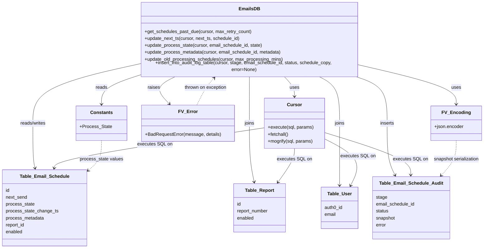

# Diagram: shipment_core/shipment_watchers/shipment_watchers/db/email/email_db.py

> Auto-generated by Obscura crawlers

## Mermaid

### SVG

<svg id="container" width="1652.2109375" xmlns="http://www.w3.org/2000/svg" class="classDiagram" height="848" viewBox="0 0 1652.2109375 848" role="graphics-document document" aria-roledescription="class"><g><defs><marker id="container_class-aggregationStart" class="marker aggregation class" refX="18" refY="7" markerWidth="190" markerHeight="240" orient="auto"><path d="M 18,7 L9,13 L1,7 L9,1 Z"></path></marker></defs><defs><marker id="container_class-aggregationEnd" class="marker aggregation class" refX="1" refY="7" markerWidth="20" markerHeight="28" orient="auto"><path d="M 18,7 L9,13 L1,7 L9,1 Z"></path></marker></defs><defs><marker id="container_class-extensionStart" class="marker extension class" refX="18" refY="7" markerWidth="190" markerHeight="240" orient="auto"><path d="M 1,7 L18,13 V 1 Z"></path></marker></defs><defs><marker id="container_class-extensionEnd" class="marker extension class" refX="1" refY="7" markerWidth="20" markerHeight="28" orient="auto"><path d="M 1,1 V 13 L18,7 Z"></path></marker></defs><defs><marker id="container_class-compositionStart" class="marker composition class" refX="18" refY="7" markerWidth="190" markerHeight="240" orient="auto"><path d="M 18,7 L9,13 L1,7 L9,1 Z"></path></marker></defs><defs><marker id="container_class-compositionEnd" class="marker composition class" refX="1" refY="7" markerWidth="20" markerHeight="28" orient="auto"><path d="M 18,7 L9,13 L1,7 L9,1 Z"></path></marker></defs><defs><marker id="container_class-dependencyStart" class="marker dependency class" refX="6" refY="7" markerWidth="190" markerHeight="240" orient="auto"><path d="M 5,7 L9,13 L1,7 L9,1 Z"></path></marker></defs><defs><marker id="container_class-dependencyEnd" class="marker dependency class" refX="13" refY="7" markerWidth="20" markerHeight="28" orient="auto"><path d="M 18,7 L9,13 L14,7 L9,1 Z"></path></marker></defs><defs><marker id="container_class-lollipopStart" class="marker lollipop class" refX="13" refY="7" markerWidth="190" markerHeight="240" orient="auto"><circle stroke="black" fill="transparent" cx="7" cy="7" r="6"></circle></marker></defs><defs><marker id="container_class-lollipopEnd" class="marker lollipop class" refX="1" refY="7" markerWidth="190" markerHeight="240" orient="auto"><circle stroke="black" fill="transparent" cx="7" cy="7" r="6"></circle></marker></defs><g class="root"><g class="clusters"></g><g class="edgePaths"><path d="M965.973,254L971.963,260.167C977.953,266.333,989.934,278.667,995.924,290C1001.914,301.333,1001.914,311.667,1001.914,316.833L1001.914,322" id="id_EmailsDB_Cursor_1" class="edge-thickness-normal edge-pattern-solid relation" style=";;;" data-edge="true" data-et="edge" data-id="id_EmailsDB_Cursor_1" data-points="W3sieCI6OTY1Ljk3Mjc1MzkwNjI1LCJ5IjoyNTR9LHsieCI6MTAwMS45MTQwNjI1LCJ5IjoyOTF9LHsieCI6MTAwMS45MTQwNjI1LCJ5IjozMjh9XQ==" marker-end="url(#container_class-dependencyEnd)"></path><path d="M1231.137,217.399L1285.748,229.666C1340.359,241.933,1449.582,266.466,1504.193,288.4C1558.805,310.333,1558.805,329.667,1558.805,339.333L1558.805,349" id="id_EmailsDB_FV_Encoding_2" class="edge-thickness-normal edge-pattern-solid relation" style=";;;" data-edge="true" data-et="edge" data-id="id_EmailsDB_FV_Encoding_2" data-points="W3sieCI6MTIzMS4xMzY3MTg3NSwieSI6MjE3LjM5OTA1MjM4MjIwNTg0fSx7IngiOjE1NTguODA0Njg3NSwieSI6MjkxfSx7IngiOjE1NTguODA0Njg3NSwieSI6MzU1fV0=" marker-end="url(#container_class-dependencyEnd)"></path><path d="M596.269,254L583.723,260.167C571.178,266.333,546.088,278.667,542.313,294.268C538.538,309.869,556.079,328.737,564.849,338.171L573.619,347.606" id="id_EmailsDB_FV_Error_3" class="edge-thickness-normal edge-pattern-solid relation" style=";;;" data-edge="true" data-et="edge" data-id="id_EmailsDB_FV_Error_3" data-points="W3sieCI6NTk2LjI2ODU2Njg5NDUzMTIsInkiOjI1NH0seyJ4Ijo1MjAuOTk4MDQ2ODc1LCJ5IjoyOTF9LHsieCI6NTc3LjcwNDE4MDMxNzU0MDQsInkiOjM1Mn1d" marker-end="url(#container_class-dependencyEnd)"></path><path d="M461.848,253.59L442.285,259.825C422.721,266.06,383.595,278.53,364.032,294.432C344.469,310.333,344.469,329.667,344.469,339.333L344.469,349" id="id_EmailsDB_Constants_4" class="edge-thickness-normal edge-pattern-solid relation" style=";;;" data-edge="true" data-et="edge" data-id="id_EmailsDB_Constants_4" data-points="W3sieCI6NDYxLjg0NzY1NjI1LCJ5IjoyNTMuNTkwMTQzMDE0OTg2Mn0seyJ4IjozNDQuNDY4NzUsInkiOjI5MX0seyJ4IjozNDQuNDY4NzUsInkiOjM1NX1d" marker-end="url(#container_class-dependencyEnd)"></path><path d="M461.848,214.681L403.38,227.4C344.911,240.12,227.975,265.56,169.507,298.947C111.039,332.333,111.039,373.667,111.039,415C111.039,456.333,111.039,497.667,112.256,523.526C113.473,549.386,115.906,559.772,117.123,564.965L118.34,570.158" id="id_EmailsDB_Table_Email_Schedule_5" class="edge-thickness-normal edge-pattern-solid relation" style=";;;" data-edge="true" data-et="edge" data-id="id_EmailsDB_Table_Email_Schedule_5" data-points="W3sieCI6NDYxLjg0NzY1NjI1LCJ5IjoyMTQuNjgwNTU0MDgwMTgwMTd9LHsieCI6MTExLjAzOTA2MjUsInkiOjI5MX0seyJ4IjoxMTEuMDM5MDYyNSwieSI6NDE1fSx7IngiOjExMS4wMzkwNjI1LCJ5Ijo1Mzl9LHsieCI6MTE5LjcwODM3MTg1NjUwODg4LCJ5Ijo1NzZ9XQ==" marker-end="url(#container_class-dependencyEnd)"></path><path d="M846.492,254L846.492,260.167C846.492,266.333,846.492,278.667,846.492,305.5C846.492,332.333,846.492,373.667,846.492,415C846.492,456.333,846.492,497.667,849.114,531.519C851.736,565.372,856.98,591.743,859.602,604.929L862.224,618.115" id="id_EmailsDB_Table_Report_6" class="edge-thickness-normal edge-pattern-solid relation" style=";;;" data-edge="true" data-et="edge" data-id="id_EmailsDB_Table_Report_6" data-points="W3sieCI6ODQ2LjQ5MjE4NzUsInkiOjI1NH0seyJ4Ijo4NDYuNDkyMTg3NSwieSI6MjkxfSx7IngiOjg0Ni40OTIxODc1LCJ5Ijo0MTV9LHsieCI6ODQ2LjQ5MjE4NzUsInkiOjUzOX0seyJ4Ijo4NjMuMzk0MzQ2MzM4NzU3NCwieSI6NjI0fV0=" marker-end="url(#container_class-dependencyEnd)"></path><path d="M1085.453,254L1097.434,260.167C1109.414,266.333,1133.375,278.667,1145.356,305.5C1157.336,332.333,1157.336,373.667,1157.336,415C1157.336,456.333,1157.336,497.667,1157.338,533.5C1157.341,569.333,1157.346,599.667,1157.348,614.833L1157.351,630" id="id_EmailsDB_Table_User_7" class="edge-thickness-normal edge-pattern-solid relation" style=";;;" data-edge="true" data-et="edge" data-id="id_EmailsDB_Table_User_7" data-points="W3sieCI6MTA4NS40NTMzMjAzMTI1LCJ5IjoyNTR9LHsieCI6MTE1Ny4zMzU5Mzc1LCJ5IjoyOTF9LHsieCI6MTE1Ny4zMzU5Mzc1LCJ5Ijo0MTV9LHsieCI6MTE1Ny4zMzU5Mzc1LCJ5Ijo1Mzl9LHsieCI6MTE1Ny4zNTE2MzE4NDE3MTYsInkiOjYzNn1d" marker-end="url(#container_class-dependencyEnd)"></path><path d="M1210.681,254L1228.94,260.167C1247.199,266.333,1283.717,278.667,1301.976,305.5C1320.234,332.333,1320.234,373.667,1320.234,415C1320.234,456.333,1320.234,497.667,1324.827,527.604C1329.421,557.541,1338.607,576.082,1343.2,585.353L1347.793,594.624" id="id_EmailsDB_Table_Email_Schedule_Audit_8" class="edge-thickness-normal edge-pattern-solid relation" style=";;;" data-edge="true" data-et="edge" data-id="id_EmailsDB_Table_Email_Schedule_Audit_8" data-points="W3sieCI6MTIxMC42ODE0OTQxNDA2MjUsInkiOjI1NH0seyJ4IjoxMzIwLjIzNDM3NSwieSI6MjkxfSx7IngiOjEzMjAuMjM0Mzc1LCJ5Ijo0MTV9LHsieCI6MTMyMC4yMzQzNzUsInkiOjUzOX0seyJ4IjoxMzUwLjQ1NjYxNTE5OTcwNDIsInkiOjYwMH1d" marker-end="url(#container_class-dependencyEnd)"></path><path d="M899.086,430.709L780.944,448.758C662.802,466.806,426.518,502.903,307.16,526.145C187.801,549.386,185.367,559.772,184.151,564.965L182.934,570.158" id="id_Cursor_Table_Email_Schedule_9" class="edge-thickness-normal edge-pattern-solid relation" style=";;;" data-edge="true" data-et="edge" data-id="id_Cursor_Table_Email_Schedule_9" data-points="W3sieCI6ODk5LjA4NTkzNzUsInkiOjQzMC43MDkwMTM5MDgyNzI3N30seyJ4IjoxOTAuMjM0Mzc1LCJ5Ijo1Mzl9LHsieCI6MTgxLjU2NTA2NTY0MzQ5MTEyLCJ5Ijo1NzZ9XQ==" marker-end="url(#container_class-dependencyEnd)"></path><path d="M1001.914,502L1001.914,508.167C1001.914,514.333,1001.914,526.667,992.287,546.189C982.661,565.711,963.407,592.422,953.781,605.777L944.154,619.133" id="id_Cursor_Table_Report_10" class="edge-thickness-normal edge-pattern-solid relation" style=";;;" data-edge="true" data-et="edge" data-id="id_Cursor_Table_Report_10" data-points="W3sieCI6MTAwMS45MTQwNjI1LCJ5Ijo1MDJ9LHsieCI6MTAwMS45MTQwNjI1LCJ5Ijo1Mzl9LHsieCI6OTQwLjY0NTQ1NTgwNjIxMywieSI6NjI0fV0=" marker-end="url(#container_class-dependencyEnd)"></path><path d="M1104.742,468.322L1127.458,480.102C1150.174,491.882,1195.607,515.441,1210.762,542.491C1225.918,569.541,1210.796,600.082,1203.235,615.352L1195.674,630.623" id="id_Cursor_Table_User_11" class="edge-thickness-normal edge-pattern-solid relation" style=";;;" data-edge="true" data-et="edge" data-id="id_Cursor_Table_User_11" data-points="W3sieCI6MTEwNC43NDIxODc1LCJ5Ijo0NjguMzIyMjY4Njg3OTI0NzV9LHsieCI6MTI0MS4wMzkwNjI1LCJ5Ijo1Mzl9LHsieCI6MTE5My4wMTIxMzQ4MDAyOTU4LCJ5Ijo2MzZ9XQ==" marker-end="url(#container_class-dependencyEnd)"></path><path d="M1104.742,447.076L1153.857,462.397C1202.971,477.717,1301.201,508.359,1350.561,532.846C1399.922,557.334,1400.414,575.668,1400.66,584.835L1400.906,594.002" id="id_Cursor_Table_Email_Schedule_Audit_12" class="edge-thickness-normal edge-pattern-solid relation" style=";;;" data-edge="true" data-et="edge" data-id="id_Cursor_Table_Email_Schedule_Audit_12" data-points="W3sieCI6MTEwNC43NDIxODc1LCJ5Ijo0NDcuMDc1OTQwNDExMTQ3Mzd9LHsieCI6MTM5OS40Mjk2ODc1LCJ5Ijo1Mzl9LHsieCI6MTQwMS4wNjY2MzczODkwNTMzLCJ5Ijo2MDB9XQ==" marker-end="url(#container_class-dependencyEnd)"></path><path d="M344.469,475L344.469,485.667C344.469,496.333,344.469,517.667,336.69,535.116C328.911,552.565,313.353,566.129,305.575,572.911L297.796,579.694" id="id_Constants_Table_Email_Schedule_13" class="edge-thickness-normal edge-pattern-dashed relation" style=";;;" data-edge="true" data-et="edge" data-id="id_Constants_Table_Email_Schedule_13" data-points="W3sieCI6MzQ0LjQ2ODc1LCJ5Ijo0NzV9LHsieCI6MzQ0LjQ2ODc1LCJ5Ijo1Mzl9LHsieCI6MjkzLjI3MzQzNzUsInkiOjU4My42MzY2MjU2MjIyMTYzfV0=" marker-end="url(#container_class-dependencyEnd)"></path><path d="M1558.805,475L1558.805,485.667C1558.805,496.333,1558.805,517.667,1550.165,537.763C1541.526,557.859,1524.248,576.717,1515.608,586.147L1506.969,595.576" id="id_FV_Encoding_Table_Email_Schedule_Audit_14" class="edge-thickness-normal edge-pattern-dashed relation" style=";;;" data-edge="true" data-et="edge" data-id="id_FV_Encoding_Table_Email_Schedule_Audit_14" data-points="W3sieCI6MTU1OC44MDQ2ODc1LCJ5Ijo0NzV9LHsieCI6MTU1OC44MDQ2ODc1LCJ5Ijo1Mzl9LHsieCI6MTUwMi45MTU3NDk4MTUwODg3LCJ5Ijo2MDB9XQ==" marker-end="url(#container_class-dependencyEnd)"></path><path d="M665.674,352L670.419,341.833C675.164,331.667,684.654,311.333,694.582,295.724C704.509,280.115,714.873,269.23,720.055,263.788L725.237,258.345" id="id_FV_Error_EmailsDB_15" class="edge-thickness-normal edge-pattern-dashed relation" style=";;;" data-edge="true" data-et="edge" data-id="id_FV_Error_EmailsDB_15" data-points="W3sieCI6NjY1LjY3Mzc2NTEyMDk2NzcsInkiOjM1Mn0seyJ4Ijo2OTQuMTQ0NTMxMjUsInkiOjI5MX0seyJ4Ijo3MjkuMzc0OTI2NzU3ODEyNSwieSI6MjU0fV0=" marker-end="url(#container_class-dependencyEnd)"></path></g><g class="edgeLabels"><g class="edgeLabel" transform="translate(1001.9140625, 291)"><g class="label" data-id="id_EmailsDB_Cursor_1" transform="translate(-16.4921875, -12)"><foreignObject width="32.984375" height="24">

uses

</foreignObject></g></g><g class="edgeLabel" transform="translate(1558.8046875, 291)"><g class="label" data-id="id_EmailsDB_FV_Encoding_2" transform="translate(-16.4921875, -12)"><foreignObject width="32.984375" height="24">

uses

</foreignObject></g></g><g class="edgeLabel" transform="translate(521.26129, 290.8706)"><g class="label" data-id="id_EmailsDB_FV_Error_3" transform="translate(-21.25, -12)"><foreignObject width="42.5" height="24">

raises

</foreignObject></g></g><g class="edgeLabel" transform="translate(344.46875, 291)"><g class="label" data-id="id_EmailsDB_Constants_4" transform="translate(-20.0078125, -12)"><foreignObject width="40.015625" height="24">

reads

</foreignObject></g></g><g class="edgeLabel" transform="translate(111.0390625, 415)"><g class="label" data-id="id_EmailsDB_Table_Email_Schedule_5" transform="translate(-45.9453125, -12)"><foreignObject width="91.890625" height="24">

reads/writes

</foreignObject></g></g><g class="edgeLabel" transform="translate(846.4921875, 415)"><g class="label" data-id="id_EmailsDB_Table_Report_6" transform="translate(-17.59375, -12)"><foreignObject width="35.1875" height="24">

joins

</foreignObject></g></g><g class="edgeLabel" transform="translate(1157.3359375, 415)"><g class="label" data-id="id_EmailsDB_Table_User_7" transform="translate(-17.59375, -12)"><foreignObject width="35.1875" height="24">

joins

</foreignObject></g></g><g class="edgeLabel" transform="translate(1320.234375, 415)"><g class="label" data-id="id_EmailsDB_Table_Email_Schedule_Audit_8" transform="translate(-24.7578125, -12)"><foreignObject width="49.515625" height="24">

inserts

</foreignObject></g></g><g class="edgeLabel" transform="translate(525.87705, 487.724)"><g class="label" data-id="id_Cursor_Table_Email_Schedule_9" transform="translate(-59.1953125, -12)"><foreignObject width="118.390625" height="24">

executes SQL on

</foreignObject></g></g><g class="edgeLabel" transform="translate(1001.9140625, 539)"><g class="label" data-id="id_Cursor_Table_Report_10" transform="translate(-59.1953125, -12)"><foreignObject width="118.390625" height="24">

executes SQL on

</foreignObject></g></g><g class="edgeLabel" transform="translate(1220.9345, 528.57463)"><g class="label" data-id="id_Cursor_Table_User_11" transform="translate(-59.1953125, -12)"><foreignObject width="118.390625" height="24">

executes SQL on

</foreignObject></g></g><g class="edgeLabel" transform="translate(1281.21272, 502.1237)"><g class="label" data-id="id_Cursor_Table_Email_Schedule_Audit_12" transform="translate(-59.1953125, -12)"><foreignObject width="118.390625" height="24">

executes SQL on

</foreignObject></g></g><g class="edgeLabel" transform="translate(344.46875, 539)"><g class="label" data-id="id_Constants_Table_Email_Schedule_13" transform="translate(-75.0390625, -12)"><foreignObject width="150.078125" height="24">

process_state values

</foreignObject></g></g><g class="edgeLabel" transform="translate(1558.8046875, 539)"><g class="label" data-id="id_FV_Encoding_Table_Email_Schedule_Audit_14" transform="translate(-80.1796875, -12)"><foreignObject width="160.359375" height="24">

snapshot serialization

</foreignObject></g></g><g class="edgeLabel" transform="translate(690.71302, 298.35218)"><g class="label" data-id="id_FV_Error_EmailsDB_15" transform="translate(-74.5, -12)"><foreignObject width="149" height="24">

thrown on exception

</foreignObject></g></g></g><g class="nodes"><g class="node default" id="classId-EmailsDB-0" transform="translate(846.4921875, 131)"><g class="basic label-container"><path d="M-384.64453125 -123 L384.64453125 -123 L384.64453125 123 L-384.64453125 123" stroke="none" stroke-width="0" fill="#ECECFF" style=""></path><path d="M-384.64453125 -123 C-203.2315246435061 -123, -21.81851803701221 -123, 384.64453125 -123 M-384.64453125 -123 C-137.35755107068857 -123, 109.92942910862286 -123, 384.64453125 -123 M384.64453125 -123 C384.64453125 -50.683699094303805, 384.64453125 21.63260181139239, 384.64453125 123 M384.64453125 -123 C384.64453125 -67.70060298639328, 384.64453125 -12.40120597278657, 384.64453125 123 M384.64453125 123 C174.51170267127014 123, -35.621125907459714 123, -384.64453125 123 M384.64453125 123 C230.31775159260238 123, 75.99097193520475 123, -384.64453125 123 M-384.64453125 123 C-384.64453125 56.47835862056765, -384.64453125 -10.043282758864706, -384.64453125 -123 M-384.64453125 123 C-384.64453125 67.65495046479276, -384.64453125 12.309900929585538, -384.64453125 -123" stroke="#9370DB" stroke-width="1.3" fill="none" stroke-dasharray="0 0" style=""></path></g><g class="annotation-group text" transform="translate(0, -99)"></g><g class="label-group text" transform="translate(-33.9140625, -99)"><g class="label" style="font-weight: bolder" transform="translate(0,-12)"><foreignObject width="67.828125" height="24">

EmailsDB

</foreignObject></g></g><g class="members-group text" transform="translate(-372.64453125, -51)"></g><g class="methods-group text" transform="translate(-372.64453125, -21)"><g class="label" style="" transform="translate(0,-12)"><foreignObject width="370.796875" height="24">

+get_schedules_past_due(cursor, max_retry_count)

</foreignObject></g><g class="label" style="" transform="translate(0,12)"><foreignObject width="331.28125" height="24">

+update_next_ts(cursor, next_ts, schedule_id)

</foreignObject></g><g class="label" style="" transform="translate(0,36)"><foreignObject width="410.046875" height="24">

+update_process_state(cursor, email_schedule_id, state)

</foreignObject></g><g class="label" style="" transform="translate(0,60)"><foreignObject width="476.734375" height="24">

+update_process_metadata(cursor, email_schedule_id, metadata)

</foreignObject></g><g class="label" style="" transform="translate(0,84)"><foreignObject width="480.15625" height="24">

+update_old_processing_schedules(cursor, max_processing_mins)

</foreignObject></g><g class="label" style="" transform="translate(0,108)"><foreignObject width="711.375" height="24">

+insert_into_audit_log_table(cursor, stage, email_schedule_id, status, schedule_copy, error=None)

</foreignObject></g></g><g class="divider" style=""><path d="M-384.64453125 -75 C-114.37837462632257 -75, 155.88778199735486 -75, 384.64453125 -75 M-384.64453125 -75 C-116.18102962871319 -75, 152.28247199257362 -75, 384.64453125 -75" stroke="#9370DB" stroke-width="1.3" fill="none" stroke-dasharray="0 0" style=""></path></g><g class="divider" style=""><path d="M-384.64453125 -51 C-130.86017281519042 -51, 122.92418561961915 -51, 384.64453125 -51 M-384.64453125 -51 C-217.71690099424464 -51, -50.78927073848928 -51, 384.64453125 -51" stroke="#9370DB" stroke-width="1.3" fill="none" stroke-dasharray="0 0" style=""></path></g></g><g class="node default" id="classId-Cursor-1" transform="translate(1001.9140625, 415)"><g class="basic label-container"><path d="M-102.828125 -87 L102.828125 -87 L102.828125 87 L-102.828125 87" stroke="none" stroke-width="0" fill="#ECECFF" style=""></path><path d="M-102.828125 -87 C-37.36315629384707 -87, 28.10181241230586 -87, 102.828125 -87 M-102.828125 -87 C-55.2840887251932 -87, -7.7400524503864006 -87, 102.828125 -87 M102.828125 -87 C102.828125 -25.52740567741644, 102.828125 35.94518864516712, 102.828125 87 M102.828125 -87 C102.828125 -47.759319841414325, 102.828125 -8.518639682828649, 102.828125 87 M102.828125 87 C46.621580860042016 87, -9.584963279915968 87, -102.828125 87 M102.828125 87 C32.35364725249407 87, -38.12083049501186 87, -102.828125 87 M-102.828125 87 C-102.828125 48.20160082196274, -102.828125 9.403201643925485, -102.828125 -87 M-102.828125 87 C-102.828125 30.910736963418685, -102.828125 -25.17852607316263, -102.828125 -87" stroke="#9370DB" stroke-width="1.3" fill="none" stroke-dasharray="0 0" style=""></path></g><g class="annotation-group text" transform="translate(0, -63)"></g><g class="label-group text" transform="translate(-23.90625, -63)"><g class="label" style="font-weight: bolder" transform="translate(0,-12)"><foreignObject width="47.8125" height="24">

Cursor

</foreignObject></g></g><g class="members-group text" transform="translate(-90.828125, -15)"></g><g class="methods-group text" transform="translate(-90.828125, 15)"><g class="label" style="" transform="translate(0,-12)"><foreignObject width="157.75" height="24">

+execute(sql, params)

</foreignObject></g><g class="label" style="" transform="translate(0,12)"><foreignObject width="72.515625" height="24">

+fetchall()

</foreignObject></g><g class="label" style="" transform="translate(0,36)"><foreignObject width="157.078125" height="24">

+mogrify(sql, params)

</foreignObject></g></g><g class="divider" style=""><path d="M-102.828125 -39 C-40.76375418217053 -39, 21.30061663565894 -39, 102.828125 -39 M-102.828125 -39 C-28.033878452427075 -39, 46.76036809514585 -39, 102.828125 -39" stroke="#9370DB" stroke-width="1.3" fill="none" stroke-dasharray="0 0" style=""></path></g><g class="divider" style=""><path d="M-102.828125 -15 C-34.749097038540754 -15, 33.32993092291849 -15, 102.828125 -15 M-102.828125 -15 C-23.174284920697687 -15, 56.479555158604626 -15, 102.828125 -15" stroke="#9370DB" stroke-width="1.3" fill="none" stroke-dasharray="0 0" style=""></path></g></g><g class="node default" id="classId-FV_Encoding-2" transform="translate(1558.8046875, 415)"><g class="basic label-container"><path d="M-85.40625 -60 L85.40625 -60 L85.40625 60 L-85.40625 60" stroke="none" stroke-width="0" fill="#ECECFF" style=""></path><path d="M-85.40625 -60 C-48.96930442540437 -60, -12.532358850808734 -60, 85.40625 -60 M-85.40625 -60 C-33.291798124268794 -60, 18.82265375146241 -60, 85.40625 -60 M85.40625 -60 C85.40625 -16.506879861533562, 85.40625 26.986240276932875, 85.40625 60 M85.40625 -60 C85.40625 -20.96744390795343, 85.40625 18.065112184093138, 85.40625 60 M85.40625 60 C45.89718413522487 60, 6.388118270449738 60, -85.40625 60 M85.40625 60 C30.160913670792723 60, -25.084422658414553 60, -85.40625 60 M-85.40625 60 C-85.40625 27.94230743634553, -85.40625 -4.11538512730894, -85.40625 -60 M-85.40625 60 C-85.40625 18.151255164546164, -85.40625 -23.69748967090767, -85.40625 -60" stroke="#9370DB" stroke-width="1.3" fill="none" stroke-dasharray="0 0" style=""></path></g><g class="annotation-group text" transform="translate(0, -36)"></g><g class="label-group text" transform="translate(-45.390625, -36)"><g class="label" style="font-weight: bolder" transform="translate(0,-12)"><foreignObject width="90.78125" height="24">

FV_Encoding

</foreignObject></g></g><g class="members-group text" transform="translate(-73.40625, 12)"><g class="label" style="" transform="translate(0,-12)"><foreignObject width="101.421875" height="24">

+json.encoder

</foreignObject></g></g><g class="methods-group text" transform="translate(-73.40625, 60)"></g><g class="divider" style=""><path d="M-85.40625 -12 C-35.89019174149227 -12, 13.625866517015453 -12, 85.40625 -12 M-85.40625 -12 C-24.012434158875507 -12, 37.381381682248985 -12, 85.40625 -12" stroke="#9370DB" stroke-width="1.3" fill="none" stroke-dasharray="0 0" style=""></path></g><g class="divider" style=""><path d="M-85.40625 36 C-41.77437170204775 36, 1.8575065959044963 36, 85.40625 36 M-85.40625 36 C-24.870396029197458 36, 35.665457941605084 36, 85.40625 36" stroke="#9370DB" stroke-width="1.3" fill="none" stroke-dasharray="0 0" style=""></path></g></g><g class="node default" id="classId-FV_Error-3" transform="translate(636.26953125, 415)"><g class="basic label-container"><path d="M-157.6015625 -63 L157.6015625 -63 L157.6015625 63 L-157.6015625 63" stroke="none" stroke-width="0" fill="#ECECFF" style=""></path><path d="M-157.6015625 -63 C-50.53620454142532 -63, 56.52915341714936 -63, 157.6015625 -63 M-157.6015625 -63 C-33.8930613388068 -63, 89.8154398223864 -63, 157.6015625 -63 M157.6015625 -63 C157.6015625 -22.216371215413304, 157.6015625 18.567257569173393, 157.6015625 63 M157.6015625 -63 C157.6015625 -16.179857195334264, 157.6015625 30.64028560933147, 157.6015625 63 M157.6015625 63 C72.5805655178606 63, -12.440431464278788 63, -157.6015625 63 M157.6015625 63 C64.88737557351887 63, -27.826811352962267 63, -157.6015625 63 M-157.6015625 63 C-157.6015625 21.66104626581607, -157.6015625 -19.677907468367863, -157.6015625 -63 M-157.6015625 63 C-157.6015625 19.694218110131274, -157.6015625 -23.611563779737452, -157.6015625 -63" stroke="#9370DB" stroke-width="1.3" fill="none" stroke-dasharray="0 0" style=""></path></g><g class="annotation-group text" transform="translate(0, -39)"></g><g class="label-group text" transform="translate(-30.40625, -39)"><g class="label" style="font-weight: bolder" transform="translate(0,-12)"><foreignObject width="60.8125" height="24">

FV_Error

</foreignObject></g></g><g class="members-group text" transform="translate(-145.6015625, 9)"></g><g class="methods-group text" transform="translate(-145.6015625, 39)"><g class="label" style="" transform="translate(0,-12)"><foreignObject width="260.796875" height="24">

+BadRequestError(message, details)

</foreignObject></g></g><g class="divider" style=""><path d="M-157.6015625 -15 C-43.0352381621241 -15, 71.5310861757518 -15, 157.6015625 -15 M-157.6015625 -15 C-82.31270367638204 -15, -7.0238448527640855 -15, 157.6015625 -15" stroke="#9370DB" stroke-width="1.3" fill="none" stroke-dasharray="0 0" style=""></path></g><g class="divider" style=""><path d="M-157.6015625 9 C-75.63109586839221 9, 6.339370763215584 9, 157.6015625 9 M-157.6015625 9 C-79.07798447566094 9, -0.5544064513218814 9, 157.6015625 9" stroke="#9370DB" stroke-width="1.3" fill="none" stroke-dasharray="0 0" style=""></path></g></g><g class="node default" id="classId-Constants-4" transform="translate(344.46875, 415)"><g class="basic label-container"><path d="M-84.19921875 -60 L84.19921875 -60 L84.19921875 60 L-84.19921875 60" stroke="none" stroke-width="0" fill="#ECECFF" style=""></path><path d="M-84.19921875 -60 C-29.342492424985466 -60, 25.51423390002907 -60, 84.19921875 -60 M-84.19921875 -60 C-35.83497677638401 -60, 12.529265197231979 -60, 84.19921875 -60 M84.19921875 -60 C84.19921875 -22.710318243384002, 84.19921875 14.579363513231996, 84.19921875 60 M84.19921875 -60 C84.19921875 -17.927643046703857, 84.19921875 24.144713906592287, 84.19921875 60 M84.19921875 60 C45.77449486075693 60, 7.349770971513863 60, -84.19921875 60 M84.19921875 60 C20.634531419805754 60, -42.93015591038849 60, -84.19921875 60 M-84.19921875 60 C-84.19921875 25.907869472551553, -84.19921875 -8.184261054896893, -84.19921875 -60 M-84.19921875 60 C-84.19921875 16.537030256969885, -84.19921875 -26.92593948606023, -84.19921875 -60" stroke="#9370DB" stroke-width="1.3" fill="none" stroke-dasharray="0 0" style=""></path></g><g class="annotation-group text" transform="translate(0, -36)"></g><g class="label-group text" transform="translate(-36.5390625, -36)"><g class="label" style="font-weight: bolder" transform="translate(0,-12)"><foreignObject width="73.078125" height="24">

Constants

</foreignObject></g></g><g class="members-group text" transform="translate(-72.19921875, 12)"><g class="label" style="" transform="translate(0,-12)"><foreignObject width="107.859375" height="24">

+Process_State

</foreignObject></g></g><g class="methods-group text" transform="translate(-72.19921875, 60)"></g><g class="divider" style=""><path d="M-84.19921875 -12 C-48.94629801992564 -12, -13.693377289851284 -12, 84.19921875 -12 M-84.19921875 -12 C-38.23199850613061 -12, 7.735221737738783 -12, 84.19921875 -12" stroke="#9370DB" stroke-width="1.3" fill="none" stroke-dasharray="0 0" style=""></path></g><g class="divider" style=""><path d="M-84.19921875 36 C-39.76898718949644 36, 4.661244371007115 36, 84.19921875 36 M-84.19921875 36 C-26.057222007733607 36, 32.084774734532786 36, 84.19921875 36" stroke="#9370DB" stroke-width="1.3" fill="none" stroke-dasharray="0 0" style=""></path></g></g><g class="node default" id="classId-Table_Email_Schedule-5" transform="translate(150.63671875, 708)"><g class="basic label-container"><path d="M-142.63671875 -132 L142.63671875 -132 L142.63671875 132 L-142.63671875 132" stroke="none" stroke-width="0" fill="#ECECFF" style=""></path><path d="M-142.63671875 -132 C-32.54618448045704 -132, 77.54434978908591 -132, 142.63671875 -132 M-142.63671875 -132 C-30.638200747958393 -132, 81.36031725408321 -132, 142.63671875 -132 M142.63671875 -132 C142.63671875 -57.186493015662194, 142.63671875 17.627013968675612, 142.63671875 132 M142.63671875 -132 C142.63671875 -63.99792001330243, 142.63671875 4.004159973395133, 142.63671875 132 M142.63671875 132 C52.043842639544096 132, -38.54903347091181 132, -142.63671875 132 M142.63671875 132 C33.53900961706803 132, -75.55869951586394 132, -142.63671875 132 M-142.63671875 132 C-142.63671875 36.924613053429596, -142.63671875 -58.15077389314081, -142.63671875 -132 M-142.63671875 132 C-142.63671875 61.706667716410806, -142.63671875 -8.586664567178389, -142.63671875 -132" stroke="#9370DB" stroke-width="1.3" fill="none" stroke-dasharray="0 0" style=""></path></g><g class="annotation-group text" transform="translate(0, -108)"></g><g class="label-group text" transform="translate(-81.3046875, -108)"><g class="label" style="font-weight: bolder" transform="translate(0,-12)"><foreignObject width="162.609375" height="24">

Table_Email_Schedule

</foreignObject></g></g><g class="members-group text" transform="translate(-130.63671875, -60)"><g class="label" style="" transform="translate(0,-12)"><foreignObject width="14.09375" height="24">

id

</foreignObject></g><g class="label" style="" transform="translate(0,12)"><foreignObject width="74.953125" height="24">

next_send

</foreignObject></g><g class="label" style="" transform="translate(0,36)"><foreignObject width="99.484375" height="24">

process_state

</foreignObject></g><g class="label" style="" transform="translate(0,60)"><foreignObject width="179.96875" height="24">

process_state_change_ts

</foreignObject></g><g class="label" style="" transform="translate(0,84)"><foreignObject width="132.828125" height="24">

process_metadata

</foreignObject></g><g class="label" style="" transform="translate(0,108)"><foreignObject width="67.625" height="24">

report_id

</foreignObject></g><g class="label" style="" transform="translate(0,132)"><foreignObject width="59.203125" height="24">

enabled

</foreignObject></g></g><g class="methods-group text" transform="translate(-130.63671875, 132)"></g><g class="divider" style=""><path d="M-142.63671875 -84 C-35.895775455005946 -84, 70.84516783998811 -84, 142.63671875 -84 M-142.63671875 -84 C-57.927432476127194 -84, 26.78185379774561 -84, 142.63671875 -84" stroke="#9370DB" stroke-width="1.3" fill="none" stroke-dasharray="0 0" style=""></path></g><g class="divider" style=""><path d="M-142.63671875 108 C-76.65239230948188 108, -10.668065868963765 108, 142.63671875 108 M-142.63671875 108 C-33.9989784312576 108, 74.6387618874848 108, 142.63671875 108" stroke="#9370DB" stroke-width="1.3" fill="none" stroke-dasharray="0 0" style=""></path></g></g><g class="node default" id="classId-Table_Report-6" transform="translate(880.09765625, 708)"><g class="basic label-container"><path d="M-91.578125 -84 L91.578125 -84 L91.578125 84 L-91.578125 84" stroke="none" stroke-width="0" fill="#ECECFF" style=""></path><path d="M-91.578125 -84 C-48.59004169479204 -84, -5.601958389584084 -84, 91.578125 -84 M-91.578125 -84 C-20.397011363912057 -84, 50.784102272175886 -84, 91.578125 -84 M91.578125 -84 C91.578125 -45.91375925500136, 91.578125 -7.827518510002719, 91.578125 84 M91.578125 -84 C91.578125 -40.61308011646382, 91.578125 2.77383976707236, 91.578125 84 M91.578125 84 C37.218050600020455 84, -17.14202379995909 84, -91.578125 84 M91.578125 84 C23.89545415620543 84, -43.78721668758914 84, -91.578125 84 M-91.578125 84 C-91.578125 24.430996796677206, -91.578125 -35.13800640664559, -91.578125 -84 M-91.578125 84 C-91.578125 43.69316395232401, -91.578125 3.386327904648013, -91.578125 -84" stroke="#9370DB" stroke-width="1.3" fill="none" stroke-dasharray="0 0" style=""></path></g><g class="annotation-group text" transform="translate(0, -60)"></g><g class="label-group text" transform="translate(-48.8125, -60)"><g class="label" style="font-weight: bolder" transform="translate(0,-12)"><foreignObject width="97.625" height="24">

Table_Report

</foreignObject></g></g><g class="members-group text" transform="translate(-79.578125, -12)"><g class="label" style="" transform="translate(0,-12)"><foreignObject width="14.09375" height="24">

id

</foreignObject></g><g class="label" style="" transform="translate(0,12)"><foreignObject width="110.34375" height="24">

report_number

</foreignObject></g><g class="label" style="" transform="translate(0,36)"><foreignObject width="59.203125" height="24">

enabled

</foreignObject></g></g><g class="methods-group text" transform="translate(-79.578125, 84)"></g><g class="divider" style=""><path d="M-91.578125 -36 C-24.931668202387513 -36, 41.714788595224974 -36, 91.578125 -36 M-91.578125 -36 C-40.36683975474779 -36, 10.844445490504427 -36, 91.578125 -36" stroke="#9370DB" stroke-width="1.3" fill="none" stroke-dasharray="0 0" style=""></path></g><g class="divider" style=""><path d="M-91.578125 60 C-34.79512812289314 60, 21.98786875421372 60, 91.578125 60 M-91.578125 60 C-19.53529840574322 60, 52.50752818851356 60, 91.578125 60" stroke="#9370DB" stroke-width="1.3" fill="none" stroke-dasharray="0 0" style=""></path></g></g><g class="node default" id="classId-Table_User-7" transform="translate(1157.36328125, 708)"><g class="basic label-container"><path d="M-64.140625 -72 L64.140625 -72 L64.140625 72 L-64.140625 72" stroke="none" stroke-width="0" fill="#ECECFF" style=""></path><path d="M-64.140625 -72 C-22.997555908215716 -72, 18.145513183568568 -72, 64.140625 -72 M-64.140625 -72 C-14.838202604995473 -72, 34.464219790009054 -72, 64.140625 -72 M64.140625 -72 C64.140625 -29.008872201195487, 64.140625 13.982255597609026, 64.140625 72 M64.140625 -72 C64.140625 -38.41631567211674, 64.140625 -4.8326313442334765, 64.140625 72 M64.140625 72 C14.583271720289154 72, -34.97408155942169 72, -64.140625 72 M64.140625 72 C24.53296216639231 72, -15.074700667215382 72, -64.140625 72 M-64.140625 72 C-64.140625 25.230885633295948, -64.140625 -21.538228733408104, -64.140625 -72 M-64.140625 72 C-64.140625 38.658475379098775, -64.140625 5.3169507581975495, -64.140625 -72" stroke="#9370DB" stroke-width="1.3" fill="none" stroke-dasharray="0 0" style=""></path></g><g class="annotation-group text" transform="translate(0, -48)"></g><g class="label-group text" transform="translate(-40.25, -48)"><g class="label" style="font-weight: bolder" transform="translate(0,-12)"><foreignObject width="80.5" height="24">

Table_User

</foreignObject></g></g><g class="members-group text" transform="translate(-52.140625, 0)"><g class="label" style="" transform="translate(0,-12)"><foreignObject width="64.03125" height="24">

auth0_id

</foreignObject></g><g class="label" style="" transform="translate(0,12)"><foreignObject width="40.34375" height="24">

email

</foreignObject></g></g><g class="methods-group text" transform="translate(-52.140625, 72)"></g><g class="divider" style=""><path d="M-64.140625 -24 C-24.135044023079672 -24, 15.870536953840656 -24, 64.140625 -24 M-64.140625 -24 C-36.29329415242407 -24, -8.445963304848142 -24, 64.140625 -24" stroke="#9370DB" stroke-width="1.3" fill="none" stroke-dasharray="0 0" style=""></path></g><g class="divider" style=""><path d="M-64.140625 48 C-25.306901189048318 48, 13.526822621903364 48, 64.140625 48 M-64.140625 48 C-38.26361336653825 48, -12.38660173307651 48, 64.140625 48" stroke="#9370DB" stroke-width="1.3" fill="none" stroke-dasharray="0 0" style=""></path></g></g><g class="node default" id="classId-Table_Email_Schedule_Audit-8" transform="translate(1403.96484375, 708)"><g class="basic label-container"><path d="M-132.4609375 -108 L132.4609375 -108 L132.4609375 108 L-132.4609375 108" stroke="none" stroke-width="0" fill="#ECECFF" style=""></path><path d="M-132.4609375 -108 C-32.39658081619757 -108, 67.66777586760486 -108, 132.4609375 -108 M-132.4609375 -108 C-48.215781514632795 -108, 36.02937447073441 -108, 132.4609375 -108 M132.4609375 -108 C132.4609375 -28.841963170545867, 132.4609375 50.316073658908266, 132.4609375 108 M132.4609375 -108 C132.4609375 -34.443197749221696, 132.4609375 39.11360450155661, 132.4609375 108 M132.4609375 108 C78.05831233966182 108, 23.655687179323664 108, -132.4609375 108 M132.4609375 108 C43.198742809985006 108, -46.06345188002999 108, -132.4609375 108 M-132.4609375 108 C-132.4609375 45.22182702553424, -132.4609375 -17.556345948931522, -132.4609375 -108 M-132.4609375 108 C-132.4609375 22.529483030911493, -132.4609375 -62.941033938177014, -132.4609375 -108" stroke="#9370DB" stroke-width="1.3" fill="none" stroke-dasharray="0 0" style=""></path></g><g class="annotation-group text" transform="translate(0, -84)"></g><g class="label-group text" transform="translate(-104.75, -84)"><g class="label" style="font-weight: bolder" transform="translate(0,-12)"><foreignObject width="209.5" height="24">

Table_Email_Schedule_Audit

</foreignObject></g></g><g class="members-group text" transform="translate(-120.4609375, -36)"><g class="label" style="" transform="translate(0,-12)"><foreignObject width="38.46875" height="24">

stage

</foreignObject></g><g class="label" style="" transform="translate(0,12)"><foreignObject width="136.171875" height="24">

email_schedule_id

</foreignObject></g><g class="label" style="" transform="translate(0,36)"><foreignObject width="44.40625" height="24">

status

</foreignObject></g><g class="label" style="" transform="translate(0,60)"><foreignObject width="67.03125" height="24">

snapshot

</foreignObject></g><g class="label" style="" transform="translate(0,84)"><foreignObject width="36.125" height="24">

error

</foreignObject></g></g><g class="methods-group text" transform="translate(-120.4609375, 108)"></g><g class="divider" style=""><path d="M-132.4609375 -60 C-54.17370369768301 -60, 24.11353010463398 -60, 132.4609375 -60 M-132.4609375 -60 C-66.67391409505187 -60, -0.8868906901037406 -60, 132.4609375 -60" stroke="#9370DB" stroke-width="1.3" fill="none" stroke-dasharray="0 0" style=""></path></g><g class="divider" style=""><path d="M-132.4609375 84 C-59.262400383539486 84, 13.936136732921028 84, 132.4609375 84 M-132.4609375 84 C-53.89755284147208 84, 24.665831817055846 84, 132.4609375 84" stroke="#9370DB" stroke-width="1.3" fill="none" stroke-dasharray="0 0" style=""></path></g></g></g></g></g></svg>
