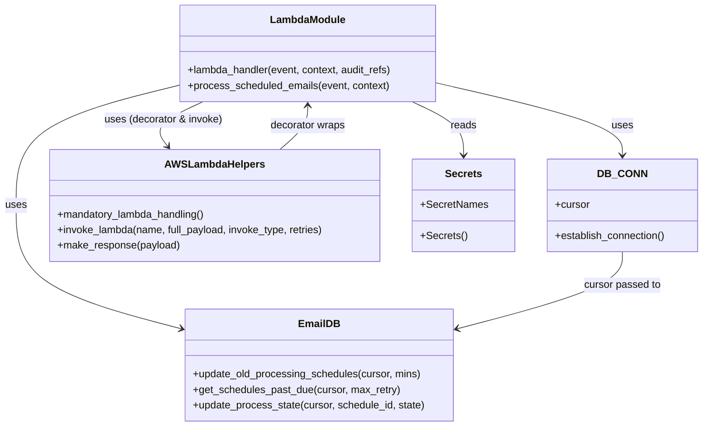

# Diagram: shipment_core/shipment_watchers/shipment_watchers/email/email_watcher.py


> Auto-generated by Obscura crawlers

## Diagram 1

```mermaid
flowchart TD
    A[Event Trigger] --> B[lambda_handler]
    B --> C{try / timeout}
    C -->|calls| D[process_scheduled_emails]
    D --> E[DB_CONN.establish_connection()]
    D --> F[update_old_processing_schedules(cursor, MAX_PROCESSING_MINS)]
    D --> G[get_schedules_past_due(cursor, MAX_RETRY_COUNT)]
    G -->|if schedules_past_due| H[for each schedule]
    H --> I[update_process_state(..., PROCESSING)]
    H --> J[deepcopy(event) -> event_copy]
    H --> K[invoke_lambda("send_report_email", event_copy, Event)]
    C -->|exception| L[log error]
    D -->|exception| L
```

> SVG rendering failed for this diagram.

## Diagram 2



### SVG

<svg id="container" width="1083.890625" xmlns="http://www.w3.org/2000/svg" class="classDiagram" height="662" viewBox="0 0 1083.890625 662" role="graphics-document document" aria-roledescription="class"><style>#container{font-family:"trebuchet ms",verdana,arial,sans-serif;font-size:16px;fill:#333;}@keyframes edge-animation-frame{from{stroke-dashoffset:0;}}@keyframes dash{to{stroke-dashoffset:0;}}#container .edge-animation-slow{stroke-dasharray:9,5!important;stroke-dashoffset:900;animation:dash 50s linear infinite;stroke-linecap:round;}#container .edge-animation-fast{stroke-dasharray:9,5!important;stroke-dashoffset:900;animation:dash 20s linear infinite;stroke-linecap:round;}#container .error-icon{fill:#552222;}#container .error-text{fill:#552222;stroke:#552222;}#container .edge-thickness-normal{stroke-width:1px;}#container .edge-thickness-thick{stroke-width:3.5px;}#container .edge-pattern-solid{stroke-dasharray:0;}#container .edge-thickness-invisible{stroke-width:0;fill:none;}#container .edge-pattern-dashed{stroke-dasharray:3;}#container .edge-pattern-dotted{stroke-dasharray:2;}#container .marker{fill:#333333;stroke:#333333;}#container .marker.cross{stroke:#333333;}#container svg{font-family:"trebuchet ms",verdana,arial,sans-serif;font-size:16px;}#container p{margin:0;}#container g.classGroup text{fill:#9370DB;stroke:none;font-family:"trebuchet ms",verdana,arial,sans-serif;font-size:10px;}#container g.classGroup text .title{font-weight:bolder;}#container .nodeLabel,#container .edgeLabel{color:#131300;}#container .edgeLabel .label rect{fill:#ECECFF;}#container .label text{fill:#131300;}#container .labelBkg{background:#ECECFF;}#container .edgeLabel .label span{background:#ECECFF;}#container .classTitle{font-weight:bolder;}#container .node rect,#container .node circle,#container .node ellipse,#container .node polygon,#container .node path{fill:#ECECFF;stroke:#9370DB;stroke-width:1px;}#container .divider{stroke:#9370DB;stroke-width:1;}#container g.clickable{cursor:pointer;}#container g.classGroup rect{fill:#ECECFF;stroke:#9370DB;}#container g.classGroup line{stroke:#9370DB;stroke-width:1;}#container .classLabel .box{stroke:none;stroke-width:0;fill:#ECECFF;opacity:0.5;}#container .classLabel .label{fill:#9370DB;font-size:10px;}#container .relation{stroke:#333333;stroke-width:1;fill:none;}#container .dashed-line{stroke-dasharray:3;}#container .dotted-line{stroke-dasharray:1 2;}#container #compositionStart,#container .composition{fill:#333333!important;stroke:#333333!important;stroke-width:1;}#container #compositionEnd,#container .composition{fill:#333333!important;stroke:#333333!important;stroke-width:1;}#container #dependencyStart,#container .dependency{fill:#333333!important;stroke:#333333!important;stroke-width:1;}#container #dependencyStart,#container .dependency{fill:#333333!important;stroke:#333333!important;stroke-width:1;}#container #extensionStart,#container .extension{fill:transparent!important;stroke:#333333!important;stroke-width:1;}#container #extensionEnd,#container .extension{fill:transparent!important;stroke:#333333!important;stroke-width:1;}#container #aggregationStart,#container .aggregation{fill:transparent!important;stroke:#333333!important;stroke-width:1;}#container #aggregationEnd,#container .aggregation{fill:transparent!important;stroke:#333333!important;stroke-width:1;}#container #lollipopStart,#container .lollipop{fill:#ECECFF!important;stroke:#333333!important;stroke-width:1;}#container #lollipopEnd,#container .lollipop{fill:#ECECFF!important;stroke:#333333!important;stroke-width:1;}#container .edgeTerminals{font-size:11px;line-height:initial;}#container .classTitleText{text-anchor:middle;font-size:18px;fill:#333;}#container .label-icon{display:inline-block;height:1em;overflow:visible;vertical-align:-0.125em;}#container .node .label-icon path{fill:currentColor;stroke:revert;stroke-width:revert;}#container :root{--mermaid-font-family:"trebuchet ms",verdana,arial,sans-serif;}</style><g><defs><marker id="container_class-aggregationStart" class="marker aggregation class" refX="18" refY="7" markerWidth="190" markerHeight="240" orient="auto"><path d="M 18,7 L9,13 L1,7 L9,1 Z"></path></marker></defs><defs><marker id="container_class-aggregationEnd" class="marker aggregation class" refX="1" refY="7" markerWidth="20" markerHeight="28" orient="auto"><path d="M 18,7 L9,13 L1,7 L9,1 Z"></path></marker></defs><defs><marker id="container_class-extensionStart" class="marker extension class" refX="18" refY="7" markerWidth="190" markerHeight="240" orient="auto"><path d="M 1,7 L18,13 V 1 Z"></path></marker></defs><defs><marker id="container_class-extensionEnd" class="marker extension class" refX="1" refY="7" markerWidth="20" markerHeight="28" orient="auto"><path d="M 1,1 V 13 L18,7 Z"></path></marker></defs><defs><marker id="container_class-compositionStart" class="marker composition class" refX="18" refY="7" markerWidth="190" markerHeight="240" orient="auto"><path d="M 18,7 L9,13 L1,7 L9,1 Z"></path></marker></defs><defs><marker id="container_class-compositionEnd" class="marker composition class" refX="1" refY="7" markerWidth="20" markerHeight="28" orient="auto"><path d="M 18,7 L9,13 L1,7 L9,1 Z"></path></marker></defs><defs><marker id="container_class-dependencyStart" class="marker dependency class" refX="6" refY="7" markerWidth="190" markerHeight="240" orient="auto"><path d="M 5,7 L9,13 L1,7 L9,1 Z"></path></marker></defs><defs><marker id="container_class-dependencyEnd" class="marker dependency class" refX="13" refY="7" markerWidth="20" markerHeight="28" orient="auto"><path d="M 18,7 L9,13 L14,7 L9,1 Z"></path></marker></defs><defs><marker id="container_class-lollipopStart" class="marker lollipop class" refX="13" refY="7" markerWidth="190" markerHeight="240" orient="auto"><circle stroke="black" fill="transparent" cx="7" cy="7" r="6"></circle></marker></defs><defs><marker id="container_class-lollipopEnd" class="marker lollipop class" refX="1" refY="7" markerWidth="190" markerHeight="240" orient="auto"><circle stroke="black" fill="transparent" cx="7" cy="7" r="6"></circle></marker></defs><g class="root"><g class="clusters"></g><g class="edgePaths"><path d="M677.102,129.511L724.26,140.425C771.419,151.34,865.737,173.17,912.896,191.752C960.055,210.333,960.055,225.667,960.055,233.333L960.055,241" id="id_LambdaModule_DB_CONN_1" class="edge-thickness-normal edge-pattern-solid relation" style=";;;" data-edge="true" data-et="edge" data-id="id_LambdaModule_DB_CONN_1" data-points="W3sieCI6Njc3LjEwMTU2MjUsInkiOjEyOS41MTA1NTg2MDUxMDE3Mn0seyJ4Ijo5NjAuMDU0Njg3NSwieSI6MTk1fSx7IngiOjk2MC4wNTQ2ODc1LCJ5IjoyNDd9XQ==" marker-end="url(#container_class-dependencyEnd)"></path><path d="M275.195,132.832L233.411,143.193C191.628,153.554,108.06,174.277,66.276,205.305C24.492,236.333,24.492,277.667,24.492,319C24.492,360.333,24.492,401.667,66.869,433.567C109.245,465.466,193.998,487.933,236.375,499.166L278.751,510.399" id="id_LambdaModule_EmailDB_2" class="edge-thickness-normal edge-pattern-solid relation" style=";;;" data-edge="true" data-et="edge" data-id="id_LambdaModule_EmailDB_2" data-points="W3sieCI6Mjc1LjE5NTMxMjUsInkiOjEzMi44MzE1OTIwNTcwMTI0fSx7IngiOjI0LjQ5MjE4NzUsInkiOjE5NX0seyJ4IjoyNC40OTIxODc1LCJ5IjozMTl9LHsieCI6MjQuNDkyMTg3NSwieSI6NDQzfSx7IngiOjI4NC41NTA3ODEyNSwieSI6NTExLjkzNjYzNTcxMzgwODV9XQ==" marker-end="url(#container_class-dependencyEnd)"></path><path d="M314.936,158L301.681,164.167C288.425,170.333,261.915,182.667,252.914,194.216C243.914,205.764,252.424,216.529,256.679,221.911L260.934,227.293" id="id_LambdaModule_AWSLambdaHelpers_3" class="edge-thickness-normal edge-pattern-solid relation" style=";;;" data-edge="true" data-et="edge" data-id="id_LambdaModule_AWSLambdaHelpers_3" data-points="W3sieCI6MzE0LjkzNTg0MzMzMTQ3MzIsInkiOjE1OH0seyJ4IjoyMzUuNDA0Mjk2ODc1LCJ5IjoxOTV9LHsieCI6MjY0LjY1NDk3NDE2ODM0Njc3LCJ5IjoyMzJ9XQ==" marker-end="url(#container_class-dependencyEnd)"></path><path d="M637.802,158L651.093,164.167C664.385,170.333,690.968,182.667,704.259,196.5C717.551,210.333,717.551,225.667,717.551,233.333L717.551,241" id="id_LambdaModule_Secrets_4" class="edge-thickness-normal edge-pattern-solid relation" style=";;;" data-edge="true" data-et="edge" data-id="id_LambdaModule_Secrets_4" data-points="W3sieCI6NjM3LjgwMTc5MjY4OTczMjEsInkiOjE1OH0seyJ4Ijo3MTcuNTUwNzgxMjUsInkiOjE5NX0seyJ4Ijo3MTcuNTUwNzgxMjUsInkiOjI0N31d" marker-end="url(#container_class-dependencyEnd)"></path><path d="M960.055,391L960.055,399.667C960.055,408.333,960.055,425.667,917.678,445.567C875.302,465.466,790.549,487.933,748.172,499.166L705.796,510.399" id="id_DB_CONN_EmailDB_5" class="edge-thickness-normal edge-pattern-solid relation" style=";;;" data-edge="true" data-et="edge" data-id="id_DB_CONN_EmailDB_5" data-points="W3sieCI6OTYwLjA1NDY4NzUsInkiOjM5MX0seyJ4Ijo5NjAuMDU0Njg3NSwieSI6NDQzfSx7IngiOjY5OS45OTYwOTM3NSwieSI6NTExLjkzNjYzNTcxMzgwODV9XQ==" marker-end="url(#container_class-dependencyEnd)"></path><path d="M433.564,232L440.662,225.833C447.759,219.667,461.954,207.333,469.051,196C476.148,184.667,476.148,174.333,476.148,169.167L476.148,164" id="id_AWSLambdaHelpers_LambdaModule_6" class="edge-thickness-normal edge-pattern-solid relation" style=";;;" data-edge="true" data-et="edge" data-id="id_AWSLambdaHelpers_LambdaModule_6" data-points="W3sieCI6NDMzLjU2NDE2OTYwNjg1NDgsInkiOjIzMn0seyJ4Ijo0NzYuMTQ4NDM3NSwieSI6MTk1fSx7IngiOjQ3Ni4xNDg0Mzc1LCJ5IjoxNTh9XQ==" marker-end="url(#container_class-dependencyEnd)"></path></g><g class="edgeLabels"><g class="edgeLabel" transform="translate(960.0546875, 195)"><g class="label" data-id="id_LambdaModule_DB_CONN_1" transform="translate(-16.4921875, -12)"><foreignObject width="32.984375" height="24"><div xmlns="http://www.w3.org/1999/xhtml" class="labelBkg" style="display: table-cell; white-space: nowrap; line-height: 1.5; max-width: 200px; text-align: center;"><span class="edgeLabel"><p>uses</p></span></div></foreignObject></g></g><g class="edgeLabel" transform="translate(24.4921875, 319)"><g class="label" data-id="id_LambdaModule_EmailDB_2" transform="translate(-16.4921875, -12)"><foreignObject width="32.984375" height="24"><div xmlns="http://www.w3.org/1999/xhtml" class="labelBkg" style="display: table-cell; white-space: nowrap; line-height: 1.5; max-width: 200px; text-align: center;"><span class="edgeLabel"><p>uses</p></span></div></foreignObject></g></g><g class="edgeLabel" transform="translate(253.78789, 186.44751)"><g class="label" data-id="id_LambdaModule_AWSLambdaHelpers_3" transform="translate(-92.8828125, -12)"><foreignObject width="185.765625" height="24"><div xmlns="http://www.w3.org/1999/xhtml" class="labelBkg" style="display: table-cell; white-space: nowrap; line-height: 1.5; max-width: 200px; text-align: center;"><span class="edgeLabel"><p>uses (decorator &amp; invoke)</p></span></div></foreignObject></g></g><g class="edgeLabel" transform="translate(717.55078125, 195)"><g class="label" data-id="id_LambdaModule_Secrets_4" transform="translate(-20.0078125, -12)"><foreignObject width="40.015625" height="24"><div xmlns="http://www.w3.org/1999/xhtml" class="labelBkg" style="display: table-cell; white-space: nowrap; line-height: 1.5; max-width: 200px; text-align: center;"><span class="edgeLabel"><p>reads</p></span></div></foreignObject></g></g><g class="edgeLabel" transform="translate(960.0546875, 443)"><g class="label" data-id="id_DB_CONN_EmailDB_5" transform="translate(-60.03125, -12)"><foreignObject width="120.0625" height="24"><div xmlns="http://www.w3.org/1999/xhtml" class="labelBkg" style="display: table-cell; white-space: nowrap; line-height: 1.5; max-width: 200px; text-align: center;"><span class="edgeLabel"><p>cursor passed to</p></span></div></foreignObject></g></g><g class="edgeLabel" transform="translate(476.1484375, 195)"><g class="label" data-id="id_AWSLambdaHelpers_LambdaModule_6" transform="translate(-58.6796875, -12)"><foreignObject width="117.359375" height="24"><div xmlns="http://www.w3.org/1999/xhtml" class="labelBkg" style="display: table-cell; white-space: nowrap; line-height: 1.5; max-width: 200px; text-align: center;"><span class="edgeLabel"><p>decorator wraps</p></span></div></foreignObject></g></g></g><g class="nodes"><g class="node default" id="classId-LambdaModule-0" transform="translate(476.1484375, 83)"><g class="basic label-container"><path d="M-200.953125 -75 L200.953125 -75 L200.953125 75 L-200.953125 75" stroke="none" stroke-width="0" fill="#ECECFF" style=""></path><path d="M-200.953125 -75 C-47.30984170491624 -75, 106.33344159016752 -75, 200.953125 -75 M-200.953125 -75 C-60.37671378184589 -75, 80.19969743630821 -75, 200.953125 -75 M200.953125 -75 C200.953125 -17.032787886321856, 200.953125 40.93442422735629, 200.953125 75 M200.953125 -75 C200.953125 -36.37256982198537, 200.953125 2.254860356029255, 200.953125 75 M200.953125 75 C100.44177928433183 75, -0.06956643133634088 75, -200.953125 75 M200.953125 75 C119.43066212697502 75, 37.908199253950045 75, -200.953125 75 M-200.953125 75 C-200.953125 26.70820843500217, -200.953125 -21.58358312999566, -200.953125 -75 M-200.953125 75 C-200.953125 34.367818044956934, -200.953125 -6.264363910086132, -200.953125 -75" stroke="#9370DB" stroke-width="1.3" fill="none" stroke-dasharray="0 0" style=""></path></g><g class="annotation-group text" transform="translate(0, -51)"></g><g class="label-group text" transform="translate(-56.21875, -51)"><g class="label" style="font-weight: bolder" transform="translate(0,-12)"><foreignObject width="112.4375" height="24"><div xmlns="http://www.w3.org/1999/xhtml" style="display: table-cell; white-space: nowrap; line-height: 1.5; max-width: 162px; text-align: center;"><span class="nodeLabel markdown-node-label" style=""><p>LambdaModule</p></span></div></foreignObject></g></g><g class="members-group text" transform="translate(-188.953125, -3)"></g><g class="methods-group text" transform="translate(-188.953125, 27)"><g class="label" style="" transform="translate(0,-12)"><foreignObject width="321.6875" height="24"><div xmlns="http://www.w3.org/1999/xhtml" style="display: table-cell; white-space: nowrap; line-height: 1.5; max-width: 379px; text-align: center;"><span class="nodeLabel markdown-node-label" style=""><p>+lambda_handler(event, context, audit_refs)</p></span></div></foreignObject></g><g class="label" style="" transform="translate(0,12)"><foreignObject width="314.71875" height="24"><div xmlns="http://www.w3.org/1999/xhtml" style="display: table-cell; white-space: nowrap; line-height: 1.5; max-width: 372px; text-align: center;"><span class="nodeLabel markdown-node-label" style=""><p>+process_scheduled_emails(event, context)</p></span></div></foreignObject></g></g><g class="divider" style=""><path d="M-200.953125 -27 C-68.60213060172131 -27, 63.74886379655737 -27, 200.953125 -27 M-200.953125 -27 C-86.1280519705999 -27, 28.697021058800203 -27, 200.953125 -27" stroke="#9370DB" stroke-width="1.3" fill="none" stroke-dasharray="0 0" style=""></path></g><g class="divider" style=""><path d="M-200.953125 -3 C-49.60374596141094 -3, 101.74563307717813 -3, 200.953125 -3 M-200.953125 -3 C-104.69590330066168 -3, -8.438681601323367 -3, 200.953125 -3" stroke="#9370DB" stroke-width="1.3" fill="none" stroke-dasharray="0 0" style=""></path></g></g><g class="node default" id="classId-DB_CONN-1" transform="translate(960.0546875, 319)"><g class="basic label-container"><path d="M-115.8359375 -72 L115.8359375 -72 L115.8359375 72 L-115.8359375 72" stroke="none" stroke-width="0" fill="#ECECFF" style=""></path><path d="M-115.8359375 -72 C-39.20852022442142 -72, 37.41889705115716 -72, 115.8359375 -72 M-115.8359375 -72 C-67.53456236898691 -72, -19.23318723797381 -72, 115.8359375 -72 M115.8359375 -72 C115.8359375 -29.47496279648547, 115.8359375 13.050074407029058, 115.8359375 72 M115.8359375 -72 C115.8359375 -16.14772586403896, 115.8359375 39.70454827192208, 115.8359375 72 M115.8359375 72 C26.23295370356344 72, -63.37003009287312 72, -115.8359375 72 M115.8359375 72 C40.62016983470204 72, -34.59559783059592 72, -115.8359375 72 M-115.8359375 72 C-115.8359375 21.990218333903492, -115.8359375 -28.019563332193016, -115.8359375 -72 M-115.8359375 72 C-115.8359375 29.547211882644973, -115.8359375 -12.905576234710054, -115.8359375 -72" stroke="#9370DB" stroke-width="1.3" fill="none" stroke-dasharray="0 0" style=""></path></g><g class="annotation-group text" transform="translate(0, -48)"></g><g class="label-group text" transform="translate(-34.40625, -48)"><g class="label" style="font-weight: bolder" transform="translate(0,-12)"><foreignObject width="68.8125" height="24"><div xmlns="http://www.w3.org/1999/xhtml" style="display: table-cell; white-space: nowrap; line-height: 1.5; max-width: 119px; text-align: center;"><span class="nodeLabel markdown-node-label" style=""><p>DB_CONN</p></span></div></foreignObject></g></g><g class="members-group text" transform="translate(-103.8359375, 0)"><g class="label" style="" transform="translate(0,-12)"><foreignObject width="53.71875" height="24"><div xmlns="http://www.w3.org/1999/xhtml" style="display: table-cell; white-space: nowrap; line-height: 1.5; max-width: 112px; text-align: center;"><span class="nodeLabel markdown-node-label" style=""><p>+cursor</p></span></div></foreignObject></g></g><g class="methods-group text" transform="translate(-103.8359375, 48)"><g class="label" style="" transform="translate(0,-12)"><foreignObject width="173.265625" height="24"><div xmlns="http://www.w3.org/1999/xhtml" style="display: table-cell; white-space: nowrap; line-height: 1.5; max-width: 231px; text-align: center;"><span class="nodeLabel markdown-node-label" style=""><p>+establish_connection()</p></span></div></foreignObject></g></g><g class="divider" style=""><path d="M-115.8359375 -24 C-26.523949703027057 -24, 62.788038093945886 -24, 115.8359375 -24 M-115.8359375 -24 C-44.003176475699945 -24, 27.82958454860011 -24, 115.8359375 -24" stroke="#9370DB" stroke-width="1.3" fill="none" stroke-dasharray="0 0" style=""></path></g><g class="divider" style=""><path d="M-115.8359375 24 C-33.02197250991607 24, 49.79199248016786 24, 115.8359375 24 M-115.8359375 24 C-43.87005474677943 24, 28.09582800644114 24, 115.8359375 24" stroke="#9370DB" stroke-width="1.3" fill="none" stroke-dasharray="0 0" style=""></path></g></g><g class="node default" id="classId-EmailDB-2" transform="translate(492.2734375, 567)"><g class="basic label-container"><path d="M-207.72265625 -87 L207.72265625 -87 L207.72265625 87 L-207.72265625 87" stroke="none" stroke-width="0" fill="#ECECFF" style=""></path><path d="M-207.72265625 -87 C-100.8239699254897 -87, 6.074716399020588 -87, 207.72265625 -87 M-207.72265625 -87 C-64.54295911322527 -87, 78.63673802354947 -87, 207.72265625 -87 M207.72265625 -87 C207.72265625 -35.61767619018507, 207.72265625 15.764647619629855, 207.72265625 87 M207.72265625 -87 C207.72265625 -39.012918211955714, 207.72265625 8.974163576088571, 207.72265625 87 M207.72265625 87 C92.6420669431678 87, -22.43852236366439 87, -207.72265625 87 M207.72265625 87 C106.56384315118078 87, 5.405030052361553 87, -207.72265625 87 M-207.72265625 87 C-207.72265625 20.762591116258335, -207.72265625 -45.47481776748333, -207.72265625 -87 M-207.72265625 87 C-207.72265625 34.22309071786414, -207.72265625 -18.553818564271722, -207.72265625 -87" stroke="#9370DB" stroke-width="1.3" fill="none" stroke-dasharray="0 0" style=""></path></g><g class="annotation-group text" transform="translate(0, -63)"></g><g class="label-group text" transform="translate(-30.0546875, -63)"><g class="label" style="font-weight: bolder" transform="translate(0,-12)"><foreignObject width="60.109375" height="24"><div xmlns="http://www.w3.org/1999/xhtml" style="display: table-cell; white-space: nowrap; line-height: 1.5; max-width: 110px; text-align: center;"><span class="nodeLabel markdown-node-label" style=""><p>EmailDB</p></span></div></foreignObject></g></g><g class="members-group text" transform="translate(-195.72265625, -15)"></g><g class="methods-group text" transform="translate(-195.72265625, 15)"><g class="label" style="" transform="translate(0,-12)"><foreignObject width="355.6875" height="24"><div xmlns="http://www.w3.org/1999/xhtml" style="display: table-cell; white-space: nowrap; line-height: 1.5; max-width: 413px; text-align: center;"><span class="nodeLabel markdown-node-label" style=""><p>+update_old_processing_schedules(cursor, mins)</p></span></div></foreignObject></g><g class="label" style="" transform="translate(0,12)"><foreignObject width="322.140625" height="24"><div xmlns="http://www.w3.org/1999/xhtml" style="display: table-cell; white-space: nowrap; line-height: 1.5; max-width: 380px; text-align: center;"><span class="nodeLabel markdown-node-label" style=""><p>+get_schedules_past_due(cursor, max_retry)</p></span></div></foreignObject></g><g class="label" style="" transform="translate(0,36)"><foreignObject width="361.390625" height="24"><div xmlns="http://www.w3.org/1999/xhtml" style="display: table-cell; white-space: nowrap; line-height: 1.5; max-width: 419px; text-align: center;"><span class="nodeLabel markdown-node-label" style=""><p>+update_process_state(cursor, schedule_id, state)</p></span></div></foreignObject></g></g><g class="divider" style=""><path d="M-207.72265625 -39 C-110.50949733569354 -39, -13.296338421387077 -39, 207.72265625 -39 M-207.72265625 -39 C-51.03882964304432 -39, 105.64499696391135 -39, 207.72265625 -39" stroke="#9370DB" stroke-width="1.3" fill="none" stroke-dasharray="0 0" style=""></path></g><g class="divider" style=""><path d="M-207.72265625 -15 C-62.94023157490375 -15, 81.8421931001925 -15, 207.72265625 -15 M-207.72265625 -15 C-73.21771877574247 -15, 61.28721869851506 -15, 207.72265625 -15" stroke="#9370DB" stroke-width="1.3" fill="none" stroke-dasharray="0 0" style=""></path></g></g><g class="node default" id="classId-AWSLambdaHelpers-3" transform="translate(333.43359375, 319)"><g class="basic label-container"><path d="M-257.44921875 -87 L257.44921875 -87 L257.44921875 87 L-257.44921875 87" stroke="none" stroke-width="0" fill="#ECECFF" style=""></path><path d="M-257.44921875 -87 C-52.29714259108755 -87, 152.8549335678249 -87, 257.44921875 -87 M-257.44921875 -87 C-62.070231939195935 -87, 133.30875487160813 -87, 257.44921875 -87 M257.44921875 -87 C257.44921875 -19.957772721841508, 257.44921875 47.084454556316985, 257.44921875 87 M257.44921875 -87 C257.44921875 -28.989246156938137, 257.44921875 29.021507686123726, 257.44921875 87 M257.44921875 87 C94.24607803394491 87, -68.95706268211018 87, -257.44921875 87 M257.44921875 87 C143.93418576649114 87, 30.41915278298228 87, -257.44921875 87 M-257.44921875 87 C-257.44921875 40.09993411104239, -257.44921875 -6.800131777915226, -257.44921875 -87 M-257.44921875 87 C-257.44921875 23.50083340976755, -257.44921875 -39.9983331804649, -257.44921875 -87" stroke="#9370DB" stroke-width="1.3" fill="none" stroke-dasharray="0 0" style=""></path></g><g class="annotation-group text" transform="translate(0, -63)"></g><g class="label-group text" transform="translate(-73.4140625, -63)"><g class="label" style="font-weight: bolder" transform="translate(0,-12)"><foreignObject width="146.828125" height="24"><div xmlns="http://www.w3.org/1999/xhtml" style="display: table-cell; white-space: nowrap; line-height: 1.5; max-width: 195px; text-align: center;"><span class="nodeLabel markdown-node-label" style=""><p>AWSLambdaHelpers</p></span></div></foreignObject></g></g><g class="members-group text" transform="translate(-245.44921875, -15)"></g><g class="methods-group text" transform="translate(-245.44921875, 15)"><g class="label" style="" transform="translate(0,-12)"><foreignObject width="232.078125" height="24"><div xmlns="http://www.w3.org/1999/xhtml" style="display: table-cell; white-space: nowrap; line-height: 1.5; max-width: 289px; text-align: center;"><span class="nodeLabel markdown-node-label" style=""><p>+mandatory_lambda_handling()</p></span></div></foreignObject></g><g class="label" style="" transform="translate(0,12)"><foreignObject width="417.484375" height="24"><div xmlns="http://www.w3.org/1999/xhtml" style="display: table-cell; white-space: nowrap; line-height: 1.5; max-width: 475px; text-align: center;"><span class="nodeLabel markdown-node-label" style=""><p>+invoke_lambda(name, full_payload, invoke_type, retries)</p></span></div></foreignObject></g><g class="label" style="" transform="translate(0,36)"><foreignObject width="189.59375" height="24"><div xmlns="http://www.w3.org/1999/xhtml" style="display: table-cell; white-space: nowrap; line-height: 1.5; max-width: 247px; text-align: center;"><span class="nodeLabel markdown-node-label" style=""><p>+make_response(payload)</p></span></div></foreignObject></g></g><g class="divider" style=""><path d="M-257.44921875 -39 C-125.80208258468548 -39, 5.845053580629042 -39, 257.44921875 -39 M-257.44921875 -39 C-104.5862075137012 -39, 48.276803722597606 -39, 257.44921875 -39" stroke="#9370DB" stroke-width="1.3" fill="none" stroke-dasharray="0 0" style=""></path></g><g class="divider" style=""><path d="M-257.44921875 -15 C-120.93305796287339 -15, 15.583102824253217 -15, 257.44921875 -15 M-257.44921875 -15 C-139.9570412197687 -15, -22.464863689537395 -15, 257.44921875 -15" stroke="#9370DB" stroke-width="1.3" fill="none" stroke-dasharray="0 0" style=""></path></g></g><g class="node default" id="classId-Secrets-4" transform="translate(717.55078125, 319)"><g class="basic label-container"><path d="M-76.66796875 -72 L76.66796875 -72 L76.66796875 72 L-76.66796875 72" stroke="none" stroke-width="0" fill="#ECECFF" style=""></path><path d="M-76.66796875 -72 C-36.75363608965181 -72, 3.1606965706963734 -72, 76.66796875 -72 M-76.66796875 -72 C-38.3630392426309 -72, -0.058109735261794526 -72, 76.66796875 -72 M76.66796875 -72 C76.66796875 -23.072575852235232, 76.66796875 25.854848295529536, 76.66796875 72 M76.66796875 -72 C76.66796875 -32.64298711308956, 76.66796875 6.714025773820879, 76.66796875 72 M76.66796875 72 C30.16290185068904 72, -16.342165048621922 72, -76.66796875 72 M76.66796875 72 C22.320794548725118 72, -32.026379652549764 72, -76.66796875 72 M-76.66796875 72 C-76.66796875 17.546109734570067, -76.66796875 -36.90778053085987, -76.66796875 -72 M-76.66796875 72 C-76.66796875 38.72298377577312, -76.66796875 5.4459675515462465, -76.66796875 -72" stroke="#9370DB" stroke-width="1.3" fill="none" stroke-dasharray="0 0" style=""></path></g><g class="annotation-group text" transform="translate(0, -48)"></g><g class="label-group text" transform="translate(-27.1640625, -48)"><g class="label" style="font-weight: bolder" transform="translate(0,-12)"><foreignObject width="54.328125" height="24"><div xmlns="http://www.w3.org/1999/xhtml" style="display: table-cell; white-space: nowrap; line-height: 1.5; max-width: 103px; text-align: center;"><span class="nodeLabel markdown-node-label" style=""><p>Secrets</p></span></div></foreignObject></g></g><g class="members-group text" transform="translate(-64.66796875, 0)"><g class="label" style="" transform="translate(0,-12)"><foreignObject width="102.171875" height="24"><div xmlns="http://www.w3.org/1999/xhtml" style="display: table-cell; white-space: nowrap; line-height: 1.5; max-width: 160px; text-align: center;"><span class="nodeLabel markdown-node-label" style=""><p>+SecretNames</p></span></div></foreignObject></g></g><g class="methods-group text" transform="translate(-64.66796875, 48)"><g class="label" style="" transform="translate(0,-12)"><foreignObject width="70.46875" height="24"><div xmlns="http://www.w3.org/1999/xhtml" style="display: table-cell; white-space: nowrap; line-height: 1.5; max-width: 128px; text-align: center;"><span class="nodeLabel markdown-node-label" style=""><p>+Secrets()</p></span></div></foreignObject></g></g><g class="divider" style=""><path d="M-76.66796875 -24 C-26.650378692160373 -24, 23.367211365679253 -24, 76.66796875 -24 M-76.66796875 -24 C-32.82691163377883 -24, 11.014145482442345 -24, 76.66796875 -24" stroke="#9370DB" stroke-width="1.3" fill="none" stroke-dasharray="0 0" style=""></path></g><g class="divider" style=""><path d="M-76.66796875 24 C-26.983514970607168 24, 22.700938808785665 24, 76.66796875 24 M-76.66796875 24 C-35.951263067868496 24, 4.765442614263009 24, 76.66796875 24" stroke="#9370DB" stroke-width="1.3" fill="none" stroke-dasharray="0 0" style=""></path></g></g></g></g></g></svg>
