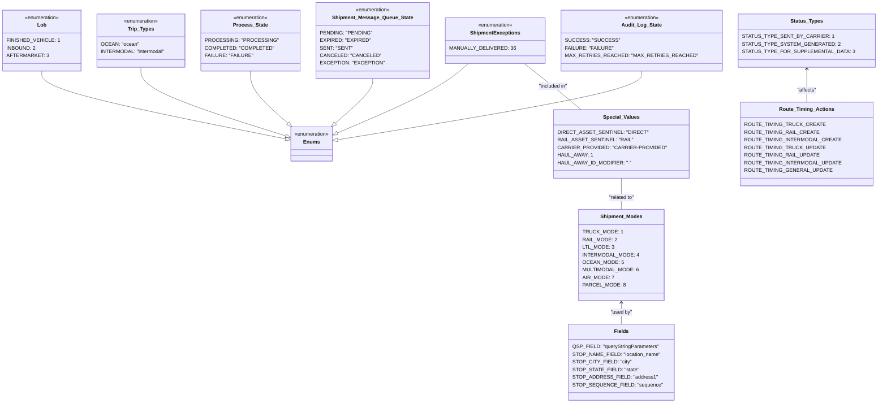

# Diagram: shipment_core/shipment_watchers/shipment_watchers/fvshared/constants.py

> Auto-generated by Obscura crawlers

## Mermaid

### SVG

<svg id="container" width="2529.1484375" xmlns="http://www.w3.org/2000/svg" class="classDiagram" height="1270" viewBox="0 0 2529.1484375 1270" role="graphics-document document" aria-roledescription="class"><g><defs><marker id="container_class-aggregationStart" class="marker aggregation class" refX="18" refY="7" markerWidth="190" markerHeight="240" orient="auto"><path d="M 18,7 L9,13 L1,7 L9,1 Z"></path></marker></defs><defs><marker id="container_class-aggregationEnd" class="marker aggregation class" refX="1" refY="7" markerWidth="20" markerHeight="28" orient="auto"><path d="M 18,7 L9,13 L1,7 L9,1 Z"></path></marker></defs><defs><marker id="container_class-extensionStart" class="marker extension class" refX="18" refY="7" markerWidth="190" markerHeight="240" orient="auto"><path d="M 1,7 L18,13 V 1 Z"></path></marker></defs><defs><marker id="container_class-extensionEnd" class="marker extension class" refX="1" refY="7" markerWidth="20" markerHeight="28" orient="auto"><path d="M 1,1 V 13 L18,7 Z"></path></marker></defs><defs><marker id="container_class-compositionStart" class="marker composition class" refX="18" refY="7" markerWidth="190" markerHeight="240" orient="auto"><path d="M 18,7 L9,13 L1,7 L9,1 Z"></path></marker></defs><defs><marker id="container_class-compositionEnd" class="marker composition class" refX="1" refY="7" markerWidth="20" markerHeight="28" orient="auto"><path d="M 18,7 L9,13 L1,7 L9,1 Z"></path></marker></defs><defs><marker id="container_class-dependencyStart" class="marker dependency class" refX="6" refY="7" markerWidth="190" markerHeight="240" orient="auto"><path d="M 5,7 L9,13 L1,7 L9,1 Z"></path></marker></defs><defs><marker id="container_class-dependencyEnd" class="marker dependency class" refX="13" refY="7" markerWidth="20" markerHeight="28" orient="auto"><path d="M 18,7 L9,13 L14,7 L9,1 Z"></path></marker></defs><defs><marker id="container_class-lollipopStart" class="marker lollipop class" refX="13" refY="7" markerWidth="190" markerHeight="240" orient="auto"><circle stroke="black" fill="transparent" cx="7" cy="7" r="6"></circle></marker></defs><defs><marker id="container_class-lollipopEnd" class="marker lollipop class" refX="1" refY="7" markerWidth="190" markerHeight="240" orient="auto"><circle stroke="black" fill="transparent" cx="7" cy="7" r="6"></circle></marker></defs><g class="root"><g class="clusters"></g><g class="edgePaths"><path d="M121.34,224L121.34,234.167C121.34,244.333,121.34,264.667,241.047,300.037C360.754,335.408,600.167,385.815,719.874,411.019L839.581,436.223" id="id_Lob_Enums_1" class="edge-thickness-normal edge-pattern-solid relation" style=";;;" data-edge="true" data-et="edge" data-id="id_Lob_Enums_1" data-points="W3sieCI6MTIxLjMzOTg0Mzc1LCJ5IjoyMjR9LHsieCI6MTIxLjMzOTg0Mzc1LCJ5IjoyODV9LHsieCI6ODU2LjQ2MDkzNzUsInkiOjQzOS43NzY2NDU0OTcyMzgyM31d" marker-end="url(#container_class-extensionEnd)"></path><path d="M421.254,212L421.254,224.167C421.254,236.333,421.254,260.667,491.063,296.299C560.873,331.932,700.491,378.864,770.301,402.33L840.11,425.796" id="id_Trip_Types_Enums_2" class="edge-thickness-normal edge-pattern-solid relation" style=";;;" data-edge="true" data-et="edge" data-id="id_Trip_Types_Enums_2" data-points="W3sieCI6NDIxLjI1MzkwNjI1LCJ5IjoyMTJ9LHsieCI6NDIxLjI1MzkwNjI1LCJ5IjoyODV9LHsieCI6ODU2LjQ2MDkzNzUsInkiOjQzMS4yOTE5NDIxNjMyMDc5fV0=" marker-end="url(#container_class-extensionEnd)"></path><path d="M1376.38,200L1361.361,214.167C1346.343,228.333,1316.305,256.667,1254.776,292.532C1193.246,328.397,1100.224,371.794,1053.714,393.493L1007.203,415.191" id="id_ShipmentExceptions_Enums_3" class="edge-thickness-normal edge-pattern-solid relation" style=";;;" data-edge="true" data-et="edge" data-id="id_ShipmentExceptions_Enums_3" data-points="W3sieCI6MTM3Ni4zODAyMjQ5MjAzODIzLCJ5IjoyMDB9LHsieCI6MTI4Ni4yNjc1NzgxMjUsInkiOjI4NX0seyJ4Ijo5OTEuNTcwMzEyNSwieSI6NDIyLjQ4Mzk3MzQwODUyODQ3fV0=" marker-end="url(#container_class-extensionEnd)"></path><path d="M748.207,224L748.207,234.167C748.207,244.333,748.207,264.667,766.073,292.008C783.939,319.349,819.672,353.697,837.538,370.871L855.404,388.046" id="id_Process_State_Enums_4" class="edge-thickness-normal edge-pattern-solid relation" style=";;;" data-edge="true" data-et="edge" data-id="id_Process_State_Enums_4" data-points="W3sieCI6NzQ4LjIwNzAzMTI1LCJ5IjoyMjR9LHsieCI6NzQ4LjIwNzAzMTI1LCJ5IjoyODV9LHsieCI6ODY3Ljg0MDA5ODAwMjk1ODYsInkiOjQwMH1d" marker-end="url(#container_class-extensionEnd)"></path><path d="M1099.824,248L1099.824,254.167C1099.824,260.333,1099.824,272.667,1081.958,296.008C1064.092,319.349,1028.36,353.697,1010.493,370.871L992.627,388.046" id="id_Shipment_Message_Queue_State_Enums_5" class="edge-thickness-normal edge-pattern-solid relation" style=";;;" data-edge="true" data-et="edge" data-id="id_Shipment_Message_Queue_State_Enums_5" data-points="W3sieCI6MTA5OS44MjQyMTg3NSwieSI6MjQ4fSx7IngiOjEwOTkuODI0MjE4NzUsInkiOjI4NX0seyJ4Ijo5ODAuMTkxMTUxOTk3MDQxNCwieSI6NDAwfV0=" marker-end="url(#container_class-extensionEnd)"></path><path d="M1867.168,224L1867.168,234.167C1867.168,244.333,1867.168,264.667,1724.065,300.475C1580.962,336.284,1294.756,387.568,1151.653,413.211L1008.55,438.853" id="id_Audit_Log_State_Enums_6" class="edge-thickness-normal edge-pattern-solid relation" style=";;;" data-edge="true" data-et="edge" data-id="id_Audit_Log_State_Enums_6" data-points="W3sieCI6MTg2Ny4xNjc5Njg3NSwieSI6MjI0fSx7IngiOjE4NjcuMTY3OTY4NzUsInkiOjI4NX0seyJ4Ijo5OTEuNTcwMzEyNSwieSI6NDQxLjg5NTEyMzk4MTY2MDU2fV0=" marker-end="url(#container_class-extensionEnd)"></path><path d="M1800.098,954L1800.098,959.167C1800.098,964.333,1800.098,974.667,1800.098,986C1800.098,997.333,1800.098,1009.667,1800.098,1015.833L1800.098,1022" id="id_Shipment_Modes_Fields_7" class="edge-thickness-normal edge-pattern-solid relation" style=";;;" data-edge="true" data-et="edge" data-id="id_Shipment_Modes_Fields_7" data-points="W3sieCI6MTgwMC4wOTc2NTYyNSwieSI6OTQ4fSx7IngiOjE4MDAuMDk3NjU2MjUsInkiOjk4NX0seyJ4IjoxODAwLjA5NzY1NjI1LCJ5IjoxMDIyfV0=" marker-start="url(#container_class-dependencyStart)"></path><path d="M2330.563,218L2330.563,229.167C2330.563,240.333,2330.563,262.667,2330.563,280C2330.563,297.333,2330.563,309.667,2330.563,315.833L2330.563,322" id="id_Status_Types_Route_Timing_Actions_8" class="edge-thickness-normal edge-pattern-solid relation" style=";;;" data-edge="true" data-et="edge" data-id="id_Status_Types_Route_Timing_Actions_8" data-points="W3sieCI6MjMzMC41NjI1LCJ5IjoyMTJ9LHsieCI6MjMzMC41NjI1LCJ5IjoyODV9LHsieCI6MjMzMC41NjI1LCJ5IjozMjJ9XQ==" marker-start="url(#container_class-dependencyStart)"></path><path d="M1800.098,562L1800.098,572.167C1800.098,582.333,1800.098,602.667,1800.098,619C1800.098,635.333,1800.098,647.667,1800.098,653.833L1800.098,660" id="id_Special_Values_Shipment_Modes_9" class="edge-thickness-normal edge-pattern-solid relation" style=";;;" data-edge="true" data-et="edge" data-id="id_Special_Values_Shipment_Modes_9" data-points="W3sieCI6MTgwMC4wOTc2NTYyNSwieSI6NTYyfSx7IngiOjE4MDAuMDk3NjU2MjUsInkiOjYyM30seyJ4IjoxODAwLjA5NzY1NjI1LCJ5Ijo2NjB9XQ=="></path><path d="M1532.366,200L1548.039,214.167C1563.712,228.333,1595.058,256.667,1621.18,281C1647.302,305.333,1668.2,325.667,1678.649,335.833L1689.098,346" id="id_ShipmentExceptions_Special_Values_10" class="edge-thickness-normal edge-pattern-solid relation" style=";;;" data-edge="true" data-et="edge" data-id="id_ShipmentExceptions_Special_Values_10" data-points="W3sieCI6MTUzMi4zNjY0OTA4NDM5NDkxLCJ5IjoyMDB9LHsieCI6MTYyNi40MDQyOTY4NzUsInkiOjI4NX0seyJ4IjoxNjg5LjA5ODM0OTY2NzE1OTcsInkiOjM0Nn1d"></path></g><g class="edgeLabels"><g class="edgeLabel"><g class="label" data-id="id_Lob_Enums_1" transform="translate(0, 0)"><foreignObject width="0" height="0">

</foreignObject></g></g><g class="edgeLabel"><g class="label" data-id="id_Trip_Types_Enums_2" transform="translate(0, 0)"><foreignObject width="0" height="0">

</foreignObject></g></g><g class="edgeLabel"><g class="label" data-id="id_ShipmentExceptions_Enums_3" transform="translate(0, 0)"><foreignObject width="0" height="0">

</foreignObject></g></g><g class="edgeLabel"><g class="label" data-id="id_Process_State_Enums_4" transform="translate(0, 0)"><foreignObject width="0" height="0">

</foreignObject></g></g><g class="edgeLabel"><g class="label" data-id="id_Shipment_Message_Queue_State_Enums_5" transform="translate(0, 0)"><foreignObject width="0" height="0">

</foreignObject></g></g><g class="edgeLabel"><g class="label" data-id="id_Audit_Log_State_Enums_6" transform="translate(0, 0)"><foreignObject width="0" height="0">

</foreignObject></g></g><g class="edgeLabel" transform="translate(1800.09765625, 985)"><g class="label" data-id="id_Shipment_Modes_Fields_7" transform="translate(-34.703125, -12)"><foreignObject width="69.40625" height="24">

"used by"

</foreignObject></g></g><g class="edgeLabel" transform="translate(2330.5625, 285)"><g class="label" data-id="id_Status_Types_Route_Timing_Actions_8" transform="translate(-30.5859375, -12)"><foreignObject width="61.171875" height="24">

"affects"

</foreignObject></g></g><g class="edgeLabel" transform="translate(1800.09765625, 623)"><g class="label" data-id="id_Special_Values_Shipment_Modes_9" transform="translate(-41.640625, -12)"><foreignObject width="83.28125" height="24">

"related to"

</foreignObject></g></g><g class="edgeLabel" transform="translate(1611.83165, 271.82791)"><g class="label" data-id="id_ShipmentExceptions_Special_Values_10" transform="translate(-47.0703125, -12)"><foreignObject width="94.140625" height="24">

"included in"

</foreignObject></g></g></g><g class="nodes"><g class="node default" id="classId-Enums-0" transform="translate(924.015625, 454)"><g class="basic label-container"><path d="M-67.5546875 -54 L67.5546875 -54 L67.5546875 54 L-67.5546875 54" stroke="none" stroke-width="0" fill="#ECECFF" style=""></path><path d="M-67.5546875 -54 C-22.288591769581835 -54, 22.97750396083633 -54, 67.5546875 -54 M-67.5546875 -54 C-34.909720701697 -54, -2.264753903393995 -54, 67.5546875 -54 M67.5546875 -54 C67.5546875 -13.318400187293904, 67.5546875 27.363199625412193, 67.5546875 54 M67.5546875 -54 C67.5546875 -26.843861138218443, 67.5546875 0.31227772356311334, 67.5546875 54 M67.5546875 54 C25.59415640408507 54, -16.36637469182986 54, -67.5546875 54 M67.5546875 54 C18.55726924672011 54, -30.44014900655978 54, -67.5546875 54 M-67.5546875 54 C-67.5546875 19.796183029294127, -67.5546875 -14.407633941411746, -67.5546875 -54 M-67.5546875 54 C-67.5546875 30.83715551531363, -67.5546875 7.674311030627258, -67.5546875 -54" stroke="#9370DB" stroke-width="1.3" fill="none" stroke-dasharray="0 0" style=""></path></g><g class="annotation-group text" transform="translate(-55.5546875, -30)"><g class="label" style="" transform="translate(0,-12)"><foreignObject width="111.109375" height="24">

«enumeration»

</foreignObject></g></g><g class="label-group text" transform="translate(-23.9453125, -6)"><g class="label" style="font-weight: bolder" transform="translate(0,-12)"><foreignObject width="47.890625" height="24">

Enums

</foreignObject></g></g><g class="members-group text" transform="translate(-55.5546875, 42)"></g><g class="methods-group text" transform="translate(-55.5546875, 72)"></g><g class="divider" style=""><path d="M-67.5546875 18 C-23.944855080501483 18, 19.664977338997033 18, 67.5546875 18 M-67.5546875 18 C-35.1932829976865 18, -2.8318784953730045 18, 67.5546875 18" stroke="#9370DB" stroke-width="1.3" fill="none" stroke-dasharray="0 0" style=""></path></g><g class="divider" style=""><path d="M-67.5546875 36 C-32.511913514845375 36, 2.53086047030925 36, 67.5546875 36 M-67.5546875 36 C-35.01845699150533 36, -2.4822264830106633 36, 67.5546875 36" stroke="#9370DB" stroke-width="1.3" fill="none" stroke-dasharray="0 0" style=""></path></g></g><g class="node default" id="classId-Lob-1" transform="translate(121.33984375, 128)"><g class="basic label-container"><path d="M-113.33984375 -96 L113.33984375 -96 L113.33984375 96 L-113.33984375 96" stroke="none" stroke-width="0" fill="#ECECFF" style=""></path><path d="M-113.33984375 -96 C-51.524658573488814 -96, 10.290526603022371 -96, 113.33984375 -96 M-113.33984375 -96 C-63.9168573251982 -96, -14.493870900396402 -96, 113.33984375 -96 M113.33984375 -96 C113.33984375 -36.18374479953673, 113.33984375 23.632510400926535, 113.33984375 96 M113.33984375 -96 C113.33984375 -23.178912290212708, 113.33984375 49.642175419574585, 113.33984375 96 M113.33984375 96 C48.02307714825413 96, -17.293689453491737 96, -113.33984375 96 M113.33984375 96 C45.3170058091913 96, -22.7058321316174 96, -113.33984375 96 M-113.33984375 96 C-113.33984375 41.066800423668255, -113.33984375 -13.86639915266349, -113.33984375 -96 M-113.33984375 96 C-113.33984375 20.695000205750773, -113.33984375 -54.609999588498454, -113.33984375 -96" stroke="#9370DB" stroke-width="1.3" fill="none" stroke-dasharray="0 0" style=""></path></g><g class="annotation-group text" transform="translate(-55.5546875, -72)"><g class="label" style="" transform="translate(0,-12)"><foreignObject width="111.109375" height="24">

«enumeration»

</foreignObject></g></g><g class="label-group text" transform="translate(-13.359375, -48)"><g class="label" style="font-weight: bolder" transform="translate(0,-12)"><foreignObject width="26.71875" height="24">

Lob

</foreignObject></g></g><g class="members-group text" transform="translate(-101.33984375, 0)"><g class="label" style="" transform="translate(0,-12)"><foreignObject width="147.125" height="24">

FINISHED_VEHICLE: 1

</foreignObject></g><g class="label" style="" transform="translate(0,12)"><foreignObject width="84.28125" height="24">

INBOUND: 2

</foreignObject></g><g class="label" style="" transform="translate(0,36)"><foreignObject width="116.515625" height="24">

AFTERMARKET: 3

</foreignObject></g></g><g class="methods-group text" transform="translate(-101.33984375, 96)"></g><g class="divider" style=""><path d="M-113.33984375 -24 C-56.98112173887177 -24, -0.6223997277435416 -24, 113.33984375 -24 M-113.33984375 -24 C-29.33836184600176 -24, 54.66312005799648 -24, 113.33984375 -24" stroke="#9370DB" stroke-width="1.3" fill="none" stroke-dasharray="0 0" style=""></path></g><g class="divider" style=""><path d="M-113.33984375 72 C-32.209947646574605 72, 48.91994845685079 72, 113.33984375 72 M-113.33984375 72 C-45.482545989713884 72, 22.37475177057223 72, 113.33984375 72" stroke="#9370DB" stroke-width="1.3" fill="none" stroke-dasharray="0 0" style=""></path></g></g><g class="node default" id="classId-Trip_Types-2" transform="translate(421.25390625, 128)"><g class="basic label-container"><path d="M-136.57421875 -84 L136.57421875 -84 L136.57421875 84 L-136.57421875 84" stroke="none" stroke-width="0" fill="#ECECFF" style=""></path><path d="M-136.57421875 -84 C-67.34800386915937 -84, 1.878211011681259 -84, 136.57421875 -84 M-136.57421875 -84 C-39.59093526150107 -84, 57.39234822699785 -84, 136.57421875 -84 M136.57421875 -84 C136.57421875 -37.856311126114754, 136.57421875 8.287377747770492, 136.57421875 84 M136.57421875 -84 C136.57421875 -49.5176278840346, 136.57421875 -15.035255768069206, 136.57421875 84 M136.57421875 84 C28.71052471735392 84, -79.15316931529216 84, -136.57421875 84 M136.57421875 84 C64.56568478258609 84, -7.442849184827821 84, -136.57421875 84 M-136.57421875 84 C-136.57421875 28.944144189578196, -136.57421875 -26.111711620843607, -136.57421875 -84 M-136.57421875 84 C-136.57421875 40.2358809391967, -136.57421875 -3.5282381216066057, -136.57421875 -84" stroke="#9370DB" stroke-width="1.3" fill="none" stroke-dasharray="0 0" style=""></path></g><g class="annotation-group text" transform="translate(-55.5546875, -60)"><g class="label" style="" transform="translate(0,-12)"><foreignObject width="111.109375" height="24">

«enumeration»

</foreignObject></g></g><g class="label-group text" transform="translate(-39.125, -36)"><g class="label" style="font-weight: bolder" transform="translate(0,-12)"><foreignObject width="78.25" height="24">

Trip_Types

</foreignObject></g></g><g class="members-group text" transform="translate(-124.57421875, 12)"><g class="label" style="" transform="translate(0,-12)"><foreignObject width="112.53125" height="24">

OCEAN: "ocean"

</foreignObject></g><g class="label" style="" transform="translate(0,12)"><foreignObject width="193.59375" height="24">

INTERMODAL: "intermodal"

</foreignObject></g></g><g class="methods-group text" transform="translate(-124.57421875, 84)"></g><g class="divider" style=""><path d="M-136.57421875 -12 C-61.129826334802644 -12, 14.314566080394712 -12, 136.57421875 -12 M-136.57421875 -12 C-73.94250488576012 -12, -11.310791021520245 -12, 136.57421875 -12" stroke="#9370DB" stroke-width="1.3" fill="none" stroke-dasharray="0 0" style=""></path></g><g class="divider" style=""><path d="M-136.57421875 60 C-80.01383361837392 60, -23.453448486747845 60, 136.57421875 60 M-136.57421875 60 C-46.049345165978295 60, 44.47552841804341 60, 136.57421875 60" stroke="#9370DB" stroke-width="1.3" fill="none" stroke-dasharray="0 0" style=""></path></g></g><g class="node default" id="classId-ShipmentExceptions-3" transform="translate(1452.7109375, 128)"><g class="basic label-container"><path d="M-141.6484375 -72 L141.6484375 -72 L141.6484375 72 L-141.6484375 72" stroke="none" stroke-width="0" fill="#ECECFF" style=""></path><path d="M-141.6484375 -72 C-41.5522547549661 -72, 58.5439279900678 -72, 141.6484375 -72 M-141.6484375 -72 C-69.97895449000819 -72, 1.6905285199836158 -72, 141.6484375 -72 M141.6484375 -72 C141.6484375 -25.001781519838104, 141.6484375 21.99643696032379, 141.6484375 72 M141.6484375 -72 C141.6484375 -43.07375032326244, 141.6484375 -14.147500646524875, 141.6484375 72 M141.6484375 72 C53.64846510511545 72, -34.3515072897691 72, -141.6484375 72 M141.6484375 72 C35.09454741912364 72, -71.45934266175271 72, -141.6484375 72 M-141.6484375 72 C-141.6484375 21.944468337279808, -141.6484375 -28.111063325440384, -141.6484375 -72 M-141.6484375 72 C-141.6484375 37.2935474322178, -141.6484375 2.587094864435599, -141.6484375 -72" stroke="#9370DB" stroke-width="1.3" fill="none" stroke-dasharray="0 0" style=""></path></g><g class="annotation-group text" transform="translate(-55.5546875, -48)"><g class="label" style="" transform="translate(0,-12)"><foreignObject width="111.109375" height="24">

«enumeration»

</foreignObject></g></g><g class="label-group text" transform="translate(-74.671875, -24)"><g class="label" style="font-weight: bolder" transform="translate(0,-12)"><foreignObject width="149.34375" height="24">

ShipmentExceptions

</foreignObject></g></g><g class="members-group text" transform="translate(-129.6484375, 24)"><g class="label" style="" transform="translate(0,-12)"><foreignObject width="184.625" height="24">

MANUALLY_DELIVERED: 36

</foreignObject></g></g><g class="methods-group text" transform="translate(-129.6484375, 72)"></g><g class="divider" style=""><path d="M-141.6484375 0 C-69.85789685456511 0, 1.9326437908697756 0, 141.6484375 0 M-141.6484375 0 C-35.53343861796422 0, 70.58156026407156 0, 141.6484375 0" stroke="#9370DB" stroke-width="1.3" fill="none" stroke-dasharray="0 0" style=""></path></g><g class="divider" style=""><path d="M-141.6484375 48 C-30.197855595414453 48, 81.2527263091711 48, 141.6484375 48 M-141.6484375 48 C-64.39370834855924 48, 12.861020802881512 48, 141.6484375 48" stroke="#9370DB" stroke-width="1.3" fill="none" stroke-dasharray="0 0" style=""></path></g></g><g class="node default" id="classId-Process_State-4" transform="translate(748.20703125, 128)"><g class="basic label-container"><path d="M-140.37890625 -96 L140.37890625 -96 L140.37890625 96 L-140.37890625 96" stroke="none" stroke-width="0" fill="#ECECFF" style=""></path><path d="M-140.37890625 -96 C-62.51168761074729 -96, 15.355531028505425 -96, 140.37890625 -96 M-140.37890625 -96 C-72.34142627506453 -96, -4.30394630012907 -96, 140.37890625 -96 M140.37890625 -96 C140.37890625 -38.42298518482594, 140.37890625 19.15402963034812, 140.37890625 96 M140.37890625 -96 C140.37890625 -47.272934635886315, 140.37890625 1.4541307282273692, 140.37890625 96 M140.37890625 96 C70.77666203297841 96, 1.174417815956815 96, -140.37890625 96 M140.37890625 96 C49.49248031419174 96, -41.393945621616524 96, -140.37890625 96 M-140.37890625 96 C-140.37890625 42.23303866737051, -140.37890625 -11.533922665258984, -140.37890625 -96 M-140.37890625 96 C-140.37890625 40.51388130669983, -140.37890625 -14.97223738660034, -140.37890625 -96" stroke="#9370DB" stroke-width="1.3" fill="none" stroke-dasharray="0 0" style=""></path></g><g class="annotation-group text" transform="translate(-55.5546875, -72)"><g class="label" style="" transform="translate(0,-12)"><foreignObject width="111.109375" height="24">

«enumeration»

</foreignObject></g></g><g class="label-group text" transform="translate(-51.1953125, -48)"><g class="label" style="font-weight: bolder" transform="translate(0,-12)"><foreignObject width="102.390625" height="24">

Process_State

</foreignObject></g></g><g class="members-group text" transform="translate(-128.37890625, 0)"><g class="label" style="" transform="translate(0,-12)"><foreignObject width="201.203125" height="24">

PROCESSING: "PROCESSING"

</foreignObject></g><g class="label" style="" transform="translate(0,12)"><foreignObject width="190.875" height="24">

COMPLETED: "COMPLETED"

</foreignObject></g><g class="label" style="" transform="translate(0,36)"><foreignObject width="135.546875" height="24">

FAILURE: "FAILURE"

</foreignObject></g></g><g class="methods-group text" transform="translate(-128.37890625, 96)"></g><g class="divider" style=""><path d="M-140.37890625 -24 C-63.34255533221196 -24, 13.693795585576083 -24, 140.37890625 -24 M-140.37890625 -24 C-60.63783310522959 -24, 19.10324003954082 -24, 140.37890625 -24" stroke="#9370DB" stroke-width="1.3" fill="none" stroke-dasharray="0 0" style=""></path></g><g class="divider" style=""><path d="M-140.37890625 72 C-59.65280908703919 72, 21.073288075921624 72, 140.37890625 72 M-140.37890625 72 C-49.43891840821807 72, 41.501069433563856 72, 140.37890625 72" stroke="#9370DB" stroke-width="1.3" fill="none" stroke-dasharray="0 0" style=""></path></g></g><g class="node default" id="classId-Shipment_Message_Queue_State-5" transform="translate(1099.82421875, 128)"><g class="basic label-container"><path d="M-161.23828125 -120 L161.23828125 -120 L161.23828125 120 L-161.23828125 120" stroke="none" stroke-width="0" fill="#ECECFF" style=""></path><path d="M-161.23828125 -120 C-69.34276657926576 -120, 22.552748091468487 -120, 161.23828125 -120 M-161.23828125 -120 C-61.708240686726654 -120, 37.82179987654669 -120, 161.23828125 -120 M161.23828125 -120 C161.23828125 -33.586146978327065, 161.23828125 52.82770604334587, 161.23828125 120 M161.23828125 -120 C161.23828125 -28.357042388405844, 161.23828125 63.28591522318831, 161.23828125 120 M161.23828125 120 C69.4865024619554 120, -22.265276326089207 120, -161.23828125 120 M161.23828125 120 C68.11080965367722 120, -25.016661942645555 120, -161.23828125 120 M-161.23828125 120 C-161.23828125 69.4508329901044, -161.23828125 18.901665980208804, -161.23828125 -120 M-161.23828125 120 C-161.23828125 33.78787874673469, -161.23828125 -52.42424250653062, -161.23828125 -120" stroke="#9370DB" stroke-width="1.3" fill="none" stroke-dasharray="0 0" style=""></path></g><g class="annotation-group text" transform="translate(-55.5546875, -96)"><g class="label" style="" transform="translate(0,-12)"><foreignObject width="111.109375" height="24">

«enumeration»

</foreignObject></g></g><g class="label-group text" transform="translate(-120.8515625, -72)"><g class="label" style="font-weight: bolder" transform="translate(0,-12)"><foreignObject width="241.703125" height="24">

Shipment_Message_Queue_State

</foreignObject></g></g><g class="members-group text" transform="translate(-149.23828125, -24)"><g class="label" style="" transform="translate(0,-12)"><foreignObject width="150.359375" height="24">

PENDING: "PENDING"

</foreignObject></g><g class="label" style="" transform="translate(0,12)"><foreignObject width="140.375" height="24">

EXPIRED: "EXPIRED"

</foreignObject></g><g class="label" style="" transform="translate(0,36)"><foreignObject width="93.34375" height="24">

SENT: "SENT"

</foreignObject></g><g class="label" style="" transform="translate(0,60)"><foreignObject width="167.671875" height="24">

CANCELED: "CANCELED"

</foreignObject></g><g class="label" style="" transform="translate(0,84)"><foreignObject width="177.625" height="24">

EXCEPTION: "EXCEPTION"

</foreignObject></g></g><g class="methods-group text" transform="translate(-149.23828125, 120)"></g><g class="divider" style=""><path d="M-161.23828125 -48 C-52.221392354165204 -48, 56.79549654166959 -48, 161.23828125 -48 M-161.23828125 -48 C-66.28630954646955 -48, 28.665662157060893 -48, 161.23828125 -48" stroke="#9370DB" stroke-width="1.3" fill="none" stroke-dasharray="0 0" style=""></path></g><g class="divider" style=""><path d="M-161.23828125 96 C-82.96532373693567 96, -4.692366223871346 96, 161.23828125 96 M-161.23828125 96 C-38.60229348542421 96, 84.03369427915158 96, 161.23828125 96" stroke="#9370DB" stroke-width="1.3" fill="none" stroke-dasharray="0 0" style=""></path></g></g><g class="node default" id="classId-Audit_Log_State-6" transform="translate(1867.16796875, 128)"><g class="basic label-container"><path d="M-222.80859375 -96 L222.80859375 -96 L222.80859375 96 L-222.80859375 96" stroke="none" stroke-width="0" fill="#ECECFF" style=""></path><path d="M-222.80859375 -96 C-50.400458285437196 -96, 122.00767717912561 -96, 222.80859375 -96 M-222.80859375 -96 C-113.47174233903007 -96, -4.134890928060145 -96, 222.80859375 -96 M222.80859375 -96 C222.80859375 -54.87221460323809, 222.80859375 -13.744429206476184, 222.80859375 96 M222.80859375 -96 C222.80859375 -47.93897362357403, 222.80859375 0.12205275285194261, 222.80859375 96 M222.80859375 96 C101.80901425617942 96, -19.190565237641152 96, -222.80859375 96 M222.80859375 96 C96.38783063878537 96, -30.032932472429252 96, -222.80859375 96 M-222.80859375 96 C-222.80859375 34.19686334476881, -222.80859375 -27.606273310462385, -222.80859375 -96 M-222.80859375 96 C-222.80859375 19.38397396584533, -222.80859375 -57.23205206830934, -222.80859375 -96" stroke="#9370DB" stroke-width="1.3" fill="none" stroke-dasharray="0 0" style=""></path></g><g class="annotation-group text" transform="translate(-55.5546875, -72)"><g class="label" style="" transform="translate(0,-12)"><foreignObject width="111.109375" height="24">

«enumeration»

</foreignObject></g></g><g class="label-group text" transform="translate(-59.9609375, -48)"><g class="label" style="font-weight: bolder" transform="translate(0,-12)"><foreignObject width="119.921875" height="24">

Audit_Log_State

</foreignObject></g></g><g class="members-group text" transform="translate(-210.80859375, 0)"><g class="label" style="" transform="translate(0,-12)"><foreignObject width="145.8125" height="24">

SUCCESS: "SUCCESS"

</foreignObject></g><g class="label" style="" transform="translate(0,12)"><foreignObject width="135.546875" height="24">

FAILURE: "FAILURE"

</foreignObject></g><g class="label" style="" transform="translate(0,36)"><foreignObject width="361.65625" height="24">

MAX_RETRIES_REACHED: "MAX_RETRIES_REACHED"

</foreignObject></g></g><g class="methods-group text" transform="translate(-210.80859375, 96)"></g><g class="divider" style=""><path d="M-222.80859375 -24 C-104.76180783361579 -24, 13.284978082768419 -24, 222.80859375 -24 M-222.80859375 -24 C-60.75686954043735 -24, 101.2948546691253 -24, 222.80859375 -24" stroke="#9370DB" stroke-width="1.3" fill="none" stroke-dasharray="0 0" style=""></path></g><g class="divider" style=""><path d="M-222.80859375 72 C-87.93530117476749 72, 46.93799140046502 72, 222.80859375 72 M-222.80859375 72 C-60.90396249367643 72, 101.00066876264714 72, 222.80859375 72" stroke="#9370DB" stroke-width="1.3" fill="none" stroke-dasharray="0 0" style=""></path></g></g><g class="node default" id="classId-Shipment_Modes-7" transform="translate(1800.09765625, 804)"><g class="basic label-container"><path d="M-123.88671875 -144 L123.88671875 -144 L123.88671875 144 L-123.88671875 144" stroke="none" stroke-width="0" fill="#ECECFF" style=""></path><path d="M-123.88671875 -144 C-28.535920305206233 -144, 66.81487813958753 -144, 123.88671875 -144 M-123.88671875 -144 C-65.73685986323176 -144, -7.587000976463514 -144, 123.88671875 -144 M123.88671875 -144 C123.88671875 -65.82616756482918, 123.88671875 12.347664870341646, 123.88671875 144 M123.88671875 -144 C123.88671875 -72.52205057339218, 123.88671875 -1.0441011467843566, 123.88671875 144 M123.88671875 144 C72.75411630895073 144, 21.62151386790144 144, -123.88671875 144 M123.88671875 144 C63.52368049715468 144, 3.160642244309358 144, -123.88671875 144 M-123.88671875 144 C-123.88671875 45.90975262581564, -123.88671875 -52.180494748368716, -123.88671875 -144 M-123.88671875 144 C-123.88671875 42.20394563432016, -123.88671875 -59.59210873135967, -123.88671875 -144" stroke="#9370DB" stroke-width="1.3" fill="none" stroke-dasharray="0 0" style=""></path></g><g class="annotation-group text" transform="translate(0, -120)"></g><g class="label-group text" transform="translate(-63.3046875, -120)"><g class="label" style="font-weight: bolder" transform="translate(0,-12)"><foreignObject width="126.609375" height="24">

Shipment_Modes

</foreignObject></g></g><g class="members-group text" transform="translate(-111.88671875, -72)"><g class="label" style="" transform="translate(0,-12)"><foreignObject width="112.375" height="24">

TRUCK_MODE: 1

</foreignObject></g><g class="label" style="" transform="translate(0,12)"><foreignObject width="98.09375" height="24">

RAIL_MODE: 2

</foreignObject></g><g class="label" style="" transform="translate(0,36)"><foreignObject width="89.5" height="24">

LTL_MODE: 3

</foreignObject></g><g class="label" style="" transform="translate(0,60)"><foreignObject width="159.9375" height="24">

INTERMODAL_MODE: 4

</foreignObject></g><g class="label" style="" transform="translate(0,84)"><foreignObject width="115.34375" height="24">

OCEAN_MODE: 5

</foreignObject></g><g class="label" style="" transform="translate(0,108)"><foreignObject width="160.46875" height="24">

MULTIMODAL_MODE: 6

</foreignObject></g><g class="label" style="" transform="translate(0,132)"><foreignObject width="89.296875" height="24">

AIR_MODE: 7

</foreignObject></g><g class="label" style="" transform="translate(0,156)"><foreignObject width="119.96875" height="24">

PARCEL_MODE: 8

</foreignObject></g></g><g class="methods-group text" transform="translate(-111.88671875, 144)"></g><g class="divider" style=""><path d="M-123.88671875 -96 C-40.68755099556468 -96, 42.511616758870645 -96, 123.88671875 -96 M-123.88671875 -96 C-37.91289826572705 -96, 48.0609222185459 -96, 123.88671875 -96" stroke="#9370DB" stroke-width="1.3" fill="none" stroke-dasharray="0 0" style=""></path></g><g class="divider" style=""><path d="M-123.88671875 120 C-42.697456001991 120, 38.491806746018 120, 123.88671875 120 M-123.88671875 120 C-59.85795652154843 120, 4.170805706903138 120, 123.88671875 120" stroke="#9370DB" stroke-width="1.3" fill="none" stroke-dasharray="0 0" style=""></path></g></g><g class="node default" id="classId-Status_Types-8" transform="translate(2330.5625, 128)"><g class="basic label-container"><path d="M-190.5859375 -84 L190.5859375 -84 L190.5859375 84 L-190.5859375 84" stroke="none" stroke-width="0" fill="#ECECFF" style=""></path><path d="M-190.5859375 -84 C-77.54810436580098 -84, 35.48972876839804 -84, 190.5859375 -84 M-190.5859375 -84 C-63.98552744339469 -84, 62.614882613210625 -84, 190.5859375 -84 M190.5859375 -84 C190.5859375 -44.98356956593482, 190.5859375 -5.967139131869644, 190.5859375 84 M190.5859375 -84 C190.5859375 -38.68487156021152, 190.5859375 6.630256879576962, 190.5859375 84 M190.5859375 84 C51.345309541476695 84, -87.89531841704661 84, -190.5859375 84 M190.5859375 84 C70.86232043595729 84, -48.86129662808543 84, -190.5859375 84 M-190.5859375 84 C-190.5859375 45.577810024920005, -190.5859375 7.15562004984001, -190.5859375 -84 M-190.5859375 84 C-190.5859375 33.24131183624221, -190.5859375 -17.517376327515578, -190.5859375 -84" stroke="#9370DB" stroke-width="1.3" fill="none" stroke-dasharray="0 0" style=""></path></g><g class="annotation-group text" transform="translate(0, -60)"></g><g class="label-group text" transform="translate(-48.28125, -60)"><g class="label" style="font-weight: bolder" transform="translate(0,-12)"><foreignObject width="96.5625" height="24">

Status_Types

</foreignObject></g></g><g class="members-group text" transform="translate(-178.5859375, -12)"><g class="label" style="" transform="translate(0,-12)"><foreignObject width="245.65625" height="24">

STATUS_TYPE_SENT_BY_CARRIER: 1

</foreignObject></g><g class="label" style="" transform="translate(0,12)"><foreignObject width="263.1875" height="24">

STATUS_TYPE_SYSTEM_GENERATED: 2

</foreignObject></g><g class="label" style="" transform="translate(0,36)"><foreignObject width="308.890625" height="24">

STATUS_TYPE_FOR_SUPPLEMENTAL_DATA: 3

</foreignObject></g></g><g class="methods-group text" transform="translate(-178.5859375, 84)"></g><g class="divider" style=""><path d="M-190.5859375 -36 C-49.653080297561246 -36, 91.27977690487751 -36, 190.5859375 -36 M-190.5859375 -36 C-114.11189328202231 -36, -37.637849064044616 -36, 190.5859375 -36" stroke="#9370DB" stroke-width="1.3" fill="none" stroke-dasharray="0 0" style=""></path></g><g class="divider" style=""><path d="M-190.5859375 60 C-55.208157572993 60, 80.169622354014 60, 190.5859375 60 M-190.5859375 60 C-75.42580460189896 60, 39.73432829620208 60, 190.5859375 60" stroke="#9370DB" stroke-width="1.3" fill="none" stroke-dasharray="0 0" style=""></path></g></g><g class="node default" id="classId-Route_Timing_Actions-9" transform="translate(2330.5625, 454)"><g class="basic label-container"><path d="M-187.92578125 -132 L187.92578125 -132 L187.92578125 132 L-187.92578125 132" stroke="none" stroke-width="0" fill="#ECECFF" style=""></path><path d="M-187.92578125 -132 C-74.76317108853469 -132, 38.39943907293062 -132, 187.92578125 -132 M-187.92578125 -132 C-83.16536871267888 -132, 21.595043824642232 -132, 187.92578125 -132 M187.92578125 -132 C187.92578125 -49.83986525197538, 187.92578125 32.320269496049235, 187.92578125 132 M187.92578125 -132 C187.92578125 -50.48631445719897, 187.92578125 31.027371085602056, 187.92578125 132 M187.92578125 132 C94.43596109619952 132, 0.9461409423990403 132, -187.92578125 132 M187.92578125 132 C59.333422035233866 132, -69.25893717953227 132, -187.92578125 132 M-187.92578125 132 C-187.92578125 59.04724420149296, -187.92578125 -13.905511597014083, -187.92578125 -132 M-187.92578125 132 C-187.92578125 52.5235797220781, -187.92578125 -26.952840555843807, -187.92578125 -132" stroke="#9370DB" stroke-width="1.3" fill="none" stroke-dasharray="0 0" style=""></path></g><g class="annotation-group text" transform="translate(0, -108)"></g><g class="label-group text" transform="translate(-80.9140625, -108)"><g class="label" style="font-weight: bolder" transform="translate(0,-12)"><foreignObject width="161.828125" height="24">

Route_Timing_Actions

</foreignObject></g></g><g class="members-group text" transform="translate(-175.92578125, -60)"><g class="label" style="" transform="translate(0,-12)"><foreignObject width="221.15625" height="24">

ROUTE_TIMING_TRUCK_CREATE

</foreignObject></g><g class="label" style="" transform="translate(0,12)"><foreignObject width="206.6875" height="24">

ROUTE_TIMING_RAIL_CREATE

</foreignObject></g><g class="label" style="" transform="translate(0,36)"><foreignObject width="267.9375" height="24">

ROUTE_TIMING_INTERMODAL_CREATE

</foreignObject></g><g class="label" style="" transform="translate(0,60)"><foreignObject width="224.15625" height="24">

ROUTE_TIMING_TRUCK_UPDATE

</foreignObject></g><g class="label" style="" transform="translate(0,84)"><foreignObject width="209.671875" height="24">

ROUTE_TIMING_RAIL_UPDATE

</foreignObject></g><g class="label" style="" transform="translate(0,108)"><foreignObject width="270.9375" height="24">

ROUTE_TIMING_INTERMODAL_UPDATE

</foreignObject></g><g class="label" style="" transform="translate(0,132)"><foreignObject width="242.453125" height="24">

ROUTE_TIMING_GENERAL_UPDATE

</foreignObject></g></g><g class="methods-group text" transform="translate(-175.92578125, 132)"></g><g class="divider" style=""><path d="M-187.92578125 -84 C-71.09679745534834 -84, 45.732186339303325 -84, 187.92578125 -84 M-187.92578125 -84 C-64.0344451108987 -84, 59.8568910282026 -84, 187.92578125 -84" stroke="#9370DB" stroke-width="1.3" fill="none" stroke-dasharray="0 0" style=""></path></g><g class="divider" style=""><path d="M-187.92578125 108 C-76.1163703950318 108, 35.69304045993641 108, 187.92578125 108 M-187.92578125 108 C-86.52480839887457 108, 14.876164452250862 108, 187.92578125 108" stroke="#9370DB" stroke-width="1.3" fill="none" stroke-dasharray="0 0" style=""></path></g></g><g class="node default" id="classId-Fields-10" transform="translate(1800.09765625, 1142)"><g class="basic label-container"><path d="M-153.53125 -120 L153.53125 -120 L153.53125 120 L-153.53125 120" stroke="none" stroke-width="0" fill="#ECECFF" style=""></path><path d="M-153.53125 -120 C-71.14535370454122 -120, 11.240542590917556 -120, 153.53125 -120 M-153.53125 -120 C-38.619583027695256 -120, 76.29208394460949 -120, 153.53125 -120 M153.53125 -120 C153.53125 -67.81026215316938, 153.53125 -15.620524306338751, 153.53125 120 M153.53125 -120 C153.53125 -38.20328425382439, 153.53125 43.593431492351215, 153.53125 120 M153.53125 120 C43.34773695810128 120, -66.83577608379744 120, -153.53125 120 M153.53125 120 C72.07387683837248 120, -9.38349632325503 120, -153.53125 120 M-153.53125 120 C-153.53125 53.6841958201714, -153.53125 -12.631608359657207, -153.53125 -120 M-153.53125 120 C-153.53125 43.127748705424466, -153.53125 -33.74450258915107, -153.53125 -120" stroke="#9370DB" stroke-width="1.3" fill="none" stroke-dasharray="0 0" style=""></path></g><g class="annotation-group text" transform="translate(0, -96)"></g><g class="label-group text" transform="translate(-21.34375, -96)"><g class="label" style="font-weight: bolder" transform="translate(0,-12)"><foreignObject width="42.6875" height="24">

Fields

</foreignObject></g></g><g class="members-group text" transform="translate(-141.53125, -48)"><g class="label" style="" transform="translate(0,-12)"><foreignObject width="261.71875" height="24">

QSP_FIELD: "queryStringParameters"

</foreignObject></g><g class="label" style="" transform="translate(0,12)"><foreignObject width="260.6875" height="24">

STOP_NAME_FIELD: "location_name"

</foreignObject></g><g class="label" style="" transform="translate(0,36)"><foreignObject width="166.15625" height="24">

STOP_CITY_FIELD: "city"

</foreignObject></g><g class="label" style="" transform="translate(0,60)"><foreignObject width="188.25" height="24">

STOP_STATE_FIELD: "state"

</foreignObject></g><g class="label" style="" transform="translate(0,84)"><foreignObject width="239.625" height="24">

STOP_ADDRESS_FIELD: "address1"

</foreignObject></g><g class="label" style="" transform="translate(0,108)"><foreignObject width="256.078125" height="24">

STOP_SEQUENCE_FIELD: "sequence"

</foreignObject></g></g><g class="methods-group text" transform="translate(-141.53125, 120)"></g><g class="divider" style=""><path d="M-153.53125 -72 C-88.01577191486824 -72, -22.500293829736478 -72, 153.53125 -72 M-153.53125 -72 C-52.20431357098303 -72, 49.122622858033935 -72, 153.53125 -72" stroke="#9370DB" stroke-width="1.3" fill="none" stroke-dasharray="0 0" style=""></path></g><g class="divider" style=""><path d="M-153.53125 96 C-86.98074136894033 96, -20.430232737880658 96, 153.53125 96 M-153.53125 96 C-73.90013668830068 96, 5.7309766233986466 96, 153.53125 96" stroke="#9370DB" stroke-width="1.3" fill="none" stroke-dasharray="0 0" style=""></path></g></g><g class="node default" id="classId-Special_Values-11" transform="translate(1800.09765625, 454)"><g class="basic label-container"><path d="M-189.71875 -108 L189.71875 -108 L189.71875 108 L-189.71875 108" stroke="none" stroke-width="0" fill="#ECECFF" style=""></path><path d="M-189.71875 -108 C-113.58036162486582 -108, -37.44197324973163 -108, 189.71875 -108 M-189.71875 -108 C-97.11588345075344 -108, -4.513016901506887 -108, 189.71875 -108 M189.71875 -108 C189.71875 -29.12808161480484, 189.71875 49.74383677039032, 189.71875 108 M189.71875 -108 C189.71875 -61.32328435944088, 189.71875 -14.646568718881767, 189.71875 108 M189.71875 108 C77.25601698992554 108, -35.20671602014892 108, -189.71875 108 M189.71875 108 C50.81181413323063 108, -88.09512173353875 108, -189.71875 108 M-189.71875 108 C-189.71875 48.488505867783466, -189.71875 -11.022988264433067, -189.71875 -108 M-189.71875 108 C-189.71875 38.66485405093427, -189.71875 -30.670291898131467, -189.71875 -108" stroke="#9370DB" stroke-width="1.3" fill="none" stroke-dasharray="0 0" style=""></path></g><g class="annotation-group text" transform="translate(0, -84)"></g><g class="label-group text" transform="translate(-54.078125, -84)"><g class="label" style="font-weight: bolder" transform="translate(0,-12)"><foreignObject width="108.15625" height="24">

Special_Values

</foreignObject></g></g><g class="members-group text" transform="translate(-177.71875, -36)"><g class="label" style="" transform="translate(0,-12)"><foreignObject width="247.921875" height="24">

DIRECT_ASSET_SENTINEL: "DIRECT"

</foreignObject></g><g class="label" style="" transform="translate(0,12)"><foreignObject width="209.75" height="24">

RAIL_ASSET_SENTINEL: "RAIL"

</foreignObject></g><g class="label" style="" transform="translate(0,36)"><foreignObject width="301.359375" height="24">

CARRIER_PROVIDED: "CARRIER-PROVIDED"

</foreignObject></g><g class="label" style="" transform="translate(0,60)"><foreignObject width="100.484375" height="24">

HAUL_AWAY: 1

</foreignObject></g><g class="label" style="" transform="translate(0,84)"><foreignObject width="212.578125" height="24">

HAUL_AWAY_ID_MODIFIER: "-"

</foreignObject></g></g><g class="methods-group text" transform="translate(-177.71875, 108)"></g><g class="divider" style=""><path d="M-189.71875 -60 C-82.09196995920932 -60, 25.534810081581355 -60, 189.71875 -60 M-189.71875 -60 C-63.853676404253974 -60, 62.01139719149205 -60, 189.71875 -60" stroke="#9370DB" stroke-width="1.3" fill="none" stroke-dasharray="0 0" style=""></path></g><g class="divider" style=""><path d="M-189.71875 84 C-70.04507170263035 84, 49.628606594739296 84, 189.71875 84 M-189.71875 84 C-95.62393198537164 84, -1.529113970743282 84, 189.71875 84" stroke="#9370DB" stroke-width="1.3" fill="none" stroke-dasharray="0 0" style=""></path></g></g></g></g></g></svg>
