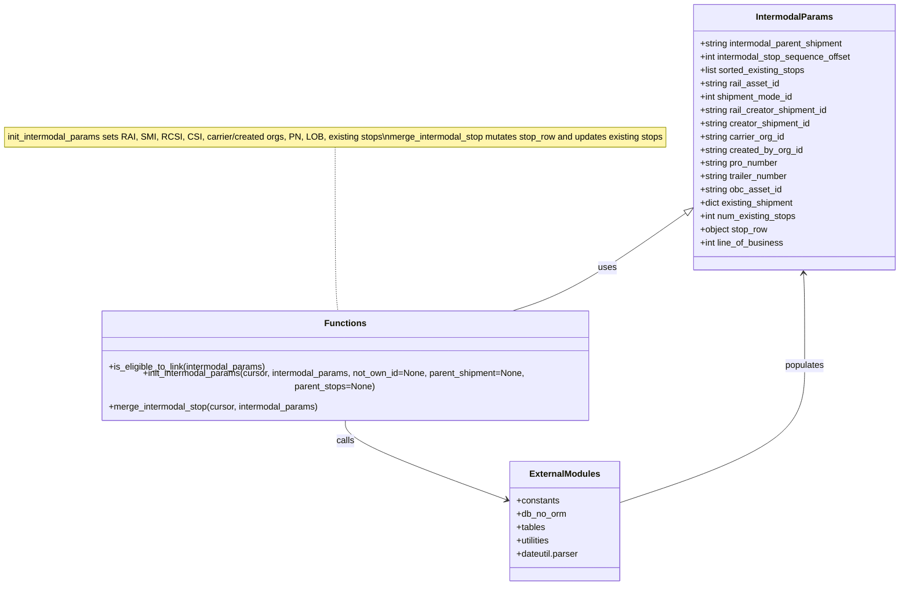

# Diagram: shipment_core/shipment_watchers/shipment_watchers/fvshared/intermodal_merge_process.py


> Auto-generated by Obscura crawlers

## Diagram 1



### SVG

<svg id="container" width="1636.4609375" xmlns="http://www.w3.org/2000/svg" class="classDiagram" height="1034" viewBox="0 0 1636.4609375 1034" role="graphics-document document" aria-roledescription="class"><style>#container{font-family:"trebuchet ms",verdana,arial,sans-serif;font-size:16px;fill:#333;}@keyframes edge-animation-frame{from{stroke-dashoffset:0;}}@keyframes dash{to{stroke-dashoffset:0;}}#container .edge-animation-slow{stroke-dasharray:9,5!important;stroke-dashoffset:900;animation:dash 50s linear infinite;stroke-linecap:round;}#container .edge-animation-fast{stroke-dasharray:9,5!important;stroke-dashoffset:900;animation:dash 20s linear infinite;stroke-linecap:round;}#container .error-icon{fill:#552222;}#container .error-text{fill:#552222;stroke:#552222;}#container .edge-thickness-normal{stroke-width:1px;}#container .edge-thickness-thick{stroke-width:3.5px;}#container .edge-pattern-solid{stroke-dasharray:0;}#container .edge-thickness-invisible{stroke-width:0;fill:none;}#container .edge-pattern-dashed{stroke-dasharray:3;}#container .edge-pattern-dotted{stroke-dasharray:2;}#container .marker{fill:#333333;stroke:#333333;}#container .marker.cross{stroke:#333333;}#container svg{font-family:"trebuchet ms",verdana,arial,sans-serif;font-size:16px;}#container p{margin:0;}#container g.classGroup text{fill:#9370DB;stroke:none;font-family:"trebuchet ms",verdana,arial,sans-serif;font-size:10px;}#container g.classGroup text .title{font-weight:bolder;}#container .nodeLabel,#container .edgeLabel{color:#131300;}#container .edgeLabel .label rect{fill:#ECECFF;}#container .label text{fill:#131300;}#container .labelBkg{background:#ECECFF;}#container .edgeLabel .label span{background:#ECECFF;}#container .classTitle{font-weight:bolder;}#container .node rect,#container .node circle,#container .node ellipse,#container .node polygon,#container .node path{fill:#ECECFF;stroke:#9370DB;stroke-width:1px;}#container .divider{stroke:#9370DB;stroke-width:1;}#container g.clickable{cursor:pointer;}#container g.classGroup rect{fill:#ECECFF;stroke:#9370DB;}#container g.classGroup line{stroke:#9370DB;stroke-width:1;}#container .classLabel .box{stroke:none;stroke-width:0;fill:#ECECFF;opacity:0.5;}#container .classLabel .label{fill:#9370DB;font-size:10px;}#container .relation{stroke:#333333;stroke-width:1;fill:none;}#container .dashed-line{stroke-dasharray:3;}#container .dotted-line{stroke-dasharray:1 2;}#container #compositionStart,#container .composition{fill:#333333!important;stroke:#333333!important;stroke-width:1;}#container #compositionEnd,#container .composition{fill:#333333!important;stroke:#333333!important;stroke-width:1;}#container #dependencyStart,#container .dependency{fill:#333333!important;stroke:#333333!important;stroke-width:1;}#container #dependencyStart,#container .dependency{fill:#333333!important;stroke:#333333!important;stroke-width:1;}#container #extensionStart,#container .extension{fill:transparent!important;stroke:#333333!important;stroke-width:1;}#container #extensionEnd,#container .extension{fill:transparent!important;stroke:#333333!important;stroke-width:1;}#container #aggregationStart,#container .aggregation{fill:transparent!important;stroke:#333333!important;stroke-width:1;}#container #aggregationEnd,#container .aggregation{fill:transparent!important;stroke:#333333!important;stroke-width:1;}#container #lollipopStart,#container .lollipop{fill:#ECECFF!important;stroke:#333333!important;stroke-width:1;}#container #lollipopEnd,#container .lollipop{fill:#ECECFF!important;stroke:#333333!important;stroke-width:1;}#container .edgeTerminals{font-size:11px;line-height:initial;}#container .classTitleText{text-anchor:middle;font-size:18px;fill:#333;}#container .label-icon{display:inline-block;height:1em;overflow:visible;vertical-align:-0.125em;}#container .node .label-icon path{fill:currentColor;stroke:revert;stroke-width:revert;}#container :root{--mermaid-font-family:"trebuchet ms",verdana,arial,sans-serif;}</style><g><defs><marker id="container_class-aggregationStart" class="marker aggregation class" refX="18" refY="7" markerWidth="190" markerHeight="240" orient="auto"><path d="M 18,7 L9,13 L1,7 L9,1 Z"></path></marker></defs><defs><marker id="container_class-aggregationEnd" class="marker aggregation class" refX="1" refY="7" markerWidth="20" markerHeight="28" orient="auto"><path d="M 18,7 L9,13 L1,7 L9,1 Z"></path></marker></defs><defs><marker id="container_class-extensionStart" class="marker extension class" refX="18" refY="7" markerWidth="190" markerHeight="240" orient="auto"><path d="M 1,7 L18,13 V 1 Z"></path></marker></defs><defs><marker id="container_class-extensionEnd" class="marker extension class" refX="1" refY="7" markerWidth="20" markerHeight="28" orient="auto"><path d="M 1,1 V 13 L18,7 Z"></path></marker></defs><defs><marker id="container_class-compositionStart" class="marker composition class" refX="18" refY="7" markerWidth="190" markerHeight="240" orient="auto"><path d="M 18,7 L9,13 L1,7 L9,1 Z"></path></marker></defs><defs><marker id="container_class-compositionEnd" class="marker composition class" refX="1" refY="7" markerWidth="20" markerHeight="28" orient="auto"><path d="M 18,7 L9,13 L1,7 L9,1 Z"></path></marker></defs><defs><marker id="container_class-dependencyStart" class="marker dependency class" refX="6" refY="7" markerWidth="190" markerHeight="240" orient="auto"><path d="M 5,7 L9,13 L1,7 L9,1 Z"></path></marker></defs><defs><marker id="container_class-dependencyEnd" class="marker dependency class" refX="13" refY="7" markerWidth="20" markerHeight="28" orient="auto"><path d="M 18,7 L9,13 L14,7 L9,1 Z"></path></marker></defs><defs><marker id="container_class-lollipopStart" class="marker lollipop class" refX="13" refY="7" markerWidth="190" markerHeight="240" orient="auto"><circle stroke="black" fill="transparent" cx="7" cy="7" r="6"></circle></marker></defs><defs><marker id="container_class-lollipopEnd" class="marker lollipop class" refX="1" refY="7" markerWidth="190" markerHeight="240" orient="auto"><circle stroke="black" fill="transparent" cx="7" cy="7" r="6"></circle></marker></defs><g class="root"><g class="clusters"></g><g class="edgePaths"><path d="M608.109,266L608.109,309.167C608.109,352.333,608.109,438.667,609.017,488C609.924,537.333,611.739,549.667,612.646,555.833L613.554,562" id="edgeNote1" class="edge-thickness-normal edge-pattern-dotted relation" style="fill: none;;;fill: none" data-edge="true" data-et="edge" data-id="edgeNote1" data-points="W3sieCI6NjA4LjEwOTM3NSwieSI6MjY2fSx7IngiOjYwOC4xMDkzNzUsInkiOjUyNX0seyJ4Ijo2MTMuNTUzNzczOTQxNTMyMywieSI6NTYyfV0="></path><path d="M1244.044,386.23L1210.699,409.358C1177.353,432.487,1110.662,478.743,1056.548,508.038C1002.434,537.333,960.897,549.667,940.128,555.833L919.36,562" id="id_IntermodalParams_Functions_1" class="edge-thickness-normal edge-pattern-solid relation" style=";;;" data-edge="true" data-et="edge" data-id="id_IntermodalParams_Functions_1" data-points="W3sieCI6MTI1OC4yMTg3NSwieSI6Mzc2LjM5ODg2MTQ4NTY0Mzg2fSx7IngiOjEwNDMuOTcwNzAzMTI1LCJ5Ijo1MjV9LHsieCI6OTE5LjM1OTcwNTc3MTE2OTMsInkiOjU2Mn1d" marker-start="url(#container_class-extensionStart)"></path><path d="M626.355,736L626.355,742.167C626.355,748.333,626.355,760.667,675.295,784.602C724.234,808.537,822.113,844.074,871.052,861.843L919.991,879.611" id="id_Functions_ExternalModules_2" class="edge-thickness-normal edge-pattern-solid relation" style=";;;" data-edge="true" data-et="edge" data-id="id_Functions_ExternalModules_2" data-points="W3sieCI6NjI2LjM1NTQ2ODc1LCJ5Ijo3MzZ9LHsieCI6NjI2LjM1NTQ2ODc1LCJ5Ijo3NzN9LHsieCI6OTI1LjYzMDg1OTM3NSwieSI6ODgxLjY1ODcwMDAwMDQ4OX1d" marker-end="url(#container_class-dependencyEnd)"></path><path d="M1125.818,884.701L1181.78,866.084C1237.741,847.468,1349.663,810.234,1405.625,770.95C1461.586,731.667,1461.586,690.333,1461.586,649C1461.586,607.667,1461.586,566.333,1461.245,540.498C1460.905,514.662,1460.224,504.325,1459.884,499.156L1459.543,493.987" id="id_ExternalModules_IntermodalParams_3" class="edge-thickness-normal edge-pattern-solid relation" style=";;;" data-edge="true" data-et="edge" data-id="id_ExternalModules_IntermodalParams_3" data-points="W3sieCI6MTEyNS44MTgzNTkzNzUsInkiOjg4NC43MDEzNTAxNDYzMDY5fSx7IngiOjE0NjEuNTg1OTM3NSwieSI6NzczfSx7IngiOjE0NjEuNTg1OTM3NSwieSI6NjQ5fSx7IngiOjE0NjEuNTg1OTM3NSwieSI6NTI1fSx7IngiOjE0NTkuMTQ4NzMzNjQxNjk2NywieSI6NDg4fV0=" marker-end="url(#container_class-dependencyEnd)"></path></g><g class="edgeLabels"><g class="edgeLabel"><g class="label" data-id="edgeNote1" transform="translate(0, 0)"><foreignObject width="0" height="0"><div xmlns="http://www.w3.org/1999/xhtml" class="labelBkg" style="display: table-cell; white-space: nowrap; line-height: 1.5; max-width: 200px; text-align: center;"><span class="edgeLabel"></span></div></foreignObject></g></g><g class="edgeLabel" transform="translate(1097.6893, 487.74111)"><g class="label" data-id="id_IntermodalParams_Functions_1" transform="translate(-16.4921875, -12)"><foreignObject width="32.984375" height="24"><div xmlns="http://www.w3.org/1999/xhtml" class="labelBkg" style="display: table-cell; white-space: nowrap; line-height: 1.5; max-width: 200px; text-align: center;"><span class="edgeLabel"><p>uses</p></span></div></foreignObject></g></g><g class="edgeLabel" transform="translate(626.35546875, 773)"><g class="label" data-id="id_Functions_ExternalModules_2" transform="translate(-16.4453125, -12)"><foreignObject width="32.890625" height="24"><div xmlns="http://www.w3.org/1999/xhtml" class="labelBkg" style="display: table-cell; white-space: nowrap; line-height: 1.5; max-width: 200px; text-align: center;"><span class="edgeLabel"><p>calls</p></span></div></foreignObject></g></g><g class="edgeLabel" transform="translate(1461.5859375, 649)"><g class="label" data-id="id_ExternalModules_IntermodalParams_3" transform="translate(-36.359375, -12)"><foreignObject width="72.71875" height="24"><div xmlns="http://www.w3.org/1999/xhtml" class="labelBkg" style="display: table-cell; white-space: nowrap; line-height: 1.5; max-width: 200px; text-align: center;"><span class="edgeLabel"><p>populates</p></span></div></foreignObject></g></g></g><g class="nodes"><g class="node default" id="classId-IntermodalParams-0" transform="translate(1443.33984375, 248)"><g class="basic label-container"><path d="M-185.12109375 -240 L185.12109375 -240 L185.12109375 240 L-185.12109375 240" stroke="none" stroke-width="0" fill="#ECECFF" style=""></path><path d="M-185.12109375 -240 C-43.05939868696905 -240, 99.0022963760619 -240, 185.12109375 -240 M-185.12109375 -240 C-102.08427101306404 -240, -19.04744827612808 -240, 185.12109375 -240 M185.12109375 -240 C185.12109375 -88.19926037327775, 185.12109375 63.601479253444495, 185.12109375 240 M185.12109375 -240 C185.12109375 -99.6803226474785, 185.12109375 40.63935470504299, 185.12109375 240 M185.12109375 240 C97.2124444978726 240, 9.303795245745192 240, -185.12109375 240 M185.12109375 240 C54.96690387107762 240, -75.18728600784476 240, -185.12109375 240 M-185.12109375 240 C-185.12109375 141.2161458766227, -185.12109375 42.43229175324544, -185.12109375 -240 M-185.12109375 240 C-185.12109375 131.2618220544674, -185.12109375 22.523644108934775, -185.12109375 -240" stroke="#9370DB" stroke-width="1.3" fill="none" stroke-dasharray="0 0" style=""></path></g><g class="annotation-group text" transform="translate(0, -216)"></g><g class="label-group text" transform="translate(-67.1484375, -216)"><g class="label" style="font-weight: bolder" transform="translate(0,-12)"><foreignObject width="134.296875" height="24"><div xmlns="http://www.w3.org/1999/xhtml" style="display: table-cell; white-space: nowrap; line-height: 1.5; max-width: 183px; text-align: center;"><span class="nodeLabel markdown-node-label" style=""><p>IntermodalParams</p></span></div></foreignObject></g></g><g class="members-group text" transform="translate(-173.12109375, -168)"><g class="label" style="" transform="translate(0,-12)"><foreignObject width="266.75" height="24"><div xmlns="http://www.w3.org/1999/xhtml" style="display: table-cell; white-space: nowrap; line-height: 1.5; max-width: 324px; text-align: center;"><span class="nodeLabel markdown-node-label" style=""><p>+string intermodal_parent_shipment</p></span></div></foreignObject></g><g class="label" style="" transform="translate(0,12)"><foreignObject width="279.09375" height="24"><div xmlns="http://www.w3.org/1999/xhtml" style="display: table-cell; white-space: nowrap; line-height: 1.5; max-width: 337px; text-align: center;"><span class="nodeLabel markdown-node-label" style=""><p>+int intermodal_stop_sequence_offset</p></span></div></foreignObject></g><g class="label" style="" transform="translate(0,36)"><foreignObject width="193.515625" height="24"><div xmlns="http://www.w3.org/1999/xhtml" style="display: table-cell; white-space: nowrap; line-height: 1.5; max-width: 251px; text-align: center;"><span class="nodeLabel markdown-node-label" style=""><p>+list sorted_existing_stops</p></span></div></foreignObject></g><g class="label" style="" transform="translate(0,60)"><foreignObject width="145.609375" height="24"><div xmlns="http://www.w3.org/1999/xhtml" style="display: table-cell; white-space: nowrap; line-height: 1.5; max-width: 203px; text-align: center;"><span class="nodeLabel markdown-node-label" style=""><p>+string rail_asset_id</p></span></div></foreignObject></g><g class="label" style="" transform="translate(0,84)"><foreignObject width="172.09375" height="24"><div xmlns="http://www.w3.org/1999/xhtml" style="display: table-cell; white-space: nowrap; line-height: 1.5; max-width: 229px; text-align: center;"><span class="nodeLabel markdown-node-label" style=""><p>+int shipment_mode_id</p></span></div></foreignObject></g><g class="label" style="" transform="translate(0,108)"><foreignObject width="234.9375" height="24"><div xmlns="http://www.w3.org/1999/xhtml" style="display: table-cell; white-space: nowrap; line-height: 1.5; max-width: 292px; text-align: center;"><span class="nodeLabel markdown-node-label" style=""><p>+string rail_creator_shipment_id</p></span></div></foreignObject></g><g class="label" style="" transform="translate(0,132)"><foreignObject width="203.421875" height="24"><div xmlns="http://www.w3.org/1999/xhtml" style="display: table-cell; white-space: nowrap; line-height: 1.5; max-width: 261px; text-align: center;"><span class="nodeLabel markdown-node-label" style=""><p>+string creator_shipment_id</p></span></div></foreignObject></g><g class="label" style="" transform="translate(0,156)"><foreignObject width="154.59375" height="24"><div xmlns="http://www.w3.org/1999/xhtml" style="display: table-cell; white-space: nowrap; line-height: 1.5; max-width: 212px; text-align: center;"><span class="nodeLabel markdown-node-label" style=""><p>+string carrier_org_id</p></span></div></foreignObject></g><g class="label" style="" transform="translate(0,180)"><foreignObject width="187.515625" height="24"><div xmlns="http://www.w3.org/1999/xhtml" style="display: table-cell; white-space: nowrap; line-height: 1.5; max-width: 245px; text-align: center;"><span class="nodeLabel markdown-node-label" style=""><p>+string created_by_org_id</p></span></div></foreignObject></g><g class="label" style="" transform="translate(0,204)"><foreignObject width="143.203125" height="24"><div xmlns="http://www.w3.org/1999/xhtml" style="display: table-cell; white-space: nowrap; line-height: 1.5; max-width: 201px; text-align: center;"><span class="nodeLabel markdown-node-label" style=""><p>+string pro_number</p></span></div></foreignObject></g><g class="label" style="" transform="translate(0,228)"><foreignObject width="161.8125" height="24"><div xmlns="http://www.w3.org/1999/xhtml" style="display: table-cell; white-space: nowrap; line-height: 1.5; max-width: 220px; text-align: center;"><span class="nodeLabel markdown-node-label" style=""><p>+string trailer_number</p></span></div></foreignObject></g><g class="label" style="" transform="translate(0,252)"><foreignObject width="148.578125" height="24"><div xmlns="http://www.w3.org/1999/xhtml" style="display: table-cell; white-space: nowrap; line-height: 1.5; max-width: 206px; text-align: center;"><span class="nodeLabel markdown-node-label" style=""><p>+string obc_asset_id</p></span></div></foreignObject></g><g class="label" style="" transform="translate(0,276)"><foreignObject width="172.875" height="24"><div xmlns="http://www.w3.org/1999/xhtml" style="display: table-cell; white-space: nowrap; line-height: 1.5; max-width: 230px; text-align: center;"><span class="nodeLabel markdown-node-label" style=""><p>+dict existing_shipment</p></span></div></foreignObject></g><g class="label" style="" transform="translate(0,300)"><foreignObject width="176.3125" height="24"><div xmlns="http://www.w3.org/1999/xhtml" style="display: table-cell; white-space: nowrap; line-height: 1.5; max-width: 234px; text-align: center;"><span class="nodeLabel markdown-node-label" style=""><p>+int num_existing_stops</p></span></div></foreignObject></g><g class="label" style="" transform="translate(0,324)"><foreignObject width="124.078125" height="24"><div xmlns="http://www.w3.org/1999/xhtml" style="display: table-cell; white-space: nowrap; line-height: 1.5; max-width: 182px; text-align: center;"><span class="nodeLabel markdown-node-label" style=""><p>+object stop_row</p></span></div></foreignObject></g><g class="label" style="" transform="translate(0,348)"><foreignObject width="153.09375" height="24"><div xmlns="http://www.w3.org/1999/xhtml" style="display: table-cell; white-space: nowrap; line-height: 1.5; max-width: 210px; text-align: center;"><span class="nodeLabel markdown-node-label" style=""><p>+int line_of_business</p></span></div></foreignObject></g></g><g class="methods-group text" transform="translate(-173.12109375, 240)"></g><g class="divider" style=""><path d="M-185.12109375 -192 C-83.80818147338545 -192, 17.50473080322911 -192, 185.12109375 -192 M-185.12109375 -192 C-109.48685598361287 -192, -33.85261821722574 -192, 185.12109375 -192" stroke="#9370DB" stroke-width="1.3" fill="none" stroke-dasharray="0 0" style=""></path></g><g class="divider" style=""><path d="M-185.12109375 216 C-65.05460891709757 216, 55.011875915804865 216, 185.12109375 216 M-185.12109375 216 C-48.18389769692649 216, 88.75329835614701 216, 185.12109375 216" stroke="#9370DB" stroke-width="1.3" fill="none" stroke-dasharray="0 0" style=""></path></g></g><g class="node default" id="classId-Functions-1" transform="translate(626.35546875, 649)"><g class="basic label-container"><path d="M-457.18359375 -87 L457.18359375 -87 L457.18359375 87 L-457.18359375 87" stroke="none" stroke-width="0" fill="#ECECFF" style=""></path><path d="M-457.18359375 -87 C-231.89095677184847 -87, -6.5983197936969304 -87, 457.18359375 -87 M-457.18359375 -87 C-108.55946699747716 -87, 240.06465975504568 -87, 457.18359375 -87 M457.18359375 -87 C457.18359375 -46.41402568669909, 457.18359375 -5.828051373398182, 457.18359375 87 M457.18359375 -87 C457.18359375 -33.7937082252721, 457.18359375 19.412583549455803, 457.18359375 87 M457.18359375 87 C253.6903019561096 87, 50.197010162219215 87, -457.18359375 87 M457.18359375 87 C256.6158339495032 87, 56.048074149006425 87, -457.18359375 87 M-457.18359375 87 C-457.18359375 37.784317089258714, -457.18359375 -11.431365821482572, -457.18359375 -87 M-457.18359375 87 C-457.18359375 25.217907787786487, -457.18359375 -36.564184424427026, -457.18359375 -87" stroke="#9370DB" stroke-width="1.3" fill="none" stroke-dasharray="0 0" style=""></path></g><g class="annotation-group text" transform="translate(0, -63)"></g><g class="label-group text" transform="translate(-35.1328125, -63)"><g class="label" style="font-weight: bolder" transform="translate(0,-12)"><foreignObject width="70.265625" height="24"><div xmlns="http://www.w3.org/1999/xhtml" style="display: table-cell; white-space: nowrap; line-height: 1.5; max-width: 120px; text-align: center;"><span class="nodeLabel markdown-node-label" style=""><p>Functions</p></span></div></foreignObject></g></g><g class="members-group text" transform="translate(-445.18359375, -15)"></g><g class="methods-group text" transform="translate(-445.18359375, 15)"><g class="label" style="" transform="translate(0,-12)"><foreignObject width="290.828125" height="24"><div xmlns="http://www.w3.org/1999/xhtml" style="display: table-cell; white-space: nowrap; line-height: 1.5; max-width: 348px; text-align: center;"><span class="nodeLabel markdown-node-label" style=""><p>+is_eligible_to_link(intermodal_params)</p></span></div></foreignObject></g><g class="label" style="" transform="translate(0,12)"><foreignObject width="855.234375" height="24"><div xmlns="http://www.w3.org/1999/xhtml" style="display: table-cell; white-space: nowrap; line-height: 1.5; max-width: 913px; text-align: center;"><span class="nodeLabel markdown-node-label" style=""><p>+init_intermodal_params(cursor, intermodal_params, not_own_id=None, parent_shipment=None, parent_stops=None)</p></span></div></foreignObject></g><g class="label" style="" transform="translate(0,36)"><foreignObject width="386.4375" height="24"><div xmlns="http://www.w3.org/1999/xhtml" style="display: table-cell; white-space: nowrap; line-height: 1.5; max-width: 444px; text-align: center;"><span class="nodeLabel markdown-node-label" style=""><p>+merge_intermodal_stop(cursor, intermodal_params)</p></span></div></foreignObject></g></g><g class="divider" style=""><path d="M-457.18359375 -39 C-138.03408062252595 -39, 181.1154325049481 -39, 457.18359375 -39 M-457.18359375 -39 C-252.66219484980385 -39, -48.14079594960771 -39, 457.18359375 -39" stroke="#9370DB" stroke-width="1.3" fill="none" stroke-dasharray="0 0" style=""></path></g><g class="divider" style=""><path d="M-457.18359375 -15 C-133.65718448561648 -15, 189.86922477876703 -15, 457.18359375 -15 M-457.18359375 -15 C-245.42571056304627 -15, -33.66782737609253 -15, 457.18359375 -15" stroke="#9370DB" stroke-width="1.3" fill="none" stroke-dasharray="0 0" style=""></path></g></g><g class="node default" id="classId-ExternalModules-2" transform="translate(1025.724609375, 918)"><g class="basic label-container"><path d="M-100.09375 -108 L100.09375 -108 L100.09375 108 L-100.09375 108" stroke="none" stroke-width="0" fill="#ECECFF" style=""></path><path d="M-100.09375 -108 C-46.657312358293744 -108, 6.779125283412512 -108, 100.09375 -108 M-100.09375 -108 C-51.07520663099812 -108, -2.056663261996235 -108, 100.09375 -108 M100.09375 -108 C100.09375 -31.146886436769336, 100.09375 45.70622712646133, 100.09375 108 M100.09375 -108 C100.09375 -37.2105552154389, 100.09375 33.5788895691222, 100.09375 108 M100.09375 108 C46.907454063825284 108, -6.278841872349432 108, -100.09375 108 M100.09375 108 C32.8608659925861 108, -34.3720180148278 108, -100.09375 108 M-100.09375 108 C-100.09375 46.55406240934956, -100.09375 -14.891875181300875, -100.09375 -108 M-100.09375 108 C-100.09375 25.81120073602989, -100.09375 -56.37759852794022, -100.09375 -108" stroke="#9370DB" stroke-width="1.3" fill="none" stroke-dasharray="0 0" style=""></path></g><g class="annotation-group text" transform="translate(0, -84)"></g><g class="label-group text" transform="translate(-61.125, -84)"><g class="label" style="font-weight: bolder" transform="translate(0,-12)"><foreignObject width="122.25" height="24"><div xmlns="http://www.w3.org/1999/xhtml" style="display: table-cell; white-space: nowrap; line-height: 1.5; max-width: 171px; text-align: center;"><span class="nodeLabel markdown-node-label" style=""><p>ExternalModules</p></span></div></foreignObject></g></g><g class="members-group text" transform="translate(-88.09375, -36)"><g class="label" style="" transform="translate(0,-12)"><foreignObject width="78.5" height="24"><div xmlns="http://www.w3.org/1999/xhtml" style="display: table-cell; white-space: nowrap; line-height: 1.5; max-width: 136px; text-align: center;"><span class="nodeLabel markdown-node-label" style=""><p>+constants</p></span></div></foreignObject></g><g class="label" style="" transform="translate(0,12)"><foreignObject width="90.703125" height="24"><div xmlns="http://www.w3.org/1999/xhtml" style="display: table-cell; white-space: nowrap; line-height: 1.5; max-width: 148px; text-align: center;"><span class="nodeLabel markdown-node-label" style=""><p>+db_no_orm</p></span></div></foreignObject></g><g class="label" style="" transform="translate(0,36)"><foreignObject width="52.578125" height="24"><div xmlns="http://www.w3.org/1999/xhtml" style="display: table-cell; white-space: nowrap; line-height: 1.5; max-width: 110px; text-align: center;"><span class="nodeLabel markdown-node-label" style=""><p>+tables</p></span></div></foreignObject></g><g class="label" style="" transform="translate(0,60)"><foreignObject width="63.265625" height="24"><div xmlns="http://www.w3.org/1999/xhtml" style="display: table-cell; white-space: nowrap; line-height: 1.5; max-width: 121px; text-align: center;"><span class="nodeLabel markdown-node-label" style=""><p>+utilities</p></span></div></foreignObject></g><g class="label" style="" transform="translate(0,84)"><foreignObject width="115.0625" height="24"><div xmlns="http://www.w3.org/1999/xhtml" style="display: table-cell; white-space: nowrap; line-height: 1.5; max-width: 173px; text-align: center;"><span class="nodeLabel markdown-node-label" style=""><p>+dateutil.parser</p></span></div></foreignObject></g></g><g class="methods-group text" transform="translate(-88.09375, 108)"></g><g class="divider" style=""><path d="M-100.09375 -60 C-23.39436374771701 -60, 53.30502250456598 -60, 100.09375 -60 M-100.09375 -60 C-37.27154164437979 -60, 25.550666711240424 -60, 100.09375 -60" stroke="#9370DB" stroke-width="1.3" fill="none" stroke-dasharray="0 0" style=""></path></g><g class="divider" style=""><path d="M-100.09375 84 C-53.34072966248184 84, -6.587709324963683 84, 100.09375 84 M-100.09375 84 C-38.13801294748686 84, 23.817724105026286 84, 100.09375 84" stroke="#9370DB" stroke-width="1.3" fill="none" stroke-dasharray="0 0" style=""></path></g></g><g class="node undefined" id="note0" transform="translate(608.109375, 248)"><g class="basic label-container"><path d="M-600.109375 -18 L600.109375 -18 L600.109375 18 L-600.109375 18" stroke="none" stroke-width="0" fill="#fff5ad" style="fill:#fff5ad !important;stroke:#aaaa33 !important"></path><path d="M-600.109375 -18 C-208.41395062208164 -18, 183.2814737558367 -18, 600.109375 -18 M-600.109375 -18 C-129.5491503348461 -18, 341.0110743303078 -18, 600.109375 -18 M600.109375 -18 C600.109375 -6.7965183857338864, 600.109375 4.406963228532227, 600.109375 18 M600.109375 -18 C600.109375 -6.772979109875521, 600.109375 4.454041780248957, 600.109375 18 M600.109375 18 C334.79058332258256 18, 69.47179164516513 18, -600.109375 18 M600.109375 18 C157.00723241001043 18, -286.09491017997914 18, -600.109375 18 M-600.109375 18 C-600.109375 6.031080906618223, -600.109375 -5.937838186763553, -600.109375 -18 M-600.109375 18 C-600.109375 3.7081537684633563, -600.109375 -10.583692463073287, -600.109375 -18" stroke="#aaaa33" stroke-width="1.3" fill="none" stroke-dasharray="0 0" style="fill:#fff5ad !important;stroke:#aaaa33 !important"></path></g><g class="label" style="text-align:left !important;white-space:nowrap !important" transform="translate(-594.109375, -12)"><rect></rect><foreignObject width="1188.21875" height="24"><div style="text-align: center; white-space: break-spaces; display: table; line-height: 1.5; max-width: 200px; width: 200px;" xmlns="http://www.w3.org/1999/xhtml"><span style="text-align:left !important;white-space:nowrap !important" class="nodeLabel"><p>init_intermodal_params sets RAI, SMI, RCSI, CSI, carrier/created orgs, PN, LOB, existing stops\nmerge_intermodal_stop mutates stop_row and updates existing stops</p></span></div></foreignObject></g></g></g></g></g></svg>

## Diagram 2

```mermaid
flowchart TD
    A[Start merge_intermodal_stop] --> B{IP_PS present?}
    B -- No --> Z[Return False]
    B -- Yes --> C[Log patching existing stops]
    C --> D{IP_NUM_EXISTING_STOPS == 2?}
    D -- Yes --> E[Set IP_SSO = 1]
    D -- No --> F[Default IP_SSO = num_existing_stops - stop_row.stop_sequence]
    F --> G{stop_row.earliest_arrival_datetime present?}
    G -- No --> H[Log unknown ETA]
    G -- Yes --> I[Compute earliest_eta UTC]
    I --> J[Iterate existing stops]
    J --> K{existing stop has earliest_arrival_datetime and earliest_eta > stop_dt?}
    K -- Yes --> L[Set IP_SSO = et_stop.stop_sequence and break]
    K -- No --> J
    E & H & L --> M[Compute last_rail_stop_sequence from reversed stops where mode_id==2]
    M --> N{last_rail_stop_sequence present?}
    N -- Yes --> O[Set IP_SSO = last_rail_stop_sequence and prepare reversed slice to patch]
    N -- No --> P[Filter and sort stops to patch based on stop_sequence >= stop_row.stop_sequence + IP_SSO]
    O & P --> Q[For each stop to patch: load ShipmentStops, increment stop_sequence, update DB]
    Q --> R[Adjust incoming stop_row.stop_sequence (apply offset or set to last_rail_stop_sequence+1)]
    R --> S[Log final placed sequence]
    S --> T[Return True]
```

> SVG rendering failed for this diagram.
