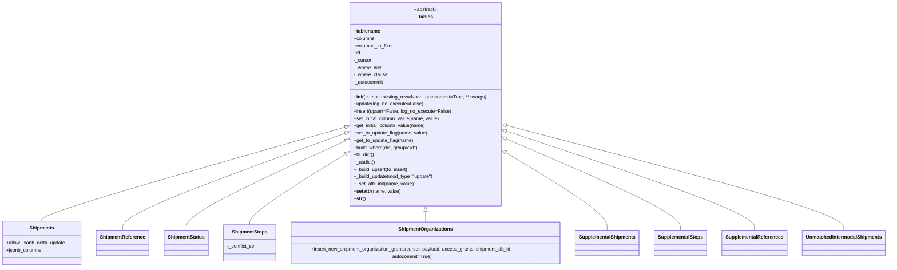

# Diagram: shipment_core/shipment_watchers/shipment_watchers/fvshared/tables_no_orm.py

> Auto-generated by Obscura crawlers

## Mermaid

### SVG

<svg id="container" width="2921.171875" xmlns="http://www.w3.org/2000/svg" class="classDiagram" height="882" viewBox="0 0 2921.171875 882" role="graphics-document document" aria-roledescription="class"><g><defs><marker id="container_class-aggregationStart" class="marker aggregation class" refX="18" refY="7" markerWidth="190" markerHeight="240" orient="auto"><path d="M 18,7 L9,13 L1,7 L9,1 Z"></path></marker></defs><defs><marker id="container_class-aggregationEnd" class="marker aggregation class" refX="1" refY="7" markerWidth="20" markerHeight="28" orient="auto"><path d="M 18,7 L9,13 L1,7 L9,1 Z"></path></marker></defs><defs><marker id="container_class-extensionStart" class="marker extension class" refX="18" refY="7" markerWidth="190" markerHeight="240" orient="auto"><path d="M 1,7 L18,13 V 1 Z"></path></marker></defs><defs><marker id="container_class-extensionEnd" class="marker extension class" refX="1" refY="7" markerWidth="20" markerHeight="28" orient="auto"><path d="M 1,1 V 13 L18,7 Z"></path></marker></defs><defs><marker id="container_class-compositionStart" class="marker composition class" refX="18" refY="7" markerWidth="190" markerHeight="240" orient="auto"><path d="M 18,7 L9,13 L1,7 L9,1 Z"></path></marker></defs><defs><marker id="container_class-compositionEnd" class="marker composition class" refX="1" refY="7" markerWidth="20" markerHeight="28" orient="auto"><path d="M 18,7 L9,13 L1,7 L9,1 Z"></path></marker></defs><defs><marker id="container_class-dependencyStart" class="marker dependency class" refX="6" refY="7" markerWidth="190" markerHeight="240" orient="auto"><path d="M 5,7 L9,13 L1,7 L9,1 Z"></path></marker></defs><defs><marker id="container_class-dependencyEnd" class="marker dependency class" refX="13" refY="7" markerWidth="20" markerHeight="28" orient="auto"><path d="M 18,7 L9,13 L14,7 L9,1 Z"></path></marker></defs><defs><marker id="container_class-lollipopStart" class="marker lollipop class" refX="13" refY="7" markerWidth="190" markerHeight="240" orient="auto"><circle stroke="black" fill="transparent" cx="7" cy="7" r="6"></circle></marker></defs><defs><marker id="container_class-lollipopEnd" class="marker lollipop class" refX="1" refY="7" markerWidth="190" markerHeight="240" orient="auto"><circle stroke="black" fill="transparent" cx="7" cy="7" r="6"></circle></marker></defs><g class="root"><g class="clusters"></g><g class="edgePaths"><path d="M1143.405,420.019L976.046,467.516C808.687,515.013,473.968,610.006,306.609,661.67C139.25,713.333,139.25,721.667,139.25,725.833L139.25,730" id="id_Tables_Shipments_1" class="edge-thickness-normal edge-pattern-solid relation" style=";;;" data-edge="true" data-et="edge" data-id="id_Tables_Shipments_1" data-points="W3sieCI6MTE2MCwieSI6NDE1LjMwOTU3MjY1MTY3MjR9LHsieCI6MTM5LjI1LCJ5Ijo3MDV9LHsieCI6MTM5LjI1LCJ5Ijo3MzB9XQ==" marker-start="url(#container_class-extensionStart)"></path><path d="M1143.762,439.883L1020.486,484.069C897.211,528.255,650.66,616.628,527.385,669.98C404.109,723.333,404.109,741.667,404.109,750.833L404.109,760" id="id_Tables_ShipmentReference_2" class="edge-thickness-normal edge-pattern-solid relation" style=";;;" data-edge="true" data-et="edge" data-id="id_Tables_ShipmentReference_2" data-points="W3sieCI6MTE2MCwieSI6NDM0LjA2MjM4MTcwNTkxN30seyJ4Ijo0MDQuMTA5Mzc1LCJ5Ijo3MDV9LHsieCI6NDA0LjEwOTM3NSwieSI6NzYwfV0=" marker-start="url(#container_class-extensionStart)"></path><path d="M1144.267,464.039L1054.94,504.199C965.613,544.359,786.959,624.68,697.632,674.006C608.305,723.333,608.305,741.667,608.305,750.833L608.305,760" id="id_Tables_ShipmentStatus_3" class="edge-thickness-normal edge-pattern-solid relation" style=";;;" data-edge="true" data-et="edge" data-id="id_Tables_ShipmentStatus_3" data-points="W3sieCI6MTE2MCwieSI6NDU2Ljk2NTUwODUxODI3NzF9LHsieCI6NjA4LjMwNDY4NzUsInkiOjcwNX0seyJ4Ijo2MDguMzA0Njg3NSwieSI6NzYwfV0=" marker-start="url(#container_class-extensionStart)"></path><path d="M1145.251,505.338L1090.383,538.615C1035.516,571.892,925.781,638.446,870.914,677.89C816.047,717.333,816.047,729.667,816.047,735.833L816.047,742" id="id_Tables_ShipmentStops_4" class="edge-thickness-normal edge-pattern-solid relation" style=";;;" data-edge="true" data-et="edge" data-id="id_Tables_ShipmentStops_4" data-points="W3sieCI6MTE2MCwieSI6NDk2LjM5MjUyOTAwNzE5Mjd9LHsieCI6ODE2LjA0Njg3NSwieSI6NzA1fSx7IngiOjgxNi4wNDY4NzUsInkiOjc0Mn1d" marker-start="url(#container_class-extensionStart)"></path><path d="M1411.266,697.25L1411.266,698.542C1411.266,699.833,1411.266,702.417,1411.266,709.375C1411.266,716.333,1411.266,727.667,1411.266,733.333L1411.266,739" id="id_Tables_ShipmentOrganizations_5" class="edge-thickness-normal edge-pattern-solid relation" style=";;;" data-edge="true" data-et="edge" data-id="id_Tables_ShipmentOrganizations_5" data-points="W3sieCI6MTQxMS4yNjU2MjUsInkiOjY4MH0seyJ4IjoxNDExLjI2NTYyNSwieSI6NzA1fSx7IngiOjE0MTEuMjY1NjI1LCJ5Ijo3Mzl9XQ==" marker-start="url(#container_class-extensionStart)"></path><path d="M1677.376,501.497L1734.683,535.414C1791.99,569.331,1906.605,637.166,1963.912,680.25C2021.219,723.333,2021.219,741.667,2021.219,750.833L2021.219,760" id="id_Tables_SupplementalShipments_6" class="edge-thickness-normal edge-pattern-solid relation" style=";;;" data-edge="true" data-et="edge" data-id="id_Tables_SupplementalShipments_6" data-points="W3sieCI6MTY2Mi41MzEyNSwieSI6NDkyLjcxMTI0ODMwMjg5MjE2fSx7IngiOjIwMjEuMjE4NzUsInkiOjcwNX0seyJ4IjoyMDIxLjIxODc1LCJ5Ijo3NjB9XQ==" marker-start="url(#container_class-extensionStart)"></path><path d="M1678.396,458.042L1774.808,499.202C1871.22,540.361,2064.043,622.681,2160.455,673.007C2256.867,723.333,2256.867,741.667,2256.867,750.833L2256.867,760" id="id_Tables_SupplementalStops_7" class="edge-thickness-normal edge-pattern-solid relation" style=";;;" data-edge="true" data-et="edge" data-id="id_Tables_SupplementalStops_7" data-points="W3sieCI6MTY2Mi41MzEyNSwieSI6NDUxLjI2OTA2Njk1NDkyM30seyJ4IjoyMjU2Ljg2NzE4NzUsInkiOjcwNX0seyJ4IjoyMjU2Ljg2NzE4NzUsInkiOjc2MH1d" marker-start="url(#container_class-extensionStart)"></path><path d="M1678.896,433.239L1814.732,478.532C1950.568,523.826,2222.241,614.413,2358.078,668.873C2493.914,723.333,2493.914,741.667,2493.914,750.833L2493.914,760" id="id_Tables_SupplementalReferences_8" class="edge-thickness-normal edge-pattern-solid relation" style=";;;" data-edge="true" data-et="edge" data-id="id_Tables_SupplementalReferences_8" data-points="W3sieCI6MTY2Mi41MzEyNSwieSI6NDI3Ljc4MjQwNTcwMzYwNTl9LHsieCI6MjQ5My45MTQwNjI1LCJ5Ijo3MDV9LHsieCI6MjQ5My45MTQwNjI1LCJ5Ijo3NjB9XQ==" marker-start="url(#container_class-extensionStart)"></path><path d="M1679.211,414.66L1862.707,463.05C2046.203,511.44,2413.195,608.22,2596.691,665.777C2780.188,723.333,2780.188,741.667,2780.188,750.833L2780.188,760" id="id_Tables_UnmatchedIntermodalShipments_9" class="edge-thickness-normal edge-pattern-solid relation" style=";;;" data-edge="true" data-et="edge" data-id="id_Tables_UnmatchedIntermodalShipments_9" data-points="W3sieCI6MTY2Mi41MzEyNSwieSI6NDEwLjI2MTU1MzkxNDQ2Mjh9LHsieCI6Mjc4MC4xODc1LCJ5Ijo3MDV9LHsieCI6Mjc4MC4xODc1LCJ5Ijo3NjB9XQ==" marker-start="url(#container_class-extensionStart)"></path></g><g class="edgeLabels"><g class="edgeLabel"><g class="label" data-id="id_Tables_Shipments_1" transform="translate(0, 0)"><foreignObject width="0" height="0">

</foreignObject></g></g><g class="edgeLabel"><g class="label" data-id="id_Tables_ShipmentReference_2" transform="translate(0, 0)"><foreignObject width="0" height="0">

</foreignObject></g></g><g class="edgeLabel"><g class="label" data-id="id_Tables_ShipmentStatus_3" transform="translate(0, 0)"><foreignObject width="0" height="0">

</foreignObject></g></g><g class="edgeLabel"><g class="label" data-id="id_Tables_ShipmentStops_4" transform="translate(0, 0)"><foreignObject width="0" height="0">

</foreignObject></g></g><g class="edgeLabel"><g class="label" data-id="id_Tables_ShipmentOrganizations_5" transform="translate(0, 0)"><foreignObject width="0" height="0">

</foreignObject></g></g><g class="edgeLabel"><g class="label" data-id="id_Tables_SupplementalShipments_6" transform="translate(0, 0)"><foreignObject width="0" height="0">

</foreignObject></g></g><g class="edgeLabel"><g class="label" data-id="id_Tables_SupplementalStops_7" transform="translate(0, 0)"><foreignObject width="0" height="0">

</foreignObject></g></g><g class="edgeLabel"><g class="label" data-id="id_Tables_SupplementalReferences_8" transform="translate(0, 0)"><foreignObject width="0" height="0">

</foreignObject></g></g><g class="edgeLabel"><g class="label" data-id="id_Tables_UnmatchedIntermodalShipments_9" transform="translate(0, 0)"><foreignObject width="0" height="0">

</foreignObject></g></g></g><g class="nodes"><g class="node default" id="classId-Tables-0" transform="translate(1411.265625, 344)"><g class="basic label-container"><path d="M-251.265625 -336 L251.265625 -336 L251.265625 336 L-251.265625 336" stroke="none" stroke-width="0" fill="#ECECFF" style=""></path><path d="M-251.265625 -336 C-103.54018008727815 -336, 44.18526482544371 -336, 251.265625 -336 M-251.265625 -336 C-98.91430697230467 -336, 53.437011055390656 -336, 251.265625 -336 M251.265625 -336 C251.265625 -78.57452094468846, 251.265625 178.85095811062308, 251.265625 336 M251.265625 -336 C251.265625 -172.1706891806122, 251.265625 -8.341378361224372, 251.265625 336 M251.265625 336 C143.98607262679678 336, 36.70652025359357 336, -251.265625 336 M251.265625 336 C109.95013831186304 336, -31.365348376273914 336, -251.265625 336 M-251.265625 336 C-251.265625 137.06403021391657, -251.265625 -61.871939572166866, -251.265625 -336 M-251.265625 336 C-251.265625 198.68327052794044, -251.265625 61.36654105588087, -251.265625 -336" stroke="#9370DB" stroke-width="1.3" fill="none" stroke-dasharray="0 0" style=""></path></g><g class="annotation-group text" transform="translate(-38.609375, -312)"><g class="label" style="" transform="translate(0,-12)"><foreignObject width="77.21875" height="24">

«abstract»

</foreignObject></g></g><g class="label-group text" transform="translate(-23.703125, -288)"><g class="label" style="font-weight: bolder" transform="translate(0,-12)"><foreignObject width="47.40625" height="24">

Tables

</foreignObject></g></g><g class="members-group text" transform="translate(-239.265625, -240)"><g class="label" style="" transform="translate(0,-12)"><foreignObject width="86.15625" height="24">

+<strong>tablename</strong>

</foreignObject></g><g class="label" style="" transform="translate(0,12)"><foreignObject width="69.21875" height="24">

+columns

</foreignObject></g><g class="label" style="" transform="translate(0,36)"><foreignObject width="133.78125" height="24">

+columns_to_filter

</foreignObject></g><g class="label" style="" transform="translate(0,60)"><foreignObject width="22.078125" height="24">

+id

</foreignObject></g><g class="label" style="" transform="translate(0,84)"><foreignObject width="58.90625" height="24">

-_cursor

</foreignObject></g><g class="label" style="" transform="translate(0,108)"><foreignObject width="92.34375" height="24">

-_where_dict

</foreignObject></g><g class="label" style="" transform="translate(0,132)"><foreignObject width="111.296875" height="24">

-_where_clause

</foreignObject></g><g class="label" style="" transform="translate(0,156)"><foreignObject width="100.453125" height="24">

-_autocommit

</foreignObject></g></g><g class="methods-group text" transform="translate(-239.265625, -24)"><g class="label" style="" transform="translate(0,-12)"><foreignObject width="439.921875" height="24">

+<strong>init</strong>(cursor, existing_row=None, autocommit=True, **kwargs)

</foreignObject></g><g class="label" style="" transform="translate(0,12)"><foreignObject width="227.046875" height="24">

+update(log_no_execute=False)

</foreignObject></g><g class="label" style="" transform="translate(0,36)"><foreignObject width="316.9375" height="24">

+insert(upsert=False, log_no_execute=False)

</foreignObject></g><g class="label" style="" transform="translate(0,60)"><foreignObject width="286.359375" height="24">

+set_initial_column_value(name, value)

</foreignObject></g><g class="label" style="" transform="translate(0,84)"><foreignObject width="240.15625" height="24">

+get_initial_column_value(name)

</foreignObject></g><g class="label" style="" transform="translate(0,108)"><foreignObject width="243.484375" height="24">

+set_to_update_flag(name, value)

</foreignObject></g><g class="label" style="" transform="translate(0,132)"><foreignObject width="197.265625" height="24">

+get_to_update_flag(name)

</foreignObject></g><g class="label" style="" transform="translate(0,156)"><foreignObject width="216.015625" height="24">

+build_where(dct, group="id")

</foreignObject></g><g class="label" style="" transform="translate(0,180)"><foreignObject width="68.34375" height="24">

+to_dict()

</foreignObject></g><g class="label" style="" transform="translate(0,204)"><foreignObject width="68.59375" height="24">

+_asdict()

</foreignObject></g><g class="label" style="" transform="translate(0,228)"><foreignObject width="182.78125" height="24">

+_build_upsert(to_insert)

</foreignObject></g><g class="label" style="" transform="translate(0,252)"><foreignObject width="266.609375" height="24">

+_build_update(mod_type="update")

</foreignObject></g><g class="label" style="" transform="translate(0,276)"><foreignObject width="200.328125" height="24">

+_set_attr_init(name, value)

</foreignObject></g><g class="label" style="" transform="translate(0,300)"><foreignObject width="155.765625" height="24">

+<strong>setattr</strong>(name, value)

</foreignObject></g><g class="label" style="" transform="translate(0,324)"><foreignObject width="38.6875" height="24">

+<strong>str</strong>()

</foreignObject></g></g><g class="divider" style=""><path d="M-251.265625 -264 C-132.38412960486076 -264, -13.50263420972152 -264, 251.265625 -264 M-251.265625 -264 C-106.44182024500037 -264, 38.381984509999256 -264, 251.265625 -264" stroke="#9370DB" stroke-width="1.3" fill="none" stroke-dasharray="0 0" style=""></path></g><g class="divider" style=""><path d="M-251.265625 -48 C-99.09239902334741 -48, 53.08082695330518 -48, 251.265625 -48 M-251.265625 -48 C-102.34414190616067 -48, 46.577341187678655 -48, 251.265625 -48" stroke="#9370DB" stroke-width="1.3" fill="none" stroke-dasharray="0 0" style=""></path></g></g><g class="node default" id="classId-Shipments-1" transform="translate(139.25, 802)"><g class="basic label-container"><path d="M-131.25 -72 L131.25 -72 L131.25 72 L-131.25 72" stroke="none" stroke-width="0" fill="#ECECFF" style=""></path><path d="M-131.25 -72 C-76.12864794885886 -72, -21.007295897717725 -72, 131.25 -72 M-131.25 -72 C-61.8390456458807 -72, 7.571908708238595 -72, 131.25 -72 M131.25 -72 C131.25 -42.84844967579788, 131.25 -13.696899351595754, 131.25 72 M131.25 -72 C131.25 -18.504860509241936, 131.25 34.99027898151613, 131.25 72 M131.25 72 C26.39330401958985 72, -78.4633919608203 72, -131.25 72 M131.25 72 C50.361503956183086 72, -30.52699208763383 72, -131.25 72 M-131.25 72 C-131.25 22.933146981470983, -131.25 -26.133706037058033, -131.25 -72 M-131.25 72 C-131.25 15.108671716904098, -131.25 -41.782656566191804, -131.25 -72" stroke="#9370DB" stroke-width="1.3" fill="none" stroke-dasharray="0 0" style=""></path></g><g class="annotation-group text" transform="translate(0, -48)"></g><g class="label-group text" transform="translate(-38.96875, -48)"><g class="label" style="font-weight: bolder" transform="translate(0,-12)"><foreignObject width="77.9375" height="24">

Shipments

</foreignObject></g></g><g class="members-group text" transform="translate(-119.25, 0)"><g class="label" style="" transform="translate(0,-12)"><foreignObject width="199.53125" height="24">

+allow_jsonb_delta_update

</foreignObject></g><g class="label" style="" transform="translate(0,12)"><foreignObject width="116.921875" height="24">

+jsonb_columns

</foreignObject></g></g><g class="methods-group text" transform="translate(-119.25, 72)"></g><g class="divider" style=""><path d="M-131.25 -24 C-41.20637114300247 -24, 48.83725771399506 -24, 131.25 -24 M-131.25 -24 C-40.151859766727966 -24, 50.94628046654407 -24, 131.25 -24" stroke="#9370DB" stroke-width="1.3" fill="none" stroke-dasharray="0 0" style=""></path></g><g class="divider" style=""><path d="M-131.25 48 C-68.75697878111916 48, -6.263957562238332 48, 131.25 48 M-131.25 48 C-62.64553990883722 48, 5.958920182325556 48, 131.25 48" stroke="#9370DB" stroke-width="1.3" fill="none" stroke-dasharray="0 0" style=""></path></g></g><g class="node default" id="classId-ShipmentReference-2" transform="translate(404.109375, 802)"><g class="basic label-container"><path d="M-83.609375 -42 L83.609375 -42 L83.609375 42 L-83.609375 42" stroke="none" stroke-width="0" fill="#ECECFF" style=""></path><path d="M-83.609375 -42 C-49.88675688707327 -42, -16.164138774146537 -42, 83.609375 -42 M-83.609375 -42 C-37.898140340197244 -42, 7.813094319605511 -42, 83.609375 -42 M83.609375 -42 C83.609375 -18.441948423486497, 83.609375 5.116103153027005, 83.609375 42 M83.609375 -42 C83.609375 -17.731145659966284, 83.609375 6.537708680067432, 83.609375 42 M83.609375 42 C48.44788589157267 42, 13.286396783145335 42, -83.609375 42 M83.609375 42 C46.64630059705443 42, 9.683226194108855 42, -83.609375 42 M-83.609375 42 C-83.609375 18.411606321393442, -83.609375 -5.176787357213115, -83.609375 -42 M-83.609375 42 C-83.609375 19.286099783398836, -83.609375 -3.4278004332023286, -83.609375 -42" stroke="#9370DB" stroke-width="1.3" fill="none" stroke-dasharray="0 0" style=""></path></g><g class="annotation-group text" transform="translate(0, -18)"></g><g class="label-group text" transform="translate(-71.609375, -18)"><g class="label" style="font-weight: bolder" transform="translate(0,-12)"><foreignObject width="143.21875" height="24">

ShipmentReference

</foreignObject></g></g><g class="members-group text" transform="translate(-71.609375, 30)"></g><g class="methods-group text" transform="translate(-71.609375, 60)"></g><g class="divider" style=""><path d="M-83.609375 6 C-43.467289797294 6, -3.3252045945880013 6, 83.609375 6 M-83.609375 6 C-17.137281982676427 6, 49.334811034647146 6, 83.609375 6" stroke="#9370DB" stroke-width="1.3" fill="none" stroke-dasharray="0 0" style=""></path></g><g class="divider" style=""><path d="M-83.609375 24 C-43.453434862820075 24, -3.2974947256401492 24, 83.609375 24 M-83.609375 24 C-36.36259700813141 24, 10.884180983737181 24, 83.609375 24" stroke="#9370DB" stroke-width="1.3" fill="none" stroke-dasharray="0 0" style=""></path></g></g><g class="node default" id="classId-ShipmentStatus-3" transform="translate(608.3046875, 802)"><g class="basic label-container"><path d="M-70.5859375 -42 L70.5859375 -42 L70.5859375 42 L-70.5859375 42" stroke="none" stroke-width="0" fill="#ECECFF" style=""></path><path d="M-70.5859375 -42 C-16.19616373070057 -42, 38.19361003859886 -42, 70.5859375 -42 M-70.5859375 -42 C-28.398238701877602 -42, 13.789460096244795 -42, 70.5859375 -42 M70.5859375 -42 C70.5859375 -24.63079018796123, 70.5859375 -7.261580375922463, 70.5859375 42 M70.5859375 -42 C70.5859375 -24.145733655507293, 70.5859375 -6.291467311014586, 70.5859375 42 M70.5859375 42 C28.344206696799873 42, -13.897524106400255 42, -70.5859375 42 M70.5859375 42 C31.89288814451087 42, -6.80016121097826 42, -70.5859375 42 M-70.5859375 42 C-70.5859375 14.138166923890473, -70.5859375 -13.723666152219053, -70.5859375 -42 M-70.5859375 42 C-70.5859375 8.677578745967203, -70.5859375 -24.644842508065594, -70.5859375 -42" stroke="#9370DB" stroke-width="1.3" fill="none" stroke-dasharray="0 0" style=""></path></g><g class="annotation-group text" transform="translate(0, -18)"></g><g class="label-group text" transform="translate(-58.5859375, -18)"><g class="label" style="font-weight: bolder" transform="translate(0,-12)"><foreignObject width="117.171875" height="24">

ShipmentStatus

</foreignObject></g></g><g class="members-group text" transform="translate(-58.5859375, 30)"></g><g class="methods-group text" transform="translate(-58.5859375, 60)"></g><g class="divider" style=""><path d="M-70.5859375 6 C-15.375801375191458 6, 39.834334749617085 6, 70.5859375 6 M-70.5859375 6 C-39.452631538999285 6, -8.319325577998576 6, 70.5859375 6" stroke="#9370DB" stroke-width="1.3" fill="none" stroke-dasharray="0 0" style=""></path></g><g class="divider" style=""><path d="M-70.5859375 24 C-40.110110681793685 24, -9.634283863587363 24, 70.5859375 24 M-70.5859375 24 C-22.44748843248221 24, 25.69096063503558 24, 70.5859375 24" stroke="#9370DB" stroke-width="1.3" fill="none" stroke-dasharray="0 0" style=""></path></g></g><g class="node default" id="classId-ShipmentStops-4" transform="translate(816.046875, 802)"><g class="basic label-container"><path d="M-87.15625 -60 L87.15625 -60 L87.15625 60 L-87.15625 60" stroke="none" stroke-width="0" fill="#ECECFF" style=""></path><path d="M-87.15625 -60 C-35.76515537620881 -60, 15.62593924758238 -60, 87.15625 -60 M-87.15625 -60 C-27.721022639976376 -60, 31.71420472004725 -60, 87.15625 -60 M87.15625 -60 C87.15625 -14.526862353051136, 87.15625 30.946275293897727, 87.15625 60 M87.15625 -60 C87.15625 -16.005150987059466, 87.15625 27.98969802588107, 87.15625 60 M87.15625 60 C48.219023683250946 60, 9.281797366501891 60, -87.15625 60 M87.15625 60 C28.096275498488232 60, -30.963699003023535 60, -87.15625 60 M-87.15625 60 C-87.15625 13.772557028714957, -87.15625 -32.45488594257009, -87.15625 -60 M-87.15625 60 C-87.15625 23.26770907733593, -87.15625 -13.46458184532814, -87.15625 -60" stroke="#9370DB" stroke-width="1.3" fill="none" stroke-dasharray="0 0" style=""></path></g><g class="annotation-group text" transform="translate(0, -36)"></g><g class="label-group text" transform="translate(-55.9375, -36)"><g class="label" style="font-weight: bolder" transform="translate(0,-12)"><foreignObject width="111.875" height="24">

ShipmentStops

</foreignObject></g></g><g class="members-group text" transform="translate(-75.15625, 12)"><g class="label" style="" transform="translate(0,-12)"><foreignObject width="94.375" height="24">

-_conflict_str

</foreignObject></g></g><g class="methods-group text" transform="translate(-75.15625, 60)"></g><g class="divider" style=""><path d="M-87.15625 -12 C-40.91580819541493 -12, 5.324633609170135 -12, 87.15625 -12 M-87.15625 -12 C-22.540434930238433 -12, 42.07538013952313 -12, 87.15625 -12" stroke="#9370DB" stroke-width="1.3" fill="none" stroke-dasharray="0 0" style=""></path></g><g class="divider" style=""><path d="M-87.15625 36 C-20.37770063378754 36, 46.40084873242492 36, 87.15625 36 M-87.15625 36 C-38.09480187069243 36, 10.966646258615143 36, 87.15625 36" stroke="#9370DB" stroke-width="1.3" fill="none" stroke-dasharray="0 0" style=""></path></g></g><g class="node default" id="classId-ShipmentOrganizations-5" transform="translate(1411.265625, 802)"><g class="basic label-container"><path d="M-458.0625 -63 L458.0625 -63 L458.0625 63 L-458.0625 63" stroke="none" stroke-width="0" fill="#ECECFF" style=""></path><path d="M-458.0625 -63 C-245.7375658520683 -63, -33.41263170413657 -63, 458.0625 -63 M-458.0625 -63 C-148.07176560461147 -63, 161.91896879077706 -63, 458.0625 -63 M458.0625 -63 C458.0625 -23.31407966598846, 458.0625 16.371840668023083, 458.0625 63 M458.0625 -63 C458.0625 -20.921673074974336, 458.0625 21.156653850051327, 458.0625 63 M458.0625 63 C225.88718600935906 63, -6.288127981281889 63, -458.0625 63 M458.0625 63 C180.9650388227535 63, -96.13242235449297 63, -458.0625 63 M-458.0625 63 C-458.0625 16.02276749882308, -458.0625 -30.954465002353842, -458.0625 -63 M-458.0625 63 C-458.0625 17.287458647149286, -458.0625 -28.425082705701428, -458.0625 -63" stroke="#9370DB" stroke-width="1.3" fill="none" stroke-dasharray="0 0" style=""></path></g><g class="annotation-group text" transform="translate(0, -39)"></g><g class="label-group text" transform="translate(-85.65625, -39)"><g class="label" style="font-weight: bolder" transform="translate(0,-12)"><foreignObject width="171.3125" height="24">

ShipmentOrganizations

</foreignObject></g></g><g class="members-group text" transform="translate(-446.0625, 9)"></g><g class="methods-group text" transform="translate(-446.0625, 39)"><g class="label" style="" transform="translate(0,-12)"><foreignObject width="806.46875" height="24">

+insert_new_shipment_organization_grants(cursor, payload, access_grants, shipment_db_id, autocommit=True)

</foreignObject></g></g><g class="divider" style=""><path d="M-458.0625 -15 C-221.97598711951727 -15, 14.110525760965459 -15, 458.0625 -15 M-458.0625 -15 C-154.7404700601714 -15, 148.58155987965722 -15, 458.0625 -15" stroke="#9370DB" stroke-width="1.3" fill="none" stroke-dasharray="0 0" style=""></path></g><g class="divider" style=""><path d="M-458.0625 9 C-150.39726877479933 9, 157.26796245040134 9, 458.0625 9 M-458.0625 9 C-260.78680869337063 9, -63.51111738674126 9, 458.0625 9" stroke="#9370DB" stroke-width="1.3" fill="none" stroke-dasharray="0 0" style=""></path></g></g><g class="node default" id="classId-SupplementalShipments-6" transform="translate(2021.21875, 802)"><g class="basic label-container"><path d="M-101.890625 -42 L101.890625 -42 L101.890625 42 L-101.890625 42" stroke="none" stroke-width="0" fill="#ECECFF" style=""></path><path d="M-101.890625 -42 C-59.06285317358845 -42, -16.2350813471769 -42, 101.890625 -42 M-101.890625 -42 C-40.73927264217844 -42, 20.412079715643117 -42, 101.890625 -42 M101.890625 -42 C101.890625 -15.00887096168292, 101.890625 11.98225807663416, 101.890625 42 M101.890625 -42 C101.890625 -18.5646386341447, 101.890625 4.8707227317106, 101.890625 42 M101.890625 42 C28.70618820037157 42, -44.47824859925686 42, -101.890625 42 M101.890625 42 C58.53024261194354 42, 15.169860223887085 42, -101.890625 42 M-101.890625 42 C-101.890625 11.274884160941351, -101.890625 -19.450231678117298, -101.890625 -42 M-101.890625 42 C-101.890625 19.598071699919693, -101.890625 -2.803856600160614, -101.890625 -42" stroke="#9370DB" stroke-width="1.3" fill="none" stroke-dasharray="0 0" style=""></path></g><g class="annotation-group text" transform="translate(0, -18)"></g><g class="label-group text" transform="translate(-89.890625, -18)"><g class="label" style="font-weight: bolder" transform="translate(0,-12)"><foreignObject width="179.78125" height="24">

SupplementalShipments

</foreignObject></g></g><g class="members-group text" transform="translate(-89.890625, 30)"></g><g class="methods-group text" transform="translate(-89.890625, 60)"></g><g class="divider" style=""><path d="M-101.890625 6 C-33.06564952603023 6, 35.759325947939544 6, 101.890625 6 M-101.890625 6 C-30.72075798657515 6, 40.4491090268497 6, 101.890625 6" stroke="#9370DB" stroke-width="1.3" fill="none" stroke-dasharray="0 0" style=""></path></g><g class="divider" style=""><path d="M-101.890625 24 C-48.482174531402556 24, 4.926275937194887 24, 101.890625 24 M-101.890625 24 C-47.573941115571174 24, 6.742742768857653 24, 101.890625 24" stroke="#9370DB" stroke-width="1.3" fill="none" stroke-dasharray="0 0" style=""></path></g></g><g class="node default" id="classId-SupplementalStops-7" transform="translate(2256.8671875, 802)"><g class="basic label-container"><path d="M-83.7578125 -42 L83.7578125 -42 L83.7578125 42 L-83.7578125 42" stroke="none" stroke-width="0" fill="#ECECFF" style=""></path><path d="M-83.7578125 -42 C-38.74001654885574 -42, 6.277779402288516 -42, 83.7578125 -42 M-83.7578125 -42 C-49.16371508891068 -42, -14.569617677821356 -42, 83.7578125 -42 M83.7578125 -42 C83.7578125 -9.661218302120666, 83.7578125 22.677563395758668, 83.7578125 42 M83.7578125 -42 C83.7578125 -18.288969975904553, 83.7578125 5.422060048190893, 83.7578125 42 M83.7578125 42 C40.76905337743344 42, -2.219705745133126 42, -83.7578125 42 M83.7578125 42 C49.40567737951709 42, 15.053542259034174 42, -83.7578125 42 M-83.7578125 42 C-83.7578125 14.43159579915358, -83.7578125 -13.13680840169284, -83.7578125 -42 M-83.7578125 42 C-83.7578125 18.192188415541303, -83.7578125 -5.615623168917395, -83.7578125 -42" stroke="#9370DB" stroke-width="1.3" fill="none" stroke-dasharray="0 0" style=""></path></g><g class="annotation-group text" transform="translate(0, -18)"></g><g class="label-group text" transform="translate(-71.7578125, -18)"><g class="label" style="font-weight: bolder" transform="translate(0,-12)"><foreignObject width="143.515625" height="24">

SupplementalStops

</foreignObject></g></g><g class="members-group text" transform="translate(-71.7578125, 30)"></g><g class="methods-group text" transform="translate(-71.7578125, 60)"></g><g class="divider" style=""><path d="M-83.7578125 6 C-27.38497325422062 6, 28.987865991558763 6, 83.7578125 6 M-83.7578125 6 C-43.98059186394972 6, -4.203371227899439 6, 83.7578125 6" stroke="#9370DB" stroke-width="1.3" fill="none" stroke-dasharray="0 0" style=""></path></g><g class="divider" style=""><path d="M-83.7578125 24 C-18.85925074290445 24, 46.0393110141911 24, 83.7578125 24 M-83.7578125 24 C-29.424731819337282 24, 24.908348861325436 24, 83.7578125 24" stroke="#9370DB" stroke-width="1.3" fill="none" stroke-dasharray="0 0" style=""></path></g></g><g class="node default" id="classId-SupplementalReferences-8" transform="translate(2493.9140625, 802)"><g class="basic label-container"><path d="M-103.2890625 -42 L103.2890625 -42 L103.2890625 42 L-103.2890625 42" stroke="none" stroke-width="0" fill="#ECECFF" style=""></path><path d="M-103.2890625 -42 C-36.17499512743244 -42, 30.939072245135122 -42, 103.2890625 -42 M-103.2890625 -42 C-24.797622414938147 -42, 53.69381767012371 -42, 103.2890625 -42 M103.2890625 -42 C103.2890625 -8.841647271187291, 103.2890625 24.316705457625417, 103.2890625 42 M103.2890625 -42 C103.2890625 -16.354323645531597, 103.2890625 9.291352708936806, 103.2890625 42 M103.2890625 42 C26.805343973459927 42, -49.67837455308015 42, -103.2890625 42 M103.2890625 42 C42.292801705562454 42, -18.703459088875093 42, -103.2890625 42 M-103.2890625 42 C-103.2890625 12.512627889607653, -103.2890625 -16.974744220784693, -103.2890625 -42 M-103.2890625 42 C-103.2890625 10.656395401262113, -103.2890625 -20.687209197475774, -103.2890625 -42" stroke="#9370DB" stroke-width="1.3" fill="none" stroke-dasharray="0 0" style=""></path></g><g class="annotation-group text" transform="translate(0, -18)"></g><g class="label-group text" transform="translate(-91.2890625, -18)"><g class="label" style="font-weight: bolder" transform="translate(0,-12)"><foreignObject width="182.578125" height="24">

SupplementalReferences

</foreignObject></g></g><g class="members-group text" transform="translate(-91.2890625, 30)"></g><g class="methods-group text" transform="translate(-91.2890625, 60)"></g><g class="divider" style=""><path d="M-103.2890625 6 C-38.070367872190786 6, 27.148326755618427 6, 103.2890625 6 M-103.2890625 6 C-30.32309895863783 6, 42.64286458272434 6, 103.2890625 6" stroke="#9370DB" stroke-width="1.3" fill="none" stroke-dasharray="0 0" style=""></path></g><g class="divider" style=""><path d="M-103.2890625 24 C-39.50392231829347 24, 24.28121786341306 24, 103.2890625 24 M-103.2890625 24 C-60.10429572752583 24, -16.91952895505166 24, 103.2890625 24" stroke="#9370DB" stroke-width="1.3" fill="none" stroke-dasharray="0 0" style=""></path></g></g><g class="node default" id="classId-UnmatchedIntermodalShipments-9" transform="translate(2780.1875, 802)"><g class="basic label-container"><path d="M-132.984375 -42 L132.984375 -42 L132.984375 42 L-132.984375 42" stroke="none" stroke-width="0" fill="#ECECFF" style=""></path><path d="M-132.984375 -42 C-46.18282221971258 -42, 40.618730560574846 -42, 132.984375 -42 M-132.984375 -42 C-36.374831268067496 -42, 60.23471246386501 -42, 132.984375 -42 M132.984375 -42 C132.984375 -13.450371227207956, 132.984375 15.099257545584088, 132.984375 42 M132.984375 -42 C132.984375 -20.990841720766166, 132.984375 0.01831655846766722, 132.984375 42 M132.984375 42 C27.935277971413612 42, -77.11381905717278 42, -132.984375 42 M132.984375 42 C70.98611367189176 42, 8.98785234378353 42, -132.984375 42 M-132.984375 42 C-132.984375 16.012687426373862, -132.984375 -9.974625147252276, -132.984375 -42 M-132.984375 42 C-132.984375 23.342255192306073, -132.984375 4.684510384612146, -132.984375 -42" stroke="#9370DB" stroke-width="1.3" fill="none" stroke-dasharray="0 0" style=""></path></g><g class="annotation-group text" transform="translate(0, -18)"></g><g class="label-group text" transform="translate(-120.984375, -18)"><g class="label" style="font-weight: bolder" transform="translate(0,-12)"><foreignObject width="241.96875" height="24">

UnmatchedIntermodalShipments

</foreignObject></g></g><g class="members-group text" transform="translate(-120.984375, 30)"></g><g class="methods-group text" transform="translate(-120.984375, 60)"></g><g class="divider" style=""><path d="M-132.984375 6 C-42.7909176244753 6, 47.4025397510494 6, 132.984375 6 M-132.984375 6 C-68.84530664301485 6, -4.706238286029702 6, 132.984375 6" stroke="#9370DB" stroke-width="1.3" fill="none" stroke-dasharray="0 0" style=""></path></g><g class="divider" style=""><path d="M-132.984375 24 C-32.84711812575581 24, 67.29013874848837 24, 132.984375 24 M-132.984375 24 C-53.50732669555104 24, 25.969721608897913 24, 132.984375 24" stroke="#9370DB" stroke-width="1.3" fill="none" stroke-dasharray="0 0" style=""></path></g></g></g></g></g></svg>
