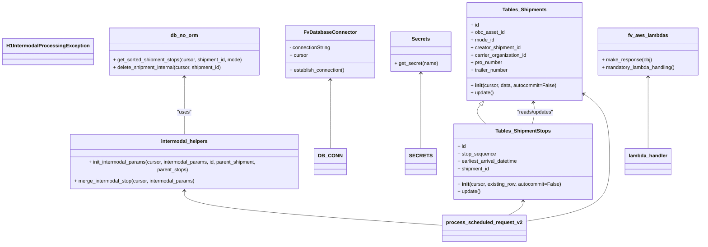

# Diagram: shipment_core/shipment_watchers/shipment_watchers/intermodal/h1_intermodal_processing.py


> Auto-generated by Obscura crawlers

## Diagram 1

```mermaid
flowchart TD
  A[lambda_handler(event, context, audit_refs)] -->|calls| B[SECRETS.get_secret(SecretNames.DATABASE)]
  B --> C[DB_CONN.establish_connection()]
  C --> D[cursor = DB_CONN.cursor]
  D --> E[process_scheduled_request_v2(cursor, event, context)]
  E --> F[get_matching_shipments(cursor)]
  F --> G{matching_shipments empty?}
  G -- Yes --> H[logging.info("No shipments to process")]\n--> I[fv.aws.lambdas.make_response({"Done":"No Shipments"})]
  G -- No --> J[for work in matching_shipments]
  J --> K[tables.Shipments(cursor, shipment.child_shipment)]
  K --> L[init_intermodal_params(cursor, intermodal_params, child_shipment.id, parent_shipment, parent_stops)]
  L --> M{intermodal_params[IP_PS] set?}
  M -- No --> N[continue loop]
  M -- Yes --> O[for existing_stop in sorted_existing_intermodal_stops]
  O --> P[tables.ShipmentStops(cursor, existing_row)]
  P --> Q[merge_intermodal_stop(cursor, intermodal_params)]
  Q -- True --> R[stop_row.update() & update intermodal_params stops/count]
  R --> S[UPDATE shipment_references SET shipment_id = parent_id WHERE shipment_id = child_id]
  S --> T[db_no_orm.delete_shipment_internal(cursor, child_shipment.id)]
  T --> U[intermodal_params[IP_ES].mode_id = intermodal_params[IP_SMI]; intermodal_params[IP_ES].update()]
  U --> V{elapsed_time > 280s?}
  V -- Yes --> W[logging.warning("Terminating early...")]\n--> X[break]
  V -- No --> J
  X --> Y[logging.info(f"Finished... {num_merged_shipments} merged")]
  Y --> Z[fv.aws.lambdas.make_response({"Done":"Maybe"})]
```

> SVG rendering failed for this diagram.

## Diagram 2



### SVG

<svg id="container" width="2212.140625" xmlns="http://www.w3.org/2000/svg" class="classDiagram" height="776" viewBox="0 0 2212.140625 776" role="graphics-document document" aria-roledescription="class"><style>#container{font-family:"trebuchet ms",verdana,arial,sans-serif;font-size:16px;fill:#333;}@keyframes edge-animation-frame{from{stroke-dashoffset:0;}}@keyframes dash{to{stroke-dashoffset:0;}}#container .edge-animation-slow{stroke-dasharray:9,5!important;stroke-dashoffset:900;animation:dash 50s linear infinite;stroke-linecap:round;}#container .edge-animation-fast{stroke-dasharray:9,5!important;stroke-dashoffset:900;animation:dash 20s linear infinite;stroke-linecap:round;}#container .error-icon{fill:#552222;}#container .error-text{fill:#552222;stroke:#552222;}#container .edge-thickness-normal{stroke-width:1px;}#container .edge-thickness-thick{stroke-width:3.5px;}#container .edge-pattern-solid{stroke-dasharray:0;}#container .edge-thickness-invisible{stroke-width:0;fill:none;}#container .edge-pattern-dashed{stroke-dasharray:3;}#container .edge-pattern-dotted{stroke-dasharray:2;}#container .marker{fill:#333333;stroke:#333333;}#container .marker.cross{stroke:#333333;}#container svg{font-family:"trebuchet ms",verdana,arial,sans-serif;font-size:16px;}#container p{margin:0;}#container g.classGroup text{fill:#9370DB;stroke:none;font-family:"trebuchet ms",verdana,arial,sans-serif;font-size:10px;}#container g.classGroup text .title{font-weight:bolder;}#container .nodeLabel,#container .edgeLabel{color:#131300;}#container .edgeLabel .label rect{fill:#ECECFF;}#container .label text{fill:#131300;}#container .labelBkg{background:#ECECFF;}#container .edgeLabel .label span{background:#ECECFF;}#container .classTitle{font-weight:bolder;}#container .node rect,#container .node circle,#container .node ellipse,#container .node polygon,#container .node path{fill:#ECECFF;stroke:#9370DB;stroke-width:1px;}#container .divider{stroke:#9370DB;stroke-width:1;}#container g.clickable{cursor:pointer;}#container g.classGroup rect{fill:#ECECFF;stroke:#9370DB;}#container g.classGroup line{stroke:#9370DB;stroke-width:1;}#container .classLabel .box{stroke:none;stroke-width:0;fill:#ECECFF;opacity:0.5;}#container .classLabel .label{fill:#9370DB;font-size:10px;}#container .relation{stroke:#333333;stroke-width:1;fill:none;}#container .dashed-line{stroke-dasharray:3;}#container .dotted-line{stroke-dasharray:1 2;}#container #compositionStart,#container .composition{fill:#333333!important;stroke:#333333!important;stroke-width:1;}#container #compositionEnd,#container .composition{fill:#333333!important;stroke:#333333!important;stroke-width:1;}#container #dependencyStart,#container .dependency{fill:#333333!important;stroke:#333333!important;stroke-width:1;}#container #dependencyStart,#container .dependency{fill:#333333!important;stroke:#333333!important;stroke-width:1;}#container #extensionStart,#container .extension{fill:transparent!important;stroke:#333333!important;stroke-width:1;}#container #extensionEnd,#container .extension{fill:transparent!important;stroke:#333333!important;stroke-width:1;}#container #aggregationStart,#container .aggregation{fill:transparent!important;stroke:#333333!important;stroke-width:1;}#container #aggregationEnd,#container .aggregation{fill:transparent!important;stroke:#333333!important;stroke-width:1;}#container #lollipopStart,#container .lollipop{fill:#ECECFF!important;stroke:#333333!important;stroke-width:1;}#container #lollipopEnd,#container .lollipop{fill:#ECECFF!important;stroke:#333333!important;stroke-width:1;}#container .edgeTerminals{font-size:11px;line-height:initial;}#container .classTitleText{text-anchor:middle;font-size:18px;fill:#333;}#container .label-icon{display:inline-block;height:1em;overflow:visible;vertical-align:-0.125em;}#container .node .label-icon path{fill:currentColor;stroke:revert;stroke-width:revert;}#container :root{--mermaid-font-family:"trebuchet ms",verdana,arial,sans-serif;}</style><g><defs><marker id="container_class-aggregationStart" class="marker aggregation class" refX="18" refY="7" markerWidth="190" markerHeight="240" orient="auto"><path d="M 18,7 L9,13 L1,7 L9,1 Z"></path></marker></defs><defs><marker id="container_class-aggregationEnd" class="marker aggregation class" refX="1" refY="7" markerWidth="20" markerHeight="28" orient="auto"><path d="M 18,7 L9,13 L1,7 L9,1 Z"></path></marker></defs><defs><marker id="container_class-extensionStart" class="marker extension class" refX="18" refY="7" markerWidth="190" markerHeight="240" orient="auto"><path d="M 1,7 L18,13 V 1 Z"></path></marker></defs><defs><marker id="container_class-extensionEnd" class="marker extension class" refX="1" refY="7" markerWidth="20" markerHeight="28" orient="auto"><path d="M 1,1 V 13 L18,7 Z"></path></marker></defs><defs><marker id="container_class-compositionStart" class="marker composition class" refX="18" refY="7" markerWidth="190" markerHeight="240" orient="auto"><path d="M 18,7 L9,13 L1,7 L9,1 Z"></path></marker></defs><defs><marker id="container_class-compositionEnd" class="marker composition class" refX="1" refY="7" markerWidth="20" markerHeight="28" orient="auto"><path d="M 18,7 L9,13 L1,7 L9,1 Z"></path></marker></defs><defs><marker id="container_class-dependencyStart" class="marker dependency class" refX="6" refY="7" markerWidth="190" markerHeight="240" orient="auto"><path d="M 5,7 L9,13 L1,7 L9,1 Z"></path></marker></defs><defs><marker id="container_class-dependencyEnd" class="marker dependency class" refX="13" refY="7" markerWidth="20" markerHeight="28" orient="auto"><path d="M 18,7 L9,13 L14,7 L9,1 Z"></path></marker></defs><defs><marker id="container_class-lollipopStart" class="marker lollipop class" refX="13" refY="7" markerWidth="190" markerHeight="240" orient="auto"><circle stroke="black" fill="transparent" cx="7" cy="7" r="6"></circle></marker></defs><defs><marker id="container_class-lollipopEnd" class="marker lollipop class" refX="1" refY="7" markerWidth="190" markerHeight="240" orient="auto"><circle stroke="black" fill="transparent" cx="7" cy="7" r="6"></circle></marker></defs><g class="root"><g class="clusters"></g><g class="edgePaths"><path d="M1041.762,254L1041.762,271.167C1041.762,288.333,1041.762,322.667,1041.762,359C1041.762,395.333,1041.762,433.667,1041.762,452.833L1041.762,472" id="id_FvDatabaseConnector_DB_CONN_1" class="edge-thickness-normal edge-pattern-solid relation" style=";;;" data-edge="true" data-et="edge" data-id="id_FvDatabaseConnector_DB_CONN_1" data-points="W3sieCI6MTA0MS43NjE3MTg3NSwieSI6MjQ4fSx7IngiOjEwNDEuNzYxNzE4NzUsInkiOjM1N30seyJ4IjoxMDQxLjc2MTcxODc1LCJ5Ijo0NzJ9XQ==" marker-start="url(#container_class-dependencyStart)"></path><path d="M1326.77,233L1326.77,253.667C1326.77,274.333,1326.77,315.667,1326.77,355.5C1326.77,395.333,1326.77,433.667,1326.77,452.833L1326.77,472" id="id_Secrets_SECRETS_2" class="edge-thickness-normal edge-pattern-solid relation" style=";;;" data-edge="true" data-et="edge" data-id="id_Secrets_SECRETS_2" data-points="W3sieCI6MTMyNi43Njk1MzEyNSwieSI6MjI3fSx7IngiOjEzMjYuNzY5NTMxMjUsInkiOjM1N30seyJ4IjoxMzI2Ljc2OTUzMTI1LCJ5Ijo0NzJ9XQ==" marker-start="url(#container_class-dependencyStart)"></path><path d="M1512.388,333.286L1509.116,337.239C1505.843,341.191,1499.297,349.095,1502.03,359.214C1504.763,369.333,1516.774,381.667,1522.78,387.833L1528.785,394" id="id_Tables_Shipments_Tables_ShipmentStops_3" class="edge-thickness-normal edge-pattern-solid relation" style=";;;" data-edge="true" data-et="edge" data-id="id_Tables_Shipments_Tables_ShipmentStops_3" data-points="W3sieCI6MTUyMy4zODk5NTcwOTE5Njg5LCJ5IjozMjB9LHsieCI6MTQ5Mi43NTE5NTMxMjUsInkiOjM1N30seyJ4IjoxNTI4Ljc4NTM0Mjg1NDI5OTQsInkiOjM5NH1d" marker-start="url(#container_class-extensionStart)"></path><path d="M1680.151,325.915L1681.034,331.096C1681.917,336.277,1683.682,346.638,1683.001,357.986C1682.321,369.333,1679.195,381.667,1677.632,387.833L1676.068,394" id="id_Tables_Shipments_Tables_ShipmentStops_4" class="edge-thickness-normal edge-pattern-solid relation" style=";;;" data-edge="true" data-et="edge" data-id="id_Tables_Shipments_Tables_ShipmentStops_4" data-points="W3sieCI6MTY3OS4xNDM2ODExODUyMzMyLCJ5IjozMjB9LHsieCI6MTY4NS40NDcyNjU2MjUsInkiOjM1N30seyJ4IjoxNjc2LjA2ODM4NDI1NTU3MzIsInkiOjM5NH1d" marker-start="url(#container_class-dependencyStart)"></path><path d="M572.434,245L572.434,263.667C572.434,282.333,572.434,319.667,572.434,352C572.434,384.333,572.434,411.667,572.434,425.333L572.434,439" id="id_db_no_orm_intermodal_helpers_5" class="edge-thickness-normal edge-pattern-solid relation" style=";;;" data-edge="true" data-et="edge" data-id="id_db_no_orm_intermodal_helpers_5" data-points="W3sieCI6NTcyLjQzMzU5Mzc1LCJ5IjoyMzl9LHsieCI6NTcyLjQzMzU5Mzc1LCJ5IjozNTd9LHsieCI6NTcyLjQzMzU5Mzc1LCJ5Ijo0Mzl9XQ==" marker-start="url(#container_class-dependencyStart)"></path><path d="M2043.953,245L2043.953,263.667C2043.953,282.333,2043.953,319.667,2043.953,357.5C2043.953,395.333,2043.953,433.667,2043.953,452.833L2043.953,472" id="id_fv_aws_lambdas_lambda_handler_6" class="edge-thickness-normal edge-pattern-solid relation" style=";;;" data-edge="true" data-et="edge" data-id="id_fv_aws_lambdas_lambda_handler_6" data-points="W3sieCI6MjA0My45NTMxMjUsInkiOjIzOX0seyJ4IjoyMDQzLjk1MzEyNSwieSI6MzU3fSx7IngiOjIwNDMuOTUzMTI1LCJ5Ijo0NzJ9XQ==" marker-start="url(#container_class-dependencyStart)"></path><path d="M572.434,595L572.434,605.667C572.434,616.333,572.434,637.667,710.271,658.022C848.109,678.377,1123.784,697.753,1261.621,707.441L1399.459,717.13" id="id_intermodal_helpers_process_scheduled_request_v2_7" class="edge-thickness-normal edge-pattern-solid relation" style=";;;" data-edge="true" data-et="edge" data-id="id_intermodal_helpers_process_scheduled_request_v2_7" data-points="W3sieCI6NTcyLjQzMzU5Mzc1LCJ5Ijo1ODl9LHsieCI6NTcyLjQzMzU5Mzc1LCJ5Ijo2NTl9LHsieCI6MTM5OS40NTg5ODQzNzUsInkiOjcxNy4xMjk1MDQzNzc1OTgzfV0=" marker-start="url(#container_class-dependencyStart)"></path><path d="M1838.641,297.449L1852.48,307.374C1866.319,317.3,1893.998,337.15,1907.837,373.242C1921.676,409.333,1921.676,461.667,1921.676,512C1921.676,562.333,1921.676,610.667,1876.707,642.441C1831.739,674.216,1741.802,689.432,1696.834,697.04L1651.865,704.648" id="id_Tables_Shipments_process_scheduled_request_v2_8" class="edge-thickness-normal edge-pattern-solid relation" style=";;;" data-edge="true" data-et="edge" data-id="id_Tables_Shipments_process_scheduled_request_v2_8" data-points="W3sieCI6MTgzMy43NjU2MjUsInkiOjI5My45NTI1NDg5MTcxNDU3fSx7IngiOjE5MjEuNjc1NzgxMjUsInkiOjM1N30seyJ4IjoxOTIxLjY3NTc4MTI1LCJ5Ijo1MTR9LHsieCI6MTkyMS42NzU3ODEyNSwieSI6NjU5fSx7IngiOjE2NTEuODY1MjM0Mzc1LCJ5Ijo3MDQuNjQ4MTg4MjQzMTg1Mn1d" marker-start="url(#container_class-dependencyStart)"></path><path d="M1645.65,640L1645.65,643.167C1645.65,646.333,1645.65,652.667,1638.188,660C1630.726,667.333,1615.803,675.667,1608.341,679.833L1600.879,684" id="id_Tables_ShipmentStops_process_scheduled_request_v2_9" class="edge-thickness-normal edge-pattern-solid relation" style=";;;" data-edge="true" data-et="edge" data-id="id_Tables_ShipmentStops_process_scheduled_request_v2_9" data-points="W3sieCI6MTY0NS42NTAzOTA2MjUsInkiOjYzNH0seyJ4IjoxNjQ1LjY1MDM5MDYyNSwieSI6NjU5fSx7IngiOjE2MDAuODc4NjQzODg5OTI1MywieSI6Njg0fV0=" marker-start="url(#container_class-dependencyStart)"></path></g><g class="edgeLabels"><g class="edgeLabel"><g class="label" data-id="id_FvDatabaseConnector_DB_CONN_1" transform="translate(0, 0)"><foreignObject width="0" height="0"><div xmlns="http://www.w3.org/1999/xhtml" class="labelBkg" style="display: table-cell; white-space: nowrap; line-height: 1.5; max-width: 200px; text-align: center;"><span class="edgeLabel"></span></div></foreignObject></g></g><g class="edgeLabel"><g class="label" data-id="id_Secrets_SECRETS_2" transform="translate(0, 0)"><foreignObject width="0" height="0"><div xmlns="http://www.w3.org/1999/xhtml" class="labelBkg" style="display: table-cell; white-space: nowrap; line-height: 1.5; max-width: 200px; text-align: center;"><span class="edgeLabel"></span></div></foreignObject></g></g><g class="edgeLabel"><g class="label" data-id="id_Tables_Shipments_Tables_ShipmentStops_3" transform="translate(0, 0)"><foreignObject width="0" height="0"><div xmlns="http://www.w3.org/1999/xhtml" class="labelBkg" style="display: table-cell; white-space: nowrap; line-height: 1.5; max-width: 200px; text-align: center;"><span class="edgeLabel"></span></div></foreignObject></g></g><g class="edgeLabel" transform="translate(1685.369, 357.30877)"><g class="label" data-id="id_Tables_Shipments_Tables_ShipmentStops_4" transform="translate(-59.59375, -12)"><foreignObject width="119.1875" height="24"><div xmlns="http://www.w3.org/1999/xhtml" class="labelBkg" style="display: table-cell; white-space: nowrap; line-height: 1.5; max-width: 200px; text-align: center;"><span class="edgeLabel"><p>"reads/updates"</p></span></div></foreignObject></g></g><g class="edgeLabel" transform="translate(572.43359375, 357)"><g class="label" data-id="id_db_no_orm_intermodal_helpers_5" transform="translate(-22.7578125, -12)"><foreignObject width="45.515625" height="24"><div xmlns="http://www.w3.org/1999/xhtml" class="labelBkg" style="display: table-cell; white-space: nowrap; line-height: 1.5; max-width: 200px; text-align: center;"><span class="edgeLabel"><p>"uses"</p></span></div></foreignObject></g></g><g class="edgeLabel"><g class="label" data-id="id_fv_aws_lambdas_lambda_handler_6" transform="translate(0, 0)"><foreignObject width="0" height="0"><div xmlns="http://www.w3.org/1999/xhtml" class="labelBkg" style="display: table-cell; white-space: nowrap; line-height: 1.5; max-width: 200px; text-align: center;"><span class="edgeLabel"></span></div></foreignObject></g></g><g class="edgeLabel"><g class="label" data-id="id_intermodal_helpers_process_scheduled_request_v2_7" transform="translate(0, 0)"><foreignObject width="0" height="0"><div xmlns="http://www.w3.org/1999/xhtml" class="labelBkg" style="display: table-cell; white-space: nowrap; line-height: 1.5; max-width: 200px; text-align: center;"><span class="edgeLabel"></span></div></foreignObject></g></g><g class="edgeLabel"><g class="label" data-id="id_Tables_Shipments_process_scheduled_request_v2_8" transform="translate(0, 0)"><foreignObject width="0" height="0"><div xmlns="http://www.w3.org/1999/xhtml" class="labelBkg" style="display: table-cell; white-space: nowrap; line-height: 1.5; max-width: 200px; text-align: center;"><span class="edgeLabel"></span></div></foreignObject></g></g><g class="edgeLabel"><g class="label" data-id="id_Tables_ShipmentStops_process_scheduled_request_v2_9" transform="translate(0, 0)"><foreignObject width="0" height="0"><div xmlns="http://www.w3.org/1999/xhtml" class="labelBkg" style="display: table-cell; white-space: nowrap; line-height: 1.5; max-width: 200px; text-align: center;"><span class="edgeLabel"></span></div></foreignObject></g></g></g><g class="nodes"><g class="node default" id="classId-H1IntermodalProcessingException-0" transform="translate(144.5, 164)"><g class="basic label-container"><path d="M-136.5 -42 L136.5 -42 L136.5 42 L-136.5 42" stroke="none" stroke-width="0" fill="#ECECFF" style=""></path><path d="M-136.5 -42 C-43.562794834296355 -42, 49.37441033140729 -42, 136.5 -42 M-136.5 -42 C-31.339781915875477 -42, 73.82043616824905 -42, 136.5 -42 M136.5 -42 C136.5 -24.803017057103357, 136.5 -7.6060341142067145, 136.5 42 M136.5 -42 C136.5 -18.13405734105039, 136.5 5.73188531789922, 136.5 42 M136.5 42 C74.03007336328274 42, 11.560146726565478 42, -136.5 42 M136.5 42 C50.483911958682725 42, -35.53217608263455 42, -136.5 42 M-136.5 42 C-136.5 24.016784052587976, -136.5 6.033568105175952, -136.5 -42 M-136.5 42 C-136.5 12.863408984026815, -136.5 -16.27318203194637, -136.5 -42" stroke="#9370DB" stroke-width="1.3" fill="none" stroke-dasharray="0 0" style=""></path></g><g class="annotation-group text" transform="translate(0, -18)"></g><g class="label-group text" transform="translate(-124.5, -18)"><g class="label" style="font-weight: bolder" transform="translate(0,-12)"><foreignObject width="249" height="24"><div xmlns="http://www.w3.org/1999/xhtml" style="display: table-cell; white-space: nowrap; line-height: 1.5; max-width: 296px; text-align: center;"><span class="nodeLabel markdown-node-label" style=""><p>H1IntermodalProcessingException</p></span></div></foreignObject></g></g><g class="members-group text" transform="translate(-124.5, 30)"></g><g class="methods-group text" transform="translate(-124.5, 60)"></g><g class="divider" style=""><path d="M-136.5 6 C-42.03231672810712 6, 52.43536654378576 6, 136.5 6 M-136.5 6 C-27.932344446872534 6, 80.63531110625493 6, 136.5 6" stroke="#9370DB" stroke-width="1.3" fill="none" stroke-dasharray="0 0" style=""></path></g><g class="divider" style=""><path d="M-136.5 24 C-52.46377081676273 24, 31.572458366474535 24, 136.5 24 M-136.5 24 C-59.482583899108675 24, 17.53483220178265 24, 136.5 24" stroke="#9370DB" stroke-width="1.3" fill="none" stroke-dasharray="0 0" style=""></path></g></g><g class="node default" id="classId-FvDatabaseConnector-1" transform="translate(1041.76171875, 164)"><g class="basic label-container"><path d="M-140.41015625 -84 L140.41015625 -84 L140.41015625 84 L-140.41015625 84" stroke="none" stroke-width="0" fill="#ECECFF" style=""></path><path d="M-140.41015625 -84 C-72.20086316969187 -84, -3.9915700893837425 -84, 140.41015625 -84 M-140.41015625 -84 C-57.33603495171889 -84, 25.738086346562227 -84, 140.41015625 -84 M140.41015625 -84 C140.41015625 -29.396360723551417, 140.41015625 25.207278552897165, 140.41015625 84 M140.41015625 -84 C140.41015625 -19.539157061574727, 140.41015625 44.921685876850546, 140.41015625 84 M140.41015625 84 C80.8820426773789 84, 21.353929104757825 84, -140.41015625 84 M140.41015625 84 C73.43174823679797 84, 6.453340223595944 84, -140.41015625 84 M-140.41015625 84 C-140.41015625 49.01379656086881, -140.41015625 14.027593121737624, -140.41015625 -84 M-140.41015625 84 C-140.41015625 22.47153844366715, -140.41015625 -39.0569231126657, -140.41015625 -84" stroke="#9370DB" stroke-width="1.3" fill="none" stroke-dasharray="0 0" style=""></path></g><g class="annotation-group text" transform="translate(0, -60)"></g><g class="label-group text" transform="translate(-79.3046875, -60)"><g class="label" style="font-weight: bolder" transform="translate(0,-12)"><foreignObject width="158.609375" height="24"><div xmlns="http://www.w3.org/1999/xhtml" style="display: table-cell; white-space: nowrap; line-height: 1.5; max-width: 207px; text-align: center;"><span class="nodeLabel markdown-node-label" style=""><p>FvDatabaseConnector</p></span></div></foreignObject></g></g><g class="members-group text" transform="translate(-128.41015625, -12)"><g class="label" style="" transform="translate(0,-12)"><foreignObject width="134.375" height="24"><div xmlns="http://www.w3.org/1999/xhtml" style="display: table-cell; white-space: nowrap; line-height: 1.5; max-width: 192px; text-align: center;"><span class="nodeLabel markdown-node-label" style=""><p>- connectionString</p></span></div></foreignObject></g><g class="label" style="" transform="translate(0,12)"><foreignObject width="57.953125" height="24"><div xmlns="http://www.w3.org/1999/xhtml" style="display: table-cell; white-space: nowrap; line-height: 1.5; max-width: 116px; text-align: center;"><span class="nodeLabel markdown-node-label" style=""><p>+ cursor</p></span></div></foreignObject></g></g><g class="methods-group text" transform="translate(-128.41015625, 60)"><g class="label" style="" transform="translate(0,-12)"><foreignObject width="177.515625" height="24"><div xmlns="http://www.w3.org/1999/xhtml" style="display: table-cell; white-space: nowrap; line-height: 1.5; max-width: 235px; text-align: center;"><span class="nodeLabel markdown-node-label" style=""><p>+ establish_connection()</p></span></div></foreignObject></g></g><g class="divider" style=""><path d="M-140.41015625 -36 C-45.74261563633567 -36, 48.92492497732866 -36, 140.41015625 -36 M-140.41015625 -36 C-63.60356748414074 -36, 13.20302128171852 -36, 140.41015625 -36" stroke="#9370DB" stroke-width="1.3" fill="none" stroke-dasharray="0 0" style=""></path></g><g class="divider" style=""><path d="M-140.41015625 36 C-80.41951067387507 36, -20.428865097750148 36, 140.41015625 36 M-140.41015625 36 C-54.28885209529665 36, 31.832452059406705 36, 140.41015625 36" stroke="#9370DB" stroke-width="1.3" fill="none" stroke-dasharray="0 0" style=""></path></g></g><g class="node default" id="classId-Secrets-2" transform="translate(1326.76953125, 164)"><g class="basic label-container"><path d="M-94.59765625 -63 L94.59765625 -63 L94.59765625 63 L-94.59765625 63" stroke="none" stroke-width="0" fill="#ECECFF" style=""></path><path d="M-94.59765625 -63 C-32.63776615668887 -63, 29.322123936622262 -63, 94.59765625 -63 M-94.59765625 -63 C-25.27435125292243 -63, 44.04895374415514 -63, 94.59765625 -63 M94.59765625 -63 C94.59765625 -13.170314288328747, 94.59765625 36.659371423342506, 94.59765625 63 M94.59765625 -63 C94.59765625 -30.896977336654615, 94.59765625 1.20604532669077, 94.59765625 63 M94.59765625 63 C38.9419626320649 63, -16.7137309858702 63, -94.59765625 63 M94.59765625 63 C23.791571131559508 63, -47.014513986880985 63, -94.59765625 63 M-94.59765625 63 C-94.59765625 15.360022532849968, -94.59765625 -32.279954934300065, -94.59765625 -63 M-94.59765625 63 C-94.59765625 37.066701799048275, -94.59765625 11.133403598096542, -94.59765625 -63" stroke="#9370DB" stroke-width="1.3" fill="none" stroke-dasharray="0 0" style=""></path></g><g class="annotation-group text" transform="translate(0, -39)"></g><g class="label-group text" transform="translate(-27.1640625, -39)"><g class="label" style="font-weight: bolder" transform="translate(0,-12)"><foreignObject width="54.328125" height="24"><div xmlns="http://www.w3.org/1999/xhtml" style="display: table-cell; white-space: nowrap; line-height: 1.5; max-width: 103px; text-align: center;"><span class="nodeLabel markdown-node-label" style=""><p>Secrets</p></span></div></foreignObject></g></g><g class="members-group text" transform="translate(-82.59765625, 9)"></g><g class="methods-group text" transform="translate(-82.59765625, 39)"><g class="label" style="" transform="translate(0,-12)"><foreignObject width="138.03125" height="24"><div xmlns="http://www.w3.org/1999/xhtml" style="display: table-cell; white-space: nowrap; line-height: 1.5; max-width: 195px; text-align: center;"><span class="nodeLabel markdown-node-label" style=""><p>+ get_secret(name)</p></span></div></foreignObject></g></g><g class="divider" style=""><path d="M-94.59765625 -15 C-27.79904456734056 -15, 38.99956711531888 -15, 94.59765625 -15 M-94.59765625 -15 C-28.538458888031613 -15, 37.520738473936774 -15, 94.59765625 -15" stroke="#9370DB" stroke-width="1.3" fill="none" stroke-dasharray="0 0" style=""></path></g><g class="divider" style=""><path d="M-94.59765625 9 C-33.62974893241102 9, 27.338158385177962 9, 94.59765625 9 M-94.59765625 9 C-45.14672817031882 9, 4.304199909362353 9, 94.59765625 9" stroke="#9370DB" stroke-width="1.3" fill="none" stroke-dasharray="0 0" style=""></path></g></g><g class="node default" id="classId-Tables_Shipments-3" transform="translate(1652.56640625, 164)"><g class="basic label-container"><path d="M-181.19921875 -156 L181.19921875 -156 L181.19921875 156 L-181.19921875 156" stroke="none" stroke-width="0" fill="#ECECFF" style=""></path><path d="M-181.19921875 -156 C-104.11665383176498 -156, -27.034088913529956 -156, 181.19921875 -156 M-181.19921875 -156 C-76.16186046759566 -156, 28.875497814808682 -156, 181.19921875 -156 M181.19921875 -156 C181.19921875 -34.50204912364849, 181.19921875 86.99590175270302, 181.19921875 156 M181.19921875 -156 C181.19921875 -89.88351745170318, 181.19921875 -23.76703490340637, 181.19921875 156 M181.19921875 156 C83.43895820390242 156, -14.321302342195168 156, -181.19921875 156 M181.19921875 156 C47.5378102236846 156, -86.1235983026308 156, -181.19921875 156 M-181.19921875 156 C-181.19921875 39.061621284796516, -181.19921875 -77.87675743040697, -181.19921875 -156 M-181.19921875 156 C-181.19921875 44.66770218392041, -181.19921875 -66.66459563215918, -181.19921875 -156" stroke="#9370DB" stroke-width="1.3" fill="none" stroke-dasharray="0 0" style=""></path></g><g class="annotation-group text" transform="translate(0, -132)"></g><g class="label-group text" transform="translate(-66.5078125, -132)"><g class="label" style="font-weight: bolder" transform="translate(0,-12)"><foreignObject width="133.015625" height="24"><div xmlns="http://www.w3.org/1999/xhtml" style="display: table-cell; white-space: nowrap; line-height: 1.5; max-width: 181px; text-align: center;"><span class="nodeLabel markdown-node-label" style=""><p>Tables_Shipments</p></span></div></foreignObject></g></g><g class="members-group text" transform="translate(-169.19921875, -84)"><g class="label" style="" transform="translate(0,-12)"><foreignObject width="26.3125" height="24"><div xmlns="http://www.w3.org/1999/xhtml" style="display: table-cell; white-space: nowrap; line-height: 1.5; max-width: 84px; text-align: center;"><span class="nodeLabel markdown-node-label" style=""><p>+ id</p></span></div></foreignObject></g><g class="label" style="" transform="translate(0,12)"><foreignObject width="106.953125" height="24"><div xmlns="http://www.w3.org/1999/xhtml" style="display: table-cell; white-space: nowrap; line-height: 1.5; max-width: 164px; text-align: center;"><span class="nodeLabel markdown-node-label" style=""><p>+ obc_asset_id</p></span></div></foreignObject></g><g class="label" style="" transform="translate(0,36)"><foreignObject width="75.65625" height="24"><div xmlns="http://www.w3.org/1999/xhtml" style="display: table-cell; white-space: nowrap; line-height: 1.5; max-width: 133px; text-align: center;"><span class="nodeLabel markdown-node-label" style=""><p>+ mode_id</p></span></div></foreignObject></g><g class="label" style="" transform="translate(0,60)"><foreignObject width="161.78125" height="24"><div xmlns="http://www.w3.org/1999/xhtml" style="display: table-cell; white-space: nowrap; line-height: 1.5; max-width: 219px; text-align: center;"><span class="nodeLabel markdown-node-label" style=""><p>+ creator_shipment_id</p></span></div></foreignObject></g><g class="label" style="" transform="translate(0,84)"><foreignObject width="179.65625" height="24"><div xmlns="http://www.w3.org/1999/xhtml" style="display: table-cell; white-space: nowrap; line-height: 1.5; max-width: 237px; text-align: center;"><span class="nodeLabel markdown-node-label" style=""><p>+ carrier_organization_id</p></span></div></foreignObject></g><g class="label" style="" transform="translate(0,108)"><foreignObject width="101.578125" height="24"><div xmlns="http://www.w3.org/1999/xhtml" style="display: table-cell; white-space: nowrap; line-height: 1.5; max-width: 160px; text-align: center;"><span class="nodeLabel markdown-node-label" style=""><p>+ pro_number</p></span></div></foreignObject></g><g class="label" style="" transform="translate(0,132)"><foreignObject width="120.1875" height="24"><div xmlns="http://www.w3.org/1999/xhtml" style="display: table-cell; white-space: nowrap; line-height: 1.5; max-width: 178px; text-align: center;"><span class="nodeLabel markdown-node-label" style=""><p>+ trailer_number</p></span></div></foreignObject></g></g><g class="methods-group text" transform="translate(-169.19921875, 108)"><g class="label" style="" transform="translate(0,-12)"><foreignObject width="271.890625" height="24"><div xmlns="http://www.w3.org/1999/xhtml" style="display: table-cell; white-space: nowrap; line-height: 1.5; max-width: 362px; text-align: center;"><span class="nodeLabel markdown-node-label" style=""><p>+ <strong>init</strong>(cursor, data, autocommit=False)</p></span></div></foreignObject></g><g class="label" style="" transform="translate(0,12)"><foreignObject width="73.9375" height="24"><div xmlns="http://www.w3.org/1999/xhtml" style="display: table-cell; white-space: nowrap; line-height: 1.5; max-width: 131px; text-align: center;"><span class="nodeLabel markdown-node-label" style=""><p>+ update()</p></span></div></foreignObject></g></g><g class="divider" style=""><path d="M-181.19921875 -108 C-92.5683041488192 -108, -3.9373895476383893 -108, 181.19921875 -108 M-181.19921875 -108 C-59.95261848508095 -108, 61.293981779838106 -108, 181.19921875 -108" stroke="#9370DB" stroke-width="1.3" fill="none" stroke-dasharray="0 0" style=""></path></g><g class="divider" style=""><path d="M-181.19921875 84 C-79.76149533064768 84, 21.676228088704647 84, 181.19921875 84 M-181.19921875 84 C-96.0289047369058 84, -10.858590723811602 84, 181.19921875 84" stroke="#9370DB" stroke-width="1.3" fill="none" stroke-dasharray="0 0" style=""></path></g></g><g class="node default" id="classId-Tables_ShipmentStops-4" transform="translate(1645.650390625, 514)"><g class="basic label-container"><path d="M-218.80859375 -120 L218.80859375 -120 L218.80859375 120 L-218.80859375 120" stroke="none" stroke-width="0" fill="#ECECFF" style=""></path><path d="M-218.80859375 -120 C-75.2701688686787 -120, 68.26825601264261 -120, 218.80859375 -120 M-218.80859375 -120 C-86.85233268844672 -120, 45.103928373106555 -120, 218.80859375 -120 M218.80859375 -120 C218.80859375 -38.11602367787083, 218.80859375 43.767952644258344, 218.80859375 120 M218.80859375 -120 C218.80859375 -41.458654982893364, 218.80859375 37.08269003421327, 218.80859375 120 M218.80859375 120 C125.3124024265034 120, 31.816211103006793 120, -218.80859375 120 M218.80859375 120 C67.21584864244812 120, -84.37689646510375 120, -218.80859375 120 M-218.80859375 120 C-218.80859375 66.3935368570639, -218.80859375 12.7870737141278, -218.80859375 -120 M-218.80859375 120 C-218.80859375 54.33831150675064, -218.80859375 -11.323376986498715, -218.80859375 -120" stroke="#9370DB" stroke-width="1.3" fill="none" stroke-dasharray="0 0" style=""></path></g><g class="annotation-group text" transform="translate(0, -96)"></g><g class="label-group text" transform="translate(-83.4765625, -96)"><g class="label" style="font-weight: bolder" transform="translate(0,-12)"><foreignObject width="166.953125" height="24"><div xmlns="http://www.w3.org/1999/xhtml" style="display: table-cell; white-space: nowrap; line-height: 1.5; max-width: 214px; text-align: center;"><span class="nodeLabel markdown-node-label" style=""><p>Tables_ShipmentStops</p></span></div></foreignObject></g></g><g class="members-group text" transform="translate(-206.80859375, -48)"><g class="label" style="" transform="translate(0,-12)"><foreignObject width="26.3125" height="24"><div xmlns="http://www.w3.org/1999/xhtml" style="display: table-cell; white-space: nowrap; line-height: 1.5; max-width: 84px; text-align: center;"><span class="nodeLabel markdown-node-label" style=""><p>+ id</p></span></div></foreignObject></g><g class="label" style="" transform="translate(0,12)"><foreignObject width="121.296875" height="24"><div xmlns="http://www.w3.org/1999/xhtml" style="display: table-cell; white-space: nowrap; line-height: 1.5; max-width: 179px; text-align: center;"><span class="nodeLabel markdown-node-label" style=""><p>+ stop_sequence</p></span></div></foreignObject></g><g class="label" style="" transform="translate(0,36)"><foreignObject width="194.5" height="24"><div xmlns="http://www.w3.org/1999/xhtml" style="display: table-cell; white-space: nowrap; line-height: 1.5; max-width: 252px; text-align: center;"><span class="nodeLabel markdown-node-label" style=""><p>+ earliest_arrival_datetime</p></span></div></foreignObject></g><g class="label" style="" transform="translate(0,60)"><foreignObject width="103.078125" height="24"><div xmlns="http://www.w3.org/1999/xhtml" style="display: table-cell; white-space: nowrap; line-height: 1.5; max-width: 160px; text-align: center;"><span class="nodeLabel markdown-node-label" style=""><p>+ shipment_id</p></span></div></foreignObject></g></g><g class="methods-group text" transform="translate(-206.80859375, 72)"><g class="label" style="" transform="translate(0,-12)"><foreignObject width="330.140625" height="24"><div xmlns="http://www.w3.org/1999/xhtml" style="display: table-cell; white-space: nowrap; line-height: 1.5; max-width: 420px; text-align: center;"><span class="nodeLabel markdown-node-label" style=""><p>+ <strong>init</strong>(cursor, existing_row, autocommit=False)</p></span></div></foreignObject></g><g class="label" style="" transform="translate(0,12)"><foreignObject width="73.9375" height="24"><div xmlns="http://www.w3.org/1999/xhtml" style="display: table-cell; white-space: nowrap; line-height: 1.5; max-width: 131px; text-align: center;"><span class="nodeLabel markdown-node-label" style=""><p>+ update()</p></span></div></foreignObject></g></g><g class="divider" style=""><path d="M-218.80859375 -72 C-101.47863503517917 -72, 15.851323679641666 -72, 218.80859375 -72 M-218.80859375 -72 C-61.154318247891155 -72, 96.49995725421769 -72, 218.80859375 -72" stroke="#9370DB" stroke-width="1.3" fill="none" stroke-dasharray="0 0" style=""></path></g><g class="divider" style=""><path d="M-218.80859375 48 C-55.77814193079573 48, 107.25230988840855 48, 218.80859375 48 M-218.80859375 48 C-87.59541345124296 48, 43.617766847514076 48, 218.80859375 48" stroke="#9370DB" stroke-width="1.3" fill="none" stroke-dasharray="0 0" style=""></path></g></g><g class="node default" id="classId-db_no_orm-5" transform="translate(572.43359375, 164)"><g class="basic label-container"><path d="M-241.43359375 -75 L241.43359375 -75 L241.43359375 75 L-241.43359375 75" stroke="none" stroke-width="0" fill="#ECECFF" style=""></path><path d="M-241.43359375 -75 C-63.449205339037746 -75, 114.53518307192451 -75, 241.43359375 -75 M-241.43359375 -75 C-101.89735034762103 -75, 37.63889305475794 -75, 241.43359375 -75 M241.43359375 -75 C241.43359375 -44.8241789866601, 241.43359375 -14.64835797332021, 241.43359375 75 M241.43359375 -75 C241.43359375 -30.68154767013521, 241.43359375 13.63690465972958, 241.43359375 75 M241.43359375 75 C121.43550601974951 75, 1.4374182894990213 75, -241.43359375 75 M241.43359375 75 C68.7229283666806 75, -103.98773701663879 75, -241.43359375 75 M-241.43359375 75 C-241.43359375 42.98157669881101, -241.43359375 10.963153397622023, -241.43359375 -75 M-241.43359375 75 C-241.43359375 19.15856646738247, -241.43359375 -36.68286706523506, -241.43359375 -75" stroke="#9370DB" stroke-width="1.3" fill="none" stroke-dasharray="0 0" style=""></path></g><g class="annotation-group text" transform="translate(0, -51)"></g><g class="label-group text" transform="translate(-41.3515625, -51)"><g class="label" style="font-weight: bolder" transform="translate(0,-12)"><foreignObject width="82.703125" height="24"><div xmlns="http://www.w3.org/1999/xhtml" style="display: table-cell; white-space: nowrap; line-height: 1.5; max-width: 133px; text-align: center;"><span class="nodeLabel markdown-node-label" style=""><p>db_no_orm</p></span></div></foreignObject></g></g><g class="members-group text" transform="translate(-229.43359375, -3)"></g><g class="methods-group text" transform="translate(-229.43359375, 27)"><g class="label" style="" transform="translate(0,-12)"><foreignObject width="417.515625" height="24"><div xmlns="http://www.w3.org/1999/xhtml" style="display: table-cell; white-space: nowrap; line-height: 1.5; max-width: 475px; text-align: center;"><span class="nodeLabel markdown-node-label" style=""><p>+ get_sorted_shipment_stops(cursor, shipment_id, mode)</p></span></div></foreignObject></g><g class="label" style="" transform="translate(0,12)"><foreignObject width="353.546875" height="24"><div xmlns="http://www.w3.org/1999/xhtml" style="display: table-cell; white-space: nowrap; line-height: 1.5; max-width: 411px; text-align: center;"><span class="nodeLabel markdown-node-label" style=""><p>+ delete_shipment_internal(cursor, shipment_id)</p></span></div></foreignObject></g></g><g class="divider" style=""><path d="M-241.43359375 -27 C-48.44011356273006 -27, 144.55336662453988 -27, 241.43359375 -27 M-241.43359375 -27 C-65.21022471885973 -27, 111.01314431228053 -27, 241.43359375 -27" stroke="#9370DB" stroke-width="1.3" fill="none" stroke-dasharray="0 0" style=""></path></g><g class="divider" style=""><path d="M-241.43359375 -3 C-95.50779204736881 -3, 50.41800965526238 -3, 241.43359375 -3 M-241.43359375 -3 C-116.70146358751275 -3, 8.030666574974504 -3, 241.43359375 -3" stroke="#9370DB" stroke-width="1.3" fill="none" stroke-dasharray="0 0" style=""></path></g></g><g class="node default" id="classId-fv_aws_lambdas-6" transform="translate(2043.953125, 164)"><g class="basic label-container"><path d="M-160.1875 -75 L160.1875 -75 L160.1875 75 L-160.1875 75" stroke="none" stroke-width="0" fill="#ECECFF" style=""></path><path d="M-160.1875 -75 C-86.90038386245105 -75, -13.613267724902101 -75, 160.1875 -75 M-160.1875 -75 C-40.807442064414914 -75, 78.57261587117017 -75, 160.1875 -75 M160.1875 -75 C160.1875 -31.53815832788373, 160.1875 11.923683344232543, 160.1875 75 M160.1875 -75 C160.1875 -44.44459064534985, 160.1875 -13.889181290699689, 160.1875 75 M160.1875 75 C62.94729540093114 75, -34.29290919813772 75, -160.1875 75 M160.1875 75 C36.451819862696766 75, -87.28386027460647 75, -160.1875 75 M-160.1875 75 C-160.1875 22.149761857515024, -160.1875 -30.70047628496995, -160.1875 -75 M-160.1875 75 C-160.1875 29.12009957081049, -160.1875 -16.759800858379023, -160.1875 -75" stroke="#9370DB" stroke-width="1.3" fill="none" stroke-dasharray="0 0" style=""></path></g><g class="annotation-group text" transform="translate(0, -51)"></g><g class="label-group text" transform="translate(-60.0625, -51)"><g class="label" style="font-weight: bolder" transform="translate(0,-12)"><foreignObject width="120.125" height="24"><div xmlns="http://www.w3.org/1999/xhtml" style="display: table-cell; white-space: nowrap; line-height: 1.5; max-width: 168px; text-align: center;"><span class="nodeLabel markdown-node-label" style=""><p>fv_aws_lambdas</p></span></div></foreignObject></g></g><g class="members-group text" transform="translate(-148.1875, -3)"></g><g class="methods-group text" transform="translate(-148.1875, 27)"><g class="label" style="" transform="translate(0,-12)"><foreignObject width="159.421875" height="24"><div xmlns="http://www.w3.org/1999/xhtml" style="display: table-cell; white-space: nowrap; line-height: 1.5; max-width: 217px; text-align: center;"><span class="nodeLabel markdown-node-label" style=""><p>+ make_response(obj)</p></span></div></foreignObject></g><g class="label" style="" transform="translate(0,12)"><foreignObject width="236.3125" height="24"><div xmlns="http://www.w3.org/1999/xhtml" style="display: table-cell; white-space: nowrap; line-height: 1.5; max-width: 294px; text-align: center;"><span class="nodeLabel markdown-node-label" style=""><p>+ mandatory_lambda_handling()</p></span></div></foreignObject></g></g><g class="divider" style=""><path d="M-160.1875 -27 C-76.41072679433587 -27, 7.366046411328256 -27, 160.1875 -27 M-160.1875 -27 C-76.07975766512749 -27, 8.027984669745024 -27, 160.1875 -27" stroke="#9370DB" stroke-width="1.3" fill="none" stroke-dasharray="0 0" style=""></path></g><g class="divider" style=""><path d="M-160.1875 -3 C-85.41667213428343 -3, -10.645844268566862 -3, 160.1875 -3 M-160.1875 -3 C-69.08385894771658 -3, 22.019782104566843 -3, 160.1875 -3" stroke="#9370DB" stroke-width="1.3" fill="none" stroke-dasharray="0 0" style=""></path></g></g><g class="node default" id="classId-intermodal_helpers-7" transform="translate(572.43359375, 514)"><g class="basic label-container"><path d="M-372.921875 -75 L372.921875 -75 L372.921875 75 L-372.921875 75" stroke="none" stroke-width="0" fill="#ECECFF" style=""></path><path d="M-372.921875 -75 C-173.7054043815152 -75, 25.51106623696961 -75, 372.921875 -75 M-372.921875 -75 C-220.44398678047884 -75, -67.96609856095768 -75, 372.921875 -75 M372.921875 -75 C372.921875 -38.993910327061215, 372.921875 -2.98782065412243, 372.921875 75 M372.921875 -75 C372.921875 -25.832969608284294, 372.921875 23.33406078343141, 372.921875 75 M372.921875 75 C108.52626757011166 75, -155.8693398597767 75, -372.921875 75 M372.921875 75 C140.04502334379433 75, -92.83182831241135 75, -372.921875 75 M-372.921875 75 C-372.921875 36.20608699212828, -372.921875 -2.5878260157434454, -372.921875 -75 M-372.921875 75 C-372.921875 21.67977079441814, -372.921875 -31.64045841116372, -372.921875 -75" stroke="#9370DB" stroke-width="1.3" fill="none" stroke-dasharray="0 0" style=""></path></g><g class="annotation-group text" transform="translate(0, -51)"></g><g class="label-group text" transform="translate(-72.09375, -51)"><g class="label" style="font-weight: bolder" transform="translate(0,-12)"><foreignObject width="144.1875" height="24"><div xmlns="http://www.w3.org/1999/xhtml" style="display: table-cell; white-space: nowrap; line-height: 1.5; max-width: 193px; text-align: center;"><span class="nodeLabel markdown-node-label" style=""><p>intermodal_helpers</p></span></div></foreignObject></g></g><g class="members-group text" transform="translate(-360.921875, -3)"></g><g class="methods-group text" transform="translate(-360.921875, 27)"><g class="label" style="" transform="translate(0,-12)"><foreignObject width="649.75" height="24"><div xmlns="http://www.w3.org/1999/xhtml" style="display: table-cell; white-space: nowrap; line-height: 1.5; max-width: 707px; text-align: center;"><span class="nodeLabel markdown-node-label" style=""><p>+ init_intermodal_params(cursor, intermodal_params, id, parent_shipment, parent_stops)</p></span></div></foreignObject></g><g class="label" style="" transform="translate(0,12)"><foreignObject width="390.6875" height="24"><div xmlns="http://www.w3.org/1999/xhtml" style="display: table-cell; white-space: nowrap; line-height: 1.5; max-width: 448px; text-align: center;"><span class="nodeLabel markdown-node-label" style=""><p>+ merge_intermodal_stop(cursor, intermodal_params)</p></span></div></foreignObject></g></g><g class="divider" style=""><path d="M-372.921875 -27 C-76.64162784143929 -27, 219.63861931712142 -27, 372.921875 -27 M-372.921875 -27 C-169.3230815388294 -27, 34.2757119223412 -27, 372.921875 -27" stroke="#9370DB" stroke-width="1.3" fill="none" stroke-dasharray="0 0" style=""></path></g><g class="divider" style=""><path d="M-372.921875 -3 C-80.80890723688003 -3, 211.30406052623994 -3, 372.921875 -3 M-372.921875 -3 C-121.14833695878335 -3, 130.6252010824333 -3, 372.921875 -3" stroke="#9370DB" stroke-width="1.3" fill="none" stroke-dasharray="0 0" style=""></path></g></g><g class="node default" id="classId-DB_CONN-8" transform="translate(1041.76171875, 514)"><g class="basic label-container"><path d="M-46.40625 -42 L46.40625 -42 L46.40625 42 L-46.40625 42" stroke="none" stroke-width="0" fill="#ECECFF" style=""></path><path d="M-46.40625 -42 C-14.811002929294055 -42, 16.78424414141189 -42, 46.40625 -42 M-46.40625 -42 C-26.99555983900198 -42, -7.584869678003962 -42, 46.40625 -42 M46.40625 -42 C46.40625 -13.423450538145492, 46.40625 15.153098923709017, 46.40625 42 M46.40625 -42 C46.40625 -20.321867251941175, 46.40625 1.3562654961176506, 46.40625 42 M46.40625 42 C24.60300127973686 42, 2.799752559473717 42, -46.40625 42 M46.40625 42 C10.030226213634108 42, -26.345797572731783 42, -46.40625 42 M-46.40625 42 C-46.40625 21.142849655920333, -46.40625 0.2856993118406663, -46.40625 -42 M-46.40625 42 C-46.40625 23.266985641312125, -46.40625 4.53397128262425, -46.40625 -42" stroke="#9370DB" stroke-width="1.3" fill="none" stroke-dasharray="0 0" style=""></path></g><g class="annotation-group text" transform="translate(0, -18)"></g><g class="label-group text" transform="translate(-34.40625, -18)"><g class="label" style="font-weight: bolder" transform="translate(0,-12)"><foreignObject width="68.8125" height="24"><div xmlns="http://www.w3.org/1999/xhtml" style="display: table-cell; white-space: nowrap; line-height: 1.5; max-width: 119px; text-align: center;"><span class="nodeLabel markdown-node-label" style=""><p>DB_CONN</p></span></div></foreignObject></g></g><g class="members-group text" transform="translate(-34.40625, 30)"></g><g class="methods-group text" transform="translate(-34.40625, 60)"></g><g class="divider" style=""><path d="M-46.40625 6 C-16.982431101743156 6, 12.441387796513688 6, 46.40625 6 M-46.40625 6 C-11.334765539471405 6, 23.73671892105719 6, 46.40625 6" stroke="#9370DB" stroke-width="1.3" fill="none" stroke-dasharray="0 0" style=""></path></g><g class="divider" style=""><path d="M-46.40625 24 C-24.331789095243053 24, -2.2573281904861062 24, 46.40625 24 M-46.40625 24 C-25.58827516175354 24, -4.7703003235070796 24, 46.40625 24" stroke="#9370DB" stroke-width="1.3" fill="none" stroke-dasharray="0 0" style=""></path></g></g><g class="node default" id="classId-SECRETS-9" transform="translate(1326.76953125, 514)"><g class="basic label-container"><path d="M-43.15625 -42 L43.15625 -42 L43.15625 42 L-43.15625 42" stroke="none" stroke-width="0" fill="#ECECFF" style=""></path><path d="M-43.15625 -42 C-20.902411810216723 -42, 1.3514263795665542 -42, 43.15625 -42 M-43.15625 -42 C-18.872901598236435 -42, 5.41044680352713 -42, 43.15625 -42 M43.15625 -42 C43.15625 -17.16860060065535, 43.15625 7.662798798689302, 43.15625 42 M43.15625 -42 C43.15625 -12.369732818696757, 43.15625 17.260534362606485, 43.15625 42 M43.15625 42 C21.995046063770207 42, 0.8338421275404144 42, -43.15625 42 M43.15625 42 C23.173564894665226 42, 3.1908797893304524 42, -43.15625 42 M-43.15625 42 C-43.15625 11.543185484409406, -43.15625 -18.913629031181188, -43.15625 -42 M-43.15625 42 C-43.15625 22.102450096367658, -43.15625 2.204900192735316, -43.15625 -42" stroke="#9370DB" stroke-width="1.3" fill="none" stroke-dasharray="0 0" style=""></path></g><g class="annotation-group text" transform="translate(0, -18)"></g><g class="label-group text" transform="translate(-31.15625, -18)"><g class="label" style="font-weight: bolder" transform="translate(0,-12)"><foreignObject width="62.3125" height="24"><div xmlns="http://www.w3.org/1999/xhtml" style="display: table-cell; white-space: nowrap; line-height: 1.5; max-width: 111px; text-align: center;"><span class="nodeLabel markdown-node-label" style=""><p>SECRETS</p></span></div></foreignObject></g></g><g class="members-group text" transform="translate(-31.15625, 30)"></g><g class="methods-group text" transform="translate(-31.15625, 60)"></g><g class="divider" style=""><path d="M-43.15625 6 C-25.75277264389634 6, -8.349295287792678 6, 43.15625 6 M-43.15625 6 C-22.866564889790286 6, -2.5768797795805725 6, 43.15625 6" stroke="#9370DB" stroke-width="1.3" fill="none" stroke-dasharray="0 0" style=""></path></g><g class="divider" style=""><path d="M-43.15625 24 C-20.540333170138297 24, 2.0755836597234065 24, 43.15625 24 M-43.15625 24 C-11.009906330823114 24, 21.136437338353772 24, 43.15625 24" stroke="#9370DB" stroke-width="1.3" fill="none" stroke-dasharray="0 0" style=""></path></g></g><g class="node default" id="classId-lambda_handler-10" transform="translate(2043.953125, 514)"><g class="basic label-container"><path d="M-71.9765625 -42 L71.9765625 -42 L71.9765625 42 L-71.9765625 42" stroke="none" stroke-width="0" fill="#ECECFF" style=""></path><path d="M-71.9765625 -42 C-32.96525776345355 -42, 6.046046973092899 -42, 71.9765625 -42 M-71.9765625 -42 C-20.020840924553916 -42, 31.93488065089217 -42, 71.9765625 -42 M71.9765625 -42 C71.9765625 -19.20329055138429, 71.9765625 3.593418897231423, 71.9765625 42 M71.9765625 -42 C71.9765625 -25.09311514123437, 71.9765625 -8.186230282468742, 71.9765625 42 M71.9765625 42 C39.80976953414037 42, 7.642976568280744 42, -71.9765625 42 M71.9765625 42 C40.916733647432366 42, 9.856904794864725 42, -71.9765625 42 M-71.9765625 42 C-71.9765625 18.938425258659734, -71.9765625 -4.123149482680532, -71.9765625 -42 M-71.9765625 42 C-71.9765625 17.569287357005347, -71.9765625 -6.861425285989306, -71.9765625 -42" stroke="#9370DB" stroke-width="1.3" fill="none" stroke-dasharray="0 0" style=""></path></g><g class="annotation-group text" transform="translate(0, -18)"></g><g class="label-group text" transform="translate(-59.9765625, -18)"><g class="label" style="font-weight: bolder" transform="translate(0,-12)"><foreignObject width="119.953125" height="24"><div xmlns="http://www.w3.org/1999/xhtml" style="display: table-cell; white-space: nowrap; line-height: 1.5; max-width: 170px; text-align: center;"><span class="nodeLabel markdown-node-label" style=""><p>lambda_handler</p></span></div></foreignObject></g></g><g class="members-group text" transform="translate(-59.9765625, 30)"></g><g class="methods-group text" transform="translate(-59.9765625, 60)"></g><g class="divider" style=""><path d="M-71.9765625 6 C-39.4961502268464 6, -7.015737953692806 6, 71.9765625 6 M-71.9765625 6 C-24.609974826414224 6, 22.756612847171553 6, 71.9765625 6" stroke="#9370DB" stroke-width="1.3" fill="none" stroke-dasharray="0 0" style=""></path></g><g class="divider" style=""><path d="M-71.9765625 24 C-39.0256534273402 24, -6.074744354680405 24, 71.9765625 24 M-71.9765625 24 C-34.02989875947758 24, 3.9167649810448353 24, 71.9765625 24" stroke="#9370DB" stroke-width="1.3" fill="none" stroke-dasharray="0 0" style=""></path></g></g><g class="node default" id="classId-process_scheduled_request_v2-11" transform="translate(1525.662109375, 726)"><g class="basic label-container"><path d="M-126.203125 -42 L126.203125 -42 L126.203125 42 L-126.203125 42" stroke="none" stroke-width="0" fill="#ECECFF" style=""></path><path d="M-126.203125 -42 C-74.34997592421297 -42, -22.49682684842594 -42, 126.203125 -42 M-126.203125 -42 C-66.74011052198568 -42, -7.277096043971355 -42, 126.203125 -42 M126.203125 -42 C126.203125 -13.885575383691215, 126.203125 14.22884923261757, 126.203125 42 M126.203125 -42 C126.203125 -16.33183368363986, 126.203125 9.336332632720278, 126.203125 42 M126.203125 42 C73.7627737316129 42, 21.322422463225777 42, -126.203125 42 M126.203125 42 C50.31089915957719 42, -25.58132668084562 42, -126.203125 42 M-126.203125 42 C-126.203125 24.21702014968019, -126.203125 6.434040299360383, -126.203125 -42 M-126.203125 42 C-126.203125 17.518392347318517, -126.203125 -6.963215305362965, -126.203125 -42" stroke="#9370DB" stroke-width="1.3" fill="none" stroke-dasharray="0 0" style=""></path></g><g class="annotation-group text" transform="translate(0, -18)"></g><g class="label-group text" transform="translate(-114.203125, -18)"><g class="label" style="font-weight: bolder" transform="translate(0,-12)"><foreignObject width="228.40625" height="24"><div xmlns="http://www.w3.org/1999/xhtml" style="display: table-cell; white-space: nowrap; line-height: 1.5; max-width: 276px; text-align: center;"><span class="nodeLabel markdown-node-label" style=""><p>process_scheduled_request_v2</p></span></div></foreignObject></g></g><g class="members-group text" transform="translate(-114.203125, 30)"></g><g class="methods-group text" transform="translate(-114.203125, 60)"></g><g class="divider" style=""><path d="M-126.203125 6 C-57.28778865248502 6, 11.62754769502996 6, 126.203125 6 M-126.203125 6 C-46.14174730789537 6, 33.919630384209256 6, 126.203125 6" stroke="#9370DB" stroke-width="1.3" fill="none" stroke-dasharray="0 0" style=""></path></g><g class="divider" style=""><path d="M-126.203125 24 C-50.49299525539358 24, 25.21713448921284 24, 126.203125 24 M-126.203125 24 C-50.52950444962195 24, 25.144116100756094 24, 126.203125 24" stroke="#9370DB" stroke-width="1.3" fill="none" stroke-dasharray="0 0" style=""></path></g></g></g></g></g></svg>
