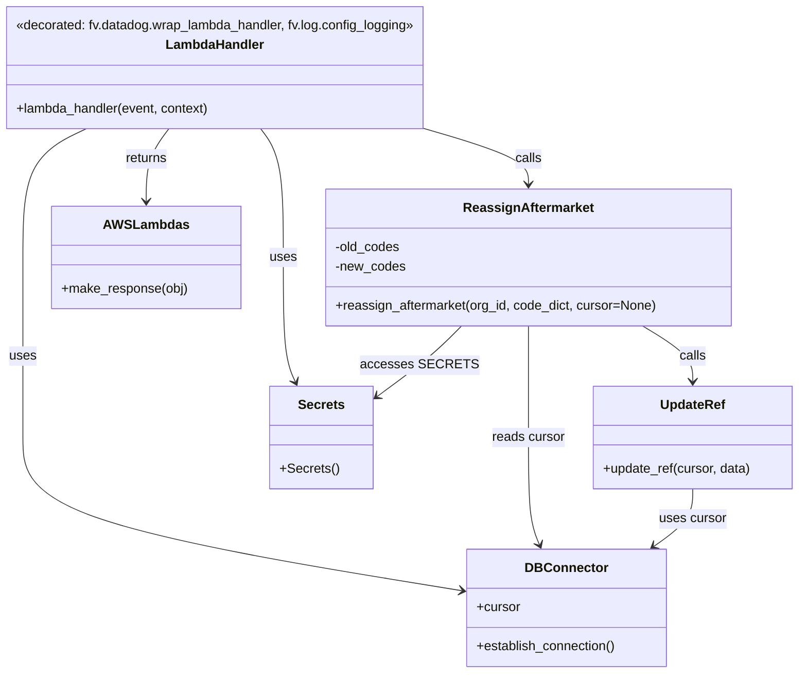

# Diagram: shipment_core/shipment_watchers/shipment_watchers/reprocess/reassign_aftermarket.py


> Auto-generated by Obscura crawlers

## Diagram 1

```mermaid
flowchart TD
    LambdaHandler[lambda_handler(event, context)] -->|calls| EstablishDB[DB_CONN.establish_connection()]
    LambdaHandler -->|reads| ReadFile[reassign_aftermarket_data.json]
    ReadFile --> ForEachOrg[for org_id in data]
    ForEachOrg -->|wraps| Timeout[func_timeout(300, reassign_aftermarket, (org_id, data[org_id]))]
    Timeout --> Reassign[reassign_aftermarket(org_id, code_dict)]
    Reassign -->|uses| Cursor[DB_CONN.cursor]
    Reassign -->|builds & executes| SelectQuery[SELECT ... FROM location.location WHERE code in (old_codes) ...]
    SelectQuery --> Fetch[shipments_to_process = cursor.fetchall()]
    Fetch -->|iterates| ShipmentLoop[for shipment in shipments_to_process]
    ShipmentLoop -->|calls for each| UpdateRef[update_ref(cursor, data)]
    UpdateRef -->|executes| UpdateQuery[WITH ref AS (...) UPDATE location.location SET ... RETURNING id,...]
    LambdaHandler -->|returns| MakeResponse[fv.aws.lambdas.make_response({})]
```

> SVG rendering failed for this diagram.

## Diagram 2



### SVG

<svg id="container" width="983.6875" xmlns="http://www.w3.org/2000/svg" class="classDiagram" height="826" viewBox="0 0 983.6875 826" role="graphics-document document" aria-roledescription="class"><style>#container{font-family:"trebuchet ms",verdana,arial,sans-serif;font-size:16px;fill:#333;}@keyframes edge-animation-frame{from{stroke-dashoffset:0;}}@keyframes dash{to{stroke-dashoffset:0;}}#container .edge-animation-slow{stroke-dasharray:9,5!important;stroke-dashoffset:900;animation:dash 50s linear infinite;stroke-linecap:round;}#container .edge-animation-fast{stroke-dasharray:9,5!important;stroke-dashoffset:900;animation:dash 20s linear infinite;stroke-linecap:round;}#container .error-icon{fill:#552222;}#container .error-text{fill:#552222;stroke:#552222;}#container .edge-thickness-normal{stroke-width:1px;}#container .edge-thickness-thick{stroke-width:3.5px;}#container .edge-pattern-solid{stroke-dasharray:0;}#container .edge-thickness-invisible{stroke-width:0;fill:none;}#container .edge-pattern-dashed{stroke-dasharray:3;}#container .edge-pattern-dotted{stroke-dasharray:2;}#container .marker{fill:#333333;stroke:#333333;}#container .marker.cross{stroke:#333333;}#container svg{font-family:"trebuchet ms",verdana,arial,sans-serif;font-size:16px;}#container p{margin:0;}#container g.classGroup text{fill:#9370DB;stroke:none;font-family:"trebuchet ms",verdana,arial,sans-serif;font-size:10px;}#container g.classGroup text .title{font-weight:bolder;}#container .nodeLabel,#container .edgeLabel{color:#131300;}#container .edgeLabel .label rect{fill:#ECECFF;}#container .label text{fill:#131300;}#container .labelBkg{background:#ECECFF;}#container .edgeLabel .label span{background:#ECECFF;}#container .classTitle{font-weight:bolder;}#container .node rect,#container .node circle,#container .node ellipse,#container .node polygon,#container .node path{fill:#ECECFF;stroke:#9370DB;stroke-width:1px;}#container .divider{stroke:#9370DB;stroke-width:1;}#container g.clickable{cursor:pointer;}#container g.classGroup rect{fill:#ECECFF;stroke:#9370DB;}#container g.classGroup line{stroke:#9370DB;stroke-width:1;}#container .classLabel .box{stroke:none;stroke-width:0;fill:#ECECFF;opacity:0.5;}#container .classLabel .label{fill:#9370DB;font-size:10px;}#container .relation{stroke:#333333;stroke-width:1;fill:none;}#container .dashed-line{stroke-dasharray:3;}#container .dotted-line{stroke-dasharray:1 2;}#container #compositionStart,#container .composition{fill:#333333!important;stroke:#333333!important;stroke-width:1;}#container #compositionEnd,#container .composition{fill:#333333!important;stroke:#333333!important;stroke-width:1;}#container #dependencyStart,#container .dependency{fill:#333333!important;stroke:#333333!important;stroke-width:1;}#container #dependencyStart,#container .dependency{fill:#333333!important;stroke:#333333!important;stroke-width:1;}#container #extensionStart,#container .extension{fill:transparent!important;stroke:#333333!important;stroke-width:1;}#container #extensionEnd,#container .extension{fill:transparent!important;stroke:#333333!important;stroke-width:1;}#container #aggregationStart,#container .aggregation{fill:transparent!important;stroke:#333333!important;stroke-width:1;}#container #aggregationEnd,#container .aggregation{fill:transparent!important;stroke:#333333!important;stroke-width:1;}#container #lollipopStart,#container .lollipop{fill:#ECECFF!important;stroke:#333333!important;stroke-width:1;}#container #lollipopEnd,#container .lollipop{fill:#ECECFF!important;stroke:#333333!important;stroke-width:1;}#container .edgeTerminals{font-size:11px;line-height:initial;}#container .classTitleText{text-anchor:middle;font-size:18px;fill:#333;}#container .label-icon{display:inline-block;height:1em;overflow:visible;vertical-align:-0.125em;}#container .node .label-icon path{fill:currentColor;stroke:revert;stroke-width:revert;}#container :root{--mermaid-font-family:"trebuchet ms",verdana,arial,sans-serif;}</style><g><defs><marker id="container_class-aggregationStart" class="marker aggregation class" refX="18" refY="7" markerWidth="190" markerHeight="240" orient="auto"><path d="M 18,7 L9,13 L1,7 L9,1 Z"></path></marker></defs><defs><marker id="container_class-aggregationEnd" class="marker aggregation class" refX="1" refY="7" markerWidth="20" markerHeight="28" orient="auto"><path d="M 18,7 L9,13 L1,7 L9,1 Z"></path></marker></defs><defs><marker id="container_class-extensionStart" class="marker extension class" refX="18" refY="7" markerWidth="190" markerHeight="240" orient="auto"><path d="M 1,7 L18,13 V 1 Z"></path></marker></defs><defs><marker id="container_class-extensionEnd" class="marker extension class" refX="1" refY="7" markerWidth="20" markerHeight="28" orient="auto"><path d="M 1,1 V 13 L18,7 Z"></path></marker></defs><defs><marker id="container_class-compositionStart" class="marker composition class" refX="18" refY="7" markerWidth="190" markerHeight="240" orient="auto"><path d="M 18,7 L9,13 L1,7 L9,1 Z"></path></marker></defs><defs><marker id="container_class-compositionEnd" class="marker composition class" refX="1" refY="7" markerWidth="20" markerHeight="28" orient="auto"><path d="M 18,7 L9,13 L1,7 L9,1 Z"></path></marker></defs><defs><marker id="container_class-dependencyStart" class="marker dependency class" refX="6" refY="7" markerWidth="190" markerHeight="240" orient="auto"><path d="M 5,7 L9,13 L1,7 L9,1 Z"></path></marker></defs><defs><marker id="container_class-dependencyEnd" class="marker dependency class" refX="13" refY="7" markerWidth="20" markerHeight="28" orient="auto"><path d="M 18,7 L9,13 L14,7 L9,1 Z"></path></marker></defs><defs><marker id="container_class-lollipopStart" class="marker lollipop class" refX="13" refY="7" markerWidth="190" markerHeight="240" orient="auto"><circle stroke="black" fill="transparent" cx="7" cy="7" r="6"></circle></marker></defs><defs><marker id="container_class-lollipopEnd" class="marker lollipop class" refX="1" refY="7" markerWidth="190" markerHeight="240" orient="auto"><circle stroke="black" fill="transparent" cx="7" cy="7" r="6"></circle></marker></defs><g class="root"><g class="clusters"></g><g class="edgePaths"><path d="M112.453,158L99.69,164.167C86.927,170.333,61.401,182.667,48.638,209C35.875,235.333,35.875,275.667,35.875,316C35.875,356.333,35.875,396.667,35.875,433.5C35.875,470.333,35.875,503.667,35.875,537C35.875,570.333,35.875,603.667,123.927,634.95C211.979,666.232,388.083,695.465,476.135,710.081L564.186,724.697" id="id_LambdaHandler_DBConnector_1" class="edge-thickness-normal edge-pattern-solid relation" style=";;;" data-edge="true" data-et="edge" data-id="id_LambdaHandler_DBConnector_1" data-points="W3sieCI6MTEyLjQ1MzMzNDI2MzM5Mjg2LCJ5IjoxNTh9LHsieCI6MzUuODc1LCJ5IjoxOTV9LHsieCI6MzUuODc1LCJ5IjozMTZ9LHsieCI6MzUuODc1LCJ5Ijo0Mzd9LHsieCI6MzUuODc1LCJ5Ijo1Mzd9LHsieCI6MzUuODc1LCJ5Ijo2Mzd9LHsieCI6NTcwLjEwNTQ2ODc1LCJ5Ijo3MjUuNjc5ODIzNDM5NDc5OH1d" marker-end="url(#container_class-dependencyEnd)"></path><path d="M212.256,158L207.699,164.167C203.142,170.333,194.028,182.667,189.471,197.5C184.914,212.333,184.914,229.667,184.914,238.333L184.914,247" id="id_LambdaHandler_AWSLambdas_2" class="edge-thickness-normal edge-pattern-solid relation" style=";;;" data-edge="true" data-et="edge" data-id="id_LambdaHandler_AWSLambdas_2" data-points="W3sieCI6MjEyLjI1NjI3NzkwMTc4NTcyLCJ5IjoxNTh9LHsieCI6MTg0LjkxNDA2MjUsInkiOjE5NX0seyJ4IjoxODQuOTE0MDYyNSwieSI6MjUzfV0=" marker-end="url(#container_class-dependencyEnd)"></path><path d="M524.001,158L545.077,164.167C566.152,170.333,608.302,182.667,629.378,194C650.453,205.333,650.453,215.667,650.453,220.833L650.453,226" id="id_LambdaHandler_ReassignAftermarket_3" class="edge-thickness-normal edge-pattern-solid relation" style=";;;" data-edge="true" data-et="edge" data-id="id_LambdaHandler_ReassignAftermarket_3" data-points="W3sieCI6NTI0LjAwMTE4NTgyNTg5MjksInkiOjE1OH0seyJ4Ijo2NTAuNDUzMTI1LCJ5IjoxOTV9LHsieCI6NjUwLjQ1MzEyNSwieSI6MjMyfV0=" marker-end="url(#container_class-dependencyEnd)"></path><path d="M650.453,400L650.453,406.167C650.453,412.333,650.453,424.667,650.453,447.5C650.453,470.333,650.453,503.667,650.453,537C650.453,570.333,650.453,603.667,652.473,625.567C654.493,647.467,658.533,657.935,660.552,663.169L662.572,668.402" id="id_ReassignAftermarket_DBConnector_4" class="edge-thickness-normal edge-pattern-solid relation" style=";;;" data-edge="true" data-et="edge" data-id="id_ReassignAftermarket_DBConnector_4" data-points="W3sieCI6NjUwLjQ1MzEyNSwieSI6NDAwfSx7IngiOjY1MC40NTMxMjUsInkiOjQzN30seyJ4Ijo2NTAuNDUzMTI1LCJ5Ijo1Mzd9LHsieCI6NjUwLjQ1MzEyNSwieSI6NjM3fSx7IngiOjY2NC43MzI1NDczMDUwNDU4LCJ5Ijo2NzR9XQ==" marker-end="url(#container_class-dependencyEnd)"></path><path d="M791.108,400L801.433,406.167C811.759,412.333,832.411,424.667,842.737,436C853.063,447.333,853.063,457.667,853.063,462.833L853.063,468" id="id_ReassignAftermarket_UpdateRef_5" class="edge-thickness-normal edge-pattern-solid relation" style=";;;" data-edge="true" data-et="edge" data-id="id_ReassignAftermarket_UpdateRef_5" data-points="W3sieCI6NzkxLjEwNzU2NzE0ODc2MDQsInkiOjQwMH0seyJ4Ijo4NTMuMDYyNSwieSI6NDM3fSx7IngiOjg1My4wNjI1LCJ5Ijo0NzR9XQ==" marker-end="url(#container_class-dependencyEnd)"></path><path d="M853.063,600L853.063,606.167C853.063,612.333,853.063,624.667,844.807,636.438C836.552,648.21,820.041,659.42,811.786,665.025L803.53,670.63" id="id_UpdateRef_DBConnector_6" class="edge-thickness-normal edge-pattern-solid relation" style=";;;" data-edge="true" data-et="edge" data-id="id_UpdateRef_DBConnector_6" data-points="W3sieCI6ODUzLjA2MjUsInkiOjYwMH0seyJ4Ijo4NTMuMDYyNSwieSI6NjM3fSx7IngiOjc5OC41NjYyNjI5MDEzNzYxLCJ5Ijo2NzR9XQ==" marker-end="url(#container_class-dependencyEnd)"></path><path d="M323.103,158L327.66,164.167C332.217,170.333,341.331,182.667,345.888,209C350.445,235.333,350.445,275.667,350.445,316C350.445,356.333,350.445,396.667,352.652,422.078C354.858,447.49,359.271,457.98,361.477,463.225L363.683,468.469" id="id_LambdaHandler_Secrets_7" class="edge-thickness-normal edge-pattern-solid relation" style=";;;" data-edge="true" data-et="edge" data-id="id_LambdaHandler_Secrets_7" data-points="W3sieCI6MzIzLjEwMzA5NzA5ODIxNDMsInkiOjE1OH0seyJ4IjozNTAuNDQ1MzEyNSwieSI6MTk1fSx7IngiOjM1MC40NDUzMTI1LCJ5IjozMTZ9LHsieCI6MzUwLjQ0NTMxMjUsInkiOjQzN30seyJ4IjozNjYuMDA5ODgyODEyNSwieSI6NDc0fV0=" marker-end="url(#container_class-dependencyEnd)"></path><path d="M572.377,400L566.645,406.167C560.913,412.333,549.45,424.667,530.432,439.966C511.415,455.265,484.844,473.53,471.558,482.663L458.273,491.796" id="id_ReassignAftermarket_Secrets_8" class="edge-thickness-normal edge-pattern-solid relation" style=";;;" data-edge="true" data-et="edge" data-id="id_ReassignAftermarket_Secrets_8" data-points="W3sieCI6NTcyLjM3NzAwMTU0OTU4NjgsInkiOjQwMH0seyJ4Ijo1MzcuOTg2MzI4MTI1LCJ5Ijo0Mzd9LHsieCI6NDUzLjMyODEyNSwieSI6NDk1LjE5NDQ4NzMzMjY3OTk2fV0=" marker-end="url(#container_class-dependencyEnd)"></path></g><g class="edgeLabels"><g class="edgeLabel" transform="translate(35.875, 437)"><g class="label" data-id="id_LambdaHandler_DBConnector_1" transform="translate(-16.4921875, -12)"><foreignObject width="32.984375" height="24"><div xmlns="http://www.w3.org/1999/xhtml" class="labelBkg" style="display: table-cell; white-space: nowrap; line-height: 1.5; max-width: 200px; text-align: center;"><span class="edgeLabel"><p>uses</p></span></div></foreignObject></g></g><g class="edgeLabel" transform="translate(184.9140625, 195)"><g class="label" data-id="id_LambdaHandler_AWSLambdas_2" transform="translate(-26.265625, -12)"><foreignObject width="52.53125" height="24"><div xmlns="http://www.w3.org/1999/xhtml" class="labelBkg" style="display: table-cell; white-space: nowrap; line-height: 1.5; max-width: 200px; text-align: center;"><span class="edgeLabel"><p>returns</p></span></div></foreignObject></g></g><g class="edgeLabel" transform="translate(650.453125, 195)"><g class="label" data-id="id_LambdaHandler_ReassignAftermarket_3" transform="translate(-16.4453125, -12)"><foreignObject width="32.890625" height="24"><div xmlns="http://www.w3.org/1999/xhtml" class="labelBkg" style="display: table-cell; white-space: nowrap; line-height: 1.5; max-width: 200px; text-align: center;"><span class="edgeLabel"><p>calls</p></span></div></foreignObject></g></g><g class="edgeLabel" transform="translate(650.453125, 537)"><g class="label" data-id="id_ReassignAftermarket_DBConnector_4" transform="translate(-44.984375, -12)"><foreignObject width="89.96875" height="24"><div xmlns="http://www.w3.org/1999/xhtml" class="labelBkg" style="display: table-cell; white-space: nowrap; line-height: 1.5; max-width: 200px; text-align: center;"><span class="edgeLabel"><p>reads cursor</p></span></div></foreignObject></g></g><g class="edgeLabel" transform="translate(853.0625, 437)"><g class="label" data-id="id_ReassignAftermarket_UpdateRef_5" transform="translate(-16.4453125, -12)"><foreignObject width="32.890625" height="24"><div xmlns="http://www.w3.org/1999/xhtml" class="labelBkg" style="display: table-cell; white-space: nowrap; line-height: 1.5; max-width: 200px; text-align: center;"><span class="edgeLabel"><p>calls</p></span></div></foreignObject></g></g><g class="edgeLabel" transform="translate(853.0625, 637)"><g class="label" data-id="id_UpdateRef_DBConnector_6" transform="translate(-41.4765625, -12)"><foreignObject width="82.953125" height="24"><div xmlns="http://www.w3.org/1999/xhtml" class="labelBkg" style="display: table-cell; white-space: nowrap; line-height: 1.5; max-width: 200px; text-align: center;"><span class="edgeLabel"><p>uses cursor</p></span></div></foreignObject></g></g><g class="edgeLabel" transform="translate(350.4453125, 316)"><g class="label" data-id="id_LambdaHandler_Secrets_7" transform="translate(-16.4921875, -12)"><foreignObject width="32.984375" height="24"><div xmlns="http://www.w3.org/1999/xhtml" class="labelBkg" style="display: table-cell; white-space: nowrap; line-height: 1.5; max-width: 200px; text-align: center;"><span class="edgeLabel"><p>uses</p></span></div></foreignObject></g></g><g class="edgeLabel" transform="translate(516.4712, 451.78961)"><g class="label" data-id="id_ReassignAftermarket_Secrets_8" transform="translate(-64.1328125, -12)"><foreignObject width="128.265625" height="24"><div xmlns="http://www.w3.org/1999/xhtml" class="labelBkg" style="display: table-cell; white-space: nowrap; line-height: 1.5; max-width: 200px; text-align: center;"><span class="edgeLabel"><p>accesses SECRETS</p></span></div></foreignObject></g></g></g><g class="nodes"><g class="node default" id="classId-LambdaHandler-0" transform="translate(267.6796875, 83)"><g class="basic label-container"><path d="M-259.6796875 -75 L259.6796875 -75 L259.6796875 75 L-259.6796875 75" stroke="none" stroke-width="0" fill="#ECECFF" style=""></path><path d="M-259.6796875 -75 C-56.24084319380424 -75, 147.19800111239152 -75, 259.6796875 -75 M-259.6796875 -75 C-142.24241195436696 -75, -24.805136408733915 -75, 259.6796875 -75 M259.6796875 -75 C259.6796875 -38.221583005814466, 259.6796875 -1.4431660116289322, 259.6796875 75 M259.6796875 -75 C259.6796875 -31.078748849224773, 259.6796875 12.842502301550454, 259.6796875 75 M259.6796875 75 C83.98521199894418 75, -91.70926350211164 75, -259.6796875 75 M259.6796875 75 C149.30019080735875 75, 38.92069411471749 75, -259.6796875 75 M-259.6796875 75 C-259.6796875 31.413496631207785, -259.6796875 -12.17300673758443, -259.6796875 -75 M-259.6796875 75 C-259.6796875 19.81261557920807, -259.6796875 -35.37476884158386, -259.6796875 -75" stroke="#9370DB" stroke-width="1.3" fill="none" stroke-dasharray="0 0" style=""></path></g><g class="annotation-group text" transform="translate(-247.6796875, -51)"><g class="label" style="" transform="translate(0,-12)"><foreignObject width="495.359375" height="24"><div xmlns="http://www.w3.org/1999/xhtml" style="display: table-cell; white-space: nowrap; line-height: 1.5; max-width: 545px; text-align: center;"><span class="nodeLabel markdown-node-label" style=""><p>«decorated: fv.datadog.wrap_lambda_handler, fv.log.config_logging»</p></span></div></foreignObject></g></g><g class="label-group text" transform="translate(-58.21875, -27)"><g class="label" style="font-weight: bolder" transform="translate(0,-12)"><foreignObject width="116.4375" height="24"><div xmlns="http://www.w3.org/1999/xhtml" style="display: table-cell; white-space: nowrap; line-height: 1.5; max-width: 167px; text-align: center;"><span class="nodeLabel markdown-node-label" style=""><p>LambdaHandler</p></span></div></foreignObject></g></g><g class="members-group text" transform="translate(-247.6796875, 21)"></g><g class="methods-group text" transform="translate(-247.6796875, 51)"><g class="label" style="" transform="translate(0,-12)"><foreignObject width="240.1875" height="24"><div xmlns="http://www.w3.org/1999/xhtml" style="display: table-cell; white-space: nowrap; line-height: 1.5; max-width: 298px; text-align: center;"><span class="nodeLabel markdown-node-label" style=""><p>+lambda_handler(event, context)</p></span></div></foreignObject></g></g><g class="divider" style=""><path d="M-259.6796875 -3 C-93.21255574773122 -3, 73.25457600453757 -3, 259.6796875 -3 M-259.6796875 -3 C-123.54636837704112 -3, 12.586950745917761 -3, 259.6796875 -3" stroke="#9370DB" stroke-width="1.3" fill="none" stroke-dasharray="0 0" style=""></path></g><g class="divider" style=""><path d="M-259.6796875 21 C-91.14874908748834 21, 77.38218932502332 21, 259.6796875 21 M-259.6796875 21 C-110.5338231819527 21, 38.612041136094604 21, 259.6796875 21" stroke="#9370DB" stroke-width="1.3" fill="none" stroke-dasharray="0 0" style=""></path></g></g><g class="node default" id="classId-ReassignAftermarket-1" transform="translate(650.453125, 316)"><g class="basic label-container"><path d="M-248.515625 -84 L248.515625 -84 L248.515625 84 L-248.515625 84" stroke="none" stroke-width="0" fill="#ECECFF" style=""></path><path d="M-248.515625 -84 C-125.39308582643298 -84, -2.27054665286596 -84, 248.515625 -84 M-248.515625 -84 C-141.45845378085613 -84, -34.40128256171229 -84, 248.515625 -84 M248.515625 -84 C248.515625 -44.575607598980575, 248.515625 -5.15121519796115, 248.515625 84 M248.515625 -84 C248.515625 -26.73195121099385, 248.515625 30.536097578012303, 248.515625 84 M248.515625 84 C50.69770809023015 84, -147.1202088195397 84, -248.515625 84 M248.515625 84 C134.7444174776441 84, 20.973209955288212 84, -248.515625 84 M-248.515625 84 C-248.515625 36.50445154479019, -248.515625 -10.991096910419614, -248.515625 -84 M-248.515625 84 C-248.515625 23.958034031230852, -248.515625 -36.083931937538296, -248.515625 -84" stroke="#9370DB" stroke-width="1.3" fill="none" stroke-dasharray="0 0" style=""></path></g><g class="annotation-group text" transform="translate(0, -60)"></g><g class="label-group text" transform="translate(-76.71875, -60)"><g class="label" style="font-weight: bolder" transform="translate(0,-12)"><foreignObject width="153.4375" height="24"><div xmlns="http://www.w3.org/1999/xhtml" style="display: table-cell; white-space: nowrap; line-height: 1.5; max-width: 200px; text-align: center;"><span class="nodeLabel markdown-node-label" style=""><p>ReassignAftermarket</p></span></div></foreignObject></g></g><g class="members-group text" transform="translate(-236.515625, -12)"><g class="label" style="" transform="translate(0,-12)"><foreignObject width="80.40625" height="24"><div xmlns="http://www.w3.org/1999/xhtml" style="display: table-cell; white-space: nowrap; line-height: 1.5; max-width: 138px; text-align: center;"><span class="nodeLabel markdown-node-label" style=""><p>-old_codes</p></span></div></foreignObject></g><g class="label" style="" transform="translate(0,12)"><foreignObject width="86.140625" height="24"><div xmlns="http://www.w3.org/1999/xhtml" style="display: table-cell; white-space: nowrap; line-height: 1.5; max-width: 144px; text-align: center;"><span class="nodeLabel markdown-node-label" style=""><p>-new_codes</p></span></div></foreignObject></g></g><g class="methods-group text" transform="translate(-236.515625, 60)"><g class="label" style="" transform="translate(0,-12)"><foreignObject width="396.3125" height="24"><div xmlns="http://www.w3.org/1999/xhtml" style="display: table-cell; white-space: nowrap; line-height: 1.5; max-width: 454px; text-align: center;"><span class="nodeLabel markdown-node-label" style=""><p>+reassign_aftermarket(org_id, code_dict, cursor=None)</p></span></div></foreignObject></g></g><g class="divider" style=""><path d="M-248.515625 -36 C-95.8126976695026 -36, 56.890229660994805 -36, 248.515625 -36 M-248.515625 -36 C-135.96975063981188 -36, -23.423876279623727 -36, 248.515625 -36" stroke="#9370DB" stroke-width="1.3" fill="none" stroke-dasharray="0 0" style=""></path></g><g class="divider" style=""><path d="M-248.515625 36 C-133.47597679002018 36, -18.436328580040367 36, 248.515625 36 M-248.515625 36 C-78.23198847392499 36, 92.05164805215003 36, 248.515625 36" stroke="#9370DB" stroke-width="1.3" fill="none" stroke-dasharray="0 0" style=""></path></g></g><g class="node default" id="classId-UpdateRef-2" transform="translate(853.0625, 537)"><g class="basic label-container"><path d="M-122.625 -63 L122.625 -63 L122.625 63 L-122.625 63" stroke="none" stroke-width="0" fill="#ECECFF" style=""></path><path d="M-122.625 -63 C-27.219356256833166 -63, 68.18628748633367 -63, 122.625 -63 M-122.625 -63 C-59.278027141239484 -63, 4.068945717521032 -63, 122.625 -63 M122.625 -63 C122.625 -28.172325545495795, 122.625 6.65534890900841, 122.625 63 M122.625 -63 C122.625 -30.683669618857124, 122.625 1.6326607622857523, 122.625 63 M122.625 63 C60.88586126064294 63, -0.8532774787141193 63, -122.625 63 M122.625 63 C65.88856990121633 63, 9.152139802432657 63, -122.625 63 M-122.625 63 C-122.625 25.174630766848814, -122.625 -12.650738466302371, -122.625 -63 M-122.625 63 C-122.625 14.362726907025, -122.625 -34.27454618595, -122.625 -63" stroke="#9370DB" stroke-width="1.3" fill="none" stroke-dasharray="0 0" style=""></path></g><g class="annotation-group text" transform="translate(0, -39)"></g><g class="label-group text" transform="translate(-38.609375, -39)"><g class="label" style="font-weight: bolder" transform="translate(0,-12)"><foreignObject width="77.21875" height="24"><div xmlns="http://www.w3.org/1999/xhtml" style="display: table-cell; white-space: nowrap; line-height: 1.5; max-width: 128px; text-align: center;"><span class="nodeLabel markdown-node-label" style=""><p>UpdateRef</p></span></div></foreignObject></g></g><g class="members-group text" transform="translate(-110.625, 9)"></g><g class="methods-group text" transform="translate(-110.625, 39)"><g class="label" style="" transform="translate(0,-12)"><foreignObject width="182.640625" height="24"><div xmlns="http://www.w3.org/1999/xhtml" style="display: table-cell; white-space: nowrap; line-height: 1.5; max-width: 240px; text-align: center;"><span class="nodeLabel markdown-node-label" style=""><p>+update_ref(cursor, data)</p></span></div></foreignObject></g></g><g class="divider" style=""><path d="M-122.625 -15 C-71.68142893371012 -15, -20.73785786742026 -15, 122.625 -15 M-122.625 -15 C-34.55340743939725 -15, 53.518185121205505 -15, 122.625 -15" stroke="#9370DB" stroke-width="1.3" fill="none" stroke-dasharray="0 0" style=""></path></g><g class="divider" style=""><path d="M-122.625 9 C-30.50996159792733 9, 61.60507680414534 9, 122.625 9 M-122.625 9 C-26.386777680073592 9, 69.85144463985282 9, 122.625 9" stroke="#9370DB" stroke-width="1.3" fill="none" stroke-dasharray="0 0" style=""></path></g></g><g class="node default" id="classId-DBConnector-3" transform="translate(692.51953125, 746)"><g class="basic label-container"><path d="M-122.4140625 -72 L122.4140625 -72 L122.4140625 72 L-122.4140625 72" stroke="none" stroke-width="0" fill="#ECECFF" style=""></path><path d="M-122.4140625 -72 C-50.26400356803266 -72, 21.886055363934673 -72, 122.4140625 -72 M-122.4140625 -72 C-44.98249667753829 -72, 32.44906914492341 -72, 122.4140625 -72 M122.4140625 -72 C122.4140625 -43.002353018757255, 122.4140625 -14.00470603751451, 122.4140625 72 M122.4140625 -72 C122.4140625 -22.057579173458272, 122.4140625 27.884841653083456, 122.4140625 72 M122.4140625 72 C54.923183601977215 72, -12.56769529604557 72, -122.4140625 72 M122.4140625 72 C38.4244727251706 72, -45.565117049658795 72, -122.4140625 72 M-122.4140625 72 C-122.4140625 36.78715998605921, -122.4140625 1.574319972118417, -122.4140625 -72 M-122.4140625 72 C-122.4140625 19.17284900748031, -122.4140625 -33.65430198503938, -122.4140625 -72" stroke="#9370DB" stroke-width="1.3" fill="none" stroke-dasharray="0 0" style=""></path></g><g class="annotation-group text" transform="translate(0, -48)"></g><g class="label-group text" transform="translate(-47.5625, -48)"><g class="label" style="font-weight: bolder" transform="translate(0,-12)"><foreignObject width="95.125" height="24"><div xmlns="http://www.w3.org/1999/xhtml" style="display: table-cell; white-space: nowrap; line-height: 1.5; max-width: 145px; text-align: center;"><span class="nodeLabel markdown-node-label" style=""><p>DBConnector</p></span></div></foreignObject></g></g><g class="members-group text" transform="translate(-110.4140625, 0)"><g class="label" style="" transform="translate(0,-12)"><foreignObject width="53.71875" height="24"><div xmlns="http://www.w3.org/1999/xhtml" style="display: table-cell; white-space: nowrap; line-height: 1.5; max-width: 112px; text-align: center;"><span class="nodeLabel markdown-node-label" style=""><p>+cursor</p></span></div></foreignObject></g></g><g class="methods-group text" transform="translate(-110.4140625, 48)"><g class="label" style="" transform="translate(0,-12)"><foreignObject width="173.265625" height="24"><div xmlns="http://www.w3.org/1999/xhtml" style="display: table-cell; white-space: nowrap; line-height: 1.5; max-width: 231px; text-align: center;"><span class="nodeLabel markdown-node-label" style=""><p>+establish_connection()</p></span></div></foreignObject></g></g><g class="divider" style=""><path d="M-122.4140625 -24 C-62.378806062781656 -24, -2.3435496255633126 -24, 122.4140625 -24 M-122.4140625 -24 C-34.184083578702456 -24, 54.04589534259509 -24, 122.4140625 -24" stroke="#9370DB" stroke-width="1.3" fill="none" stroke-dasharray="0 0" style=""></path></g><g class="divider" style=""><path d="M-122.4140625 24 C-63.35623458121247 24, -4.298406662424938 24, 122.4140625 24 M-122.4140625 24 C-42.777796966566214 24, 36.85846856686757 24, 122.4140625 24" stroke="#9370DB" stroke-width="1.3" fill="none" stroke-dasharray="0 0" style=""></path></g></g><g class="node default" id="classId-Secrets-4" transform="translate(392.51171875, 537)"><g class="basic label-container"><path d="M-60.81640625 -63 L60.81640625 -63 L60.81640625 63 L-60.81640625 63" stroke="none" stroke-width="0" fill="#ECECFF" style=""></path><path d="M-60.81640625 -63 C-35.22251445763527 -63, -9.628622665270534 -63, 60.81640625 -63 M-60.81640625 -63 C-23.36107537449979 -63, 14.094255501000418 -63, 60.81640625 -63 M60.81640625 -63 C60.81640625 -17.252286563026644, 60.81640625 28.495426873946712, 60.81640625 63 M60.81640625 -63 C60.81640625 -32.84620797586746, 60.81640625 -2.6924159517349224, 60.81640625 63 M60.81640625 63 C25.20293298164605 63, -10.4105402867079 63, -60.81640625 63 M60.81640625 63 C29.971021090193123 63, -0.8743640696137547 63, -60.81640625 63 M-60.81640625 63 C-60.81640625 18.241191423070937, -60.81640625 -26.517617153858126, -60.81640625 -63 M-60.81640625 63 C-60.81640625 20.164625871864352, -60.81640625 -22.670748256271295, -60.81640625 -63" stroke="#9370DB" stroke-width="1.3" fill="none" stroke-dasharray="0 0" style=""></path></g><g class="annotation-group text" transform="translate(0, -39)"></g><g class="label-group text" transform="translate(-27.1640625, -39)"><g class="label" style="font-weight: bolder" transform="translate(0,-12)"><foreignObject width="54.328125" height="24"><div xmlns="http://www.w3.org/1999/xhtml" style="display: table-cell; white-space: nowrap; line-height: 1.5; max-width: 103px; text-align: center;"><span class="nodeLabel markdown-node-label" style=""><p>Secrets</p></span></div></foreignObject></g></g><g class="members-group text" transform="translate(-48.81640625, 9)"></g><g class="methods-group text" transform="translate(-48.81640625, 39)"><g class="label" style="" transform="translate(0,-12)"><foreignObject width="70.46875" height="24"><div xmlns="http://www.w3.org/1999/xhtml" style="display: table-cell; white-space: nowrap; line-height: 1.5; max-width: 128px; text-align: center;"><span class="nodeLabel markdown-node-label" style=""><p>+Secrets()</p></span></div></foreignObject></g></g><g class="divider" style=""><path d="M-60.81640625 -15 C-24.110801018174115 -15, 12.59480421365177 -15, 60.81640625 -15 M-60.81640625 -15 C-28.235529115225724 -15, 4.3453480195485525 -15, 60.81640625 -15" stroke="#9370DB" stroke-width="1.3" fill="none" stroke-dasharray="0 0" style=""></path></g><g class="divider" style=""><path d="M-60.81640625 9 C-33.599389509340696 9, -6.3823727686814 9, 60.81640625 9 M-60.81640625 9 C-22.435634128417604 9, 15.945137993164792 9, 60.81640625 9" stroke="#9370DB" stroke-width="1.3" fill="none" stroke-dasharray="0 0" style=""></path></g></g><g class="node default" id="classId-AWSLambdas-5" transform="translate(184.9140625, 316)"><g class="basic label-container"><path d="M-114.0390625 -63 L114.0390625 -63 L114.0390625 63 L-114.0390625 63" stroke="none" stroke-width="0" fill="#ECECFF" style=""></path><path d="M-114.0390625 -63 C-64.1343084558331 -63, -14.229554411666186 -63, 114.0390625 -63 M-114.0390625 -63 C-36.59527711539735 -63, 40.8485082692053 -63, 114.0390625 -63 M114.0390625 -63 C114.0390625 -20.09039405843353, 114.0390625 22.819211883132937, 114.0390625 63 M114.0390625 -63 C114.0390625 -30.11290081517192, 114.0390625 2.774198369656162, 114.0390625 63 M114.0390625 63 C39.02074622032778 63, -35.99757005934444 63, -114.0390625 63 M114.0390625 63 C64.97009290739946 63, 15.901123314798923 63, -114.0390625 63 M-114.0390625 63 C-114.0390625 13.26849140865432, -114.0390625 -36.46301718269136, -114.0390625 -63 M-114.0390625 63 C-114.0390625 31.433268230233914, -114.0390625 -0.1334635395321726, -114.0390625 -63" stroke="#9370DB" stroke-width="1.3" fill="none" stroke-dasharray="0 0" style=""></path></g><g class="annotation-group text" transform="translate(0, -39)"></g><g class="label-group text" transform="translate(-48.90625, -39)"><g class="label" style="font-weight: bolder" transform="translate(0,-12)"><foreignObject width="97.8125" height="24"><div xmlns="http://www.w3.org/1999/xhtml" style="display: table-cell; white-space: nowrap; line-height: 1.5; max-width: 146px; text-align: center;"><span class="nodeLabel markdown-node-label" style=""><p>AWSLambdas</p></span></div></foreignObject></g></g><g class="members-group text" transform="translate(-102.0390625, 9)"></g><g class="methods-group text" transform="translate(-102.0390625, 39)"><g class="label" style="" transform="translate(0,-12)"><foreignObject width="155.171875" height="24"><div xmlns="http://www.w3.org/1999/xhtml" style="display: table-cell; white-space: nowrap; line-height: 1.5; max-width: 213px; text-align: center;"><span class="nodeLabel markdown-node-label" style=""><p>+make_response(obj)</p></span></div></foreignObject></g></g><g class="divider" style=""><path d="M-114.0390625 -15 C-57.084601648278806 -15, -0.1301407965576118 -15, 114.0390625 -15 M-114.0390625 -15 C-33.309893160640655 -15, 47.41927617871869 -15, 114.0390625 -15" stroke="#9370DB" stroke-width="1.3" fill="none" stroke-dasharray="0 0" style=""></path></g><g class="divider" style=""><path d="M-114.0390625 9 C-34.48365998815876 9, 45.071742523682474 9, 114.0390625 9 M-114.0390625 9 C-30.242835103799024 9, 53.55339229240195 9, 114.0390625 9" stroke="#9370DB" stroke-width="1.3" fill="none" stroke-dasharray="0 0" style=""></path></g></g></g></g></g></svg>
