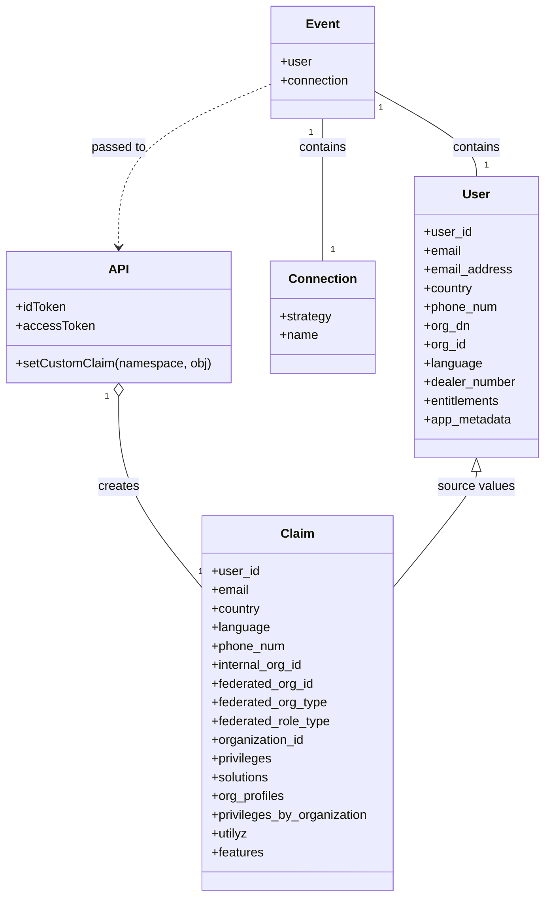

# Diagram: sso/auth0/actions/prod.fv-claims.js


> Auto-generated by Obscura crawlers

## Diagram 1

```mermaid
flowchart TD
  Start([onExecutePostLogin(event, api)]) --> CheckStrategy{strategy === "samlp" or user.org_dn?}
  CheckStrategy -- Yes --> InitVars[Set namespace, user, strategy, connectionName, defaults]
  InitVars --> ConnDecision{connectionName}
  ConnDecision --> GM[GM]
  ConnDecision --> Honda[Honda]
  ConnDecision --> HondaCan[Honda-Canada / Honda-Canada-Shibboleth]
  ConnDecision --> Ford[Ford]
  ConnDecision --> Hyundai[Hyundai / Genesis]
  ConnDecision --> Stellantis[Stellantis]
  GM --> GM_Parse["Parse user.org_dn -> gm_type_ou, gm_org_type"]
  GM_Parse --> GM_Corp{gm_org_type == GM_Corporate or GM_Wholesale}
  GM_Corp -- Yes --> GM_Corp_Set[internal_org_id=18<br/>fv_org_type=SH<br/>fv_role_type=FV]
  GM_Corp -- No --> GM_Dealer["Parse gm_id_ou -> federated_org_id (strip leading zeros)<br/>fv_org_type=DL<br/>fv_role_type=FV"]
  GM_Parse --> GM_Lang{user.language.toLowerCase() === "frn"}
  GM_Lang -- Yes --> SetLangFr[language="fr-ca"]
  Honda --> Honda_SetRole["fv_role_type=FV<br/>append @honda.sso.freightverify.com to email"]
  Honda --> Honda_CheckDealer{isNumeric(user.dealer_number)?}
  Honda_CheckDealer -- Yes --> Honda_Dealer[fv_org_type=DL<br/>federated_org_id="HONDA|"+dealer_number]
  Honda_CheckDealer -- No --> Honda_Corp[internal_org_id=28030<br/>fv_org_type=SH]
  HondaCan --> HondaCan_SetRole["fv_role_type=FV"]
  HondaCan --> HondaCan_CheckDealer{isNumeric(user.dealer_number)?}
  HondaCan_CheckDealer -- Yes --> HondaCan_Dealer[fv_org_type=DL<br/>federated_org_id="HONDA|"+dealer_number]
  HondaCan_CheckDealer -- No --> HondaCan_Corp[internal_org_id=28030<br/>fv_org_type=SH]
  Ford --> Ford_CheckEnt{entitlements includes "VINView"?}
  Ford_CheckEnt -- Yes --> Ford_EntSet[internal_org_id=137<br/>fv_org_type=SH<br/>fv_role_type=FV]
  Ford_CheckEnt -- No --> Ford_Dealer[federated_org_id="FORD|"+user.org_id<br/>fv_org_type=DL<br/>fv_role_type=FV]
  Hyundai --> Hyundai_SetRole["fv_role_type=FV<br/>email = user.user_id + '@hyundai.sso.freightverify.com'"]
  Hyundai --> Hyundai_CheckDealer{user.dealer_number === '00000'?}
  Hyundai_CheckDealer -- Yes --> Hyundai_Corp[internal_org_id=1700<br/>fv_org_type=SH]
  Hyundai_CheckDealer -- No --> Hyundai_Dealer[fv_org_type=DL<br/>federated_org_id="HYUNDAI|"+dealer_number]
  Stellantis --> Stell_Set[internal_org_id=28274<br/>fv_org_type=SH<br/>fv_role_type=FV]
  ConnDecision --> SetClaims[Set idToken and accessToken custom claim namespace+"user_authorization"]
  CheckStrategy -- No --> Auth0Branch{strategy === "auth0"?}
  Auth0Branch -- Yes --> Auth0_ReadMeta[Read app_metadata fields: organization_id, privileges, solutions, features, org_profiles, privileges_by_organization, Utilyz]
  Auth0_ReadMeta --> Auth0_SetClaims[Set idToken and accessToken custom claim namespace+"user_authorization" with app_metadata]
  Auth0Branch -- No --> EndNoAction([No custom claims set])
  SetClaims --> End([return])
  Auth0_SetClaims --> End
```

> SVG rendering failed for this diagram.

## Diagram 2



### SVG

<svg id="container" width="689.84375" xmlns="http://www.w3.org/2000/svg" class="classDiagram" height="1148" viewBox="0 0 689.84375 1148" role="graphics-document document" aria-roledescription="class"><style>#container{font-family:"trebuchet ms",verdana,arial,sans-serif;font-size:16px;fill:#333;}@keyframes edge-animation-frame{from{stroke-dashoffset:0;}}@keyframes dash{to{stroke-dashoffset:0;}}#container .edge-animation-slow{stroke-dasharray:9,5!important;stroke-dashoffset:900;animation:dash 50s linear infinite;stroke-linecap:round;}#container .edge-animation-fast{stroke-dasharray:9,5!important;stroke-dashoffset:900;animation:dash 20s linear infinite;stroke-linecap:round;}#container .error-icon{fill:#552222;}#container .error-text{fill:#552222;stroke:#552222;}#container .edge-thickness-normal{stroke-width:1px;}#container .edge-thickness-thick{stroke-width:3.5px;}#container .edge-pattern-solid{stroke-dasharray:0;}#container .edge-thickness-invisible{stroke-width:0;fill:none;}#container .edge-pattern-dashed{stroke-dasharray:3;}#container .edge-pattern-dotted{stroke-dasharray:2;}#container .marker{fill:#333333;stroke:#333333;}#container .marker.cross{stroke:#333333;}#container svg{font-family:"trebuchet ms",verdana,arial,sans-serif;font-size:16px;}#container p{margin:0;}#container g.classGroup text{fill:#9370DB;stroke:none;font-family:"trebuchet ms",verdana,arial,sans-serif;font-size:10px;}#container g.classGroup text .title{font-weight:bolder;}#container .nodeLabel,#container .edgeLabel{color:#131300;}#container .edgeLabel .label rect{fill:#ECECFF;}#container .label text{fill:#131300;}#container .labelBkg{background:#ECECFF;}#container .edgeLabel .label span{background:#ECECFF;}#container .classTitle{font-weight:bolder;}#container .node rect,#container .node circle,#container .node ellipse,#container .node polygon,#container .node path{fill:#ECECFF;stroke:#9370DB;stroke-width:1px;}#container .divider{stroke:#9370DB;stroke-width:1;}#container g.clickable{cursor:pointer;}#container g.classGroup rect{fill:#ECECFF;stroke:#9370DB;}#container g.classGroup line{stroke:#9370DB;stroke-width:1;}#container .classLabel .box{stroke:none;stroke-width:0;fill:#ECECFF;opacity:0.5;}#container .classLabel .label{fill:#9370DB;font-size:10px;}#container .relation{stroke:#333333;stroke-width:1;fill:none;}#container .dashed-line{stroke-dasharray:3;}#container .dotted-line{stroke-dasharray:1 2;}#container #compositionStart,#container .composition{fill:#333333!important;stroke:#333333!important;stroke-width:1;}#container #compositionEnd,#container .composition{fill:#333333!important;stroke:#333333!important;stroke-width:1;}#container #dependencyStart,#container .dependency{fill:#333333!important;stroke:#333333!important;stroke-width:1;}#container #dependencyStart,#container .dependency{fill:#333333!important;stroke:#333333!important;stroke-width:1;}#container #extensionStart,#container .extension{fill:transparent!important;stroke:#333333!important;stroke-width:1;}#container #extensionEnd,#container .extension{fill:transparent!important;stroke:#333333!important;stroke-width:1;}#container #aggregationStart,#container .aggregation{fill:transparent!important;stroke:#333333!important;stroke-width:1;}#container #aggregationEnd,#container .aggregation{fill:transparent!important;stroke:#333333!important;stroke-width:1;}#container #lollipopStart,#container .lollipop{fill:#ECECFF!important;stroke:#333333!important;stroke-width:1;}#container #lollipopEnd,#container .lollipop{fill:#ECECFF!important;stroke:#333333!important;stroke-width:1;}#container .edgeTerminals{font-size:11px;line-height:initial;}#container .classTitleText{text-anchor:middle;font-size:18px;fill:#333;}#container .label-icon{display:inline-block;height:1em;overflow:visible;vertical-align:-0.125em;}#container .node .label-icon path{fill:currentColor;stroke:revert;stroke-width:revert;}#container :root{--mermaid-font-family:"trebuchet ms",verdana,arial,sans-serif;}</style><g><defs><marker id="container_class-aggregationStart" class="marker aggregation class" refX="18" refY="7" markerWidth="190" markerHeight="240" orient="auto"><path d="M 18,7 L9,13 L1,7 L9,1 Z"></path></marker></defs><defs><marker id="container_class-aggregationEnd" class="marker aggregation class" refX="1" refY="7" markerWidth="20" markerHeight="28" orient="auto"><path d="M 18,7 L9,13 L1,7 L9,1 Z"></path></marker></defs><defs><marker id="container_class-extensionStart" class="marker extension class" refX="18" refY="7" markerWidth="190" markerHeight="240" orient="auto"><path d="M 1,7 L18,13 V 1 Z"></path></marker></defs><defs><marker id="container_class-extensionEnd" class="marker extension class" refX="1" refY="7" markerWidth="20" markerHeight="28" orient="auto"><path d="M 1,1 V 13 L18,7 Z"></path></marker></defs><defs><marker id="container_class-compositionStart" class="marker composition class" refX="18" refY="7" markerWidth="190" markerHeight="240" orient="auto"><path d="M 18,7 L9,13 L1,7 L9,1 Z"></path></marker></defs><defs><marker id="container_class-compositionEnd" class="marker composition class" refX="1" refY="7" markerWidth="20" markerHeight="28" orient="auto"><path d="M 18,7 L9,13 L1,7 L9,1 Z"></path></marker></defs><defs><marker id="container_class-dependencyStart" class="marker dependency class" refX="6" refY="7" markerWidth="190" markerHeight="240" orient="auto"><path d="M 5,7 L9,13 L1,7 L9,1 Z"></path></marker></defs><defs><marker id="container_class-dependencyEnd" class="marker dependency class" refX="13" refY="7" markerWidth="20" markerHeight="28" orient="auto"><path d="M 18,7 L9,13 L14,7 L9,1 Z"></path></marker></defs><defs><marker id="container_class-lollipopStart" class="marker lollipop class" refX="13" refY="7" markerWidth="190" markerHeight="240" orient="auto"><circle stroke="black" fill="transparent" cx="7" cy="7" r="6"></circle></marker></defs><defs><marker id="container_class-lollipopEnd" class="marker lollipop class" refX="1" refY="7" markerWidth="190" markerHeight="240" orient="auto"><circle stroke="black" fill="transparent" cx="7" cy="7" r="6"></circle></marker></defs><g class="root"><g class="clusters"></g><g class="edgePaths"><path d="M474.055,117.182L495.464,129.152C516.872,141.121,559.69,165.061,581.099,183.197C602.508,201.333,602.508,213.667,602.508,219.833L602.508,226" id="id_Event_User_1" class="edge-thickness-normal edge-pattern-solid relation" style=";;;" data-edge="true" data-et="edge" data-id="id_Event_User_1" data-points="W3sieCI6NDc0LjA1NDY4NzUsInkiOjExNy4xODIxNzE1NTIyMjUwNH0seyJ4Ijo2MDIuNTA3ODEyNSwieSI6MTg5fSx7IngiOjYwMi41MDc4MTI1LCJ5IjoyMjZ9XQ=="></path><path d="M407.551,152L407.551,158.167C407.551,164.333,407.551,176.667,407.551,207C407.551,237.333,407.551,285.667,407.551,309.833L407.551,334" id="id_Event_Connection_2" class="edge-thickness-normal edge-pattern-solid relation" style=";;;" data-edge="true" data-et="edge" data-id="id_Event_Connection_2" data-points="W3sieCI6NDA3LjU1MDc4MTI1LCJ5IjoxNTJ9LHsieCI6NDA3LjU1MDc4MTI1LCJ5IjoxODl9LHsieCI6NDA3LjU1MDc4MTI1LCJ5IjozMzR9XQ=="></path><path d="M149.965,507.25L149.965,526.542C149.965,545.833,149.965,584.417,167.21,624.82C184.455,665.223,218.945,707.445,236.19,728.557L253.436,749.668" id="id_API_Claim_3" class="edge-thickness-normal edge-pattern-solid relation" style=";;;" data-edge="true" data-et="edge" data-id="id_API_Claim_3" data-points="W3sieCI6MTQ5Ljk2NDg0Mzc1LCJ5Ijo0OTB9LHsieCI6MTQ5Ljk2NDg0Mzc1LCJ5Ijo2MjN9LHsieCI6MjUzLjQzNTU0Njg3NSwieSI6NzQ5LjY2ODEyNTQzNjk4Mzd9XQ==" marker-start="url(#container_class-aggregationStart)"></path><path d="M341.047,108.142L309.2,121.618C277.353,135.095,213.659,162.047,181.812,196.69C149.965,231.333,149.965,273.667,149.965,294.833L149.965,316" id="id_Event_API_4" class="edge-thickness-normal edge-pattern-dashed relation" style=";;;" data-edge="true" data-et="edge" data-id="id_Event_API_4" data-points="W3sieCI6MzQxLjA0Njg3NSwieSI6MTA4LjE0MTc3NjEwNjI3NTIyfSx7IngiOjE0OS45NjQ4NDM3NSwieSI6MTg5fSx7IngiOjE0OS45NjQ4NDM3NSwieSI6MzIyfV0=" marker-end="url(#container_class-dependencyEnd)"></path><path d="M602.508,603.25L602.508,606.542C602.508,609.833,602.508,616.417,585.263,640.82C568.018,665.223,533.527,707.445,516.282,728.557L499.037,749.668" id="id_User_Claim_5" class="edge-thickness-normal edge-pattern-solid relation" style=";;;" data-edge="true" data-et="edge" data-id="id_User_Claim_5" data-points="W3sieCI6NjAyLjUwNzgxMjUsInkiOjU4Nn0seyJ4Ijo2MDIuNTA3ODEyNSwieSI6NjIzfSx7IngiOjQ5OS4wMzcxMDkzNzUsInkiOjc0OS42NjgxMjU0MzY5ODM3fV0=" marker-start="url(#container_class-extensionStart)"></path></g><g class="edgeLabels"><g class="edgeLabel" transform="translate(602.5078125, 189)"><g class="label" data-id="id_Event_User_1" transform="translate(-30.890625, -12)"><foreignObject width="61.78125" height="24"><div xmlns="http://www.w3.org/1999/xhtml" class="labelBkg" style="display: table-cell; white-space: nowrap; line-height: 1.5; max-width: 200px; text-align: center;"><span class="edgeLabel"><p>contains</p></span></div></foreignObject></g></g><g class="edgeLabel" transform="translate(407.55078125, 189)"><g class="label" data-id="id_Event_Connection_2" transform="translate(-30.890625, -12)"><foreignObject width="61.78125" height="24"><div xmlns="http://www.w3.org/1999/xhtml" class="labelBkg" style="display: table-cell; white-space: nowrap; line-height: 1.5; max-width: 200px; text-align: center;"><span class="edgeLabel"><p>contains</p></span></div></foreignObject></g></g><g class="edgeLabel" transform="translate(149.96484375, 623)"><g class="label" data-id="id_API_Claim_3" transform="translate(-26.171875, -12)"><foreignObject width="52.34375" height="24"><div xmlns="http://www.w3.org/1999/xhtml" class="labelBkg" style="display: table-cell; white-space: nowrap; line-height: 1.5; max-width: 200px; text-align: center;"><span class="edgeLabel"><p>creates</p></span></div></foreignObject></g></g><g class="edgeLabel" transform="translate(149.96484375, 189)"><g class="label" data-id="id_Event_API_4" transform="translate(-35.046875, -12)"><foreignObject width="70.09375" height="24"><div xmlns="http://www.w3.org/1999/xhtml" class="labelBkg" style="display: table-cell; white-space: nowrap; line-height: 1.5; max-width: 200px; text-align: center;"><span class="edgeLabel"><p>passed to</p></span></div></foreignObject></g></g><g class="edgeLabel" transform="translate(602.5078125, 623)"><g class="label" data-id="id_User_Claim_5" transform="translate(-49.234375, -12)"><foreignObject width="98.46875" height="24"><div xmlns="http://www.w3.org/1999/xhtml" class="labelBkg" style="display: table-cell; white-space: nowrap; line-height: 1.5; max-width: 200px; text-align: center;"><span class="edgeLabel"><p>source values</p></span></div></foreignObject></g></g><g class="edgeTerminals" transform="translate(482.00935821048665, 138.81485915335975)"><g class="inner" transform="translate(0, 0)"><foreignObject style="width: 9px; height: 12px;"><div xmlns="http://www.w3.org/1999/xhtml" style="display: inline-block; padding-right: 1px; white-space: nowrap;"><span class="edgeLabel">1</span></div></foreignObject></g></g><g class="edgeTerminals" transform="translate(392.550780625, 169.4999994642857)"><g class="inner" transform="translate(0, 0)"><foreignObject style="width: 9px; height: 12px;"><div xmlns="http://www.w3.org/1999/xhtml" style="display: inline-block; padding-right: 1px; white-space: nowrap;"><span class="edgeLabel">1</span></div></foreignObject></g></g><g class="edgeTerminals" transform="translate(134.96484187500008, 507.49999839285715)"><g class="inner" transform="translate(0, 0)"><foreignObject style="width: 9px; height: 12px;"><div xmlns="http://www.w3.org/1999/xhtml" style="display: inline-block; padding-right: 1px; white-space: nowrap;"><span class="edgeLabel">1</span></div></foreignObject></g></g><g class="edgeTerminals" transform="translate(612.50781125, 203.49999892857142)"><g class="inner" transform="translate(0, 0)"></g><foreignObject style="width: 9px; height: 12px;"><div xmlns="http://www.w3.org/1999/xhtml" style="display: inline-block; padding-right: 1px; white-space: nowrap;"><span class="edgeLabel">1</span></div></foreignObject></g><g class="edgeTerminals" transform="translate(417.550780625, 311.4999994642857)"><g class="inner" transform="translate(0, 0)"></g><foreignObject style="width: 9px; height: 12px;"><div xmlns="http://www.w3.org/1999/xhtml" style="display: inline-block; padding-right: 1px; white-space: nowrap;"><span class="edgeLabel">1</span></div></foreignObject></g><g class="edgeTerminals" transform="translate(248.98143903081095, 721.6257301546757)"><g class="inner" transform="translate(0, 0)"></g><foreignObject style="width: 9px; height: 12px;"><div xmlns="http://www.w3.org/1999/xhtml" style="display: inline-block; padding-right: 1px; white-space: nowrap;"><span class="edgeLabel">1</span></div></foreignObject></g></g><g class="nodes"><g class="node default" id="classId-Event-0" transform="translate(407.55078125, 80)"><g class="basic label-container"><path d="M-66.50390625 -72 L66.50390625 -72 L66.50390625 72 L-66.50390625 72" stroke="none" stroke-width="0" fill="#ECECFF" style=""></path><path d="M-66.50390625 -72 C-28.754208548924247 -72, 8.995489152151507 -72, 66.50390625 -72 M-66.50390625 -72 C-34.52925732443486 -72, -2.5546083988697177 -72, 66.50390625 -72 M66.50390625 -72 C66.50390625 -26.072135768366508, 66.50390625 19.855728463266985, 66.50390625 72 M66.50390625 -72 C66.50390625 -42.12467941380019, 66.50390625 -12.249358827600375, 66.50390625 72 M66.50390625 72 C28.68964899451531 72, -9.124608260969381 72, -66.50390625 72 M66.50390625 72 C31.04221744145775 72, -4.419471367084498 72, -66.50390625 72 M-66.50390625 72 C-66.50390625 41.07248648391426, -66.50390625 10.144972967828515, -66.50390625 -72 M-66.50390625 72 C-66.50390625 22.910718024963437, -66.50390625 -26.178563950073126, -66.50390625 -72" stroke="#9370DB" stroke-width="1.3" fill="none" stroke-dasharray="0 0" style=""></path></g><g class="annotation-group text" transform="translate(0, -48)"></g><g class="label-group text" transform="translate(-20.2109375, -48)"><g class="label" style="font-weight: bolder" transform="translate(0,-12)"><foreignObject width="40.421875" height="24"><div xmlns="http://www.w3.org/1999/xhtml" style="display: table-cell; white-space: nowrap; line-height: 1.5; max-width: 90px; text-align: center;"><span class="nodeLabel markdown-node-label" style=""><p>Event</p></span></div></foreignObject></g></g><g class="members-group text" transform="translate(-54.50390625, 0)"><g class="label" style="" transform="translate(0,-12)"><foreignObject width="39.671875" height="24"><div xmlns="http://www.w3.org/1999/xhtml" style="display: table-cell; white-space: nowrap; line-height: 1.5; max-width: 98px; text-align: center;"><span class="nodeLabel markdown-node-label" style=""><p>+user</p></span></div></foreignObject></g><g class="label" style="" transform="translate(0,12)"><foreignObject width="88.796875" height="24"><div xmlns="http://www.w3.org/1999/xhtml" style="display: table-cell; white-space: nowrap; line-height: 1.5; max-width: 146px; text-align: center;"><span class="nodeLabel markdown-node-label" style=""><p>+connection</p></span></div></foreignObject></g></g><g class="methods-group text" transform="translate(-54.50390625, 72)"></g><g class="divider" style=""><path d="M-66.50390625 -24 C-37.44302886263103 -24, -8.382151475262063 -24, 66.50390625 -24 M-66.50390625 -24 C-36.001320716917625 -24, -5.498735183835251 -24, 66.50390625 -24" stroke="#9370DB" stroke-width="1.3" fill="none" stroke-dasharray="0 0" style=""></path></g><g class="divider" style=""><path d="M-66.50390625 48 C-19.70655597761897 48, 27.090794294762063 48, 66.50390625 48 M-66.50390625 48 C-29.96756010008859 48, 6.568786049822819 48, 66.50390625 48" stroke="#9370DB" stroke-width="1.3" fill="none" stroke-dasharray="0 0" style=""></path></g></g><g class="node default" id="classId-User-1" transform="translate(602.5078125, 406)"><g class="basic label-container"><path d="M-79.3359375 -180 L79.3359375 -180 L79.3359375 180 L-79.3359375 180" stroke="none" stroke-width="0" fill="#ECECFF" style=""></path><path d="M-79.3359375 -180 C-44.329769011077495 -180, -9.32360052215499 -180, 79.3359375 -180 M-79.3359375 -180 C-37.04941731643063 -180, 5.237102867138745 -180, 79.3359375 -180 M79.3359375 -180 C79.3359375 -60.700637960213626, 79.3359375 58.59872407957275, 79.3359375 180 M79.3359375 -180 C79.3359375 -59.714721525833795, 79.3359375 60.57055694833241, 79.3359375 180 M79.3359375 180 C41.968721331169874 180, 4.601505162339748 180, -79.3359375 180 M79.3359375 180 C27.88182651654389 180, -23.572284466912222 180, -79.3359375 180 M-79.3359375 180 C-79.3359375 54.86316806795698, -79.3359375 -70.27366386408605, -79.3359375 -180 M-79.3359375 180 C-79.3359375 73.73636672087136, -79.3359375 -32.52726655825728, -79.3359375 -180" stroke="#9370DB" stroke-width="1.3" fill="none" stroke-dasharray="0 0" style=""></path></g><g class="annotation-group text" transform="translate(0, -156)"></g><g class="label-group text" transform="translate(-16.65625, -156)"><g class="label" style="font-weight: bolder" transform="translate(0,-12)"><foreignObject width="33.3125" height="24"><div xmlns="http://www.w3.org/1999/xhtml" style="display: table-cell; white-space: nowrap; line-height: 1.5; max-width: 84px; text-align: center;"><span class="nodeLabel markdown-node-label" style=""><p>User</p></span></div></foreignObject></g></g><g class="members-group text" transform="translate(-67.3359375, -108)"><g class="label" style="" transform="translate(0,-12)"><foreignObject width="60.796875" height="24"><div xmlns="http://www.w3.org/1999/xhtml" style="display: table-cell; white-space: nowrap; line-height: 1.5; max-width: 118px; text-align: center;"><span class="nodeLabel markdown-node-label" style=""><p>+user_id</p></span></div></foreignObject></g><g class="label" style="" transform="translate(0,12)"><foreignObject width="48.328125" height="24"><div xmlns="http://www.w3.org/1999/xhtml" style="display: table-cell; white-space: nowrap; line-height: 1.5; max-width: 106px; text-align: center;"><span class="nodeLabel markdown-node-label" style=""><p>+email</p></span></div></foreignObject></g><g class="label" style="" transform="translate(0,36)"><foreignObject width="113.375" height="24"><div xmlns="http://www.w3.org/1999/xhtml" style="display: table-cell; white-space: nowrap; line-height: 1.5; max-width: 171px; text-align: center;"><span class="nodeLabel markdown-node-label" style=""><p>+email_address</p></span></div></foreignObject></g><g class="label" style="" transform="translate(0,60)"><foreignObject width="63.171875" height="24"><div xmlns="http://www.w3.org/1999/xhtml" style="display: table-cell; white-space: nowrap; line-height: 1.5; max-width: 121px; text-align: center;"><span class="nodeLabel markdown-node-label" style=""><p>+country</p></span></div></foreignObject></g><g class="label" style="" transform="translate(0,84)"><foreignObject width="94.71875" height="24"><div xmlns="http://www.w3.org/1999/xhtml" style="display: table-cell; white-space: nowrap; line-height: 1.5; max-width: 152px; text-align: center;"><span class="nodeLabel markdown-node-label" style=""><p>+phone_num</p></span></div></foreignObject></g><g class="label" style="" transform="translate(0,108)"><foreignObject width="58.59375" height="24"><div xmlns="http://www.w3.org/1999/xhtml" style="display: table-cell; white-space: nowrap; line-height: 1.5; max-width: 116px; text-align: center;"><span class="nodeLabel markdown-node-label" style=""><p>+org_dn</p></span></div></foreignObject></g><g class="label" style="" transform="translate(0,132)"><foreignObject width="54.0625" height="24"><div xmlns="http://www.w3.org/1999/xhtml" style="display: table-cell; white-space: nowrap; line-height: 1.5; max-width: 111px; text-align: center;"><span class="nodeLabel markdown-node-label" style=""><p>+org_id</p></span></div></foreignObject></g><g class="label" style="" transform="translate(0,156)"><foreignObject width="73.484375" height="24"><div xmlns="http://www.w3.org/1999/xhtml" style="display: table-cell; white-space: nowrap; line-height: 1.5; max-width: 131px; text-align: center;"><span class="nodeLabel markdown-node-label" style=""><p>+language</p></span></div></foreignObject></g><g class="label" style="" transform="translate(0,180)"><foreignObject width="118.015625" height="24"><div xmlns="http://www.w3.org/1999/xhtml" style="display: table-cell; white-space: nowrap; line-height: 1.5; max-width: 176px; text-align: center;"><span class="nodeLabel markdown-node-label" style=""><p>+dealer_number</p></span></div></foreignObject></g><g class="label" style="" transform="translate(0,204)"><foreignObject width="100.375" height="24"><div xmlns="http://www.w3.org/1999/xhtml" style="display: table-cell; white-space: nowrap; line-height: 1.5; max-width: 158px; text-align: center;"><span class="nodeLabel markdown-node-label" style=""><p>+entitlements</p></span></div></foreignObject></g><g class="label" style="" transform="translate(0,228)"><foreignObject width="112.90625" height="24"><div xmlns="http://www.w3.org/1999/xhtml" style="display: table-cell; white-space: nowrap; line-height: 1.5; max-width: 170px; text-align: center;"><span class="nodeLabel markdown-node-label" style=""><p>+app_metadata</p></span></div></foreignObject></g></g><g class="methods-group text" transform="translate(-67.3359375, 180)"></g><g class="divider" style=""><path d="M-79.3359375 -132 C-28.55885704370054 -132, 22.218223412598917 -132, 79.3359375 -132 M-79.3359375 -132 C-39.15097437901629 -132, 1.0339887419674199 -132, 79.3359375 -132" stroke="#9370DB" stroke-width="1.3" fill="none" stroke-dasharray="0 0" style=""></path></g><g class="divider" style=""><path d="M-79.3359375 156 C-36.779853915619306 156, 5.776229668761388 156, 79.3359375 156 M-79.3359375 156 C-25.466300394583705 156, 28.40333671083259 156, 79.3359375 156" stroke="#9370DB" stroke-width="1.3" fill="none" stroke-dasharray="0 0" style=""></path></g></g><g class="node default" id="classId-Connection-2" transform="translate(407.55078125, 406)"><g class="basic label-container"><path d="M-65.62109375 -72 L65.62109375 -72 L65.62109375 72 L-65.62109375 72" stroke="none" stroke-width="0" fill="#ECECFF" style=""></path><path d="M-65.62109375 -72 C-15.305325248507678 -72, 35.01044325298464 -72, 65.62109375 -72 M-65.62109375 -72 C-33.91395892806342 -72, -2.206824106126838 -72, 65.62109375 -72 M65.62109375 -72 C65.62109375 -20.665224999521584, 65.62109375 30.669550000956832, 65.62109375 72 M65.62109375 -72 C65.62109375 -16.34241105014705, 65.62109375 39.3151778997059, 65.62109375 72 M65.62109375 72 C24.716193536468097 72, -16.188706677063806 72, -65.62109375 72 M65.62109375 72 C13.427117776694885 72, -38.76685819661023 72, -65.62109375 72 M-65.62109375 72 C-65.62109375 20.932254185287768, -65.62109375 -30.135491629424465, -65.62109375 -72 M-65.62109375 72 C-65.62109375 28.029422128749367, -65.62109375 -15.941155742501266, -65.62109375 -72" stroke="#9370DB" stroke-width="1.3" fill="none" stroke-dasharray="0 0" style=""></path></g><g class="annotation-group text" transform="translate(0, -48)"></g><g class="label-group text" transform="translate(-41.2265625, -48)"><g class="label" style="font-weight: bolder" transform="translate(0,-12)"><foreignObject width="82.453125" height="24"><div xmlns="http://www.w3.org/1999/xhtml" style="display: table-cell; white-space: nowrap; line-height: 1.5; max-width: 132px; text-align: center;"><span class="nodeLabel markdown-node-label" style=""><p>Connection</p></span></div></foreignObject></g></g><g class="members-group text" transform="translate(-53.62109375, 0)"><g class="label" style="" transform="translate(0,-12)"><foreignObject width="66.015625" height="24"><div xmlns="http://www.w3.org/1999/xhtml" style="display: table-cell; white-space: nowrap; line-height: 1.5; max-width: 123px; text-align: center;"><span class="nodeLabel markdown-node-label" style=""><p>+strategy</p></span></div></foreignObject></g><g class="label" style="" transform="translate(0,12)"><foreignObject width="48.5" height="24"><div xmlns="http://www.w3.org/1999/xhtml" style="display: table-cell; white-space: nowrap; line-height: 1.5; max-width: 106px; text-align: center;"><span class="nodeLabel markdown-node-label" style=""><p>+name</p></span></div></foreignObject></g></g><g class="methods-group text" transform="translate(-53.62109375, 72)"></g><g class="divider" style=""><path d="M-65.62109375 -24 C-20.66616106873471 -24, 24.28877161253058 -24, 65.62109375 -24 M-65.62109375 -24 C-37.41967462637655 -24, -9.218255502753102 -24, 65.62109375 -24" stroke="#9370DB" stroke-width="1.3" fill="none" stroke-dasharray="0 0" style=""></path></g><g class="divider" style=""><path d="M-65.62109375 48 C-38.96414983568734 48, -12.307205921374681 48, 65.62109375 48 M-65.62109375 48 C-22.689462533387278 48, 20.242168683225444 48, 65.62109375 48" stroke="#9370DB" stroke-width="1.3" fill="none" stroke-dasharray="0 0" style=""></path></g></g><g class="node default" id="classId-API-3" transform="translate(149.96484375, 406)"><g class="basic label-container"><path d="M-141.96484375 -84 L141.96484375 -84 L141.96484375 84 L-141.96484375 84" stroke="none" stroke-width="0" fill="#ECECFF" style=""></path><path d="M-141.96484375 -84 C-48.59155892650341 -84, 44.78172589699318 -84, 141.96484375 -84 M-141.96484375 -84 C-37.40354488962424 -84, 67.15775397075151 -84, 141.96484375 -84 M141.96484375 -84 C141.96484375 -26.56679175457306, 141.96484375 30.86641649085388, 141.96484375 84 M141.96484375 -84 C141.96484375 -35.34155816726674, 141.96484375 13.31688366546652, 141.96484375 84 M141.96484375 84 C53.314439957131825 84, -35.33596383573635 84, -141.96484375 84 M141.96484375 84 C50.930866020054935 84, -40.10311170989013 84, -141.96484375 84 M-141.96484375 84 C-141.96484375 30.91813932189458, -141.96484375 -22.163721356210843, -141.96484375 -84 M-141.96484375 84 C-141.96484375 42.51553935686408, -141.96484375 1.0310787137281636, -141.96484375 -84" stroke="#9370DB" stroke-width="1.3" fill="none" stroke-dasharray="0 0" style=""></path></g><g class="annotation-group text" transform="translate(0, -60)"></g><g class="label-group text" transform="translate(-11.8671875, -60)"><g class="label" style="font-weight: bolder" transform="translate(0,-12)"><foreignObject width="23.734375" height="24"><div xmlns="http://www.w3.org/1999/xhtml" style="display: table-cell; white-space: nowrap; line-height: 1.5; max-width: 73px; text-align: center;"><span class="nodeLabel markdown-node-label" style=""><p>API</p></span></div></foreignObject></g></g><g class="members-group text" transform="translate(-129.96484375, -12)"><g class="label" style="" transform="translate(0,-12)"><foreignObject width="64.953125" height="24"><div xmlns="http://www.w3.org/1999/xhtml" style="display: table-cell; white-space: nowrap; line-height: 1.5; max-width: 122px; text-align: center;"><span class="nodeLabel markdown-node-label" style=""><p>+idToken</p></span></div></foreignObject></g><g class="label" style="" transform="translate(0,12)"><foreignObject width="97.5" height="24"><div xmlns="http://www.w3.org/1999/xhtml" style="display: table-cell; white-space: nowrap; line-height: 1.5; max-width: 155px; text-align: center;"><span class="nodeLabel markdown-node-label" style=""><p>+accessToken</p></span></div></foreignObject></g></g><g class="methods-group text" transform="translate(-129.96484375, 60)"><g class="label" style="" transform="translate(0,-12)"><foreignObject width="248.0625" height="24"><div xmlns="http://www.w3.org/1999/xhtml" style="display: table-cell; white-space: nowrap; line-height: 1.5; max-width: 305px; text-align: center;"><span class="nodeLabel markdown-node-label" style=""><p>+setCustomClaim(namespace, obj)</p></span></div></foreignObject></g></g><g class="divider" style=""><path d="M-141.96484375 -36 C-71.43372669517042 -36, -0.9026096403408417 -36, 141.96484375 -36 M-141.96484375 -36 C-45.02221212434523 -36, 51.92041950130954 -36, 141.96484375 -36" stroke="#9370DB" stroke-width="1.3" fill="none" stroke-dasharray="0 0" style=""></path></g><g class="divider" style=""><path d="M-141.96484375 36 C-41.471249271103986 36, 59.02234520779203 36, 141.96484375 36 M-141.96484375 36 C-68.23253672403061 36, 5.499770301938781 36, 141.96484375 36" stroke="#9370DB" stroke-width="1.3" fill="none" stroke-dasharray="0 0" style=""></path></g></g><g class="node default" id="classId-Claim-4" transform="translate(376.236328125, 900)"><g class="basic label-container"><path d="M-122.80078125 -240 L122.80078125 -240 L122.80078125 240 L-122.80078125 240" stroke="none" stroke-width="0" fill="#ECECFF" style=""></path><path d="M-122.80078125 -240 C-40.31593353419912 -240, 42.168914181601764 -240, 122.80078125 -240 M-122.80078125 -240 C-42.291378552368414 -240, 38.21802414526317 -240, 122.80078125 -240 M122.80078125 -240 C122.80078125 -98.39314887560994, 122.80078125 43.21370224878012, 122.80078125 240 M122.80078125 -240 C122.80078125 -78.73743856684592, 122.80078125 82.52512286630815, 122.80078125 240 M122.80078125 240 C63.60098540861457 240, 4.401189567229139 240, -122.80078125 240 M122.80078125 240 C32.22916693404275 240, -58.342447381914496 240, -122.80078125 240 M-122.80078125 240 C-122.80078125 117.59237367467706, -122.80078125 -4.815252650645874, -122.80078125 -240 M-122.80078125 240 C-122.80078125 56.37013997573882, -122.80078125 -127.25972004852235, -122.80078125 -240" stroke="#9370DB" stroke-width="1.3" fill="none" stroke-dasharray="0 0" style=""></path></g><g class="annotation-group text" transform="translate(0, -216)"></g><g class="label-group text" transform="translate(-20.2578125, -216)"><g class="label" style="font-weight: bolder" transform="translate(0,-12)"><foreignObject width="40.515625" height="24"><div xmlns="http://www.w3.org/1999/xhtml" style="display: table-cell; white-space: nowrap; line-height: 1.5; max-width: 90px; text-align: center;"><span class="nodeLabel markdown-node-label" style=""><p>Claim</p></span></div></foreignObject></g></g><g class="members-group text" transform="translate(-110.80078125, -168)"><g class="label" style="" transform="translate(0,-12)"><foreignObject width="60.796875" height="24"><div xmlns="http://www.w3.org/1999/xhtml" style="display: table-cell; white-space: nowrap; line-height: 1.5; max-width: 118px; text-align: center;"><span class="nodeLabel markdown-node-label" style=""><p>+user_id</p></span></div></foreignObject></g><g class="label" style="" transform="translate(0,12)"><foreignObject width="48.328125" height="24"><div xmlns="http://www.w3.org/1999/xhtml" style="display: table-cell; white-space: nowrap; line-height: 1.5; max-width: 106px; text-align: center;"><span class="nodeLabel markdown-node-label" style=""><p>+email</p></span></div></foreignObject></g><g class="label" style="" transform="translate(0,36)"><foreignObject width="63.171875" height="24"><div xmlns="http://www.w3.org/1999/xhtml" style="display: table-cell; white-space: nowrap; line-height: 1.5; max-width: 121px; text-align: center;"><span class="nodeLabel markdown-node-label" style=""><p>+country</p></span></div></foreignObject></g><g class="label" style="" transform="translate(0,60)"><foreignObject width="73.484375" height="24"><div xmlns="http://www.w3.org/1999/xhtml" style="display: table-cell; white-space: nowrap; line-height: 1.5; max-width: 131px; text-align: center;"><span class="nodeLabel markdown-node-label" style=""><p>+language</p></span></div></foreignObject></g><g class="label" style="" transform="translate(0,84)"><foreignObject width="94.71875" height="24"><div xmlns="http://www.w3.org/1999/xhtml" style="display: table-cell; white-space: nowrap; line-height: 1.5; max-width: 152px; text-align: center;"><span class="nodeLabel markdown-node-label" style=""><p>+phone_num</p></span></div></foreignObject></g><g class="label" style="" transform="translate(0,108)"><foreignObject width="118.984375" height="24"><div xmlns="http://www.w3.org/1999/xhtml" style="display: table-cell; white-space: nowrap; line-height: 1.5; max-width: 176px; text-align: center;"><span class="nodeLabel markdown-node-label" style=""><p>+internal_org_id</p></span></div></foreignObject></g><g class="label" style="" transform="translate(0,132)"><foreignObject width="132.171875" height="24"><div xmlns="http://www.w3.org/1999/xhtml" style="display: table-cell; white-space: nowrap; line-height: 1.5; max-width: 190px; text-align: center;"><span class="nodeLabel markdown-node-label" style=""><p>+federated_org_id</p></span></div></foreignObject></g><g class="label" style="" transform="translate(0,156)"><foreignObject width="149.5625" height="24"><div xmlns="http://www.w3.org/1999/xhtml" style="display: table-cell; white-space: nowrap; line-height: 1.5; max-width: 207px; text-align: center;"><span class="nodeLabel markdown-node-label" style=""><p>+federated_org_type</p></span></div></foreignObject></g><g class="label" style="" transform="translate(0,180)"><foreignObject width="154.265625" height="24"><div xmlns="http://www.w3.org/1999/xhtml" style="display: table-cell; white-space: nowrap; line-height: 1.5; max-width: 212px; text-align: center;"><span class="nodeLabel markdown-node-label" style=""><p>+federated_role_type</p></span></div></foreignObject></g><g class="label" style="" transform="translate(0,204)"><foreignObject width="120.75" height="24"><div xmlns="http://www.w3.org/1999/xhtml" style="display: table-cell; white-space: nowrap; line-height: 1.5; max-width: 178px; text-align: center;"><span class="nodeLabel markdown-node-label" style=""><p>+organization_id</p></span></div></foreignObject></g><g class="label" style="" transform="translate(0,228)"><foreignObject width="78.15625" height="24"><div xmlns="http://www.w3.org/1999/xhtml" style="display: table-cell; white-space: nowrap; line-height: 1.5; max-width: 136px; text-align: center;"><span class="nodeLabel markdown-node-label" style=""><p>+privileges</p></span></div></foreignObject></g><g class="label" style="" transform="translate(0,252)"><foreignObject width="75.28125" height="24"><div xmlns="http://www.w3.org/1999/xhtml" style="display: table-cell; white-space: nowrap; line-height: 1.5; max-width: 133px; text-align: center;"><span class="nodeLabel markdown-node-label" style=""><p>+solutions</p></span></div></foreignObject></g><g class="label" style="" transform="translate(0,276)"><foreignObject width="94.515625" height="24"><div xmlns="http://www.w3.org/1999/xhtml" style="display: table-cell; white-space: nowrap; line-height: 1.5; max-width: 152px; text-align: center;"><span class="nodeLabel markdown-node-label" style=""><p>+org_profiles</p></span></div></foreignObject></g><g class="label" style="" transform="translate(0,300)"><foreignObject width="201.34375" height="24"><div xmlns="http://www.w3.org/1999/xhtml" style="display: table-cell; white-space: nowrap; line-height: 1.5; max-width: 259px; text-align: center;"><span class="nodeLabel markdown-node-label" style=""><p>+privileges_by_organization</p></span></div></foreignObject></g><g class="label" style="" transform="translate(0,324)"><foreignObject width="46.984375" height="24"><div xmlns="http://www.w3.org/1999/xhtml" style="display: table-cell; white-space: nowrap; line-height: 1.5; max-width: 104px; text-align: center;"><span class="nodeLabel markdown-node-label" style=""><p>+utilyz</p></span></div></foreignObject></g><g class="label" style="" transform="translate(0,348)"><foreignObject width="67.1875" height="24"><div xmlns="http://www.w3.org/1999/xhtml" style="display: table-cell; white-space: nowrap; line-height: 1.5; max-width: 125px; text-align: center;"><span class="nodeLabel markdown-node-label" style=""><p>+features</p></span></div></foreignObject></g></g><g class="methods-group text" transform="translate(-110.80078125, 240)"></g><g class="divider" style=""><path d="M-122.80078125 -192 C-52.01079733753048 -192, 18.779186574939047 -192, 122.80078125 -192 M-122.80078125 -192 C-51.53866048677902 -192, 19.723460276441955 -192, 122.80078125 -192" stroke="#9370DB" stroke-width="1.3" fill="none" stroke-dasharray="0 0" style=""></path></g><g class="divider" style=""><path d="M-122.80078125 216 C-62.43065024110704 216, -2.0605192322140766 216, 122.80078125 216 M-122.80078125 216 C-53.63701942310169 216, 15.526742403796618 216, 122.80078125 216" stroke="#9370DB" stroke-width="1.3" fill="none" stroke-dasharray="0 0" style=""></path></g></g></g></g></g></svg>
