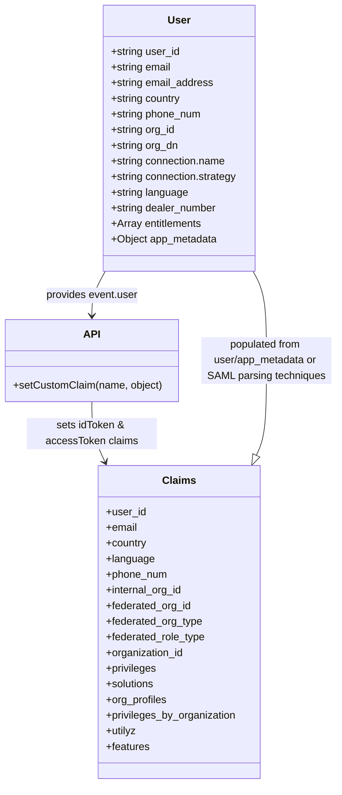

# Diagram: sso/auth0/actions/test.fv-claims.js


> Auto-generated by Obscura crawlers

## Diagram 1

```mermaid
flowchart TD
    Start([Start]) --> CheckStrategy{strategy === "samlp" OR user.org_dn}
    CheckStrategy -->|yes| SamlFlow[SAML/OrgDN Flow]
    CheckStrategy -->|no| CheckAuth0{strategy === "auth0"}
    CheckAuth0 -->|yes| Auth0Flow[Auth0 Flow: set claims from app_metadata]
    CheckAuth0 -->|no| End([End])

    subgraph SAML_Flow[ ]
      SamlFlow --> InitVars[Initialize: email_address, country, phone_num, federated_org_id, language="en", internal_org_id, fv_org_type, fv_role_type]
      InitVars --> ConnCheck{connectionName}
      ConnCheck -->|GM| GMBranch[GM logic]
      ConnCheck -->|Honda / Honda-Dev| HondaBranch[Honda logic]
      ConnCheck -->|Honda-Canada / Honda-Canada-Shibboleth| HondaCanBranch[Honda Canada logic]
      ConnCheck -->|Ford| FordBranch[Ford logic]
      ConnCheck -->|Hyundai / Genesis| HyundaiBranch[Hyundai/Genesis logic]
      ConnCheck -->|Stellantis| StellantisBranch[Stellantis logic]
      ConnCheck -->|other| DefaultBranch[Default: use user/org_id mapping]
      GMBranch --> GM_Cases{gm_type_ou -> GM_Corporate/GM_Wholesale?}
      GM_Cases -->|corporate/wholesale| GM_Corp[internal_org_id=18; fv_org_type="SH"; fv_role_type="FV"]
      GM_Cases -->|else| GM_Dealer[extract gm_id_ou -> federated_org_id (trim leading zeros); fv_org_type="DL"; fv_role_type="FV"]
      HondaBranch --> Honda_CheckDealer{dealer_number numeric?}
      Honda_CheckDealer -->|yes| Honda_Dealer[fv_org_type="DL"; federated_org_id="HONDA|<dealer_number>"]
      Honda_CheckDealer -->|no| Honda_Ship[internal_org_id=12966; fv_org_type="SH"; federated_org_id=""]
      HondaCanBranch --> HondaCan_Check{dealer_number numeric?}
      HondaCan_Check -->|yes| HondaCan_Dealer[fv_org_type="DL"; federated_org_id="HONDA|<dealer_number>"]
      HondaCan_Check -->|no| HondaCan_Ship[internal_org_id=35882; fv_org_type="SH"; federated_org_id=""]
      FordBranch --> Ford_CheckEnt{entitlements includes "VINView"?}
      Ford_CheckEnt -->|yes| Ford_SH[internal_org_id=137; fv_org_type="SH"; fv_role_type="FV"; federated_org_id=""]
      Ford_CheckEnt -->|no| Ford_DL[federated_org_id="FORD|<org_id>"; fv_org_type="DL"; fv_role_type="FV"]
      HyundaiBranch --> Hyundai_Check{dealer_number === "00000"?}
      Hyundai_Check -->|yes| Hyundai_SH[internal_org_id=1822; fv_org_type="SH"; federated_org_id=""]
      Hyundai_Check -->|no| Hyundai_DL[fv_org_type="DL"; federated_org_id="HYUNDAI|<dealer_number>"]
      StellantisBranch --> Stellantis_Set[internal_org_id=18708; fv_org_type="SH"; fv_role_type="FV"; federated_org_id=""]
      DefaultBranch --> Default_Set[Use existing federated_org_id or user.org_id; set fv_org_type/fv_role_type as appropriate]
      GM_Corp --> SetClaims
      GM_Dealer --> SetClaims
      Honda_Dealer --> SetClaims
      Honda_Ship --> SetClaims
      HondaCan_Dealer --> SetClaims
      HondaCan_Ship --> SetClaims
      Ford_SH --> SetClaims
      Ford_DL --> SetClaims
      Hyundai_SH --> SetClaims
      Hyundai_DL --> SetClaims
      Stellantis_Set --> SetClaims
      Default_Set --> SetClaims

      SetClaims[Set idToken & accessToken custom claim: namespace + "user_authorization" with user_id, email, country, language, phone_num, internal_org_id, federated_org_id, federated_org_type, federated_role_type] --> End
    end
```

> SVG rendering failed for this diagram.

## Diagram 2



### SVG

<svg id="container" width="515.4921875" xmlns="http://www.w3.org/2000/svg" class="classDiagram" height="1202" viewBox="0 0 515.4921875 1202" role="graphics-document document" aria-roledescription="class"><style>#container{font-family:"trebuchet ms",verdana,arial,sans-serif;font-size:16px;fill:#333;}@keyframes edge-animation-frame{from{stroke-dashoffset:0;}}@keyframes dash{to{stroke-dashoffset:0;}}#container .edge-animation-slow{stroke-dasharray:9,5!important;stroke-dashoffset:900;animation:dash 50s linear infinite;stroke-linecap:round;}#container .edge-animation-fast{stroke-dasharray:9,5!important;stroke-dashoffset:900;animation:dash 20s linear infinite;stroke-linecap:round;}#container .error-icon{fill:#552222;}#container .error-text{fill:#552222;stroke:#552222;}#container .edge-thickness-normal{stroke-width:1px;}#container .edge-thickness-thick{stroke-width:3.5px;}#container .edge-pattern-solid{stroke-dasharray:0;}#container .edge-thickness-invisible{stroke-width:0;fill:none;}#container .edge-pattern-dashed{stroke-dasharray:3;}#container .edge-pattern-dotted{stroke-dasharray:2;}#container .marker{fill:#333333;stroke:#333333;}#container .marker.cross{stroke:#333333;}#container svg{font-family:"trebuchet ms",verdana,arial,sans-serif;font-size:16px;}#container p{margin:0;}#container g.classGroup text{fill:#9370DB;stroke:none;font-family:"trebuchet ms",verdana,arial,sans-serif;font-size:10px;}#container g.classGroup text .title{font-weight:bolder;}#container .nodeLabel,#container .edgeLabel{color:#131300;}#container .edgeLabel .label rect{fill:#ECECFF;}#container .label text{fill:#131300;}#container .labelBkg{background:#ECECFF;}#container .edgeLabel .label span{background:#ECECFF;}#container .classTitle{font-weight:bolder;}#container .node rect,#container .node circle,#container .node ellipse,#container .node polygon,#container .node path{fill:#ECECFF;stroke:#9370DB;stroke-width:1px;}#container .divider{stroke:#9370DB;stroke-width:1;}#container g.clickable{cursor:pointer;}#container g.classGroup rect{fill:#ECECFF;stroke:#9370DB;}#container g.classGroup line{stroke:#9370DB;stroke-width:1;}#container .classLabel .box{stroke:none;stroke-width:0;fill:#ECECFF;opacity:0.5;}#container .classLabel .label{fill:#9370DB;font-size:10px;}#container .relation{stroke:#333333;stroke-width:1;fill:none;}#container .dashed-line{stroke-dasharray:3;}#container .dotted-line{stroke-dasharray:1 2;}#container #compositionStart,#container .composition{fill:#333333!important;stroke:#333333!important;stroke-width:1;}#container #compositionEnd,#container .composition{fill:#333333!important;stroke:#333333!important;stroke-width:1;}#container #dependencyStart,#container .dependency{fill:#333333!important;stroke:#333333!important;stroke-width:1;}#container #dependencyStart,#container .dependency{fill:#333333!important;stroke:#333333!important;stroke-width:1;}#container #extensionStart,#container .extension{fill:transparent!important;stroke:#333333!important;stroke-width:1;}#container #extensionEnd,#container .extension{fill:transparent!important;stroke:#333333!important;stroke-width:1;}#container #aggregationStart,#container .aggregation{fill:transparent!important;stroke:#333333!important;stroke-width:1;}#container #aggregationEnd,#container .aggregation{fill:transparent!important;stroke:#333333!important;stroke-width:1;}#container #lollipopStart,#container .lollipop{fill:#ECECFF!important;stroke:#333333!important;stroke-width:1;}#container #lollipopEnd,#container .lollipop{fill:#ECECFF!important;stroke:#333333!important;stroke-width:1;}#container .edgeTerminals{font-size:11px;line-height:initial;}#container .classTitleText{text-anchor:middle;font-size:18px;fill:#333;}#container .label-icon{display:inline-block;height:1em;overflow:visible;vertical-align:-0.125em;}#container .node .label-icon path{fill:currentColor;stroke:revert;stroke-width:revert;}#container :root{--mermaid-font-family:"trebuchet ms",verdana,arial,sans-serif;}</style><g><defs><marker id="container_class-aggregationStart" class="marker aggregation class" refX="18" refY="7" markerWidth="190" markerHeight="240" orient="auto"><path d="M 18,7 L9,13 L1,7 L9,1 Z"></path></marker></defs><defs><marker id="container_class-aggregationEnd" class="marker aggregation class" refX="1" refY="7" markerWidth="20" markerHeight="28" orient="auto"><path d="M 18,7 L9,13 L1,7 L9,1 Z"></path></marker></defs><defs><marker id="container_class-extensionStart" class="marker extension class" refX="18" refY="7" markerWidth="190" markerHeight="240" orient="auto"><path d="M 1,7 L18,13 V 1 Z"></path></marker></defs><defs><marker id="container_class-extensionEnd" class="marker extension class" refX="1" refY="7" markerWidth="20" markerHeight="28" orient="auto"><path d="M 1,1 V 13 L18,7 Z"></path></marker></defs><defs><marker id="container_class-compositionStart" class="marker composition class" refX="18" refY="7" markerWidth="190" markerHeight="240" orient="auto"><path d="M 18,7 L9,13 L1,7 L9,1 Z"></path></marker></defs><defs><marker id="container_class-compositionEnd" class="marker composition class" refX="1" refY="7" markerWidth="20" markerHeight="28" orient="auto"><path d="M 18,7 L9,13 L1,7 L9,1 Z"></path></marker></defs><defs><marker id="container_class-dependencyStart" class="marker dependency class" refX="6" refY="7" markerWidth="190" markerHeight="240" orient="auto"><path d="M 5,7 L9,13 L1,7 L9,1 Z"></path></marker></defs><defs><marker id="container_class-dependencyEnd" class="marker dependency class" refX="13" refY="7" markerWidth="20" markerHeight="28" orient="auto"><path d="M 18,7 L9,13 L14,7 L9,1 Z"></path></marker></defs><defs><marker id="container_class-lollipopStart" class="marker lollipop class" refX="13" refY="7" markerWidth="190" markerHeight="240" orient="auto"><circle stroke="black" fill="transparent" cx="7" cy="7" r="6"></circle></marker></defs><defs><marker id="container_class-lollipopEnd" class="marker lollipop class" refX="1" refY="7" markerWidth="190" markerHeight="240" orient="auto"><circle stroke="black" fill="transparent" cx="7" cy="7" r="6"></circle></marker></defs><g class="root"><g class="clusters"></g><g class="edgePaths"><path d="M160.761,416L157.342,422.167C153.923,428.333,147.084,440.667,143.665,452C140.246,463.333,140.246,473.667,140.246,478.833L140.246,484" id="id_User_API_1" class="edge-thickness-normal edge-pattern-solid relation" style=";;;" data-edge="true" data-et="edge" data-id="id_User_API_1" data-points="W3sieCI6MTYwLjc2MDgzNTM4NjQxMDgsInkiOjQxNn0seyJ4IjoxNDAuMjQ2MDkzNzUsInkiOjQ1M30seyJ4IjoxNDAuMjQ2MDkzNzUsInkiOjQ5MH1d" marker-end="url(#container_class-dependencyEnd)"></path><path d="M140.246,616L140.246,624.167C140.246,632.333,140.246,648.667,143.602,664.092C146.959,679.518,153.671,694.036,157.028,701.295L160.384,708.554" id="id_API_Claims_2" class="edge-thickness-normal edge-pattern-solid relation" style=";;;" data-edge="true" data-et="edge" data-id="id_API_Claims_2" data-points="W3sieCI6MTQwLjI0NjA5Mzc1LCJ5Ijo2MTZ9LHsieCI6MTQwLjI0NjA5Mzc1LCJ5Ijo2NjV9LHsieCI6MTYyLjkwMTkwNDQ2NTgzMDQ2LCJ5Ijo3MTR9XQ==" marker-end="url(#container_class-dependencyEnd)"></path><path d="M392.076,698.343L394.645,692.786C397.215,687.228,402.353,676.114,404.923,651.89C407.492,627.667,407.492,590.333,407.492,555C407.492,519.667,407.492,486.333,404.073,463.5C400.654,440.667,393.816,428.333,390.397,422.167L386.977,416" id="id_Claims_User_3" class="edge-thickness-normal edge-pattern-solid relation" style=";;;" data-edge="true" data-et="edge" data-id="id_Claims_User_3" data-points="W3sieCI6Mzg0LjgzNjM3Njc4NDE2OTU0LCJ5Ijo3MTR9LHsieCI6NDA3LjQ5MjE4NzUsInkiOjY2NX0seyJ4Ijo0MDcuNDkyMTg3NSwieSI6NTUzfSx7IngiOjQwNy40OTIxODc1LCJ5Ijo0NTN9LHsieCI6Mzg2Ljk3NzQ0NTg2MzU4OTIsInkiOjQxNn1d" marker-start="url(#container_class-extensionStart)"></path></g><g class="edgeLabels"><g class="edgeLabel" transform="translate(140.24609375, 453)"><g class="label" data-id="id_User_API_1" transform="translate(-71.3125, -12)"><foreignObject width="142.625" height="24"><div xmlns="http://www.w3.org/1999/xhtml" class="labelBkg" style="display: table-cell; white-space: nowrap; line-height: 1.5; max-width: 200px; text-align: center;"><span class="edgeLabel"><p>provides event.user</p></span></div></foreignObject></g></g><g class="edgeLabel" transform="translate(140.24609375, 665)"><g class="label" data-id="id_API_Claims_2" transform="translate(-100, -24)"><foreignObject width="200" height="48"><div xmlns="http://www.w3.org/1999/xhtml" class="labelBkg" style="display: table; white-space: break-spaces; line-height: 1.5; max-width: 200px; text-align: center; width: 200px;"><span class="edgeLabel"><p>sets idToken &amp; accessToken claims</p></span></div></foreignObject></g></g><g class="edgeLabel" transform="translate(407.4921875, 553)"><g class="label" data-id="id_Claims_User_3" transform="translate(-100, -36)"><foreignObject width="200" height="72"><div xmlns="http://www.w3.org/1999/xhtml" class="labelBkg" style="display: table; white-space: break-spaces; line-height: 1.5; max-width: 200px; text-align: center; width: 200px;"><span class="edgeLabel"><p>populated from user/app_metadata or SAML parsing techniques</p></span></div></foreignObject></g></g></g><g class="nodes"><g class="node default" id="classId-User-0" transform="translate(273.869140625, 212)"><g class="basic label-container"><path d="M-118.6171875 -204 L118.6171875 -204 L118.6171875 204 L-118.6171875 204" stroke="none" stroke-width="0" fill="#ECECFF" style=""></path><path d="M-118.6171875 -204 C-59.35703542902503 -204, -0.09688335805006432 -204, 118.6171875 -204 M-118.6171875 -204 C-63.88771689459272 -204, -9.158246289185442 -204, 118.6171875 -204 M118.6171875 -204 C118.6171875 -103.24422010563863, 118.6171875 -2.488440211277265, 118.6171875 204 M118.6171875 -204 C118.6171875 -41.14069074900928, 118.6171875 121.71861850198144, 118.6171875 204 M118.6171875 204 C45.29000941547194 204, -28.037168669056115 204, -118.6171875 204 M118.6171875 204 C26.156074041113513 204, -66.30503941777297 204, -118.6171875 204 M-118.6171875 204 C-118.6171875 101.5358373447016, -118.6171875 -0.9283253105967901, -118.6171875 -204 M-118.6171875 204 C-118.6171875 113.09262069360626, -118.6171875 22.18524138721253, -118.6171875 -204" stroke="#9370DB" stroke-width="1.3" fill="none" stroke-dasharray="0 0" style=""></path></g><g class="annotation-group text" transform="translate(0, -180)"></g><g class="label-group text" transform="translate(-16.65625, -180)"><g class="label" style="font-weight: bolder" transform="translate(0,-12)"><foreignObject width="33.3125" height="24"><div xmlns="http://www.w3.org/1999/xhtml" style="display: table-cell; white-space: nowrap; line-height: 1.5; max-width: 84px; text-align: center;"><span class="nodeLabel markdown-node-label" style=""><p>User</p></span></div></foreignObject></g></g><g class="members-group text" transform="translate(-106.6171875, -132)"><g class="label" style="" transform="translate(0,-12)"><foreignObject width="106.65625" height="24"><div xmlns="http://www.w3.org/1999/xhtml" style="display: table-cell; white-space: nowrap; line-height: 1.5; max-width: 164px; text-align: center;"><span class="nodeLabel markdown-node-label" style=""><p>+string user_id</p></span></div></foreignObject></g><g class="label" style="" transform="translate(0,12)"><foreignObject width="94.203125" height="24"><div xmlns="http://www.w3.org/1999/xhtml" style="display: table-cell; white-space: nowrap; line-height: 1.5; max-width: 152px; text-align: center;"><span class="nodeLabel markdown-node-label" style=""><p>+string email</p></span></div></foreignObject></g><g class="label" style="" transform="translate(0,36)"><foreignObject width="159.234375" height="24"><div xmlns="http://www.w3.org/1999/xhtml" style="display: table-cell; white-space: nowrap; line-height: 1.5; max-width: 217px; text-align: center;"><span class="nodeLabel markdown-node-label" style=""><p>+string email_address</p></span></div></foreignObject></g><g class="label" style="" transform="translate(0,60)"><foreignObject width="109.046875" height="24"><div xmlns="http://www.w3.org/1999/xhtml" style="display: table-cell; white-space: nowrap; line-height: 1.5; max-width: 167px; text-align: center;"><span class="nodeLabel markdown-node-label" style=""><p>+string country</p></span></div></foreignObject></g><g class="label" style="" transform="translate(0,84)"><foreignObject width="140.578125" height="24"><div xmlns="http://www.w3.org/1999/xhtml" style="display: table-cell; white-space: nowrap; line-height: 1.5; max-width: 198px; text-align: center;"><span class="nodeLabel markdown-node-label" style=""><p>+string phone_num</p></span></div></foreignObject></g><g class="label" style="" transform="translate(0,108)"><foreignObject width="99.921875" height="24"><div xmlns="http://www.w3.org/1999/xhtml" style="display: table-cell; white-space: nowrap; line-height: 1.5; max-width: 157px; text-align: center;"><span class="nodeLabel markdown-node-label" style=""><p>+string org_id</p></span></div></foreignObject></g><g class="label" style="" transform="translate(0,132)"><foreignObject width="104.46875" height="24"><div xmlns="http://www.w3.org/1999/xhtml" style="display: table-cell; white-space: nowrap; line-height: 1.5; max-width: 162px; text-align: center;"><span class="nodeLabel markdown-node-label" style=""><p>+string org_dn</p></span></div></foreignObject></g><g class="label" style="" transform="translate(0,156)"><foreignObject width="179.015625" height="24"><div xmlns="http://www.w3.org/1999/xhtml" style="display: table-cell; white-space: nowrap; line-height: 1.5; max-width: 236px; text-align: center;"><span class="nodeLabel markdown-node-label" style=""><p>+string connection.name</p></span></div></foreignObject></g><g class="label" style="" transform="translate(0,180)"><foreignObject width="196.578125" height="24"><div xmlns="http://www.w3.org/1999/xhtml" style="display: table-cell; white-space: nowrap; line-height: 1.5; max-width: 254px; text-align: center;"><span class="nodeLabel markdown-node-label" style=""><p>+string connection.strategy</p></span></div></foreignObject></g><g class="label" style="" transform="translate(0,204)"><foreignObject width="119.359375" height="24"><div xmlns="http://www.w3.org/1999/xhtml" style="display: table-cell; white-space: nowrap; line-height: 1.5; max-width: 177px; text-align: center;"><span class="nodeLabel markdown-node-label" style=""><p>+string language</p></span></div></foreignObject></g><g class="label" style="" transform="translate(0,228)"><foreignObject width="163.875" height="24"><div xmlns="http://www.w3.org/1999/xhtml" style="display: table-cell; white-space: nowrap; line-height: 1.5; max-width: 222px; text-align: center;"><span class="nodeLabel markdown-node-label" style=""><p>+string dealer_number</p></span></div></foreignObject></g><g class="label" style="" transform="translate(0,252)"><foreignObject width="141.75" height="24"><div xmlns="http://www.w3.org/1999/xhtml" style="display: table-cell; white-space: nowrap; line-height: 1.5; max-width: 199px; text-align: center;"><span class="nodeLabel markdown-node-label" style=""><p>+Array entitlements</p></span></div></foreignObject></g><g class="label" style="" transform="translate(0,276)"><foreignObject width="164.578125" height="24"><div xmlns="http://www.w3.org/1999/xhtml" style="display: table-cell; white-space: nowrap; line-height: 1.5; max-width: 222px; text-align: center;"><span class="nodeLabel markdown-node-label" style=""><p>+Object app_metadata</p></span></div></foreignObject></g></g><g class="methods-group text" transform="translate(-106.6171875, 204)"></g><g class="divider" style=""><path d="M-118.6171875 -156 C-35.17599408267435 -156, 48.2651993346513 -156, 118.6171875 -156 M-118.6171875 -156 C-48.046168610465486 -156, 22.524850279069028 -156, 118.6171875 -156" stroke="#9370DB" stroke-width="1.3" fill="none" stroke-dasharray="0 0" style=""></path></g><g class="divider" style=""><path d="M-118.6171875 180 C-61.4915753156495 180, -4.365963131298997 180, 118.6171875 180 M-118.6171875 180 C-70.15912042430239 180, -21.70105334860476 180, 118.6171875 180" stroke="#9370DB" stroke-width="1.3" fill="none" stroke-dasharray="0 0" style=""></path></g></g><g class="node default" id="classId-API-1" transform="translate(140.24609375, 553)"><g class="basic label-container"><path d="M-132.24609375 -63 L132.24609375 -63 L132.24609375 63 L-132.24609375 63" stroke="none" stroke-width="0" fill="#ECECFF" style=""></path><path d="M-132.24609375 -63 C-66.74977357954728 -63, -1.2534534090945613 -63, 132.24609375 -63 M-132.24609375 -63 C-69.90475453106937 -63, -7.563415312138744 -63, 132.24609375 -63 M132.24609375 -63 C132.24609375 -35.42488290563159, 132.24609375 -7.84976581126319, 132.24609375 63 M132.24609375 -63 C132.24609375 -33.52166985945274, 132.24609375 -4.043339718905493, 132.24609375 63 M132.24609375 63 C60.646621385868826 63, -10.952850978262347 63, -132.24609375 63 M132.24609375 63 C41.57626206286524 63, -49.09356962426952 63, -132.24609375 63 M-132.24609375 63 C-132.24609375 24.44171133602257, -132.24609375 -14.116577327954857, -132.24609375 -63 M-132.24609375 63 C-132.24609375 28.928602203107886, -132.24609375 -5.1427955937842285, -132.24609375 -63" stroke="#9370DB" stroke-width="1.3" fill="none" stroke-dasharray="0 0" style=""></path></g><g class="annotation-group text" transform="translate(0, -39)"></g><g class="label-group text" transform="translate(-11.8671875, -39)"><g class="label" style="font-weight: bolder" transform="translate(0,-12)"><foreignObject width="23.734375" height="24"><div xmlns="http://www.w3.org/1999/xhtml" style="display: table-cell; white-space: nowrap; line-height: 1.5; max-width: 73px; text-align: center;"><span class="nodeLabel markdown-node-label" style=""><p>API</p></span></div></foreignObject></g></g><g class="members-group text" transform="translate(-120.24609375, 9)"></g><g class="methods-group text" transform="translate(-120.24609375, 39)"><g class="label" style="" transform="translate(0,-12)"><foreignObject width="228.625" height="24"><div xmlns="http://www.w3.org/1999/xhtml" style="display: table-cell; white-space: nowrap; line-height: 1.5; max-width: 286px; text-align: center;"><span class="nodeLabel markdown-node-label" style=""><p>+setCustomClaim(name, object)</p></span></div></foreignObject></g></g><g class="divider" style=""><path d="M-132.24609375 -15 C-38.01006179598201 -15, 56.22597015803598 -15, 132.24609375 -15 M-132.24609375 -15 C-62.566496749057976 -15, 7.113100251884049 -15, 132.24609375 -15" stroke="#9370DB" stroke-width="1.3" fill="none" stroke-dasharray="0 0" style=""></path></g><g class="divider" style=""><path d="M-132.24609375 9 C-42.330587094397174 9, 47.58491956120565 9, 132.24609375 9 M-132.24609375 9 C-59.672945378542096 9, 12.900202992915808 9, 132.24609375 9" stroke="#9370DB" stroke-width="1.3" fill="none" stroke-dasharray="0 0" style=""></path></g></g><g class="node default" id="classId-Claims-2" transform="translate(273.869140625, 954)"><g class="basic label-container"><path d="M-124.734375 -240 L124.734375 -240 L124.734375 240 L-124.734375 240" stroke="none" stroke-width="0" fill="#ECECFF" style=""></path><path d="M-124.734375 -240 C-44.76522912236935 -240, 35.203916755261304 -240, 124.734375 -240 M-124.734375 -240 C-71.18486857363214 -240, -17.635362147264274 -240, 124.734375 -240 M124.734375 -240 C124.734375 -128.8076333001046, 124.734375 -17.615266600209253, 124.734375 240 M124.734375 -240 C124.734375 -89.79713528950992, 124.734375 60.40572942098015, 124.734375 240 M124.734375 240 C67.0652942941937 240, 9.396213588387425 240, -124.734375 240 M124.734375 240 C33.230788389851696 240, -58.27279822029661 240, -124.734375 240 M-124.734375 240 C-124.734375 106.95960871946846, -124.734375 -26.080782561063074, -124.734375 -240 M-124.734375 240 C-124.734375 142.04578147899824, -124.734375 44.09156295799647, -124.734375 -240" stroke="#9370DB" stroke-width="1.3" fill="none" stroke-dasharray="0 0" style=""></path></g><g class="annotation-group text" transform="translate(0, -216)"></g><g class="label-group text" transform="translate(-24.125, -216)"><g class="label" style="font-weight: bolder" transform="translate(0,-12)"><foreignObject width="48.25" height="24"><div xmlns="http://www.w3.org/1999/xhtml" style="display: table-cell; white-space: nowrap; line-height: 1.5; max-width: 98px; text-align: center;"><span class="nodeLabel markdown-node-label" style=""><p>Claims</p></span></div></foreignObject></g></g><g class="members-group text" transform="translate(-112.734375, -168)"><g class="label" style="" transform="translate(0,-12)"><foreignObject width="60.796875" height="24"><div xmlns="http://www.w3.org/1999/xhtml" style="display: table-cell; white-space: nowrap; line-height: 1.5; max-width: 118px; text-align: center;"><span class="nodeLabel markdown-node-label" style=""><p>+user_id</p></span></div></foreignObject></g><g class="label" style="" transform="translate(0,12)"><foreignObject width="48.328125" height="24"><div xmlns="http://www.w3.org/1999/xhtml" style="display: table-cell; white-space: nowrap; line-height: 1.5; max-width: 106px; text-align: center;"><span class="nodeLabel markdown-node-label" style=""><p>+email</p></span></div></foreignObject></g><g class="label" style="" transform="translate(0,36)"><foreignObject width="63.171875" height="24"><div xmlns="http://www.w3.org/1999/xhtml" style="display: table-cell; white-space: nowrap; line-height: 1.5; max-width: 121px; text-align: center;"><span class="nodeLabel markdown-node-label" style=""><p>+country</p></span></div></foreignObject></g><g class="label" style="" transform="translate(0,60)"><foreignObject width="73.484375" height="24"><div xmlns="http://www.w3.org/1999/xhtml" style="display: table-cell; white-space: nowrap; line-height: 1.5; max-width: 131px; text-align: center;"><span class="nodeLabel markdown-node-label" style=""><p>+language</p></span></div></foreignObject></g><g class="label" style="" transform="translate(0,84)"><foreignObject width="94.71875" height="24"><div xmlns="http://www.w3.org/1999/xhtml" style="display: table-cell; white-space: nowrap; line-height: 1.5; max-width: 152px; text-align: center;"><span class="nodeLabel markdown-node-label" style=""><p>+phone_num</p></span></div></foreignObject></g><g class="label" style="" transform="translate(0,108)"><foreignObject width="118.984375" height="24"><div xmlns="http://www.w3.org/1999/xhtml" style="display: table-cell; white-space: nowrap; line-height: 1.5; max-width: 176px; text-align: center;"><span class="nodeLabel markdown-node-label" style=""><p>+internal_org_id</p></span></div></foreignObject></g><g class="label" style="" transform="translate(0,132)"><foreignObject width="132.171875" height="24"><div xmlns="http://www.w3.org/1999/xhtml" style="display: table-cell; white-space: nowrap; line-height: 1.5; max-width: 190px; text-align: center;"><span class="nodeLabel markdown-node-label" style=""><p>+federated_org_id</p></span></div></foreignObject></g><g class="label" style="" transform="translate(0,156)"><foreignObject width="149.5625" height="24"><div xmlns="http://www.w3.org/1999/xhtml" style="display: table-cell; white-space: nowrap; line-height: 1.5; max-width: 207px; text-align: center;"><span class="nodeLabel markdown-node-label" style=""><p>+federated_org_type</p></span></div></foreignObject></g><g class="label" style="" transform="translate(0,180)"><foreignObject width="154.265625" height="24"><div xmlns="http://www.w3.org/1999/xhtml" style="display: table-cell; white-space: nowrap; line-height: 1.5; max-width: 212px; text-align: center;"><span class="nodeLabel markdown-node-label" style=""><p>+federated_role_type</p></span></div></foreignObject></g><g class="label" style="" transform="translate(0,204)"><foreignObject width="120.75" height="24"><div xmlns="http://www.w3.org/1999/xhtml" style="display: table-cell; white-space: nowrap; line-height: 1.5; max-width: 178px; text-align: center;"><span class="nodeLabel markdown-node-label" style=""><p>+organization_id</p></span></div></foreignObject></g><g class="label" style="" transform="translate(0,228)"><foreignObject width="78.15625" height="24"><div xmlns="http://www.w3.org/1999/xhtml" style="display: table-cell; white-space: nowrap; line-height: 1.5; max-width: 136px; text-align: center;"><span class="nodeLabel markdown-node-label" style=""><p>+privileges</p></span></div></foreignObject></g><g class="label" style="" transform="translate(0,252)"><foreignObject width="75.28125" height="24"><div xmlns="http://www.w3.org/1999/xhtml" style="display: table-cell; white-space: nowrap; line-height: 1.5; max-width: 133px; text-align: center;"><span class="nodeLabel markdown-node-label" style=""><p>+solutions</p></span></div></foreignObject></g><g class="label" style="" transform="translate(0,276)"><foreignObject width="94.515625" height="24"><div xmlns="http://www.w3.org/1999/xhtml" style="display: table-cell; white-space: nowrap; line-height: 1.5; max-width: 152px; text-align: center;"><span class="nodeLabel markdown-node-label" style=""><p>+org_profiles</p></span></div></foreignObject></g><g class="label" style="" transform="translate(0,300)"><foreignObject width="201.34375" height="24"><div xmlns="http://www.w3.org/1999/xhtml" style="display: table-cell; white-space: nowrap; line-height: 1.5; max-width: 259px; text-align: center;"><span class="nodeLabel markdown-node-label" style=""><p>+privileges_by_organization</p></span></div></foreignObject></g><g class="label" style="" transform="translate(0,324)"><foreignObject width="46.984375" height="24"><div xmlns="http://www.w3.org/1999/xhtml" style="display: table-cell; white-space: nowrap; line-height: 1.5; max-width: 104px; text-align: center;"><span class="nodeLabel markdown-node-label" style=""><p>+utilyz</p></span></div></foreignObject></g><g class="label" style="" transform="translate(0,348)"><foreignObject width="67.1875" height="24"><div xmlns="http://www.w3.org/1999/xhtml" style="display: table-cell; white-space: nowrap; line-height: 1.5; max-width: 125px; text-align: center;"><span class="nodeLabel markdown-node-label" style=""><p>+features</p></span></div></foreignObject></g></g><g class="methods-group text" transform="translate(-112.734375, 240)"></g><g class="divider" style=""><path d="M-124.734375 -192 C-47.81063257235833 -192, 29.11310985528334 -192, 124.734375 -192 M-124.734375 -192 C-51.478681226099084 -192, 21.77701254780183 -192, 124.734375 -192" stroke="#9370DB" stroke-width="1.3" fill="none" stroke-dasharray="0 0" style=""></path></g><g class="divider" style=""><path d="M-124.734375 216 C-66.05988876743278 216, -7.3854025348655625 216, 124.734375 216 M-124.734375 216 C-65.81617298700493 216, -6.897970974009851 216, 124.734375 216" stroke="#9370DB" stroke-width="1.3" fill="none" stroke-dasharray="0 0" style=""></path></g></g></g></g></g></svg>
