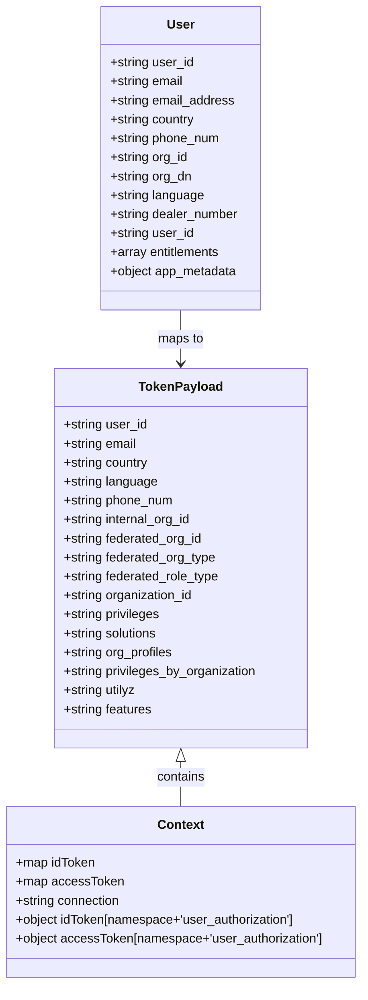

# Diagram: sso/auth0/rules/test.fv-claims.js


> Auto-generated by Obscura crawlers

## Diagram 1

```mermaid
flowchart TD
  Start([Start])
  CheckAuth{context.protocol === 'samlp' or user.org_dn?}
  Start --> CheckAuth
  CheckAuth -->|Yes| SamlBranch[SAML / Federated Paths]
  CheckAuth -->|No| AppMetadataBranch[App Metadata Path]
  subgraph Federated
    SamlBranch --> ConnCheck{context.connection}
    ConnCheck -->|GM| GMFlow[GM: parse org_dn -> GM_Corporate/GM_Wholesale -> SH(18)/FV OR DL -> federated_org_id]
    ConnCheck -->|Honda or Honda-Dev| HondaFlow[Honda: append @honda..., dealer_number numeric -> DL/HONDA|dealer_number else SH(12966)]
    ConnCheck -->|Honda-Canada| HondaCA[Honda-Canada: dealer_number numeric -> DL/HONDA-CANADA|dealer_number else SH(35882)]
    ConnCheck -->|Ford| FordFlow[Ford: entitlements includes VINView -> SH(137) else DL -> FORD|user.org_id]
    ConnCheck -->|Hyundai or Genesis| HyundaiFlow[Hyundai: user_id email set, dealer_number '00000' -> SH(1822) else DL -> HYUNDAI|dealer_number]
    ConnCheck -->|Stellantis| StellantisFlow[Stellantis -> SH(18708)/FV]
    ConnCheck -->|other| DefaultFed[Default federated mapping (fv_role_type='FV' or empty)]
    GMFlow --> SetTokensFed
    HondaFlow --> SetTokensFed
    HondaCA --> SetTokensFed
    FordFlow --> SetTokensFed
    HyundaiFlow --> SetTokensFed
    StellantisFlow --> SetTokensFed
    DefaultFed --> SetTokensFed
    SetTokensFed[Set idToken and accessToken namespace + 'user_authorization' with federated fields]
  end
  subgraph AppMeta
    AppMetadataBranch --> ReadAppMeta[Read user.app_metadata fields]
    ReadAppMeta --> SetTokensApp[Set idToken and accessToken namespace + 'user_authorization' with app metadata fields]
  end
  SetTokensApp --> End([return callback(null, user, context)])
  SetTokensFed --> End
```

> SVG rendering failed for this diagram.

## Diagram 2



### SVG

<svg id="container" width="459.0625" xmlns="http://www.w3.org/2000/svg" class="classDiagram" height="1244" viewBox="0 0 459.0625 1244" role="graphics-document document" aria-roledescription="class"><style>#container{font-family:"trebuchet ms",verdana,arial,sans-serif;font-size:16px;fill:#333;}@keyframes edge-animation-frame{from{stroke-dashoffset:0;}}@keyframes dash{to{stroke-dashoffset:0;}}#container .edge-animation-slow{stroke-dasharray:9,5!important;stroke-dashoffset:900;animation:dash 50s linear infinite;stroke-linecap:round;}#container .edge-animation-fast{stroke-dasharray:9,5!important;stroke-dashoffset:900;animation:dash 20s linear infinite;stroke-linecap:round;}#container .error-icon{fill:#552222;}#container .error-text{fill:#552222;stroke:#552222;}#container .edge-thickness-normal{stroke-width:1px;}#container .edge-thickness-thick{stroke-width:3.5px;}#container .edge-pattern-solid{stroke-dasharray:0;}#container .edge-thickness-invisible{stroke-width:0;fill:none;}#container .edge-pattern-dashed{stroke-dasharray:3;}#container .edge-pattern-dotted{stroke-dasharray:2;}#container .marker{fill:#333333;stroke:#333333;}#container .marker.cross{stroke:#333333;}#container svg{font-family:"trebuchet ms",verdana,arial,sans-serif;font-size:16px;}#container p{margin:0;}#container g.classGroup text{fill:#9370DB;stroke:none;font-family:"trebuchet ms",verdana,arial,sans-serif;font-size:10px;}#container g.classGroup text .title{font-weight:bolder;}#container .nodeLabel,#container .edgeLabel{color:#131300;}#container .edgeLabel .label rect{fill:#ECECFF;}#container .label text{fill:#131300;}#container .labelBkg{background:#ECECFF;}#container .edgeLabel .label span{background:#ECECFF;}#container .classTitle{font-weight:bolder;}#container .node rect,#container .node circle,#container .node ellipse,#container .node polygon,#container .node path{fill:#ECECFF;stroke:#9370DB;stroke-width:1px;}#container .divider{stroke:#9370DB;stroke-width:1;}#container g.clickable{cursor:pointer;}#container g.classGroup rect{fill:#ECECFF;stroke:#9370DB;}#container g.classGroup line{stroke:#9370DB;stroke-width:1;}#container .classLabel .box{stroke:none;stroke-width:0;fill:#ECECFF;opacity:0.5;}#container .classLabel .label{fill:#9370DB;font-size:10px;}#container .relation{stroke:#333333;stroke-width:1;fill:none;}#container .dashed-line{stroke-dasharray:3;}#container .dotted-line{stroke-dasharray:1 2;}#container #compositionStart,#container .composition{fill:#333333!important;stroke:#333333!important;stroke-width:1;}#container #compositionEnd,#container .composition{fill:#333333!important;stroke:#333333!important;stroke-width:1;}#container #dependencyStart,#container .dependency{fill:#333333!important;stroke:#333333!important;stroke-width:1;}#container #dependencyStart,#container .dependency{fill:#333333!important;stroke:#333333!important;stroke-width:1;}#container #extensionStart,#container .extension{fill:transparent!important;stroke:#333333!important;stroke-width:1;}#container #extensionEnd,#container .extension{fill:transparent!important;stroke:#333333!important;stroke-width:1;}#container #aggregationStart,#container .aggregation{fill:transparent!important;stroke:#333333!important;stroke-width:1;}#container #aggregationEnd,#container .aggregation{fill:transparent!important;stroke:#333333!important;stroke-width:1;}#container #lollipopStart,#container .lollipop{fill:#ECECFF!important;stroke:#333333!important;stroke-width:1;}#container #lollipopEnd,#container .lollipop{fill:#ECECFF!important;stroke:#333333!important;stroke-width:1;}#container .edgeTerminals{font-size:11px;line-height:initial;}#container .classTitleText{text-anchor:middle;font-size:18px;fill:#333;}#container .label-icon{display:inline-block;height:1em;overflow:visible;vertical-align:-0.125em;}#container .node .label-icon path{fill:currentColor;stroke:revert;stroke-width:revert;}#container :root{--mermaid-font-family:"trebuchet ms",verdana,arial,sans-serif;}</style><g><defs><marker id="container_class-aggregationStart" class="marker aggregation class" refX="18" refY="7" markerWidth="190" markerHeight="240" orient="auto"><path d="M 18,7 L9,13 L1,7 L9,1 Z"></path></marker></defs><defs><marker id="container_class-aggregationEnd" class="marker aggregation class" refX="1" refY="7" markerWidth="20" markerHeight="28" orient="auto"><path d="M 18,7 L9,13 L1,7 L9,1 Z"></path></marker></defs><defs><marker id="container_class-extensionStart" class="marker extension class" refX="18" refY="7" markerWidth="190" markerHeight="240" orient="auto"><path d="M 1,7 L18,13 V 1 Z"></path></marker></defs><defs><marker id="container_class-extensionEnd" class="marker extension class" refX="1" refY="7" markerWidth="20" markerHeight="28" orient="auto"><path d="M 1,1 V 13 L18,7 Z"></path></marker></defs><defs><marker id="container_class-compositionStart" class="marker composition class" refX="18" refY="7" markerWidth="190" markerHeight="240" orient="auto"><path d="M 18,7 L9,13 L1,7 L9,1 Z"></path></marker></defs><defs><marker id="container_class-compositionEnd" class="marker composition class" refX="1" refY="7" markerWidth="20" markerHeight="28" orient="auto"><path d="M 18,7 L9,13 L1,7 L9,1 Z"></path></marker></defs><defs><marker id="container_class-dependencyStart" class="marker dependency class" refX="6" refY="7" markerWidth="190" markerHeight="240" orient="auto"><path d="M 5,7 L9,13 L1,7 L9,1 Z"></path></marker></defs><defs><marker id="container_class-dependencyEnd" class="marker dependency class" refX="13" refY="7" markerWidth="20" markerHeight="28" orient="auto"><path d="M 18,7 L9,13 L14,7 L9,1 Z"></path></marker></defs><defs><marker id="container_class-lollipopStart" class="marker lollipop class" refX="13" refY="7" markerWidth="190" markerHeight="240" orient="auto"><circle stroke="black" fill="transparent" cx="7" cy="7" r="6"></circle></marker></defs><defs><marker id="container_class-lollipopEnd" class="marker lollipop class" refX="1" refY="7" markerWidth="190" markerHeight="240" orient="auto"><circle stroke="black" fill="transparent" cx="7" cy="7" r="6"></circle></marker></defs><g class="root"><g class="clusters"></g><g class="edgePaths"><path d="M229.531,963.25L229.531,966.542C229.531,969.833,229.531,976.417,229.531,985.875C229.531,995.333,229.531,1007.667,229.531,1013.833L229.531,1020" id="id_TokenPayload_Context_1" class="edge-thickness-normal edge-pattern-solid relation" style=";;;" data-edge="true" data-et="edge" data-id="id_TokenPayload_Context_1" data-points="W3sieCI6MjI5LjUzMTI1LCJ5Ijo5NDZ9LHsieCI6MjI5LjUzMTI1LCJ5Ijo5ODN9LHsieCI6MjI5LjUzMTI1LCJ5IjoxMDIwfV0=" marker-start="url(#container_class-extensionStart)"></path><path d="M229.531,392L229.531,398.167C229.531,404.333,229.531,416.667,229.531,428C229.531,439.333,229.531,449.667,229.531,454.833L229.531,460" id="id_User_TokenPayload_2" class="edge-thickness-normal edge-pattern-solid relation" style=";;;" data-edge="true" data-et="edge" data-id="id_User_TokenPayload_2" data-points="W3sieCI6MjI5LjUzMTI1LCJ5IjozOTJ9LHsieCI6MjI5LjUzMTI1LCJ5Ijo0Mjl9LHsieCI6MjI5LjUzMTI1LCJ5Ijo0NjZ9XQ==" marker-end="url(#container_class-dependencyEnd)"></path></g><g class="edgeLabels"><g class="edgeLabel" transform="translate(229.53125, 983)"><g class="label" data-id="id_TokenPayload_Context_1" transform="translate(-30.890625, -12)"><foreignObject width="61.78125" height="24"><div xmlns="http://www.w3.org/1999/xhtml" class="labelBkg" style="display: table-cell; white-space: nowrap; line-height: 1.5; max-width: 200px; text-align: center;"><span class="edgeLabel"><p>contains</p></span></div></foreignObject></g></g><g class="edgeLabel" transform="translate(229.53125, 429)"><g class="label" data-id="id_User_TokenPayload_2" transform="translate(-29.2578125, -12)"><foreignObject width="58.515625" height="24"><div xmlns="http://www.w3.org/1999/xhtml" class="labelBkg" style="display: table-cell; white-space: nowrap; line-height: 1.5; max-width: 200px; text-align: center;"><span class="edgeLabel"><p>maps to</p></span></div></foreignObject></g></g></g><g class="nodes"><g class="node default" id="classId-TokenPayload-0" transform="translate(229.53125, 706)"><g class="basic label-container"><path d="M-161.00390625 -240 L161.00390625 -240 L161.00390625 240 L-161.00390625 240" stroke="none" stroke-width="0" fill="#ECECFF" style=""></path><path d="M-161.00390625 -240 C-33.43199782643917 -240, 94.13991059712166 -240, 161.00390625 -240 M-161.00390625 -240 C-62.334659359242096 -240, 36.33458753151581 -240, 161.00390625 -240 M161.00390625 -240 C161.00390625 -101.58364110217957, 161.00390625 36.83271779564086, 161.00390625 240 M161.00390625 -240 C161.00390625 -99.56648223417281, 161.00390625 40.86703553165438, 161.00390625 240 M161.00390625 240 C74.70619221392387 240, -11.59152182215226 240, -161.00390625 240 M161.00390625 240 C68.66271657686431 240, -23.678473096271375 240, -161.00390625 240 M-161.00390625 240 C-161.00390625 77.60284414870063, -161.00390625 -84.79431170259875, -161.00390625 -240 M-161.00390625 240 C-161.00390625 76.28233301933972, -161.00390625 -87.43533396132057, -161.00390625 -240" stroke="#9370DB" stroke-width="1.3" fill="none" stroke-dasharray="0 0" style=""></path></g><g class="annotation-group text" transform="translate(0, -216)"></g><g class="label-group text" transform="translate(-50.8046875, -216)"><g class="label" style="font-weight: bolder" transform="translate(0,-12)"><foreignObject width="101.609375" height="24"><div xmlns="http://www.w3.org/1999/xhtml" style="display: table-cell; white-space: nowrap; line-height: 1.5; max-width: 150px; text-align: center;"><span class="nodeLabel markdown-node-label" style=""><p>TokenPayload</p></span></div></foreignObject></g></g><g class="members-group text" transform="translate(-149.00390625, -168)"><g class="label" style="" transform="translate(0,-12)"><foreignObject width="106.65625" height="24"><div xmlns="http://www.w3.org/1999/xhtml" style="display: table-cell; white-space: nowrap; line-height: 1.5; max-width: 164px; text-align: center;"><span class="nodeLabel markdown-node-label" style=""><p>+string user_id</p></span></div></foreignObject></g><g class="label" style="" transform="translate(0,12)"><foreignObject width="94.203125" height="24"><div xmlns="http://www.w3.org/1999/xhtml" style="display: table-cell; white-space: nowrap; line-height: 1.5; max-width: 152px; text-align: center;"><span class="nodeLabel markdown-node-label" style=""><p>+string email</p></span></div></foreignObject></g><g class="label" style="" transform="translate(0,36)"><foreignObject width="109.046875" height="24"><div xmlns="http://www.w3.org/1999/xhtml" style="display: table-cell; white-space: nowrap; line-height: 1.5; max-width: 167px; text-align: center;"><span class="nodeLabel markdown-node-label" style=""><p>+string country</p></span></div></foreignObject></g><g class="label" style="" transform="translate(0,60)"><foreignObject width="119.359375" height="24"><div xmlns="http://www.w3.org/1999/xhtml" style="display: table-cell; white-space: nowrap; line-height: 1.5; max-width: 177px; text-align: center;"><span class="nodeLabel markdown-node-label" style=""><p>+string language</p></span></div></foreignObject></g><g class="label" style="" transform="translate(0,84)"><foreignObject width="140.578125" height="24"><div xmlns="http://www.w3.org/1999/xhtml" style="display: table-cell; white-space: nowrap; line-height: 1.5; max-width: 198px; text-align: center;"><span class="nodeLabel markdown-node-label" style=""><p>+string phone_num</p></span></div></foreignObject></g><g class="label" style="" transform="translate(0,108)"><foreignObject width="164.859375" height="24"><div xmlns="http://www.w3.org/1999/xhtml" style="display: table-cell; white-space: nowrap; line-height: 1.5; max-width: 222px; text-align: center;"><span class="nodeLabel markdown-node-label" style=""><p>+string internal_org_id</p></span></div></foreignObject></g><g class="label" style="" transform="translate(0,132)"><foreignObject width="178.28125" height="24"><div xmlns="http://www.w3.org/1999/xhtml" style="display: table-cell; white-space: nowrap; line-height: 1.5; max-width: 236px; text-align: center;"><span class="nodeLabel markdown-node-label" style=""><p>+string federated_org_id</p></span></div></foreignObject></g><g class="label" style="" transform="translate(0,156)"><foreignObject width="195.671875" height="24"><div xmlns="http://www.w3.org/1999/xhtml" style="display: table-cell; white-space: nowrap; line-height: 1.5; max-width: 253px; text-align: center;"><span class="nodeLabel markdown-node-label" style=""><p>+string federated_org_type</p></span></div></foreignObject></g><g class="label" style="" transform="translate(0,180)"><foreignObject width="200.375" height="24"><div xmlns="http://www.w3.org/1999/xhtml" style="display: table-cell; white-space: nowrap; line-height: 1.5; max-width: 258px; text-align: center;"><span class="nodeLabel markdown-node-label" style=""><p>+string federated_role_type</p></span></div></foreignObject></g><g class="label" style="" transform="translate(0,204)"><foreignObject width="166.609375" height="24"><div xmlns="http://www.w3.org/1999/xhtml" style="display: table-cell; white-space: nowrap; line-height: 1.5; max-width: 224px; text-align: center;"><span class="nodeLabel markdown-node-label" style=""><p>+string organization_id</p></span></div></foreignObject></g><g class="label" style="" transform="translate(0,228)"><foreignObject width="124.03125" height="24"><div xmlns="http://www.w3.org/1999/xhtml" style="display: table-cell; white-space: nowrap; line-height: 1.5; max-width: 181px; text-align: center;"><span class="nodeLabel markdown-node-label" style=""><p>+string privileges</p></span></div></foreignObject></g><g class="label" style="" transform="translate(0,252)"><foreignObject width="121.15625" height="24"><div xmlns="http://www.w3.org/1999/xhtml" style="display: table-cell; white-space: nowrap; line-height: 1.5; max-width: 179px; text-align: center;"><span class="nodeLabel markdown-node-label" style=""><p>+string solutions</p></span></div></foreignObject></g><g class="label" style="" transform="translate(0,276)"><foreignObject width="140.390625" height="24"><div xmlns="http://www.w3.org/1999/xhtml" style="display: table-cell; white-space: nowrap; line-height: 1.5; max-width: 198px; text-align: center;"><span class="nodeLabel markdown-node-label" style=""><p>+string org_profiles</p></span></div></foreignObject></g><g class="label" style="" transform="translate(0,300)"><foreignObject width="247.203125" height="24"><div xmlns="http://www.w3.org/1999/xhtml" style="display: table-cell; white-space: nowrap; line-height: 1.5; max-width: 305px; text-align: center;"><span class="nodeLabel markdown-node-label" style=""><p>+string privileges_by_organization</p></span></div></foreignObject></g><g class="label" style="" transform="translate(0,324)"><foreignObject width="92.859375" height="24"><div xmlns="http://www.w3.org/1999/xhtml" style="display: table-cell; white-space: nowrap; line-height: 1.5; max-width: 150px; text-align: center;"><span class="nodeLabel markdown-node-label" style=""><p>+string utilyz</p></span></div></foreignObject></g><g class="label" style="" transform="translate(0,348)"><foreignObject width="113.296875" height="24"><div xmlns="http://www.w3.org/1999/xhtml" style="display: table-cell; white-space: nowrap; line-height: 1.5; max-width: 171px; text-align: center;"><span class="nodeLabel markdown-node-label" style=""><p>+string features</p></span></div></foreignObject></g></g><g class="methods-group text" transform="translate(-149.00390625, 240)"></g><g class="divider" style=""><path d="M-161.00390625 -192 C-62.452434955099335 -192, 36.09903633980133 -192, 161.00390625 -192 M-161.00390625 -192 C-94.36724972854084 -192, -27.730593207081682 -192, 161.00390625 -192" stroke="#9370DB" stroke-width="1.3" fill="none" stroke-dasharray="0 0" style=""></path></g><g class="divider" style=""><path d="M-161.00390625 216 C-50.16818317500537 216, 60.667539899989265 216, 161.00390625 216 M-161.00390625 216 C-52.76703090419268 216, 55.46984444161464 216, 161.00390625 216" stroke="#9370DB" stroke-width="1.3" fill="none" stroke-dasharray="0 0" style=""></path></g></g><g class="node default" id="classId-Context-1" transform="translate(229.53125, 1128)"><g class="basic label-container"><path d="M-221.53125 -108 L221.53125 -108 L221.53125 108 L-221.53125 108" stroke="none" stroke-width="0" fill="#ECECFF" style=""></path><path d="M-221.53125 -108 C-124.6898746074561 -108, -27.84849921491221 -108, 221.53125 -108 M-221.53125 -108 C-101.99782340357248 -108, 17.535603192855035 -108, 221.53125 -108 M221.53125 -108 C221.53125 -27.002769499659877, 221.53125 53.994461000680246, 221.53125 108 M221.53125 -108 C221.53125 -35.725989263298615, 221.53125 36.54802147340277, 221.53125 108 M221.53125 108 C53.104893951755656 108, -115.32146209648869 108, -221.53125 108 M221.53125 108 C128.71583080270702 108, 35.900411605414035 108, -221.53125 108 M-221.53125 108 C-221.53125 27.196812298411857, -221.53125 -53.60637540317629, -221.53125 -108 M-221.53125 108 C-221.53125 43.93278213646103, -221.53125 -20.134435727077943, -221.53125 -108" stroke="#9370DB" stroke-width="1.3" fill="none" stroke-dasharray="0 0" style=""></path></g><g class="annotation-group text" transform="translate(0, -84)"></g><g class="label-group text" transform="translate(-28.171875, -84)"><g class="label" style="font-weight: bolder" transform="translate(0,-12)"><foreignObject width="56.34375" height="24"><div xmlns="http://www.w3.org/1999/xhtml" style="display: table-cell; white-space: nowrap; line-height: 1.5; max-width: 105px; text-align: center;"><span class="nodeLabel markdown-node-label" style=""><p>Context</p></span></div></foreignObject></g></g><g class="members-group text" transform="translate(-209.53125, -36)"><g class="label" style="" transform="translate(0,-12)"><foreignObject width="101.109375" height="24"><div xmlns="http://www.w3.org/1999/xhtml" style="display: table-cell; white-space: nowrap; line-height: 1.5; max-width: 158px; text-align: center;"><span class="nodeLabel markdown-node-label" style=""><p>+map idToken</p></span></div></foreignObject></g><g class="label" style="" transform="translate(0,12)"><foreignObject width="133.890625" height="24"><div xmlns="http://www.w3.org/1999/xhtml" style="display: table-cell; white-space: nowrap; line-height: 1.5; max-width: 191px; text-align: center;"><span class="nodeLabel markdown-node-label" style=""><p>+map accessToken</p></span></div></foreignObject></g><g class="label" style="" transform="translate(0,36)"><foreignObject width="134.671875" height="24"><div xmlns="http://www.w3.org/1999/xhtml" style="display: table-cell; white-space: nowrap; line-height: 1.5; max-width: 192px; text-align: center;"><span class="nodeLabel markdown-node-label" style=""><p>+string connection</p></span></div></foreignObject></g><g class="label" style="" transform="translate(0,60)"><foreignObject width="358.109375" height="24"><div xmlns="http://www.w3.org/1999/xhtml" style="display: table-cell; white-space: nowrap; line-height: 1.5; max-width: 415px; text-align: center;"><span class="nodeLabel markdown-node-label" style=""><p>+object idToken[namespace+'user_authorization']</p></span></div></foreignObject></g><g class="label" style="" transform="translate(0,84)"><foreignObject width="390.890625" height="24"><div xmlns="http://www.w3.org/1999/xhtml" style="display: table-cell; white-space: nowrap; line-height: 1.5; max-width: 448px; text-align: center;"><span class="nodeLabel markdown-node-label" style=""><p>+object accessToken[namespace+'user_authorization']</p></span></div></foreignObject></g></g><g class="methods-group text" transform="translate(-209.53125, 108)"></g><g class="divider" style=""><path d="M-221.53125 -60 C-61.37208213330371 -60, 98.78708573339259 -60, 221.53125 -60 M-221.53125 -60 C-132.10776664294482 -60, -42.68428328588965 -60, 221.53125 -60" stroke="#9370DB" stroke-width="1.3" fill="none" stroke-dasharray="0 0" style=""></path></g><g class="divider" style=""><path d="M-221.53125 84 C-80.35250531371355 84, 60.8262393725729 84, 221.53125 84 M-221.53125 84 C-68.14692831222749 84, 85.23739337554503 84, 221.53125 84" stroke="#9370DB" stroke-width="1.3" fill="none" stroke-dasharray="0 0" style=""></path></g></g><g class="node default" id="classId-User-2" transform="translate(229.53125, 200)"><g class="basic label-container"><path d="M-102.265625 -192 L102.265625 -192 L102.265625 192 L-102.265625 192" stroke="none" stroke-width="0" fill="#ECECFF" style=""></path><path d="M-102.265625 -192 C-42.595329448010425 -192, 17.07496610397915 -192, 102.265625 -192 M-102.265625 -192 C-29.510425655619997 -192, 43.244773688760006 -192, 102.265625 -192 M102.265625 -192 C102.265625 -59.01001722541844, 102.265625 73.97996554916313, 102.265625 192 M102.265625 -192 C102.265625 -75.55511426279236, 102.265625 40.889771474415284, 102.265625 192 M102.265625 192 C32.652096299522526 192, -36.96143240095495 192, -102.265625 192 M102.265625 192 C48.99066944365474 192, -4.284286112690523 192, -102.265625 192 M-102.265625 192 C-102.265625 110.25395406514181, -102.265625 28.507908130283624, -102.265625 -192 M-102.265625 192 C-102.265625 76.82940908344015, -102.265625 -38.34118183311969, -102.265625 -192" stroke="#9370DB" stroke-width="1.3" fill="none" stroke-dasharray="0 0" style=""></path></g><g class="annotation-group text" transform="translate(0, -168)"></g><g class="label-group text" transform="translate(-16.65625, -168)"><g class="label" style="font-weight: bolder" transform="translate(0,-12)"><foreignObject width="33.3125" height="24"><div xmlns="http://www.w3.org/1999/xhtml" style="display: table-cell; white-space: nowrap; line-height: 1.5; max-width: 84px; text-align: center;"><span class="nodeLabel markdown-node-label" style=""><p>User</p></span></div></foreignObject></g></g><g class="members-group text" transform="translate(-90.265625, -120)"><g class="label" style="" transform="translate(0,-12)"><foreignObject width="106.65625" height="24"><div xmlns="http://www.w3.org/1999/xhtml" style="display: table-cell; white-space: nowrap; line-height: 1.5; max-width: 164px; text-align: center;"><span class="nodeLabel markdown-node-label" style=""><p>+string user_id</p></span></div></foreignObject></g><g class="label" style="" transform="translate(0,12)"><foreignObject width="94.203125" height="24"><div xmlns="http://www.w3.org/1999/xhtml" style="display: table-cell; white-space: nowrap; line-height: 1.5; max-width: 152px; text-align: center;"><span class="nodeLabel markdown-node-label" style=""><p>+string email</p></span></div></foreignObject></g><g class="label" style="" transform="translate(0,36)"><foreignObject width="159.234375" height="24"><div xmlns="http://www.w3.org/1999/xhtml" style="display: table-cell; white-space: nowrap; line-height: 1.5; max-width: 217px; text-align: center;"><span class="nodeLabel markdown-node-label" style=""><p>+string email_address</p></span></div></foreignObject></g><g class="label" style="" transform="translate(0,60)"><foreignObject width="109.046875" height="24"><div xmlns="http://www.w3.org/1999/xhtml" style="display: table-cell; white-space: nowrap; line-height: 1.5; max-width: 167px; text-align: center;"><span class="nodeLabel markdown-node-label" style=""><p>+string country</p></span></div></foreignObject></g><g class="label" style="" transform="translate(0,84)"><foreignObject width="140.578125" height="24"><div xmlns="http://www.w3.org/1999/xhtml" style="display: table-cell; white-space: nowrap; line-height: 1.5; max-width: 198px; text-align: center;"><span class="nodeLabel markdown-node-label" style=""><p>+string phone_num</p></span></div></foreignObject></g><g class="label" style="" transform="translate(0,108)"><foreignObject width="99.921875" height="24"><div xmlns="http://www.w3.org/1999/xhtml" style="display: table-cell; white-space: nowrap; line-height: 1.5; max-width: 157px; text-align: center;"><span class="nodeLabel markdown-node-label" style=""><p>+string org_id</p></span></div></foreignObject></g><g class="label" style="" transform="translate(0,132)"><foreignObject width="104.46875" height="24"><div xmlns="http://www.w3.org/1999/xhtml" style="display: table-cell; white-space: nowrap; line-height: 1.5; max-width: 162px; text-align: center;"><span class="nodeLabel markdown-node-label" style=""><p>+string org_dn</p></span></div></foreignObject></g><g class="label" style="" transform="translate(0,156)"><foreignObject width="119.359375" height="24"><div xmlns="http://www.w3.org/1999/xhtml" style="display: table-cell; white-space: nowrap; line-height: 1.5; max-width: 177px; text-align: center;"><span class="nodeLabel markdown-node-label" style=""><p>+string language</p></span></div></foreignObject></g><g class="label" style="" transform="translate(0,180)"><foreignObject width="163.875" height="24"><div xmlns="http://www.w3.org/1999/xhtml" style="display: table-cell; white-space: nowrap; line-height: 1.5; max-width: 222px; text-align: center;"><span class="nodeLabel markdown-node-label" style=""><p>+string dealer_number</p></span></div></foreignObject></g><g class="label" style="" transform="translate(0,204)"><foreignObject width="106.65625" height="24"><div xmlns="http://www.w3.org/1999/xhtml" style="display: table-cell; white-space: nowrap; line-height: 1.5; max-width: 164px; text-align: center;"><span class="nodeLabel markdown-node-label" style=""><p>+string user_id</p></span></div></foreignObject></g><g class="label" style="" transform="translate(0,228)"><foreignObject width="141.203125" height="24"><div xmlns="http://www.w3.org/1999/xhtml" style="display: table-cell; white-space: nowrap; line-height: 1.5; max-width: 199px; text-align: center;"><span class="nodeLabel markdown-node-label" style=""><p>+array entitlements</p></span></div></foreignObject></g><g class="label" style="" transform="translate(0,252)"><foreignObject width="162.859375" height="24"><div xmlns="http://www.w3.org/1999/xhtml" style="display: table-cell; white-space: nowrap; line-height: 1.5; max-width: 220px; text-align: center;"><span class="nodeLabel markdown-node-label" style=""><p>+object app_metadata</p></span></div></foreignObject></g></g><g class="methods-group text" transform="translate(-90.265625, 192)"></g><g class="divider" style=""><path d="M-102.265625 -144 C-60.519627859107416 -144, -18.773630718214832 -144, 102.265625 -144 M-102.265625 -144 C-55.61266382144781 -144, -8.959702642895621 -144, 102.265625 -144" stroke="#9370DB" stroke-width="1.3" fill="none" stroke-dasharray="0 0" style=""></path></g><g class="divider" style=""><path d="M-102.265625 168 C-29.466202551212675 168, 43.33321989757465 168, 102.265625 168 M-102.265625 168 C-43.048633771488866 168, 16.168357457022267 168, 102.265625 168" stroke="#9370DB" stroke-width="1.3" fill="none" stroke-dasharray="0 0" style=""></path></g></g></g></g></g></svg>
