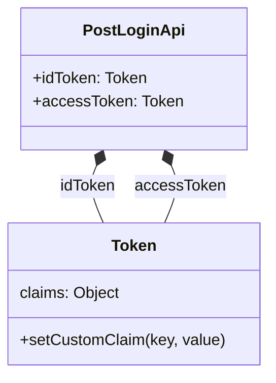

# Diagram: sso/tests/auth0/fake-implementation/auth0.js

> Auto-generated by Obscura crawlers

## Mermaid

### SVG

<svg id="container" width="267.5234375" xmlns="http://www.w3.org/2000/svg" class="classDiagram" height="378" viewBox="0 0 267.5234375 378" role="graphics-document document" aria-roledescription="class"><g><defs><marker id="container_class-aggregationStart" class="marker aggregation class" refX="18" refY="7" markerWidth="190" markerHeight="240" orient="auto"><path d="M 18,7 L9,13 L1,7 L9,1 Z"></path></marker></defs><defs><marker id="container_class-aggregationEnd" class="marker aggregation class" refX="1" refY="7" markerWidth="20" markerHeight="28" orient="auto"><path d="M 18,7 L9,13 L1,7 L9,1 Z"></path></marker></defs><defs><marker id="container_class-extensionStart" class="marker extension class" refX="18" refY="7" markerWidth="190" markerHeight="240" orient="auto"><path d="M 1,7 L18,13 V 1 Z"></path></marker></defs><defs><marker id="container_class-extensionEnd" class="marker extension class" refX="1" refY="7" markerWidth="20" markerHeight="28" orient="auto"><path d="M 1,1 V 13 L18,7 Z"></path></marker></defs><defs><marker id="container_class-compositionStart" class="marker composition class" refX="18" refY="7" markerWidth="190" markerHeight="240" orient="auto"><path d="M 18,7 L9,13 L1,7 L9,1 Z"></path></marker></defs><defs><marker id="container_class-compositionEnd" class="marker composition class" refX="1" refY="7" markerWidth="20" markerHeight="28" orient="auto"><path d="M 18,7 L9,13 L1,7 L9,1 Z"></path></marker></defs><defs><marker id="container_class-dependencyStart" class="marker dependency class" refX="6" refY="7" markerWidth="190" markerHeight="240" orient="auto"><path d="M 5,7 L9,13 L1,7 L9,1 Z"></path></marker></defs><defs><marker id="container_class-dependencyEnd" class="marker dependency class" refX="13" refY="7" markerWidth="20" markerHeight="28" orient="auto"><path d="M 18,7 L9,13 L14,7 L9,1 Z"></path></marker></defs><defs><marker id="container_class-lollipopStart" class="marker lollipop class" refX="13" refY="7" markerWidth="190" markerHeight="240" orient="auto"><circle stroke="black" fill="transparent" cx="7" cy="7" r="6"></circle></marker></defs><defs><marker id="container_class-lollipopEnd" class="marker lollipop class" refX="1" refY="7" markerWidth="190" markerHeight="240" orient="auto"><circle stroke="black" fill="transparent" cx="7" cy="7" r="6"></circle></marker></defs><g class="root"><g class="clusters"></g><g class="edgePaths"><path d="M96.137,167.857L94.627,171.381C93.118,174.905,90.1,181.952,91.232,191.643C92.364,201.333,97.646,213.667,100.287,219.833L102.927,226" id="id_PostLoginApi_Token_1" class="edge-thickness-normal edge-pattern-solid relation" style=";;;" data-edge="true" data-et="edge" data-id="id_PostLoginApi_Token_1" data-points="W3sieCI6MTAyLjkyNzQyOTc1OTE3NDMyLCJ5IjoxNTJ9LHsieCI6ODcuMDgyMDMxMjUsInkiOjE4OX0seyJ4IjoxMDIuOTI3NDI5NzU5MTc0MzIsInkiOjIyNn1d" marker-start="url(#container_class-compositionStart)"></path><path d="M171.387,167.857L172.896,171.381C174.405,174.905,177.423,181.952,176.291,191.643C175.16,201.333,169.878,213.667,167.237,219.833L164.596,226" id="id_PostLoginApi_Token_2" class="edge-thickness-normal edge-pattern-solid relation" style=";;;" data-edge="true" data-et="edge" data-id="id_PostLoginApi_Token_2" data-points="W3sieCI6MTY0LjU5NjAwNzc0MDgyNTY4LCJ5IjoxNTJ9LHsieCI6MTgwLjQ0MTQwNjI1LCJ5IjoxODl9LHsieCI6MTY0LjU5NjAwNzc0MDgyNTY4LCJ5IjoyMjZ9XQ==" marker-start="url(#container_class-compositionStart)"></path></g><g class="edgeLabels"><g class="edgeLabel" transform="translate(87.08203125, 189)"><g class="label" data-id="id_PostLoginApi_Token_1" transform="translate(-28.484375, -12)"><foreignObject width="56.96875" height="24">

idToken

</foreignObject></g></g><g class="edgeLabel" transform="translate(180.44140625, 189)"><g class="label" data-id="id_PostLoginApi_Token_2" transform="translate(-44.875, -12)"><foreignObject width="89.75" height="24">

accessToken

</foreignObject></g></g></g><g class="nodes"><g class="node default" id="classId-Token-0" transform="translate(133.76171875, 298)"><g class="basic label-container"><path d="M-125.76171875 -72 L125.76171875 -72 L125.76171875 72 L-125.76171875 72" stroke="none" stroke-width="0" fill="#ECECFF" style=""></path><path d="M-125.76171875 -72 C-50.71540761048385 -72, 24.330903529032298 -72, 125.76171875 -72 M-125.76171875 -72 C-53.24061212321203 -72, 19.280494503575937 -72, 125.76171875 -72 M125.76171875 -72 C125.76171875 -33.22331729768822, 125.76171875 5.5533654046235625, 125.76171875 72 M125.76171875 -72 C125.76171875 -29.55339828369671, 125.76171875 12.893203432606583, 125.76171875 72 M125.76171875 72 C43.94141245271321 72, -37.87889384457358 72, -125.76171875 72 M125.76171875 72 C39.39056490799774 72, -46.980588934004516 72, -125.76171875 72 M-125.76171875 72 C-125.76171875 18.856501364826954, -125.76171875 -34.28699727034609, -125.76171875 -72 M-125.76171875 72 C-125.76171875 34.6572036888755, -125.76171875 -2.685592622249004, -125.76171875 -72" stroke="#9370DB" stroke-width="1.3" fill="none" stroke-dasharray="0 0" style=""></path></g><g class="annotation-group text" transform="translate(0, -48)"></g><g class="label-group text" transform="translate(-21.8984375, -48)"><g class="label" style="font-weight: bolder" transform="translate(0,-12)"><foreignObject width="43.796875" height="24">

Token

</foreignObject></g></g><g class="members-group text" transform="translate(-113.76171875, 0)"><g class="label" style="" transform="translate(0,-12)"><foreignObject width="101.9375" height="24">

claims: Object

</foreignObject></g></g><g class="methods-group text" transform="translate(-113.76171875, 48)"><g class="label" style="" transform="translate(0,-12)"><foreignObject width="205.625" height="24">

+setCustomClaim(key, value)

</foreignObject></g></g><g class="divider" style=""><path d="M-125.76171875 -24 C-56.01299230225693 -24, 13.735734145486134 -24, 125.76171875 -24 M-125.76171875 -24 C-42.44294899788021 -24, 40.875820754239584 -24, 125.76171875 -24" stroke="#9370DB" stroke-width="1.3" fill="none" stroke-dasharray="0 0" style=""></path></g><g class="divider" style=""><path d="M-125.76171875 24 C-49.79573557090865 24, 26.170247608182706 24, 125.76171875 24 M-125.76171875 24 C-52.061680697103796 24, 21.638357355792408 24, 125.76171875 24" stroke="#9370DB" stroke-width="1.3" fill="none" stroke-dasharray="0 0" style=""></path></g></g><g class="node default" id="classId-PostLoginApi-1" transform="translate(133.76171875, 80)"><g class="basic label-container"><path d="M-110.125 -72 L110.125 -72 L110.125 72 L-110.125 72" stroke="none" stroke-width="0" fill="#ECECFF" style=""></path><path d="M-110.125 -72 C-40.888155192707416 -72, 28.34868961458517 -72, 110.125 -72 M-110.125 -72 C-44.03691902707173 -72, 22.051161945856535 -72, 110.125 -72 M110.125 -72 C110.125 -33.81418986005043, 110.125 4.371620279899133, 110.125 72 M110.125 -72 C110.125 -24.229383088481875, 110.125 23.54123382303625, 110.125 72 M110.125 72 C57.28213417962502 72, 4.439268359250036 72, -110.125 72 M110.125 72 C62.10516892709494 72, 14.085337854189873 72, -110.125 72 M-110.125 72 C-110.125 41.96181310820093, -110.125 11.923626216401857, -110.125 -72 M-110.125 72 C-110.125 37.96585540142155, -110.125 3.9317108028430994, -110.125 -72" stroke="#9370DB" stroke-width="1.3" fill="none" stroke-dasharray="0 0" style=""></path></g><g class="annotation-group text" transform="translate(0, -48)"></g><g class="label-group text" transform="translate(-47.796875, -48)"><g class="label" style="font-weight: bolder" transform="translate(0,-12)"><foreignObject width="95.59375" height="24">

PostLoginApi

</foreignObject></g></g><g class="members-group text" transform="translate(-98.125, 0)"><g class="label" style="" transform="translate(0,-12)"><foreignObject width="115.90625" height="24">

+idToken: Token

</foreignObject></g><g class="label" style="" transform="translate(0,12)"><foreignObject width="148.453125" height="24">

+accessToken: Token

</foreignObject></g></g><g class="methods-group text" transform="translate(-98.125, 72)"></g><g class="divider" style=""><path d="M-110.125 -24 C-38.65883272109846 -24, 32.807334557803074 -24, 110.125 -24 M-110.125 -24 C-55.767617372443375 -24, -1.4102347448867505 -24, 110.125 -24" stroke="#9370DB" stroke-width="1.3" fill="none" stroke-dasharray="0 0" style=""></path></g><g class="divider" style=""><path d="M-110.125 48 C-22.803193449645917 48, 64.51861310070817 48, 110.125 48 M-110.125 48 C-55.53014327180572 48, -0.9352865436114399 48, 110.125 48" stroke="#9370DB" stroke-width="1.3" fill="none" stroke-dasharray="0 0" style=""></path></g></g></g></g></g></svg>
