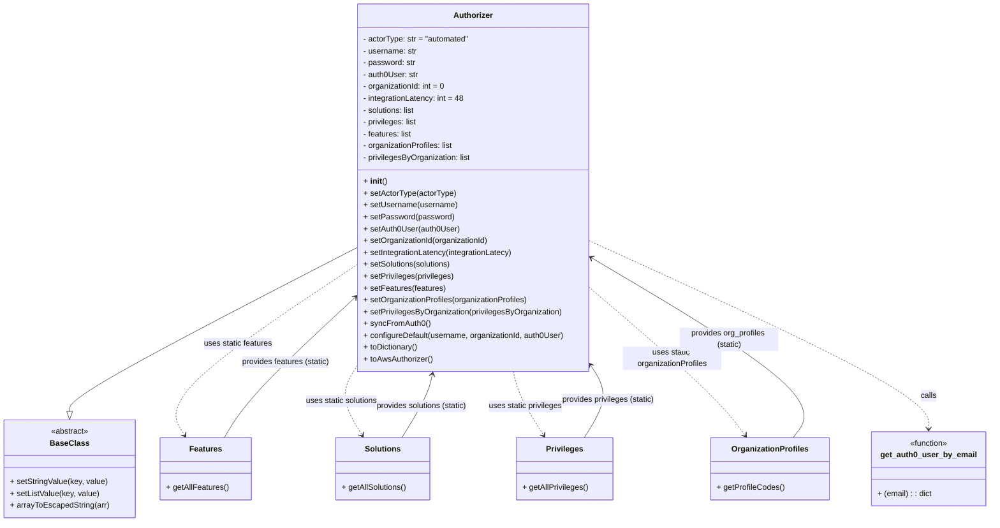

# Diagram: tools/ide_local_testing/localTest/core/Authorizer.py

> Auto-generated by Obscura crawlers

## Mermaid

### SVG

<svg id="container" width="2022.244140625" xmlns="http://www.w3.org/2000/svg" class="classDiagram" height="1056" viewBox="0 0 2022.244140625 1056" role="graphics-document document" aria-roledescription="class"><g><defs><marker id="container_class-aggregationStart" class="marker aggregation class" refX="18" refY="7" markerWidth="190" markerHeight="240" orient="auto"><path d="M 18,7 L9,13 L1,7 L9,1 Z"></path></marker></defs><defs><marker id="container_class-aggregationEnd" class="marker aggregation class" refX="1" refY="7" markerWidth="20" markerHeight="28" orient="auto"><path d="M 18,7 L9,13 L1,7 L9,1 Z"></path></marker></defs><defs><marker id="container_class-extensionStart" class="marker extension class" refX="18" refY="7" markerWidth="190" markerHeight="240" orient="auto"><path d="M 1,7 L18,13 V 1 Z"></path></marker></defs><defs><marker id="container_class-extensionEnd" class="marker extension class" refX="1" refY="7" markerWidth="20" markerHeight="28" orient="auto"><path d="M 1,1 V 13 L18,7 Z"></path></marker></defs><defs><marker id="container_class-compositionStart" class="marker composition class" refX="18" refY="7" markerWidth="190" markerHeight="240" orient="auto"><path d="M 18,7 L9,13 L1,7 L9,1 Z"></path></marker></defs><defs><marker id="container_class-compositionEnd" class="marker composition class" refX="1" refY="7" markerWidth="20" markerHeight="28" orient="auto"><path d="M 18,7 L9,13 L1,7 L9,1 Z"></path></marker></defs><defs><marker id="container_class-dependencyStart" class="marker dependency class" refX="6" refY="7" markerWidth="190" markerHeight="240" orient="auto"><path d="M 5,7 L9,13 L1,7 L9,1 Z"></path></marker></defs><defs><marker id="container_class-dependencyEnd" class="marker dependency class" refX="13" refY="7" markerWidth="20" markerHeight="28" orient="auto"><path d="M 18,7 L9,13 L14,7 L9,1 Z"></path></marker></defs><defs><marker id="container_class-lollipopStart" class="marker lollipop class" refX="13" refY="7" markerWidth="190" markerHeight="240" orient="auto"><circle stroke="black" fill="transparent" cx="7" cy="7" r="6"></circle></marker></defs><defs><marker id="container_class-lollipopEnd" class="marker lollipop class" refX="1" refY="7" markerWidth="190" markerHeight="240" orient="auto"><circle stroke="black" fill="transparent" cx="7" cy="7" r="6"></circle></marker></defs><g class="root"><g class="clusters"></g><g class="edgePaths"><path d="M733.176,499.806L634.201,550.005C535.227,600.204,337.277,700.602,238.303,756.093C139.328,811.583,139.328,822.167,139.328,827.458L139.328,832.75" id="id_Authorizer_BaseClass_1" class="edge-thickness-normal edge-pattern-solid relation" style=";;;" data-edge="true" data-et="edge" data-id="id_Authorizer_BaseClass_1" data-points="W3sieCI6NzMzLjE3NTc4MTI1LCJ5Ijo0OTkuODA1OTc3NTI0MjgyOH0seyJ4IjoxMzkuMzI4MTI1LCJ5Ijo4MDF9LHsieCI6MTM5LjMyODEyNSwieSI6ODUwfV0=" marker-end="url(#container_class-extensionEnd)"></path><path d="M733.176,533.205L664.361,577.838C595.546,622.47,457.915,711.735,397.252,769.681C336.588,827.628,352.891,854.255,361.042,867.569L369.194,880.883" id="id_Authorizer_Features_2" class="edge-thickness-normal edge-pattern-dashed relation" style=";;;" data-edge="true" data-et="edge" data-id="id_Authorizer_Features_2" data-points="W3sieCI6NzMzLjE3NTc4MTI1LCJ5Ijo1MzMuMjA1Mzc4Nzk2NTQwOX0seyJ4IjozMjAuMjg1MTU2MjUsInkiOjgwMX0seyJ4IjozNzIuMzI2NTY3Nzc4NzE2MiwieSI6ODg2fV0=" marker-end="url(#container_class-dependencyEnd)"></path><path d="M733.176,730.747L725.29,742.456C717.405,754.165,701.634,777.582,702.235,802.614C702.836,827.646,719.809,854.293,728.295,867.616L736.781,880.939" id="id_Authorizer_Solutions_3" class="edge-thickness-normal edge-pattern-dashed relation" style=";;;" data-edge="true" data-et="edge" data-id="id_Authorizer_Solutions_3" data-points="W3sieCI6NzMzLjE3NTc4MTI1LCJ5Ijo3MzAuNzQ3Mjk2MTk4ODM0NH0seyJ4Ijo2ODUuODYzMjgxMjUsInkiOjgwMX0seyJ4Ijo3NDAuMDA0NTY2MDg5NTI3LCJ5Ijo4ODZ9XQ==" marker-end="url(#container_class-dependencyEnd)"></path><path d="M1053.323,752L1055.166,760.167C1057.008,768.333,1060.694,784.667,1071.154,806.16C1081.615,827.654,1098.851,854.308,1107.47,867.635L1116.088,880.962" id="id_Authorizer_Privileges_4" class="edge-thickness-normal edge-pattern-dashed relation" style=";;;" data-edge="true" data-et="edge" data-id="id_Authorizer_Privileges_4" data-points="W3sieCI6MTA1My4zMjMyNjMwNjQxMzMsInkiOjc1Mn0seyJ4IjoxMDY0LjM3ODkwNjI1LCJ5Ijo4MDF9LHsieCI6MTExOS4zNDU3ODIzMDU3NDMzLCJ5Ijo4ODZ9XQ==" marker-end="url(#container_class-dependencyEnd)"></path><path d="M1205.605,578.056L1249.922,615.213C1294.238,652.371,1382.871,726.685,1437.12,777.207C1491.369,827.728,1511.235,854.456,1521.168,867.82L1531.1,881.184" id="id_Authorizer_OrganizationProfiles_5" class="edge-thickness-normal edge-pattern-dashed relation" style=";;;" data-edge="true" data-et="edge" data-id="id_Authorizer_OrganizationProfiles_5" data-points="W3sieCI6MTIwNS42MDU0Njg3NSwieSI6NTc4LjA1NTgwMzIwNjc1ODl9LHsieCI6MTQ3MS41MDM5MDYyNSwieSI6ODAxfSx7IngiOjE1MzQuNjc5NTgxOTI1Njc1NiwieSI6ODg2fV0=" marker-end="url(#container_class-dependencyEnd)"></path><path d="M1205.605,486.838L1321.372,539.198C1437.139,591.559,1668.672,696.279,1784.438,759.806C1900.205,823.333,1900.205,845.667,1900.205,856.833L1900.205,868" id="id_Authorizer_get_auth0_user_by_email_6" class="edge-thickness-normal edge-pattern-dashed relation" style=";;;" data-edge="true" data-et="edge" data-id="id_Authorizer_get_auth0_user_by_email_6" data-points="W3sieCI6MTIwNS42MDU0Njg3NSwieSI6NDg2LjgzODEwMTcxMjgzOTd9LHsieCI6MTkwMC4yMDUwNzgxMjUsInkiOjgwMX0seyJ4IjoxOTAwLjIwNTA3ODEyNSwieSI6ODc0fV0=" marker-end="url(#container_class-dependencyEnd)"></path><path d="M820.261,886L829.285,871.833C838.308,857.667,856.355,829.333,867.001,807.975C877.647,786.618,880.892,772.235,882.515,765.044L884.137,757.853" id="id_Solutions_Authorizer_7" class="edge-thickness-normal edge-pattern-solid relation" style=";;;" data-edge="true" data-et="edge" data-id="id_Solutions_Authorizer_7" data-points="W3sieCI6ODIwLjI2MTA1ODkxMDQ3MywieSI6ODg2fSx7IngiOjg3NC40MDIzNDM3NSwieSI6ODAxfSx7IngiOjg4NS40NTc5ODY5MzU4NjcsInkiOjc1Mn1d" marker-end="url(#container_class-dependencyEnd)"></path><path d="M1200.826,886L1209.987,871.833C1219.148,857.667,1237.471,829.333,1238.83,803.698C1240.189,778.062,1224.585,755.125,1216.782,743.656L1208.98,732.187" id="id_Privileges_Authorizer_8" class="edge-thickness-normal edge-pattern-solid relation" style=";;;" data-edge="true" data-et="edge" data-id="id_Privileges_Authorizer_8" data-points="W3sieCI6MTIwMC44MjYwOTI2OTQyNTY3LCJ5Ijo4ODZ9LHsieCI6MTI1NS43OTI5Njg3NSwieSI6ODAxfSx7IngiOjEyMDUuNjA1NDY4NzUsInkiOjcyNy4yMjYzODA2MTA3NTU4fV0=" marker-end="url(#container_class-dependencyEnd)"></path><path d="M449.357,886L458.005,871.833C466.654,857.667,483.95,829.333,530.509,781.073C577.069,732.813,652.892,664.626,690.803,630.532L728.714,596.439" id="id_Features_Authorizer_9" class="edge-thickness-normal edge-pattern-solid relation" style=";;;" data-edge="true" data-et="edge" data-id="id_Features_Authorizer_9" data-points="W3sieCI6NDQ5LjM1NzIzNzExOTkzMjQ1LCJ5Ijo4ODZ9LHsieCI6NTAxLjI0NjA5Mzc1LCJ5Ijo4MDF9LHsieCI6NzMzLjE3NTc4MTI1LCJ5Ijo1OTIuNDI2ODA5NjI5MTA0Mn1d" marker-end="url(#container_class-dependencyEnd)"></path><path d="M1628.328,886L1638.858,871.833C1649.387,857.667,1670.445,829.333,1600.855,768.456C1531.266,707.579,1371.027,614.159,1290.908,567.448L1210.789,520.738" id="id_OrganizationProfiles_Authorizer_10" class="edge-thickness-normal edge-pattern-solid relation" style=";;;" data-edge="true" data-et="edge" data-id="id_OrganizationProfiles_Authorizer_10" data-points="W3sieCI6MTYyOC4zMjgyMzA1NzQzMjQ0LCJ5Ijo4ODZ9LHsieCI6MTY5MS41MDM5MDYyNSwieSI6ODAxfSx7IngiOjEyMDUuNjA1NDY4NzUsInkiOjUxNy43MTU4NTY3Nzg4NzcxfV0=" marker-end="url(#container_class-dependencyEnd)"></path></g><g class="edgeLabels"><g class="edgeLabel"><g class="label" data-id="id_Authorizer_BaseClass_1" transform="translate(0, 0)"><foreignObject width="0" height="0">

</foreignObject></g></g><g class="edgeLabel" transform="translate(484.9213, 694.21948)"><g class="label" data-id="id_Authorizer_Features_2" transform="translate(-70.34375, -12)"><foreignObject width="140.6875" height="24">

uses static features

</foreignObject></g></g><g class="edgeLabel" transform="translate(690.18246, 807.78096)"><g class="label" data-id="id_Authorizer_Solutions_3" transform="translate(-74.265625, -12)"><foreignObject width="148.53125" height="24">

uses static solutions

</foreignObject></g></g><g class="edgeLabel" transform="translate(1078.22391, 822.40972)"><g class="label" data-id="id_Authorizer_Privileges_4" transform="translate(-75.703125, -12)"><foreignObject width="151.40625" height="24">

uses static privileges

</foreignObject></g></g><g class="edgeLabel" transform="translate(1379.13205, 723.55024)"><g class="label" data-id="id_Authorizer_OrganizationProfiles_5" transform="translate(-100, -24)"><foreignObject width="200" height="48">

uses static organizationProfiles

</foreignObject></g></g><g class="edgeLabel" transform="translate(1900.205078125, 801)"><g class="label" data-id="id_Authorizer_get_auth0_user_by_email_6" transform="translate(-16.4453125, -12)"><foreignObject width="32.890625" height="24">

calls

</foreignObject></g></g><g class="edgeLabel" transform="translate(860.82473, 822.3164)"><g class="label" data-id="id_Solutions_Authorizer_7" transform="translate(-94.2734375, -12)"><foreignObject width="188.546875" height="24">

provides solutions (static)

</foreignObject></g></g><g class="edgeLabel" transform="translate(1252.53539, 806.03747)"><g class="label" data-id="id_Privileges_Authorizer_8" transform="translate(-95.7109375, -12)"><foreignObject width="191.421875" height="24">

provides privileges (static)

</foreignObject></g></g><g class="edgeLabel" transform="translate(580.18696, 730.00888)"><g class="label" data-id="id_Features_Authorizer_9" transform="translate(-90.3515625, -12)"><foreignObject width="180.703125" height="24">

provides features (static)

</foreignObject></g></g><g class="edgeLabel" transform="translate(1494.30096, 686.02851)"><g class="label" data-id="id_OrganizationProfiles_Authorizer_10" transform="translate(-100, -24)"><foreignObject width="200" height="48">

provides org_profiles (static)

</foreignObject></g></g></g><g class="nodes"><g class="node default" id="classId-Authorizer-0" transform="translate(969.390625, 380)"><g class="basic label-container"><path d="M-236.21484375 -372 L236.21484375 -372 L236.21484375 372 L-236.21484375 372" stroke="none" stroke-width="0" fill="#ECECFF" style=""></path><path d="M-236.21484375 -372 C-49.83474127771788 -372, 136.54536119456424 -372, 236.21484375 -372 M-236.21484375 -372 C-118.73574536490769 -372, -1.2566469798153719 -372, 236.21484375 -372 M236.21484375 -372 C236.21484375 -78.75477344018054, 236.21484375 214.49045311963891, 236.21484375 372 M236.21484375 -372 C236.21484375 -200.0318439818025, 236.21484375 -28.06368796360499, 236.21484375 372 M236.21484375 372 C102.54871678621194 372, -31.11741017757612 372, -236.21484375 372 M236.21484375 372 C68.1198383105322 372, -99.9751671289356 372, -236.21484375 372 M-236.21484375 372 C-236.21484375 84.2077475370454, -236.21484375 -203.5845049259092, -236.21484375 -372 M-236.21484375 372 C-236.21484375 102.17626581767615, -236.21484375 -167.6474683646477, -236.21484375 -372" stroke="#9370DB" stroke-width="1.3" fill="none" stroke-dasharray="0 0" style=""></path></g><g class="annotation-group text" transform="translate(0, -348)"></g><g class="label-group text" transform="translate(-38.3671875, -348)"><g class="label" style="font-weight: bolder" transform="translate(0,-12)"><foreignObject width="76.734375" height="24">

Authorizer

</foreignObject></g></g><g class="members-group text" transform="translate(-224.21484375, -300)"><g class="label" style="" transform="translate(0,-12)"><foreignObject width="217.484375" height="24">

- actorType: str = "automated"

</foreignObject></g><g class="label" style="" transform="translate(0,12)"><foreignObject width="110.390625" height="24">

- username: str

</foreignObject></g><g class="label" style="" transform="translate(0,36)"><foreignObject width="106.84375" height="24">

- password: str

</foreignObject></g><g class="label" style="" transform="translate(0,60)"><foreignObject width="113.34375" height="24">

- auth0User: str

</foreignObject></g><g class="label" style="" transform="translate(0,84)"><foreignObject width="168.484375" height="24">

- organizationId: int = 0

</foreignObject></g><g class="label" style="" transform="translate(0,108)"><foreignObject width="207.765625" height="24">

- integrationLatency: int = 48

</foreignObject></g><g class="label" style="" transform="translate(0,132)"><foreignObject width="108.515625" height="24">

- solutions: list

</foreignObject></g><g class="label" style="" transform="translate(0,156)"><foreignObject width="111.390625" height="24">

- privileges: list

</foreignObject></g><g class="label" style="" transform="translate(0,180)"><foreignObject width="100.65625" height="24">

- features: list

</foreignObject></g><g class="label" style="" transform="translate(0,204)"><foreignObject width="185.59375" height="24">

- organizationProfiles: list

</foreignObject></g><g class="label" style="" transform="translate(0,228)"><foreignObject width="221.0625" height="24">

- privilegesByOrganization: list

</foreignObject></g></g><g class="methods-group text" transform="translate(-224.21484375, -12)"><g class="label" style="" transform="translate(0,-12)"><foreignObject width="47.046875" height="24">

+ <strong>init</strong>()

</foreignObject></g><g class="label" style="" transform="translate(0,12)"><foreignObject width="187.296875" height="24">

+ setActorType(actorType)

</foreignObject></g><g class="label" style="" transform="translate(0,36)"><foreignObject width="190.15625" height="24">

+ setUsername(username)

</foreignObject></g><g class="label" style="" transform="translate(0,60)"><foreignObject width="180.921875" height="24">

+ setPassword(password)

</foreignObject></g><g class="label" style="" transform="translate(0,84)"><foreignObject width="194.984375" height="24">

+ setAuth0User(auth0User)

</foreignObject></g><g class="label" style="" transform="translate(0,108)"><foreignObject width="255.578125" height="24">

+ setOrganizationId(organizationId)

</foreignObject></g><g class="label" style="" transform="translate(0,132)"><foreignObject width="306.3125" height="24">

+ setIntegrationLatency(integrationLatecy)

</foreignObject></g><g class="label" style="" transform="translate(0,156)"><foreignObject width="180.40625" height="24">

+ setSolutions(solutions)

</foreignObject></g><g class="label" style="" transform="translate(0,180)"><foreignObject width="184.359375" height="24">

+ setPrivileges(privileges)

</foreignObject></g><g class="label" style="" transform="translate(0,204)"><foreignObject width="165.546875" height="24">

+ setFeatures(features)

</foreignObject></g><g class="label" style="" transform="translate(0,228)"><foreignObject width="335.03125" height="24">

+ setOrganizationProfiles(organizationProfiles)

</foreignObject></g><g class="label" style="" transform="translate(0,252)"><foreignObject width="403.71875" height="24">

+ setPrivilegesByOrganization(privilegesByOrganization)

</foreignObject></g><g class="label" style="" transform="translate(0,276)"><foreignObject width="133.296875" height="24">

+ syncFromAuth0()

</foreignObject></g><g class="label" style="" transform="translate(0,300)"><foreignObject width="410.0625" height="24">

+ configureDefault(username, organizationId, auth0User)

</foreignObject></g><g class="label" style="" transform="translate(0,324)"><foreignObject width="111.703125" height="24">

+ toDictionary()

</foreignObject></g><g class="label" style="" transform="translate(0,348)"><foreignObject width="141.03125" height="24">

+ toAwsAuthorizer()

</foreignObject></g></g><g class="divider" style=""><path d="M-236.21484375 -324 C-65.21297389659318 -324, 105.78889595681363 -324, 236.21484375 -324 M-236.21484375 -324 C-97.51157737571194 -324, 41.191688998576126 -324, 236.21484375 -324" stroke="#9370DB" stroke-width="1.3" fill="none" stroke-dasharray="0 0" style=""></path></g><g class="divider" style=""><path d="M-236.21484375 -36 C-134.1860635822356 -36, -32.15728341447118 -36, 236.21484375 -36 M-236.21484375 -36 C-77.26540677471058 -36, 81.68403020057883 -36, 236.21484375 -36" stroke="#9370DB" stroke-width="1.3" fill="none" stroke-dasharray="0 0" style=""></path></g></g><g class="node default" id="classId-BaseClass-1" transform="translate(139.328125, 949)"><g class="basic label-container"><path d="M-131.328125 -99 L131.328125 -99 L131.328125 99 L-131.328125 99" stroke="none" stroke-width="0" fill="#ECECFF" style=""></path><path d="M-131.328125 -99 C-31.37945147931414 -99, 68.56922204137172 -99, 131.328125 -99 M-131.328125 -99 C-45.08695049086563 -99, 41.154224018268735 -99, 131.328125 -99 M131.328125 -99 C131.328125 -56.70756218317744, 131.328125 -14.415124366354874, 131.328125 99 M131.328125 -99 C131.328125 -55.59635218441054, 131.328125 -12.192704368821083, 131.328125 99 M131.328125 99 C71.99654673374462 99, 12.664968467489246 99, -131.328125 99 M131.328125 99 C54.12829355011924 99, -23.071537899761523 99, -131.328125 99 M-131.328125 99 C-131.328125 35.74391812619933, -131.328125 -27.512163747601335, -131.328125 -99 M-131.328125 99 C-131.328125 29.250695596931124, -131.328125 -40.49860880613775, -131.328125 -99" stroke="#9370DB" stroke-width="1.3" fill="none" stroke-dasharray="0 0" style=""></path></g><g class="annotation-group text" transform="translate(-38.609375, -75)"><g class="label" style="" transform="translate(0,-12)"><foreignObject width="77.21875" height="24">

«abstract»

</foreignObject></g></g><g class="label-group text" transform="translate(-36.359375, -51)"><g class="label" style="font-weight: bolder" transform="translate(0,-12)"><foreignObject width="72.71875" height="24">

BaseClass

</foreignObject></g></g><g class="members-group text" transform="translate(-119.328125, -3)"></g><g class="methods-group text" transform="translate(-119.328125, 27)"><g class="label" style="" transform="translate(0,-12)"><foreignObject width="197.859375" height="24">

+ setStringValue(key, value)

</foreignObject></g><g class="label" style="" transform="translate(0,12)"><foreignObject width="180.71875" height="24">

+ setListValue(key, value)

</foreignObject></g><g class="label" style="" transform="translate(0,36)"><foreignObject width="200.046875" height="24">

+ arrayToEscapedString(arr)

</foreignObject></g></g><g class="divider" style=""><path d="M-131.328125 -27 C-64.98674337982672 -27, 1.35463824034656 -27, 131.328125 -27 M-131.328125 -27 C-52.72601508120269 -27, 25.87609483759462 -27, 131.328125 -27" stroke="#9370DB" stroke-width="1.3" fill="none" stroke-dasharray="0 0" style=""></path></g><g class="divider" style=""><path d="M-131.328125 -3 C-75.40229342168965 -3, -19.476461843379283 -3, 131.328125 -3 M-131.328125 -3 C-56.10853694765993 -3, 19.111051104680143 -3, 131.328125 -3" stroke="#9370DB" stroke-width="1.3" fill="none" stroke-dasharray="0 0" style=""></path></g></g><g class="node default" id="classId-Features-2" transform="translate(410.8984375, 949)"><g class="basic label-container"><path d="M-90.2421875 -63 L90.2421875 -63 L90.2421875 63 L-90.2421875 63" stroke="none" stroke-width="0" fill="#ECECFF" style=""></path><path d="M-90.2421875 -63 C-24.73081442646412 -63, 40.78055864707176 -63, 90.2421875 -63 M-90.2421875 -63 C-37.65016247858751 -63, 14.941862542824978 -63, 90.2421875 -63 M90.2421875 -63 C90.2421875 -13.990855484191208, 90.2421875 35.018289031617584, 90.2421875 63 M90.2421875 -63 C90.2421875 -22.47533221598551, 90.2421875 18.04933556802898, 90.2421875 63 M90.2421875 63 C44.670004257387795 63, -0.9021789852244098 63, -90.2421875 63 M90.2421875 63 C27.681171555572973 63, -34.87984438885405 63, -90.2421875 63 M-90.2421875 63 C-90.2421875 33.450555211618074, -90.2421875 3.9011104232361475, -90.2421875 -63 M-90.2421875 63 C-90.2421875 33.00143923453736, -90.2421875 3.002878469074716, -90.2421875 -63" stroke="#9370DB" stroke-width="1.3" fill="none" stroke-dasharray="0 0" style=""></path></g><g class="annotation-group text" transform="translate(0, -39)"></g><g class="label-group text" transform="translate(-31.25, -39)"><g class="label" style="font-weight: bolder" transform="translate(0,-12)"><foreignObject width="62.5" height="24">

Features

</foreignObject></g></g><g class="members-group text" transform="translate(-78.2421875, 9)"></g><g class="methods-group text" transform="translate(-78.2421875, 39)"><g class="label" style="" transform="translate(0,-12)"><foreignObject width="125.234375" height="24">

+ getAllFeatures()

</foreignObject></g></g><g class="divider" style=""><path d="M-90.2421875 -15 C-46.93468847106561 -15, -3.6271894421312254 -15, 90.2421875 -15 M-90.2421875 -15 C-24.137120062194427 -15, 41.967947375611146 -15, 90.2421875 -15" stroke="#9370DB" stroke-width="1.3" fill="none" stroke-dasharray="0 0" style=""></path></g><g class="divider" style=""><path d="M-90.2421875 9 C-32.78121438482658 9, 24.679758730346833 9, 90.2421875 9 M-90.2421875 9 C-32.02608058686643 9, 26.190026326267144 9, 90.2421875 9" stroke="#9370DB" stroke-width="1.3" fill="none" stroke-dasharray="0 0" style=""></path></g></g><g class="node default" id="classId-Solutions-3" transform="translate(780.1328125, 949)"><g class="basic label-container"><path d="M-95.4765625 -63 L95.4765625 -63 L95.4765625 63 L-95.4765625 63" stroke="none" stroke-width="0" fill="#ECECFF" style=""></path><path d="M-95.4765625 -63 C-22.010109667473344 -63, 51.45634316505331 -63, 95.4765625 -63 M-95.4765625 -63 C-56.63119643889993 -63, -17.785830377799854 -63, 95.4765625 -63 M95.4765625 -63 C95.4765625 -28.345815902782768, 95.4765625 6.308368194434465, 95.4765625 63 M95.4765625 -63 C95.4765625 -30.612460043602447, 95.4765625 1.775079912795107, 95.4765625 63 M95.4765625 63 C56.80094561946758 63, 18.125328738935167 63, -95.4765625 63 M95.4765625 63 C30.19671818779169 63, -35.08312612441662 63, -95.4765625 63 M-95.4765625 63 C-95.4765625 30.098640935737464, -95.4765625 -2.802718128525072, -95.4765625 -63 M-95.4765625 63 C-95.4765625 32.87924318980561, -95.4765625 2.758486379611206, -95.4765625 -63" stroke="#9370DB" stroke-width="1.3" fill="none" stroke-dasharray="0 0" style=""></path></g><g class="annotation-group text" transform="translate(0, -39)"></g><g class="label-group text" transform="translate(-34.703125, -39)"><g class="label" style="font-weight: bolder" transform="translate(0,-12)"><foreignObject width="69.40625" height="24">

Solutions

</foreignObject></g></g><g class="members-group text" transform="translate(-83.4765625, 9)"></g><g class="methods-group text" transform="translate(-83.4765625, 39)"><g class="label" style="" transform="translate(0,-12)"><foreignObject width="132.25" height="24">

+ getAllSolutions()

</foreignObject></g></g><g class="divider" style=""><path d="M-95.4765625 -15 C-40.259214454682656 -15, 14.958133590634688 -15, 95.4765625 -15 M-95.4765625 -15 C-19.18988651534781 -15, 57.09678946930438 -15, 95.4765625 -15" stroke="#9370DB" stroke-width="1.3" fill="none" stroke-dasharray="0 0" style=""></path></g><g class="divider" style=""><path d="M-95.4765625 9 C-44.778517579331705 9, 5.91952734133659 9, 95.4765625 9 M-95.4765625 9 C-29.492970142030288 9, 36.490622215939425 9, 95.4765625 9" stroke="#9370DB" stroke-width="1.3" fill="none" stroke-dasharray="0 0" style=""></path></g></g><g class="node default" id="classId-Privileges-4" transform="translate(1160.0859375, 949)"><g class="basic label-container"><path d="M-96.5390625 -63 L96.5390625 -63 L96.5390625 63 L-96.5390625 63" stroke="none" stroke-width="0" fill="#ECECFF" style=""></path><path d="M-96.5390625 -63 C-22.424822588379186 -63, 51.68941732324163 -63, 96.5390625 -63 M-96.5390625 -63 C-38.84240602224836 -63, 18.854250455503276 -63, 96.5390625 -63 M96.5390625 -63 C96.5390625 -35.022470560128035, 96.5390625 -7.04494112025607, 96.5390625 63 M96.5390625 -63 C96.5390625 -13.274445013326527, 96.5390625 36.451109973346945, 96.5390625 63 M96.5390625 63 C23.532661814071574 63, -49.47373887185685 63, -96.5390625 63 M96.5390625 63 C40.314405384769664 63, -15.910251730460672 63, -96.5390625 63 M-96.5390625 63 C-96.5390625 21.308258659279808, -96.5390625 -20.383482681440384, -96.5390625 -63 M-96.5390625 63 C-96.5390625 32.17138880881927, -96.5390625 1.3427776176385464, -96.5390625 -63" stroke="#9370DB" stroke-width="1.3" fill="none" stroke-dasharray="0 0" style=""></path></g><g class="annotation-group text" transform="translate(0, -39)"></g><g class="label-group text" transform="translate(-35.734375, -39)"><g class="label" style="font-weight: bolder" transform="translate(0,-12)"><foreignObject width="71.46875" height="24">

Privileges

</foreignObject></g></g><g class="members-group text" transform="translate(-84.5390625, 9)"></g><g class="methods-group text" transform="translate(-84.5390625, 39)"><g class="label" style="" transform="translate(0,-12)"><foreignObject width="133.34375" height="24">

+ getAllPrivileges()

</foreignObject></g></g><g class="divider" style=""><path d="M-96.5390625 -15 C-48.67087414166127 -15, -0.8026857833225449 -15, 96.5390625 -15 M-96.5390625 -15 C-39.334623719165656 -15, 17.86981506166869 -15, 96.5390625 -15" stroke="#9370DB" stroke-width="1.3" fill="none" stroke-dasharray="0 0" style=""></path></g><g class="divider" style=""><path d="M-96.5390625 9 C-39.46664253076352 9, 17.605777438472956 9, 96.5390625 9 M-96.5390625 9 C-48.963919214395595 9, -1.3887759287911905 9, 96.5390625 9" stroke="#9370DB" stroke-width="1.3" fill="none" stroke-dasharray="0 0" style=""></path></g></g><g class="node default" id="classId-OrganizationProfiles-5" transform="translate(1581.50390625, 949)"><g class="basic label-container"><path d="M-116.91796875 -63 L116.91796875 -63 L116.91796875 63 L-116.91796875 63" stroke="none" stroke-width="0" fill="#ECECFF" style=""></path><path d="M-116.91796875 -63 C-35.631627939589336 -63, 45.65471287082133 -63, 116.91796875 -63 M-116.91796875 -63 C-60.44637126634928 -63, -3.9747737826985627 -63, 116.91796875 -63 M116.91796875 -63 C116.91796875 -16.159047039936375, 116.91796875 30.68190592012725, 116.91796875 63 M116.91796875 -63 C116.91796875 -29.74428990574583, 116.91796875 3.511420188508339, 116.91796875 63 M116.91796875 63 C59.62802980840158 63, 2.3380908668031566 63, -116.91796875 63 M116.91796875 63 C35.976616144415615 63, -44.96473646116877 63, -116.91796875 63 M-116.91796875 63 C-116.91796875 22.98291303419387, -116.91796875 -17.03417393161226, -116.91796875 -63 M-116.91796875 63 C-116.91796875 24.89438880129272, -116.91796875 -13.21122239741456, -116.91796875 -63" stroke="#9370DB" stroke-width="1.3" fill="none" stroke-dasharray="0 0" style=""></path></g><g class="annotation-group text" transform="translate(0, -39)"></g><g class="label-group text" transform="translate(-74.3828125, -39)"><g class="label" style="font-weight: bolder" transform="translate(0,-12)"><foreignObject width="148.765625" height="24">

OrganizationProfiles

</foreignObject></g></g><g class="members-group text" transform="translate(-104.91796875, 9)"></g><g class="methods-group text" transform="translate(-104.91796875, 39)"><g class="label" style="" transform="translate(0,-12)"><foreignObject width="135.453125" height="24">

+ getProfileCodes()

</foreignObject></g></g><g class="divider" style=""><path d="M-116.91796875 -15 C-41.65633847123469 -15, 33.60529180753062 -15, 116.91796875 -15 M-116.91796875 -15 C-29.751732224265794 -15, 57.41450430146841 -15, 116.91796875 -15" stroke="#9370DB" stroke-width="1.3" fill="none" stroke-dasharray="0 0" style=""></path></g><g class="divider" style=""><path d="M-116.91796875 9 C-45.806746812056645 9, 25.30447512588671 9, 116.91796875 9 M-116.91796875 9 C-23.770423251561226 9, 69.37712224687755 9, 116.91796875 9" stroke="#9370DB" stroke-width="1.3" fill="none" stroke-dasharray="0 0" style=""></path></g></g><g class="node default" id="classId-get_auth0_user_by_email-6" transform="translate(1900.205078125, 949)"><g class="basic label-container"><path d="M-114.0390625 -75 L114.0390625 -75 L114.0390625 75 L-114.0390625 75" stroke="none" stroke-width="0" fill="#ECECFF" style=""></path><path d="M-114.0390625 -75 C-60.346144854816494 -75, -6.653227209632988 -75, 114.0390625 -75 M-114.0390625 -75 C-53.50491887918489 -75, 7.029224741630216 -75, 114.0390625 -75 M114.0390625 -75 C114.0390625 -21.348047334005585, 114.0390625 32.30390533198883, 114.0390625 75 M114.0390625 -75 C114.0390625 -40.46351097419223, 114.0390625 -5.927021948384464, 114.0390625 75 M114.0390625 75 C33.31024768263035 75, -47.418567134739305 75, -114.0390625 75 M114.0390625 75 C60.40920760383506 75, 6.779352707670114 75, -114.0390625 75 M-114.0390625 75 C-114.0390625 37.08854154289695, -114.0390625 -0.8229169142061039, -114.0390625 -75 M-114.0390625 75 C-114.0390625 25.043116026038057, -114.0390625 -24.913767947923887, -114.0390625 -75" stroke="#9370DB" stroke-width="1.3" fill="none" stroke-dasharray="0 0" style=""></path></g><g class="annotation-group text" transform="translate(-39.484375, -51)"><g class="label" style="" transform="translate(0,-12)"><foreignObject width="78.96875" height="24">

«function»

</foreignObject></g></g><g class="label-group text" transform="translate(-93.234375, -27)"><g class="label" style="font-weight: bolder" transform="translate(0,-12)"><foreignObject width="186.46875" height="24">

get_auth0_user_by_email

</foreignObject></g></g><g class="members-group text" transform="translate(-102.0390625, 21)"></g><g class="methods-group text" transform="translate(-102.0390625, 51)"><g class="label" style="" transform="translate(0,-12)"><foreignObject width="110.84375" height="24">

+ (email) : : dict

</foreignObject></g></g><g class="divider" style=""><path d="M-114.0390625 -3 C-28.476503479171697 -3, 57.086055541656606 -3, 114.0390625 -3 M-114.0390625 -3 C-58.70389422087598 -3, -3.3687259417519613 -3, 114.0390625 -3" stroke="#9370DB" stroke-width="1.3" fill="none" stroke-dasharray="0 0" style=""></path></g><g class="divider" style=""><path d="M-114.0390625 21 C-33.71179612616979 21, 46.615470247660426 21, 114.0390625 21 M-114.0390625 21 C-55.133490492276785 21, 3.7720815154464304 21, 114.0390625 21" stroke="#9370DB" stroke-width="1.3" fill="none" stroke-dasharray="0 0" style=""></path></g></g></g></g></g></svg>
