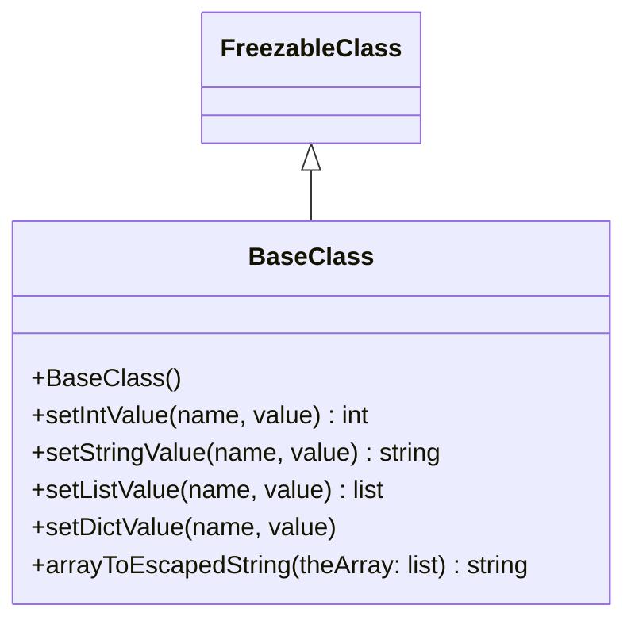

# Diagram: tools/ide_local_testing/localTest/core/BaseClass.py

> Auto-generated by Obscura crawlers

## Mermaid

### SVG

<svg id="container" width="396.578125" xmlns="http://www.w3.org/2000/svg" class="classDiagram" height="396" viewBox="0 0 396.578125 396" role="graphics-document document" aria-roledescription="class"><g><defs><marker id="container_class-aggregationStart" class="marker aggregation class" refX="18" refY="7" markerWidth="190" markerHeight="240" orient="auto"><path d="M 18,7 L9,13 L1,7 L9,1 Z"></path></marker></defs><defs><marker id="container_class-aggregationEnd" class="marker aggregation class" refX="1" refY="7" markerWidth="20" markerHeight="28" orient="auto"><path d="M 18,7 L9,13 L1,7 L9,1 Z"></path></marker></defs><defs><marker id="container_class-extensionStart" class="marker extension class" refX="18" refY="7" markerWidth="190" markerHeight="240" orient="auto"><path d="M 1,7 L18,13 V 1 Z"></path></marker></defs><defs><marker id="container_class-extensionEnd" class="marker extension class" refX="1" refY="7" markerWidth="20" markerHeight="28" orient="auto"><path d="M 1,1 V 13 L18,7 Z"></path></marker></defs><defs><marker id="container_class-compositionStart" class="marker composition class" refX="18" refY="7" markerWidth="190" markerHeight="240" orient="auto"><path d="M 18,7 L9,13 L1,7 L9,1 Z"></path></marker></defs><defs><marker id="container_class-compositionEnd" class="marker composition class" refX="1" refY="7" markerWidth="20" markerHeight="28" orient="auto"><path d="M 18,7 L9,13 L1,7 L9,1 Z"></path></marker></defs><defs><marker id="container_class-dependencyStart" class="marker dependency class" refX="6" refY="7" markerWidth="190" markerHeight="240" orient="auto"><path d="M 5,7 L9,13 L1,7 L9,1 Z"></path></marker></defs><defs><marker id="container_class-dependencyEnd" class="marker dependency class" refX="13" refY="7" markerWidth="20" markerHeight="28" orient="auto"><path d="M 18,7 L9,13 L14,7 L9,1 Z"></path></marker></defs><defs><marker id="container_class-lollipopStart" class="marker lollipop class" refX="13" refY="7" markerWidth="190" markerHeight="240" orient="auto"><circle stroke="black" fill="transparent" cx="7" cy="7" r="6"></circle></marker></defs><defs><marker id="container_class-lollipopEnd" class="marker lollipop class" refX="1" refY="7" markerWidth="190" markerHeight="240" orient="auto"><circle stroke="black" fill="transparent" cx="7" cy="7" r="6"></circle></marker></defs><g class="root"><g class="clusters"></g><g class="edgePaths"><path d="M198.289,109.25L198.289,110.542C198.289,111.833,198.289,114.417,198.289,119.875C198.289,125.333,198.289,133.667,198.289,137.833L198.289,142" id="id_FreezableClass_BaseClass_1" class="edge-thickness-normal edge-pattern-solid relation" style=";;;" data-edge="true" data-et="edge" data-id="id_FreezableClass_BaseClass_1" data-points="W3sieCI6MTk4LjI4OTA2MjUsInkiOjkyfSx7IngiOjE5OC4yODkwNjI1LCJ5IjoxMTd9LHsieCI6MTk4LjI4OTA2MjUsInkiOjE0Mn1d" marker-start="url(#container_class-extensionStart)"></path></g><g class="edgeLabels"><g class="edgeLabel"><g class="label" data-id="id_FreezableClass_BaseClass_1" transform="translate(0, 0)"><foreignObject width="0" height="0">

</foreignObject></g></g></g><g class="nodes"><g class="node default" id="classId-FreezableClass-0" transform="translate(198.2890625, 50)"><g class="basic label-container"><path d="M-65.640625 -42 L65.640625 -42 L65.640625 42 L-65.640625 42" stroke="none" stroke-width="0" fill="#ECECFF" style=""></path><path d="M-65.640625 -42 C-14.301916435172842 -42, 37.036792129654316 -42, 65.640625 -42 M-65.640625 -42 C-14.982951448740266 -42, 35.67472210251947 -42, 65.640625 -42 M65.640625 -42 C65.640625 -11.5628746849501, 65.640625 18.8742506300998, 65.640625 42 M65.640625 -42 C65.640625 -21.96866698661856, 65.640625 -1.9373339732371235, 65.640625 42 M65.640625 42 C21.571768131627863 42, -22.497088736744274 42, -65.640625 42 M65.640625 42 C20.784506834567104 42, -24.071611330865792 42, -65.640625 42 M-65.640625 42 C-65.640625 22.809342261808023, -65.640625 3.6186845236160465, -65.640625 -42 M-65.640625 42 C-65.640625 9.547284034589175, -65.640625 -22.90543193082165, -65.640625 -42" stroke="#9370DB" stroke-width="1.3" fill="none" stroke-dasharray="0 0" style=""></path></g><g class="annotation-group text" transform="translate(0, -18)"></g><g class="label-group text" transform="translate(-53.640625, -18)"><g class="label" style="font-weight: bolder" transform="translate(0,-12)"><foreignObject width="107.28125" height="24">

FreezableClass

</foreignObject></g></g><g class="members-group text" transform="translate(-53.640625, 30)"></g><g class="methods-group text" transform="translate(-53.640625, 60)"></g><g class="divider" style=""><path d="M-65.640625 6 C-16.04254994364495 6, 33.5555251127101 6, 65.640625 6 M-65.640625 6 C-21.7570931296697 6, 22.126438740660603 6, 65.640625 6" stroke="#9370DB" stroke-width="1.3" fill="none" stroke-dasharray="0 0" style=""></path></g><g class="divider" style=""><path d="M-65.640625 24 C-35.711768205342636 24, -5.782911410685273 24, 65.640625 24 M-65.640625 24 C-21.956694952293212 24, 21.727235095413576 24, 65.640625 24" stroke="#9370DB" stroke-width="1.3" fill="none" stroke-dasharray="0 0" style=""></path></g></g><g class="node default" id="classId-BaseClass-1" transform="translate(198.2890625, 265)"><g class="basic label-container"><path d="M-190.2890625 -123 L190.2890625 -123 L190.2890625 123 L-190.2890625 123" stroke="none" stroke-width="0" fill="#ECECFF" style=""></path><path d="M-190.2890625 -123 C-86.21412375014563 -123, 17.860814999708737 -123, 190.2890625 -123 M-190.2890625 -123 C-61.76631036145113 -123, 66.75644177709773 -123, 190.2890625 -123 M190.2890625 -123 C190.2890625 -60.78532183194776, 190.2890625 1.429356336104476, 190.2890625 123 M190.2890625 -123 C190.2890625 -43.36128208677863, 190.2890625 36.27743582644274, 190.2890625 123 M190.2890625 123 C50.16952401625656 123, -89.95001446748688 123, -190.2890625 123 M190.2890625 123 C101.90914163262087 123, 13.529220765241746 123, -190.2890625 123 M-190.2890625 123 C-190.2890625 62.86763717590443, -190.2890625 2.7352743518088545, -190.2890625 -123 M-190.2890625 123 C-190.2890625 43.11473003409681, -190.2890625 -36.77053993180638, -190.2890625 -123" stroke="#9370DB" stroke-width="1.3" fill="none" stroke-dasharray="0 0" style=""></path></g><g class="annotation-group text" transform="translate(0, -99)"></g><g class="label-group text" transform="translate(-36.359375, -99)"><g class="label" style="font-weight: bolder" transform="translate(0,-12)"><foreignObject width="72.71875" height="24">

BaseClass

</foreignObject></g></g><g class="members-group text" transform="translate(-178.2890625, -51)"></g><g class="methods-group text" transform="translate(-178.2890625, -21)"><g class="label" style="" transform="translate(0,-12)"><foreignObject width="89.5625" height="24">

+BaseClass()

</foreignObject></g><g class="label" style="" transform="translate(0,12)"><foreignObject width="219.015625" height="24">

+setIntValue(name, value) : int

</foreignObject></g><g class="label" style="" transform="translate(0,36)"><foreignObject width="264" height="24">

+setStringValue(name, value) : string

</foreignObject></g><g class="label" style="" transform="translate(0,60)"><foreignObject width="227.65625" height="24">

+setListValue(name, value) : list

</foreignObject></g><g class="label" style="" transform="translate(0,84)"><foreignObject width="195.40625" height="24">

+setDictValue(name, value)

</foreignObject></g><g class="label" style="" transform="translate(0,108)"><foreignObject width="320.21875" height="24">

+arrayToEscapedString(theArray: list) : string

</foreignObject></g></g><g class="divider" style=""><path d="M-190.2890625 -75 C-80.54336782342612 -75, 29.202326853147753 -75, 190.2890625 -75 M-190.2890625 -75 C-99.77393024311877 -75, -9.25879798623754 -75, 190.2890625 -75" stroke="#9370DB" stroke-width="1.3" fill="none" stroke-dasharray="0 0" style=""></path></g><g class="divider" style=""><path d="M-190.2890625 -51 C-58.70073440913103 -51, 72.88759368173794 -51, 190.2890625 -51 M-190.2890625 -51 C-88.8105212342966 -51, 12.668020031406797 -51, 190.2890625 -51" stroke="#9370DB" stroke-width="1.3" fill="none" stroke-dasharray="0 0" style=""></path></g></g></g></g></g></svg>
