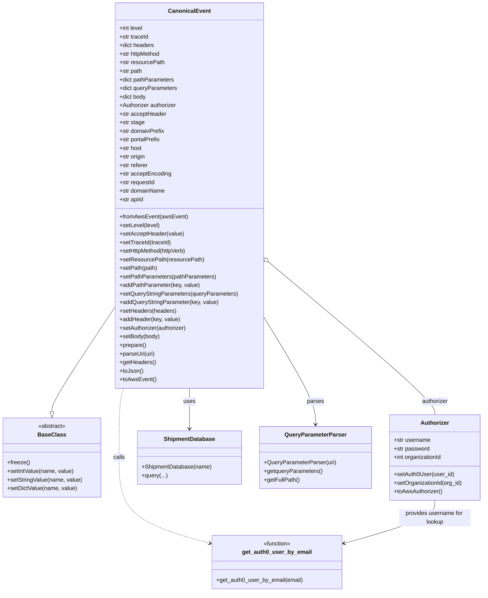

# Diagram: tools/ide_local_testing/localTest/core/CanonicalEvent.py

> Auto-generated by Obscura crawlers

## Mermaid

### SVG

<svg id="container" width="1343.453125" xmlns="http://www.w3.org/2000/svg" class="classDiagram" height="1658" viewBox="0 0 1343.453125 1658" role="graphics-document document" aria-roledescription="class"><g><defs><marker id="container_class-aggregationStart" class="marker aggregation class" refX="18" refY="7" markerWidth="190" markerHeight="240" orient="auto"><path d="M 18,7 L9,13 L1,7 L9,1 Z"></path></marker></defs><defs><marker id="container_class-aggregationEnd" class="marker aggregation class" refX="1" refY="7" markerWidth="20" markerHeight="28" orient="auto"><path d="M 18,7 L9,13 L1,7 L9,1 Z"></path></marker></defs><defs><marker id="container_class-extensionStart" class="marker extension class" refX="18" refY="7" markerWidth="190" markerHeight="240" orient="auto"><path d="M 1,7 L18,13 V 1 Z"></path></marker></defs><defs><marker id="container_class-extensionEnd" class="marker extension class" refX="1" refY="7" markerWidth="20" markerHeight="28" orient="auto"><path d="M 1,1 V 13 L18,7 Z"></path></marker></defs><defs><marker id="container_class-compositionStart" class="marker composition class" refX="18" refY="7" markerWidth="190" markerHeight="240" orient="auto"><path d="M 18,7 L9,13 L1,7 L9,1 Z"></path></marker></defs><defs><marker id="container_class-compositionEnd" class="marker composition class" refX="1" refY="7" markerWidth="20" markerHeight="28" orient="auto"><path d="M 18,7 L9,13 L1,7 L9,1 Z"></path></marker></defs><defs><marker id="container_class-dependencyStart" class="marker dependency class" refX="6" refY="7" markerWidth="190" markerHeight="240" orient="auto"><path d="M 5,7 L9,13 L1,7 L9,1 Z"></path></marker></defs><defs><marker id="container_class-dependencyEnd" class="marker dependency class" refX="13" refY="7" markerWidth="20" markerHeight="28" orient="auto"><path d="M 18,7 L9,13 L14,7 L9,1 Z"></path></marker></defs><defs><marker id="container_class-lollipopStart" class="marker lollipop class" refX="13" refY="7" markerWidth="190" markerHeight="240" orient="auto"><circle stroke="black" fill="transparent" cx="7" cy="7" r="6"></circle></marker></defs><defs><marker id="container_class-lollipopEnd" class="marker lollipop class" refX="1" refY="7" markerWidth="190" markerHeight="240" orient="auto"><circle stroke="black" fill="transparent" cx="7" cy="7" r="6"></circle></marker></defs><g class="root"><g class="clusters"></g><g class="edgePaths"><path d="M322.406,857.046L292.727,901.705C263.047,946.364,203.688,1035.682,174.008,1085.133C144.328,1134.583,144.328,1144.167,144.328,1148.958L144.328,1153.75" id="id_CanonicalEvent_BaseClass_1" class="edge-thickness-normal edge-pattern-solid relation" style=";;;" data-edge="true" data-et="edge" data-id="id_CanonicalEvent_BaseClass_1" data-points="W3sieCI6MzIyLjQwNjI1LCJ5Ijo4NTcuMDQ1NjM2NTE3MzYzM30seyJ4IjoxNDQuMzI4MTI1LCJ5IjoxMTI1fSx7IngiOjE0NC4zMjgxMjUsInkiOjExNzF9XQ==" marker-end="url(#container_class-extensionEnd)"></path><path d="M746.333,733.412L823.259,798.677C900.185,863.942,1054.036,994.471,1130.961,1065.902C1207.887,1137.333,1207.887,1149.667,1207.887,1155.833L1207.887,1162" id="id_CanonicalEvent_Authorizer_2" class="edge-thickness-normal edge-pattern-solid relation" style=";;;" data-edge="true" data-et="edge" data-id="id_CanonicalEvent_Authorizer_2" data-points="W3sieCI6NzMzLjE3OTY4NzUsInkiOjcyMi4yNTI2NDc4NDI2Njg3fSx7IngiOjEyMDcuODg2NzE4NzUsInkiOjExMjV9LHsieCI6MTIwNy44ODY3MTg3NSwieSI6MTE2Mn1d" marker-start="url(#container_class-aggregationStart)"></path><path d="M527.793,1088L527.793,1094.167C527.793,1100.333,527.793,1112.667,527.793,1131.5C527.793,1150.333,527.793,1175.667,527.793,1188.333L527.793,1201" id="id_CanonicalEvent_ShipmentDatabase_3" class="edge-thickness-normal edge-pattern-solid relation" style=";;;" data-edge="true" data-et="edge" data-id="id_CanonicalEvent_ShipmentDatabase_3" data-points="W3sieCI6NTI3Ljc5Mjk2ODc1LCJ5IjoxMDg4fSx7IngiOjUyNy43OTI5Njg3NSwieSI6MTEyNX0seyJ4Ijo1MjcuNzkyOTY4NzUsInkiOjEyMDd9XQ==" marker-end="url(#container_class-dependencyEnd)"></path><path d="M733.18,888.163L757.013,927.636C780.846,967.108,828.513,1046.054,852.346,1096.194C876.18,1146.333,876.18,1167.667,876.18,1178.333L876.18,1189" id="id_CanonicalEvent_QueryParameterParser_4" class="edge-thickness-normal edge-pattern-solid relation" style=";;;" data-edge="true" data-et="edge" data-id="id_CanonicalEvent_QueryParameterParser_4" data-points="W3sieCI6NzMzLjE3OTY4NzUsInkiOjg4OC4xNjI2MTMzODUzNTg4fSx7IngiOjg3Ni4xNzk2ODc1LCJ5IjoxMTI1fSx7IngiOjg3Ni4xNzk2ODc1LCJ5IjoxMTk1fV0=" marker-end="url(#container_class-dependencyEnd)"></path><path d="M344.65,1088L342.559,1094.167C340.467,1100.333,336.284,1112.667,334.193,1145C332.102,1177.333,332.102,1229.667,332.102,1284C332.102,1338.333,332.102,1394.667,374.121,1434.732C416.141,1474.798,500.181,1498.596,542.201,1510.495L584.221,1522.394" id="id_CanonicalEvent_get_auth0_user_by_email_5" class="edge-thickness-normal edge-pattern-dashed relation" style=";;;" data-edge="true" data-et="edge" data-id="id_CanonicalEvent_get_auth0_user_by_email_5" data-points="W3sieCI6MzQ0LjY1MDIzMTUzMTYyOTEsInkiOjEwODh9LHsieCI6MzMyLjEwMTU2MjUsInkiOjExMjV9LHsieCI6MzMyLjEwMTU2MjUsInkiOjEyODJ9LHsieCI6MzMyLjEwMTU2MjUsInkiOjE0NTF9LHsieCI6NTg5Ljk5NDE0MDYyNSwieSI6MTUyNC4wMjg1OTQ4NzY5MTg1fV0=" marker-end="url(#container_class-dependencyEnd)"></path><path d="M1207.887,1402L1207.887,1410.167C1207.887,1418.333,1207.887,1434.667,1165.867,1454.732C1123.847,1474.798,1039.807,1498.596,997.787,1510.495L955.767,1522.394" id="id_Authorizer_get_auth0_user_by_email_6" class="edge-thickness-normal edge-pattern-solid relation" style=";;;" data-edge="true" data-et="edge" data-id="id_Authorizer_get_auth0_user_by_email_6" data-points="W3sieCI6MTIwNy44ODY3MTg3NSwieSI6MTQwMn0seyJ4IjoxMjA3Ljg4NjcxODc1LCJ5IjoxNDUxfSx7IngiOjk0OS45OTQxNDA2MjUsInkiOjE1MjQuMDI4NTk0ODc2OTE4NX1d" marker-end="url(#container_class-dependencyEnd)"></path></g><g class="edgeLabels"><g class="edgeLabel"><g class="label" data-id="id_CanonicalEvent_BaseClass_1" transform="translate(0, 0)"><foreignObject width="0" height="0">

</foreignObject></g></g><g class="edgeLabel" transform="translate(1207.88671875, 1125)"><g class="label" data-id="id_CanonicalEvent_Authorizer_2" transform="translate(-37.4921875, -12)"><foreignObject width="74.984375" height="24">

authorizer

</foreignObject></g></g><g class="edgeLabel" transform="translate(527.79296875, 1125)"><g class="label" data-id="id_CanonicalEvent_ShipmentDatabase_3" transform="translate(-16.4921875, -12)"><foreignObject width="32.984375" height="24">

uses

</foreignObject></g></g><g class="edgeLabel" transform="translate(876.1796875, 1125)"><g class="label" data-id="id_CanonicalEvent_QueryParameterParser_4" transform="translate(-23.828125, -12)"><foreignObject width="47.65625" height="24">

parses

</foreignObject></g></g><g class="edgeLabel" transform="translate(332.1015625, 1282)"><g class="label" data-id="id_CanonicalEvent_get_auth0_user_by_email_5" transform="translate(-16.4453125, -12)"><foreignObject width="32.890625" height="24">

calls

</foreignObject></g></g><g class="edgeLabel" transform="translate(1207.88671875, 1451)"><g class="label" data-id="id_Authorizer_get_auth0_user_by_email_6" transform="translate(-100, -24)"><foreignObject width="200" height="48">

provides username for lookup

</foreignObject></g></g></g><g class="nodes"><g class="node default" id="classId-CanonicalEvent-0" transform="translate(527.79296875, 548)"><g class="basic label-container"><path d="M-205.38671875 -540 L205.38671875 -540 L205.38671875 540 L-205.38671875 540" stroke="none" stroke-width="0" fill="#ECECFF" style=""></path><path d="M-205.38671875 -540 C-97.48426306714752 -540, 10.418192615704953 -540, 205.38671875 -540 M-205.38671875 -540 C-94.15945006421947 -540, 17.06781862156106 -540, 205.38671875 -540 M205.38671875 -540 C205.38671875 -168.46477347006646, 205.38671875 203.07045305986708, 205.38671875 540 M205.38671875 -540 C205.38671875 -186.20607521048805, 205.38671875 167.5878495790239, 205.38671875 540 M205.38671875 540 C60.9979712342365 540, -83.390776281527 540, -205.38671875 540 M205.38671875 540 C72.09284991764787 540, -61.201018914704264 540, -205.38671875 540 M-205.38671875 540 C-205.38671875 166.44214533777637, -205.38671875 -207.11570932444727, -205.38671875 -540 M-205.38671875 540 C-205.38671875 170.72012320534384, -205.38671875 -198.55975358931232, -205.38671875 -540" stroke="#9370DB" stroke-width="1.3" fill="none" stroke-dasharray="0 0" style=""></path></g><g class="annotation-group text" transform="translate(0, -516)"></g><g class="label-group text" transform="translate(-55.7109375, -516)"><g class="label" style="font-weight: bolder" transform="translate(0,-12)"><foreignObject width="111.421875" height="24">

CanonicalEvent

</foreignObject></g></g><g class="members-group text" transform="translate(-193.38671875, -468)"><g class="label" style="" transform="translate(0,-12)"><foreignObject width="66.375" height="24">

+int level

</foreignObject></g><g class="label" style="" transform="translate(0,12)"><foreignObject width="82.09375" height="24">

+str traceId

</foreignObject></g><g class="label" style="" transform="translate(0,36)"><foreignObject width="98.078125" height="24">

+dict headers

</foreignObject></g><g class="label" style="" transform="translate(0,60)"><foreignObject width="117.3125" height="24">

+str httpMethod

</foreignObject></g><g class="label" style="" transform="translate(0,84)"><foreignObject width="126.21875" height="24">

+str resourcePath

</foreignObject></g><g class="label" style="" transform="translate(0,108)"><foreignObject width="64.859375" height="24">

+str path

</foreignObject></g><g class="label" style="" transform="translate(0,132)"><foreignObject width="154.46875" height="24">

+dict pathParameters

</foreignObject></g><g class="label" style="" transform="translate(0,156)"><foreignObject width="162.921875" height="24">

+dict queryParameters

</foreignObject></g><g class="label" style="" transform="translate(0,180)"><foreignObject width="76.03125" height="24">

+dict body

</foreignObject></g><g class="label" style="" transform="translate(0,204)"><foreignObject width="162.484375" height="24">

+Authorizer authorizer

</foreignObject></g><g class="label" style="" transform="translate(0,228)"><foreignObject width="131.625" height="24">

+str acceptHeader

</foreignObject></g><g class="label" style="" transform="translate(0,252)"><foreignObject width="70.125" height="24">

+str stage

</foreignObject></g><g class="label" style="" transform="translate(0,276)"><foreignObject width="127.21875" height="24">

+str domainPrefix

</foreignObject></g><g class="label" style="" transform="translate(0,300)"><foreignObject width="115.921875" height="24">

+str portalPrefix

</foreignObject></g><g class="label" style="" transform="translate(0,324)"><foreignObject width="63.625" height="24">

+str host

</foreignObject></g><g class="label" style="" transform="translate(0,348)"><foreignObject width="73.890625" height="24">

+str origin

</foreignObject></g><g class="label" style="" transform="translate(0,372)"><foreignObject width="80.578125" height="24">

+str referer

</foreignObject></g><g class="label" style="" transform="translate(0,396)"><foreignObject width="145.234375" height="24">

+str acceptEncoding

</foreignObject></g><g class="label" style="" transform="translate(0,420)"><foreignObject width="101.203125" height="24">

+str requestId

</foreignObject></g><g class="label" style="" transform="translate(0,444)"><foreignObject width="128.9375" height="24">

+str domainName

</foreignObject></g><g class="label" style="" transform="translate(0,468)"><foreignObject width="68.65625" height="24">

+str apiId

</foreignObject></g></g><g class="methods-group text" transform="translate(-193.38671875, 60)"><g class="label" style="" transform="translate(0,-12)"><foreignObject width="187.75" height="24">

+fromAwsEvent(awsEvent)

</foreignObject></g><g class="label" style="" transform="translate(0,12)"><foreignObject width="112.25" height="24">

+setLevel(level)

</foreignObject></g><g class="label" style="" transform="translate(0,36)"><foreignObject width="179.640625" height="24">

+setAcceptHeader(value)

</foreignObject></g><g class="label" style="" transform="translate(0,60)"><foreignObject width="143.203125" height="24">

+setTraceId(traceId)

</foreignObject></g><g class="label" style="" transform="translate(0,84)"><foreignObject width="190.828125" height="24">

+setHttpMethod(httpVerb)

</foreignObject></g><g class="label" style="" transform="translate(0,108)"><foreignObject width="233.1875" height="24">

+setResourcePath(resourcePath)

</foreignObject></g><g class="label" style="" transform="translate(0,132)"><foreignObject width="105.796875" height="24">

+setPath(path)

</foreignObject></g><g class="label" style="" transform="translate(0,156)"><foreignObject width="268.875" height="24">

+setPathParameters(pathParameters)

</foreignObject></g><g class="label" style="" transform="translate(0,180)"><foreignObject width="223.4375" height="24">

+addPathParameter(key, value)

</foreignObject></g><g class="label" style="" transform="translate(0,204)"><foreignObject width="331.0625" height="24">

+setQueryStringParameters(queryParameters)

</foreignObject></g><g class="label" style="" transform="translate(0,228)"><foreignObject width="277.171875" height="24">

+addQueryStringParameter(key, value)

</foreignObject></g><g class="label" style="" transform="translate(0,252)"><foreignObject width="158.5" height="24">

+setHeaders(headers)

</foreignObject></g><g class="label" style="" transform="translate(0,276)"><foreignObject width="169.46875" height="24">

+addHeader(key, value)

</foreignObject></g><g class="label" style="" transform="translate(0,300)"><foreignObject width="190.75" height="24">

+setAuthorizer(authorizer)

</foreignObject></g><g class="label" style="" transform="translate(0,324)"><foreignObject width="113.125" height="24">

+setBody(body)

</foreignObject></g><g class="label" style="" transform="translate(0,348)"><foreignObject width="74.75" height="24">

+prepare()

</foreignObject></g><g class="label" style="" transform="translate(0,372)"><foreignObject width="99.8125" height="24">

+parseUri(uri)

</foreignObject></g><g class="label" style="" transform="translate(0,396)"><foreignObject width="100.765625" height="24">

+getHeaders()

</foreignObject></g><g class="label" style="" transform="translate(0,420)"><foreignObject width="64.234375" height="24">

+toJson()

</foreignObject></g><g class="label" style="" transform="translate(0,444)"><foreignObject width="101.1875" height="24">

+toAwsEvent()

</foreignObject></g></g><g class="divider" style=""><path d="M-205.38671875 -492 C-103.6581147116533 -492, -1.929510673306595 -492, 205.38671875 -492 M-205.38671875 -492 C-122.18422795178591 -492, -38.98173715357183 -492, 205.38671875 -492" stroke="#9370DB" stroke-width="1.3" fill="none" stroke-dasharray="0 0" style=""></path></g><g class="divider" style=""><path d="M-205.38671875 36 C-96.50348123149276 36, 12.379756287014487 36, 205.38671875 36 M-205.38671875 36 C-60.672073888051926 36, 84.04257097389615 36, 205.38671875 36" stroke="#9370DB" stroke-width="1.3" fill="none" stroke-dasharray="0 0" style=""></path></g></g><g class="node default" id="classId-BaseClass-1" transform="translate(144.328125, 1282)"><g class="basic label-container"><path d="M-136.328125 -111 L136.328125 -111 L136.328125 111 L-136.328125 111" stroke="none" stroke-width="0" fill="#ECECFF" style=""></path><path d="M-136.328125 -111 C-45.063292350703875 -111, 46.20154029859225 -111, 136.328125 -111 M-136.328125 -111 C-66.26025424481317 -111, 3.8076165103736628 -111, 136.328125 -111 M136.328125 -111 C136.328125 -37.93019846180849, 136.328125 35.139603076383025, 136.328125 111 M136.328125 -111 C136.328125 -29.569647547403704, 136.328125 51.86070490519259, 136.328125 111 M136.328125 111 C30.825394067431077 111, -74.67733686513785 111, -136.328125 111 M136.328125 111 C78.58407882740977 111, 20.840032654819552 111, -136.328125 111 M-136.328125 111 C-136.328125 34.97120614660527, -136.328125 -41.05758770678946, -136.328125 -111 M-136.328125 111 C-136.328125 59.85251748532118, -136.328125 8.705034970642359, -136.328125 -111" stroke="#9370DB" stroke-width="1.3" fill="none" stroke-dasharray="0 0" style=""></path></g><g class="annotation-group text" transform="translate(-38.609375, -87)"><g class="label" style="" transform="translate(0,-12)"><foreignObject width="77.21875" height="24">

«abstract»

</foreignObject></g></g><g class="label-group text" transform="translate(-36.359375, -63)"><g class="label" style="font-weight: bolder" transform="translate(0,-12)"><foreignObject width="72.71875" height="24">

BaseClass

</foreignObject></g></g><g class="members-group text" transform="translate(-124.328125, -15)"></g><g class="methods-group text" transform="translate(-124.328125, 15)"><g class="label" style="" transform="translate(0,-12)"><foreignObject width="62.109375" height="24">

+freeze()

</foreignObject></g><g class="label" style="" transform="translate(0,12)"><foreignObject width="187.03125" height="24">

+setIntValue(name, value)

</foreignObject></g><g class="label" style="" transform="translate(0,36)"><foreignObject width="210.046875" height="24">

+setStringValue(name, value)

</foreignObject></g><g class="label" style="" transform="translate(0,60)"><foreignObject width="195.40625" height="24">

+setDictValue(name, value)

</foreignObject></g></g><g class="divider" style=""><path d="M-136.328125 -39 C-56.409635699214874 -39, 23.50885360157025 -39, 136.328125 -39 M-136.328125 -39 C-43.07395779545881 -39, 50.18020940908238 -39, 136.328125 -39" stroke="#9370DB" stroke-width="1.3" fill="none" stroke-dasharray="0 0" style=""></path></g><g class="divider" style=""><path d="M-136.328125 -15 C-57.42071042495333 -15, 21.486704150093345 -15, 136.328125 -15 M-136.328125 -15 C-52.650369874399004 -15, 31.02738525120199 -15, 136.328125 -15" stroke="#9370DB" stroke-width="1.3" fill="none" stroke-dasharray="0 0" style=""></path></g></g><g class="node default" id="classId-Authorizer-2" transform="translate(1207.88671875, 1282)"><g class="basic label-container"><path d="M-127.56640625 -120 L127.56640625 -120 L127.56640625 120 L-127.56640625 120" stroke="none" stroke-width="0" fill="#ECECFF" style=""></path><path d="M-127.56640625 -120 C-29.761928674726207 -120, 68.04254890054759 -120, 127.56640625 -120 M-127.56640625 -120 C-53.52068767176466 -120, 20.525030906470676 -120, 127.56640625 -120 M127.56640625 -120 C127.56640625 -65.3508227253266, 127.56640625 -10.701645450653174, 127.56640625 120 M127.56640625 -120 C127.56640625 -46.212110488513716, 127.56640625 27.57577902297257, 127.56640625 120 M127.56640625 120 C73.70136057034456 120, 19.836314890689124 120, -127.56640625 120 M127.56640625 120 C74.53151000686705 120, 21.496613763734118 120, -127.56640625 120 M-127.56640625 120 C-127.56640625 64.88696481621834, -127.56640625 9.773929632436676, -127.56640625 -120 M-127.56640625 120 C-127.56640625 65.50702225293489, -127.56640625 11.014044505869762, -127.56640625 -120" stroke="#9370DB" stroke-width="1.3" fill="none" stroke-dasharray="0 0" style=""></path></g><g class="annotation-group text" transform="translate(0, -96)"></g><g class="label-group text" transform="translate(-38.3671875, -96)"><g class="label" style="font-weight: bolder" transform="translate(0,-12)"><foreignObject width="76.734375" height="24">

Authorizer

</foreignObject></g></g><g class="members-group text" transform="translate(-115.56640625, -48)"><g class="label" style="" transform="translate(0,-12)"><foreignObject width="103.84375" height="24">

+str username

</foreignObject></g><g class="label" style="" transform="translate(0,12)"><foreignObject width="100.296875" height="24">

+str password

</foreignObject></g><g class="label" style="" transform="translate(0,36)"><foreignObject width="136.53125" height="24">

+int organizationId

</foreignObject></g></g><g class="methods-group text" transform="translate(-115.56640625, 48)"><g class="label" style="" transform="translate(0,-12)"><foreignObject width="168.5625" height="24">

+setAuth0User(user_id)

</foreignObject></g><g class="label" style="" transform="translate(0,12)"><foreignObject width="192.765625" height="24">

+setOrganizationId(org_id)

</foreignObject></g><g class="label" style="" transform="translate(0,36)"><foreignObject width="136.71875" height="24">

+toAwsAuthorizer()

</foreignObject></g></g><g class="divider" style=""><path d="M-127.56640625 -72 C-34.0603792214616 -72, 59.445647807076796 -72, 127.56640625 -72 M-127.56640625 -72 C-59.513427889134064 -72, 8.539550471731872 -72, 127.56640625 -72" stroke="#9370DB" stroke-width="1.3" fill="none" stroke-dasharray="0 0" style=""></path></g><g class="divider" style=""><path d="M-127.56640625 24 C-38.92227372285083 24, 49.721858804298336 24, 127.56640625 24 M-127.56640625 24 C-65.63693659900093 24, -3.70746694800188 24, 127.56640625 24" stroke="#9370DB" stroke-width="1.3" fill="none" stroke-dasharray="0 0" style=""></path></g></g><g class="node default" id="classId-ShipmentDatabase-3" transform="translate(527.79296875, 1282)"><g class="basic label-container"><path d="M-144.24609375 -75 L144.24609375 -75 L144.24609375 75 L-144.24609375 75" stroke="none" stroke-width="0" fill="#ECECFF" style=""></path><path d="M-144.24609375 -75 C-48.50475083124836 -75, 47.23659208750328 -75, 144.24609375 -75 M-144.24609375 -75 C-45.51753575247544 -75, 53.21102224504912 -75, 144.24609375 -75 M144.24609375 -75 C144.24609375 -20.35924342929566, 144.24609375 34.28151314140868, 144.24609375 75 M144.24609375 -75 C144.24609375 -29.991170458041417, 144.24609375 15.017659083917167, 144.24609375 75 M144.24609375 75 C45.78574456054059 75, -52.674604628918814 75, -144.24609375 75 M144.24609375 75 C54.37041191129349 75, -35.505269927413025 75, -144.24609375 75 M-144.24609375 75 C-144.24609375 39.54391622821107, -144.24609375 4.087832456422134, -144.24609375 -75 M-144.24609375 75 C-144.24609375 15.500898906668056, -144.24609375 -43.99820218666389, -144.24609375 -75" stroke="#9370DB" stroke-width="1.3" fill="none" stroke-dasharray="0 0" style=""></path></g><g class="annotation-group text" transform="translate(0, -51)"></g><g class="label-group text" transform="translate(-69.2734375, -51)"><g class="label" style="font-weight: bolder" transform="translate(0,-12)"><foreignObject width="138.546875" height="24">

ShipmentDatabase

</foreignObject></g></g><g class="members-group text" transform="translate(-132.24609375, -3)"></g><g class="methods-group text" transform="translate(-132.24609375, 27)"><g class="label" style="" transform="translate(0,-12)"><foreignObject width="195.21875" height="24">

+ShipmentDatabase(name)

</foreignObject></g><g class="label" style="" transform="translate(0,12)"><foreignObject width="71.53125" height="24">

+query(...)

</foreignObject></g></g><g class="divider" style=""><path d="M-144.24609375 -27 C-46.64740564141765 -27, 50.9512824671647 -27, 144.24609375 -27 M-144.24609375 -27 C-35.879140148343865 -27, 72.48781345331227 -27, 144.24609375 -27" stroke="#9370DB" stroke-width="1.3" fill="none" stroke-dasharray="0 0" style=""></path></g><g class="divider" style=""><path d="M-144.24609375 -3 C-28.860306675485205 -3, 86.52548039902959 -3, 144.24609375 -3 M-144.24609375 -3 C-82.03565882225769 -3, -19.82522389451539 -3, 144.24609375 -3" stroke="#9370DB" stroke-width="1.3" fill="none" stroke-dasharray="0 0" style=""></path></g></g><g class="node default" id="classId-QueryParameterParser-4" transform="translate(876.1796875, 1282)"><g class="basic label-container"><path d="M-154.140625 -87 L154.140625 -87 L154.140625 87 L-154.140625 87" stroke="none" stroke-width="0" fill="#ECECFF" style=""></path><path d="M-154.140625 -87 C-84.25386186865093 -87, -14.367098737301859 -87, 154.140625 -87 M-154.140625 -87 C-52.72618434315467 -87, 48.68825631369066 -87, 154.140625 -87 M154.140625 -87 C154.140625 -27.472644231245226, 154.140625 32.05471153750955, 154.140625 87 M154.140625 -87 C154.140625 -22.246670056869263, 154.140625 42.506659886261474, 154.140625 87 M154.140625 87 C44.9185998144568 87, -64.3034253710864 87, -154.140625 87 M154.140625 87 C71.12778621075535 87, -11.885052578489308 87, -154.140625 87 M-154.140625 87 C-154.140625 26.892067387737974, -154.140625 -33.21586522452405, -154.140625 -87 M-154.140625 87 C-154.140625 42.82360784430337, -154.140625 -1.3527843113932647, -154.140625 -87" stroke="#9370DB" stroke-width="1.3" fill="none" stroke-dasharray="0 0" style=""></path></g><g class="annotation-group text" transform="translate(0, -63)"></g><g class="label-group text" transform="translate(-83.0625, -63)"><g class="label" style="font-weight: bolder" transform="translate(0,-12)"><foreignObject width="166.125" height="24">

QueryParameterParser

</foreignObject></g></g><g class="members-group text" transform="translate(-142.140625, -15)"></g><g class="methods-group text" transform="translate(-142.140625, 15)"><g class="label" style="" transform="translate(0,-12)"><foreignObject width="201.21875" height="24">

+QueryParameterParser(uri)

</foreignObject></g><g class="label" style="" transform="translate(0,12)"><foreignObject width="163.859375" height="24">

+getqueryParameters()

</foreignObject></g><g class="label" style="" transform="translate(0,36)"><foreignObject width="99.140625" height="24">

+getFullPath()

</foreignObject></g></g><g class="divider" style=""><path d="M-154.140625 -39 C-60.33227415394816 -39, 33.476076692103675 -39, 154.140625 -39 M-154.140625 -39 C-91.57109309568537 -39, -29.00156119137074 -39, 154.140625 -39" stroke="#9370DB" stroke-width="1.3" fill="none" stroke-dasharray="0 0" style=""></path></g><g class="divider" style=""><path d="M-154.140625 -15 C-81.88971954724015 -15, -9.638814094480296 -15, 154.140625 -15 M-154.140625 -15 C-90.60442018862668 -15, -27.068215377253367 -15, 154.140625 -15" stroke="#9370DB" stroke-width="1.3" fill="none" stroke-dasharray="0 0" style=""></path></g></g><g class="node default" id="classId-get_auth0_user_by_email-5" transform="translate(769.994140625, 1575)"><g class="basic label-container"><path d="M-180 -75 L180 -75 L180 75 L-180 75" stroke="none" stroke-width="0" fill="#ECECFF" style=""></path><path d="M-180 -75 C-46.79779879508945 -75, 86.4044024098211 -75, 180 -75 M-180 -75 C-84.48274778301959 -75, 11.03450443396082 -75, 180 -75 M180 -75 C180 -27.41520917621679, 180 20.169581647566417, 180 75 M180 -75 C180 -16.583855687930985, 180 41.83228862413803, 180 75 M180 75 C37.431333578275485 75, -105.13733284344903 75, -180 75 M180 75 C88.40984484913638 75, -3.1803103017272463 75, -180 75 M-180 75 C-180 33.848373813486404, -180 -7.303252373027192, -180 -75 M-180 75 C-180 29.07158753933342, -180 -16.856824921333157, -180 -75" stroke="#9370DB" stroke-width="1.3" fill="none" stroke-dasharray="0 0" style=""></path></g><g class="annotation-group text" transform="translate(-39.484375, -51)"><g class="label" style="" transform="translate(0,-12)"><foreignObject width="78.96875" height="24">

«function»

</foreignObject></g></g><g class="label-group text" transform="translate(-93.234375, -27)"><g class="label" style="font-weight: bolder" transform="translate(0,-12)"><foreignObject width="186.46875" height="24">

get_auth0_user_by_email

</foreignObject></g></g><g class="members-group text" transform="translate(-168, 21)"></g><g class="methods-group text" transform="translate(-168, 51)"><g class="label" style="" transform="translate(0,-12)"><foreignObject width="242.765625" height="24">

+get_auth0_user_by_email(email)

</foreignObject></g></g><g class="divider" style=""><path d="M-180 -3 C-102.06713458195078 -3, -24.134269163901564 -3, 180 -3 M-180 -3 C-42.69478500859972 -3, 94.61042998280055 -3, 180 -3" stroke="#9370DB" stroke-width="1.3" fill="none" stroke-dasharray="0 0" style=""></path></g><g class="divider" style=""><path d="M-180 21 C-56.47389480533516 21, 67.05221038932967 21, 180 21 M-180 21 C-63.21553496061921 21, 53.56893007876158 21, 180 21" stroke="#9370DB" stroke-width="1.3" fill="none" stroke-dasharray="0 0" style=""></path></g></g></g></g></g></svg>
