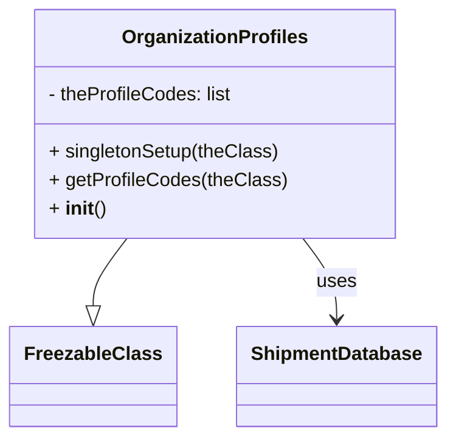

# Diagram: tools/ide_local_testing/localTest/core/OrganizationProfiles.py


> Auto-generated by Obscura crawlers

## Diagram 1



### SVG

<svg id="container" width="359.828125" xmlns="http://www.w3.org/2000/svg" class="classDiagram" height="366" viewBox="0 0 359.828125 366" role="graphics-document document" aria-roledescription="class"><style>#container{font-family:"trebuchet ms",verdana,arial,sans-serif;font-size:16px;fill:#333;}@keyframes edge-animation-frame{from{stroke-dashoffset:0;}}@keyframes dash{to{stroke-dashoffset:0;}}#container .edge-animation-slow{stroke-dasharray:9,5!important;stroke-dashoffset:900;animation:dash 50s linear infinite;stroke-linecap:round;}#container .edge-animation-fast{stroke-dasharray:9,5!important;stroke-dashoffset:900;animation:dash 20s linear infinite;stroke-linecap:round;}#container .error-icon{fill:#552222;}#container .error-text{fill:#552222;stroke:#552222;}#container .edge-thickness-normal{stroke-width:1px;}#container .edge-thickness-thick{stroke-width:3.5px;}#container .edge-pattern-solid{stroke-dasharray:0;}#container .edge-thickness-invisible{stroke-width:0;fill:none;}#container .edge-pattern-dashed{stroke-dasharray:3;}#container .edge-pattern-dotted{stroke-dasharray:2;}#container .marker{fill:#333333;stroke:#333333;}#container .marker.cross{stroke:#333333;}#container svg{font-family:"trebuchet ms",verdana,arial,sans-serif;font-size:16px;}#container p{margin:0;}#container g.classGroup text{fill:#9370DB;stroke:none;font-family:"trebuchet ms",verdana,arial,sans-serif;font-size:10px;}#container g.classGroup text .title{font-weight:bolder;}#container .nodeLabel,#container .edgeLabel{color:#131300;}#container .edgeLabel .label rect{fill:#ECECFF;}#container .label text{fill:#131300;}#container .labelBkg{background:#ECECFF;}#container .edgeLabel .label span{background:#ECECFF;}#container .classTitle{font-weight:bolder;}#container .node rect,#container .node circle,#container .node ellipse,#container .node polygon,#container .node path{fill:#ECECFF;stroke:#9370DB;stroke-width:1px;}#container .divider{stroke:#9370DB;stroke-width:1;}#container g.clickable{cursor:pointer;}#container g.classGroup rect{fill:#ECECFF;stroke:#9370DB;}#container g.classGroup line{stroke:#9370DB;stroke-width:1;}#container .classLabel .box{stroke:none;stroke-width:0;fill:#ECECFF;opacity:0.5;}#container .classLabel .label{fill:#9370DB;font-size:10px;}#container .relation{stroke:#333333;stroke-width:1;fill:none;}#container .dashed-line{stroke-dasharray:3;}#container .dotted-line{stroke-dasharray:1 2;}#container #compositionStart,#container .composition{fill:#333333!important;stroke:#333333!important;stroke-width:1;}#container #compositionEnd,#container .composition{fill:#333333!important;stroke:#333333!important;stroke-width:1;}#container #dependencyStart,#container .dependency{fill:#333333!important;stroke:#333333!important;stroke-width:1;}#container #dependencyStart,#container .dependency{fill:#333333!important;stroke:#333333!important;stroke-width:1;}#container #extensionStart,#container .extension{fill:transparent!important;stroke:#333333!important;stroke-width:1;}#container #extensionEnd,#container .extension{fill:transparent!important;stroke:#333333!important;stroke-width:1;}#container #aggregationStart,#container .aggregation{fill:transparent!important;stroke:#333333!important;stroke-width:1;}#container #aggregationEnd,#container .aggregation{fill:transparent!important;stroke:#333333!important;stroke-width:1;}#container #lollipopStart,#container .lollipop{fill:#ECECFF!important;stroke:#333333!important;stroke-width:1;}#container #lollipopEnd,#container .lollipop{fill:#ECECFF!important;stroke:#333333!important;stroke-width:1;}#container .edgeTerminals{font-size:11px;line-height:initial;}#container .classTitleText{text-anchor:middle;font-size:18px;fill:#333;}#container .label-icon{display:inline-block;height:1em;overflow:visible;vertical-align:-0.125em;}#container .node .label-icon path{fill:currentColor;stroke:revert;stroke-width:revert;}#container :root{--mermaid-font-family:"trebuchet ms",verdana,arial,sans-serif;}</style><g><defs><marker id="container_class-aggregationStart" class="marker aggregation class" refX="18" refY="7" markerWidth="190" markerHeight="240" orient="auto"><path d="M 18,7 L9,13 L1,7 L9,1 Z"></path></marker></defs><defs><marker id="container_class-aggregationEnd" class="marker aggregation class" refX="1" refY="7" markerWidth="20" markerHeight="28" orient="auto"><path d="M 18,7 L9,13 L1,7 L9,1 Z"></path></marker></defs><defs><marker id="container_class-extensionStart" class="marker extension class" refX="18" refY="7" markerWidth="190" markerHeight="240" orient="auto"><path d="M 1,7 L18,13 V 1 Z"></path></marker></defs><defs><marker id="container_class-extensionEnd" class="marker extension class" refX="1" refY="7" markerWidth="20" markerHeight="28" orient="auto"><path d="M 1,1 V 13 L18,7 Z"></path></marker></defs><defs><marker id="container_class-compositionStart" class="marker composition class" refX="18" refY="7" markerWidth="190" markerHeight="240" orient="auto"><path d="M 18,7 L9,13 L1,7 L9,1 Z"></path></marker></defs><defs><marker id="container_class-compositionEnd" class="marker composition class" refX="1" refY="7" markerWidth="20" markerHeight="28" orient="auto"><path d="M 18,7 L9,13 L1,7 L9,1 Z"></path></marker></defs><defs><marker id="container_class-dependencyStart" class="marker dependency class" refX="6" refY="7" markerWidth="190" markerHeight="240" orient="auto"><path d="M 5,7 L9,13 L1,7 L9,1 Z"></path></marker></defs><defs><marker id="container_class-dependencyEnd" class="marker dependency class" refX="13" refY="7" markerWidth="20" markerHeight="28" orient="auto"><path d="M 18,7 L9,13 L14,7 L9,1 Z"></path></marker></defs><defs><marker id="container_class-lollipopStart" class="marker lollipop class" refX="13" refY="7" markerWidth="190" markerHeight="240" orient="auto"><circle stroke="black" fill="transparent" cx="7" cy="7" r="6"></circle></marker></defs><defs><marker id="container_class-lollipopEnd" class="marker lollipop class" refX="1" refY="7" markerWidth="190" markerHeight="240" orient="auto"><circle stroke="black" fill="transparent" cx="7" cy="7" r="6"></circle></marker></defs><g class="root"><g class="clusters"></g><g class="edgePaths"><path d="M101.031,200L96.466,206.167C91.901,212.333,82.771,224.667,78.206,234.125C73.641,243.583,73.641,250.167,73.641,253.458L73.641,256.75" id="id_OrganizationProfiles_FreezableClass_1" class="edge-thickness-normal edge-pattern-solid relation" style=";;;" data-edge="true" data-et="edge" data-id="id_OrganizationProfiles_FreezableClass_1" data-points="W3sieCI6MTAxLjAzMDkyNjkyNjY5MTczLCJ5IjoyMDB9LHsieCI6NzMuNjQwNjI1LCJ5IjoyMzd9LHsieCI6NzMuNjQwNjI1LCJ5IjoyNzR9XQ==" marker-end="url(#container_class-extensionEnd)"></path><path d="M243.164,200L247.729,206.167C252.294,212.333,261.425,224.667,265.99,236C270.555,247.333,270.555,257.667,270.555,262.833L270.555,268" id="id_OrganizationProfiles_ShipmentDatabase_2" class="edge-thickness-normal edge-pattern-solid relation" style=";;;" data-edge="true" data-et="edge" data-id="id_OrganizationProfiles_ShipmentDatabase_2" data-points="W3sieCI6MjQzLjE2NDM4NTU3MzMwODI3LCJ5IjoyMDB9LHsieCI6MjcwLjU1NDY4NzUsInkiOjIzN30seyJ4IjoyNzAuNTU0Njg3NSwieSI6Mjc0fV0=" marker-end="url(#container_class-dependencyEnd)"></path></g><g class="edgeLabels"><g class="edgeLabel"><g class="label" data-id="id_OrganizationProfiles_FreezableClass_1" transform="translate(0, 0)"><foreignObject width="0" height="0"><div xmlns="http://www.w3.org/1999/xhtml" class="labelBkg" style="display: table-cell; white-space: nowrap; line-height: 1.5; max-width: 200px; text-align: center;"><span class="edgeLabel"></span></div></foreignObject></g></g><g class="edgeLabel" transform="translate(270.5546875, 237)"><g class="label" data-id="id_OrganizationProfiles_ShipmentDatabase_2" transform="translate(-16.4921875, -12)"><foreignObject width="32.984375" height="24"><div xmlns="http://www.w3.org/1999/xhtml" class="labelBkg" style="display: table-cell; white-space: nowrap; line-height: 1.5; max-width: 200px; text-align: center;"><span class="edgeLabel"><p>uses</p></span></div></foreignObject></g></g></g><g class="nodes"><g class="node default" id="classId-OrganizationProfiles-0" transform="translate(172.09765625, 104)"><g class="basic label-container"><path d="M-147.22265625 -96 L147.22265625 -96 L147.22265625 96 L-147.22265625 96" stroke="none" stroke-width="0" fill="#ECECFF" style=""></path><path d="M-147.22265625 -96 C-84.31905999330658 -96, -21.415463736613148 -96, 147.22265625 -96 M-147.22265625 -96 C-30.276615690110262 -96, 86.66942486977948 -96, 147.22265625 -96 M147.22265625 -96 C147.22265625 -47.025309568083735, 147.22265625 1.9493808638325305, 147.22265625 96 M147.22265625 -96 C147.22265625 -41.72273275458631, 147.22265625 12.554534490827379, 147.22265625 96 M147.22265625 96 C31.85746849178453 96, -83.50771926643094 96, -147.22265625 96 M147.22265625 96 C86.7300617305471 96, 26.237467211094213 96, -147.22265625 96 M-147.22265625 96 C-147.22265625 47.758694749264755, -147.22265625 -0.48261050147048934, -147.22265625 -96 M-147.22265625 96 C-147.22265625 31.360493971767724, -147.22265625 -33.27901205646455, -147.22265625 -96" stroke="#9370DB" stroke-width="1.3" fill="none" stroke-dasharray="0 0" style=""></path></g><g class="annotation-group text" transform="translate(0, -72)"></g><g class="label-group text" transform="translate(-74.3828125, -72)"><g class="label" style="font-weight: bolder" transform="translate(0,-12)"><foreignObject width="148.765625" height="24"><div xmlns="http://www.w3.org/1999/xhtml" style="display: table-cell; white-space: nowrap; line-height: 1.5; max-width: 196px; text-align: center;"><span class="nodeLabel markdown-node-label" style=""><p>OrganizationProfiles</p></span></div></foreignObject></g></g><g class="members-group text" transform="translate(-135.22265625, -24)"><g class="label" style="" transform="translate(0,-12)"><foreignObject width="155.390625" height="24"><div xmlns="http://www.w3.org/1999/xhtml" style="display: table-cell; white-space: nowrap; line-height: 1.5; max-width: 213px; text-align: center;"><span class="nodeLabel markdown-node-label" style=""><p>- theProfileCodes: list</p></span></div></foreignObject></g></g><g class="methods-group text" transform="translate(-135.22265625, 24)"><g class="label" style="" transform="translate(0,-12)"><foreignObject width="192.5" height="24"><div xmlns="http://www.w3.org/1999/xhtml" style="display: table-cell; white-space: nowrap; line-height: 1.5; max-width: 250px; text-align: center;"><span class="nodeLabel markdown-node-label" style=""><p>+ singletonSetup(theClass)</p></span></div></foreignObject></g><g class="label" style="" transform="translate(0,12)"><foreignObject width="196.0625" height="24"><div xmlns="http://www.w3.org/1999/xhtml" style="display: table-cell; white-space: nowrap; line-height: 1.5; max-width: 253px; text-align: center;"><span class="nodeLabel markdown-node-label" style=""><p>+ getProfileCodes(theClass)</p></span></div></foreignObject></g><g class="label" style="" transform="translate(0,36)"><foreignObject width="47.046875" height="24"><div xmlns="http://www.w3.org/1999/xhtml" style="display: table-cell; white-space: nowrap; line-height: 1.5; max-width: 137px; text-align: center;"><span class="nodeLabel markdown-node-label" style=""><p>+ <strong>init</strong>()</p></span></div></foreignObject></g></g><g class="divider" style=""><path d="M-147.22265625 -48 C-85.3762719719868 -48, -23.529887693973578 -48, 147.22265625 -48 M-147.22265625 -48 C-50.959804293469034 -48, 45.30304766306193 -48, 147.22265625 -48" stroke="#9370DB" stroke-width="1.3" fill="none" stroke-dasharray="0 0" style=""></path></g><g class="divider" style=""><path d="M-147.22265625 0 C-43.96689509986277 0, 59.288866050274464 0, 147.22265625 0 M-147.22265625 0 C-40.254500487503705 0, 66.71365527499259 0, 147.22265625 0" stroke="#9370DB" stroke-width="1.3" fill="none" stroke-dasharray="0 0" style=""></path></g></g><g class="node default" id="classId-FreezableClass-1" transform="translate(73.640625, 316)"><g class="basic label-container"><path d="M-65.640625 -42 L65.640625 -42 L65.640625 42 L-65.640625 42" stroke="none" stroke-width="0" fill="#ECECFF" style=""></path><path d="M-65.640625 -42 C-28.69670215360179 -42, 8.247220692796418 -42, 65.640625 -42 M-65.640625 -42 C-19.769143023114978 -42, 26.102338953770044 -42, 65.640625 -42 M65.640625 -42 C65.640625 -17.94635311662486, 65.640625 6.107293766750281, 65.640625 42 M65.640625 -42 C65.640625 -17.714225185121883, 65.640625 6.571549629756234, 65.640625 42 M65.640625 42 C34.02294041704348 42, 2.405255834086958 42, -65.640625 42 M65.640625 42 C35.62459500851652 42, 5.608565017033037 42, -65.640625 42 M-65.640625 42 C-65.640625 9.015579110708302, -65.640625 -23.968841778583396, -65.640625 -42 M-65.640625 42 C-65.640625 15.149881081314717, -65.640625 -11.700237837370565, -65.640625 -42" stroke="#9370DB" stroke-width="1.3" fill="none" stroke-dasharray="0 0" style=""></path></g><g class="annotation-group text" transform="translate(0, -18)"></g><g class="label-group text" transform="translate(-53.640625, -18)"><g class="label" style="font-weight: bolder" transform="translate(0,-12)"><foreignObject width="107.28125" height="24"><div xmlns="http://www.w3.org/1999/xhtml" style="display: table-cell; white-space: nowrap; line-height: 1.5; max-width: 155px; text-align: center;"><span class="nodeLabel markdown-node-label" style=""><p>FreezableClass</p></span></div></foreignObject></g></g><g class="members-group text" transform="translate(-53.640625, 30)"></g><g class="methods-group text" transform="translate(-53.640625, 60)"></g><g class="divider" style=""><path d="M-65.640625 6 C-25.051495688947668 6, 15.537633622104664 6, 65.640625 6 M-65.640625 6 C-18.149244408024344 6, 29.34213618395131 6, 65.640625 6" stroke="#9370DB" stroke-width="1.3" fill="none" stroke-dasharray="0 0" style=""></path></g><g class="divider" style=""><path d="M-65.640625 24 C-26.861052628433086 24, 11.918519743133828 24, 65.640625 24 M-65.640625 24 C-29.097490728859498 24, 7.445643542281005 24, 65.640625 24" stroke="#9370DB" stroke-width="1.3" fill="none" stroke-dasharray="0 0" style=""></path></g></g><g class="node default" id="classId-ShipmentDatabase-2" transform="translate(270.5546875, 316)"><g class="basic label-container"><path d="M-81.2734375 -42 L81.2734375 -42 L81.2734375 42 L-81.2734375 42" stroke="none" stroke-width="0" fill="#ECECFF" style=""></path><path d="M-81.2734375 -42 C-26.037946557085014 -42, 29.19754438582997 -42, 81.2734375 -42 M-81.2734375 -42 C-46.31596631988101 -42, -11.358495139762013 -42, 81.2734375 -42 M81.2734375 -42 C81.2734375 -22.70033110730635, 81.2734375 -3.4006622146127015, 81.2734375 42 M81.2734375 -42 C81.2734375 -19.44276655345258, 81.2734375 3.1144668930948427, 81.2734375 42 M81.2734375 42 C21.66023005439702 42, -37.95297739120596 42, -81.2734375 42 M81.2734375 42 C32.80339305530072 42, -15.666651389398567 42, -81.2734375 42 M-81.2734375 42 C-81.2734375 16.070564253172122, -81.2734375 -9.858871493655755, -81.2734375 -42 M-81.2734375 42 C-81.2734375 18.28894208970322, -81.2734375 -5.422115820593561, -81.2734375 -42" stroke="#9370DB" stroke-width="1.3" fill="none" stroke-dasharray="0 0" style=""></path></g><g class="annotation-group text" transform="translate(0, -18)"></g><g class="label-group text" transform="translate(-69.2734375, -18)"><g class="label" style="font-weight: bolder" transform="translate(0,-12)"><foreignObject width="138.546875" height="24"><div xmlns="http://www.w3.org/1999/xhtml" style="display: table-cell; white-space: nowrap; line-height: 1.5; max-width: 187px; text-align: center;"><span class="nodeLabel markdown-node-label" style=""><p>ShipmentDatabase</p></span></div></foreignObject></g></g><g class="members-group text" transform="translate(-69.2734375, 30)"></g><g class="methods-group text" transform="translate(-69.2734375, 60)"></g><g class="divider" style=""><path d="M-81.2734375 6 C-18.022378295230133 6, 45.22868090953973 6, 81.2734375 6 M-81.2734375 6 C-24.31727589523863 6, 32.63888570952274 6, 81.2734375 6" stroke="#9370DB" stroke-width="1.3" fill="none" stroke-dasharray="0 0" style=""></path></g><g class="divider" style=""><path d="M-81.2734375 24 C-36.45686748306423 24, 8.359702533871541 24, 81.2734375 24 M-81.2734375 24 C-41.82154419022736 24, -2.3696508804547136 24, 81.2734375 24" stroke="#9370DB" stroke-width="1.3" fill="none" stroke-dasharray="0 0" style=""></path></g></g></g></g></g></svg>

## Diagram 2

```mermaid
flowchart TD
    Start([Module import/run]) --> CheckEmpty{OrganizationProfiles.theProfileCodes\nis empty?}
    CheckEmpty -- Yes --> CallSetup[Call OrganizationProfiles.singletonSetup()]
    CheckEmpty -- No --> Done([No setup needed])
    CallSetup --> CreateConnector[connector = ShipmentDatabase("getOrganizationProfiles.test")]
    CreateConnector --> ExecuteQuery[connector.get_cursor().execute("SELECT CODE FROM organization_profiles")]
    ExecuteQuery --> FetchRows[for profile in connector.get_cursor().fetchall()]
    FetchRows --> Append[theClass.theProfileCodes.append(profile.code)]
    Append --> Done
```

> SVG rendering failed for this diagram.
