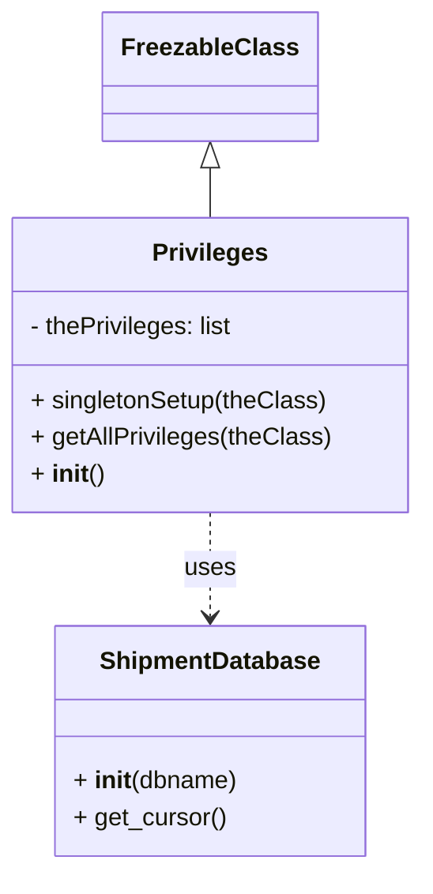

# Diagram: tools/ide_local_testing/localTest/core/Privileges.py


> Auto-generated by Obscura crawlers

## Diagram 1



### SVG

<svg id="container" width="269.671875" xmlns="http://www.w3.org/2000/svg" class="classDiagram" height="566" viewBox="0 0 269.671875 566" role="graphics-document document" aria-roledescription="class"><style>#container{font-family:"trebuchet ms",verdana,arial,sans-serif;font-size:16px;fill:#333;}@keyframes edge-animation-frame{from{stroke-dashoffset:0;}}@keyframes dash{to{stroke-dashoffset:0;}}#container .edge-animation-slow{stroke-dasharray:9,5!important;stroke-dashoffset:900;animation:dash 50s linear infinite;stroke-linecap:round;}#container .edge-animation-fast{stroke-dasharray:9,5!important;stroke-dashoffset:900;animation:dash 20s linear infinite;stroke-linecap:round;}#container .error-icon{fill:#552222;}#container .error-text{fill:#552222;stroke:#552222;}#container .edge-thickness-normal{stroke-width:1px;}#container .edge-thickness-thick{stroke-width:3.5px;}#container .edge-pattern-solid{stroke-dasharray:0;}#container .edge-thickness-invisible{stroke-width:0;fill:none;}#container .edge-pattern-dashed{stroke-dasharray:3;}#container .edge-pattern-dotted{stroke-dasharray:2;}#container .marker{fill:#333333;stroke:#333333;}#container .marker.cross{stroke:#333333;}#container svg{font-family:"trebuchet ms",verdana,arial,sans-serif;font-size:16px;}#container p{margin:0;}#container g.classGroup text{fill:#9370DB;stroke:none;font-family:"trebuchet ms",verdana,arial,sans-serif;font-size:10px;}#container g.classGroup text .title{font-weight:bolder;}#container .nodeLabel,#container .edgeLabel{color:#131300;}#container .edgeLabel .label rect{fill:#ECECFF;}#container .label text{fill:#131300;}#container .labelBkg{background:#ECECFF;}#container .edgeLabel .label span{background:#ECECFF;}#container .classTitle{font-weight:bolder;}#container .node rect,#container .node circle,#container .node ellipse,#container .node polygon,#container .node path{fill:#ECECFF;stroke:#9370DB;stroke-width:1px;}#container .divider{stroke:#9370DB;stroke-width:1;}#container g.clickable{cursor:pointer;}#container g.classGroup rect{fill:#ECECFF;stroke:#9370DB;}#container g.classGroup line{stroke:#9370DB;stroke-width:1;}#container .classLabel .box{stroke:none;stroke-width:0;fill:#ECECFF;opacity:0.5;}#container .classLabel .label{fill:#9370DB;font-size:10px;}#container .relation{stroke:#333333;stroke-width:1;fill:none;}#container .dashed-line{stroke-dasharray:3;}#container .dotted-line{stroke-dasharray:1 2;}#container #compositionStart,#container .composition{fill:#333333!important;stroke:#333333!important;stroke-width:1;}#container #compositionEnd,#container .composition{fill:#333333!important;stroke:#333333!important;stroke-width:1;}#container #dependencyStart,#container .dependency{fill:#333333!important;stroke:#333333!important;stroke-width:1;}#container #dependencyStart,#container .dependency{fill:#333333!important;stroke:#333333!important;stroke-width:1;}#container #extensionStart,#container .extension{fill:transparent!important;stroke:#333333!important;stroke-width:1;}#container #extensionEnd,#container .extension{fill:transparent!important;stroke:#333333!important;stroke-width:1;}#container #aggregationStart,#container .aggregation{fill:transparent!important;stroke:#333333!important;stroke-width:1;}#container #aggregationEnd,#container .aggregation{fill:transparent!important;stroke:#333333!important;stroke-width:1;}#container #lollipopStart,#container .lollipop{fill:#ECECFF!important;stroke:#333333!important;stroke-width:1;}#container #lollipopEnd,#container .lollipop{fill:#ECECFF!important;stroke:#333333!important;stroke-width:1;}#container .edgeTerminals{font-size:11px;line-height:initial;}#container .classTitleText{text-anchor:middle;font-size:18px;fill:#333;}#container .label-icon{display:inline-block;height:1em;overflow:visible;vertical-align:-0.125em;}#container .node .label-icon path{fill:currentColor;stroke:revert;stroke-width:revert;}#container :root{--mermaid-font-family:"trebuchet ms",verdana,arial,sans-serif;}</style><g><defs><marker id="container_class-aggregationStart" class="marker aggregation class" refX="18" refY="7" markerWidth="190" markerHeight="240" orient="auto"><path d="M 18,7 L9,13 L1,7 L9,1 Z"></path></marker></defs><defs><marker id="container_class-aggregationEnd" class="marker aggregation class" refX="1" refY="7" markerWidth="20" markerHeight="28" orient="auto"><path d="M 18,7 L9,13 L1,7 L9,1 Z"></path></marker></defs><defs><marker id="container_class-extensionStart" class="marker extension class" refX="18" refY="7" markerWidth="190" markerHeight="240" orient="auto"><path d="M 1,7 L18,13 V 1 Z"></path></marker></defs><defs><marker id="container_class-extensionEnd" class="marker extension class" refX="1" refY="7" markerWidth="20" markerHeight="28" orient="auto"><path d="M 1,1 V 13 L18,7 Z"></path></marker></defs><defs><marker id="container_class-compositionStart" class="marker composition class" refX="18" refY="7" markerWidth="190" markerHeight="240" orient="auto"><path d="M 18,7 L9,13 L1,7 L9,1 Z"></path></marker></defs><defs><marker id="container_class-compositionEnd" class="marker composition class" refX="1" refY="7" markerWidth="20" markerHeight="28" orient="auto"><path d="M 18,7 L9,13 L1,7 L9,1 Z"></path></marker></defs><defs><marker id="container_class-dependencyStart" class="marker dependency class" refX="6" refY="7" markerWidth="190" markerHeight="240" orient="auto"><path d="M 5,7 L9,13 L1,7 L9,1 Z"></path></marker></defs><defs><marker id="container_class-dependencyEnd" class="marker dependency class" refX="13" refY="7" markerWidth="20" markerHeight="28" orient="auto"><path d="M 18,7 L9,13 L14,7 L9,1 Z"></path></marker></defs><defs><marker id="container_class-lollipopStart" class="marker lollipop class" refX="13" refY="7" markerWidth="190" markerHeight="240" orient="auto"><circle stroke="black" fill="transparent" cx="7" cy="7" r="6"></circle></marker></defs><defs><marker id="container_class-lollipopEnd" class="marker lollipop class" refX="1" refY="7" markerWidth="190" markerHeight="240" orient="auto"><circle stroke="black" fill="transparent" cx="7" cy="7" r="6"></circle></marker></defs><g class="root"><g class="clusters"></g><g class="edgePaths"><path d="M134.836,109.25L134.836,110.542C134.836,111.833,134.836,114.417,134.836,119.875C134.836,125.333,134.836,133.667,134.836,137.833L134.836,142" id="id_FreezableClass_Privileges_1" class="edge-thickness-normal edge-pattern-solid relation" style=";;;" data-edge="true" data-et="edge" data-id="id_FreezableClass_Privileges_1" data-points="W3sieCI6MTM0LjgzNTkzNzUsInkiOjkyfSx7IngiOjEzNC44MzU5Mzc1LCJ5IjoxMTd9LHsieCI6MTM0LjgzNTkzNzUsInkiOjE0Mn1d" marker-start="url(#container_class-extensionStart)"></path><path d="M134.836,334L134.836,340.167C134.836,346.333,134.836,358.667,134.836,370C134.836,381.333,134.836,391.667,134.836,396.833L134.836,402" id="id_Privileges_ShipmentDatabase_2" class="edge-thickness-normal edge-pattern-dashed relation" style=";;;" data-edge="true" data-et="edge" data-id="id_Privileges_ShipmentDatabase_2" data-points="W3sieCI6MTM0LjgzNTkzNzUsInkiOjMzNH0seyJ4IjoxMzQuODM1OTM3NSwieSI6MzcxfSx7IngiOjEzNC44MzU5Mzc1LCJ5Ijo0MDh9XQ==" marker-end="url(#container_class-dependencyEnd)"></path></g><g class="edgeLabels"><g class="edgeLabel"><g class="label" data-id="id_FreezableClass_Privileges_1" transform="translate(0, 0)"><foreignObject width="0" height="0"><div xmlns="http://www.w3.org/1999/xhtml" class="labelBkg" style="display: table-cell; white-space: nowrap; line-height: 1.5; max-width: 200px; text-align: center;"><span class="edgeLabel"></span></div></foreignObject></g></g><g class="edgeLabel" transform="translate(134.8359375, 371)"><g class="label" data-id="id_Privileges_ShipmentDatabase_2" transform="translate(-16.4921875, -12)"><foreignObject width="32.984375" height="24"><div xmlns="http://www.w3.org/1999/xhtml" class="labelBkg" style="display: table-cell; white-space: nowrap; line-height: 1.5; max-width: 200px; text-align: center;"><span class="edgeLabel"><p>uses</p></span></div></foreignObject></g></g></g><g class="nodes"><g class="node default" id="classId-FreezableClass-0" transform="translate(134.8359375, 50)"><g class="basic label-container"><path d="M-65.640625 -42 L65.640625 -42 L65.640625 42 L-65.640625 42" stroke="none" stroke-width="0" fill="#ECECFF" style=""></path><path d="M-65.640625 -42 C-32.000020036040645 -42, 1.6405849279187095 -42, 65.640625 -42 M-65.640625 -42 C-33.709533269572475 -42, -1.778441539144957 -42, 65.640625 -42 M65.640625 -42 C65.640625 -18.057425917778723, 65.640625 5.885148164442555, 65.640625 42 M65.640625 -42 C65.640625 -9.899705099483207, 65.640625 22.200589801033587, 65.640625 42 M65.640625 42 C36.30645849550167 42, 6.972291991003338 42, -65.640625 42 M65.640625 42 C37.34233280280618 42, 9.044040605612373 42, -65.640625 42 M-65.640625 42 C-65.640625 9.059523690123577, -65.640625 -23.880952619752847, -65.640625 -42 M-65.640625 42 C-65.640625 20.917918334155576, -65.640625 -0.16416333168884734, -65.640625 -42" stroke="#9370DB" stroke-width="1.3" fill="none" stroke-dasharray="0 0" style=""></path></g><g class="annotation-group text" transform="translate(0, -18)"></g><g class="label-group text" transform="translate(-53.640625, -18)"><g class="label" style="font-weight: bolder" transform="translate(0,-12)"><foreignObject width="107.28125" height="24"><div xmlns="http://www.w3.org/1999/xhtml" style="display: table-cell; white-space: nowrap; line-height: 1.5; max-width: 155px; text-align: center;"><span class="nodeLabel markdown-node-label" style=""><p>FreezableClass</p></span></div></foreignObject></g></g><g class="members-group text" transform="translate(-53.640625, 30)"></g><g class="methods-group text" transform="translate(-53.640625, 60)"></g><g class="divider" style=""><path d="M-65.640625 6 C-25.477775406787877 6, 14.685074186424245 6, 65.640625 6 M-65.640625 6 C-28.9252247533246 6, 7.790175493350802 6, 65.640625 6" stroke="#9370DB" stroke-width="1.3" fill="none" stroke-dasharray="0 0" style=""></path></g><g class="divider" style=""><path d="M-65.640625 24 C-33.60761485723321 24, -1.5746047144664175 24, 65.640625 24 M-65.640625 24 C-24.2638184272364 24, 17.112988145527197 24, 65.640625 24" stroke="#9370DB" stroke-width="1.3" fill="none" stroke-dasharray="0 0" style=""></path></g></g><g class="node default" id="classId-Privileges-1" transform="translate(134.8359375, 238)"><g class="basic label-container"><path d="M-126.8359375 -96 L126.8359375 -96 L126.8359375 96 L-126.8359375 96" stroke="none" stroke-width="0" fill="#ECECFF" style=""></path><path d="M-126.8359375 -96 C-41.94793736574641 -96, 42.940062768507175 -96, 126.8359375 -96 M-126.8359375 -96 C-49.07680551596155 -96, 28.682326468076894 -96, 126.8359375 -96 M126.8359375 -96 C126.8359375 -32.896852988841886, 126.8359375 30.20629402231623, 126.8359375 96 M126.8359375 -96 C126.8359375 -53.15068113096583, 126.8359375 -10.301362261931658, 126.8359375 96 M126.8359375 96 C59.48482691659828 96, -7.86628366680344 96, -126.8359375 96 M126.8359375 96 C44.508356863530835 96, -37.81922377293833 96, -126.8359375 96 M-126.8359375 96 C-126.8359375 47.55662551786703, -126.8359375 -0.8867489642659336, -126.8359375 -96 M-126.8359375 96 C-126.8359375 20.000722828154608, -126.8359375 -55.998554343690785, -126.8359375 -96" stroke="#9370DB" stroke-width="1.3" fill="none" stroke-dasharray="0 0" style=""></path></g><g class="annotation-group text" transform="translate(0, -72)"></g><g class="label-group text" transform="translate(-35.734375, -72)"><g class="label" style="font-weight: bolder" transform="translate(0,-12)"><foreignObject width="71.46875" height="24"><div xmlns="http://www.w3.org/1999/xhtml" style="display: table-cell; white-space: nowrap; line-height: 1.5; max-width: 120px; text-align: center;"><span class="nodeLabel markdown-node-label" style=""><p>Privileges</p></span></div></foreignObject></g></g><g class="members-group text" transform="translate(-114.8359375, -24)"><g class="label" style="" transform="translate(0,-12)"><foreignObject width="134.734375" height="24"><div xmlns="http://www.w3.org/1999/xhtml" style="display: table-cell; white-space: nowrap; line-height: 1.5; max-width: 192px; text-align: center;"><span class="nodeLabel markdown-node-label" style=""><p>- thePrivileges: list</p></span></div></foreignObject></g></g><g class="methods-group text" transform="translate(-114.8359375, 24)"><g class="label" style="" transform="translate(0,-12)"><foreignObject width="192.5" height="24"><div xmlns="http://www.w3.org/1999/xhtml" style="display: table-cell; white-space: nowrap; line-height: 1.5; max-width: 250px; text-align: center;"><span class="nodeLabel markdown-node-label" style=""><p>+ singletonSetup(theClass)</p></span></div></foreignObject></g><g class="label" style="" transform="translate(0,12)"><foreignObject width="193.9375" height="24"><div xmlns="http://www.w3.org/1999/xhtml" style="display: table-cell; white-space: nowrap; line-height: 1.5; max-width: 251px; text-align: center;"><span class="nodeLabel markdown-node-label" style=""><p>+ getAllPrivileges(theClass)</p></span></div></foreignObject></g><g class="label" style="" transform="translate(0,36)"><foreignObject width="47.046875" height="24"><div xmlns="http://www.w3.org/1999/xhtml" style="display: table-cell; white-space: nowrap; line-height: 1.5; max-width: 137px; text-align: center;"><span class="nodeLabel markdown-node-label" style=""><p>+ <strong>init</strong>()</p></span></div></foreignObject></g></g><g class="divider" style=""><path d="M-126.8359375 -48 C-40.59267100173015 -48, 45.650595496539694 -48, 126.8359375 -48 M-126.8359375 -48 C-64.28678526222572 -48, -1.7376330244514548 -48, 126.8359375 -48" stroke="#9370DB" stroke-width="1.3" fill="none" stroke-dasharray="0 0" style=""></path></g><g class="divider" style=""><path d="M-126.8359375 0 C-37.35759431532286 0, 52.12074886935429 0, 126.8359375 0 M-126.8359375 0 C-43.01715366957367 0, 40.80163016085265 0, 126.8359375 0" stroke="#9370DB" stroke-width="1.3" fill="none" stroke-dasharray="0 0" style=""></path></g></g><g class="node default" id="classId-ShipmentDatabase-2" transform="translate(134.8359375, 483)"><g class="basic label-container"><path d="M-99.94921875 -75 L99.94921875 -75 L99.94921875 75 L-99.94921875 75" stroke="none" stroke-width="0" fill="#ECECFF" style=""></path><path d="M-99.94921875 -75 C-53.987945458598944 -75, -8.026672167197887 -75, 99.94921875 -75 M-99.94921875 -75 C-57.81744073552799 -75, -15.685662721055976 -75, 99.94921875 -75 M99.94921875 -75 C99.94921875 -23.230768221020767, 99.94921875 28.538463557958465, 99.94921875 75 M99.94921875 -75 C99.94921875 -22.523642750454712, 99.94921875 29.952714499090575, 99.94921875 75 M99.94921875 75 C21.770267678890946 75, -56.40868339221811 75, -99.94921875 75 M99.94921875 75 C21.67080056141468 75, -56.60761762717064 75, -99.94921875 75 M-99.94921875 75 C-99.94921875 25.206424413849007, -99.94921875 -24.587151172301986, -99.94921875 -75 M-99.94921875 75 C-99.94921875 40.30057207592404, -99.94921875 5.601144151848075, -99.94921875 -75" stroke="#9370DB" stroke-width="1.3" fill="none" stroke-dasharray="0 0" style=""></path></g><g class="annotation-group text" transform="translate(0, -51)"></g><g class="label-group text" transform="translate(-69.2734375, -51)"><g class="label" style="font-weight: bolder" transform="translate(0,-12)"><foreignObject width="138.546875" height="24"><div xmlns="http://www.w3.org/1999/xhtml" style="display: table-cell; white-space: nowrap; line-height: 1.5; max-width: 187px; text-align: center;"><span class="nodeLabel markdown-node-label" style=""><p>ShipmentDatabase</p></span></div></foreignObject></g></g><g class="members-group text" transform="translate(-87.94921875, -3)"></g><g class="methods-group text" transform="translate(-87.94921875, 27)"><g class="label" style="" transform="translate(0,-12)"><foreignObject width="106.625" height="24"><div xmlns="http://www.w3.org/1999/xhtml" style="display: table-cell; white-space: nowrap; line-height: 1.5; max-width: 197px; text-align: center;"><span class="nodeLabel markdown-node-label" style=""><p>+ <strong>init</strong>(dbname)</p></span></div></foreignObject></g><g class="label" style="" transform="translate(0,12)"><foreignObject width="98.890625" height="24"><div xmlns="http://www.w3.org/1999/xhtml" style="display: table-cell; white-space: nowrap; line-height: 1.5; max-width: 156px; text-align: center;"><span class="nodeLabel markdown-node-label" style=""><p>+ get_cursor()</p></span></div></foreignObject></g></g><g class="divider" style=""><path d="M-99.94921875 -27 C-20.095844613529167 -27, 59.75752952294167 -27, 99.94921875 -27 M-99.94921875 -27 C-48.52473735053684 -27, 2.8997440489263226 -27, 99.94921875 -27" stroke="#9370DB" stroke-width="1.3" fill="none" stroke-dasharray="0 0" style=""></path></g><g class="divider" style=""><path d="M-99.94921875 -3 C-33.9334181081654 -3, 32.082382533669204 -3, 99.94921875 -3 M-99.94921875 -3 C-31.17079558594412 -3, 37.60762757811176 -3, 99.94921875 -3" stroke="#9370DB" stroke-width="1.3" fill="none" stroke-dasharray="0 0" style=""></path></g></g></g></g></g></svg>

## Diagram 2

```mermaid
flowchart TD
    A[Start] --> B[Check Privileges List]
    B -->|empty| C[Call Privileges.singletonSetup()]
    B -->|not empty| F[Skip setup]
    C --> D[Create ShipmentDatabase("getPrivileges.test")]
    D --> E[Execute "SELECT NAME FROM privilege"]
    E --> G[For each privilege in result]
    G --> H[theClass.thePrivileges.append(privilege.name)]
    H --> I[Loop end]
    I --> F
    F --> J[End]
```

> SVG rendering failed for this diagram.
