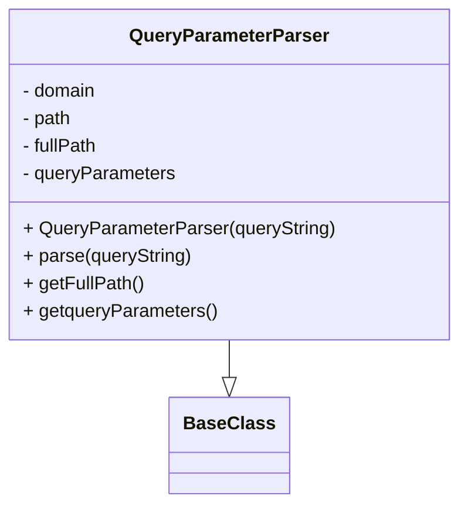

# Diagram: tools/ide_local_testing/localTest/core/QueryParameterParser.py

> Auto-generated by Obscura crawlers

## Mermaid

### SVG

<svg id="container" width="393.0625" xmlns="http://www.w3.org/2000/svg" class="classDiagram" height="438" viewBox="0 0 393.0625 438" role="graphics-document document" aria-roledescription="class"><g><defs><marker id="container_class-aggregationStart" class="marker aggregation class" refX="18" refY="7" markerWidth="190" markerHeight="240" orient="auto"><path d="M 18,7 L9,13 L1,7 L9,1 Z"></path></marker></defs><defs><marker id="container_class-aggregationEnd" class="marker aggregation class" refX="1" refY="7" markerWidth="20" markerHeight="28" orient="auto"><path d="M 18,7 L9,13 L1,7 L9,1 Z"></path></marker></defs><defs><marker id="container_class-extensionStart" class="marker extension class" refX="18" refY="7" markerWidth="190" markerHeight="240" orient="auto"><path d="M 1,7 L18,13 V 1 Z"></path></marker></defs><defs><marker id="container_class-extensionEnd" class="marker extension class" refX="1" refY="7" markerWidth="20" markerHeight="28" orient="auto"><path d="M 1,1 V 13 L18,7 Z"></path></marker></defs><defs><marker id="container_class-compositionStart" class="marker composition class" refX="18" refY="7" markerWidth="190" markerHeight="240" orient="auto"><path d="M 18,7 L9,13 L1,7 L9,1 Z"></path></marker></defs><defs><marker id="container_class-compositionEnd" class="marker composition class" refX="1" refY="7" markerWidth="20" markerHeight="28" orient="auto"><path d="M 18,7 L9,13 L1,7 L9,1 Z"></path></marker></defs><defs><marker id="container_class-dependencyStart" class="marker dependency class" refX="6" refY="7" markerWidth="190" markerHeight="240" orient="auto"><path d="M 5,7 L9,13 L1,7 L9,1 Z"></path></marker></defs><defs><marker id="container_class-dependencyEnd" class="marker dependency class" refX="13" refY="7" markerWidth="20" markerHeight="28" orient="auto"><path d="M 18,7 L9,13 L14,7 L9,1 Z"></path></marker></defs><defs><marker id="container_class-lollipopStart" class="marker lollipop class" refX="13" refY="7" markerWidth="190" markerHeight="240" orient="auto"><circle stroke="black" fill="transparent" cx="7" cy="7" r="6"></circle></marker></defs><defs><marker id="container_class-lollipopEnd" class="marker lollipop class" refX="1" refY="7" markerWidth="190" markerHeight="240" orient="auto"><circle stroke="black" fill="transparent" cx="7" cy="7" r="6"></circle></marker></defs><g class="root"><g class="clusters"></g><g class="edgePaths"><path d="M196.531,296L196.531,300.167C196.531,304.333,196.531,312.667,196.531,318.125C196.531,323.583,196.531,326.167,196.531,327.458L196.531,328.75" id="id_QueryParameterParser_BaseClass_1" class="edge-thickness-normal edge-pattern-solid relation" style=";;;" data-edge="true" data-et="edge" data-id="id_QueryParameterParser_BaseClass_1" data-points="W3sieCI6MTk2LjUzMTI1LCJ5IjoyOTZ9LHsieCI6MTk2LjUzMTI1LCJ5IjozMjF9LHsieCI6MTk2LjUzMTI1LCJ5IjozNDZ9XQ==" marker-end="url(#container_class-extensionEnd)"></path></g><g class="edgeLabels"><g class="edgeLabel"><g class="label" data-id="id_QueryParameterParser_BaseClass_1" transform="translate(0, 0)"><foreignObject width="0" height="0">

</foreignObject></g></g></g><g class="nodes"><g class="node default" id="classId-BaseClass-0" transform="translate(196.53125, 388)"><g class="basic label-container"><path d="M-48.359375 -42 L48.359375 -42 L48.359375 42 L-48.359375 42" stroke="none" stroke-width="0" fill="#ECECFF" style=""></path><path d="M-48.359375 -42 C-12.282031486903769 -42, 23.795312026192462 -42, 48.359375 -42 M-48.359375 -42 C-28.499383792864855 -42, -8.63939258572971 -42, 48.359375 -42 M48.359375 -42 C48.359375 -18.579374918445605, 48.359375 4.841250163108789, 48.359375 42 M48.359375 -42 C48.359375 -22.2925506569166, 48.359375 -2.5851013138331993, 48.359375 42 M48.359375 42 C27.16127129595594 42, 5.963167591911883 42, -48.359375 42 M48.359375 42 C18.83610599551188 42, -10.687163008976242 42, -48.359375 42 M-48.359375 42 C-48.359375 14.954110843209861, -48.359375 -12.091778313580278, -48.359375 -42 M-48.359375 42 C-48.359375 17.98643998330391, -48.359375 -6.02712003339218, -48.359375 -42" stroke="#9370DB" stroke-width="1.3" fill="none" stroke-dasharray="0 0" style=""></path></g><g class="annotation-group text" transform="translate(0, -18)"></g><g class="label-group text" transform="translate(-36.359375, -18)"><g class="label" style="font-weight: bolder" transform="translate(0,-12)"><foreignObject width="72.71875" height="24">

BaseClass

</foreignObject></g></g><g class="members-group text" transform="translate(-36.359375, 30)"></g><g class="methods-group text" transform="translate(-36.359375, 60)"></g><g class="divider" style=""><path d="M-48.359375 6 C-23.06039372576938 6, 2.23858754846124 6, 48.359375 6 M-48.359375 6 C-15.76738596126426 6, 16.82460307747148 6, 48.359375 6" stroke="#9370DB" stroke-width="1.3" fill="none" stroke-dasharray="0 0" style=""></path></g><g class="divider" style=""><path d="M-48.359375 24 C-10.599360948199852 24, 27.160653103600296 24, 48.359375 24 M-48.359375 24 C-16.50873467375249 24, 15.341905652495022 24, 48.359375 24" stroke="#9370DB" stroke-width="1.3" fill="none" stroke-dasharray="0 0" style=""></path></g></g><g class="node default" id="classId-QueryParameterParser-1" transform="translate(196.53125, 152)"><g class="basic label-container"><path d="M-188.53125 -144 L188.53125 -144 L188.53125 144 L-188.53125 144" stroke="none" stroke-width="0" fill="#ECECFF" style=""></path><path d="M-188.53125 -144 C-96.52313879675877 -144, -4.515027593517544 -144, 188.53125 -144 M-188.53125 -144 C-96.24797565310118 -144, -3.9647013062023575 -144, 188.53125 -144 M188.53125 -144 C188.53125 -47.32229925748473, 188.53125 49.35540148503054, 188.53125 144 M188.53125 -144 C188.53125 -61.32743227977021, 188.53125 21.345135440459586, 188.53125 144 M188.53125 144 C84.94758370363192 144, -18.63608259273616 144, -188.53125 144 M188.53125 144 C56.907230898636044 144, -74.71678820272791 144, -188.53125 144 M-188.53125 144 C-188.53125 28.833172415440686, -188.53125 -86.33365516911863, -188.53125 -144 M-188.53125 144 C-188.53125 35.42710391568306, -188.53125 -73.14579216863388, -188.53125 -144" stroke="#9370DB" stroke-width="1.3" fill="none" stroke-dasharray="0 0" style=""></path></g><g class="annotation-group text" transform="translate(0, -120)"></g><g class="label-group text" transform="translate(-83.0625, -120)"><g class="label" style="font-weight: bolder" transform="translate(0,-12)"><foreignObject width="166.125" height="24">

QueryParameterParser

</foreignObject></g></g><g class="members-group text" transform="translate(-176.53125, -72)"><g class="label" style="" transform="translate(0,-12)"><foreignObject width="65.90625" height="24">

- domain

</foreignObject></g><g class="label" style="" transform="translate(0,12)"><foreignObject width="43.890625" height="24">

- path

</foreignObject></g><g class="label" style="" transform="translate(0,36)"><foreignObject width="67.015625" height="24">

- fullPath

</foreignObject></g><g class="label" style="" transform="translate(0,60)"><foreignObject width="133.875" height="24">

- queryParameters

</foreignObject></g></g><g class="methods-group text" transform="translate(-176.53125, 48)"><g class="label" style="" transform="translate(0,-12)"><foreignObject width="270" height="24">

+ QueryParameterParser(queryString)

</foreignObject></g><g class="label" style="" transform="translate(0,12)"><foreignObject width="147.296875" height="24">

+ parse(queryString)

</foreignObject></g><g class="label" style="" transform="translate(0,36)"><foreignObject width="103.390625" height="24">

+ getFullPath()

</foreignObject></g><g class="label" style="" transform="translate(0,60)"><foreignObject width="168.109375" height="24">

+ getqueryParameters()

</foreignObject></g></g><g class="divider" style=""><path d="M-188.53125 -96 C-106.41520367282871 -96, -24.29915734565742 -96, 188.53125 -96 M-188.53125 -96 C-72.51975325717939 -96, 43.49174348564122 -96, 188.53125 -96" stroke="#9370DB" stroke-width="1.3" fill="none" stroke-dasharray="0 0" style=""></path></g><g class="divider" style=""><path d="M-188.53125 24 C-39.45472038519165 24, 109.6218092296167 24, 188.53125 24 M-188.53125 24 C-62.77694287527174 24, 62.977364249456514 24, 188.53125 24" stroke="#9370DB" stroke-width="1.3" fill="none" stroke-dasharray="0 0" style=""></path></g></g></g></g></g></svg>
