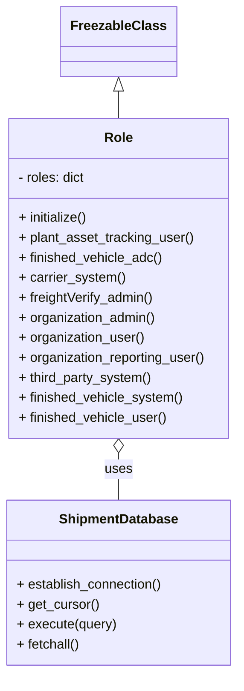

# Diagram: tools/ide_local_testing/localTest/core/Role.py

> Auto-generated by Obscura crawlers

## Mermaid

### SVG

<svg id="container" width="286.7890625" xmlns="http://www.w3.org/2000/svg" class="classDiagram" height="806" viewBox="0 0 286.7890625 806" role="graphics-document document" aria-roledescription="class"><g><defs><marker id="container_class-aggregationStart" class="marker aggregation class" refX="18" refY="7" markerWidth="190" markerHeight="240" orient="auto"><path d="M 18,7 L9,13 L1,7 L9,1 Z"></path></marker></defs><defs><marker id="container_class-aggregationEnd" class="marker aggregation class" refX="1" refY="7" markerWidth="20" markerHeight="28" orient="auto"><path d="M 18,7 L9,13 L1,7 L9,1 Z"></path></marker></defs><defs><marker id="container_class-extensionStart" class="marker extension class" refX="18" refY="7" markerWidth="190" markerHeight="240" orient="auto"><path d="M 1,7 L18,13 V 1 Z"></path></marker></defs><defs><marker id="container_class-extensionEnd" class="marker extension class" refX="1" refY="7" markerWidth="20" markerHeight="28" orient="auto"><path d="M 1,1 V 13 L18,7 Z"></path></marker></defs><defs><marker id="container_class-compositionStart" class="marker composition class" refX="18" refY="7" markerWidth="190" markerHeight="240" orient="auto"><path d="M 18,7 L9,13 L1,7 L9,1 Z"></path></marker></defs><defs><marker id="container_class-compositionEnd" class="marker composition class" refX="1" refY="7" markerWidth="20" markerHeight="28" orient="auto"><path d="M 18,7 L9,13 L1,7 L9,1 Z"></path></marker></defs><defs><marker id="container_class-dependencyStart" class="marker dependency class" refX="6" refY="7" markerWidth="190" markerHeight="240" orient="auto"><path d="M 5,7 L9,13 L1,7 L9,1 Z"></path></marker></defs><defs><marker id="container_class-dependencyEnd" class="marker dependency class" refX="13" refY="7" markerWidth="20" markerHeight="28" orient="auto"><path d="M 18,7 L9,13 L14,7 L9,1 Z"></path></marker></defs><defs><marker id="container_class-lollipopStart" class="marker lollipop class" refX="13" refY="7" markerWidth="190" markerHeight="240" orient="auto"><circle stroke="black" fill="transparent" cx="7" cy="7" r="6"></circle></marker></defs><defs><marker id="container_class-lollipopEnd" class="marker lollipop class" refX="1" refY="7" markerWidth="190" markerHeight="240" orient="auto"><circle stroke="black" fill="transparent" cx="7" cy="7" r="6"></circle></marker></defs><g class="root"><g class="clusters"></g><g class="edgePaths"><path d="M143.395,109.25L143.395,110.542C143.395,111.833,143.395,114.417,143.395,119.875C143.395,125.333,143.395,133.667,143.395,137.833L143.395,142" id="id_FreezableClass_Role_1" class="edge-thickness-normal edge-pattern-solid relation" style=";;;" data-edge="true" data-et="edge" data-id="id_FreezableClass_Role_1" data-points="W3sieCI6MTQzLjM5NDUzMTI1LCJ5Ijo5Mn0seyJ4IjoxNDMuMzk0NTMxMjUsInkiOjExN30seyJ4IjoxNDMuMzk0NTMxMjUsInkiOjE0Mn1d" marker-start="url(#container_class-extensionStart)"></path><path d="M143.395,543.25L143.395,546.542C143.395,549.833,143.395,556.417,143.395,565.875C143.395,575.333,143.395,587.667,143.395,593.833L143.395,600" id="id_Role_ShipmentDatabase_2" class="edge-thickness-normal edge-pattern-solid relation" style=";;;" data-edge="true" data-et="edge" data-id="id_Role_ShipmentDatabase_2" data-points="W3sieCI6MTQzLjM5NDUzMTI1LCJ5Ijo1MjZ9LHsieCI6MTQzLjM5NDUzMTI1LCJ5Ijo1NjN9LHsieCI6MTQzLjM5NDUzMTI1LCJ5Ijo2MDB9XQ==" marker-start="url(#container_class-aggregationStart)"></path></g><g class="edgeLabels"><g class="edgeLabel"><g class="label" data-id="id_FreezableClass_Role_1" transform="translate(0, 0)"><foreignObject width="0" height="0">

</foreignObject></g></g><g class="edgeLabel" transform="translate(143.39453125, 563)"><g class="label" data-id="id_Role_ShipmentDatabase_2" transform="translate(-16.4921875, -12)"><foreignObject width="32.984375" height="24">

uses

</foreignObject></g></g></g><g class="nodes"><g class="node default" id="classId-FreezableClass-0" transform="translate(143.39453125, 50)"><g class="basic label-container"><path d="M-65.640625 -42 L65.640625 -42 L65.640625 42 L-65.640625 42" stroke="none" stroke-width="0" fill="#ECECFF" style=""></path><path d="M-65.640625 -42 C-34.65900411671302 -42, -3.677383233426042 -42, 65.640625 -42 M-65.640625 -42 C-31.829746112902626 -42, 1.981132774194748 -42, 65.640625 -42 M65.640625 -42 C65.640625 -12.258681474398372, 65.640625 17.482637051203255, 65.640625 42 M65.640625 -42 C65.640625 -21.009370021627305, 65.640625 -0.018740043254609873, 65.640625 42 M65.640625 42 C38.15292649055537 42, 10.665227981110753 42, -65.640625 42 M65.640625 42 C26.975449539432525 42, -11.68972592113495 42, -65.640625 42 M-65.640625 42 C-65.640625 17.147051917650458, -65.640625 -7.705896164699084, -65.640625 -42 M-65.640625 42 C-65.640625 20.592186863524653, -65.640625 -0.8156262729506949, -65.640625 -42" stroke="#9370DB" stroke-width="1.3" fill="none" stroke-dasharray="0 0" style=""></path></g><g class="annotation-group text" transform="translate(0, -18)"></g><g class="label-group text" transform="translate(-53.640625, -18)"><g class="label" style="font-weight: bolder" transform="translate(0,-12)"><foreignObject width="107.28125" height="24">

FreezableClass

</foreignObject></g></g><g class="members-group text" transform="translate(-53.640625, 30)"></g><g class="methods-group text" transform="translate(-53.640625, 60)"></g><g class="divider" style=""><path d="M-65.640625 6 C-13.7863369048722 6, 38.0679511902556 6, 65.640625 6 M-65.640625 6 C-28.069273663075343 6, 9.502077673849314 6, 65.640625 6" stroke="#9370DB" stroke-width="1.3" fill="none" stroke-dasharray="0 0" style=""></path></g><g class="divider" style=""><path d="M-65.640625 24 C-15.98357411021209 24, 33.67347677957582 24, 65.640625 24 M-65.640625 24 C-20.12498678821987 24, 25.390651423560257 24, 65.640625 24" stroke="#9370DB" stroke-width="1.3" fill="none" stroke-dasharray="0 0" style=""></path></g></g><g class="node default" id="classId-Role-1" transform="translate(143.39453125, 334)"><g class="basic label-container"><path d="M-134.33984375 -192 L134.33984375 -192 L134.33984375 192 L-134.33984375 192" stroke="none" stroke-width="0" fill="#ECECFF" style=""></path><path d="M-134.33984375 -192 C-72.16925128866538 -192, -9.998658827330772 -192, 134.33984375 -192 M-134.33984375 -192 C-73.57246613859598 -192, -12.80508852719197 -192, 134.33984375 -192 M134.33984375 -192 C134.33984375 -44.648189607431306, 134.33984375 102.70362078513739, 134.33984375 192 M134.33984375 -192 C134.33984375 -108.53421201214285, 134.33984375 -25.06842402428569, 134.33984375 192 M134.33984375 192 C50.46622832002929 192, -33.407387109941425 192, -134.33984375 192 M134.33984375 192 C61.09195329780067 192, -12.155937154398657 192, -134.33984375 192 M-134.33984375 192 C-134.33984375 39.68026984991863, -134.33984375 -112.63946030016274, -134.33984375 -192 M-134.33984375 192 C-134.33984375 93.09977871594724, -134.33984375 -5.800442568105524, -134.33984375 -192" stroke="#9370DB" stroke-width="1.3" fill="none" stroke-dasharray="0 0" style=""></path></g><g class="annotation-group text" transform="translate(0, -168)"></g><g class="label-group text" transform="translate(-16.2421875, -168)"><g class="label" style="font-weight: bolder" transform="translate(0,-12)"><foreignObject width="32.484375" height="24">

Role

</foreignObject></g></g><g class="members-group text" transform="translate(-122.33984375, -120)"><g class="label" style="" transform="translate(0,-12)"><foreignObject width="82.125" height="24">

- roles: dict

</foreignObject></g></g><g class="methods-group text" transform="translate(-122.33984375, -72)"><g class="label" style="" transform="translate(0,-12)"><foreignObject width="84.625" height="24">

+ initialize()

</foreignObject></g><g class="label" style="" transform="translate(0,12)"><foreignObject width="212.28125" height="24">

+ plant_asset_tracking_user()

</foreignObject></g><g class="label" style="" transform="translate(0,36)"><foreignObject width="173.65625" height="24">

+ finished_vehicle_adc()

</foreignObject></g><g class="label" style="" transform="translate(0,60)"><foreignObject width="127.984375" height="24">

+ carrier_system()

</foreignObject></g><g class="label" style="" transform="translate(0,84)"><foreignObject width="164.890625" height="24">

+ freightVerify_admin()

</foreignObject></g><g class="label" style="" transform="translate(0,108)"><foreignObject width="166.828125" height="24">

+ organization_admin()

</foreignObject></g><g class="label" style="" transform="translate(0,132)"><foreignObject width="152.625" height="24">

+ organization_user()

</foreignObject></g><g class="label" style="" transform="translate(0,156)"><foreignObject width="228.4375" height="24">

+ organization_reporting_user()

</foreignObject></g><g class="label" style="" transform="translate(0,180)"><foreignObject width="161.875" height="24">

+ third_party_system()

</foreignObject></g><g class="label" style="" transform="translate(0,204)"><foreignObject width="198.453125" height="24">

+ finished_vehicle_system()

</foreignObject></g><g class="label" style="" transform="translate(0,228)"><foreignObject width="179.421875" height="24">

+ finished_vehicle_user()

</foreignObject></g></g><g class="divider" style=""><path d="M-134.33984375 -144 C-51.29393152625103 -144, 31.75198069749794 -144, 134.33984375 -144 M-134.33984375 -144 C-69.18605272018554 -144, -4.032261690371087 -144, 134.33984375 -144" stroke="#9370DB" stroke-width="1.3" fill="none" stroke-dasharray="0 0" style=""></path></g><g class="divider" style=""><path d="M-134.33984375 -96 C-41.61592619029311 -96, 51.10799136941378 -96, 134.33984375 -96 M-134.33984375 -96 C-27.85165285500318 -96, 78.63653803999364 -96, 134.33984375 -96" stroke="#9370DB" stroke-width="1.3" fill="none" stroke-dasharray="0 0" style=""></path></g></g><g class="node default" id="classId-ShipmentDatabase-2" transform="translate(143.39453125, 699)"><g class="basic label-container"><path d="M-135.39453125 -99 L135.39453125 -99 L135.39453125 99 L-135.39453125 99" stroke="none" stroke-width="0" fill="#ECECFF" style=""></path><path d="M-135.39453125 -99 C-65.99105465729681 -99, 3.412421935406371 -99, 135.39453125 -99 M-135.39453125 -99 C-63.678746397648766 -99, 8.037038454702468 -99, 135.39453125 -99 M135.39453125 -99 C135.39453125 -22.938953144748567, 135.39453125 53.12209371050287, 135.39453125 99 M135.39453125 -99 C135.39453125 -41.93745162803431, 135.39453125 15.12509674393138, 135.39453125 99 M135.39453125 99 C46.73901669972243 99, -41.916497850555146 99, -135.39453125 99 M135.39453125 99 C78.48564107892098 99, 21.576750907841955 99, -135.39453125 99 M-135.39453125 99 C-135.39453125 29.985237316239534, -135.39453125 -39.02952536752093, -135.39453125 -99 M-135.39453125 99 C-135.39453125 54.556229239539675, -135.39453125 10.11245847907935, -135.39453125 -99" stroke="#9370DB" stroke-width="1.3" fill="none" stroke-dasharray="0 0" style=""></path></g><g class="annotation-group text" transform="translate(0, -75)"></g><g class="label-group text" transform="translate(-69.2734375, -75)"><g class="label" style="font-weight: bolder" transform="translate(0,-12)"><foreignObject width="138.546875" height="24">

ShipmentDatabase

</foreignObject></g></g><g class="members-group text" transform="translate(-123.39453125, -27)"></g><g class="methods-group text" transform="translate(-123.39453125, 3)"><g class="label" style="" transform="translate(0,-12)"><foreignObject width="177.515625" height="24">

+ establish_connection()

</foreignObject></g><g class="label" style="" transform="translate(0,12)"><foreignObject width="98.890625" height="24">

+ get_cursor()

</foreignObject></g><g class="label" style="" transform="translate(0,36)"><foreignObject width="120.21875" height="24">

+ execute(query)

</foreignObject></g><g class="label" style="" transform="translate(0,60)"><foreignObject width="77" height="24">

+ fetchall()

</foreignObject></g></g><g class="divider" style=""><path d="M-135.39453125 -51 C-50.380863022151544 -51, 34.63280520569691 -51, 135.39453125 -51 M-135.39453125 -51 C-47.32256500177729 -51, 40.749401246445416 -51, 135.39453125 -51" stroke="#9370DB" stroke-width="1.3" fill="none" stroke-dasharray="0 0" style=""></path></g><g class="divider" style=""><path d="M-135.39453125 -27 C-66.89526590759488 -27, 1.6039994348102482 -27, 135.39453125 -27 M-135.39453125 -27 C-59.84790042249192 -27, 15.698730405016164 -27, 135.39453125 -27" stroke="#9370DB" stroke-width="1.3" fill="none" stroke-dasharray="0 0" style=""></path></g></g></g></g></g></svg>
