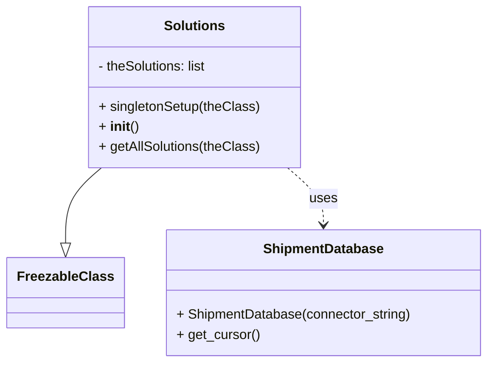

# Diagram: tools/ide_local_testing/localTest/core/Solutions.py


> Auto-generated by Obscura crawlers

## Diagram 1



### SVG

<svg id="container" width="571.6640625" xmlns="http://www.w3.org/2000/svg" class="classDiagram" height="432" viewBox="0 0 571.6640625 432" role="graphics-document document" aria-roledescription="class"><style>#container{font-family:"trebuchet ms",verdana,arial,sans-serif;font-size:16px;fill:#333;}@keyframes edge-animation-frame{from{stroke-dashoffset:0;}}@keyframes dash{to{stroke-dashoffset:0;}}#container .edge-animation-slow{stroke-dasharray:9,5!important;stroke-dashoffset:900;animation:dash 50s linear infinite;stroke-linecap:round;}#container .edge-animation-fast{stroke-dasharray:9,5!important;stroke-dashoffset:900;animation:dash 20s linear infinite;stroke-linecap:round;}#container .error-icon{fill:#552222;}#container .error-text{fill:#552222;stroke:#552222;}#container .edge-thickness-normal{stroke-width:1px;}#container .edge-thickness-thick{stroke-width:3.5px;}#container .edge-pattern-solid{stroke-dasharray:0;}#container .edge-thickness-invisible{stroke-width:0;fill:none;}#container .edge-pattern-dashed{stroke-dasharray:3;}#container .edge-pattern-dotted{stroke-dasharray:2;}#container .marker{fill:#333333;stroke:#333333;}#container .marker.cross{stroke:#333333;}#container svg{font-family:"trebuchet ms",verdana,arial,sans-serif;font-size:16px;}#container p{margin:0;}#container g.classGroup text{fill:#9370DB;stroke:none;font-family:"trebuchet ms",verdana,arial,sans-serif;font-size:10px;}#container g.classGroup text .title{font-weight:bolder;}#container .nodeLabel,#container .edgeLabel{color:#131300;}#container .edgeLabel .label rect{fill:#ECECFF;}#container .label text{fill:#131300;}#container .labelBkg{background:#ECECFF;}#container .edgeLabel .label span{background:#ECECFF;}#container .classTitle{font-weight:bolder;}#container .node rect,#container .node circle,#container .node ellipse,#container .node polygon,#container .node path{fill:#ECECFF;stroke:#9370DB;stroke-width:1px;}#container .divider{stroke:#9370DB;stroke-width:1;}#container g.clickable{cursor:pointer;}#container g.classGroup rect{fill:#ECECFF;stroke:#9370DB;}#container g.classGroup line{stroke:#9370DB;stroke-width:1;}#container .classLabel .box{stroke:none;stroke-width:0;fill:#ECECFF;opacity:0.5;}#container .classLabel .label{fill:#9370DB;font-size:10px;}#container .relation{stroke:#333333;stroke-width:1;fill:none;}#container .dashed-line{stroke-dasharray:3;}#container .dotted-line{stroke-dasharray:1 2;}#container #compositionStart,#container .composition{fill:#333333!important;stroke:#333333!important;stroke-width:1;}#container #compositionEnd,#container .composition{fill:#333333!important;stroke:#333333!important;stroke-width:1;}#container #dependencyStart,#container .dependency{fill:#333333!important;stroke:#333333!important;stroke-width:1;}#container #dependencyStart,#container .dependency{fill:#333333!important;stroke:#333333!important;stroke-width:1;}#container #extensionStart,#container .extension{fill:transparent!important;stroke:#333333!important;stroke-width:1;}#container #extensionEnd,#container .extension{fill:transparent!important;stroke:#333333!important;stroke-width:1;}#container #aggregationStart,#container .aggregation{fill:transparent!important;stroke:#333333!important;stroke-width:1;}#container #aggregationEnd,#container .aggregation{fill:transparent!important;stroke:#333333!important;stroke-width:1;}#container #lollipopStart,#container .lollipop{fill:#ECECFF!important;stroke:#333333!important;stroke-width:1;}#container #lollipopEnd,#container .lollipop{fill:#ECECFF!important;stroke:#333333!important;stroke-width:1;}#container .edgeTerminals{font-size:11px;line-height:initial;}#container .classTitleText{text-anchor:middle;font-size:18px;fill:#333;}#container .label-icon{display:inline-block;height:1em;overflow:visible;vertical-align:-0.125em;}#container .node .label-icon path{fill:currentColor;stroke:revert;stroke-width:revert;}#container :root{--mermaid-font-family:"trebuchet ms",verdana,arial,sans-serif;}</style><g><defs><marker id="container_class-aggregationStart" class="marker aggregation class" refX="18" refY="7" markerWidth="190" markerHeight="240" orient="auto"><path d="M 18,7 L9,13 L1,7 L9,1 Z"></path></marker></defs><defs><marker id="container_class-aggregationEnd" class="marker aggregation class" refX="1" refY="7" markerWidth="20" markerHeight="28" orient="auto"><path d="M 18,7 L9,13 L1,7 L9,1 Z"></path></marker></defs><defs><marker id="container_class-extensionStart" class="marker extension class" refX="18" refY="7" markerWidth="190" markerHeight="240" orient="auto"><path d="M 1,7 L18,13 V 1 Z"></path></marker></defs><defs><marker id="container_class-extensionEnd" class="marker extension class" refX="1" refY="7" markerWidth="20" markerHeight="28" orient="auto"><path d="M 1,1 V 13 L18,7 Z"></path></marker></defs><defs><marker id="container_class-compositionStart" class="marker composition class" refX="18" refY="7" markerWidth="190" markerHeight="240" orient="auto"><path d="M 18,7 L9,13 L1,7 L9,1 Z"></path></marker></defs><defs><marker id="container_class-compositionEnd" class="marker composition class" refX="1" refY="7" markerWidth="20" markerHeight="28" orient="auto"><path d="M 18,7 L9,13 L1,7 L9,1 Z"></path></marker></defs><defs><marker id="container_class-dependencyStart" class="marker dependency class" refX="6" refY="7" markerWidth="190" markerHeight="240" orient="auto"><path d="M 5,7 L9,13 L1,7 L9,1 Z"></path></marker></defs><defs><marker id="container_class-dependencyEnd" class="marker dependency class" refX="13" refY="7" markerWidth="20" markerHeight="28" orient="auto"><path d="M 18,7 L9,13 L14,7 L9,1 Z"></path></marker></defs><defs><marker id="container_class-lollipopStart" class="marker lollipop class" refX="13" refY="7" markerWidth="190" markerHeight="240" orient="auto"><circle stroke="black" fill="transparent" cx="7" cy="7" r="6"></circle></marker></defs><defs><marker id="container_class-lollipopEnd" class="marker lollipop class" refX="1" refY="7" markerWidth="190" markerHeight="240" orient="auto"><circle stroke="black" fill="transparent" cx="7" cy="7" r="6"></circle></marker></defs><g class="root"><g class="clusters"></g><g class="edgePaths"><path d="M115.764,200L108.743,206.167C101.723,212.333,87.682,224.667,80.661,239.625C73.641,254.583,73.641,272.167,73.641,280.958L73.641,289.75" id="id_Solutions_FreezableClass_1" class="edge-thickness-normal edge-pattern-solid relation" style=";;;" data-edge="true" data-et="edge" data-id="id_Solutions_FreezableClass_1" data-points="W3sieCI6MTE1Ljc2Mzg3NzQ2NzEwNTI2LCJ5IjoyMDB9LHsieCI6NzMuNjQwNjI1LCJ5IjoyMzd9LHsieCI6NzMuNjQwNjI1LCJ5IjozMDd9XQ==" marker-end="url(#container_class-extensionEnd)"></path><path d="M334.349,200L341.37,206.167C348.39,212.333,362.432,224.667,369.452,236C376.473,247.333,376.473,257.667,376.473,262.833L376.473,268" id="id_Solutions_ShipmentDatabase_2" class="edge-thickness-normal edge-pattern-dashed relation" style=";;;" data-edge="true" data-et="edge" data-id="id_Solutions_ShipmentDatabase_2" data-points="W3sieCI6MzM0LjM0OTQwMzc4Mjg5NDc0LCJ5IjoyMDB9LHsieCI6Mzc2LjQ3MjY1NjI1LCJ5IjoyMzd9LHsieCI6Mzc2LjQ3MjY1NjI1LCJ5IjoyNzR9XQ==" marker-end="url(#container_class-dependencyEnd)"></path></g><g class="edgeLabels"><g class="edgeLabel"><g class="label" data-id="id_Solutions_FreezableClass_1" transform="translate(0, 0)"><foreignObject width="0" height="0"><div xmlns="http://www.w3.org/1999/xhtml" class="labelBkg" style="display: table-cell; white-space: nowrap; line-height: 1.5; max-width: 200px; text-align: center;"><span class="edgeLabel"></span></div></foreignObject></g></g><g class="edgeLabel" transform="translate(376.47265625, 237)"><g class="label" data-id="id_Solutions_ShipmentDatabase_2" transform="translate(-16.4921875, -12)"><foreignObject width="32.984375" height="24"><div xmlns="http://www.w3.org/1999/xhtml" class="labelBkg" style="display: table-cell; white-space: nowrap; line-height: 1.5; max-width: 200px; text-align: center;"><span class="edgeLabel"><p>uses</p></span></div></foreignObject></g></g></g><g class="nodes"><g class="node default" id="classId-Solutions-0" transform="translate(225.056640625, 104)"><g class="basic label-container"><path d="M-125.78125 -96 L125.78125 -96 L125.78125 96 L-125.78125 96" stroke="none" stroke-width="0" fill="#ECECFF" style=""></path><path d="M-125.78125 -96 C-36.61078233201643 -96, 52.559685335967146 -96, 125.78125 -96 M-125.78125 -96 C-30.27121510237893 -96, 65.23881979524214 -96, 125.78125 -96 M125.78125 -96 C125.78125 -51.835549530685036, 125.78125 -7.671099061370072, 125.78125 96 M125.78125 -96 C125.78125 -37.15519135298992, 125.78125 21.689617294020167, 125.78125 96 M125.78125 96 C25.260969284797156 96, -75.25931143040569 96, -125.78125 96 M125.78125 96 C39.71895009923469 96, -46.34334980153062 96, -125.78125 96 M-125.78125 96 C-125.78125 29.165943194426944, -125.78125 -37.66811361114611, -125.78125 -96 M-125.78125 96 C-125.78125 56.80630048780355, -125.78125 17.612600975607094, -125.78125 -96" stroke="#9370DB" stroke-width="1.3" fill="none" stroke-dasharray="0 0" style=""></path></g><g class="annotation-group text" transform="translate(0, -72)"></g><g class="label-group text" transform="translate(-34.703125, -72)"><g class="label" style="font-weight: bolder" transform="translate(0,-12)"><foreignObject width="69.40625" height="24"><div xmlns="http://www.w3.org/1999/xhtml" style="display: table-cell; white-space: nowrap; line-height: 1.5; max-width: 119px; text-align: center;"><span class="nodeLabel markdown-node-label" style=""><p>Solutions</p></span></div></foreignObject></g></g><g class="members-group text" transform="translate(-113.78125, -24)"><g class="label" style="" transform="translate(0,-12)"><foreignObject width="133.640625" height="24"><div xmlns="http://www.w3.org/1999/xhtml" style="display: table-cell; white-space: nowrap; line-height: 1.5; max-width: 191px; text-align: center;"><span class="nodeLabel markdown-node-label" style=""><p>- theSolutions: list</p></span></div></foreignObject></g></g><g class="methods-group text" transform="translate(-113.78125, 24)"><g class="label" style="" transform="translate(0,-12)"><foreignObject width="192.5" height="24"><div xmlns="http://www.w3.org/1999/xhtml" style="display: table-cell; white-space: nowrap; line-height: 1.5; max-width: 250px; text-align: center;"><span class="nodeLabel markdown-node-label" style=""><p>+ singletonSetup(theClass)</p></span></div></foreignObject></g><g class="label" style="" transform="translate(0,12)"><foreignObject width="47.046875" height="24"><div xmlns="http://www.w3.org/1999/xhtml" style="display: table-cell; white-space: nowrap; line-height: 1.5; max-width: 137px; text-align: center;"><span class="nodeLabel markdown-node-label" style=""><p>+ <strong>init</strong>()</p></span></div></foreignObject></g><g class="label" style="" transform="translate(0,36)"><foreignObject width="192.859375" height="24"><div xmlns="http://www.w3.org/1999/xhtml" style="display: table-cell; white-space: nowrap; line-height: 1.5; max-width: 250px; text-align: center;"><span class="nodeLabel markdown-node-label" style=""><p>+ getAllSolutions(theClass)</p></span></div></foreignObject></g></g><g class="divider" style=""><path d="M-125.78125 -48 C-72.50379758490169 -48, -19.226345169803395 -48, 125.78125 -48 M-125.78125 -48 C-39.092921850097895 -48, 47.59540629980421 -48, 125.78125 -48" stroke="#9370DB" stroke-width="1.3" fill="none" stroke-dasharray="0 0" style=""></path></g><g class="divider" style=""><path d="M-125.78125 0 C-38.401537302818 0, 48.978175394364 0, 125.78125 0 M-125.78125 0 C-73.98216166602306 0, -22.18307333204612 0, 125.78125 0" stroke="#9370DB" stroke-width="1.3" fill="none" stroke-dasharray="0 0" style=""></path></g></g><g class="node default" id="classId-FreezableClass-1" transform="translate(73.640625, 349)"><g class="basic label-container"><path d="M-65.640625 -42 L65.640625 -42 L65.640625 42 L-65.640625 42" stroke="none" stroke-width="0" fill="#ECECFF" style=""></path><path d="M-65.640625 -42 C-29.796399639017984 -42, 6.047825721964031 -42, 65.640625 -42 M-65.640625 -42 C-13.850639143013353 -42, 37.93934671397329 -42, 65.640625 -42 M65.640625 -42 C65.640625 -17.856696250369954, 65.640625 6.286607499260093, 65.640625 42 M65.640625 -42 C65.640625 -20.146962771471358, 65.640625 1.7060744570572837, 65.640625 42 M65.640625 42 C15.666254968162868 42, -34.308115063674265 42, -65.640625 42 M65.640625 42 C36.29045341851949 42, 6.940281837038988 42, -65.640625 42 M-65.640625 42 C-65.640625 17.727745302259983, -65.640625 -6.544509395480034, -65.640625 -42 M-65.640625 42 C-65.640625 12.636534738635586, -65.640625 -16.72693052272883, -65.640625 -42" stroke="#9370DB" stroke-width="1.3" fill="none" stroke-dasharray="0 0" style=""></path></g><g class="annotation-group text" transform="translate(0, -18)"></g><g class="label-group text" transform="translate(-53.640625, -18)"><g class="label" style="font-weight: bolder" transform="translate(0,-12)"><foreignObject width="107.28125" height="24"><div xmlns="http://www.w3.org/1999/xhtml" style="display: table-cell; white-space: nowrap; line-height: 1.5; max-width: 155px; text-align: center;"><span class="nodeLabel markdown-node-label" style=""><p>FreezableClass</p></span></div></foreignObject></g></g><g class="members-group text" transform="translate(-53.640625, 30)"></g><g class="methods-group text" transform="translate(-53.640625, 60)"></g><g class="divider" style=""><path d="M-65.640625 6 C-32.91272806488349 6, -0.1848311297669767 6, 65.640625 6 M-65.640625 6 C-14.335670911795198 6, 36.969283176409604 6, 65.640625 6" stroke="#9370DB" stroke-width="1.3" fill="none" stroke-dasharray="0 0" style=""></path></g><g class="divider" style=""><path d="M-65.640625 24 C-17.437295712951105 24, 30.76603357409779 24, 65.640625 24 M-65.640625 24 C-36.16764804913345 24, -6.694671098266902 24, 65.640625 24" stroke="#9370DB" stroke-width="1.3" fill="none" stroke-dasharray="0 0" style=""></path></g></g><g class="node default" id="classId-ShipmentDatabase-2" transform="translate(376.47265625, 349)"><g class="basic label-container"><path d="M-187.19140625 -75 L187.19140625 -75 L187.19140625 75 L-187.19140625 75" stroke="none" stroke-width="0" fill="#ECECFF" style=""></path><path d="M-187.19140625 -75 C-101.22026284413747 -75, -15.249119438274931 -75, 187.19140625 -75 M-187.19140625 -75 C-109.47308397885072 -75, -31.754761707701448 -75, 187.19140625 -75 M187.19140625 -75 C187.19140625 -31.08207637643146, 187.19140625 12.835847247137082, 187.19140625 75 M187.19140625 -75 C187.19140625 -44.90574481957134, 187.19140625 -14.811489639142671, 187.19140625 75 M187.19140625 75 C45.23132871563726 75, -96.72874881872548 75, -187.19140625 75 M187.19140625 75 C37.60414295523151 75, -111.98312033953698 75, -187.19140625 75 M-187.19140625 75 C-187.19140625 15.24127301365774, -187.19140625 -44.51745397268452, -187.19140625 -75 M-187.19140625 75 C-187.19140625 27.953292268446873, -187.19140625 -19.093415463106254, -187.19140625 -75" stroke="#9370DB" stroke-width="1.3" fill="none" stroke-dasharray="0 0" style=""></path></g><g class="annotation-group text" transform="translate(0, -51)"></g><g class="label-group text" transform="translate(-69.2734375, -51)"><g class="label" style="font-weight: bolder" transform="translate(0,-12)"><foreignObject width="138.546875" height="24"><div xmlns="http://www.w3.org/1999/xhtml" style="display: table-cell; white-space: nowrap; line-height: 1.5; max-width: 187px; text-align: center;"><span class="nodeLabel markdown-node-label" style=""><p>ShipmentDatabase</p></span></div></foreignObject></g></g><g class="members-group text" transform="translate(-175.19140625, -3)"></g><g class="methods-group text" transform="translate(-175.19140625, 27)"><g class="label" style="" transform="translate(0,-12)"><foreignObject width="281.109375" height="24"><div xmlns="http://www.w3.org/1999/xhtml" style="display: table-cell; white-space: nowrap; line-height: 1.5; max-width: 338px; text-align: center;"><span class="nodeLabel markdown-node-label" style=""><p>+ ShipmentDatabase(connector_string)</p></span></div></foreignObject></g><g class="label" style="" transform="translate(0,12)"><foreignObject width="98.890625" height="24"><div xmlns="http://www.w3.org/1999/xhtml" style="display: table-cell; white-space: nowrap; line-height: 1.5; max-width: 156px; text-align: center;"><span class="nodeLabel markdown-node-label" style=""><p>+ get_cursor()</p></span></div></foreignObject></g></g><g class="divider" style=""><path d="M-187.19140625 -27 C-42.62129207617292 -27, 101.94882209765416 -27, 187.19140625 -27 M-187.19140625 -27 C-108.45966300704539 -27, -29.727919764090785 -27, 187.19140625 -27" stroke="#9370DB" stroke-width="1.3" fill="none" stroke-dasharray="0 0" style=""></path></g><g class="divider" style=""><path d="M-187.19140625 -3 C-85.96315076874983 -3, 15.265104712500346 -3, 187.19140625 -3 M-187.19140625 -3 C-106.01101567673243 -3, -24.830625103464854 -3, 187.19140625 -3" stroke="#9370DB" stroke-width="1.3" fill="none" stroke-dasharray="0 0" style=""></path></g></g></g></g></g></svg>

## Diagram 2

```mermaid
flowchart TD
    Start([Start])
    CheckSolutions{Solutions.theSolutions empty?}
    CallSetup[/Call Solutions.singletonSetup()/]
    CreateConnector[/ShipmentDatabase("getFeatures.test")/]
    ExecuteQuery[/cursor.execute("SELECT EXTERNAL_ID FROM solution WHERE external_id IS NOT NULL")/]
    FetchRows[/rows = cursor.fetchall()/]
    AppendLoop[/for solution in rows: theClass.theSolutions.append(solution.external_id)/]
    End([End])

    Start --> CheckSolutions
    CheckSolutions -- Yes --> CallSetup
    CheckSolutions -- No --> End
    CallSetup --> CreateConnector --> ExecuteQuery --> FetchRows --> AppendLoop --> End
```

> SVG rendering failed for this diagram.
