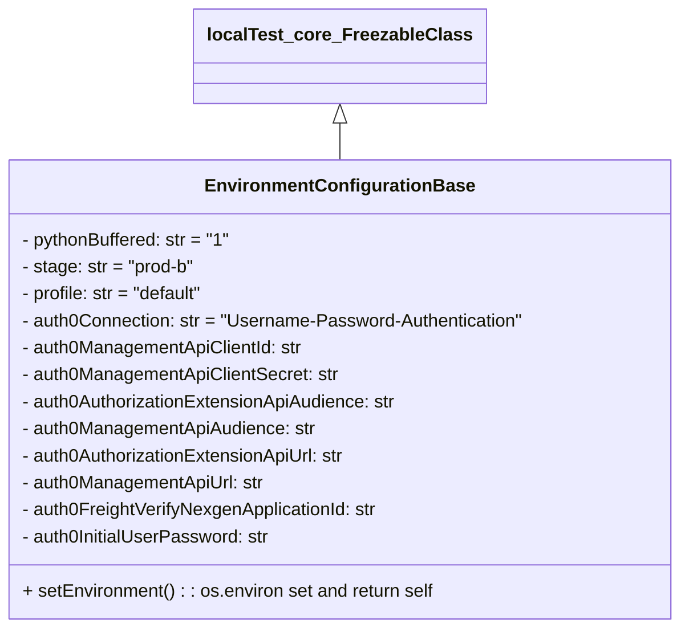

# Diagram: tools/ide_local_testing/localTest/core/environment/EnvironmentConfigurationBase.py

> Auto-generated by Obscura crawlers

## Mermaid

### SVG

<svg id="container" width="605.6328125" xmlns="http://www.w3.org/2000/svg" class="classDiagram" height="558" viewBox="0 0 605.6328125 558" role="graphics-document document" aria-roledescription="class"><g><defs><marker id="container_class-aggregationStart" class="marker aggregation class" refX="18" refY="7" markerWidth="190" markerHeight="240" orient="auto"><path d="M 18,7 L9,13 L1,7 L9,1 Z"></path></marker></defs><defs><marker id="container_class-aggregationEnd" class="marker aggregation class" refX="1" refY="7" markerWidth="20" markerHeight="28" orient="auto"><path d="M 18,7 L9,13 L1,7 L9,1 Z"></path></marker></defs><defs><marker id="container_class-extensionStart" class="marker extension class" refX="18" refY="7" markerWidth="190" markerHeight="240" orient="auto"><path d="M 1,7 L18,13 V 1 Z"></path></marker></defs><defs><marker id="container_class-extensionEnd" class="marker extension class" refX="1" refY="7" markerWidth="20" markerHeight="28" orient="auto"><path d="M 1,1 V 13 L18,7 Z"></path></marker></defs><defs><marker id="container_class-compositionStart" class="marker composition class" refX="18" refY="7" markerWidth="190" markerHeight="240" orient="auto"><path d="M 18,7 L9,13 L1,7 L9,1 Z"></path></marker></defs><defs><marker id="container_class-compositionEnd" class="marker composition class" refX="1" refY="7" markerWidth="20" markerHeight="28" orient="auto"><path d="M 18,7 L9,13 L1,7 L9,1 Z"></path></marker></defs><defs><marker id="container_class-dependencyStart" class="marker dependency class" refX="6" refY="7" markerWidth="190" markerHeight="240" orient="auto"><path d="M 5,7 L9,13 L1,7 L9,1 Z"></path></marker></defs><defs><marker id="container_class-dependencyEnd" class="marker dependency class" refX="13" refY="7" markerWidth="20" markerHeight="28" orient="auto"><path d="M 18,7 L9,13 L14,7 L9,1 Z"></path></marker></defs><defs><marker id="container_class-lollipopStart" class="marker lollipop class" refX="13" refY="7" markerWidth="190" markerHeight="240" orient="auto"><circle stroke="black" fill="transparent" cx="7" cy="7" r="6"></circle></marker></defs><defs><marker id="container_class-lollipopEnd" class="marker lollipop class" refX="1" refY="7" markerWidth="190" markerHeight="240" orient="auto"><circle stroke="black" fill="transparent" cx="7" cy="7" r="6"></circle></marker></defs><g class="root"><g class="clusters"></g><g class="edgePaths"><path d="M302.816,109.25L302.816,110.542C302.816,111.833,302.816,114.417,302.816,119.875C302.816,125.333,302.816,133.667,302.816,137.833L302.816,142" id="id_localTest_core_FreezableClass_EnvironmentConfigurationBase_1" class="edge-thickness-normal edge-pattern-solid relation" style=";;;" data-edge="true" data-et="edge" data-id="id_localTest_core_FreezableClass_EnvironmentConfigurationBase_1" data-points="W3sieCI6MzAyLjgxNjQwNjI1LCJ5Ijo5Mn0seyJ4IjozMDIuODE2NDA2MjUsInkiOjExN30seyJ4IjozMDIuODE2NDA2MjUsInkiOjE0Mn1d" marker-start="url(#container_class-extensionStart)"></path></g><g class="edgeLabels"><g class="edgeLabel"><g class="label" data-id="id_localTest_core_FreezableClass_EnvironmentConfigurationBase_1" transform="translate(0, 0)"><foreignObject width="0" height="0">

</foreignObject></g></g></g><g class="nodes"><g class="node default" id="classId-localTest_core_FreezableClass-0" transform="translate(302.81640625, 50)"><g class="basic label-container"><path d="M-122.0625 -42 L122.0625 -42 L122.0625 42 L-122.0625 42" stroke="none" stroke-width="0" fill="#ECECFF" style=""></path><path d="M-122.0625 -42 C-51.74767150310724 -42, 18.567156993785517 -42, 122.0625 -42 M-122.0625 -42 C-69.82162139056675 -42, -17.58074278113348 -42, 122.0625 -42 M122.0625 -42 C122.0625 -13.488351888371387, 122.0625 15.023296223257226, 122.0625 42 M122.0625 -42 C122.0625 -9.933769557743581, 122.0625 22.132460884512838, 122.0625 42 M122.0625 42 C67.9075415700976 42, 13.752583140195213 42, -122.0625 42 M122.0625 42 C42.64474594633111 42, -36.77300810733777 42, -122.0625 42 M-122.0625 42 C-122.0625 15.646737030769994, -122.0625 -10.706525938460011, -122.0625 -42 M-122.0625 42 C-122.0625 15.196757232405474, -122.0625 -11.606485535189051, -122.0625 -42" stroke="#9370DB" stroke-width="1.3" fill="none" stroke-dasharray="0 0" style=""></path></g><g class="annotation-group text" transform="translate(0, -18)"></g><g class="label-group text" transform="translate(-110.0625, -18)"><g class="label" style="font-weight: bolder" transform="translate(0,-12)"><foreignObject width="220.125" height="24">

localTest_core_FreezableClass

</foreignObject></g></g><g class="members-group text" transform="translate(-110.0625, 30)"></g><g class="methods-group text" transform="translate(-110.0625, 60)"></g><g class="divider" style=""><path d="M-122.0625 6 C-53.206456909333255 6, 15.64958618133349 6, 122.0625 6 M-122.0625 6 C-25.707844387993248 6, 70.6468112240135 6, 122.0625 6" stroke="#9370DB" stroke-width="1.3" fill="none" stroke-dasharray="0 0" style=""></path></g><g class="divider" style=""><path d="M-122.0625 24 C-40.91815566532496 24, 40.22618866935008 24, 122.0625 24 M-122.0625 24 C-58.83816661965431 24, 4.386166760691381 24, 122.0625 24" stroke="#9370DB" stroke-width="1.3" fill="none" stroke-dasharray="0 0" style=""></path></g></g><g class="node default" id="classId-EnvironmentConfigurationBase-1" transform="translate(302.81640625, 346)"><g class="basic label-container"><path d="M-294.81640625 -204 L294.81640625 -204 L294.81640625 204 L-294.81640625 204" stroke="none" stroke-width="0" fill="#ECECFF" style=""></path><path d="M-294.81640625 -204 C-142.74261679295535 -204, 9.331172664089308 -204, 294.81640625 -204 M-294.81640625 -204 C-150.93566460468514 -204, -7.054922959370288 -204, 294.81640625 -204 M294.81640625 -204 C294.81640625 -58.87878329508348, 294.81640625 86.24243340983304, 294.81640625 204 M294.81640625 -204 C294.81640625 -83.62278883266305, 294.81640625 36.754422334673905, 294.81640625 204 M294.81640625 204 C92.28123350099855 204, -110.2539392480029 204, -294.81640625 204 M294.81640625 204 C88.94140202442122 204, -116.93360220115756 204, -294.81640625 204 M-294.81640625 204 C-294.81640625 78.18124343082097, -294.81640625 -47.63751313835806, -294.81640625 -204 M-294.81640625 204 C-294.81640625 47.82417377124003, -294.81640625 -108.35165245751995, -294.81640625 -204" stroke="#9370DB" stroke-width="1.3" fill="none" stroke-dasharray="0 0" style=""></path></g><g class="annotation-group text" transform="translate(0, -180)"></g><g class="label-group text" transform="translate(-113.0859375, -180)"><g class="label" style="font-weight: bolder" transform="translate(0,-12)"><foreignObject width="226.171875" height="24">

EnvironmentConfigurationBase

</foreignObject></g></g><g class="members-group text" transform="translate(-282.81640625, -132)"><g class="label" style="" transform="translate(0,-12)"><foreignObject width="187.859375" height="24">

- pythonBuffered: str = "1"

</foreignObject></g><g class="label" style="" transform="translate(0,12)"><foreignObject width="155.8125" height="24">

- stage: str = "prod-b"

</foreignObject></g><g class="label" style="" transform="translate(0,36)"><foreignObject width="165.890625" height="24">

- profile: str = "default"

</foreignObject></g><g class="label" style="" transform="translate(0,60)"><foreignObject width="452.546875" height="24">

- auth0Connection: str = "Username-Password-Authentication"

</foreignObject></g><g class="label" style="" transform="translate(0,84)"><foreignObject width="253.078125" height="24">

- auth0ManagementApiClientId: str

</foreignObject></g><g class="label" style="" transform="translate(0,108)"><foreignObject width="284.140625" height="24">

- auth0ManagementApiClientSecret: str

</foreignObject></g><g class="label" style="" transform="translate(0,132)"><foreignObject width="338.96875" height="24">

- auth0AuthorizationExtensionApiAudience: str

</foreignObject></g><g class="label" style="" transform="translate(0,156)"><foreignObject width="263.625" height="24">

- auth0ManagementApiAudience: str

</foreignObject></g><g class="label" style="" transform="translate(0,180)"><foreignObject width="293.875" height="24">

- auth0AuthorizationExtensionApiUrl: str

</foreignObject></g><g class="label" style="" transform="translate(0,204)"><foreignObject width="218.53125" height="24">

- auth0ManagementApiUrl: str

</foreignObject></g><g class="label" style="" transform="translate(0,228)"><foreignObject width="321.296875" height="24">

- auth0FreightVerifyNexgenApplicationId: str

</foreignObject></g><g class="label" style="" transform="translate(0,252)"><foreignObject width="223.015625" height="24">

- auth0InitialUserPassword: str

</foreignObject></g></g><g class="methods-group text" transform="translate(-282.81640625, 180)"><g class="label" style="" transform="translate(0,-12)"><foreignObject width="370.171875" height="24">

+ setEnvironment() : : os.environ set and return self

</foreignObject></g></g><g class="divider" style=""><path d="M-294.81640625 -156 C-143.93968723546806 -156, 6.9370317790638865 -156, 294.81640625 -156 M-294.81640625 -156 C-124.1891509196349 -156, 46.438104410730205 -156, 294.81640625 -156" stroke="#9370DB" stroke-width="1.3" fill="none" stroke-dasharray="0 0" style=""></path></g><g class="divider" style=""><path d="M-294.81640625 156 C-123.41880258584936 156, 47.978801078301274 156, 294.81640625 156 M-294.81640625 156 C-99.68546810979026 156, 95.44547003041947 156, 294.81640625 156" stroke="#9370DB" stroke-width="1.3" fill="none" stroke-dasharray="0 0" style=""></path></g></g></g></g></g></svg>
