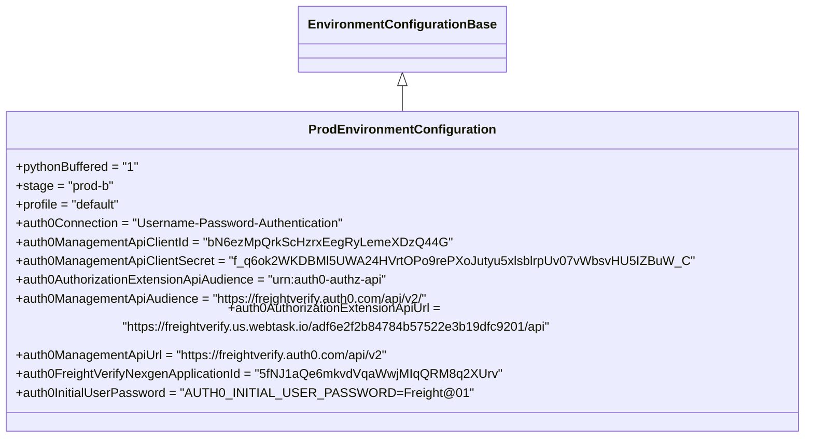

# Diagram: tools/ide_local_testing/localTest/core/environment/ProdEnvironmentConfiguration.py

> Auto-generated by Obscura crawlers

## Mermaid

### SVG

<svg id="container" width="983.875" xmlns="http://www.w3.org/2000/svg" class="classDiagram" height="534" viewBox="0 0 983.875 534" role="graphics-document document" aria-roledescription="class"><g><defs><marker id="container_class-aggregationStart" class="marker aggregation class" refX="18" refY="7" markerWidth="190" markerHeight="240" orient="auto"><path d="M 18,7 L9,13 L1,7 L9,1 Z"></path></marker></defs><defs><marker id="container_class-aggregationEnd" class="marker aggregation class" refX="1" refY="7" markerWidth="20" markerHeight="28" orient="auto"><path d="M 18,7 L9,13 L1,7 L9,1 Z"></path></marker></defs><defs><marker id="container_class-extensionStart" class="marker extension class" refX="18" refY="7" markerWidth="190" markerHeight="240" orient="auto"><path d="M 1,7 L18,13 V 1 Z"></path></marker></defs><defs><marker id="container_class-extensionEnd" class="marker extension class" refX="1" refY="7" markerWidth="20" markerHeight="28" orient="auto"><path d="M 1,1 V 13 L18,7 Z"></path></marker></defs><defs><marker id="container_class-compositionStart" class="marker composition class" refX="18" refY="7" markerWidth="190" markerHeight="240" orient="auto"><path d="M 18,7 L9,13 L1,7 L9,1 Z"></path></marker></defs><defs><marker id="container_class-compositionEnd" class="marker composition class" refX="1" refY="7" markerWidth="20" markerHeight="28" orient="auto"><path d="M 18,7 L9,13 L1,7 L9,1 Z"></path></marker></defs><defs><marker id="container_class-dependencyStart" class="marker dependency class" refX="6" refY="7" markerWidth="190" markerHeight="240" orient="auto"><path d="M 5,7 L9,13 L1,7 L9,1 Z"></path></marker></defs><defs><marker id="container_class-dependencyEnd" class="marker dependency class" refX="13" refY="7" markerWidth="20" markerHeight="28" orient="auto"><path d="M 18,7 L9,13 L14,7 L9,1 Z"></path></marker></defs><defs><marker id="container_class-lollipopStart" class="marker lollipop class" refX="13" refY="7" markerWidth="190" markerHeight="240" orient="auto"><circle stroke="black" fill="transparent" cx="7" cy="7" r="6"></circle></marker></defs><defs><marker id="container_class-lollipopEnd" class="marker lollipop class" refX="1" refY="7" markerWidth="190" markerHeight="240" orient="auto"><circle stroke="black" fill="transparent" cx="7" cy="7" r="6"></circle></marker></defs><g class="root"><g class="clusters"></g><g class="edgePaths"><path d="M491.938,109.25L491.938,110.542C491.938,111.833,491.938,114.417,491.938,119.875C491.938,125.333,491.938,133.667,491.938,137.833L491.938,142" id="id_EnvironmentConfigurationBase_ProdEnvironmentConfiguration_1" class="edge-thickness-normal edge-pattern-solid relation" style=";;;" data-edge="true" data-et="edge" data-id="id_EnvironmentConfigurationBase_ProdEnvironmentConfiguration_1" data-points="W3sieCI6NDkxLjkzNzUsInkiOjkyfSx7IngiOjQ5MS45Mzc1LCJ5IjoxMTd9LHsieCI6NDkxLjkzNzUsInkiOjE0Mn1d" marker-start="url(#container_class-extensionStart)"></path></g><g class="edgeLabels"><g class="edgeLabel"><g class="label" data-id="id_EnvironmentConfigurationBase_ProdEnvironmentConfiguration_1" transform="translate(0, 0)"><foreignObject width="0" height="0">

</foreignObject></g></g></g><g class="nodes"><g class="node default" id="classId-EnvironmentConfigurationBase-0" transform="translate(491.9375, 50)"><g class="basic label-container"><path d="M-125.0859375 -42 L125.0859375 -42 L125.0859375 42 L-125.0859375 42" stroke="none" stroke-width="0" fill="#ECECFF" style=""></path><path d="M-125.0859375 -42 C-49.79500235922221 -42, 25.49593278155558 -42, 125.0859375 -42 M-125.0859375 -42 C-62.42147841512325 -42, 0.24298066975350707 -42, 125.0859375 -42 M125.0859375 -42 C125.0859375 -18.299273067433347, 125.0859375 5.4014538651333055, 125.0859375 42 M125.0859375 -42 C125.0859375 -21.4330102638853, 125.0859375 -0.8660205277706012, 125.0859375 42 M125.0859375 42 C67.4064454320786 42, 9.726953364157197 42, -125.0859375 42 M125.0859375 42 C51.89533422959873 42, -21.295269040802538 42, -125.0859375 42 M-125.0859375 42 C-125.0859375 9.432915312385717, -125.0859375 -23.134169375228566, -125.0859375 -42 M-125.0859375 42 C-125.0859375 12.065324466190642, -125.0859375 -17.869351067618716, -125.0859375 -42" stroke="#9370DB" stroke-width="1.3" fill="none" stroke-dasharray="0 0" style=""></path></g><g class="annotation-group text" transform="translate(0, -18)"></g><g class="label-group text" transform="translate(-113.0859375, -18)"><g class="label" style="font-weight: bolder" transform="translate(0,-12)"><foreignObject width="226.171875" height="24">

EnvironmentConfigurationBase

</foreignObject></g></g><g class="members-group text" transform="translate(-113.0859375, 30)"></g><g class="methods-group text" transform="translate(-113.0859375, 60)"></g><g class="divider" style=""><path d="M-125.0859375 6 C-55.328826049030425 6, 14.42828540193915 6, 125.0859375 6 M-125.0859375 6 C-66.88166904216422 6, -8.677400584328424 6, 125.0859375 6" stroke="#9370DB" stroke-width="1.3" fill="none" stroke-dasharray="0 0" style=""></path></g><g class="divider" style=""><path d="M-125.0859375 24 C-48.73513608507537 24, 27.615665329849264 24, 125.0859375 24 M-125.0859375 24 C-38.18467957115007 24, 48.71657835769986 24, 125.0859375 24" stroke="#9370DB" stroke-width="1.3" fill="none" stroke-dasharray="0 0" style=""></path></g></g><g class="node default" id="classId-ProdEnvironmentConfiguration-1" transform="translate(491.9375, 334)"><g class="basic label-container"><path d="M-483.9375 -192 L483.9375 -192 L483.9375 192 L-483.9375 192" stroke="none" stroke-width="0" fill="#ECECFF" style=""></path><path d="M-483.9375 -192 C-225.7506511994677 -192, 32.43619760106458 -192, 483.9375 -192 M-483.9375 -192 C-171.5312818821888 -192, 140.87493623562239 -192, 483.9375 -192 M483.9375 -192 C483.9375 -79.76989794165573, 483.9375 32.460204116688544, 483.9375 192 M483.9375 -192 C483.9375 -75.79413989547669, 483.9375 40.41172020904662, 483.9375 192 M483.9375 192 C231.85397555197432 192, -20.22954889605137 192, -483.9375 192 M483.9375 192 C217.7575799027495 192, -48.422340194500975 192, -483.9375 192 M-483.9375 192 C-483.9375 47.89884472886851, -483.9375 -96.20231054226298, -483.9375 -192 M-483.9375 192 C-483.9375 87.43294015024401, -483.9375 -17.134119699511984, -483.9375 -192" stroke="#9370DB" stroke-width="1.3" fill="none" stroke-dasharray="0 0" style=""></path></g><g class="annotation-group text" transform="translate(0, -168)"></g><g class="label-group text" transform="translate(-112.640625, -168)"><g class="label" style="font-weight: bolder" transform="translate(0,-12)"><foreignObject width="225.28125" height="24">

ProdEnvironmentConfiguration

</foreignObject></g></g><g class="members-group text" transform="translate(-471.9375, -120)"><g class="label" style="" transform="translate(0,-12)"><foreignObject width="157.65625" height="24">

+pythonBuffered = "1"

</foreignObject></g><g class="label" style="" transform="translate(0,12)"><foreignObject width="125.609375" height="24">

+stage = "prod-b"

</foreignObject></g><g class="label" style="" transform="translate(0,36)"><foreignObject width="135.6875" height="24">

+profile = "default"

</foreignObject></g><g class="label" style="" transform="translate(0,60)"><foreignObject width="422.109375" height="24">

+auth0Connection = "Username-Password-Authentication"

</foreignObject></g><g class="label" style="" transform="translate(0,84)"><foreignObject width="537.34375" height="24">

+auth0ManagementApiClientId = "bN6ezMpQrkScHzrxEegRyLemeXDzQ44G"

</foreignObject></g><g class="label" style="" transform="translate(0,108)"><foreignObject width="831.234375" height="24">

+auth0ManagementApiClientSecret = "f_q6ok2WKDBMl5UWA24HVrtOPo9rePXoJutyu5xlsblrpUv07vWbsvHU5IZBuW_C"

</foreignObject></g><g class="label" style="" transform="translate(0,132)"><foreignObject width="483.3125" height="24">

+auth0AuthorizationExtensionApiAudience = "urn:auth0-authz-api"

</foreignObject></g><g class="label" style="" transform="translate(0,156)"><foreignObject width="547.890625" height="24">

+auth0ManagementApiAudience = "https://freightverify.auth0.com/api/v2/"

</foreignObject></g><g class="label" style="" transform="translate(0,180)"><foreignObject width="829.140625" height="24">

+auth0AuthorizationExtensionApiUrl = "https://freightverify.us.webtask.io/adf6e2f2b84784b57522e3b19dfc9201/api"

</foreignObject></g><g class="label" style="" transform="translate(0,204)"><foreignObject width="494.328125" height="24">

+auth0ManagementApiUrl = "https://freightverify.auth0.com/api/v2"

</foreignObject></g><g class="label" style="" transform="translate(0,228)"><foreignObject width="607.828125" height="24">

+auth0FreightVerifyNexgenApplicationId = "5fNJ1aQe6mkvdVqaWwjMIqQRM8q2XUrv"

</foreignObject></g><g class="label" style="" transform="translate(0,252)"><foreignObject width="549.125" height="24">

+auth0InitialUserPassword = "AUTH0_INITIAL_USER_PASSWORD=Freight@01"

</foreignObject></g></g><g class="methods-group text" transform="translate(-471.9375, 192)"></g><g class="divider" style=""><path d="M-483.9375 -144 C-272.0508047771789 -144, -60.16410955435782 -144, 483.9375 -144 M-483.9375 -144 C-113.7346331698759 -144, 256.4682336602482 -144, 483.9375 -144" stroke="#9370DB" stroke-width="1.3" fill="none" stroke-dasharray="0 0" style=""></path></g><g class="divider" style=""><path d="M-483.9375 168 C-154.877662464256 168, 174.18217507148802 168, 483.9375 168 M-483.9375 168 C-177.6028740101192 168, 128.7317519797616 168, 483.9375 168" stroke="#9370DB" stroke-width="1.3" fill="none" stroke-dasharray="0 0" style=""></path></g></g></g></g></g></svg>
