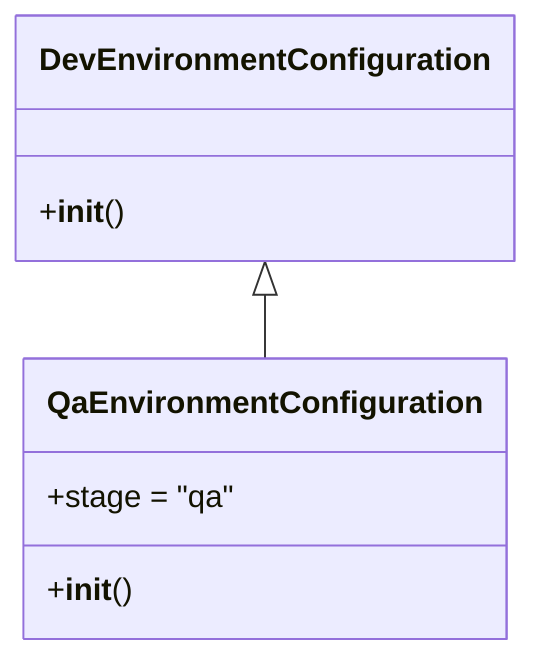

# Diagram: tools/ide_local_testing/localTest/core/environment/QaEnvironmentConfiguration.py

> Auto-generated by Obscura crawlers

## Mermaid

### SVG

<svg id="container" width="258.453125" xmlns="http://www.w3.org/2000/svg" class="classDiagram" height="336" viewBox="0 0 258.453125 336" role="graphics-document document" aria-roledescription="class"><g><defs><marker id="container_class-aggregationStart" class="marker aggregation class" refX="18" refY="7" markerWidth="190" markerHeight="240" orient="auto"><path d="M 18,7 L9,13 L1,7 L9,1 Z"></path></marker></defs><defs><marker id="container_class-aggregationEnd" class="marker aggregation class" refX="1" refY="7" markerWidth="20" markerHeight="28" orient="auto"><path d="M 18,7 L9,13 L1,7 L9,1 Z"></path></marker></defs><defs><marker id="container_class-extensionStart" class="marker extension class" refX="18" refY="7" markerWidth="190" markerHeight="240" orient="auto"><path d="M 1,7 L18,13 V 1 Z"></path></marker></defs><defs><marker id="container_class-extensionEnd" class="marker extension class" refX="1" refY="7" markerWidth="20" markerHeight="28" orient="auto"><path d="M 1,1 V 13 L18,7 Z"></path></marker></defs><defs><marker id="container_class-compositionStart" class="marker composition class" refX="18" refY="7" markerWidth="190" markerHeight="240" orient="auto"><path d="M 18,7 L9,13 L1,7 L9,1 Z"></path></marker></defs><defs><marker id="container_class-compositionEnd" class="marker composition class" refX="1" refY="7" markerWidth="20" markerHeight="28" orient="auto"><path d="M 18,7 L9,13 L1,7 L9,1 Z"></path></marker></defs><defs><marker id="container_class-dependencyStart" class="marker dependency class" refX="6" refY="7" markerWidth="190" markerHeight="240" orient="auto"><path d="M 5,7 L9,13 L1,7 L9,1 Z"></path></marker></defs><defs><marker id="container_class-dependencyEnd" class="marker dependency class" refX="13" refY="7" markerWidth="20" markerHeight="28" orient="auto"><path d="M 18,7 L9,13 L14,7 L9,1 Z"></path></marker></defs><defs><marker id="container_class-lollipopStart" class="marker lollipop class" refX="13" refY="7" markerWidth="190" markerHeight="240" orient="auto"><circle stroke="black" fill="transparent" cx="7" cy="7" r="6"></circle></marker></defs><defs><marker id="container_class-lollipopEnd" class="marker lollipop class" refX="1" refY="7" markerWidth="190" markerHeight="240" orient="auto"><circle stroke="black" fill="transparent" cx="7" cy="7" r="6"></circle></marker></defs><g class="root"><g class="clusters"></g><g class="edgePaths"><path d="M129.227,151.25L129.227,152.542C129.227,153.833,129.227,156.417,129.227,161.875C129.227,167.333,129.227,175.667,129.227,179.833L129.227,184" id="id_DevEnvironmentConfiguration_QaEnvironmentConfiguration_1" class="edge-thickness-normal edge-pattern-solid relation" style=";;;" data-edge="true" data-et="edge" data-id="id_DevEnvironmentConfiguration_QaEnvironmentConfiguration_1" data-points="W3sieCI6MTI5LjIyNjU2MjUsInkiOjEzNH0seyJ4IjoxMjkuMjI2NTYyNSwieSI6MTU5fSx7IngiOjEyOS4yMjY1NjI1LCJ5IjoxODR9XQ==" marker-start="url(#container_class-extensionStart)"></path></g><g class="edgeLabels"><g class="edgeLabel"><g class="label" data-id="id_DevEnvironmentConfiguration_QaEnvironmentConfiguration_1" transform="translate(0, 0)"><foreignObject width="0" height="0">

</foreignObject></g></g></g><g class="nodes"><g class="node default" id="classId-DevEnvironmentConfiguration-0" transform="translate(129.2265625, 71)"><g class="basic label-container"><path d="M-121.2265625 -63 L121.2265625 -63 L121.2265625 63 L-121.2265625 63" stroke="none" stroke-width="0" fill="#ECECFF" style=""></path><path d="M-121.2265625 -63 C-29.68091733490003 -63, 61.86472783019994 -63, 121.2265625 -63 M-121.2265625 -63 C-31.4374212362883 -63, 58.3517200274234 -63, 121.2265625 -63 M121.2265625 -63 C121.2265625 -22.94215384768183, 121.2265625 17.11569230463634, 121.2265625 63 M121.2265625 -63 C121.2265625 -25.93816763497101, 121.2265625 11.123664730057982, 121.2265625 63 M121.2265625 63 C55.03936738906151 63, -11.147827721876979 63, -121.2265625 63 M121.2265625 63 C43.13801721092106 63, -34.95052807815787 63, -121.2265625 63 M-121.2265625 63 C-121.2265625 22.60532406691057, -121.2265625 -17.789351866178862, -121.2265625 -63 M-121.2265625 63 C-121.2265625 14.523011866752661, -121.2265625 -33.95397626649468, -121.2265625 -63" stroke="#9370DB" stroke-width="1.3" fill="none" stroke-dasharray="0 0" style=""></path></g><g class="annotation-group text" transform="translate(0, -39)"></g><g class="label-group text" transform="translate(-109.2265625, -39)"><g class="label" style="font-weight: bolder" transform="translate(0,-12)"><foreignObject width="218.453125" height="24">

DevEnvironmentConfiguration

</foreignObject></g></g><g class="members-group text" transform="translate(-109.2265625, 9)"></g><g class="methods-group text" transform="translate(-109.2265625, 39)"><g class="label" style="" transform="translate(0,-12)"><foreignObject width="42.796875" height="24">

+<strong>init</strong>()

</foreignObject></g></g><g class="divider" style=""><path d="M-121.2265625 -15 C-34.087996971707994 -15, 53.05056855658401 -15, 121.2265625 -15 M-121.2265625 -15 C-29.842095859178954 -15, 61.54237078164209 -15, 121.2265625 -15" stroke="#9370DB" stroke-width="1.3" fill="none" stroke-dasharray="0 0" style=""></path></g><g class="divider" style=""><path d="M-121.2265625 9 C-29.95859699474434 9, 61.30936851051132 9, 121.2265625 9 M-121.2265625 9 C-44.3252081998464 9, 32.5761461003072 9, 121.2265625 9" stroke="#9370DB" stroke-width="1.3" fill="none" stroke-dasharray="0 0" style=""></path></g></g><g class="node default" id="classId-QaEnvironmentConfiguration-1" transform="translate(129.2265625, 256)"><g class="basic label-container"><path d="M-117.390625 -72 L117.390625 -72 L117.390625 72 L-117.390625 72" stroke="none" stroke-width="0" fill="#ECECFF" style=""></path><path d="M-117.390625 -72 C-40.65442905616955 -72, 36.081766887660905 -72, 117.390625 -72 M-117.390625 -72 C-59.50678859183169 -72, -1.6229521836633864 -72, 117.390625 -72 M117.390625 -72 C117.390625 -21.132944319969823, 117.390625 29.734111360060353, 117.390625 72 M117.390625 -72 C117.390625 -33.50462096535666, 117.390625 4.990758069286684, 117.390625 72 M117.390625 72 C69.34756396333151 72, 21.304502926663034 72, -117.390625 72 M117.390625 72 C52.56240357895888 72, -12.265817842082242 72, -117.390625 72 M-117.390625 72 C-117.390625 17.608437237102343, -117.390625 -36.78312552579531, -117.390625 -72 M-117.390625 72 C-117.390625 34.91266229342289, -117.390625 -2.174675413154219, -117.390625 -72" stroke="#9370DB" stroke-width="1.3" fill="none" stroke-dasharray="0 0" style=""></path></g><g class="annotation-group text" transform="translate(0, -48)"></g><g class="label-group text" transform="translate(-105.390625, -48)"><g class="label" style="font-weight: bolder" transform="translate(0,-12)"><foreignObject width="210.78125" height="24">

QaEnvironmentConfiguration

</foreignObject></g></g><g class="members-group text" transform="translate(-105.390625, 0)"><g class="label" style="" transform="translate(0,-12)"><foreignObject width="93.65625" height="24">

+stage = "qa"

</foreignObject></g></g><g class="methods-group text" transform="translate(-105.390625, 48)"><g class="label" style="" transform="translate(0,-12)"><foreignObject width="42.796875" height="24">

+<strong>init</strong>()

</foreignObject></g></g><g class="divider" style=""><path d="M-117.390625 -24 C-33.316396859842385 -24, 50.75783128031523 -24, 117.390625 -24 M-117.390625 -24 C-41.229229796589834 -24, 34.93216540682033 -24, 117.390625 -24" stroke="#9370DB" stroke-width="1.3" fill="none" stroke-dasharray="0 0" style=""></path></g><g class="divider" style=""><path d="M-117.390625 24 C-59.85265320479752 24, -2.314681409595039 24, 117.390625 24 M-117.390625 24 C-47.45095593250379 24, 22.488713134992423 24, 117.390625 24" stroke="#9370DB" stroke-width="1.3" fill="none" stroke-dasharray="0 0" style=""></path></g></g></g></g></g></svg>
