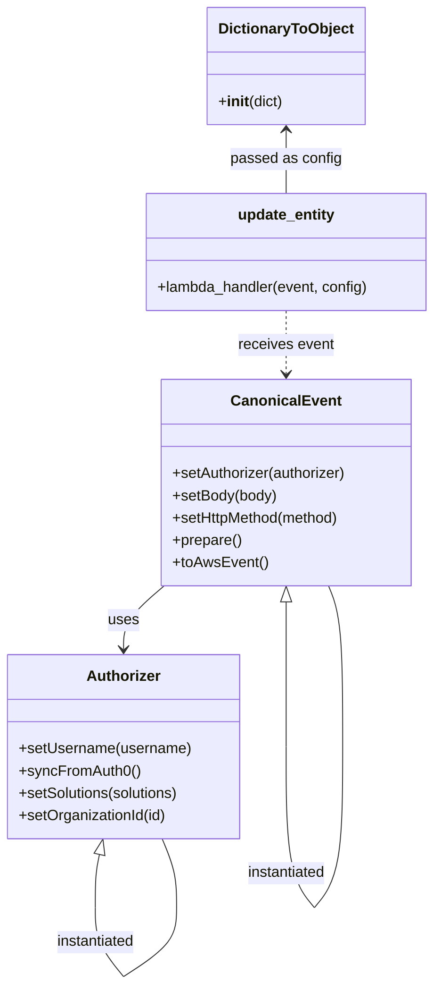
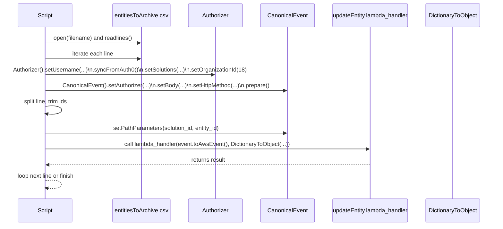
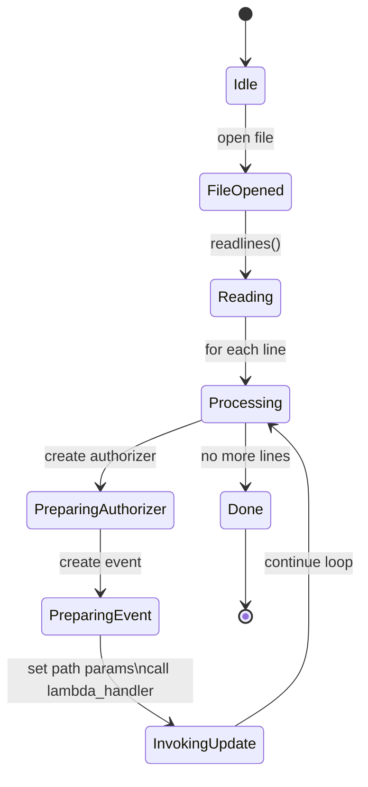

# Diagram: tools/ide_local_testing/localTest/processes/archiveEntities.py


> Auto-generated by Obscura crawlers

## Diagram 1

```mermaid
flowchart TD
  Start((Start))
  OpenFile[/Open filename "~/entitiesToArchive.csv"/]
  ReadLines[/Read lines from file/]
  Loop{For each line}
  Split["Split line into externalIdRaw, solutionIdRaw"]
  Trim["Trim externalId and solutionId"]
  BuildAuthorizer["Create Authorizer\n.setUsername(...)\n.syncFromAuth0()\n.setSolutions(...)\n.setOrganizationId(18)"]
  BuildEvent["Create CanonicalEvent\n.setAuthorizer(...)\n.setBody({'lifeCycleState':'Archived'})\n.setHttpMethod('POST')\n.prepare()"]
  SetPathParams["event.setPathParameters({solution_id, entity_id})"]
  Log["print(f\"processing {externalId}\")"]
  CallUpdate["updateEntity.lambda_handler(event.toAwsEvent(), DictionaryToObject(...))"]
  End((End))

  Start --> OpenFile --> ReadLines --> Loop
  Loop --> Split --> Trim --> BuildAuthorizer --> BuildEvent --> SetPathParams --> Log --> CallUpdate --> Loop
  Loop --> End
  CallUpdate --> Loop
```

> SVG rendering failed for this diagram.

## Diagram 2



### SVG

<svg id="container" width="467.00701904296875" xmlns="http://www.w3.org/2000/svg" class="classDiagram" height="1058.25" viewBox="0 0 467.00701904296875 1058.25" role="graphics-document document" aria-roledescription="class"><style>#container{font-family:"trebuchet ms",verdana,arial,sans-serif;font-size:16px;fill:#333;}@keyframes edge-animation-frame{from{stroke-dashoffset:0;}}@keyframes dash{to{stroke-dashoffset:0;}}#container .edge-animation-slow{stroke-dasharray:9,5!important;stroke-dashoffset:900;animation:dash 50s linear infinite;stroke-linecap:round;}#container .edge-animation-fast{stroke-dasharray:9,5!important;stroke-dashoffset:900;animation:dash 20s linear infinite;stroke-linecap:round;}#container .error-icon{fill:#552222;}#container .error-text{fill:#552222;stroke:#552222;}#container .edge-thickness-normal{stroke-width:1px;}#container .edge-thickness-thick{stroke-width:3.5px;}#container .edge-pattern-solid{stroke-dasharray:0;}#container .edge-thickness-invisible{stroke-width:0;fill:none;}#container .edge-pattern-dashed{stroke-dasharray:3;}#container .edge-pattern-dotted{stroke-dasharray:2;}#container .marker{fill:#333333;stroke:#333333;}#container .marker.cross{stroke:#333333;}#container svg{font-family:"trebuchet ms",verdana,arial,sans-serif;font-size:16px;}#container p{margin:0;}#container g.classGroup text{fill:#9370DB;stroke:none;font-family:"trebuchet ms",verdana,arial,sans-serif;font-size:10px;}#container g.classGroup text .title{font-weight:bolder;}#container .nodeLabel,#container .edgeLabel{color:#131300;}#container .edgeLabel .label rect{fill:#ECECFF;}#container .label text{fill:#131300;}#container .labelBkg{background:#ECECFF;}#container .edgeLabel .label span{background:#ECECFF;}#container .classTitle{font-weight:bolder;}#container .node rect,#container .node circle,#container .node ellipse,#container .node polygon,#container .node path{fill:#ECECFF;stroke:#9370DB;stroke-width:1px;}#container .divider{stroke:#9370DB;stroke-width:1;}#container g.clickable{cursor:pointer;}#container g.classGroup rect{fill:#ECECFF;stroke:#9370DB;}#container g.classGroup line{stroke:#9370DB;stroke-width:1;}#container .classLabel .box{stroke:none;stroke-width:0;fill:#ECECFF;opacity:0.5;}#container .classLabel .label{fill:#9370DB;font-size:10px;}#container .relation{stroke:#333333;stroke-width:1;fill:none;}#container .dashed-line{stroke-dasharray:3;}#container .dotted-line{stroke-dasharray:1 2;}#container #compositionStart,#container .composition{fill:#333333!important;stroke:#333333!important;stroke-width:1;}#container #compositionEnd,#container .composition{fill:#333333!important;stroke:#333333!important;stroke-width:1;}#container #dependencyStart,#container .dependency{fill:#333333!important;stroke:#333333!important;stroke-width:1;}#container #dependencyStart,#container .dependency{fill:#333333!important;stroke:#333333!important;stroke-width:1;}#container #extensionStart,#container .extension{fill:transparent!important;stroke:#333333!important;stroke-width:1;}#container #extensionEnd,#container .extension{fill:transparent!important;stroke:#333333!important;stroke-width:1;}#container #aggregationStart,#container .aggregation{fill:transparent!important;stroke:#333333!important;stroke-width:1;}#container #aggregationEnd,#container .aggregation{fill:transparent!important;stroke:#333333!important;stroke-width:1;}#container #lollipopStart,#container .lollipop{fill:#ECECFF!important;stroke:#333333!important;stroke-width:1;}#container #lollipopEnd,#container .lollipop{fill:#ECECFF!important;stroke:#333333!important;stroke-width:1;}#container .edgeTerminals{font-size:11px;line-height:initial;}#container .classTitleText{text-anchor:middle;font-size:18px;fill:#333;}#container .label-icon{display:inline-block;height:1em;overflow:visible;vertical-align:-0.125em;}#container .node .label-icon path{fill:currentColor;stroke:revert;stroke-width:revert;}#container :root{--mermaid-font-family:"trebuchet ms",verdana,arial,sans-serif;}</style><g><defs><marker id="container_class-aggregationStart" class="marker aggregation class" refX="18" refY="7" markerWidth="190" markerHeight="240" orient="auto"><path d="M 18,7 L9,13 L1,7 L9,1 Z"></path></marker></defs><defs><marker id="container_class-aggregationEnd" class="marker aggregation class" refX="1" refY="7" markerWidth="20" markerHeight="28" orient="auto"><path d="M 18,7 L9,13 L1,7 L9,1 Z"></path></marker></defs><defs><marker id="container_class-extensionStart" class="marker extension class" refX="18" refY="7" markerWidth="190" markerHeight="240" orient="auto"><path d="M 1,7 L18,13 V 1 Z"></path></marker></defs><defs><marker id="container_class-extensionEnd" class="marker extension class" refX="1" refY="7" markerWidth="20" markerHeight="28" orient="auto"><path d="M 1,1 V 13 L18,7 Z"></path></marker></defs><defs><marker id="container_class-compositionStart" class="marker composition class" refX="18" refY="7" markerWidth="190" markerHeight="240" orient="auto"><path d="M 18,7 L9,13 L1,7 L9,1 Z"></path></marker></defs><defs><marker id="container_class-compositionEnd" class="marker composition class" refX="1" refY="7" markerWidth="20" markerHeight="28" orient="auto"><path d="M 18,7 L9,13 L1,7 L9,1 Z"></path></marker></defs><defs><marker id="container_class-dependencyStart" class="marker dependency class" refX="6" refY="7" markerWidth="190" markerHeight="240" orient="auto"><path d="M 5,7 L9,13 L1,7 L9,1 Z"></path></marker></defs><defs><marker id="container_class-dependencyEnd" class="marker dependency class" refX="13" refY="7" markerWidth="20" markerHeight="28" orient="auto"><path d="M 18,7 L9,13 L14,7 L9,1 Z"></path></marker></defs><defs><marker id="container_class-lollipopStart" class="marker lollipop class" refX="13" refY="7" markerWidth="190" markerHeight="240" orient="auto"><circle stroke="black" fill="transparent" cx="7" cy="7" r="6"></circle></marker></defs><defs><marker id="container_class-lollipopEnd" class="marker lollipop class" refX="1" refY="7" markerWidth="190" markerHeight="240" orient="auto"><circle stroke="black" fill="transparent" cx="7" cy="7" r="6"></circle></marker></defs><g class="root"><g class="clusters"></g><g class="edgePaths"><path d="M175.683,630L168.426,636.167C161.168,642.333,146.652,654.667,139.394,666C132.137,677.333,132.137,687.667,132.137,692.833L132.137,698" id="id_CanonicalEvent_Authorizer_1" class="edge-thickness-normal edge-pattern-solid relation" style=";;;" data-edge="true" data-et="edge" data-id="id_CanonicalEvent_Authorizer_1" data-points="W3sieCI6MTc1LjY4MzM5ODQzNzY4NjI2LCJ5Ijo2MzB9LHsieCI6MTMyLjEzNjcxODc1LCJ5Ijo2Njd9LHsieCI6MTMyLjEzNjcxODc1LCJ5Ijo3MDR9XQ==" marker-end="url(#container_class-dependencyEnd)"></path><path d="M306.323,334L306.323,340.167C306.323,346.333,306.323,358.667,306.323,370C306.323,381.333,306.323,391.667,306.323,396.833L306.323,402" id="id_update_entity_CanonicalEvent_2" class="edge-thickness-normal edge-pattern-dashed relation" style=";;;" data-edge="true" data-et="edge" data-id="id_update_entity_CanonicalEvent_2" data-points="W3sieCI6MzA2LjMyMzQzNzUwMDc0NTA2LCJ5IjozMzR9LHsieCI6MzA2LjMyMzQzNzUwMDc0NTA2LCJ5IjozNzF9LHsieCI6MzA2LjMyMzQzNzUwMDc0NTA2LCJ5Ijo0MDh9XQ==" marker-end="url(#container_class-dependencyEnd)"></path><path d="M306.323,140L306.323,145.167C306.323,150.333,306.323,160.667,306.323,172C306.323,183.333,306.323,195.667,306.323,201.833L306.323,208" id="id_DictionaryToObject_update_entity_3" class="edge-thickness-normal edge-pattern-solid relation" style=";;;" data-edge="true" data-et="edge" data-id="id_DictionaryToObject_update_entity_3" data-points="W3sieCI6MzA2LjMyMzQzNzUwMDc0NTA2LCJ5IjoxMzR9LHsieCI6MzA2LjMyMzQzNzUwMDc0NTA2LCJ5IjoxNzF9LHsieCI6MzA2LjMyMzQzNzUwMDc0NTA2LCJ5IjoyMDh9XQ==" marker-start="url(#container_class-dependencyStart)"></path><path d="M104.908,918.792L104.116,922.16C103.324,925.528,101.74,932.264,100.948,941.799C100.156,951.333,100.156,963.667,100.156,969.833L100.156,976" id="Authorizer-cyclic-special-1" class="edge-thickness-normal edge-pattern-solid relation" style=";;;" data-edge="true" data-et="edge" data-id="Authorizer-cyclic-special-1" data-points="W3sieCI6MTA4Ljg1NjgxODcwNDA0NDEyLCJ5Ijo5MDJ9LHsieCI6MTAwLjE1NjI1LCJ5Ijo5Mzl9LHsieCI6MTAwLjE1NjI1LCJ5Ijo5NzZ9XQ==" marker-start="url(#container_class-extensionStart)"></path><path d="M100.156,976.1L100.156,982.267C100.156,988.433,100.156,1000.767,105.479,1013.1C110.802,1025.433,121.448,1037.767,126.771,1043.933L132.094,1050.1" id="Authorizer-cyclic-special-mid" class="edge-thickness-normal edge-pattern-solid relation" style=";;;" data-edge="true" data-et="edge" data-id="Authorizer-cyclic-special-mid" data-points="W3sieCI6MTAwLjE1NjI1LCJ5Ijo5NzYuMTAwMDAwMDAxNDkwMX0seyJ4IjoxMDAuMTU2MjUsInkiOjEwMTMuMTAwMDAwMDAxNDkwMX0seyJ4IjoxMzIuMDkzNTYwMjIyMDI5ODIsInkiOjEwNTAuMTAwMDAwMDAxNDkwMX1d"></path><path d="M132.187,1050.116L141.364,1043.947C150.541,1037.778,168.895,1025.439,178.072,1013.094C187.25,1000.75,187.25,988.4,187.25,976.05C187.25,963.7,187.25,951.35,184.751,939.008C182.252,926.667,177.254,914.333,174.755,908.167L172.256,902" id="Authorizer-cyclic-special-2" class="edge-thickness-normal edge-pattern-solid relation" style=";;;" data-edge="true" data-et="edge" data-id="Authorizer-cyclic-special-2" data-points="W3sieCI6MTMyLjE4NjcxODc1MDc0NTA2LCJ5IjoxMDUwLjExNjM4NzE3NTc4NzJ9LHsieCI6MTg3LjI0OTYwOTM3NTM3MjUzLCJ5IjoxMDEzLjEwMDAwMDAwMTQ5MDF9LHsieCI6MTg3LjI0OTYwOTM3NTM3MjUzLCJ5Ijo5NzYuMDUwMDAwMDAwNzQ1MX0seyJ4IjoxODcuMjQ5NjA5Mzc1MzcyNTMsInkiOjkzOX0seyJ4IjoxNzIuMjU1NjYxMTkwNTI4NTQsInkiOjkwMn1d"></path><path d="M306.323,647.25L306.323,650.542C306.323,653.833,306.323,660.417,306.323,686.367C306.323,712.317,306.323,757.633,306.323,780.292L306.323,802.95" id="CanonicalEvent-cyclic-special-1" class="edge-thickness-normal edge-pattern-solid relation" style=";;;" data-edge="true" data-et="edge" data-id="CanonicalEvent-cyclic-special-1" data-points="W3sieCI6MzA2LjMyMzQzNzUwMDc0NTA2LCJ5Ijo2MzB9LHsieCI6MzA2LjMyMzQzNzUwMDc0NTA2LCJ5Ijo2Njd9LHsieCI6MzA2LjMyMzQzNzUwMDc0NTA2LCJ5Ijo4MDIuOTQ5OTk5OTk5MjU0OX1d" marker-start="url(#container_class-extensionStart)"></path><path d="M306.323,803.05L306.323,825.708C306.323,848.367,306.323,893.683,311.646,922.508C316.969,951.333,327.615,963.667,332.938,969.833L338.261,976" id="CanonicalEvent-cyclic-special-mid" class="edge-thickness-normal edge-pattern-solid relation" style=";;;" data-edge="true" data-et="edge" data-id="CanonicalEvent-cyclic-special-mid" data-points="W3sieCI6MzA2LjMyMzQzNzUwMDc0NTA2LCJ5Ijo4MDMuMDUwMDAwMDAwNzQ1MX0seyJ4IjozMDYuMzIzNDM3NTAwNzQ1MDYsInkiOjkzOX0seyJ4IjozMzguMjYwNzQ3NzIyNzc0ODUsInkiOjk3Nn1d"></path><path d="M338.347,976L343.67,969.833C348.993,963.667,359.639,951.333,364.961,922.5C370.284,893.667,370.284,848.333,370.284,803C370.284,757.667,370.284,712.333,367.619,683.5C364.954,654.667,359.624,642.333,356.959,636.167L354.294,630" id="CanonicalEvent-cyclic-special-2" class="edge-thickness-normal edge-pattern-solid relation" style=";;;" data-edge="true" data-et="edge" data-id="CanonicalEvent-cyclic-special-2" data-points="W3sieCI6MzM4LjM0NzA2NDc3ODcxNTI2LCJ5Ijo5NzZ9LHsieCI6MzcwLjI4NDM3NTAwMDc0NTA2LCJ5Ijo5Mzl9LHsieCI6MzcwLjI4NDM3NTAwMDc0NTA2LCJ5Ijo4MDN9LHsieCI6MzcwLjI4NDM3NTAwMDc0NTA2LCJ5Ijo2Njd9LHsieCI6MzU0LjI5NDE0MDYyNTc0NTA2LCJ5Ijo2MzB9XQ=="></path></g><g class="edgeLabels"><g class="edgeLabel" transform="translate(132.13671875, 667)"><g class="label" data-id="id_CanonicalEvent_Authorizer_1" transform="translate(-16.4921875, -12)"><foreignObject width="32.984375" height="24"><div xmlns="http://www.w3.org/1999/xhtml" class="labelBkg" style="display: table-cell; white-space: nowrap; line-height: 1.5; max-width: 200px; text-align: center;"><span class="edgeLabel"><p>uses</p></span></div></foreignObject></g></g><g class="edgeLabel" transform="translate(306.32343750074506, 371)"><g class="label" data-id="id_update_entity_CanonicalEvent_2" transform="translate(-51.78125, -12)"><foreignObject width="103.5625" height="24"><div xmlns="http://www.w3.org/1999/xhtml" class="labelBkg" style="display: table-cell; white-space: nowrap; line-height: 1.5; max-width: 200px; text-align: center;"><span class="edgeLabel"><p>receives event</p></span></div></foreignObject></g></g><g class="edgeLabel" transform="translate(306.32343750074506, 171)"><g class="label" data-id="id_DictionaryToObject_update_entity_3" transform="translate(-59.515625, -12)"><foreignObject width="119.03125" height="24"><div xmlns="http://www.w3.org/1999/xhtml" class="labelBkg" style="display: table-cell; white-space: nowrap; line-height: 1.5; max-width: 200px; text-align: center;"><span class="edgeLabel"><p>passed as config</p></span></div></foreignObject></g></g><g class="edgeLabel"><g class="label" data-id="Authorizer-cyclic-special-1" transform="translate(0, 0)"><foreignObject width="0" height="0"><div xmlns="http://www.w3.org/1999/xhtml" class="labelBkg" style="display: table-cell; white-space: nowrap; line-height: 1.5; max-width: 200px; text-align: center;"><span class="edgeLabel"></span></div></foreignObject></g></g><g class="edgeLabel" transform="translate(100.15625, 1013.1000000014901)"><g class="label" data-id="Authorizer-cyclic-special-mid" transform="translate(-43.9609375, -12)"><foreignObject width="87.921875" height="24"><div xmlns="http://www.w3.org/1999/xhtml" class="labelBkg" style="display: table-cell; white-space: nowrap; line-height: 1.5; max-width: 200px; text-align: center;"><span class="edgeLabel"><p>instantiated</p></span></div></foreignObject></g></g><g class="edgeLabel"><g class="label" data-id="Authorizer-cyclic-special-2" transform="translate(0, 0)"><foreignObject width="0" height="0"><div xmlns="http://www.w3.org/1999/xhtml" class="labelBkg" style="display: table-cell; white-space: nowrap; line-height: 1.5; max-width: 200px; text-align: center;"><span class="edgeLabel"></span></div></foreignObject></g></g><g class="edgeLabel"><g class="label" data-id="CanonicalEvent-cyclic-special-1" transform="translate(0, 0)"><foreignObject width="0" height="0"><div xmlns="http://www.w3.org/1999/xhtml" class="labelBkg" style="display: table-cell; white-space: nowrap; line-height: 1.5; max-width: 200px; text-align: center;"><span class="edgeLabel"></span></div></foreignObject></g></g><g class="edgeLabel" transform="translate(306.32343750074506, 939)"><g class="label" data-id="CanonicalEvent-cyclic-special-mid" transform="translate(-43.9609375, -12)"><foreignObject width="87.921875" height="24"><div xmlns="http://www.w3.org/1999/xhtml" class="labelBkg" style="display: table-cell; white-space: nowrap; line-height: 1.5; max-width: 200px; text-align: center;"><span class="edgeLabel"><p>instantiated</p></span></div></foreignObject></g></g><g class="edgeLabel"><g class="label" data-id="CanonicalEvent-cyclic-special-2" transform="translate(0, 0)"><foreignObject width="0" height="0"><div xmlns="http://www.w3.org/1999/xhtml" class="labelBkg" style="display: table-cell; white-space: nowrap; line-height: 1.5; max-width: 200px; text-align: center;"><span class="edgeLabel"></span></div></foreignObject></g></g></g><g class="nodes"><g class="node default" id="classId-CanonicalEvent-0" transform="translate(306.32343750074506, 519)"><g class="basic label-container"><path d="M-135.23046875 -111 L135.23046875 -111 L135.23046875 111 L-135.23046875 111" stroke="none" stroke-width="0" fill="#ECECFF" style=""></path><path d="M-135.23046875 -111 C-76.11966953021653 -111, -17.00887031043304 -111, 135.23046875 -111 M-135.23046875 -111 C-77.46873114909258 -111, -19.706993548185167 -111, 135.23046875 -111 M135.23046875 -111 C135.23046875 -31.466432786118446, 135.23046875 48.06713442776311, 135.23046875 111 M135.23046875 -111 C135.23046875 -58.40846946902814, 135.23046875 -5.816938938056282, 135.23046875 111 M135.23046875 111 C62.93581943789944 111, -9.35882987420112 111, -135.23046875 111 M135.23046875 111 C43.086627535589045 111, -49.05721367882191 111, -135.23046875 111 M-135.23046875 111 C-135.23046875 54.606125253707944, -135.23046875 -1.787749492584112, -135.23046875 -111 M-135.23046875 111 C-135.23046875 35.16206851144126, -135.23046875 -40.675862977117475, -135.23046875 -111" stroke="#9370DB" stroke-width="1.3" fill="none" stroke-dasharray="0 0" style=""></path></g><g class="annotation-group text" transform="translate(0, -87)"></g><g class="label-group text" transform="translate(-55.7109375, -87)"><g class="label" style="font-weight: bolder" transform="translate(0,-12)"><foreignObject width="111.421875" height="24"><div xmlns="http://www.w3.org/1999/xhtml" style="display: table-cell; white-space: nowrap; line-height: 1.5; max-width: 161px; text-align: center;"><span class="nodeLabel markdown-node-label" style=""><p>CanonicalEvent</p></span></div></foreignObject></g></g><g class="members-group text" transform="translate(-123.23046875, -39)"></g><g class="methods-group text" transform="translate(-123.23046875, -9)"><g class="label" style="" transform="translate(0,-12)"><foreignObject width="190.75" height="24"><div xmlns="http://www.w3.org/1999/xhtml" style="display: table-cell; white-space: nowrap; line-height: 1.5; max-width: 248px; text-align: center;"><span class="nodeLabel markdown-node-label" style=""><p>+setAuthorizer(authorizer)</p></span></div></foreignObject></g><g class="label" style="" transform="translate(0,12)"><foreignObject width="113.125" height="24"><div xmlns="http://www.w3.org/1999/xhtml" style="display: table-cell; white-space: nowrap; line-height: 1.5; max-width: 170px; text-align: center;"><span class="nodeLabel markdown-node-label" style=""><p>+setBody(body)</p></span></div></foreignObject></g><g class="label" style="" transform="translate(0,36)"><foreignObject width="184" height="24"><div xmlns="http://www.w3.org/1999/xhtml" style="display: table-cell; white-space: nowrap; line-height: 1.5; max-width: 241px; text-align: center;"><span class="nodeLabel markdown-node-label" style=""><p>+setHttpMethod(method)</p></span></div></foreignObject></g><g class="label" style="" transform="translate(0,60)"><foreignObject width="74.75" height="24"><div xmlns="http://www.w3.org/1999/xhtml" style="display: table-cell; white-space: nowrap; line-height: 1.5; max-width: 132px; text-align: center;"><span class="nodeLabel markdown-node-label" style=""><p>+prepare()</p></span></div></foreignObject></g><g class="label" style="" transform="translate(0,84)"><foreignObject width="101.1875" height="24"><div xmlns="http://www.w3.org/1999/xhtml" style="display: table-cell; white-space: nowrap; line-height: 1.5; max-width: 159px; text-align: center;"><span class="nodeLabel markdown-node-label" style=""><p>+toAwsEvent()</p></span></div></foreignObject></g></g><g class="divider" style=""><path d="M-135.23046875 -63 C-74.5108501074971 -63, -13.791231464994226 -63, 135.23046875 -63 M-135.23046875 -63 C-63.57873837045922 -63, 8.07299200908156 -63, 135.23046875 -63" stroke="#9370DB" stroke-width="1.3" fill="none" stroke-dasharray="0 0" style=""></path></g><g class="divider" style=""><path d="M-135.23046875 -39 C-49.86939109029001 -39, 35.49168656941998 -39, 135.23046875 -39 M-135.23046875 -39 C-30.535055612521532 -39, 74.16035752495694 -39, 135.23046875 -39" stroke="#9370DB" stroke-width="1.3" fill="none" stroke-dasharray="0 0" style=""></path></g></g><g class="node default" id="classId-Authorizer-1" transform="translate(132.13671875, 803)"><g class="basic label-container"><path d="M-124.13671875 -99 L124.13671875 -99 L124.13671875 99 L-124.13671875 99" stroke="none" stroke-width="0" fill="#ECECFF" style=""></path><path d="M-124.13671875 -99 C-30.642434490696473 -99, 62.85184976860705 -99, 124.13671875 -99 M-124.13671875 -99 C-49.52954348323975 -99, 25.077631783520502 -99, 124.13671875 -99 M124.13671875 -99 C124.13671875 -52.01003386386354, 124.13671875 -5.020067727727081, 124.13671875 99 M124.13671875 -99 C124.13671875 -34.07846551332082, 124.13671875 30.843068973358356, 124.13671875 99 M124.13671875 99 C52.065920449031765 99, -20.00487785193647 99, -124.13671875 99 M124.13671875 99 C36.0951793774512 99, -51.946359995097595 99, -124.13671875 99 M-124.13671875 99 C-124.13671875 56.854883909270185, -124.13671875 14.70976781854037, -124.13671875 -99 M-124.13671875 99 C-124.13671875 27.847915579774792, -124.13671875 -43.304168840450416, -124.13671875 -99" stroke="#9370DB" stroke-width="1.3" fill="none" stroke-dasharray="0 0" style=""></path></g><g class="annotation-group text" transform="translate(0, -75)"></g><g class="label-group text" transform="translate(-38.3671875, -75)"><g class="label" style="font-weight: bolder" transform="translate(0,-12)"><foreignObject width="76.734375" height="24"><div xmlns="http://www.w3.org/1999/xhtml" style="display: table-cell; white-space: nowrap; line-height: 1.5; max-width: 126px; text-align: center;"><span class="nodeLabel markdown-node-label" style=""><p>Authorizer</p></span></div></foreignObject></g></g><g class="members-group text" transform="translate(-112.13671875, -27)"></g><g class="methods-group text" transform="translate(-112.13671875, 3)"><g class="label" style="" transform="translate(0,-12)"><foreignObject width="185.90625" height="24"><div xmlns="http://www.w3.org/1999/xhtml" style="display: table-cell; white-space: nowrap; line-height: 1.5; max-width: 243px; text-align: center;"><span class="nodeLabel markdown-node-label" style=""><p>+setUsername(username)</p></span></div></foreignObject></g><g class="label" style="" transform="translate(0,12)"><foreignObject width="129.0625" height="24"><div xmlns="http://www.w3.org/1999/xhtml" style="display: table-cell; white-space: nowrap; line-height: 1.5; max-width: 186px; text-align: center;"><span class="nodeLabel markdown-node-label" style=""><p>+syncFromAuth0()</p></span></div></foreignObject></g><g class="label" style="" transform="translate(0,36)"><foreignObject width="176.171875" height="24"><div xmlns="http://www.w3.org/1999/xhtml" style="display: table-cell; white-space: nowrap; line-height: 1.5; max-width: 234px; text-align: center;"><span class="nodeLabel markdown-node-label" style=""><p>+setSolutions(solutions)</p></span></div></foreignObject></g><g class="label" style="" transform="translate(0,60)"><foreignObject width="160.78125" height="24"><div xmlns="http://www.w3.org/1999/xhtml" style="display: table-cell; white-space: nowrap; line-height: 1.5; max-width: 218px; text-align: center;"><span class="nodeLabel markdown-node-label" style=""><p>+setOrganizationId(id)</p></span></div></foreignObject></g></g><g class="divider" style=""><path d="M-124.13671875 -51 C-56.86831258715331 -51, 10.400093575693376 -51, 124.13671875 -51 M-124.13671875 -51 C-60.881343004185595 -51, 2.3740327416288096 -51, 124.13671875 -51" stroke="#9370DB" stroke-width="1.3" fill="none" stroke-dasharray="0 0" style=""></path></g><g class="divider" style=""><path d="M-124.13671875 -27 C-50.877393988079774 -27, 22.381930773840452 -27, 124.13671875 -27 M-124.13671875 -27 C-46.77995193023345 -27, 30.576814889533097 -27, 124.13671875 -27" stroke="#9370DB" stroke-width="1.3" fill="none" stroke-dasharray="0 0" style=""></path></g></g><g class="node default" id="classId-DictionaryToObject-2" transform="translate(306.32343750074506, 71)"><g class="basic label-container"><path d="M-82.203125 -63 L82.203125 -63 L82.203125 63 L-82.203125 63" stroke="none" stroke-width="0" fill="#ECECFF" style=""></path><path d="M-82.203125 -63 C-48.14252391844725 -63, -14.081922836894506 -63, 82.203125 -63 M-82.203125 -63 C-36.9114527353329 -63, 8.380219529334198 -63, 82.203125 -63 M82.203125 -63 C82.203125 -14.55110334858297, 82.203125 33.89779330283406, 82.203125 63 M82.203125 -63 C82.203125 -17.509097248066297, 82.203125 27.981805503867406, 82.203125 63 M82.203125 63 C26.465419036358554 63, -29.27228692728289 63, -82.203125 63 M82.203125 63 C34.62412202808885 63, -12.954880943822303 63, -82.203125 63 M-82.203125 63 C-82.203125 26.346453129958576, -82.203125 -10.307093740082848, -82.203125 -63 M-82.203125 63 C-82.203125 26.66516837565439, -82.203125 -9.669663248691222, -82.203125 -63" stroke="#9370DB" stroke-width="1.3" fill="none" stroke-dasharray="0 0" style=""></path></g><g class="annotation-group text" transform="translate(0, -39)"></g><g class="label-group text" transform="translate(-70.109375, -39)"><g class="label" style="font-weight: bolder" transform="translate(0,-12)"><foreignObject width="140.21875" height="24"><div xmlns="http://www.w3.org/1999/xhtml" style="display: table-cell; white-space: nowrap; line-height: 1.5; max-width: 188px; text-align: center;"><span class="nodeLabel markdown-node-label" style=""><p>DictionaryToObject</p></span></div></foreignObject></g></g><g class="members-group text" transform="translate(-70.203125, 9)"></g><g class="methods-group text" transform="translate(-70.203125, 39)"><g class="label" style="" transform="translate(0,-12)"><foreignObject width="70.296875" height="24"><div xmlns="http://www.w3.org/1999/xhtml" style="display: table-cell; white-space: nowrap; line-height: 1.5; max-width: 159px; text-align: center;"><span class="nodeLabel markdown-node-label" style=""><p>+<strong>init</strong>(dict)</p></span></div></foreignObject></g></g><g class="divider" style=""><path d="M-82.203125 -15 C-32.423714298445795 -15, 17.35569640310841 -15, 82.203125 -15 M-82.203125 -15 C-17.281258293625115 -15, 47.64060841274977 -15, 82.203125 -15" stroke="#9370DB" stroke-width="1.3" fill="none" stroke-dasharray="0 0" style=""></path></g><g class="divider" style=""><path d="M-82.203125 9 C-32.9624609079232 9, 16.278203184153597 9, 82.203125 9 M-82.203125 9 C-21.647037842267338 9, 38.909049315465325 9, 82.203125 9" stroke="#9370DB" stroke-width="1.3" fill="none" stroke-dasharray="0 0" style=""></path></g></g><g class="node default" id="classId-update_entity-3" transform="translate(306.32343750074506, 271)"><g class="basic label-container"><path d="M-152.68359375 -63 L152.68359375 -63 L152.68359375 63 L-152.68359375 63" stroke="none" stroke-width="0" fill="#ECECFF" style=""></path><path d="M-152.68359375 -63 C-79.42677421026686 -63, -6.169954670533713 -63, 152.68359375 -63 M-152.68359375 -63 C-38.76029958812768 -63, 75.16299457374464 -63, 152.68359375 -63 M152.68359375 -63 C152.68359375 -14.253611123686262, 152.68359375 34.492777752627475, 152.68359375 63 M152.68359375 -63 C152.68359375 -36.25475201772974, 152.68359375 -9.509504035459493, 152.68359375 63 M152.68359375 63 C88.88478137925894 63, 25.08596900851788 63, -152.68359375 63 M152.68359375 63 C50.831090776244494 63, -51.02141219751101 63, -152.68359375 63 M-152.68359375 63 C-152.68359375 30.94909923319276, -152.68359375 -1.101801533614477, -152.68359375 -63 M-152.68359375 63 C-152.68359375 15.032038269555706, -152.68359375 -32.93592346088859, -152.68359375 -63" stroke="#9370DB" stroke-width="1.3" fill="none" stroke-dasharray="0 0" style=""></path></g><g class="annotation-group text" transform="translate(0, -39)"></g><g class="label-group text" transform="translate(-51.3046875, -39)"><g class="label" style="font-weight: bolder" transform="translate(0,-12)"><foreignObject width="102.609375" height="24"><div xmlns="http://www.w3.org/1999/xhtml" style="display: table-cell; white-space: nowrap; line-height: 1.5; max-width: 151px; text-align: center;"><span class="nodeLabel markdown-node-label" style=""><p>update_entity</p></span></div></foreignObject></g></g><g class="members-group text" transform="translate(-140.68359375, 9)"></g><g class="methods-group text" transform="translate(-140.68359375, 39)"><g class="label" style="" transform="translate(0,-12)"><foreignObject width="230.0625" height="24"><div xmlns="http://www.w3.org/1999/xhtml" style="display: table-cell; white-space: nowrap; line-height: 1.5; max-width: 287px; text-align: center;"><span class="nodeLabel markdown-node-label" style=""><p>+lambda_handler(event, config)</p></span></div></foreignObject></g></g><g class="divider" style=""><path d="M-152.68359375 -15 C-68.99810186933632 -15, 14.687390011327352 -15, 152.68359375 -15 M-152.68359375 -15 C-58.13616660987137 -15, 36.411260530257266 -15, 152.68359375 -15" stroke="#9370DB" stroke-width="1.3" fill="none" stroke-dasharray="0 0" style=""></path></g><g class="divider" style=""><path d="M-152.68359375 9 C-78.47352859681581 9, -4.263463443631622 9, 152.68359375 9 M-152.68359375 9 C-89.9368616988246 9, -27.190129647649215 9, 152.68359375 9" stroke="#9370DB" stroke-width="1.3" fill="none" stroke-dasharray="0 0" style=""></path></g></g><g class="label edgeLabel" id="Authorizer---Authorizer---1" transform="translate(100.15625, 976.0500000007451)"><rect width="0.1" height="0.1"></rect><g class="label" style="" transform="translate(0, 0)"><rect></rect><foreignObject width="0" height="0"><div xmlns="http://www.w3.org/1999/xhtml" style="display: table-cell; white-space: nowrap; line-height: 1.5; max-width: 10px; text-align: center;"><span class="nodeLabel"></span></div></foreignObject></g></g><g class="label edgeLabel" id="Authorizer---Authorizer---2" transform="translate(132.13671875, 1050.1500000022352)"><rect width="0.1" height="0.1"></rect><g class="label" style="" transform="translate(0, 0)"><rect></rect><foreignObject width="0" height="0"><div xmlns="http://www.w3.org/1999/xhtml" style="display: table-cell; white-space: nowrap; line-height: 1.5; max-width: 10px; text-align: center;"><span class="nodeLabel"></span></div></foreignObject></g></g><g class="label edgeLabel" id="CanonicalEvent---CanonicalEvent---1" transform="translate(306.32343750074506, 803)"><rect width="0.1" height="0.1"></rect><g class="label" style="" transform="translate(0, 0)"><rect></rect><foreignObject width="0" height="0"><div xmlns="http://www.w3.org/1999/xhtml" style="display: table-cell; white-space: nowrap; line-height: 1.5; max-width: 10px; text-align: center;"><span class="nodeLabel"></span></div></foreignObject></g></g><g class="label edgeLabel" id="CanonicalEvent---CanonicalEvent---2" transform="translate(338.30390625074506, 976.0500000007451)"><rect width="0.1" height="0.1"></rect><g class="label" style="" transform="translate(0, 0)"><rect></rect><foreignObject width="0" height="0"><div xmlns="http://www.w3.org/1999/xhtml" style="display: table-cell; white-space: nowrap; line-height: 1.5; max-width: 10px; text-align: center;"><span class="nodeLabel"></span></div></foreignObject></g></g></g></g></g></svg>

## Diagram 3



### SVG

<svg id="container" width="1455.5" xmlns="http://www.w3.org/2000/svg" height="663" viewBox="-56 -10 1455.5 663" role="graphics-document document" aria-roledescription="sequence"><g><rect x="1191.5" y="577" fill="#eaeaea" stroke="#666" width="158" height="65" name="DTO" rx="3" ry="3" class="actor actor-bottom"></rect><text x="1270.5" y="609.5" dominant-baseline="central" alignment-baseline="central" class="actor actor-box" style="text-anchor: middle; font-size: 16px; font-weight: 400;"><tspan x="1270.5" dy="0">DictionaryToObject</tspan></text></g><g><rect x="904.5" y="577" fill="#eaeaea" stroke="#666" width="237" height="65" name="Updater" rx="3" ry="3" class="actor actor-bottom"></rect><text x="1023" y="609.5" dominant-baseline="central" alignment-baseline="central" class="actor actor-box" style="text-anchor: middle; font-size: 16px; font-weight: 400;"><tspan x="1023" dy="0">updateEntity.lambda_handler</tspan></text></g><g><rect x="704.5" y="577" fill="#eaeaea" stroke="#666" width="150" height="65" name="EventObj" rx="3" ry="3" class="actor actor-bottom"></rect><text x="779.5" y="609.5" dominant-baseline="central" alignment-baseline="central" class="actor actor-box" style="text-anchor: middle; font-size: 16px; font-weight: 400;"><tspan x="779.5" dy="0">CanonicalEvent</tspan></text></g><g><rect x="504.5" y="577" fill="#eaeaea" stroke="#666" width="150" height="65" name="AuthorizerObj" rx="3" ry="3" class="actor actor-bottom"></rect><text x="579.5" y="609.5" dominant-baseline="central" alignment-baseline="central" class="actor actor-box" style="text-anchor: middle; font-size: 16px; font-weight: 400;"><tspan x="579.5" dy="0">Authorizer</tspan></text></g><g><rect x="283.5" y="577" fill="#eaeaea" stroke="#666" width="171" height="65" name="File" rx="3" ry="3" class="actor actor-bottom"></rect><text x="369" y="609.5" dominant-baseline="central" alignment-baseline="central" class="actor actor-box" style="text-anchor: middle; font-size: 16px; font-weight: 400;"><tspan x="369" dy="0">entitiesToArchive.csv</tspan></text></g><g><rect x="0" y="577" fill="#eaeaea" stroke="#666" width="150" height="65" name="Script" rx="3" ry="3" class="actor actor-bottom"></rect><text x="75" y="609.5" dominant-baseline="central" alignment-baseline="central" class="actor actor-box" style="text-anchor: middle; font-size: 16px; font-weight: 400;"><tspan x="75" dy="0">Script</tspan></text></g><g><line id="actor5" x1="1270.5" y1="65" x2="1270.5" y2="577" class="actor-line 200" stroke-width="0.5px" stroke="#999" name="DTO"></line><g id="root-5"><rect x="1191.5" y="0" fill="#eaeaea" stroke="#666" width="158" height="65" name="DTO" rx="3" ry="3" class="actor actor-top"></rect><text x="1270.5" y="32.5" dominant-baseline="central" alignment-baseline="central" class="actor actor-box" style="text-anchor: middle; font-size: 16px; font-weight: 400;"><tspan x="1270.5" dy="0">DictionaryToObject</tspan></text></g></g><g><line id="actor4" x1="1023" y1="65" x2="1023" y2="577" class="actor-line 200" stroke-width="0.5px" stroke="#999" name="Updater"></line><g id="root-4"><rect x="904.5" y="0" fill="#eaeaea" stroke="#666" width="237" height="65" name="Updater" rx="3" ry="3" class="actor actor-top"></rect><text x="1023" y="32.5" dominant-baseline="central" alignment-baseline="central" class="actor actor-box" style="text-anchor: middle; font-size: 16px; font-weight: 400;"><tspan x="1023" dy="0">updateEntity.lambda_handler</tspan></text></g></g><g><line id="actor3" x1="779.5" y1="65" x2="779.5" y2="577" class="actor-line 200" stroke-width="0.5px" stroke="#999" name="EventObj"></line><g id="root-3"><rect x="704.5" y="0" fill="#eaeaea" stroke="#666" width="150" height="65" name="EventObj" rx="3" ry="3" class="actor actor-top"></rect><text x="779.5" y="32.5" dominant-baseline="central" alignment-baseline="central" class="actor actor-box" style="text-anchor: middle; font-size: 16px; font-weight: 400;"><tspan x="779.5" dy="0">CanonicalEvent</tspan></text></g></g><g><line id="actor2" x1="579.5" y1="65" x2="579.5" y2="577" class="actor-line 200" stroke-width="0.5px" stroke="#999" name="AuthorizerObj"></line><g id="root-2"><rect x="504.5" y="0" fill="#eaeaea" stroke="#666" width="150" height="65" name="AuthorizerObj" rx="3" ry="3" class="actor actor-top"></rect><text x="579.5" y="32.5" dominant-baseline="central" alignment-baseline="central" class="actor actor-box" style="text-anchor: middle; font-size: 16px; font-weight: 400;"><tspan x="579.5" dy="0">Authorizer</tspan></text></g></g><g><line id="actor1" x1="369" y1="65" x2="369" y2="577" class="actor-line 200" stroke-width="0.5px" stroke="#999" name="File"></line><g id="root-1"><rect x="283.5" y="0" fill="#eaeaea" stroke="#666" width="171" height="65" name="File" rx="3" ry="3" class="actor actor-top"></rect><text x="369" y="32.5" dominant-baseline="central" alignment-baseline="central" class="actor actor-box" style="text-anchor: middle; font-size: 16px; font-weight: 400;"><tspan x="369" dy="0">entitiesToArchive.csv</tspan></text></g></g><g><line id="actor0" x1="75" y1="65" x2="75" y2="577" class="actor-line 200" stroke-width="0.5px" stroke="#999" name="Script"></line><g id="root-0"><rect x="0" y="0" fill="#eaeaea" stroke="#666" width="150" height="65" name="Script" rx="3" ry="3" class="actor actor-top"></rect><text x="75" y="32.5" dominant-baseline="central" alignment-baseline="central" class="actor actor-box" style="text-anchor: middle; font-size: 16px; font-weight: 400;"><tspan x="75" dy="0">Script</tspan></text></g></g><style>#container{font-family:"trebuchet ms",verdana,arial,sans-serif;font-size:16px;fill:#333;}@keyframes edge-animation-frame{from{stroke-dashoffset:0;}}@keyframes dash{to{stroke-dashoffset:0;}}#container .edge-animation-slow{stroke-dasharray:9,5!important;stroke-dashoffset:900;animation:dash 50s linear infinite;stroke-linecap:round;}#container .edge-animation-fast{stroke-dasharray:9,5!important;stroke-dashoffset:900;animation:dash 20s linear infinite;stroke-linecap:round;}#container .error-icon{fill:#552222;}#container .error-text{fill:#552222;stroke:#552222;}#container .edge-thickness-normal{stroke-width:1px;}#container .edge-thickness-thick{stroke-width:3.5px;}#container .edge-pattern-solid{stroke-dasharray:0;}#container .edge-thickness-invisible{stroke-width:0;fill:none;}#container .edge-pattern-dashed{stroke-dasharray:3;}#container .edge-pattern-dotted{stroke-dasharray:2;}#container .marker{fill:#333333;stroke:#333333;}#container .marker.cross{stroke:#333333;}#container svg{font-family:"trebuchet ms",verdana,arial,sans-serif;font-size:16px;}#container p{margin:0;}#container .actor{stroke:hsl(259.6261682243, 59.7765363128%, 87.9019607843%);fill:#ECECFF;}#container text.actor&gt;tspan{fill:black;stroke:none;}#container .actor-line{stroke:hsl(259.6261682243, 59.7765363128%, 87.9019607843%);}#container .innerArc{stroke-width:1.5;stroke-dasharray:none;}#container .messageLine0{stroke-width:1.5;stroke-dasharray:none;stroke:#333;}#container .messageLine1{stroke-width:1.5;stroke-dasharray:2,2;stroke:#333;}#container #arrowhead path{fill:#333;stroke:#333;}#container .sequenceNumber{fill:white;}#container #sequencenumber{fill:#333;}#container #crosshead path{fill:#333;stroke:#333;}#container .messageText{fill:#333;stroke:none;}#container .labelBox{stroke:hsl(259.6261682243, 59.7765363128%, 87.9019607843%);fill:#ECECFF;}#container .labelText,#container .labelText&gt;tspan{fill:black;stroke:none;}#container .loopText,#container .loopText&gt;tspan{fill:black;stroke:none;}#container .loopLine{stroke-width:2px;stroke-dasharray:2,2;stroke:hsl(259.6261682243, 59.7765363128%, 87.9019607843%);fill:hsl(259.6261682243, 59.7765363128%, 87.9019607843%);}#container .note{stroke:#aaaa33;fill:#fff5ad;}#container .noteText,#container .noteText&gt;tspan{fill:black;stroke:none;}#container .activation0{fill:#f4f4f4;stroke:#666;}#container .activation1{fill:#f4f4f4;stroke:#666;}#container .activation2{fill:#f4f4f4;stroke:#666;}#container .actorPopupMenu{position:absolute;}#container .actorPopupMenuPanel{position:absolute;fill:#ECECFF;box-shadow:0px 8px 16px 0px rgba(0,0,0,0.2);filter:drop-shadow(3px 5px 2px rgb(0 0 0 / 0.4));}#container .actor-man line{stroke:hsl(259.6261682243, 59.7765363128%, 87.9019607843%);fill:#ECECFF;}#container .actor-man circle,#container line{stroke:hsl(259.6261682243, 59.7765363128%, 87.9019607843%);fill:#ECECFF;stroke-width:2px;}#container :root{--mermaid-font-family:"trebuchet ms",verdana,arial,sans-serif;}</style><g></g><defs><symbol id="computer" width="24" height="24"><path transform="scale(.5)" d="M2 2v13h20v-13h-20zm18 11h-16v-9h16v9zm-10.228 6l.466-1h3.524l.467 1h-4.457zm14.228 3h-24l2-6h2.104l-1.33 4h18.45l-1.297-4h2.073l2 6zm-5-10h-14v-7h14v7z"></path></symbol></defs><defs><symbol id="database" fill-rule="evenodd" clip-rule="evenodd"><path transform="scale(.5)" d="M12.258.001l.256.004.255.005.253.008.251.01.249.012.247.015.246.016.242.019.241.02.239.023.236.024.233.027.231.028.229.031.225.032.223.034.22.036.217.038.214.04.211.041.208.043.205.045.201.046.198.048.194.05.191.051.187.053.183.054.18.056.175.057.172.059.168.06.163.061.16.063.155.064.15.066.074.033.073.033.071.034.07.034.069.035.068.035.067.035.066.035.064.036.064.036.062.036.06.036.06.037.058.037.058.037.055.038.055.038.053.038.052.038.051.039.05.039.048.039.047.039.045.04.044.04.043.04.041.04.04.041.039.041.037.041.036.041.034.041.033.042.032.042.03.042.029.042.027.042.026.043.024.043.023.043.021.043.02.043.018.044.017.043.015.044.013.044.012.044.011.045.009.044.007.045.006.045.004.045.002.045.001.045v17l-.001.045-.002.045-.004.045-.006.045-.007.045-.009.044-.011.045-.012.044-.013.044-.015.044-.017.043-.018.044-.02.043-.021.043-.023.043-.024.043-.026.043-.027.042-.029.042-.03.042-.032.042-.033.042-.034.041-.036.041-.037.041-.039.041-.04.041-.041.04-.043.04-.044.04-.045.04-.047.039-.048.039-.05.039-.051.039-.052.038-.053.038-.055.038-.055.038-.058.037-.058.037-.06.037-.06.036-.062.036-.064.036-.064.036-.066.035-.067.035-.068.035-.069.035-.07.034-.071.034-.073.033-.074.033-.15.066-.155.064-.16.063-.163.061-.168.06-.172.059-.175.057-.18.056-.183.054-.187.053-.191.051-.194.05-.198.048-.201.046-.205.045-.208.043-.211.041-.214.04-.217.038-.22.036-.223.034-.225.032-.229.031-.231.028-.233.027-.236.024-.239.023-.241.02-.242.019-.246.016-.247.015-.249.012-.251.01-.253.008-.255.005-.256.004-.258.001-.258-.001-.256-.004-.255-.005-.253-.008-.251-.01-.249-.012-.247-.015-.245-.016-.243-.019-.241-.02-.238-.023-.236-.024-.234-.027-.231-.028-.228-.031-.226-.032-.223-.034-.22-.036-.217-.038-.214-.04-.211-.041-.208-.043-.204-.045-.201-.046-.198-.048-.195-.05-.19-.051-.187-.053-.184-.054-.179-.056-.176-.057-.172-.059-.167-.06-.164-.061-.159-.063-.155-.064-.151-.066-.074-.033-.072-.033-.072-.034-.07-.034-.069-.035-.068-.035-.067-.035-.066-.035-.064-.036-.063-.036-.062-.036-.061-.036-.06-.037-.058-.037-.057-.037-.056-.038-.055-.038-.053-.038-.052-.038-.051-.039-.049-.039-.049-.039-.046-.039-.046-.04-.044-.04-.043-.04-.041-.04-.04-.041-.039-.041-.037-.041-.036-.041-.034-.041-.033-.042-.032-.042-.03-.042-.029-.042-.027-.042-.026-.043-.024-.043-.023-.043-.021-.043-.02-.043-.018-.044-.017-.043-.015-.044-.013-.044-.012-.044-.011-.045-.009-.044-.007-.045-.006-.045-.004-.045-.002-.045-.001-.045v-17l.001-.045.002-.045.004-.045.006-.045.007-.045.009-.044.011-.045.012-.044.013-.044.015-.044.017-.043.018-.044.02-.043.021-.043.023-.043.024-.043.026-.043.027-.042.029-.042.03-.042.032-.042.033-.042.034-.041.036-.041.037-.041.039-.041.04-.041.041-.04.043-.04.044-.04.046-.04.046-.039.049-.039.049-.039.051-.039.052-.038.053-.038.055-.038.056-.038.057-.037.058-.037.06-.037.061-.036.062-.036.063-.036.064-.036.066-.035.067-.035.068-.035.069-.035.07-.034.072-.034.072-.033.074-.033.151-.066.155-.064.159-.063.164-.061.167-.06.172-.059.176-.057.179-.056.184-.054.187-.053.19-.051.195-.05.198-.048.201-.046.204-.045.208-.043.211-.041.214-.04.217-.038.22-.036.223-.034.226-.032.228-.031.231-.028.234-.027.236-.024.238-.023.241-.02.243-.019.245-.016.247-.015.249-.012.251-.01.253-.008.255-.005.256-.004.258-.001.258.001zm-9.258 20.499v.01l.001.021.003.021.004.022.005.021.006.022.007.022.009.023.01.022.011.023.012.023.013.023.015.023.016.024.017.023.018.024.019.024.021.024.022.025.023.024.024.025.052.049.056.05.061.051.066.051.07.051.075.051.079.052.084.052.088.052.092.052.097.052.102.051.105.052.11.052.114.051.119.051.123.051.127.05.131.05.135.05.139.048.144.049.147.047.152.047.155.047.16.045.163.045.167.043.171.043.176.041.178.041.183.039.187.039.19.037.194.035.197.035.202.033.204.031.209.03.212.029.216.027.219.025.222.024.226.021.23.02.233.018.236.016.24.015.243.012.246.01.249.008.253.005.256.004.259.001.26-.001.257-.004.254-.005.25-.008.247-.011.244-.012.241-.014.237-.016.233-.018.231-.021.226-.021.224-.024.22-.026.216-.027.212-.028.21-.031.205-.031.202-.034.198-.034.194-.036.191-.037.187-.039.183-.04.179-.04.175-.042.172-.043.168-.044.163-.045.16-.046.155-.046.152-.047.148-.048.143-.049.139-.049.136-.05.131-.05.126-.05.123-.051.118-.052.114-.051.11-.052.106-.052.101-.052.096-.052.092-.052.088-.053.083-.051.079-.052.074-.052.07-.051.065-.051.06-.051.056-.05.051-.05.023-.024.023-.025.021-.024.02-.024.019-.024.018-.024.017-.024.015-.023.014-.024.013-.023.012-.023.01-.023.01-.022.008-.022.006-.022.006-.022.004-.022.004-.021.001-.021.001-.021v-4.127l-.077.055-.08.053-.083.054-.085.053-.087.052-.09.052-.093.051-.095.05-.097.05-.1.049-.102.049-.105.048-.106.047-.109.047-.111.046-.114.045-.115.045-.118.044-.12.043-.122.042-.124.042-.126.041-.128.04-.13.04-.132.038-.134.038-.135.037-.138.037-.139.035-.142.035-.143.034-.144.033-.147.032-.148.031-.15.03-.151.03-.153.029-.154.027-.156.027-.158.026-.159.025-.161.024-.162.023-.163.022-.165.021-.166.02-.167.019-.169.018-.169.017-.171.016-.173.015-.173.014-.175.013-.175.012-.177.011-.178.01-.179.008-.179.008-.181.006-.182.005-.182.004-.184.003-.184.002h-.37l-.184-.002-.184-.003-.182-.004-.182-.005-.181-.006-.179-.008-.179-.008-.178-.01-.176-.011-.176-.012-.175-.013-.173-.014-.172-.015-.171-.016-.17-.017-.169-.018-.167-.019-.166-.02-.165-.021-.163-.022-.162-.023-.161-.024-.159-.025-.157-.026-.156-.027-.155-.027-.153-.029-.151-.03-.15-.03-.148-.031-.146-.032-.145-.033-.143-.034-.141-.035-.14-.035-.137-.037-.136-.037-.134-.038-.132-.038-.13-.04-.128-.04-.126-.041-.124-.042-.122-.042-.12-.044-.117-.043-.116-.045-.113-.045-.112-.046-.109-.047-.106-.047-.105-.048-.102-.049-.1-.049-.097-.05-.095-.05-.093-.052-.09-.051-.087-.052-.085-.053-.083-.054-.08-.054-.077-.054v4.127zm0-5.654v.011l.001.021.003.021.004.021.005.022.006.022.007.022.009.022.01.022.011.023.012.023.013.023.015.024.016.023.017.024.018.024.019.024.021.024.022.024.023.025.024.024.052.05.056.05.061.05.066.051.07.051.075.052.079.051.084.052.088.052.092.052.097.052.102.052.105.052.11.051.114.051.119.052.123.05.127.051.131.05.135.049.139.049.144.048.147.048.152.047.155.046.16.045.163.045.167.044.171.042.176.042.178.04.183.04.187.038.19.037.194.036.197.034.202.033.204.032.209.03.212.028.216.027.219.025.222.024.226.022.23.02.233.018.236.016.24.014.243.012.246.01.249.008.253.006.256.003.259.001.26-.001.257-.003.254-.006.25-.008.247-.01.244-.012.241-.015.237-.016.233-.018.231-.02.226-.022.224-.024.22-.025.216-.027.212-.029.21-.03.205-.032.202-.033.198-.035.194-.036.191-.037.187-.039.183-.039.179-.041.175-.042.172-.043.168-.044.163-.045.16-.045.155-.047.152-.047.148-.048.143-.048.139-.05.136-.049.131-.05.126-.051.123-.051.118-.051.114-.052.11-.052.106-.052.101-.052.096-.052.092-.052.088-.052.083-.052.079-.052.074-.051.07-.052.065-.051.06-.05.056-.051.051-.049.023-.025.023-.024.021-.025.02-.024.019-.024.018-.024.017-.024.015-.023.014-.023.013-.024.012-.022.01-.023.01-.023.008-.022.006-.022.006-.022.004-.021.004-.022.001-.021.001-.021v-4.139l-.077.054-.08.054-.083.054-.085.052-.087.053-.09.051-.093.051-.095.051-.097.05-.1.049-.102.049-.105.048-.106.047-.109.047-.111.046-.114.045-.115.044-.118.044-.12.044-.122.042-.124.042-.126.041-.128.04-.13.039-.132.039-.134.038-.135.037-.138.036-.139.036-.142.035-.143.033-.144.033-.147.033-.148.031-.15.03-.151.03-.153.028-.154.028-.156.027-.158.026-.159.025-.161.024-.162.023-.163.022-.165.021-.166.02-.167.019-.169.018-.169.017-.171.016-.173.015-.173.014-.175.013-.175.012-.177.011-.178.009-.179.009-.179.007-.181.007-.182.005-.182.004-.184.003-.184.002h-.37l-.184-.002-.184-.003-.182-.004-.182-.005-.181-.007-.179-.007-.179-.009-.178-.009-.176-.011-.176-.012-.175-.013-.173-.014-.172-.015-.171-.016-.17-.017-.169-.018-.167-.019-.166-.02-.165-.021-.163-.022-.162-.023-.161-.024-.159-.025-.157-.026-.156-.027-.155-.028-.153-.028-.151-.03-.15-.03-.148-.031-.146-.033-.145-.033-.143-.033-.141-.035-.14-.036-.137-.036-.136-.037-.134-.038-.132-.039-.13-.039-.128-.04-.126-.041-.124-.042-.122-.043-.12-.043-.117-.044-.116-.044-.113-.046-.112-.046-.109-.046-.106-.047-.105-.048-.102-.049-.1-.049-.097-.05-.095-.051-.093-.051-.09-.051-.087-.053-.085-.052-.083-.054-.08-.054-.077-.054v4.139zm0-5.666v.011l.001.02.003.022.004.021.005.022.006.021.007.022.009.023.01.022.011.023.012.023.013.023.015.023.016.024.017.024.018.023.019.024.021.025.022.024.023.024.024.025.052.05.056.05.061.05.066.051.07.051.075.052.079.051.084.052.088.052.092.052.097.052.102.052.105.051.11.052.114.051.119.051.123.051.127.05.131.05.135.05.139.049.144.048.147.048.152.047.155.046.16.045.163.045.167.043.171.043.176.042.178.04.183.04.187.038.19.037.194.036.197.034.202.033.204.032.209.03.212.028.216.027.219.025.222.024.226.021.23.02.233.018.236.017.24.014.243.012.246.01.249.008.253.006.256.003.259.001.26-.001.257-.003.254-.006.25-.008.247-.01.244-.013.241-.014.237-.016.233-.018.231-.02.226-.022.224-.024.22-.025.216-.027.212-.029.21-.03.205-.032.202-.033.198-.035.194-.036.191-.037.187-.039.183-.039.179-.041.175-.042.172-.043.168-.044.163-.045.16-.045.155-.047.152-.047.148-.048.143-.049.139-.049.136-.049.131-.051.126-.05.123-.051.118-.052.114-.051.11-.052.106-.052.101-.052.096-.052.092-.052.088-.052.083-.052.079-.052.074-.052.07-.051.065-.051.06-.051.056-.05.051-.049.023-.025.023-.025.021-.024.02-.024.019-.024.018-.024.017-.024.015-.023.014-.024.013-.023.012-.023.01-.022.01-.023.008-.022.006-.022.006-.022.004-.022.004-.021.001-.021.001-.021v-4.153l-.077.054-.08.054-.083.053-.085.053-.087.053-.09.051-.093.051-.095.051-.097.05-.1.049-.102.048-.105.048-.106.048-.109.046-.111.046-.114.046-.115.044-.118.044-.12.043-.122.043-.124.042-.126.041-.128.04-.13.039-.132.039-.134.038-.135.037-.138.036-.139.036-.142.034-.143.034-.144.033-.147.032-.148.032-.15.03-.151.03-.153.028-.154.028-.156.027-.158.026-.159.024-.161.024-.162.023-.163.023-.165.021-.166.02-.167.019-.169.018-.169.017-.171.016-.173.015-.173.014-.175.013-.175.012-.177.01-.178.01-.179.009-.179.007-.181.006-.182.006-.182.004-.184.003-.184.001-.185.001-.185-.001-.184-.001-.184-.003-.182-.004-.182-.006-.181-.006-.179-.007-.179-.009-.178-.01-.176-.01-.176-.012-.175-.013-.173-.014-.172-.015-.171-.016-.17-.017-.169-.018-.167-.019-.166-.02-.165-.021-.163-.023-.162-.023-.161-.024-.159-.024-.157-.026-.156-.027-.155-.028-.153-.028-.151-.03-.15-.03-.148-.032-.146-.032-.145-.033-.143-.034-.141-.034-.14-.036-.137-.036-.136-.037-.134-.038-.132-.039-.13-.039-.128-.041-.126-.041-.124-.041-.122-.043-.12-.043-.117-.044-.116-.044-.113-.046-.112-.046-.109-.046-.106-.048-.105-.048-.102-.048-.1-.05-.097-.049-.095-.051-.093-.051-.09-.052-.087-.052-.085-.053-.083-.053-.08-.054-.077-.054v4.153zm8.74-8.179l-.257.004-.254.005-.25.008-.247.011-.244.012-.241.014-.237.016-.233.018-.231.021-.226.022-.224.023-.22.026-.216.027-.212.028-.21.031-.205.032-.202.033-.198.034-.194.036-.191.038-.187.038-.183.04-.179.041-.175.042-.172.043-.168.043-.163.045-.16.046-.155.046-.152.048-.148.048-.143.048-.139.049-.136.05-.131.05-.126.051-.123.051-.118.051-.114.052-.11.052-.106.052-.101.052-.096.052-.092.052-.088.052-.083.052-.079.052-.074.051-.07.052-.065.051-.06.05-.056.05-.051.05-.023.025-.023.024-.021.024-.02.025-.019.024-.018.024-.017.023-.015.024-.014.023-.013.023-.012.023-.01.023-.01.022-.008.022-.006.023-.006.021-.004.022-.004.021-.001.021-.001.021.001.021.001.021.004.021.004.022.006.021.006.023.008.022.01.022.01.023.012.023.013.023.014.023.015.024.017.023.018.024.019.024.02.025.021.024.023.024.023.025.051.05.056.05.06.05.065.051.07.052.074.051.079.052.083.052.088.052.092.052.096.052.101.052.106.052.11.052.114.052.118.051.123.051.126.051.131.05.136.05.139.049.143.048.148.048.152.048.155.046.16.046.163.045.168.043.172.043.175.042.179.041.183.04.187.038.191.038.194.036.198.034.202.033.205.032.21.031.212.028.216.027.22.026.224.023.226.022.231.021.233.018.237.016.241.014.244.012.247.011.25.008.254.005.257.004.26.001.26-.001.257-.004.254-.005.25-.008.247-.011.244-.012.241-.014.237-.016.233-.018.231-.021.226-.022.224-.023.22-.026.216-.027.212-.028.21-.031.205-.032.202-.033.198-.034.194-.036.191-.038.187-.038.183-.04.179-.041.175-.042.172-.043.168-.043.163-.045.16-.046.155-.046.152-.048.148-.048.143-.048.139-.049.136-.05.131-.05.126-.051.123-.051.118-.051.114-.052.11-.052.106-.052.101-.052.096-.052.092-.052.088-.052.083-.052.079-.052.074-.051.07-.052.065-.051.06-.05.056-.05.051-.05.023-.025.023-.024.021-.024.02-.025.019-.024.018-.024.017-.023.015-.024.014-.023.013-.023.012-.023.01-.023.01-.022.008-.022.006-.023.006-.021.004-.022.004-.021.001-.021.001-.021-.001-.021-.001-.021-.004-.021-.004-.022-.006-.021-.006-.023-.008-.022-.01-.022-.01-.023-.012-.023-.013-.023-.014-.023-.015-.024-.017-.023-.018-.024-.019-.024-.02-.025-.021-.024-.023-.024-.023-.025-.051-.05-.056-.05-.06-.05-.065-.051-.07-.052-.074-.051-.079-.052-.083-.052-.088-.052-.092-.052-.096-.052-.101-.052-.106-.052-.11-.052-.114-.052-.118-.051-.123-.051-.126-.051-.131-.05-.136-.05-.139-.049-.143-.048-.148-.048-.152-.048-.155-.046-.16-.046-.163-.045-.168-.043-.172-.043-.175-.042-.179-.041-.183-.04-.187-.038-.191-.038-.194-.036-.198-.034-.202-.033-.205-.032-.21-.031-.212-.028-.216-.027-.22-.026-.224-.023-.226-.022-.231-.021-.233-.018-.237-.016-.241-.014-.244-.012-.247-.011-.25-.008-.254-.005-.257-.004-.26-.001-.26.001z"></path></symbol></defs><defs><symbol id="clock" width="24" height="24"><path transform="scale(.5)" d="M12 2c5.514 0 10 4.486 10 10s-4.486 10-10 10-10-4.486-10-10 4.486-10 10-10zm0-2c-6.627 0-12 5.373-12 12s5.373 12 12 12 12-5.373 12-12-5.373-12-12-12zm5.848 12.459c.202.038.202.333.001.372-1.907.361-6.045 1.111-6.547 1.111-.719 0-1.301-.582-1.301-1.301 0-.512.77-5.447 1.125-7.445.034-.192.312-.181.343.014l.985 6.238 5.394 1.011z"></path></symbol></defs><defs><marker id="arrowhead" refX="7.9" refY="5" markerUnits="userSpaceOnUse" markerWidth="12" markerHeight="12" orient="auto-start-reverse"><path d="M -1 0 L 10 5 L 0 10 z"></path></marker></defs><defs><marker id="crosshead" markerWidth="15" markerHeight="8" orient="auto" refX="4" refY="4.5"><path fill="none" stroke="#000000" stroke-width="1pt" d="M 1,2 L 6,7 M 6,2 L 1,7" style="stroke-dasharray: 0, 0;"></path></marker></defs><defs><marker id="filled-head" refX="15.5" refY="7" markerWidth="20" markerHeight="28" orient="auto"><path d="M 18,7 L9,13 L14,7 L9,1 Z"></path></marker></defs><defs><marker id="sequencenumber" refX="15" refY="15" markerWidth="60" markerHeight="40" orient="auto"><circle cx="15" cy="15" r="6"></circle></marker></defs><text x="221" y="80" text-anchor="middle" dominant-baseline="middle" alignment-baseline="middle" class="messageText" dy="1em" style="font-size: 16px; font-weight: 400;">open(filename) and readlines()</text><line x1="76" y1="113" x2="365" y2="113" class="messageLine0" stroke-width="2" stroke="none" marker-end="url(#arrowhead)" style="fill: none;"></line><text x="221" y="128" text-anchor="middle" dominant-baseline="middle" alignment-baseline="middle" class="messageText" dy="1em" style="font-size: 16px; font-weight: 400;">iterate each line</text><line x1="76" y1="161" x2="365" y2="161" class="messageLine0" stroke-width="2" stroke="none" marker-end="url(#arrowhead)" style="fill: none;"></line><text x="326" y="176" text-anchor="middle" dominant-baseline="middle" alignment-baseline="middle" class="messageText" dy="1em" style="font-size: 16px; font-weight: 400;">Authorizer().setUsername(...)\n.syncFromAuth0()\n.setSolutions(...)\n.setOrganizationId(18)</text><line x1="76" y1="209" x2="575.5" y2="209" class="messageLine0" stroke-width="2" stroke="none" marker-end="url(#arrowhead)" style="fill: none;"></line><text x="426" y="224" text-anchor="middle" dominant-baseline="middle" alignment-baseline="middle" class="messageText" dy="1em" style="font-size: 16px; font-weight: 400;">CanonicalEvent().setAuthorizer(...)\n.setBody(...)\n.setHttpMethod(...)\n.prepare()</text><line x1="76" y1="257" x2="775.5" y2="257" class="messageLine0" stroke-width="2" stroke="none" marker-end="url(#arrowhead)" style="fill: none;"></line><text x="76" y="272" text-anchor="middle" dominant-baseline="middle" alignment-baseline="middle" class="messageText" dy="1em" style="font-size: 16px; font-weight: 400;">split line, trim ids</text><path d="M 76,305 C 136,295 136,335 76,325" class="messageLine0" stroke-width="2" stroke="none" marker-end="url(#arrowhead)" style="fill: none;"></path><text x="426" y="350" text-anchor="middle" dominant-baseline="middle" alignment-baseline="middle" class="messageText" dy="1em" style="font-size: 16px; font-weight: 400;">setPathParameters(solution_id, entity_id)</text><line x1="76" y1="383" x2="775.5" y2="383" class="messageLine0" stroke-width="2" stroke="none" marker-end="url(#arrowhead)" style="fill: none;"></line><text x="548" y="398" text-anchor="middle" dominant-baseline="middle" alignment-baseline="middle" class="messageText" dy="1em" style="font-size: 16px; font-weight: 400;">call lambda_handler(event.toAwsEvent(), DictionaryToObject(...))</text><line x1="76" y1="431" x2="1019" y2="431" class="messageLine0" stroke-width="2" stroke="none" marker-end="url(#arrowhead)" style="fill: none;"></line><text x="551" y="446" text-anchor="middle" dominant-baseline="middle" alignment-baseline="middle" class="messageText" dy="1em" style="font-size: 16px; font-weight: 400;">returns result</text><line x1="1022" y1="479" x2="79" y2="479" class="messageLine1" stroke-width="2" stroke="none" marker-end="url(#arrowhead)" style="stroke-dasharray: 3, 3; fill: none;"></line><text x="76" y="494" text-anchor="middle" dominant-baseline="middle" alignment-baseline="middle" class="messageText" dy="1em" style="font-size: 16px; font-weight: 400;">loop next line or finish</text><path d="M 76,527 C 136,517 136,557 76,547" class="messageLine1" stroke-width="2" stroke="none" marker-end="url(#arrowhead)" style="stroke-dasharray: 3, 3; fill: none;"></path></svg>

## Diagram 4



### SVG

<svg id="container" width="394.3046875" xmlns="http://www.w3.org/2000/svg" class="statediagram" height="828" viewBox="0 0 394.3046875 828" role="graphics-document document" aria-roledescription="stateDiagram"><style>#container{font-family:"trebuchet ms",verdana,arial,sans-serif;font-size:16px;fill:#333;}@keyframes edge-animation-frame{from{stroke-dashoffset:0;}}@keyframes dash{to{stroke-dashoffset:0;}}#container .edge-animation-slow{stroke-dasharray:9,5!important;stroke-dashoffset:900;animation:dash 50s linear infinite;stroke-linecap:round;}#container .edge-animation-fast{stroke-dasharray:9,5!important;stroke-dashoffset:900;animation:dash 20s linear infinite;stroke-linecap:round;}#container .error-icon{fill:#552222;}#container .error-text{fill:#552222;stroke:#552222;}#container .edge-thickness-normal{stroke-width:1px;}#container .edge-thickness-thick{stroke-width:3.5px;}#container .edge-pattern-solid{stroke-dasharray:0;}#container .edge-thickness-invisible{stroke-width:0;fill:none;}#container .edge-pattern-dashed{stroke-dasharray:3;}#container .edge-pattern-dotted{stroke-dasharray:2;}#container .marker{fill:#333333;stroke:#333333;}#container .marker.cross{stroke:#333333;}#container svg{font-family:"trebuchet ms",verdana,arial,sans-serif;font-size:16px;}#container p{margin:0;}#container defs #statediagram-barbEnd{fill:#333333;stroke:#333333;}#container g.stateGroup text{fill:#9370DB;stroke:none;font-size:10px;}#container g.stateGroup text{fill:#333;stroke:none;font-size:10px;}#container g.stateGroup .state-title{font-weight:bolder;fill:#131300;}#container g.stateGroup rect{fill:#ECECFF;stroke:#9370DB;}#container g.stateGroup line{stroke:#333333;stroke-width:1;}#container .transition{stroke:#333333;stroke-width:1;fill:none;}#container .stateGroup .composit{fill:white;border-bottom:1px;}#container .stateGroup .alt-composit{fill:#e0e0e0;border-bottom:1px;}#container .state-note{stroke:#aaaa33;fill:#fff5ad;}#container .state-note text{fill:black;stroke:none;font-size:10px;}#container .stateLabel .box{stroke:none;stroke-width:0;fill:#ECECFF;opacity:0.5;}#container .edgeLabel .label rect{fill:#ECECFF;opacity:0.5;}#container .edgeLabel{background-color:rgba(232,232,232, 0.8);text-align:center;}#container .edgeLabel p{background-color:rgba(232,232,232, 0.8);}#container .edgeLabel rect{opacity:0.5;background-color:rgba(232,232,232, 0.8);fill:rgba(232,232,232, 0.8);}#container .edgeLabel .label text{fill:#333;}#container .label div .edgeLabel{color:#333;}#container .stateLabel text{fill:#131300;font-size:10px;font-weight:bold;}#container .node circle.state-start{fill:#333333;stroke:#333333;}#container .node .fork-join{fill:#333333;stroke:#333333;}#container .node circle.state-end{fill:#9370DB;stroke:white;stroke-width:1.5;}#container .end-state-inner{fill:white;stroke-width:1.5;}#container .node rect{fill:#ECECFF;stroke:#9370DB;stroke-width:1px;}#container .node polygon{fill:#ECECFF;stroke:#9370DB;stroke-width:1px;}#container #statediagram-barbEnd{fill:#333333;}#container .statediagram-cluster rect{fill:#ECECFF;stroke:#9370DB;stroke-width:1px;}#container .cluster-label,#container .nodeLabel{color:#131300;}#container .statediagram-cluster rect.outer{rx:5px;ry:5px;}#container .statediagram-state .divider{stroke:#9370DB;}#container .statediagram-state .title-state{rx:5px;ry:5px;}#container .statediagram-cluster.statediagram-cluster .inner{fill:white;}#container .statediagram-cluster.statediagram-cluster-alt .inner{fill:#f0f0f0;}#container .statediagram-cluster .inner{rx:0;ry:0;}#container .statediagram-state rect.basic{rx:5px;ry:5px;}#container .statediagram-state rect.divider{stroke-dasharray:10,10;fill:#f0f0f0;}#container .note-edge{stroke-dasharray:5;}#container .statediagram-note rect{fill:#fff5ad;stroke:#aaaa33;stroke-width:1px;rx:0;ry:0;}#container .statediagram-note rect{fill:#fff5ad;stroke:#aaaa33;stroke-width:1px;rx:0;ry:0;}#container .statediagram-note text{fill:black;}#container .statediagram-note .nodeLabel{color:black;}#container .statediagram .edgeLabel{color:red;}#container #dependencyStart,#container #dependencyEnd{fill:#333333;stroke:#333333;stroke-width:1;}#container .statediagramTitleText{text-anchor:middle;font-size:18px;fill:#333;}#container :root{--mermaid-font-family:"trebuchet ms",verdana,arial,sans-serif;}</style><g><defs><marker id="container_stateDiagram-barbEnd" refX="19" refY="7" markerWidth="20" markerHeight="14" markerUnits="userSpaceOnUse" orient="auto"><path d="M 19,7 L9,13 L14,7 L9,1 Z"></path></marker></defs><g class="root"><g class="clusters"></g><g class="edgePaths"><path d="M265.508,22L265.508,26.167C265.508,30.333,265.508,38.667,265.591,47.083C265.674,55.5,265.841,64,265.924,68.25L266.008,72.5" id="edge0" class="edge-thickness-normal edge-pattern-solid transition" style="fill:none;;;fill:none" data-edge="true" data-et="edge" data-id="edge0" data-points="W3sieCI6MjY1LjUwNzgxMjUsInkiOjIyfSx7IngiOjI2NS41MDc4MTI1LCJ5Ijo0N30seyJ4IjoyNjYuMDA3ODEyNSwieSI6NzIuNX1d" marker-end="url(#container_stateDiagram-barbEnd)"></path><path d="M266.008,112.5L265.924,118.583C265.841,124.667,265.674,136.833,265.674,149.167C265.674,161.5,265.841,174,265.924,180.25L266.008,186.5" id="edge1" class="edge-thickness-normal edge-pattern-solid transition" style="fill:none;;;fill:none" data-edge="true" data-et="edge" data-id="edge1" data-points="W3sieCI6MjY2LjAwNzgxMjUsInkiOjExMi41fSx7IngiOjI2NS41MDc4MTI1LCJ5IjoxNDl9LHsieCI6MjY2LjAwNzgxMjUsInkiOjE4Ni41fV0=" marker-end="url(#container_stateDiagram-barbEnd)"></path><path d="M266.008,226.5L265.924,232.583C265.841,238.667,265.674,250.833,265.674,263.167C265.674,275.5,265.841,288,265.924,294.25L266.008,300.5" id="edge2" class="edge-thickness-normal edge-pattern-solid transition" style="fill:none;;;fill:none" data-edge="true" data-et="edge" data-id="edge2" data-points="W3sieCI6MjY2LjAwNzgxMjUsInkiOjIyNi41fSx7IngiOjI2NS41MDc4MTI1LCJ5IjoyNjN9LHsieCI6MjY2LjAwNzgxMjUsInkiOjMwMC41fV0=" marker-end="url(#container_stateDiagram-barbEnd)"></path><path d="M266.008,340.5L265.924,346.583C265.841,352.667,265.674,364.833,265.674,377.167C265.674,389.5,265.841,402,265.924,408.25L266.008,414.5" id="edge3" class="edge-thickness-normal edge-pattern-solid transition" style="fill:none;;;fill:none" data-edge="true" data-et="edge" data-id="edge3" data-points="W3sieCI6MjY2LjAwNzgxMjUsInkiOjM0MC41fSx7IngiOjI2NS41MDc4MTI1LCJ5IjozNzd9LHsieCI6MjY2LjAwNzgxMjUsInkiOjQxNC41fV0=" marker-end="url(#container_stateDiagram-barbEnd)"></path><path d="M219.788,451.226L201.156,457.855C182.525,464.484,145.263,477.742,126.715,490.621C108.167,503.5,108.333,516,108.417,522.25L108.5,528.5" id="edge4" class="edge-thickness-normal edge-pattern-solid transition" style="fill:none;;;fill:none" data-edge="true" data-et="edge" data-id="edge4" data-points="W3sieCI6MjE5Ljc4NzY1NDYwOTYyOTY3LCJ5Ijo0NTEuMjI2NDY1NTUwNzIzOH0seyJ4IjoxMDgsInkiOjQ5MX0seyJ4IjoxMDguNSwieSI6NTI4LjV9XQ==" marker-end="url(#container_stateDiagram-barbEnd)"></path><path d="M108.5,568.5L108.417,574.583C108.333,580.667,108.167,592.833,108.167,605.167C108.167,617.5,108.333,630,108.417,636.25L108.5,642.5" id="edge5" class="edge-thickness-normal edge-pattern-solid transition" style="fill:none;;;fill:none" data-edge="true" data-et="edge" data-id="edge5" data-points="W3sieCI6MTA4LjUsInkiOjU2OC41fSx7IngiOjEwOCwieSI6NjA1fSx7IngiOjEwOC41LCJ5Ijo2NDIuNX1d" marker-end="url(#container_stateDiagram-barbEnd)"></path><path d="M108.5,682.5L108.417,690.583C108.333,698.667,108.167,714.833,121.654,731.167C135.141,747.5,162.282,764,175.853,772.25L189.423,780.5" id="edge6" class="edge-thickness-normal edge-pattern-solid transition" style="fill:none;;;fill:none" data-edge="true" data-et="edge" data-id="edge6" data-points="W3sieCI6MTA4LjUsInkiOjY4Mi41fSx7IngiOjEwOCwieSI6NzMxfSx7IngiOjE4OS40MjMyMzM2OTU2NTIyLCJ5Ijo3ODAuNX1d" marker-end="url(#container_stateDiagram-barbEnd)"></path><path d="M255.483,780.5L268.887,772.25C282.291,764,309.099,747.5,322.502,727.75C335.906,708,335.906,685,335.906,664C335.906,643,335.906,624,335.906,605C335.906,586,335.906,567,335.906,548C335.906,529,335.906,510,328.373,494.417C320.841,478.833,305.775,466.667,298.242,460.583L290.709,454.5" id="edge7" class="edge-thickness-normal edge-pattern-solid transition" style="fill:none;;;fill:none" data-edge="true" data-et="edge" data-id="edge7" data-points="W3sieCI6MjU1LjQ4MzAxNjMwNDM0NzgsInkiOjc4MC41fSx7IngiOjMzNS45MDYyNSwieSI6NzMxfSx7IngiOjMzNS45MDYyNSwieSI6NjYyfSx7IngiOjMzNS45MDYyNSwieSI6NjA1fSx7IngiOjMzNS45MDYyNSwieSI6NTQ4fSx7IngiOjMzNS45MDYyNSwieSI6NDkxfSx7IngiOjI5MC43MDkwMTg2NDAzNTA5LCJ5Ijo0NTQuNX1d" marker-end="url(#container_stateDiagram-barbEnd)"></path><path d="M266.008,454.5L265.924,460.583C265.841,466.667,265.674,478.833,265.674,491.167C265.674,503.5,265.841,516,265.924,522.25L266.008,528.5" id="edge8" class="edge-thickness-normal edge-pattern-solid transition" style="fill:none;;;fill:none" data-edge="true" data-et="edge" data-id="edge8" data-points="W3sieCI6MjY2LjAwNzgxMjUsInkiOjQ1NC41fSx7IngiOjI2NS41MDc4MTI1LCJ5Ijo0OTF9LHsieCI6MjY2LjAwNzgxMjUsInkiOjUyOC41fV0=" marker-end="url(#container_stateDiagram-barbEnd)"></path><path d="M266.008,568.5L265.924,574.583C265.841,580.667,265.674,592.833,265.591,607.25C265.508,621.667,265.508,638.333,265.508,646.667L265.508,655" id="edge9" class="edge-thickness-normal edge-pattern-solid transition" style="fill:none;;;fill:none" data-edge="true" data-et="edge" data-id="edge9" data-points="W3sieCI6MjY2LjAwNzgxMjUsInkiOjU2OC41fSx7IngiOjI2NS41MDc4MTI1LCJ5Ijo2MDV9LHsieCI6MjY1LjUwNzgxMjUsInkiOjY1NX1d" marker-end="url(#container_stateDiagram-barbEnd)"></path></g><g class="edgeLabels"><g class="edgeLabel"><g class="label" data-id="edge0" transform="translate(0, 0)"><foreignObject width="0" height="0"><div xmlns="http://www.w3.org/1999/xhtml" class="labelBkg" style="display: table-cell; white-space: nowrap; line-height: 1.5; max-width: 200px; text-align: center;"><span class="edgeLabel"></span></div></foreignObject></g></g><g class="edgeLabel" transform="translate(265.5078125, 149)"><g class="label" data-id="edge1" transform="translate(-31.859375, -12)"><foreignObject width="63.71875" height="24"><div xmlns="http://www.w3.org/1999/xhtml" class="labelBkg" style="display: table-cell; white-space: nowrap; line-height: 1.5; max-width: 200px; text-align: center;"><span class="edgeLabel"><p>open file</p></span></div></foreignObject></g></g><g class="edgeLabel" transform="translate(265.5078125, 263)"><g class="label" data-id="edge2" transform="translate(-38.8359375, -12)"><foreignObject width="77.671875" height="24"><div xmlns="http://www.w3.org/1999/xhtml" class="labelBkg" style="display: table-cell; white-space: nowrap; line-height: 1.5; max-width: 200px; text-align: center;"><span class="edgeLabel"><p>readlines()</p></span></div></foreignObject></g></g><g class="edgeLabel" transform="translate(265.5078125, 377)"><g class="label" data-id="edge3" transform="translate(-45.3984375, -12)"><foreignObject width="90.796875" height="24"><div xmlns="http://www.w3.org/1999/xhtml" class="labelBkg" style="display: table-cell; white-space: nowrap; line-height: 1.5; max-width: 200px; text-align: center;"><span class="edgeLabel"><p>for each line</p></span></div></foreignObject></g></g><g class="edgeLabel" transform="translate(108, 491)"><g class="label" data-id="edge4" transform="translate(-62.046875, -12)"><foreignObject width="124.09375" height="24"><div xmlns="http://www.w3.org/1999/xhtml" class="labelBkg" style="display: table-cell; white-space: nowrap; line-height: 1.5; max-width: 200px; text-align: center;"><span class="edgeLabel"><p>create authorizer</p></span></div></foreignObject></g></g><g class="edgeLabel" transform="translate(108, 605)"><g class="label" data-id="edge5" transform="translate(-44.7265625, -12)"><foreignObject width="89.453125" height="24"><div xmlns="http://www.w3.org/1999/xhtml" class="labelBkg" style="display: table-cell; white-space: nowrap; line-height: 1.5; max-width: 200px; text-align: center;"><span class="edgeLabel"><p>create event</p></span></div></foreignObject></g></g><g class="edgeLabel" transform="translate(108, 731)"><g class="label" data-id="edge6" transform="translate(-100, -24)"><foreignObject width="200" height="48"><div xmlns="http://www.w3.org/1999/xhtml" class="labelBkg" style="display: table; white-space: break-spaces; line-height: 1.5; max-width: 200px; text-align: center; width: 200px;"><span class="edgeLabel"><p>set path params\ncall lambda_handler</p></span></div></foreignObject></g></g><g class="edgeLabel" transform="translate(335.90625, 605)"><g class="label" data-id="edge7" transform="translate(-50.3984375, -12)"><foreignObject width="100.796875" height="24"><div xmlns="http://www.w3.org/1999/xhtml" class="labelBkg" style="display: table-cell; white-space: nowrap; line-height: 1.5; max-width: 200px; text-align: center;"><span class="edgeLabel"><p>continue loop</p></span></div></foreignObject></g></g><g class="edgeLabel" transform="translate(265.5078125, 491)"><g class="label" data-id="edge8" transform="translate(-49.7265625, -12)"><foreignObject width="99.453125" height="24"><div xmlns="http://www.w3.org/1999/xhtml" class="labelBkg" style="display: table-cell; white-space: nowrap; line-height: 1.5; max-width: 200px; text-align: center;"><span class="edgeLabel"><p>no more lines</p></span></div></foreignObject></g></g><g class="edgeLabel"><g class="label" data-id="edge9" transform="translate(0, 0)"><foreignObject width="0" height="0"><div xmlns="http://www.w3.org/1999/xhtml" class="labelBkg" style="display: table-cell; white-space: nowrap; line-height: 1.5; max-width: 200px; text-align: center;"><span class="edgeLabel"></span></div></foreignObject></g></g></g><g class="nodes"><g class="node default" id="state-root_start-0" transform="translate(265.5078125, 15)"><circle class="state-start" r="7" width="14" height="14"></circle></g><g class="node  statediagram-state" id="state-Idle-1" transform="translate(265.5078125, 92)"><g class="basic label-container outer-path"><path d="M-16.8125 -20 C-8.743656949846283 -20, -0.6748138996925661 -20, 16.8125 -20 C16.8125 -20, 16.8125 -20, 16.8125 -20 C16.974614277559606 -19.99329490388236, 17.136728555119216 -19.986589807764727, 17.225396727361662 -19.982922465033347 C17.379810400555513 -19.963674820742455, 17.534224073749368 -19.944427176451562, 17.63547295140367 -19.931806517013612 C17.759559295827366 -19.905788346636463, 17.88364564025106 -19.879770176259314, 18.039927435703998 -19.847001329696653 C18.124872845801338 -19.821711985402914, 18.209818255898675 -19.796422641109178, 18.435997346023417 -19.729086208503173 C18.523216601094756 -19.69505314956592, 18.610435856166095 -19.66102009062866, 18.820977123264846 -19.578866633275286 C18.932074312750803 -19.52455452681357, 19.043171502236763 -19.470242420351855, 19.19223696518537 -19.397368756032446 C19.29699008778985 -19.334949443445712, 19.401743210394333 -19.272530130858975, 19.547240790612136 -19.185832391312644 C19.63310727635144 -19.12452489887043, 19.71897376209074 -19.063217406428212, 19.88356356344834 -18.94570254698197 C19.969845107328858 -18.87262580698005, 20.056126651209375 -18.79954906697813, 20.198907858128706 -18.678619553365657 C20.299656297203303 -18.57787111429106, 20.400404736277903 -18.47712267521646, 20.491119553365657 -18.386407858128706 C20.550797231571494 -18.3159465566165, 20.610474909777334 -18.245485255104292, 20.75820254698197 -18.07106356344834 C20.80866372229816 -18.00038829003441, 20.85912489761435 -17.92971301662048, 20.998332391312644 -17.734740790612136 C21.04079727448179 -17.663475521440493, 21.083262157650935 -17.59221025226885, 21.209868756032446 -17.37973696518537 C21.246764402378048 -17.304265714293017, 21.28366004872365 -17.228794463400668, 21.391366633275286 -17.008477123264846 C21.446942605391214 -16.86604811337909, 21.502518577507146 -16.723619103493338, 21.541586208503173 -16.623497346023417 C21.58275484582919 -16.48521433084564, 21.623923483155203 -16.34693131566786, 21.659501329696653 -16.227427435703994 C21.692374762393925 -16.07064684610323, 21.725248195091194 -15.913866256502464, 21.744306517013612 -15.82297295140367 C21.757813656405197 -15.714612313796563, 21.771320795796782 -15.606251676189453, 21.795422465033347 -15.412896727361662 C21.799849436410216 -15.30586242778605, 21.80427640778709 -15.198828128210437, 21.8125 -15 C21.8125 -15, 21.8125 -15, 21.8125 -15 C21.8125 -4.852299960587564, 21.8125 5.295400078824873, 21.8125 15 C21.8125 15, 21.8125 15, 21.8125 15 C21.80641496632082 15.147122550000654, 21.800329932641638 15.294245100001309, 21.795422465033347 15.412896727361662 C21.782414401972098 15.51725353945087, 21.76940633891085 15.621610351540076, 21.744306517013612 15.822972951403669 C21.72405216673797 15.919570377277585, 21.703797816462327 16.0161678031515, 21.659501329696653 16.227427435703994 C21.629476339897987 16.328279598654202, 21.599451350099326 16.42913176160441, 21.541586208503173 16.623497346023417 C21.50112601383228 16.727187938330815, 21.460665819161388 16.83087853063821, 21.391366633275286 17.008477123264846 C21.34698507711058 17.099261047441814, 21.30260352094588 17.190044971618782, 21.209868756032446 17.379736965185366 C21.13970347485016 17.497489500381143, 21.069538193667878 17.615242035576923, 20.998332391312644 17.734740790612133 C20.940719658536935 17.815432443462726, 20.883106925761226 17.89612409631332, 20.75820254698197 18.07106356344834 C20.689270587826314 18.152451373830992, 20.620338628670662 18.233839184213643, 20.491119553365657 18.386407858128706 C20.386403578647908 18.491123832846455, 20.281687603930155 18.595839807564207, 20.198907858128706 18.678619553365657 C20.093167861915052 18.768176761820452, 19.987427865701395 18.857733970275252, 19.88356356344834 18.94570254698197 C19.79682074371456 19.007635729870007, 19.710077923980776 19.069568912758047, 19.547240790612136 19.185832391312644 C19.461980392801657 19.236636561058454, 19.376719994991177 19.287440730804263, 19.19223696518537 19.397368756032446 C19.114382004354756 19.435429727158446, 19.03652704352414 19.47349069828445, 18.820977123264846 19.578866633275286 C18.727872691422544 19.61519609531457, 18.634768259580245 19.651525557353853, 18.435997346023417 19.729086208503173 C18.34731735217042 19.75548738655323, 18.258637358317422 19.781888564603285, 18.039927435703998 19.847001329696653 C17.94430805578882 19.867050605300225, 17.848688675873642 19.887099880903797, 17.63547295140367 19.931806517013612 C17.492740217447192 19.94959813374701, 17.350007483490714 19.967389750480407, 17.225396727361662 19.982922465033347 C17.0639118047199 19.989601530839035, 16.902426882078135 19.996280596644723, 16.8125 20 C16.8125 20, 16.8125 20, 16.8125 20 C7.039804035429002 20, -2.7328919291419957 20, -16.8125 20 C-16.8125 20, -16.8125 20, -16.8125 20 C-16.919122731840524 19.995590051190568, -17.02574546368105 19.991180102381136, -17.225396727361662 19.982922465033347 C-17.370279868587236 19.964862800313394, -17.515163009812806 19.946803135593445, -17.63547295140367 19.931806517013612 C-17.757925597005148 19.90613089725715, -17.88037824260663 19.88045527750069, -18.039927435703994 19.847001329696653 C-18.16629602431884 19.809379770842177, -18.292664612933685 19.771758211987702, -18.435997346023417 19.729086208503173 C-18.555777751513066 19.682347749246404, -18.675558157002715 19.63560928998963, -18.820977123264846 19.578866633275286 C-18.943882727378444 19.518781744663386, -19.06678833149204 19.458696856051482, -19.19223696518537 19.397368756032446 C-19.307524932700705 19.32867203842719, -19.42281290021604 19.25997532082193, -19.547240790612133 19.185832391312644 C-19.653537129797023 19.109938263876263, -19.759833468981917 19.03404413643988, -19.88356356344834 18.94570254698197 C-19.97317107080118 18.869808859612267, -20.062778578154017 18.793915172242563, -20.198907858128706 18.67861955336566 C-20.2989498790535 18.578577532440868, -20.39899189997829 18.47853551151607, -20.491119553365657 18.386407858128706 C-20.55586750168228 18.30996010000885, -20.6206154499989 18.233512341889, -20.758202546981966 18.07106356344834 C-20.820581235016057 17.983696774934458, -20.882959923050144 17.89632998642058, -20.998332391312644 17.734740790612133 C-21.05544951619649 17.638885887092346, -21.112566641080335 17.54303098357256, -21.209868756032446 17.37973696518537 C-21.27279678901808 17.251015616299522, -21.33572482200372 17.12229426741367, -21.391366633275286 17.00847712326485 C-21.43819026537583 16.88847843848388, -21.485013897476374 16.76847975370291, -21.541586208503173 16.623497346023417 C-21.56540191728111 16.543501790369497, -21.58921762605905 16.463506234715574, -21.659501329696653 16.227427435703994 C-21.691305746883806 16.075745214853217, -21.72311016407096 15.924062994002439, -21.744306517013612 15.82297295140367 C-21.76403023280094 15.66474000831078, -21.78375394858827 15.506507065217889, -21.795422465033347 15.412896727361664 C-21.799837710235938 15.306145940540922, -21.80425295543853 15.199395153720179, -21.8125 15 C-21.8125 15, -21.8125 15, -21.8125 15 C-21.8125 4.553879882287582, -21.8125 -5.892240235424836, -21.8125 -15 C-21.8125 -15, -21.8125 -15, -21.8125 -15 C-21.806161738818286 -15.153245026533584, -21.799823477636572 -15.306490053067167, -21.795422465033347 -15.41289672736166 C-21.783785683190416 -15.506252475284162, -21.772148901347485 -15.599608223206664, -21.744306517013612 -15.822972951403669 C-21.71696612169255 -15.9533652757413, -21.689625726371492 -16.08375760007893, -21.659501329696653 -16.227427435703994 C-21.626429278388457 -16.338514497847815, -21.59335722708026 -16.44960155999163, -21.541586208503173 -16.623497346023417 C-21.4963013271856 -16.739552550517224, -21.45101644586802 -16.85560775501103, -21.39136663327529 -17.008477123264846 C-21.350461830633215 -17.092149234439827, -21.30955702799114 -17.17582134561481, -21.209868756032446 -17.379736965185366 C-21.133233960894483 -17.50834674568722, -21.056599165756516 -17.636956526189074, -20.998332391312644 -17.734740790612133 C-20.90913627537444 -17.859667723880982, -20.819940159436236 -17.984594657149827, -20.75820254698197 -18.07106356344834 C-20.662905472968937 -18.183580606120533, -20.5676083989559 -18.296097648792724, -20.49111955336566 -18.386407858128706 C-20.427097617266604 -18.450429794227762, -20.363075681167548 -18.514451730326815, -20.198907858128706 -18.678619553365657 C-20.09199696117819 -18.769168464157563, -19.985086064227676 -18.859717374949465, -19.88356356344834 -18.945702546981966 C-19.798294301579087 -19.006583629776877, -19.713025039709837 -19.06746471257179, -19.547240790612136 -19.185832391312644 C-19.468265093632702 -19.232891692209353, -19.389289396653272 -19.279950993106066, -19.192236965185366 -19.397368756032446 C-19.1115825262958 -19.436798308587722, -19.03092808740623 -19.476227861143, -18.82097712326485 -19.578866633275286 C-18.716802618922344 -19.619515651008218, -18.612628114579834 -19.66016466874115, -18.43599734602342 -19.729086208503173 C-18.288316939760755 -19.773052570371764, -18.14063653349809 -19.817018932240355, -18.039927435703994 -19.847001329696653 C-17.913816035000817 -19.873444109724023, -17.78770463429764 -19.899886889751393, -17.635472951403674 -19.931806517013612 C-17.50391018206236 -19.948205799109747, -17.372347412721044 -19.96460508120588, -17.225396727361662 -19.982922465033347 C-17.124623395362242 -19.987090480875764, -17.023850063362822 -19.991258496718185, -16.8125 -20 C-16.8125 -20, -16.8125 -20, -16.8125 -20" stroke="none" stroke-width="0" fill="#ECECFF" style=""></path><path d="M-16.8125 -20 C-6.8983823096068 -20, 3.015735380786399 -20, 16.8125 -20 M-16.8125 -20 C-5.429565341780066 -20, 5.953369316439868 -20, 16.8125 -20 M16.8125 -20 C16.8125 -20, 16.8125 -20, 16.8125 -20 M16.8125 -20 C16.8125 -20, 16.8125 -20, 16.8125 -20 M16.8125 -20 C16.912321172430953 -19.99587136576864, 17.012142344861907 -19.99174273153728, 17.225396727361662 -19.982922465033347 M16.8125 -20 C16.95287143266365 -19.994194194599338, 17.093242865327294 -19.988388389198672, 17.225396727361662 -19.982922465033347 M17.225396727361662 -19.982922465033347 C17.317457685656688 -19.971447078549165, 17.409518643951714 -19.959971692064986, 17.63547295140367 -19.931806517013612 M17.225396727361662 -19.982922465033347 C17.331471998359536 -19.96970019629252, 17.437547269357406 -19.956477927551695, 17.63547295140367 -19.931806517013612 M17.63547295140367 -19.931806517013612 C17.78523442971204 -19.900404837186088, 17.934995908020408 -19.86900315735856, 18.039927435703998 -19.847001329696653 M17.63547295140367 -19.931806517013612 C17.781027924219277 -19.90128684863635, 17.926582897034884 -19.870767180259087, 18.039927435703998 -19.847001329696653 M18.039927435703998 -19.847001329696653 C18.141811348084442 -19.81666917478411, 18.243695260464886 -19.786337019871564, 18.435997346023417 -19.729086208503173 M18.039927435703998 -19.847001329696653 C18.16714867140486 -19.809125926806406, 18.29436990710572 -19.771250523916162, 18.435997346023417 -19.729086208503173 M18.435997346023417 -19.729086208503173 C18.560707933526743 -19.68042398625501, 18.685418521030066 -19.631761764006853, 18.820977123264846 -19.578866633275286 M18.435997346023417 -19.729086208503173 C18.57652378623801 -19.674252621376635, 18.717050226452603 -19.619419034250097, 18.820977123264846 -19.578866633275286 M18.820977123264846 -19.578866633275286 C18.92305574705304 -19.528963434928844, 19.025134370841236 -19.479060236582406, 19.19223696518537 -19.397368756032446 M18.820977123264846 -19.578866633275286 C18.910819153441373 -19.534945541029284, 19.0006611836179 -19.491024448783286, 19.19223696518537 -19.397368756032446 M19.19223696518537 -19.397368756032446 C19.31987860181395 -19.321310849425842, 19.447520238442536 -19.24525294281924, 19.547240790612136 -19.185832391312644 M19.19223696518537 -19.397368756032446 C19.264155925371117 -19.35451435756552, 19.33607488555687 -19.311659959098595, 19.547240790612136 -19.185832391312644 M19.547240790612136 -19.185832391312644 C19.637146548904074 -19.12164091370019, 19.727052307196008 -19.057449436087737, 19.88356356344834 -18.94570254698197 M19.547240790612136 -19.185832391312644 C19.681298171703286 -19.090117260929624, 19.815355552794436 -18.994402130546607, 19.88356356344834 -18.94570254698197 M19.88356356344834 -18.94570254698197 C19.95432536119812 -18.8857703614454, 20.0250871589479 -18.825838175908824, 20.198907858128706 -18.678619553365657 M19.88356356344834 -18.94570254698197 C19.97299475130619 -18.8699581946069, 20.06242593916404 -18.794213842231834, 20.198907858128706 -18.678619553365657 M20.198907858128706 -18.678619553365657 C20.29508391279951 -18.582443498694854, 20.391259967470315 -18.486267444024048, 20.491119553365657 -18.386407858128706 M20.198907858128706 -18.678619553365657 C20.297198258591852 -18.58032915290251, 20.395488659054998 -18.482038752439365, 20.491119553365657 -18.386407858128706 M20.491119553365657 -18.386407858128706 C20.59112361831286 -18.268333281762196, 20.691127683260067 -18.150258705395682, 20.75820254698197 -18.07106356344834 M20.491119553365657 -18.386407858128706 C20.59583300777502 -18.26277291613123, 20.70054646218438 -18.139137974133753, 20.75820254698197 -18.07106356344834 M20.75820254698197 -18.07106356344834 C20.82166584079931 -17.98217769001824, 20.885129134616644 -17.893291816588142, 20.998332391312644 -17.734740790612136 M20.75820254698197 -18.07106356344834 C20.848646817850792 -17.944388480430078, 20.93909108871961 -17.817713397411815, 20.998332391312644 -17.734740790612136 M20.998332391312644 -17.734740790612136 C21.05686357425639 -17.636512791472096, 21.115394757200136 -17.538284792332057, 21.209868756032446 -17.37973696518537 M20.998332391312644 -17.734740790612136 C21.08026293975932 -17.597243589332304, 21.162193488205993 -17.459746388052473, 21.209868756032446 -17.37973696518537 M21.209868756032446 -17.37973696518537 C21.279664857646726 -17.236966757370123, 21.349460959261005 -17.094196549554876, 21.391366633275286 -17.008477123264846 M21.209868756032446 -17.37973696518537 C21.259349854377646 -17.278521760750145, 21.308830952722847 -17.17730655631492, 21.391366633275286 -17.008477123264846 M21.391366633275286 -17.008477123264846 C21.448374373291713 -16.8623788067221, 21.505382113308137 -16.716280490179347, 21.541586208503173 -16.623497346023417 M21.391366633275286 -17.008477123264846 C21.442571926424513 -16.87724920359947, 21.493777219573744 -16.74602128393409, 21.541586208503173 -16.623497346023417 M21.541586208503173 -16.623497346023417 C21.58527630787622 -16.47674488912575, 21.628966407249266 -16.329992432228085, 21.659501329696653 -16.227427435703994 M21.541586208503173 -16.623497346023417 C21.575542657327023 -16.5094396449898, 21.609499106150874 -16.395381943956185, 21.659501329696653 -16.227427435703994 M21.659501329696653 -16.227427435703994 C21.6914463363107 -16.075074713130956, 21.72339134292475 -15.922721990557914, 21.744306517013612 -15.82297295140367 M21.659501329696653 -16.227427435703994 C21.68235904902841 -16.118413973472556, 21.705216768360167 -16.00940051124112, 21.744306517013612 -15.82297295140367 M21.744306517013612 -15.82297295140367 C21.761985108884783 -15.681146956156356, 21.77966370075595 -15.539320960909041, 21.795422465033347 -15.412896727361662 M21.744306517013612 -15.82297295140367 C21.758777964398337 -15.706876180633435, 21.773249411783063 -15.590779409863199, 21.795422465033347 -15.412896727361662 M21.795422465033347 -15.412896727361662 C21.80140022656825 -15.268367778685564, 21.807377988103152 -15.123838830009465, 21.8125 -15 M21.795422465033347 -15.412896727361662 C21.801466242786596 -15.266771653685062, 21.80751002053984 -15.12064658000846, 21.8125 -15 M21.8125 -15 C21.8125 -15, 21.8125 -15, 21.8125 -15 M21.8125 -15 C21.8125 -15, 21.8125 -15, 21.8125 -15 M21.8125 -15 C21.8125 -8.278749006071653, 21.8125 -1.5574980121433057, 21.8125 15 M21.8125 -15 C21.8125 -3.321428957775124, 21.8125 8.357142084449752, 21.8125 15 M21.8125 15 C21.8125 15, 21.8125 15, 21.8125 15 M21.8125 15 C21.8125 15, 21.8125 15, 21.8125 15 M21.8125 15 C21.807693820510224 15.116202706439546, 21.802887641020448 15.232405412879094, 21.795422465033347 15.412896727361662 M21.8125 15 C21.806032063601663 15.156380284207966, 21.799564127203325 15.31276056841593, 21.795422465033347 15.412896727361662 M21.795422465033347 15.412896727361662 C21.78237232601804 15.517591092583134, 21.769322187002736 15.622285457804605, 21.744306517013612 15.822972951403669 M21.795422465033347 15.412896727361662 C21.78417531787416 15.503126642230969, 21.772928170714973 15.593356557100273, 21.744306517013612 15.822972951403669 M21.744306517013612 15.822972951403669 C21.715133550755862 15.962105207302004, 21.685960584498112 16.101237463200338, 21.659501329696653 16.227427435703994 M21.744306517013612 15.822972951403669 C21.717693104372746 15.949898136356138, 21.691079691731876 16.07682332130861, 21.659501329696653 16.227427435703994 M21.659501329696653 16.227427435703994 C21.625943189392068 16.34014724200529, 21.592385049087486 16.452867048306587, 21.541586208503173 16.623497346023417 M21.659501329696653 16.227427435703994 C21.619361498304023 16.36225475266727, 21.57922166691139 16.49708206963054, 21.541586208503173 16.623497346023417 M21.541586208503173 16.623497346023417 C21.504661773455776 16.718126563006276, 21.46773733840838 16.812755779989132, 21.391366633275286 17.008477123264846 M21.541586208503173 16.623497346023417 C21.509090806599183 16.706775923847847, 21.476595404695196 16.790054501672273, 21.391366633275286 17.008477123264846 M21.391366633275286 17.008477123264846 C21.333863560433567 17.12610153880882, 21.276360487591848 17.24372595435279, 21.209868756032446 17.379736965185366 M21.391366633275286 17.008477123264846 C21.34984941695606 17.09340194663913, 21.308332200636837 17.17832677001341, 21.209868756032446 17.379736965185366 M21.209868756032446 17.379736965185366 C21.13617326580891 17.503413955572857, 21.062477775585375 17.62709094596035, 20.998332391312644 17.734740790612133 M21.209868756032446 17.379736965185366 C21.135104540317457 17.50520750836601, 21.06034032460247 17.630678051546656, 20.998332391312644 17.734740790612133 M20.998332391312644 17.734740790612133 C20.934065335722725 17.824752402447672, 20.8697982801328 17.914764014283207, 20.75820254698197 18.07106356344834 M20.998332391312644 17.734740790612133 C20.92652623644478 17.835311567972944, 20.85472008157691 17.93588234533376, 20.75820254698197 18.07106356344834 M20.75820254698197 18.07106356344834 C20.65535641019874 18.19249376769077, 20.552510273415507 18.3139239719332, 20.491119553365657 18.386407858128706 M20.75820254698197 18.07106356344834 C20.672681169491586 18.172038463046558, 20.5871597920012 18.273013362644775, 20.491119553365657 18.386407858128706 M20.491119553365657 18.386407858128706 C20.41723830339453 18.460289108099833, 20.343357053423404 18.53417035807096, 20.198907858128706 18.678619553365657 M20.491119553365657 18.386407858128706 C20.416095656535443 18.46143175495892, 20.341071759705226 18.536455651789137, 20.198907858128706 18.678619553365657 M20.198907858128706 18.678619553365657 C20.08346914595416 18.77639115522083, 19.96803043377962 18.874162757076, 19.88356356344834 18.94570254698197 M20.198907858128706 18.678619553365657 C20.088889525740953 18.771800327720808, 19.978871193353203 18.86498110207596, 19.88356356344834 18.94570254698197 M19.88356356344834 18.94570254698197 C19.79308175575286 19.01030531596323, 19.702599948057376 19.074908084944493, 19.547240790612136 19.185832391312644 M19.88356356344834 18.94570254698197 C19.75867521507648 19.03487111383324, 19.633786866704614 19.124039680684515, 19.547240790612136 19.185832391312644 M19.547240790612136 19.185832391312644 C19.408951250275166 19.268235071358383, 19.270661709938196 19.350637751404122, 19.19223696518537 19.397368756032446 M19.547240790612136 19.185832391312644 C19.46281241284292 19.236140784725084, 19.378384035073697 19.286449178137524, 19.19223696518537 19.397368756032446 M19.19223696518537 19.397368756032446 C19.091631391581203 19.446551824024656, 18.991025817977032 19.49573489201687, 18.820977123264846 19.578866633275286 M19.19223696518537 19.397368756032446 C19.07838732034021 19.453026455926288, 18.96453767549505 19.50868415582013, 18.820977123264846 19.578866633275286 M18.820977123264846 19.578866633275286 C18.676500647262365 19.635241529149113, 18.532024171259884 19.69161642502294, 18.435997346023417 19.729086208503173 M18.820977123264846 19.578866633275286 C18.70243167871453 19.62512320927819, 18.58388623416421 19.671379785281097, 18.435997346023417 19.729086208503173 M18.435997346023417 19.729086208503173 C18.299658057468953 19.769676173341367, 18.16331876891449 19.810266138179564, 18.039927435703998 19.847001329696653 M18.435997346023417 19.729086208503173 C18.320516745479118 19.763466272865283, 18.205036144934823 19.79784633722739, 18.039927435703998 19.847001329696653 M18.039927435703998 19.847001329696653 C17.926056849840236 19.8708774807567, 17.81218626397648 19.894753631816748, 17.63547295140367 19.931806517013612 M18.039927435703998 19.847001329696653 C17.886417064227757 19.87918906976006, 17.732906692751513 19.91137680982347, 17.63547295140367 19.931806517013612 M17.63547295140367 19.931806517013612 C17.490529462572564 19.94987370405475, 17.34558597374146 19.967940891095886, 17.225396727361662 19.982922465033347 M17.63547295140367 19.931806517013612 C17.546349232288634 19.942915777015827, 17.4572255131736 19.954025037018045, 17.225396727361662 19.982922465033347 M17.225396727361662 19.982922465033347 C17.11186910148013 19.98761800237282, 16.9983414755986 19.992313539712292, 16.8125 20 M17.225396727361662 19.982922465033347 C17.07047944197048 19.989329891353027, 16.9155621565793 19.995737317672706, 16.8125 20 M16.8125 20 C16.8125 20, 16.8125 20, 16.8125 20 M16.8125 20 C16.8125 20, 16.8125 20, 16.8125 20 M16.8125 20 C4.832169344412698 20, -7.148161311174604 20, -16.8125 20 M16.8125 20 C7.935763215296971 20, -0.9409735694060579 20, -16.8125 20 M-16.8125 20 C-16.8125 20, -16.8125 20, -16.8125 20 M-16.8125 20 C-16.8125 20, -16.8125 20, -16.8125 20 M-16.8125 20 C-16.911294998169556 19.99591380865004, -17.01008999633911 19.991827617300086, -17.225396727361662 19.982922465033347 M-16.8125 20 C-16.971441579861214 19.993426127629835, -17.130383159722427 19.986852255259667, -17.225396727361662 19.982922465033347 M-17.225396727361662 19.982922465033347 C-17.37836261359424 19.963855287198975, -17.531328499826817 19.944788109364602, -17.63547295140367 19.931806517013612 M-17.225396727361662 19.982922465033347 C-17.335805114627114 19.969160073913045, -17.44621350189256 19.95539768279274, -17.63547295140367 19.931806517013612 M-17.63547295140367 19.931806517013612 C-17.762263859420084 19.90522125928549, -17.889054767436495 19.878636001557368, -18.039927435703994 19.847001329696653 M-17.63547295140367 19.931806517013612 C-17.777109483153904 19.90210845932788, -17.91874601490414 19.872410401642153, -18.039927435703994 19.847001329696653 M-18.039927435703994 19.847001329696653 C-18.164368716926372 19.809953555113182, -18.28880999814875 19.772905780529715, -18.435997346023417 19.729086208503173 M-18.039927435703994 19.847001329696653 C-18.13089447655473 19.819919268254832, -18.221861517405465 19.79283720681301, -18.435997346023417 19.729086208503173 M-18.435997346023417 19.729086208503173 C-18.52973838702313 19.692508340799836, -18.623479428022847 19.6559304730965, -18.820977123264846 19.578866633275286 M-18.435997346023417 19.729086208503173 C-18.574903108504945 19.674885011790455, -18.713808870986472 19.62068381507774, -18.820977123264846 19.578866633275286 M-18.820977123264846 19.578866633275286 C-18.899935174128927 19.54026639429191, -18.978893224993005 19.501666155308534, -19.19223696518537 19.397368756032446 M-18.820977123264846 19.578866633275286 C-18.919053805592366 19.530919864894997, -19.01713048791989 19.482973096514712, -19.19223696518537 19.397368756032446 M-19.19223696518537 19.397368756032446 C-19.31306586655826 19.32537035849748, -19.433894767931157 19.253371960962514, -19.547240790612133 19.185832391312644 M-19.19223696518537 19.397368756032446 C-19.287963207010137 19.340328296878077, -19.3836894488349 19.283287837723712, -19.547240790612133 19.185832391312644 M-19.547240790612133 19.185832391312644 C-19.678680056214976 19.091986559458967, -19.81011932181782 18.998140727605293, -19.88356356344834 18.94570254698197 M-19.547240790612133 19.185832391312644 C-19.671986634383195 19.096765570790705, -19.796732478154254 19.007698750268766, -19.88356356344834 18.94570254698197 M-19.88356356344834 18.94570254698197 C-19.981225550729672 18.862987063094575, -20.078887538011003 18.780271579207177, -20.198907858128706 18.67861955336566 M-19.88356356344834 18.94570254698197 C-19.99507909861882 18.851253706554253, -20.106594633789296 18.75680486612654, -20.198907858128706 18.67861955336566 M-20.198907858128706 18.67861955336566 C-20.29209822743398 18.585429184060388, -20.385288596739247 18.492238814755115, -20.491119553365657 18.386407858128706 M-20.198907858128706 18.67861955336566 C-20.27513698494591 18.602390426548457, -20.351366111763113 18.52616129973125, -20.491119553365657 18.386407858128706 M-20.491119553365657 18.386407858128706 C-20.54672812880327 18.320750937176463, -20.602336704240887 18.25509401622422, -20.758202546981966 18.07106356344834 M-20.491119553365657 18.386407858128706 C-20.59605624300053 18.262509342798523, -20.7009929326354 18.138610827468344, -20.758202546981966 18.07106356344834 M-20.758202546981966 18.07106356344834 C-20.81611334364338 17.98995444615137, -20.874024140304794 17.908845328854394, -20.998332391312644 17.734740790612133 M-20.758202546981966 18.07106356344834 C-20.837551351680276 17.959928647704075, -20.916900156378585 17.848793731959805, -20.998332391312644 17.734740790612133 M-20.998332391312644 17.734740790612133 C-21.062858945908417 17.626451259620854, -21.127385500504186 17.518161728629572, -21.209868756032446 17.37973696518537 M-20.998332391312644 17.734740790612133 C-21.070325793725537 17.6139202721357, -21.142319196138434 17.493099753659273, -21.209868756032446 17.37973696518537 M-21.209868756032446 17.37973696518537 C-21.25938782509865 17.278444090398896, -21.308906894164853 17.177151215612422, -21.391366633275286 17.00847712326485 M-21.209868756032446 17.37973696518537 C-21.281332751775455 17.233555025398495, -21.352796747518465 17.08737308561162, -21.391366633275286 17.00847712326485 M-21.391366633275286 17.00847712326485 C-21.42851083995136 16.9132846798681, -21.465655046627433 16.818092236471344, -21.541586208503173 16.623497346023417 M-21.391366633275286 17.00847712326485 C-21.451080914221286 16.85544253678137, -21.510795195167287 16.702407950297893, -21.541586208503173 16.623497346023417 M-21.541586208503173 16.623497346023417 C-21.586126582214888 16.473888867967016, -21.630666955926603 16.324280389910616, -21.659501329696653 16.227427435703994 M-21.541586208503173 16.623497346023417 C-21.581755888561606 16.488569769159056, -21.62192556862004 16.353642192294696, -21.659501329696653 16.227427435703994 M-21.659501329696653 16.227427435703994 C-21.692704420882166 16.06907463268002, -21.72590751206768 15.91072182965605, -21.744306517013612 15.82297295140367 M-21.659501329696653 16.227427435703994 C-21.688851953618318 16.087447891554625, -21.718202577539984 15.947468347405254, -21.744306517013612 15.82297295140367 M-21.744306517013612 15.82297295140367 C-21.756587907683073 15.724445847694799, -21.768869298352538 15.62591874398593, -21.795422465033347 15.412896727361664 M-21.744306517013612 15.82297295140367 C-21.76135380445797 15.686211577778337, -21.778401091902325 15.549450204153002, -21.795422465033347 15.412896727361664 M-21.795422465033347 15.412896727361664 C-21.800254266337863 15.296074542556148, -21.80508606764238 15.179252357750633, -21.8125 15 M-21.795422465033347 15.412896727361664 C-21.80086049948391 15.281417176460337, -21.806298533934473 15.149937625559012, -21.8125 15 M-21.8125 15 C-21.8125 15, -21.8125 15, -21.8125 15 M-21.8125 15 C-21.8125 15, -21.8125 15, -21.8125 15 M-21.8125 15 C-21.8125 8.352218031312423, -21.8125 1.704436062624847, -21.8125 -15 M-21.8125 15 C-21.8125 6.750045864740569, -21.8125 -1.499908270518862, -21.8125 -15 M-21.8125 -15 C-21.8125 -15, -21.8125 -15, -21.8125 -15 M-21.8125 -15 C-21.8125 -15, -21.8125 -15, -21.8125 -15 M-21.8125 -15 C-21.80787079195949 -15.111923931289512, -21.803241583918986 -15.223847862579023, -21.795422465033347 -15.41289672736166 M-21.8125 -15 C-21.806517232378155 -15.144649984699132, -21.80053446475631 -15.289299969398266, -21.795422465033347 -15.41289672736166 M-21.795422465033347 -15.41289672736166 C-21.77632785820456 -15.566082661913688, -21.757233251375773 -15.719268596465717, -21.744306517013612 -15.822972951403669 M-21.795422465033347 -15.41289672736166 C-21.77947041130557 -15.540871619970057, -21.763518357577794 -15.668846512578453, -21.744306517013612 -15.822972951403669 M-21.744306517013612 -15.822972951403669 C-21.71469970055214 -15.964174333801955, -21.68509288409066 -16.10537571620024, -21.659501329696653 -16.227427435703994 M-21.744306517013612 -15.822972951403669 C-21.723496982877332 -15.92221817052172, -21.702687448741052 -16.021463389639774, -21.659501329696653 -16.227427435703994 M-21.659501329696653 -16.227427435703994 C-21.626578230249237 -16.33801417736691, -21.593655130801825 -16.448600919029825, -21.541586208503173 -16.623497346023417 M-21.659501329696653 -16.227427435703994 C-21.620037259998956 -16.35998490914592, -21.58057319030126 -16.492542382587846, -21.541586208503173 -16.623497346023417 M-21.541586208503173 -16.623497346023417 C-21.495706821985866 -16.741076136767646, -21.44982743546856 -16.858654927511875, -21.39136663327529 -17.008477123264846 M-21.541586208503173 -16.623497346023417 C-21.482808963892104 -16.774130514190134, -21.424031719281036 -16.92476368235685, -21.39136663327529 -17.008477123264846 M-21.39136663327529 -17.008477123264846 C-21.345773853877468 -17.101738644165746, -21.300181074479646 -17.19500016506665, -21.209868756032446 -17.379736965185366 M-21.39136663327529 -17.008477123264846 C-21.351327330641727 -17.09037882587515, -21.31128802800816 -17.172280528485455, -21.209868756032446 -17.379736965185366 M-21.209868756032446 -17.379736965185366 C-21.158535930388844 -17.46588456206585, -21.107203104745242 -17.552032158946332, -20.998332391312644 -17.734740790612133 M-21.209868756032446 -17.379736965185366 C-21.167317649030558 -17.451146936618994, -21.124766542028667 -17.52255690805262, -20.998332391312644 -17.734740790612133 M-20.998332391312644 -17.734740790612133 C-20.944649240185864 -17.809928721924333, -20.890966089059084 -17.88511665323653, -20.75820254698197 -18.07106356344834 M-20.998332391312644 -17.734740790612133 C-20.93640716545714 -17.821472465828442, -20.874481939601637 -17.908204141044752, -20.75820254698197 -18.07106356344834 M-20.75820254698197 -18.07106356344834 C-20.651713326481612 -18.196795148507587, -20.54522410598126 -18.32252673356683, -20.49111955336566 -18.386407858128706 M-20.75820254698197 -18.07106356344834 C-20.70076108736864 -18.138884566657545, -20.643319627755314 -18.206705569866752, -20.49111955336566 -18.386407858128706 M-20.49111955336566 -18.386407858128706 C-20.402742464179056 -18.47478494731531, -20.31436537499245 -18.563162036501915, -20.198907858128706 -18.678619553365657 M-20.49111955336566 -18.386407858128706 C-20.389672692723305 -18.48785471877106, -20.28822583208095 -18.589301579413416, -20.198907858128706 -18.678619553365657 M-20.198907858128706 -18.678619553365657 C-20.091850136615076 -18.769292818219185, -19.984792415101445 -18.859966083072713, -19.88356356344834 -18.945702546981966 M-20.198907858128706 -18.678619553365657 C-20.11592513812441 -18.74890233206516, -20.032942418120115 -18.819185110764664, -19.88356356344834 -18.945702546981966 M-19.88356356344834 -18.945702546981966 C-19.759043404677318 -19.034608231511033, -19.634523245906298 -19.1235139160401, -19.547240790612136 -19.185832391312644 M-19.88356356344834 -18.945702546981966 C-19.78118299393229 -19.018800868612267, -19.67880242441624 -19.091899190242568, -19.547240790612136 -19.185832391312644 M-19.547240790612136 -19.185832391312644 C-19.435309408317707 -19.252529018257892, -19.32337802602328 -19.319225645203144, -19.192236965185366 -19.397368756032446 M-19.547240790612136 -19.185832391312644 C-19.459059943831573 -19.23837677092165, -19.37087909705101 -19.29092115053066, -19.192236965185366 -19.397368756032446 M-19.192236965185366 -19.397368756032446 C-19.06287997917261 -19.460607533074413, -18.933522993159855 -19.523846310116376, -18.82097712326485 -19.578866633275286 M-19.192236965185366 -19.397368756032446 C-19.091609309413947 -19.44656261933842, -18.990981653642528 -19.495756482644396, -18.82097712326485 -19.578866633275286 M-18.82097712326485 -19.578866633275286 C-18.73722295102191 -19.611547612697247, -18.653468778778965 -19.644228592119205, -18.43599734602342 -19.729086208503173 M-18.82097712326485 -19.578866633275286 C-18.72246918550959 -19.617304549864578, -18.623961247754327 -19.65574246645387, -18.43599734602342 -19.729086208503173 M-18.43599734602342 -19.729086208503173 C-18.3526468633494 -19.753900722330076, -18.269296380675375 -19.778715236156984, -18.039927435703994 -19.847001329696653 M-18.43599734602342 -19.729086208503173 C-18.297470337187995 -19.770327485888334, -18.158943328352574 -19.811568763273495, -18.039927435703994 -19.847001329696653 M-18.039927435703994 -19.847001329696653 C-17.910413416659 -19.874157563764086, -17.78089939761401 -19.90131379783152, -17.635472951403674 -19.931806517013612 M-18.039927435703994 -19.847001329696653 C-17.884759127093236 -19.879536702620396, -17.72959081848248 -19.91207207554414, -17.635472951403674 -19.931806517013612 M-17.635472951403674 -19.931806517013612 C-17.4958738314085 -19.949207529174082, -17.356274711413324 -19.96660854133455, -17.225396727361662 -19.982922465033347 M-17.635472951403674 -19.931806517013612 C-17.548484400394738 -19.94264962858896, -17.461495849385802 -19.953492740164307, -17.225396727361662 -19.982922465033347 M-17.225396727361662 -19.982922465033347 C-17.071450406963695 -19.98928973194385, -16.917504086565728 -19.995656998854347, -16.8125 -20 M-17.225396727361662 -19.982922465033347 C-17.10939196758076 -19.98772045738876, -16.993387207799856 -19.992518449744175, -16.8125 -20 M-16.8125 -20 C-16.8125 -20, -16.8125 -20, -16.8125 -20 M-16.8125 -20 C-16.8125 -20, -16.8125 -20, -16.8125 -20" stroke="#9370DB" stroke-width="1.3" fill="none" stroke-dasharray="0 0" style=""></path></g><g class="label" style="" transform="translate(-13.8125, -12)"><rect></rect><foreignObject width="27.625" height="24"><div xmlns="http://www.w3.org/1999/xhtml" style="display: table-cell; white-space: nowrap; line-height: 1.5; max-width: 200px; text-align: center;"><span class="nodeLabel"><p>Idle</p></span></div></foreignObject></g></g><g class="node  statediagram-state" id="state-FileOpened-2" transform="translate(265.5078125, 206)"><g class="basic label-container outer-path"><path d="M-44.0546875 -20 C-13.570784062266863 -20, 16.913119375466273 -20, 44.0546875 -20 C44.0546875 -20, 44.0546875 -20, 44.0546875 -20 C44.168932461206 -19.995274793452044, 44.283177422411995 -19.990549586904088, 44.46758422736166 -19.982922465033347 C44.56823541175206 -19.97037630798305, 44.668886596142464 -19.95783015093275, 44.87766045140367 -19.931806517013612 C44.97043819999002 -19.912353068842993, 45.06321594857637 -19.892899620672374, 45.282114935703994 -19.847001329696653 C45.37109821608946 -19.8205098593338, 45.46008149647492 -19.794018388970944, 45.67818484602342 -19.729086208503173 C45.77801309305693 -19.69013310563483, 45.877841340090434 -19.651180002766484, 46.063164623264846 -19.578866633275286 C46.19679244785289 -19.513539970478018, 46.33042027244094 -19.44821330768075, 46.434424465185366 -19.397368756032446 C46.52949113040981 -19.34072131922402, 46.624557795634246 -19.28407388241559, 46.789428290612136 -19.185832391312644 C46.88607648829633 -19.116826904502958, 46.98272468598052 -19.04782141769327, 47.12575106344834 -18.94570254698197 C47.23617488673826 -18.852178339351305, 47.34659871002819 -18.758654131720643, 47.441095358128706 -18.678619553365657 C47.50409670045348 -18.615618211040882, 47.567098042778255 -18.552616868716107, 47.73330705336566 -18.386407858128706 C47.82246207255454 -18.281142725883996, 47.91161709174344 -18.175877593639285, 48.00039004698197 -18.07106356344834 C48.0820944097696 -17.956629483327458, 48.163798772557236 -17.842195403206574, 48.240519891312644 -17.734740790612136 C48.307387394035125 -17.62252264176261, 48.3742548967576 -17.510304492913086, 48.45205625603245 -17.37973696518537 C48.498304660128774 -17.285134342528213, 48.544553064225106 -17.19053171987106, 48.63355413327529 -17.008477123264846 C48.6874866465234 -16.87025993748974, 48.74141915977152 -16.732042751714637, 48.783773708503176 -16.623497346023417 C48.812255281061084 -16.52782943019897, 48.84073685361899 -16.432161514374524, 48.90168882969665 -16.227427435703994 C48.926685996231214 -16.108210481888197, 48.95168316276578 -15.988993528072395, 48.98649401701361 -15.82297295140367 C49.00027185524031 -15.712440640171096, 49.01404969346701 -15.601908328938519, 49.03760996503335 -15.412896727361662 C49.04145495379428 -15.319933470121635, 49.04529994255521 -15.226970212881607, 49.0546875 -15 C49.0546875 -15, 49.0546875 -15, 49.0546875 -15 C49.0546875 -5.288527856530159, 49.0546875 4.422944286939682, 49.0546875 15 C49.0546875 15, 49.0546875 15, 49.0546875 15 C49.05004883181028 15.112152656609453, 49.045410163620566 15.224305313218908, 49.03760996503335 15.412896727361662 C49.024028246689255 15.521855672472038, 49.01044652834516 15.630814617582415, 48.98649401701361 15.822972951403669 C48.964547156936234 15.927642326655828, 48.94260029685885 16.03231170190799, 48.90168882969665 16.227427435703994 C48.85955241412349 16.36896116071166, 48.81741599855034 16.51049488571932, 48.783773708503176 16.623497346023417 C48.74068097220426 16.733934564314797, 48.69758823590534 16.844371782606174, 48.63355413327529 17.008477123264846 C48.569884650668214 17.138715131592832, 48.50621516806113 17.268953139920818, 48.45205625603245 17.379736965185366 C48.37281269539825 17.512724819083864, 48.29356913476406 17.64571267298236, 48.240519891312644 17.734740790612133 C48.15263975045545 17.857824586100826, 48.064759609598255 17.98090838158952, 48.00039004698197 18.07106356344834 C47.90504971024613 18.18363168632082, 47.809709373510294 18.2961998091933, 47.73330705336566 18.386407858128706 C47.66660141077712 18.45311350071724, 47.59989576818859 18.519819143305774, 47.441095358128706 18.678619553365657 C47.36488252404629 18.743168531172117, 47.28866968996386 18.807717508978577, 47.12575106344834 18.94570254698197 C47.055402928756386 18.995930149740108, 46.98505479406443 19.046157752498242, 46.789428290612136 19.185832391312644 C46.713215652059084 19.231245266753735, 46.637003013506025 19.27665814219483, 46.434424465185366 19.397368756032446 C46.33715241275236 19.44492216482645, 46.239880360319354 19.492475573620457, 46.063164623264846 19.578866633275286 C45.909322492440516 19.638896019000892, 45.75548036161619 19.6989254047265, 45.67818484602342 19.729086208503173 C45.533782239261534 19.772076727180167, 45.38937963249964 19.81506724585716, 45.282114935703994 19.847001329696653 C45.1669777703206 19.871143054554455, 45.05184060493721 19.895284779412254, 44.87766045140367 19.931806517013612 C44.76988549552543 19.94524065125383, 44.662110539647195 19.958674785494043, 44.46758422736166 19.982922465033347 C44.33006032991555 19.98861049550623, 44.19253643246943 19.99429852597911, 44.0546875 20 C44.0546875 20, 44.0546875 20, 44.0546875 20 C13.923040576093104 20, -16.20860634781379 20, -44.0546875 20 C-44.0546875 20, -44.0546875 20, -44.0546875 20 C-44.20304230937157 19.993863999696238, -44.35139711874313 19.987727999392472, -44.46758422736166 19.982922465033347 C-44.57373235981746 19.96969111412126, -44.67988049227326 19.95645976320918, -44.87766045140367 19.931806517013612 C-45.00036786165755 19.90607747872699, -45.12307527191143 19.88034844044037, -45.282114935703994 19.847001329696653 C-45.38697289563964 19.815783762464797, -45.49183085557528 19.784566195232937, -45.67818484602342 19.729086208503173 C-45.79577887075881 19.683200877664067, -45.9133728954942 19.637315546824965, -46.063164623264846 19.578866633275286 C-46.14636355889409 19.53819315206208, -46.229562494523336 19.497519670848877, -46.434424465185366 19.397368756032446 C-46.55696918727733 19.324347951268525, -46.679513909369305 19.251327146504604, -46.789428290612136 19.185832391312644 C-46.899707577874736 19.10709449360816, -47.009986865137336 19.028356595903674, -47.12575106344834 18.94570254698197 C-47.21690363990133 18.868500252836835, -47.308056216354316 18.7912979586917, -47.441095358128706 18.67861955336566 C-47.54894330087541 18.57077161061896, -47.6567912436221 18.46292366787226, -47.73330705336566 18.386407858128706 C-47.79261348003508 18.316384892477256, -47.851919906704495 18.24636192682581, -48.00039004698197 18.07106356344834 C-48.08561733035134 17.9516953260517, -48.1708446137207 17.832327088655052, -48.240519891312644 17.734740790612133 C-48.28976088096127 17.65210374749089, -48.33900187060989 17.56946670436965, -48.45205625603244 17.37973696518537 C-48.500433200371496 17.280780343869715, -48.54881014471055 17.18182372255406, -48.63355413327528 17.00847712326485 C-48.668453409770684 16.919037942847098, -48.70335268626608 16.82959876242934, -48.783773708503176 16.623497346023417 C-48.82840438396309 16.473585549741596, -48.873035059423 16.323673753459776, -48.90168882969665 16.227427435703994 C-48.92255562607571 16.127909120427493, -48.943422422454766 16.02839080515099, -48.98649401701361 15.82297295140367 C-49.00391475680423 15.683215567062584, -49.02133549659484 15.5434581827215, -49.03760996503335 15.412896727361664 C-49.043541117698325 15.269494677262804, -49.04947227036331 15.126092627163944, -49.0546875 15 C-49.0546875 15, -49.0546875 15, -49.0546875 15 C-49.0546875 5.56656408832872, -49.0546875 -3.86687182334256, -49.0546875 -15 C-49.0546875 -15, -49.0546875 -15, -49.0546875 -15 C-49.04929558899615 -15.13036438877512, -49.043903677992304 -15.260728777550243, -49.03760996503335 -15.41289672736166 C-49.022571318946234 -15.533543833421918, -49.00753267285912 -15.654190939482175, -48.98649401701361 -15.822972951403669 C-48.956631182916645 -15.965395337893947, -48.92676834881967 -16.107817724384223, -48.90168882969665 -16.227427435703994 C-48.87731036776725 -16.309313245873003, -48.85293190583784 -16.391199056042012, -48.783773708503176 -16.623497346023417 C-48.753195448561975 -16.70186271007624, -48.722617188620774 -16.780228074129067, -48.63355413327529 -17.008477123264846 C-48.56310982252223 -17.152573264066483, -48.49266551176916 -17.29666940486812, -48.45205625603245 -17.379736965185366 C-48.3937670794481 -17.477558825251037, -48.335477902863744 -17.57538068531671, -48.240519891312644 -17.734740790612133 C-48.14737935429291 -17.865192229337904, -48.054238817273166 -17.995643668063675, -48.00039004698197 -18.07106356344834 C-47.93439563748098 -18.14898301550763, -47.86840122797999 -18.226902467566912, -47.73330705336566 -18.386407858128706 C-47.64285121089808 -18.476863700596283, -47.5523953684305 -18.56731954306386, -47.441095358128706 -18.678619553365657 C-47.32078871143098 -18.780514085450147, -47.20048206473325 -18.882408617534633, -47.12575106344834 -18.945702546981966 C-46.999023631427086 -19.036184194320523, -46.87229619940583 -19.126665841659076, -46.789428290612136 -19.185832391312644 C-46.69015016314535 -19.244989314918378, -46.59087203567855 -19.30414623852411, -46.434424465185366 -19.397368756032446 C-46.3448448284227 -19.441161571954854, -46.25526519166004 -19.484954387877263, -46.063164623264846 -19.578866633275286 C-45.917612628126975 -19.635661198018024, -45.7720606329891 -19.692455762760762, -45.67818484602342 -19.729086208503173 C-45.5868465741157 -19.756278790219156, -45.495508302207966 -19.783471371935136, -45.282114935703994 -19.847001329696653 C-45.13315220320075 -19.87823553014083, -44.98418947069751 -19.909469730585013, -44.87766045140367 -19.931806517013612 C-44.74185238875199 -19.948734974369028, -44.6060443261003 -19.96566343172444, -44.46758422736166 -19.982922465033347 C-44.332648763677106 -19.988503437093936, -44.19771329999254 -19.994084409154528, -44.0546875 -20 C-44.0546875 -20, -44.0546875 -20, -44.0546875 -20" stroke="none" stroke-width="0" fill="#ECECFF" style=""></path><path d="M-44.0546875 -20 C-11.94076301855091 -20, 20.17316146289818 -20, 44.0546875 -20 M-44.0546875 -20 C-14.493474901020313 -20, 15.067737697959373 -20, 44.0546875 -20 M44.0546875 -20 C44.0546875 -20, 44.0546875 -20, 44.0546875 -20 M44.0546875 -20 C44.0546875 -20, 44.0546875 -20, 44.0546875 -20 M44.0546875 -20 C44.14642875358556 -19.99620555368408, 44.23817000717113 -19.992411107368163, 44.46758422736166 -19.982922465033347 M44.0546875 -20 C44.16172286518027 -19.995572984549394, 44.26875823036055 -19.99114596909879, 44.46758422736166 -19.982922465033347 M44.46758422736166 -19.982922465033347 C44.55093295083979 -19.97253305748656, 44.63428167431791 -19.96214364993978, 44.87766045140367 -19.931806517013612 M44.46758422736166 -19.982922465033347 C44.611258528259924 -19.965013482103053, 44.754932829158186 -19.947104499172763, 44.87766045140367 -19.931806517013612 M44.87766045140367 -19.931806517013612 C45.00601445867829 -19.904893511836683, 45.13436846595291 -19.877980506659757, 45.282114935703994 -19.847001329696653 M44.87766045140367 -19.931806517013612 C45.02734134154335 -19.90042173474813, 45.177022231683026 -19.86903695248264, 45.282114935703994 -19.847001329696653 M45.282114935703994 -19.847001329696653 C45.39307152350961 -19.813968122281924, 45.50402811131522 -19.7809349148672, 45.67818484602342 -19.729086208503173 M45.282114935703994 -19.847001329696653 C45.41925604628237 -19.806172652099267, 45.55639715686074 -19.76534397450188, 45.67818484602342 -19.729086208503173 M45.67818484602342 -19.729086208503173 C45.83056524339599 -19.669627192940368, 45.98294564076855 -19.610168177377563, 46.063164623264846 -19.578866633275286 M45.67818484602342 -19.729086208503173 C45.82679676088543 -19.67109765937901, 45.97540867574744 -19.613109110254847, 46.063164623264846 -19.578866633275286 M46.063164623264846 -19.578866633275286 C46.14759283264719 -19.537592196743066, 46.23202104202954 -19.49631776021085, 46.434424465185366 -19.397368756032446 M46.063164623264846 -19.578866633275286 C46.16494723906568 -19.52910814441607, 46.266729854866526 -19.479349655556856, 46.434424465185366 -19.397368756032446 M46.434424465185366 -19.397368756032446 C46.540909639428925 -19.333917364687693, 46.64739481367249 -19.270465973342944, 46.789428290612136 -19.185832391312644 M46.434424465185366 -19.397368756032446 C46.52652902915751 -19.342486348460223, 46.61863359312966 -19.287603940888, 46.789428290612136 -19.185832391312644 M46.789428290612136 -19.185832391312644 C46.866646821222815 -19.13069942015337, 46.94386535183349 -19.0755664489941, 47.12575106344834 -18.94570254698197 M46.789428290612136 -19.185832391312644 C46.88710817512966 -19.116090294262158, 46.98478805964719 -19.04634819721167, 47.12575106344834 -18.94570254698197 M47.12575106344834 -18.94570254698197 C47.20879992427476 -18.87536374986364, 47.29184878510117 -18.805024952745317, 47.441095358128706 -18.678619553365657 M47.12575106344834 -18.94570254698197 C47.25091971856804 -18.839690103819862, 47.37608837368774 -18.73367766065775, 47.441095358128706 -18.678619553365657 M47.441095358128706 -18.678619553365657 C47.50580899465963 -18.613905916834728, 47.57052263119056 -18.5491922803038, 47.73330705336566 -18.386407858128706 M47.441095358128706 -18.678619553365657 C47.53956992404587 -18.58014498744849, 47.638044489963036 -18.481670421531327, 47.73330705336566 -18.386407858128706 M47.73330705336566 -18.386407858128706 C47.82429761526049 -18.27897550470632, 47.915288177155325 -18.171543151283934, 48.00039004698197 -18.07106356344834 M47.73330705336566 -18.386407858128706 C47.81699313994167 -18.28759988241841, 47.90067922651769 -18.188791906708115, 48.00039004698197 -18.07106356344834 M48.00039004698197 -18.07106356344834 C48.0743723327449 -17.96744492513246, 48.148354618507824 -17.863826286816586, 48.240519891312644 -17.734740790612136 M48.00039004698197 -18.07106356344834 C48.06157756884683 -17.98536510695733, 48.12276509071169 -17.899666650466322, 48.240519891312644 -17.734740790612136 M48.240519891312644 -17.734740790612136 C48.32199010292478 -17.59801613422057, 48.40346031453692 -17.461291477829, 48.45205625603245 -17.37973696518537 M48.240519891312644 -17.734740790612136 C48.31268006789333 -17.613640388969387, 48.38484024447402 -17.492539987326634, 48.45205625603245 -17.37973696518537 M48.45205625603245 -17.37973696518537 C48.523113131066836 -17.234387804118676, 48.59417000610122 -17.089038643051982, 48.63355413327529 -17.008477123264846 M48.45205625603245 -17.37973696518537 C48.51653540960979 -17.247842748415763, 48.58101456318712 -17.115948531646158, 48.63355413327529 -17.008477123264846 M48.63355413327529 -17.008477123264846 C48.67098295928663 -16.912555263025293, 48.708411785297976 -16.81663340278574, 48.783773708503176 -16.623497346023417 M48.63355413327529 -17.008477123264846 C48.6740339593482 -16.904736219985903, 48.714513785421104 -16.80099531670696, 48.783773708503176 -16.623497346023417 M48.783773708503176 -16.623497346023417 C48.822530343118075 -16.49331610513728, 48.86128697773298 -16.363134864251137, 48.90168882969665 -16.227427435703994 M48.783773708503176 -16.623497346023417 C48.812451090262975 -16.527171718683714, 48.84112847202277 -16.430846091344012, 48.90168882969665 -16.227427435703994 M48.90168882969665 -16.227427435703994 C48.931631100317944 -16.084626199057315, 48.961573370939234 -15.941824962410637, 48.98649401701361 -15.82297295140367 M48.90168882969665 -16.227427435703994 C48.92978907386676 -16.093411226034483, 48.957889318036855 -15.959395016364976, 48.98649401701361 -15.82297295140367 M48.98649401701361 -15.82297295140367 C48.99768593656399 -15.733186098438921, 49.008877856114374 -15.64339924547417, 49.03760996503335 -15.412896727361662 M48.98649401701361 -15.82297295140367 C49.004967637756124 -15.674768859883159, 49.02344125849864 -15.526564768362645, 49.03760996503335 -15.412896727361662 M49.03760996503335 -15.412896727361662 C49.043959505823594 -15.259378985037552, 49.05030904661384 -15.105861242713441, 49.0546875 -15 M49.03760996503335 -15.412896727361662 C49.04383284696113 -15.262441313992143, 49.050055728888914 -15.111985900622626, 49.0546875 -15 M49.0546875 -15 C49.0546875 -15, 49.0546875 -15, 49.0546875 -15 M49.0546875 -15 C49.0546875 -15, 49.0546875 -15, 49.0546875 -15 M49.0546875 -15 C49.0546875 -4.25653512851515, 49.0546875 6.4869297429697, 49.0546875 15 M49.0546875 -15 C49.0546875 -8.231182033714482, 49.0546875 -1.4623640674289646, 49.0546875 15 M49.0546875 15 C49.0546875 15, 49.0546875 15, 49.0546875 15 M49.0546875 15 C49.0546875 15, 49.0546875 15, 49.0546875 15 M49.0546875 15 C49.050779436889236 15.09448825441779, 49.04687137377847 15.18897650883558, 49.03760996503335 15.412896727361662 M49.0546875 15 C49.05099739465553 15.089218521485972, 49.04730728931107 15.178437042971941, 49.03760996503335 15.412896727361662 M49.03760996503335 15.412896727361662 C49.02439530541661 15.518910954380175, 49.01118064579988 15.624925181398687, 48.98649401701361 15.822972951403669 M49.03760996503335 15.412896727361662 C49.021211797326686 15.544450556545447, 49.004813629620024 15.676004385729232, 48.98649401701361 15.822972951403669 M48.98649401701361 15.822972951403669 C48.96328655611565 15.933654407649085, 48.94007909521768 16.044335863894503, 48.90168882969665 16.227427435703994 M48.98649401701361 15.822972951403669 C48.95966162180534 15.95094251210924, 48.932829226597065 16.07891207281481, 48.90168882969665 16.227427435703994 M48.90168882969665 16.227427435703994 C48.87292498972893 16.32404347104491, 48.84416114976121 16.42065950638582, 48.783773708503176 16.623497346023417 M48.90168882969665 16.227427435703994 C48.86777576396859 16.341339415487596, 48.833862698240516 16.455251395271198, 48.783773708503176 16.623497346023417 M48.783773708503176 16.623497346023417 C48.74153025617703 16.73175803602842, 48.69928680385088 16.84001872603342, 48.63355413327529 17.008477123264846 M48.783773708503176 16.623497346023417 C48.75176767414239 16.705521782318772, 48.719761639781616 16.78754621861413, 48.63355413327529 17.008477123264846 M48.63355413327529 17.008477123264846 C48.58189194349565 17.114153821539368, 48.53022975371601 17.219830519813893, 48.45205625603245 17.379736965185366 M48.63355413327529 17.008477123264846 C48.577757248586245 17.122611475159204, 48.52196036389719 17.23674582705356, 48.45205625603245 17.379736965185366 M48.45205625603245 17.379736965185366 C48.36863888748809 17.51972937254052, 48.28522151894372 17.659721779895676, 48.240519891312644 17.734740790612133 M48.45205625603245 17.379736965185366 C48.40455981179596 17.4594462833466, 48.357063367559476 17.539155601507836, 48.240519891312644 17.734740790612133 M48.240519891312644 17.734740790612133 C48.19035060001567 17.80500725502124, 48.140181308718695 17.87527371943035, 48.00039004698197 18.07106356344834 M48.240519891312644 17.734740790612133 C48.1739672514228 17.82795356243444, 48.10741461153296 17.92116633425675, 48.00039004698197 18.07106356344834 M48.00039004698197 18.07106356344834 C47.93422812291246 18.14918079958494, 47.86806619884295 18.22729803572154, 47.73330705336566 18.386407858128706 M48.00039004698197 18.07106356344834 C47.92840007226448 18.156061965982182, 47.856410097547 18.241060368516024, 47.73330705336566 18.386407858128706 M47.73330705336566 18.386407858128706 C47.654860290121405 18.464854621372954, 47.57641352687716 18.543301384617205, 47.441095358128706 18.678619553365657 M47.73330705336566 18.386407858128706 C47.661504173434196 18.458210738060163, 47.58970129350274 18.530013617991624, 47.441095358128706 18.678619553365657 M47.441095358128706 18.678619553365657 C47.353302195192676 18.752976569400357, 47.265509032256645 18.82733358543506, 47.12575106344834 18.94570254698197 M47.441095358128706 18.678619553365657 C47.36348080068887 18.744355730296487, 47.28586624324903 18.81009190722732, 47.12575106344834 18.94570254698197 M47.12575106344834 18.94570254698197 C47.00289834910173 19.033417699074928, 46.88004563475511 19.121132851167886, 46.789428290612136 19.185832391312644 M47.12575106344834 18.94570254698197 C47.01432860911512 19.0252566502868, 46.9029061547819 19.10481075359163, 46.789428290612136 19.185832391312644 M46.789428290612136 19.185832391312644 C46.70840314422063 19.23411289898871, 46.62737799782912 19.28239340666477, 46.434424465185366 19.397368756032446 M46.789428290612136 19.185832391312644 C46.676538871990374 19.253099883999155, 46.56364945336862 19.320367376685667, 46.434424465185366 19.397368756032446 M46.434424465185366 19.397368756032446 C46.344380227242326 19.441388701631922, 46.254335989299285 19.485408647231395, 46.063164623264846 19.578866633275286 M46.434424465185366 19.397368756032446 C46.3294441493165 19.44869050519852, 46.224463833447636 19.5000122543646, 46.063164623264846 19.578866633275286 M46.063164623264846 19.578866633275286 C45.937262037002476 19.627993974882546, 45.8113594507401 19.677121316489803, 45.67818484602342 19.729086208503173 M46.063164623264846 19.578866633275286 C45.961785775045286 19.618424782603956, 45.860406926825725 19.65798293193263, 45.67818484602342 19.729086208503173 M45.67818484602342 19.729086208503173 C45.56565408336593 19.76258806807653, 45.453123320708436 19.796089927649884, 45.282114935703994 19.847001329696653 M45.67818484602342 19.729086208503173 C45.57790568900842 19.758940607043744, 45.477626531993415 19.788795005584316, 45.282114935703994 19.847001329696653 M45.282114935703994 19.847001329696653 C45.12680378261332 19.879566653958175, 44.97149262952265 19.9121319782197, 44.87766045140367 19.931806517013612 M45.282114935703994 19.847001329696653 C45.16097571213961 19.872401553812303, 45.03983648857523 19.897801777927956, 44.87766045140367 19.931806517013612 M44.87766045140367 19.931806517013612 C44.72926735969625 19.950303696604855, 44.58087426798883 19.9688008761961, 44.46758422736166 19.982922465033347 M44.87766045140367 19.931806517013612 C44.77783879265135 19.944249273800956, 44.67801713389903 19.9566920305883, 44.46758422736166 19.982922465033347 M44.46758422736166 19.982922465033347 C44.328365522342345 19.988680593265972, 44.18914681732303 19.994438721498597, 44.0546875 20 M44.46758422736166 19.982922465033347 C44.35257692061595 19.98767920242606, 44.23756961387025 19.992435939818776, 44.0546875 20 M44.0546875 20 C44.0546875 20, 44.0546875 20, 44.0546875 20 M44.0546875 20 C44.0546875 20, 44.0546875 20, 44.0546875 20 M44.0546875 20 C20.518771843340904 20, -3.0171438133181923 20, -44.0546875 20 M44.0546875 20 C21.502863423660084 20, -1.0489606526798312 20, -44.0546875 20 M-44.0546875 20 C-44.0546875 20, -44.0546875 20, -44.0546875 20 M-44.0546875 20 C-44.0546875 20, -44.0546875 20, -44.0546875 20 M-44.0546875 20 C-44.170292619181716 19.995218536902037, -44.28589773836343 19.990437073804074, -44.46758422736166 19.982922465033347 M-44.0546875 20 C-44.197871266208494 19.994077875623507, -44.341055032416996 19.988155751247014, -44.46758422736166 19.982922465033347 M-44.46758422736166 19.982922465033347 C-44.55090815776734 19.97253614793982, -44.634232088173015 19.962149830846293, -44.87766045140367 19.931806517013612 M-44.46758422736166 19.982922465033347 C-44.55006305606325 19.97264148975738, -44.63254188476484 19.962360514481407, -44.87766045140367 19.931806517013612 M-44.87766045140367 19.931806517013612 C-44.992524562027796 19.907722045718096, -45.107388672651915 19.883637574422576, -45.282114935703994 19.847001329696653 M-44.87766045140367 19.931806517013612 C-45.03839341541911 19.898104358549677, -45.19912637943454 19.86440220008574, -45.282114935703994 19.847001329696653 M-45.282114935703994 19.847001329696653 C-45.40027907490808 19.811822341260658, -45.51844321411216 19.776643352824664, -45.67818484602342 19.729086208503173 M-45.282114935703994 19.847001329696653 C-45.41440303282757 19.807617456803605, -45.54669112995115 19.768233583910558, -45.67818484602342 19.729086208503173 M-45.67818484602342 19.729086208503173 C-45.77359632599226 19.691856533491453, -45.8690078059611 19.65462685847973, -46.063164623264846 19.578866633275286 M-45.67818484602342 19.729086208503173 C-45.78000590854849 19.68935550661704, -45.88182697107356 19.649624804730912, -46.063164623264846 19.578866633275286 M-46.063164623264846 19.578866633275286 C-46.190979166979176 19.51638191032516, -46.3187937106935 19.453897187375027, -46.434424465185366 19.397368756032446 M-46.063164623264846 19.578866633275286 C-46.16497744657479 19.529093376864722, -46.26679026988474 19.479320120454158, -46.434424465185366 19.397368756032446 M-46.434424465185366 19.397368756032446 C-46.57239977774375 19.315153315101373, -46.710375090302136 19.2329378741703, -46.789428290612136 19.185832391312644 M-46.434424465185366 19.397368756032446 C-46.534125076179066 19.337960086887552, -46.63382568717277 19.27855141774266, -46.789428290612136 19.185832391312644 M-46.789428290612136 19.185832391312644 C-46.86254820976769 19.13362577248566, -46.93566812892323 19.08141915365868, -47.12575106344834 18.94570254698197 M-46.789428290612136 19.185832391312644 C-46.886268046443156 19.116690134614945, -46.98310780227417 19.047547877917246, -47.12575106344834 18.94570254698197 M-47.12575106344834 18.94570254698197 C-47.19339168691346 18.888413861218847, -47.26103231037858 18.83112517545572, -47.441095358128706 18.67861955336566 M-47.12575106344834 18.94570254698197 C-47.23099618636018 18.85656447483355, -47.33624130927202 18.767426402685135, -47.441095358128706 18.67861955336566 M-47.441095358128706 18.67861955336566 C-47.530902457089205 18.58881245440516, -47.620709556049704 18.49900535544466, -47.73330705336566 18.386407858128706 M-47.441095358128706 18.67861955336566 C-47.52657601927413 18.59313889222023, -47.61205668041956 18.507658231074803, -47.73330705336566 18.386407858128706 M-47.73330705336566 18.386407858128706 C-47.81118425829296 18.29445841602099, -47.889061463220266 18.202508973913275, -48.00039004698197 18.07106356344834 M-47.73330705336566 18.386407858128706 C-47.801609894874076 18.305762845548532, -47.8699127363825 18.22511783296836, -48.00039004698197 18.07106356344834 M-48.00039004698197 18.07106356344834 C-48.07689639930085 17.963909749963847, -48.15340275161973 17.856755936479352, -48.240519891312644 17.734740790612133 M-48.00039004698197 18.07106356344834 C-48.08938026862108 17.946425003087814, -48.17837049026018 17.82178644272729, -48.240519891312644 17.734740790612133 M-48.240519891312644 17.734740790612133 C-48.31258067363716 17.613807194053766, -48.38464145596167 17.492873597495397, -48.45205625603244 17.37973696518537 M-48.240519891312644 17.734740790612133 C-48.290343474108184 17.651126030037453, -48.340167056903724 17.56751126946277, -48.45205625603244 17.37973696518537 M-48.45205625603244 17.37973696518537 C-48.507720672826615 17.26587358070098, -48.56338508962079 17.15201019621659, -48.63355413327528 17.00847712326485 M-48.45205625603244 17.37973696518537 C-48.51917832655276 17.242436575399484, -48.58630039707309 17.1051361856136, -48.63355413327528 17.00847712326485 M-48.63355413327528 17.00847712326485 C-48.6781156444998 16.894275757439335, -48.722677155724305 16.780074391613816, -48.783773708503176 16.623497346023417 M-48.63355413327528 17.00847712326485 C-48.6911791478573 16.860796867588036, -48.748804162439306 16.71311661191122, -48.783773708503176 16.623497346023417 M-48.783773708503176 16.623497346023417 C-48.8170698317749 16.511657639421436, -48.85036595504662 16.39981793281946, -48.90168882969665 16.227427435703994 M-48.783773708503176 16.623497346023417 C-48.81416910824424 16.521400998008684, -48.84456450798532 16.419304649993954, -48.90168882969665 16.227427435703994 M-48.90168882969665 16.227427435703994 C-48.93313256130268 16.077465403267677, -48.96457629290871 15.927503370831358, -48.98649401701361 15.82297295140367 M-48.90168882969665 16.227427435703994 C-48.93558760401056 16.065756767702286, -48.96948637832446 15.904086099700576, -48.98649401701361 15.82297295140367 M-48.98649401701361 15.82297295140367 C-48.99782932413443 15.732035775775715, -49.00916463125524 15.64109860014776, -49.03760996503335 15.412896727361664 M-48.98649401701361 15.82297295140367 C-49.0039082218163 15.683267993815377, -49.021322426619 15.543563036227086, -49.03760996503335 15.412896727361664 M-49.03760996503335 15.412896727361664 C-49.04331682251364 15.27491763484431, -49.04902367999393 15.13693854232696, -49.0546875 15 M-49.03760996503335 15.412896727361664 C-49.04341624331578 15.272513861470891, -49.04922252159822 15.132130995580116, -49.0546875 15 M-49.0546875 15 C-49.0546875 15, -49.0546875 15, -49.0546875 15 M-49.0546875 15 C-49.0546875 15, -49.0546875 15, -49.0546875 15 M-49.0546875 15 C-49.0546875 5.920468176269285, -49.0546875 -3.15906364746143, -49.0546875 -15 M-49.0546875 15 C-49.0546875 4.457127981096789, -49.0546875 -6.085744037806421, -49.0546875 -15 M-49.0546875 -15 C-49.0546875 -15, -49.0546875 -15, -49.0546875 -15 M-49.0546875 -15 C-49.0546875 -15, -49.0546875 -15, -49.0546875 -15 M-49.0546875 -15 C-49.05048343747428 -15.101644860448742, -49.04627937494856 -15.203289720897484, -49.03760996503335 -15.41289672736166 M-49.0546875 -15 C-49.04904341315532 -15.136461438472526, -49.043399326310634 -15.272922876945051, -49.03760996503335 -15.41289672736166 M-49.03760996503335 -15.41289672736166 C-49.019041403340395 -15.561862479928687, -49.00047284164744 -15.710828232495713, -48.98649401701361 -15.822972951403669 M-49.03760996503335 -15.41289672736166 C-49.020333986174236 -15.551492771289837, -49.003058007315126 -15.690088815218015, -48.98649401701361 -15.822972951403669 M-48.98649401701361 -15.822972951403669 C-48.9543876551209 -15.976095212587333, -48.92228129322819 -16.129217473771, -48.90168882969665 -16.227427435703994 M-48.98649401701361 -15.822972951403669 C-48.955650869374516 -15.970070667560407, -48.92480772173542 -16.117168383717143, -48.90168882969665 -16.227427435703994 M-48.90168882969665 -16.227427435703994 C-48.86219281238142 -16.3600922193016, -48.82269679506619 -16.492757002899207, -48.783773708503176 -16.623497346023417 M-48.90168882969665 -16.227427435703994 C-48.859887800569716 -16.367834617497074, -48.81808677144278 -16.508241799290154, -48.783773708503176 -16.623497346023417 M-48.783773708503176 -16.623497346023417 C-48.74681400403277 -16.718216950790904, -48.709854299562366 -16.812936555558387, -48.63355413327529 -17.008477123264846 M-48.783773708503176 -16.623497346023417 C-48.74643797505997 -16.719180630457597, -48.70910224161676 -16.814863914891777, -48.63355413327529 -17.008477123264846 M-48.63355413327529 -17.008477123264846 C-48.59046356040832 -17.09662029889798, -48.547372987541344 -17.18476347453112, -48.45205625603245 -17.379736965185366 M-48.63355413327529 -17.008477123264846 C-48.57177173568289 -17.134855037497623, -48.50998933809048 -17.2612329517304, -48.45205625603245 -17.379736965185366 M-48.45205625603245 -17.379736965185366 C-48.37856740791507 -17.50306716537308, -48.3050785597977 -17.62639736556079, -48.240519891312644 -17.734740790612133 M-48.45205625603245 -17.379736965185366 C-48.36856746164287 -17.519849240575127, -48.28507866725329 -17.659961515964884, -48.240519891312644 -17.734740790612133 M-48.240519891312644 -17.734740790612133 C-48.16379201171849 -17.842204872350397, -48.08706413212434 -17.949668954088665, -48.00039004698197 -18.07106356344834 M-48.240519891312644 -17.734740790612133 C-48.17030628238715 -17.83308106859999, -48.10009267346165 -17.93142134658785, -48.00039004698197 -18.07106356344834 M-48.00039004698197 -18.07106356344834 C-47.90879614783532 -18.179208275817857, -47.817202248688666 -18.287352988187372, -47.73330705336566 -18.386407858128706 M-48.00039004698197 -18.07106356344834 C-47.937990217038255 -18.144738903444132, -47.87559038709454 -18.21841424343992, -47.73330705336566 -18.386407858128706 M-47.73330705336566 -18.386407858128706 C-47.64652030807029 -18.47319460342407, -47.55973356277493 -18.55998134871943, -47.441095358128706 -18.678619553365657 M-47.73330705336566 -18.386407858128706 C-47.67065155714507 -18.449063354349295, -47.60799606092448 -18.51171885056988, -47.441095358128706 -18.678619553365657 M-47.441095358128706 -18.678619553365657 C-47.34561086316864 -18.759490795332237, -47.250126368208576 -18.840362037298814, -47.12575106344834 -18.945702546981966 M-47.441095358128706 -18.678619553365657 C-47.33735517945225 -18.76648300276557, -47.23361500077579 -18.85434645216548, -47.12575106344834 -18.945702546981966 M-47.12575106344834 -18.945702546981966 C-47.019334130896524 -19.02168277642739, -46.912917198344715 -19.09766300587281, -46.789428290612136 -19.185832391312644 M-47.12575106344834 -18.945702546981966 C-46.992358368118886 -19.04094310085285, -46.85896567278943 -19.136183654723734, -46.789428290612136 -19.185832391312644 M-46.789428290612136 -19.185832391312644 C-46.65312807238769 -19.26704969267286, -46.51682785416324 -19.348266994033075, -46.434424465185366 -19.397368756032446 M-46.789428290612136 -19.185832391312644 C-46.65374593643894 -19.26668152561118, -46.51806358226575 -19.34753065990971, -46.434424465185366 -19.397368756032446 M-46.434424465185366 -19.397368756032446 C-46.35212206190575 -19.437603949286746, -46.26981965862615 -19.477839142541047, -46.063164623264846 -19.578866633275286 M-46.434424465185366 -19.397368756032446 C-46.350018606011105 -19.438632266213723, -46.265612746836844 -19.479895776394997, -46.063164623264846 -19.578866633275286 M-46.063164623264846 -19.578866633275286 C-45.915275432088706 -19.63657317474212, -45.76738624091257 -19.694279716208957, -45.67818484602342 -19.729086208503173 M-46.063164623264846 -19.578866633275286 C-45.976199591028816 -19.61280049415438, -45.889234558792786 -19.646734355033477, -45.67818484602342 -19.729086208503173 M-45.67818484602342 -19.729086208503173 C-45.59201978742938 -19.75473865788658, -45.505854728835345 -19.780391107269985, -45.282114935703994 -19.847001329696653 M-45.67818484602342 -19.729086208503173 C-45.54273172626917 -19.769412349458886, -45.407278606514915 -19.8097384904146, -45.282114935703994 -19.847001329696653 M-45.282114935703994 -19.847001329696653 C-45.176380217735115 -19.8691715686514, -45.070645499766236 -19.891341807606146, -44.87766045140367 -19.931806517013612 M-45.282114935703994 -19.847001329696653 C-45.14462611349807 -19.875829704146085, -45.00713729129215 -19.904658078595514, -44.87766045140367 -19.931806517013612 M-44.87766045140367 -19.931806517013612 C-44.791115458675826 -19.942594339106883, -44.70457046594799 -19.95338216120015, -44.46758422736166 -19.982922465033347 M-44.87766045140367 -19.931806517013612 C-44.77633237898141 -19.94443704806909, -44.675004306559146 -19.95706757912457, -44.46758422736166 -19.982922465033347 M-44.46758422736166 -19.982922465033347 C-44.31193304708286 -19.98936024547011, -44.15628186680406 -19.995798025906872, -44.0546875 -20 M-44.46758422736166 -19.982922465033347 C-44.339302582749234 -19.988228233101424, -44.21102093813681 -19.993534001169497, -44.0546875 -20 M-44.0546875 -20 C-44.0546875 -20, -44.0546875 -20, -44.0546875 -20 M-44.0546875 -20 C-44.0546875 -20, -44.0546875 -20, -44.0546875 -20" stroke="#9370DB" stroke-width="1.3" fill="none" stroke-dasharray="0 0" style=""></path></g><g class="label" style="" transform="translate(-41.0546875, -12)"><rect></rect><foreignObject width="82.109375" height="24"><div xmlns="http://www.w3.org/1999/xhtml" style="display: table-cell; white-space: nowrap; line-height: 1.5; max-width: 200px; text-align: center;"><span class="nodeLabel"><p>FileOpened</p></span></div></foreignObject></g></g><g class="node  statediagram-state" id="state-Reading-3" transform="translate(265.5078125, 320)"><g class="basic label-container outer-path"><path d="M-32.2421875 -20 C-10.281497668162444 -20, 11.679192163675111 -20, 32.2421875 -20 C32.2421875 -20, 32.2421875 -20, 32.2421875 -20 C32.36420235881014 -19.994953428109987, 32.48621721762028 -19.989906856219974, 32.65508422736166 -19.982922465033347 C32.809066995073216 -19.96372853305481, 32.96304976278478 -19.944534601076267, 33.06516045140367 -19.931806517013612 C33.178368215645904 -19.90806934503268, 33.291575979888144 -19.884332173051742, 33.469614935703994 -19.847001329696653 C33.59495487392651 -19.8096860133325, 33.72029481214903 -19.772370696968345, 33.86568484602342 -19.729086208503173 C33.94372331580463 -19.69863550310257, 34.021761785585845 -19.66818479770197, 34.250664623264846 -19.578866633275286 C34.35088669585603 -19.529871047504194, 34.45110876844723 -19.480875461733103, 34.621924465185366 -19.397368756032446 C34.703938312719615 -19.348499110351238, 34.78595216025387 -19.29962946467003, 34.976928290612136 -19.185832391312644 C35.07572288386 -19.115294407526225, 35.17451747710788 -19.04475642373981, 35.31325106344834 -18.94570254698197 C35.37703904332891 -18.891676883887264, 35.44082702320947 -18.83765122079256, 35.628595358128706 -18.678619553365657 C35.70081599344825 -18.606398918046114, 35.77303662876779 -18.534178282726568, 35.92080705336566 -18.386407858128706 C35.97739609978237 -18.319593297278953, 36.03398514619907 -18.252778736429196, 36.18789004698197 -18.07106356344834 C36.26010492400984 -17.9699203350848, 36.332319801037706 -17.86877710672126, 36.428019891312644 -17.734740790612136 C36.50022895189391 -17.613558351031234, 36.57243801247517 -17.49237591145033, 36.63955625603245 -17.37973696518537 C36.69211584727333 -17.272224602881604, 36.74467543851421 -17.164712240577842, 36.82105413327529 -17.008477123264846 C36.857684382572494 -16.914601839745085, 36.8943146318697 -16.820726556225324, 36.971273708503176 -16.623497346023417 C36.99753257824531 -16.53529535735062, 37.023791447987456 -16.44709336867782, 37.08918882969665 -16.227427435703994 C37.11818289034868 -16.089148419764097, 37.14717695100071 -15.9508694038242, 37.17399401701361 -15.82297295140367 C37.191016889164054 -15.68640744877212, 37.208039761314495 -15.54984194614057, 37.22510996503335 -15.412896727361662 C37.22972425992123 -15.301333362859253, 37.234338554809106 -15.189769998356844, 37.2421875 -15 C37.2421875 -15, 37.2421875 -15, 37.2421875 -15 C37.2421875 -6.782466434026725, 37.2421875 1.4350671319465498, 37.2421875 15 C37.2421875 15, 37.2421875 15, 37.2421875 15 C37.237033461581596 15.12461315990927, 37.23187942316319 15.24922631981854, 37.22510996503335 15.412896727361662 C37.20771113063062 15.552478376357959, 37.19031229622789 15.692060025354255, 37.17399401701361 15.822972951403669 C37.1535409536724 15.920518083343723, 37.133087890331176 16.018063215283775, 37.08918882969665 16.227427435703994 C37.06314265378174 16.314914998404777, 37.03709647786682 16.40240256110556, 36.971273708503176 16.623497346023417 C36.923490651108764 16.74595482710542, 36.87570759371435 16.868412308187427, 36.82105413327529 17.008477123264846 C36.764655190184605 17.12384300530388, 36.70825624709392 17.23920888734291, 36.63955625603245 17.379736965185366 C36.571753591620904 17.493524517846147, 36.50395092720937 17.60731207050693, 36.428019891312644 17.734740790612133 C36.344977743457854 17.851048555299375, 36.26193559560307 17.96735631998662, 36.18789004698197 18.07106356344834 C36.11564304987552 18.156365431743392, 36.043396052769076 18.241667300038443, 35.92080705336566 18.386407858128706 C35.84105042928014 18.46616448221422, 35.761293805194626 18.54592110629974, 35.628595358128706 18.678619553365657 C35.538804324623996 18.754668679457023, 35.44901329111929 18.83071780554839, 35.31325106344834 18.94570254698197 C35.18948933438426 19.03406672310847, 35.065727605320184 19.122430899234974, 34.976928290612136 19.185832391312644 C34.84067859567488 19.26701958732824, 34.70442890073762 19.348206783343837, 34.621924465185366 19.397368756032446 C34.489181663845976 19.462262757327434, 34.35643886250659 19.527156758622418, 34.250664623264846 19.578866633275286 C34.11877566997297 19.63032986254598, 33.9868867166811 19.681793091816672, 33.86568484602342 19.729086208503173 C33.728740489150084 19.76985630998465, 33.59179613227674 19.810626411466128, 33.469614935703994 19.847001329696653 C33.360903474491 19.86979572607383, 33.25219201327802 19.892590122451004, 33.06516045140367 19.931806517013612 C32.963062519833656 19.944533010911783, 32.860964588263634 19.957259504809954, 32.65508422736166 19.982922465033347 C32.563669385580646 19.986703410857167, 32.47225454379963 19.990484356680984, 32.2421875 20 C32.2421875 20, 32.2421875 20, 32.2421875 20 C15.632235118944951 20, -0.9777172621100974 20, -32.2421875 20 C-32.2421875 20, -32.2421875 20, -32.2421875 20 C-32.325327444616306 19.996561306454563, -32.40846738923261 19.993122612909126, -32.65508422736166 19.982922465033347 C-32.74762997783365 19.97138664926733, -32.840175728305624 19.95985083350131, -33.06516045140367 19.931806517013612 C-33.21533069860943 19.900319127361474, -33.365500945815185 19.86883173770934, -33.469614935703994 19.847001329696653 C-33.550831249802854 19.822822185383135, -33.63204756390172 19.798643041069617, -33.86568484602342 19.729086208503173 C-33.985726976576004 19.68224562380994, -34.10576910712858 19.635405039116705, -34.250664623264846 19.578866633275286 C-34.357822394855226 19.526480390871264, -34.464980166445606 19.47409414846724, -34.621924465185366 19.397368756032446 C-34.762678949606546 19.313497288121717, -34.90343343402773 19.22962582021099, -34.976928290612136 19.185832391312644 C-35.0850690741384 19.10862135592847, -35.19320985766467 19.031410320544296, -35.31325106344834 18.94570254698197 C-35.40060585404953 18.87171681337566, -35.48796064465072 18.797731079769346, -35.628595358128706 18.67861955336566 C-35.72799123201752 18.57922367947684, -35.82738710590635 18.47982780558802, -35.92080705336566 18.386407858128706 C-36.01244174682462 18.278214980005657, -36.104076440283585 18.17002210188261, -36.18789004698197 18.07106356344834 C-36.246416880579865 17.98909163273796, -36.30494371417777 17.907119702027583, -36.428019891312644 17.734740790612133 C-36.49442724393979 17.623294873262047, -36.56083459656693 17.511848955911965, -36.63955625603244 17.37973696518537 C-36.68227655951486 17.292351187684183, -36.72499686299729 17.204965410182997, -36.82105413327528 17.00847712326485 C-36.85556121448048 16.920043053234526, -36.89006829568568 16.8316089832042, -36.971273708503176 16.623497346023417 C-37.017958040145146 16.466687440223318, -37.064642371787116 16.309877534423215, -37.08918882969665 16.227427435703994 C-37.11084613568357 16.124139007231612, -37.132503441670494 16.02085057875923, -37.17399401701361 15.82297295140367 C-37.19049192058046 15.690618994147691, -37.206989824147314 15.558265036891711, -37.22510996503335 15.412896727361664 C-37.23135338333864 15.261944790162309, -37.23759680164394 15.110992852962955, -37.2421875 15 C-37.2421875 15, -37.2421875 15, -37.2421875 15 C-37.2421875 6.600808546456644, -37.2421875 -1.7983829070867117, -37.2421875 -15 C-37.2421875 -15, -37.2421875 -15, -37.2421875 -15 C-37.238009172614156 -15.101022642133543, -37.23383084522832 -15.202045284267088, -37.22510996503335 -15.41289672736166 C-37.20693428796707 -15.558710574301701, -37.1887586109008 -15.70452442124174, -37.17399401701361 -15.822972951403669 C-37.14663213670617 -15.953467742339916, -37.11927025639872 -16.08396253327616, -37.08918882969665 -16.227427435703994 C-37.06114364796268 -16.321629540589587, -37.033098466228715 -16.41583164547518, -36.971273708503176 -16.623497346023417 C-36.92394498789897 -16.744790461702163, -36.87661626729477 -16.866083577380905, -36.82105413327529 -17.008477123264846 C-36.75118186479073 -17.1514031329035, -36.68130959630617 -17.294329142542153, -36.63955625603245 -17.379736965185366 C-36.58824672616427 -17.465845466710288, -36.536937196296094 -17.55195396823521, -36.428019891312644 -17.734740790612133 C-36.37626062341974 -17.807234155800604, -36.324501355526834 -17.879727520989075, -36.18789004698197 -18.07106356344834 C-36.128503894185826 -18.141180661559737, -36.06911774138968 -18.21129775967113, -35.92080705336566 -18.386407858128706 C-35.815454284513834 -18.49176062698053, -35.71010151566201 -18.597113395832352, -35.628595358128706 -18.678619553365657 C-35.50723836702529 -18.78140368178321, -35.38588137592187 -18.88418781020076, -35.31325106344834 -18.945702546981966 C-35.213057966474494 -19.01723904323658, -35.11286486950065 -19.08877553949119, -34.976928290612136 -19.185832391312644 C-34.8486711746453 -19.262257044000417, -34.72041405867846 -19.338681696688187, -34.621924465185366 -19.397368756032446 C-34.51565361158196 -19.449321410653067, -34.40938275797855 -19.501274065273687, -34.250664623264846 -19.578866633275286 C-34.115079869300565 -19.631771968443367, -33.97949511533629 -19.68467730361145, -33.86568484602342 -19.729086208503173 C-33.782999468093244 -19.753702712068673, -33.700314090163076 -19.77831921563417, -33.469614935703994 -19.847001329696653 C-33.3311675282411 -19.876030698338095, -33.19272012077821 -19.905060066979534, -33.06516045140367 -19.931806517013612 C-32.9712076841661 -19.94351771723656, -32.877254916928536 -19.955228917459504, -32.65508422736166 -19.982922465033347 C-32.51382900063743 -19.98876482442675, -32.3725737739132 -19.994607183820147, -32.2421875 -20 C-32.2421875 -20, -32.2421875 -20, -32.2421875 -20" stroke="none" stroke-width="0" fill="#ECECFF" style=""></path><path d="M-32.2421875 -20 C-18.89054722882252 -20, -5.53890695764504 -20, 32.2421875 -20 M-32.2421875 -20 C-14.032505644872721 -20, 4.177176210254558 -20, 32.2421875 -20 M32.2421875 -20 C32.2421875 -20, 32.2421875 -20, 32.2421875 -20 M32.2421875 -20 C32.2421875 -20, 32.2421875 -20, 32.2421875 -20 M32.2421875 -20 C32.34596505242199 -19.995707728681783, 32.449742604843976 -19.991415457363566, 32.65508422736166 -19.982922465033347 M32.2421875 -20 C32.33242082519187 -19.996267922063787, 32.422654150383735 -19.992535844127573, 32.65508422736166 -19.982922465033347 M32.65508422736166 -19.982922465033347 C32.76563718635694 -19.969142053065713, 32.87619014535222 -19.95536164109808, 33.06516045140367 -19.931806517013612 M32.65508422736166 -19.982922465033347 C32.75878720719565 -19.969995902077716, 32.86249018702964 -19.95706933912209, 33.06516045140367 -19.931806517013612 M33.06516045140367 -19.931806517013612 C33.223390493839034 -19.898629166016715, 33.3816205362744 -19.865451815019814, 33.469614935703994 -19.847001329696653 M33.06516045140367 -19.931806517013612 C33.22173737779854 -19.898975787999934, 33.37831430419341 -19.866145058986255, 33.469614935703994 -19.847001329696653 M33.469614935703994 -19.847001329696653 C33.62016418176002 -19.802180877216518, 33.77071342781604 -19.757360424736383, 33.86568484602342 -19.729086208503173 M33.469614935703994 -19.847001329696653 C33.60516362127401 -19.806646737564886, 33.74071230684403 -19.76629214543312, 33.86568484602342 -19.729086208503173 M33.86568484602342 -19.729086208503173 C33.99379042684148 -19.679099255752817, 34.12189600765954 -19.629112303002458, 34.250664623264846 -19.578866633275286 M33.86568484602342 -19.729086208503173 C33.96051247959285 -19.692084351063443, 34.05534011316229 -19.655082493623716, 34.250664623264846 -19.578866633275286 M34.250664623264846 -19.578866633275286 C34.34881431059461 -19.53088417492415, 34.44696399792438 -19.482901716573014, 34.621924465185366 -19.397368756032446 M34.250664623264846 -19.578866633275286 C34.33832774220218 -19.536010745826463, 34.425990861139525 -19.49315485837764, 34.621924465185366 -19.397368756032446 M34.621924465185366 -19.397368756032446 C34.708189121778545 -19.345966177940262, 34.79445377837172 -19.294563599848082, 34.976928290612136 -19.185832391312644 M34.621924465185366 -19.397368756032446 C34.742308789257784 -19.32563526906814, 34.8626931133302 -19.253901782103835, 34.976928290612136 -19.185832391312644 M34.976928290612136 -19.185832391312644 C35.09742781008742 -19.099797388064104, 35.2179273295627 -19.013762384815564, 35.31325106344834 -18.94570254698197 M34.976928290612136 -19.185832391312644 C35.10061796076398 -19.097519664260588, 35.22430763091582 -19.009206937208532, 35.31325106344834 -18.94570254698197 M35.31325106344834 -18.94570254698197 C35.37885814661551 -18.890136181995146, 35.44446522978268 -18.834569817008322, 35.628595358128706 -18.678619553365657 M35.31325106344834 -18.94570254698197 C35.37971381553532 -18.889411467387962, 35.446176567622295 -18.833120387793954, 35.628595358128706 -18.678619553365657 M35.628595358128706 -18.678619553365657 C35.69357614027103 -18.613638771223336, 35.75855692241335 -18.548657989081015, 35.92080705336566 -18.386407858128706 M35.628595358128706 -18.678619553365657 C35.73949249414207 -18.567722417352293, 35.85038963015543 -18.456825281338926, 35.92080705336566 -18.386407858128706 M35.92080705336566 -18.386407858128706 C35.985795433351505 -18.309676222873417, 36.050783813337354 -18.232944587618128, 36.18789004698197 -18.07106356344834 M35.92080705336566 -18.386407858128706 C36.00255038613648 -18.289893687501774, 36.0842937189073 -18.193379516874842, 36.18789004698197 -18.07106356344834 M36.18789004698197 -18.07106356344834 C36.27457469633857 -17.949654157986025, 36.36125934569517 -17.828244752523712, 36.428019891312644 -17.734740790612136 M36.18789004698197 -18.07106356344834 C36.27920716328982 -17.943165984329568, 36.37052427959767 -17.81526840521079, 36.428019891312644 -17.734740790612136 M36.428019891312644 -17.734740790612136 C36.4724622704802 -17.66015685495432, 36.51690464964776 -17.585572919296503, 36.63955625603245 -17.37973696518537 M36.428019891312644 -17.734740790612136 C36.48899463315495 -17.632411970519666, 36.54996937499726 -17.530083150427192, 36.63955625603245 -17.37973696518537 M36.63955625603245 -17.37973696518537 C36.71156129758488 -17.232448298505982, 36.783566339137316 -17.085159631826595, 36.82105413327529 -17.008477123264846 M36.63955625603245 -17.37973696518537 C36.7089915231848 -17.237704856059374, 36.77842679033716 -17.095672746933378, 36.82105413327529 -17.008477123264846 M36.82105413327529 -17.008477123264846 C36.86979030480029 -16.883577020007127, 36.91852647632528 -16.75867691674941, 36.971273708503176 -16.623497346023417 M36.82105413327529 -17.008477123264846 C36.86833506232902 -16.887306486833094, 36.91561599138274 -16.76613585040134, 36.971273708503176 -16.623497346023417 M36.971273708503176 -16.623497346023417 C36.9993461883708 -16.529203548323206, 37.027418668238425 -16.434909750622996, 37.08918882969665 -16.227427435703994 M36.971273708503176 -16.623497346023417 C37.00235693904676 -16.519090615069572, 37.03344016959036 -16.41468388411573, 37.08918882969665 -16.227427435703994 M37.08918882969665 -16.227427435703994 C37.11357959849763 -16.11110252529237, 37.1379703672986 -15.994777614880746, 37.17399401701361 -15.82297295140367 M37.08918882969665 -16.227427435703994 C37.108298870223415 -16.13628747327079, 37.12740891075017 -16.04514751083759, 37.17399401701361 -15.82297295140367 M37.17399401701361 -15.82297295140367 C37.18423635699733 -15.74080407322388, 37.19447869698105 -15.658635195044088, 37.22510996503335 -15.412896727361662 M37.17399401701361 -15.82297295140367 C37.18532799872618 -15.732046408825292, 37.19666198043875 -15.641119866246916, 37.22510996503335 -15.412896727361662 M37.22510996503335 -15.412896727361662 C37.231627114469454 -15.255326581602889, 37.23814426390556 -15.097756435844115, 37.2421875 -15 M37.22510996503335 -15.412896727361662 C37.23007379447607 -15.292882396482955, 37.235037623918785 -15.17286806560425, 37.2421875 -15 M37.2421875 -15 C37.2421875 -15, 37.2421875 -15, 37.2421875 -15 M37.2421875 -15 C37.2421875 -15, 37.2421875 -15, 37.2421875 -15 M37.2421875 -15 C37.2421875 -4.418010496813325, 37.2421875 6.163979006373349, 37.2421875 15 M37.2421875 -15 C37.2421875 -4.214203099449877, 37.2421875 6.571593801100246, 37.2421875 15 M37.2421875 15 C37.2421875 15, 37.2421875 15, 37.2421875 15 M37.2421875 15 C37.2421875 15, 37.2421875 15, 37.2421875 15 M37.2421875 15 C37.236708674839065 15.13246577935018, 37.23122984967813 15.264931558700361, 37.22510996503335 15.412896727361662 M37.2421875 15 C37.23653338956211 15.136703786612312, 37.230879279124224 15.273407573224626, 37.22510996503335 15.412896727361662 M37.22510996503335 15.412896727361662 C37.20488038266583 15.575187970556772, 37.18465080029831 15.737479213751882, 37.17399401701361 15.822972951403669 M37.22510996503335 15.412896727361662 C37.2134225677347 15.506658536323052, 37.20173517043606 15.600420345284439, 37.17399401701361 15.822972951403669 M37.17399401701361 15.822972951403669 C37.147151859889085 15.95098906882268, 37.12030970276456 16.07900518624169, 37.08918882969665 16.227427435703994 M37.17399401701361 15.822972951403669 C37.1496461049167 15.939093468821335, 37.125298192819784 16.055213986239004, 37.08918882969665 16.227427435703994 M37.08918882969665 16.227427435703994 C37.044984290134316 16.375907866737418, 37.00077975057198 16.52438829777084, 36.971273708503176 16.623497346023417 M37.08918882969665 16.227427435703994 C37.04292471023562 16.382825873669155, 36.99666059077458 16.538224311634313, 36.971273708503176 16.623497346023417 M36.971273708503176 16.623497346023417 C36.934745202573914 16.717111883637944, 36.89821669664465 16.810726421252472, 36.82105413327529 17.008477123264846 M36.971273708503176 16.623497346023417 C36.91311799033895 16.772537678418296, 36.85496227217471 16.921578010813175, 36.82105413327529 17.008477123264846 M36.82105413327529 17.008477123264846 C36.77839050924394 17.095746961095738, 36.7357268852126 17.18301679892663, 36.63955625603245 17.379736965185366 M36.82105413327529 17.008477123264846 C36.756625916996576 17.140267146124735, 36.69219770071787 17.272057168984624, 36.63955625603245 17.379736965185366 M36.63955625603245 17.379736965185366 C36.58429192603717 17.472482477683695, 36.52902759604189 17.56522799018202, 36.428019891312644 17.734740790612133 M36.63955625603245 17.379736965185366 C36.58369132658599 17.473490413614705, 36.52782639713954 17.567243862044045, 36.428019891312644 17.734740790612133 M36.428019891312644 17.734740790612133 C36.354151931939086 17.83819930485685, 36.280283972565535 17.941657819101568, 36.18789004698197 18.07106356344834 M36.428019891312644 17.734740790612133 C36.363713463379476 17.824807546845452, 36.2994070354463 17.914874303078772, 36.18789004698197 18.07106356344834 M36.18789004698197 18.07106356344834 C36.11476255237239 18.157405033180886, 36.04163505776281 18.243746502913428, 35.92080705336566 18.386407858128706 M36.18789004698197 18.07106356344834 C36.09845108878093 18.176663941851217, 36.009012130579876 18.282264320254093, 35.92080705336566 18.386407858128706 M35.92080705336566 18.386407858128706 C35.85617463044324 18.45104028105112, 35.79154220752083 18.515672703973536, 35.628595358128706 18.678619553365657 M35.92080705336566 18.386407858128706 C35.837134717452514 18.470080194041845, 35.75346238153938 18.553752529954988, 35.628595358128706 18.678619553365657 M35.628595358128706 18.678619553365657 C35.541147287961536 18.752684290734347, 35.45369921779437 18.82674902810304, 35.31325106344834 18.94570254698197 M35.628595358128706 18.678619553365657 C35.563675141005106 18.733604172488597, 35.498754923881506 18.788588791611538, 35.31325106344834 18.94570254698197 M35.31325106344834 18.94570254698197 C35.21131628896765 19.01848257707482, 35.10938151448696 19.091262607167675, 34.976928290612136 19.185832391312644 M35.31325106344834 18.94570254698197 C35.19051737979105 19.033332712796252, 35.06778369613376 19.12096287861053, 34.976928290612136 19.185832391312644 M34.976928290612136 19.185832391312644 C34.88708650643173 19.23936647479081, 34.79724472225132 19.292900558268972, 34.621924465185366 19.397368756032446 M34.976928290612136 19.185832391312644 C34.849352068305286 19.261851319444006, 34.721775845998444 19.337870247575363, 34.621924465185366 19.397368756032446 M34.621924465185366 19.397368756032446 C34.539015113603085 19.43790066823152, 34.456105762020805 19.478432580430592, 34.250664623264846 19.578866633275286 M34.621924465185366 19.397368756032446 C34.50118613118695 19.456394130845922, 34.38044779718852 19.515419505659395, 34.250664623264846 19.578866633275286 M34.250664623264846 19.578866633275286 C34.14202566143027 19.62125768772736, 34.033386699595695 19.663648742179433, 33.86568484602342 19.729086208503173 M34.250664623264846 19.578866633275286 C34.15654036136307 19.615594034238626, 34.06241609946129 19.65232143520197, 33.86568484602342 19.729086208503173 M33.86568484602342 19.729086208503173 C33.754198585849686 19.762277106214114, 33.642712325675944 19.795468003925055, 33.469614935703994 19.847001329696653 M33.86568484602342 19.729086208503173 C33.77116406708437 19.757226263613422, 33.67664328814532 19.78536631872367, 33.469614935703994 19.847001329696653 M33.469614935703994 19.847001329696653 C33.33880074524246 19.874430181041937, 33.20798655478093 19.901859032387218, 33.06516045140367 19.931806517013612 M33.469614935703994 19.847001329696653 C33.34383513541382 19.873374580429058, 33.218055335123644 19.899747831161463, 33.06516045140367 19.931806517013612 M33.06516045140367 19.931806517013612 C32.907526955223354 19.951455511821216, 32.74989345904303 19.971104506628816, 32.65508422736166 19.982922465033347 M33.06516045140367 19.931806517013612 C32.91518870360944 19.95050047588086, 32.765216955815205 19.969194434748115, 32.65508422736166 19.982922465033347 M32.65508422736166 19.982922465033347 C32.53077711824294 19.98806384509742, 32.40647000912421 19.993205225161496, 32.2421875 20 M32.65508422736166 19.982922465033347 C32.553129339755024 19.98713935037717, 32.45117445214838 19.991356235720993, 32.2421875 20 M32.2421875 20 C32.2421875 20, 32.2421875 20, 32.2421875 20 M32.2421875 20 C32.2421875 20, 32.2421875 20, 32.2421875 20 M32.2421875 20 C13.025475226263715 20, -6.191237047472569 20, -32.2421875 20 M32.2421875 20 C14.487507799394663 20, -3.2671719012106735 20, -32.2421875 20 M-32.2421875 20 C-32.2421875 20, -32.2421875 20, -32.2421875 20 M-32.2421875 20 C-32.2421875 20, -32.2421875 20, -32.2421875 20 M-32.2421875 20 C-32.35899960914594 19.995168615427847, -32.47581171829187 19.99033723085569, -32.65508422736166 19.982922465033347 M-32.2421875 20 C-32.38674032976293 19.99402125073604, -32.53129315952586 19.98804250147208, -32.65508422736166 19.982922465033347 M-32.65508422736166 19.982922465033347 C-32.80498496850906 19.964237357135392, -32.954885709656466 19.94555224923744, -33.06516045140367 19.931806517013612 M-32.65508422736166 19.982922465033347 C-32.78629012513999 19.966567666931148, -32.91749602291832 19.950212868828945, -33.06516045140367 19.931806517013612 M-33.06516045140367 19.931806517013612 C-33.21103744611555 19.901219327745142, -33.35691444082742 19.870632138476672, -33.469614935703994 19.847001329696653 M-33.06516045140367 19.931806517013612 C-33.17546888254425 19.908677271255094, -33.285777313684825 19.885548025496576, -33.469614935703994 19.847001329696653 M-33.469614935703994 19.847001329696653 C-33.61175864493525 19.804683313951966, -33.7539023541665 19.76236529820728, -33.86568484602342 19.729086208503173 M-33.469614935703994 19.847001329696653 C-33.597041385660894 19.809064831875332, -33.724467835617794 19.771128334054016, -33.86568484602342 19.729086208503173 M-33.86568484602342 19.729086208503173 C-33.94782336711827 19.69703565811549, -34.02996188821312 19.664985107727805, -34.250664623264846 19.578866633275286 M-33.86568484602342 19.729086208503173 C-33.95978406771838 19.692368578258854, -34.053883289413335 19.655650948014532, -34.250664623264846 19.578866633275286 M-34.250664623264846 19.578866633275286 C-34.3493595677433 19.530617614946838, -34.44805451222176 19.48236859661839, -34.621924465185366 19.397368756032446 M-34.250664623264846 19.578866633275286 C-34.33893473503843 19.535714005110556, -34.42720484681201 19.492561376945822, -34.621924465185366 19.397368756032446 M-34.621924465185366 19.397368756032446 C-34.74342902927285 19.324967750907973, -34.864933593360334 19.2525667457835, -34.976928290612136 19.185832391312644 M-34.621924465185366 19.397368756032446 C-34.740689851912705 19.326599946336827, -34.859455238640045 19.255831136641213, -34.976928290612136 19.185832391312644 M-34.976928290612136 19.185832391312644 C-35.0924777115569 19.10333169048297, -35.20802713250166 19.020830989653298, -35.31325106344834 18.94570254698197 M-34.976928290612136 19.185832391312644 C-35.06427959201864 19.12346476086069, -35.15163089342514 19.061097130408733, -35.31325106344834 18.94570254698197 M-35.31325106344834 18.94570254698197 C-35.42296976092493 18.852775550451298, -35.532688458401516 18.75984855392063, -35.628595358128706 18.67861955336566 M-35.31325106344834 18.94570254698197 C-35.41260108323878 18.86155737248827, -35.511951103029226 18.777412197994575, -35.628595358128706 18.67861955336566 M-35.628595358128706 18.67861955336566 C-35.72893976128342 18.578275150210946, -35.829284164438135 18.477930747056227, -35.92080705336566 18.386407858128706 M-35.628595358128706 18.67861955336566 C-35.725480637196426 18.58173427429794, -35.82236591626415 18.484848995230216, -35.92080705336566 18.386407858128706 M-35.92080705336566 18.386407858128706 C-35.97839356812887 18.31841558862766, -36.03598008289209 18.25042331912661, -36.18789004698197 18.07106356344834 M-35.92080705336566 18.386407858128706 C-36.00414959013801 18.28800551090511, -36.08749212691036 18.189603163681515, -36.18789004698197 18.07106356344834 M-36.18789004698197 18.07106356344834 C-36.25346122116088 17.97922541988294, -36.31903239533979 17.887387276317543, -36.428019891312644 17.734740790612133 M-36.18789004698197 18.07106356344834 C-36.26678555621746 17.960563527501684, -36.34568106545295 17.850063491555026, -36.428019891312644 17.734740790612133 M-36.428019891312644 17.734740790612133 C-36.512317718342366 17.593270783266792, -36.596615545372096 17.451800775921456, -36.63955625603244 17.37973696518537 M-36.428019891312644 17.734740790612133 C-36.48389717083514 17.64096661608095, -36.53977445035763 17.547192441549765, -36.63955625603244 17.37973696518537 M-36.63955625603244 17.37973696518537 C-36.69680177260071 17.262639389419476, -36.75404728916897 17.14554181365358, -36.82105413327528 17.00847712326485 M-36.63955625603244 17.37973696518537 C-36.71169735472126 17.23216998918516, -36.78383845341008 17.08460301318495, -36.82105413327528 17.00847712326485 M-36.82105413327528 17.00847712326485 C-36.857830779583885 16.914226656359364, -36.89460742589249 16.819976189453882, -36.971273708503176 16.623497346023417 M-36.82105413327528 17.00847712326485 C-36.87453883807889 16.871407572176846, -36.92802354288251 16.73433802108884, -36.971273708503176 16.623497346023417 M-36.971273708503176 16.623497346023417 C-37.00468352953936 16.511275735362652, -37.03809335057555 16.399054124701884, -37.08918882969665 16.227427435703994 M-36.971273708503176 16.623497346023417 C-37.016440837519156 16.471783634010258, -37.06160796653513 16.320069921997096, -37.08918882969665 16.227427435703994 M-37.08918882969665 16.227427435703994 C-37.1190188236239 16.08516167116494, -37.14884881755114 15.942895906625884, -37.17399401701361 15.82297295140367 M-37.08918882969665 16.227427435703994 C-37.12288605907094 16.066717979595033, -37.156583288445226 15.906008523486072, -37.17399401701361 15.82297295140367 M-37.17399401701361 15.82297295140367 C-37.19395280115834 15.662854179168828, -37.21391158530307 15.502735406933988, -37.22510996503335 15.412896727361664 M-37.17399401701361 15.82297295140367 C-37.18518223579368 15.733215787762393, -37.19637045457375 15.643458624121115, -37.22510996503335 15.412896727361664 M-37.22510996503335 15.412896727361664 C-37.231638567883145 15.255049663591066, -37.23816717073294 15.097202599820466, -37.2421875 15 M-37.22510996503335 15.412896727361664 C-37.228951301567754 15.32002177281771, -37.232792638102154 15.227146818273757, -37.2421875 15 M-37.2421875 15 C-37.2421875 15, -37.2421875 15, -37.2421875 15 M-37.2421875 15 C-37.2421875 15, -37.2421875 15, -37.2421875 15 M-37.2421875 15 C-37.2421875 6.028914278522645, -37.2421875 -2.9421714429547094, -37.2421875 -15 M-37.2421875 15 C-37.2421875 7.4463459314773015, -37.2421875 -0.10730813704539699, -37.2421875 -15 M-37.2421875 -15 C-37.2421875 -15, -37.2421875 -15, -37.2421875 -15 M-37.2421875 -15 C-37.2421875 -15, -37.2421875 -15, -37.2421875 -15 M-37.2421875 -15 C-37.23663830463039 -15.134167174131285, -37.23108910926077 -15.268334348262568, -37.22510996503335 -15.41289672736166 M-37.2421875 -15 C-37.23574966985983 -15.15565238199652, -37.22931183971965 -15.311304763993038, -37.22510996503335 -15.41289672736166 M-37.22510996503335 -15.41289672736166 C-37.20744608218129 -15.554604719925834, -37.18978219932924 -15.696312712490007, -37.17399401701361 -15.822972951403669 M-37.22510996503335 -15.41289672736166 C-37.210182000225274 -15.53265589604152, -37.1952540354172 -15.652415064721382, -37.17399401701361 -15.822972951403669 M-37.17399401701361 -15.822972951403669 C-37.1494468927153 -15.940043555375398, -37.124899768416974 -16.05711415934713, -37.08918882969665 -16.227427435703994 M-37.17399401701361 -15.822972951403669 C-37.14050559854609 -15.982686542633544, -37.10701718007857 -16.14240013386342, -37.08918882969665 -16.227427435703994 M-37.08918882969665 -16.227427435703994 C-37.057921815290015 -16.33245148577195, -37.02665480088338 -16.437475535839905, -36.971273708503176 -16.623497346023417 M-37.08918882969665 -16.227427435703994 C-37.060474026799476 -16.323878758428442, -37.0317592239023 -16.420330081152887, -36.971273708503176 -16.623497346023417 M-36.971273708503176 -16.623497346023417 C-36.93352341248952 -16.72024306327157, -36.895773116475866 -16.816988780519726, -36.82105413327529 -17.008477123264846 M-36.971273708503176 -16.623497346023417 C-36.92199606974621 -16.749785110869386, -36.872718430989245 -16.876072875715355, -36.82105413327529 -17.008477123264846 M-36.82105413327529 -17.008477123264846 C-36.76973369179616 -17.1134547642173, -36.71841325031704 -17.21843240516975, -36.63955625603245 -17.379736965185366 M-36.82105413327529 -17.008477123264846 C-36.764439642272905 -17.12428391560453, -36.70782515127053 -17.240090707944216, -36.63955625603245 -17.379736965185366 M-36.63955625603245 -17.379736965185366 C-36.59624005152549 -17.452430935904335, -36.55292384701853 -17.525124906623304, -36.428019891312644 -17.734740790612133 M-36.63955625603245 -17.379736965185366 C-36.57547201003808 -17.48728420656737, -36.511387764043704 -17.594831447949375, -36.428019891312644 -17.734740790612133 M-36.428019891312644 -17.734740790612133 C-36.35578275102385 -17.8359152006127, -36.28354561073507 -17.937089610613267, -36.18789004698197 -18.07106356344834 M-36.428019891312644 -17.734740790612133 C-36.36740887512723 -17.819631800660122, -36.30679785894183 -17.90452281070811, -36.18789004698197 -18.07106356344834 M-36.18789004698197 -18.07106356344834 C-36.09067120011135 -18.185849639045855, -35.99345235324074 -18.30063571464337, -35.92080705336566 -18.386407858128706 M-36.18789004698197 -18.07106356344834 C-36.1121502396326 -18.160489385004485, -36.03641043228323 -18.249915206560633, -35.92080705336566 -18.386407858128706 M-35.92080705336566 -18.386407858128706 C-35.85748294755709 -18.449731963937275, -35.79415884174852 -18.513056069745844, -35.628595358128706 -18.678619553365657 M-35.92080705336566 -18.386407858128706 C-35.81968127563399 -18.487533635860377, -35.718555497902315 -18.588659413592044, -35.628595358128706 -18.678619553365657 M-35.628595358128706 -18.678619553365657 C-35.52834473686159 -18.763527498400954, -35.428094115594476 -18.848435443436255, -35.31325106344834 -18.945702546981966 M-35.628595358128706 -18.678619553365657 C-35.53582134259099 -18.757195136363706, -35.44304732705328 -18.835770719361754, -35.31325106344834 -18.945702546981966 M-35.31325106344834 -18.945702546981966 C-35.24577858163669 -18.993876973047154, -35.178306099825036 -19.04205139911234, -34.976928290612136 -19.185832391312644 M-35.31325106344834 -18.945702546981966 C-35.21574531225064 -19.015320315231794, -35.11823956105293 -19.08493808348162, -34.976928290612136 -19.185832391312644 M-34.976928290612136 -19.185832391312644 C-34.860582162424706 -19.25515963581883, -34.74423603423727 -19.32448688032502, -34.621924465185366 -19.397368756032446 M-34.976928290612136 -19.185832391312644 C-34.901911052968224 -19.230532962421808, -34.82689381532431 -19.275233533530972, -34.621924465185366 -19.397368756032446 M-34.621924465185366 -19.397368756032446 C-34.54183140571036 -19.436523866914893, -34.46173834623536 -19.47567897779734, -34.250664623264846 -19.578866633275286 M-34.621924465185366 -19.397368756032446 C-34.50894028397647 -19.452603356535842, -34.39595610276758 -19.50783795703924, -34.250664623264846 -19.578866633275286 M-34.250664623264846 -19.578866633275286 C-34.165606921504605 -19.61205625149326, -34.08054921974436 -19.645245869711236, -33.86568484602342 -19.729086208503173 M-34.250664623264846 -19.578866633275286 C-34.14674625605191 -19.619415705990118, -34.04282788883897 -19.659964778704953, -33.86568484602342 -19.729086208503173 M-33.86568484602342 -19.729086208503173 C-33.764556288592416 -19.75919348450397, -33.663427731161406 -19.789300760504773, -33.469614935703994 -19.847001329696653 M-33.86568484602342 -19.729086208503173 C-33.740483891063164 -19.76636014775741, -33.61528293610291 -19.80363408701165, -33.469614935703994 -19.847001329696653 M-33.469614935703994 -19.847001329696653 C-33.34419411302631 -19.873299310739014, -33.218773290348636 -19.899597291781376, -33.06516045140367 -19.931806517013612 M-33.469614935703994 -19.847001329696653 C-33.38112637254262 -19.86555543025828, -33.29263780938124 -19.884109530819906, -33.06516045140367 -19.931806517013612 M-33.06516045140367 -19.931806517013612 C-32.90118228950073 -19.952246373578774, -32.7372041275978 -19.97268623014394, -32.65508422736166 -19.982922465033347 M-33.06516045140367 -19.931806517013612 C-32.91579595351074 -19.950424782259603, -32.766431455617806 -19.969043047505597, -32.65508422736166 -19.982922465033347 M-32.65508422736166 -19.982922465033347 C-32.52326746470537 -19.98837444666526, -32.39145070204907 -19.99382642829718, -32.2421875 -20 M-32.65508422736166 -19.982922465033347 C-32.51896545443368 -19.988552379126272, -32.3828466815057 -19.994182293219193, -32.2421875 -20 M-32.2421875 -20 C-32.2421875 -20, -32.2421875 -20, -32.2421875 -20 M-32.2421875 -20 C-32.2421875 -20, -32.2421875 -20, -32.2421875 -20" stroke="#9370DB" stroke-width="1.3" fill="none" stroke-dasharray="0 0" style=""></path></g><g class="label" style="" transform="translate(-29.2421875, -12)"><rect></rect><foreignObject width="58.484375" height="24"><div xmlns="http://www.w3.org/1999/xhtml" style="display: table-cell; white-space: nowrap; line-height: 1.5; max-width: 200px; text-align: center;"><span class="nodeLabel"><p>Reading</p></span></div></foreignObject></g></g><g class="node  statediagram-state" id="state-Processing-8" transform="translate(265.5078125, 434)"><g class="basic label-container outer-path"><path d="M-41.53125 -20 C-16.547663134318746 -20, 8.435923731362507 -20, 41.53125 -20 C41.53125 -20, 41.53125 -20, 41.53125 -20 C41.62335227699345 -19.99619062164548, 41.7154545539869 -19.992381243290957, 41.94414672736166 -19.982922465033347 C42.028871782923915 -19.97236149787119, 42.11359683848617 -19.96180053070903, 42.35422295140367 -19.931806517013612 C42.461915652065024 -19.9092257322609, 42.56960835272638 -19.886644947508184, 42.758677435703994 -19.847001329696653 C42.8682263394207 -19.81438720799286, 42.97777524313741 -19.781773086289068, 43.15474734602342 -19.729086208503173 C43.2634457729367 -19.68667195070539, 43.37214419984997 -19.6442576929076, 43.539727123264846 -19.578866633275286 C43.65651104373461 -19.52177445343781, 43.77329496420438 -19.464682273600335, 43.910986965185366 -19.397368756032446 C44.04662137868091 -19.316548188177276, 44.18225579217645 -19.235727620322105, 44.265990790612136 -19.185832391312644 C44.33471709777716 -19.13676275115183, 44.40344340494219 -19.08769311099102, 44.60231356344834 -18.94570254698197 C44.67401368331336 -18.88497564315259, 44.745713803178376 -18.824248739323213, 44.917657858128706 -18.678619553365657 C45.01140159689394 -18.58487581460042, 45.10514533565918 -18.491132075835182, 45.20986955336566 -18.386407858128706 C45.289436467131786 -18.292463380564858, 45.369003380897915 -18.19851890300101, 45.47695254698197 -18.07106356344834 C45.53130120895861 -17.9949435261957, 45.585649870935256 -17.918823488943058, 45.717082391312644 -17.734740790612136 C45.78410731329211 -17.62225845816231, 45.85113223527157 -17.509776125712484, 45.92861875603245 -17.37973696518537 C45.99678376971887 -17.240303201054502, 46.06494878340529 -17.100869436923638, 46.11011663327529 -17.008477123264846 C46.15999086236804 -16.880660428422722, 46.2098650914608 -16.752843733580594, 46.260336208503176 -16.623497346023417 C46.303688036766694 -16.477881121753565, 46.34703986503022 -16.332264897483718, 46.37825132969665 -16.227427435703994 C46.40084477325595 -16.119674362425698, 46.42343821681525 -16.011921289147402, 46.46305651701361 -15.82297295140367 C46.47351341261095 -15.739082806979416, 46.48397030820829 -15.655192662555164, 46.51417246503335 -15.412896727361662 C46.519457765358865 -15.285109947138977, 46.524743065684376 -15.157323166916292, 46.53125 -15 C46.53125 -15, 46.53125 -15, 46.53125 -15 C46.53125 -6.999351648756109, 46.53125 1.0012967024877817, 46.53125 15 C46.53125 15, 46.53125 15, 46.53125 15 C46.52689218580319 15.105362233122356, 46.52253437160638 15.210724466244713, 46.51417246503335 15.412896727361662 C46.4996517146587 15.529389029951743, 46.485130964284046 15.645881332541824, 46.46305651701361 15.822972951403669 C46.44343081385446 15.916572221700628, 46.42380511069532 16.01017149199759, 46.37825132969665 16.227427435703994 C46.338231639143984 16.3618512066994, 46.29821194859131 16.496274977694803, 46.260336208503176 16.623497346023417 C46.20703348443587 16.76010052045434, 46.15373076036855 16.896703694885264, 46.11011663327529 17.008477123264846 C46.06036674588879 17.110242144472018, 46.010616858502296 17.21200716567919, 45.92861875603245 17.379736965185366 C45.88389025579756 17.454801073949927, 45.83916175556267 17.529865182714488, 45.717082391312644 17.734740790612133 C45.66594934185377 17.806357082312633, 45.614816292394885 17.877973374013134, 45.47695254698197 18.07106356344834 C45.37068904487402 18.196528643305268, 45.26442554276606 18.321993723162194, 45.20986955336566 18.386407858128706 C45.14089441884594 18.455382992648424, 45.07191928432622 18.52435812716814, 44.917657858128706 18.678619553365657 C44.80504229247029 18.774000072091486, 44.69242672681188 18.869380590817315, 44.60231356344834 18.94570254698197 C44.479985303431526 19.033043245880723, 44.357657043414704 19.120383944779473, 44.265990790612136 19.185832391312644 C44.162299503836856 19.247618987080145, 44.05860821706158 19.30940558284765, 43.910986965185366 19.397368756032446 C43.771553274697595 19.465533733716953, 43.63211958420982 19.53369871140146, 43.539727123264846 19.578866633275286 C43.41302637637265 19.628305418126747, 43.28632562948045 19.677744202978207, 43.15474734602342 19.729086208503173 C43.03875663797999 19.76361813844763, 42.92276592993657 19.798150068392086, 42.758677435703994 19.847001329696653 C42.599416460445184 19.88039484457502, 42.44015548518637 19.913788359453388, 42.35422295140367 19.931806517013612 C42.229605412461325 19.94734007704335, 42.104987873518986 19.962873637073084, 41.94414672736166 19.982922465033347 C41.82223653573583 19.987964707856595, 41.700326344109996 19.993006950679842, 41.53125 20 C41.53125 20, 41.53125 20, 41.53125 20 C15.277124996627908 20, -10.977000006744184 20, -41.53125 20 C-41.53125 20, -41.53125 20, -41.53125 20 C-41.61965750390657 19.996343438590742, -41.70806500781315 19.992686877181487, -41.94414672736166 19.982922465033347 C-42.04594194685422 19.970233704156282, -42.14773716634678 19.957544943279217, -42.35422295140367 19.931806517013612 C-42.49388199934955 19.902523094079022, -42.63354104729543 19.87323967114443, -42.758677435703994 19.847001329696653 C-42.90600907421002 19.803138800487954, -43.05334071271604 19.75927627127926, -43.15474734602342 19.729086208503173 C-43.25045575084718 19.691740673053534, -43.346164155670934 19.654395137603895, -43.539727123264846 19.578866633275286 C-43.61702977747473 19.54107566840348, -43.694332431684614 19.503284703531673, -43.910986965185366 19.397368756032446 C-44.003760818792884 19.342087538401653, -44.0965346724004 19.286806320770857, -44.265990790612136 19.185832391312644 C-44.3390255495909 19.133686575683203, -44.412060308569664 19.081540760053766, -44.60231356344834 18.94570254698197 C-44.69966070633751 18.863253722692352, -44.79700784922669 18.780804898402735, -44.917657858128706 18.67861955336566 C-45.031939787029266 18.5643376244651, -45.146221715929826 18.450055695564537, -45.20986955336566 18.386407858128706 C-45.26674189028759 18.31925881681148, -45.32361422720952 18.25210977549425, -45.47695254698197 18.07106356344834 C-45.53608637833583 17.98824147948458, -45.5952202096897 17.905419395520816, -45.717082391312644 17.734740790612133 C-45.76907931084883 17.64747870037906, -45.821076230385025 17.56021661014599, -45.92861875603244 17.37973696518537 C-45.965019069464155 17.30527893396314, -46.00141938289587 17.230820902740913, -46.11011663327528 17.00847712326485 C-46.14352922900329 16.922847979120927, -46.17694182473131 16.837218834977, -46.260336208503176 16.623497346023417 C-46.290887356898686 16.52087784750033, -46.32143850529419 16.41825834897724, -46.37825132969665 16.227427435703994 C-46.40288968791758 16.10992171720346, -46.427528046138505 15.992415998702924, -46.46305651701361 15.82297295140367 C-46.47951468878847 15.69093774130716, -46.49597286056333 15.558902531210647, -46.51417246503335 15.412896727361664 C-46.517959957183145 15.321323610011115, -46.52174744933294 15.229750492660568, -46.53125 15 C-46.53125 15, -46.53125 15, -46.53125 15 C-46.53125 5.314063472528975, -46.53125 -4.37187305494205, -46.53125 -15 C-46.53125 -15, -46.53125 -15, -46.53125 -15 C-46.52480404191065 -15.155848897689392, -46.51835808382129 -15.311697795378784, -46.51417246503335 -15.41289672736166 C-46.5023119363676 -15.508047477740279, -46.49045140770185 -15.603198228118897, -46.46305651701361 -15.822972951403669 C-46.43586700713459 -15.9526456700712, -46.40867749725556 -16.082318388738734, -46.37825132969665 -16.227427435703994 C-46.3388753685559 -16.359688957720074, -46.29949940741514 -16.49195047973615, -46.260336208503176 -16.623497346023417 C-46.21519008020756 -16.7391969569975, -46.17004395191195 -16.854896567971586, -46.11011663327529 -17.008477123264846 C-46.054526837979296 -17.122187867034985, -45.9989370426833 -17.235898610805126, -45.92861875603245 -17.379736965185366 C-45.85784231451827 -17.498515159756817, -45.787065873004096 -17.617293354328268, -45.717082391312644 -17.734740790612133 C-45.658040640467355 -17.817433907799384, -45.59899888962206 -17.900127024986638, -45.47695254698197 -18.07106356344834 C-45.37694309761308 -18.18914449718952, -45.27693364824419 -18.307225430930703, -45.20986955336566 -18.386407858128706 C-45.12344015915673 -18.47283725233763, -45.03701076494781 -18.559266646546558, -44.917657858128706 -18.678619553365657 C-44.824804609604875 -18.757262243279804, -44.731951361081045 -18.83590493319395, -44.60231356344834 -18.945702546981966 C-44.49498189855268 -19.022335882767702, -44.38765023365702 -19.098969218553442, -44.265990790612136 -19.185832391312644 C-44.13050132855347 -19.266566586859064, -43.9950118664948 -19.347300782405483, -43.910986965185366 -19.397368756032446 C-43.80266916437197 -19.450322102167448, -43.694351363558575 -19.503275448302453, -43.539727123264846 -19.578866633275286 C-43.44385383163771 -19.616276507755256, -43.34798054001057 -19.65368638223522, -43.15474734602342 -19.729086208503173 C-43.042695034290205 -19.76244562706485, -42.93064272255699 -19.795805045626526, -42.758677435703994 -19.847001329696653 C-42.67458651846941 -19.86463334087356, -42.59049560123483 -19.882265352050467, -42.35422295140367 -19.931806517013612 C-42.213123905271196 -19.949394494772115, -42.07202485913872 -19.966982472530617, -41.94414672736166 -19.982922465033347 C-41.8228955366667 -19.987937451376478, -41.70164434597174 -19.992952437719605, -41.53125 -20 C-41.53125 -20, -41.53125 -20, -41.53125 -20" stroke="none" stroke-width="0" fill="#ECECFF" style=""></path><path d="M-41.53125 -20 C-20.692386718072473 -20, 0.14647656385505314 -20, 41.53125 -20 M-41.53125 -20 C-12.086815434412813 -20, 17.357619131174374 -20, 41.53125 -20 M41.53125 -20 C41.53125 -20, 41.53125 -20, 41.53125 -20 M41.53125 -20 C41.53125 -20, 41.53125 -20, 41.53125 -20 M41.53125 -20 C41.62187191339715 -19.99625184993673, 41.712493826794294 -19.99250369987346, 41.94414672736166 -19.982922465033347 M41.53125 -20 C41.66550166334866 -19.994447310130507, 41.79975332669731 -19.988894620261014, 41.94414672736166 -19.982922465033347 M41.94414672736166 -19.982922465033347 C42.078517862052905 -19.96617312056141, 42.21288899674415 -19.949423776089475, 42.35422295140367 -19.931806517013612 M41.94414672736166 -19.982922465033347 C42.085799218285295 -19.96526550045357, 42.227451709208935 -19.947608535873794, 42.35422295140367 -19.931806517013612 M42.35422295140367 -19.931806517013612 C42.4552454125586 -19.910624334409594, 42.556267873713516 -19.889442151805575, 42.758677435703994 -19.847001329696653 M42.35422295140367 -19.931806517013612 C42.471543292287116 -19.907207028391493, 42.58886363317057 -19.882607539769378, 42.758677435703994 -19.847001329696653 M42.758677435703994 -19.847001329696653 C42.854941720009975 -19.818342210549257, 42.95120600431596 -19.78968309140186, 43.15474734602342 -19.729086208503173 M42.758677435703994 -19.847001329696653 C42.85272750496797 -19.81900141092834, 42.946777574231945 -19.791001492160028, 43.15474734602342 -19.729086208503173 M43.15474734602342 -19.729086208503173 C43.307495684643584 -19.669483621820035, 43.460244023263755 -19.609881035136898, 43.539727123264846 -19.578866633275286 M43.15474734602342 -19.729086208503173 C43.25625647006377 -19.689477225391485, 43.35776559410412 -19.6498682422798, 43.539727123264846 -19.578866633275286 M43.539727123264846 -19.578866633275286 C43.68714805286501 -19.506796932320867, 43.83456898246518 -19.43472723136645, 43.910986965185366 -19.397368756032446 M43.539727123264846 -19.578866633275286 C43.635494390239366 -19.53204886926583, 43.731261657213885 -19.485231105256368, 43.910986965185366 -19.397368756032446 M43.910986965185366 -19.397368756032446 C44.00827124434445 -19.33939990813916, 44.105555523503526 -19.28143106024588, 44.265990790612136 -19.185832391312644 M43.910986965185366 -19.397368756032446 C44.003059326664676 -19.34250553698097, 44.09513168814399 -19.287642317929492, 44.265990790612136 -19.185832391312644 M44.265990790612136 -19.185832391312644 C44.3897730019465 -19.09745359112624, 44.51355521328087 -19.009074790939838, 44.60231356344834 -18.94570254698197 M44.265990790612136 -19.185832391312644 C44.339050113399516 -19.13366903746095, 44.412109436186896 -19.081505683609258, 44.60231356344834 -18.94570254698197 M44.60231356344834 -18.94570254698197 C44.72126624873761 -18.844954761714575, 44.840218934026865 -18.74420697644718, 44.917657858128706 -18.678619553365657 M44.60231356344834 -18.94570254698197 C44.66753144534353 -18.89046581865766, 44.73274932723871 -18.83522909033335, 44.917657858128706 -18.678619553365657 M44.917657858128706 -18.678619553365657 C44.989691418331965 -18.606585993162398, 45.061724978535224 -18.53455243295914, 45.20986955336566 -18.386407858128706 M44.917657858128706 -18.678619553365657 C45.012647426390735 -18.583629985103627, 45.107636994652765 -18.488640416841594, 45.20986955336566 -18.386407858128706 M45.20986955336566 -18.386407858128706 C45.266113827458646 -18.320000369192353, 45.322358101551636 -18.253592880256, 45.47695254698197 -18.07106356344834 M45.20986955336566 -18.386407858128706 C45.2821963750119 -18.301011741177607, 45.35452319665815 -18.215615624226512, 45.47695254698197 -18.07106356344834 M45.47695254698197 -18.07106356344834 C45.52527544315925 -18.003383136306432, 45.573598339336534 -17.935702709164524, 45.717082391312644 -17.734740790612136 M45.47695254698197 -18.07106356344834 C45.571553265494074 -17.938567013296606, 45.66615398400618 -17.806070463144867, 45.717082391312644 -17.734740790612136 M45.717082391312644 -17.734740790612136 C45.78818362192732 -17.61541752960123, 45.85928485254199 -17.49609426859033, 45.92861875603245 -17.37973696518537 M45.717082391312644 -17.734740790612136 C45.79706165978344 -17.60051825965594, 45.87704092825423 -17.466295728699738, 45.92861875603245 -17.37973696518537 M45.92861875603245 -17.37973696518537 C45.9859374748777 -17.26248965176857, 46.043256193722954 -17.145242338351768, 46.11011663327529 -17.008477123264846 M45.92861875603245 -17.37973696518537 C45.99369924266078 -17.24661270199954, 46.058779729289114 -17.11348843881371, 46.11011663327529 -17.008477123264846 M46.11011663327529 -17.008477123264846 C46.15250284776121 -16.89985056520047, 46.194889062247135 -16.79122400713609, 46.260336208503176 -16.623497346023417 M46.11011663327529 -17.008477123264846 C46.164774820026615 -16.868400195687176, 46.21943300677794 -16.728323268109502, 46.260336208503176 -16.623497346023417 M46.260336208503176 -16.623497346023417 C46.28716899142862 -16.533367616949366, 46.31400177435407 -16.443237887875316, 46.37825132969665 -16.227427435703994 M46.260336208503176 -16.623497346023417 C46.28463159430574 -16.541890583645493, 46.30892698010832 -16.460283821267574, 46.37825132969665 -16.227427435703994 M46.37825132969665 -16.227427435703994 C46.40276083713698 -16.11053623475442, 46.42727034457731 -15.993645033804844, 46.46305651701361 -15.82297295140367 M46.37825132969665 -16.227427435703994 C46.40939017521518 -16.078919471694284, 46.440529020733706 -15.930411507684576, 46.46305651701361 -15.82297295140367 M46.46305651701361 -15.82297295140367 C46.47502573099915 -15.726950276170392, 46.48699494498469 -15.630927600937113, 46.51417246503335 -15.412896727361662 M46.46305651701361 -15.82297295140367 C46.480048837844336 -15.68665254585661, 46.49704115867505 -15.550332140309548, 46.51417246503335 -15.412896727361662 M46.51417246503335 -15.412896727361662 C46.52096004068136 -15.248788278615544, 46.52774761632938 -15.084679829869428, 46.53125 -15 M46.51417246503335 -15.412896727361662 C46.5177041548557 -15.327508340070741, 46.52123584467806 -15.242119952779822, 46.53125 -15 M46.53125 -15 C46.53125 -15, 46.53125 -15, 46.53125 -15 M46.53125 -15 C46.53125 -15, 46.53125 -15, 46.53125 -15 M46.53125 -15 C46.53125 -6.4027751548301115, 46.53125 2.194449690339777, 46.53125 15 M46.53125 -15 C46.53125 -5.197616650035675, 46.53125 4.60476669992865, 46.53125 15 M46.53125 15 C46.53125 15, 46.53125 15, 46.53125 15 M46.53125 15 C46.53125 15, 46.53125 15, 46.53125 15 M46.53125 15 C46.526690803840346 15.110231200076486, 46.522131607680684 15.220462400152972, 46.51417246503335 15.412896727361662 M46.53125 15 C46.525975679358005 15.12752131595043, 46.520701358716 15.255042631900858, 46.51417246503335 15.412896727361662 M46.51417246503335 15.412896727361662 C46.503245392155705 15.500558855505421, 46.49231831927806 15.588220983649181, 46.46305651701361 15.822972951403669 M46.51417246503335 15.412896727361662 C46.503839092054776 15.495795915126573, 46.49350571907621 15.578695102891484, 46.46305651701361 15.822972951403669 M46.46305651701361 15.822972951403669 C46.4348078264049 15.957697134602572, 46.40655913579618 16.092421317801477, 46.37825132969665 16.227427435703994 M46.46305651701361 15.822972951403669 C46.432417934136545 15.969095053474158, 46.401779351259485 16.11521715554465, 46.37825132969665 16.227427435703994 M46.37825132969665 16.227427435703994 C46.34992807049276 16.32256358634606, 46.321604811288864 16.417699736988126, 46.260336208503176 16.623497346023417 M46.37825132969665 16.227427435703994 C46.338901795084745 16.359600192574405, 46.29955226047283 16.491772949444815, 46.260336208503176 16.623497346023417 M46.260336208503176 16.623497346023417 C46.2258817595453 16.711796531163937, 46.191427310587436 16.800095716304458, 46.11011663327529 17.008477123264846 M46.260336208503176 16.623497346023417 C46.202660426108416 16.771307708453712, 46.14498464371366 16.919118070884004, 46.11011663327529 17.008477123264846 M46.11011663327529 17.008477123264846 C46.03986233514523 17.152184587033727, 45.96960803701516 17.295892050802607, 45.92861875603245 17.379736965185366 M46.11011663327529 17.008477123264846 C46.05492873814271 17.121365767110703, 45.99974084301014 17.23425441095656, 45.92861875603245 17.379736965185366 M45.92861875603245 17.379736965185366 C45.88239475407322 17.457310849674666, 45.836170752113986 17.53488473416397, 45.717082391312644 17.734740790612133 M45.92861875603245 17.379736965185366 C45.87971358360761 17.461810434288278, 45.83080841118277 17.54388390339119, 45.717082391312644 17.734740790612133 M45.717082391312644 17.734740790612133 C45.659697857189926 17.815112831363095, 45.6023133230672 17.895484872114057, 45.47695254698197 18.07106356344834 M45.717082391312644 17.734740790612133 C45.62554068855747 17.862952922621723, 45.533998985802306 17.991165054631313, 45.47695254698197 18.07106356344834 M45.47695254698197 18.07106356344834 C45.40264483960387 18.15879850776353, 45.328337132225776 18.24653345207872, 45.20986955336566 18.386407858128706 M45.47695254698197 18.07106356344834 C45.3956893315162 18.167010860644375, 45.314426116050434 18.26295815784041, 45.20986955336566 18.386407858128706 M45.20986955336566 18.386407858128706 C45.143988667815535 18.452288743678828, 45.07810778226541 18.518169629228947, 44.917657858128706 18.678619553365657 M45.20986955336566 18.386407858128706 C45.120083230865845 18.47619418062852, 45.030296908366026 18.565980503128337, 44.917657858128706 18.678619553365657 M44.917657858128706 18.678619553365657 C44.826333362606455 18.755967455534954, 44.7350088670842 18.833315357704254, 44.60231356344834 18.94570254698197 M44.917657858128706 18.678619553365657 C44.8319113077226 18.751243177008345, 44.74616475731649 18.823866800651032, 44.60231356344834 18.94570254698197 M44.60231356344834 18.94570254698197 C44.47656461494802 19.03548557051465, 44.350815666447694 19.125268594047327, 44.265990790612136 19.185832391312644 M44.60231356344834 18.94570254698197 C44.485633457955295 19.029010541062338, 44.36895335246225 19.112318535142705, 44.265990790612136 19.185832391312644 M44.265990790612136 19.185832391312644 C44.171692785510224 19.242021806104464, 44.07739478040831 19.298211220896285, 43.910986965185366 19.397368756032446 M44.265990790612136 19.185832391312644 C44.131476053741935 19.26598577671506, 43.996961316871726 19.346139162117474, 43.910986965185366 19.397368756032446 M43.910986965185366 19.397368756032446 C43.80633109275842 19.448531894464626, 43.70167522033147 19.499695032896806, 43.539727123264846 19.578866633275286 M43.910986965185366 19.397368756032446 C43.79304534587817 19.45502690034481, 43.675103726570974 19.512685044657175, 43.539727123264846 19.578866633275286 M43.539727123264846 19.578866633275286 C43.44668760803693 19.615170764773033, 43.35364809280902 19.65147489627078, 43.15474734602342 19.729086208503173 M43.539727123264846 19.578866633275286 C43.44500402309264 19.61582770165684, 43.35028092292045 19.6527887700384, 43.15474734602342 19.729086208503173 M43.15474734602342 19.729086208503173 C43.02532757281832 19.767616144367285, 42.89590779961323 19.806146080231397, 42.758677435703994 19.847001329696653 M43.15474734602342 19.729086208503173 C43.027420843224874 19.766992950766234, 42.90009434042633 19.804899693029295, 42.758677435703994 19.847001329696653 M42.758677435703994 19.847001329696653 C42.653724944749875 19.86900755289416, 42.54877245379576 19.891013776091665, 42.35422295140367 19.931806517013612 M42.758677435703994 19.847001329696653 C42.64059608277893 19.871760385763924, 42.52251472985385 19.89651944183119, 42.35422295140367 19.931806517013612 M42.35422295140367 19.931806517013612 C42.26153697292447 19.943359812182504, 42.16885099444527 19.95491310735139, 41.94414672736166 19.982922465033347 M42.35422295140367 19.931806517013612 C42.213546460205585 19.949341823354473, 42.07286996900749 19.966877129695334, 41.94414672736166 19.982922465033347 M41.94414672736166 19.982922465033347 C41.83669981246425 19.987366502306166, 41.729252897566845 19.99181053957898, 41.53125 20 M41.94414672736166 19.982922465033347 C41.84713939600563 19.986934717936972, 41.7501320646496 19.9909469708406, 41.53125 20 M41.53125 20 C41.53125 20, 41.53125 20, 41.53125 20 M41.53125 20 C41.53125 20, 41.53125 20, 41.53125 20 M41.53125 20 C10.46814330287306 20, -20.59496339425388 20, -41.53125 20 M41.53125 20 C23.819940720092806 20, 6.108631440185611 20, -41.53125 20 M-41.53125 20 C-41.53125 20, -41.53125 20, -41.53125 20 M-41.53125 20 C-41.53125 20, -41.53125 20, -41.53125 20 M-41.53125 20 C-41.68432675560196 19.9936686985555, -41.83740351120392 19.987337397111, -41.94414672736166 19.982922465033347 M-41.53125 20 C-41.63948584487961 19.99552333234175, -41.74772168975921 19.991046664683502, -41.94414672736166 19.982922465033347 M-41.94414672736166 19.982922465033347 C-42.029452427142154 19.972289120644867, -42.11475812692265 19.961655776256382, -42.35422295140367 19.931806517013612 M-41.94414672736166 19.982922465033347 C-42.05347390871869 19.969294846088978, -42.162801090075725 19.95566722714461, -42.35422295140367 19.931806517013612 M-42.35422295140367 19.931806517013612 C-42.499484818385135 19.901348306466918, -42.6447466853666 19.87089009592022, -42.758677435703994 19.847001329696653 M-42.35422295140367 19.931806517013612 C-42.479511739129094 19.90553622078943, -42.60480052685452 19.879265924565242, -42.758677435703994 19.847001329696653 M-42.758677435703994 19.847001329696653 C-42.87578036355028 19.8121382775704, -42.99288329139656 19.77727522544415, -43.15474734602342 19.729086208503173 M-42.758677435703994 19.847001329696653 C-42.869394463692984 19.814039442329406, -42.980111491681974 19.781077554962163, -43.15474734602342 19.729086208503173 M-43.15474734602342 19.729086208503173 C-43.29278934807841 19.675222052154766, -43.430831350133396 19.62135789580636, -43.539727123264846 19.578866633275286 M-43.15474734602342 19.729086208503173 C-43.276519468053664 19.681570579040617, -43.39829159008391 19.634054949578058, -43.539727123264846 19.578866633275286 M-43.539727123264846 19.578866633275286 C-43.66040489733876 19.519870864404883, -43.78108267141267 19.460875095534476, -43.910986965185366 19.397368756032446 M-43.539727123264846 19.578866633275286 C-43.629433896553564 19.53501166409256, -43.71914066984229 19.491156694909836, -43.910986965185366 19.397368756032446 M-43.910986965185366 19.397368756032446 C-44.00726470103422 19.339999677768468, -44.10354243688307 19.282630599504493, -44.265990790612136 19.185832391312644 M-43.910986965185366 19.397368756032446 C-44.05210341655822 19.313281602634348, -44.19321986793107 19.229194449236253, -44.265990790612136 19.185832391312644 M-44.265990790612136 19.185832391312644 C-44.37899669578476 19.10514772583873, -44.49200260095738 19.024463060364816, -44.60231356344834 18.94570254698197 M-44.265990790612136 19.185832391312644 C-44.357845551733064 19.120249352427134, -44.44970031285399 19.054666313541624, -44.60231356344834 18.94570254698197 M-44.60231356344834 18.94570254698197 C-44.66558852870399 18.892111385110542, -44.728863493959636 18.838520223239115, -44.917657858128706 18.67861955336566 M-44.60231356344834 18.94570254698197 C-44.72215074141428 18.84420563463061, -44.84198791938022 18.742708722279254, -44.917657858128706 18.67861955336566 M-44.917657858128706 18.67861955336566 C-44.99384827038813 18.602429141106235, -45.07003868264756 18.52623872884681, -45.20986955336566 18.386407858128706 M-44.917657858128706 18.67861955336566 C-45.00963808457618 18.58663932691818, -45.101618311023664 18.494659100470702, -45.20986955336566 18.386407858128706 M-45.20986955336566 18.386407858128706 C-45.291146066011514 18.290444860981804, -45.37242257865738 18.194481863834902, -45.47695254698197 18.07106356344834 M-45.20986955336566 18.386407858128706 C-45.26823915698097 18.317490997367123, -45.32660876059627 18.248574136605544, -45.47695254698197 18.07106356344834 M-45.47695254698197 18.07106356344834 C-45.52889726533914 17.998310458723797, -45.5808419836963 17.925557353999253, -45.717082391312644 17.734740790612133 M-45.47695254698197 18.07106356344834 C-45.55814252927179 17.957349918039764, -45.63933251156161 17.843636272631187, -45.717082391312644 17.734740790612133 M-45.717082391312644 17.734740790612133 C-45.79025513918448 17.611941075083788, -45.863427887056325 17.489141359555443, -45.92861875603244 17.37973696518537 M-45.717082391312644 17.734740790612133 C-45.789153410666266 17.613790014102225, -45.86122443001989 17.492839237592317, -45.92861875603244 17.37973696518537 M-45.92861875603244 17.37973696518537 C-45.992792268648046 17.24846794699583, -46.05696578126365 17.117198928806296, -46.11011663327528 17.00847712326485 M-45.92861875603244 17.37973696518537 C-45.98863169250752 17.256978541520102, -46.04864462898259 17.134220117854834, -46.11011663327528 17.00847712326485 M-46.11011663327528 17.00847712326485 C-46.15322329999126 16.898004204374214, -46.19632996670723 16.787531285483574, -46.260336208503176 16.623497346023417 M-46.11011663327528 17.00847712326485 C-46.1602566701333 16.879979221502097, -46.21039670699132 16.75148131973934, -46.260336208503176 16.623497346023417 M-46.260336208503176 16.623497346023417 C-46.285160503317464 16.540114009591914, -46.30998479813175 16.456730673160408, -46.37825132969665 16.227427435703994 M-46.260336208503176 16.623497346023417 C-46.30551339225807 16.471749860737575, -46.350690576012965 16.32000237545173, -46.37825132969665 16.227427435703994 M-46.37825132969665 16.227427435703994 C-46.4115914677293 16.068421026295354, -46.44493160576195 15.90941461688671, -46.46305651701361 15.82297295140367 M-46.37825132969665 16.227427435703994 C-46.41125775059306 16.070012596298458, -46.444264171489465 15.91259775689292, -46.46305651701361 15.82297295140367 M-46.46305651701361 15.82297295140367 C-46.48161732315768 15.674069417504684, -46.50017812930175 15.5251658836057, -46.51417246503335 15.412896727361664 M-46.46305651701361 15.82297295140367 C-46.48239774447365 15.667808509924718, -46.50173897193368 15.512644068445764, -46.51417246503335 15.412896727361664 M-46.51417246503335 15.412896727361664 C-46.518607213134416 15.305674403930281, -46.523041961235485 15.198452080498898, -46.53125 15 M-46.51417246503335 15.412896727361664 C-46.51831100193631 15.312836130405646, -46.52244953883928 15.21277553344963, -46.53125 15 M-46.53125 15 C-46.53125 15, -46.53125 15, -46.53125 15 M-46.53125 15 C-46.53125 15, -46.53125 15, -46.53125 15 M-46.53125 15 C-46.53125 8.296429157441885, -46.53125 1.592858314883772, -46.53125 -15 M-46.53125 15 C-46.53125 4.48526087236767, -46.53125 -6.02947825526466, -46.53125 -15 M-46.53125 -15 C-46.53125 -15, -46.53125 -15, -46.53125 -15 M-46.53125 -15 C-46.53125 -15, -46.53125 -15, -46.53125 -15 M-46.53125 -15 C-46.52557710846877 -15.13715787158381, -46.51990421693753 -15.274315743167618, -46.51417246503335 -15.41289672736166 M-46.53125 -15 C-46.52599014361325 -15.127171602501383, -46.52073028722649 -15.254343205002765, -46.51417246503335 -15.41289672736166 M-46.51417246503335 -15.41289672736166 C-46.50277441974127 -15.504337218165643, -46.49137637444919 -15.595777708969628, -46.46305651701361 -15.822972951403669 M-46.51417246503335 -15.41289672736166 C-46.4953757130319 -15.56369313012101, -46.47657896103044 -15.71448953288036, -46.46305651701361 -15.822972951403669 M-46.46305651701361 -15.822972951403669 C-46.434971786284805 -15.956915174079008, -46.406887055556005 -16.09085739675435, -46.37825132969665 -16.227427435703994 M-46.46305651701361 -15.822972951403669 C-46.43119069555089 -15.974948022673082, -46.39932487408817 -16.126923093942494, -46.37825132969665 -16.227427435703994 M-46.37825132969665 -16.227427435703994 C-46.35361332059041 -16.310185049472178, -46.32897531148417 -16.392942663240365, -46.260336208503176 -16.623497346023417 M-46.37825132969665 -16.227427435703994 C-46.353286105731385 -16.311284144809203, -46.328320881766125 -16.395140853914416, -46.260336208503176 -16.623497346023417 M-46.260336208503176 -16.623497346023417 C-46.22960084958497 -16.70226532024926, -46.19886549066676 -16.7810332944751, -46.11011663327529 -17.008477123264846 M-46.260336208503176 -16.623497346023417 C-46.20884796621883 -16.75545040217544, -46.15735972393449 -16.887403458327462, -46.11011663327529 -17.008477123264846 M-46.11011663327529 -17.008477123264846 C-46.063140726567376 -17.10456787629949, -46.016164819859455 -17.200658629334136, -45.92861875603245 -17.379736965185366 M-46.11011663327529 -17.008477123264846 C-46.06022390148342 -17.110534337373473, -46.01033116969154 -17.2125915514821, -45.92861875603245 -17.379736965185366 M-45.92861875603245 -17.379736965185366 C-45.881035991205344 -17.45959114798925, -45.83345322637824 -17.539445330793136, -45.717082391312644 -17.734740790612133 M-45.92861875603245 -17.379736965185366 C-45.861472249222885 -17.492423343307696, -45.79432574241333 -17.605109721430026, -45.717082391312644 -17.734740790612133 M-45.717082391312644 -17.734740790612133 C-45.65217621854776 -17.825647541746378, -45.587270045782866 -17.91655429288062, -45.47695254698197 -18.07106356344834 M-45.717082391312644 -17.734740790612133 C-45.65404189689603 -17.823034496637128, -45.59100140247942 -17.911328202662123, -45.47695254698197 -18.07106356344834 M-45.47695254698197 -18.07106356344834 C-45.38047682310084 -18.184972235390127, -45.284001099219715 -18.298880907331917, -45.20986955336566 -18.386407858128706 M-45.47695254698197 -18.07106356344834 C-45.373838286929356 -18.192810340236726, -45.27072402687674 -18.31455711702511, -45.20986955336566 -18.386407858128706 M-45.20986955336566 -18.386407858128706 C-45.124390944942874 -18.471886466551492, -45.038912336520085 -18.55736507497428, -44.917657858128706 -18.678619553365657 M-45.20986955336566 -18.386407858128706 C-45.12502517656738 -18.471252234926983, -45.040180799769104 -18.55609661172526, -44.917657858128706 -18.678619553365657 M-44.917657858128706 -18.678619553365657 C-44.79551698432543 -18.78206759656351, -44.67337611052215 -18.885515639761365, -44.60231356344834 -18.945702546981966 M-44.917657858128706 -18.678619553365657 C-44.82399472658794 -18.757948179205364, -44.73033159504718 -18.83727680504507, -44.60231356344834 -18.945702546981966 M-44.60231356344834 -18.945702546981966 C-44.47871972309592 -19.03394685287234, -44.3551258827435 -19.122191158762718, -44.265990790612136 -19.185832391312644 M-44.60231356344834 -18.945702546981966 C-44.52909995147115 -18.99797606119782, -44.455886339493965 -19.050249575413673, -44.265990790612136 -19.185832391312644 M-44.265990790612136 -19.185832391312644 C-44.18045349113397 -19.236801558638682, -44.094916191655805 -19.287770725964716, -43.910986965185366 -19.397368756032446 M-44.265990790612136 -19.185832391312644 C-44.16379809456194 -19.246726020831666, -44.06160539851175 -19.307619650350688, -43.910986965185366 -19.397368756032446 M-43.910986965185366 -19.397368756032446 C-43.83569086533635 -19.43417877625054, -43.760394765487334 -19.470988796468635, -43.539727123264846 -19.578866633275286 M-43.910986965185366 -19.397368756032446 C-43.763782201768265 -19.469332779779347, -43.61657743835116 -19.541296803526247, -43.539727123264846 -19.578866633275286 M-43.539727123264846 -19.578866633275286 C-43.42494706161326 -19.623653952311837, -43.31016699996168 -19.668441271348385, -43.15474734602342 -19.729086208503173 M-43.539727123264846 -19.578866633275286 C-43.424359729338164 -19.623883130076745, -43.308992335411475 -19.668899626878204, -43.15474734602342 -19.729086208503173 M-43.15474734602342 -19.729086208503173 C-43.06945515769939 -19.754478793148074, -42.984162969375355 -19.77987137779298, -42.758677435703994 -19.847001329696653 M-43.15474734602342 -19.729086208503173 C-43.04057881090232 -19.76307565406451, -42.92641027578122 -19.79706509962585, -42.758677435703994 -19.847001329696653 M-42.758677435703994 -19.847001329696653 C-42.63540490501434 -19.872848861278005, -42.51213237432469 -19.898696392859353, -42.35422295140367 -19.931806517013612 M-42.758677435703994 -19.847001329696653 C-42.63392534649932 -19.873159092075, -42.509173257294634 -19.899316854453346, -42.35422295140367 -19.931806517013612 M-42.35422295140367 -19.931806517013612 C-42.227835854844116 -19.947560652170303, -42.10144875828456 -19.963314787326993, -41.94414672736166 -19.982922465033347 M-42.35422295140367 -19.931806517013612 C-42.20008478181413 -19.951019819816043, -42.04594661222458 -19.97023312261847, -41.94414672736166 -19.982922465033347 M-41.94414672736166 -19.982922465033347 C-41.812221133417346 -19.98837894796063, -41.68029553947303 -19.993835430887916, -41.53125 -20 M-41.94414672736166 -19.982922465033347 C-41.84234563931451 -19.987132989180335, -41.740544551267355 -19.991343513327323, -41.53125 -20 M-41.53125 -20 C-41.53125 -20, -41.53125 -20, -41.53125 -20 M-41.53125 -20 C-41.53125 -20, -41.53125 -20, -41.53125 -20" stroke="#9370DB" stroke-width="1.3" fill="none" stroke-dasharray="0 0" style=""></path></g><g class="label" style="" transform="translate(-38.53125, -12)"><rect></rect><foreignObject width="77.0625" height="24"><div xmlns="http://www.w3.org/1999/xhtml" style="display: table-cell; white-space: nowrap; line-height: 1.5; max-width: 200px; text-align: center;"><span class="nodeLabel"><p>Processing</p></span></div></foreignObject></g></g><g class="node  statediagram-state" id="state-PreparingAuthorizer-5" transform="translate(108, 548)"><g class="basic label-container outer-path"><path d="M-75.6328125 -20 C-26.444039151049772 -20, 22.744734197900456 -20, 75.6328125 -20 C75.6328125 -20, 75.6328125 -20, 75.6328125 -20 C75.76595972206472 -19.994492990159905, 75.89910694412944 -19.988985980319814, 76.04570922736166 -19.982922465033347 C76.161873831124 -19.968442562274973, 76.27803843488635 -19.953962659516602, 76.45578545140367 -19.931806517013612 C76.60619100453182 -19.90026978889794, 76.75659655765996 -19.868733060782272, 76.860239935704 -19.847001329696653 C76.9527294435621 -19.819466010188492, 77.04521895142021 -19.79193069068033, 77.25630984602341 -19.729086208503173 C77.36676144866779 -19.6859878594123, 77.47721305131216 -19.64288951032143, 77.64128962326485 -19.578866633275286 C77.76052058910231 -19.520578165852662, 77.87975155493977 -19.462289698430034, 78.01254946518537 -19.397368756032446 C78.1391853916074 -19.32191012263311, 78.26582131802942 -19.24645148923377, 78.36755329061214 -19.185832391312644 C78.45385996203265 -19.12421061233486, 78.54016663345317 -19.06258883335708, 78.70387606344833 -18.94570254698197 C78.82054480763414 -18.846889161154948, 78.93721355181995 -18.74807577532793, 79.0192203581287 -18.678619553365657 C79.1230473256577 -18.574792585836672, 79.22687429318668 -18.470965618307684, 79.31143205336566 -18.386407858128706 C79.36899798002344 -18.318439896957813, 79.42656390668122 -18.25047193578692, 79.57851504698196 -18.07106356344834 C79.63743676505979 -17.98853856261205, 79.69635848313762 -17.90601356177576, 79.81864489131264 -17.734740790612136 C79.86420245886663 -17.658285327362464, 79.90976002642063 -17.58182986411279, 80.03018125603245 -17.37973696518537 C80.07352103160254 -17.291084037275382, 80.11686080717264 -17.202431109365396, 80.21167913327528 -17.008477123264846 C80.24899216900118 -16.91285200809483, 80.28630520472709 -16.817226892924815, 80.36189870850318 -16.623497346023417 C80.40211694116792 -16.48840668382925, 80.44233517383267 -16.353316021635084, 80.47981382969665 -16.227427435703994 C80.50168235144285 -16.123131673085023, 80.52355087318904 -16.018835910466052, 80.56461901701361 -15.82297295140367 C80.5797454862937 -15.701621286301592, 80.5948719555738 -15.58026962119951, 80.61573496503335 -15.412896727361662 C80.61981253435192 -15.314310190691456, 80.62389010367049 -15.215723654021248, 80.6328125 -15 C80.6328125 -15, 80.6328125 -15, 80.6328125 -15 C80.6328125 -5.237371806155393, 80.6328125 4.525256387689215, 80.6328125 15 C80.6328125 15, 80.6328125 15, 80.6328125 15 C80.62921923451347 15.086877149590222, 80.62562596902694 15.173754299180443, 80.61573496503335 15.412896727361662 C80.59971966155436 15.54137903928149, 80.58370435807538 15.669861351201314, 80.56461901701361 15.822972951403669 C80.53152858907669 15.980788438756864, 80.49843816113977 16.13860392611006, 80.47981382969665 16.227427435703994 C80.4416143482872 16.355737231962156, 80.40341486687774 16.48404702822032, 80.36189870850318 16.623497346023417 C80.32131339841528 16.727508581664367, 80.2807280883274 16.831519817305313, 80.21167913327528 17.008477123264846 C80.14801909195333 17.13869581913543, 80.08435905063138 17.268914515006017, 80.03018125603245 17.379736965185366 C79.97113452233474 17.47883017012631, 79.91208778863702 17.577923375067257, 79.81864489131264 17.734740790612133 C79.75829591525485 17.8192647906262, 79.69794693919705 17.903788790640267, 79.57851504698196 18.07106356344834 C79.51701838201052 18.143672538576396, 79.45552171703909 18.216281513704455, 79.31143205336566 18.386407858128706 C79.21051137189707 18.48732853959729, 79.10959069042849 18.588249221065876, 79.0192203581287 18.678619553365657 C78.94816183071549 18.7388030561074, 78.87710330330226 18.798986558849148, 78.70387606344833 18.94570254698197 C78.62565747368289 19.001549546653585, 78.54743888391745 19.0573965463252, 78.36755329061214 19.185832391312644 C78.26707737954669 19.24570303902508, 78.16660146848126 19.305573686737517, 78.01254946518537 19.397368756032446 C77.88443976544275 19.459997771972393, 77.75633006570014 19.52262678791234, 77.64128962326485 19.578866633275286 C77.49086348699534 19.637563093789385, 77.34043735072582 19.696259554303484, 77.25630984602341 19.729086208503173 C77.12352843892681 19.76861694613838, 76.99074703183021 19.808147683773587, 76.860239935704 19.847001329696653 C76.76374656517046 19.86723386186179, 76.66725319463693 19.887466394026934, 76.45578545140367 19.931806517013612 C76.3357032473173 19.946774748143113, 76.21562104323093 19.961742979272618, 76.04570922736166 19.982922465033347 C75.9098515211746 19.988541581325993, 75.77399381498756 19.994160697618643, 75.6328125 20 C75.6328125 20, 75.6328125 20, 75.6328125 20 C44.30924251260291 20, 12.985672525205814 20, -75.6328125 20 C-75.6328125 20, -75.6328125 20, -75.6328125 20 C-75.78373558911815 19.99375777486017, -75.9346586782363 19.98751554972034, -76.04570922736166 19.982922465033347 C-76.14577318020531 19.970449506319014, -76.24583713304897 19.95797654760468, -76.45578545140367 19.931806517013612 C-76.57183444693791 19.907473601478625, -76.68788344247216 19.88314068594364, -76.860239935704 19.847001329696653 C-76.97272306281944 19.813513651838612, -77.0852061899349 19.78002597398057, -77.25630984602341 19.729086208503173 C-77.3843573525596 19.67912191640792, -77.5124048590958 19.629157624312665, -77.64128962326485 19.578866633275286 C-77.76235406165445 19.519681835739302, -77.88341850004403 19.460497038203318, -78.01254946518537 19.397368756032446 C-78.1336674610035 19.325198095598815, -78.25478545682164 19.253027435165183, -78.36755329061214 19.185832391312644 C-78.4576778448903 19.12148469636864, -78.54780239916846 19.057137001424632, -78.70387606344833 18.94570254698197 C-78.78097034556599 18.880407020771308, -78.85806462768366 18.815111494560643, -79.0192203581287 18.67861955336566 C-79.11069985370456 18.58714005778981, -79.20217934928041 18.49566056221396, -79.31143205336566 18.386407858128706 C-79.39837134508365 18.28375883036544, -79.48531063680161 18.181109802602176, -79.57851504698196 18.07106356344834 C-79.66874389556686 17.944690198111445, -79.75897274415178 17.818316832774546, -79.81864489131264 17.734740790612133 C-79.89794524662787 17.601657622940714, -79.97724560194311 17.468574455269295, -80.03018125603245 17.37973696518537 C-80.09462053891224 17.24792430523116, -80.15905982179201 17.11611164527695, -80.21167913327528 17.00847712326485 C-80.24581617530495 16.920991382366388, -80.27995321733462 16.83350564146793, -80.36189870850318 16.623497346023417 C-80.3950255489946 16.51222625025724, -80.428152389486 16.40095515449106, -80.47981382969665 16.227427435703994 C-80.51045680700835 16.081284375613716, -80.54109978432005 15.935141315523442, -80.56461901701361 15.82297295140367 C-80.57947828409895 15.703764908230212, -80.5943375511843 15.584556865056756, -80.61573496503335 15.412896727361664 C-80.62162957849417 15.270378113768913, -80.62752419195496 15.127859500176163, -80.6328125 15 C-80.6328125 15, -80.6328125 15, -80.6328125 15 C-80.6328125 8.875448410482774, -80.6328125 2.750896820965547, -80.6328125 -15 C-80.6328125 -15, -80.6328125 -15, -80.6328125 -15 C-80.62915049258568 -15.088539176169084, -80.62548848517136 -15.177078352338167, -80.61573496503335 -15.41289672736166 C-80.60449443023268 -15.503073594774861, -80.59325389543199 -15.593250462188061, -80.56461901701361 -15.822972951403669 C-80.54294507093178 -15.926340740127724, -80.52127112484993 -16.02970852885178, -80.47981382969665 -16.227427435703994 C-80.43978643550508 -16.361877082766302, -80.39975904131353 -16.49632672982861, -80.36189870850318 -16.623497346023417 C-80.30356384292527 -16.772996793891767, -80.24522897734738 -16.922496241760122, -80.21167913327528 -17.008477123264846 C-80.17109359338063 -17.091496172051762, -80.130508053486 -17.17451522083868, -80.03018125603245 -17.379736965185366 C-79.95387837327004 -17.507789724849765, -79.87757549050762 -17.635842484514164, -79.81864489131264 -17.734740790612133 C-79.75638612832667 -17.821939613645405, -79.69412736534068 -17.909138436678678, -79.57851504698196 -18.07106356344834 C-79.4778238566666 -18.189949427204013, -79.37713266635124 -18.308835290959685, -79.31143205336566 -18.386407858128706 C-79.2333856813255 -18.46445423016886, -79.15533930928534 -18.54250060220902, -79.0192203581287 -18.678619553365657 C-78.89921588057183 -18.780258161242603, -78.77921140301495 -18.88189676911955, -78.70387606344833 -18.945702546981966 C-78.61613032362114 -19.008351801053287, -78.52838458379394 -19.071001055124608, -78.36755329061214 -19.185832391312644 C-78.22647791246949 -19.26989507037784, -78.08540253432685 -19.353957749443033, -78.01254946518537 -19.397368756032446 C-77.9057381521433 -19.449585625172865, -77.79892683910123 -19.501802494313285, -77.64128962326485 -19.578866633275286 C-77.53654503310082 -19.61973809918606, -77.43180044293678 -19.660609565096834, -77.25630984602341 -19.729086208503173 C-77.12371874165123 -19.76856029056261, -76.99112763727905 -19.80803437262205, -76.860239935704 -19.847001329696653 C-76.75862078182551 -19.868308625607995, -76.65700162794701 -19.88961592151934, -76.45578545140367 -19.931806517013612 C-76.34470570590476 -19.945652592850447, -76.23362596040585 -19.959498668687278, -76.04570922736167 -19.982922465033347 C-75.90082735003483 -19.98891482380522, -75.755945472708 -19.994907182577094, -75.6328125 -20 C-75.6328125 -20, -75.6328125 -20, -75.6328125 -20" stroke="none" stroke-width="0" fill="#ECECFF" style=""></path><path d="M-75.6328125 -20 C-31.282151286409082 -20, 13.068509927181836 -20, 75.6328125 -20 M-75.6328125 -20 C-18.37262983370085 -20, 38.8875528325983 -20, 75.6328125 -20 M75.6328125 -20 C75.6328125 -20, 75.6328125 -20, 75.6328125 -20 M75.6328125 -20 C75.6328125 -20, 75.6328125 -20, 75.6328125 -20 M75.6328125 -20 C75.76597422511702 -19.994492390309226, 75.89913595023405 -19.988984780618452, 76.04570922736166 -19.982922465033347 M75.6328125 -20 C75.73187880658705 -19.99590258725089, 75.83094511317408 -19.99180517450178, 76.04570922736166 -19.982922465033347 M76.04570922736166 -19.982922465033347 C76.18951097704587 -19.964997595628454, 76.33331272673007 -19.94707272622356, 76.45578545140367 -19.931806517013612 M76.04570922736166 -19.982922465033347 C76.16262999935785 -19.968348306002923, 76.27955077135402 -19.9537741469725, 76.45578545140367 -19.931806517013612 M76.45578545140367 -19.931806517013612 C76.58457685558608 -19.904801799349528, 76.71336825976847 -19.877797081685443, 76.860239935704 -19.847001329696653 M76.45578545140367 -19.931806517013612 C76.56499634781363 -19.908907400087955, 76.67420724422361 -19.886008283162294, 76.860239935704 -19.847001329696653 M76.860239935704 -19.847001329696653 C77.0018759278877 -19.804834467866048, 77.14351192007139 -19.76266760603544, 77.25630984602341 -19.729086208503173 M76.860239935704 -19.847001329696653 C76.98131503067108 -19.8109557121817, 77.10239012563815 -19.774910094666748, 77.25630984602341 -19.729086208503173 M77.25630984602341 -19.729086208503173 C77.34230132348124 -19.69553222987735, 77.42829280093906 -19.66197825125153, 77.64128962326485 -19.578866633275286 M77.25630984602341 -19.729086208503173 C77.33856373700287 -19.696990640646824, 77.42081762798232 -19.664895072790475, 77.64128962326485 -19.578866633275286 M77.64128962326485 -19.578866633275286 C77.71816855479196 -19.541282813800798, 77.79504748631906 -19.503698994326314, 78.01254946518537 -19.397368756032446 M77.64128962326485 -19.578866633275286 C77.77389338739819 -19.514040603128556, 77.90649715153152 -19.449214572981823, 78.01254946518537 -19.397368756032446 M78.01254946518537 -19.397368756032446 C78.08695308831626 -19.3530338198098, 78.16135671144716 -19.30869888358715, 78.36755329061214 -19.185832391312644 M78.01254946518537 -19.397368756032446 C78.15259036847613 -19.313922490182804, 78.29263127176687 -19.23047622433316, 78.36755329061214 -19.185832391312644 M78.36755329061214 -19.185832391312644 C78.46399583080989 -19.116973741125967, 78.56043837100763 -19.04811509093929, 78.70387606344833 -18.94570254698197 M78.36755329061214 -19.185832391312644 C78.43907418576579 -19.13476745367905, 78.51059508091944 -19.08370251604546, 78.70387606344833 -18.94570254698197 M78.70387606344833 -18.94570254698197 C78.79689852006823 -18.866916545120844, 78.88992097668812 -18.78813054325972, 79.0192203581287 -18.678619553365657 M78.70387606344833 -18.94570254698197 C78.80632315865418 -18.858934283415934, 78.90877025386003 -18.772166019849895, 79.0192203581287 -18.678619553365657 M79.0192203581287 -18.678619553365657 C79.0902816297769 -18.607558281717473, 79.16134290142507 -18.53649701006929, 79.31143205336566 -18.386407858128706 M79.0192203581287 -18.678619553365657 C79.1018213046998 -18.59601860679457, 79.18442225127089 -18.513417660223485, 79.31143205336566 -18.386407858128706 M79.31143205336566 -18.386407858128706 C79.39945570854027 -18.282478524851484, 79.4874793637149 -18.178549191574266, 79.57851504698196 -18.07106356344834 M79.31143205336566 -18.386407858128706 C79.40620968667777 -18.274504117933184, 79.50098731998987 -18.16260037773766, 79.57851504698196 -18.07106356344834 M79.57851504698196 -18.07106356344834 C79.66114283849552 -17.95533614092561, 79.7437706300091 -17.83960871840288, 79.81864489131264 -17.734740790612136 M79.57851504698196 -18.07106356344834 C79.64838725410644 -17.973201448433898, 79.71825946123091 -17.875339333419454, 79.81864489131264 -17.734740790612136 M79.81864489131264 -17.734740790612136 C79.89358593503994 -17.60897349173705, 79.96852697876724 -17.483206192861964, 80.03018125603245 -17.37973696518537 M79.81864489131264 -17.734740790612136 C79.8965088269682 -17.604068246167483, 79.97437276262377 -17.473395701722833, 80.03018125603245 -17.37973696518537 M80.03018125603245 -17.37973696518537 C80.0977572934342 -17.241507971301193, 80.16533333083596 -17.103278977417013, 80.21167913327528 -17.008477123264846 M80.03018125603245 -17.37973696518537 C80.09681268204132 -17.243440204789135, 80.16344410805019 -17.107143444392896, 80.21167913327528 -17.008477123264846 M80.21167913327528 -17.008477123264846 C80.24915432848647 -16.912436428950578, 80.28662952369766 -16.816395734636313, 80.36189870850318 -16.623497346023417 M80.21167913327528 -17.008477123264846 C80.24948025796553 -16.91160114328256, 80.28728138265576 -16.814725163300277, 80.36189870850318 -16.623497346023417 M80.36189870850318 -16.623497346023417 C80.39170045371587 -16.52339504841913, 80.42150219892856 -16.42329275081484, 80.47981382969665 -16.227427435703994 M80.36189870850318 -16.623497346023417 C80.39281345344364 -16.519656548234433, 80.4237281983841 -16.41581575044545, 80.47981382969665 -16.227427435703994 M80.47981382969665 -16.227427435703994 C80.5118068398859 -16.07484577358292, 80.54379985007516 -15.922264111461843, 80.56461901701361 -15.82297295140367 M80.47981382969665 -16.227427435703994 C80.50489664366746 -16.10780201053456, 80.52997945763828 -15.988176585365125, 80.56461901701361 -15.82297295140367 M80.56461901701361 -15.82297295140367 C80.57908873804345 -15.706890030265859, 80.59355845907331 -15.590807109128045, 80.61573496503335 -15.412896727361662 M80.56461901701361 -15.82297295140367 C80.57696443756562 -15.723932169802108, 80.58930985811764 -15.624891388200545, 80.61573496503335 -15.412896727361662 M80.61573496503335 -15.412896727361662 C80.62249327450121 -15.249495869613469, 80.62925158396907 -15.086095011865273, 80.6328125 -15 M80.61573496503335 -15.412896727361662 C80.62144857300771 -15.274754422945367, 80.62716218098208 -15.13661211852907, 80.6328125 -15 M80.6328125 -15 C80.6328125 -15, 80.6328125 -15, 80.6328125 -15 M80.6328125 -15 C80.6328125 -15, 80.6328125 -15, 80.6328125 -15 M80.6328125 -15 C80.6328125 -4.356514758864353, 80.6328125 6.286970482271293, 80.6328125 15 M80.6328125 -15 C80.6328125 -8.527467719730867, 80.6328125 -2.054935439461733, 80.6328125 15 M80.6328125 15 C80.6328125 15, 80.6328125 15, 80.6328125 15 M80.6328125 15 C80.6328125 15, 80.6328125 15, 80.6328125 15 M80.6328125 15 C80.62693594866317 15.14208191169803, 80.62105939732633 15.28416382339606, 80.61573496503335 15.412896727361662 M80.6328125 15 C80.62843166952032 15.105918715535822, 80.62405083904065 15.211837431071643, 80.61573496503335 15.412896727361662 M80.61573496503335 15.412896727361662 C80.6009500431802 15.531508338046342, 80.58616512132706 15.650119948731021, 80.56461901701361 15.822972951403669 M80.61573496503335 15.412896727361662 C80.60539709469093 15.495831995098875, 80.5950592243485 15.57876726283609, 80.56461901701361 15.822972951403669 M80.56461901701361 15.822972951403669 C80.54711630649355 15.906447205529107, 80.52961359597349 15.989921459654544, 80.47981382969665 16.227427435703994 M80.56461901701361 15.822972951403669 C80.54621265343232 15.910756924597303, 80.52780628985104 15.998540897790937, 80.47981382969665 16.227427435703994 M80.47981382969665 16.227427435703994 C80.43608408840822 16.37431304744825, 80.39235434711978 16.521198659192507, 80.36189870850318 16.623497346023417 M80.47981382969665 16.227427435703994 C80.43384398566978 16.381837419909864, 80.38787414164292 16.536247404115738, 80.36189870850318 16.623497346023417 M80.36189870850318 16.623497346023417 C80.30926498617134 16.758386015945135, 80.25663126383951 16.893274685866853, 80.21167913327528 17.008477123264846 M80.36189870850318 16.623497346023417 C80.33151983866895 16.70135171702587, 80.30114096883474 16.779206088028324, 80.21167913327528 17.008477123264846 M80.21167913327528 17.008477123264846 C80.1703071999343 17.093104765557147, 80.12893526659332 17.177732407849447, 80.03018125603245 17.379736965185366 M80.21167913327528 17.008477123264846 C80.1517225229534 17.13112032994217, 80.09176591263154 17.253763536619495, 80.03018125603245 17.379736965185366 M80.03018125603245 17.379736965185366 C79.96760781216582 17.484748753452607, 79.9050343682992 17.589760541719848, 79.81864489131264 17.734740790612133 M80.03018125603245 17.379736965185366 C79.96301900424103 17.492449766796604, 79.89585675244963 17.60516256840784, 79.81864489131264 17.734740790612133 M79.81864489131264 17.734740790612133 C79.73184066170984 17.856317678629946, 79.64503643210703 17.97789456664776, 79.57851504698196 18.07106356344834 M79.81864489131264 17.734740790612133 C79.7248848947261 17.86605983644333, 79.63112489813956 17.997378882274525, 79.57851504698196 18.07106356344834 M79.57851504698196 18.07106356344834 C79.52384499803009 18.135612368272803, 79.46917494907821 18.20016117309726, 79.31143205336566 18.386407858128706 M79.57851504698196 18.07106356344834 C79.49474301920746 18.169973009739955, 79.41097099143296 18.26888245603157, 79.31143205336566 18.386407858128706 M79.31143205336566 18.386407858128706 C79.25290915242545 18.444930759068917, 79.19438625148524 18.503453660009132, 79.0192203581287 18.678619553365657 M79.31143205336566 18.386407858128706 C79.21593291203641 18.48190699945796, 79.12043377070715 18.57740614078721, 79.0192203581287 18.678619553365657 M79.0192203581287 18.678619553365657 C78.93749735530564 18.747835406036856, 78.85577435248257 18.817051258708055, 78.70387606344833 18.94570254698197 M79.0192203581287 18.678619553365657 C78.89789860872735 18.78137383358413, 78.77657685932598 18.884128113802607, 78.70387606344833 18.94570254698197 M78.70387606344833 18.94570254698197 C78.61926003940064 19.006117226936897, 78.53464401535295 19.06653190689183, 78.36755329061214 19.185832391312644 M78.70387606344833 18.94570254698197 C78.581088893323 19.03337090140042, 78.45830172319766 19.121039255818875, 78.36755329061214 19.185832391312644 M78.36755329061214 19.185832391312644 C78.26266402370842 19.248332828293183, 78.15777475680471 19.310833265273722, 78.01254946518537 19.397368756032446 M78.36755329061214 19.185832391312644 C78.23323195643434 19.26587053372457, 78.09891062225654 19.345908676136492, 78.01254946518537 19.397368756032446 M78.01254946518537 19.397368756032446 C77.89003428740214 19.45726277684185, 77.76751910961892 19.51715679765126, 77.64128962326485 19.578866633275286 M78.01254946518537 19.397368756032446 C77.89206267210308 19.45627115998519, 77.77157587902079 19.515173563937932, 77.64128962326485 19.578866633275286 M77.64128962326485 19.578866633275286 C77.48784276466101 19.638741783301846, 77.33439590605717 19.698616933328402, 77.25630984602341 19.729086208503173 M77.64128962326485 19.578866633275286 C77.55794918544288 19.611386173025217, 77.4746087476209 19.64390571277515, 77.25630984602341 19.729086208503173 M77.25630984602341 19.729086208503173 C77.14142402524712 19.763289199256306, 77.02653820447084 19.797492190009436, 76.860239935704 19.847001329696653 M77.25630984602341 19.729086208503173 C77.1705465836129 19.75461903797999, 77.08478332120238 19.78015186745681, 76.860239935704 19.847001329696653 M76.860239935704 19.847001329696653 C76.71144972975105 19.878199355127368, 76.56265952379812 19.909397380558083, 76.45578545140367 19.931806517013612 M76.860239935704 19.847001329696653 C76.7731770533401 19.86525649643067, 76.68611417097623 19.88351166316469, 76.45578545140367 19.931806517013612 M76.45578545140367 19.931806517013612 C76.36487460982636 19.943138541598437, 76.27396376824905 19.95447056618326, 76.04570922736166 19.982922465033347 M76.45578545140367 19.931806517013612 C76.29695297494618 19.951604964556903, 76.13812049848869 19.971403412100194, 76.04570922736166 19.982922465033347 M76.04570922736166 19.982922465033347 C75.95599748452393 19.986632970163818, 75.8662857416862 19.990343475294292, 75.6328125 20 M76.04570922736166 19.982922465033347 C75.93039626432827 19.987691844463633, 75.81508330129486 19.99246122389392, 75.6328125 20 M75.6328125 20 C75.6328125 20, 75.6328125 20, 75.6328125 20 M75.6328125 20 C75.6328125 20, 75.6328125 20, 75.6328125 20 M75.6328125 20 C43.49701120273182 20, 11.361209905463639 20, -75.6328125 20 M75.6328125 20 C19.621626688080646 20, -36.38955912383871 20, -75.6328125 20 M-75.6328125 20 C-75.6328125 20, -75.6328125 20, -75.6328125 20 M-75.6328125 20 C-75.6328125 20, -75.6328125 20, -75.6328125 20 M-75.6328125 20 C-75.73241300943525 19.99588049245765, -75.8320135188705 19.991760984915306, -76.04570922736166 19.982922465033347 M-75.6328125 20 C-75.7729618510292 19.994203379963682, -75.91311120205837 19.988406759927365, -76.04570922736166 19.982922465033347 M-76.04570922736166 19.982922465033347 C-76.12911273105006 19.972526229140474, -76.21251623473844 19.9621299932476, -76.45578545140367 19.931806517013612 M-76.04570922736166 19.982922465033347 C-76.18629962352412 19.965397890427486, -76.32689001968659 19.94787331582162, -76.45578545140367 19.931806517013612 M-76.45578545140367 19.931806517013612 C-76.5866565367772 19.90436573605979, -76.71752762215071 19.876924955105974, -76.860239935704 19.847001329696653 M-76.45578545140367 19.931806517013612 C-76.58713239606776 19.904265958859046, -76.71847934073183 19.876725400704483, -76.860239935704 19.847001329696653 M-76.860239935704 19.847001329696653 C-77.00809415025876 19.80298322285756, -77.15594836481351 19.758965116018462, -77.25630984602341 19.729086208503173 M-76.860239935704 19.847001329696653 C-76.95904087717558 19.817587014990806, -77.05784181864716 19.788172700284964, -77.25630984602341 19.729086208503173 M-77.25630984602341 19.729086208503173 C-77.3875801084583 19.677864393154014, -77.51885037089319 19.62664257780485, -77.64128962326485 19.578866633275286 M-77.25630984602341 19.729086208503173 C-77.3388213023107 19.696890138351836, -77.421332758598 19.6646940682005, -77.64128962326485 19.578866633275286 M-77.64128962326485 19.578866633275286 C-77.73754000504294 19.53181268882988, -77.83379038682105 19.48475874438448, -78.01254946518537 19.397368756032446 M-77.64128962326485 19.578866633275286 C-77.74646013850501 19.527451901302438, -77.85163065374518 19.47603716932959, -78.01254946518537 19.397368756032446 M-78.01254946518537 19.397368756032446 C-78.08804804209856 19.35238136897391, -78.16354661901175 19.307393981915375, -78.36755329061214 19.185832391312644 M-78.01254946518537 19.397368756032446 C-78.10002282895529 19.34524594479384, -78.1874961927252 19.29312313355524, -78.36755329061214 19.185832391312644 M-78.36755329061214 19.185832391312644 C-78.47977981211852 19.105704195080666, -78.59200633362491 19.025575998848687, -78.70387606344833 18.94570254698197 M-78.36755329061214 19.185832391312644 C-78.4734888357445 19.110195865878456, -78.57942438087689 19.034559340444268, -78.70387606344833 18.94570254698197 M-78.70387606344833 18.94570254698197 C-78.8192507118207 18.847985204399464, -78.93462536019307 18.750267861816955, -79.0192203581287 18.67861955336566 M-78.70387606344833 18.94570254698197 C-78.82529630382926 18.842864849158957, -78.9467165442102 18.740027151335944, -79.0192203581287 18.67861955336566 M-79.0192203581287 18.67861955336566 C-79.09928404230551 18.59855586918886, -79.1793477264823 18.518492185012057, -79.31143205336566 18.386407858128706 M-79.0192203581287 18.67861955336566 C-79.12272638870164 18.575113522792737, -79.22623241927455 18.471607492219814, -79.31143205336566 18.386407858128706 M-79.31143205336566 18.386407858128706 C-79.37584738126313 18.310352824195647, -79.44026270916059 18.234297790262584, -79.57851504698196 18.07106356344834 M-79.31143205336566 18.386407858128706 C-79.37176445357272 18.31517352781038, -79.4320968537798 18.243939197492058, -79.57851504698196 18.07106356344834 M-79.57851504698196 18.07106356344834 C-79.63186582916292 17.996341143808703, -79.68521661134386 17.92161872416906, -79.81864489131264 17.734740790612133 M-79.57851504698196 18.07106356344834 C-79.66204482094615 17.954072835901254, -79.74557459491032 17.837082108354164, -79.81864489131264 17.734740790612133 M-79.81864489131264 17.734740790612133 C-79.90076267829461 17.596929362526023, -79.9828804652766 17.459117934439913, -80.03018125603245 17.37973696518537 M-79.81864489131264 17.734740790612133 C-79.86992551977815 17.64868079189912, -79.92120614824364 17.56262079318611, -80.03018125603245 17.37973696518537 M-80.03018125603245 17.37973696518537 C-80.08616103791023 17.265228491111667, -80.14214081978803 17.15072001703797, -80.21167913327528 17.00847712326485 M-80.03018125603245 17.37973696518537 C-80.08853406154253 17.260374393686483, -80.14688686705263 17.141011822187597, -80.21167913327528 17.00847712326485 M-80.21167913327528 17.00847712326485 C-80.24661599880437 16.918941610409753, -80.28155286433346 16.829406097554656, -80.36189870850318 16.623497346023417 M-80.21167913327528 17.00847712326485 C-80.25715799583217 16.89192478746052, -80.30263685838906 16.775372451656192, -80.36189870850318 16.623497346023417 M-80.36189870850318 16.623497346023417 C-80.40151988974473 16.490412144208243, -80.44114107098629 16.35732694239307, -80.47981382969665 16.227427435703994 M-80.36189870850318 16.623497346023417 C-80.40440454120402 16.4807227707571, -80.44691037390486 16.337948195490785, -80.47981382969665 16.227427435703994 M-80.47981382969665 16.227427435703994 C-80.50720799434981 16.09677867366283, -80.53460215900296 15.966129911621662, -80.56461901701361 15.82297295140367 M-80.47981382969665 16.227427435703994 C-80.50480993496814 16.108215543283944, -80.5298060402396 15.98900365086389, -80.56461901701361 15.82297295140367 M-80.56461901701361 15.82297295140367 C-80.57668501758855 15.726173808538364, -80.58875101816348 15.62937466567306, -80.61573496503335 15.412896727361664 M-80.56461901701361 15.82297295140367 C-80.57695342441733 15.724020522467804, -80.58928783182105 15.625068093531937, -80.61573496503335 15.412896727361664 M-80.61573496503335 15.412896727361664 C-80.62106268522005 15.284084329455066, -80.62639040540675 15.155271931548468, -80.6328125 15 M-80.61573496503335 15.412896727361664 C-80.62063031191492 15.294538152154788, -80.62552565879648 15.176179576947911, -80.6328125 15 M-80.6328125 15 C-80.6328125 15, -80.6328125 15, -80.6328125 15 M-80.6328125 15 C-80.6328125 15, -80.6328125 15, -80.6328125 15 M-80.6328125 15 C-80.6328125 5.824961455277263, -80.6328125 -3.350077089445474, -80.6328125 -15 M-80.6328125 15 C-80.6328125 7.228604622243039, -80.6328125 -0.5427907555139218, -80.6328125 -15 M-80.6328125 -15 C-80.6328125 -15, -80.6328125 -15, -80.6328125 -15 M-80.6328125 -15 C-80.6328125 -15, -80.6328125 -15, -80.6328125 -15 M-80.6328125 -15 C-80.62733152421701 -15.13251777659745, -80.62185054843403 -15.265035553194899, -80.61573496503335 -15.41289672736166 M-80.6328125 -15 C-80.62771268172115 -15.123302237798958, -80.6226128634423 -15.246604475597914, -80.61573496503335 -15.41289672736166 M-80.61573496503335 -15.41289672736166 C-80.60069071432063 -15.533588796369719, -80.58564646360793 -15.654280865377778, -80.56461901701361 -15.822972951403669 M-80.61573496503335 -15.41289672736166 C-80.60110540576716 -15.530261946157195, -80.58647584650097 -15.64762716495273, -80.56461901701361 -15.822972951403669 M-80.56461901701361 -15.822972951403669 C-80.53277313280446 -15.97485293755075, -80.5009272485953 -16.126732923697833, -80.47981382969665 -16.227427435703994 M-80.56461901701361 -15.822972951403669 C-80.54049312068169 -15.938034627085651, -80.51636722434975 -16.05309630276763, -80.47981382969665 -16.227427435703994 M-80.47981382969665 -16.227427435703994 C-80.43967522700736 -16.362250625525526, -80.39953662431806 -16.497073815347054, -80.36189870850318 -16.623497346023417 M-80.47981382969665 -16.227427435703994 C-80.43616426717817 -16.374043731707395, -80.39251470465967 -16.5206600277108, -80.36189870850318 -16.623497346023417 M-80.36189870850318 -16.623497346023417 C-80.30667232028348 -16.76503044916534, -80.25144593206379 -16.90656355230726, -80.21167913327528 -17.008477123264846 M-80.36189870850318 -16.623497346023417 C-80.32874406050337 -16.708465426795314, -80.29558941250356 -16.79343350756721, -80.21167913327528 -17.008477123264846 M-80.21167913327528 -17.008477123264846 C-80.14920248808363 -17.136275143660107, -80.08672584289198 -17.264073164055365, -80.03018125603245 -17.379736965185366 M-80.21167913327528 -17.008477123264846 C-80.14177422594831 -17.151469896722773, -80.07186931862134 -17.2944626701807, -80.03018125603245 -17.379736965185366 M-80.03018125603245 -17.379736965185366 C-79.95093117980522 -17.512735753659832, -79.87168110357801 -17.645734542134296, -79.81864489131264 -17.734740790612133 M-80.03018125603245 -17.379736965185366 C-79.97456917597195 -17.473066077593856, -79.91895709591144 -17.566395190002346, -79.81864489131264 -17.734740790612133 M-79.81864489131264 -17.734740790612133 C-79.74749238805357 -17.83439607193308, -79.67633988479449 -17.93405135325403, -79.57851504698196 -18.07106356344834 M-79.81864489131264 -17.734740790612133 C-79.77058004569355 -17.802059795459755, -79.72251520007447 -17.86937880030738, -79.57851504698196 -18.07106356344834 M-79.57851504698196 -18.07106356344834 C-79.51316476936265 -18.148222490432044, -79.44781449174333 -18.225381417415747, -79.31143205336566 -18.386407858128706 M-79.57851504698196 -18.07106356344834 C-79.5125433128274 -18.1489562427767, -79.44657157867283 -18.226848922105052, -79.31143205336566 -18.386407858128706 M-79.31143205336566 -18.386407858128706 C-79.23066730568137 -18.467172605813, -79.14990255799707 -18.547937353497296, -79.0192203581287 -18.678619553365657 M-79.31143205336566 -18.386407858128706 C-79.2159405116331 -18.48189939986128, -79.12044896990051 -18.57739094159385, -79.0192203581287 -18.678619553365657 M-79.0192203581287 -18.678619553365657 C-78.92260787823156 -18.760446149841044, -78.8259953983344 -18.842272746316432, -78.70387606344833 -18.945702546981966 M-79.0192203581287 -18.678619553365657 C-78.93277052242198 -18.751838829273584, -78.84632068671523 -18.825058105181512, -78.70387606344833 -18.945702546981966 M-78.70387606344833 -18.945702546981966 C-78.61282118786539 -19.010714478570467, -78.52176631228244 -19.07572641015897, -78.36755329061214 -19.185832391312644 M-78.70387606344833 -18.945702546981966 C-78.57433570970763 -19.038192581825513, -78.44479535596692 -19.13068261666906, -78.36755329061214 -19.185832391312644 M-78.36755329061214 -19.185832391312644 C-78.29100319343495 -19.23144634844774, -78.21445309625774 -19.277060305582836, -78.01254946518537 -19.397368756032446 M-78.36755329061214 -19.185832391312644 C-78.23940501782938 -19.262192187540183, -78.11125674504663 -19.338551983767722, -78.01254946518537 -19.397368756032446 M-78.01254946518537 -19.397368756032446 C-77.87346092362363 -19.46536500068867, -77.73437238206189 -19.533361245344896, -77.64128962326485 -19.578866633275286 M-78.01254946518537 -19.397368756032446 C-77.93105560773942 -19.437208675314466, -77.84956175029349 -19.477048594596486, -77.64128962326485 -19.578866633275286 M-77.64128962326485 -19.578866633275286 C-77.55846674007566 -19.611184222580835, -77.47564385688646 -19.64350181188638, -77.25630984602341 -19.729086208503173 M-77.64128962326485 -19.578866633275286 C-77.49514577873224 -19.635892138368483, -77.34900193419962 -19.69291764346168, -77.25630984602341 -19.729086208503173 M-77.25630984602341 -19.729086208503173 C-77.1177741675727 -19.770330066944634, -76.979238489122 -19.8115739253861, -76.860239935704 -19.847001329696653 M-77.25630984602341 -19.729086208503173 C-77.12131068321325 -19.769277200621058, -76.98631152040309 -19.80946819273894, -76.860239935704 -19.847001329696653 M-76.860239935704 -19.847001329696653 C-76.7267728113708 -19.87498644277882, -76.59330568703757 -19.902971555860987, -76.45578545140367 -19.931806517013612 M-76.860239935704 -19.847001329696653 C-76.7620788486994 -19.86758354523337, -76.6639177616948 -19.888165760770086, -76.45578545140367 -19.931806517013612 M-76.45578545140367 -19.931806517013612 C-76.32111489279363 -19.948593184638103, -76.18644433418359 -19.965379852262597, -76.04570922736167 -19.982922465033347 M-76.45578545140367 -19.931806517013612 C-76.33419474000864 -19.946962783383043, -76.21260402861363 -19.962119049752474, -76.04570922736167 -19.982922465033347 M-76.04570922736167 -19.982922465033347 C-75.91132954628475 -19.988480449755247, -75.77694986520783 -19.994038434477147, -75.6328125 -20 M-76.04570922736167 -19.982922465033347 C-75.94924934571775 -19.986912075249393, -75.85278946407382 -19.990901685465435, -75.6328125 -20 M-75.6328125 -20 C-75.6328125 -20, -75.6328125 -20, -75.6328125 -20 M-75.6328125 -20 C-75.6328125 -20, -75.6328125 -20, -75.6328125 -20" stroke="#9370DB" stroke-width="1.3" fill="none" stroke-dasharray="0 0" style=""></path></g><g class="label" style="" transform="translate(-72.6328125, -12)"><rect></rect><foreignObject width="145.265625" height="24"><div xmlns="http://www.w3.org/1999/xhtml" style="display: table-cell; white-space: nowrap; line-height: 1.5; max-width: 200px; text-align: center;"><span class="nodeLabel"><p>PreparingAuthorizer</p></span></div></foreignObject></g></g><g class="node  statediagram-state" id="state-PreparingEvent-6" transform="translate(108, 662)"><g class="basic label-container outer-path"><path d="M-57.875 -20 C-33.86143526997283 -20, -9.847870539945653 -20, 57.875 -20 C57.875 -20, 57.875 -20, 57.875 -20 C57.99342645816444 -19.995101845458542, 58.11185291632889 -19.99020369091708, 58.28789672736166 -19.982922465033347 C58.37735067151946 -19.971772042522478, 58.466804615677255 -19.960621620011608, 58.69797295140367 -19.931806517013612 C58.80466317790641 -19.909435928987854, 58.911353404409155 -19.887065340962092, 59.102427435703994 -19.847001329696653 C59.181766577602 -19.823381043760907, 59.2611057195 -19.79976075782516, 59.49849734602342 -19.729086208503173 C59.615532288709026 -19.683419032156852, 59.73256723139463 -19.637751855810528, 59.883477123264846 -19.578866633275286 C60.00719396533935 -19.518385154590295, 60.13091080741384 -19.457903675905303, 60.254736965185366 -19.397368756032446 C60.3730719720199 -19.326856397088772, 60.491406978854435 -19.256344038145095, 60.609740790612136 -19.185832391312644 C60.72118148221109 -19.10626526685036, 60.83262217381004 -19.026698142388078, 60.94606356344834 -18.94570254698197 C61.05770732572176 -18.85114510373792, 61.16935108799518 -18.756587660493874, 61.261407858128706 -18.678619553365657 C61.349953932847 -18.590073478647362, 61.438500007565295 -18.50152740392907, 61.55361955336566 -18.386407858128706 C61.63887353405822 -18.285748673333092, 61.72412751475078 -18.185089488537482, 61.82070254698197 -18.07106356344834 C61.89922264778037 -17.961089319732388, 61.97774274857876 -17.851115076016434, 62.060832391312644 -17.734740790612136 C62.10321378209084 -17.663615639751693, 62.14559517286904 -17.592490488891247, 62.27236875603245 -17.37973696518537 C62.3214386057477 -17.27936298326836, 62.370508455462954 -17.178989001351347, 62.45386663327529 -17.008477123264846 C62.49468319450214 -16.90387324174651, 62.535499755728985 -16.799269360228177, 62.604086208503176 -16.623497346023417 C62.6399580335787 -16.503006009570093, 62.67582985865423 -16.382514673116766, 62.72200132969665 -16.227427435703994 C62.75386922348523 -16.075442481059365, 62.78573711727381 -15.923457526414733, 62.80680651701361 -15.82297295140367 C62.82024554840975 -15.71515870823277, 62.83368457980589 -15.607344465061871, 62.85792246503335 -15.412896727361662 C62.8613699631372 -15.329543908149422, 62.86481746124105 -15.246191088937179, 62.875 -15 C62.875 -15, 62.875 -15, 62.875 -15 C62.875 -4.414980024240789, 62.875 6.170039951518422, 62.875 15 C62.875 15, 62.875 15, 62.875 15 C62.871443179053976 15.085996001840558, 62.86788635810795 15.171992003681117, 62.85792246503335 15.412896727361662 C62.83748187419873 15.576880779920211, 62.81704128336411 15.740864832478758, 62.80680651701361 15.822972951403669 C62.778618882286075 15.957405945752974, 62.75043124755854 16.09183894010228, 62.72200132969665 16.227427435703994 C62.68209137161588 16.361482621823566, 62.64218141353511 16.495537807943133, 62.604086208503176 16.623497346023417 C62.556367397448454 16.745790177847784, 62.50864858639374 16.86808300967215, 62.45386663327529 17.008477123264846 C62.38727797579482 17.14468639923793, 62.32068931831435 17.280895675211013, 62.27236875603245 17.379736965185366 C62.198804887068086 17.503193066599106, 62.12524101810372 17.626649168012847, 62.060832391312644 17.734740790612133 C62.00745893333376 17.80949496968283, 61.95408547535488 17.884249148753533, 61.82070254698197 18.07106356344834 C61.73835255032275 18.16829402077479, 61.656002553663534 18.26552447810124, 61.55361955336566 18.386407858128706 C61.48355546976917 18.45647194172519, 61.41349138617269 18.526536025321676, 61.261407858128706 18.678619553365657 C61.16470186391302 18.7605253524287, 61.06799586969733 18.84243115149175, 60.94606356344834 18.94570254698197 C60.82300271643157 19.033566302945147, 60.69994186941479 19.12143005890832, 60.609740790612136 19.185832391312644 C60.514664499652376 19.242485563814355, 60.41958820869261 19.299138736316067, 60.254736965185366 19.397368756032446 C60.129183187581 19.458748257777454, 60.00362940997663 19.520127759522463, 59.883477123264846 19.578866633275286 C59.777820471826054 19.62009398659983, 59.672163820387254 19.661321339924374, 59.49849734602342 19.729086208503173 C59.38713481766965 19.7622402696553, 59.275772289315874 19.795394330807426, 59.102427435703994 19.847001329696653 C58.94542570954342 19.87992112985455, 58.788423983382856 19.912840930012454, 58.69797295140367 19.931806517013612 C58.55515177179574 19.949609158485966, 58.412330592187814 19.967411799958317, 58.28789672736166 19.982922465033347 C58.18924195888672 19.987002856440235, 58.090587190411775 19.99108324784712, 57.875 20 C57.875 20, 57.875 20, 57.875 20 C13.055333910557735 20, -31.76433217888453 20, -57.875 20 C-57.875 20, -57.875 20, -57.875 20 C-57.98713341557898 19.99536212762519, -58.099266831157955 19.99072425525038, -58.28789672736166 19.982922465033347 C-58.45177784098573 19.96249470552353, -58.6156589546098 19.942066946013714, -58.69797295140367 19.931806517013612 C-58.80378760170968 19.909619518010242, -58.909602252015695 19.88743251900687, -59.102427435703994 19.847001329696653 C-59.231690212791726 19.80851813360177, -59.36095298987946 19.770034937506885, -59.49849734602342 19.729086208503173 C-59.59639762438483 19.690885401345138, -59.694297902746236 19.652684594187104, -59.883477123264846 19.578866633275286 C-59.961094636461674 19.540921743224107, -60.0387121496585 19.502976853172928, -60.254736965185366 19.397368756032446 C-60.352664139454546 19.339016825803856, -60.45059131372373 19.28066489557527, -60.609740790612136 19.185832391312644 C-60.70507348382859 19.1177661566398, -60.80040617704505 19.04969992196695, -60.94606356344834 18.94570254698197 C-61.044847517227865 18.862036805943486, -61.14363147100739 18.778371064905006, -61.261407858128706 18.67861955336566 C-61.339101721730415 18.600925689763947, -61.41679558533213 18.523231826162235, -61.55361955336566 18.386407858128706 C-61.63336186943198 18.292256283460354, -61.7131041854983 18.198104708792002, -61.82070254698197 18.07106356344834 C-61.90823664595407 17.94846442977516, -61.99577074492617 17.825865296101984, -62.060832391312644 17.734740790612133 C-62.13947770951983 17.602756917047703, -62.218123027727025 17.47077304348327, -62.27236875603244 17.37973696518537 C-62.34358883196683 17.23405397134192, -62.41480890790122 17.088370977498467, -62.45386663327528 17.00847712326485 C-62.50122138603047 16.887117292900804, -62.54857613878566 16.765757462536758, -62.604086208503176 16.623497346023417 C-62.63249873387338 16.528061355614163, -62.66091125924359 16.43262536520491, -62.72200132969665 16.227427435703994 C-62.75271830523686 16.080931461879317, -62.78343528077708 15.93443548805464, -62.80680651701361 15.82297295140367 C-62.827052359063465 15.66055126537428, -62.847298201113325 15.49812957934489, -62.85792246503335 15.412896727361664 C-62.863063578468584 15.288596064733948, -62.86820469190381 15.164295402106232, -62.875 15 C-62.875 15, -62.875 15, -62.875 15 C-62.875 3.850562527768563, -62.875 -7.298874944462874, -62.875 -15 C-62.875 -15, -62.875 -15, -62.875 -15 C-62.871583543337955 -15.082602306344853, -62.86816708667592 -15.165204612689706, -62.85792246503335 -15.41289672736166 C-62.84482457083432 -15.517974207172157, -62.8317266766353 -15.623051686982656, -62.80680651701361 -15.822972951403669 C-62.78419296111119 -15.930821944844705, -62.76157940520876 -16.03867093828574, -62.72200132969665 -16.227427435703994 C-62.69730370963165 -16.310385279153092, -62.67260608956664 -16.39334312260219, -62.604086208503176 -16.623497346023417 C-62.566304408061264 -16.7203238022016, -62.528522607619344 -16.81715025837979, -62.45386663327529 -17.008477123264846 C-62.38299556875184 -17.153446202856404, -62.312124504228386 -17.298415282447962, -62.27236875603245 -17.379736965185366 C-62.21374334284681 -17.47812310307562, -62.15511792966117 -17.576509240965876, -62.060832391312644 -17.734740790612133 C-62.009108994839735 -17.807183914750926, -61.95738559836682 -17.87962703888972, -61.82070254698197 -18.07106356344834 C-61.753876194872014 -18.14996528828991, -61.68704984276205 -18.228867013131477, -61.55361955336566 -18.386407858128706 C-61.48540232878918 -18.454625082705185, -61.4171851042127 -18.522842307281667, -61.261407858128706 -18.678619553365657 C-61.17290802319074 -18.75357509005529, -61.08440818825279 -18.828530626744918, -60.94606356344834 -18.945702546981966 C-60.84311084206263 -19.019209377195367, -60.74015812067691 -19.09271620740877, -60.609740790612136 -19.185832391312644 C-60.50792687815178 -19.246500314802972, -60.40611296569141 -19.3071682382933, -60.254736965185366 -19.397368756032446 C-60.17786895270291 -19.434947237511274, -60.10100094022045 -19.4725257189901, -59.883477123264846 -19.578866633275286 C-59.747273788109304 -19.632013339573202, -59.611070452953754 -19.68516004587112, -59.49849734602342 -19.729086208503173 C-59.356493053753965 -19.771362718019997, -59.2144887614845 -19.813639227536825, -59.102427435703994 -19.847001329696653 C-58.98477281338625 -19.871670909764784, -58.867118191068506 -19.89634048983292, -58.69797295140367 -19.931806517013612 C-58.59781135713184 -19.944291646719275, -58.49764976286001 -19.956776776424938, -58.28789672736166 -19.982922465033347 C-58.18780906548221 -19.987062121349826, -58.08772140360276 -19.99120177766631, -57.875 -20 C-57.875 -20, -57.875 -20, -57.875 -20" stroke="none" stroke-width="0" fill="#ECECFF" style=""></path><path d="M-57.875 -20 C-32.93295037038519 -20, -7.990900740770385 -20, 57.875 -20 M-57.875 -20 C-17.437115599590705 -20, 23.00076880081859 -20, 57.875 -20 M57.875 -20 C57.875 -20, 57.875 -20, 57.875 -20 M57.875 -20 C57.875 -20, 57.875 -20, 57.875 -20 M57.875 -20 C57.95803783364421 -19.99656552979561, 58.04107566728843 -19.993131059591217, 58.28789672736166 -19.982922465033347 M57.875 -20 C58.00486647317033 -19.9946286829379, 58.13473294634066 -19.989257365875805, 58.28789672736166 -19.982922465033347 M58.28789672736166 -19.982922465033347 C58.423811968655 -19.965980647874183, 58.55972720994835 -19.94903883071502, 58.69797295140367 -19.931806517013612 M58.28789672736166 -19.982922465033347 C58.376044232068125 -19.97193489003026, 58.46419173677459 -19.96094731502717, 58.69797295140367 -19.931806517013612 M58.69797295140367 -19.931806517013612 C58.837555369856176 -19.902539161594134, 58.977137788308674 -19.87327180617466, 59.102427435703994 -19.847001329696653 M58.69797295140367 -19.931806517013612 C58.82274942247361 -19.90564364229573, 58.94752589354355 -19.879480767577846, 59.102427435703994 -19.847001329696653 M59.102427435703994 -19.847001329696653 C59.182268307204026 -19.82323167238659, 59.26210917870406 -19.799462015076532, 59.49849734602342 -19.729086208503173 M59.102427435703994 -19.847001329696653 C59.21009859860617 -19.814946235654254, 59.31776976150835 -19.782891141611856, 59.49849734602342 -19.729086208503173 M59.49849734602342 -19.729086208503173 C59.65186923295296 -19.669240312514702, 59.8052411198825 -19.609394416526232, 59.883477123264846 -19.578866633275286 M59.49849734602342 -19.729086208503173 C59.58965507048881 -19.693516354039506, 59.68081279495421 -19.657946499575843, 59.883477123264846 -19.578866633275286 M59.883477123264846 -19.578866633275286 C60.02736433057176 -19.50852446388387, 60.17125153787866 -19.43818229449245, 60.254736965185366 -19.397368756032446 M59.883477123264846 -19.578866633275286 C59.99150112515287 -19.526056916682908, 60.0995251270409 -19.473247200090533, 60.254736965185366 -19.397368756032446 M60.254736965185366 -19.397368756032446 C60.37487968265396 -19.325779235355274, 60.49502240012256 -19.254189714678102, 60.609740790612136 -19.185832391312644 M60.254736965185366 -19.397368756032446 C60.366325572212865 -19.330876378812658, 60.47791417924037 -19.264384001592873, 60.609740790612136 -19.185832391312644 M60.609740790612136 -19.185832391312644 C60.67763428088894 -19.137357370980986, 60.74552777116575 -19.088882350649325, 60.94606356344834 -18.94570254698197 M60.609740790612136 -19.185832391312644 C60.73590814743432 -19.095750629980117, 60.86207550425651 -19.005668868647593, 60.94606356344834 -18.94570254698197 M60.94606356344834 -18.94570254698197 C61.02564393706007 -18.87830140868369, 61.105224310671794 -18.81090027038541, 61.261407858128706 -18.678619553365657 M60.94606356344834 -18.94570254698197 C61.02543047657752 -18.87848220049017, 61.1047973897067 -18.811261853998367, 61.261407858128706 -18.678619553365657 M61.261407858128706 -18.678619553365657 C61.34925545534388 -18.590771956150487, 61.437103052559046 -18.502924358935317, 61.55361955336566 -18.386407858128706 M61.261407858128706 -18.678619553365657 C61.355896905825006 -18.58413050566936, 61.4503859535213 -18.48964145797306, 61.55361955336566 -18.386407858128706 M61.55361955336566 -18.386407858128706 C61.64734276827591 -18.275749067387768, 61.74106598318617 -18.16509027664683, 61.82070254698197 -18.07106356344834 M61.55361955336566 -18.386407858128706 C61.65354780840728 -18.268422790348577, 61.7534760634489 -18.15043772256845, 61.82070254698197 -18.07106356344834 M61.82070254698197 -18.07106356344834 C61.874135929754175 -17.996225454482513, 61.92756931252638 -17.921387345516685, 62.060832391312644 -17.734740790612136 M61.82070254698197 -18.07106356344834 C61.914280156605074 -17.939999966453342, 62.007857766228184 -17.808936369458344, 62.060832391312644 -17.734740790612136 M62.060832391312644 -17.734740790612136 C62.115505762795785 -17.64298703446149, 62.17017913427893 -17.551233278310846, 62.27236875603245 -17.37973696518537 M62.060832391312644 -17.734740790612136 C62.128074608746026 -17.621893789338156, 62.19531682617941 -17.509046788064175, 62.27236875603245 -17.37973696518537 M62.27236875603245 -17.37973696518537 C62.31813843625172 -17.286113587870467, 62.363908116470995 -17.192490210555565, 62.45386663327529 -17.008477123264846 M62.27236875603245 -17.37973696518537 C62.33785460263141 -17.245783524926498, 62.40334044923036 -17.11183008466763, 62.45386663327529 -17.008477123264846 M62.45386663327529 -17.008477123264846 C62.50119214734845 -16.887192225220883, 62.54851766142161 -16.76590732717692, 62.604086208503176 -16.623497346023417 M62.45386663327529 -17.008477123264846 C62.49151735787919 -16.91198658567013, 62.529168082483096 -16.815496048075413, 62.604086208503176 -16.623497346023417 M62.604086208503176 -16.623497346023417 C62.64933962852879 -16.47149378761817, 62.69459304855442 -16.319490229212924, 62.72200132969665 -16.227427435703994 M62.604086208503176 -16.623497346023417 C62.63262702993128 -16.52763041675213, 62.66116785135937 -16.431763487480847, 62.72200132969665 -16.227427435703994 M62.72200132969665 -16.227427435703994 C62.75131730919078 -16.087613118405912, 62.78063328868491 -15.947798801107828, 62.80680651701361 -15.82297295140367 M62.72200132969665 -16.227427435703994 C62.74032659572 -16.140030234499328, 62.75865186174335 -16.052633033294658, 62.80680651701361 -15.82297295140367 M62.80680651701361 -15.82297295140367 C62.82477306264747 -15.678836855370218, 62.84273960828134 -15.534700759336767, 62.85792246503335 -15.412896727361662 M62.80680651701361 -15.82297295140367 C62.81968158063202 -15.719683123522561, 62.83255664425043 -15.61639329564145, 62.85792246503335 -15.412896727361662 M62.85792246503335 -15.412896727361662 C62.86361219155185 -15.275331823313108, 62.869301918070356 -15.137766919264552, 62.875 -15 M62.85792246503335 -15.412896727361662 C62.86421500504042 -15.260757136912103, 62.8705075450475 -15.108617546462542, 62.875 -15 M62.875 -15 C62.875 -15, 62.875 -15, 62.875 -15 M62.875 -15 C62.875 -15, 62.875 -15, 62.875 -15 M62.875 -15 C62.875 -4.529516038446575, 62.875 5.94096792310685, 62.875 15 M62.875 -15 C62.875 -3.8718256843234826, 62.875 7.256348631353035, 62.875 15 M62.875 15 C62.875 15, 62.875 15, 62.875 15 M62.875 15 C62.875 15, 62.875 15, 62.875 15 M62.875 15 C62.871168096129125 15.092646893766414, 62.86733619225826 15.185293787532826, 62.85792246503335 15.412896727361662 M62.875 15 C62.86916791749234 15.141006754535558, 62.86333583498468 15.282013509071117, 62.85792246503335 15.412896727361662 M62.85792246503335 15.412896727361662 C62.83890940718923 15.56542843752769, 62.819896349345115 15.717960147693715, 62.80680651701361 15.822972951403669 M62.85792246503335 15.412896727361662 C62.83788195662967 15.573671130115343, 62.817841448226 15.734445532869026, 62.80680651701361 15.822972951403669 M62.80680651701361 15.822972951403669 C62.77294532360467 15.984464387851077, 62.73908413019573 16.145955824298486, 62.72200132969665 16.227427435703994 M62.80680651701361 15.822972951403669 C62.78223180937981 15.940175106334502, 62.757657101746005 16.057377261265337, 62.72200132969665 16.227427435703994 M62.72200132969665 16.227427435703994 C62.69609723859321 16.31443774393589, 62.67019314748977 16.401448052167783, 62.604086208503176 16.623497346023417 M62.72200132969665 16.227427435703994 C62.697535187631175 16.309607758258526, 62.6730690455657 16.391788080813054, 62.604086208503176 16.623497346023417 M62.604086208503176 16.623497346023417 C62.561777630685924 16.73192493835803, 62.519469052868665 16.840352530692645, 62.45386663327529 17.008477123264846 M62.604086208503176 16.623497346023417 C62.55375876764791 16.7524755230699, 62.50343132679265 16.881453700116385, 62.45386663327529 17.008477123264846 M62.45386663327529 17.008477123264846 C62.414302738373976 17.08940636381552, 62.37473884347266 17.17033560436619, 62.27236875603245 17.379736965185366 M62.45386663327529 17.008477123264846 C62.38520916765151 17.148918213934145, 62.31655170202773 17.289359304603447, 62.27236875603245 17.379736965185366 M62.27236875603245 17.379736965185366 C62.21881434595171 17.469612861806358, 62.165259935870964 17.559488758427353, 62.060832391312644 17.734740790612133 M62.27236875603245 17.379736965185366 C62.22050094810718 17.46678237817789, 62.1686331401819 17.553827791170413, 62.060832391312644 17.734740790612133 M62.060832391312644 17.734740790612133 C61.990593626855755 17.833116301113854, 61.920354862398874 17.93149181161558, 61.82070254698197 18.07106356344834 M62.060832391312644 17.734740790612133 C62.002425464701204 17.816544781138816, 61.944018538089765 17.898348771665503, 61.82070254698197 18.07106356344834 M61.82070254698197 18.07106356344834 C61.71659056316005 18.19398835046515, 61.61247857933813 18.31691313748196, 61.55361955336566 18.386407858128706 M61.82070254698197 18.07106356344834 C61.75360696950433 18.150283162080868, 61.68651139202669 18.229502760713395, 61.55361955336566 18.386407858128706 M61.55361955336566 18.386407858128706 C61.4773980941488 18.46262931734556, 61.40117663493195 18.538850776562413, 61.261407858128706 18.678619553365657 M61.55361955336566 18.386407858128706 C61.440733276411784 18.499294135082582, 61.327846999457904 18.612180412036455, 61.261407858128706 18.678619553365657 M61.261407858128706 18.678619553365657 C61.14735435815693 18.7752179403311, 61.033300858185164 18.871816327296543, 60.94606356344834 18.94570254698197 M61.261407858128706 18.678619553365657 C61.19152233847935 18.737809569209453, 61.12163681883 18.796999585053246, 60.94606356344834 18.94570254698197 M60.94606356344834 18.94570254698197 C60.848082367976914 19.01565977591855, 60.75010117250548 19.085617004855127, 60.609740790612136 19.185832391312644 M60.94606356344834 18.94570254698197 C60.84849607526575 19.015364394591767, 60.75092858708316 19.085026242201565, 60.609740790612136 19.185832391312644 M60.609740790612136 19.185832391312644 C60.486507836393244 19.25926329341013, 60.36327488217436 19.332694195507614, 60.254736965185366 19.397368756032446 M60.609740790612136 19.185832391312644 C60.492053495664315 19.25595879774514, 60.3743662007165 19.326085204177637, 60.254736965185366 19.397368756032446 M60.254736965185366 19.397368756032446 C60.118167750576085 19.464133376789928, 59.98159853596681 19.53089799754741, 59.883477123264846 19.578866633275286 M60.254736965185366 19.397368756032446 C60.154630215398655 19.446307963919782, 60.05452346561195 19.495247171807115, 59.883477123264846 19.578866633275286 M59.883477123264846 19.578866633275286 C59.78911668378813 19.61568619101434, 59.69475624431142 19.65250574875339, 59.49849734602342 19.729086208503173 M59.883477123264846 19.578866633275286 C59.77010218220224 19.623105672556644, 59.65672724113963 19.667344711838002, 59.49849734602342 19.729086208503173 M59.49849734602342 19.729086208503173 C59.409502206491375 19.755581209486934, 59.32050706695933 19.7820762104707, 59.102427435703994 19.847001329696653 M59.49849734602342 19.729086208503173 C59.358820319153594 19.770669861091214, 59.21914329228377 19.81225351367926, 59.102427435703994 19.847001329696653 M59.102427435703994 19.847001329696653 C58.96855854380159 19.875070684579285, 58.83468965189918 19.903140039461913, 58.69797295140367 19.931806517013612 M59.102427435703994 19.847001329696653 C59.00103910812581 19.86826022642244, 58.89965078054762 19.889519123148222, 58.69797295140367 19.931806517013612 M58.69797295140367 19.931806517013612 C58.585443260584526 19.94583332834613, 58.47291356976538 19.959860139678646, 58.28789672736166 19.982922465033347 M58.69797295140367 19.931806517013612 C58.609792515072634 19.942798196939425, 58.5216120787416 19.953789876865233, 58.28789672736166 19.982922465033347 M58.28789672736166 19.982922465033347 C58.15144195415474 19.988566276200604, 58.01498718094781 19.99421008736786, 57.875 20 M58.28789672736166 19.982922465033347 C58.13723226778744 19.989153993176114, 57.986567808213216 19.99538552131888, 57.875 20 M57.875 20 C57.875 20, 57.875 20, 57.875 20 M57.875 20 C57.875 20, 57.875 20, 57.875 20 M57.875 20 C28.14988365059194 20, -1.575232698816123 20, -57.875 20 M57.875 20 C20.630074682103476 20, -16.614850635793047 20, -57.875 20 M-57.875 20 C-57.875 20, -57.875 20, -57.875 20 M-57.875 20 C-57.875 20, -57.875 20, -57.875 20 M-57.875 20 C-57.97416072308604 19.995898682155605, -58.07332144617208 19.99179736431121, -58.28789672736166 19.982922465033347 M-57.875 20 C-57.96335613180175 19.996345563356716, -58.051712263603505 19.99269112671343, -58.28789672736166 19.982922465033347 M-58.28789672736166 19.982922465033347 C-58.40575796041541 19.96823107765435, -58.523619193469145 19.953539690275356, -58.69797295140367 19.931806517013612 M-58.28789672736166 19.982922465033347 C-58.437843945001106 19.964231563846702, -58.58779116264055 19.945540662660058, -58.69797295140367 19.931806517013612 M-58.69797295140367 19.931806517013612 C-58.80081615586063 19.910242564685735, -58.90365936031759 19.888678612357857, -59.102427435703994 19.847001329696653 M-58.69797295140367 19.931806517013612 C-58.84601260407084 19.900765866057558, -58.994052256738016 19.869725215101504, -59.102427435703994 19.847001329696653 M-59.102427435703994 19.847001329696653 C-59.220841003844185 19.811748083049004, -59.339254571984384 19.77649483640135, -59.49849734602342 19.729086208503173 M-59.102427435703994 19.847001329696653 C-59.20719027929814 19.81581207982656, -59.311953122892284 19.78462282995647, -59.49849734602342 19.729086208503173 M-59.49849734602342 19.729086208503173 C-59.59041927091884 19.69321816210639, -59.682341195814246 19.657350115709605, -59.883477123264846 19.578866633275286 M-59.49849734602342 19.729086208503173 C-59.62233137357735 19.680766021008637, -59.74616540113128 19.632445833514105, -59.883477123264846 19.578866633275286 M-59.883477123264846 19.578866633275286 C-59.991304415047594 19.526153082393574, -60.09913170683034 19.473439531511865, -60.254736965185366 19.397368756032446 M-59.883477123264846 19.578866633275286 C-60.02718354306958 19.508612845508193, -60.17088996287433 19.4383590577411, -60.254736965185366 19.397368756032446 M-60.254736965185366 19.397368756032446 C-60.379803505121814 19.32284527399831, -60.50487004505827 19.24832179196418, -60.609740790612136 19.185832391312644 M-60.254736965185366 19.397368756032446 C-60.38167713305479 19.32172883408023, -60.508617300924215 19.246088912128013, -60.609740790612136 19.185832391312644 M-60.609740790612136 19.185832391312644 C-60.68496448098883 19.13212370870455, -60.76018817136552 19.078415026096454, -60.94606356344834 18.94570254698197 M-60.609740790612136 19.185832391312644 C-60.735494533041404 19.09604594498049, -60.86124827547067 19.00625949864833, -60.94606356344834 18.94570254698197 M-60.94606356344834 18.94570254698197 C-61.02759543093427 18.876648577683614, -61.1091272984202 18.807594608385255, -61.261407858128706 18.67861955336566 M-60.94606356344834 18.94570254698197 C-61.01861945582609 18.884250840806683, -61.09117534820383 18.822799134631392, -61.261407858128706 18.67861955336566 M-61.261407858128706 18.67861955336566 C-61.33296722715177 18.6070601843426, -61.404526596174826 18.535500815319537, -61.55361955336566 18.386407858128706 M-61.261407858128706 18.67861955336566 C-61.331467432565894 18.60855997892847, -61.40152700700309 18.538500404491277, -61.55361955336566 18.386407858128706 M-61.55361955336566 18.386407858128706 C-61.61171807721991 18.317811060636203, -61.66981660107417 18.2492142631437, -61.82070254698197 18.07106356344834 M-61.55361955336566 18.386407858128706 C-61.64634195894036 18.276930720737376, -61.73906436451506 18.167453583346045, -61.82070254698197 18.07106356344834 M-61.82070254698197 18.07106356344834 C-61.87446555718253 17.99576378254408, -61.928228567383094 17.92046400163982, -62.060832391312644 17.734740790612133 M-61.82070254698197 18.07106356344834 C-61.88833254370259 17.97634185949946, -61.9559625404232 17.881620155550575, -62.060832391312644 17.734740790612133 M-62.060832391312644 17.734740790612133 C-62.13349682948502 17.612794128827293, -62.20616126765739 17.490847467042453, -62.27236875603244 17.37973696518537 M-62.060832391312644 17.734740790612133 C-62.139199176285125 17.60322435612827, -62.2175659612576 17.471707921644406, -62.27236875603244 17.37973696518537 M-62.27236875603244 17.37973696518537 C-62.32367336063742 17.27479171907677, -62.374977965242394 17.169846472968167, -62.45386663327528 17.00847712326485 M-62.27236875603244 17.37973696518537 C-62.335481084455104 17.250638633957596, -62.39859341287777 17.121540302729823, -62.45386663327528 17.00847712326485 M-62.45386663327528 17.00847712326485 C-62.51194672876538 16.85963059517411, -62.57002682425547 16.71078406708337, -62.604086208503176 16.623497346023417 M-62.45386663327528 17.00847712326485 C-62.50525258661535 16.87678621121037, -62.556638539955415 16.74509529915589, -62.604086208503176 16.623497346023417 M-62.604086208503176 16.623497346023417 C-62.63046737055165 16.534884584734595, -62.656848532600115 16.44627182344577, -62.72200132969665 16.227427435703994 M-62.604086208503176 16.623497346023417 C-62.64754085152645 16.47753577306323, -62.690995494549725 16.331574200103045, -62.72200132969665 16.227427435703994 M-62.72200132969665 16.227427435703994 C-62.75429427439655 16.073415320309213, -62.78658721909645 15.919403204914431, -62.80680651701361 15.82297295140367 M-62.72200132969665 16.227427435703994 C-62.75566653491834 16.066870709782116, -62.78933174014003 15.906313983860237, -62.80680651701361 15.82297295140367 M-62.80680651701361 15.82297295140367 C-62.82091119988155 15.70981853842947, -62.83501588274948 15.59666412545527, -62.85792246503335 15.412896727361664 M-62.80680651701361 15.82297295140367 C-62.822670194694915 15.695707053088412, -62.83853387237622 15.568441154773154, -62.85792246503335 15.412896727361664 M-62.85792246503335 15.412896727361664 C-62.86220848293317 15.309270368656826, -62.866494500832985 15.205644009951985, -62.875 15 M-62.85792246503335 15.412896727361664 C-62.8636987548246 15.273238916339292, -62.869475044615854 15.13358110531692, -62.875 15 M-62.875 15 C-62.875 15, -62.875 15, -62.875 15 M-62.875 15 C-62.875 15, -62.875 15, -62.875 15 M-62.875 15 C-62.875 6.137599746795459, -62.875 -2.724800506409082, -62.875 -15 M-62.875 15 C-62.875 6.982267551761286, -62.875 -1.0354648964774285, -62.875 -15 M-62.875 -15 C-62.875 -15, -62.875 -15, -62.875 -15 M-62.875 -15 C-62.875 -15, -62.875 -15, -62.875 -15 M-62.875 -15 C-62.869539342143426 -15.132026534428018, -62.86407868428685 -15.264053068856038, -62.85792246503335 -15.41289672736166 M-62.875 -15 C-62.86832172876644 -15.161465711658943, -62.86164345753288 -15.322931423317888, -62.85792246503335 -15.41289672736166 M-62.85792246503335 -15.41289672736166 C-62.846453414247705 -15.50490685769722, -62.83498436346206 -15.596916988032781, -62.80680651701361 -15.822972951403669 M-62.85792246503335 -15.41289672736166 C-62.84635792058253 -15.505672952881854, -62.834793376131714 -15.598449178402046, -62.80680651701361 -15.822972951403669 M-62.80680651701361 -15.822972951403669 C-62.7850267440701 -15.926845451574238, -62.76324697112659 -16.030717951744805, -62.72200132969665 -16.227427435703994 M-62.80680651701361 -15.822972951403669 C-62.785209951773986 -15.925971693968854, -62.76361338653436 -16.02897043653404, -62.72200132969665 -16.227427435703994 M-62.72200132969665 -16.227427435703994 C-62.68277412098887 -16.359189307105375, -62.64354691228109 -16.490951178506755, -62.604086208503176 -16.623497346023417 M-62.72200132969665 -16.227427435703994 C-62.69347699943671 -16.32323897211789, -62.66495266917676 -16.419050508531782, -62.604086208503176 -16.623497346023417 M-62.604086208503176 -16.623497346023417 C-62.544401172201326 -16.776456984907195, -62.48471613589948 -16.92941662379097, -62.45386663327529 -17.008477123264846 M-62.604086208503176 -16.623497346023417 C-62.54956118512721 -16.763233005117915, -62.49503616175124 -16.902968664212413, -62.45386663327529 -17.008477123264846 M-62.45386663327529 -17.008477123264846 C-62.38432545162381 -17.150725883961655, -62.31478426997232 -17.292974644658468, -62.27236875603245 -17.379736965185366 M-62.45386663327529 -17.008477123264846 C-62.41227238342275 -17.093559521250103, -62.370678133570216 -17.17864191923536, -62.27236875603245 -17.379736965185366 M-62.27236875603245 -17.379736965185366 C-62.20067077470989 -17.500061703102652, -62.12897279338733 -17.62038644101994, -62.060832391312644 -17.734740790612133 M-62.27236875603245 -17.379736965185366 C-62.21778174667426 -17.471345786989744, -62.16319473731608 -17.56295460879412, -62.060832391312644 -17.734740790612133 M-62.060832391312644 -17.734740790612133 C-61.997721429997746 -17.82313319166894, -61.93461046868285 -17.91152559272575, -61.82070254698197 -18.07106356344834 M-62.060832391312644 -17.734740790612133 C-61.966236687050774 -17.86723031786946, -61.8716409827889 -17.99971984512679, -61.82070254698197 -18.07106356344834 M-61.82070254698197 -18.07106356344834 C-61.757198878622226 -18.14604220299919, -61.693695210262476 -18.221020842550043, -61.55361955336566 -18.386407858128706 M-61.82070254698197 -18.07106356344834 C-61.74556809961732 -18.159774637821126, -61.67043365225268 -18.24848571219391, -61.55361955336566 -18.386407858128706 M-61.55361955336566 -18.386407858128706 C-61.4597209100169 -18.480306501477468, -61.36582226666813 -18.574205144826227, -61.261407858128706 -18.678619553365657 M-61.55361955336566 -18.386407858128706 C-61.48347793212002 -18.456549479374345, -61.41333631087438 -18.526691100619985, -61.261407858128706 -18.678619553365657 M-61.261407858128706 -18.678619553365657 C-61.16830734497027 -18.757471665742614, -61.07520683181184 -18.83632377811957, -60.94606356344834 -18.945702546981966 M-61.261407858128706 -18.678619553365657 C-61.18724230054469 -18.74143457642748, -61.11307674296068 -18.804249599489303, -60.94606356344834 -18.945702546981966 M-60.94606356344834 -18.945702546981966 C-60.86470872843745 -19.00378878271905, -60.783353893426565 -19.06187501845613, -60.609740790612136 -19.185832391312644 M-60.94606356344834 -18.945702546981966 C-60.83771886713196 -19.023059173299913, -60.72937417081558 -19.100415799617863, -60.609740790612136 -19.185832391312644 M-60.609740790612136 -19.185832391312644 C-60.52978525648876 -19.233475548417662, -60.44982972236538 -19.281118705522676, -60.254736965185366 -19.397368756032446 M-60.609740790612136 -19.185832391312644 C-60.52192694212802 -19.238158087403537, -60.43411309364391 -19.290483783494427, -60.254736965185366 -19.397368756032446 M-60.254736965185366 -19.397368756032446 C-60.15680926460891 -19.44524269167266, -60.058881564032454 -19.493116627312876, -59.883477123264846 -19.578866633275286 M-60.254736965185366 -19.397368756032446 C-60.125365483161495 -19.460614619742422, -59.99599400113762 -19.523860483452403, -59.883477123264846 -19.578866633275286 M-59.883477123264846 -19.578866633275286 C-59.77389184935838 -19.621626939843644, -59.66430657545191 -19.664387246412, -59.49849734602342 -19.729086208503173 M-59.883477123264846 -19.578866633275286 C-59.7979174452966 -19.612252123217438, -59.71235776732835 -19.64563761315959, -59.49849734602342 -19.729086208503173 M-59.49849734602342 -19.729086208503173 C-59.415236523230334 -19.753874029427003, -59.33197570043724 -19.778661850350836, -59.102427435703994 -19.847001329696653 M-59.49849734602342 -19.729086208503173 C-59.39384239796337 -19.760243336481025, -59.28918744990332 -19.791400464458874, -59.102427435703994 -19.847001329696653 M-59.102427435703994 -19.847001329696653 C-58.99142003092568 -19.87027713481495, -58.88041262614737 -19.89355293993324, -58.69797295140367 -19.931806517013612 M-59.102427435703994 -19.847001329696653 C-58.9996949620194 -19.86854206422313, -58.8969624883348 -19.89008279874961, -58.69797295140367 -19.931806517013612 M-58.69797295140367 -19.931806517013612 C-58.56919938962707 -19.947858124749384, -58.44042582785047 -19.963909732485156, -58.28789672736166 -19.982922465033347 M-58.69797295140367 -19.931806517013612 C-58.538745430957135 -19.951654206738784, -58.3795179105106 -19.97150189646396, -58.28789672736166 -19.982922465033347 M-58.28789672736166 -19.982922465033347 C-58.17729501169228 -19.98749698583128, -58.06669329602289 -19.99207150662922, -57.875 -20 M-58.28789672736166 -19.982922465033347 C-58.157645499146945 -19.988309695681796, -58.027394270932234 -19.99369692633024, -57.875 -20 M-57.875 -20 C-57.875 -20, -57.875 -20, -57.875 -20 M-57.875 -20 C-57.875 -20, -57.875 -20, -57.875 -20" stroke="#9370DB" stroke-width="1.3" fill="none" stroke-dasharray="0 0" style=""></path></g><g class="label" style="" transform="translate(-54.875, -12)"><rect></rect><foreignObject width="109.75" height="24"><div xmlns="http://www.w3.org/1999/xhtml" style="display: table-cell; white-space: nowrap; line-height: 1.5; max-width: 200px; text-align: center;"><span class="nodeLabel"><p>PreparingEvent</p></span></div></foreignObject></g></g><g class="node  statediagram-state" id="state-InvokingUpdate-7" transform="translate(221.953125, 800)"><g class="basic label-container outer-path"><path d="M-60.0859375 -20 C-25.522716917046516 -20, 9.040503665906968 -20, 60.0859375 -20 C60.0859375 -20, 60.0859375 -20, 60.0859375 -20 C60.238481087623185 -19.99369075054622, 60.39102467524636 -19.987381501092443, 60.49883422736166 -19.982922465033347 C60.65215533009961 -19.963811009507754, 60.80547643283756 -19.944699553982165, 60.90891045140367 -19.931806517013612 C61.00119180303799 -19.9124571523385, 61.0934731546723 -19.893107787663393, 61.313364935703994 -19.847001329696653 C61.47078589019455 -19.80013508097764, 61.6282068446851 -19.75326883225863, 61.70943484602342 -19.729086208503173 C61.821287524333634 -19.685441157991015, 61.93314020264385 -19.641796107478854, 62.094414623264846 -19.578866633275286 C62.2273156446182 -19.51389528292869, 62.360216665971556 -19.448923932582098, 62.465674465185366 -19.397368756032446 C62.57664532703725 -19.33124447503984, 62.68761618888912 -19.265120194047235, 62.820678290612136 -19.185832391312644 C62.92212937176268 -19.113397711619626, 63.023580452913215 -19.04096303192661, 63.15700106344834 -18.94570254698197 C63.2575971460411 -18.860502011128986, 63.35819322863386 -18.775301475276002, 63.472345358128706 -18.678619553365657 C63.54573506602858 -18.605229845465786, 63.61912477392845 -18.531840137565915, 63.76455705336566 -18.386407858128706 C63.85818693067798 -18.2758592708814, 63.9518168079903 -18.165310683634097, 64.03164004698196 -18.07106356344834 C64.08746214913965 -17.992879844820813, 64.14328425129736 -17.914696126193284, 64.27176989131264 -17.734740790612136 C64.35057133468116 -17.602494905220148, 64.42937277804967 -17.47024901982816, 64.48330625603245 -17.37973696518537 C64.54005300818004 -17.26365962834891, 64.59679976032763 -17.147582291512457, 64.66480413327528 -17.008477123264846 C64.70751406277144 -16.899020954729657, 64.7502239922676 -16.78956478619447, 64.81502370850318 -16.623497346023417 C64.86080111931088 -16.4697337336067, 64.9065785301186 -16.31597012118998, 64.93293882969665 -16.227427435703994 C64.95526387523697 -16.120954411274, 64.97758892077728 -16.014481386844007, 65.01774401701361 -15.82297295140367 C65.03718253108308 -15.66702803089634, 65.05662104515255 -15.511083110389007, 65.06885996503335 -15.412896727361662 C65.07447301111965 -15.277185785232673, 65.08008605720596 -15.141474843103685, 65.0859375 -15 C65.0859375 -15, 65.0859375 -15, 65.0859375 -15 C65.0859375 -7.07175746817385, 65.0859375 0.8564850636523005, 65.0859375 15 C65.0859375 15, 65.0859375 15, 65.0859375 15 C65.08223743840365 15.089459241462665, 65.0785373768073 15.178918482925331, 65.06885996503335 15.412896727361662 C65.05694767131337 15.508462761400349, 65.04503537759336 15.604028795439037, 65.01774401701361 15.822972951403669 C64.98608173434492 15.973977301652631, 64.95441945167622 16.124981651901592, 64.93293882969665 16.227427435703994 C64.9031137034134 16.327608268939883, 64.87328857713015 16.42778910217577, 64.81502370850318 16.623497346023417 C64.76377242246774 16.754843135354314, 64.7125211364323 16.886188924685214, 64.66480413327528 17.008477123264846 C64.59799483102114 17.14513773533641, 64.53118552876698 17.281798347407967, 64.48330625603245 17.379736965185366 C64.4170800939098 17.49087880563448, 64.35085393178714 17.602020646083595, 64.27176989131264 17.734740790612133 C64.20224916733073 17.8321106228558, 64.13272844334882 17.92948045509947, 64.03164004698196 18.07106356344834 C63.95559501582919 18.160849762068192, 63.879549984676416 18.250635960688044, 63.76455705336566 18.386407858128706 C63.666188461476814 18.484776450017545, 63.56781986958798 18.583145041906388, 63.472345358128706 18.678619553365657 C63.376437681555146 18.759849211875938, 63.280530004981586 18.84107887038622, 63.15700106344834 18.94570254698197 C63.05200012989424 19.020671772575273, 62.94699919634014 19.095640998168573, 62.820678290612136 19.185832391312644 C62.6814233457302 19.268810327604367, 62.542168400848276 19.351788263896086, 62.465674465185366 19.397368756032446 C62.35950976766684 19.449269514105456, 62.25334507014831 19.501170272178463, 62.094414623264846 19.578866633275286 C61.99242384570027 19.618663558175328, 61.8904330681357 19.65846048307537, 61.70943484602342 19.729086208503173 C61.6028810834158 19.760808638064574, 61.496327320808184 19.792531067625976, 61.313364935703994 19.847001329696653 C61.21933181255253 19.866718002233128, 61.12529868940108 19.886434674769603, 60.90891045140367 19.931806517013612 C60.765261166015904 19.949712381763774, 60.62161188062814 19.967618246513936, 60.49883422736166 19.982922465033347 C60.39439113475131 19.98724226329737, 60.289948042140956 19.9915620615614, 60.0859375 20 C60.0859375 20, 60.0859375 20, 60.0859375 20 C17.522943777362464 20, -25.040049945275072 20, -60.0859375 20 C-60.0859375 20, -60.0859375 20, -60.0859375 20 C-60.19701256998889 19.995405901122588, -60.308087639977785 19.99081180224518, -60.49883422736166 19.982922465033347 C-60.607328623064866 19.96939865271247, -60.71582301876808 19.955874840391594, -60.90891045140367 19.931806517013612 C-60.99432914728402 19.913896099931613, -61.07974784316437 19.895985682849613, -61.313364935703994 19.847001329696653 C-61.43352010146677 19.811229586971955, -61.55367526722954 19.77545784424726, -61.70943484602342 19.729086208503173 C-61.78988784191459 19.697693352090862, -61.87034083780576 19.666300495678556, -62.094414623264846 19.578866633275286 C-62.23115674108068 19.51201748529074, -62.36789885889651 19.445168337306193, -62.465674465185366 19.397368756032446 C-62.58969322834053 19.323469613443343, -62.71371199149569 19.249570470854245, -62.820678290612136 19.185832391312644 C-62.91571217866984 19.11797949942254, -63.01074606672755 19.05012660753243, -63.15700106344834 18.94570254698197 C-63.2501171163945 18.866837273076182, -63.34323316934065 18.787971999170395, -63.472345358128706 18.67861955336566 C-63.5812131409663 18.569751770528068, -63.69008092380389 18.460883987690472, -63.76455705336566 18.386407858128706 C-63.83881078642028 18.298736641176813, -63.913064519474915 18.21106542422492, -64.03164004698196 18.07106356344834 C-64.08808089914695 17.992013231515312, -64.14452175131194 17.912962899582286, -64.27176989131264 17.734740790612133 C-64.35048415409152 17.602641213127374, -64.42919841687039 17.470541635642615, -64.48330625603245 17.37973696518537 C-64.53855440068646 17.266725078973547, -64.5938025453405 17.153713192761728, -64.66480413327528 17.00847712326485 C-64.69912656670238 16.92051626493395, -64.73344900012948 16.832555406603056, -64.81502370850318 16.623497346023417 C-64.84366459993802 16.527294287524608, -64.87230549137288 16.431091229025803, -64.93293882969665 16.227427435703994 C-64.95760418901789 16.109792943051254, -64.98226954833912 15.992158450398513, -65.01774401701361 15.82297295140367 C-65.03059130582305 15.719905946129328, -65.0434385946325 15.616838940854988, -65.06885996503335 15.412896727361664 C-65.07443018688352 15.278221179801486, -65.08000040873368 15.143545632241308, -65.0859375 15 C-65.0859375 15, -65.0859375 15, -65.0859375 15 C-65.0859375 7.6250728233686, -65.0859375 0.2501456467372005, -65.0859375 -15 C-65.0859375 -15, -65.0859375 -15, -65.0859375 -15 C-65.08149189398935 -15.107484843481217, -65.0770462879787 -15.214969686962434, -65.06885996503335 -15.41289672736166 C-65.0491285724418 -15.571191257395743, -65.02939717985026 -15.729485787429825, -65.01774401701361 -15.822972951403669 C-64.99110377945983 -15.95002607023216, -64.96446354190604 -16.07707918906065, -64.93293882969665 -16.227427435703994 C-64.89574175454004 -16.352370208711452, -64.85854467938343 -16.47731298171891, -64.81502370850318 -16.623497346023417 C-64.77457245232121 -16.727165030946946, -64.73412119613923 -16.830832715870475, -64.66480413327528 -17.008477123264846 C-64.6063499958496 -17.1280469725101, -64.54789585842391 -17.24761682175535, -64.48330625603245 -17.379736965185366 C-64.40614316241727 -17.509233344928102, -64.32898006880208 -17.63872972467084, -64.27176989131264 -17.734740790612133 C-64.1963654976172 -17.840351215015538, -64.12096110392174 -17.945961639418943, -64.03164004698196 -18.07106356344834 C-63.961940130620945 -18.153358099189997, -63.89224021425993 -18.235652634931654, -63.76455705336566 -18.386407858128706 C-63.69385434207676 -18.4571105694176, -63.623151630787866 -18.527813280706493, -63.472345358128706 -18.678619553365657 C-63.36021259998417 -18.773591154986203, -63.24807984183963 -18.868562756606753, -63.15700106344834 -18.945702546981966 C-63.07549286121671 -19.003898284809946, -62.99398465898508 -19.06209402263793, -62.820678290612136 -19.185832391312644 C-62.68658377231535 -19.265735380795235, -62.55248925401857 -19.345638370277822, -62.465674465185366 -19.397368756032446 C-62.32482629666966 -19.466225229888874, -62.18397812815397 -19.5350817037453, -62.094414623264846 -19.578866633275286 C-62.00500285987862 -19.613755211611785, -61.91559109649239 -19.64864378994828, -61.70943484602342 -19.729086208503173 C-61.60443666135959 -19.760345522445366, -61.49943847669576 -19.791604836387556, -61.313364935703994 -19.847001329696653 C-61.20493151655058 -19.86973742678464, -61.096498097397166 -19.892473523872628, -60.90891045140367 -19.931806517013612 C-60.762275704067804 -19.950084519207515, -60.61564095673194 -19.968362521401417, -60.49883422736166 -19.982922465033347 C-60.41504875728631 -19.986387857709264, -60.331263287210945 -19.98985325038518, -60.0859375 -20 C-60.0859375 -20, -60.0859375 -20, -60.0859375 -20" stroke="none" stroke-width="0" fill="#ECECFF" style=""></path><path d="M-60.0859375 -20 C-24.159814622890252 -20, 11.766308254219496 -20, 60.0859375 -20 M-60.0859375 -20 C-22.603413701810503 -20, 14.879110096378994 -20, 60.0859375 -20 M60.0859375 -20 C60.0859375 -20, 60.0859375 -20, 60.0859375 -20 M60.0859375 -20 C60.0859375 -20, 60.0859375 -20, 60.0859375 -20 M60.0859375 -20 C60.19366391519808 -19.995544402509235, 60.30139033039615 -19.99108880501847, 60.49883422736166 -19.982922465033347 M60.0859375 -20 C60.184891514548035 -19.99590723168398, 60.28384552909607 -19.99181446336796, 60.49883422736166 -19.982922465033347 M60.49883422736166 -19.982922465033347 C60.64317883015011 -19.964929929059576, 60.78752343293856 -19.946937393085808, 60.90891045140367 -19.931806517013612 M60.49883422736166 -19.982922465033347 C60.6082195189885 -19.969287602651402, 60.717604810615335 -19.955652740269457, 60.90891045140367 -19.931806517013612 M60.90891045140367 -19.931806517013612 C61.0318807342678 -19.90602236013684, 61.15485101713194 -19.880238203260074, 61.313364935703994 -19.847001329696653 M60.90891045140367 -19.931806517013612 C61.005497816259 -19.911554276311723, 61.10208518111434 -19.891302035609836, 61.313364935703994 -19.847001329696653 M61.313364935703994 -19.847001329696653 C61.436825179778786 -19.810245622526384, 61.56028542385357 -19.773489915356116, 61.70943484602342 -19.729086208503173 M61.313364935703994 -19.847001329696653 C61.41462687961161 -19.81685434282122, 61.51588882351923 -19.786707355945786, 61.70943484602342 -19.729086208503173 M61.70943484602342 -19.729086208503173 C61.84379366840783 -19.67665923332196, 61.97815249079223 -19.624232258140747, 62.094414623264846 -19.578866633275286 M61.70943484602342 -19.729086208503173 C61.80966572552469 -19.689975997958385, 61.90989660502596 -19.650865787413593, 62.094414623264846 -19.578866633275286 M62.094414623264846 -19.578866633275286 C62.17024692446565 -19.54179448018922, 62.246079225666456 -19.504722327103156, 62.465674465185366 -19.397368756032446 M62.094414623264846 -19.578866633275286 C62.18156115264183 -19.536263291073816, 62.268707682018814 -19.49365994887235, 62.465674465185366 -19.397368756032446 M62.465674465185366 -19.397368756032446 C62.57296132965573 -19.333439661000966, 62.680248194126094 -19.269510565969483, 62.820678290612136 -19.185832391312644 M62.465674465185366 -19.397368756032446 C62.5554373202897 -19.343881704075148, 62.64520017539404 -19.290394652117847, 62.820678290612136 -19.185832391312644 M62.820678290612136 -19.185832391312644 C62.93744509189953 -19.10246249762487, 63.05421189318692 -19.019092603937096, 63.15700106344834 -18.94570254698197 M62.820678290612136 -19.185832391312644 C62.9077638615633 -19.123654488759087, 62.99484943251448 -19.061476586205526, 63.15700106344834 -18.94570254698197 M63.15700106344834 -18.94570254698197 C63.27068876394212 -18.84941397637057, 63.384376464435896 -18.753125405759167, 63.472345358128706 -18.678619553365657 M63.15700106344834 -18.94570254698197 C63.23921137023217 -18.876073968909246, 63.32142167701599 -18.806445390836522, 63.472345358128706 -18.678619553365657 M63.472345358128706 -18.678619553365657 C63.553976255567356 -18.59698865592701, 63.635607153006 -18.51535775848836, 63.76455705336566 -18.386407858128706 M63.472345358128706 -18.678619553365657 C63.5852481248636 -18.565716786630766, 63.69815089159849 -18.452814019895875, 63.76455705336566 -18.386407858128706 M63.76455705336566 -18.386407858128706 C63.8252500817109 -18.31474773497223, 63.88594311005614 -18.24308761181575, 64.03164004698196 -18.07106356344834 M63.76455705336566 -18.386407858128706 C63.85977264207175 -18.27398702497661, 63.95498823077786 -18.161566191824516, 64.03164004698196 -18.07106356344834 M64.03164004698196 -18.07106356344834 C64.11811033190547 -17.94995439405513, 64.20458061682898 -17.82884522466192, 64.27176989131264 -17.734740790612136 M64.03164004698196 -18.07106356344834 C64.11112596117505 -17.959736613908376, 64.19061187536815 -17.84840966436841, 64.27176989131264 -17.734740790612136 M64.27176989131264 -17.734740790612136 C64.32709452553907 -17.641894074555847, 64.3824191597655 -17.549047358499557, 64.48330625603245 -17.37973696518537 M64.27176989131264 -17.734740790612136 C64.32940089883002 -17.638023480758733, 64.3870319063474 -17.54130617090533, 64.48330625603245 -17.37973696518537 M64.48330625603245 -17.37973696518537 C64.52788257057594 -17.288554656377023, 64.57245888511943 -17.19737234756868, 64.66480413327528 -17.008477123264846 M64.48330625603245 -17.37973696518537 C64.52554016474632 -17.2933461240858, 64.56777407346017 -17.206955282986232, 64.66480413327528 -17.008477123264846 M64.66480413327528 -17.008477123264846 C64.70206495918531 -16.912985810385596, 64.73932578509535 -16.81749449750635, 64.81502370850318 -16.623497346023417 M64.66480413327528 -17.008477123264846 C64.6991432737671 -16.920473448396567, 64.73348241425894 -16.832469773528288, 64.81502370850318 -16.623497346023417 M64.81502370850318 -16.623497346023417 C64.86079263603263 -16.46976222843607, 64.90656156356208 -16.316027110848722, 64.93293882969665 -16.227427435703994 M64.81502370850318 -16.623497346023417 C64.85388834607726 -16.492953329592265, 64.89275298365133 -16.362409313161116, 64.93293882969665 -16.227427435703994 M64.93293882969665 -16.227427435703994 C64.95129384778338 -16.13988834040266, 64.96964886587008 -16.05234924510133, 65.01774401701361 -15.82297295140367 M64.93293882969665 -16.227427435703994 C64.96577686088568 -16.07081568363794, 64.99861489207473 -15.914203931571882, 65.01774401701361 -15.82297295140367 M65.01774401701361 -15.82297295140367 C65.03137210507376 -15.71364200657878, 65.04500019313392 -15.604311061753888, 65.06885996503335 -15.412896727361662 M65.01774401701361 -15.82297295140367 C65.03665632756243 -15.671249483518958, 65.05556863811125 -15.519526015634245, 65.06885996503335 -15.412896727361662 M65.06885996503335 -15.412896727361662 C65.07505732781729 -15.26305831000466, 65.08125469060123 -15.113219892647654, 65.0859375 -15 M65.06885996503335 -15.412896727361662 C65.07265069007023 -15.321245446008083, 65.0764414151071 -15.229594164654502, 65.0859375 -15 M65.0859375 -15 C65.0859375 -15, 65.0859375 -15, 65.0859375 -15 M65.0859375 -15 C65.0859375 -15, 65.0859375 -15, 65.0859375 -15 M65.0859375 -15 C65.0859375 -6.818446413665923, 65.0859375 1.3631071726681547, 65.0859375 15 M65.0859375 -15 C65.0859375 -7.543181044589566, 65.0859375 -0.0863620891791328, 65.0859375 15 M65.0859375 15 C65.0859375 15, 65.0859375 15, 65.0859375 15 M65.0859375 15 C65.0859375 15, 65.0859375 15, 65.0859375 15 M65.0859375 15 C65.07959035419398 15.153459836944384, 65.07324320838796 15.306919673888768, 65.06885996503335 15.412896727361662 M65.0859375 15 C65.08135260297524 15.110852589703953, 65.07676770595049 15.221705179407905, 65.06885996503335 15.412896727361662 M65.06885996503335 15.412896727361662 C65.04858077013037 15.575585985696765, 65.02830157522739 15.738275244031867, 65.01774401701361 15.822972951403669 M65.06885996503335 15.412896727361662 C65.05267403313236 15.542747900893545, 65.03648810123138 15.672599074425428, 65.01774401701361 15.822972951403669 M65.01774401701361 15.822972951403669 C64.9941051140298 15.935712049308314, 64.97046621104596 16.04845114721296, 64.93293882969665 16.227427435703994 M65.01774401701361 15.822972951403669 C64.99593543664777 15.92698284047122, 64.97412685628193 16.03099272953877, 64.93293882969665 16.227427435703994 M64.93293882969665 16.227427435703994 C64.8869728728615 16.381824363063032, 64.84100691602637 16.53622129042207, 64.81502370850318 16.623497346023417 M64.93293882969665 16.227427435703994 C64.88929406313525 16.374027622371496, 64.84564929657385 16.520627809038995, 64.81502370850318 16.623497346023417 M64.81502370850318 16.623497346023417 C64.76090644448497 16.76218800744379, 64.70678918046677 16.900878668864163, 64.66480413327528 17.008477123264846 M64.81502370850318 16.623497346023417 C64.7612943170987 16.761193975126712, 64.70756492569424 16.898890604230008, 64.66480413327528 17.008477123264846 M64.66480413327528 17.008477123264846 C64.60893361268224 17.122762099808337, 64.55306309208919 17.23704707635183, 64.48330625603245 17.379736965185366 M64.66480413327528 17.008477123264846 C64.60997099381167 17.120640102791217, 64.55513785434805 17.232803082317588, 64.48330625603245 17.379736965185366 M64.48330625603245 17.379736965185366 C64.41133530464712 17.500519805976047, 64.33936435326181 17.621302646766733, 64.27176989131264 17.734740790612133 M64.48330625603245 17.379736965185366 C64.43810474061267 17.455594895855405, 64.3929032251929 17.53145282652545, 64.27176989131264 17.734740790612133 M64.27176989131264 17.734740790612133 C64.18341761427715 17.858485853962314, 64.09506533724166 17.9822309173125, 64.03164004698196 18.07106356344834 M64.27176989131264 17.734740790612133 C64.2085397975002 17.823300047113424, 64.14530970368776 17.911859303614712, 64.03164004698196 18.07106356344834 M64.03164004698196 18.07106356344834 C63.97024376570482 18.143554015772498, 63.90884748442769 18.21604446809666, 63.76455705336566 18.386407858128706 M64.03164004698196 18.07106356344834 C63.92983062025987 18.191269726434562, 63.828021193537786 18.311475889420784, 63.76455705336566 18.386407858128706 M63.76455705336566 18.386407858128706 C63.65582445707559 18.495140454418774, 63.54709186078552 18.60387305070884, 63.472345358128706 18.678619553365657 M63.76455705336566 18.386407858128706 C63.68876090467596 18.4622040068184, 63.61296475598627 18.538000155508094, 63.472345358128706 18.678619553365657 M63.472345358128706 18.678619553365657 C63.39080511596575 18.747680615653646, 63.30926487380278 18.816741677941636, 63.15700106344834 18.94570254698197 M63.472345358128706 18.678619553365657 C63.39461836361538 18.744450959640062, 63.316891369102045 18.810282365914464, 63.15700106344834 18.94570254698197 M63.15700106344834 18.94570254698197 C63.05409300909439 19.019177485547672, 62.95118495474044 19.092652424113375, 62.820678290612136 19.185832391312644 M63.15700106344834 18.94570254698197 C63.04201130510939 19.027803656391534, 62.92702154677045 19.109904765801097, 62.820678290612136 19.185832391312644 M62.820678290612136 19.185832391312644 C62.69582117079472 19.260231086041664, 62.57096405097732 19.33462978077068, 62.465674465185366 19.397368756032446 M62.820678290612136 19.185832391312644 C62.741217228535135 19.233180907031695, 62.66175616645814 19.280529422750746, 62.465674465185366 19.397368756032446 M62.465674465185366 19.397368756032446 C62.31864523112688 19.469246968704766, 62.17161599706839 19.54112518137709, 62.094414623264846 19.578866633275286 M62.465674465185366 19.397368756032446 C62.34623535102923 19.455758980967534, 62.22679623687309 19.514149205902623, 62.094414623264846 19.578866633275286 M62.094414623264846 19.578866633275286 C62.007128765870334 19.612925680519687, 61.91984290847582 19.646984727764092, 61.70943484602342 19.729086208503173 M62.094414623264846 19.578866633275286 C62.01491401345579 19.60988786748517, 61.93541340364673 19.64090910169505, 61.70943484602342 19.729086208503173 M61.70943484602342 19.729086208503173 C61.60524221079868 19.760105699986596, 61.501049575573944 19.791125191470016, 61.313364935703994 19.847001329696653 M61.70943484602342 19.729086208503173 C61.58712720338046 19.765498771359823, 61.464819560737496 19.80191133421647, 61.313364935703994 19.847001329696653 M61.313364935703994 19.847001329696653 C61.20637731587563 19.869434274545405, 61.09938969604726 19.89186721939416, 60.90891045140367 19.931806517013612 M61.313364935703994 19.847001329696653 C61.16161413408028 19.878820126759717, 61.009863332456575 19.910638923822777, 60.90891045140367 19.931806517013612 M60.90891045140367 19.931806517013612 C60.807515428365384 19.944445393454675, 60.7061204053271 19.95708426989574, 60.49883422736166 19.982922465033347 M60.90891045140367 19.931806517013612 C60.772893809612185 19.948760973731687, 60.6368771678207 19.965715430449766, 60.49883422736166 19.982922465033347 M60.49883422736166 19.982922465033347 C60.37217096742319 19.988161296216173, 60.24550770748471 19.993400127399003, 60.0859375 20 M60.49883422736166 19.982922465033347 C60.408891160670954 19.98664253778915, 60.318948093980254 19.990362610544953, 60.0859375 20 M60.0859375 20 C60.0859375 20, 60.0859375 20, 60.0859375 20 M60.0859375 20 C60.0859375 20, 60.0859375 20, 60.0859375 20 M60.0859375 20 C15.108678688284847 20, -29.868580123430306 20, -60.0859375 20 M60.0859375 20 C24.234112350889234 20, -11.617712798221532 20, -60.0859375 20 M-60.0859375 20 C-60.0859375 20, -60.0859375 20, -60.0859375 20 M-60.0859375 20 C-60.0859375 20, -60.0859375 20, -60.0859375 20 M-60.0859375 20 C-60.201827811776155 19.995206741249078, -60.317718123552304 19.990413482498155, -60.49883422736166 19.982922465033347 M-60.0859375 20 C-60.17119367408814 19.99647377855616, -60.256449848176274 19.992947557112323, -60.49883422736166 19.982922465033347 M-60.49883422736166 19.982922465033347 C-60.59452499567844 19.970994623201804, -60.69021576399522 19.959066781370264, -60.90891045140367 19.931806517013612 M-60.49883422736166 19.982922465033347 C-60.66152982545447 19.962642479880394, -60.824225423547276 19.942362494727437, -60.90891045140367 19.931806517013612 M-60.90891045140367 19.931806517013612 C-61.050921042974636 19.902030027231326, -61.1929316345456 19.87225353744904, -61.313364935703994 19.847001329696653 M-60.90891045140367 19.931806517013612 C-61.04541702467457 19.903184098507705, -61.18192359794547 19.874561680001797, -61.313364935703994 19.847001329696653 M-61.313364935703994 19.847001329696653 C-61.46917957059276 19.80061330304295, -61.62499420548152 19.754225276389253, -61.70943484602342 19.729086208503173 M-61.313364935703994 19.847001329696653 C-61.45833738598348 19.80384116125408, -61.60330983626296 19.76068099281151, -61.70943484602342 19.729086208503173 M-61.70943484602342 19.729086208503173 C-61.84151068278481 19.677550057076388, -61.9735865195462 19.626013905649604, -62.094414623264846 19.578866633275286 M-61.70943484602342 19.729086208503173 C-61.81901614493457 19.686327452982802, -61.928597443845725 19.643568697462428, -62.094414623264846 19.578866633275286 M-62.094414623264846 19.578866633275286 C-62.189766540090964 19.5322519215805, -62.28511845691709 19.485637209885713, -62.465674465185366 19.397368756032446 M-62.094414623264846 19.578866633275286 C-62.20526591721178 19.52467473781761, -62.31611721115872 19.47048284235993, -62.465674465185366 19.397368756032446 M-62.465674465185366 19.397368756032446 C-62.60162353262126 19.316360695125315, -62.73757260005715 19.235352634218184, -62.820678290612136 19.185832391312644 M-62.465674465185366 19.397368756032446 C-62.55211521618375 19.345861248450333, -62.638555967182135 19.29435374086822, -62.820678290612136 19.185832391312644 M-62.820678290612136 19.185832391312644 C-62.932378460738796 19.106080002742488, -63.044078630865464 19.02632761417233, -63.15700106344834 18.94570254698197 M-62.820678290612136 19.185832391312644 C-62.90881354879876 19.122905026478193, -62.99694880698538 19.059977661643746, -63.15700106344834 18.94570254698197 M-63.15700106344834 18.94570254698197 C-63.26877206801467 18.851037335013142, -63.380543072581 18.756372123044315, -63.472345358128706 18.67861955336566 M-63.15700106344834 18.94570254698197 C-63.23256409267214 18.881703925816915, -63.30812712189595 18.81770530465186, -63.472345358128706 18.67861955336566 M-63.472345358128706 18.67861955336566 C-63.581870428510406 18.569094482983957, -63.69139549889211 18.459569412602253, -63.76455705336566 18.386407858128706 M-63.472345358128706 18.67861955336566 C-63.56249614387022 18.588468767624143, -63.65264692961174 18.498317981882625, -63.76455705336566 18.386407858128706 M-63.76455705336566 18.386407858128706 C-63.85743215586609 18.276750431817835, -63.95030725836653 18.167093005506963, -64.03164004698196 18.07106356344834 M-63.76455705336566 18.386407858128706 C-63.82140468696777 18.31928798396607, -63.878252320569885 18.25216810980344, -64.03164004698196 18.07106356344834 M-64.03164004698196 18.07106356344834 C-64.08245024819323 17.99989944885288, -64.1332604494045 17.928735334257418, -64.27176989131264 17.734740790612133 M-64.03164004698196 18.07106356344834 C-64.10109967969365 17.97377929485236, -64.17055931240532 17.876495026256382, -64.27176989131264 17.734740790612133 M-64.27176989131264 17.734740790612133 C-64.33041576366391 17.6363203178118, -64.38906163601516 17.537899845011474, -64.48330625603245 17.37973696518537 M-64.27176989131264 17.734740790612133 C-64.321517324934 17.651253824840826, -64.37126475855538 17.56776685906952, -64.48330625603245 17.37973696518537 M-64.48330625603245 17.37973696518537 C-64.54113332254082 17.261449810003395, -64.59896038904918 17.143162654821417, -64.66480413327528 17.00847712326485 M-64.48330625603245 17.37973696518537 C-64.54507054343016 17.253396095947956, -64.60683483082786 17.12705522671054, -64.66480413327528 17.00847712326485 M-64.66480413327528 17.00847712326485 C-64.70224169921163 16.912532864517143, -64.73967926514797 16.816588605769436, -64.81502370850318 16.623497346023417 M-64.66480413327528 17.00847712326485 C-64.7173806027721 16.873735179784347, -64.7699570722689 16.738993236303845, -64.81502370850318 16.623497346023417 M-64.81502370850318 16.623497346023417 C-64.85589280930039 16.486220456310296, -64.8967619100976 16.34894356659717, -64.93293882969665 16.227427435703994 M-64.81502370850318 16.623497346023417 C-64.85946425335742 16.474224187188398, -64.90390479821166 16.32495102835338, -64.93293882969665 16.227427435703994 M-64.93293882969665 16.227427435703994 C-64.95506152705484 16.121919454005976, -64.97718422441301 16.016411472307954, -65.01774401701361 15.82297295140367 M-64.93293882969665 16.227427435703994 C-64.95971621311645 16.09972023824816, -64.98649359653625 15.972013040792323, -65.01774401701361 15.82297295140367 M-65.01774401701361 15.82297295140367 C-65.03406449049898 15.692042421877462, -65.05038496398436 15.561111892351253, -65.06885996503335 15.412896727361664 M-65.01774401701361 15.82297295140367 C-65.0320904946431 15.707878746903482, -65.0464369722726 15.592784542403294, -65.06885996503335 15.412896727361664 M-65.06885996503335 15.412896727361664 C-65.0755351362376 15.251505967501007, -65.08221030744185 15.09011520764035, -65.0859375 15 M-65.06885996503335 15.412896727361664 C-65.07306979391484 15.311112449284373, -65.07727962279634 15.209328171207082, -65.0859375 15 M-65.0859375 15 C-65.0859375 15, -65.0859375 15, -65.0859375 15 M-65.0859375 15 C-65.0859375 15, -65.0859375 15, -65.0859375 15 M-65.0859375 15 C-65.0859375 3.8813499407731165, -65.0859375 -7.237300118453767, -65.0859375 -15 M-65.0859375 15 C-65.0859375 4.1494293047273025, -65.0859375 -6.701141390545395, -65.0859375 -15 M-65.0859375 -15 C-65.0859375 -15, -65.0859375 -15, -65.0859375 -15 M-65.0859375 -15 C-65.0859375 -15, -65.0859375 -15, -65.0859375 -15 M-65.0859375 -15 C-65.0806361698786 -15.128174344954711, -65.07533483975719 -15.256348689909423, -65.06885996503335 -15.41289672736166 M-65.0859375 -15 C-65.08117826662817 -15.11506765395688, -65.07641903325634 -15.230135307913761, -65.06885996503335 -15.41289672736166 M-65.06885996503335 -15.41289672736166 C-65.05114757694666 -15.554993851776741, -65.03343518885998 -15.69709097619182, -65.01774401701361 -15.822972951403669 M-65.06885996503335 -15.41289672736166 C-65.05563494252144 -15.518994090409024, -65.0424099200095 -15.625091453456387, -65.01774401701361 -15.822972951403669 M-65.01774401701361 -15.822972951403669 C-64.98962637243086 -15.95707214744638, -64.96150872784811 -16.09117134348909, -64.93293882969665 -16.227427435703994 M-65.01774401701361 -15.822972951403669 C-64.9860281662731 -15.974232779501875, -64.95431231553259 -16.12549260760008, -64.93293882969665 -16.227427435703994 M-64.93293882969665 -16.227427435703994 C-64.90073339261376 -16.33560359197738, -64.86852795553087 -16.443779748250765, -64.81502370850318 -16.623497346023417 M-64.93293882969665 -16.227427435703994 C-64.90360227397197 -16.325967189361986, -64.87426571824727 -16.424506943019978, -64.81502370850318 -16.623497346023417 M-64.81502370850318 -16.623497346023417 C-64.75727063567416 -16.771505786860732, -64.69951756284513 -16.919514227698045, -64.66480413327528 -17.008477123264846 M-64.81502370850318 -16.623497346023417 C-64.75607496405789 -16.774570030597182, -64.6971262196126 -16.92564271517095, -64.66480413327528 -17.008477123264846 M-64.66480413327528 -17.008477123264846 C-64.59798210992126 -17.145163756762106, -64.53116008656725 -17.28185039025936, -64.48330625603245 -17.379736965185366 M-64.66480413327528 -17.008477123264846 C-64.61243840341297 -17.11559293578052, -64.56007267355065 -17.22270874829619, -64.48330625603245 -17.379736965185366 M-64.48330625603245 -17.379736965185366 C-64.4070619334962 -17.507691448109817, -64.33081761095995 -17.63564593103427, -64.27176989131264 -17.734740790612133 M-64.48330625603245 -17.379736965185366 C-64.41218355721558 -17.499096254488215, -64.34106085839872 -17.61845554379106, -64.27176989131264 -17.734740790612133 M-64.27176989131264 -17.734740790612133 C-64.20868919796283 -17.82309079874617, -64.14560850461301 -17.9114408068802, -64.03164004698196 -18.07106356344834 M-64.27176989131264 -17.734740790612133 C-64.21040448660025 -17.820688387532517, -64.14903908188785 -17.906635984452905, -64.03164004698196 -18.07106356344834 M-64.03164004698196 -18.07106356344834 C-63.944090371790566 -18.174433269616866, -63.85654069659916 -18.277802975785388, -63.76455705336566 -18.386407858128706 M-64.03164004698196 -18.07106356344834 C-63.95348877924632 -18.16333659090241, -63.87533751151068 -18.25560961835648, -63.76455705336566 -18.386407858128706 M-63.76455705336566 -18.386407858128706 C-63.658645264495114 -18.492319646999245, -63.55273347562458 -18.59823143586979, -63.472345358128706 -18.678619553365657 M-63.76455705336566 -18.386407858128706 C-63.66231799629378 -18.488646915200583, -63.5600789392219 -18.59088597227246, -63.472345358128706 -18.678619553365657 M-63.472345358128706 -18.678619553365657 C-63.40333409654995 -18.737069110394668, -63.33432283497119 -18.79551866742368, -63.15700106344834 -18.945702546981966 M-63.472345358128706 -18.678619553365657 C-63.35330746246682 -18.77943950813727, -63.23426956680495 -18.880259462908885, -63.15700106344834 -18.945702546981966 M-63.15700106344834 -18.945702546981966 C-63.06123662480703 -19.01407704196317, -62.96547218616571 -19.082451536944372, -62.820678290612136 -19.185832391312644 M-63.15700106344834 -18.945702546981966 C-63.02817042145465 -19.03768585737776, -62.89933977946096 -19.129669167773553, -62.820678290612136 -19.185832391312644 M-62.820678290612136 -19.185832391312644 C-62.70724570728078 -19.253423539914625, -62.59381312394941 -19.321014688516605, -62.465674465185366 -19.397368756032446 M-62.820678290612136 -19.185832391312644 C-62.74388675172592 -19.2315902164789, -62.6670952128397 -19.277348041645155, -62.465674465185366 -19.397368756032446 M-62.465674465185366 -19.397368756032446 C-62.33937613712693 -19.45911224631501, -62.213077809068494 -19.520855736597575, -62.094414623264846 -19.578866633275286 M-62.465674465185366 -19.397368756032446 C-62.36763663394241 -19.445296531274828, -62.26959880269945 -19.49322430651721, -62.094414623264846 -19.578866633275286 M-62.094414623264846 -19.578866633275286 C-62.006819037756976 -19.613046536804553, -61.919223452249106 -19.647226440333817, -61.70943484602342 -19.729086208503173 M-62.094414623264846 -19.578866633275286 C-62.00111133166578 -19.615273690632446, -61.90780804006671 -19.65168074798961, -61.70943484602342 -19.729086208503173 M-61.70943484602342 -19.729086208503173 C-61.582655971371054 -19.76682991480328, -61.45587709671869 -19.80457362110339, -61.313364935703994 -19.847001329696653 M-61.70943484602342 -19.729086208503173 C-61.59117307382573 -19.76429426354073, -61.47291130162803 -19.799502318578288, -61.313364935703994 -19.847001329696653 M-61.313364935703994 -19.847001329696653 C-61.15343186211346 -19.880535768775715, -60.99349878852292 -19.914070207854778, -60.90891045140367 -19.931806517013612 M-61.313364935703994 -19.847001329696653 C-61.185352350019556 -19.873842746294315, -61.05733976433512 -19.900684162891974, -60.90891045140367 -19.931806517013612 M-60.90891045140367 -19.931806517013612 C-60.78144414340973 -19.94769517573531, -60.65397783541579 -19.96358383445701, -60.49883422736166 -19.982922465033347 M-60.90891045140367 -19.931806517013612 C-60.75544555553821 -19.950935896333856, -60.60198065967275 -19.9700652756541, -60.49883422736166 -19.982922465033347 M-60.49883422736166 -19.982922465033347 C-60.34637421723236 -19.98922825769641, -60.19391420710305 -19.99553405035947, -60.0859375 -20 M-60.49883422736166 -19.982922465033347 C-60.342339506627034 -19.989395134561438, -60.18584478589241 -19.995867804089528, -60.0859375 -20 M-60.0859375 -20 C-60.0859375 -20, -60.0859375 -20, -60.0859375 -20 M-60.0859375 -20 C-60.0859375 -20, -60.0859375 -20, -60.0859375 -20" stroke="#9370DB" stroke-width="1.3" fill="none" stroke-dasharray="0 0" style=""></path></g><g class="label" style="" transform="translate(-57.0859375, -12)"><rect></rect><foreignObject width="114.171875" height="24"><div xmlns="http://www.w3.org/1999/xhtml" style="display: table-cell; white-space: nowrap; line-height: 1.5; max-width: 200px; text-align: center;"><span class="nodeLabel"><p>InvokingUpdate</p></span></div></foreignObject></g></g><g class="node  statediagram-state" id="state-Done-9" transform="translate(265.5078125, 548)"><g class="basic label-container outer-path"><path d="M-21.875 -20 C-4.414486092618844 -20, 13.046027814762311 -20, 21.875 -20 C21.875 -20, 21.875 -20, 21.875 -20 C22.006043931579423 -19.994579982897868, 22.137087863158847 -19.989159965795732, 22.287896727361662 -19.982922465033347 C22.440726527592158 -19.963872250301442, 22.593556327822654 -19.94482203556954, 22.69797295140367 -19.931806517013612 C22.77933319250791 -19.91474706841105, 22.86069343361215 -19.897687619808483, 23.102427435703998 -19.847001329696653 C23.253348415380195 -19.802070207322814, 23.40426939505639 -19.757139084948975, 23.498497346023417 -19.729086208503173 C23.580852499700775 -19.69695112781949, 23.663207653378137 -19.664816047135805, 23.883477123264846 -19.578866633275286 C23.977789696113508 -19.532760025890028, 24.07210226896217 -19.48665341850477, 24.25473696518537 -19.397368756032446 C24.346189648364334 -19.34287478510046, 24.437642331543298 -19.288380814168473, 24.609740790612136 -19.185832391312644 C24.719287241872802 -19.107617728456578, 24.82883369313347 -19.02940306560051, 24.94606356344834 -18.94570254698197 C25.070459797201188 -18.84034431134628, 25.194856030954035 -18.734986075710587, 25.261407858128706 -18.678619553365657 C25.320442867304376 -18.619584544189987, 25.379477876480045 -18.560549535014317, 25.553619553365657 -18.386407858128706 C25.61549388616957 -18.313352971433453, 25.677368218973484 -18.240298084738203, 25.82070254698197 -18.07106356344834 C25.89015473670545 -17.97378971940594, 25.959606926428936 -17.87651587536354, 26.060832391312644 -17.734740790612136 C26.11656339181074 -17.641212103958704, 26.172294392308835 -17.54768341730527, 26.272368756032446 -17.37973696518537 C26.329358782237538 -17.263162003310523, 26.386348808442634 -17.14658704143568, 26.453866633275286 -17.008477123264846 C26.505276610289457 -16.876724643810167, 26.55668658730363 -16.744972164355485, 26.604086208503173 -16.623497346023417 C26.630702901343568 -16.53409345075033, 26.657319594183964 -16.44468955547724, 26.722001329696653 -16.227427435703994 C26.74581757456249 -16.11384255558126, 26.76963381942833 -16.000257675458528, 26.806806517013612 -15.82297295140367 C26.824044346500717 -15.684682959716095, 26.84128217598782 -15.546392968028519, 26.857922465033347 -15.412896727361662 C26.86456805024781 -15.252221290782954, 26.871213635462276 -15.091545854204243, 26.875 -15 C26.875 -15, 26.875 -15, 26.875 -15 C26.875 -4.72497834709192, 26.875 5.5500433058161605, 26.875 15 C26.875 15, 26.875 15, 26.875 15 C26.86842236419479 15.159032571331405, 26.861844728389578 15.318065142662812, 26.857922465033347 15.412896727361662 C26.84358939618573 15.527883360294611, 26.829256327338115 15.642869993227558, 26.806806517013612 15.822972951403669 C26.777111086445025 15.964596953857736, 26.747415655876434 16.106220956311805, 26.722001329696653 16.227427435703994 C26.679235465166443 16.37107544248864, 26.63646960063623 16.514723449273287, 26.604086208503173 16.623497346023417 C26.55193766224509 16.757142616231675, 26.49978911598701 16.89078788643993, 26.453866633275286 17.008477123264846 C26.41046155377743 17.097263632494155, 26.367056474279575 17.18605014172346, 26.272368756032446 17.379736965185366 C26.215035807630944 17.475954067301537, 26.157702859229442 17.572171169417707, 26.060832391312644 17.734740790612133 C25.994046604888204 17.82828010447344, 25.92726081846377 17.921819418334746, 25.82070254698197 18.07106356344834 C25.71850749528049 18.191725032987364, 25.616312443579012 18.31238650252639, 25.553619553365657 18.386407858128706 C25.48014225241171 18.459885159082653, 25.406664951457767 18.533362460036596, 25.261407858128706 18.678619553365657 C25.164275589267568 18.76088638863684, 25.067143320406426 18.84315322390803, 24.94606356344834 18.94570254698197 C24.82014166606289 19.035609053645192, 24.694219768677442 19.12551556030841, 24.609740790612136 19.185832391312644 C24.517951786207593 19.240526766196197, 24.42616278180305 19.29522114107975, 24.25473696518537 19.397368756032446 C24.141538979534577 19.45270787915846, 24.028340993883784 19.508047002284474, 23.883477123264846 19.578866633275286 C23.764119264859765 19.62544021414802, 23.644761406454684 19.672013795020757, 23.498497346023417 19.729086208503173 C23.3684042066419 19.76781661416373, 23.238311067260387 19.806547019824286, 23.102427435703998 19.847001329696653 C22.96247805429844 19.876345629156017, 22.82252867289288 19.905689928615377, 22.69797295140367 19.931806517013612 C22.53812906187906 19.951731037064242, 22.37828517235445 19.971655557114875, 22.287896727361662 19.982922465033347 C22.1445226896805 19.98885245909616, 22.001148651999337 19.994782453158976, 21.875 20 C21.875 20, 21.875 20, 21.875 20 C6.312666020170049 20, -9.249667959659902 20, -21.875 20 C-21.875 20, -21.875 20, -21.875 20 C-21.998312660096232 19.99489975065174, -22.121625320192464 19.989799501303484, -22.287896727361662 19.982922465033347 C-22.390756938882372 19.970100953038415, -22.493617150403082 19.95727944104348, -22.69797295140367 19.931806517013612 C-22.78386231635066 19.91379741100638, -22.869751681297654 19.89578830499915, -23.102427435703994 19.847001329696653 C-23.245393537060977 19.80443847720813, -23.388359638417963 19.761875624719607, -23.498497346023417 19.729086208503173 C-23.610814481305127 19.685259926318352, -23.72313161658684 19.641433644133535, -23.883477123264846 19.578866633275286 C-23.96594795811753 19.538549098842324, -24.04841879297021 19.498231564409362, -24.25473696518537 19.397368756032446 C-24.359387355249844 19.335010658752406, -24.46403774531432 19.272652561472366, -24.609740790612133 19.185832391312644 C-24.703628833150294 19.118797617398656, -24.797516875688455 19.05176284348467, -24.94606356344834 18.94570254698197 C-25.033941581167312 18.87127366261214, -25.121819598886287 18.79684477824231, -25.261407858128706 18.67861955336566 C-25.352467845121392 18.587559566372974, -25.443527832114075 18.496499579380288, -25.553619553365657 18.386407858128706 C-25.64066890925827 18.283628877840012, -25.72771826515088 18.18084989755132, -25.820702546981966 18.07106356344834 C-25.916553347999976 17.93681616381002, -26.012404149017982 17.8025687641717, -26.060832391312644 17.734740790612133 C-26.137581873345198 17.605938540667214, -26.21433135537775 17.477136290722296, -26.272368756032446 17.37973696518537 C-26.339628618703472 17.24215471705014, -26.4068884813745 17.104572468914913, -26.453866633275286 17.00847712326485 C-26.48435194810183 16.930349957126527, -26.514837262928374 16.8522227909882, -26.604086208503173 16.623497346023417 C-26.633009416861672 16.526346001694098, -26.66193262522017 16.429194657364782, -26.722001329696653 16.227427435703994 C-26.744998408794924 16.117749336269558, -26.767995487893195 16.008071236835125, -26.806806517013612 15.82297295140367 C-26.823549880434545 15.688649799522231, -26.840293243855474 15.554326647640792, -26.857922465033347 15.412896727361664 C-26.862573798708926 15.300437847537154, -26.867225132384505 15.187978967712642, -26.875 15 C-26.875 15, -26.875 15, -26.875 15 C-26.875 3.7394750123649594, -26.875 -7.521049975270081, -26.875 -15 C-26.875 -15, -26.875 -15, -26.875 -15 C-26.870727386999025 -15.103302258132102, -26.86645477399805 -15.206604516264202, -26.857922465033347 -15.41289672736166 C-26.84639674190082 -15.505361509971499, -26.834871018768293 -15.597826292581335, -26.806806517013612 -15.822972951403669 C-26.78478816090832 -15.92798330684835, -26.76276980480303 -16.032993662293034, -26.722001329696653 -16.227427435703994 C-26.675936182626902 -16.382157537188014, -26.629871035557148 -16.53688763867203, -26.604086208503173 -16.623497346023417 C-26.55744668154937 -16.74302420974995, -26.510807154595565 -16.86255107347648, -26.45386663327529 -17.008477123264846 C-26.384189034395284 -17.15100492986272, -26.31451143551528 -17.293532736460588, -26.272368756032446 -17.379736965185366 C-26.19938696668695 -17.50221621095693, -26.12640517734146 -17.6246954567285, -26.060832391312644 -17.734740790612133 C-25.993152484453496 -17.829532398059392, -25.92547257759435 -17.92432400550665, -25.82070254698197 -18.07106356344834 C-25.738807476793564 -18.167756890105682, -25.65691240660516 -18.26445021676302, -25.55361955336566 -18.386407858128706 C-25.476500145385284 -18.463527266109082, -25.399380737404908 -18.54064667408946, -25.261407858128706 -18.678619553365657 C-25.172298211859182 -18.754091573907136, -25.08318856558966 -18.829563594448615, -24.94606356344834 -18.945702546981966 C-24.841193303019946 -19.020578473756785, -24.736323042591554 -19.095454400531604, -24.609740790612136 -19.185832391312644 C-24.529421747440985 -19.233692152794855, -24.449102704269837 -19.281551914277067, -24.254736965185366 -19.397368756032446 C-24.17939582203821 -19.434200796577205, -24.104054678891057 -19.471032837121964, -23.88347712326485 -19.578866633275286 C-23.791341489505832 -19.614818069129413, -23.699205855746815 -19.650769504983543, -23.49849734602342 -19.729086208503173 C-23.391323211198984 -19.760993330875678, -23.284149076374547 -19.792900453248187, -23.102427435703994 -19.847001329696653 C-23.005033412854445 -19.86742270879348, -22.907639390004896 -19.887844087890304, -22.697972951403674 -19.931806517013612 C-22.60258521926074 -19.943696585425478, -22.507197487117804 -19.95558665383734, -22.287896727361662 -19.982922465033347 C-22.199292345401037 -19.986587169379153, -22.110687963440412 -19.990251873724958, -21.875 -20 C-21.875 -20, -21.875 -20, -21.875 -20" stroke="none" stroke-width="0" fill="#ECECFF" style=""></path><path d="M-21.875 -20 C-5.437388939855431 -20, 11.000222120289138 -20, 21.875 -20 M-21.875 -20 C-8.206719173279483 -20, 5.461561653441034 -20, 21.875 -20 M21.875 -20 C21.875 -20, 21.875 -20, 21.875 -20 M21.875 -20 C21.875 -20, 21.875 -20, 21.875 -20 M21.875 -20 C21.99939120287344 -19.994855141792502, 22.12378240574688 -19.989710283585005, 22.287896727361662 -19.982922465033347 M21.875 -20 C21.969722409666588 -19.996082252156505, 22.064444819333175 -19.992164504313013, 22.287896727361662 -19.982922465033347 M22.287896727361662 -19.982922465033347 C22.440962182264773 -19.963842875977136, 22.594027637167887 -19.944763286920924, 22.69797295140367 -19.931806517013612 M22.287896727361662 -19.982922465033347 C22.43662520802897 -19.96438347925185, 22.58535368869628 -19.945844493470357, 22.69797295140367 -19.931806517013612 M22.69797295140367 -19.931806517013612 C22.858764445456508 -19.898092086091395, 23.019555939509345 -19.864377655169175, 23.102427435703998 -19.847001329696653 M22.69797295140367 -19.931806517013612 C22.84164393181423 -19.901681880302498, 22.985314912224784 -19.871557243591383, 23.102427435703998 -19.847001329696653 M23.102427435703998 -19.847001329696653 C23.25400033414917 -19.801876122696214, 23.405573232594335 -19.756750915695775, 23.498497346023417 -19.729086208503173 M23.102427435703998 -19.847001329696653 C23.251340193380763 -19.80266808091603, 23.400252951057524 -19.7583348321354, 23.498497346023417 -19.729086208503173 M23.498497346023417 -19.729086208503173 C23.596676395350727 -19.6907766245767, 23.694855444678034 -19.652467040650222, 23.883477123264846 -19.578866633275286 M23.498497346023417 -19.729086208503173 C23.590475386437 -19.693196265763255, 23.682453426850582 -19.657306323023334, 23.883477123264846 -19.578866633275286 M23.883477123264846 -19.578866633275286 C23.9859548334876 -19.52876833345939, 24.088432543710354 -19.478670033643493, 24.25473696518537 -19.397368756032446 M23.883477123264846 -19.578866633275286 C23.960360202197887 -19.541280786257587, 24.037243281130923 -19.503694939239885, 24.25473696518537 -19.397368756032446 M24.25473696518537 -19.397368756032446 C24.394519227984716 -19.314076606463818, 24.53430149078406 -19.23078445689519, 24.609740790612136 -19.185832391312644 M24.25473696518537 -19.397368756032446 C24.34762872495578 -19.342017281578233, 24.44052048472619 -19.28666580712402, 24.609740790612136 -19.185832391312644 M24.609740790612136 -19.185832391312644 C24.714805287997944 -19.11081778201581, 24.819869785383755 -19.035803172718982, 24.94606356344834 -18.94570254698197 M24.609740790612136 -19.185832391312644 C24.69858932475634 -19.122395757233015, 24.787437858900542 -19.058959123153386, 24.94606356344834 -18.94570254698197 M24.94606356344834 -18.94570254698197 C25.060042963071904 -18.849166919810063, 25.174022362695467 -18.75263129263816, 25.261407858128706 -18.678619553365657 M24.94606356344834 -18.94570254698197 C25.05065144501065 -18.857121129861476, 25.15523932657296 -18.768539712740978, 25.261407858128706 -18.678619553365657 M25.261407858128706 -18.678619553365657 C25.345531223321544 -18.59449618817282, 25.429654588514385 -18.510372822979978, 25.553619553365657 -18.386407858128706 M25.261407858128706 -18.678619553365657 C25.321055254310156 -18.618972157184206, 25.380702650491603 -18.55932476100276, 25.553619553365657 -18.386407858128706 M25.553619553365657 -18.386407858128706 C25.658683243188914 -18.262359393959446, 25.763746933012175 -18.138310929790183, 25.82070254698197 -18.07106356344834 M25.553619553365657 -18.386407858128706 C25.62943117847299 -18.296897241505963, 25.705242803580326 -18.207386624883217, 25.82070254698197 -18.07106356344834 M25.82070254698197 -18.07106356344834 C25.908494373394248 -17.94810346003582, 25.996286199806523 -17.825143356623304, 26.060832391312644 -17.734740790612136 M25.82070254698197 -18.07106356344834 C25.868755253331425 -18.0037615607057, 25.91680795968088 -17.936459557963058, 26.060832391312644 -17.734740790612136 M26.060832391312644 -17.734740790612136 C26.134654092571793 -17.610851990777537, 26.208475793830946 -17.486963190942937, 26.272368756032446 -17.37973696518537 M26.060832391312644 -17.734740790612136 C26.11572250078273 -17.64262330118763, 26.170612610252817 -17.55050581176312, 26.272368756032446 -17.37973696518537 M26.272368756032446 -17.37973696518537 C26.33612230441417 -17.249326997566833, 26.399875852795898 -17.118917029948296, 26.453866633275286 -17.008477123264846 M26.272368756032446 -17.37973696518537 C26.32146020411373 -17.279318803104488, 26.370551652195015 -17.17890064102361, 26.453866633275286 -17.008477123264846 M26.453866633275286 -17.008477123264846 C26.488352673577626 -16.920096976447137, 26.52283871387997 -16.831716829629432, 26.604086208503173 -16.623497346023417 M26.453866633275286 -17.008477123264846 C26.50186938661676 -16.885456609724304, 26.549872139958236 -16.762436096183766, 26.604086208503173 -16.623497346023417 M26.604086208503173 -16.623497346023417 C26.63511431219143 -16.51927578291257, 26.666142415879687 -16.415054219801725, 26.722001329696653 -16.227427435703994 M26.604086208503173 -16.623497346023417 C26.647960874842624 -16.476124939613825, 26.69183554118208 -16.328752533204234, 26.722001329696653 -16.227427435703994 M26.722001329696653 -16.227427435703994 C26.75328265923805 -16.0782399342295, 26.784563988779443 -15.929052432755011, 26.806806517013612 -15.82297295140367 M26.722001329696653 -16.227427435703994 C26.75239407523684 -16.082477785655062, 26.782786820777027 -15.937528135606133, 26.806806517013612 -15.82297295140367 M26.806806517013612 -15.82297295140367 C26.81734739377365 -15.738409070515065, 26.82788827053369 -15.653845189626459, 26.857922465033347 -15.412896727361662 M26.806806517013612 -15.82297295140367 C26.81934846818431 -15.722355508561506, 26.831890419355005 -15.621738065719343, 26.857922465033347 -15.412896727361662 M26.857922465033347 -15.412896727361662 C26.862184770318102 -15.309843686830446, 26.866447075602856 -15.206790646299229, 26.875 -15 M26.857922465033347 -15.412896727361662 C26.864690959023015 -15.249249630578763, 26.871459453012683 -15.085602533795866, 26.875 -15 M26.875 -15 C26.875 -15, 26.875 -15, 26.875 -15 M26.875 -15 C26.875 -15, 26.875 -15, 26.875 -15 M26.875 -15 C26.875 -6.358441988753746, 26.875 2.283116022492507, 26.875 15 M26.875 -15 C26.875 -5.16164067525229, 26.875 4.67671864949542, 26.875 15 M26.875 15 C26.875 15, 26.875 15, 26.875 15 M26.875 15 C26.875 15, 26.875 15, 26.875 15 M26.875 15 C26.87127117405141 15.0901546993802, 26.867542348102823 15.180309398760402, 26.857922465033347 15.412896727361662 M26.875 15 C26.868349575643762 15.160792436239738, 26.86169915128752 15.321584872479479, 26.857922465033347 15.412896727361662 M26.857922465033347 15.412896727361662 C26.84585805335213 15.509683123372774, 26.833793641670916 15.606469519383886, 26.806806517013612 15.822972951403669 M26.857922465033347 15.412896727361662 C26.840428601205954 15.553240747186425, 26.822934737378556 15.693584767011188, 26.806806517013612 15.822972951403669 M26.806806517013612 15.822972951403669 C26.7751517567941 15.973941425447402, 26.74349699657458 16.124909899491133, 26.722001329696653 16.227427435703994 M26.806806517013612 15.822972951403669 C26.786125884673083 15.921603409668347, 26.765445252332555 16.020233867933023, 26.722001329696653 16.227427435703994 M26.722001329696653 16.227427435703994 C26.68120515063181 16.36445938563579, 26.64040897156697 16.501491335567586, 26.604086208503173 16.623497346023417 M26.722001329696653 16.227427435703994 C26.695363360969626 16.31690279542052, 26.668725392242603 16.40637815513705, 26.604086208503173 16.623497346023417 M26.604086208503173 16.623497346023417 C26.551696044200305 16.757761830211727, 26.49930587989744 16.892026314400038, 26.453866633275286 17.008477123264846 M26.604086208503173 16.623497346023417 C26.569825685900213 16.71129954051008, 26.535565163297253 16.79910173499674, 26.453866633275286 17.008477123264846 M26.453866633275286 17.008477123264846 C26.409865416048834 17.09848305170855, 26.365864198822383 17.18848898015225, 26.272368756032446 17.379736965185366 M26.453866633275286 17.008477123264846 C26.404632817066908 17.109186504004384, 26.355399000858526 17.20989588474392, 26.272368756032446 17.379736965185366 M26.272368756032446 17.379736965185366 C26.224134460470903 17.46068455764208, 26.17590016490936 17.54163215009879, 26.060832391312644 17.734740790612133 M26.272368756032446 17.379736965185366 C26.196183078525408 17.507593029051993, 26.119997401018367 17.63544909291862, 26.060832391312644 17.734740790612133 M26.060832391312644 17.734740790612133 C25.978791295907428 17.84964649410814, 25.89675020050221 17.964552197604142, 25.82070254698197 18.07106356344834 M26.060832391312644 17.734740790612133 C25.981159704842216 17.84632933100258, 25.901487018371785 17.957917871393022, 25.82070254698197 18.07106356344834 M25.82070254698197 18.07106356344834 C25.74032877234215 18.16596069984559, 25.65995499770233 18.260857836242838, 25.553619553365657 18.386407858128706 M25.82070254698197 18.07106356344834 C25.763077879850464 18.139100879365508, 25.705453212718954 18.207138195282678, 25.553619553365657 18.386407858128706 M25.553619553365657 18.386407858128706 C25.482767975166826 18.457259436327536, 25.411916396967996 18.528111014526367, 25.261407858128706 18.678619553365657 M25.553619553365657 18.386407858128706 C25.46322563296048 18.476801778533883, 25.3728317125553 18.567195698939063, 25.261407858128706 18.678619553365657 M25.261407858128706 18.678619553365657 C25.187889454995908 18.74088646456664, 25.114371051863106 18.80315337576762, 24.94606356344834 18.94570254698197 M25.261407858128706 18.678619553365657 C25.13583764869369 18.78497209568428, 25.010267439258676 18.89132463800291, 24.94606356344834 18.94570254698197 M24.94606356344834 18.94570254698197 C24.865477081201774 19.003240189389697, 24.784890598955204 19.060777831797427, 24.609740790612136 19.185832391312644 M24.94606356344834 18.94570254698197 C24.85405834908642 19.011393007416828, 24.7620531347245 19.077083467851686, 24.609740790612136 19.185832391312644 M24.609740790612136 19.185832391312644 C24.497116198739743 19.252942081508507, 24.38449160686735 19.320051771704374, 24.25473696518537 19.397368756032446 M24.609740790612136 19.185832391312644 C24.470230004952235 19.26896277561828, 24.330719219292334 19.35209315992392, 24.25473696518537 19.397368756032446 M24.25473696518537 19.397368756032446 C24.146093807124135 19.45048115963384, 24.037450649062897 19.503593563235235, 23.883477123264846 19.578866633275286 M24.25473696518537 19.397368756032446 C24.14885213274708 19.44913269640464, 24.042967300308792 19.50089663677683, 23.883477123264846 19.578866633275286 M23.883477123264846 19.578866633275286 C23.782396613150908 19.618308370713905, 23.681316103036966 19.657750108152523, 23.498497346023417 19.729086208503173 M23.883477123264846 19.578866633275286 C23.735209845682576 19.636720704515593, 23.586942568100305 19.694574775755903, 23.498497346023417 19.729086208503173 M23.498497346023417 19.729086208503173 C23.390763537864206 19.761159952846647, 23.283029729704996 19.793233697190125, 23.102427435703998 19.847001329696653 M23.498497346023417 19.729086208503173 C23.365658278296028 19.768634112451927, 23.232819210568643 19.80818201640068, 23.102427435703998 19.847001329696653 M23.102427435703998 19.847001329696653 C23.012444908114645 19.865868681657577, 22.922462380525296 19.884736033618502, 22.69797295140367 19.931806517013612 M23.102427435703998 19.847001329696653 C22.961651782607277 19.87651888011073, 22.82087612951056 19.906036430524807, 22.69797295140367 19.931806517013612 M22.69797295140367 19.931806517013612 C22.556941743985433 19.949386038685205, 22.415910536567196 19.966965560356797, 22.287896727361662 19.982922465033347 M22.69797295140367 19.931806517013612 C22.555634259196797 19.949549016494142, 22.413295566989923 19.967291515974676, 22.287896727361662 19.982922465033347 M22.287896727361662 19.982922465033347 C22.14907406601872 19.98866421277835, 22.010251404675778 19.994405960523352, 21.875 20 M22.287896727361662 19.982922465033347 C22.182138323245553 19.98729666498366, 22.076379919129447 19.991670864933976, 21.875 20 M21.875 20 C21.875 20, 21.875 20, 21.875 20 M21.875 20 C21.875 20, 21.875 20, 21.875 20 M21.875 20 C5.092811776921611 20, -11.689376446156778 20, -21.875 20 M21.875 20 C6.580131004824009 20, -8.714737990351981 20, -21.875 20 M-21.875 20 C-21.875 20, -21.875 20, -21.875 20 M-21.875 20 C-21.875 20, -21.875 20, -21.875 20 M-21.875 20 C-22.02276523671513 19.993888384601682, -22.170530473430258 19.987776769203364, -22.287896727361662 19.982922465033347 M-21.875 20 C-22.02488368983467 19.993800764732534, -22.174767379669344 19.987601529465064, -22.287896727361662 19.982922465033347 M-22.287896727361662 19.982922465033347 C-22.42263706105417 19.966127099953898, -22.557377394746684 19.949331734874445, -22.69797295140367 19.931806517013612 M-22.287896727361662 19.982922465033347 C-22.422342050631034 19.966163872964792, -22.556787373900402 19.949405280896237, -22.69797295140367 19.931806517013612 M-22.69797295140367 19.931806517013612 C-22.84410957490707 19.90116488931226, -22.99024619841047 19.870523261610902, -23.102427435703994 19.847001329696653 M-22.69797295140367 19.931806517013612 C-22.82540791494696 19.90508621504264, -22.952842878490248 19.87836591307167, -23.102427435703994 19.847001329696653 M-23.102427435703994 19.847001329696653 C-23.214441356335083 19.813653340661283, -23.326455276966175 19.780305351625913, -23.498497346023417 19.729086208503173 M-23.102427435703994 19.847001329696653 C-23.214815660008277 19.813541905629645, -23.327203884312556 19.780082481562637, -23.498497346023417 19.729086208503173 M-23.498497346023417 19.729086208503173 C-23.630652691450972 19.67751903269858, -23.762808036878525 19.625951856893987, -23.883477123264846 19.578866633275286 M-23.498497346023417 19.729086208503173 C-23.613499799438618 19.684212111931178, -23.72850225285382 19.639338015359186, -23.883477123264846 19.578866633275286 M-23.883477123264846 19.578866633275286 C-24.00308776918549 19.520392551570296, -24.122698415106136 19.461918469865306, -24.25473696518537 19.397368756032446 M-23.883477123264846 19.578866633275286 C-23.989340028467975 19.527113412475174, -24.095202933671104 19.47536019167506, -24.25473696518537 19.397368756032446 M-24.25473696518537 19.397368756032446 C-24.379007296272114 19.323319711493237, -24.50327762735886 19.249270666954025, -24.609740790612133 19.185832391312644 M-24.25473696518537 19.397368756032446 C-24.33668124229619 19.34854056532555, -24.418625519407016 19.299712374618654, -24.609740790612133 19.185832391312644 M-24.609740790612133 19.185832391312644 C-24.7386975555794 19.093759030844552, -24.867654320546666 19.001685670376457, -24.94606356344834 18.94570254698197 M-24.609740790612133 19.185832391312644 C-24.679612572327994 19.13594489804228, -24.749484354043854 19.086057404771914, -24.94606356344834 18.94570254698197 M-24.94606356344834 18.94570254698197 C-25.065831167618217 18.844264560630045, -25.185598771788094 18.742826574278123, -25.261407858128706 18.67861955336566 M-24.94606356344834 18.94570254698197 C-25.026418391706294 18.87764547905749, -25.106773219964243 18.809588411133014, -25.261407858128706 18.67861955336566 M-25.261407858128706 18.67861955336566 C-25.364229596975655 18.575797814518708, -25.467051335822603 18.47297607567176, -25.553619553365657 18.386407858128706 M-25.261407858128706 18.67861955336566 C-25.364695259003863 18.575332152490503, -25.46798265987902 18.472044751615343, -25.553619553365657 18.386407858128706 M-25.553619553365657 18.386407858128706 C-25.611260872935272 18.318350880715016, -25.668902192504888 18.250293903301326, -25.820702546981966 18.07106356344834 M-25.553619553365657 18.386407858128706 C-25.627822915414193 18.298796114111326, -25.70202627746273 18.21118437009395, -25.820702546981966 18.07106356344834 M-25.820702546981966 18.07106356344834 C-25.876044306086538 17.99355260712568, -25.93138606519111 17.916041650803013, -26.060832391312644 17.734740790612133 M-25.820702546981966 18.07106356344834 C-25.890990629546092 17.97261897863966, -25.961278712110218 17.874174393830973, -26.060832391312644 17.734740790612133 M-26.060832391312644 17.734740790612133 C-26.11963274474992 17.636061065098605, -26.1784330981872 17.537381339585078, -26.272368756032446 17.37973696518537 M-26.060832391312644 17.734740790612133 C-26.116980440793515 17.64051220545911, -26.17312849027439 17.546283620306085, -26.272368756032446 17.37973696518537 M-26.272368756032446 17.37973696518537 C-26.309767231014032 17.303237161878275, -26.347165705995618 17.22673735857118, -26.453866633275286 17.00847712326485 M-26.272368756032446 17.37973696518537 C-26.33534407735584 17.25091888645856, -26.39831939867923 17.122100807731755, -26.453866633275286 17.00847712326485 M-26.453866633275286 17.00847712326485 C-26.492261540926954 16.91007940797028, -26.530656448578625 16.81168169267571, -26.604086208503173 16.623497346023417 M-26.453866633275286 17.00847712326485 C-26.488851869963444 16.91881764575326, -26.523837106651598 16.82915816824167, -26.604086208503173 16.623497346023417 M-26.604086208503173 16.623497346023417 C-26.650712412663115 16.466882686993713, -26.697338616823053 16.310268027964014, -26.722001329696653 16.227427435703994 M-26.604086208503173 16.623497346023417 C-26.644940701378705 16.486269523454272, -26.68579519425424 16.349041700885127, -26.722001329696653 16.227427435703994 M-26.722001329696653 16.227427435703994 C-26.754040458576064 16.074625823463904, -26.786079587455475 15.921824211223816, -26.806806517013612 15.82297295140367 M-26.722001329696653 16.227427435703994 C-26.745103259338077 16.117249281099582, -26.768205188979497 16.007071126495173, -26.806806517013612 15.82297295140367 M-26.806806517013612 15.82297295140367 C-26.820958873520947 15.709436078027418, -26.83511123002828 15.595899204651166, -26.857922465033347 15.412896727361664 M-26.806806517013612 15.82297295140367 C-26.82570659064516 15.671347653836072, -26.844606664276714 15.519722356268476, -26.857922465033347 15.412896727361664 M-26.857922465033347 15.412896727361664 C-26.862601786084248 15.299761175189472, -26.867281107135152 15.186625623017282, -26.875 15 M-26.857922465033347 15.412896727361664 C-26.86180837264719 15.318944143471873, -26.86569428026103 15.22499155958208, -26.875 15 M-26.875 15 C-26.875 15, -26.875 15, -26.875 15 M-26.875 15 C-26.875 15, -26.875 15, -26.875 15 M-26.875 15 C-26.875 8.566553243388682, -26.875 2.133106486777363, -26.875 -15 M-26.875 15 C-26.875 5.021778576219466, -26.875 -4.956442847561068, -26.875 -15 M-26.875 -15 C-26.875 -15, -26.875 -15, -26.875 -15 M-26.875 -15 C-26.875 -15, -26.875 -15, -26.875 -15 M-26.875 -15 C-26.868893287919157 -15.14764668542876, -26.862786575838314 -15.29529337085752, -26.857922465033347 -15.41289672736166 M-26.875 -15 C-26.869078020447244 -15.143180264693376, -26.863156040894488 -15.286360529386753, -26.857922465033347 -15.41289672736166 M-26.857922465033347 -15.41289672736166 C-26.843325208839403 -15.53000279568844, -26.828727952645455 -15.647108864015216, -26.806806517013612 -15.822972951403669 M-26.857922465033347 -15.41289672736166 C-26.846083767086657 -15.507872341423994, -26.834245069139968 -15.602847955486327, -26.806806517013612 -15.822972951403669 M-26.806806517013612 -15.822972951403669 C-26.78666018395389 -15.919055219552638, -26.76651385089417 -16.015137487701608, -26.722001329696653 -16.227427435703994 M-26.806806517013612 -15.822972951403669 C-26.779196430115455 -15.954651493851138, -26.751586343217294 -16.086330036298605, -26.722001329696653 -16.227427435703994 M-26.722001329696653 -16.227427435703994 C-26.67931153230489 -16.37081993747454, -26.636621734913124 -16.51421243924509, -26.604086208503173 -16.623497346023417 M-26.722001329696653 -16.227427435703994 C-26.694749612405364 -16.318964340507748, -26.667497895114078 -16.4105012453115, -26.604086208503173 -16.623497346023417 M-26.604086208503173 -16.623497346023417 C-26.561024817754657 -16.73385423255383, -26.517963427006137 -16.844211119084243, -26.45386663327529 -17.008477123264846 M-26.604086208503173 -16.623497346023417 C-26.559954577452864 -16.736597023380885, -26.51582294640255 -16.849696700738352, -26.45386663327529 -17.008477123264846 M-26.45386663327529 -17.008477123264846 C-26.412628312524767 -17.09283145663494, -26.37138999177424 -17.177185790005037, -26.272368756032446 -17.379736965185366 M-26.45386663327529 -17.008477123264846 C-26.390155325222278 -17.138800686909956, -26.32644401716927 -17.26912425055507, -26.272368756032446 -17.379736965185366 M-26.272368756032446 -17.379736965185366 C-26.19379451904745 -17.511601549067247, -26.115220282062456 -17.64346613294913, -26.060832391312644 -17.734740790612133 M-26.272368756032446 -17.379736965185366 C-26.21494002599329 -17.47611480962978, -26.15751129595413 -17.572492654074196, -26.060832391312644 -17.734740790612133 M-26.060832391312644 -17.734740790612133 C-26.00864611531893 -17.807832217856937, -25.956459839325216 -17.880923645101742, -25.82070254698197 -18.07106356344834 M-26.060832391312644 -17.734740790612133 C-25.97067894379195 -17.861008550187865, -25.880525496271254 -17.9872763097636, -25.82070254698197 -18.07106356344834 M-25.82070254698197 -18.07106356344834 C-25.71754492257776 -18.19286154042991, -25.614387298173547 -18.31465951741148, -25.55361955336566 -18.386407858128706 M-25.82070254698197 -18.07106356344834 C-25.759349526594136 -18.143502937737015, -25.697996506206305 -18.21594231202569, -25.55361955336566 -18.386407858128706 M-25.55361955336566 -18.386407858128706 C-25.44307552354777 -18.496951887946594, -25.33253149372988 -18.60749591776448, -25.261407858128706 -18.678619553365657 M-25.55361955336566 -18.386407858128706 C-25.460360039743335 -18.47966737175103, -25.36710052612101 -18.572926885373352, -25.261407858128706 -18.678619553365657 M-25.261407858128706 -18.678619553365657 C-25.140531351648836 -18.78099673206568, -25.019654845168965 -18.883373910765705, -24.94606356344834 -18.945702546981966 M-25.261407858128706 -18.678619553365657 C-25.178126896055048 -18.74915493021281, -25.09484593398139 -18.81969030705996, -24.94606356344834 -18.945702546981966 M-24.94606356344834 -18.945702546981966 C-24.84249657205771 -19.019647957549036, -24.738929580667076 -19.09359336811611, -24.609740790612136 -19.185832391312644 M-24.94606356344834 -18.945702546981966 C-24.858465066542852 -19.008246671627848, -24.770866569637363 -19.070790796273734, -24.609740790612136 -19.185832391312644 M-24.609740790612136 -19.185832391312644 C-24.502079530885695 -19.24998457749348, -24.39441827115925 -19.31413676367431, -24.254736965185366 -19.397368756032446 M-24.609740790612136 -19.185832391312644 C-24.520134249197696 -19.239226300527953, -24.430527707783256 -19.292620209743266, -24.254736965185366 -19.397368756032446 M-24.254736965185366 -19.397368756032446 C-24.129929314831287 -19.4583834983912, -24.005121664477205 -19.519398240749954, -23.88347712326485 -19.578866633275286 M-24.254736965185366 -19.397368756032446 C-24.136600965704275 -19.45512192702143, -24.01846496622318 -19.51287509801042, -23.88347712326485 -19.578866633275286 M-23.88347712326485 -19.578866633275286 C-23.77438834035804 -19.621433208454405, -23.665299557451235 -19.663999783633525, -23.49849734602342 -19.729086208503173 M-23.88347712326485 -19.578866633275286 C-23.73324296666633 -19.637488183089307, -23.58300881006781 -19.69610973290333, -23.49849734602342 -19.729086208503173 M-23.49849734602342 -19.729086208503173 C-23.40879246207001 -19.75579250955614, -23.3190875781166 -19.782498810609113, -23.102427435703994 -19.847001329696653 M-23.49849734602342 -19.729086208503173 C-23.379992870900306 -19.764366519332246, -23.26148839577719 -19.799646830161315, -23.102427435703994 -19.847001329696653 M-23.102427435703994 -19.847001329696653 C-23.014196636185677 -19.865501382905904, -22.92596583666736 -19.884001436115156, -22.697972951403674 -19.931806517013612 M-23.102427435703994 -19.847001329696653 C-22.957186774715915 -19.877455093814117, -22.81194611372784 -19.907908857931584, -22.697972951403674 -19.931806517013612 M-22.697972951403674 -19.931806517013612 C-22.613451074939533 -19.9423421579276, -22.528929198475392 -19.95287779884159, -22.287896727361662 -19.982922465033347 M-22.697972951403674 -19.931806517013612 C-22.564648311848458 -19.94842541600288, -22.431323672293242 -19.965044314992145, -22.287896727361662 -19.982922465033347 M-22.287896727361662 -19.982922465033347 C-22.171514586247277 -19.98773606599617, -22.055132445132895 -19.992549666958993, -21.875 -20 M-22.287896727361662 -19.982922465033347 C-22.179983612164587 -19.98738578449319, -22.072070496967513 -19.991849103953033, -21.875 -20 M-21.875 -20 C-21.875 -20, -21.875 -20, -21.875 -20 M-21.875 -20 C-21.875 -20, -21.875 -20, -21.875 -20" stroke="#9370DB" stroke-width="1.3" fill="none" stroke-dasharray="0 0" style=""></path></g><g class="label" style="" transform="translate(-18.875, -12)"><rect></rect><foreignObject width="37.75" height="24"><div xmlns="http://www.w3.org/1999/xhtml" style="display: table-cell; white-space: nowrap; line-height: 1.5; max-width: 200px; text-align: center;"><span class="nodeLabel"><p>Done</p></span></div></foreignObject></g></g><g class="node default" id="state-root_end-9" transform="translate(265.5078125, 662)"><g><path d="M7 0 C7 0.40517908122283747, 6.964012880168563 0.816513743121899, 6.893654271085456 1.2155372436685123 C6.823295662002349 1.6145607442151257, 6.716427752933756 2.013397210557766, 6.5778483455013586 2.394141003279681 C6.439268938068961 2.7748847960015954, 6.26476736710249 3.149104622578984, 6.062177826491071 3.4999999999999996 C5.859588285879653 3.8508953774210153, 5.622755194947063 4.189128084166967, 5.362311101832846 4.499513267805774 C5.10186700871863 4.809898451444582, 4.809898451444583 5.10186700871863, 4.499513267805775 5.362311101832846 C4.189128084166968 5.622755194947063, 3.8508953774210166 5.859588285879652, 3.500000000000001 6.06217782649107 C3.149104622578985 6.264767367102489, 2.7748847960015963 6.439268938068961, 2.3941410032796817 6.5778483455013586 C2.013397210557767 6.716427752933756, 1.6145607442151264 6.823295662002349, 1.2155372436685128 6.893654271085456 C0.8165137431218992 6.964012880168563, 0.4051790812228379 7, 4.286263797015736e-16 7 C-0.405179081222837 7, -0.8165137431218985 6.964012880168563, -1.2155372436685121 6.893654271085456 C-1.6145607442151257 6.823295662002349, -2.0133972105577667 6.716427752933756, -2.394141003279681 6.5778483455013586 C-2.774884796001595 6.439268938068961, -3.149104622578983 6.26476736710249, -3.4999999999999982 6.062177826491071 C-3.8508953774210135 5.859588285879653, -4.189128084166966 5.6227551949470636, -4.499513267805773 5.362311101832848 C-4.809898451444581 5.101867008718632, -5.101867008718628 4.809898451444586, -5.3623111018328435 4.499513267805779 C-5.622755194947059 4.189128084166971, -5.859588285879649 3.8508953774210206, -6.062177826491068 3.5000000000000053 C-6.264767367102486 3.14910462257899, -6.439268938068958 2.774884796001602, -6.577848345501356 2.394141003279688 C-6.716427752933754 2.0133972105577738, -6.823295662002347 1.614560744215134, -6.893654271085454 1.215537243668521 C-6.9640128801685615 0.816513743121908, -6.999999999999999 0.4051790812228472, -7 1.0183126166254463e-14 C-7.000000000000001 -0.40517908122282686, -6.964012880168565 -0.8165137431218878, -6.893654271085459 -1.215537243668501 C-6.823295662002352 -1.6145607442151142, -6.716427752933759 -2.0133972105577542, -6.577848345501363 -2.394141003279669 C-6.439268938068967 -2.7748847960015834, -6.264767367102496 -3.149104622578972, -6.062177826491078 -3.4999999999999876 C-5.859588285879661 -3.8508953774210033, -5.6227551949470715 -4.1891280841669545, -5.362311101832856 -4.499513267805763 C-5.10186700871864 -4.809898451444571, -4.809898451444594 -5.10186700871862, -4.499513267805787 -5.362311101832836 C-4.189128084166979 -5.622755194947053, -3.850895377421028 -5.859588285879643, -3.5000000000000133 -6.062177826491062 C-3.1491046225789985 -6.264767367102482, -2.774884796001611 -6.439268938068954, -2.3941410032796973 -6.577848345501353 C-2.0133972105577835 -6.716427752933752, -1.6145607442151435 -6.823295662002345, -1.2155372436685306 -6.893654271085453 C-0.8165137431219176 -6.9640128801685615, -0.40517908122285695 -6.999999999999999, -1.9937625952807352e-14 -7 C0.4051790812228171 -7.000000000000001, 0.8165137431218781 -6.964012880168565, 1.2155372436684913 -6.89365427108546 C1.6145607442151044 -6.823295662002354, 2.013397210557745 -6.716427752933763, 2.3941410032796595 -6.5778483455013665 C2.774884796001574 -6.43926893806897, 3.149104622578963 -6.2647673671025, 3.499999999999979 -6.062177826491083 C3.8508953774209953 -5.859588285879665, 4.189128084166947 -5.622755194947077, 4.499513267805756 -5.362311101832862 C4.809898451444564 -5.1018670087186475, 5.101867008718613 -4.809898451444602, 5.362311101832829 -4.499513267805796 C5.622755194947046 -4.189128084166989, 5.859588285879637 -3.8508953774210393, 6.062177826491056 -3.500000000000025 C6.2647673671024755 -3.1491046225790105, 6.439268938068949 -2.774884796001623, 6.577848345501348 -2.3941410032797092 C6.716427752933747 -2.0133972105577955, 6.823295662002342 -1.6145607442151562, 6.893654271085451 -1.2155372436685434 C6.96401288016856 -0.8165137431219307, 6.982275711847575 -0.2025895406114567, 7 -3.2800750208310675e-14 C7.017724288152425 0.2025895406113911, 7.017724288152424 -0.2025895406114242, 7 0" stroke="none" stroke-width="0" fill="#ECECFF" style=""></path><path d="M7 0 C7 0.40517908122283747, 6.964012880168563 0.816513743121899, 6.893654271085456 1.2155372436685123 C6.823295662002349 1.6145607442151257, 6.716427752933756 2.013397210557766, 6.5778483455013586 2.394141003279681 C6.439268938068961 2.7748847960015954, 6.26476736710249 3.149104622578984, 6.062177826491071 3.4999999999999996 C5.859588285879653 3.8508953774210153, 5.622755194947063 4.189128084166967, 5.362311101832846 4.499513267805774 C5.10186700871863 4.809898451444582, 4.809898451444583 5.10186700871863, 4.499513267805775 5.362311101832846 C4.189128084166968 5.622755194947063, 3.8508953774210166 5.859588285879652, 3.500000000000001 6.06217782649107 C3.149104622578985 6.264767367102489, 2.7748847960015963 6.439268938068961, 2.3941410032796817 6.5778483455013586 C2.013397210557767 6.716427752933756, 1.6145607442151264 6.823295662002349, 1.2155372436685128 6.893654271085456 C0.8165137431218992 6.964012880168563, 0.4051790812228379 7, 4.286263797015736e-16 7 C-0.405179081222837 7, -0.8165137431218985 6.964012880168563, -1.2155372436685121 6.893654271085456 C-1.6145607442151257 6.823295662002349, -2.0133972105577667 6.716427752933756, -2.394141003279681 6.5778483455013586 C-2.774884796001595 6.439268938068961, -3.149104622578983 6.26476736710249, -3.4999999999999982 6.062177826491071 C-3.8508953774210135 5.859588285879653, -4.189128084166966 5.6227551949470636, -4.499513267805773 5.362311101832848 C-4.809898451444581 5.101867008718632, -5.101867008718628 4.809898451444586, -5.3623111018328435 4.499513267805779 C-5.622755194947059 4.189128084166971, -5.859588285879649 3.8508953774210206, -6.062177826491068 3.5000000000000053 C-6.264767367102486 3.14910462257899, -6.439268938068958 2.774884796001602, -6.577848345501356 2.394141003279688 C-6.716427752933754 2.0133972105577738, -6.823295662002347 1.614560744215134, -6.893654271085454 1.215537243668521 C-6.9640128801685615 0.816513743121908, -6.999999999999999 0.4051790812228472, -7 1.0183126166254463e-14 C-7.000000000000001 -0.40517908122282686, -6.964012880168565 -0.8165137431218878, -6.893654271085459 -1.215537243668501 C-6.823295662002352 -1.6145607442151142, -6.716427752933759 -2.0133972105577542, -6.577848345501363 -2.394141003279669 C-6.439268938068967 -2.7748847960015834, -6.264767367102496 -3.149104622578972, -6.062177826491078 -3.4999999999999876 C-5.859588285879661 -3.8508953774210033, -5.6227551949470715 -4.1891280841669545, -5.362311101832856 -4.499513267805763 C-5.10186700871864 -4.809898451444571, -4.809898451444594 -5.10186700871862, -4.499513267805787 -5.362311101832836 C-4.189128084166979 -5.622755194947053, -3.850895377421028 -5.859588285879643, -3.5000000000000133 -6.062177826491062 C-3.1491046225789985 -6.264767367102482, -2.774884796001611 -6.439268938068954, -2.3941410032796973 -6.577848345501353 C-2.0133972105577835 -6.716427752933752, -1.6145607442151435 -6.823295662002345, -1.2155372436685306 -6.893654271085453 C-0.8165137431219176 -6.9640128801685615, -0.40517908122285695 -6.999999999999999, -1.9937625952807352e-14 -7 C0.4051790812228171 -7.000000000000001, 0.8165137431218781 -6.964012880168565, 1.2155372436684913 -6.89365427108546 C1.6145607442151044 -6.823295662002354, 2.013397210557745 -6.716427752933763, 2.3941410032796595 -6.5778483455013665 C2.774884796001574 -6.43926893806897, 3.149104622578963 -6.2647673671025, 3.499999999999979 -6.062177826491083 C3.8508953774209953 -5.859588285879665, 4.189128084166947 -5.622755194947077, 4.499513267805756 -5.362311101832862 C4.809898451444564 -5.1018670087186475, 5.101867008718613 -4.809898451444602, 5.362311101832829 -4.499513267805796 C5.622755194947046 -4.189128084166989, 5.859588285879637 -3.8508953774210393, 6.062177826491056 -3.500000000000025 C6.2647673671024755 -3.1491046225790105, 6.439268938068949 -2.774884796001623, 6.577848345501348 -2.3941410032797092 C6.716427752933747 -2.0133972105577955, 6.823295662002342 -1.6145607442151562, 6.893654271085451 -1.2155372436685434 C6.96401288016856 -0.8165137431219307, 6.982275711847575 -0.2025895406114567, 7 -3.2800750208310675e-14 C7.017724288152425 0.2025895406113911, 7.017724288152424 -0.2025895406114242, 7 0" stroke="#333333" stroke-width="2" fill="none" stroke-dasharray="0 0" style=""></path><g><path d="M2.5 0 C2.5 0.14470681472244193, 2.487147457203058 0.29161205111496386, 2.46201938253052 0.4341204441673258 C2.436891307857982 0.5766288372196877, 2.3987241974763416 0.7190704323420595, 2.3492315519647713 0.8550503583141718 C2.299738906453201 0.991030284286284, 2.2374169168223177 1.124680222349637, 2.165063509461097 1.2499999999999998 C2.092710102099876 1.3753197776503625, 2.0081268553382365 1.496117172916774, 1.915111107797445 1.6069690242163481 C1.8220953602566536 1.7178208755159223, 1.7178208755159226 1.8220953602566536, 1.6069690242163484 1.915111107797445 C1.4961171729167742 2.0081268553382365, 1.375319777650363 2.0927101020998755, 1.2500000000000002 2.1650635094610964 C1.1246802223496375 2.2374169168223172, 0.9910302842862845 2.2997389064532, 0.8550503583141721 2.349231551964771 C0.7190704323420597 2.3987241974763416, 0.576628837219688 2.436891307857982, 0.43412044416732604 2.46201938253052 C0.291612051114964 2.487147457203058, 0.14470681472244212 2.5, 1.5308084989341916e-16 2.5 C-0.1447068147224418 2.5, -0.2916120511149638 2.487147457203058, -0.43412044416732576 2.46201938253052 C-0.5766288372196877 2.436891307857982, -0.7190704323420595 2.3987241974763416, -0.8550503583141718 2.3492315519647713 C-0.991030284286284 2.299738906453201, -1.124680222349637 2.2374169168223177, -1.2499999999999996 2.165063509461097 C-1.375319777650362 2.092710102099876, -1.4961171729167733 2.008126855338237, -1.6069690242163475 1.9151111077974459 C-1.7178208755159217 1.8220953602566548, -1.822095360256653 1.7178208755159234, -1.9151111077974443 1.6069690242163495 C-2.0081268553382357 1.4961171729167755, -2.0927101020998746 1.3753197776503645, -2.1650635094610955 1.250000000000002 C-2.2374169168223164 1.1246802223496395, -2.2997389064531992 0.9910302842862865, -2.34923155196477 0.8550503583141743 C-2.3987241974763407 0.7190704323420621, -2.436891307857981 0.5766288372196907, -2.4620193825305194 0.434120444167329 C-2.487147457203058 0.29161205111496724, -2.5 0.14470681472244545, -2.5 3.636830773662308e-15 C-2.5 -0.14470681472243818, -2.4871474572030587 -0.2916120511149599, -2.4620193825305208 -0.4341204441673218 C-2.436891307857983 -0.5766288372196837, -2.398724197476343 -0.7190704323420553, -2.3492315519647726 -0.8550503583141675 C-2.2997389064532023 -0.9910302842862798, -2.23741691682232 -1.1246802223496328, -2.165063509461099 -1.2499999999999956 C-2.092710102099878 -1.3753197776503583, -2.00812685533824 -1.4961171729167695, -1.9151111077974488 -1.606969024216344 C-1.8220953602566576 -1.7178208755159183, -1.7178208755159263 -1.82209536025665, -1.6069690242163523 -1.9151111077974416 C-1.4961171729167784 -2.0081268553382334, -1.3753197776503672 -2.0927101020998724, -1.2500000000000047 -2.1650635094610937 C-1.1246802223496422 -2.237416916822315, -0.9910302842862897 -2.299738906453198, -0.8550503583141776 -2.3492315519647686 C-0.7190704323420656 -2.3987241974763394, -0.5766288372196942 -2.4368913078579806, -0.43412044416733236 -2.462019382530519 C-0.29161205111497057 -2.4871474572030574, -0.1447068147224489 -2.4999999999999996, -7.120580697431198e-15 -2.5 C0.14470681472243463 -2.5000000000000004, 0.29161205111495647 -2.487147457203059, 0.4341204441673183 -2.4620193825305217 C0.5766288372196802 -2.436891307857984, 0.7190704323420518 -2.3987241974763442, 0.8550503583141642 -2.349231551964774 C0.9910302842862766 -2.2997389064532037, 1.1246802223496295 -2.2374169168223212, 1.2499999999999925 -2.165063509461101 C1.3753197776503554 -2.0927101020998804, 1.4961171729167668 -2.008126855338242, 1.6069690242163412 -1.915111107797451 C1.7178208755159157 -1.82209536025666, 1.8220953602566472 -1.7178208755159294, 1.915111107797439 -1.6069690242163557 C2.0081268553382308 -1.496117172916782, 2.09271010209987 -1.3753197776503712, 2.1650635094610915 -1.2500000000000089 C2.237416916822313 -1.1246802223496466, 2.299738906453196 -0.9910302842862939, 2.3492315519647673 -0.855050358314182 C2.3987241974763385 -0.71907043234207, 2.4368913078579792 -0.5766288372196986, 2.462019382530518 -0.4341204441673369 C2.487147457203057 -0.29161205111497523, 2.4936698970884197 -0.07235340736123454, 2.5 -1.1714553645825241e-14 C2.5063301029115803 0.07235340736121111, 2.50633010291158 -0.07235340736122292, 2.5 0" stroke="none" stroke-width="0" fill="#9370DB" style=""></path><path d="M2.5 0 C2.5 0.14470681472244193, 2.487147457203058 0.29161205111496386, 2.46201938253052 0.4341204441673258 C2.436891307857982 0.5766288372196877, 2.3987241974763416 0.7190704323420595, 2.3492315519647713 0.8550503583141718 C2.299738906453201 0.991030284286284, 2.2374169168223177 1.124680222349637, 2.165063509461097 1.2499999999999998 C2.092710102099876 1.3753197776503625, 2.0081268553382365 1.496117172916774, 1.915111107797445 1.6069690242163481 C1.8220953602566536 1.7178208755159223, 1.7178208755159226 1.8220953602566536, 1.6069690242163484 1.915111107797445 C1.4961171729167742 2.0081268553382365, 1.375319777650363 2.0927101020998755, 1.2500000000000002 2.1650635094610964 C1.1246802223496375 2.2374169168223172, 0.9910302842862845 2.2997389064532, 0.8550503583141721 2.349231551964771 C0.7190704323420597 2.3987241974763416, 0.576628837219688 2.436891307857982, 0.43412044416732604 2.46201938253052 C0.291612051114964 2.487147457203058, 0.14470681472244212 2.5, 1.5308084989341916e-16 2.5 C-0.1447068147224418 2.5, -0.2916120511149638 2.487147457203058, -0.43412044416732576 2.46201938253052 C-0.5766288372196877 2.436891307857982, -0.7190704323420595 2.3987241974763416, -0.8550503583141718 2.3492315519647713 C-0.991030284286284 2.299738906453201, -1.124680222349637 2.2374169168223177, -1.2499999999999996 2.165063509461097 C-1.375319777650362 2.092710102099876, -1.4961171729167733 2.008126855338237, -1.6069690242163475 1.9151111077974459 C-1.7178208755159217 1.8220953602566548, -1.822095360256653 1.7178208755159234, -1.9151111077974443 1.6069690242163495 C-2.0081268553382357 1.4961171729167755, -2.0927101020998746 1.3753197776503645, -2.1650635094610955 1.250000000000002 C-2.2374169168223164 1.1246802223496395, -2.2997389064531992 0.9910302842862865, -2.34923155196477 0.8550503583141743 C-2.3987241974763407 0.7190704323420621, -2.436891307857981 0.5766288372196907, -2.4620193825305194 0.434120444167329 C-2.487147457203058 0.29161205111496724, -2.5 0.14470681472244545, -2.5 3.636830773662308e-15 C-2.5 -0.14470681472243818, -2.4871474572030587 -0.2916120511149599, -2.4620193825305208 -0.4341204441673218 C-2.436891307857983 -0.5766288372196837, -2.398724197476343 -0.7190704323420553, -2.3492315519647726 -0.8550503583141675 C-2.2997389064532023 -0.9910302842862798, -2.23741691682232 -1.1246802223496328, -2.165063509461099 -1.2499999999999956 C-2.092710102099878 -1.3753197776503583, -2.00812685533824 -1.4961171729167695, -1.9151111077974488 -1.606969024216344 C-1.8220953602566576 -1.7178208755159183, -1.7178208755159263 -1.82209536025665, -1.6069690242163523 -1.9151111077974416 C-1.4961171729167784 -2.0081268553382334, -1.3753197776503672 -2.0927101020998724, -1.2500000000000047 -2.1650635094610937 C-1.1246802223496422 -2.237416916822315, -0.9910302842862897 -2.299738906453198, -0.8550503583141776 -2.3492315519647686 C-0.7190704323420656 -2.3987241974763394, -0.5766288372196942 -2.4368913078579806, -0.43412044416733236 -2.462019382530519 C-0.29161205111497057 -2.4871474572030574, -0.1447068147224489 -2.4999999999999996, -7.120580697431198e-15 -2.5 C0.14470681472243463 -2.5000000000000004, 0.29161205111495647 -2.487147457203059, 0.4341204441673183 -2.4620193825305217 C0.5766288372196802 -2.436891307857984, 0.7190704323420518 -2.3987241974763442, 0.8550503583141642 -2.349231551964774 C0.9910302842862766 -2.2997389064532037, 1.1246802223496295 -2.2374169168223212, 1.2499999999999925 -2.165063509461101 C1.3753197776503554 -2.0927101020998804, 1.4961171729167668 -2.008126855338242, 1.6069690242163412 -1.915111107797451 C1.7178208755159157 -1.82209536025666, 1.8220953602566472 -1.7178208755159294, 1.915111107797439 -1.6069690242163557 C2.0081268553382308 -1.496117172916782, 2.09271010209987 -1.3753197776503712, 2.1650635094610915 -1.2500000000000089 C2.237416916822313 -1.1246802223496466, 2.299738906453196 -0.9910302842862939, 2.3492315519647673 -0.855050358314182 C2.3987241974763385 -0.71907043234207, 2.4368913078579792 -0.5766288372196986, 2.462019382530518 -0.4341204441673369 C2.487147457203057 -0.29161205111497523, 2.4936698970884197 -0.07235340736123454, 2.5 -1.1714553645825241e-14 C2.5063301029115803 0.07235340736121111, 2.50633010291158 -0.07235340736122292, 2.5 0" stroke="#9370DB" stroke-width="2" fill="none" stroke-dasharray="0 0" style=""></path></g></g></g></g></g></g></svg>
