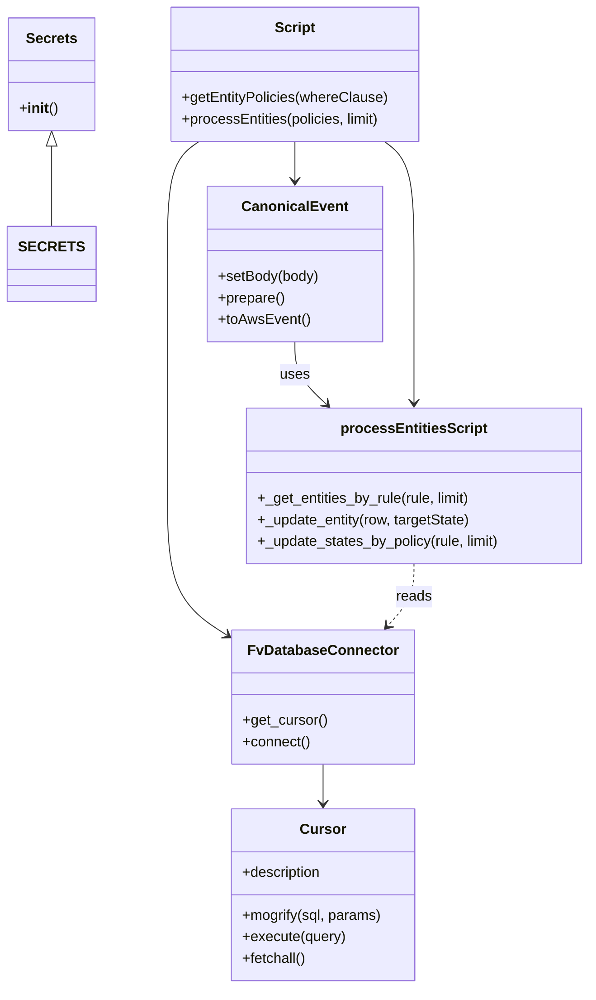

# Diagram: tools/ide_local_testing/localTest/processes/entityWatcherRuleProcessor.py


> Auto-generated by Obscura crawlers

## Diagram 1

```mermaid
flowchart TD
  A[Script start] --> B[getEntityPolicies(whereClause)]
  B --> C[DB_CONN: FvDatabaseConnector]
  C --> D[Cursor]
  D --> E[mogrify(sql)]
  E --> F[execute(query)]
  F --> G[fetchall() -> policies]
  G --> H[processEntities(policies, limit)]
  H --> I{for state_change_policy in policies}
  I --> J[Create body & CanonicalEvent]\n(J) --> K[prepare() -> toAwsEvent()]
  I --> L{for rule in policies}
  L --> M[print message]
  L --> N[_get_entities_by_rule(rule, limit)]
  N --> O[results]
  O --> P{if results}
  P --> Q[_update_entity(row, targetState)]
  M --> R[print durations]
  H --> S[return]
```

> SVG rendering failed for this diagram.

## Diagram 2



### SVG

<svg id="container" width="650.56640625" xmlns="http://www.w3.org/2000/svg" class="classDiagram" height="1104" viewBox="0 0 650.56640625 1104" role="graphics-document document" aria-roledescription="class"><style>#container{font-family:"trebuchet ms",verdana,arial,sans-serif;font-size:16px;fill:#333;}@keyframes edge-animation-frame{from{stroke-dashoffset:0;}}@keyframes dash{to{stroke-dashoffset:0;}}#container .edge-animation-slow{stroke-dasharray:9,5!important;stroke-dashoffset:900;animation:dash 50s linear infinite;stroke-linecap:round;}#container .edge-animation-fast{stroke-dasharray:9,5!important;stroke-dashoffset:900;animation:dash 20s linear infinite;stroke-linecap:round;}#container .error-icon{fill:#552222;}#container .error-text{fill:#552222;stroke:#552222;}#container .edge-thickness-normal{stroke-width:1px;}#container .edge-thickness-thick{stroke-width:3.5px;}#container .edge-pattern-solid{stroke-dasharray:0;}#container .edge-thickness-invisible{stroke-width:0;fill:none;}#container .edge-pattern-dashed{stroke-dasharray:3;}#container .edge-pattern-dotted{stroke-dasharray:2;}#container .marker{fill:#333333;stroke:#333333;}#container .marker.cross{stroke:#333333;}#container svg{font-family:"trebuchet ms",verdana,arial,sans-serif;font-size:16px;}#container p{margin:0;}#container g.classGroup text{fill:#9370DB;stroke:none;font-family:"trebuchet ms",verdana,arial,sans-serif;font-size:10px;}#container g.classGroup text .title{font-weight:bolder;}#container .nodeLabel,#container .edgeLabel{color:#131300;}#container .edgeLabel .label rect{fill:#ECECFF;}#container .label text{fill:#131300;}#container .labelBkg{background:#ECECFF;}#container .edgeLabel .label span{background:#ECECFF;}#container .classTitle{font-weight:bolder;}#container .node rect,#container .node circle,#container .node ellipse,#container .node polygon,#container .node path{fill:#ECECFF;stroke:#9370DB;stroke-width:1px;}#container .divider{stroke:#9370DB;stroke-width:1;}#container g.clickable{cursor:pointer;}#container g.classGroup rect{fill:#ECECFF;stroke:#9370DB;}#container g.classGroup line{stroke:#9370DB;stroke-width:1;}#container .classLabel .box{stroke:none;stroke-width:0;fill:#ECECFF;opacity:0.5;}#container .classLabel .label{fill:#9370DB;font-size:10px;}#container .relation{stroke:#333333;stroke-width:1;fill:none;}#container .dashed-line{stroke-dasharray:3;}#container .dotted-line{stroke-dasharray:1 2;}#container #compositionStart,#container .composition{fill:#333333!important;stroke:#333333!important;stroke-width:1;}#container #compositionEnd,#container .composition{fill:#333333!important;stroke:#333333!important;stroke-width:1;}#container #dependencyStart,#container .dependency{fill:#333333!important;stroke:#333333!important;stroke-width:1;}#container #dependencyStart,#container .dependency{fill:#333333!important;stroke:#333333!important;stroke-width:1;}#container #extensionStart,#container .extension{fill:transparent!important;stroke:#333333!important;stroke-width:1;}#container #extensionEnd,#container .extension{fill:transparent!important;stroke:#333333!important;stroke-width:1;}#container #aggregationStart,#container .aggregation{fill:transparent!important;stroke:#333333!important;stroke-width:1;}#container #aggregationEnd,#container .aggregation{fill:transparent!important;stroke:#333333!important;stroke-width:1;}#container #lollipopStart,#container .lollipop{fill:#ECECFF!important;stroke:#333333!important;stroke-width:1;}#container #lollipopEnd,#container .lollipop{fill:#ECECFF!important;stroke:#333333!important;stroke-width:1;}#container .edgeTerminals{font-size:11px;line-height:initial;}#container .classTitleText{text-anchor:middle;font-size:18px;fill:#333;}#container .label-icon{display:inline-block;height:1em;overflow:visible;vertical-align:-0.125em;}#container .node .label-icon path{fill:currentColor;stroke:revert;stroke-width:revert;}#container :root{--mermaid-font-family:"trebuchet ms",verdana,arial,sans-serif;}</style><g><defs><marker id="container_class-aggregationStart" class="marker aggregation class" refX="18" refY="7" markerWidth="190" markerHeight="240" orient="auto"><path d="M 18,7 L9,13 L1,7 L9,1 Z"></path></marker></defs><defs><marker id="container_class-aggregationEnd" class="marker aggregation class" refX="1" refY="7" markerWidth="20" markerHeight="28" orient="auto"><path d="M 18,7 L9,13 L1,7 L9,1 Z"></path></marker></defs><defs><marker id="container_class-extensionStart" class="marker extension class" refX="18" refY="7" markerWidth="190" markerHeight="240" orient="auto"><path d="M 1,7 L18,13 V 1 Z"></path></marker></defs><defs><marker id="container_class-extensionEnd" class="marker extension class" refX="1" refY="7" markerWidth="20" markerHeight="28" orient="auto"><path d="M 1,1 V 13 L18,7 Z"></path></marker></defs><defs><marker id="container_class-compositionStart" class="marker composition class" refX="18" refY="7" markerWidth="190" markerHeight="240" orient="auto"><path d="M 18,7 L9,13 L1,7 L9,1 Z"></path></marker></defs><defs><marker id="container_class-compositionEnd" class="marker composition class" refX="1" refY="7" markerWidth="20" markerHeight="28" orient="auto"><path d="M 18,7 L9,13 L1,7 L9,1 Z"></path></marker></defs><defs><marker id="container_class-dependencyStart" class="marker dependency class" refX="6" refY="7" markerWidth="190" markerHeight="240" orient="auto"><path d="M 5,7 L9,13 L1,7 L9,1 Z"></path></marker></defs><defs><marker id="container_class-dependencyEnd" class="marker dependency class" refX="13" refY="7" markerWidth="20" markerHeight="28" orient="auto"><path d="M 18,7 L9,13 L14,7 L9,1 Z"></path></marker></defs><defs><marker id="container_class-lollipopStart" class="marker lollipop class" refX="13" refY="7" markerWidth="190" markerHeight="240" orient="auto"><circle stroke="black" fill="transparent" cx="7" cy="7" r="6"></circle></marker></defs><defs><marker id="container_class-lollipopEnd" class="marker lollipop class" refX="1" refY="7" markerWidth="190" markerHeight="240" orient="auto"><circle stroke="black" fill="transparent" cx="7" cy="7" r="6"></circle></marker></defs><g class="root"><g class="clusters"></g><g class="edgePaths"><path d="M355.471,854L355.471,858.167C355.471,862.333,355.471,870.667,355.471,878C355.471,885.333,355.471,891.667,355.471,894.833L355.471,898" id="id_FvDatabaseConnector_Cursor_1" class="edge-thickness-normal edge-pattern-solid relation" style=";;;" data-edge="true" data-et="edge" data-id="id_FvDatabaseConnector_Cursor_1" data-points="W3sieCI6MzU1LjQ3MDcwMzEyNSwieSI6ODU0fSx7IngiOjM1NS40NzA3MDMxMjUsInkiOjg3OX0seyJ4IjozNTUuNDcwNzAzMTI1LCJ5Ijo5MDR9XQ==" marker-end="url(#container_class-dependencyEnd)"></path><path d="M323.016,382L323.016,388.167C323.016,394.333,323.016,406.667,328.824,418.314C334.632,429.961,346.249,440.922,352.057,446.402L357.865,451.882" id="id_CanonicalEvent_processEntitiesScript_2" class="edge-thickness-normal edge-pattern-solid relation" style=";;;" data-edge="true" data-et="edge" data-id="id_CanonicalEvent_processEntitiesScript_2" data-points="W3sieCI6MzIzLjAxNTYyNSwieSI6MzgyfSx7IngiOjMyMy4wMTU2MjUsInkiOjQxOX0seyJ4IjozNjIuMjI5MDUxMTU5Mjc0MiwieSI6NDU2fV0=" marker-end="url(#container_class-dependencyEnd)"></path><path d="M454.434,630L454.434,636.167C454.434,642.333,454.434,654.667,449.647,666.251C444.86,677.835,435.287,688.669,430.5,694.086L425.713,699.504" id="id_processEntitiesScript_FvDatabaseConnector_3" class="edge-thickness-normal edge-pattern-dashed relation" style=";;;" data-edge="true" data-et="edge" data-id="id_processEntitiesScript_FvDatabaseConnector_3" data-points="W3sieCI6NDU0LjQzMzU5Mzc1LCJ5Ijo2MzB9LHsieCI6NDU0LjQzMzU5Mzc1LCJ5Ijo2Njd9LHsieCI6NDIxLjc0MDQ5NTk1NDI0MTA2LCJ5Ijo3MDR9XQ==" marker-end="url(#container_class-dependencyEnd)"></path><path d="M54.98,163.25L54.98,166.542C54.98,169.833,54.98,176.417,54.98,191.375C54.98,206.333,54.98,229.667,54.98,241.333L54.98,253" id="id_Secrets_SECRETS_4" class="edge-thickness-normal edge-pattern-solid relation" style=";;;" data-edge="true" data-et="edge" data-id="id_Secrets_SECRETS_4" data-points="W3sieCI6NTQuOTgwNDY4NzUsInkiOjE0Nn0seyJ4Ijo1NC45ODA0Njg3NSwieSI6MTgzfSx7IngiOjU0Ljk4MDQ2ODc1LCJ5IjoyNTN9XQ==" marker-start="url(#container_class-extensionStart)"></path><path d="M215,158L208.999,162.167C202.998,166.333,190.996,174.667,184.995,197.5C178.994,220.333,178.994,257.667,178.994,297C178.994,336.333,178.994,377.667,178.994,419C178.994,460.333,178.994,501.667,178.994,543C178.994,584.333,178.994,625.667,191.067,653.995C203.14,682.324,227.286,697.648,239.359,705.31L251.432,712.972" id="id_Script_FvDatabaseConnector_5" class="edge-thickness-normal edge-pattern-solid relation" style=";;;" data-edge="true" data-et="edge" data-id="id_Script_FvDatabaseConnector_5" data-points="W3sieCI6MjE0Ljk5OTUxMTcxODc1LCJ5IjoxNTh9LHsieCI6MTc4Ljk5NDE0MDYyNSwieSI6MTgzfSx7IngiOjE3OC45OTQxNDA2MjUsInkiOjI5NX0seyJ4IjoxNzguOTk0MTQwNjI1LCJ5Ijo0MTl9LHsieCI6MTc4Ljk5NDE0MDYyNSwieSI6NTQzfSx7IngiOjE3OC45OTQxNDA2MjUsInkiOjY2N30seyJ4IjoyNTYuNDk4MDQ2ODc1LCJ5Ijo3MTYuMTg3NDgwNjMyMTY2MX1d" marker-end="url(#container_class-dependencyEnd)"></path><path d="M323.016,158L323.016,162.167C323.016,166.333,323.016,174.667,323.016,182C323.016,189.333,323.016,195.667,323.016,198.833L323.016,202" id="id_Script_CanonicalEvent_6" class="edge-thickness-normal edge-pattern-solid relation" style=";;;" data-edge="true" data-et="edge" data-id="id_Script_CanonicalEvent_6" data-points="W3sieCI6MzIzLjAxNTYyNSwieSI6MTU4fSx7IngiOjMyMy4wMTU2MjUsInkiOjE4M30seyJ4IjozMjMuMDE1NjI1LCJ5IjoyMDh9XQ==" marker-end="url(#container_class-dependencyEnd)"></path><path d="M421.579,158L427.055,162.167C432.531,166.333,443.482,174.667,448.958,197.5C454.434,220.333,454.434,257.667,454.434,297C454.434,336.333,454.434,377.667,454.434,403.5C454.434,429.333,454.434,439.667,454.434,444.833L454.434,450" id="id_Script_processEntitiesScript_7" class="edge-thickness-normal edge-pattern-solid relation" style=";;;" data-edge="true" data-et="edge" data-id="id_Script_processEntitiesScript_7" data-points="W3sieCI6NDIxLjU3OTEwMTU2MjUsInkiOjE1OH0seyJ4Ijo0NTQuNDMzNTkzNzUsInkiOjE4M30seyJ4Ijo0NTQuNDMzNTkzNzUsInkiOjI5NX0seyJ4Ijo0NTQuNDMzNTkzNzUsInkiOjQxOX0seyJ4Ijo0NTQuNDMzNTkzNzUsInkiOjQ1Nn1d" marker-end="url(#container_class-dependencyEnd)"></path></g><g class="edgeLabels"><g class="edgeLabel"><g class="label" data-id="id_FvDatabaseConnector_Cursor_1" transform="translate(0, 0)"><foreignObject width="0" height="0"><div xmlns="http://www.w3.org/1999/xhtml" class="labelBkg" style="display: table-cell; white-space: nowrap; line-height: 1.5; max-width: 200px; text-align: center;"><span class="edgeLabel"></span></div></foreignObject></g></g><g class="edgeLabel" transform="translate(323.015625, 419)"><g class="label" data-id="id_CanonicalEvent_processEntitiesScript_2" transform="translate(-16.4921875, -12)"><foreignObject width="32.984375" height="24"><div xmlns="http://www.w3.org/1999/xhtml" class="labelBkg" style="display: table-cell; white-space: nowrap; line-height: 1.5; max-width: 200px; text-align: center;"><span class="edgeLabel"><p>uses</p></span></div></foreignObject></g></g><g class="edgeLabel" transform="translate(454.43359375, 667)"><g class="label" data-id="id_processEntitiesScript_FvDatabaseConnector_3" transform="translate(-20.0078125, -12)"><foreignObject width="40.015625" height="24"><div xmlns="http://www.w3.org/1999/xhtml" class="labelBkg" style="display: table-cell; white-space: nowrap; line-height: 1.5; max-width: 200px; text-align: center;"><span class="edgeLabel"><p>reads</p></span></div></foreignObject></g></g><g class="edgeLabel"><g class="label" data-id="id_Secrets_SECRETS_4" transform="translate(0, 0)"><foreignObject width="0" height="0"><div xmlns="http://www.w3.org/1999/xhtml" class="labelBkg" style="display: table-cell; white-space: nowrap; line-height: 1.5; max-width: 200px; text-align: center;"><span class="edgeLabel"></span></div></foreignObject></g></g><g class="edgeLabel"><g class="label" data-id="id_Script_FvDatabaseConnector_5" transform="translate(0, 0)"><foreignObject width="0" height="0"><div xmlns="http://www.w3.org/1999/xhtml" class="labelBkg" style="display: table-cell; white-space: nowrap; line-height: 1.5; max-width: 200px; text-align: center;"><span class="edgeLabel"></span></div></foreignObject></g></g><g class="edgeLabel"><g class="label" data-id="id_Script_CanonicalEvent_6" transform="translate(0, 0)"><foreignObject width="0" height="0"><div xmlns="http://www.w3.org/1999/xhtml" class="labelBkg" style="display: table-cell; white-space: nowrap; line-height: 1.5; max-width: 200px; text-align: center;"><span class="edgeLabel"></span></div></foreignObject></g></g><g class="edgeLabel"><g class="label" data-id="id_Script_processEntitiesScript_7" transform="translate(0, 0)"><foreignObject width="0" height="0"><div xmlns="http://www.w3.org/1999/xhtml" class="labelBkg" style="display: table-cell; white-space: nowrap; line-height: 1.5; max-width: 200px; text-align: center;"><span class="edgeLabel"></span></div></foreignObject></g></g></g><g class="nodes"><g class="node default" id="classId-FvDatabaseConnector-0" transform="translate(355.470703125, 779)"><g class="basic label-container"><path d="M-98.97265625 -75 L98.97265625 -75 L98.97265625 75 L-98.97265625 75" stroke="none" stroke-width="0" fill="#ECECFF" style=""></path><path d="M-98.97265625 -75 C-33.937684889408786 -75, 31.09728647118243 -75, 98.97265625 -75 M-98.97265625 -75 C-24.765606329078565 -75, 49.44144359184287 -75, 98.97265625 -75 M98.97265625 -75 C98.97265625 -20.443507124137703, 98.97265625 34.112985751724594, 98.97265625 75 M98.97265625 -75 C98.97265625 -36.87138836325898, 98.97265625 1.2572232734820403, 98.97265625 75 M98.97265625 75 C43.40103635516293 75, -12.17058353967414 75, -98.97265625 75 M98.97265625 75 C52.5578811779583 75, 6.143106105916601 75, -98.97265625 75 M-98.97265625 75 C-98.97265625 30.81453173067294, -98.97265625 -13.37093653865412, -98.97265625 -75 M-98.97265625 75 C-98.97265625 20.85023699880415, -98.97265625 -33.2995260023917, -98.97265625 -75" stroke="#9370DB" stroke-width="1.3" fill="none" stroke-dasharray="0 0" style=""></path></g><g class="annotation-group text" transform="translate(0, -51)"></g><g class="label-group text" transform="translate(-79.3046875, -51)"><g class="label" style="font-weight: bolder" transform="translate(0,-12)"><foreignObject width="158.609375" height="24"><div xmlns="http://www.w3.org/1999/xhtml" style="display: table-cell; white-space: nowrap; line-height: 1.5; max-width: 207px; text-align: center;"><span class="nodeLabel markdown-node-label" style=""><p>FvDatabaseConnector</p></span></div></foreignObject></g></g><g class="members-group text" transform="translate(-86.97265625, -3)"></g><g class="methods-group text" transform="translate(-86.97265625, 27)"><g class="label" style="" transform="translate(0,-12)"><foreignObject width="94.640625" height="24"><div xmlns="http://www.w3.org/1999/xhtml" style="display: table-cell; white-space: nowrap; line-height: 1.5; max-width: 152px; text-align: center;"><span class="nodeLabel markdown-node-label" style=""><p>+get_cursor()</p></span></div></foreignObject></g><g class="label" style="" transform="translate(0,12)"><foreignObject width="75.921875" height="24"><div xmlns="http://www.w3.org/1999/xhtml" style="display: table-cell; white-space: nowrap; line-height: 1.5; max-width: 133px; text-align: center;"><span class="nodeLabel markdown-node-label" style=""><p>+connect()</p></span></div></foreignObject></g></g><g class="divider" style=""><path d="M-98.97265625 -27 C-44.10229787424783 -27, 10.768060501504337 -27, 98.97265625 -27 M-98.97265625 -27 C-41.67582562355859 -27, 15.621005002882825 -27, 98.97265625 -27" stroke="#9370DB" stroke-width="1.3" fill="none" stroke-dasharray="0 0" style=""></path></g><g class="divider" style=""><path d="M-98.97265625 -3 C-44.16763006758643 -3, 10.63739611482714 -3, 98.97265625 -3 M-98.97265625 -3 C-29.06404184623871 -3, 40.84457255752258 -3, 98.97265625 -3" stroke="#9370DB" stroke-width="1.3" fill="none" stroke-dasharray="0 0" style=""></path></g></g><g class="node default" id="classId-Cursor-1" transform="translate(355.470703125, 1000)"><g class="basic label-container"><path d="M-102.4921875 -96 L102.4921875 -96 L102.4921875 96 L-102.4921875 96" stroke="none" stroke-width="0" fill="#ECECFF" style=""></path><path d="M-102.4921875 -96 C-28.723434224035103 -96, 45.045319051929795 -96, 102.4921875 -96 M-102.4921875 -96 C-52.36165707421817 -96, -2.2311266484363443 -96, 102.4921875 -96 M102.4921875 -96 C102.4921875 -20.35725467814278, 102.4921875 55.28549064371444, 102.4921875 96 M102.4921875 -96 C102.4921875 -36.24692488162669, 102.4921875 23.50615023674662, 102.4921875 96 M102.4921875 96 C53.19468941706398 96, 3.897191334127953 96, -102.4921875 96 M102.4921875 96 C52.274042393864846 96, 2.0558972877296924 96, -102.4921875 96 M-102.4921875 96 C-102.4921875 25.81467263450496, -102.4921875 -44.37065473099008, -102.4921875 -96 M-102.4921875 96 C-102.4921875 32.80427200946164, -102.4921875 -30.391455981076717, -102.4921875 -96" stroke="#9370DB" stroke-width="1.3" fill="none" stroke-dasharray="0 0" style=""></path></g><g class="annotation-group text" transform="translate(0, -72)"></g><g class="label-group text" transform="translate(-23.90625, -72)"><g class="label" style="font-weight: bolder" transform="translate(0,-12)"><foreignObject width="47.8125" height="24"><div xmlns="http://www.w3.org/1999/xhtml" style="display: table-cell; white-space: nowrap; line-height: 1.5; max-width: 98px; text-align: center;"><span class="nodeLabel markdown-node-label" style=""><p>Cursor</p></span></div></foreignObject></g></g><g class="members-group text" transform="translate(-90.4921875, -24)"><g class="label" style="" transform="translate(0,-12)"><foreignObject width="90.59375" height="24"><div xmlns="http://www.w3.org/1999/xhtml" style="display: table-cell; white-space: nowrap; line-height: 1.5; max-width: 148px; text-align: center;"><span class="nodeLabel markdown-node-label" style=""><p>+description</p></span></div></foreignObject></g></g><g class="methods-group text" transform="translate(-90.4921875, 24)"><g class="label" style="" transform="translate(0,-12)"><foreignObject width="157.078125" height="24"><div xmlns="http://www.w3.org/1999/xhtml" style="display: table-cell; white-space: nowrap; line-height: 1.5; max-width: 214px; text-align: center;"><span class="nodeLabel markdown-node-label" style=""><p>+mogrify(sql, params)</p></span></div></foreignObject></g><g class="label" style="" transform="translate(0,12)"><foreignObject width="115.96875" height="24"><div xmlns="http://www.w3.org/1999/xhtml" style="display: table-cell; white-space: nowrap; line-height: 1.5; max-width: 173px; text-align: center;"><span class="nodeLabel markdown-node-label" style=""><p>+execute(query)</p></span></div></foreignObject></g><g class="label" style="" transform="translate(0,36)"><foreignObject width="72.515625" height="24"><div xmlns="http://www.w3.org/1999/xhtml" style="display: table-cell; white-space: nowrap; line-height: 1.5; max-width: 130px; text-align: center;"><span class="nodeLabel markdown-node-label" style=""><p>+fetchall()</p></span></div></foreignObject></g></g><g class="divider" style=""><path d="M-102.4921875 -48 C-42.59510025524489 -48, 17.301986989510226 -48, 102.4921875 -48 M-102.4921875 -48 C-25.577716523595 -48, 51.33675445281 -48, 102.4921875 -48" stroke="#9370DB" stroke-width="1.3" fill="none" stroke-dasharray="0 0" style=""></path></g><g class="divider" style=""><path d="M-102.4921875 0 C-59.980301999136636 0, -17.46841649827327 0, 102.4921875 0 M-102.4921875 0 C-28.56301051434869 0, 45.36616647130262 0, 102.4921875 0" stroke="#9370DB" stroke-width="1.3" fill="none" stroke-dasharray="0 0" style=""></path></g></g><g class="node default" id="classId-CanonicalEvent-2" transform="translate(323.015625, 295)"><g class="basic label-container"><path d="M-96.41796875 -87 L96.41796875 -87 L96.41796875 87 L-96.41796875 87" stroke="none" stroke-width="0" fill="#ECECFF" style=""></path><path d="M-96.41796875 -87 C-39.91468989382252 -87, 16.58858896235496 -87, 96.41796875 -87 M-96.41796875 -87 C-53.75055220996858 -87, -11.083135669937164 -87, 96.41796875 -87 M96.41796875 -87 C96.41796875 -39.0567081536139, 96.41796875 8.886583692772206, 96.41796875 87 M96.41796875 -87 C96.41796875 -35.44311480939898, 96.41796875 16.113770381202045, 96.41796875 87 M96.41796875 87 C39.638539467569345 87, -17.14088981486131 87, -96.41796875 87 M96.41796875 87 C27.359537284752733 87, -41.698894180494534 87, -96.41796875 87 M-96.41796875 87 C-96.41796875 47.42368605957554, -96.41796875 7.847372119151075, -96.41796875 -87 M-96.41796875 87 C-96.41796875 32.8597334302266, -96.41796875 -21.280533139546804, -96.41796875 -87" stroke="#9370DB" stroke-width="1.3" fill="none" stroke-dasharray="0 0" style=""></path></g><g class="annotation-group text" transform="translate(0, -63)"></g><g class="label-group text" transform="translate(-55.7109375, -63)"><g class="label" style="font-weight: bolder" transform="translate(0,-12)"><foreignObject width="111.421875" height="24"><div xmlns="http://www.w3.org/1999/xhtml" style="display: table-cell; white-space: nowrap; line-height: 1.5; max-width: 161px; text-align: center;"><span class="nodeLabel markdown-node-label" style=""><p>CanonicalEvent</p></span></div></foreignObject></g></g><g class="members-group text" transform="translate(-84.41796875, -15)"></g><g class="methods-group text" transform="translate(-84.41796875, 15)"><g class="label" style="" transform="translate(0,-12)"><foreignObject width="113.125" height="24"><div xmlns="http://www.w3.org/1999/xhtml" style="display: table-cell; white-space: nowrap; line-height: 1.5; max-width: 170px; text-align: center;"><span class="nodeLabel markdown-node-label" style=""><p>+setBody(body)</p></span></div></foreignObject></g><g class="label" style="" transform="translate(0,12)"><foreignObject width="74.75" height="24"><div xmlns="http://www.w3.org/1999/xhtml" style="display: table-cell; white-space: nowrap; line-height: 1.5; max-width: 132px; text-align: center;"><span class="nodeLabel markdown-node-label" style=""><p>+prepare()</p></span></div></foreignObject></g><g class="label" style="" transform="translate(0,36)"><foreignObject width="101.1875" height="24"><div xmlns="http://www.w3.org/1999/xhtml" style="display: table-cell; white-space: nowrap; line-height: 1.5; max-width: 159px; text-align: center;"><span class="nodeLabel markdown-node-label" style=""><p>+toAwsEvent()</p></span></div></foreignObject></g></g><g class="divider" style=""><path d="M-96.41796875 -39 C-35.68610328534767 -39, 25.04576217930466 -39, 96.41796875 -39 M-96.41796875 -39 C-46.556490731461516 -39, 3.304987287076969 -39, 96.41796875 -39" stroke="#9370DB" stroke-width="1.3" fill="none" stroke-dasharray="0 0" style=""></path></g><g class="divider" style=""><path d="M-96.41796875 -15 C-30.46039597139523 -15, 35.49717680720954 -15, 96.41796875 -15 M-96.41796875 -15 C-36.29728203265664 -15, 23.82340468468672 -15, 96.41796875 -15" stroke="#9370DB" stroke-width="1.3" fill="none" stroke-dasharray="0 0" style=""></path></g></g><g class="node default" id="classId-Secrets-3" transform="translate(54.98046875, 83)"><g class="basic label-container"><path d="M-46.98046875 -63 L46.98046875 -63 L46.98046875 63 L-46.98046875 63" stroke="none" stroke-width="0" fill="#ECECFF" style=""></path><path d="M-46.98046875 -63 C-28.14739640989216 -63, -9.31432406978432 -63, 46.98046875 -63 M-46.98046875 -63 C-26.352207251870443 -63, -5.723945753740885 -63, 46.98046875 -63 M46.98046875 -63 C46.98046875 -16.191326305476153, 46.98046875 30.617347389047694, 46.98046875 63 M46.98046875 -63 C46.98046875 -19.224153841672198, 46.98046875 24.551692316655604, 46.98046875 63 M46.98046875 63 C24.929163399842636 63, 2.8778580496852726 63, -46.98046875 63 M46.98046875 63 C20.27096034258446 63, -6.438548064831082 63, -46.98046875 63 M-46.98046875 63 C-46.98046875 33.0910607616746, -46.98046875 3.1821215233491884, -46.98046875 -63 M-46.98046875 63 C-46.98046875 15.575386900352633, -46.98046875 -31.849226199294733, -46.98046875 -63" stroke="#9370DB" stroke-width="1.3" fill="none" stroke-dasharray="0 0" style=""></path></g><g class="annotation-group text" transform="translate(0, -39)"></g><g class="label-group text" transform="translate(-27.1640625, -39)"><g class="label" style="font-weight: bolder" transform="translate(0,-12)"><foreignObject width="54.328125" height="24"><div xmlns="http://www.w3.org/1999/xhtml" style="display: table-cell; white-space: nowrap; line-height: 1.5; max-width: 103px; text-align: center;"><span class="nodeLabel markdown-node-label" style=""><p>Secrets</p></span></div></foreignObject></g></g><g class="members-group text" transform="translate(-34.98046875, 9)"></g><g class="methods-group text" transform="translate(-34.98046875, 39)"><g class="label" style="" transform="translate(0,-12)"><foreignObject width="42.796875" height="24"><div xmlns="http://www.w3.org/1999/xhtml" style="display: table-cell; white-space: nowrap; line-height: 1.5; max-width: 132px; text-align: center;"><span class="nodeLabel markdown-node-label" style=""><p>+<strong>init</strong>()</p></span></div></foreignObject></g></g><g class="divider" style=""><path d="M-46.98046875 -15 C-24.745346542253298 -15, -2.5102243345065958 -15, 46.98046875 -15 M-46.98046875 -15 C-24.384494986875538 -15, -1.7885212237510757 -15, 46.98046875 -15" stroke="#9370DB" stroke-width="1.3" fill="none" stroke-dasharray="0 0" style=""></path></g><g class="divider" style=""><path d="M-46.98046875 9 C-19.755950073301918 9, 7.4685686033961645 9, 46.98046875 9 M-46.98046875 9 C-23.63432335768898 9, -0.2881779653779617 9, 46.98046875 9" stroke="#9370DB" stroke-width="1.3" fill="none" stroke-dasharray="0 0" style=""></path></g></g><g class="node default" id="classId-processEntitiesScript-4" transform="translate(454.43359375, 543)"><g class="basic label-container"><path d="M-188.1328125 -87 L188.1328125 -87 L188.1328125 87 L-188.1328125 87" stroke="none" stroke-width="0" fill="#ECECFF" style=""></path><path d="M-188.1328125 -87 C-57.102911273288356 -87, 73.92698995342329 -87, 188.1328125 -87 M-188.1328125 -87 C-65.76631872610612 -87, 56.60017504778776 -87, 188.1328125 -87 M188.1328125 -87 C188.1328125 -45.01867047505631, 188.1328125 -3.037340950112622, 188.1328125 87 M188.1328125 -87 C188.1328125 -20.275940080504597, 188.1328125 46.448119838990806, 188.1328125 87 M188.1328125 87 C94.21604543553444 87, 0.2992783710688798 87, -188.1328125 87 M188.1328125 87 C83.57223667959435 87, -20.98833914081129 87, -188.1328125 87 M-188.1328125 87 C-188.1328125 41.98782427352395, -188.1328125 -3.0243514529521036, -188.1328125 -87 M-188.1328125 87 C-188.1328125 29.78879880069711, -188.1328125 -27.422402398605783, -188.1328125 -87" stroke="#9370DB" stroke-width="1.3" fill="none" stroke-dasharray="0 0" style=""></path></g><g class="annotation-group text" transform="translate(0, -63)"></g><g class="label-group text" transform="translate(-77.625, -63)"><g class="label" style="font-weight: bolder" transform="translate(0,-12)"><foreignObject width="155.25" height="24"><div xmlns="http://www.w3.org/1999/xhtml" style="display: table-cell; white-space: nowrap; line-height: 1.5; max-width: 202px; text-align: center;"><span class="nodeLabel markdown-node-label" style=""><p>processEntitiesScript</p></span></div></foreignObject></g></g><g class="members-group text" transform="translate(-176.1328125, -15)"></g><g class="methods-group text" transform="translate(-176.1328125, 15)"><g class="label" style="" transform="translate(0,-12)"><foreignObject width="242.875" height="24"><div xmlns="http://www.w3.org/1999/xhtml" style="display: table-cell; white-space: nowrap; line-height: 1.5; max-width: 300px; text-align: center;"><span class="nodeLabel markdown-node-label" style=""><p>+_get_entities_by_rule(rule, limit)</p></span></div></foreignObject></g><g class="label" style="" transform="translate(0,12)"><foreignObject width="240.53125" height="24"><div xmlns="http://www.w3.org/1999/xhtml" style="display: table-cell; white-space: nowrap; line-height: 1.5; max-width: 298px; text-align: center;"><span class="nodeLabel markdown-node-label" style=""><p>+_update_entity(row, targetState)</p></span></div></foreignObject></g><g class="label" style="" transform="translate(0,36)"><foreignObject width="274.640625" height="24"><div xmlns="http://www.w3.org/1999/xhtml" style="display: table-cell; white-space: nowrap; line-height: 1.5; max-width: 332px; text-align: center;"><span class="nodeLabel markdown-node-label" style=""><p>+_update_states_by_policy(rule, limit)</p></span></div></foreignObject></g></g><g class="divider" style=""><path d="M-188.1328125 -39 C-107.73539073240266 -39, -27.337968964805327 -39, 188.1328125 -39 M-188.1328125 -39 C-72.8532130764643 -39, 42.4263863470714 -39, 188.1328125 -39" stroke="#9370DB" stroke-width="1.3" fill="none" stroke-dasharray="0 0" style=""></path></g><g class="divider" style=""><path d="M-188.1328125 -15 C-63.488649095287414 -15, 61.15551430942517 -15, 188.1328125 -15 M-188.1328125 -15 C-64.18776475237372 -15, 59.75728299525255 -15, 188.1328125 -15" stroke="#9370DB" stroke-width="1.3" fill="none" stroke-dasharray="0 0" style=""></path></g></g><g class="node default" id="classId-SECRETS-5" transform="translate(54.98046875, 295)"><g class="basic label-container"><path d="M-43.15625 -42 L43.15625 -42 L43.15625 42 L-43.15625 42" stroke="none" stroke-width="0" fill="#ECECFF" style=""></path><path d="M-43.15625 -42 C-11.605366230199145 -42, 19.94551753960171 -42, 43.15625 -42 M-43.15625 -42 C-9.971714076013512 -42, 23.212821847972975 -42, 43.15625 -42 M43.15625 -42 C43.15625 -10.81873858314405, 43.15625 20.3625228337119, 43.15625 42 M43.15625 -42 C43.15625 -12.4628633185702, 43.15625 17.0742733628596, 43.15625 42 M43.15625 42 C20.568378768820978 42, -2.019492462358045 42, -43.15625 42 M43.15625 42 C10.709990892483418 42, -21.736268215033164 42, -43.15625 42 M-43.15625 42 C-43.15625 23.25519846056389, -43.15625 4.510396921127779, -43.15625 -42 M-43.15625 42 C-43.15625 17.158155835945596, -43.15625 -7.683688328108808, -43.15625 -42" stroke="#9370DB" stroke-width="1.3" fill="none" stroke-dasharray="0 0" style=""></path></g><g class="annotation-group text" transform="translate(0, -18)"></g><g class="label-group text" transform="translate(-31.15625, -18)"><g class="label" style="font-weight: bolder" transform="translate(0,-12)"><foreignObject width="62.3125" height="24"><div xmlns="http://www.w3.org/1999/xhtml" style="display: table-cell; white-space: nowrap; line-height: 1.5; max-width: 111px; text-align: center;"><span class="nodeLabel markdown-node-label" style=""><p>SECRETS</p></span></div></foreignObject></g></g><g class="members-group text" transform="translate(-31.15625, 30)"></g><g class="methods-group text" transform="translate(-31.15625, 60)"></g><g class="divider" style=""><path d="M-43.15625 6 C-14.763814139320065 6, 13.62862172135987 6, 43.15625 6 M-43.15625 6 C-12.494784430491062 6, 18.166681139017875 6, 43.15625 6" stroke="#9370DB" stroke-width="1.3" fill="none" stroke-dasharray="0 0" style=""></path></g><g class="divider" style=""><path d="M-43.15625 24 C-23.95229039125694 24, -4.748330782513882 24, 43.15625 24 M-43.15625 24 C-12.432732451299259 24, 18.290785097401482 24, 43.15625 24" stroke="#9370DB" stroke-width="1.3" fill="none" stroke-dasharray="0 0" style=""></path></g></g><g class="node default" id="classId-Script-6" transform="translate(323.015625, 83)"><g class="basic label-container"><path d="M-137.80078125 -75 L137.80078125 -75 L137.80078125 75 L-137.80078125 75" stroke="none" stroke-width="0" fill="#ECECFF" style=""></path><path d="M-137.80078125 -75 C-65.91670171076503 -75, 5.9673778284699495 -75, 137.80078125 -75 M-137.80078125 -75 C-53.10119251442764 -75, 31.598396221144725 -75, 137.80078125 -75 M137.80078125 -75 C137.80078125 -19.937891725152163, 137.80078125 35.124216549695674, 137.80078125 75 M137.80078125 -75 C137.80078125 -24.707768875619166, 137.80078125 25.584462248761668, 137.80078125 75 M137.80078125 75 C62.42220895564259 75, -12.956363338714823 75, -137.80078125 75 M137.80078125 75 C34.34944535534592 75, -69.10189053930816 75, -137.80078125 75 M-137.80078125 75 C-137.80078125 25.730220903501802, -137.80078125 -23.539558192996395, -137.80078125 -75 M-137.80078125 75 C-137.80078125 32.94445919230303, -137.80078125 -9.111081615393942, -137.80078125 -75" stroke="#9370DB" stroke-width="1.3" fill="none" stroke-dasharray="0 0" style=""></path></g><g class="annotation-group text" transform="translate(0, -51)"></g><g class="label-group text" transform="translate(-21.7421875, -51)"><g class="label" style="font-weight: bolder" transform="translate(0,-12)"><foreignObject width="43.484375" height="24"><div xmlns="http://www.w3.org/1999/xhtml" style="display: table-cell; white-space: nowrap; line-height: 1.5; max-width: 93px; text-align: center;"><span class="nodeLabel markdown-node-label" style=""><p>Script</p></span></div></foreignObject></g></g><g class="members-group text" transform="translate(-125.80078125, -3)"></g><g class="methods-group text" transform="translate(-125.80078125, 27)"><g class="label" style="" transform="translate(0,-12)"><foreignObject width="229.859375" height="24"><div xmlns="http://www.w3.org/1999/xhtml" style="display: table-cell; white-space: nowrap; line-height: 1.5; max-width: 287px; text-align: center;"><span class="nodeLabel markdown-node-label" style=""><p>+getEntityPolicies(whereClause)</p></span></div></foreignObject></g><g class="label" style="" transform="translate(0,12)"><foreignObject width="225.953125" height="24"><div xmlns="http://www.w3.org/1999/xhtml" style="display: table-cell; white-space: nowrap; line-height: 1.5; max-width: 283px; text-align: center;"><span class="nodeLabel markdown-node-label" style=""><p>+processEntities(policies, limit)</p></span></div></foreignObject></g></g><g class="divider" style=""><path d="M-137.80078125 -27 C-81.8644190369788 -27, -25.92805682395759 -27, 137.80078125 -27 M-137.80078125 -27 C-41.98641012172327 -27, 53.827961006553465 -27, 137.80078125 -27" stroke="#9370DB" stroke-width="1.3" fill="none" stroke-dasharray="0 0" style=""></path></g><g class="divider" style=""><path d="M-137.80078125 -3 C-58.31915814432065 -3, 21.162464961358694 -3, 137.80078125 -3 M-137.80078125 -3 C-47.53906383083081 -3, 42.722653588338375 -3, 137.80078125 -3" stroke="#9370DB" stroke-width="1.3" fill="none" stroke-dasharray="0 0" style=""></path></g></g></g></g></g></svg>
