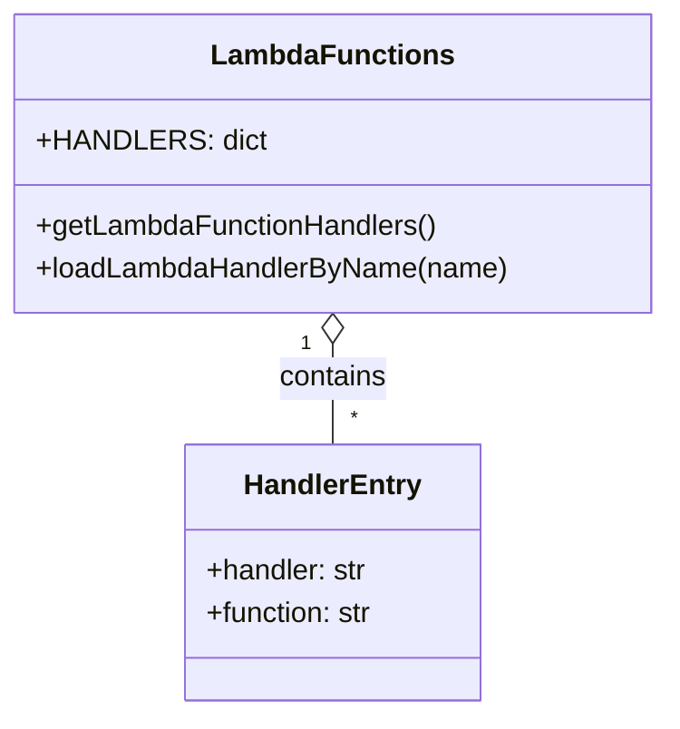

# Diagram: tools/ide_local_testing/localTest/setup/LambdaFunctions.py


> Auto-generated by Obscura crawlers

## Diagram 1



### SVG

<svg id="container" width="370.8828125" xmlns="http://www.w3.org/2000/svg" class="classDiagram" height="402" viewBox="0 0 370.8828125 402" role="graphics-document document" aria-roledescription="class"><style>#container{font-family:"trebuchet ms",verdana,arial,sans-serif;font-size:16px;fill:#333;}@keyframes edge-animation-frame{from{stroke-dashoffset:0;}}@keyframes dash{to{stroke-dashoffset:0;}}#container .edge-animation-slow{stroke-dasharray:9,5!important;stroke-dashoffset:900;animation:dash 50s linear infinite;stroke-linecap:round;}#container .edge-animation-fast{stroke-dasharray:9,5!important;stroke-dashoffset:900;animation:dash 20s linear infinite;stroke-linecap:round;}#container .error-icon{fill:#552222;}#container .error-text{fill:#552222;stroke:#552222;}#container .edge-thickness-normal{stroke-width:1px;}#container .edge-thickness-thick{stroke-width:3.5px;}#container .edge-pattern-solid{stroke-dasharray:0;}#container .edge-thickness-invisible{stroke-width:0;fill:none;}#container .edge-pattern-dashed{stroke-dasharray:3;}#container .edge-pattern-dotted{stroke-dasharray:2;}#container .marker{fill:#333333;stroke:#333333;}#container .marker.cross{stroke:#333333;}#container svg{font-family:"trebuchet ms",verdana,arial,sans-serif;font-size:16px;}#container p{margin:0;}#container g.classGroup text{fill:#9370DB;stroke:none;font-family:"trebuchet ms",verdana,arial,sans-serif;font-size:10px;}#container g.classGroup text .title{font-weight:bolder;}#container .nodeLabel,#container .edgeLabel{color:#131300;}#container .edgeLabel .label rect{fill:#ECECFF;}#container .label text{fill:#131300;}#container .labelBkg{background:#ECECFF;}#container .edgeLabel .label span{background:#ECECFF;}#container .classTitle{font-weight:bolder;}#container .node rect,#container .node circle,#container .node ellipse,#container .node polygon,#container .node path{fill:#ECECFF;stroke:#9370DB;stroke-width:1px;}#container .divider{stroke:#9370DB;stroke-width:1;}#container g.clickable{cursor:pointer;}#container g.classGroup rect{fill:#ECECFF;stroke:#9370DB;}#container g.classGroup line{stroke:#9370DB;stroke-width:1;}#container .classLabel .box{stroke:none;stroke-width:0;fill:#ECECFF;opacity:0.5;}#container .classLabel .label{fill:#9370DB;font-size:10px;}#container .relation{stroke:#333333;stroke-width:1;fill:none;}#container .dashed-line{stroke-dasharray:3;}#container .dotted-line{stroke-dasharray:1 2;}#container #compositionStart,#container .composition{fill:#333333!important;stroke:#333333!important;stroke-width:1;}#container #compositionEnd,#container .composition{fill:#333333!important;stroke:#333333!important;stroke-width:1;}#container #dependencyStart,#container .dependency{fill:#333333!important;stroke:#333333!important;stroke-width:1;}#container #dependencyStart,#container .dependency{fill:#333333!important;stroke:#333333!important;stroke-width:1;}#container #extensionStart,#container .extension{fill:transparent!important;stroke:#333333!important;stroke-width:1;}#container #extensionEnd,#container .extension{fill:transparent!important;stroke:#333333!important;stroke-width:1;}#container #aggregationStart,#container .aggregation{fill:transparent!important;stroke:#333333!important;stroke-width:1;}#container #aggregationEnd,#container .aggregation{fill:transparent!important;stroke:#333333!important;stroke-width:1;}#container #lollipopStart,#container .lollipop{fill:#ECECFF!important;stroke:#333333!important;stroke-width:1;}#container #lollipopEnd,#container .lollipop{fill:#ECECFF!important;stroke:#333333!important;stroke-width:1;}#container .edgeTerminals{font-size:11px;line-height:initial;}#container .classTitleText{text-anchor:middle;font-size:18px;fill:#333;}#container .label-icon{display:inline-block;height:1em;overflow:visible;vertical-align:-0.125em;}#container .node .label-icon path{fill:currentColor;stroke:revert;stroke-width:revert;}#container :root{--mermaid-font-family:"trebuchet ms",verdana,arial,sans-serif;}</style><g><defs><marker id="container_class-aggregationStart" class="marker aggregation class" refX="18" refY="7" markerWidth="190" markerHeight="240" orient="auto"><path d="M 18,7 L9,13 L1,7 L9,1 Z"></path></marker></defs><defs><marker id="container_class-aggregationEnd" class="marker aggregation class" refX="1" refY="7" markerWidth="20" markerHeight="28" orient="auto"><path d="M 18,7 L9,13 L1,7 L9,1 Z"></path></marker></defs><defs><marker id="container_class-extensionStart" class="marker extension class" refX="18" refY="7" markerWidth="190" markerHeight="240" orient="auto"><path d="M 1,7 L18,13 V 1 Z"></path></marker></defs><defs><marker id="container_class-extensionEnd" class="marker extension class" refX="1" refY="7" markerWidth="20" markerHeight="28" orient="auto"><path d="M 1,1 V 13 L18,7 Z"></path></marker></defs><defs><marker id="container_class-compositionStart" class="marker composition class" refX="18" refY="7" markerWidth="190" markerHeight="240" orient="auto"><path d="M 18,7 L9,13 L1,7 L9,1 Z"></path></marker></defs><defs><marker id="container_class-compositionEnd" class="marker composition class" refX="1" refY="7" markerWidth="20" markerHeight="28" orient="auto"><path d="M 18,7 L9,13 L1,7 L9,1 Z"></path></marker></defs><defs><marker id="container_class-dependencyStart" class="marker dependency class" refX="6" refY="7" markerWidth="190" markerHeight="240" orient="auto"><path d="M 5,7 L9,13 L1,7 L9,1 Z"></path></marker></defs><defs><marker id="container_class-dependencyEnd" class="marker dependency class" refX="13" refY="7" markerWidth="20" markerHeight="28" orient="auto"><path d="M 18,7 L9,13 L14,7 L9,1 Z"></path></marker></defs><defs><marker id="container_class-lollipopStart" class="marker lollipop class" refX="13" refY="7" markerWidth="190" markerHeight="240" orient="auto"><circle stroke="black" fill="transparent" cx="7" cy="7" r="6"></circle></marker></defs><defs><marker id="container_class-lollipopEnd" class="marker lollipop class" refX="1" refY="7" markerWidth="190" markerHeight="240" orient="auto"><circle stroke="black" fill="transparent" cx="7" cy="7" r="6"></circle></marker></defs><g class="root"><g class="clusters"></g><g class="edgePaths"><path d="M185.441,193.25L185.441,196.542C185.441,199.833,185.441,206.417,185.441,215.875C185.441,225.333,185.441,237.667,185.441,243.833L185.441,250" id="id_LambdaFunctions_HandlerEntry_1" class="edge-thickness-normal edge-pattern-solid relation" style=";;;" data-edge="true" data-et="edge" data-id="id_LambdaFunctions_HandlerEntry_1" data-points="W3sieCI6MTg1LjQ0MTQwNjI1LCJ5IjoxNzZ9LHsieCI6MTg1LjQ0MTQwNjI1LCJ5IjoyMTN9LHsieCI6MTg1LjQ0MTQwNjI1LCJ5IjoyNTB9XQ==" marker-start="url(#container_class-aggregationStart)"></path></g><g class="edgeLabels"><g class="edgeLabel" transform="translate(185.44140625, 213)"><g class="label" data-id="id_LambdaFunctions_HandlerEntry_1" transform="translate(-30.890625, -12)"><foreignObject width="61.78125" height="24"><div xmlns="http://www.w3.org/1999/xhtml" class="labelBkg" style="display: table-cell; white-space: nowrap; line-height: 1.5; max-width: 200px; text-align: center;"><span class="edgeLabel"><p>contains</p></span></div></foreignObject></g></g><g class="edgeTerminals" transform="translate(170.4414081250001, 193.50000160714285)"><g class="inner" transform="translate(0, 0)"><foreignObject style="width: 9px; height: 12px;"><div xmlns="http://www.w3.org/1999/xhtml" style="display: inline-block; padding-right: 1px; white-space: nowrap;"><span class="edgeLabel">1</span></div></foreignObject></g></g><g class="edgeTerminals" transform="translate(195.44140812499992, 227.50000160714285)"><g class="inner" transform="translate(0, 0)"></g><foreignObject style="width: 9px; height: 12px;"><div xmlns="http://www.w3.org/1999/xhtml" style="display: inline-block; padding-right: 1px; white-space: nowrap;"><span class="edgeLabel">*</span></div></foreignObject></g></g><g class="nodes"><g class="node default" id="classId-LambdaFunctions-0" transform="translate(185.44140625, 92)"><g class="basic label-container"><path d="M-177.44140625 -84 L177.44140625 -84 L177.44140625 84 L-177.44140625 84" stroke="none" stroke-width="0" fill="#ECECFF" style=""></path><path d="M-177.44140625 -84 C-86.0712691602788 -84, 5.298867929442395 -84, 177.44140625 -84 M-177.44140625 -84 C-83.63355925011733 -84, 10.174287749765341 -84, 177.44140625 -84 M177.44140625 -84 C177.44140625 -43.96744312790509, 177.44140625 -3.9348862558101843, 177.44140625 84 M177.44140625 -84 C177.44140625 -41.91748369470818, 177.44140625 0.16503261058363705, 177.44140625 84 M177.44140625 84 C35.718783331029556 84, -106.00383958794089 84, -177.44140625 84 M177.44140625 84 C48.75098348596157 84, -79.93943927807686 84, -177.44140625 84 M-177.44140625 84 C-177.44140625 29.380988961190006, -177.44140625 -25.238022077619988, -177.44140625 -84 M-177.44140625 84 C-177.44140625 23.687105849228715, -177.44140625 -36.62578830154257, -177.44140625 -84" stroke="#9370DB" stroke-width="1.3" fill="none" stroke-dasharray="0 0" style=""></path></g><g class="annotation-group text" transform="translate(0, -60)"></g><g class="label-group text" transform="translate(-64.2578125, -60)"><g class="label" style="font-weight: bolder" transform="translate(0,-12)"><foreignObject width="128.515625" height="24"><div xmlns="http://www.w3.org/1999/xhtml" style="display: table-cell; white-space: nowrap; line-height: 1.5; max-width: 178px; text-align: center;"><span class="nodeLabel markdown-node-label" style=""><p>LambdaFunctions</p></span></div></foreignObject></g></g><g class="members-group text" transform="translate(-165.44140625, -12)"><g class="label" style="" transform="translate(0,-12)"><foreignObject width="119.671875" height="24"><div xmlns="http://www.w3.org/1999/xhtml" style="display: table-cell; white-space: nowrap; line-height: 1.5; max-width: 177px; text-align: center;"><span class="nodeLabel markdown-node-label" style=""><p>+HANDLERS: dict</p></span></div></foreignObject></g></g><g class="methods-group text" transform="translate(-165.44140625, 36)"><g class="label" style="" transform="translate(0,-12)"><foreignObject width="226.796875" height="24"><div xmlns="http://www.w3.org/1999/xhtml" style="display: table-cell; white-space: nowrap; line-height: 1.5; max-width: 284px; text-align: center;"><span class="nodeLabel markdown-node-label" style=""><p>+getLambdaFunctionHandlers()</p></span></div></foreignObject></g><g class="label" style="" transform="translate(0,12)"><foreignObject width="266.625" height="24"><div xmlns="http://www.w3.org/1999/xhtml" style="display: table-cell; white-space: nowrap; line-height: 1.5; max-width: 324px; text-align: center;"><span class="nodeLabel markdown-node-label" style=""><p>+loadLambdaHandlerByName(name)</p></span></div></foreignObject></g></g><g class="divider" style=""><path d="M-177.44140625 -36 C-66.11651956919768 -36, 45.208367111604645 -36, 177.44140625 -36 M-177.44140625 -36 C-96.30994330536888 -36, -15.178480360737751 -36, 177.44140625 -36" stroke="#9370DB" stroke-width="1.3" fill="none" stroke-dasharray="0 0" style=""></path></g><g class="divider" style=""><path d="M-177.44140625 12 C-91.64029114485145 12, -5.839176039702892 12, 177.44140625 12 M-177.44140625 12 C-104.16012182006993 12, -30.878837390139864 12, 177.44140625 12" stroke="#9370DB" stroke-width="1.3" fill="none" stroke-dasharray="0 0" style=""></path></g></g><g class="node default" id="classId-HandlerEntry-1" transform="translate(185.44140625, 322)"><g class="basic label-container"><path d="M-84.11328125 -72 L84.11328125 -72 L84.11328125 72 L-84.11328125 72" stroke="none" stroke-width="0" fill="#ECECFF" style=""></path><path d="M-84.11328125 -72 C-30.534570098820033 -72, 23.044141052359933 -72, 84.11328125 -72 M-84.11328125 -72 C-21.9125840338291 -72, 40.2881131823418 -72, 84.11328125 -72 M84.11328125 -72 C84.11328125 -33.49388056841487, 84.11328125 5.0122388631702535, 84.11328125 72 M84.11328125 -72 C84.11328125 -16.994778706912314, 84.11328125 38.01044258617537, 84.11328125 72 M84.11328125 72 C44.27985335160687 72, 4.446425453213735 72, -84.11328125 72 M84.11328125 72 C46.92418676710859 72, 9.735092284217174 72, -84.11328125 72 M-84.11328125 72 C-84.11328125 29.112140046962992, -84.11328125 -13.775719906074016, -84.11328125 -72 M-84.11328125 72 C-84.11328125 17.83116142244149, -84.11328125 -36.33767715511702, -84.11328125 -72" stroke="#9370DB" stroke-width="1.3" fill="none" stroke-dasharray="0 0" style=""></path></g><g class="annotation-group text" transform="translate(0, -48)"></g><g class="label-group text" transform="translate(-48.2734375, -48)"><g class="label" style="font-weight: bolder" transform="translate(0,-12)"><foreignObject width="96.546875" height="24"><div xmlns="http://www.w3.org/1999/xhtml" style="display: table-cell; white-space: nowrap; line-height: 1.5; max-width: 146px; text-align: center;"><span class="nodeLabel markdown-node-label" style=""><p>HandlerEntry</p></span></div></foreignObject></g></g><g class="members-group text" transform="translate(-72.11328125, 0)"><g class="label" style="" transform="translate(0,-12)"><foreignObject width="92.1875" height="24"><div xmlns="http://www.w3.org/1999/xhtml" style="display: table-cell; white-space: nowrap; line-height: 1.5; max-width: 150px; text-align: center;"><span class="nodeLabel markdown-node-label" style=""><p>+handler: str</p></span></div></foreignObject></g><g class="label" style="" transform="translate(0,12)"><foreignObject width="95.953125" height="24"><div xmlns="http://www.w3.org/1999/xhtml" style="display: table-cell; white-space: nowrap; line-height: 1.5; max-width: 154px; text-align: center;"><span class="nodeLabel markdown-node-label" style=""><p>+function: str</p></span></div></foreignObject></g></g><g class="methods-group text" transform="translate(-72.11328125, 72)"></g><g class="divider" style=""><path d="M-84.11328125 -24 C-46.21891223280167 -24, -8.324543215603342 -24, 84.11328125 -24 M-84.11328125 -24 C-45.708210359277736 -24, -7.303139468555472 -24, 84.11328125 -24" stroke="#9370DB" stroke-width="1.3" fill="none" stroke-dasharray="0 0" style=""></path></g><g class="divider" style=""><path d="M-84.11328125 48 C-37.90005173415247 48, 8.31317778169506 48, 84.11328125 48 M-84.11328125 48 C-30.830018114801355 48, 22.45324502039729 48, 84.11328125 48" stroke="#9370DB" stroke-width="1.3" fill="none" stroke-dasharray="0 0" style=""></path></g></g></g></g></g></svg>

## Diagram 2

```mermaid
flowchart TD
  Start([Start])
  Lookup[/Lookup name in HANDLERS/]
  Found{Exists in HANDLERS?}
  GetEntry[/entry = HANDLERS.get(name)/]
  ExtractHandler[/handler = entry.get("handler")\nfunction = entry.get("function")/]
  ReturnImport["Return: \"from {handler} import {function} as lambdaHandler\""]
  Error[[Raise: No such function name]]
  Start --> Lookup --> Found
  Found -- Yes --> GetEntry --> ExtractHandler --> ReturnImport
  Found -- No --> Error
```

> SVG rendering failed for this diagram.
