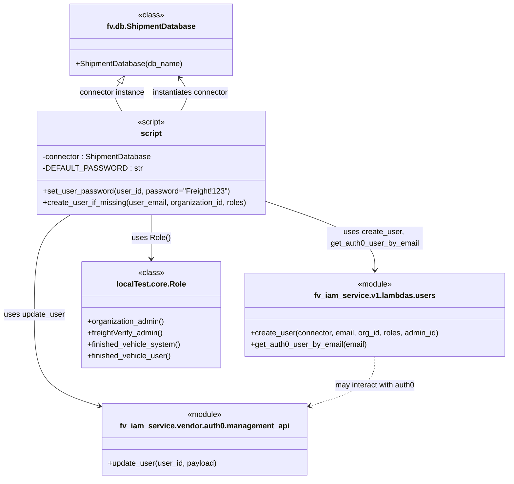

# Diagram: tools/ide_local_testing/localTest/setup/user_setup.py


> Auto-generated by Obscura crawlers

## Diagram 1



### SVG

<svg id="container" width="1054.8671875" xmlns="http://www.w3.org/2000/svg" class="classDiagram" height="1000" viewBox="0 0 1054.8671875 1000" role="graphics-document document" aria-roledescription="class"><style>#container{font-family:"trebuchet ms",verdana,arial,sans-serif;font-size:16px;fill:#333;}@keyframes edge-animation-frame{from{stroke-dashoffset:0;}}@keyframes dash{to{stroke-dashoffset:0;}}#container .edge-animation-slow{stroke-dasharray:9,5!important;stroke-dashoffset:900;animation:dash 50s linear infinite;stroke-linecap:round;}#container .edge-animation-fast{stroke-dasharray:9,5!important;stroke-dashoffset:900;animation:dash 20s linear infinite;stroke-linecap:round;}#container .error-icon{fill:#552222;}#container .error-text{fill:#552222;stroke:#552222;}#container .edge-thickness-normal{stroke-width:1px;}#container .edge-thickness-thick{stroke-width:3.5px;}#container .edge-pattern-solid{stroke-dasharray:0;}#container .edge-thickness-invisible{stroke-width:0;fill:none;}#container .edge-pattern-dashed{stroke-dasharray:3;}#container .edge-pattern-dotted{stroke-dasharray:2;}#container .marker{fill:#333333;stroke:#333333;}#container .marker.cross{stroke:#333333;}#container svg{font-family:"trebuchet ms",verdana,arial,sans-serif;font-size:16px;}#container p{margin:0;}#container g.classGroup text{fill:#9370DB;stroke:none;font-family:"trebuchet ms",verdana,arial,sans-serif;font-size:10px;}#container g.classGroup text .title{font-weight:bolder;}#container .nodeLabel,#container .edgeLabel{color:#131300;}#container .edgeLabel .label rect{fill:#ECECFF;}#container .label text{fill:#131300;}#container .labelBkg{background:#ECECFF;}#container .edgeLabel .label span{background:#ECECFF;}#container .classTitle{font-weight:bolder;}#container .node rect,#container .node circle,#container .node ellipse,#container .node polygon,#container .node path{fill:#ECECFF;stroke:#9370DB;stroke-width:1px;}#container .divider{stroke:#9370DB;stroke-width:1;}#container g.clickable{cursor:pointer;}#container g.classGroup rect{fill:#ECECFF;stroke:#9370DB;}#container g.classGroup line{stroke:#9370DB;stroke-width:1;}#container .classLabel .box{stroke:none;stroke-width:0;fill:#ECECFF;opacity:0.5;}#container .classLabel .label{fill:#9370DB;font-size:10px;}#container .relation{stroke:#333333;stroke-width:1;fill:none;}#container .dashed-line{stroke-dasharray:3;}#container .dotted-line{stroke-dasharray:1 2;}#container #compositionStart,#container .composition{fill:#333333!important;stroke:#333333!important;stroke-width:1;}#container #compositionEnd,#container .composition{fill:#333333!important;stroke:#333333!important;stroke-width:1;}#container #dependencyStart,#container .dependency{fill:#333333!important;stroke:#333333!important;stroke-width:1;}#container #dependencyStart,#container .dependency{fill:#333333!important;stroke:#333333!important;stroke-width:1;}#container #extensionStart,#container .extension{fill:transparent!important;stroke:#333333!important;stroke-width:1;}#container #extensionEnd,#container .extension{fill:transparent!important;stroke:#333333!important;stroke-width:1;}#container #aggregationStart,#container .aggregation{fill:transparent!important;stroke:#333333!important;stroke-width:1;}#container #aggregationEnd,#container .aggregation{fill:transparent!important;stroke:#333333!important;stroke-width:1;}#container #lollipopStart,#container .lollipop{fill:#ECECFF!important;stroke:#333333!important;stroke-width:1;}#container #lollipopEnd,#container .lollipop{fill:#ECECFF!important;stroke:#333333!important;stroke-width:1;}#container .edgeTerminals{font-size:11px;line-height:initial;}#container .classTitleText{text-anchor:middle;font-size:18px;fill:#333;}#container .label-icon{display:inline-block;height:1em;overflow:visible;vertical-align:-0.125em;}#container .node .label-icon path{fill:currentColor;stroke:revert;stroke-width:revert;}#container :root{--mermaid-font-family:"trebuchet ms",verdana,arial,sans-serif;}</style><g><defs><marker id="container_class-aggregationStart" class="marker aggregation class" refX="18" refY="7" markerWidth="190" markerHeight="240" orient="auto"><path d="M 18,7 L9,13 L1,7 L9,1 Z"></path></marker></defs><defs><marker id="container_class-aggregationEnd" class="marker aggregation class" refX="1" refY="7" markerWidth="20" markerHeight="28" orient="auto"><path d="M 18,7 L9,13 L1,7 L9,1 Z"></path></marker></defs><defs><marker id="container_class-extensionStart" class="marker extension class" refX="18" refY="7" markerWidth="190" markerHeight="240" orient="auto"><path d="M 1,7 L18,13 V 1 Z"></path></marker></defs><defs><marker id="container_class-extensionEnd" class="marker extension class" refX="1" refY="7" markerWidth="20" markerHeight="28" orient="auto"><path d="M 1,1 V 13 L18,7 Z"></path></marker></defs><defs><marker id="container_class-compositionStart" class="marker composition class" refX="18" refY="7" markerWidth="190" markerHeight="240" orient="auto"><path d="M 18,7 L9,13 L1,7 L9,1 Z"></path></marker></defs><defs><marker id="container_class-compositionEnd" class="marker composition class" refX="1" refY="7" markerWidth="20" markerHeight="28" orient="auto"><path d="M 18,7 L9,13 L1,7 L9,1 Z"></path></marker></defs><defs><marker id="container_class-dependencyStart" class="marker dependency class" refX="6" refY="7" markerWidth="190" markerHeight="240" orient="auto"><path d="M 5,7 L9,13 L1,7 L9,1 Z"></path></marker></defs><defs><marker id="container_class-dependencyEnd" class="marker dependency class" refX="13" refY="7" markerWidth="20" markerHeight="28" orient="auto"><path d="M 18,7 L9,13 L14,7 L9,1 Z"></path></marker></defs><defs><marker id="container_class-lollipopStart" class="marker lollipop class" refX="13" refY="7" markerWidth="190" markerHeight="240" orient="auto"><circle stroke="black" fill="transparent" cx="7" cy="7" r="6"></circle></marker></defs><defs><marker id="container_class-lollipopEnd" class="marker lollipop class" refX="1" refY="7" markerWidth="190" markerHeight="240" orient="auto"><circle stroke="black" fill="transparent" cx="7" cy="7" r="6"></circle></marker></defs><g class="root"><g class="clusters"></g><g class="edgePaths"><path d="M554.004,421.351L591.184,433.959C628.363,446.568,702.723,471.784,739.902,495.559C777.082,519.333,777.082,541.667,777.082,552.833L777.082,564" id="id_script_fv_iam_service.v1.lambdas.users_1" class="edge-thickness-normal edge-pattern-solid relation" style=";;;" data-edge="true" data-et="edge" data-id="id_script_fv_iam_service.v1.lambdas.users_1" data-points="W3sieCI6NTU0LjAwMzkwNjI1LCJ5Ijo0MjEuMzUxMzMwMTQ0MDI1MX0seyJ4Ijo3NzcuMDgyMDMxMjUsInkiOjQ5N30seyJ4Ijo3NzcuMDgyMDMxMjUsInkiOjU3MH1d" marker-end="url(#container_class-dependencyEnd)"></path><path d="M147.536,448L134.94,456.167C122.344,464.333,97.153,480.667,84.557,515.5C71.961,550.333,71.961,603.667,71.961,655C71.961,706.333,71.961,755.667,94.704,787.558C117.446,819.45,162.931,833.899,185.674,841.124L208.416,848.349" id="id_script_fv_iam_service.vendor.auth0.management_api_2" class="edge-thickness-normal edge-pattern-solid relation" style=";;;" data-edge="true" data-et="edge" data-id="id_script_fv_iam_service.vendor.auth0.management_api_2" data-points="W3sieCI6MTQ3LjUzNTkyNzU0Nzc3MDcsInkiOjQ0OH0seyJ4Ijo3MS45NjA5Mzc1LCJ5Ijo0OTd9LHsieCI6NzEuOTYwOTM3NSwieSI6NjU3fSx7IngiOjcxLjk2MDkzNzUsInkiOjgwNX0seyJ4IjoyMTQuMTM0NzY1NjI1LCJ5Ijo4NTAuMTY1MjAzMjI4NjEyMX1d" marker-end="url(#container_class-dependencyEnd)"></path><path d="M377.638,232L381.265,225.833C384.893,219.667,392.148,207.333,391.685,195.796C391.222,184.258,383.041,173.516,378.951,168.145L374.86,162.773" id="id_script_fv.db.ShipmentDatabase_3" class="edge-thickness-normal edge-pattern-solid relation" style=";;;" data-edge="true" data-et="edge" data-id="id_script_fv.db.ShipmentDatabase_3" data-points="W3sieCI6Mzc3LjYzNzkzMTAzNDQ4MjgsInkiOjIzMn0seyJ4IjozOTkuNDAyMzQzNzUsInkiOjE5NX0seyJ4IjozNzEuMjI1MjAyMjg3OTQ2NDQsInkiOjE1OH1d" marker-end="url(#container_class-dependencyEnd)"></path><path d="M314.109,448L314.109,456.167C314.109,464.333,314.109,480.667,314.109,496C314.109,511.333,314.109,525.667,314.109,532.833L314.109,540" id="id_script_localTest.core.Role_4" class="edge-thickness-normal edge-pattern-solid relation" style=";;;" data-edge="true" data-et="edge" data-id="id_script_localTest.core.Role_4" data-points="W3sieCI6MzE0LjEwOTM3NSwieSI6NDQ4fSx7IngiOjMxNC4xMDkzNzUsInkiOjQ5N30seyJ4IjozMTQuMTA5Mzc1LCJ5Ijo1NDZ9XQ==" marker-end="url(#container_class-dependencyEnd)"></path><path d="M777.082,744L777.082,754.167C777.082,764.333,777.082,784.667,754.339,802.058C731.597,819.45,686.112,833.899,663.369,841.124L640.627,848.349" id="id_fv_iam_service.v1.lambdas.users_fv_iam_service.vendor.auth0.management_api_5" class="edge-thickness-normal edge-pattern-dashed relation" style=";;;" data-edge="true" data-et="edge" data-id="id_fv_iam_service.v1.lambdas.users_fv_iam_service.vendor.auth0.management_api_5" data-points="W3sieCI6Nzc3LjA4MjAzMTI1LCJ5Ijo3NDR9LHsieCI6Nzc3LjA4MjAzMTI1LCJ5Ijo4MDV9LHsieCI6NjM0LjkwODIwMzEyNSwieSI6ODUwLjE2NTIwMzIyODYxMjF9XQ==" marker-end="url(#container_class-dependencyEnd)"></path><path d="M246.542,171.724L243.588,175.603C240.634,179.482,234.725,187.241,235.398,197.287C236.071,207.333,243.326,219.667,246.953,225.833L250.581,232" id="id_fv.db.ShipmentDatabase_script_6" class="edge-thickness-normal edge-pattern-solid relation" style=";;;" data-edge="true" data-et="edge" data-id="id_fv.db.ShipmentDatabase_script_6" data-points="W3sieCI6MjU2Ljk5MzU0NzcxMjA1MzU2LCJ5IjoxNTh9LHsieCI6MjI4LjgxNjQwNjI1LCJ5IjoxOTV9LHsieCI6MjUwLjU4MDgxODk2NTUxNzI0LCJ5IjoyMzJ9XQ==" marker-start="url(#container_class-extensionStart)"></path></g><g class="edgeLabels"><g class="edgeLabel" transform="translate(777.08203125, 497)"><g class="label" data-id="id_script_fv_iam_service.v1.lambdas.users_1" transform="translate(-100, -24)"><foreignObject width="200" height="48"><div xmlns="http://www.w3.org/1999/xhtml" class="labelBkg" style="display: table; white-space: break-spaces; line-height: 1.5; max-width: 200px; text-align: center; width: 200px;"><span class="edgeLabel"><p>uses create_user, get_auth0_user_by_email</p></span></div></foreignObject></g></g><g class="edgeLabel" transform="translate(71.9609375, 657)"><g class="label" data-id="id_script_fv_iam_service.vendor.auth0.management_api_2" transform="translate(-63.9609375, -12)"><foreignObject width="127.921875" height="24"><div xmlns="http://www.w3.org/1999/xhtml" class="labelBkg" style="display: table-cell; white-space: nowrap; line-height: 1.5; max-width: 200px; text-align: center;"><span class="edgeLabel"><p>uses update_user</p></span></div></foreignObject></g></g><g class="edgeLabel" transform="translate(398.31755, 193.57554)"><g class="label" data-id="id_script_fv.db.ShipmentDatabase_3" transform="translate(-81.4609375, -12)"><foreignObject width="162.921875" height="24"><div xmlns="http://www.w3.org/1999/xhtml" class="labelBkg" style="display: table-cell; white-space: nowrap; line-height: 1.5; max-width: 200px; text-align: center;"><span class="edgeLabel"><p>instantiates connector</p></span></div></foreignObject></g></g><g class="edgeLabel" transform="translate(314.109375, 497)"><g class="label" data-id="id_script_localTest.core.Role_4" transform="translate(-39.8515625, -12)"><foreignObject width="79.703125" height="24"><div xmlns="http://www.w3.org/1999/xhtml" class="labelBkg" style="display: table-cell; white-space: nowrap; line-height: 1.5; max-width: 200px; text-align: center;"><span class="edgeLabel"><p>uses Role()</p></span></div></foreignObject></g></g><g class="edgeLabel" transform="translate(777.08203125, 805)"><g class="label" data-id="id_fv_iam_service.v1.lambdas.users_fv_iam_service.vendor.auth0.management_api_5" transform="translate(-85.9453125, -12)"><foreignObject width="171.890625" height="24"><div xmlns="http://www.w3.org/1999/xhtml" class="labelBkg" style="display: table-cell; white-space: nowrap; line-height: 1.5; max-width: 200px; text-align: center;"><span class="edgeLabel"><p>may interact with auth0</p></span></div></foreignObject></g></g><g class="edgeLabel" transform="translate(229.9012, 193.57554)"><g class="label" data-id="id_fv.db.ShipmentDatabase_script_6" transform="translate(-69.125, -12)"><foreignObject width="138.25" height="24"><div xmlns="http://www.w3.org/1999/xhtml" class="labelBkg" style="display: table-cell; white-space: nowrap; line-height: 1.5; max-width: 200px; text-align: center;"><span class="edgeLabel"><p>connector instance</p></span></div></foreignObject></g></g></g><g class="nodes"><g class="node default" id="classId-fv_iam_service.v1.lambdas.users-0" transform="translate(777.08203125, 657)"><g class="basic label-container"><path d="M-269.78515625 -87 L269.78515625 -87 L269.78515625 87 L-269.78515625 87" stroke="none" stroke-width="0" fill="#ECECFF" style=""></path><path d="M-269.78515625 -87 C-87.04150457745234 -87, 95.70214709509531 -87, 269.78515625 -87 M-269.78515625 -87 C-132.07009006588765 -87, 5.64497611822469 -87, 269.78515625 -87 M269.78515625 -87 C269.78515625 -37.75738998942336, 269.78515625 11.485220021153282, 269.78515625 87 M269.78515625 -87 C269.78515625 -27.80095707833346, 269.78515625 31.398085843333078, 269.78515625 87 M269.78515625 87 C129.75243376551927 87, -10.280288718961458 87, -269.78515625 87 M269.78515625 87 C55.03573690284813 87, -159.71368244430374 87, -269.78515625 87 M-269.78515625 87 C-269.78515625 33.05946373670473, -269.78515625 -20.881072526590543, -269.78515625 -87 M-269.78515625 87 C-269.78515625 50.09558384772994, -269.78515625 13.191167695459882, -269.78515625 -87" stroke="#9370DB" stroke-width="1.3" fill="none" stroke-dasharray="0 0" style=""></path></g><g class="annotation-group text" transform="translate(-36.6015625, -63)"><g class="label" style="" transform="translate(0,-12)"><foreignObject width="73.203125" height="24"><div xmlns="http://www.w3.org/1999/xhtml" style="display: table-cell; white-space: nowrap; line-height: 1.5; max-width: 123px; text-align: center;"><span class="nodeLabel markdown-node-label" style=""><p>«module»</p></span></div></foreignObject></g></g><g class="label-group text" transform="translate(-118.5234375, -39)"><g class="label" style="font-weight: bolder" transform="translate(0,-12)"><foreignObject width="237.046875" height="24"><div xmlns="http://www.w3.org/1999/xhtml" style="display: table-cell; white-space: nowrap; line-height: 1.5; max-width: 284px; text-align: center;"><span class="nodeLabel markdown-node-label" style=""><p>fv_iam_service.v1.lambdas.users</p></span></div></foreignObject></g></g><g class="members-group text" transform="translate(-257.78515625, 9)"></g><g class="methods-group text" transform="translate(-257.78515625, 39)"><g class="label" style="" transform="translate(0,-12)"><foreignObject width="397.046875" height="24"><div xmlns="http://www.w3.org/1999/xhtml" style="display: table-cell; white-space: nowrap; line-height: 1.5; max-width: 454px; text-align: center;"><span class="nodeLabel markdown-node-label" style=""><p>+create_user(connector, email, org_id, roles, admin_id)</p></span></div></foreignObject></g><g class="label" style="" transform="translate(0,12)"><foreignObject width="242.765625" height="24"><div xmlns="http://www.w3.org/1999/xhtml" style="display: table-cell; white-space: nowrap; line-height: 1.5; max-width: 300px; text-align: center;"><span class="nodeLabel markdown-node-label" style=""><p>+get_auth0_user_by_email(email)</p></span></div></foreignObject></g></g><g class="divider" style=""><path d="M-269.78515625 -15 C-143.38298486849698 -15, -16.98081348699398 -15, 269.78515625 -15 M-269.78515625 -15 C-64.65374592649312 -15, 140.47766439701377 -15, 269.78515625 -15" stroke="#9370DB" stroke-width="1.3" fill="none" stroke-dasharray="0 0" style=""></path></g><g class="divider" style=""><path d="M-269.78515625 9 C-138.69984593325273 9, -7.614535616505464 9, 269.78515625 9 M-269.78515625 9 C-130.49900674192 9, 8.787142766160002 9, 269.78515625 9" stroke="#9370DB" stroke-width="1.3" fill="none" stroke-dasharray="0 0" style=""></path></g></g><g class="node default" id="classId-fv_iam_service.vendor.auth0.management_api-1" transform="translate(424.521484375, 917)"><g class="basic label-container"><path d="M-210.38671875 -75 L210.38671875 -75 L210.38671875 75 L-210.38671875 75" stroke="none" stroke-width="0" fill="#ECECFF" style=""></path><path d="M-210.38671875 -75 C-48.59042864407979 -75, 113.20586146184041 -75, 210.38671875 -75 M-210.38671875 -75 C-117.87161412658551 -75, -25.356509503171026 -75, 210.38671875 -75 M210.38671875 -75 C210.38671875 -43.53299078091456, 210.38671875 -12.065981561829119, 210.38671875 75 M210.38671875 -75 C210.38671875 -28.61409265486627, 210.38671875 17.771814690267462, 210.38671875 75 M210.38671875 75 C49.168150921307785 75, -112.05041690738443 75, -210.38671875 75 M210.38671875 75 C96.9442697370421 75, -16.49817927591579 75, -210.38671875 75 M-210.38671875 75 C-210.38671875 39.00505896927196, -210.38671875 3.010117938543914, -210.38671875 -75 M-210.38671875 75 C-210.38671875 18.64166005643169, -210.38671875 -37.71667988713662, -210.38671875 -75" stroke="#9370DB" stroke-width="1.3" fill="none" stroke-dasharray="0 0" style=""></path></g><g class="annotation-group text" transform="translate(-36.6015625, -51)"><g class="label" style="" transform="translate(0,-12)"><foreignObject width="73.203125" height="24"><div xmlns="http://www.w3.org/1999/xhtml" style="display: table-cell; white-space: nowrap; line-height: 1.5; max-width: 123px; text-align: center;"><span class="nodeLabel markdown-node-label" style=""><p>«module»</p></span></div></foreignObject></g></g><g class="label-group text" transform="translate(-169.0859375, -27)"><g class="label" style="font-weight: bolder" transform="translate(0,-12)"><foreignObject width="338.171875" height="24"><div xmlns="http://www.w3.org/1999/xhtml" style="display: table-cell; white-space: nowrap; line-height: 1.5; max-width: 385px; text-align: center;"><span class="nodeLabel markdown-node-label" style=""><p>fv_iam_service.vendor.auth0.management_api</p></span></div></foreignObject></g></g><g class="members-group text" transform="translate(-198.38671875, 21)"></g><g class="methods-group text" transform="translate(-198.38671875, 51)"><g class="label" style="" transform="translate(0,-12)"><foreignObject width="227.6875" height="24"><div xmlns="http://www.w3.org/1999/xhtml" style="display: table-cell; white-space: nowrap; line-height: 1.5; max-width: 285px; text-align: center;"><span class="nodeLabel markdown-node-label" style=""><p>+update_user(user_id, payload)</p></span></div></foreignObject></g></g><g class="divider" style=""><path d="M-210.38671875 -3 C-69.24367517152695 -3, 71.89936840694611 -3, 210.38671875 -3 M-210.38671875 -3 C-109.91235007040666 -3, -9.43798139081332 -3, 210.38671875 -3" stroke="#9370DB" stroke-width="1.3" fill="none" stroke-dasharray="0 0" style=""></path></g><g class="divider" style=""><path d="M-210.38671875 21 C-88.31801096080007 21, 33.75069682839987 21, 210.38671875 21 M-210.38671875 21 C-104.44911420214062 21, 1.488490345718759 21, 210.38671875 21" stroke="#9370DB" stroke-width="1.3" fill="none" stroke-dasharray="0 0" style=""></path></g></g><g class="node default" id="classId-fv.db.ShipmentDatabase-2" transform="translate(314.109375, 83)"><g class="basic label-container"><path d="M-167.73046875 -75 L167.73046875 -75 L167.73046875 75 L-167.73046875 75" stroke="none" stroke-width="0" fill="#ECECFF" style=""></path><path d="M-167.73046875 -75 C-43.465880522844216 -75, 80.79870770431157 -75, 167.73046875 -75 M-167.73046875 -75 C-83.00353848929872 -75, 1.7233917714025608 -75, 167.73046875 -75 M167.73046875 -75 C167.73046875 -40.68960161929039, 167.73046875 -6.379203238580786, 167.73046875 75 M167.73046875 -75 C167.73046875 -15.052100047898072, 167.73046875 44.895799904203855, 167.73046875 75 M167.73046875 75 C74.97539967231843 75, -17.779669405363137 75, -167.73046875 75 M167.73046875 75 C43.85688537359991 75, -80.01669800280018 75, -167.73046875 75 M-167.73046875 75 C-167.73046875 19.988360813071743, -167.73046875 -35.02327837385651, -167.73046875 -75 M-167.73046875 75 C-167.73046875 41.79686383306904, -167.73046875 8.59372766613808, -167.73046875 -75" stroke="#9370DB" stroke-width="1.3" fill="none" stroke-dasharray="0 0" style=""></path></g><g class="annotation-group text" transform="translate(-26.765625, -51)"><g class="label" style="" transform="translate(0,-12)"><foreignObject width="53.53125" height="24"><div xmlns="http://www.w3.org/1999/xhtml" style="display: table-cell; white-space: nowrap; line-height: 1.5; max-width: 104px; text-align: center;"><span class="nodeLabel markdown-node-label" style=""><p>«class»</p></span></div></foreignObject></g></g><g class="label-group text" transform="translate(-89.1640625, -27)"><g class="label" style="font-weight: bolder" transform="translate(0,-12)"><foreignObject width="178.328125" height="24"><div xmlns="http://www.w3.org/1999/xhtml" style="display: table-cell; white-space: nowrap; line-height: 1.5; max-width: 226px; text-align: center;"><span class="nodeLabel markdown-node-label" style=""><p>fv.db.ShipmentDatabase</p></span></div></foreignObject></g></g><g class="members-group text" transform="translate(-155.73046875, 21)"></g><g class="methods-group text" transform="translate(-155.73046875, 51)"><g class="label" style="" transform="translate(0,-12)"><foreignObject width="222.296875" height="24"><div xmlns="http://www.w3.org/1999/xhtml" style="display: table-cell; white-space: nowrap; line-height: 1.5; max-width: 280px; text-align: center;"><span class="nodeLabel markdown-node-label" style=""><p>+ShipmentDatabase(db_name)</p></span></div></foreignObject></g></g><g class="divider" style=""><path d="M-167.73046875 -3 C-99.69984213550967 -3, -31.66921552101934 -3, 167.73046875 -3 M-167.73046875 -3 C-42.774901652202814 -3, 82.18066544559437 -3, 167.73046875 -3" stroke="#9370DB" stroke-width="1.3" fill="none" stroke-dasharray="0 0" style=""></path></g><g class="divider" style=""><path d="M-167.73046875 21 C-75.51410484718325 21, 16.702259055633505 21, 167.73046875 21 M-167.73046875 21 C-61.210209261507856 21, 45.31005022698429 21, 167.73046875 21" stroke="#9370DB" stroke-width="1.3" fill="none" stroke-dasharray="0 0" style=""></path></g></g><g class="node default" id="classId-localTest.core.Role-3" transform="translate(314.109375, 657)"><g class="basic label-container"><path d="M-143.1875 -111 L143.1875 -111 L143.1875 111 L-143.1875 111" stroke="none" stroke-width="0" fill="#ECECFF" style=""></path><path d="M-143.1875 -111 C-64.6158427147482 -111, 13.955814570503605 -111, 143.1875 -111 M-143.1875 -111 C-52.21460610824661 -111, 38.75828778350677 -111, 143.1875 -111 M143.1875 -111 C143.1875 -23.351667128486355, 143.1875 64.29666574302729, 143.1875 111 M143.1875 -111 C143.1875 -65.98894755786324, 143.1875 -20.977895115726483, 143.1875 111 M143.1875 111 C77.66351367389952 111, 12.139527347799032 111, -143.1875 111 M143.1875 111 C79.78377356535663 111, 16.380047130713265 111, -143.1875 111 M-143.1875 111 C-143.1875 25.390734917086334, -143.1875 -60.21853016582733, -143.1875 -111 M-143.1875 111 C-143.1875 35.15706203857893, -143.1875 -40.68587592284214, -143.1875 -111" stroke="#9370DB" stroke-width="1.3" fill="none" stroke-dasharray="0 0" style=""></path></g><g class="annotation-group text" transform="translate(-26.765625, -87)"><g class="label" style="" transform="translate(0,-12)"><foreignObject width="53.53125" height="24"><div xmlns="http://www.w3.org/1999/xhtml" style="display: table-cell; white-space: nowrap; line-height: 1.5; max-width: 104px; text-align: center;"><span class="nodeLabel markdown-node-label" style=""><p>«class»</p></span></div></foreignObject></g></g><g class="label-group text" transform="translate(-68.40625, -63)"><g class="label" style="font-weight: bolder" transform="translate(0,-12)"><foreignObject width="136.8125" height="24"><div xmlns="http://www.w3.org/1999/xhtml" style="display: table-cell; white-space: nowrap; line-height: 1.5; max-width: 185px; text-align: center;"><span class="nodeLabel markdown-node-label" style=""><p>localTest.core.Role</p></span></div></foreignObject></g></g><g class="members-group text" transform="translate(-131.1875, -15)"></g><g class="methods-group text" transform="translate(-131.1875, 15)"><g class="label" style="" transform="translate(0,-12)"><foreignObject width="162.578125" height="24"><div xmlns="http://www.w3.org/1999/xhtml" style="display: table-cell; white-space: nowrap; line-height: 1.5; max-width: 220px; text-align: center;"><span class="nodeLabel markdown-node-label" style=""><p>+organization_admin()</p></span></div></foreignObject></g><g class="label" style="" transform="translate(0,12)"><foreignObject width="160.40625" height="24"><div xmlns="http://www.w3.org/1999/xhtml" style="display: table-cell; white-space: nowrap; line-height: 1.5; max-width: 218px; text-align: center;"><span class="nodeLabel markdown-node-label" style=""><p>+freightVerify_admin()</p></span></div></foreignObject></g><g class="label" style="" transform="translate(0,36)"><foreignObject width="193.96875" height="24"><div xmlns="http://www.w3.org/1999/xhtml" style="display: table-cell; white-space: nowrap; line-height: 1.5; max-width: 251px; text-align: center;"><span class="nodeLabel markdown-node-label" style=""><p>+finished_vehicle_system()</p></span></div></foreignObject></g><g class="label" style="" transform="translate(0,60)"><foreignObject width="174.9375" height="24"><div xmlns="http://www.w3.org/1999/xhtml" style="display: table-cell; white-space: nowrap; line-height: 1.5; max-width: 232px; text-align: center;"><span class="nodeLabel markdown-node-label" style=""><p>+finished_vehicle_user()</p></span></div></foreignObject></g></g><g class="divider" style=""><path d="M-143.1875 -39 C-62.536415803207746 -39, 18.11466839358451 -39, 143.1875 -39 M-143.1875 -39 C-68.78794676895656 -39, 5.611606462086883 -39, 143.1875 -39" stroke="#9370DB" stroke-width="1.3" fill="none" stroke-dasharray="0 0" style=""></path></g><g class="divider" style=""><path d="M-143.1875 -15 C-85.50541856022737 -15, -27.823337120454738 -15, 143.1875 -15 M-143.1875 -15 C-72.93962907300038 -15, -2.691758146000751 -15, 143.1875 -15" stroke="#9370DB" stroke-width="1.3" fill="none" stroke-dasharray="0 0" style=""></path></g></g><g class="node default" id="classId-script-4" transform="translate(314.109375, 340)"><g class="basic label-container"><path d="M-239.89453125 -108 L239.89453125 -108 L239.89453125 108 L-239.89453125 108" stroke="none" stroke-width="0" fill="#ECECFF" style=""></path><path d="M-239.89453125 -108 C-62.37486427405082 -108, 115.14480270189836 -108, 239.89453125 -108 M-239.89453125 -108 C-105.31346421425818 -108, 29.26760282148365 -108, 239.89453125 -108 M239.89453125 -108 C239.89453125 -61.41853566332883, 239.89453125 -14.837071326657664, 239.89453125 108 M239.89453125 -108 C239.89453125 -44.25372235377162, 239.89453125 19.492555292456757, 239.89453125 108 M239.89453125 108 C138.1813164046529 108, 36.46810155930581 108, -239.89453125 108 M239.89453125 108 C64.6101134726506 108, -110.67430430469881 108, -239.89453125 108 M-239.89453125 108 C-239.89453125 47.769977296790174, -239.89453125 -12.460045406419653, -239.89453125 -108 M-239.89453125 108 C-239.89453125 47.46731885829073, -239.89453125 -13.065362283418537, -239.89453125 -108" stroke="#9370DB" stroke-width="1.3" fill="none" stroke-dasharray="0 0" style=""></path></g><g class="annotation-group text" transform="translate(-29.6796875, -84)"><g class="label" style="" transform="translate(0,-12)"><foreignObject width="59.359375" height="24"><div xmlns="http://www.w3.org/1999/xhtml" style="display: table-cell; white-space: nowrap; line-height: 1.5; max-width: 109px; text-align: center;"><span class="nodeLabel markdown-node-label" style=""><p>«script»</p></span></div></foreignObject></g></g><g class="label-group text" transform="translate(-21.03125, -60)"><g class="label" style="font-weight: bolder" transform="translate(0,-12)"><foreignObject width="42.0625" height="24"><div xmlns="http://www.w3.org/1999/xhtml" style="display: table-cell; white-space: nowrap; line-height: 1.5; max-width: 91px; text-align: center;"><span class="nodeLabel markdown-node-label" style=""><p>script</p></span></div></foreignObject></g></g><g class="members-group text" transform="translate(-227.89453125, -12)"><g class="label" style="" transform="translate(0,-12)"><foreignObject width="228.609375" height="24"><div xmlns="http://www.w3.org/1999/xhtml" style="display: table-cell; white-space: nowrap; line-height: 1.5; max-width: 286px; text-align: center;"><span class="nodeLabel markdown-node-label" style=""><p>-connector : ShipmentDatabase</p></span></div></foreignObject></g><g class="label" style="" transform="translate(0,12)"><foreignObject width="185.015625" height="24"><div xmlns="http://www.w3.org/1999/xhtml" style="display: table-cell; white-space: nowrap; line-height: 1.5; max-width: 243px; text-align: center;"><span class="nodeLabel markdown-node-label" style=""><p>-DEFAULT_PASSWORD : str</p></span></div></foreignObject></g></g><g class="methods-group text" transform="translate(-227.89453125, 60)"><g class="label" style="" transform="translate(0,-12)"><foreignObject width="382.34375" height="24"><div xmlns="http://www.w3.org/1999/xhtml" style="display: table-cell; white-space: nowrap; line-height: 1.5; max-width: 440px; text-align: center;"><span class="nodeLabel markdown-node-label" style=""><p>+set_user_password(user_id, password="Freight!123")</p></span></div></foreignObject></g><g class="label" style="" transform="translate(0,12)"><foreignObject width="426.109375" height="24"><div xmlns="http://www.w3.org/1999/xhtml" style="display: table-cell; white-space: nowrap; line-height: 1.5; max-width: 483px; text-align: center;"><span class="nodeLabel markdown-node-label" style=""><p>+create_user_if_missing(user_email, organization_id, roles)</p></span></div></foreignObject></g></g><g class="divider" style=""><path d="M-239.89453125 -36 C-143.82220276336594 -36, -47.74987427673187 -36, 239.89453125 -36 M-239.89453125 -36 C-91.68859110408764 -36, 56.51734904182473 -36, 239.89453125 -36" stroke="#9370DB" stroke-width="1.3" fill="none" stroke-dasharray="0 0" style=""></path></g><g class="divider" style=""><path d="M-239.89453125 36 C-121.88411163826825 36, -3.873692026536503 36, 239.89453125 36 M-239.89453125 36 C-66.89501159756676 36, 106.10450805486647 36, 239.89453125 36" stroke="#9370DB" stroke-width="1.3" fill="none" stroke-dasharray="0 0" style=""></path></g></g></g></g></g></svg>

## Diagram 2

```mermaid
flowchart LR
Start([Start]) --> CreateCalls{Create users for\n3 test emails}
CreateCalls --> FVAdmin[create_user_if_missing(test_fv_admin_email)]
CreateCalls --> ShipperAdmin[create_user_if_missing(test_shipper_admin_email)]
CreateCalls --> CarrierAdmin[create_user_if_missing(test_carrier_admin_email)]
subgraph create_user_if_missing_flow [create_user_if_missing(email, org_id, roles)]
  direction TB
  CheckUser[get_auth0_user_by_email(email)]
  CheckUser --> |found| SetPwdExisting[set_user_password(user_id)]
  CheckUser --> |not found| CreateUser[create_user(connector, email, org_id, roles, fv_admin_auth0_id)]
  CreateUser --> SetPwdNew[set_user_password(user_id)]
  SetPwdExisting --> Return[return user_id, user]
  SetPwdNew --> Return
end
FVAdmin --> create_user_if_missing_flow
ShipperAdmin --> create_user_if_missing_flow
CarrierAdmin --> create_user_if_missing_flow
SetPwdExisting --> Auth0Update[management_api.update_user(user_id, payload)]
SetPwdNew --> Auth0Update
Auth0Update --> End([End])
```

> SVG rendering failed for this diagram.
